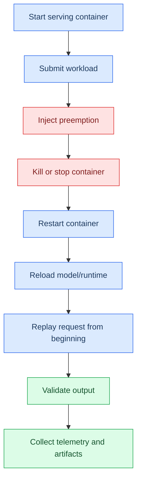
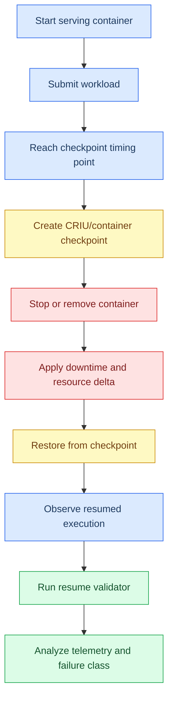
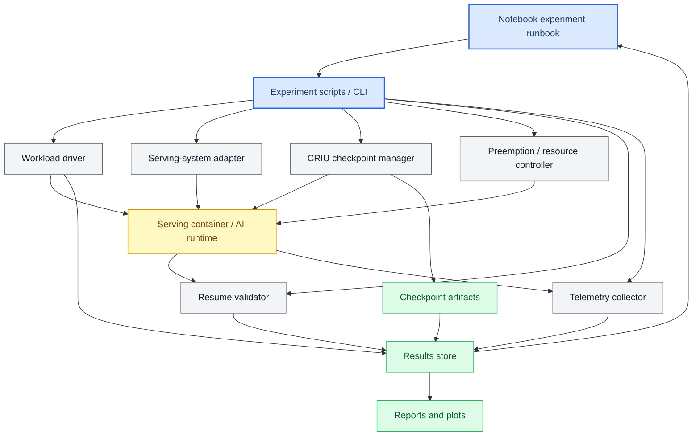
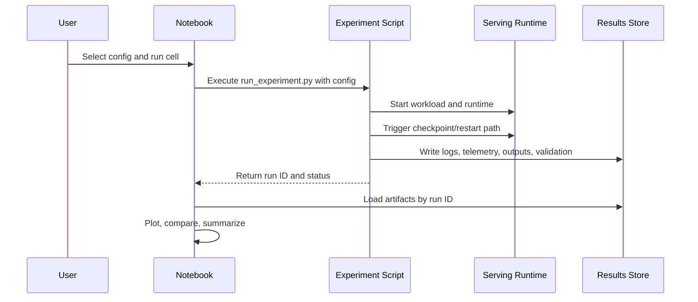
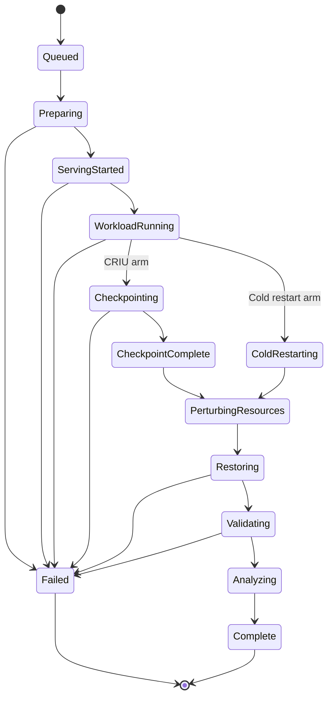
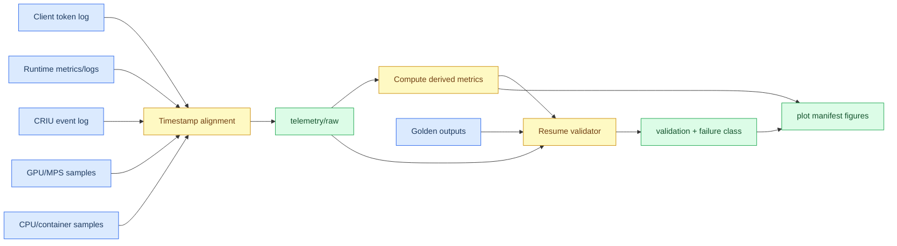
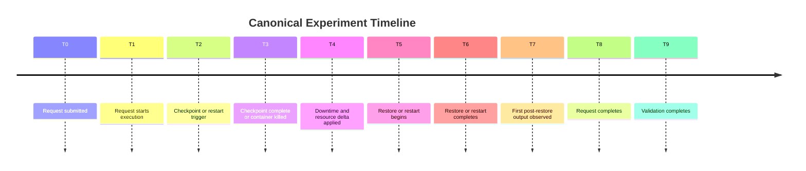

# AI Runtime Experiment Planning

This is the living planning document for the AI runtime checkpoint-resume experiment. It records current decisions, architecture, experiment scope, and future implementation notes. The goal is to keep design decisions in one place so a detailed implementation plan can be derived later.

## 🧭 Current Study Scope

The current study focuses on **container-level checkpoint-resume for AI inference workloads under preemption and resource reconfiguration**.

The study intentionally excludes a custom application-level checkpoint/recovery layer for now. Application-level instrumentation is still allowed for validation and telemetry, but it must not be used as the recovery mechanism in the main experiment arms.

| Included | Excluded for now |
| --- | --- |
| Cold restart baseline | Custom application-level checkpoint coordinator |
| CRIU/container checkpoint-resume | Runtime-specific logical state checkpointing |
| Resume validation | Generic request-progress recovery schema |
| Telemetry and analysis pipeline | Logical intermediate-state checkpointing as a recovery path |
| Resource-delta sweeps | Oracle/perfect intermediate-state resume arm |
| Workload-class sweeps | Cross-runtime application checkpoint adapters |

## 🎯 Research Questions

Primary research question:

> Can CRIU/container checkpointing preserve enough process, runtime, and GPU state for AI inference workloads to resume correctly under preemption and changed resource budgets?

Secondary research questions:

1. When does CRIU/container checkpoint-restore work for AI inference containers?
2. When does it fail, and what failure classes appear?
3. Are failures caused by CUDA state, GPU memory, runtime workers, sockets, MPS/MIG bindings, or changed resources?
4. Does restored execution truly continue prior work, or does it silently replay from the beginning?
5. How does CRIU/container checkpointing compare with cold restart in latency, correctness, checkpoint size, and runtime overhead?

## 🧪 Experiment Arms

| Arm | Recovery mechanism | Saved state | Expected role |
| --- | --- | --- | --- |
| Cold restart | Restart container and replay from beginning | Nothing | Lower baseline for recovery cost |
| CRIU/container checkpoint | Checkpoint and restore container/process state | Linux/container/process state, and possibly runtime/GPU state if supported | Main experimental mechanism |

### Cold restart baseline

Cold restart saves no state. The container is terminated, restarted, and the request is replayed from the beginning.



### CRIU/container checkpoint-resume

CRIU/container checkpointing attempts to preserve container/process state. The experiment then tests whether CUDA/runtime state survives and whether resumed execution truly continues prior work.



## 🏗️ Architecture Blueprint

The architecture is organized around a notebook-driven experiment control surface backed by scripts, adapters, telemetry collectors, validators, and persistent result artifacts.



### Component responsibilities

| Component | Responsibility |
| --- | --- |
| Notebook experiment runbook | Human-facing control, run orchestration, monitoring, result loading, plotting, and notes |
| Experiment scripts / CLI | Reproducible execution layer called by notebooks and batch jobs |
| Workload driver | Generates requests and records request/output traces |
| Serving-system adapter | Starts, stops, configures, and observes each serving runtime |
| CRIU checkpoint manager | Creates/restores container checkpoints and records checkpoint metadata |
| Preemption/resource controller | Injects preemption, downtime, CPU changes, compute-share changes, and memory/VRAM changes |
| Resume validator | Checks whether resumed execution truly continues prior work |
| Telemetry collector | Captures request, runtime, GPU, CPU, container, and timeline metrics |
| Results store | Persists all configs, logs, telemetry, validation, checkpoint artifacts, and reports |

## 📓 Notebook-Driven Control Plan

The notebook is the primary research interface. It should control experiments and collect results, but it should not contain heavy implementation logic.

### Notebook responsibilities

- Load and display experiment configs.
- Launch experiment scripts.
- Monitor run status and logs.
- Load telemetry artifacts.
- Run or display validation results.
- Generate plots and summaries.
- Record observations and implementation decisions.

### Script/file responsibilities

- CRIU checkpoint and restore commands.
- Container lifecycle management.
- Resource perturbation.
- Workload generation.
- Telemetry collection.
- Resume validation.
- Artifact writing.

### Notebook pattern



### Proposed notebook layout

```text
notebooks/
  01_llm_runtime_criu.ipynb
  02_translation_runtime_criu.ipynb
  03_diffusion_runtime_criu.ipynb
  04_streaming_asr_runtime_criu.ipynb
  05_vision_segmentation_runtime_criu.ipynb
  06_super_resolution_runtime_criu.ipynb
  07_pose_estimation_runtime_criu.ipynb
  08_volume_rendering_runtime_criu.ipynb
  09_compare_all_results.ipynb
```

Each runtime notebook should follow the same structure:

1. Load config.
2. Detect hardware/software environment or load a previously captured environment snapshot.
3. Start experiment run through scripts/files, not inline notebook logic.
4. Start telemetry collection and verify `telemetry/raw/` schema output.
5. Monitor phases and checkpoint/restore events.
6. Load raw telemetry, workload logs, and validation outputs.
7. Compute derived metrics from raw artifacts.
8. Generate plot-manifest-driven figures in PNG and PDF.
9. Compare cold restart vs CRIU for the selected runtime.
10. Record observations, anomalies, and implementation decisions.

## 🔁 Experiment Lifecycle

Every experiment run should follow a consistent state machine.



## 📊 Sweep Dimensions

The experiment sweeps checkpoint timing, preemption rate, downtime, resource delta, and workload class.

| Sweep dimension | Values to explore | Why it matters |
| --- | --- | --- |
| Checkpoint timing | before model load, after model load idle, after request admission, preprocessing, active inference, partial output emitted, near completion | CUDA/runtime state may behave differently depending on when checkpoint occurs |
| Preemption schedule/rate | none, static interval, stochastic dynamic rate, bursty, adversarial, file-driven trace | Measures robustness and overhead under different interruption patterns |
| Downtime | immediate, seconds, minutes, longer interval | Tests checkpoint validity and resource reacquisition behavior |
| CPU delta | CPU quota, core count, affinity, container memory | Stresses CPU-side runtime, preprocessing, and process restore |
| SM/compute-share delta | MPS share, compute share, GPU assignment, MIG slice | Stresses GPU scheduling and runtime assumptions |
| Memory/VRAM delta | container memory, GPU memory availability, MIG memory slice | Stresses model residency, allocator state, and checkpoint restore feasibility |
| Workload class | LLM, translation, diffusion, ASR, segmentation, super-resolution, pose, volume rendering | Tests whether CRIU behavior varies by AI architecture and runtime state pattern |

### Preemption schedule and rate model

Preemption must be represented as an explicit schedule, not only as a vague label. Each run should use one configured preemption policy that generates one or more preemption events inside the experiment horizon.

A preemption event is the unit that triggers the perturbation sequence:

```text
preemption_event = checkpoint_trigger -> checkpoint_or_kill -> downtime -> resource_delta -> restore_or_restart -> validation
```



```mermaid
flowchart LR
    accTitle: Preemption Policy Flow
    accDescr: Preemption policies generate event timestamps. Each timestamp triggers checkpoint or cold restart, downtime, resource changes, restore or restart, and validation.

    policy["Preemption policy"] --> schedule["Generated event timestamps"]
    trace["Trace file"] --> schedule
    schedule --> event["Preemption event"]
    event --> checkpoint["Checkpoint or kill"]
    checkpoint --> downtime["Downtime"]
    downtime --> resource["Resource delta"]
    resource --> restore["Restore or restart"]
    restore --> validate["Validate continuation"]

    classDef source fill:#dbeafe,stroke:#2563eb,stroke-width:1px,color:#1e3a5f
    classDef process fill:#fef9c3,stroke:#ca8a04,stroke-width:1px,color:#713f12
    classDef output fill:#dcfce7,stroke:#16a34a,stroke-width:1px,color:#14532d

    class policy,trace source
    class schedule,event,checkpoint,downtime,resource,restore process
    class validate output
```

Supported preemption policies:

| Policy | Meaning | Config fields | Use case |
| --- | --- | --- | --- |
| `none` | No preemption events | none | No-preemption baseline |
| `single_at_time` | One event at a fixed timestamp | `event_time_s` | Simple controlled experiment |
| `single_at_progress` | One event when workload reaches a progress marker | `progress_metric`, `progress_value` | Checkpoint after N tokens or after model load |
| `static_interval` | Events every fixed interval | `start_after_s`, `interval_s`, `max_events` | Regular preemption pressure |
| `poisson_rate` | Inter-arrival times sampled from an exponential distribution | `lambda_per_min`, `seed`, `max_events` | Memoryless random preemption process |
| `sampled_distribution` | Inter-arrival times sampled from a named distribution | `distribution`, `params`, `seed`, `max_events` | Dynamic workload- or lease-driven preemption |
| `bursty` | Clusters of preemptions separated by quiet periods | `burst_count`, `events_per_burst`, `intra_burst_interval_s`, `quiet_interval_s` | Stress recovery under repeated interruptions |
| `adversarial` | Event chosen to hit a sensitive phase | `target_phase`, `offset_s` | Tests worst-case behavior |
| `trace_file` | Event timestamps read from a file | `path`, `time_column`, `time_unit` | Replay real or synthetic lease/preemption traces |

Example config:

```yaml
preemption_policy:
  mode: poisson_rate
  lambda_per_min: 0.5
  seed: 1234
  max_events: 3
  horizon_s: 600
```

Trace-file config:

```yaml
preemption_policy:
  mode: trace_file
  path: traces/preemption_points.csv
  time_column: event_time_s
  time_unit: seconds
```

Trace-file schema:

```csv
event_id,event_time_s,checkpoint_timing,downtime_s,cpu_after,mps_after,vram_after_gb
p001,120.0,active_inference,10,4,50,16
p002,300.0,active_inference,20,4,30,12
```

Rules for preemption schedule generation:

- All generated event timestamps must be written to `preemption_schedule.json` before the run starts.
- Random policies must record the random seed and sampled timestamps.
- If a sampled event occurs when no workload episode is active, the run should either skip the event or classify it as `preemption_without_active_episode`; this behavior must be configured.
- If multiple events overlap, the controller should either queue them or drop later events according to `overlap_policy`.
- For the first LLM pilot, prefer `single_at_progress` after N emitted tokens and `static_interval` for repeated experiments.

Preemption schedule artifact:

```json
{
  "run_id": "run_001",
  "policy": "single_at_progress",
  "seed": 1234,
  "events": [
    {
      "event_id": "p001",
      "trigger_type": "progress",
      "trigger": {"metric": "emitted_tokens", "value": 64},
      "checkpoint_timing": "active_inference",
      "downtime_s": 10,
      "resource_delta": {"mps_after": 50}
    }
  ]
}
```

## 🧩 Workload Classes and Episode Units

Each workload must define the **episode unit** that the experiment treats as one measurable serving episode. The episode is the object that receives a request ID, can be interrupted, and is validated after restore/restart.

For the first pilot, the episode unit is one LLM generation request. Later workload classes should keep the same experiment vocabulary.

| Workload class | Runtime examples | Episode unit | Progress unit | Important validation marker |
| --- | --- | --- | --- | --- |
| LLM / autoregressive decoding | vLLM, SGLang, TGI | One generation request for one prompt | Output token index | token count, emitted prefix, final text |
| Translation / encoder-decoder | CTranslate2, TGI, custom runtime | One translation request for one source segment/document | Decoded target token index or segment index | decoded token index, translated prefix |
| Diffusion | Diffusers, TensorRT, Triton | One image generation request | Denoising step index | denoising step, image similarity/final output |
| Streaming ASR | Whisper, faster-whisper, sherpa-onnx | One audio stream/session | Audio chunk index or sample offset | audio chunk offset, partial transcript |
| Image segmentation | Triton, ONNX Runtime, TensorRT | One image or one tiled image request | Tile index or pipeline stage | tile/request progress, mask equality |
| Super-resolution | Real-ESRGAN, Triton, TensorRT | One image upscale request | Tile index | tile completion, output image similarity |
| Pose estimation | RTMPose, ONNX Runtime, TensorRT | One frame or short video-window request | Frame index or stage index | frame/stage progress, keypoint consistency |
| Volume rendering | CUDA/native renderer, tiny-cuda-nn | One camera/view render request | Ray-batch index | ray-batch progress, rendered image consistency |

Episode-level fields to store in `request_events.jsonl`:

| Field | Meaning |
| --- | --- |
| `episode_id` | Stable ID for one workload episode |
| `episode_type` | Workload class, e.g. `llm_generation` |
| `request_id` | Serving request ID, if separate from episode ID |
| `episode_start_ts` | Start time |
| `episode_end_ts` | Completion or failure time |
| `progress_unit` | Token, chunk, tile, frame, denoising step, or ray batch |
| `progress_before_preemption` | Last observed progress marker before checkpoint/kill |
| `progress_after_restore` | First observed progress marker after restore/restart |
| `episode_outcome` | Success/failure/replay/corruption classification |

## ✅ Resume Validator

The resume validator checks whether restored execution truly continues prior work rather than silently replaying from scratch.

### Validation checks

| Check | Description |
| --- | --- |
| Request continuity | Same request ID, model/config, input hash, and run ID |
| Progress continuity | Post-restore progress should not reset unexpectedly |
| Output continuity | No duplicate, missing, or corrupted output chunks |
| Replay detection | Detects whether output/runtime work restarts from the beginning |
| Runtime health | Checks logs, process health, CUDA errors, and hang/deadlock behavior |
| Failure classification | Converts raw outcomes into publishable failure categories |

### Failure classes

| Class | Meaning |
| --- | --- |
| restored_correctly | Execution continues and output is valid |
| restored_but_replayed | Container restored, but workload restarted from beginning |
| duplicated_output | Resumed output repeats already emitted content |
| missing_output | Resumed output skips expected content |
| corrupted_output | Output is invalid or fails correctness check |
| runtime_failed | Container restored but serving runtime crashed |
| cuda_failed | CUDA/GPU state became invalid after restore |
| hung_after_restore | Restore completed but request never progressed |
| resource_incompatible | New resource budget cannot support restored state |
| restore_failed | CRIU/container restore itself failed |

## 📡 Telemetry and Analysis Pipeline

Telemetry must capture request-level, runtime-level, GPU-level, CPU/container-level, and perturbation timeline metrics.

### Minimum metrics to collect

The first prototype should collect a small but complete set of metrics that can prove both **resume correctness** and **systems overhead**. Later runs can add higher-frequency engine telemetry.

| Metric group | Required metrics | Purpose |
| --- | --- | --- |
| Run metadata | run ID, runtime, model, GPU name, driver/CUDA versions, Docker version, MPS settings, arm, seed | Reproducibility and hardware context |
| Request metrics | request ID, prompt tokens, generated tokens, submit time, first-token time, completion time, total latency, tokens/sec | Request-level performance |
| Resume validation metrics | pre-checkpoint token count, post-restore first token index, emitted-token log hash, duplicate/missing output flags, final output hash, baseline match | Detect true resume vs replay/corruption |
| Checkpoint metrics | checkpoint start/end, checkpoint duration, checkpoint size, CRIU exit code, CRIU error summary, process count checkpointed | CRIU overhead and failure diagnosis |
| Restore metrics | restore start/end, restore duration, restore exit code, runtime alive after restore, first post-restore output time, recovery latency | Restore overhead and recovery behavior |
| Runtime metrics | model load time, engine init time, queue length, active requests, KV/cache pressure if exposed, runtime logs, scheduler/preemption logs | Runtime behavior before and after checkpoint |
| GPU metrics | GPU utilization, VRAM used/total, process GPU memory, MPS server status, memory utilization, CUDA errors | Hardware-level checkpoint/restore effects |
| CPU/container metrics | CPU utilization, RSS, cgroup CPU quota, cgroup memory limit, PID tree, open file descriptor count, Docker events | Container/process continuity and resource limits |
| Timeline events | request submitted, first token, checkpoint triggered, checkpoint complete, resource delta applied, restore started, restore complete, first post-restore output, validation complete | Post-run reconstruction and plotting |

### Runtime-specific metric hooks

For the LLM pilot, the first two runtimes are **vLLM** and **SGLang**.

| Runtime | Built-in signals to use | External signals still needed |
| --- | --- | --- |
| vLLM | Prometheus metrics, OpenTelemetry traces, KV/cache metrics if enabled, MFU metrics if enabled, runtime logs, suspend/resume endpoints if available | NVML/DCGM/nvidia-smi GPU samples, Docker events, CRIU logs, MPS state |
| SGLang | Prometheus metrics with `--enable-metrics`, optional MFU metrics, scheduler/KV/cache gauges, request latency histograms, runtime logs | NVML/DCGM/nvidia-smi GPU samples, Docker events, CRIU logs, MPS state |

Notes:

- vLLM has documented observability support through Prometheus and OpenTelemetry, and recent suspend/resume work for CRIU/cuda-checkpoint-style flows. This should be treated as runtime-specific support, not a generic guarantee.
- SGLang exposes rich Prometheus metrics and scheduler/KV/cache-related gauges, but no confirmed generic CRIU-safe suspend/resume interface is assumed at this stage.
- Prometheus is useful for aggregate monitoring, but high-frequency decode-iteration timing may require runtime push traces, OpenTelemetry, or custom logging.
- Hardware truth should come from driver-level sources such as NVML, DCGM, or `nvidia-smi`, especially for MPS and VRAM behavior.

### Raw Metrics — schema, sampling, and file contracts

Raw telemetry should be stored in two complementary forms:

1. **Event stream**: append-only `timeline.jsonl` and workload output logs for exact event ordering.
2. **Sampled time series**: CSV or Parquet tables for GPU, CPU, container, and runtime metrics.

Canonical storage targets:

```text
telemetry/raw/
  request_events.jsonl
  token_events.jsonl
  runtime_events.jsonl
  gpu_samples.csv
  cpu_samples.csv
  container_samples.csv
  criu_events.jsonl
  mps_samples.csv
```

Use snake_case field names and explicit units.

| Field | Type | Unit | Applies to | Notes |
| --- | --- | --- | --- | --- |
| run_id | string | none | all records | Join key across all artifacts |
| runtime | string | none | all records | `vllm` or `sglang` for the pilot |
| arm | string | none | all records | `cold_restart` or `criu_container_checkpoint` |
| timestamp_utc | string | ISO-8601 | all records | Wall-clock placement |
| monotonic_ns | int | ns | all records | Duration-safe timestamp |
| event_type | string | none | event rows | Examples: `request_submit`, `first_token`, `checkpoint_start`, `restore_end` |
| request_id | string | none | request/token rows | Stable request identifier |
| token_index | int | token index | token rows | Required for replay detection |
| token_id | int/string | token ID | token rows | Preferred over text for exact equality |
| token_text | string | text | token rows | Optional, useful for debugging |
| ttft_s | float | seconds | request rows | Time to first token |
| tpot_s | float | seconds/token | request rows | Mean time per output token after first token |
| inter_token_latency_s | float | seconds | token rows | Per-token emission gap |
| throughput_tokens_per_s | float | tokens/s | request/window rows | Workload throughput |
| gpu_util_pct | float | percent | GPU samples | Driver-level value when possible |
| sm_util_pct | float | percent | GPU samples | Use DCGM/CUPTI if available; otherwise document absence |
| vram_used_bytes | int | bytes | GPU samples | Total GPU memory used |
| process_gpu_memory_bytes | int | bytes | GPU process samples | Per serving process if available |
| gpu_memory_util_pct | float | percent | GPU samples | Memory controller utilization if available |
| memory_bandwidth_bytes_per_s | float | bytes/s | GPU samples | DCGM/CUPTI preferred; `nvidia-smi` if available |
| pcie_rx_bytes_per_s | float | bytes/s | GPU samples | Useful during checkpoint/restore I/O |
| pcie_tx_bytes_per_s | float | bytes/s | GPU samples | Useful during checkpoint/restore I/O |
| power_watts | float | watts | GPU samples | Optional overhead signal |
| mps_active_thread_pct | float | percent | MPS samples | Configured MPS compute share |
| mps_server_pid | int | PID | MPS samples | MPS server tracking |
| cpu_util_pct | float | percent | CPU samples | Container or process scope must be stated |
| rss_bytes | int | bytes | CPU/container samples | Resident memory |
| container_memory_bytes | int | bytes | container samples | cgroup memory usage |
| cgroup_cpu_quota | int | quota units | container samples | Resource setting |
| open_fd_count | int | count | process samples | CRIU/process-state clue |
| criu_exit_code | int | none | CRIU rows | Checkpoint/restore result |
| checkpoint_size_bytes | int | bytes | CRIU rows | Size of checkpoint images |
| measurement_source | string | none | all metric rows | `nvml`, `dcgm`, `nvidia-smi`, `prometheus`, `otel`, `runtime_log`, `criu_log` |

Recommended sampling rates:

| Signal type | Recommended sampling | Reason |
| --- | --- | --- |
| Token events | Every emitted token | Required for TTFT, TPOT, replay detection, and token continuity |
| Request events | Every request lifecycle event | Required for latency and validation |
| Checkpoint/restore events | Event-triggered | Required for exact phase boundaries |
| GPU utilization/VRAM | 100–250 ms during checkpoint windows; 500–1000 ms otherwise | Captures short restore and decode bursts |
| Memory bandwidth/PCIe | 250–1000 ms, depending on available tooling | Captures checkpoint image and memory-transfer pressure |
| CPU/container metrics | 250–1000 ms | Captures CRIU CPU/RSS/I/O effects |
| Runtime metrics | Prometheus/OTel cadence plus structured runtime logs | Captures queue, cache pressure, and runtime health |

### Workload metrics for LLM serving

| Metric | Definition | Why it matters |
| --- | --- | --- |
| TTFT | `first_token_ts - request_submit_ts` | User-visible responsiveness and cold/restore penalty |
| TPOT | Mean time per output token after the first token | Decode speed under resource changes |
| Inter-token latency | `token_i_ts - token_(i-1)_ts` | Jitter and degraded decode behavior |
| Request throughput | Completed requests per second | Service-level progress |
| Token throughput | Generated tokens per second | LLM serving throughput |
| Output exact match | Generated token sequence equals golden sequence | Correctness under deterministic config |
| Token-prefix continuity | Pre-checkpoint prefix remains intact after restore | Detects corruption or request mismatch |
| Replay flag | First post-restore token index resets or duplicates previous tokens | Detects silent replay |
| Forward-progress flag | Tokens continue after restore without restart | Main progress outcome |
| Failure class | Validator classification | Root-cause reporting |

### Derived Metrics — definitions, formulas, and units

Derived metrics should be computed from raw artifacts and saved under `telemetry/derived/`.

```text
telemetry/derived/
  derived_metrics.json
  derived_metrics.csv
  per_request_metrics.csv
  per_window_metrics.csv
```

| Derived metric | Formula | Unit | Question answered |
| --- | --- | --- | --- |
| `checkpoint_duration_s` | `checkpoint_end_ts - checkpoint_start_ts` | seconds | How long does checkpointing pause or burden the system? |
| `restore_duration_s` | `restore_end_ts - restore_start_ts` | seconds | How long does CRIU restore take? |
| `downtime_s` | `restore_start_ts - checkpoint_end_ts` or configured downtime | seconds | How long was the container unavailable? |
| `recovery_latency_s` | `first_post_restore_output_ts - restore_end_ts` | seconds | How fast does useful output resume after restore? |
| `ttft_s` | `first_token_ts - request_submit_ts` | seconds | User-visible first-token latency |
| `tpot_s` | `(last_token_ts - first_token_ts) / max(generated_tokens - 1, 1)` | seconds/token | Decode speed excluding first-token setup |
| `inter_token_jitter_s` | stddev of inter-token latency | seconds | Token-stream stability |
| `tokens_per_second` | `generated_tokens / active_decode_time_s` | tokens/s | Throughput during active serving |
| `active_tokens_per_second` | `generated_tokens / (wall_time_s - downtime_s)` | tokens/s | Throughput excluding true downtime |
| `throughput_degradation_pct` | `(baseline_tps - observed_tps) / baseline_tps * 100` | percent | How much does preemption degrade throughput? |
| `ttft_degradation_pct` | `(observed_ttft - baseline_ttft) / baseline_ttft * 100` | percent | How much does preemption hurt responsiveness? |
| `forward_progress_ratio` | `post_restore_new_tokens / expected_post_restore_tokens` | ratio | Did useful work continue after restore? |
| `token_continuity_flag` | `first_post_restore_token_index == pre_checkpoint_token_count + 1` | boolean | Did execution continue from the right point? |
| `replay_detected` | duplicate prefix or token index reset | boolean | Did the workload silently restart? |
| `gpu_vram_delta_bytes` | `vram_after_restore - vram_before_checkpoint` | bytes | Did restore change VRAM residency? |
| `peak_vram_pressure` | `max(vram_used_bytes) / total_vram_bytes` | ratio | How close is the run to the VRAM envelope? |
| `checkpoint_io_rate_bytes_per_s` | `checkpoint_size_bytes / checkpoint_duration_s` | bytes/s | Is checkpoint I/O a bottleneck? |
| `restore_efficiency_ratio` | `cold_restart_recovery_s / criu_recovery_s` | ratio | How much faster is CRIU than cold restart? |
| `success_rate` | `restored_correctly_runs / total_runs` | ratio | How robust is the method? |
| `failure_rate_by_class` | count per failure class / total | ratio | Which failure modes dominate? |
| `recovery_slope_tokens_per_s2` | slope of throughput after restore | tokens/s² | How quickly does throughput recover? |

### True-value collection under preemption

The true value for correctness should come from deterministic golden runs, not from the restored run itself.

Golden-run policy for the LLM pilot:

1. For each `(runtime, model, prompt_set, launch_config)`, run no-preemption deterministic baseline runs.
2. Use `temperature: 0` where possible. If sampling is required, use a fixed seed and record it.
3. Store emitted token IDs, token text, token timestamps, final output, and hashes.
4. Treat exact token sequence equality as the default correctness criterion for the first LLM pilot.
5. Keep stochastic/tolerant validation out of the first prototype unless explicitly added later.

Canonical golden artifacts:

```text
workload/golden/
  golden_manifest.yaml
  expected_outputs.jsonl
```

Golden output schema:

```json
{
  "runtime": "vllm",
  "model": "example-model",
  "prompt_set_id": "long_decode_v1",
  "request_id": "golden_001",
  "prompt_hash": "sha256:...",
  "sampling": {"temperature": 0, "seed": 1234},
  "token_ids": [1, 2, 3],
  "token_texts": ["..."],
  "final_output_hash": "sha256:...",
  "runtime_version": "...",
  "container_image_digest": "...",
  "model_artifact_hash": "sha256:..."
}
```

### Collection mechanism for true metrics during preemption

Metric collection must distinguish **pause/downtime** from **degraded forward progress**. A run can appear slow because the container is paused, or because the restored runtime is alive but degraded.



Collection rules:

| Rule | Design choice |
| --- | --- |
| Clocking | Record both wall-clock UTC and monotonic timestamps. Use monotonic time for durations. |
| Event correlation | All records include `run_id`; request/token records include `request_id`; event rows include `event_type`. |
| Pre-checkpoint baseline window | Collect at least 60 seconds where possible, or a fixed number of decode tokens for short runs. |
| Checkpoint window | Mark `checkpoint_start`, `checkpoint_end`, `restore_start`, `restore_end`, and MPS reconfiguration events. |
| Downtime exclusion | Exclude true paused/unavailable downtime from active throughput denominators, but report downtime separately. |
| Degraded-service inclusion | Include periods where the system emits tokens slowly; this is degradation, not downtime. |
| GPU sampling | Use 100–250 ms sampling around checkpoint/restore; lower frequency is acceptable outside perturbation windows. |
| Runtime metrics | Use Prometheus/OTel/runtime logs as supporting signals; client token logs are the source of truth for token progress. |
| CRIU I/O effects | Capture checkpoint size, disk I/O, and CPU iowait to explain checkpoint overhead. |
| MPS effects | Record configured MPS active thread percentage and MPS server process metrics when available. |

### Plot inventory, filenames, and questions answered

Plots should be generated from raw and derived artifacts and saved as both PNG and PDF when practical.

```text
report/plots/
  timeline/
  latency/
  throughput/
  gpu/
  cpu/
  checkpoint/
  validation/
  failure/
  summary/
  plot_manifest.yaml
```

| Plot | Filename pattern | Question answered | Data needed |
| --- | --- | --- | --- |
| Experiment event timeline | `timeline/<run_id>_event_timeline.{png,pdf}` | When did request, checkpoint, restore, first output, and validation events occur? | `timeline.jsonl`, request events |
| Multi-signal resource timeline | `timeline/<run_id>_resource_timeline.{png,pdf}` | How did throughput, GPU, VRAM, CPU, and MPS signals change around preemption? | GPU/CPU samples, token throughput windows, CRIU events |
| TTFT CDF | `latency/<sweep_key>_ttft_cdf.{png,pdf}` | How does first-token latency shift between baseline, cold restart, and CRIU? | per-request metrics |
| TPOT / inter-token latency distribution | `latency/<sweep_key>_tpot_violin.{png,pdf}` | Does decode smoothness degrade after restore? | token events |
| Throughput recovery curve | `throughput/<sweep_key>_recovery_curve.{png,pdf}` | How quickly does token throughput recover after restore? | aligned tokens/s windows |
| Forward-progress ratio by scenario | `validation/<sweep_key>_forward_progress_ratio.{png,pdf}` | Does preemption allow useful forward progress? | derived forward-progress metrics |
| Token continuity plot | `validation/<run_id>_token_continuity.{png,pdf}` | Did tokens continue from the checkpoint boundary or replay from the beginning? | token events, golden outputs |
| Token mismatch heatmap | `validation/<sweep_key>_token_mismatch_heatmap.{png,pdf}` | If outputs diverge, where in the sequence does divergence begin? | token sequences vs golden |
| Failure-class histogram | `failure/<sweep_key>_failure_classes.{png,pdf}` | Which failure modes dominate? | validation results |
| Checkpoint/restore phase breakdown | `checkpoint/<run_id>_phase_breakdown.{png,pdf}` | Which phases dominate checkpoint and restore time? | CRIU events, runtime events |
| Checkpoint size vs restore success | `checkpoint/<sweep_key>_size_vs_success.{png,pdf}` | Do larger checkpoint images correlate with failures or slower restore? | checkpoint metadata, validation |
| Restore efficiency ratio | `summary/<sweep_key>_restore_efficiency.{png,pdf}` | How much faster is CRIU recovery than cold restart? | derived cold/CRIU recovery metrics |
| VRAM over time | `gpu/<run_id>_vram_timeline.{png,pdf}` | Does VRAM survive, reset, or spike across checkpoint/restore? | GPU samples, CRIU events |
| SM utilization over time | `gpu/<run_id>_sm_util_timeline.{png,pdf}` | Does compute utilization recover after restore? | SM/GPU utilization samples |
| Memory bandwidth over time | `gpu/<run_id>_memory_bandwidth_timeline.{png,pdf}` | Does checkpoint/restore stress memory bandwidth? | DCGM/CUPTI/nvidia-smi bandwidth samples |
| TTFT vs SM utilization scatter | `gpu/<sweep_key>_ttft_vs_sm_util.{png,pdf}` | Are latency spikes caused by compute starvation or saturation? | request metrics + GPU samples |
| Throughput vs VRAM pressure scatter | `gpu/<sweep_key>_throughput_vs_vram_pressure.{png,pdf}` | Does VRAM pressure reduce throughput or restore success? | throughput + VRAM samples |
| CPU utilization and iowait timeline | `cpu/<run_id>_cpu_iowait_timeline.{png,pdf}` | Is CRIU overhead CPU or disk-I/O bound? | CPU/container samples |
| MPS share vs throughput | `summary/<runtime>_mps_share_vs_throughput.{png,pdf}` | How does compute-share allocation affect tokens/s and recovery? | MPS config + throughput |
| Runtime comparison summary | `summary/vllm_vs_sglang_<metric>.{png,pdf}` | Which runtime survives/restores better under the same scenario? | derived metrics grouped by runtime |
| Composite paper summary | `summary/<sweep_key>_paper_summary.{png,pdf}` | Overall story: timeline, latency CDF, restore breakdown, and failure classes | selected derived metrics and plots |

Each plot entry should also be recorded in `report/plots/plot_manifest.yaml`:

```yaml
plots:
  - name: ttft_cdf
    filename: latency/criu_vs_cold_ttft_cdf.pdf
    inputs:
      - telemetry/derived/per_request_metrics.csv
    question: How does first-token latency shift between cold restart and CRIU?
    export_formats: [png, pdf]
```

### Core analysis questions answered by plots

The plot set should answer more than the three top-level questions. It should cover correctness, resource stress, and recovery cost.

| Question | Primary plots |
| --- | --- |
| Does preemption allow forward progress? | Forward-progress ratio, token continuity, event timeline |
| What is the degradation? | TTFT CDF, TPOT distribution, throughput recovery, restore efficiency |
| Does the runtime restore valid state under a new resource envelope? | Token continuity, failure-class histogram, runtime comparison summary |
| Does CRIU outperform cold restart? | Restore efficiency, TTFT CDF, checkpoint/restore breakdown |
| Does restore silently replay? | Token continuity, duplicate-output detection, token mismatch heatmap |
| What happens to VRAM and KV/cache pressure? | VRAM timeline, throughput vs VRAM pressure, runtime metrics timeline |
| What happens to SM utilization and compute share? | SM timeline, TTFT vs SM utilization, MPS share vs throughput |
| What happens to memory bandwidth and PCIe traffic? | Memory bandwidth timeline, PCIe RX/TX timeline if available |
| What happens to CPU and disk I/O during checkpoint? | CPU/iowait timeline, checkpoint phase breakdown |
| Which runtime is more robust? | vLLM vs SGLang summary plots by metric and failure class |
| Which checkpoint timing is safest? | Restore success by checkpoint timing, size vs success, failure classes by timing |

### RTX A5000 hardware note

The first reported GPU is **NVIDIA RTX A5000**. The initial observed state shows an idle or near-idle GPU with low clocks and very low utilization. The exact VRAM size and driver/CUDA stack still need to be captured from `nvidia-smi -q` and stored in `run_metadata.json`.

Planning implications:

- RTX A5000-class hardware is suitable for small/medium LLM serving experiments, but model choice must be finalized only after confirming available VRAM.
- MPS experiments should record both configured MPS active thread percentage and actual observed GPU utilization.
- If PCIe reports GEN 1 while idle, record PCIe link state during active workload as well, because link speed may change under load.

### Canonical timeline



## 🗂️ Results and Artifact Layout

Each run should produce a self-contained results directory.

```text
results/
  run_<timestamp>_<short_id>/
    config.yaml
    run_metadata.json
    checkpoint/
      criu_images/
      criu.log
      checkpoint_metadata.json
    telemetry/
      raw/
        request_events.jsonl
        token_events.jsonl
        runtime_events.jsonl
        gpu_samples.csv
        cpu_samples.csv
        container_samples.csv
        criu_events.jsonl
        mps_samples.csv
      derived/
        derived_metrics.json
        per_request_metrics.csv
        per_window_metrics.csv
      timeline.jsonl
    workload/
      requests.jsonl
      outputs.jsonl
      expected_outputs.jsonl
      golden/
        golden_manifest.yaml
        expected_outputs.jsonl
    validation/
      validation.json
      failure_class.txt
    report/
      summary.md
      plots/
        plot_manifest.yaml
        timeline/
        latency/
        throughput/
        gpu/
        cpu/
        checkpoint/
        validation/
        failure/
        summary/
```

## 🧾 Configuration Sketch

Experiment configurations should be saved as YAML so notebooks and scripts remain reproducible.

### Hardware metadata to capture

Every run should capture hardware and software environment metadata before the workload starts.

```yaml
hardware:
  gpu_name: null
  gpu_count: null
  gpu_memory_gb: null
  cuda_driver_version: null
  cuda_runtime_version: null
  nvidia_smi_version: null
  mps_supported: null
  mig_supported: null
  cpu_model: null
  cpu_cores: null
  system_memory_gb: null
  os: null
  kernel_version: null
  docker_version: null
  nvidia_container_toolkit_version: null
```

Commands to snapshot into the run artifacts:

```bash
nvidia-smi
nvidia-smi -q
docker version
uname -a
python --version
```

```yaml
experiment_id: criu_llm_active_inference_mps_delta
arm: criu_container_checkpoint
workload_class: llm
runtime: vllm
model: example-model
checkpoint_timing: active_inference
downtime_s: 10
preemption_pattern: single
resource_delta:
  cpu:
    before_quota: 8
    after_quota: 4
  gpu_compute:
    mode: mps
    before_share: 100
    after_share: 50
  memory:
    before_container_gb: 32
    after_container_gb: 16
    before_vram_gb: 24
    after_vram_gb: 16
repetitions: 5
seed: 1234
output_dir: results/
```

## 🧠 Current Implementation Decisions

| Decision | Current choice | Rationale |
| --- | --- | --- |
| Recovery arms | Cold restart and CRIU/container checkpoint | Focuses the study on container-level checkpointing feasibility |
| Application-level checkpointing | Excluded from current experiment | Avoids building a custom generic checkpoint layer |
| Container runtime | Docker first if Docker CRIU support works; fallback to Podman/runc if blocked | Docker is the preferred developer workflow, but CRIU compatibility must be verified empirically |
| First workload/runtime | LLM serving with vLLM and SGLang | LLM decode gives a clear token-stream validator and enough runtime state to stress CRIU |
| First checkpoint target | Start directly with CUDA workloads | The study target is CUDA-backed AI runtime checkpointing, not CPU-only process checkpointing |
| GPU compute-share control | MPS | MPS directly matches the compute-share resource-delta axis |
| Validation | Required; deterministic token-stream validation first | Needed to detect silent replay, duplicated output, missing output, or corruption |
| Telemetry | Required; collect request, CRIU, restore, runtime, GPU, CPU/container, and timeline metrics | Needed to explain latency, overhead, and failures |
| Control interface | Notebook-driven | Supports interactive research workflow and result analysis |
| Notebook granularity | One notebook per runtime | Allows vLLM and SGLang to have separate setup, metrics, and caveats |
| Execution logic | Scripts/files, not notebook cells | Keeps notebooks lightweight and reproducible |
| Workload scope | Pilot on LLM + vLLM/SGLang, with future extension to other AI workloads | Starts with the clearest validation signal before expanding |
| Resource deltas | CPU, SM/compute share, memory/VRAM | Separates stressors with different failure modes |

## ✅ Resolved and Open Design Questions

| Question | Current answer | Status |
| --- | --- | --- |
| Which container runtime first? | Docker if Docker CRIU checkpoint/restore works; otherwise fallback to Podman/runc | Resolved, needs environment test |
| Which first workload/runtime pair? | LLM + vLLM/SGLang | Resolved |
| Start CPU-only or CUDA directly? | Start with CUDA workloads directly | Resolved |
| How to control GPU compute share? | MPS | Resolved |
| Deterministic validation baseline? | Use deterministic LLM generation with fixed prompt, fixed model/config, temperature 0 or fixed seed, token-stream logging, prefix/hash checks, and replay detection | Resolved for LLM pilot |
| Notebook layout? | One notebook per runtime | Resolved |
| Minimum telemetry set? | Use the metrics contract in the Telemetry and Analysis Pipeline section | Resolved for prototype |
| Exact GPU hardware? | Must be detected and recorded before final workload/model selection | Open |
| Which model fits the available GPU? | Select after GPU/VRAM confirmation | Open |
| Does Docker CRIU work with the chosen CUDA runtime and container image? | Must be tested | Open |

## 🔐 Deterministic validation baseline for LLM pilot

The first validation baseline should be deterministic LLM generation. Final-output equality is not enough, because replay from the beginning can also produce the same final output. The validator must prove whether the restored process continued from the checkpoint boundary.

### Required validation setup

| Item | Requirement |
| --- | --- |
| Prompt set | Fixed prompts saved in the workload artifact |
| Model/config | Fixed model ID, tokenizer, runtime version, quantization, and launch flags |
| Sampling | Prefer `temperature: 0`; if stochastic sampling is used, set a fixed seed |
| Streaming | Stream token outputs and persist token IDs/text/timestamps in order |
| Request ID | Use stable request IDs and include them in logs/artifacts |
| Baseline run | Run no-preemption deterministic baseline to obtain expected token sequence |

### Resume correctness checks

| Check | Pass condition | Failure meaning |
| --- | --- | --- |
| Token prefix continuity | Tokens emitted before checkpoint remain the prefix after restore | Output corruption or request mismatch |
| Post-restore first token index | First new token after restore is `pre_checkpoint_token_count + 1` | Replay, skip, or duplicated output |
| Duplicate output detection | No pre-checkpoint tokens are emitted again after restore | Silent replay or stream reattachment bug |
| Final output hash | Final output matches deterministic baseline | Functional correctness |
| TTFT performance signature | CRIU resume TTFT should be much shorter than cold restart if true GPU/runtime state was preserved | Performance evidence only; not sufficient for correctness |
| Runtime logs | No unexpected model reload or request restart unless classified as replay | Helps classify failure cause |

### Validation classes

The validator should distinguish these outcomes:

- `restored_correctly`
- `restored_but_replayed`
- `duplicated_output`
- `missing_output`
- `corrupted_output`
- `runtime_failed`
- `cuda_failed`
- `hung_after_restore`
- `resource_incompatible`
- `restore_failed`

## 🛠️ Global Engineering Governance

This section defines the implementation rules for the experiment harness. These rules apply across all versions, starting with V0.

### Core engineering rules

| Rule | Requirement |
| --- | --- |
| Agile incremental delivery | Work is divided into small stories; each story must produce a testable increment. |
| Runnable versions | Every version from V0 onward must be independently runnable. |
| Testable versions | Every version must have acceptance criteria and classified outcomes. |
| No throwaway code | Each version should become a building block for later versions. |
| Scripts contain logic | Heavy implementation belongs in `.py` files, not notebooks. |
| Notebooks orchestrate | Notebooks launch scripts, inspect artifacts, plot results, and record observations. |
| Config-driven runs | Runtime, model, workload, preemption, and resource settings come from YAML/JSON configs. |
| Artifacts are source of truth | Experiment results must be written to disk; notebook variables are not sufficient. |
| Raw data is immutable | Files under `telemetry/raw/` must not be edited or overwritten. |
| Structured failure handling | Every failed or unsupported operation must emit a classified artifact. |
| Reproducibility first | Every run records hardware, software, config, runtime, model, seed, and git metadata. |

### Agile workflow

Each implementation unit should follow this cycle:

```mermaid
flowchart LR
    accTitle: Agile Story Cycle
    accDescr: Each implementation story moves from definition to implementation, validation, documentation, and commit before the next story begins.

    define["Define story"] --> implement["Implement increment"]
    implement --> validate["Run validation"]
    validate --> document["Update docs/artifacts"]
    document --> commit["Commit scoped change"]
    commit --> next["Start next story"]

    classDef process fill:#dbeafe,stroke:#2563eb,stroke-width:1px,color:#1e3a5f
    classDef done fill:#dcfce7,stroke:#16a34a,stroke-width:1px,color:#14532d

    class define,implement,validate,document process
    class commit,next done
```



Story format:

```text
Story:
As a researcher, I want <capability>, so that <experimental question can be answered>.

Acceptance criteria:
- ...

Artifacts:
- ...

Validation:
- ...
```

A story is done only when:

1. code/config/notebook changes are complete,
2. validation has been run or the unsupported condition has been classified,
3. expected artifacts exist,
4. documentation is updated if behavior/schema/workflow changed,
5. git status has been reviewed,
6. the change is committed with a scoped message when the user requests commit workflow execution.

A version is done only when:

1. all stories in the version are complete,
2. acceptance checklist passes or negative result is classified,
3. artifacts exist,
4. summary report exists,
5. roadmap/planning document is updated,
6. version completion commit/tag is created when requested.

### Git and versioning rules

| Rule | Requirement |
| --- | --- |
| Commit after minor stories | Commit after each coherent implementation story, such as hardware probe, Docker CRIU check, CUDA check, smoke request runner, or validator. |
| Commit after major versions | Commit after each completed version milestone, such as V0 complete or V1 complete. |
| Use scoped commit messages | Prefer messages like `feat(v0): add hardware probe`, `test(v0): validate docker criu smoke path`, or `docs(plan): update v0 roadmap`. |
| Keep commits logical | Do not mix unrelated Docker, telemetry, plotting, and notebook changes in one commit. |
| Do not commit broken states | Commit only runnable scaffolding or validated increments. |
| Tag major version completion | Optional tags such as `v0-env-criu-smoke` can mark validated version milestones. |
| Record git metadata in runs | Each run should record commit hash, branch, and dirty-worktree status. |
| Do not commit large generated artifacts by default | Heavy checkpoints, telemetry, logs, model files, and generated plots should normally stay untracked. |
| Commit schemas and examples | Small config examples, schema definitions, and lightweight sample artifacts may be committed. |

Suggested commit-message pattern:

```text
feat(v0): add hardware environment probe
feat(v0): add docker criu integration check
test(v0): validate llm smoke request path
docs(plan): update implementation governance rules
```

### Repository structure

The implementation should use a script-plus-package structure so notebooks stay lightweight and reusable logic is testable.

```text
AI-edge/
  AI_runtime_experiment_planning.md
  AI_runtime_implementation_plan.md
  .gitignore

  experiments/
    configs/
      v0_env_probe.yaml
      v1_cold_restart_vllm.yaml
      v2_criu_idle_vllm.yaml

    notebooks/
      01_vllm_runtime_criu.ipynb
      02_sglang_runtime_criu.ipynb
      99_compare_all_results.ipynb

    scripts/
      run_v0_probe.py
      run_experiment.py
      collect_hardware.py
      check_docker_criu.py
      check_cuda_container.py
      check_mps.py
      start_runtime.py
      run_smoke_request.py
      checkpoint_container.py
      restore_container.py
      compute_derived_metrics.py
      generate_plots.py

    src/
      ai_runtime_experiments/
        __init__.py
        config/
          schemas.py
          loader.py
        env_probe/
          hardware.py
          docker.py
          criu.py
          cuda.py
          mps.py
        docker_criu/
          checkpoint.py
          restore.py
          inspect.py
          errors.py
        runtime_adapters/
          base.py
          vllm_adapter.py
          sglang_adapter.py
        workload/
          llm_client.py
          prompts.py
          token_logger.py
        preemption/
          policies.py
          scheduler.py
          schedule_writer.py
        telemetry/
          gpu.py
          cpu.py
          container.py
          runtime.py
          event_log.py
        validation/
          smoke_validator.py
          token_validator.py
          failure_classes.py
        analysis/
          derived_metrics.py
          plot_manifest.py
        utils/
          paths.py
          timestamps.py
          subprocess_runner.py
          jsonl.py
          git_info.py

    tests/
      test_config_loader.py
      test_event_log_schema.py
      test_failure_classes.py
      test_preemption_policies.py

    results/
      .gitkeep

    traces/
      preemption_points.example.csv

    models/
      README.md
```

Folder responsibilities:

| Folder | Purpose |
| --- | --- |
| `experiments/configs/` | Reproducible experiment definitions |
| `experiments/notebooks/` | Human-facing runbooks and analysis |
| `experiments/scripts/` | CLI entrypoints |
| `experiments/src/` | Reusable implementation logic |
| `experiments/tests/` | Unit tests for non-GPU logic |
| `experiments/results/` | Generated artifacts, mostly gitignored |
| `experiments/traces/` | Example and input preemption traces |
| `runtime_adapters/` | Runtime-specific control for vLLM and SGLang |
| `validation/` | Correctness, replay detection, and failure classes |
| `telemetry/` | Raw metric collection |
| `analysis/` | Derived metrics, plots, and reports |

### Version layering rules

Each version extends previous work instead of replacing it.

| Transition | Reuse from previous version | New capability added |
| --- | --- | --- |
| V0 -> V1 | hardware probe, Docker/CRIU check, CUDA/MPS checks, runtime startup, smoke request client | cold restart flow and baseline request logging |
| V1 -> V2 | runtime startup, request/response logging, result layout | CRIU checkpoint/restore wrapper and idle CUDA/model-loaded checkpoint test |
| V2 -> V3 | CRIU wrapper, runtime adapter, token logger | active inference checkpoint timing and post-restore observation |
| V3 -> V4 | token logs, request/response artifacts | golden outputs, token-continuity validator, replay detection, failure classification |
| V4 -> V5 | validation schema, run IDs, episode IDs, timeline events | GPU, CPU, container, CRIU, and runtime telemetry collectors |
| V5 -> V6 | raw telemetry files and validation outputs | derived metrics, plots, and report summaries |
| V6 -> V7 | measurement, validation, plotting | MPS resource-change control and changed compute-share experiments |
| V7 -> V8 | controlled perturbation path | configurable preemption schedules, stochastic policies, trace-file replay |
| V8 -> V9 | stable experiment harness | SGLang adapter, SGLang notebook, runtime comparison |
| V9 -> V10 | two-runtime support | sweep automation, repeated trials, aggregate metrics, cross-runtime comparison plots |

### Artifact and schema rules

Every run gets one self-contained directory:

```text
results/run_<timestamp>_<short_id>/
```

Required top-level files:

```text
config.yaml
run_metadata.json
```

`config.yaml` records the intended run. `run_metadata.json` records what actually happened.

Standard run layout:

```text
results/run_<id>/
  config.yaml
  run_metadata.json
  checkpoint/
    criu_images/
    criu.log
    checkpoint_metadata.json
  telemetry/
    raw/
      request_events.jsonl
      token_events.jsonl
      runtime_events.jsonl
      gpu_samples.csv
      cpu_samples.csv
      container_samples.csv
      criu_events.jsonl
      mps_samples.csv
    derived/
      derived_metrics.json
      per_request_metrics.csv
      per_window_metrics.csv
    timeline.jsonl
  workload/
    requests.jsonl
    outputs.jsonl
    expected_outputs.jsonl
    golden/
      golden_manifest.yaml
      expected_outputs.jsonl
  validation/
    validation.json
    failure_class.txt
  report/
    summary.md
    plots/
      plot_manifest.yaml
      timeline/
      latency/
      throughput/
      gpu/
      cpu/
      checkpoint/
      validation/
      failure/
      summary/
```

Required identifier fields:

| Field | Required where |
| --- | --- |
| `run_id` | all records |
| `episode_id` | workload/request records |
| `request_id` | serving request records |
| `event_id` | preemption/checkpoint events |
| `timestamp_utc` | all time records |
| `monotonic_ns` | all duration-sensitive records |
| `schema_version` | all structured artifact files |

Minimum experiment config shape:

```yaml
experiment_id:
version:
runtime:
model:
arm:
workload:
preemption_policy:
resource_delta:
telemetry:
output_dir:
seed:
```

Artifact rules:

| Rule | Requirement |
| --- | --- |
| Raw telemetry | Append-only; never manually edit `telemetry/raw/`. |
| Derived metrics | Must be recomputable from raw telemetry, validation, checkpoint, and workload artifacts. |
| Plots | Must have entries in `report/plots/plot_manifest.yaml`. |
| Validation | Must classify each outcome with a fixed failure class. |
| Schema evolution | If artifact structure changes, increment `schema_version`. |
| Negative results | Unsupported or failed components must still write structured artifacts with status and reason. |
| Git metadata | Every run should record commit hash, branch, and dirty-worktree status. |

Validation result example:

```json
{
  "schema_version": "0.1.0",
  "run_id": "run_001",
  "episode_id": "ep_001",
  "request_id": "req_001",
  "status": "completed",
  "failure_class": "restored_but_replayed",
  "token_continuity_flag": false,
  "replay_detected": true,
  "notes": "First post-restore token index reset to 0"
}
```

Unsupported-component artifact example:

```json
{
  "schema_version": "0.1.0",
  "status": "unsupported",
  "reason": "Docker checkpoint command unavailable",
  "component": "docker_criu"
}
```

## 🧭 Controlled Incremental Version Roadmap

Implementation should proceed through controlled versions. Each version should produce a testable artifact before the next layer is added. The first workload focus is **LLM serving with vLLM and SGLang**.

| Version | Name | Main goal |
| --- | --- | --- |
| V0 | Environment + Docker/CRIU integration smoke test | Confirm hardware, Docker, CRIU, CUDA, MPS, runtime basics, and one preempted LLM request path |
| V1 | Cold restart baseline | Run deterministic LLM workload and measure cold restart behavior |
| V2 | CRIU idle CUDA checkpoint | Checkpoint/restore runtime after CUDA/model load, with no active request |
| V3 | CRIU active inference, same resources | Checkpoint/restore during active generation with the same resource budget |
| V4 | Resume validator + golden outputs | Prove whether restored execution truly resumes or silently replays |
| V5 | Telemetry pipeline | Collect raw workload/GPU/CPU/container/CRIU telemetry |
| V6 | Derived metrics + plots | Compute metrics and generate result plots |
| V7 | MPS resource-delta experiment | Restore under changed compute share |
| V8 | Preemption scheduler | Support static, dynamic, and file-driven preemption schedules |
| V9 | SGLang parity | Repeat the vLLM experiment flow for SGLang |
| V10 | Sweep automation | Run repeated controlled sweeps across timing/rate/downtime/resource deltas |

### V0 — Environment + Docker/CRIU integration smoke test

Goal: confirm the machine and software stack can support the experiment, and verify the simplest end-to-end Docker+CRIU+LLM runtime path with one request and one preemption/checkpoint/restore event.

Achieve:

- Detect hardware: GPU, VRAM, CUDA driver/runtime, CPU, and memory.
- Confirm Docker version and Docker CRIU checkpoint/restore support.
- Confirm Docker+CRIU integration works on a simple container.
- Confirm CRIU is installed and usable.
- Confirm NVIDIA container runtime works.
- Confirm CUDA container can run.
- Confirm MPS can be started/configured.
- Confirm vLLM and/or SGLang can start on the GPU.
- Run one single-prompt LLM request through the selected runtime.
- Trigger one controlled preemption/checkpoint/restore event between request submission and response completion when possible.
- Capture whether the runtime completes, fails, hangs, replays, or crashes after restore.

Expected outputs:

```text
results/env_probe/
  hardware.json
  docker.json
  criu_check.json
  docker_criu_integration.json
  cuda_check.json
  mps_check.json
  runtime_check.json
  smoke_request.jsonl
  smoke_response.jsonl
  smoke_preemption.json
  smoke_validation.json
```

Success criteria:

- `nvidia-smi` works.
- CUDA container runs.
- Docker CRIU basic checkpoint works on a simple container.
- Docker+CRIU integration can be invoked from the experiment harness, or the limitation is recorded.
- MPS can be enabled or limitation is recorded.
- At least one runtime, preferably vLLM, starts.
- One LLM request can be submitted and a response or failure can be captured.
- One preemption/checkpoint/restore path can be triggered during the smoke request, or the reason it cannot be triggered is recorded.
- The smoke test records one of: `smoke_completed_after_restore`, `smoke_replayed`, `smoke_failed_restore`, `smoke_runtime_failed`, `smoke_hung`, or `smoke_not_supported`.

Excludes:

- No benchmark-scale workload.
- No repeated trials or sweeps.
- No full token-continuity validator beyond smoke-level classification.
- No plots.

### V1 — Cold restart baseline

Goal: build the baseline path without CRIU.

Achieve:

- Launch vLLM with a small LLM.
- Send deterministic prompt.
- Stream output tokens.
- Kill container during or before request.
- Restart container.
- Replay request from beginning.
- Record TTFT, TPOT, total latency, and output hash.

Expected outputs:

```text
results/run_x/
  config.yaml
  workload/
    requests.jsonl
    outputs.jsonl
  telemetry/raw/
    request_events.jsonl
    token_events.jsonl
  validation/
    validation.json
```

Success criteria:

- Workload can run end-to-end.
- Cold restart path completes.
- Token logs are captured.
- Final output can be compared with baseline.

Excludes:

- No CRIU.
- No MPS resource change.
- Minimal telemetry only.

### V2 — CRIU idle CUDA checkpoint

Goal: test CRIU after CUDA/model initialization but before active inference.

Achieve:

- Start vLLM.
- Load model.
- Confirm CUDA initialized.
- Confirm model resident in GPU memory.
- Trigger Docker/CRIU checkpoint.
- Restore container under the same resource budget.
- Check whether runtime remains alive.
- Send request after restore.

Success criteria:

- Checkpoint completes.
- Restore completes.
- Runtime accepts request after restore, or failure is classified.
- CRIU logs are saved.
- GPU memory before/after is recorded.

Possible outcomes:

- `restored_idle_runtime_works`
- `restore_failed`
- `cuda_failed_after_restore`
- `runtime_failed_after_restore`

Excludes:

- No active request during checkpoint.
- No token continuity validation yet.

### V3 — CRIU active inference, same resources

Goal: checkpoint while LLM generation is actively running.

Achieve:

- Start deterministic long-generation request.
- Wait until N tokens are emitted.
- Trigger checkpoint during active inference.
- Restore with the same CPU/MPS/VRAM resource budget.
- Observe whether generation continues.
- Log token stream before and after restore.

Success criteria:

- Pre-checkpoint token count is known.
- Post-restore first token is observed, or failure is classified.
- The system can distinguish resumed execution from replay, duplicated output, crash, or hang.

Excludes:

- No MPS resource change.
- No large sweep.
- One controlled preemption point only.

### V4 — Resume validator + golden outputs

Goal: make correctness rigorous.

Achieve:

- Generate deterministic golden output for each prompt.
- Store golden token IDs/text/hash.
- Compare restored run against golden output.
- Detect true continuation, replay, duplicated output, missing output, or corrupted output.
- Emit validation class.

Expected outputs:

```text
workload/golden/
  golden_manifest.yaml
  expected_outputs.jsonl

validation/
  validation.json
  failure_class.txt
```

Success criteria:

Validator produces one of:

- `restored_correctly`
- `restored_but_replayed`
- `duplicated_output`
- `missing_output`
- `corrupted_output`
- `runtime_failed`
- `cuda_failed`
- `hung_after_restore`
- `resource_incompatible`
- `restore_failed`

Excludes:

- No resource-delta experiments yet.

### V5 — Telemetry pipeline

Goal: collect enough raw metrics to explain performance and failures.

Achieve:

- Collect workload metrics: TTFT, TPOT, inter-token latency, throughput.
- Collect CRIU metrics: checkpoint duration, checkpoint size, restore duration, logs.
- Collect GPU metrics: utilization, SM utilization if available, VRAM, memory utilization/bandwidth if available, process GPU memory.
- Collect CPU/container metrics: CPU utilization, RSS, cgroup limits, Docker events, process tree.
- Collect timeline events.

Success criteria:

Each run produces:

```text
telemetry/raw/
  request_events.jsonl
  token_events.jsonl
  gpu_samples.csv
  cpu_samples.csv
  container_samples.csv
  criu_events.jsonl
  runtime_events.jsonl
```

Excludes:

- Plots can be rough or absent.
- No automation sweeps.

### V6 — Derived metrics + plots

Goal: turn raw telemetry into analysis artifacts.

Achieve:

- Compute checkpoint duration, restore duration, downtime, recovery latency, TTFT degradation, throughput degradation, forward-progress ratio, token-continuity flag, replay detection, VRAM delta, restore efficiency ratio, and success/failure rate.
- Generate event timeline, TTFT CDF, TPOT distribution, throughput recovery curve, token continuity plot, failure-class histogram, VRAM timeline, SM/GPU utilization timeline, checkpoint/restore phase breakdown, and restore efficiency comparison.

Success criteria:

Each run has:

```text
telemetry/derived/
report/plots/
report/summary.md
```

Excludes:

- No large-scale sweeps required yet.

### V7 — MPS resource-delta experiment

Goal: test changed GPU compute-share budget.

Achieve:

- Run active inference checkpoint.
- Restore under changed MPS settings such as `100 -> 75`, `100 -> 50`, and `100 -> 25`.
- Compare against same-resource restore.
- Measure correctness and degradation.

Success criteria:

For each MPS delta:

- restore outcome is classified,
- TTFT/TPOT/throughput degradation is computed,
- GPU utilization and MPS state are recorded,
- plots are generated.

Excludes:

- No dynamic preemption yet.
- No SGLang unless vLLM path is stable.

### V8 — Preemption scheduler

Goal: add configurable preemption policies.

Achieve:

- Support `single_at_time`.
- Support `single_at_progress`.
- Support `static_interval`.
- Support `poisson_rate`.
- Support `trace_file`.
- Generate `preemption_schedule.json`.

Success criteria:

- Preemption events are reproducible.
- Random policies record seed and sampled events.
- File-driven preemption works.
- Overlap/no-active-episode behavior is defined.

Excludes:

- No broad sweep automation yet.

### V9 — SGLang parity

Goal: repeat the controlled pipeline for SGLang.

Achieve:

- Create SGLang runtime notebook.
- Match model/prompt settings as closely as possible.
- Repeat V1 through V7 for SGLang.

Success criteria:

Can compare vLLM vs SGLang on:

- restore success rate,
- replay rate,
- latency degradation,
- throughput degradation,
- GPU memory behavior,
- failure class distribution.

### V10 — Sweep automation

Goal: run repeated controlled experiments.

Achieve:

Sweep:

- checkpoint timing,
- preemption policy/rate,
- downtime,
- MPS share,
- prompt length,
- output length,
- concurrency,
- runtime: vLLM vs SGLang.

Success criteria:

Produces aggregate dataset:

```text
results/summary/
  all_runs.csv
  aggregate_metrics.csv
  plots/
```

Can answer:

1. Does preemption allow forward progress?
2. What degradation occurs?
3. Does CRIU restore valid runtime state under changed resource budgets?
4. Which runtime is more robust?
5. Which checkpoint timing is safest?
6. How does MPS share affect recovery?

### Recommended implementation order

Start with:

```text
V0 -> V1 -> V2 -> V3 -> V4 -> V5 -> V6
```

Only after those are stable:

```text
V7 -> V8 -> V9 -> V10
```

The critical milestone is **V3 + V4**. If V3/V4 show CRIU cannot survive active CUDA inference, the project still has a strong result: CRIU/container checkpointing fails or replays under active LLM CUDA serving, and the failure is validated with token-continuity plus runtime/GPU telemetry.

## 🧱 Candidate First Prototype

The first prototype should establish the CUDA experiment harness directly, because CUDA-backed AI runtime checkpointing is the core study target.

Suggested sequence:

1. Detect hardware/software environment and confirm Docker CRIU support.
2. Start vLLM with a small model that comfortably fits the GPU.
3. Run cold restart on a single long deterministic decode request.
4. Run CRIU checkpoint/restore with CUDA initialized and model loaded but idle.
5. Run CRIU checkpoint/restore during active deterministic decode under same resources.
6. Repeat active decode with changed CPU budget.
7. Repeat active decode with changed MPS compute share.
8. Repeat active decode with changed memory/VRAM envelope if supported.
9. Repeat the same sequence for SGLang in a separate runtime notebook.

## 📝 Running Notes

Use this section to append decisions as the design evolves.

- 2026-06-03: Scope narrowed to cold restart and CRIU/container checkpoint-resume. Application-level checkpointing is excluded as a recovery mechanism, but validation and telemetry remain central.
- 2026-06-03: Notebook-driven control is accepted as a strong fit, provided heavy logic remains in scripts/files and results are stored as artifacts.
- 2026-06-03: Metrics plan expanded to include raw workload/GPU/CPU/container telemetry, derived metrics, true-value collection via golden runs, plot inventory, and RTX A5000-specific hardware notes.
- 2026-06-03: Preemption clarified as an explicit configurable schedule/rate model, supporting fixed timestamps, progress triggers, static intervals, stochastic policies, bursty/adversarial policies, and trace-file replay. Workload episode units were added for each AI workload class.
- 2026-06-03: Controlled incremental version roadmap added from V0 environment probing through V10 sweep automation, with vLLM first and SGLang parity later.
- 2026-06-03: V0 expanded to include Docker+CRIU integration and a single LLM runtime smoke request with one preemption/checkpoint/restore event between request and response.
- 2026-06-04: Global engineering governance added, including Agile story workflow, git/versioning rules, proposed repository structure, version layering rules, and artifact/schema rules.
