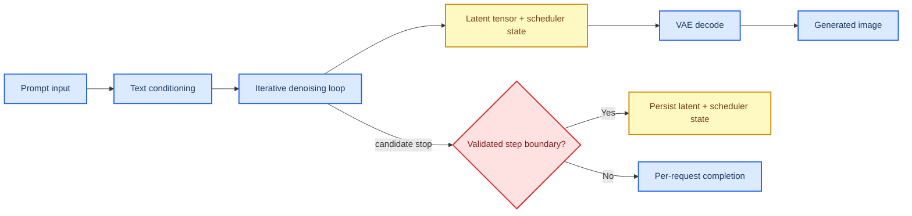

# Diffusion Profile Packet

This document is the **first extended-category profile packet** in the broader profiling program beyond the numbered M1–M6 workload packets. It applies the layered methodology defined in `profile_doc.md` to **diffusion models**, using the local program documents for category framing and using primary papers and official project or vendor documentation for the baseline family, runtime family, and serving or resource-system analysis.

**Packet status:** provisional. This packet contains a defensible, evidence-backed first-pass recommendation and a provisional ComputeLease scorecard, but the final scores are not closed until lease-trace or lease-equivalent experiments are run on a concrete stack.

## 🎯 Packet goal

The goal of this packet is to answer four questions for the **diffusion** category:

1. What is the most defensible **baseline model family** for a first edge-facing implementation?
2. Which **runtime family** is the best first execution layer for that baseline?
3. Which **serving or resource-system mechanisms** matter most for ComputeLease compliance?
4. What provisional ComputeLease scores are justified today, and which claims still require Adaptation Hypotheses, or AHs?

## 🧩 Category framing and workload identity

Unlike the numbered M1–M6 packets, diffusion is **not** a numbered workload row in the unified vRAN review. Instead, it enters the project through the later architecture-level taxonomy discussion and the `profile_doc.md` extension, where it is explicitly treated as a separate category.

The local framing already says three important things:

- diffusion is **uncovered in the numbered review** and therefore must be profiled as an extended-category packet rather than as a local M-row packet,
- the dominant profiling order is **runtime, then serving/resource-system**, with **model** support still required, and
- the core intuition is that **denoising step structure is suggestive at model level, but latency, memory pressure, and cap behavior are runtime-driven**.[^local-profile][^local-transcript]

This packet therefore treats diffusion through a **hierarchical execution-unit ladder** and separates three things explicitly:

- what the model family and local program framing prove,
- what the runtime can actually expose as schedulable work, and
- what the current stack can justify as a safe-stop boundary under a lease.

Local anchors for this packet are:

- `profile_doc.md`, especially the diffusion row and the independent baseline/engine snapshot,
- `progress/transcript.md`, where diffusion is explicitly introduced as an architecture-level category in the broader extended program.

| Field | Value |
| --- | --- |
| Category | Diffusion models |
| Workload in doc | Uncovered in current doc |
| Model archetype | Latent diffusion / denoising diffusion family |
| Delivery mechanism | One-shot |
| Phase decomposition | Text conditioning, iterative denoising, decoder / VAE decode |
| Smallest algorithmic primitive | UNet/transformer denoiser block ops, attention/MLP sub-ops, latent update ops |
| Runtime-exposed schedulable unit | Full diffusion request in the chosen stack; denoising step only as an imported candidate unit |
| Smallest justified safe-stop boundary | Per-request boundary for the first stack; denoising step only when the stack explicitly externalizes latent/scheduler state and validates bounded reclaim |
| Key parked state at safe-stop boundary | Current default boundary: no in-flight request state beyond request completion; imported candidate boundary state: latent tensor, scheduler state, and text-conditioning state |
| Dominant profiling layer | Runtime, then serving/resource-system, with mandatory model support |

### Execution-unit selection decision

| Candidate unit | Selected as profiling primitive? | Selected as current safe scheduling sub-unit? | Why selected or not selected | Provenance |
| --- | --- | --- | --- | --- |
| **UNet/transformer denoiser block ops** | **Yes** | **No** | Selected for profiling because they explain denoiser cost, attention/MLP pressure, and where step latency comes from below request level. Not selected as the current safe scheduling sub-unit because the current diffusion edge stacks do not provide a recoverable partial-progress contract or bounded reclaim proof inside a denoising step. | **Direct in external source** for model structure; **packet synthesis** for rejection |
| **Denoising step** | **Yes** | **Not selected by default; imported candidate** | Selected for profiling because diffusion is inherently step-sequential and few-step/distilled families explicitly alter this unit. Not selected as the current default safe scheduling sub-unit for the chosen first stack because the stack does not yet prove bounded reclaim and resume with externalized latent tensor and scheduler state at step boundaries. | **Direct in external source** for step structure; **packet synthesis + AH** for first-stack rejection |
| **Per-request boundary** | **Yes, as fallback** | **Yes (current default)** | Selected as the current default safe scheduling sub-unit because the chosen first stack is optimized for runtime efficiency, not for proven sub-request park/resume semantics. It is less flexible, but safer than assuming per-step reclaim without proof. | **Packet synthesis** from the safe-stop rule and current stack constraints |

## 🧠 Workload-aligned baseline family and practical deployment anchor

The **workload-aligned baseline family for diffusion** should remain the **latent diffusion family**, with **SDXL-class** as the heavier high-fidelity reference and **SD1.x-class latent diffusion** as the smaller dense baseline. This fit matches the local extended-category framing better than pixel-space diffusion or rectified-flow-only families because latent-space denoising is the clearest common ground between scientific diffusion baselines and practical edge deployment.

Separately, the **selected practical deployment anchor for the first implementation packet** is **Stable Diffusion 1.5 with LCM / LCM-LoRA style few-step distillation**. This is not a claim that SD1.5+LCM is the single strongest diffusion family in absolute image quality. It is the claim that SD1.5-class latent diffusion with few-step distillation is the **most defensible first deployment anchor** for an edge diffusion packet because it stays in the smaller latent-resolution regime and directly reduces the number of denoising steps that dominate edge latency.[^ldm-paper][^lcm-paper]

### Why SD1.5 + LCM is the practical deployment anchor

- The latent diffusion paper states that latent diffusion achieves strong performance while **significantly reducing computational requirements compared to pixel-based diffusion models**.[^ldm-paper]
- The LCM paper states that LCM enables **2–4-step** high-quality inference on pre-trained latent diffusion backbones.[^lcm-paper]
- NVIDIA’s official diffusion serving example is built around TensorRT and Triton, which makes SD1.5-class latent diffusion with few-step distillation the strongest current **NVIDIA deployment-oriented** anchor in this packet even before step-level lease semantics are proven.[^triton-sd-tutorial]

### Challenger families kept in scope

| Family | Why it remains in scope | Role in this packet |
| --- | --- | --- |
| **SDXL / SDXL-Turbo** | Stronger high-fidelity latent diffusion reference, but much heavier memory/compute footprint. Official Jetson documentation indicates SDXL requires substantially larger memory budgets than SD1.5.[^sdxl-paper][^jetson-sdxl][^sdxl-turbo-doc] | Primary high-fidelity reference |
| **Stable Diffusion 3.5 Medium / FLUX.1-schnell** | Newer heavy diffusion / rectified-flow class with stronger generation quality, but with much larger memory footprints and weaker packet-1 edge practicality.[^flux-card][^flux-doc] | Secondary frontier-quality reference |
| **MobileDiffusion** | Direct explicit on-device evidence for sub-second mobile generation makes it the strongest edge-specialized challenger.[^mobilediffusion-eccv][^mobilediffusion-arxiv] | Primary mobile/on-device challenger |

### Baseline selection rule

**AH-DIFF-BASELINE-LATENT:** Keep **latent diffusion** as the workload-aligned diffusion baseline family, with **SDXL-class** as the higher-fidelity scientific reference and **SD1.x-class** as the smaller dense baseline.

**AH-DIFF-DEPLOY-SD15-LCM:** Use **SD1.5 + LCM / LCM-LoRA** as the practical first deployment anchor because it best balances latent-state size, denoising-step count, and direct edge deployment evidence.

The workload-aligned baseline choice is justified by the local extended-category framing plus the latent-diffusion literature, while the exact deployment-anchor choice is supported primarily by **paper-level latent/few-step evidence plus direct Jetson deployment support**, not by a head-to-head diffusion lease benchmark under a common edge-serving regime.

## 🔄 Candidate runtime families

The runtime layer is where diffusion’s iterative denoising structure becomes executable behavior. For diffusion, the key runtime questions are:

- Can the runtime reduce **per-step latency** enough for edge viability?
- Can it keep **latent tensors and weights** inside tight memory envelopes?
- Can it support a path toward **step-level state externalization** if later needed?
- Is it practical on **NVIDIA edge servers** and **Jetson / embedded edge**?

| Runtime family | Role in this packet | Strong direct evidence | Practical recommendation |
| --- | --- | --- | --- |
| **Direct TensorRT** | Primary NVIDIA edge runtime | NVIDIA JetPack 6.2.1 ships **CUDA 12.6 + TensorRT 10.3** on Jetson, and NVIDIA’s official Triton diffusion tutorial is built around TensorRT engines.[^jetpack621][^triton-sd-tutorial] TensorRT docs also state that **weight streaming** can offload weights from device to host memory to free VRAM.[^trt-weightstream] | **Primary runtime for the first packet** |
| **ONNX Runtime + TensorRT EP** | Portable secondary runtime | Official ORT diffusion docs provide `ORTStableDiffusionPipeline` / `ORTStableDiffusionXLPipeline`, and ORT mobile docs state that models must fit device disk/memory and support mobile execution providers.[^ort-diffusers][^ort-mobile][^ort-trt] | **Secondary runtime**, especially when portability and fallback matter more than direct TensorRT control |
| **PyTorch / Diffusers** | Bring-up / fallback runtime | Official Diffusers docs provide strongest model coverage, but also explicitly note that denoising dominates cost and aggressive memory offloading can become very slow.[^diffusers-sd][^diffusers-mem] | Bring-up / unsupported-model runtime, not packet-1 default |
| **Core ML Stable Diffusion** | Reference on-device runtime | Official Apple repo provides direct on-device benchmarks and explicit model load/unload behavior to reduce memory pressure.[^coreml-sd] | Reference non-NVIDIA mobile runtime |

### Runtime conclusion

The first packet should use:

- **Primary runtime family:** `Direct TensorRT`
- **Secondary runtime family:** `ONNX Runtime + TensorRT EP`
- **Bring-up / fallback runtime:** `PyTorch / Diffusers`
- **Reference non-NVIDIA mobile runtime:** `Core ML Stable Diffusion`

For diffusion, the runtime ladder is:

- **smallest algorithmic primitive:** denoiser block ops and latent update ops,
- **runtime-exposed schedulable unit in the current stack:** full diffusion request by default; denoising step only as an imported candidate unit,
- **smallest justified safe-stop boundary for the first stack:** per-request boundary by default, with denoising-step only when the chosen stack validates bounded reclaim of latent and scheduler state.

The first packet should therefore keep **TensorRT** primary and treat denoising-step as the strongest **imported candidate** lease boundary, while using the other runtimes as deployment and portability references.

## 🏗️ Candidate serving and resource-system families

For diffusion, the serving/resource-system layer should stay conservative. The runtime and model family dominate viability more than serving features do, because diffusion remains step-sequential.

| Family | Type | What it contributes | Packet role |
| --- | --- | --- | --- |
| **Triton Inference Server family** | Serving system | Supports explicit model load/unload and official diffusion examples on NVIDIA stacks.[^triton-model-mgmt][^triton-sd-tutorial] | **Primary deployment serving path for the first packet** |
| **Jetson Platform Services** | Deployment wrapper | Official Jetson microservice platform with ingress, Redis, storage, and monitoring around edge services.[^jps-overview] | Candidate deployment wrapper for Jetson stacks |
| **Ray Serve model multiplexing** | Serving/resource mechanism | Official docs describe on-demand model loading and LRU-based model eviction, with hooks for releasing resources on eviction.[^ray-multiplex] | Imported model-residency / parking analogy evidence |
| **NVIDIA MIG** | Resource partitioning | Official docs provide hard GPU micro-segmentation with dedicated compute and memory resources on supported GPUs.[^mig-guide] | Candidate isolation mechanism on supported server GPUs |
| **SkyPilot managed jobs** | Recovery / control-plane mechanism | Official docs state managed jobs automatically recover from failures and resume from checkpoints when provided.[^skypilot-managed] | Imported job-level preemption/recovery mechanism evidence |

### Serving/resource conclusion

The first diffusion packet should use:

- **Primary deployment serving path:** `Triton Inference Server family`
- **Candidate deployment wrapper:** `Jetson Platform Services`
- **Candidate isolation mechanism:** `MIG`
- **Imported mechanism evidence:** `Ray Serve model multiplexing`, `SkyPilot managed jobs`

This gives a practical first implementation path while preserving the local extended-category framing: the deployment stack is real and supported, but the imported systems provide the stronger ComputeLease mechanisms that the packet-1 diffusion stack does not directly expose. Triton, JPS, and MIG should therefore be read as **deployment/isolation scaffolds**, while Ray Serve and SkyPilot should be read as **coarse model-residency / job-recovery analogies**, not as proof that the packet-1 runtime already closes diffusion lease semantics by itself.

## 🔬 Model-layer findings

At the model layer, diffusion behaves like a one-shot iterative denoising workload whose latency is dominated by repeated denoiser execution over a latent tensor state.

### Direct model-layer takeaways

- The local extended-category framing in `profile_doc.md` explicitly states that **denoising step structure is suggestive at model level**, but runtime and serving still determine edge viability.[^local-profile]
- The latent diffusion paper directly states that latent-space diffusion reduces compute relative to pixel-space diffusion, making latent diffusion the obvious baseline family for edge profiling.[^ldm-paper]
- The LCM paper directly states that few-step distilled latent diffusion can bring high-quality generation down to **2–4 steps**, which makes step count itself a first-class profiling parameter for diffusion.[^lcm-paper]

### Model-layer conclusion

For diffusion, the model layer is a real gate because the step count and latent-state size dominate edge feasibility. The correct interpretation is a ladder: **denoiser/operator primitives** below, **denoising step** in the middle, and **per-request** as the current safe fallback. If no validated step-level state externalization exists in the chosen stack, the packet should still fall back to **per-request** rather than pretending denoising-step reclaim already exists.

## ⚙️ Runtime-layer findings

The runtime layer determines whether the denoising-step structure can be turned into an edge-viable packet.

### Strongest direct mechanism evidence from the literature and docs

- **TensorRT** is the strongest direct NVIDIA edge runtime because JetPack 6.2.1 and the Triton diffusion example already align around TensorRT execution.[^jetpack621][^triton-sd-tutorial]
- **TensorRT weight streaming** directly supports host/device weight offload as a memory-relief mechanism.[^trt-weightstream]
- **ONNX Runtime + Optimum** directly supports SD/SDXL pipelines and mobile/edge EPs, making it the strongest portability runtime.[^ort-diffusers][^ort-mobile][^ort-trt]
- **Apple Core ML Stable Diffusion** provides direct on-device diffusion benchmarks and a just-in-time load/unload path for memory management, which makes it the strongest non-NVIDIA mobile reference.[^coreml-sd]

### Runtime conclusion

For diffusion, the runtime ladder is:

- **smallest algorithmic primitive:** denoiser block ops and latent update ops,
- **runtime-exposed schedulable unit in the current stack:** full diffusion request by default; denoising step only as an imported candidate unit,
- **smallest justified safe-stop boundary for the first stack:** per-request boundary by default, with denoising-step only when the chosen stack validates bounded reclaim of latent and scheduler state.

The first packet should therefore keep **TensorRT** primary and treat denoising-step as the strongest **imported candidate** lease boundary, while using the other runtimes as portability and fallback references.

## 🖧 Serving and resource-system findings

The serving/resource-system layer is where diffusion should remain more conservative than the numbered packets. The step loop is real, but packet-1 serving stacks still do not prove step-level reclaim semantics.

### Strongest direct mechanism evidence from the local profile and official docs

- **Triton** directly supports explicit model control modes and background load/unload behavior, which makes it the strongest packet-1 serving system for diffusion.[^triton-model-mgmt]
- **Ray Serve** directly supports model multiplexing with LRU eviction, which is useful as imported model-parking evidence.[^ray-multiplex]
- **MIG** directly supports hard GPU micro-segmentation with dedicated memory and compute slices.[^mig-guide]
- **SkyPilot managed jobs** directly support preemption recovery at the job level, which is useful imported evidence for checkpoint-and-resume semantics even though it is not edge-native.[^skypilot-managed]

### Serving/resource conclusion

The first diffusion packet should use:

- **Primary deployment serving path:** `Triton Inference Server family`
- **Candidate deployment wrapper:** `Jetson Platform Services`
- **Candidate isolation mechanism:** `MIG`
- **Imported mechanism evidence:** `Ray Serve model multiplexing`, `SkyPilot managed jobs`

This gives a practical first implementation path while preserving the local diffusion framing: the deployment stack is real and supported, while the imported systems provide the richer ComputeLease mechanism evidence that the packet-1 diffusion stack does not directly expose. The imported systems should therefore be read as **mechanism evidence**, not as proof that the packet-1 runtime already closes lease semantics by itself.

## 📊 Provisional ComputeLease scorecard

This scorecard is for the **first implementation target**, not for diffusion in the abstract.

**Target stack:** `SD1.5 + LCM / LCM-LoRA` → `TensorRT` → `Triton Inference Server` with optional Jetson Platform Services wrapper and optional future imported bridge mechanisms for latent-state parking.

| Axis | Provisional score | Evidence level | Notes | ComputeLease fields |
| --- | --- | --- | --- | --- |
| **Preemption Resilience** | **Low** | **Inferred** | Denoising-step is the strongest imported candidate boundary, but the chosen stack does not yet prove bounded reclaim/resume of latent and scheduler state at that level. | `preemption_notice_us`, `reclaim_mode`, `duration_us` |
| **Micro-Segmentation** | **Low** | **Inferred** | Denoising step is a natural candidate unit, but the chosen stack still treats it as imported structure rather than a demonstrated lease-safe scheduling boundary. | `duration_us`, `sm_budget_sms` |
| **State Parking** | **Low** | **Inferred** | Model parking and latent-state parking mechanisms exist in imported systems, but the chosen packet-1 diffusion stack still lacks a direct step-level park/resume contract. | `reclaim_mode`, `bandwidth_budget_hint`, `vram_budget_bytes` |
| **Tight VRAM Compliance** | **Medium** | **Inferred** | Latent-space models, few-step distillation, and TensorRT memory features improve fit, but strict `vram_budget_bytes` compliance still depends on conservative resolution, batch, and admission policy. | `vram_budget_bytes` |

### Score interpretation

Diffusion is stronger than activation-heavy one-shot CV on explicit iterative structure, but weaker than M3/M4 on serving semantics because step-level reclaim is not yet a default property of the chosen packet-1 stack. For the chosen first stack, the current default safe boundary remains **per-request**, while **denoising-step** remains the strongest imported candidate boundary.

## 🛠️ Implementation Feasibility

Implementation Feasibility is kept separate from the four score axes, exactly as required by `profile_doc.md`.

| Platform class | Feasibility score | Why |
| --- | --- | --- |
| **NVIDIA edge server** | **Medium** | SD1.5/LCM-class diffusion with TensorRT + Triton is plausible, but still requires careful shape control, batch control, and memory tuning. |
| **Jetson / embedded edge** | **Low** | Diffusion is feasible only with small latent models, low step counts, and careful storage/memory planning; SDXL- or FLUX-class families are not practical packet-1 anchors here. |

### Practical platform split

- **Jetson or embedded first implementation:** `Jetson AGX Orin 32GB + NVMe` + `SD1.5 + LCM / LCM-LoRA` + `TensorRT` + `Triton / JPS`
- **Server-edge shadow track:** `SDXL` or `SD1.5 + LCM` + `TensorRT` + `Triton`, with optional MIG partitioning

## 📌 Direct evidence and Adaptation Hypothesis register

| ID | Type | Claim |
| --- | --- | --- |
| **D-DIFF-1** | Direct | The local extended-category framing says diffusion should be profiled as **runtime, then serving/resource-system**, with denoising-step structure suggestive at model level but runtime behavior decisive.[^local-profile] |
| **D-DIFF-2** | Direct | Latent diffusion reduces compute compared with pixel-space diffusion.[^ldm-paper] |
| **D-DIFF-3** | Direct | LCM enables **2–4-step** high-quality inference for latent diffusion models.[^lcm-paper] |
| **D-DIFF-4** | Direct | MobileDiffusion reports sub-second 512×512 generation on mobile devices.[^mobilediffusion-arxiv][^mobilediffusion-eccv] |
| **D-DIFF-5** | Direct | TensorRT weight streaming can offload weights from device to host memory and free VRAM.[^trt-weightstream] |
| **D-DIFF-6** | Direct | Triton supports explicit load/unload model management and background model loading.[^triton-model-mgmt] |
| **D-DIFF-7** | Direct | Ray Serve model multiplexing supports on-demand loading and LRU-based model eviction for model residency control.[^ray-multiplex] |
| **D-DIFF-8** | Direct | MIG provides hard GPU partitioning with dedicated compute and memory resources.[^mig-guide] |
| **D-DIFF-9** | Direct | SkyPilot managed jobs support checkpoint-based recovery from preemptions and failures at the job level.[^skypilot-managed] |
| **AH-DIFF-1** | Adaptation Hypothesis | The workload-aligned diffusion baseline framing should remain the **latent diffusion family**, with SDXL-class as the high-fidelity scientific reference and SD1.x-class as the smaller dense baseline. |
| **AH-DIFF-2** | Adaptation Hypothesis | The first packet should use **SD1.5 + LCM / LCM-LoRA** as the practical deployment anchor because it best balances latent-state size, denoising-step count, and direct edge deployment evidence. |
| **AH-DIFF-3** | Adaptation Hypothesis | The first packet should choose **TensorRT + Triton** as the practical implementation stack for NVIDIA edge diffusion. |
| **AH-DIFF-4** | Adaptation Hypothesis | Denoising-step boundaries should be treated as imported candidate units only after the chosen stack demonstrates bounded drain and reclaim behavior for latent and scheduler state. |
| **AH-DIFF-5** | Adaptation Hypothesis | If the deployment is explicitly mobile-first rather than Jetson/server-edge first, **MobileDiffusion** should become the deployment anchor instead of SD1.5 + LCM. |

## 📚 Source register

### Local anchors

- `profile_doc.md`
- `progress/transcript.md`

### External primary sources and official docs

[^local-profile]: `profile_doc.md`, diffusion row and independent baseline/engine snapshot.
[^local-transcript]: `progress/transcript.md`, architecture-level category discussion introducing diffusion as a broader category.
[^ldm-paper]: Rombach et al. “High-Resolution Image Synthesis With Latent Diffusion Models.” CVPR 2022. https://openaccess.thecvf.com/content/CVPR2022/html/Rombach_High-Resolution_Image_Synthesis_With_Latent_Diffusion_Models_CVPR_2022_paper.html
[^sdxl-paper]: SDXL paper. https://arxiv.org/abs/2307.01952
[^lcm-paper]: LCM paper. https://arxiv.org/abs/2310.04378
[^mobilediffusion-eccv]: MobileDiffusion ECCV 2024 paper page. https://www.ecva.net/papers/eccv_2024/papers_ECCV/html/7923_ECCV_2024_paper.php
[^mobilediffusion-arxiv]: MobileDiffusion arXiv. https://arxiv.org/abs/2311.16567
[^flux-card]: FLUX.1-schnell model card. https://huggingface.co/black-forest-labs/FLUX.1-schnell
[^flux-doc]: Diffusers FLUX docs. https://huggingface.co/docs/diffusers/api/pipelines/flux
[^jetson-sd]: Jetson AI Lab Stable Diffusion tutorial. https://jetson-ai-lab.com/tutorial_stable-diffusion.html
[^jetson-sdxl]: Jetson AI Lab SDXL tutorial. https://jetson-ai-lab.com/tutorial_stable-diffusion-xl.html
[^sdxl-turbo-doc]: Hugging Face SDXL Turbo docs. https://huggingface.co/docs/diffusers/using-diffusers/sdxl_turbo
[^jetpack621]: NVIDIA JetPack 6.2.1 release notes. https://docs.nvidia.com/jetson/jetpack/release-notes/index.html
[^triton-sd-tutorial]: Triton Stable Diffusion tutorial. https://docs.nvidia.com/deeplearning/triton-inference-server/user-guide/docs/tutorials/Popular_Models_Guide/StableDiffusion/README.html
[^trt-weightstream]: NVIDIA TensorRT weight streaming docs. https://docs.nvidia.com/deeplearning/tensorrt/latest/inference-library/weight-streaming.html
[^ort-diffusers]: Hugging Face Diffusers ONNX optimization docs. https://huggingface.co/docs/diffusers/main/en/optimization/onnx
[^ort-mobile]: ONNX Runtime mobile docs. https://onnxruntime.ai/docs/tutorials/mobile/
[^ort-trt]: ONNX Runtime TensorRT EP docs. https://onnxruntime.ai/docs/execution-providers/TensorRT-ExecutionProvider.html
[^diffusers-sd]: Diffusers Stable Diffusion docs. https://huggingface.co/docs/diffusers/main/stable_diffusion
[^diffusers-mem]: Diffusers memory optimization docs. https://huggingface.co/docs/diffusers/optimization/memory
[^coreml-sd]: Apple Core ML Stable Diffusion repository. https://github.com/apple/ml-stable-diffusion
[^triton-model-mgmt]: Triton model management docs. https://docs.nvidia.com/deeplearning/triton-inference-server/user-guide/docs/user_guide/model_management.html
[^jps-overview]: Jetson Platform Services overview. https://docs.nvidia.com/jetson/jps/platform-services/overview.html
[^ray-multiplex]: Ray Serve model multiplexing docs. https://docs.ray.io/en/latest/serve/model-multiplexing.html
[^mig-guide]: NVIDIA MIG user guide. https://docs.nvidia.com/datacenter/tesla/mig-user-guide/
[^skypilot-managed]: SkyPilot managed jobs docs. https://docs.skypilot.co/en/latest/examples/managed-jobs.html

## 🧾 Packet conclusion

For **diffusion**, the local extended-category framing already gives the right high-level answer: this is a **runtime-dominated, step-sequential, latent-state** workload. The most useful packet-1 move is therefore not to chase model novelty, but to choose a latent diffusion family and runtime that make the denoising loop tractable on edge hardware while keeping the richer serving/resource mechanisms available for later refinement.

**Recommended first implementation target:**

- **Workload-aligned baseline family:** `Latent diffusion family with SDXL-class as high-fidelity reference and SD1.x-class as smaller dense baseline`
- **Practical deployment anchor:** `SD1.5 + LCM / LCM-LoRA`
- **Primary runtime family:** `Direct TensorRT`
- **Primary deployment serving path:** `Triton Inference Server family`
- **Candidate deployment wrapper:** `Jetson Platform Services`
- **Primary mobile challenger:** `MobileDiffusion`

In short, diffusion should be implemented as **per-request safe by default, denoising-step as the strongest imported candidate boundary, latent-state aware, runtime-first, and lease-bridged from the start**, because the sequential denoising loop only becomes edge-viable once the model family and runtime reduce the effective step cost enough.