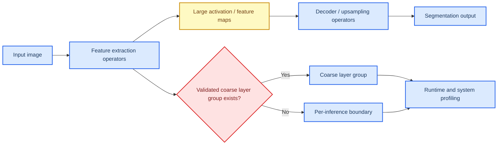

# M1 Image Segmentation Profile Packet

This document is the **next pilot profile packet** in the vRAN edge inference profiling workflow. It applies the layered methodology defined in `profile_doc.md` to **M1 Image Segmentation**, using the local review for the workload identity and the ComputeLease score-axis framing, while using primary papers and official project or vendor documentation for the baseline family, runtime family, and serving or resource-system analysis.

**Packet status:** provisional. This packet contains a defensible, evidence-backed first-pass recommendation and a provisional ComputeLease scorecard, but the final scores are not closed until lease-trace or lease-equivalent experiments are run on a concrete stack.

## 🎯 Packet goal

The goal of this packet is to answer four questions for **M1 Image Segmentation**:

1. What is the most defensible **baseline model family** for a first edge-facing implementation?
2. Which **runtime family** is the best first execution layer for that baseline?
3. Which **serving or resource-system mechanisms** matter most for ComputeLease compliance?
4. What provisional ComputeLease scores are justified today, and which claims still require Adaptation Hypotheses, or AHs?

## 🧩 Category and workload row

The local review defines **M1 Image Segmentation** as a **DeepLabV3-like one-shot workload** with **Feature extraction → Upsampling** and **poor preemptibility** because segmentation is activation-heavy and incurs high context-switch cost when interrupted mid-layer. The strongest repo-grounded serving boundary is therefore **per-inference / coarse layer group**, not token-scale or ray-batch-scale slicing.

This packet therefore treats M1 through a **hierarchical execution-unit ladder** and separates three things explicitly:

- what the model family and local review prove,
- what the runtime can actually expose as schedulable work, and
- what the current stack can justify as a safe-stop boundary under a lease.

Local anchors for this packet are:

- `progress/unified_vran_edge_inference_sota_review_2022_2026.md`, summary matrix rows for M1,
- the ComputeLease score-axis definitions in the same file,
- the local M1 taxonomy block that identifies **per-inference / coarse layer group** as the strongest currently justified serving-level fallback, and
- the M1 system sections for USHER, Orion, PPipe, RAVAS, and OctopInf.

| Field | Value |
| --- | --- |
| Category | Computer vision models |
| Workload in doc | M1 Image Segmentation |
| Model archetype | CNN / dense-prediction segmentation family |
| Delivery mechanism | One-shot |
| Phase decomposition | Feature extraction, upsampling / decoder |
| Smallest algorithmic primitive | Convolution, attention or MLP sub-ops, decoder / upsampling operators, feature-map transforms |
| Runtime-exposed schedulable unit | Coarse layer group, stage block, or implementation-level inference chunk |
| Smallest justified safe-stop boundary | Per-inference boundary for the first stack; coarse layer group only when the stack explicitly exposes and validates it |
| Key parked state at safe-stop boundary | In-flight feature maps / activations plus model weights and scheduler metadata |
| Dominant profiling layer | Runtime, with mandatory model and serving/resource-system support |

### Execution-unit selection decision

| Candidate unit | Selected as profiling primitive? | Selected as current safe scheduling sub-unit? | Why selected or not selected | Provenance |
| --- | --- | --- | --- | --- |
| **Operator-level kernels / conv-attention-decoder sub-ops** | **Yes** | **No** | Selected for profiling because they explain compute width, feature-map pressure, and interference structure below request level. Not selected as the current safe scheduling sub-unit because the current M1 edge stacks do not provide a recoverable partial-progress contract or bounded reclaim proof at that level. | **Direct in external source** for operator visibility; **packet synthesis** for rejection |
| **Coarse layer group / block** | **Yes** | **Not selected by default; conditionally selectable** | Selected for profiling because the local review and systems like PPipe and Orion make block/group-level execution explicit. Not selected as the current default safe scheduling sub-unit for the chosen stack because `TensorRT + DeepStream nvinfer` does not yet expose and validate that boundary with bounded drain/reclaim behavior. It becomes selectable only after that validation. | **Direct in local review** for group-level fallback, plus **external source** for block/operator abstractions; final safe-stop selection remains **packet synthesis + AH** |
| **Per-inference / per-request boundary** | **Yes, as fallback** | **Yes (current default)** | Selected as the current default safe scheduling sub-unit because the chosen first stack is one-shot and does not yet prove a lease-safe mid-layer group boundary. It is less flexible, but safer than assuming internal stoppability without proof. | **Direct in local review** for one-shot framing; **packet synthesis** for current-stack selection |

## 🧠 Workload-aligned baseline family and practical deployment anchor

The **workload-aligned baseline family for M1** should remain a **semantic-segmentation family aligned with the local DeepLabV3-like framing**, with **SegFormer-B0/B1** as the primary modern anchor and **DeepLabV3+** as the local-review-aligned anchor. These families fit the local M1 identity better than a deployment-first YOLO choice because they preserve the dense one-shot segmentation semantics that the review is actually describing.

Separately, the **selected practical deployment anchor for the first implementation packet** is the **YOLO segmentation family**, using a small Ultralytics segmentation variant as the operational deployment anchor. This is not a claim that YOLO-style segmentation is the single strongest image-segmentation family in absolute accuracy. It is the claim that the YOLO segmentation family is the **most defensible first deployment anchor** for an M1 edge packet because it combines official Jetson/TensorRT deployment support, mature export tooling, and a practical DeepStream deployment path under NVIDIA edge constraints.[^ultralytics-jetson][^ultralytics-tensorrt][^ultralytics-deepstream]

This split is intentional. `profile_doc.md` keeps **SegFormer-B0/B1** and **DeepLabV3+** as the main M1 scientific anchors, while this packet uses **YOLO segmentation** as the first deployment-oriented implementation target.

### Why the YOLO segmentation family is the practical deployment anchor

- The official Ultralytics Jetson guide explicitly frames the Jetson platform as a target for deploying Ultralytics models with **PyTorch**, **TorchScript**, and **TensorRT**, with TensorRT recommended for best performance on NVIDIA hardware.[^ultralytics-jetson]
- The Ultralytics integration docs provide an officially maintained TensorRT export path and a DeepStream deployment path, which makes the family unusually strong for a first packet where the deployment stack matters as much as the paper lineage.[^ultralytics-tensorrt][^ultralytics-deepstream]
- For a first M1 packet, deployment credibility and runtime support matter more than squeezing out leaderboard gains if the model family is hard to export, quantize, or serve on Jetson-class devices.

### Challenger families kept in scope

| Family | Why it remains in scope | Role in this packet |
| --- | --- | --- |
| **Fast-SCNN** | Directly designed for **embedded devices with low memory** and reports **123.5 FPS** at meaningful Cityscapes quality.[^fastscnn-paper] | Primary low-memory challenger |
| **MobileNetV3 + LR-ASPP** | Directly designed for **mobile CPU** deployment and reports segmentation-specific speedups over MobileNetV2 R-ASPP.[^mobilenetv3-paper] | Primary mobile-friendly semantic challenger |
| **BiSeNet V2** | Strong direct speed/accuracy trade-off with **72.6% mIoU at 156 FPS** and no inference-cost booster branch.[^bisenetv2-paper] | Primary real-time semantic challenger |
| **EdgeSAM / MobileSAM / EfficientSAM** | Strong SAM-lite edge papers, but better treated as a separate promptable-segmentation branch than as the default M1 baseline.[^edgesam-paper][^mobilesam-repo][^efficientsam-paper] | Secondary promptable-segmentation branch |

### Baseline selection rule

**AH-M1-BASELINE-SEM:** Keep **SegFormer-B0/B1 with DeepLabV3+ as the local anchor** as the workload-aligned M1 baseline family, because that is the closest match to the local DeepLabV3-like one-shot segmentation framing.

**AH-M1-DEPLOY-YOLOSEG:** Use the **YOLO segmentation family** only as the **practical first deployment anchor** because it best balances deployment maturity and NVIDIA-edge runtime compatibility for a packet whose first goal is operational profiling rather than pure architecture comparison. Keep **Fast-SCNN** as the main low-memory challenger and **BiSeNet V2 / MobileNetV3 LR-ASPP** as semantic-segmentation challengers.

The workload-aligned baseline choice is justified by the local framing and the broader M1 snapshot in `profile_doc.md`, while the YOLO deployment-anchor choice is supported primarily by **official deployment support and runtime compatibility evidence**, not by a peer-reviewed head-to-head M1 edge benchmark under a common lease regime.

## 🔄 Candidate runtime families

The runtime layer is where M1’s activation-heavy one-shot structure becomes executable behavior. For M1, the key runtime questions are:

- Can the runtime support **fixed-shape or narrow-profile deployment** with manageable activation memory?
- Can it expose any useful **group/block** execution boundary above raw kernels?
- Can it handle **quantization, memory pressure, and scheduling** without excessive runtime overhead?
- Is it practical on **NVIDIA edge servers** and **Jetson / embedded edge**?

| Runtime family | Role in this packet | Strong direct evidence | Practical recommendation |
| --- | --- | --- | --- |
| **TensorRT** | Primary NVIDIA edge runtime | Official docs position TensorRT as NVIDIA’s inference optimizer/runtime with **mixed precision**, **dynamic shapes**, **ONNX parsing**, **serialized engines**, and support for JetPack AArch64 / Orin-class hardware in the support matrix.[^tensorrt-overview][^tensorrt-dynamic][^tensorrt-support] | **Primary runtime for the first packet** |
| **ONNX Runtime + TensorRT EP** | Portable secondary runtime | Official docs expose **TensorRT Execution Provider**, reduced-op builds, mobile/edge deployment, and graph optimization support.[^ort-home][^ort-trt][^ort-custom] | **Secondary runtime**, especially when portability matters more than raw NVIDIA specialization |
| **OpenVINO Runtime** | Intel-edge runtime | Official docs support CPU/GPU/NPU execution, automatic batching, model caching, and edge deployment workflows.[^openvino-home] | Reference runtime for non-NVIDIA edge |

### Runtime conclusion

The first packet should use:

- **Primary runtime family:** `TensorRT`
- **Secondary runtime family:** `ONNX Runtime + TensorRT EP`
- **Reference non-NVIDIA runtime:** `OpenVINO Runtime`

For M1, the runtime ladder is:

- **smallest algorithmic primitive:** conv / attention / decoder sub-ops,
- **runtime-exposed schedulable unit in the current stack:** group/block if the serving stack surfaces it; otherwise inference request,
- **smallest justified safe-stop boundary for the first stack:** per-inference boundary by default, with coarse layer group only as a conditional candidate.

In other words, operator-level kernels are **not selected** as the current safe scheduling sub-unit even though they are still **selected for profiling**. TensorRT is the most defensible packet-1 runtime because it is the best-supported NVIDIA-edge deployment path today.

## 🏗️ Candidate serving and resource-system families

For M1, the serving/resource-system layer matters because M1 is one-shot and poor for mid-layer preemption. The local review already splits the five named systems into serving-runtime and resource-manager evidence.

| Family | Type | What it contributes | Packet role |
| --- | --- | --- | --- |
| **DeepStream 8 + Service Maker + nvinfer** | Serving system | Officially supports **segmentation metadata**, Jetson/x86 deployment, and notes that `nvinferserver` (Triton-backed) can cost **5–15%** on some models relative to `nvinfer`.[^deepstream-overview][^deepstream-seg][^deepstream-triton-gap][^servicemaker] | **Primary deployment serving path for the first packet** |
| **Triton family** | Serving system | Officially supports **edge and embedded devices**, dynamic batching, concurrent model execution, and Jetson deployment modes with direct C API guidance.[^triton-home][^triton-jetson] | Candidate serving wrapper when RPC/model-repo features are needed |
| **MIG** | Resource partitioning | Official user guide states MIG provides **isolated instances** with dedicated compute and memory resources and guaranteed performance on supported GPUs.[^mig-guide] | Candidate isolation mechanism on supported server GPUs, not Jetson proof |
| **USHER / Orion / PPipe / RAVAS / OctopInf** | Research serving/resource evidence | Strong direct evidence for interference-aware packing, operator-level scheduling, pipeline blocks, GPU%-based allocation, and spatiotemporal portion scheduling.[^usher-paper][^orion-paper][^ppipe-paper][^ravas-paper][^octopinf-paper] | Imported mechanism evidence |

### Serving/resource conclusion

The first M1 packet should use:

- **Primary deployment serving path:** `DeepStream 8 + Service Maker + nvinfer`
- **Candidate serving wrapper:** `Triton family`
- **Candidate isolation mechanism:** `MIG`
- **Imported mechanism evidence:** `USHER`, `Orion`, `PPipe`, `RAVAS`, `OctopInf`

This gives a practical first implementation path while preserving the local M1 framing: the first stack is a real NVIDIA edge deployment path, while the research systems provide the richer ComputeLease mechanism evidence that the production stack does not directly expose. DeepStream, Triton, and MIG should therefore be read as **deployment/isolation scaffolds**, not as direct proof of lease-safe sub-request execution, park/resume, or bounded reclaim.

## 🔬 Model-layer findings

At the model layer, M1 behaves like an activation-heavy one-shot dense-prediction workload.

### Direct model-layer takeaways

- The local review marks M1 as **one-shot**, **activation-heavy**, and **poorly preemptible** mid-layer, with **per-inference / coarse layer group** as the strongest currently justified serving-level fallback.[^local-review]
- The runtime and system papers confirm that M1-like one-shot CNN inference is primarily constrained by **intermediate activations / feature maps**, not by persistent cross-request state.[^usher-paper]
- This means the first decision is not just what serving system to use; it is whether the chosen stack can expose a meaningful **coarse layer-group** boundary at all.

### Model-layer conclusion

For M1, the model layer is a real gate, though less severe than M5. The correct interpretation is a ladder: **operator primitives** below, **coarse layer group / block** in the middle, and **per-inference** as the safe fallback. If no validated group boundary exists in the chosen stack, the packet should fall back to **per-inference** rather than pretending fine-grained safe-stop support exists.

## ⚙️ Runtime-layer findings

The runtime layer determines whether the model-gated M1 workload can actually expose useful execution chunks above raw kernels.

### Strongest direct mechanism evidence from the literature and docs

- **TensorRT** provides the strongest direct evidence for a deployable NVIDIA-native runtime with mixed precision, optimization profiles, and Jetson support.[^tensorrt-overview][^tensorrt-dynamic][^tensorrt-support]
- **USHER** provides direct evidence for kernel-analysis–based requirement estimation and interference-aware scheduling, but not for true lease-safe intra-request stopping.[^usher-paper]
- **Orion** provides direct evidence for **operator-level scheduling** at **10s–1000s of µs**, but also directly notes the underlying limitation that kernels are not preempted mid-flight on closed-source GPUs.[^orion-paper][^orion-readme]
- **PPipe** provides direct evidence for **pre-partitioned blocks/stages** and adaptive batching, which makes it the strongest research source for coarse group boundaries above raw operators.[^ppipe-paper]
- **OctopInf/CORAL** provides direct evidence for **portion-based** time/space scheduling under edge conditions, but its default portions are still tied to batch-style inference slices rather than to true sub-ms operator leasing.[^octopinf-paper][^octopinf-repo]

### Runtime conclusion

For M1, the runtime ladder is:

- **smallest algorithmic primitive:** conv / decoder / attention sub-ops,
- **runtime-exposed schedulable unit:** coarse layer group, stage block, or portion when the stack surfaces one; otherwise full request,
- **smallest justified safe-stop boundary for the first stack:** per-inference boundary by default, with coarse layer group as the **best current candidate** safe scheduling sub-unit.

The first packet should therefore keep **TensorRT** primary and treat operator-level visibility from Orion/USHER as **profiling structure**, not as already proven safe-stop semantics.

## 🖧 Serving and resource-system findings

The serving/resource-system layer is where the M1 packet should remain conservative. The research systems give valuable mechanisms, but the deployment-first packet should still favor the strongest current edge-serving path.

### Strongest direct mechanism evidence from the local review and official docs

- **DeepStream** directly supports segmentation pipelines and NVIDIA edge deployment, and NVIDIA docs explicitly discuss the `nvinfer` versus `nvinferserver` choice on Jetson.[^deepstream-overview][^deepstream-seg][^deepstream-triton-gap][^servicemaker]
- **USHER** directly supports interference-aware co-location with compute/memory utilization modeling and cache-aware graph merging.[^usher-paper]
- **Orion** directly supports operator-level scheduling and shows the strongest direct micro-segmentation evidence among the M1 systems.[^orion-paper][^orion-readme]
- **PPipe** directly supports block/stage partitioning and data-plane adaptive batching, making it the strongest bridge source for coarse layer-group scheduling.[^ppipe-paper]
- **RAVAS** directly supports GPU%-based spatial multiplexing and lightweight-model selection for edge video analytics, but later peer evidence warns that pre-loading many models is memory-constrained on edge.[^ravas-paper][^ovida-paper]
- **OctopInf** directly supports spatiotemporal portion scheduling and heterogeneous edge/server deployment with TensorRT/ONNX backends.[^octopinf-paper][^octopinf-repo]

### Serving/resource conclusion

The first M1 packet should use:

- **Primary deployment serving path:** `DeepStream 8 + Service Maker + nvinfer`
- **Candidate serving wrapper:** `Triton family`
- **Candidate isolation mechanism:** `MIG`
- **Imported mechanism evidence:** `USHER`, `Orion`, `PPipe`, `RAVAS`, `OctopInf`

This gives a practical first implementation path while preserving the review’s M1 logic: the deployment stack is real and supported, while the richer research systems provide evidence for what may later be imported into a more lease-aware runtime. DeepStream, Triton, and MIG should therefore be read as **deployment/isolation scaffolds**, not as direct proof of lease-safe sub-request execution, park/resume, or bounded reclaim.

## 📊 Provisional ComputeLease scorecard

This scorecard is for the **first implementation target**, not for M1 in the abstract.

**Target stack:** `YOLO segmentation family` → `TensorRT` → `DeepStream 8 + Service Maker + nvinfer`, with optional future imported bridge mechanisms for coarse group boundaries and stricter admission control.

| Axis | Provisional score | Evidence level | Notes | ComputeLease fields |
| --- | --- | --- | --- | --- |
| **Preemption Resilience** | **Low** | **Inferred** | The chosen stack is one-shot and does not directly expose a proven lease-safe mid-layer pause path. Safe interruption remains closest to per-inference boundary unless a group boundary is explicitly validated. | `preemption_notice_us`, `reclaim_mode`, `duration_us` |
| **Micro-Segmentation** | **Low** | **Inferred** | Coarse layer-group/block ideas exist in Orion/PPipe/OctopInf, but the first stack does not directly expose them as proven safe scheduling units. | `duration_us`, `sm_budget_sms`, `start_time_us` |
| **State Parking** | **Low** | **Inferred** | The request itself is one-shot and stateless across requests, but in-flight feature maps remain heavy. The selected stack has no direct park/resume mechanism, so parking is still a bridge-pattern import or replay strategy rather than a demonstrated property. | `reclaim_mode`, `bandwidth_budget_hint`, `vram_budget_bytes` |
| **Tight VRAM Compliance** | **Medium** | **Inferred** | Direct deployment/runtime support exists for quantization and TensorRT inference, but strict `vram_budget_bytes` compliance still depends on conservative model choice and admission policy rather than direct hard-cap proof on the chosen stack. | `vram_budget_bytes` |

### Score interpretation

M1 is weaker than M3 and M6 on micro-segmentation because segmentation is activation-heavy and one-shot, but stronger than M5 in that the local review already admits **coarse layer group** as a plausible boundary instead of only full-request or tile fallback. For the chosen first stack, however, the current default safe boundary remains **per-inference**, while coarse layer group remains only the **best imported candidate** safe scheduling sub-unit pending validation.

## 🛠️ Implementation Feasibility

Implementation Feasibility is kept separate from the four score axes, exactly as required by `profile_doc.md`.

| Platform class | Feasibility score | Why |
| --- | --- | --- |
| **NVIDIA edge server** | **High** | TensorRT + DeepStream is a very strong supported path, and the research systems give multiple directions for later lease-aware refinement. |
| **Jetson / embedded edge** | **Medium** | The stack is practical and officially supported, but memory pressure and activation-heavy one-shot inference still require careful model selection and system memory control. |

### Practical platform split

- **Jetson or embedded first implementation:** YOLO segmentation family + TensorRT + DeepStream `nvinfer`
- **Server-edge shadow track:** YOLO segmentation or SegFormer-B0/B1 family + TensorRT + DeepStream or Triton

## 📌 Direct evidence and Adaptation Hypothesis register

| ID | Type | Claim |
| --- | --- | --- |
| **D-M1-1** | Direct | The local review identifies **per-inference / coarse layer group** as the strongest currently justified M1 serving-level fallback, with **per-inference activations / feature maps** as the key state.[^local-review] |
| **D-M1-2** | Direct | USHER directly models compute and memory requirements from GPU kernels and uses interference-aware co-location / scheduling for one-shot CNN-style inference.[^usher-paper] |
| **D-M1-3** | Direct | Orion directly supports operator-level scheduling and targets 10s–1000s of µs operator durations, but does not provide true mid-kernel preemption.[^orion-paper][^orion-readme] |
| **D-M1-4** | Direct | PPipe directly supports block/stage partitioning and adaptive batching, making it the strongest local bridge source for coarse layer-group scheduling.[^ppipe-paper] |
| **D-M1-5** | Direct | RAVAS directly supports lightweight-model selection and GPU%-based spatial multiplexing for edge video analytics.[^ravas-paper] |
| **D-M1-6** | Direct | OctopInf directly supports portion-based spatiotemporal scheduling and heterogeneous edge/server deployment with TensorRT and ONNX backends.[^octopinf-paper][^octopinf-repo] |
| **D-M1-7** | Direct | DeepStream directly supports segmentation metadata and edge deployment on Jetson/x86 NVIDIA systems.[^deepstream-overview][^deepstream-seg][^servicemaker] |
| **D-M1-8** | Direct | TensorRT directly supports optimized inference on NVIDIA hardware including JetPack/Orin-class platforms.[^tensorrt-overview][^tensorrt-support] |
| **D-M1-9** | Direct | Fast-SCNN is explicitly designed for embedded devices with low memory and reports 123.5 FPS at 68.0% mIoU.[^fastscnn-paper] |
| **D-M1-10** | Direct | MobileNetV3 + LR-ASPP is explicitly mobile-CPU oriented and reports a 34% segmentation-speed gain over MobileNetV2 R-ASPP at similar quality.[^mobilenetv3-paper] |
| **D-M1-11** | Direct | BiSeNet V2 reports 72.6% mIoU at 156 FPS with no inference-cost booster branch.[^bisenetv2-paper] |
| **AH-M1-1** | Adaptation Hypothesis | The workload-aligned M1 scientific baseline should remain **SegFormer-B0/B1 with DeepLabV3+ as the local-review anchor**. |
| **AH-M1-2** | Adaptation Hypothesis | The first packet should use the **YOLO segmentation family** only as the practical deployment anchor because it best balances real deployment maturity and NVIDIA-edge compatibility. |
| **AH-M1-3** | Adaptation Hypothesis | The first packet should choose **TensorRT + DeepStream nvinfer** as the practical implementation stack for NVIDIA edge deployments. |
| **AH-M1-4** | Adaptation Hypothesis | Coarse layer-group boundaries should be treated as the **best imported candidate** safe scheduling sub-unit only after the chosen stack demonstrates bounded drain and reclaim behavior at that level. |
| **AH-M1-5** | Adaptation Hypothesis | If promptable segmentation is required, **EdgeSAM / MobileSAM / EfficientSAM** should be treated as a secondary M1 branch rather than as the default packet baseline. |
| **AH-M1-6** | Adaptation Hypothesis | MIG is a useful segmentation candidate for hard partitioning on supported NVIDIA GPUs, but its direct edge fit is limited and should not be assumed for Jetson-class deployment. |

## 📚 Source register

### Local anchors

- `profile_doc.md`
- `progress/unified_vran_edge_inference_sota_review_2022_2026.md`
- `research paper/edge_ran_inference_research_matrix.md`

### External primary sources and official docs

[^local-review]: `progress/unified_vran_edge_inference_sota_review_2022_2026.md`, M1 local taxonomy block and M1 system sections.
[^usher-paper]: USHER paper page. https://www.usenix.org/conference/osdi24/presentation/shubha
[^orion-paper]: Orion paper PDF. https://anakli.inf.ethz.ch/papers/orion_eurosys24.pdf
[^orion-readme]: Orion official repository. https://github.com/eth-easl/orion
[^ppipe-paper]: PPipe preprint / paper page. https://arxiv.org/abs/2507.18748
[^ravas-paper]: RAVAS paper PDF. https://research.chalmers.se/publication/540228/file/540228_Fulltext.pdf
[^ovida-paper]: OVIDA paper PDF discussing RAVAS memory limitations. https://hal.science/hal-04780377/file/main.pdf
[^octopinf-paper]: OctopInf preprint. https://arxiv.org/abs/2502.01277
[^octopinf-repo]: OctopInf / PipelineScheduler repository. https://github.com/tungngreen/PipelineScheduler
[^fastscnn-paper]: Fast-SCNN paper. https://arxiv.org/abs/1902.04502
[^mobilenetv3-paper]: MobileNetV3 paper. https://arxiv.org/abs/1905.02244
[^bisenetv2-paper]: BiSeNet V2 journal version. https://doi.org/10.1007/s11263-021-01515-2
[^edgesam-paper]: EdgeSAM paper. https://arxiv.org/abs/2312.06660
[^mobilesam-repo]: MobileSAM repository. https://github.com/ChaoningZhang/MobileSAM
[^efficientsam-paper]: EfficientSAM paper. https://arxiv.org/abs/2312.00863
[^ultralytics-jetson]: Ultralytics Jetson deployment guide. https://docs.ultralytics.com/guides/nvidia-jetson/
[^ultralytics-tensorrt]: Ultralytics TensorRT integration docs. https://docs.ultralytics.com/integrations/tensorrt/
[^ultralytics-deepstream]: Ultralytics DeepStream integration docs. https://docs.ultralytics.com/guides/deepstream-nvidia-jetson/
[^tensorrt-overview]: NVIDIA TensorRT documentation. https://docs.nvidia.com/deeplearning/tensorrt/latest/
[^tensorrt-dynamic]: NVIDIA TensorRT dynamic shapes documentation. https://docs.nvidia.com/deeplearning/tensorrt/latest/inference-library/work-dynamic-shapes.html
[^tensorrt-support]: NVIDIA TensorRT support matrix. https://docs.nvidia.com/deeplearning/tensorrt/10.16.1/getting-started/support-matrix.html
[^ort-home]: ONNX Runtime docs. https://onnxruntime.ai/docs/
[^ort-trt]: ONNX Runtime TensorRT Execution Provider. https://onnxruntime.ai/docs/execution-providers/TensorRT-ExecutionProvider.html
[^ort-custom]: ONNX Runtime custom/reduced-op builds. https://onnxruntime.ai/docs/build/custom.html
[^openvino-home]: OpenVINO docs. https://docs.openvino.ai/2025/index.html
[^deepstream-overview]: NVIDIA DeepStream overview. https://docs.nvidia.com/metropolis/deepstream/dev-guide/text/DS_Overview.html
[^deepstream-seg]: NVIDIA DeepStream segmentation metadata docs. https://docs.nvidia.com/metropolis/deepstream/dev-guide/text/DS_plugin_metadata.html
[^deepstream-triton-gap]: NVIDIA DeepStream / Triton performance note. https://docs.nvidia.com/metropolis/deepstream/dev-guide/text/DS_Performance.html
[^servicemaker]: NVIDIA Service Maker docs. https://docs.nvidia.com/metropolis/deepstream/dev-guide/text/DS_service_maker_intro.html
[^triton-home]: NVIDIA Triton Inference Server docs. https://docs.nvidia.com/deeplearning/triton-inference-server/user-guide/docs/index.html
[^triton-jetson]: NVIDIA Triton on Jetson. https://docs.nvidia.com/deeplearning/triton-inference-server/user-guide/docs/user_guide/jetson.html
[^mig-guide]: NVIDIA MIG user guide. https://docs.nvidia.com/datacenter/tesla/mig-user-guide/latest/

## 🧾 Packet conclusion

For **M1 Image Segmentation**, the local review already gives the correct high-level answer: this is a **one-shot, activation-heavy, poor-mid-layer-preemption** workload. The most useful packet-1 move is therefore not to chase the smallest possible kernel boundary, but to choose a deployment path that is real today while keeping the richer scheduling evidence from the research systems available for later refinement.

**Recommended first implementation target:**

- **Workload-aligned baseline family:** `SegFormer-B0/B1 with DeepLabV3+ as local anchor`
- **Practical deployment anchor:** `YOLO segmentation family`
- **Primary runtime family:** `TensorRT`
- **Primary deployment serving path:** `DeepStream 8 + Service Maker + nvinfer`
- **Candidate serving wrapper:** `Triton family`
- **Primary low-memory challenger:** `Fast-SCNN`
- **Primary semantic challenger:** `BiSeNet V2` or `MobileNetV3 + LR-ASPP`

In short, M1 should be implemented as **activation-aware, per-inference-safe by default, NVIDIA-native, and lease-bridged from the start**, because unlike M3, the serving semantics remain coarse and the runtime must prove any useful boundary above per-inference first.