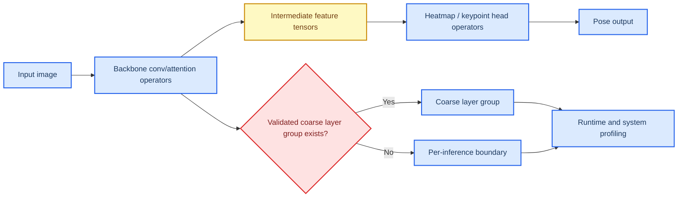

# M2 Pose Estimation Profile Packet

This document is the **next pilot profile packet** in the vRAN edge inference profiling workflow. It applies the layered methodology defined in `profile_doc.md` to **M2 Pose Estimation**, using the local review for the workload identity and the ComputeLease score-axis framing, while using primary papers and official project or vendor documentation for the baseline family, runtime family, and serving or resource-system analysis.

**Packet status:** provisional. This packet contains a defensible, evidence-backed first-pass recommendation and a provisional ComputeLease scorecard, but the final scores are not closed until lease-trace or lease-equivalent experiments are run on a concrete stack.

## 🎯 Packet goal

The goal of this packet is to answer four questions for **M2 Pose Estimation**:

1. What is the most defensible **baseline model family** for a first edge-facing implementation?
2. Which **runtime family** is the best first execution layer for that baseline?
3. Which **serving or resource-system mechanisms** matter most for ComputeLease compliance?
4. What provisional ComputeLease scores are justified today, and which claims still require Adaptation Hypotheses, or AHs?

## 🧩 Category and workload row

The local review defines **M2 Pose Estimation** as a **Transformer/CNN hybrid one-shot workload** with **Feature extraction → Head decoding** and **poor preemptibility** because pose estimation is activation-heavy and intermediate feature tensors become expensive to preserve or replay mid-request. The strongest repo-grounded serving boundary is therefore **per-inference / coarse layer group**, not token-scale or ray-batch-scale slicing.

This packet therefore treats M2 through a **hierarchical execution-unit ladder** and separates three things explicitly:

- what the model family and local review prove,
- what the runtime can actually expose as schedulable work, and
- what the current stack can justify as a safe-stop boundary under a lease.

Local anchors for this packet are:

- `progress/unified_vran_edge_inference_sota_review_2022_2026.md`, summary matrix rows for M2,
- the ComputeLease score-axis definitions in the same file,
- the local M2 taxonomy block that identifies **per-inference / coarse layer group** as the strongest currently justified serving-level fallback, and
- the M2 system sections for USHER, Orion, PPipe, RAVAS, and OctopInf.

| Field | Value |
| --- | --- |
| Category | Computer vision models |
| Workload in doc | M2 Pose Estimation |
| Model archetype | Hybrid CNN / transformer pose-estimation family |
| Delivery mechanism | One-shot |
| Phase decomposition | Visual feature extraction, attention propagation, keypoint decoding |
| Smallest algorithmic primitive | Convolution, attention or MLP sub-ops, decoder / head operators, feature-tensor transforms |
| Runtime-exposed schedulable unit | Full inference request in the chosen stack; coarse layer group, stage block, or portion only as imported candidate units |
| Smallest justified safe-stop boundary | Per-inference boundary for the first stack; coarse layer group only when the stack explicitly exposes and validates it |
| Key parked state at safe-stop boundary | Current default boundary: model weights and scheduler metadata; conditional group-level boundary: in-flight feature tensors / activations plus model weights and scheduler metadata |
| Dominant profiling layer | Runtime, with mandatory model and serving/resource-system support |

### Execution-unit selection decision

| Candidate unit | Selected as profiling primitive? | Selected as current safe scheduling sub-unit? | Why selected or not selected | Provenance |
| --- | --- | --- | --- | --- |
| **Operator-level kernels / conv-attention-head sub-ops** | **Yes** | **No** | Selected for profiling because they explain operator heterogeneity, feature-tensor pressure, and interference structure below request level. Not selected as the current safe scheduling sub-unit because the current M2 edge stacks do not provide a recoverable partial-progress contract or bounded reclaim proof at that level. | **Direct in external source** for operator visibility; **packet synthesis** for rejection |
| **Coarse layer group / block** | **Yes** | **Not selected by default; conditionally selectable** | Selected for profiling because the local review and systems like PPipe and Orion make group/block-level execution explicit. Not selected as the current default safe scheduling sub-unit for the chosen stack because `TensorRT + Triton` does not yet expose and validate that boundary with bounded drain/reclaim behavior. It becomes selectable only after that validation. | **Direct in local review** for group-level fallback, plus **external source** for block/operator abstractions; final safe-stop selection remains **packet synthesis + AH** |
| **Per-inference / per-request boundary** | **Yes, as fallback** | **Yes (current default)** | Selected as the current default safe scheduling sub-unit because the chosen first stack is one-shot and does not yet prove a lease-safe mid-layer group boundary. It is less flexible, but safer than assuming internal stoppability without proof. | **Direct in local review** for one-shot framing; **packet synthesis** for current-stack selection |

## 🧠 Workload-aligned baseline family and practical deployment anchor

The **workload-aligned baseline family for M2** should remain a **pose-estimation family aligned with the local Transformer/CNN-hybrid framing**, with **RTMPose** as the primary modern anchor and **ViTPose** as the stronger transformer-heavy reference family. This fit is better than using a pure deployment-first model family because the local M2 identity explicitly emphasizes operator heterogeneity and the relevance of Orion-like operator-level scheduling.

Separately, the **selected practical deployment anchor for the first implementation packet** is the **RTMPose family**, using **RTMPose-m** as the primary deployment anchor and **RTMPose-s** as the tighter-memory fallback. This is not a claim that RTMPose is the single strongest pose-estimation family in absolute accuracy. It is the claim that RTMPose is the **most defensible first deployment anchor** for an M2 edge packet because it combines strong published speed/accuracy evidence with an official OpenMMLab deployment path to **TensorRT / ONNX Runtime / ncnn / OpenVINO / NVIDIA Jetson**.[^rtmpose-paper][^rtmpose-readme]

### Why the RTMPose family is the practical deployment anchor

- The RTMPose paper explicitly presents RTMPose as a **high-performance real-time multi-person pose estimation framework** and reports **75.8 AP at 90+ FPS** for RTMPose-m on COCO, with strong CPU and GPU performance figures.[^rtmpose-paper]
- The same paper reports a mobile result for **RTMPose-s** at **72.2 AP** and **70+ FPS** on a Snapdragon 865, which is unusually relevant to edge deployment.[^rtmpose-paper]
- The official OpenMMLab RTMPose README states that MMDeploy supports deployment to **CPU, GPU, NVIDIA Jetson, and mobile devices** with backends such as **ONNX Runtime, TensorRT, ncnn, OpenVINO**, which gives RTMPose a stronger practical deployment story than most research-heavy pose families.[^rtmpose-readme]

### Challenger families kept in scope

| Family | Why it remains in scope | Role in this packet |
| --- | --- | --- |
| **BlazePose / MediaPipe Pose Landmarker** | Directly designed for on-device real-time use with official Google edge docs and live-stream support.[^blazepose-paper][^mediapipe-pose] | Primary single-person edge challenger |
| **MoveNet** | Strong official TensorFlow edge/mobile support, faster-than-real-time claims, and published TFLite FP16/INT8 variants.[^movenet-doc] | Primary single-person quantized challenger |
| **YOLO pose family** | Strong practical export and TensorRT integration story, but less literature-grounded than RTMPose for packet-1 scientific anchoring.[^yolo-pose-doc][^ultralytics-jetson] | Secondary deployment-oriented fallback |
| **ViTPose** | Strong accuracy-heavy transformer reference, but less edge-deployment aligned and more memory-heavy than RTMPose.[^vitpose-paper] | Transformer-stress reference |

### Baseline selection rule

**AH-M2-BASELINE-POSE:** Keep **RTMPose** as the workload-aligned M2 baseline family because it best matches the local hybrid pose-estimation framing while still carrying strong direct deployment evidence.

**AH-M2-DEPLOY-RTMPOSE:** Use **RTMPose-m** as the practical first deployment anchor, with **RTMPose-s** as the lower-memory fallback. Keep **BlazePose / MoveNet** as the main single-person edge challengers and **ViTPose** as the transformer-heavy reference.

The workload-aligned baseline choice is justified by both the local M2 framing and the official deployment surface of RTMPose, while the exact deployment-anchor choice is supported primarily by **paper-level speed/accuracy evidence plus official deployment support**, not by a head-to-head M2 lease benchmark under a common edge-serving regime.

## 🔄 Candidate runtime families

The runtime layer is where M2’s activation-heavy hybrid structure becomes executable behavior. For M2, the key runtime questions are:

- Can the runtime support **fixed-shape or narrow-profile deployment** with manageable feature-tensor memory?
- Can it expose any useful **group/block** execution boundary above raw kernels?
- Can it handle **quantization, memory pressure, and heterogeneous operator mixes** without excessive fallback overhead?
- Is it practical on **NVIDIA edge servers** and **Jetson / embedded edge**?

| Runtime family | Role in this packet | Strong direct evidence | Practical recommendation |
| --- | --- | --- | --- |
| **TensorRT** | Primary NVIDIA edge runtime | Official docs and support matrices show TensorRT supports **ONNX parsing**, **mixed precision**, **serialized engines**, **JetPack AArch64 / Orin-class hardware**, and optimization over GPU memory and bandwidth.[^tensorrt-overview][^tensorrt-support][^orin-brief] | **Primary runtime for the first packet** |
| **ONNX Runtime + TensorRT EP (+ CUDA EP fallback)** | Portable secondary runtime | Official docs support **Jetson/JetPack**, **TensorRT EP**, engine caching, workspace controls, DLA options, and recommend fallback to CUDA for unsupported TRT nodes.[^ort-trt][^ort-home][^ort-mobile] | **Secondary runtime**, especially when profiling operator fallback behavior |
| **LiteRT / TensorFlow Lite** | Single-person mobile runtime | Official docs describe LiteRT as an on-device framework with CPU/GPU/NPU support; MoveNet docs provide official TFLite deployment and quantized models.[^litert-doc][^movenet-doc] | Reference runtime for MoveNet-style single-person paths |
| **OpenVINO Runtime** | Intel-edge runtime | Official docs support CPU/GPU/NPU, async inference, and multiple input model formats.[^openvino-home] | Reference non-NVIDIA runtime |

### Runtime conclusion

The first packet should use:

- **Primary runtime family:** `TensorRT`
- **Secondary runtime family:** `ONNX Runtime + TensorRT EP`
- **Reference mobile runtime:** `LiteRT / TensorFlow Lite`
- **Reference non-NVIDIA runtime:** `OpenVINO Runtime`

For M2, the runtime ladder is:

- **smallest algorithmic primitive:** conv / attention / head-decoder sub-ops,
- **runtime-exposed schedulable unit in the current stack:** full inference request by default; coarse layer group/stage block/portion only as imported candidate units,
- **smallest justified safe-stop boundary for the first stack:** per-inference boundary by default, with coarse layer group only as the **best imported candidate** safe scheduling sub-unit.

In other words, operator-level kernels are **not selected** as the current safe scheduling sub-unit even though they are still **selected for profiling**. TensorRT is the most defensible packet-1 runtime because it is the best-supported NVIDIA-edge deployment path today.

## 🏗️ Candidate serving and resource-system families

For M2, the serving/resource-system layer matters because M2 is one-shot and poor for mid-layer preemption, but the local review also says M2 is a case where **operator-level scheduling is especially relevant** because pose models mix CNN and transformer-like operators.

| Family | Type | What it contributes | Packet role |
| --- | --- | --- | --- |
| **Triton family** | Serving system | Officially supports **edge and embedded devices**, dynamic batching, concurrent model execution, and in-process C API integration; this is the cleanest generic serving layer for TensorRT-based M2 deployment.[^triton-home][^triton-jetson] | **Primary deployment serving path for the first packet** |
| **DeepStream + Triton / nvinferserver** | Serving/video pipeline system | Official docs support Triton-backed inference on Jetson pipelines, useful when M2 is tied to live video ingest rather than generic RPC serving.[^deepstream-triton-gap][^servicemaker] | Candidate deployment wrapper for video analytics paths |
| **MIG** | Resource partitioning | Official docs state MIG provides isolated compute and memory slices on supported NVIDIA GPUs, but this is server-GPU evidence rather than Jetson proof.[^mig-guide] | Candidate isolation mechanism on supported server GPUs |
| **USHER / Orion / PPipe / RAVAS / OctopInf** | Research serving/resource evidence | Strong direct evidence for interference-aware packing, operator-level scheduling, pipeline blocks, GPU%-based allocation, and spatiotemporal portion scheduling.[^usher-paper][^orion-paper][^ppipe-paper][^ravas-paper][^octopinf-paper] | Imported mechanism evidence |

### Serving/resource conclusion

The first M2 packet should use:

- **Primary deployment serving path:** `Triton family`
- **Candidate deployment wrapper for live-video paths:** `DeepStream + Triton / nvinferserver`
- **Candidate isolation mechanism:** `MIG`
- **Imported mechanism evidence:** `USHER`, `Orion`, `PPipe`, `RAVAS`, `OctopInf`

This gives a practical first implementation path while preserving the local M2 framing: the first stack is a real NVIDIA edge deployment path, while the research systems provide the richer ComputeLease mechanism evidence that the production stack does not directly expose. Triton, DeepStream, and MIG should therefore be read as **deployment/isolation scaffolds**, not as direct proof of lease-safe sub-request execution, park/resume, or bounded reclaim.

## 🔬 Model-layer findings

At the model layer, M2 behaves like an activation-heavy one-shot dense-prediction workload with stronger operator heterogeneity than M1.

### Direct model-layer takeaways

- The local review marks M2 as **one-shot**, **activation-heavy**, and **poorly preemptible** mid-layer, with **per-inference / coarse layer group** as the strongest currently justified serving-level fallback.[^local-review]
- The local review also explicitly notes that M2 pose estimation makes **Orion’s operator-level scheduling especially relevant** because hybrid CNN/Transformer models exhibit operator heterogeneity.[^local-review]
- This means the first M2 design question is whether the chosen runtime/stack can expose a meaningful **coarse layer group** above raw operators, not whether raw operators exist.

### Model-layer conclusion

For M2, the model layer is a real gate, similar to M1 but with stronger reasons to profile operator heterogeneity. The correct interpretation is a ladder: **operator primitives** below, **coarse layer group / block** in the middle, and **per-inference** as the safe fallback. If no validated group boundary exists in the chosen stack, the packet should fall back to **per-inference** rather than pretending fine-grained safe-stop support exists.

## ⚙️ Runtime-layer findings

The runtime layer determines whether the model-gated M2 workload can actually expose useful execution chunks above raw kernels.

### Strongest direct mechanism evidence from the literature and docs

- **TensorRT** provides the strongest direct evidence for a deployable NVIDIA-native runtime with mixed precision, ONNX import, and supported Jetson/Orin deployment.[^tensorrt-overview][^tensorrt-support][^orin-brief]
- **Orion** provides direct evidence for **operator-level scheduling** at **10s–1000s of µs**, which is more relevant to M2 than to M1 because pose models mix CNN and transformer operators.[^orion-paper][^orion-readme][^local-review]
- **PPipe** provides direct evidence for **pre-partitioned blocks/stages** and adaptive batching, making it a strong bridge source for coarse group boundaries above raw operators.[^ppipe-paper]
- **OctopInf/CORAL** provides direct evidence for **portion-based** time/space scheduling in heterogeneous edge/server settings, but the default portion abstraction is still above true sub-ms operator leasing.[^octopinf-paper][^octopinf-repo]

### Runtime conclusion

For M2, the runtime ladder is:

- **smallest algorithmic primitive:** conv / attention / head-decoder sub-ops,
- **runtime-exposed schedulable unit:** coarse layer group, stage block, or portion when the stack surfaces one; otherwise full request,
- **smallest justified safe-stop boundary for the first stack:** per-inference boundary by default, with coarse layer group as the **best imported candidate** safe scheduling sub-unit.

The first packet should therefore keep **TensorRT** primary and treat operator-level visibility from Orion as **profiling structure and imported mechanism evidence**, not as already proven safe-stop semantics for the chosen stack.

## 🖧 Serving and resource-system findings

The serving/resource-system layer is where the M2 packet should remain conservative. The research systems give valuable mechanisms, but the deployment-first packet should still favor the strongest current edge-serving path.

### Strongest direct mechanism evidence from the local review and official docs

- **Triton** directly supports edge deployment, dynamic batching, concurrent model execution, and in-process integration, making it the strongest generic serving layer for a TensorRT-first M2 packet.[^triton-home][^triton-jetson]
- **USHER** directly supports interference-aware co-location with compute/memory utilization modeling and cache-aware graph merging.[^usher-paper]
- **Orion** directly supports operator-level scheduling and shows the strongest direct micro-segmentation evidence among the M2 systems.[^orion-paper][^orion-readme]
- **PPipe** directly supports block/stage partitioning and data-plane adaptive batching, making it the strongest bridge source for coarse layer-group scheduling.[^ppipe-paper]
- **RAVAS** directly supports GPU%-based spatial multiplexing and lightweight-model selection for edge video analytics.[^ravas-paper]
- **OctopInf** directly supports spatiotemporal portion scheduling and heterogeneous edge/server deployment with TensorRT and ONNX backends.[^octopinf-paper][^octopinf-repo]

### Serving/resource conclusion

The first M2 packet should use:

- **Primary deployment serving path:** `Triton family`
- **Candidate deployment wrapper for live-video paths:** `DeepStream + Triton / nvinferserver`
- **Candidate isolation mechanism:** `MIG`
- **Imported mechanism evidence:** `USHER`, `Orion`, `PPipe`, `RAVAS`, `OctopInf`

This gives a practical first implementation path while preserving the review’s M2 logic: the first stack is a real NVIDIA edge deployment path, while the research systems provide the richer ComputeLease mechanism evidence that the production stack does not directly expose. Triton, DeepStream, and MIG should therefore be read as **deployment/isolation scaffolds**, not as direct proof of lease-safe sub-request execution, park/resume, or bounded reclaim.

## 📊 Provisional ComputeLease scorecard

This scorecard is for the **first implementation target**, not for M2 in the abstract.

**Target stack:** `RTMPose family` → `TensorRT` → `Triton`, with optional future imported bridge mechanisms for coarse group boundaries and stricter admission control.

| Axis | Provisional score | Evidence level | Notes | ComputeLease fields |
| --- | --- | --- | --- | --- |
| **Preemption Resilience** | **Low** | **Inferred** | The chosen stack is one-shot and does not directly expose a proven lease-safe mid-layer pause path. Safe interruption remains closest to per-inference boundary unless a group boundary is explicitly validated. | `preemption_notice_us`, `reclaim_mode`, `duration_us` |
| **Micro-Segmentation** | **Low** | **Inferred** | Coarse layer-group/block ideas exist in Orion/PPipe/OctopInf, but the first stack does not directly expose them as proven safe scheduling units. | `duration_us`, `sm_budget_sms`, `start_time_us` |
| **State Parking** | **Low** | **Inferred** | The request itself is one-shot and stateless across requests, but in-flight feature tensors remain heavy. The selected stack has no direct park/resume mechanism, so parking is still a bridge-pattern import or replay strategy rather than a demonstrated property. | `reclaim_mode`, `bandwidth_budget_hint`, `vram_budget_bytes` |
| **Tight VRAM Compliance** | **Medium** | **Inferred** | Direct deployment/runtime support exists for quantization and TensorRT inference, but strict `vram_budget_bytes` compliance still depends on conservative model choice and admission policy rather than direct hard-cap proof on the chosen stack. | `vram_budget_bytes` |

### Score interpretation

M2 is similar to M1 in being one-shot and activation-heavy, but it is even more compelling as an **operator-aware profiling case** because the hybrid CNN/Transformer structure makes operator heterogeneity directly relevant. For the chosen first stack, however, the current default safe boundary remains **per-inference**, while coarse layer group remains only the **best imported candidate** safe scheduling sub-unit pending validation.

## 🛠️ Implementation Feasibility

Implementation Feasibility is kept separate from the four score axes, exactly as required by `profile_doc.md`.

| Platform class | Feasibility score | Why |
| --- | --- | --- |
| **NVIDIA edge server** | **High** | TensorRT + Triton is a very strong supported path, and the research systems give multiple directions for later lease-aware refinement. |
| **Jetson / embedded edge** | **Medium** | RTMPose-s/m on TensorRT is practical and officially supported through the OpenMMLab deployment toolchain, but activation-heavy one-shot inference still requires careful memory control and model sizing. |

### Practical platform split

- **Jetson or embedded first implementation:** `Jetson AGX Orin 64GB` + `RTMPose-m` or `RTMPose-s` + `TensorRT` + `Triton`
- **Server-edge shadow track:** `RTMPose-m` or `ViTPose`-class model + `TensorRT` + `Triton`

## 📌 Direct evidence and Adaptation Hypothesis register

| ID | Type | Claim |
| --- | --- | --- |
| **D-M2-1** | Direct | The local review identifies **per-inference / coarse layer group** as the strongest currently justified M2 serving-level fallback, with **per-inference activations / intermediate feature tensors** as the key state.[^local-review] |
| **D-M2-2** | Direct | The local review explicitly states that Orion’s operator-level scheduling is especially relevant to M2 because hybrid CNN/Transformer models exhibit operator heterogeneity.[^local-review] |
| **D-M2-3** | Direct | USHER directly models compute and memory requirements from GPU kernels and uses interference-aware co-location / scheduling for one-shot CNN-style inference.[^usher-paper] |
| **D-M2-4** | Direct | Orion directly supports operator-level scheduling and targets 10s–1000s of µs operator durations, but does not provide true mid-kernel preemption.[^orion-paper][^orion-readme] |
| **D-M2-5** | Direct | PPipe directly supports block/stage partitioning and adaptive batching, making it the strongest local bridge source for coarse layer-group scheduling.[^ppipe-paper] |
| **D-M2-6** | Direct | RAVAS directly supports GPU%-based spatial multiplexing and lightweight-model selection for edge video analytics.[^ravas-paper] |
| **D-M2-7** | Direct | OctopInf directly supports portion-based spatiotemporal scheduling and heterogeneous edge/server deployment with TensorRT and ONNX backends.[^octopinf-paper][^octopinf-repo] |
| **D-M2-8** | Direct | RTMPose reports 75.8 AP at 90+ FPS for RTMPose-m and 72.2 AP with 70+ FPS on Snapdragon 865 for RTMPose-s.[^rtmpose-paper] |
| **D-M2-9** | Direct | The official RTMPose README states deployment support for CPU, GPU, NVIDIA Jetson, and mobile devices with TensorRT, ONNX Runtime, ncnn, and OpenVINO backends.[^rtmpose-readme] |
| **D-M2-10** | Direct | BlazePose is tailored for real-time mobile inference and the official MediaPipe Pose Landmarker docs support on-device live-stream use.[^blazepose-paper][^mediapipe-pose] |
| **D-M2-11** | Direct | MoveNet official docs provide faster-than-real-time edge/mobile deployment guidance and TFLite FP16/INT8 variants.[^movenet-doc] |
| **D-M2-12** | Direct | TensorRT directly supports optimized inference on NVIDIA hardware including JetPack/Orin-class platforms.[^tensorrt-overview][^tensorrt-support] |
| **D-M2-13** | Direct | Triton directly supports edge and Jetson deployment, dynamic batching, and in-process integration as a generic serving layer.[^triton-home][^triton-jetson] |
| **D-M2-14** | Direct | MIG provides isolated compute and memory slices on supported NVIDIA server GPUs.[^mig-guide] |
| **AH-M2-1** | Adaptation Hypothesis | The workload-aligned M2 scientific baseline should remain **RTMPose with ViTPose as the transformer-heavy workload reference**. |
| **AH-M2-2** | Adaptation Hypothesis | The first packet should use **RTMPose-m** as the practical deployment anchor, with **RTMPose-s** as the tighter-memory fallback. |
| **AH-M2-3** | Adaptation Hypothesis | The first packet should choose **TensorRT + Triton** as the practical implementation stack for NVIDIA edge deployments. |
| **AH-M2-4** | Adaptation Hypothesis | Coarse layer-group boundaries should be treated as the **best imported candidate** safe scheduling sub-unit only after the chosen stack demonstrates bounded drain and reclaim behavior at that level. |
| **AH-M2-5** | Adaptation Hypothesis | If a strictly single-person, mobile-first packet is required, **MoveNet** or **BlazePose** should be treated as the deployment anchor instead of RTMPose. |
| **AH-M2-6** | Adaptation Hypothesis | MIG is a useful hard-isolation candidate on supported NVIDIA server GPUs, but its direct edge fit is limited and should not be assumed for Jetson-class deployment. |

## 📚 Source register

### Local anchors

- `profile_doc.md`
- `progress/unified_vran_edge_inference_sota_review_2022_2026.md`
- `research paper/edge_ran_inference_research_matrix.md`

### External primary sources and official docs

[^local-review]: `progress/unified_vran_edge_inference_sota_review_2022_2026.md`, M2 local taxonomy block and M2 system sections.
[^usher-paper]: USHER paper page. https://www.usenix.org/conference/osdi24/presentation/shubha
[^orion-paper]: Orion paper PDF. https://anakli.inf.ethz.ch/papers/orion_eurosys24.pdf
[^orion-readme]: Orion official repository. https://github.com/eth-easl/orion
[^ppipe-paper]: PPipe preprint / paper page. https://arxiv.org/abs/2507.18748
[^ravas-paper]: RAVAS paper PDF. https://research.chalmers.se/publication/540228/file/540228_Fulltext.pdf
[^octopinf-paper]: OctopInf preprint. https://arxiv.org/abs/2502.01277
[^octopinf-repo]: OctopInf / PipelineScheduler repository. https://github.com/tungngreen/PipelineScheduler
[^rtmpose-paper]: RTMPose paper. https://arxiv.org/abs/2303.07399
[^rtmpose-readme]: RTMPose official README. https://github.com/open-mmlab/mmpose/blob/main/projects/rtmpose/README.md
[^vitpose-paper]: ViTPose paper. https://arxiv.org/abs/2204.12484
[^blazepose-paper]: BlazePose paper. https://arxiv.org/abs/2006.10204
[^mediapipe-pose]: MediaPipe Pose Landmarker docs. https://ai.google.dev/edge/mediapipe/solutions/vision/pose_landmarker
[^movenet-doc]: TensorFlow MoveNet docs/tutorial. https://www.tensorflow.org/hub/tutorials/movenet
[^yolo-pose-doc]: Ultralytics pose docs. https://docs.ultralytics.com/tasks/pose/
[^ultralytics-jetson]: Ultralytics Jetson deployment guide. https://docs.ultralytics.com/guides/nvidia-jetson/
[^tensorrt-overview]: NVIDIA TensorRT docs. https://docs.nvidia.com/deeplearning/tensorrt/latest/
[^tensorrt-support]: NVIDIA TensorRT support matrix. https://docs.nvidia.com/deeplearning/tensorrt/10.16.1/getting-started/support-matrix.html
[^orin-brief]: NVIDIA Jetson AGX Orin technical brief. https://www.nvidia.com/content/dam/en-zz/Solutions/gtcf21/jetson-orin/nvidia-jetson-agx-orin-technical-brief.pdf
[^ort-home]: ONNX Runtime docs. https://onnxruntime.ai/docs/
[^ort-trt]: ONNX Runtime TensorRT Execution Provider docs. https://onnxruntime.ai/docs/execution-providers/TensorRT-ExecutionProvider.html
[^ort-mobile]: ONNX Runtime mobile docs. https://onnxruntime.ai/docs/tutorials/mobile/
[^litert-doc]: LiteRT docs. https://ai.google.dev/edge/litert
[^openvino-home]: OpenVINO docs. https://docs.openvino.ai/2025/index.html
[^triton-home]: NVIDIA Triton Inference Server docs. https://docs.nvidia.com/deeplearning/triton-inference-server/user-guide/docs/index.html
[^triton-jetson]: NVIDIA Triton on Jetson. https://docs.nvidia.com/deeplearning/triton-inference-server/user-guide/docs/user_guide/jetson.html
[^deepstream-triton-gap]: NVIDIA DeepStream / Triton performance note. https://docs.nvidia.com/metropolis/deepstream/dev-guide/text/DS_Performance.html
[^servicemaker]: NVIDIA Service Maker docs. https://docs.nvidia.com/metropolis/deepstream/dev-guide/text/DS_service_maker_intro.html
[^mig-guide]: NVIDIA MIG user guide. https://docs.nvidia.com/datacenter/tesla/mig-user-guide/latest/

## 🧾 Packet conclusion

For **M2 Pose Estimation**, the local review already gives the correct high-level answer: this is a **one-shot, activation-heavy, hybrid-operator** workload. The most useful packet-1 move is therefore not to chase the smallest possible kernel boundary, but to choose a deployment path that is real today while keeping the richer operator-aware scheduling evidence from the research systems available for later refinement.

**Recommended first implementation target:**

- **Workload-aligned baseline family:** `RTMPose with ViTPose as transformer-heavy workload reference`
- **Practical deployment anchor:** `RTMPose-m` with `RTMPose-s` as lower-memory fallback
- **Primary runtime family:** `TensorRT`
- **Primary deployment serving path:** `Triton`
- **Candidate deployment wrapper for live-video paths:** `DeepStream + Triton / nvinferserver`
- **Primary single-person challenger:** `MoveNet` or `BlazePose`

In short, M2 should be implemented as **activation-aware, per-inference-safe by default, operator-aware in profiling, NVIDIA-native, and lease-bridged from the start**, because unlike M3, the serving semantics remain coarse and the runtime must prove any useful boundary above per-inference first.