# M3 Language Processing Profile Packet

This document is the **first pilot profile packet** in the vRAN edge inference profiling workflow. It applies the layered methodology defined in `profile_doc.md` to **M3 Language Processing**, using the local review only for the workload identity and the ComputeLease score-axis framing, while using primary papers and official project or vendor documentation for the baseline family, runtime family, and serving or resource-system analysis.

**Packet status:** provisional. This packet contains a defensible, evidence-backed first-pass recommendation and a provisional ComputeLease scorecard, but the final scores are not closed until lease-trace or lease-equivalent experiments are run on a concrete stack.

## 🎯 Packet goal

The goal of this packet is to answer four questions for **M3 Language Processing**:

1. What is the most defensible **baseline model family** for a first edge-facing implementation?
2. Which **runtime family** is the best first execution layer for that baseline?
3. Which **serving or resource-system mechanisms** matter most for ComputeLease compliance?
4. What provisional ComputeLease scores are justified today, and which claims still require Adaptation Hypotheses, or AHs?

## 🧩 Category and workload row

The local review defines **M3 Language Processing** as an **Auto-regressive Transformer** workload with **streaming delivery**, a **Prefill → Decode** phase decomposition, and strong lease affinity because decode can pause at **per-token boundaries**. This packet now treats M3 through a **hierarchical execution-unit ladder** rather than a single natural unit. The local M3 taxonomy still identifies **token-step** and **KV cache** as the strongest serving-level boundary and state, but the local Weaver reference and recent LLM-serving literature make clear that smaller algorithmic primitives exist below token-step and should be profiled explicitly.

Local anchors for this packet are:

- `progress/unified_vran_edge_inference_sota_review_2022_2026.md`, summary matrix rows for M3,
- the ComputeLease score-axis definitions in the same file,
- the local M3 taxonomy block that identifies **token-step** and **KV cache** as the strongest serving-level boundary and state, and
- the local Weaver reference chain (`progress/weaver.pdf` plus `weaver_fm_training_vs_ldpc_experiments.md`), which motivates profiling below token-level without assuming that lower-level primitives are automatically safe-stop boundaries.[^weaver-local]

| Field | Value |
| --- | --- |
| Category | Transformer / autoregressive models |
| Workload in doc | M3 Language Processing |
| Model archetype | Auto-regressive Transformer |
| Delivery mechanism | Streaming |
| Phase decomposition | Prefill, Decode |
| Smallest algorithmic primitive | Matrix/vector attention and MLP sub-ops (GEMM/GEMV-like), plus attention kernels |
| Runtime-exposed schedulable unit | Decode iteration / token-step; prefill chunk when runtime explicitly supports it |
| Smallest justified safe-stop boundary | Next-token boundary for decode in the first stack; prefill chunk only when chunk-local state is explicitly committed |
| Key parked state at safe-stop boundary | Decode KV cache; plus any chunk-local prefill artifacts when chunked prefill is used |
| Dominant profiling layer | Serving/resource-system, with mandatory model and runtime support |

### Execution-unit selection decision

| Candidate unit | Selected as profiling primitive? | Selected as current safe scheduling sub-unit? | Why selected or not selected | Provenance |
| --- | --- | --- | --- | --- |
| **GEMM/GEMV-like attention or MLP sub-ops** | **Yes** | **No** | Selected for profiling because lower-level compute and bandwidth structure exists below token-step. Not selected as the current safe scheduling sub-unit because the present edge-facing serving stacks do not expose a committed restart contract or bounded reclaim behavior at partial-layer progress. | **Packet synthesis** from local Weaver-style profiling context plus external serving papers |
| **Prefill chunk** | **Yes** | **Not selected by default; conditionally selectable** | Selected for profiling because chunked prefill is a meaningful intermediate unit when the runtime explicitly supports it. Not selected as the default current safe scheduling sub-unit for the first stack because `llama.cpp + llama-server` does not presently provide a documented chunk-local commit or resume contract **or bounded reclaim proof** at that level. It becomes selectable only when chunk-local state is explicitly committed and bounded reclaim behavior is demonstrated. | **Direct in external source** for existence; **packet synthesis + AH** for first-stack exclusion |
| **Decode token-step** | **Yes** | **Yes** | Selected as the current safe scheduling sub-unit because it is the smallest boundary with direct M3-aligned serving evidence, a clear parked-state object in the KV cache, and a practical path to bounded lost work under a lease. | **Direct in local review** plus external serving evidence |

## 🧠 Selected baseline model family

The **selected baseline family for the first implementation packet is Llama 3.x small-to-mid**, with **Llama 3.2 3B** as the default anchor model and **Llama 3.1 8B** as the stretch model when a larger server-edge target is acceptable. This is not a claim that Llama 3.x is the single strongest model family in absolute quality. It is the claim that Llama 3.x is the **most defensible first baseline family** for an M3 edge packet because it combines official edge positioning, strong ecosystem support, and broad runtime compatibility.[^llama32]

This choice is intentionally narrower than the broader M3 snapshot in `profile_doc.md`, which keeps `Qwen3 4B` plus `vLLM`, `SGLang`, and `Dynamo/llm-d` in the abstract M3 candidate set. The present packet is a **Jetson-practical first pilot**, not a claim about the best abstract M3 serving stack.

### Why Llama 3.x is the primary baseline family

- Meta explicitly positions **Llama 3.2 1B and 3B** as fitting on selected **edge and mobile devices** and frames them for **on-device** use cases where privacy and responsiveness matter.[^llama32]
- The official Llama model documentation exposes a clean technical envelope around context length, grouped-query attention, and quantized edge variants, making it a stable first benchmark family rather than a vendor-specific corner case.[^llama32-card]
- Llama 3.x is supported across **one of the broadest current runtime sets relevant to this packet**, including **llama.cpp**, **ONNX Runtime GenAI**, **ExecuTorch**, **vLLM**, and NVIDIA’s TensorRT-based stack.[^llamacpp][^ort-genai][^executorch][^vllm-doc][^trtllm]

### Challenger families kept in scope

| Family | Why it remains in scope | Role in this packet |
| --- | --- | --- |
| **Qwen2.5 dense** | Strong long-context and GQA profile, plus official AWQ and GPTQ variants.[^qwen25][^qwen25-7b] | Primary challenger when quality-per-parameter matters more than ecosystem breadth. |
| **Phi-3-mini** | Explicitly positioned by Microsoft for resource-constrained and offline inference, with ONNX Runtime optimization.[^phi3] | Strong challenger for Windows, CPU, and cross-device deployment. |
| **Gemma 3n** | Officially positioned for phones, tablets, and laptops, with direct memory-saving mechanisms such as PLE caching and conditional parameter loading.[^gemma3n] | Strong challenger when memory pressure dominates. |

### Baseline selection rule

**AH-M3-BASELINE-LLAMA:** Use **Llama 3.x** as the first baseline family because it provides the best trade-off between official edge positioning and runtime portability. Keep **Qwen2.5** as the main quality challenger and **Gemma 3n** as the main memory-pressure challenger.

This baseline-family choice is supported primarily by **official vendor positioning and runtime compatibility evidence**, not by a peer-reviewed head-to-head edge benchmark. It should therefore be read as a practical pilot choice, not as a universal model-ranking claim.

## 🔄 Candidate runtime families

The runtime layer is where model-family claims become executable behavior. For M3, the key runtime questions are:

- Can the runtime expose a stable **per-token decode step**?
- Does it provide a concrete **KV cache control surface**?
- Can it survive **tight VRAM caps** through quantization, paging, offload, or hybrid placement?
- Is it practical on **server-edge** and **Jetson or embedded edge**?

| Runtime family | Role in this packet | Strong direct evidence | Practical recommendation |
| --- | --- | --- | --- |
| **llama.cpp** | Primary edge runtime | Supports **1.5-bit to 8-bit quantization**, **CPU+GPU hybrid inference**, broad hardware support, continuous batching, and server-mode inference.[^llamacpp][^llama-server] | **Primary runtime for the first packet**, especially on Jetson or offline edge nodes. |
| **ONNX Runtime GenAI** | Neutral cross-platform runtime | Officially positioned as an **on-device** LLM runtime with **KV cache management**, **continuous decoding**, and broad platform coverage, including ARM, CUDA, QNN, OpenVINO, and WebGPU paths.[^ort-genai][^ort-home] | **Secondary runtime**, especially if cross-platform neutrality matters more than raw CUDA specialization. |
| **ExecuTorch** | Mobile or app-embedded runtime | Officially presented as PyTorch’s edge runtime for **mobile phones to embedded systems**, with a dedicated LLM path.[^executorch] | Optional when the M3 system is embedded in an application rather than deployed as a service container. |
| **vLLM** | Cross-layer server/runtime reference | Provides **PagedAttention**, **continuous batching**, **prefix caching**, quantization support, and an OpenAI-compatible server.[^vllm-paper][^vllm-doc][^vllm-prefix][^vllm-sleep] | Strong **server-edge reference runtime**, but not the primary Jetson-first choice. |
| **TensorRT-LLM / TensorRT Edge-LLM** | Cross-layer NVIDIA runtime/server reference | NVIDIA documents **FP8** speed and memory improvements, **paged attention / inflight batching**, KV management features, and a dedicated edge branch; Jetson support today depends strongly on platform generation.[^trtllm][^trt-edge] | Use as a **credible NVIDIA-native shadow path** for Thor or x86 NVIDIA edge servers, not as the first Jetson-Orin packet default. |

vLLM and TensorRT-LLM are included here as **cross-layer references** rather than as thin runtimes. Each spans execution-engine concerns and serving-time memory or scheduling behavior, so they are used in this packet as mechanism-rich references as well as deployment options.

### Runtime conclusion

The first M3 packet should use:

- **Primary runtime family:** `llama.cpp`
- **Secondary runtime family:** `ONNX Runtime GenAI`
- **Shadow server-edge runtime family:** `TensorRT-LLM` or `vLLM`

**AH-M3-RUNTIME-EDGE:** For the first packet, optimize for **edge practicality and profiling control** rather than for the most aggressive vendor-tuned server path. That makes `llama.cpp` the most defensible first runtime.

## 🏗️ Candidate serving and resource-system families

For M3, the serving/resource-system layer is the dominant layer because the four ComputeLease axes are finally decided here. The packet separates **execution runtimes** from **serving/resource systems**.

| Family | Type | What it contributes | Packet role |
| --- | --- | --- | --- |
| **llama-server** | Practical serving scaffold for llama.cpp | OpenAI-compatible APIs, multi-user parallel decoding, continuous batching, monitoring, and practical local deployment.[^llama-server] | **Primary serving scaffold for the first packet** |
| **Orca** | Scheduling mechanism | Direct evidence for **iteration-level scheduling** and selective batching.[^orca] | Scheduling reference mechanism |
| **DistServe** | Serving system | Direct evidence for **prefill/decode disaggregation**, pull-based KV transfer, and phase-specific placement.[^distserve] | Multi-GPU edge-server reference, not first Jetson target |
| **SpotServe** | Serving/resource system | Direct evidence for **stateful recovery**, fine-grained commit, and preemption-aware migration.[^spotserve][^spotserve-repo] | Preemption-resilience reference mechanism |
| **CacheGen** | State-management mechanism | Direct evidence for **externalized KV state**, chunked transfer, and GPU-accelerated encode/decode.[^cachegen] | State-parking reference mechanism |
| **vLLM server** | Server/runtime fusion | Strong reference for pageable KV and admission discipline, but more of a server-edge appliance path than a handheld-edge default.[^vllm-doc][^vllm-sleep] | Reference, not first packet primary |

### Serving/resource conclusion

The first M3 packet should use:

- **Primary serving family:** `llama-server`
- **Imported mechanism evidence:** `Orca`, `SpotServe`, `CacheGen`
- **Deferred multi-GPU path:** `DistServe`

This gives a practical first implementation path while still grounding the packet in stronger preemption, parking, and disaggregation mechanisms than the first-pass stack natively provides. In this packet, `llama-server` is treated as a **practical serving scaffold**, not as a complete lease-aware resource system. The lease-aware resource mechanisms are imported conceptually from Orca, SpotServe, and CacheGen.

## 🔬 Model-layer findings

At the model layer, M3 is the most lease-friendly category in the taxonomy.

```mermaid
flowchart LR
    accTitle: M3 Lease Lifecycle
    accDescr: The M3 Language Processing workload enters prefill, then iterates through decode token steps. A preemption notice can trigger a cooperative boundary where KV state is parked before resume.

    prompt_input["Prompt input"] --> prefill_phase["Prefill phase"]
    prefill_phase --> kv_state["Decode KV state"]
    kv_state --> decode_loop["Per-token decode loop"]
    decode_loop -->|preemption_notice_us| park_state["Park, swap, or serialize KV state"]
    park_state --> resume_decode["Resume decode on next lease"]
    resume_decode --> decode_loop

    classDef stage fill:#dbeafe,stroke:#2563eb,stroke-width:2px,color:#1e3a5f
    classDef state fill:#fef9c3,stroke:#ca8a04,stroke-width:2px,color:#713f12

    class prompt_input,prefill_phase,decode_loop,resume_decode stage
    class kv_state,park_state state
```

### Direct model-layer takeaways

- The local review marks M3 as **streaming**, with a **Prefill → Decode** phase decomposition and strong lease affinity at the **per-token step** boundary.
- The local Weaver reference chain adds a lower layer to that picture: it characterizes **LLM decoding as vector-dominant and bandwidth-heavy**, which means meaningful profiling structure exists below token-step and should not be collapsed into the serving boundary.[^weaver-local]
- Recent serving papers also expose sub-token structure directly. DistServe reasons about **matrix multiplications** as intra-operator work, and Sarathi-Serve introduces **chunked prefills** as a schedulable intermediate unit between full-prefill and decode iterations.[^distserve][^sarathi]
- The local scheduler-facing state at the serving boundary is still the **decode KV cache**, which is exactly the kind of state that the M3 serving papers make explicit.

### Model-layer risks

- **Prefill is bursty** and can be much less lease-friendly than decode. DistServe’s direct motivation is that prefill and decode interfere strongly when colocated.[^distserve]
- **Long context is dangerous at the edge.** Even when a model supports 128K or 131K context, that does not imply practical edge feasibility, because KV growth can dominate memory and lease behavior.[^llama32-card][^qwen25-7b]
- **Lower-level primitives are not automatically safe-stop boundaries.** GEMM/GEMV-like sub-ops, attention kernels, or chunked prefills only become stoppable units when the runtime exposes and commits state at those levels.

### Model-layer conclusion

For M3, the model layer remains a **positive gate**, but the packet should no longer describe token-step as the only meaningful unit. The correct interpretation is a ladder: **sub-token algorithmic primitives** below, **runtime-exposed iterations or chunks** in the middle, and a **serving-level safe-stop boundary** above them. For the current first stack, the smallest justified safe-stop boundary remains the **next-token boundary for decode**.

The explicit selection logic is therefore:

- **GEMM/GEMV-like sub-ops are selected for profiling but not selected as the current safe scheduling sub-unit** because the current stack does not expose recoverable partial-layer progress there.
- **Prefill chunk is selected for profiling and as a conditional runtime unit, but not selected as the default current safe scheduling sub-unit** because the first stack lacks chunk-local commit and resume semantics.
- **Token-step is selected as the current safe scheduling sub-unit** because it is the smallest boundary with a credible current stop/reclaim/resume story for the chosen M3 stack.

## ⚙️ Runtime-layer findings

The runtime layer determines how far the M3 ladder can be lifted from primitive-level characterization into actual schedulable work under a lease.

### Strongest direct mechanism evidence from the literature

- **vLLM / PagedAttention** gives some of the strongest direct mechanism evidence for pageable KV state. It partitions KV into non-contiguous blocks, supports CPU swap and recomputation recovery, and exposes aggressive memory-management behavior such as prefix caching and Sleep Mode.[^vllm-paper][^vllm-doc][^vllm-prefix][^vllm-sleep]
- **Orca** gives strong direct evidence for **iteration-level scheduling**, which is the clearest published bridge from request-level serving to token-step micro-segmentation.[^orca]
- **Sarathi-Serve** gives direct evidence for **chunked prefills**, which makes prefill a runtime-level intermediate unit rather than a monolithic phase when the stack explicitly supports chunk-local scheduling.[^sarathi]
- **TensorRT-LLM** gives strong direct evidence for an NVIDIA-native runtime path that explicitly exposes paged attention, inflight batching, and quantized execution, but platform support varies materially between x86 NVIDIA edge and Jetson-class deployment.[^trtllm][^trt-edge]

### First-packet runtime decision

The first packet should still choose **llama.cpp** as the primary runtime because:

1. it is the most practical edge runtime with broad hardware support,
2. it directly exposes low-bit quantization and CPU+GPU hybrid placement, and
3. it is easier to instrument in a first-pass profile than vendor-specific stacks.[^llamacpp]

However, the revised M3 ladder for runtime interpretation is now:

- **smallest algorithmic primitive:** matrix/vector attention and MLP sub-ops,
- **runtime-exposed schedulable unit:** decode iteration / token-step, with prefill chunk as a runtime-specific intermediate unit when explicitly supported,
- **smallest justified safe-stop boundary for the current stack:** next-token boundary for decode.

In other words, **vLLM** remains a strong **reference runtime** for ComputeLease-style paging and state-management mechanisms, **TensorRT-LLM** remains a credible **NVIDIA-native shadow path**, but neither currently justifies a generic safe-stop boundary below token-step for the first packet. That is why GEMM/GEMV-like sub-ops are **not selected** as the current safe scheduling sub-unit even though they are still **selected for profiling**.

## 🖧 Serving and resource-system findings

The serving/resource-system layer is where the final packet must close the ComputeLease scorecard.

### Strongest direct mechanism evidence from the literature

- **SpotServe** is the strongest direct paper for **preemption resilience** and **stateful inference recovery**. It explicitly targets preemptible GPU instances, commits inference progress at finer granularity, and resumes after preemption.[^spotserve]
- **CacheGen** is the strongest direct paper for **state parking** outside GPU VRAM. It turns KV into encoded bitstreams, stores them off-device, and fetches or decodes them incrementally.[^cachegen]
- **DistServe** is the strongest direct paper for **phase separation** between prefill and decode. It is important for future server-edge work, but its official repo requires at least two GPUs, so it is not the right first default for a Jetson-first packet.[^distserve][^distserve-repo]
- **Orca** remains the most useful scheduler reference for token-iteration micro-segmentation, even though it is not the right first edge-serving stack by itself.[^orca]

### First-packet serving decision

The first packet should use **llama-server** as the primary serving scaffold, and import stronger mechanisms conceptually from:

- **Orca** for token-iteration scheduling,
- **SpotServe** for preemption commit and resume thinking,
- **CacheGen** for externalized KV state parking.

This means the first implementation path is intentionally **practical first**, while the packet still preserves high-quality mechanism evidence from the strongest primary papers.

## 📊 Provisional ComputeLease scorecard

This scorecard is for the **first implementation target**, not for the entire M3 category in the abstract.

**Target stack:** `Llama 3.2 3B` → `llama.cpp` → `llama-server`, with optional future integration of CacheGen-like KV parking and a server-edge shadow path through vLLM or TensorRT-LLM.

| Axis | Provisional score | Evidence level | Notes | ComputeLease fields |
| --- | --- | --- | --- | --- |
| **Preemption Resilience** | **Medium** | Direct + Inferred | Direct mechanism evidence exists in SpotServe and vLLM, but for the chosen first-pass stack the smallest justified safe-stop boundary still remains the **next-token boundary for decode**. Lower-level operator primitives are profiled, not yet stoppable. Medium requires **AH-M3-6**: cooperative next-token stop plus a per-lease token budget. | `preemption_notice_us`, `reclaim_mode`, `duration_us` |
| **Micro-Segmentation** | **Medium** | Direct + Inferred | M3 now has a ladder rather than a single unit: sub-token primitives exist below token-step, Orca directly demonstrates iteration-level scheduling, and Sarathi-Serve makes prefill chunking a runtime-specific intermediate unit. For the chosen first-pass stack, token-step remains the default schedulable and safe-stop unit for decode. | `duration_us`, `sm_budget_sms`, `start_time_us` |
| **State Parking** | **Low** | Direct + Inferred | Direct parking mechanisms exist in vLLM, CacheGen, and SpotServe, but the chosen first-pass stack does not yet implement an equivalent parking backend. Until such a backend is added, the first-stack score remains Low. | `preemption_notice_us`, `reclaim_mode`, `bandwidth_budget_hint` |
| **Tight VRAM Compliance** | **Medium** | Direct + Inferred | Direct edge evidence exists for low-bit quantization and hybrid placement in llama.cpp and ONNX Runtime GenAI, and direct paging or KV management exists in vLLM and TensorRT-LLM. For the chosen first-pass stack, Medium requires **AH-M3-3** to add an explicit headroom guard and context cap so `vram_budget_bytes` becomes the controlling cap. | `vram_budget_bytes`, `gpu_id`, `gpu_slice` |

### Score interpretation

The category-level mechanism outlook for M3 is stronger than the first-pass stack score suggests. M3 as a category is one of the best candidates for ComputeLease-style inference because it has a favorable execution-unit ladder: meaningful sub-token primitives below, runtime-level iterations or chunks in the middle, and a clean token-step safe-stop boundary for decode. The first-pass score is more conservative because it reflects the practical edge stack chosen for implementation, not the strongest possible research mechanism in the literature.

## 🛠️ Implementation Feasibility

Implementation Feasibility is kept separate from the four score axes, exactly as required by `profile_doc.md`.

| Platform class | Feasibility score | Why |
| --- | --- | --- |
| **NVIDIA edge server** | **High** | Multiple credible stacks are available, including `llama.cpp`, `ONNX Runtime GenAI`, `vLLM`, and `TensorRT-LLM`. Multi-GPU mechanisms such as DistServe and more aggressive server stacks are also plausible. |
| **Jetson / embedded edge** | **Medium** | `llama.cpp`, `ONNX Runtime GenAI`, and possibly `ExecuTorch` are credible, but context length must be capped aggressively and the strongest NVIDIA-native serving paths are still platform-sensitive. The cited Triton Jetson documentation emphasizes a narrower Jetson backend set, so this packet does not treat Triton + `vLLM` or Triton + `TensorRT-LLM` as a stable first path for current Orin-class devices.[^triton-jetson] |

### Practical platform split

- **Jetson or embedded first implementation:** `Llama 3.2 3B` + `llama.cpp` + `llama-server`
- **Server-edge shadow track:** `Llama 3.1 8B` or `Qwen2.5 7B` + `TensorRT-LLM` or `vLLM` + `Triton` or equivalent server stack

## 📌 Direct evidence and Adaptation Hypothesis register

| ID | Type | Claim |
| --- | --- | --- |
| **D-M3-1** | Direct | The local review identifies the **token-step** as the strongest serving-level boundary for M3 decode and the **decode KV cache** as the key parked state. |
| **D-M3-2** | Direct | The local Weaver reference chain characterizes **LLM decoding as vector-dominant and bandwidth-heavy**, showing that meaningful profiling structure exists below token-step.[^weaver-local] |
| **D-M3-3** | Direct | DistServe explicitly reasons about **matrix multiplications** as intra-operator work, exposing sub-token structure below serving-level iterations.[^distserve] |
| **D-M3-4** | Direct | Orca directly provides **iteration-level scheduling** and selective batching.[^orca] |
| **D-M3-5** | Direct | Sarathi-Serve directly provides **chunked prefills** as a schedulable intermediate unit.[^sarathi] |
| **D-M3-6** | Direct | SpotServe directly provides **stateful inference recovery** for preemptible GPU environments at finer granularity than full-request serving.[^spotserve] |
| **D-M3-7** | Direct | CacheGen directly provides **off-VRAM encoded KV storage** and incremental retrieval.[^cachegen] |
| **AH-M3-1** | Adaptation Hypothesis | The first packet should choose **Llama 3.x** as the primary baseline family because it best balances edge positioning and runtime breadth. |
| **AH-M3-2** | Adaptation Hypothesis | The first packet should choose **llama.cpp + llama-server** as the practical implementation stack for Jetson or embedded edge, while treating stronger papers as imported mechanism evidence. |
| **AH-M3-3** | Adaptation Hypothesis | The first implementation should cap effective context length, typically in the **4K–16K** range, and enforce a **KV headroom guard** so live usage remains under `vram_budget_bytes`. |
| **AH-M3-4** | Adaptation Hypothesis | If external storage is allowed, a CacheGen-like KV parking layer is the strongest next mechanism to add after the first packet. |
| **AH-M3-5** | Adaptation Hypothesis | The NVIDIA-native shadow path should be evaluated separately for **Thor / x86 edge server** and should not be assumed to transfer directly to current Orin-class Jetson deployments. |
| **AH-M3-6** | Adaptation Hypothesis | The first stack requires a cooperative **next-token stop** policy and an explicit **per-lease token budget** so decode work can stop at a safe boundary before reclaim. |
| **AH-M3-7** | Adaptation Hypothesis | Sub-token primitives should be treated as profiling-only until a concrete runtime demonstrates a smaller safe-stop boundary with explicit state commit or recovery semantics. |
| **AH-M3-8** | Adaptation Hypothesis | If chunked prefill is adopted, the packet should treat **prefill chunk boundaries** as a separate intermediate unit and measure them independently from decode token-steps. |

## 📚 Source register

### Local anchors

- `profile_doc.md`
- `progress/unified_vran_edge_inference_sota_review_2022_2026.md`
- `progress/weaver.pdf` together with `weaver_fm_training_vs_ldpc_experiments.md`

### External primary sources and official docs

[^llama32]: Meta AI. “Llama 3.2: Revolutionizing edge AI and vision with open, customizable models.” https://ai.meta.com/blog/llama-3-2-connect-2024-vision-edge-mobile-devices/
[^llama32-card]: Meta Llama documentation. “Model cards and prompt formats, Llama 3.2.” https://www.llama.com/docs/model-cards-and-prompt-formats/llama3_2/
[^qwen25]: Qwen Team. “Qwen2.5: A Party of Foundation Models.” https://qwenlm.github.io/blog/qwen2.5/
[^qwen25-7b]: Hugging Face, Qwen2.5-7B-Instruct model card. https://huggingface.co/Qwen/Qwen2.5-7B-Instruct
[^phi3]: Microsoft Azure Blog. “Introducing Phi-3: Redefining what’s possible with SLMs.” https://azure.microsoft.com/en-us/blog/introducing-phi-3-redefining-whats-possible-with-slms/
[^gemma3n]: Google AI for Developers. “Gemma 3n.” https://ai.google.dev/gemma/docs/gemma-3n
[^llamacpp]: `llama.cpp` repository. https://github.com/ggml-org/llama.cpp
[^llama-server]: `llama.cpp` server documentation. https://github.com/ggml-org/llama.cpp/blob/master/examples/server/README.md
[^ort-genai]: ONNX Runtime GenAI repository. https://github.com/microsoft/onnxruntime-genai
[^ort-home]: ONNX Runtime documentation. https://onnxruntime.ai/docs/genai/
[^executorch]: ExecuTorch documentation. https://pytorch.org/executorch/stable/llm/getting-started.html
[^vllm-paper]: Kwon et al. “Efficient Memory Management for Large Language Model Serving with PagedAttention.” SOSP 2023. https://doi.org/10.1145/3600006.3613165
[^vllm-doc]: vLLM documentation. https://docs.vllm.ai/en/latest/
[^vllm-prefix]: vLLM documentation, Automatic Prefix Caching. https://docs.vllm.ai/en/latest/features/automatic_prefix_caching.html
[^vllm-sleep]: vLLM documentation, Sleep Mode. https://docs.vllm.ai/en/latest/features/sleep_mode.html
[^orca]: Yu et al. “Orca: A Distributed Serving System for Transformer-Based Generative Models.” OSDI 2022. https://www.usenix.org/conference/osdi22/presentation/yu
[^distserve]: Zhong et al. “DistServe: Disaggregating Prefill and Decoding for Goodput-optimized Large Language Model Serving.” OSDI 2024. https://www.usenix.org/conference/osdi24/presentation/zhong-yinmin
[^distserve-repo]: DistServe repository. https://github.com/LLMServe/DistServe
[^spotserve]: Gu et al. “SpotServe: Serving Generative Large Language Models on Preemptible Instances.” ASPLOS 2024. https://doi.org/10.1145/3620665.3640411
[^spotserve-repo]: SpotServe repository. https://github.com/Hsword/SpotServe
[^cachegen]: Liu et al. “CacheGen: Fast Context Loading for Language Model Applications.” SIGCOMM 2024. https://doi.org/10.1145/3651890.3672274
[^trtllm]: NVIDIA TensorRT-LLM overview. https://nvidia.github.io/TensorRT-LLM/overview.html
[^trt-edge]: NVIDIA TensorRT Edge-LLM supported models and platform docs. https://nvidia.github.io/TensorRT-Edge-LLM/latest/user_guide/getting_started/supported-models.html
[^triton-jetson]: NVIDIA Triton Inference Server on Jetson, backend support matrix. https://docs.nvidia.com/deeplearning/triton-inference-server/user-guide/docs/user_guide/jetson.html
[^weaver-local]: Local note derived from `progress/weaver.pdf`: `weaver_fm_training_vs_ldpc_experiments.md`, especially the workload comparison showing LLM decoding as vector-dominant.
[^sarathi]: Agrawal et al. “Sarathi-Serve: Efficient LLM Inference by Piggybacking Decodes with Chunked Prefills.” OSDI 2024. https://www.usenix.org/conference/osdi24/presentation/agrawal

## 🧾 Packet conclusion

For **M3 Language Processing**, the workload itself is an excellent candidate for ComputeLease-style execution because it exposes a favorable **execution-unit ladder**: sub-token operator primitives below, runtime-level iterations or chunks in the middle, and a clearly identifiable **KV-state parking target** at the serving boundary. The first implementation packet should therefore optimize for **practical edge controllability** rather than only for the most advanced server-side research mechanism.

**Recommended first implementation target:**

- **Baseline family:** `Llama 3.x small-to-mid`, anchored at `Llama 3.2 3B`
- **Primary runtime family:** `llama.cpp`
- **Primary serving family:** `llama-server`
- **Imported mechanism evidence:** `Orca`, `SpotServe`, `CacheGen`
- **Shadow server-edge path:** `vLLM` or `TensorRT-LLM`, especially for Thor or x86 NVIDIA edge servers

In short, M3 should be implemented as **operator-aware, token-step safe-stop, KV-aware, and lease-driven from the start**, but its first edge packet should remain operationally simple enough to profile credibly.