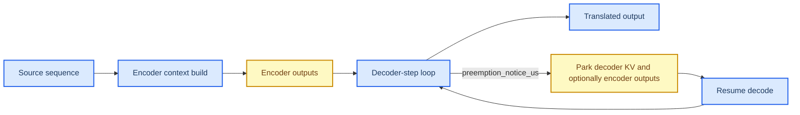

# M4 Translation Profile Packet

This document is the **next pilot profile packet** in the vRAN edge inference profiling workflow. It applies the layered methodology defined in `profile_doc.md` to **M4 Translation**, using the local review for the workload identity and the ComputeLease score-axis framing, while using primary papers and official project or vendor documentation for the baseline family, runtime family, and serving or resource-system analysis.

**Packet status:** provisional. This packet contains a defensible, evidence-backed first-pass recommendation and a provisional ComputeLease scorecard, but the final scores are not closed until lease-trace or lease-equivalent experiments are run on a concrete stack.

## 🎯 Packet goal

The goal of this packet is to answer four questions for **M4 Translation**:

1. What is the most defensible **baseline model family** for a first edge-facing implementation?
2. Which **runtime family** is the best first execution layer for that baseline?
3. Which **serving or resource-system mechanisms** matter most for ComputeLease compliance?
4. What provisional ComputeLease scores are justified today, and which claims still require Adaptation Hypotheses, or AHs?

## 🧩 Category and workload row

The local review defines **M4 Translation** as a **Seq2Seq Transformer** workload whose decisive streaming state remains on the **decoder side**, even though the model has an additional fixed **encoder-output cache** that decoder-only LLMs do not have. The local review already treats M4 as highly aligned with **decoder-step** boundaries while explicitly warning that the parked state may need to include **encoder outputs** as well as decoder KV.[^local-review]

This packet therefore treats M4 through a **hierarchical execution-unit ladder** and separates three things explicitly:

- what the model family and local review prove,
- what the runtime can actually expose as schedulable work, and
- what the current stack can justify as a safe-stop boundary under a lease.

Local anchors for this packet are:

- `progress/unified_vran_edge_inference_sota_review_2022_2026.md`, summary matrix rows and the dedicated M4 section,
- the ComputeLease score-axis definitions in the same file,
- the local M4 taxonomy block that identifies **decoder-step / per-token step** as the strongest currently justified serving-level boundary, and
- the M4 system sections for **vLLM/PagedAttention, Orca, DistServe, SpotServe, and CacheGen**.

| Field | Value |
| --- | --- |
| Category | Translation |
| Workload in doc | M4 Translation |
| Model archetype | Encoder-decoder / seq2seq Transformer |
| Delivery mechanism | Streaming |
| Phase decomposition | Encoder context build, decoder-step generation |
| Smallest algorithmic primitive | Encoder attention/MLP ops, decoder attention/MLP ops, cross-attention ops |
| Runtime-exposed schedulable unit | Decoder iteration / token-step; encoder stage and prefill chunk only as imported candidate units |
| Smallest justified safe-stop boundary | Decoder-step boundary for the first stack; encoder-stage and chunk boundaries only when explicitly surfaced and validated |
| Key parked state at safe-stop boundary | Decoder KV cache plus optionally cached encoder outputs |
| Dominant profiling layer | Runtime, then serving/resource-system, with mandatory model support |

### Execution-unit selection decision

| Candidate unit | Selected as profiling primitive? | Selected as current safe scheduling sub-unit? | Why selected or not selected | Provenance |
| --- | --- | --- | --- | --- |
| **Encoder/decoder/cross-attention sub-ops** | **Yes** | **No** | Selected for profiling because they explain the extra encoder-output state, cross-attention memory use, and encoder/decoder asymmetry below request level. Not selected as the current safe scheduling sub-unit because the current M4 stacks do not provide a recoverable partial-progress contract or bounded reclaim proof at that level. | **Direct in external source** for operator structure; **packet synthesis** for rejection |
| **Encoder stage / context-build chunk** | **Yes** | **Not selected by default; conditionally selectable** | Selected for profiling because the local review and systems like DistServe show that encoder-side context-build can be separated or staged. Not selected as the current default safe scheduling sub-unit for the chosen first stack because the stack does not yet expose a documented chunk-local commit or bounded reclaim contract for encoder outputs. It becomes selectable only after that validation. | **Direct in local review** for encoder-stage distinction, plus **external source** for staged/disaggregated context build; final safe-stop selection remains **packet synthesis + AH** |
| **Decoder-step / per-token step** | **Yes** | **Not selected by default; imported candidate** | Selected for profiling because the local review and the M4 serving papers agree that the decoder iteration is the cleanest current lease boundary for seq2seq translation, with decoder KV as the dominant growing state. Not selected as the current default safe scheduling sub-unit for the chosen first stack because the thin CTranslate2 wrapper does not yet prove bounded reclaim and resume at decoder-step granularity. | **Direct in local review** plus **direct in external source** for the candidate boundary; **packet synthesis** for first-stack rejection |
| **Per-request boundary** | **Yes, as fallback** | **Yes (current default)** | Selected as the current default safe scheduling sub-unit because the chosen first stack is lightweight and translation-native but does not yet prove a lease-safe sub-request reclaim contract for decoder-step or encoder-stage boundaries. It is less flexible, but safer than assuming those internal boundaries without proof. | **Packet synthesis** from the safe-stop rule and current stack constraints |

## 🧠 Workload-aligned baseline family and practical deployment anchor

The **workload-aligned baseline family for M4** should remain a **multilingual encoder-decoder translation family**, with **NLLB-200 distilled-600M** as the higher-coverage quality reference and **M2M100-418M** as the smaller dense many-to-many baseline. This fit matches the local seq2seq framing better than decoder-only LLM translation alternatives because M4 explicitly needs an encoder-output state in addition to decoder KV.

Separately, the **selected practical deployment anchor for the first implementation packet** is **M2M100-418M**. This is not a claim that M2M100 is the single strongest translation family in absolute quality. It is the claim that M2M100-418M is the **most defensible first deployment anchor** for an M4 edge packet because it remains genuinely many-to-many, stays smaller than NLLB-distilled-600M, and has the cleanest direct runtime support through **CTranslate2**.[^m2m100-paper][^m2m100-doc][^ctranslate2-readme]

### Why M2M100-418M is the practical deployment anchor

- The M2M100 paper states that the model is a **true many-to-many multilingual translation model** between **any pair of 100 languages** without pivoting through English and reports **more than 10 BLEU gains** on direct non-English translation over prior systems.[^m2m100-paper]
- The official Transformers docs expose the **`facebook/m2m100_418M`** checkpoint and describe the required decoder-target-language handling directly.[^m2m100-doc]
- CTranslate2’s official support list directly includes **M2M-100**, which gives it a stronger practical deployment story for packet-1 edge use than NLLB-distilled, whose official model card warns that it is not intended for production deployment.[^ctranslate2-fairseq][^nllb-card]

### Challenger families kept in scope

| Family | Why it remains in scope | Role in this packet |
| --- | --- | --- |
| **NLLB-200 distilled-600M** | Strongest multilingual quality candidate in this set, with direct paper-level BLEU improvements and official 8-bit examples in Transformers docs, but explicit research/deployment caveats in the model card.[^nllb-paper][^nllb-readme][^nllb-doc][^nllb-card] | Primary quality/coverage reference |
| **SMaLL-100** | Explicitly designed for resource-constrained multilingual MT, reported as 3.6× smaller and 4.3× faster than M2M100-1.2B while remaining comparable.[^small100-paper][^small100-card] | Primary edge-first compact challenger |
| **Marian / OPUS-MT** | Smaller pair-specific MT family with clean CTranslate2 support and straightforward low-memory deployment. | Primary low-memory control baseline |

### Baseline selection rule

**AH-M4-BASELINE-MT:** Keep **NLLB-200 distilled-600M with M2M100-418M as the smaller dense comparator** as the workload-aligned M4 baseline framing, because that is the closest match to the local encoder-decoder translation identity while preserving a higher-coverage scientific reference.

**AH-M4-DEPLOY-M2M100:** Use **M2M100-418M** as the practical first deployment anchor because it best balances many-to-many coverage, model size, and direct runtime support for packet-1 edge profiling. Keep **SMaLL-100** as the compact edge challenger and **Marian / OPUS-MT** as the low-memory control baseline.

The workload-aligned baseline choice is justified by the local M4 framing plus the multilingual MT literature, while the exact deployment-anchor choice is supported primarily by **paper-level model evidence plus direct CTranslate2 runtime support**, not by a head-to-head M4 lease benchmark under a common edge-serving regime.

## 🔄 Candidate runtime families

The runtime layer is where M4’s encoder-decoder asymmetry becomes executable behavior. For M4, the key runtime questions are:

- Can the runtime manage both **decoder KV** and **encoder-output cache** explicitly enough to reason about leases?
- Can it expose useful **decoder-step** scheduling and perhaps chunking on the encoder/context-build side?
- Can it handle **quantization, memory pressure, and seq2seq state** on edge hardware?
- Is it practical on **NVIDIA edge servers** and **Jetson / embedded edge**?

| Runtime family | Role in this packet | Strong direct evidence | Practical recommendation |
| --- | --- | --- | --- |
| **CTranslate2** | Primary seq2seq edge runtime | Official docs and README state support for **M2M-100, NLLB, Marian, mBART, T5**, with **INT8 / INT16 / FP16 / BF16 / AWQ**, **AArch64/ARM64**, and explicit APIs like `unload_model(to_cpu=True)` for moving state off GPU/CPU memory.[^ctranslate2-readme][^ctranslate2-translator][^ctranslate2-fairseq] | **Primary runtime for the first packet** |
| **ONNX Runtime** | Portable secondary runtime | Official docs support transformer quantization, cross-platform execution providers, Android/mobile builds, and the TensorRT EP when available.[^ort-home][^ort-quant][^ort-mobile][^ort-trt] | **Secondary runtime**, especially when mobile or platform portability matters more than translation-native features |
| **vLLM / PagedAttention** | Decoder-oriented serving/runtime hybrid | Directly supports decoder-KV paging and memory efficiency, and the local review maps it to the decoder side of translation. But official model support for classical encoder-decoder MT remains limited / plugin-driven. | Strong reference mechanism, not packet-1 default runtime |
| **TensorRT-LLM** | NVIDIA-specific encoder-decoder runtime/server path | Official docs provide explicit encoder/decoder engine handling and `cross_kv_cache_fraction` controls for encoder-decoder deployment, but model support and Jetson support remain narrower than CTranslate2 for packet-1 MT.[^trtllm-encdec][^trtllm-support] | NVIDIA-server probe, not the packet-1 default |

### Runtime conclusion

The first packet should use:

- **Primary runtime family:** `CTranslate2`
- **Secondary runtime family:** `ONNX Runtime`
- **Reference decoder-oriented mechanism/runtime:** `vLLM / PagedAttention`
- **Reference NVIDIA-server probe:** `TensorRT-LLM`

For M4, the runtime ladder is:

- **smallest algorithmic primitive:** encoder / decoder / cross-attention sub-ops,
- **runtime-exposed schedulable unit in the current stack:** decoder-step by default; encoder-stage and chunked context-build only as imported candidate units,
- **smallest justified safe-stop boundary for the first stack:** decoder-step boundary by default, with encoder-stage parking only when the chosen stack validates it.

In other words, operator-level kernels are **not selected** as the current safe scheduling sub-unit even though they are still **selected for profiling**. CTranslate2 is the most defensible packet-1 runtime because it is the strongest translation-native runtime with direct model-family support for M4.

## 🏗️ Candidate serving and resource-system families

For M4, the serving/resource-system layer is where the packet must remain careful: translation inherits much of M3’s decoder-side structure, but also carries extra encoder-output state. The local review already treats the M4 systems as mostly **serving/runtime systems** rather than pure runtimes.

| Family | Type | What it contributes | Packet role |
| --- | --- | --- | --- |
| **Thin in-process microservice + systemd/k3s/Compose** | Lightweight serving/resource path | Best fit to CTranslate2 on edge, with minimal orchestration overhead and clear ownership of encoder-output state. | **Primary deployment serving path for the first packet** |
| **vLLM / PagedAttention** | Serving/runtime hybrid | Strong direct decoder-KV paging and memory efficiency; the local review already maps it to translation by carrying encoder outputs separately.[^local-review][^vllm-paper][^vllm-repo] | Imported mechanism evidence and secondary serving path |
| **Orca** | Serving/runtime system | Strongest direct iteration-level scheduling evidence for decoder-step micro-segmentation.[^orca-paper] | Imported mechanism evidence |
| **DistServe** | Serving/resource system | Strongest direct prefill/decode disaggregation pattern for seq2seq, but server-scale and multi-GPU oriented.[^distserve-paper][^distserve-repo] | Imported architectural pattern |
| **SpotServe** | Serving/resource system | Strongest direct preemption-aware commit/recovery evidence, but explicitly cloud/preemptible-instance oriented.[^spotserve-paper][^spotserve-repo] | Imported preemption mechanism |
| **CacheGen / LMCache** | State-parking subsystem | Strongest direct parked-state mechanism for decoder KV and chunked transfer, though extending it to encoder outputs is still an M4-specific adaptation.[^cachegen-paper][^cachegen-doc] | Imported parking mechanism |

### Serving/resource conclusion

The first M4 packet should use:

- **Primary packet-1 experimental wrapper:** `Thin in-process microservice + systemd/k3s/Compose`
- **Imported mechanism evidence:** `vLLM / PagedAttention`, `Orca`, `DistServe`, `SpotServe`, `CacheGen / LMCache`
- **Secondary serving/runtime path:** `vLLM / PagedAttention`

This gives a practical first implementation path while preserving the local M4 framing: the packet-1 wrapper stays translation-native and lightweight, while the research systems provide the richer ComputeLease mechanism evidence that the chosen stack does not directly expose. The imported M4 systems should therefore be read as **mechanism evidence**, not as proof that the packet-1 runtime already closes lease semantics by itself.

## 🔬 Model-layer findings

At the model layer, M4 behaves like an M3-style decoder process with one extra class of state: a fixed encoder-output cache.

### Direct model-layer takeaways

- The local review explicitly states that the dominant growing state for M4 still resides on the **decoder side**, with the **encoder outputs** treated as a fixed tensor that may need to be cached or parked.[^local-review]
- The local review also makes clear that M4’s decisive cooperative boundary remains the **decoder-step (iteration) boundary** where decoder KV eviction/parking is safe.[^local-review]
- This means the first M4 design question is not whether the decoder behaves like M3 — it largely does — but whether the runtime/serving stack can also handle the **additional fixed encoder-output state** under the same lease budget.

### Model-layer conclusion

For M4, the model layer is a real gate because the stack must handle **two state classes**: growing decoder KV and fixed encoder outputs. The correct interpretation is a ladder: **encoder/decoder/cross-attention primitives** below, **decoder-step and optional encoder-stage or context-build chunks** in the middle, and **decoder-step** as the strongest current safe default. If no validated encoder-state parking path exists, the packet should still fall back to **decoder-step** rather than pretending the encoder stage is safely parkable.

## ⚙️ Runtime-layer findings

The runtime layer determines whether the M4 state asymmetry can be executed and budgeted under edge constraints.

### Strongest direct mechanism evidence from the literature and docs

- **CTranslate2** directly supports the main M4 model families and exposes explicit memory-management controls such as `unload_model(to_cpu=True)` and quantized inference for seq2seq models.[^ctranslate2-readme][^ctranslate2-translator][^ctranslate2-fairseq]
- **vLLM / PagedAttention** directly provides KV paging and near-zero-waste memory management, but the local review itself already narrows that evidence mainly to the **decoder side** of translation.[^local-review][^vllm-paper][^vllm-repo]
- **Orca** directly supports **iteration-level scheduling**, making it the strongest direct source for decoder-step micro-segmentation.[^orca-paper]
- **DistServe** directly supports **prefill/decode disaggregation**, which the local review reinterprets for translation as **encoder + decoder-prefill** versus steady decoder generation.[^local-review][^distserve-paper][^distserve-repo]
- **CacheGen / LMCache** directly supports chunked parked-state transfer for decoder KV, though using it for encoder outputs remains an M4-specific adaptation.[^cachegen-paper][^cachegen-doc]

### Runtime conclusion

For M4, the runtime ladder is:

- **smallest algorithmic primitive:** encoder / decoder / cross-attention sub-ops,
- **runtime-exposed schedulable unit in the current stack:** decoder-step by default; encoder-stage and chunked context-build only as imported candidate units,
- **smallest justified safe-stop boundary for the first stack:** decoder-step boundary by default, with encoder-stage parking only when the chosen stack validates it.

The first packet should therefore keep **CTranslate2** primary and treat decoder-step as the current default lease boundary, while using the other systems as imported evidence for more advanced paging, disaggregation, and parking mechanisms.

## 🖧 Serving and resource-system findings

The serving/resource-system layer is where M4 should stay more conservative than M3. The local review already shows that M4 inherits M3’s decoder-step friendliness, but the extra encoder-output state makes aggressive serving claims easier to overstate.

### Strongest direct mechanism evidence from the local review and official docs

- **vLLM / PagedAttention** is directly relevant to the **decoder side** of translation, with the local review explicitly mapping decoder KV paging and eviction to M4 while calling out encoder outputs as extra state.[^local-review]
- **Orca** directly supports decoder iteration scheduling and slot-based decoder KV admission.[^orca-paper]
- **DistServe** directly supports the best current architecture pattern for separating **context build** from **steady decode** in seq2seq translation, but it is multi-GPU and server-oriented.[^distserve-paper][^distserve-repo]
- **SpotServe** directly supports preemption-aware commit/recovery and remote context persistence, but remains cloud/preemptible-instance oriented rather than edge-first.[^spotserve-paper][^spotserve-repo]
- **CacheGen / LMCache** directly supports decoder-KV parking as compressed chunks; the M4 adaptation is to decide whether encoder outputs should also be parked or simply recomputed.[^cachegen-paper][^cachegen-doc]

### Serving/resource conclusion

The first M4 packet should use:

- **Primary packet-1 experimental wrapper:** `Thin in-process microservice + systemd/k3s/Compose`
- **Imported mechanism evidence:** `vLLM / PagedAttention`, `Orca`, `DistServe`, `SpotServe`, `CacheGen / LMCache`
- **Secondary serving/runtime path:** `vLLM / PagedAttention`

This gives a practical first implementation path while preserving the local M4 logic: the deployment stack stays translation-native and lightweight, while the research systems provide the richer ComputeLease mechanism evidence that the production stack does not directly expose. The imported M4 systems should therefore be read as **mechanism evidence**, not as proof that the packet-1 runtime already closes lease semantics by itself.

## 📊 Provisional ComputeLease scorecard

This scorecard is for the **first implementation target**, not for M4 in the abstract.

**Target stack:** `M2M100-418M` → `CTranslate2` → `thin in-process microservice + systemd/k3s/Compose` as a packet-1 experimental wrapper, with optional future imported bridge mechanisms for decoder KV parking and encoder-output parking.

| Axis | Provisional score | Evidence level | Notes | ComputeLease fields |
| --- | --- | --- | --- | --- |
| **Preemption Resilience** | **Low** | **Inferred** | Decoder-step is the strongest imported candidate boundary, but the chosen stack still needs explicit proof that encoder outputs and decoder KV can be reclaimed/resumed under the same lease budget. | `preemption_notice_us`, `reclaim_mode`, `duration_us` |
| **Micro-Segmentation** | **Medium** | **Inferred** | Decoder-step scheduling is directly supported by the imported M4 serving literature, but encoder-stage chunking and per-lease budgeting are still imported mechanisms rather than demonstrated properties of the chosen stack. | `duration_us`, `sm_budget_sms` |
| **State Parking** | **Low** | **Inferred** | Decoder-KV parking is well supported in the imported systems, but the chosen packet-1 stack still needs a concrete decision on whether encoder outputs are cached, parked, or recomputed. | `reclaim_mode`, `bandwidth_budget_hint`, `vram_budget_bytes` |
| **Tight VRAM Compliance** | **Medium** | **Inferred** | M4 can keep live decoder KV and fixed encoder outputs under control, but strict `vram_budget_bytes` compliance still depends on conservative model choice and explicit admission policy. | `vram_budget_bytes` |

### Score interpretation

M4 is stronger than M1/M2/M5 on serving-level segmentation because **decoder-step** remains a natural cooperative boundary, but weaker than M3 because it carries a second important state object: the **encoder outputs**. For the chosen first stack, however, the current default safe boundary remains **per-request**, while decoder-step remains the strongest imported candidate and encoder-stage chunking remains an imported candidate rather than a demonstrated packet-1 behavior.

## 🛠️ Implementation Feasibility

Implementation Feasibility is kept separate from the four score axes, exactly as required by `profile_doc.md`.

| Platform class | Feasibility score | Why |
| --- | --- | --- |
| **NVIDIA edge server** | **High** | M2M100-418M or a similar seq2seq model with CTranslate2 on a single-GPU NVIDIA edge server is practical and keeps the serving stack light. |
| **Jetson / embedded edge** | **Medium** | Translation is feasible, but the combination of encoder outputs and decoder KV makes memory control more delicate than in decoder-only M3 cases. |

### Practical platform split

- **Jetson or embedded first implementation:** `M2M100-418M` + `CTranslate2` + thin in-process microservice
- **Server-edge shadow track:** `M2M100-418M` or `NLLB-200 distilled-600M` + `CTranslate2` or `TensorRT-LLM` probe + lightweight serving wrapper

## 📌 Direct evidence and Adaptation Hypothesis register

| ID | Type | Claim |
| --- | --- | --- |
| **D-M4-1** | Direct | The local review identifies **decoder-step / per-token step** as the strongest currently justified M4 serving-level boundary and **decoder KV + encoder outputs** as the relevant parked state.[^local-review] |
| **D-M4-2** | Direct | vLLM / PagedAttention directly supports decoder-KV paging and eviction, and the local review explicitly maps that primarily to the decoder side of translation.[^local-review][^vllm-paper][^vllm-repo] |
| **D-M4-3** | Direct | Orca directly supports iteration-level scheduling and slot-based KV admission for the decoder side.[^orca-paper] |
| **D-M4-4** | Direct | DistServe directly supports disaggregation that the local review reinterprets as **encoder + decoder-prefill** versus steady decode for translation.[^local-review][^distserve-paper][^distserve-repo] |
| **D-M4-5** | Direct | SpotServe directly supports preemption-aware commit/recovery and migratable parked state, though on cloud/preemptible infrastructure.[^spotserve-paper][^spotserve-repo] |
| **D-M4-6** | Direct | CacheGen / LMCache directly supports chunked parked-state transfer for decoder KV.[^cachegen-paper][^cachegen-doc] |
| **D-M4-7** | Direct | M2M100 is a true many-to-many 100-language encoder-decoder model with >10 BLEU gains on direct non-English translation.[^m2m100-paper] |
| **D-M4-8** | Direct | The official Transformers docs expose the `facebook/m2m100_418M` checkpoint and the required language-token handling.[^m2m100-doc] |
| **D-M4-9** | Direct | CTranslate2 directly supports M2M100, NLLB, Marian, and other seq2seq families with quantized and AArch64/GPU execution modes.[^ctranslate2-readme][^ctranslate2-fairseq] |
| **D-M4-10** | Direct | NLLB-200-distilled-600M provides the strongest quality/coverage evidence in this set, but the official model card says it is research-only and not intended for production deployment.[^nllb-paper][^nllb-card] |
| **AH-M4-1** | Adaptation Hypothesis | The workload-aligned M4 baseline framing should remain **NLLB-200 distilled-600M with M2M100-418M as the smaller dense comparator**. |
| **AH-M4-2** | Adaptation Hypothesis | The first packet should use **M2M100-418M** as the practical deployment anchor because it best balances many-to-many capability, size, and direct runtime support. |
| **AH-M4-3** | Adaptation Hypothesis | The first packet should choose **CTranslate2 + thin in-process microservice** only as the practical packet-1 experimental wrapper for edge translation, not as a proven serving-semantic endpoint. |
| **AH-M4-4** | Adaptation Hypothesis | Encoder-stage chunk boundaries should be treated as imported candidate units only after the chosen stack demonstrates bounded drain and reclaim behavior for cached encoder outputs. |
| **AH-M4-5** | Adaptation Hypothesis | If the deployment prioritizes decoder-state observability over model-family breadth, a secondary `TensorRT-LLM` probe on a smaller encoder-decoder family can complement the primary `CTranslate2` path. |

## 📚 Source register

### Local anchors

- `profile_doc.md`
- `progress/unified_vran_edge_inference_sota_review_2022_2026.md`
- `progress/ppt.md`

### External primary sources and official docs

[^local-review]: `progress/unified_vran_edge_inference_sota_review_2022_2026.md`, M4 local taxonomy block and M4 system sections.
[^vllm-paper]: Kwon et al. “Efficient Memory Management for Large Language Model Serving with PagedAttention.” SOSP 2023. https://doi.org/10.1145/3600006.3613165
[^vllm-repo]: vLLM official repository. https://github.com/vllm-project/vllm
[^orca-paper]: Orca paper. https://www.usenix.org/conference/osdi22/presentation/yu
[^distserve-paper]: DistServe paper. https://www.usenix.org/conference/osdi24/presentation/zhong-yinmin
[^distserve-repo]: DistServe repository. https://github.com/LLMServe/DistServe
[^spotserve-paper]: SpotServe paper. https://doi.org/10.1145/3620665.3640411
[^spotserve-repo]: SpotServe repository. https://github.com/Hsword/SpotServe
[^cachegen-paper]: CacheGen paper. https://doi.org/10.1145/3651890.3672274
[^cachegen-doc]: LMCache CacheGen docs. https://docs.lmcache.ai/kv_cache_optimizations/compression/cachegen.html
[^m2m100-paper]: M2M-100 paper. https://arxiv.org/abs/2010.11125
[^m2m100-doc]: Transformers M2M100 docs. https://huggingface.co/docs/transformers/main/en/model_doc/m2m_100
[^ctranslate2-readme]: CTranslate2 official repository. https://github.com/OpenNMT/CTranslate2
[^ctranslate2-translator]: CTranslate2 Translator API docs. https://opennmt.net/CTranslate2/python/ctranslate2.Translator.html
[^ctranslate2-fairseq]: CTranslate2 Fairseq model support docs. https://opennmt.net/CTranslate2/guides/fairseq.html
[^ort-home]: ONNX Runtime docs. https://onnxruntime.ai/docs/
[^ort-quant]: ONNX Runtime transformer quantization docs. https://onnxruntime.ai/docs/performance/model-optimizations/quantization.html
[^ort-mobile]: ONNX Runtime mobile docs. https://onnxruntime.ai/docs/tutorials/mobile/
[^ort-trt]: ONNX Runtime TensorRT EP docs. https://onnxruntime.ai/docs/execution-providers/TensorRT-ExecutionProvider.html
[^nllb-paper]: NLLB paper. https://arxiv.org/abs/2207.04672
[^nllb-readme]: NLLB modeling README. https://github.com/facebookresearch/fairseq/blob/nllb/examples/nllb/modeling/README.md
[^nllb-doc]: Transformers NLLB docs. https://huggingface.co/docs/transformers/main/en/model_doc/nllb
[^nllb-card]: NLLB-200-distilled-600M model card. https://huggingface.co/facebook/nllb-200-distilled-600M
[^small100-paper]: SMaLL-100 paper. https://arxiv.org/abs/2210.11621
[^small100-card]: SMaLL-100 model card. https://huggingface.co/alirezamsh/small100
[^trtllm-encdec]: TensorRT-LLM encoder-decoder README. https://github.com/NVIDIA/TensorRT-LLM/blob/main/examples/enc_dec/README.md
[^trtllm-support]: TensorRT-LLM support matrix. https://nvidia.github.io/TensorRT-LLM/reference/support-matrix.html

## 🧾 Packet conclusion

For **M4 Translation**, the local review already gives the correct high-level answer: this is a **seq2seq, decoder-step friendly, extra-state** workload. The most useful packet-1 move is therefore not to force it into a decoder-only serving stack, but to choose a runtime that is translation-native today while keeping the richer serving/resource mechanisms available for later refinement.

**Recommended first implementation target:**

- **Workload-aligned baseline family:** `NLLB-200 distilled-600M with M2M100-418M as smaller dense comparator`
- **Practical deployment anchor:** `M2M100-418M`
- **Primary runtime family:** `CTranslate2`
- **Primary packet-1 experimental wrapper:** `Thin in-process microservice + systemd/k3s/Compose`
- **Secondary serving/runtime path:** `vLLM / PagedAttention`
- **Primary compact challenger:** `SMaLL-100`

In short, M4 should be implemented as **per-request safe by default, decoder-step as the strongest imported candidate boundary, encoder-output aware, translation-native, and lease-bridged from the start**, because unlike M3, the extra fixed encoder-output state must be handled explicitly rather than assumed away.