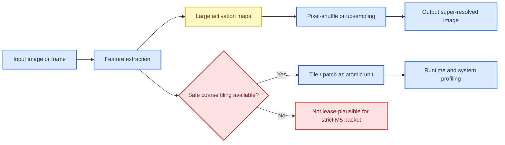

# M5 Super Resolution Profile Packet

This document is the **second pilot profile packet** in the vRAN edge inference profiling workflow. It applies the layered methodology defined in `profile_doc.md` to **M5 Super Resolution**, using the local review only for the workload identity and the ComputeLease score-axis framing, while using primary papers and official project or vendor documentation for the baseline family, runtime family, and serving or resource-system analysis.

**Packet status:** provisional. This packet contains a defensible, evidence-backed first-pass recommendation and a provisional ComputeLease scorecard, but the final scores are not closed until lease-trace or lease-equivalent experiments are run on a concrete stack.

## 🎯 Packet goal

The goal of this packet is to answer four questions for **M5 Super Resolution**:

1. What is the most defensible **baseline model family** for a first edge-facing implementation?
2. Which **runtime family** is the best first execution layer for that baseline?
3. Which **serving or resource-system mechanisms** matter most for ComputeLease compliance?
4. What provisional ComputeLease scores are justified today, and which claims still require Adaptation Hypotheses, or AHs?

## 🧩 Category and workload row

The local review defines **M5 Super Resolution** as an **ESRGAN-like one-shot workload** with a **Feature Extraction → Pixel-shuffle (upsampling)** phase decomposition and **poor preemptibility** because the workload is **activation-heavy**, has **low batch headroom**, and incurs high cost when interrupted mid-layer. This packet now treats M5 through a **hierarchical execution-unit ladder** rather than a single natural unit. The local M5 taxonomy still identifies coarse tile or patch boundaries as the strongest serving-level fallback, but the revised strategy now records the lower operator structure explicitly instead of collapsing it into the tile.

Local anchors for this packet are:

- `progress/unified_vran_edge_inference_sota_review_2022_2026.md`, summary matrix rows for M5,
- the ComputeLease score-axis definitions in the same file,
- the local M5 taxonomy block that identifies **per-inference / coarse tile (tiling)** as the strongest currently justified serving-level fallback, and
- the revised profiling strategy in `profile_doc.md`, which now requires the full execution-unit ladder in every packet.

| Field | Value |
| --- | --- |
| Category | Computer vision models |
| Workload in doc | M5 Super Resolution |
| Model archetype | CNN / GAN / transformer SR family |
| Delivery mechanism | One-shot |
| Phase decomposition | Feature extraction, upsampling, stitching or output composition |
| Smallest algorithmic primitive | Convolution, upsampling, attention or MLP sub-ops, residual blocks |
| Runtime-exposed schedulable unit | Host-managed tile or patch sub-inference in the current TensorRT + Triton stack |
| Smallest justified safe-stop boundary | Validated external tile boundary; otherwise end of full inference request |
| Key parked state at safe-stop boundary | Tile completion state and stitch or accumulator buffers; otherwise none before request completion |
| Dominant profiling layer | **Model first**, then runtime, then serving/resource-system |

### Execution-unit selection decision

| Candidate unit | Selected as profiling primitive? | Selected as current safe scheduling sub-unit? | Why selected or not selected | Provenance |
| --- | --- | --- | --- | --- |
| **Operator-level conv / upsampling / attention / residual-block structure** | **Yes** | **No** | Selected for profiling because it explains compute shape, activation pressure, and kernel/runtime behavior below the tile. Not selected as the current safe scheduling sub-unit because the current TensorRT/CUDA stack does not expose a recoverable partial-progress contract there, and stopping mid-operator or mid-layer would leave unsafe activation state. | **Packet synthesis** from local M5 framing plus external runtime/model evidence |
| **Host-managed tile or patch sub-inference** | **Yes** | **Conditionally yes** | Selected for profiling because tile mode exists in practical SR stacks and because tiles are the first plausible serving-level unit above operator structure. Selected as the current safe scheduling sub-unit only when the deployment path actually externalizes tiles with validated overlap, seam, runtime envelopes, **and bounded reclaim behavior**. | **Direct in local review** for coarse-tile fallback, plus **direct in external source** for tile support; final safe-stop selection remains **packet synthesis + AH** |
| **End-of-request boundary** | **Yes, as fallback** | **Fallback yes** | Selected as the fallback safe scheduling sub-unit when the stack cannot externalize tiles safely. Not preferred because it gives the weakest lease flexibility, but it is safer than assuming an internal operator or tile boundary without proof. | **Packet synthesis** from the safe-stop rule |

## 🧠 Selected baseline model family

The **selected baseline family for the first implementation packet is the Real-ESRGAN family**, with **`RealESRGAN_x4plus`** as the quality anchor and **`realesr-general-x4v3`** as the edge-small companion. This is not a claim that Real-ESRGAN is the single strongest SR family in absolute quality. It is the claim that Real-ESRGAN is the **most defensible first baseline family** for an M5 edge packet because it combines strong practical deployment affordances, explicit tiling support, mature open implementations, and compatibility with the runtime families most credible on NVIDIA edge systems.[^realesrgan-repo]

This choice is intentionally narrower than the broader M5 snapshot in `profile_doc.md`, which keeps **Real-ESRGAN** and **SwinIR** as the primary baselines and allows heavier families like **HAT** to remain in view. The present packet is a **deployment-first M5 pilot**, not a claim about the best abstract SR model family under unlimited hardware.

### Why the Real-ESRGAN family is the primary baseline family

- The official Real-ESRGAN repository exposes a **mature inference path** with explicit **tile-based inference** controls (`--tile`, `--tile_pad`, prepadding) and default **FP16 / half-precision** execution, which is directly relevant to tight-VRAM edge deployment.[^realesrgan-repo]
- The same repository also provides a mature **NCNN**-based deployment path and small variants such as **`realesr-general-x4v3`**, which strengthens its role as a first packet baseline even when the runtime layer later narrows to NVIDIA-focused choices.[^realesrgan-repo]
- The Real-ESRGAN paper remains highly visible and established in the SR literature, and its deployment ecosystem is materially stronger than that of many equally strong but heavier quality-only baselines.[^realesrgan-paper]

### Challenger families kept in scope

| Family | Why it remains in scope | Role in this packet |
| --- | --- | --- |
| **SwinIR** | Strong accuracy reference with official tile mode and broad academic adoption, but heavier runtime and memory profile than deployment-first CNN choices.[^swinir-repo][^swinir-paper] | Primary challenger when quality matters more than first-pass edge simplicity. |
| **HAT** | Strong quality ceiling and official tile mode, but much heavier parameter and compute profile, making it a quality-reference family rather than a first edge packet default.[^hat-repo][^hat-paper] | Secondary challenger / upper-bound quality reference. |
| **ESPCN / FSRCNN / IMDN / ShuffleMixer family** | Lightweight, efficient, and deployment-friendly SR families with direct paper-level claims around real-time, low computing power, or lightweight efficiency.[^espcn-paper][^fsrcnn-paper][^imdn-paper][^shufflemixer-paper] | Useful latency-floor or memory-floor baselines if the packet later needs a stricter low-resource comparison set. |

The **ESPCN / FSRCNN / IMDN / ShuffleMixer** row is included as **baseline provenance for low-resource SR**, not as a claim that these older or efficiency-oriented families define the current 2022–2026 SOTA frontier.

### Baseline selection rule

**AH-M5-BASELINE-REALESRGAN:** Use the **Real-ESRGAN family** as the first baseline family because it provides the best trade-off between practical SR quality, explicit tiling support, deployment maturity, and runtime compatibility for a first M5 edge packet. Keep **SwinIR** as the main accuracy challenger and **HAT** as the quality-ceiling reference.

This baseline-family choice is supported primarily by **official deployment affordances and model-family maturity**, not by a peer-reviewed head-to-head edge benchmark across all candidate families. It should therefore be read as a practical pilot choice, not as a universal model-ranking claim.

## 🔄 Candidate runtime families

The runtime layer is where M5’s model-family claims become executable behavior. For M5, the key runtime questions are:

- Can the runtime survive **large activation pressure** without forcing a full custom stack?
- Does it support **fixed-shape or narrow-profile deployment** with manageable memory behavior?
- Does it allow **tile or patch based execution** so M5 can be model-gated into lease-plausible subunits?
- Is it practical on **NVIDIA edge server** and **Jetson / embedded edge** hardware?

| Runtime family | Role in this packet | Strong direct evidence | Practical recommendation |
| --- | --- | --- | --- |
| **TensorRT** | Primary NVIDIA edge runtime | Official docs position TensorRT as NVIDIA’s inference optimizer and runtime with **ONNX import**, **dynamic shapes**, **optimization profiles**, **FP16 / INT8** support, and DLA support on Jetson-class systems where applicable.[^tensorrt-overview][^tensorrt-dyn][^tensorrt-support] | **Primary runtime for the first packet**, especially on NVIDIA edge servers and Jetson-class deployments. |
| **ONNX Runtime + TensorRT EP** | Portable secondary runtime | Official docs expose **TensorRT Execution Provider** support, engine caching, timing cache, FP16/INT8 options, dynamic shape profile controls, and a Jetson build path.[^ort-trt][^ort-build] | **Secondary runtime**, especially when ONNX portability matters more than using TensorRT directly. |
| **NCNN** | Lightweight portable runtime | Official repo positions ncnn as a **high-performance inference framework optimized for mobile platforms**, with cross-platform support including Jetson-class targets and zero third-party dependencies.[^ncnn] | Optional portability path when NVIDIA-only assumptions are relaxed. |
| **OpenVINO Runtime** | Intel-edge runtime | Official docs support CPU, GPU, and NPU inference plus local deployment tuning, but this is not the first-path choice for the NVIDIA-focused M5 packet.[^openvino-run][^openvino-opt] | Reference path only, not first packet primary. |

### Runtime conclusion

The first M5 packet should use:

- **Primary runtime family:** `TensorRT`
- **Secondary runtime family:** `ONNX Runtime + TensorRT EP`
- **Portable reference runtime family:** `NCNN`

TensorRT is the strongest first runtime because it aligns directly with the target deployment envelope and gives the clearest path to fixed-tile, low-latency, FP16-first deployment on NVIDIA edge hardware.

**AH-M5-RUNTIME-TENSORRT:** For the first packet, optimize for **NVIDIA-native deployability and explicit memory-shaping through tiles and profiles**, rather than for maximum portability. That makes `TensorRT` the most defensible first runtime for M5.

## 🏗️ Candidate serving and resource-system families

For M5, the serving/resource-system layer is not the first gate. The packet follows the local methodology that M5 must be **model-gated first** because poor preemptibility and activation-heavy state mean that system-level elegance cannot rescue a bad model/runtime pairing. Still, the packet must identify the systems that matter later for score closure.

| Family | Type | What it contributes | Packet role |
| --- | --- | --- | --- |
| **Triton Inference Server** | Serving system | Officially supports **edge and embedded devices**, **dynamic batching**, **concurrent model execution**, **ensemble pipelines**, **HTTP/gRPC**, and an **in-process C API** on Jetson-class platforms.[^triton-jetson][^triton-home] | **Primary serving system for the first packet** |
| **DeepStream** | Streaming-serving / pipeline system | Official NVIDIA streaming framework with TensorRT / Triton integration and Jetson support; strongest when M5 is part of a video pipeline rather than a generic request-response service.[^deepstream] | Streaming-specific reference, not the first generic serving choice |
| **MPS** | Resource-sharing system | NVIDIA’s Multi-Process Service provides lightweight cooperative multi-process GPU sharing and reduced context switching overhead.[^mps] | Soft-sharing / concurrency reference mechanism |
| **MIG** | Resource-partitioning system | NVIDIA MIG provides hard isolation with **dedicated compute and memory resources** on supported GPUs.[^mig] | Hard isolation / slice-cap enforcement reference mechanism |
| **USHER** | Serving-runtime evidence | Strong evidence for interference-aware placement and explicit activation-memory estimation under shared GPU serving.[^usher] | Imported mechanism evidence |
| **Orion** | Resource-manager evidence | Strong evidence for operator-level scheduling at **10s–1000s of microseconds**, but no direct activation parking.[^orion-paper] | Imported mechanism evidence |
| **Aqua** | Resource-manager evidence | Strong evidence for fast preemptive scheduling under memory contention via **offloaded tensors** and neighbor-GPU memory use.[^aqua-paper][^aqua-docs] | Imported state-parking mechanism evidence |
| **Proteus** | Serving-runtime evidence | Strong evidence for **accuracy scaling**, **variant selection**, and fixed-resource edge adaptation.[^proteus-paper] | Imported variant-ladder mechanism evidence |

### Serving/resource conclusion

The first M5 packet should use:

- **Primary serving family:** `Triton Inference Server`
- **Imported mechanism evidence:** `USHER`, `Orion`, `Aqua`, `Proteus`
- **Streaming-specific alternative:** `DeepStream`
- **Isolation references:** `MPS`, `MIG`

This gives a practical first implementation path while still grounding the packet in stronger activation-memory, scheduling, offload, and variant-selection mechanisms than the first-pass stack natively provides. In this packet, `Triton` is treated as the **primary serving system**, while the lease-aware resource mechanisms are imported conceptually as **future-extension evidence** from USHER, Orion, Aqua, and Proteus. Neither `Triton`, `MPS`, nor `MIG` should be read as direct proof of cooperative pause/resume or activation parking for the first stack.

## 🔬 Model-layer findings

At the model layer, M5 is the **hard gate** in the profiling framework.

### Direct model-layer takeaways

- The local review marks M5 as **one-shot**, **activation-heavy**, and **poorly preemptible** mid-layer, with **coarse tile / patch segmentation** as the only plausible safe fallback at the serving level.[^local-review]
- The revised ladder makes the lower structure explicit: SR models are built from operator primitives below the tile, including **convolution, upsampling, attention or MLP sub-ops, and residual blocks**.[^srcnn-paper][^espcn-paper][^edsr-paper][^swinir-paper][^swinir-code]
- This means the first decision is not which serving layer is best. The first decision is whether the chosen SR family can surface a **validated tile boundary** above those lower primitives without unacceptable quality loss or seam artifacts.
- Real-ESRGAN, SwinIR, and HAT all expose **tile mode** in official repos, which is unusually important here because it provides a practical deployment affordance for coarse segmentation.[^realesrgan-repo][^swinir-repo][^hat-repo] However, repo-level tile support does **not** by itself prove that tiled execution is quality-safe, seam-safe, or already sized correctly for a target lease window.

### Model-layer risks

- **Activation pressure dominates** M5 more than weight footprint does, which means weight-only optimization stories are not enough.
- **Batching is a weak lever** for M5 because the local review and imported system evidence both indicate that SR headroom is usually close to batch size 1 under realistic memory pressure.[^local-review][^usher]
- **Mid-operator, mid-layer, or mid-tile interruption remains risky** because the in-flight state is large, short-lived activation state rather than a clean session object like a KV cache.

### Model-layer conclusion

For M5, the model layer is not just a positive gate. It is the **dominant early filter**. The correct interpretation is a ladder: **operator primitives** below, **runtime-visible layers or tile sub-inferences** in the middle, and a **validated tile boundary** only if the deployment stack actually externalizes tiles safely. If that validation fails, the safe-stop boundary falls back to **end-of-request**.

The explicit selection logic is therefore:

- **Operator-level conv / upsampling / attention / residual-block structure is selected for profiling but not selected as the current safe scheduling sub-unit** because the current stack does not provide recoverable partial-progress semantics there.
- **Host-managed tile or patch sub-inference is selected for profiling and conditionally selected as the current safe scheduling sub-unit** only when the deployment stack can externalize tiles safely and validate seam, overlap, and runtime behavior.
- **End-of-request is selected as the fallback safe scheduling sub-unit** whenever that tile-level validation is absent.

## ⚙️ Runtime-layer findings

The runtime layer determines whether the model-gated M5 workload can actually lift those lower primitives into lease-shaped work.

### Strongest direct mechanism evidence from the literature and docs

- **TensorRT** provides the strongest direct evidence for a deployable NVIDIA-native inference runtime with explicit **optimization profiles**, **dynamic shapes**, and low-precision deployment support.[^tensorrt-overview][^tensorrt-dyn][^tensorrt-support]
- **TensorRT** also exposes **layer and fused-layer profiling** plus detailed engine inspection, which is useful for primitive-level profiling, but that profiling visibility should not be confused with a safe-stop guarantee inside an active enqueue.[^trt-bench][^trt-inspector][^trt-exec]
- **CUDA** makes the lower runtime picture explicit: kernels are launched asynchronously onto **streams**, and ordinary stream lifecycle semantics do not provide a generic cooperative stop boundary for in-flight kernel work.[^cuda-async][^cuda-stream]
- **ONNX Runtime + TensorRT EP** provides the clearest direct portability path when M5 must stay in ONNX while still benefiting from TensorRT execution and caching features.[^ort-trt][^ort-build]
- **USHER** provides direct evidence that explicit **intermediate-memory estimation** and interference-aware placement are useful in activation-heavy one-shot inference, even though it does not directly provide SR tiling or activation checkpointing.[^usher]
- **Orion** provides the strongest direct evidence for operator-level scheduling, but the local review correctly notes that this does not by itself make activation-heavy SR safely preemptible.[^orion-paper]

### First-packet runtime decision

The first packet should still choose **TensorRT** as the primary runtime because:

1. it aligns directly with the target NVIDIA deployment envelope,
2. it provides the clearest path to **FP16-first tiled inference**,
3. it can be paired with Triton cleanly, and
4. it avoids the extra runtime indirection of ONNX Runtime when the final target is already NVIDIA-first.[^tensorrt-overview][^triton-home]

However, the revised M5 ladder for runtime interpretation is now:

- **smallest algorithmic primitive:** convolution, upsampling, attention or MLP sub-ops, and residual blocks,
- **runtime-exposed schedulable unit in the current stack:** host-managed tile or patch sub-inference, backed by TensorRT execution of lower-level layers and kernels,
- **smallest justified safe-stop boundary for the current stack:** validated external tile boundary; otherwise end of full inference request.

In other words, **ONNX Runtime + TensorRT EP** remains the strongest **reference portability runtime**, **NCNN** remains the strongest lightweight portable reference when the NVIDIA assumption is intentionally relaxed, but neither TensorRT profiling visibility nor Orion-style operator scheduling currently justifies a generic safe-stop boundary below the tile for the first packet. That is why operator-level structure is **not selected** as the current safe scheduling sub-unit even though it is still **selected for profiling**.

## 🖧 Serving and resource-system findings

The serving/resource-system layer is where the final packet must eventually close the ComputeLease scorecard, but for M5 it is downstream of the model and runtime gates.

### Strongest direct mechanism evidence from the literature

- **Aqua** is the strongest direct paper for **preemption-friendly memory offload** and **state parking**, although its direct evidence is for prompt-style inference context rather than SR activations.[^aqua-paper][^aqua-docs]
- **USHER** is the strongest direct paper for **activation-aware interference-conscious placement** and goodput optimization in one-shot inference serving.[^usher]
- **Orion** is the strongest direct paper for **microsecond-scale operator-level scheduling**, even though that does not fully solve M5’s activation checkpointing problem.[^orion-paper]
- **Proteus** is the strongest direct paper for **variant selection / accuracy scaling** under fixed edge resource constraints.[^proteus-paper]
- **Triton** is the strongest current production serving choice for **instantiating** the first packet because it gives concrete deployment and serving hooks without forcing the packet into a streaming/video-only architecture.[^triton-jetson][^triton-home]

### First-packet serving decision

The first packet should use **Triton Inference Server** as the primary serving layer, and import stronger mechanisms conceptually from:

- **USHER** for activation-aware placement and admission thinking,
- **Aqua** for off-VRAM parking analogies,
- **Orion** for fine-grained scheduling boundaries,
- **Proteus** for variant-ladder reasoning under scarce compute and memory.

This means the first implementation path is intentionally **practical first**, while the packet still preserves high-quality mechanism evidence from the strongest primary papers. In this packet, Triton instantiates the first serving path, while lower-level operator or kernel evidence remains **profiling structure** unless a future runtime explicitly turns it into a safe-stop boundary.

## 📊 Provisional ComputeLease scorecard

This scorecard is for the **first implementation target**, not for the entire M5 category in the abstract.

**Target stack:** `RealESRGAN_x4plus` or `realesr-general-x4v3` → `TensorRT` → `Triton`, with optional future addition of Aqua-like activation parking and a variant-ladder informed by Proteus.

| Axis | Provisional score | Evidence level | Notes | ComputeLease fields |
| --- | --- | --- | --- | --- |
| **Preemption Resilience** | **Low** | Direct + Inferred | Direct mechanism evidence exists in Aqua and Orion, but the chosen first-pass stack does not yet provide a direct published activation-checkpointing or safe pause backend for M5. Safe interruption remains closer to a **validated external tile boundary**, and otherwise to full-request completion, than to arbitrary operator boundaries. | `preemption_notice_us`, `reclaim_mode`, `duration_us` |
| **Micro-Segmentation** | **Low** | Direct + Inferred | M5 now has an execution-unit ladder: operator primitives below, TensorRT-profiled layers and kernels in the middle, and coarse tiles as the first plausible serving-level fallback. For the chosen first-pass stack, coarse tile or patch units still require explicit validation for tile duration, overlap, and quality behavior before they can count as safe lease units. | `duration_us`, `sm_budget_sms`, `start_time_us` |
| **State Parking** | **Low** | Direct + Inferred | Direct parking mechanisms exist in Aqua, but they concern dynamic inference state in other workloads, not M5 activations directly. The chosen first-pass stack does not yet implement activation parking. | `preemption_notice_us`, `reclaim_mode`, `bandwidth_budget_hint` |
| **Tight VRAM Compliance** | **Medium** | Direct + Inferred | Direct model and runtime evidence supports explicit tiling, FP16-first inference, and profile-driven execution, and USHER supports activation-aware memory estimation. However, the chosen first-pass stack still lacks direct evidence for hard-cap admission control, fragmentation stability, and multi-tenant cap enforcement. | `vram_budget_bytes`, `gpu_id`, `gpu_slice` |

### Score interpretation

The category-level mechanism outlook for M5 is weaker than M3 because the workload is intrinsically hostile to fine-grained preemption. The first-pass stack score is therefore intentionally conservative across the board, especially on **Preemption Resilience**, **Micro-Segmentation**, and **State Parking**. The most defensible axis for the first stack is still **Tight VRAM Compliance**, but even that remains provisional until tile-size gates, admission logic, and empirical cap validation are demonstrated. The revised ladder mainly changes *what must be reported*, not the conservative conclusion that current operator-level evidence does not yet translate into operator-safe stopping.

## 🛠️ Implementation Feasibility

Implementation Feasibility is kept separate from the four score axes, exactly as required by `profile_doc.md`.

| Platform class | Feasibility score | Why |
| --- | --- | --- |
| **NVIDIA edge server** | **Medium** | TensorRT + Triton is a strong production-grade path, and larger GPUs allow more generous tile sizing and more stable serving behavior, but the first M5 stack still needs empirical tiling and cap-validation before feasibility should be treated as high confidence. |
| **Jetson / embedded edge** | **Low** | TensorRT is credible and supported, but M5 requires aggressive tile sizing, conservative profile management, and careful avoidance of activation blow-up. On current embedded constraints, the stack is plausible but should still be treated as difficult rather than routine. |

### Practical platform split

- **Jetson or embedded first implementation:** `realesr-general-x4v3` + `TensorRT` + `Triton` (or in-process TensorRT if serving is not yet required)
- **Server-edge shadow track:** `RealESRGAN_x4plus` or `SwinIR` + `TensorRT` + `Triton`

## 📌 Direct evidence and Adaptation Hypothesis register

| ID | Type | Claim |
| --- | --- | --- |
| **D-M5-1** | Direct | The local review identifies **coarse tile or patch** as the strongest currently justified serving-level fallback for M5, with **large activation maps / intermediate feature maps** as the key dynamic state.[^local-review] |
| **D-M5-2** | Direct | Super-resolution models contain lower operator structure below tile level, including convolution, sub-pixel or upsampling operators, attention or MLP blocks, and residual groups.[^srcnn-paper][^espcn-paper][^edsr-paper][^swinir-paper][^swinir-code] |
| **D-M5-3** | Direct | Real-ESRGAN, SwinIR, and HAT official repos expose **tile mode** or tile-based inference controls.[^realesrgan-repo][^swinir-repo][^hat-repo] |
| **D-M5-4** | Direct | TensorRT exposes layer and fused-layer profiling and executes work asynchronously on CUDA streams, which supports lower-level profiling but does not directly prove safe-stop semantics inside an active enqueue.[^trt-bench][^trt-inspector][^trt-exec][^cuda-async][^cuda-stream] |
| **D-M5-5** | Direct | USHER explicitly models **intermediate memory** and placement under shared GPU serving.[^usher] |
| **D-M5-6** | Direct | Aqua provides **offloaded tensors** and elastic reclaim for responsive scheduling under memory contention.[^aqua-paper][^aqua-docs] |
| **D-M5-7** | Direct | Proteus provides **variant selection / accuracy scaling** under fixed-resource edge conditions.[^proteus-paper] |
| **AH-M5-1** | Adaptation Hypothesis | The first packet should choose the **Real-ESRGAN family** as the primary baseline family because it best balances deployment maturity and practical quality. |
| **AH-M5-2** | Adaptation Hypothesis | The first packet should choose **TensorRT + Triton** as the practical implementation stack for NVIDIA edge deployments, while treating stronger papers as imported mechanism evidence. |
| **AH-M5-3** | Adaptation Hypothesis | The first implementation must enforce an explicit **tile-size gate** and profile shape controls so each tile remains inside `vram_budget_bytes` and fits the lease budget. |
| **AH-M5-4** | Adaptation Hypothesis | If activation parking is later required, the strongest next mechanism to import is an **Aqua-like offloaded tensor pool** at tile boundaries. |
| **AH-M5-5** | Adaptation Hypothesis | If quality adaptation under pressure is needed, the strongest next mechanism to import is a **Proteus-style variant ladder** for SR families or SR tile policies. |
| **AH-M5-6** | Adaptation Hypothesis | Repo-level tile support must still be validated empirically for seam behavior, overlap or padding quality, and per-tile runtime envelopes before a tile can be treated as a safe lease unit. |
| **AH-M5-7** | Adaptation Hypothesis | If the deployment stack cannot externalize tiles as separate sub-inference calls with persisted stitching state, the safe-stop boundary reverts to **end-of-request**, not to an internal operator or layer boundary. |

## 📚 Source register

### Local anchors

- `profile_doc.md`
- `progress/unified_vran_edge_inference_sota_review_2022_2026.md`
- `progress/weaver.pdf` as the methodological trigger for separating primitive-level profiling from serving-level stop boundaries

### External primary sources and official docs

[^local-review]: `progress/unified_vran_edge_inference_sota_review_2022_2026.md`, M5 local taxonomy and M5 system section.
[^realesrgan-repo]: Real-ESRGAN repository. https://github.com/xinntao/Real-ESRGAN
[^realesrgan-paper]: Wang et al. “Real-ESRGAN: Training Real-World Blind Super-Resolution with Pure Synthetic Data.” ICCVW 2021. https://openaccess.thecvf.com/content/ICCV2021W/AIM/html/Wang_Real-ESRGAN_Training_Real-World_Blind_Super-Resolution_With_Pure_Synthetic_Data_ICCVW_2021_paper.html
[^swinir-repo]: SwinIR repository. https://github.com/JingyunLiang/SwinIR
[^swinir-paper]: Liang et al. “SwinIR: Image Restoration Using Swin Transformer.” ICCVW 2021. https://openaccess.thecvf.com/content/ICCV2021W/AIM/html/Liang_SwinIR_Image_Restoration_Using_Swin_Transformer_ICCVW_2021_paper.html
[^hat-repo]: HAT repository. https://github.com/XPixelGroup/HAT
[^hat-paper]: Chen et al. “Activating More Pixels in Image Super-Resolution Transformer.” CVPR 2023. https://openaccess.thecvf.com/content/CVPR2023/html/Chen_Activating_More_Pixels_in_Image_Super-Resolution_Transformer_CVPR_2023_paper.html
[^srcnn-paper]: Dong et al. “Image Super-Resolution Using Deep Convolutional Networks.” TPAMI 2016. https://doi.org/10.1109/TPAMI.2015.2439281
[^espcn-paper]: Shi et al. “Real-Time Single Image and Video Super-Resolution Using an Efficient Sub-Pixel Convolutional Neural Network.” CVPR 2016. https://doi.org/10.1109/CVPR.2016.207
[^edsr-paper]: Lim et al. “Enhanced Deep Residual Networks for Single Image Super-Resolution.” CVPRW 2017. https://openaccess.thecvf.com/content_cvpr_2017_workshops/w12/html/Lim_Enhanced_Deep_Residual_CVPR_2017_paper.html
[^fsrcnn-paper]: Dong et al. “Accelerating the Super-Resolution Convolutional Neural Network.” ECCV 2016. https://doi.org/10.1007/978-3-319-46475-6_25
[^imdn-paper]: Hui et al. “Lightweight Image Super-Resolution with Information Multi-distillation Network.” ACM MM 2019. https://doi.org/10.1145/3343031.3351084
[^shufflemixer-paper]: Li et al. “ShuffleMixer: An Efficient ConvNet for Image Super-Resolution.” NeurIPS 2022 Workshop / arXiv. https://arxiv.org/abs/2205.15175
[^swinir-code]: SwinIR official model implementation. https://raw.githubusercontent.com/JingyunLiang/SwinIR/main/models/network_swinir.py
[^swinir-tiling]: SwinIR official tiling and stitching inference code. https://raw.githubusercontent.com/JingyunLiang/SwinIR/main/main_test_swinir.py
[^tensorrt-overview]: NVIDIA TensorRT Architecture Overview. https://docs.nvidia.com/deeplearning/tensorrt/latest/architecture/architecture-overview.html
[^tensorrt-dyn]: NVIDIA TensorRT, Working with Dynamic Shapes. https://docs.nvidia.com/deeplearning/tensorrt/latest/inference-library/work-dynamic-shapes.html
[^tensorrt-support]: NVIDIA TensorRT Support Matrix. https://docs.nvidia.com/deeplearning/tensorrt/10.16.1/getting-started/support-matrix.html
[^trt-bench]: NVIDIA TensorRT benchmarking and per-layer profiling documentation. https://docs.nvidia.com/deeplearning/tensorrt/latest/performance/benchmarking.html
[^trt-inspector]: NVIDIA TensorRT advanced engine inspection documentation. https://docs.nvidia.com/deeplearning/tensorrt/latest/inference-library/advanced.html
[^trt-exec]: NVIDIA TensorRT IExecutionContext documentation. https://docs.nvidia.com/deeplearning/tensorrt/latest/_static/python-api/infer/Core/ExecutionContext.html
[^cuda-async]: NVIDIA CUDA C Programming Guide, asynchronous execution and streams. https://docs.nvidia.com/cuda/cuda-programming-guide/02-basics/asynchronous-execution.html
[^cuda-stream]: NVIDIA CUDA Runtime API, stream semantics and destruction. https://docs.nvidia.com/cuda/cuda-runtime-api/group__CUDART__STREAM.html
[^ort-trt]: ONNX Runtime TensorRT Execution Provider. https://onnxruntime.ai/docs/execution-providers/TensorRT-ExecutionProvider.html
[^ort-build]: ONNX Runtime build instructions for execution providers. https://onnxruntime.ai/docs/build/eps.html
[^ncnn]: NCNN repository. https://github.com/Tencent/ncnn
[^openvino-run]: OpenVINO workflow for running inference. https://docs.openvino.ai/2025/openvino-workflow/running-inference.html
[^openvino-opt]: OpenVINO deployment and binary-size optimization. https://docs.openvino.ai/2025/openvino-workflow/deployment-locally/optimial-binary-size-conditional-compilation.html
[^triton-jetson]: NVIDIA Triton Inference Server on Jetson. https://docs.nvidia.com/deeplearning/triton-inference-server/user-guide/docs/user_guide/jetson.html
[^triton-home]: NVIDIA Triton Inference Server documentation. https://docs.nvidia.com/deeplearning/triton-inference-server/user-guide/docs/index.html
[^deepstream]: NVIDIA DeepStream Developer Guide. https://docs.nvidia.com/metropolis/deepstream/dev-guide/text/DS_Overview.html
[^mps]: NVIDIA Multi-Process Service documentation. https://docs.nvidia.com/deploy/mps/latest/index.html
[^mig]: NVIDIA MIG User Guide. https://docs.nvidia.com/datacenter/tesla/mig-user-guide/latest/
[^usher]: Shubha et al. “USHER: Interference-Aware Spatial GPU Multiplexing for ML Inference.” OSDI 2024. https://www.usenix.org/conference/osdi24/presentation/shubha
[^orion-paper]: Orion paper record used by the local review. https://doi.org/10.1145/3627703.3629578
[^aqua-paper]: Aqua official paper. https://doi.org/10.1145/3676641.3715983
[^aqua-docs]: Aqua official project page. https://aquaml.github.io/
[^proteus-paper]: Nallamaddi et al. “Proteus: Distributed Inference Serving with Accuracy Scaling.” ASPLOS 2024. https://doi.org/10.1145/3617232.3624849

## 🧾 Packet conclusion

For **M5 Super Resolution**, the workload itself is **not naturally lease-friendly**. The only credible way to make it fit the vRAN edge methodology is to treat it as a **hierarchical workload with lower operator primitives but a much coarser serving boundary**. The first implementation packet should therefore optimize for **deployment realism and hard memory control**, not for the most ambitious quality model.

**Recommended first implementation target:**

- **Baseline family:** `Real-ESRGAN family`, anchored at `realesr-general-x4v3` or `RealESRGAN_x4plus`
- **Primary runtime family:** `TensorRT`
- **Primary serving family:** `Triton Inference Server`
- **Imported mechanism evidence:** `USHER`, `Orion`, `Aqua`, `Proteus`
- **Shadow quality track:** `SwinIR`, then `HAT`

In short, M5 should be implemented as **operator-aware, tile-safe-stop when validated, activation-aware, and hard-VRAM-capped from the start**, because unlike M3, the system layer cannot rescue a poor model/runtime choice.