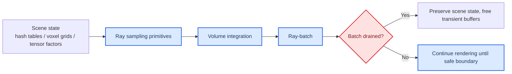

# M6 Volume Rendering Profile Packet

This document is the **next pilot profile packet** in the vRAN edge inference profiling workflow. It applies the layered methodology defined in `profile_doc.md` to **M6 Volume Rendering**, using the local review for the workload identity, the M6 carve-out, and the ComputeLease score-axis framing, while using primary papers and official project or vendor documentation for the baseline family, runtime family, and serving or resource-system analysis.

**Packet status:** provisional. This packet contains a defensible, evidence-backed first-pass recommendation and a provisional ComputeLease scorecard, but the final scores are not closed until lease-trace or lease-equivalent experiments are run on a concrete stack.

## 🎯 Packet goal

The goal of this packet is to answer four questions for **M6 Volume Rendering**:

1. What is the most defensible **baseline model family** for a first edge-facing implementation?
2. Which **runtime family** is the best first execution layer for that baseline?
3. Which **serving or resource-system mechanisms** matter most for ComputeLease compliance?
4. What provisional ComputeLease scores are justified today, and which claims still require Adaptation Hypotheses, or AHs?

## 🧩 Category and workload row

The local review defines **M6 Volume Rendering** as a **NeRF-style one-shot workload** with **Ray sampling → Volume integration** and good preemptibility relative to one-shot CV because work can be drained at **ray-batch** boundaries. The review also makes a documented **M6 carve-out**: unlike other rows, M6 permits accelerator-first papers as primaries because they directly determine scene-state structure, rendering kernels, and memory behavior, even though they do **not** provide a full serving-runtime story.

This packet therefore treats M6 through a **hierarchical execution-unit ladder** and separates three things explicitly:

- what the accelerator papers prove,
- what the current runtime can actually schedule, and
- what the current stack can justify as a safe-stop boundary under a lease.

Local anchors for this packet are:

- `progress/unified_vran_edge_inference_sota_review_2022_2026.md`, summary matrix rows for M6,
- the ComputeLease score-axis definitions in the same file,
- the local M6 taxonomy block that identifies **ray-batch** as the natural serving-level work unit and **scene-state artifacts** as the key persistent state, and
- the M6 carve-out and bridge-mechanism sections of the unified review, which explicitly say the accelerator papers define state and work-unit structure but **omit serving/runtime semantics**.

| Field | Value |
| --- | --- |
| Category | Volume rendering |
| Workload in doc | M6 Volume Rendering |
| Model archetype | NeRF / radiance-field family |
| Delivery mechanism | One-shot |
| Phase decomposition | Ray sampling, volume integration |
| Smallest algorithmic primitive | Ray-marching samples, occupancy-grid or estimator steps, tiny MLP or decoder evaluations |
| Runtime-exposed schedulable unit | Ray-batch or sampling-iteration batch |
| Smallest justified safe-stop boundary | Ray-batch drain point for the first stack |
| Key parked state at safe-stop boundary | Scene representation state (hash tables, voxel grids, tensor factors, occupancy or proposal state) plus bounded transient per-ray buffers |
| Dominant profiling layer | Model plus runtime bridge, then serving/resource-system |

### Execution-unit selection decision

| Candidate unit | Selected as profiling primitive? | Selected as current safe scheduling sub-unit? | Why selected or not selected | Provenance |
| --- | --- | --- | --- | --- |
| **Ray-marching sample / inner sampling primitive** | **Yes** | **No** | Selected for profiling because it explains compute density, occupancy skipping, estimator behavior, and transient buffer pressure below ray-batch level. Not selected as the current safe scheduling sub-unit because the current stacks do not provide a generic recoverable partial-progress contract or bounded reclaim proof at individual sample or kernel-step boundaries. | **Packet synthesis** from accelerator papers plus runtime docs |
| **Ray-batch / sampling-iteration batch** | **Yes** | **Provisionally yes** | Selected for profiling and as the current **best candidate** safe scheduling sub-unit because it is the smallest unit repeatedly supported by the local review and the accelerator papers as a natural batched rendering boundary. It is not yet fully justified as a lease-safe boundary for the current stack until bounded drain/reclaim behavior is demonstrated. | **Direct in local review** for the work unit; **packet synthesis + AH** for safe-stop selection |
| **Optimization-step or full-request boundary** | **Yes, as fallback** | **Fallback yes** | Selected as a fallback boundary where a given implementation cannot expose lease-safe ray-batches cleanly. Not preferred because it weakens lease flexibility, but it is safer than assuming kernel- or sample-level stoppability without proof. | **Packet synthesis** from the safe-stop rule |

## 🧠 Selected baseline model family

The **selected baseline family for the first implementation packet is the Instant-NGP family**, with **Instant-NGP hash-grid NeRF** as the primary anchor. This is not a claim that Instant-NGP is the single strongest radiance-field family in absolute quality. It is the claim that Instant-NGP is the **most defensible first baseline family** for an M6 edge packet because it combines explicit ray-batch structure, compact scene-state design, strong CUDA-native execution, and unusually strong official evidence on training and rendering speed.[^instantngp-paper][^instantngp-project]

This choice is intentionally narrower than the broader M6 snapshot in `profile_doc.md`, which keeps **Instant-NGP** and **Nerfacto** as primary baselines and leaves **TensoRF**, **mip-NeRF 360**, and **Zip-NeRF** as additional families. The present packet is a **deployment-first M6 pilot**, not a claim about the best abstract radiance-field family under unlimited hardware.

### Why Instant-NGP is the primary baseline family

- The paper states that the combination of a tiny neural network and a **multiresolution hash table of trainable feature vectors** permits a much smaller network without sacrificing quality, reducing floating-point and memory-access work.[^instantngp-paper]
- The project page states that real scenes can be **trained in under 5 minutes** and rendered in **real time**, making it one of the strongest current families for an edge-first practical packet.[^instantngp-project]
- The implementation ecosystem directly centers **tiny-cuda-nn** and fused CUDA kernels, which aligns unusually well with the NVIDIA-edge-first deployment envelope of this work.[^tinycudann]

### Challenger families kept in scope

| Family | Why it remains in scope | Role in this packet |
| --- | --- | --- |
| **TensoRF / tensor-factorized radiance fields** | Strongest compact-state challenger. Direct evidence includes **<4 MB** CP models and compact VM variants, which makes it especially attractive for state parking and VRAM budgeting.[^tensorf-paper][^tensorf-project] | Primary compact-state challenger |
| **DirectVoxGO / explicit voxel-grid radiance fields** | Strong direct evidence on fast per-scene convergence and explicit scene state. Attractive when simplicity and explicit state dominate over raw throughput.[^dvgo-paper][^dvgo-project] | Primary explicit-state challenger |
| **3D Gaussian Splatting / LightGaussian family** | Strong real-time rendering alternative, but not the first choice here because the packet is centered on **volume rendering**, and Gaussian splatting is better treated as a high-performance neighboring family rather than the primary M6 baseline.[^3dgs-paper][^lightgaussian-paper] | High-performance neighboring alternative |

### Baseline selection rule

**AH-M6-BASELINE-INGP:** Use the **Instant-NGP family** as the first baseline family because it best balances edge-facing speed, compact scene-state structure, and NVIDIA-native runtime realism. Keep **TensoRF** as the main compact-state challenger and **DirectVoxGO** as the main explicit-state challenger.

This baseline-family choice is supported primarily by **primary accelerator papers and official project evidence**, not by a direct multi-paper edge benchmark under a common lease regime. It should therefore be read as a practical pilot choice, not as a universal model-ranking claim.

## 🔄 Candidate runtime families

The runtime layer is unusually important for M6 because the workload hot path is often not a clean ONNX-style DNN graph. For M6, the key runtime questions are:

- Can the runtime support **custom ray marching / estimator logic** efficiently?
- Can it expose or preserve a practical **ray-batch** boundary?
- Can it keep persistent **scene state** compact enough for edge devices?
- Is it practical on **NVIDIA edge servers** and **Jetson / embedded edge**?

| Runtime family | Role in this packet | Strong direct evidence | Practical recommendation |
| --- | --- | --- | --- |
| **Native CUDA / tiny-cuda-nn fused runtime** | Primary runtime family | tiny-cuda-nn docs explicitly state that manual or JIT fusion can fuse the **full NeRF ray marcher into a single kernel** with very large speedups, which aligns directly with Instant-NGP-style rendering.[^tinycudann] | **Primary runtime for the first packet** |
| **TensorRT family** | NVIDIA production runtime family | Official docs show TensorRT provides serialized engines, mixed precision, dynamic shapes, DLA support on supported hardware, and plugin paths for unsupported layers.[^tensorrt-overview][^tensorrt-how][^tensorrt-support] | Strong secondary runtime when the renderer can be compiled into supported or plugin-backed graphs |
| **ONNX Runtime** | Portable fallback runtime | Official docs show ORT execution providers target **cloud and edge**, support reduced-op builds, and allow TensorRT or CUDA fallback paths.[^ort-eps][^ort-custom][^ort-trt] | Portable secondary option, not first choice for custom M6 kernels |
| **PyTorch + NerfAcc** | Research-native runtime family | NerfAcc directly supports plug-and-play acceleration for NeRF variants and claims 1.5×–20× speedups for training and inference workflows.[^nerfacc-paper][^nerfacc-docs] | Strong research-native path and best baseline comparison runtime |

### Runtime conclusion

The first M6 packet should use:

- **Primary runtime family:** `Native CUDA / tiny-cuda-nn fused runtime`
- **Secondary runtime family:** `TensorRT`
- **Portable fallback runtime family:** `ONNX Runtime`
- **Research-native comparison runtime:** `PyTorch + NerfAcc`

**AH-M6-RUNTIME-CUDA:** For the first packet, optimize for **actual volume-rendering hot-path fidelity** rather than forcing the workload into a generic DNN-only runtime. That makes the native CUDA / tiny-cuda-nn family the most defensible first runtime for M6.

## 🏗️ Candidate serving and resource-system families

For M6, the serving/resource-system layer is downstream of the M6 carve-out. The local review is explicit that the primaries define **state and work units**, but **not** multi-tenant lease-aware serving semantics.

| Family | Type | What it contributes | Packet role |
| --- | --- | --- | --- |
| **Triton family** | Serving system | Officially supports multi-framework serving, explicit model management, dynamic batching, and Jetson deployment modes, including in-process integration recommendations on Jetson.[^triton-intro][^triton-model-mgmt][^triton-jetson] | **Candidate serving wrapper for the first packet** |
| **K3s + Kubernetes priority/preemption** | Resource/orchestration family | Officially framed as a lightweight Kubernetes distribution for **edge**, with Kubernetes-native pod priority and preemption support.[^k3s][^k8s-preempt] | **Candidate resource/control plane for the first packet** |
| **Ray Serve / Ray Data / KubeRay** | Secondary orchestration family | Strong dynamic batching and GPU batch-execution support, especially for edge servers and batch-style ray sweeps rather than Jetson-first microservices.[^ray-serve][^ray-data][^kuberay] | Secondary orchestration option |
| **KServe / Knative** | Optional serverless layer | Strong direct evidence for scale-to-zero and serverless deployment patterns, but the official docs frame this most clearly for predictive inference workloads.[^kserve-serverless] | Optional parking or scale-to-zero layer, not the default first choice |

### Serving/resource conclusion

The first packet should use:

- **Candidate serving wrapper:** `Triton family`
- **Candidate resource/control plane:** `K3s + Kubernetes priority/preemption`
- **Secondary orchestration family:** `Ray Serve / Ray Data / KubeRay`

This gives a practical first implementation path while preserving the review’s own M6 carve-out: the accelerator papers remain state-definition evidence, while Triton and Kubernetes-family control are treated as **candidate wrapper/control-plane options**, not as direct proof that the M6 lease problem is already closed.

## 🔬 Model-layer findings

At the model layer, M6 is the strongest example of why the M6 carve-out exists. The accelerator papers directly determine what scene state exists, how compact it is, and what the natural work units look like.

### Direct model-layer takeaways

- The local review directly classifies **ray-batch** as the natural M6 micro-segmentation unit and scene-state artifacts such as **voxel/hash tables or partial integration buffers** as the key state.[^local-review]
- Instant-NGP provides direct evidence for **multiresolution hash tables**, tiny MLP structure, and occupancy-grid–accelerated ray marching.[^instantngp-paper][^instantngp-project]
- NerfAcc provides direct evidence for **efficient ray sampling** and compact **packed-tensor** handling of variable-length samples.[^nerfacc-paper][^nerfacc-docs]
- TensoRF provides direct evidence for **compact tensor-factorized scene state**.[^tensorf-paper][^tensorf-project]
- DirectVoxGO provides direct evidence for explicit **density/feature voxel grids** plus a shallow decoder.[^dvgo-paper][^dvgo-project]

### Model-layer conclusion

For M6, the model layer is not only a gate. It is the **state-definition layer**. The M6 carve-out is justified because the accelerator papers directly determine the memory and compute structure that the later serving layer has to manage.

The explicit selection logic is therefore:

- **Ray-marching sample / inner sampling primitive is selected for profiling but not selected as the current safe scheduling sub-unit** because the current stacks do not expose recoverable partial progress or bounded reclaim semantics at that level.
- **Ray-batch is selected as the current safe scheduling sub-unit** because it is the smallest boundary directly supported by the local review and by the accelerator papers as a repeated batched work unit.
- **Optimization-step or full-request boundary is selected only as fallback** when a given implementation cannot expose lease-safe ray-batches cleanly.

## ⚙️ Runtime-layer findings

The runtime layer determines whether the M6 accelerator evidence can actually be executed inside an edge-serving stack.

### Strongest direct mechanism evidence from the literature and docs

- **tiny-cuda-nn** directly supports fused CUDA execution and states that Instant-NGP’s NeRF ray marcher can be fused into a single kernel with major speedups.[^tinycudann]
- **TensorRT** directly supports serialized engines, plugin paths, and mixed precision, but this is strongest where the renderer can be represented as supported graph segments or plugins.[^tensorrt-overview][^tensorrt-how][^tensorrt-support]
- **ONNX Runtime** directly supports edge-oriented reduced-op and execution-provider deployment, but is less naturally aligned with custom fused volume-rendering kernels.[^ort-eps][^ort-custom][^ort-trt]
- **NerfAcc** directly supports a PyTorch-native path for efficient sampling primitives, making it the best research-native runtime comparator.[^nerfacc-paper][^nerfacc-docs]

### Runtime conclusion

For M6, the runtime decision is different from M3 and M5:

- the **smallest algorithmic primitives** are ray-sample / integration steps,
- the **runtime-exposed schedulable unit** is the **ray-batch**,
- the **smallest justified safe-stop boundary** for the first stack is the **drained ray-batch boundary**.

The first packet should therefore keep the native CUDA path primary and use TensorRT or ONNX Runtime only where the renderer is exportable or plugin-backed. In other words, sample-level primitives are **not selected** as the current safe scheduling sub-unit even though they are still **selected for profiling**.

## 🖧 Serving and resource-system findings

The serving/resource-system layer is where the M6 carve-out is completed. The accelerator papers do not give this layer directly, so it must be bridged in from serving/runtime systems with stronger control-plane semantics.

### Strongest direct mechanism evidence from the local review and official docs

- The unified review itself explicitly says M6 accelerator primaries define **state** and **work units**, but **not** serving-runtime semantics, and it imports bridge mechanisms such as paging, parking, and admission control.[^local-review-bridge]
- The strongest direct bridge-mechanism evidence for those missing semantics comes from **vLLM / PagedAttention** for paging, **SpotServe** for preemption-aware commit/recovery, and **CacheGen** for chunked parked-state movement.[^vllm-paper][^spotserve][^cachegen]
- Triton gives the strongest direct serving-system evidence for edge deployment and explicit model management on NVIDIA platforms, including Jetson guidance, but this remains **generic serving evidence**, not M6-specific lease proof.[^triton-intro][^triton-model-mgmt][^triton-jetson]
- K3s and Kubernetes preemption give strong direct resource-plane evidence for lightweight edge orchestration and pod-level preemption control, but not for M6-specific sub-request leasing semantics.[^k3s][^k8s-preempt]
- Ray Serve / Ray Data give strong direct evidence for flexible batching and GPU-oriented batch execution, but are a more natural secondary layer for server-edge deployments than for Jetson-first deployment.[^ray-serve][^ray-data][^kuberay]

### Serving/resource conclusion

The first M6 packet should use:

- **Candidate serving wrapper:** `Triton family`
- **Candidate resource/control plane:** `K3s + Kubernetes priority/preemption`
- **Secondary orchestration family:** `Ray Serve / Ray Data / KubeRay`

This lets the packet preserve the M6 carve-out honestly: the rendering core remains accelerator-defined, while the serving/resource story is added explicitly rather than silently assumed. The missing lease semantics still come from imported bridge patterns and must be validated on the chosen stack.

## 📊 Provisional ComputeLease scorecard

This scorecard is for the **first implementation target**, not for M6 in the abstract.

**Target stack:** `Instant-NGP family` → `native CUDA / tiny-cuda-nn runtime` → candidate `Triton` wrapper + candidate `K3s / Kubernetes` control plane, with **separate bridge mechanisms still required** for state parking and hard-cap admission.

| Axis | Provisional score | Evidence level | Notes | ComputeLease fields |
| --- | --- | --- | --- | --- |
| **Preemption Resilience** | **Medium** | **Inferred** | Ray-batch is the strongest current *candidate* cooperative boundary, but the chosen stack still lacks direct evidence of bounded drain/reclaim behavior at that boundary. | `preemption_notice_us`, `reclaim_mode`, `duration_us` |
| **Micro-Segmentation** | **Medium** | **Inferred** | Ray-batch is directly supported as the natural work unit, but sub-batch or sample-level fit to microsecond-scale leases is not directly proven in the serving stack. | `duration_us`, `sm_budget_sms`, `start_time_us` |
| **State Parking** | **Low** | **Inferred** | The primaries directly define compact scene state, but the target stack does not yet include a direct park/resume protocol. Parking remains a bridge-mechanism import, not a demonstrated property of the first stack. | `reclaim_mode`, `preemption_notice_us`, `duration_us` |
| **Tight VRAM Compliance** | **Medium** | **Inferred** | Compact representations and packed samples are directly supported, but hard-cap admission and fragmentation control are still wrapper/bridge additions rather than demonstrated features of the first stack. | `vram_budget_bytes`, `gpu_slice` |

### Score interpretation

M6 is stronger than one-shot CV/SR on preemptibility, but weaker than M3 on serving semantics. The reason is clear in the local review: M6 has a natural **ray-batch** unit and compact state, yet the accelerator papers still stop short of a full multi-tenant serving contract. The current packet therefore treats ray-batch as the **best current candidate** safe-stop boundary, not as a fully serving-proven one.

## 🛠️ Implementation Feasibility

Implementation Feasibility is kept separate from the four score axes, exactly as required by `profile_doc.md`.

| Platform class | Feasibility score | Why |
| --- | --- | --- |
| **NVIDIA edge server** | **Medium** | Strong path for custom CUDA runtimes and candidate Triton/Kubernetes wrappers, but still requires a bridge layer for leasing and state parking. |
| **Jetson / embedded edge** | **Low** | Plausible for a compact Instant-NGP-style or TensoRF-style path, but constrained by GPU memory, plugin/runtime complexity, and the need to keep the serving wrapper extremely lean. |

### Practical platform split

- **Jetson or embedded first implementation:** compact Instant-NGP or TensoRF variant + native CUDA runtime + Triton in-process / custom backend path as a candidate wrapper
- **Server-edge shadow track:** Instant-NGP family or DirectVoxGO family + native CUDA or TensorRT hybrid + Triton + optional Ray orchestration

## 📌 Direct evidence and Adaptation Hypothesis register

| ID | Type | Claim |
| --- | --- | --- |
| **D-M6-1** | Direct | The local review identifies **ray-batch** as the natural M6 work unit and compact scene-state artifacts as the key state.[^local-review] |
| **D-M6-2** | Direct | Instant-NGP provides multiresolution hash encoding, tiny-MLP structure, and occupancy-grid accelerated ray marching.[^instantngp-paper][^instantngp-project] |
| **D-M6-3** | Direct | NerfAcc provides efficient sampling and packed sample representations for NeRF-style pipelines.[^nerfacc-paper][^nerfacc-docs] |
| **D-M6-4** | Direct | TensoRF provides compact factorized scene state, including very small CP models and compact VM variants.[^tensorf-paper][^tensorf-project] |
| **D-M6-5** | Direct | DirectVoxGO provides explicit voxel-grid state plus a shallow decoder with fast single-GPU optimization.[^dvgo-paper][^dvgo-project] |
| **D-M6-6** | Direct | tiny-cuda-nn directly documents full ray-marcher fusion and speedups for the Instant-NGP-style path.[^tinycudann] |
| **D-M6-7** | Direct | Triton directly documents edge/Jetson serving paths and explicit model-management behavior for generic serving workloads.[^triton-intro][^triton-model-mgmt][^triton-jetson] |
| **D-M6-8** | Direct | K3s and Kubernetes directly document lightweight edge orchestration and pod-level preemption behavior at the resource-control layer.[^k3s][^k8s-preempt] |
| **D-M6-9** | Direct | vLLM / PagedAttention, SpotServe, and CacheGen provide direct bridge evidence for paging, preemption-aware commit/recovery, and chunked parked-state movement, even though they are not M6 systems.[^vllm-paper][^spotserve][^cachegen] |
| **AH-M6-1** | Adaptation Hypothesis | The first packet should choose the **Instant-NGP family** as the primary baseline because it best balances CUDA-native speed and compact scene-state realism. |
| **AH-M6-2** | Adaptation Hypothesis | The first packet should choose **native CUDA / tiny-cuda-nn** as the primary runtime because generic graph runtimes are too indirect for the hottest rendering path. |
| **AH-M6-3** | Adaptation Hypothesis | The first packet should treat **Triton + K3s/Kubernetes** as candidate wrapper/control-plane options around a custom CUDA runtime, while importing state parking and admission-control patterns from bridge mechanisms. |
| **AH-M6-4** | Adaptation Hypothesis | Ray-batch should be treated as the **current best candidate** safe scheduling sub-unit only after the runtime demonstrates bounded drain and reclaim behavior under the chosen lease envelope. |
| **AH-M6-5** | Adaptation Hypothesis | If tighter VRAM envelopes are required, the strongest next fallback family is **TensoRF**, because compact factorized scene state should be easier to park and reload than denser scene encodings. |

## 📚 Source register

### Local anchors

- `profile_doc.md`
- `progress/unified_vran_edge_inference_sota_review_2022_2026.md`
- `progress/ppt.md`

### External primary sources and official docs

[^local-review]: `progress/unified_vran_edge_inference_sota_review_2022_2026.md`, M6 local taxonomy block and summary table.
[^local-review-bridge]: `progress/unified_vran_edge_inference_sota_review_2022_2026.md`, M6 carve-out, bridge mechanisms, and cross-cutting synthesis sections.
[^instantngp-paper]: Müller et al. “Instant Neural Graphics Primitives with a Multiresolution Hash Encoding.” SIGGRAPH 2022. https://doi.org/10.1145/3528223.3530127
[^instantngp-project]: Instant-NGP project page. https://nvlabs.github.io/instant-ngp/
[^tinycudann]: tiny-cuda-nn repository and docs. https://github.com/NVlabs/tiny-cuda-nn
[^nerfacc-paper]: Li et al. “NerfAcc: Efficient Sampling Accelerates NeRFs.” ICCV 2023. https://openaccess.thecvf.com/content/ICCV2023/html/Li_NerfAcc_Efficient_Sampling_Accelerates_NeRFs_ICCV_2023_paper.html
[^nerfacc-docs]: NerfAcc documentation. https://nerfacc.readthedocs.io/en/latest/
[^tensorf-paper]: Chen et al. “TensoRF: Tensorial Radiance Fields.” ECCV 2022. https://doi.org/10.48550/arXiv.2203.09517
[^tensorf-project]: TensoRF project page. https://apchenstu.github.io/TensoRF/
[^dvgo-paper]: Sun et al. “Direct Voxel Grid Optimization: Super-fast Convergence for Radiance Fields Reconstruction.” CVPR 2022. https://doi.org/10.1109/CVPR52688.2022.00538
[^dvgo-project]: DirectVoxGO project page. https://sunset1995.github.io/dvgo/
[^3dgs-paper]: Kerbl et al. “3D Gaussian Splatting for Real-Time Radiance Field Rendering.” SIGGRAPH 2023. https://repo-sam.inria.fr/fungraph/3d-gaussian-splatting/
[^lightgaussian-paper]: Fan et al. “LightGaussian: Unbounded 3D Gaussian Compression with 15x Reduction and 200+ FPS.” NeurIPS 2024. https://lightgaussian.github.io/
[^tensorrt-overview]: NVIDIA TensorRT Architecture Overview. https://docs.nvidia.com/deeplearning/tensorrt/latest/architecture/architecture-overview.html
[^tensorrt-how]: NVIDIA TensorRT How TensorRT Works. https://docs.nvidia.com/deeplearning/tensorrt/latest/architecture/how-trt-works.html
[^tensorrt-support]: NVIDIA TensorRT Support Matrix. https://docs.nvidia.com/deeplearning/tensorrt/10.16.1/getting-started/support-matrix.html
[^ort-eps]: ONNX Runtime Execution Providers. https://onnxruntime.ai/docs/execution-providers/
[^ort-custom]: ONNX Runtime custom and reduced-op builds. https://onnxruntime.ai/docs/build/custom.html
[^ort-trt]: ONNX Runtime TensorRT Execution Provider. https://onnxruntime.ai/docs/execution-providers/TensorRT-ExecutionProvider.html
[^triton-intro]: NVIDIA Triton Inference Server introduction. https://docs.nvidia.com/deeplearning/triton-inference-server/user-guide/docs/introduction/index.html
[^triton-model-mgmt]: NVIDIA Triton model management. https://docs.nvidia.com/deeplearning/triton-inference-server/user-guide/docs/user_guide/model_management.html
[^triton-jetson]: NVIDIA Triton on Jetson. https://docs.nvidia.com/deeplearning/triton-inference-server/user-guide/docs/user_guide/jetson.html
[^k3s]: K3s documentation. https://docs.k3s.io/
[^k8s-preempt]: Kubernetes pod priority and preemption. https://kubernetes.io/docs/concepts/scheduling-eviction/pod-priority-preemption/
[^ray-serve]: Ray Serve dynamic batching. https://docs.ray.io/en/latest/serve/advanced-guides/dyn-req-batch.html
[^ray-data]: Ray Data GPU batch inference. https://docs.ray.io/en/latest/data/batch_inference.html
[^kuberay]: KubeRay batch inference example. https://docs.ray.io/en/latest/cluster/kubernetes/examples/rayjob-kueue-gang-scheduling.html
[^kserve-serverless]: KServe serverless and scale-to-zero docs. https://kserve.github.io/website/docs/admin-guide/serverless
[^vllm-paper]: Kwon et al. “Efficient Memory Management for Large Language Model Serving with PagedAttention.” SOSP 2023. https://doi.org/10.1145/3600006.3613165
[^spotserve]: Gu et al. “SpotServe: Serving Generative Large Language Models on Preemptible Instances.” ASPLOS 2024. https://doi.org/10.1145/3620665.3640411
[^cachegen]: Liu et al. “CacheGen: Fast Context Loading for Language Model Applications.” SIGCOMM 2024. https://doi.org/10.1145/3651890.3672274

## 🧾 Packet conclusion

For **M6 Volume Rendering**, the local review is already clear: the accelerator papers are the right place to start, because they define the **scene state**, the **ray-batch work unit**, and the core CUDA/runtime behavior. The first implementation packet should therefore optimize for **state realism and runtime fidelity** rather than forcing the workload into a generic graph-serving abstraction too early.

**Recommended first implementation target:**

- **Baseline family:** `Instant-NGP family`
- **Primary runtime family:** `native CUDA / tiny-cuda-nn fused runtime`
- **Candidate serving wrapper:** `Triton family`
- **Candidate resource/control plane:** `K3s + Kubernetes priority/preemption`
- **Primary compact-state challenger:** `TensoRF family`
- **Explicit-state challenger:** `DirectVoxGO family`

In short, M6 should be implemented as **scene-state aware, ray-batch candidate safe-stop, CUDA-native, and lease-bridged from the start**, because unlike M3, the serving semantics have to be built around accelerator-defined work units rather than assumed up front.