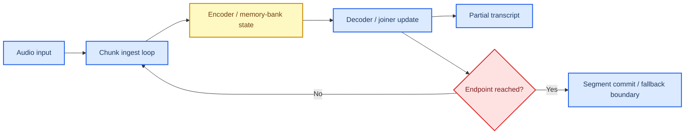

# Voice-related Profile Packet

This document is the **final extended-category profile packet** in the broader profiling program beyond the numbered M1–M6 workload packets. It applies the layered methodology defined in `profile_doc.md` to the **voice-related** category, using the local program documents for category framing and using primary papers and official project or vendor documentation for the branch split, baseline family, runtime family, and serving or resource-system analysis.

**Packet status:** provisional. This packet contains a defensible, evidence-backed first-pass recommendation and a provisional ComputeLease scorecard, but the final scores are not closed until lease-trace or lease-equivalent experiments are run on a concrete stack.

## 🎯 Packet goal

The goal of this packet is to answer four questions for the **voice-related** category:

1. How should the broad voice category be **split into branches** before profiling?
2. Which branch is the most defensible **packet-1 branch** for edge profiling?
3. What baseline model family, runtime family, and serving/resource-system family are the best first execution choices for that branch?
4. What provisional ComputeLease scores are justified today, and which claims still require Adaptation Hypotheses, or AHs?

## 🧩 Category framing and required split

Unlike the numbered M1–M6 packets, the voice-related category is **not** a single local workload row. The local program documents already say this category is too broad and **must be split before profiling**.

The local framing already says three important things:

- the category is **uncovered in the numbered review** and therefore must be treated as an extended-category packet,
- **no single profiling layer should be chosen until the category is split**, and
- the relevant sub-branches differ structurally enough that mixing them would hide the true execution-unit and state behavior.[^local-profile][^local-transcript]

Local anchors for this packet are:

- `profile_doc.md`, especially the voice-related row and the independent baseline/engine snapshot,
- `progress/transcript.md`, where voice-related models are introduced as part of the broader architecture-level taxonomy.

## 🪓 Branch split before profiling

The voice-related category must be split into at least four branches before a packet-1 choice is made.

| Branch | What it is | Why it is structurally distinct | Direct evidence |
| --- | --- | --- | --- |
| **Streaming ASR** | Incremental speech-to-text on partial audio | Explicit chunk-by-chunk decoding, endpoint checks, and carried state across chunks | Emformer low-latency streaming ASR with memory bank and cached state; sherpa endpointing and online WebSocket serving docs.[^emformer-paper][^sherpa-endpoint][^sherpa-websocket] |
| **Offline ASR** | Full-utterance transcription | Strong edge feasibility but weaker native streaming-state semantics | Whisper / Distil-Whisper / whisper.cpp docs and papers.[^whisper-paper][^distilwhisper-paper][^distilwhisper-card][^whispercpp] |
| **Speech translation** | Speech input to translated text or translated speech | Larger checkpoints and additional translation semantics make it a heavier packet-1 branch | SeamlessM4T and SeamlessStreaming docs/paper.[^seamless-m4t][^seamless-streaming-doc][^seamless-streaming-paper] |
| **TTS** | Text-to-speech | Strong edge feasibility, but less aligned with the stateful/preemption-first packet-1 objective | VITS and Piper docs.[^vits-paper][^piper-docs][^piper-docker] |

### Branch selection decision

| Candidate branch | Selected for category profiling? | Selected as packet-1 branch? | Why selected or not selected | Provenance |
| --- | --- | --- | --- | --- |
| **Streaming ASR** | **Yes** | **Yes** | Selected as packet-1 because it has the strongest direct evidence for incremental chunk processing, explicit segmentation/endpointing, and carried state across chunks, which maps most cleanly to the ComputeLease questions. | **Direct in external source** plus **packet synthesis** for packet-1 prioritization |
| **Offline ASR** | **Yes** | **No** | Selected for category coverage and comparison, but not packet-1 because edge feasibility is strong while direct streaming-state and pause/resume evidence is weaker. | **Direct in external source** plus **packet synthesis** for rejection |
| **Speech translation** | **Yes** | **No** | Selected for category coverage, but not packet-1 because official checkpoint sizes are much larger and the branch adds translation complexity before the lower-level stateful edge questions are settled. | **Direct in external source** for model size/behavior plus **AH** for packet-1 rejection |
| **TTS** | **Yes** | **No** | Selected for category coverage, but not packet-1 because the branch is edge-friendly yet less aligned with the chunk-state/preemption-first profiling objective. | **Direct in external source** plus **packet synthesis** for rejection |

## 🧩 Chosen packet-1 branch: Streaming ASR

With the category split complete, this packet now profiles **Streaming ASR** as the packet-1 branch.

| Field | Value |
| --- | --- |
| Category | Voice-related models |
| Workload in doc | Uncovered in current doc |
| Chosen branch | Streaming ASR |
| Model archetype | Streaming encoder/decoder ASR with carried history or memory state |
| Delivery mechanism | Streaming |
| Phase decomposition | Audio chunk ingest, encoder pass, decoder or joiner update, endpoint or segment commit |
| Smallest algorithmic primitive | Acoustic feature encoder ops, attention/MLP sub-ops, decoder/joiner or head ops |
| Runtime-exposed schedulable unit | Audio chunk / streaming block in the chosen stack |
| Smallest justified safe-stop boundary | Audio chunk boundary while stream state remains resident; endpoint/segment boundary as the safer coarse fallback for packet-1 |
| Key parked state at safe-stop boundary | Stream history / cached state, encoder/decoder/joiner state, endpoint metadata |
| Dominant profiling layer | Runtime and serving/resource-system after split, with mandatory model support |

### Execution-unit selection decision for the chosen branch

| Candidate unit | Selected as profiling primitive? | Selected as current safe scheduling sub-unit? | Why selected or not selected | Provenance |
| --- | --- | --- | --- | --- |
| **Encoder/decoder/joiner sub-ops** | **Yes** | **No** | Selected for profiling because they explain per-chunk compute and carried state below chunk level. Not selected as the current safe scheduling sub-unit because the chosen packet-1 stack does not yet prove recoverable partial-progress semantics or bounded reclaim inside an active chunk. | **Direct in external source** for model/runtime structure; **packet synthesis** for rejection |
| **Audio chunk / streaming block** | **Yes** | **Yes (current default)** | Selected as the current default safe scheduling sub-unit because the chosen stack explicitly processes audio incrementally by chunk and performs endpoint checks after chunk completion. This is the smallest boundary with direct packet-1 evidence for schedulable progression. | **Direct in external source** plus **packet synthesis** for packet-1 selection |
| **Endpoint / segment boundary** | **Yes** | **Yes, as coarse fallback** | Selected as a coarser fallback because endpointing is explicit in the stack and provides a safer semantic flush point if chunk-level reclaim later proves too weak. | **Direct in external source** |

## 🧠 Workload-aligned baseline family and practical deployment anchor

The **workload-aligned baseline family for the packet-1 branch** should remain the **streaming ASR family**, with **Emformer-style memory-transformer streaming ASR** as the scientific reference and **streaming transducer-style encoder/decoder/joiner deployments** as the deployment-oriented family. This fit matches the chosen streaming-ASR branch better than Whisper-class offline ASR because the packet-1 objective is to study chunk-state behavior under edge constraints.

Separately, the **selected practical deployment anchor for the first implementation packet** is a **streaming transducer-style ONNX deployment stack**, using the **sherpa-onnx family** as the operational deployment anchor. This is not a claim that sherpa-onnx is the strongest ASR family in absolute recognition quality. It is the claim that a streaming encoder/decoder/joiner ONNX stack is the **most defensible first deployment anchor** for an edge streaming-ASR packet because it directly exposes chunk-level processing, endpointing, and edge-local serving artifacts.[^sherpa-index][^sherpa-websocket]

### Why the streaming ONNX deployment family is the practical deployment anchor

- The sherpa-onnx online WebSocket docs explicitly expose `encoder`, `decoder`, and `joiner` model files, chunk-loop controls, endpointing, work threads, and per-model online serving settings.[^sherpa-websocket]
- sherpa endpointing docs explicitly state that endpoint checks are done **every time we’re finished processing a chunk of data**.[^sherpa-endpoint]
- sherpa-onnx official docs and repository frame the project around **embedded/local/mobile/on-device** use, which makes it the strongest packet-1 deployment anchor for the chosen branch.[^sherpa-index][^sherpa-repo]

### Challenger families kept in scope

| Family | Why it remains in scope | Role in this packet |
| --- | --- | --- |
| **Emformer-style memory-transformer ASR** | Strongest scientific reference for carried memory state and low-latency streaming ASR. | Scientific workload reference |
| **Distil-Whisper / whisper.cpp** | Strongest offline-ASR edge comparator, useful to show why streaming-state semantics matter for packet-1. | Offline comparator branch |
| **SeamlessStreaming** | Strong streaming speech-translation reference, but too large and translation-complex for packet-1. | Speech-translation comparison branch |
| **Piper / VITS** | Strong TTS edge reference, but lower alignment with packet-1 preemption/state focus. | TTS comparison branch |

### Baseline selection rule

**AH-VOICE-BRANCH:** The voice-related category should be split first, and **streaming ASR** should be the packet-1 branch because it best exposes the targeted stateful/preemption-relevant mechanics.

**AH-VOICE-BASELINE-STREAMING:** Keep **streaming ASR** as the workload-aligned branch family, with **Emformer-style streaming ASR** as the scientific reference and **streaming encoder/decoder/joiner ONNX deployments** as the deployment-oriented family.

**AH-VOICE-DEPLOY-SHERPA:** Use the **sherpa-onnx style streaming ONNX stack** as the practical first deployment anchor because it best balances explicit chunk processing, endpointing, and edge-local serving artifacts.

The workload-aligned branch choice is justified by the local split-first rule plus the streaming-ASR literature, while the exact deployment-anchor choice is supported primarily by **official streaming/server docs and edge-local runtime support**, not by a head-to-head lease benchmark under a common edge-serving regime.

## 🔄 Candidate runtime families

The runtime layer is where the chosen streaming-ASR branch becomes schedulable under edge constraints. For voice packet-1, the key runtime questions are:

- Can the runtime support **incremental chunk processing** directly?
- Can it keep **carried stream state** under control on edge hardware?
- Can it support **quantization, custom builds, and memory reduction** strongly enough for packet-1 deployment?
- Is it practical on **embedded/mobile** and also transferrable to server-edge if needed?

| Runtime family | Role in this packet | Strong direct evidence | Practical recommendation |
| --- | --- | --- | --- |
| **ONNX Runtime / ONNX Runtime Mobile** | Primary packet-1 runtime | Official mobile docs say models must fit device disk/memory and support mobile EPs such as CPU/XNNPACK, NNAPI, and CoreML. Official custom-build docs support reduced-operator and minimal builds. Official quantization docs describe 8-bit quantization and roughly 4× model-size reduction from FP32 weights.[^ort-mobile][^ort-custom][^ort-quant] | **Primary runtime for the first packet** |
| **whisper.cpp runtime** | Offline comparator runtime | Official README documents quantization, CPU-first deployment, zero runtime allocations, and explicit memory footprints. | Comparator runtime, not packet-1 default |
| **Device-native mobile accelerators (NNAPI/CoreML/QNN/RKNN)** | Secondary accelerator paths | Official docs support these EPs / NPUs, but also warn that operator partitioning is model/device specific. | Secondary acceleration layer after baseline characterization |

### Runtime conclusion

The first packet should use:

- **Primary runtime family:** `ONNX Runtime / ONNX Runtime Mobile`
- **Offline comparator runtime:** `whisper.cpp`
- **Secondary accelerator paths:** `NNAPI / CoreML / QNN / RKNN`

For streaming-ASR packet-1, the runtime ladder is:

- **smallest algorithmic primitive:** encoder / decoder / joiner sub-ops,
- **runtime-exposed schedulable unit in the current stack:** audio chunk / streaming block,
- **smallest justified safe-stop boundary for the first stack:** audio chunk boundary by default, with endpoint/segment boundary as the coarser fallback.

The first packet should therefore keep **ONNX Runtime** primary and treat sub-op visibility as profiling structure rather than as the chosen safe-stop boundary.

## 🏗️ Candidate serving and resource-system families

For the chosen streaming-ASR branch, the serving/resource-system layer is where the packet should stay careful. The runtime gives chunk processing and state, but packet-1 still should not overclaim full lease semantics.

| Family | Type | What it contributes | Packet role |
| --- | --- | --- | --- |
| **In-process embedded serving** | Serving path | Smallest wrapper around the streaming runtime, minimizing extra transport/state-handoff complexity. | **Primary packet-1 serving path** |
| **sherpa-onnx online WebSocket server** | Serving system | Official server artifact with explicit batch size, loop interval, endpoint toggles, thread controls, and encoder/decoder/joiner wiring.[^sherpa-websocket] | Candidate external serving wrapper |
| **HTTP local servers for offline comparator branches** | Serving system | Official HTTP serving artifacts for Piper and whisper.cpp.[^piper-docker][^whispercpp] | Comparison serving path only |
| **CPU/XNNPACK-first resource policy** | Resource policy | Official ORT mobile guidance favors CPU/XNNPACK-first as the conservative default. | **Primary resource policy** |
| **NNAPI / CoreML / QNN / RKNN** | Accelerator policy | Official docs support them, but operator partitioning is model/device specific. | Secondary accelerator policy |

### Serving/resource conclusion

The first voice-related packet should use:

- **Primary packet-1 serving path:** `In-process embedded serving`
- **Candidate external serving wrapper:** `sherpa-onnx online WebSocket server`
- **Primary resource policy:** `CPU/XNNPACK-first`
- **Secondary accelerator policy:** `NNAPI / CoreML / QNN / RKNN`

This gives a practical first implementation path while preserving the local split-first rule: the packet-1 stack remains stream-state aware and edge-local, while the other branch artifacts serve as comparison or future extension paths. The wrapper/runtime choices should therefore be read as **deployment scaffolds**, not as proof that packet-1 already closes every lease-semantic question.

## 🔬 Model-layer findings

At the model layer, the chosen streaming-ASR branch behaves like a chunked streaming workload with carried memory/history state between chunks.

### Direct model-layer takeaways

- Emformer directly introduces **memory-bank** and **cached state** ideas for streaming ASR.[^emformer-paper]
- The endpointing docs directly define segment decisions at **chunk-completion** time.[^sherpa-endpoint]
- This makes streaming ASR the strongest branch for packet-1 because both the **unit** and the **carried state** are explicit in the chosen branch.

### Model-layer conclusion

For the chosen branch, the model layer is a real gate because chunk size and carried memory state dominate edge feasibility. The correct interpretation is a ladder: **encoder/decoder/joiner primitives** below, **audio chunk** in the middle, and **chunk/segment boundary** as the practical safe-stop surface in the current packet.

## ⚙️ Runtime-layer findings

The runtime layer determines whether the chosen branch can actually be executed incrementally on edge hardware.

### Strongest direct mechanism evidence from the literature and docs

- ONNX Runtime mobile directly supports mobile/embedded execution and reduced/minimal builds.[^ort-mobile][^ort-custom]
- Quantization docs directly support memory reduction by 8-bit conversion.[^ort-quant]
- The online sherpa server directly exposes chunk-loop and endpoint controls.[^sherpa-websocket][^sherpa-endpoint]

### Runtime conclusion

For the chosen branch, the runtime ladder is:

- **smallest algorithmic primitive:** encoder/decoder/joiner sub-ops,
- **runtime-exposed schedulable unit in the current stack:** audio chunk / streaming block,
- **smallest justified safe-stop boundary for the first stack:** endpoint/segment boundary by default, with audio chunk only as an imported candidate boundary.

The first packet should therefore keep **ONNX Runtime** primary and use **sherpa-onnx** as a credible packet-1 streaming deployment family.

## 🖧 Serving and resource-system findings

The serving/resource-system layer is where packet-1 should stay conservative. The current packet is strongest when it stays embedded/local and measures stream-state behavior directly.

### Strongest direct mechanism evidence from the local split and official docs

- The local program explicitly says the category must be split first.[^local-profile][^local-transcript]
- sherpa-onnx directly provides a streaming online server and endpoint semantics.[^sherpa-websocket][^sherpa-endpoint]
- ORT mobile docs directly provide the conservative memory/runtime policy.[^ort-mobile]

### Serving/resource conclusion

The first voice-related packet should use:

- **Primary packet-1 serving path:** `In-process embedded serving`
- **Candidate external serving wrapper:** `sherpa-onnx online WebSocket server`
- **Primary resource policy:** `CPU/XNNPACK-first`
- **Secondary accelerator policy:** `NNAPI / CoreML / QNN / RKNN`

This gives a practical first implementation path while preserving the local split-first logic: packet-1 stays close to the explicit chunk/state mechanics rather than moving too early into heavier orchestration layers.

## 📊 Provisional ComputeLease scorecard

This scorecard is for the **first implementation target**, not for the full voice-related category in the abstract.

**Target stack:** `streaming encoder/decoder/joiner ONNX family` → `ONNX Runtime / ONNX Runtime Mobile` → `in-process embedded serving`, with optional sherpa-onnx online server wrapper.

| Axis | Provisional score | Evidence level | Notes | ComputeLease fields |
| --- | --- | --- | --- | --- |
| **Preemption Resilience** | **Low** | **Inferred** | Chunk boundaries and carried state are explicit, but packet-1 still needs proof of bounded reclaim/resume beyond normal chunk progression. | `preemption_notice_us`, `reclaim_mode`, `duration_us` |
| **Micro-Segmentation** | **Medium** | **Inferred** | Chunk-level segmentation is directly supported, but how far below chunk size the stack can safely go remains imported or inferred. | `duration_us`, `sm_budget_sms` |
| **State Parking** | **Low** | **Inferred** | The branch has explicit carried state, but packet-1 still needs direct proof for serialization/restoration of that state under lease pressure. | `reclaim_mode`, `bandwidth_budget_hint`, `vram_budget_bytes` |
| **Tight VRAM/memory Compliance** | **Medium** | **Direct + Inferred** | ONNX Runtime mobile/custom/quantization support gives direct memory-control tools, though exact fit remains device/model specific and should not be treated as universally high. | `vram_budget_bytes` |

### Score interpretation

Streaming ASR is stronger than the other voice branches for packet-1 because it makes both the **unit** and the **state** explicit. For the chosen first stack, however, the current default safe boundary remains **endpoint/segment**, while **audio chunk** remains the strongest imported candidate boundary. This is still far more useful for packet-1 profiling than offline ASR or TTS.

## 🛠️ Implementation Feasibility

Implementation Feasibility is kept separate from the four score axes, exactly as required by `profile_doc.md`.

| Platform class | Feasibility score | Why |
| --- | --- | --- |
| **Server-edge** | **High** | ONNX Runtime and local serving stacks are straightforward and lightweight for streaming ASR. |
| **Embedded/mobile edge** | **Medium** | The chosen stack is explicitly built around embedded/mobile support and custom/minimal/quantized builds, but chunk-safe reclaim/resume and real device fit still require empirical validation. |

### Practical platform split

- **Embedded/mobile first implementation:** `streaming encoder/decoder/joiner ONNX family` + `ONNX Runtime Mobile` + in-process serving
- **Server-edge shadow track:** same branch with ORT CPU/GPU and the sherpa-onnx online WebSocket wrapper

## 📌 Direct evidence and Adaptation Hypothesis register

| ID | Type | Claim |
| --- | --- | --- |
| **D-VOICE-1** | Direct | The local program says the voice-related category must be **split first** before a profiling level is chosen.[^local-profile][^local-transcript] |
| **D-VOICE-2** | Direct | Emformer is a low-latency streaming ASR model with memory-bank and cached-state mechanics.[^emformer-paper] |
| **D-VOICE-3** | Direct | Endpointing decisions are evaluated after each processed audio chunk.[^sherpa-endpoint] |
| **D-VOICE-4** | Direct | sherpa-onnx provides an online WebSocket server with explicit streaming controls and encoder/decoder/joiner deployment surfaces.[^sherpa-websocket] |
| **D-VOICE-5** | Direct | ONNX Runtime mobile requires the model to fit disk/memory and supports mobile EPs and custom builds.[^ort-mobile][^ort-custom] |
| **D-VOICE-6** | Direct | ONNX Runtime quantization reduces model size substantially via 8-bit conversion.[^ort-quant] |
| **D-VOICE-7** | Direct | Distil-Whisper is resource-constrained/on-device oriented and whisper.cpp provides explicit edge-friendly memory/quantization support.[^distilwhisper-paper][^distilwhisper-card][^whispercpp] |
| **D-VOICE-8** | Direct | SeamlessStreaming provides low-latency speech translation but at much larger checkpoint scales.[^seamless-streaming-paper][^seamless-streaming-doc] |
| **D-VOICE-9** | Direct | Piper is a fast local neural TTS engine with an official local/docker serving path.[^piper-docs][^piper-docker] |
| **AH-VOICE-1** | Adaptation Hypothesis | Streaming ASR should be the packet-1 branch because it best exposes the targeted chunk/state/preemption questions. |
| **AH-VOICE-2** | Adaptation Hypothesis | The packet-1 deployment anchor should be a streaming encoder/decoder/joiner ONNX stack, with Emformer serving as the scientific stateful reference. |
| **AH-VOICE-3** | Adaptation Hypothesis | Chunk boundaries should be treated as the strongest imported candidate scheduling unit, while endpoint boundaries remain the current default safe fallback for packet-1. |
| **AH-VOICE-4** | Adaptation Hypothesis | If the project later prioritizes pure edge feasibility over stateful profiling, the offline Distil-Whisper / whisper.cpp branch should become packet-2. |

## 📚 Source register

### Local anchors

- `profile_doc.md`
- `progress/transcript.md`

### External primary sources and official docs

[^local-profile]: `profile_doc.md`, voice-related row and independent baseline/engine snapshot.
[^local-transcript]: `progress/transcript.md`, architecture-level category discussion introducing voice-related as a broader category.
[^emformer-paper]: Emformer paper. https://arxiv.org/abs/2010.10759
[^sherpa-endpoint]: sherpa endpointing docs. https://k2-fsa.github.io/sherpa/python/streaming_asr/endpointing.html
[^sherpa-websocket]: sherpa-onnx online websocket server docs. https://k2-fsa.github.io/sherpa/onnx/websocket/online-websocket.html
[^sherpa-index]: sherpa-onnx docs index. https://k2-fsa.github.io/sherpa/onnx/index.html
[^sherpa-repo]: sherpa-onnx repository. https://github.com/k2-fsa/sherpa-onnx
[^ort-mobile]: ONNX Runtime mobile docs. https://onnxruntime.ai/docs/tutorials/mobile/
[^ort-custom]: ONNX Runtime custom/minimal builds docs. https://onnxruntime.ai/docs/build/custom.html
[^ort-quant]: ONNX Runtime quantization docs. https://onnxruntime.ai/docs/performance/model-optimizations/quantization.html
[^whisper-paper]: Whisper paper. https://arxiv.org/abs/2212.04356
[^distilwhisper-paper]: Distil-Whisper paper. https://arxiv.org/abs/2311.00430
[^distilwhisper-card]: Distil-Whisper model card. https://huggingface.co/distil-whisper/distil-small.en/raw/main/README.md
[^whispercpp]: whisper.cpp README. https://raw.githubusercontent.com/ggml-org/whisper.cpp/master/README.md
[^seamless-m4t]: SeamlessM4T README. https://github.com/facebookresearch/seamless_communication/blob/main/docs/m4t/README.md
[^seamless-streaming-doc]: SeamlessStreaming README. https://github.com/facebookresearch/seamless_communication/blob/main/docs/streaming/README.md
[^seamless-streaming-paper]: SeamlessStreaming paper. https://arxiv.org/abs/2312.05187
[^vits-paper]: VITS paper. https://arxiv.org/abs/2106.06103
[^piper-docs]: Piper docs. https://thedocs.io/piper1-gpl/
[^piper-docker]: Piper Docker/server docs. https://thedocs.io/piper1-gpl/usage/docker/
