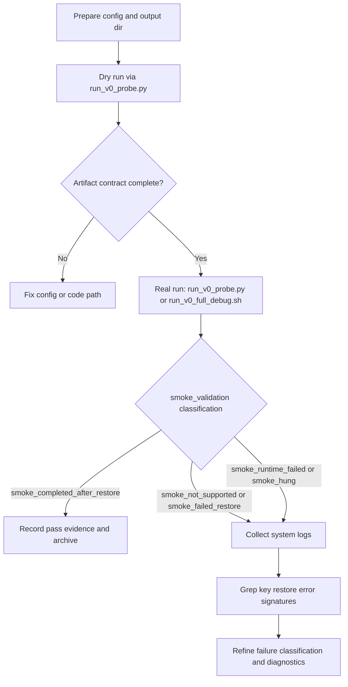
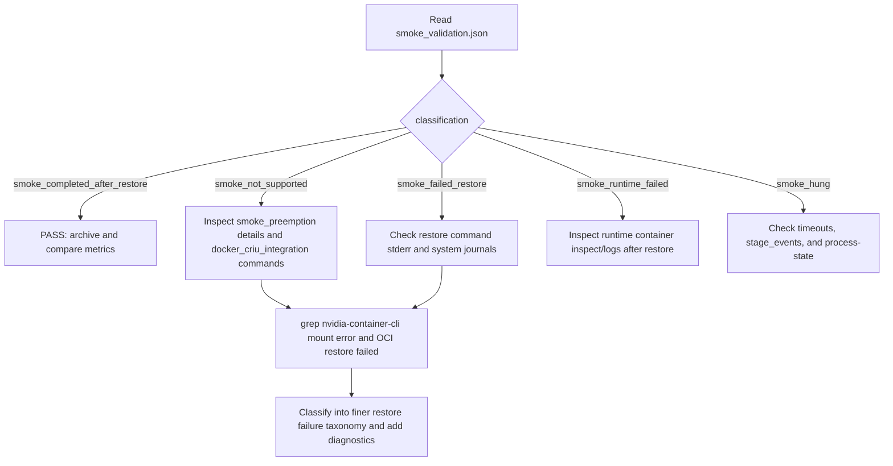

# V0 Checkpoint/Restore — Cross-Session Handoff (Detailed)

## Purpose
This document consolidates work from the referenced sessions plus the current session so a new chat/session can continue without losing context.

---

## Sessions Covered

### 1) Primary long-running research/debug session
- **Session ID:** `ses_171a574cbffeTON1cZZZU44x6e`
- **Range:** 2026-06-03 to 2026-06-11
- **Role in project:** established the core research framing + early CRIU/v0 experiments + architecture direction.

### 2) Follow-up implementation/debug session
- **Session ID:** `ses_148adf896ffeEkFFMDf4wkxgB7`
- **Range:** 2026-06-11
- **Role in project:** concrete archive analysis, implementation of post-restore validation defaults, CRIU config switching, commits/pushes, runbook creation.

### 3) Continuation session from #2
- **Session ID:** `ses_1478a7a25ffecH4PT1P4ue0BYS`
- **Range:** 2026-06-11 to 2026-06-12
- **Role in project:** continued v0 debug automation, additional fixes, expanded full-debug workflow, log collection improvements, and later archive triage.

### 4) Current session (this chat)
- **Range:** 2026-06-12 (current)
- **Role in project:** analyzed newly added failure archives:
  - `ai-edge-v0-vllm-disk-20260612-041925-unsupported-failure-logs.tar.gz`
  - `ai-edge-v0-vllm-disk-20260612-041925-unsupported-failure-logs-with-checkpoints.tar.gz`
  and identified exact failure mechanism with evidence.

---

## Project Goal (Current)
Validate and harden AI-edge **v0 checkpoint/restore** workflow for vLLM under real host conditions, while separating:
1. container/process restore success, and
2. application-layer serving continuity success.

---

## Research/Design Direction Agreed Earlier (from sessions)

The work was intentionally reframed as:

> **Checkpoint-resume study for AI serving systems under lease/resource reconfiguration.**

Key modeling assumptions that were repeatedly discussed:
- Preserve **portable application/serving state** (requests, scheduler state, logical progress).
- Do **not** rely on guaranteed portability of raw CUDA/NVIDIA runtime internals across restore/resource changes.
- Treat CRIU as a practical baseline/experimental arm, not a guaranteed universal solution for GPU-resident execution state.

Experiment arms evolved around:
1. Cold restart
2. CRIU/container checkpoint-resume
3. Application-level checkpoint
4. Generic intermediate-state checkpoint (not LLM-only)
5. Idealized/oracle resume baseline

---

## What Was Implemented Across Sessions

### A) Post-restore proof path and validation behavior
- Commit: `a2113c0` — **make post-restore probing default proof path**.
- Intent: avoid falsely concluding restore failure from an in-flight request that started pre-checkpoint and timed out before restore completed.

### B) CRIU config switching in shipped probe configs
- Commit: `7e55542` — **enable CRIU config switching in v0 probe configs**.
- Intent: ensure proper phase-aware CRIU/runc configuration handling is applied by default in probe runs.

### C) Full debug one-command workflow and hardening commits
Recent commit chain (already present in repo history):
- `ca21602` feat(v0): add one-command full debug workflow
- `09607c8` fix(v0): add preflight cleanup and storage guards to debug runner
- `1c2f78c` fix(v0): enforce host-network restore defaults in debug runner
- `1fa3e85` fix(v0): enforce minimum preemption timeout in debug runner
- plus supporting commits around CRIU log capture/debug collection and probe safety.

---

## Key Historical Findings (Before Current Archive)

### Archive class 1 (older)
- Failure was CRIU checkpoint-side (`/dev/shm` semaphore remap/link-remap issue).

### Archive class 2 (older)
- Checkpoint+restore commands completed, but smoke proof was inconclusive because request timing and restore windows overlapped badly; not a clean post-restore liveness proof.

---

## Current Session: New Archive Analysis (041925)

## Input archives analyzed
1. `ai-edge-v0-vllm-disk-20260612-041925-unsupported-failure-logs.tar.gz`
2. `ai-edge-v0-vllm-disk-20260612-041925-unsupported-failure-logs-with-checkpoints.tar.gz`

Both archives show the **same failure pattern**.

## Verified outcome chain
From artifacts in both archives:
- `smoke_preemption.status = "unsupported"`
- `smoke_preemption.details.outcome = "not_supported"`
- `smoke_preemption.details.reason = "unsupported capability: docker start --checkpoint"`
- `smoke_validation.status = "unsupported"`
- `smoke_validation.classification = "smoke_not_supported"`

However, command-level details show the more specific root error:
- `docker_checkpoint_create` => **ok**
- `docker_start_checkpoint` => **error rc=1**, stderr includes:
  - `OCI runtime restore failed ... prestart hook #0 ...`
  - `nvidia-container-cli: mount error: ... /merged/proc/driver/nvidia: no such file or directory`

### Important interpretation
The label "unsupported capability: docker start --checkpoint" is a **classifier outcome** triggered by generic unsupported markers (including "no such file or directory").

The **actual restore failure mechanism** in this run is GPU runtime hook/mount reconstruction failure during restore (NVIDIA prestart hook path), not checkpoint creation failure.

### Additional host hint
`system-debug/docker-journal.txt` also contains checkpoint reader path errors (missing `cgroup.img` in checkpoint path), reinforcing restore/checkpoint artifact-path inconsistency during this run class.

---

## Where Evidence Lives (high-signal files)

Inside each 041925 archive:
- `artifacts/docker_criu_integration.json`
- `artifacts/smoke_preemption.json`
- `artifacts/smoke_validation.json`
- `artifacts/post_restore_probe.json`
- `artifacts/stage_events.jsonl`
- `full_debug_runner.log`
- `system-debug/error-summary.txt`
- `system-debug/docker-journal.txt`
- `system-debug/containerd-journal.txt`
- `system-debug/docker-events-v0.txt`
- `system-debug/checkpoint-log-paths.txt`

Key strings to grep:
- `unsupported capability: docker start --checkpoint`
- `smoke_not_supported`
- `nvidia-container-cli: mount error`
- `OCI runtime restore failed`
- `no such file or directory`

---

## Current State of Repository / Branch (for continuation)

Recent commit history includes the v0-focused fixes listed above. There are many unrelated modified/untracked files in workspace (multiple project areas), so **future commits should be carefully scoped to AI-edge v0 files only**.

---

## Known Operational Pain Points

1. **Long checkpoint + restore durations** remain a bottleneck.
2. Classification may over-compress distinct runtime failures into "unsupported".
3. Restore can pass command-level checks while application-level continuity remains unproven.
4. The 041925 run class shows GPU hook/mount restore issues during `docker start --checkpoint`.

---

## Recommended Next Steps (Immediate)

1. **Classify 041925 failure as NVIDIA restore hook/mount-path failure** (not generic unsupported) in analysis/reporting.
2. Add/adjust diagnostics around restore command stderr parsing so classifier can emit finer categories (e.g., `gpu_hook_mount_failure`).
3. Capture and preserve restore-phase runtime hook logs in the final debug bundle explicitly.
4. Re-run with latest debug runner hardening (`1fa3e85`) and compare if failure signature persists unchanged.
5. Keep proving post-restore readiness with explicit post-restore request path (already made default earlier).

---

## Repro/Collection Commands That Were Standardized

### Package selected logs (041925 style)
```bash
RUN_ID=ai-edge-v0-vllm-disk-20260612-041925
BASE=/home/ubuntu/ai-edge-runs/$RUN_ID
OUT=~/ai-edge-export/${RUN_ID}-unsupported-failure-logs-with-checkpoints.tar.gz
mkdir -p ~/ai-edge-export

EXTRA_PATHS=()
[ -d "$BASE/system-debug/checkpoint-files" ] && EXTRA_PATHS+=(system-debug/checkpoint-files)

tar -czf "$OUT" -C "$BASE" \
  artifacts/docker_criu_integration.json \
  artifacts/smoke_preemption.json \
  artifacts/smoke_validation.json \
  artifacts/post_restore_probe.json \
  artifacts/stage_events.jsonl \
  full_debug_runner.log \
  system-debug/error-summary.txt \
  system-debug/docker-journal.txt \
  system-debug/containerd-journal.txt \
  system-debug/docker-events-v0.txt \
  system-debug/v0-containers.txt \
  system-debug/v0-container-inspect.txt \
  system-debug/v0-checkpoints.txt \
  system-debug/checkpoint-log-paths.txt \
  system-debug/process-state.txt \
  system-debug/system-info.txt \
  "${EXTRA_PATHS[@]}"
```

### SCP (from Ubuntu `10.203.53.10` to local)
```bash
mkdir -p ~/Downloads/ai-edge-v0-debug
scp ubuntu@10.203.53.10:/home/ubuntu/ai-edge-export/ai-edge-v0-vllm-disk-20260612-041925-unsupported-failure-logs-with-checkpoints.tar.gz ~/Downloads/ai-edge-v0-debug/
```

---

## Detailed V0 Execution Runbook (for next-session agent)

This section is intentionally operational and copy/paste-friendly. It is designed so a new session can run and debug V0 end-to-end without re-discovery.

### 1) Canonical files (what each one does)

| Path | Role in execution/debug |
| --- | --- |
| `experiments/scripts/run_v0_probe.py` | Main V0 probe entrypoint (`--config`, `--output-dir`, `--dry-run`, `--overwrite-output-dir`) |
| `experiments/scripts/run_v0_full_debug.sh` | One-command full debug wrapper (cleanup, CRIU config, telemetry snapshots, probe run, system logs, final tarball) |
| `experiments/scripts/collect_criu_debug_logs.sh` | Host evidence collection (docker/containerd journals, events, checkpoint/log paths, error summary, archive) |
| `experiments/configs/v0_env_probe.yaml` | Default V0 probe config |
| `experiments/configs/v0_env_probe.llama_cpp.yaml` | Pascal/GTX-compatible llama.cpp probe config template |
| `experiments/src/ai_runtime_experiments/v0_orchestrator.py` | Execution order, artifact writing contract, validation/classification logic |
| `experiments/README.md` | Verified command patterns and interpretation checklist |

### 2) Host prerequisites checklist (must pass before real run)

- Docker daemon is healthy and accessible by current user.
- `criu --version` and `runc --version` both work.
- `sudo -v` succeeds (required by full debug runner for `/etc/criu/runc.conf` and log copy fallbacks).
- GPU path only: `nvidia-smi` works and NVIDIA container toolkit/runtime is installed.
- Chosen runtime ports are free (common defaults: vLLM `8000`, llama.cpp `8080`).
- Sufficient disk space in output/checkpoint locations.
- For RAM checkpoint target: enough `MemAvailable` for requested tmpfs size.

### 3) End-to-end flow (high-level)



### 4) Step-by-step execution commands

#### Step 4.1 — Dry-run artifact contract check (mandatory first)

```bash
PYTHONPATH=experiments/src python experiments/scripts/run_v0_probe.py \
  --config experiments/configs/v0_env_probe.yaml \
  --output-dir /tmp/ai-edge-v0-verify-dry-run \
  --dry-run
```

Validate required files exist exactly:

```bash
python - <<'PY'
from pathlib import Path
required = {
    'hardware.json','docker.json','criu_check.json','docker_criu_integration.json',
    'cuda_check.json','mps_check.json','runtime_check.json','smoke_request.jsonl',
    'smoke_response.jsonl','smoke_preemption.json','smoke_validation.json',
    'post_restore_probe.json','stage_events.jsonl','run_metadata.json','config.yaml'
}
run_dir = Path('/tmp/ai-edge-v0-verify-dry-run')
found = {p.name for p in run_dir.iterdir() if p.is_file()}
missing = sorted(required - found)
extra = sorted(found - required)
print({'missing': missing, 'extra': extra})
assert not missing and not extra
print('dry-run artifact set ok')
PY
```

#### Step 4.2 — Optional manual runtime sanity check (llama.cpp path)

Use this when validating endpoint reachability before a full probe:

```bash
mkdir -p /home/netsys/llama-models
hf download ggml-org/gemma-3-1b-it-GGUF --local-dir /home/netsys/llama-models
cp experiments/configs/v0_env_probe.llama_cpp.yaml /tmp/v0_env_probe.real.yaml
```

Then start temporary runtime in one shell and verify `/v1/models` and `/v1/chat/completions` from another shell (see `experiments/README.md` for the exact helper snippets).

#### Step 4.3 — Real probe (direct orchestrator entry)

```bash
PYTHONPATH=experiments/src python experiments/scripts/run_v0_probe.py \
  --config /tmp/v0_env_probe.real.yaml \
  --output-dir /tmp/ai-edge-v0-verify-real
```

#### Step 4.4 — Full debug one-command run (preferred for triage)

```bash
bash experiments/scripts/run_v0_full_debug.sh \
  --config /tmp/v0_env_probe.real.yaml \
  --output-root /tmp
```

Useful options:

```bash
--checkpoint-target ram|disk
--checkpoint-ram-size 80G
--checkpoint-dir <path>
--run-id <custom-id>
--cleanup-keep-recent <n>
--cleanup-min-free-gb <n>
--cleanup-aggressive
--repo-root <path>
```

The runner prints final paths at completion:

```text
FINAL_ARTIFACT_DIR=...
FINAL_RUNNER_LOG=...
FINAL_SYSTEM_DEBUG_DIR=...
FINAL_BUNDLE=...
```

### 5) Where to inspect after each real run

Primary records:

- `artifacts/docker_criu_integration.json`
- `artifacts/runtime_check.json`
- `artifacts/smoke_preemption.json`
- `artifacts/smoke_validation.json`
- `artifacts/post_restore_probe.json`
- `artifacts/stage_events.jsonl`
- `artifacts/smoke_request.jsonl`
- `artifacts/smoke_response.jsonl`
- `full_debug_runner.log`
- `debug/debug_bundle.json`
- `system-debug/error-summary.txt`
- `system-debug/docker-journal.txt`
- `system-debug/containerd-journal.txt`

Quick status summary helper:

```bash
python - <<'PY'
import json
from pathlib import Path
run_dir = Path('/tmp/ai-edge-v0-verify-real')
for name in ['docker_criu_integration.json','runtime_check.json','smoke_preemption.json','smoke_validation.json']:
    data = json.loads((run_dir / name).read_text(encoding='utf-8'))
    print(name, {
        'status': data.get('status'),
        'classification': data.get('classification'),
        'outcome': (data.get('details') or {}).get('outcome'),
        'reason': (data.get('details') or {}).get('reason'),
    })
PY
```

### 6) Failure triage and grep checklist

Run this immediately on a failing bundle/run directory:

```bash
grep -RniE 'unsupported capability: docker start --checkpoint|smoke_not_supported|nvidia-container-cli: mount error|OCI runtime restore failed|no such file or directory' \
  <RUN_DIR>/artifacts <RUN_DIR>/system-debug <RUN_DIR>/full_debug_runner.log
```

High-value interpretation rules:

- `smoke_validation.classification == smoke_completed_after_restore` is the strongest pass indicator.
- `docker_criu_integration.status == ok` alone is **not** sufficient for end-to-end pass.
- 041925-family failures: checkpoint create can succeed while restore fails due to NVIDIA prestart hook mount/path reconstruction.

### 7) Decision tree for next-session debugging



### 8) Standardized evidence packaging for handoff/export

#### Selected logs package (041925 style)

```bash
RUN_ID=ai-edge-v0-vllm-disk-20260612-041925
BASE=/home/ubuntu/ai-edge-runs/$RUN_ID
OUT=~/ai-edge-export/${RUN_ID}-unsupported-failure-logs-with-checkpoints.tar.gz
mkdir -p ~/ai-edge-export

EXTRA_PATHS=()
[ -d "$BASE/system-debug/checkpoint-files" ] && EXTRA_PATHS+=(system-debug/checkpoint-files)

tar -czf "$OUT" -C "$BASE" \
  artifacts/docker_criu_integration.json \
  artifacts/smoke_preemption.json \
  artifacts/smoke_validation.json \
  artifacts/post_restore_probe.json \
  artifacts/stage_events.jsonl \
  full_debug_runner.log \
  system-debug/error-summary.txt \
  system-debug/docker-journal.txt \
  system-debug/containerd-journal.txt \
  system-debug/docker-events-v0.txt \
  system-debug/v0-containers.txt \
  system-debug/v0-container-inspect.txt \
  system-debug/v0-checkpoints.txt \
  system-debug/checkpoint-log-paths.txt \
  system-debug/process-state.txt \
  system-debug/system-info.txt \
  "${EXTRA_PATHS[@]}"
```

#### SCP to local workstation

```bash
mkdir -p ~/Downloads/ai-edge-v0-debug
scp ubuntu@10.203.53.10:/home/ubuntu/ai-edge-export/ai-edge-v0-vllm-disk-20260612-041925-unsupported-failure-logs-with-checkpoints.tar.gz ~/Downloads/ai-edge-v0-debug/
```

### 9) Exact next-session work sequence (recommended)

1. Read this handoff first, then open the newest archive listed in **Current Session: New Archive Analysis (041925)**.
2. Run the grep checklist in Section 6.
3. Confirm failure class using command-level stderr in `smoke_preemption.json.details.commands`.
4. Improve classifier precision (separate GPU hook/mount restore failure from generic unsupported bucket).
5. Preserve added diagnostics in debug bundles and re-run with `run_v0_full_debug.sh`.
6. Compare old vs new run bundles to confirm classification/diagnostic improvements.

---

## Open Questions to Resolve in Next Session

1. Should classifier taxonomy be expanded now, or keep current labels and document detailed root cause externally?
2. Do we need a restore-specific “GPU hook health check” stage before smoke validation classification?
3. For the paper/experiment framing: what minimum cross-architecture intermediate-state contract must be standardized next?

---

## Suggested Starter Prompt for New Session

Use this as first message in a new session:

> Continue from `ai-edge-v0-debug/SESSION_HANDOFF_2026-06-12.md`. Focus on the 041925 failure class where `docker start --checkpoint` fails with `nvidia-container-cli mount error ... /proc/driver/nvidia no such file or directory`. Implement precise failure classification and add targeted restore-phase diagnostics/log capture so this failure is no longer bucketed as generic unsupported. Keep commits scoped to AI-edge v0 files only.

---

## Final Continuation Note
You can safely assume:
- the foundational debug/runbook framework exists,
- post-restore probe defaults are already in place,
- latest unresolved blocker is **restore-time GPU hook/mount failure classification + diagnostics quality** for the 041925 failure family.
