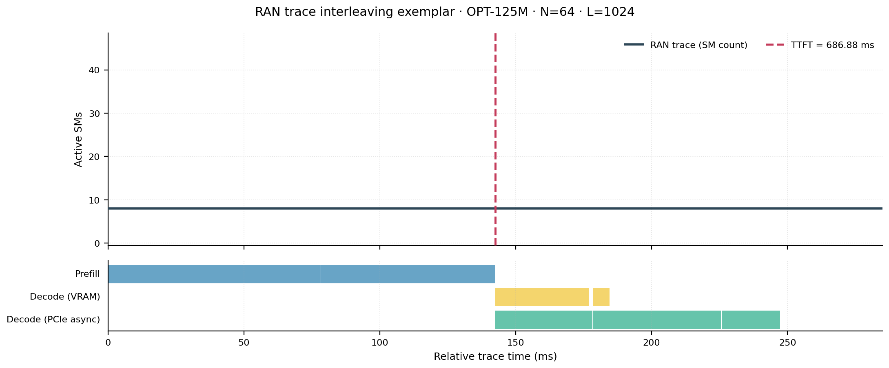
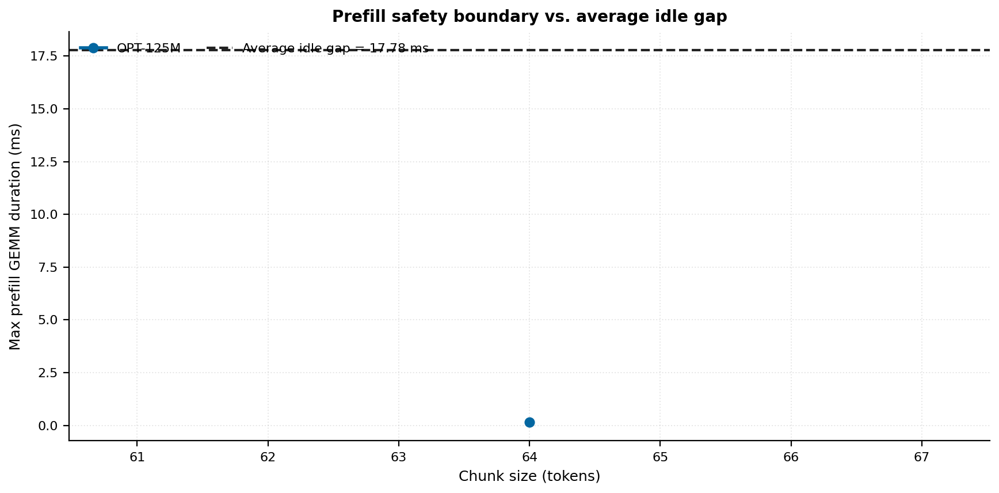
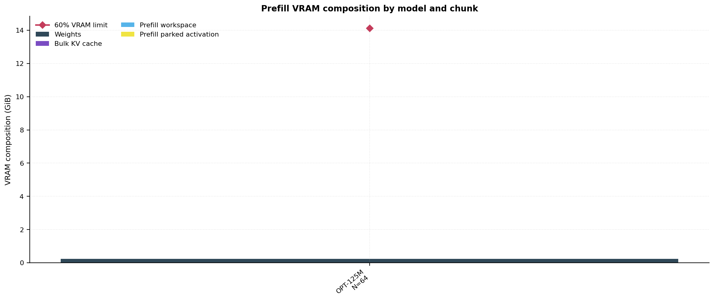
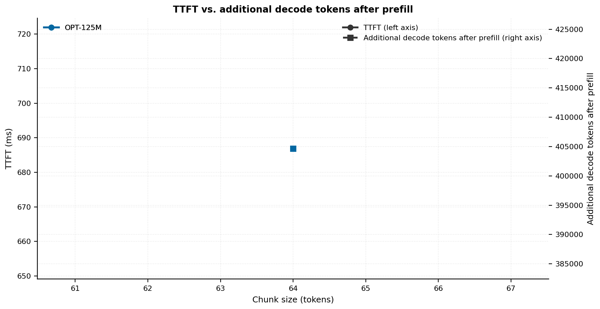
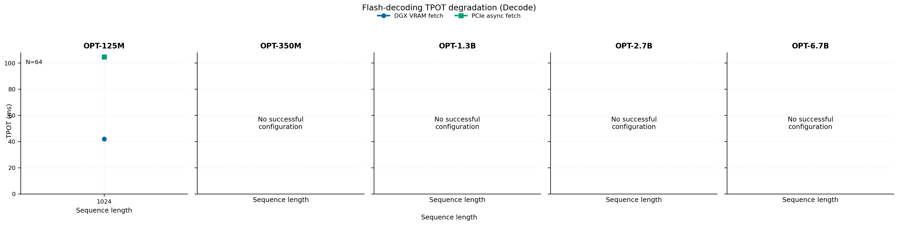
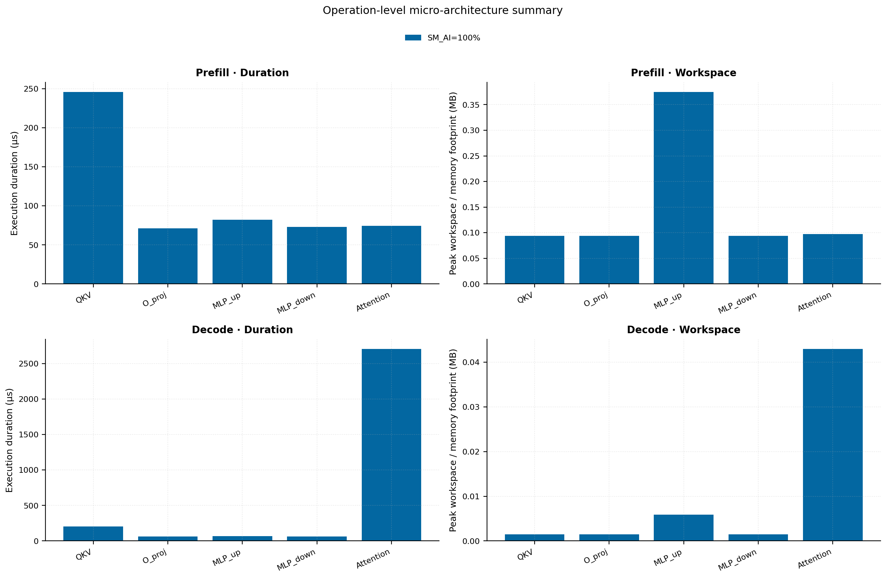

# RAN Inference Profiling Report

Run root: `/mnt/data/dheeraj/dicertation/inference-profile/runs/local-smoke-20260410-05`

## Environment

| field | value |
| --- | --- |
| cache_root | n/a |
| captured_at | 2026-04-10T18:34:56Z |
| chunk_sizes | [64] |
| cuda_available | true |
| cuda_device_count | 8 |
| cwd | /mnt/data/dheeraj/dicertation/inference-profile |
| gpu_id | 0 |
| models | ["facebook/opt-125m"] |
| platform | Linux-6.8.0-106-generic-x86_64-with-glibc2.35 |
| python_executable | /home/dheeraj/miniconda3/bin/python |
| python_version | 3.13.12 |
| run_root | /mnt/data/dheeraj/dicertation/inference-profile/runs/local-smoke-20260410-05 |
| sequence_lengths | [1024] |
| sm_ai_partition | 100 |
| stage | profile |
| timed_iterations | 5 |
| torch_available | true |
| torch_version | 2.11.0+cu130 |
| warmup_iterations | 3 |

## Model Constants

| model_id | sm_ai_partition | num_hidden_layers | hidden_size | num_attention_heads | ffn_dim | layer_index | layer_weight_bytes | total_weight_bytes_fp16 | vram_ceiling_bytes |
| --- | --- | --- | --- | --- | --- | --- | --- | --- | --- |
| facebook/opt-125m | 100 | 12 | 768 | 12 | 3072 | 5 | 14175744 | 250478592 | 15170115993 |

## Trace Inspection

### Primary trace

| field | value |
| --- | --- |
| errors | [] |
| header | ["frame", "slot", "time_slot_sched_ns", "time_decode_start_est_ns", "time_decode_end_est_ns", "time_decode_start_actual_ns", "time_decode_end_actual_ns", "decode_dur_us", "deadline_met", "target_sm", "profile_idx", "sm_count", "num_pusch", "sum_prb", "sum_tbs_bytes", "max_mcs"] |
| median_positive_delta_ms | 5.6997 |
| monotonicity.checked_column | time_slot_sched_ns |
| monotonicity.is_non_decreasing | true |
| monotonicity.negative_delta_count | 0 |
| monotonicity.positive_delta_count | 28377 |
| monotonicity.zero_delta_count | 0 |
| normalization.last_row_duration_policy | median_positive_forward_delta_ms |
| normalization.output_columns | ["time_ms", "sm_utilization", "slot_duration_ms", "source_schema", "sm_count"] |
| normalization.output_relative_path | derived/normalized_ldpc_trace.csv |
| normalized_row_count | 28378 |
| path | /mnt/raid0sata2/netsys/weaver-ext/ran/traces/e2e_2026030418/e2e_20260304_182034_tractor_ran_ctrl/ldpc_trace.csv |
| row_count | 28378 |
| schema_detected | schema_b |
| time_unit_hint | ns |
| usable | true |
| usage_policy | primary_only |
| used_for_scheduler_capacity | true |

### Secondary trace

| field | value |
| --- | --- |
| errors | ["ran_ctrl_trace.csv line 182958 has 9 field(s); expected 12"] |
| header | ["frame", "slot", "sm_available", "prbs_available", "prbs_allocated", "w_avg_mcs_prev", "w_avg_mcs_curr", "slots_since_underutil", "ramp_up_count", "num_ue_sched", "max_ue_backlog", "sum_ue_backlog"] |
| monotonicity.checked_column | n/a |
| monotonicity.is_non_decreasing | n/a |
| monotonicity.negative_delta_count | n/a |
| path | /mnt/raid0sata2/netsys/weaver-ext/ran/traces/e2e_2026030418/e2e_20260304_182034_tractor_ran_ctrl/ran_ctrl_trace.csv |
| row_count | 182956 |
| time_unit_hints | [] |
| usable | false |
| usage_policy | structural_only |
| used_for_scheduler_capacity | false |

## Raw-Profile Summary Tables

### Prefill profile summary

Source raw rows: `raw/prefill_events.csv` = 35. Summary artifact: `derived/prefill_summary.csv`.

| model_id | chunk_tokens | prefill_max_gemm_us | prefill_workspace_bytes | prefill_parked_activation_bytes |
| --- | --- | --- | --- | --- |
| facebook/opt-125m | 64 | 148.48 | 393216 | 393216 |

### Decode profile summary

Source raw rows: `raw/decode_events.csv` = 40. Summary artifact: `derived/decode_summary.csv`.

| model_id | sequence_length | block_size | decode_max_gemv_us | attention_fetch_compute_us | reduction_overhead_us | decode_workspace_bytes | decode_parked_activation_bytes |
| --- | --- | --- | --- | --- | --- | --- | --- |
| facebook/opt-125m | 1024 | 64 | 112.768 | 1947.648 | 760.6656 | 45056 | 1536 |

### PCIe profile summary

Source raw rows: `raw/pcie_events.csv` = 5. Summary artifact: `derived/pcie_summary.csv`.

| model_id | block_size | kv_block_bytes | transfer_only_us | overlap_total_us | dummy_compute_us | exposed_transfer_us | effective_gbps |
| --- | --- | --- | --- | --- | --- | --- | --- |
| facebook/opt-125m | 64 | 196608 | 316.832 | 24460.9027 | 24128.9214 | 331.9813 | 0.6205 |

## SLA Tables

### Successful configurations

| model_id | chunk_tokens | sequence_length | ttft_ms | tpot_ms_vram | tpot_ms_pcie_async | decode_runway_tokens | status |
| --- | --- | --- | --- | --- | --- | --- | --- |
| facebook/opt-125m | 64 | 1024 | 686.8776 | 41.9925 | 104.7518 | 404655 | success |

### Failed configurations

No rows available.

## Per-Model Scaling Analysis

| model_id | successful_configs | failed_configs | chunk_tokens_tested | sequence_lengths_tested | largest_successful_chunk_tokens | ttft_ms_min | ttft_ms_max | tpot_ms_vram_min | tpot_ms_vram_max | tpot_ms_pcie_async_min | tpot_ms_pcie_async_max | max_decode_runway_tokens |
| --- | --- | --- | --- | --- | --- | --- | --- | --- | --- | --- | --- | --- |
| facebook/opt-125m | 1 | 0 | 64 | 1024 | 64 | 686.8776 | 686.8776 | 41.9925 | 41.9925 | 104.7518 | 104.7518 | 404655 |

## Plots

### 01 Ran Trace Interleaving

[Interactive companion](plots/01_ran_trace_interleaving_interactive.html)

### 02 Prefill Safety Boundary

### 03 Prefill Vram Composition

### 04 TTFT vs. Additional Decode Tokens After Prefill

### 05 Decode Tpot Degradation

### 06 Operation Level Microarchitecture Summary

