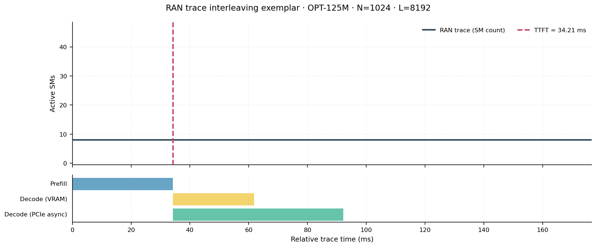
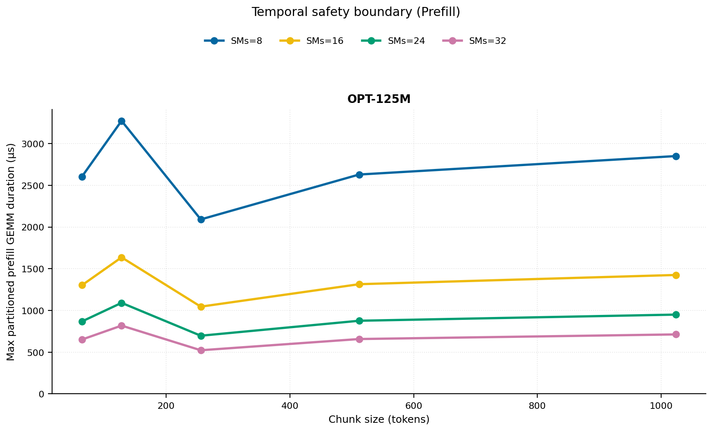
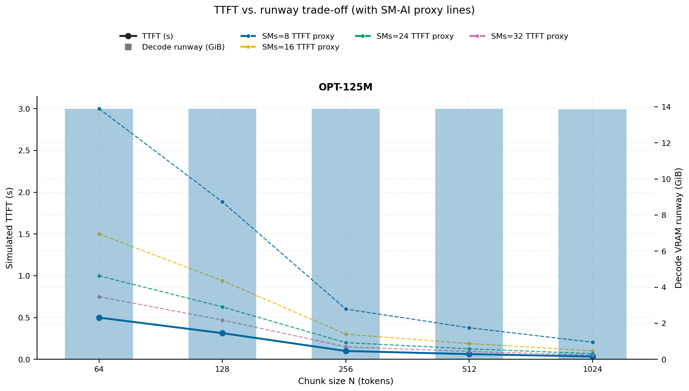
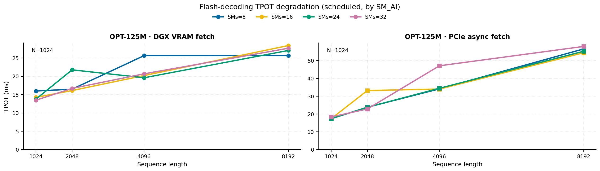
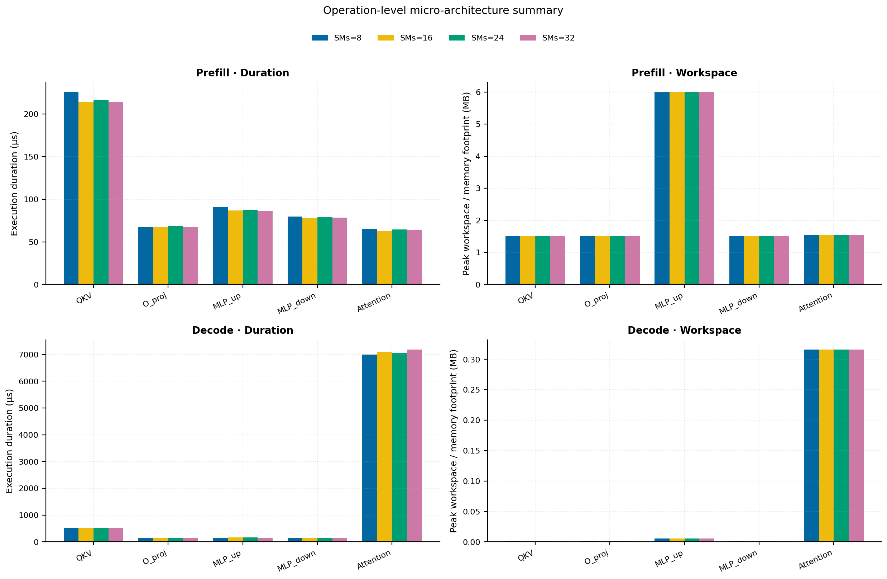
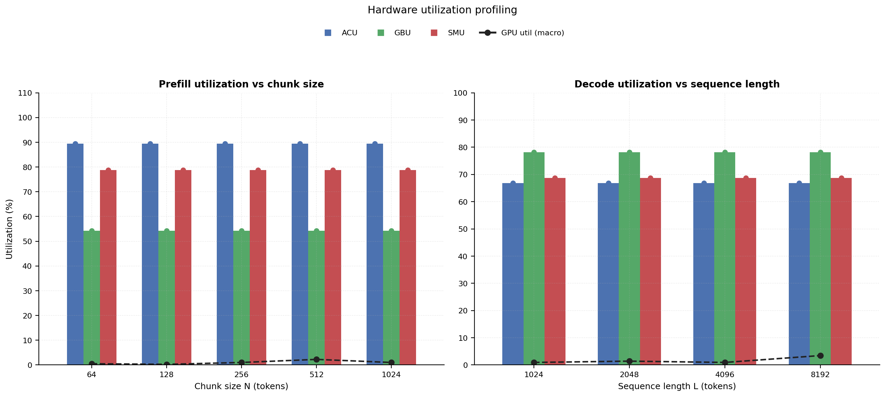
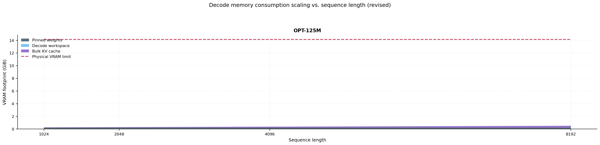

# RAN Inference Profiling Report

Run root: `/mnt/data/dheeraj/dicertation/inference-profile/runs/revised-full-20260414-g0-opt125m`

## Environment

| field | value |
| --- | --- |
| cache_root | n/a |
| captured_at | 2026-04-14T11:52:43Z |
| chunk_sizes | [64, 128, 256, 512, 1024] |
| cuda_available | true |
| cuda_device_count | 8 |
| cwd | /mnt/data/dheeraj/dicertation/inference-profile |
| decode_modes | ["vram", "pcie_async"] |
| experiment_type | ran-dgxspark-v1 |
| gpu_id | 0 |
| l_out | 1024 |
| models | ["facebook/opt-125m"] |
| platform | Linux-6.8.0-106-generic-x86_64-with-glibc2.35 |
| python_executable | /home/dheeraj/miniconda3/envs/mls/bin/python |
| python_version | 3.11.14 |
| run_root | /mnt/data/dheeraj/dicertation/inference-profile/runs/revised-full-20260414-g0-opt125m |
| scheduler | envelope_v1 |
| schema_version | ran_dgxspark_v1 |
| sequence_lengths | [1024, 2048, 4096, 8192] |
| sm_ai_cap | 32 |
| sm_ai_partition | 100 |
| sm_ai_partitions | [8, 16, 24, 32] |
| stage | profile |
| telemetry_tier | baseline_nvml_pt |
| timed_iterations | 5 |
| torch_available | true |
| torch_version | 2.10.0+cu128 |
| warmup_iterations | 3 |

## Model Constants

| model_id | sm_ai_partition | num_hidden_layers | hidden_size | num_attention_heads | ffn_dim | layer_index | layer_weight_bytes | total_weight_bytes_fp16 | vram_ceiling_bytes |
| --- | --- | --- | --- | --- | --- | --- | --- | --- | --- |
| facebook/opt-125m | 100 | 12 | 768 | 12 | 3072 | 5 | 14175744 | 250478592 | 15170115993 |

## Trace Inspection

### Primary trace

| field | value |
| --- | --- |
| errors | [] |
| header | ["frame", "slot", "time_slot_sched_ns", "time_decode_start_est_ns", "time_decode_end_est_ns", "time_decode_start_actual_ns", "time_decode_end_actual_ns", "decode_dur_us", "deadline_met", "target_sm", "profile_idx", "sm_count", "num_pusch", "sum_prb", "sum_tbs_bytes", "max_mcs"] |
| median_positive_delta_ms | 5.6997 |
| monotonicity.checked_column | time_slot_sched_ns |
| monotonicity.is_non_decreasing | true |
| monotonicity.negative_delta_count | 0 |
| monotonicity.positive_delta_count | 28377 |
| monotonicity.zero_delta_count | 0 |
| normalization.last_row_duration_policy | median_positive_forward_delta_ms |
| normalization.output_columns | ["time_ms", "sm_utilization", "slot_duration_ms", "source_schema", "sm_count"] |
| normalization.output_relative_path | derived/normalized_ldpc_trace.csv |
| normalized_row_count | 28378 |
| path | /mnt/raid0sata2/netsys/weaver-ext/ran/traces/e2e_2026030418/e2e_20260304_182034_tractor_ran_ctrl/ldpc_trace.csv |
| row_count | 28378 |
| schema_detected | schema_b |
| time_unit_hint | ns |
| usable | true |
| usage_policy | primary_only |
| used_for_scheduler_capacity | true |

### Secondary trace

| field | value |
| --- | --- |
| errors | ["ran_ctrl_trace.csv line 182958 has 9 field(s); expected 12"] |
| header | ["frame", "slot", "sm_available", "prbs_available", "prbs_allocated", "w_avg_mcs_prev", "w_avg_mcs_curr", "slots_since_underutil", "ramp_up_count", "num_ue_sched", "max_ue_backlog", "sum_ue_backlog"] |
| monotonicity.checked_column | n/a |
| monotonicity.is_non_decreasing | n/a |
| monotonicity.negative_delta_count | n/a |
| path | /mnt/raid0sata2/netsys/weaver-ext/ran/traces/e2e_2026030418/e2e_20260304_182034_tractor_ran_ctrl/ran_ctrl_trace.csv |
| row_count | 182956 |
| time_unit_hints | [] |
| usable | false |
| usage_policy | structural_only |
| used_for_scheduler_capacity | false |

## Raw-Profile Summary Tables

### Prefill profile summary

Source raw rows: `raw/prefill_events.csv` = 700. Summary artifact: `derived/prefill_summary.csv`.

| model_id | chunk_tokens | sm_ai_partition | max_input_tokens | prefill_max_gemm_us | prefill_workspace_bytes | prefill_parked_activation_bytes | telemetry_tier | telemetry_provider | telemetry_status | nvml_available | gpu_util | gpu_mem_used_mb | sm_clock_mhz | mem_clock_mhz | power_w | pt_step_ms | pt_mem_alloc_mb | pt_mem_reserved_mb | pt_workspace_mb | acu_pct | gbu_pct | smu_pct | microscopic_telemetry_status | microscopic_error |
| --- | --- | --- | --- | --- | --- | --- | --- | --- | --- | --- | --- | --- | --- | --- | --- | --- | --- | --- | --- | --- | --- | --- | --- | --- |
| facebook/opt-125m | 64 | 8 | 1024 | 150.528 | 393216 | 393216 | baseline_nvml_pt | nvidia-smi | ok | true | 1 | 7 | 1695 | 7601 | 62.23 | 0.1505 | 23.7632 | 23.7632 | 0.375 | n/a | n/a | n/a | unavailable | n/a |
| facebook/opt-125m | 64 | 16 | 1024 | 136.096 | 393216 | 393216 | baseline_nvml_pt | nvidia-smi | ok | true | 0 | 7 | 1695 | 7601 | 62.16 | 0.1361 | 23.7632 | 23.7632 | 0.375 | n/a | n/a | n/a | unavailable | n/a |
| facebook/opt-125m | 64 | 24 | 1024 | 117.792 | 393216 | 393216 | baseline_nvml_pt | nvidia-smi | ok | true | 0 | 7 | 1695 | 7601 | 62.1 | 0.1178 | 23.7632 | 23.7632 | 0.375 | n/a | n/a | n/a | unavailable | n/a |
| facebook/opt-125m | 64 | 32 | 1024 | 108.544 | 393216 | 393216 | baseline_nvml_pt | nvidia-smi | ok | true | 1 | 7 | 1695 | 7601 | 62.17 | 0.1085 | 23.7632 | 23.7632 | 0.375 | n/a | n/a | n/a | unavailable | n/a |
| facebook/opt-125m | 128 | 8 | 1024 | 106.496 | 786432 | 786432 | baseline_nvml_pt | nvidia-smi | ok | true | 0 | 7 | 1695 | 7601 | 62.56 | 0.1065 | 24.8882 | 24.8882 | 0.75 | n/a | n/a | n/a | unavailable | n/a |
| facebook/opt-125m | 128 | 16 | 1024 | 117.76 | 786432 | 786432 | baseline_nvml_pt | nvidia-smi | ok | true | 1 | 7 | 1695 | 7601 | 62.93 | 0.1178 | 24.8882 | 24.8882 | 0.75 | n/a | n/a | n/a | unavailable | n/a |
| facebook/opt-125m | 128 | 24 | 1024 | 154.848 | 786432 | 786432 | baseline_nvml_pt | nvidia-smi | ok | true | 0 | 7 | 1695 | 7601 | 63.62 | 0.1548 | 24.8882 | 24.8882 | 0.75 | n/a | n/a | n/a | unavailable | n/a |
| facebook/opt-125m | 128 | 32 | 1024 | 136.384 | 786432 | 786432 | baseline_nvml_pt | nvidia-smi | ok | true | 0 | 7 | 1695 | 7601 | 62.88 | 0.1364 | 24.8882 | 24.8882 | 0.75 | n/a | n/a | n/a | unavailable | n/a |
| facebook/opt-125m | 256 | 8 | 1024 | 320.352 | 1572864 | 1572864 | baseline_nvml_pt | nvidia-smi | ok | true | 1 | 7 | 1695 | 7601 | 63.34 | 0.3204 | 27.1382 | 27.1382 | 1.5 | n/a | n/a | n/a | unavailable | n/a |
| facebook/opt-125m | 256 | 16 | 1024 | 90.112 | 1572864 | 1572864 | baseline_nvml_pt | nvidia-smi | ok | true | 2 | 7 | 1695 | 8001 | 63.87 | 0.0901 | 27.1382 | 27.1382 | 1.5 | n/a | n/a | n/a | unavailable | n/a |
| facebook/opt-125m | 256 | 24 | 1024 | 94.4 | 1572864 | 1572864 | baseline_nvml_pt | nvidia-smi | ok | true | 1 | 7 | 1695 | 7601 | 63.96 | 0.0944 | 27.1382 | 27.1382 | 1.5 | n/a | n/a | n/a | unavailable | n/a |
| facebook/opt-125m | 256 | 32 | 1024 | 87.136 | 1572864 | 1572864 | baseline_nvml_pt | nvidia-smi | ok | true | 0 | 7 | 1695 | 7601 | 63.6 | 0.0871 | 27.1382 | 27.1382 | 1.5 | n/a | n/a | n/a | unavailable | n/a |
| facebook/opt-125m | 512 | 8 | 1024 | 114.688 | 3670016 | 3145728 | baseline_nvml_pt | nvidia-smi | ok | true | 0 | 7 | 1695 | 7601 | 64.12 | 0.1147 | 32.1382 | 32.1382 | 3.5 | n/a | n/a | n/a | unavailable | n/a |
| facebook/opt-125m | 512 | 16 | 1024 | 109.568 | 3670016 | 3145728 | baseline_nvml_pt | nvidia-smi | ok | true | 0 | 7 | 1695 | 7601 | 55.19 | 0.1096 | 32.1382 | 32.1382 | 3.5 | n/a | n/a | n/a | unavailable | n/a |
| facebook/opt-125m | 512 | 24 | 1024 | 110.592 | 3670016 | 3145728 | baseline_nvml_pt | nvidia-smi | ok | true | 2 | 7 | 1695 | 7601 | 54.04 | 0.1106 | 32.1382 | 32.1382 | 3.5 | n/a | n/a | n/a | unavailable | n/a |
| facebook/opt-125m | 512 | 32 | 1024 | 109.568 | 3670016 | 3145728 | baseline_nvml_pt | nvidia-smi | ok | true | 7 | 7 | 1695 | 8001 | 64.41 | 0.1096 | 32.1382 | 32.1382 | 3.5 | n/a | n/a | n/a | unavailable | n/a |
| facebook/opt-125m | 1024 | 8 | 1024 | 123.904 | 6291456 | 6291456 | baseline_nvml_pt | nvidia-smi | ok | true | 4 | 7 | 1695 | 7601 | 64.42 | 0.1239 | 41.1382 | 41.1382 | 6 | n/a | n/a | n/a | unavailable | n/a |
| facebook/opt-125m | 1024 | 16 | 1024 | 119.552 | 6291456 | 6291456 | baseline_nvml_pt | nvidia-smi | ok | true | 0 | 7 | 1695 | 7601 | 65.25 | 0.1196 | 41.1382 | 41.1382 | 6 | n/a | n/a | n/a | unavailable | n/a |
| facebook/opt-125m | 1024 | 24 | 1024 | 119.808 | 6291456 | 6291456 | baseline_nvml_pt | nvidia-smi | ok | true | 0 | 7 | 1695 | 7601 | 64.68 | 0.1198 | 41.1382 | 41.1382 | 6 | n/a | n/a | n/a | unavailable | n/a |
| facebook/opt-125m | 1024 | 32 | 1024 | 118.784 | 6291456 | 6291456 | baseline_nvml_pt | nvidia-smi | ok | true | 0 | 7 | 1695 | 7601 | 64.75 | 0.1188 | 41.1382 | 41.1382 | 6 | n/a | n/a | n/a | unavailable | n/a |

### Decode profile summary

Source raw rows: `raw/decode_events.csv` = 6400. Summary artifact: `derived/decode_summary.csv`.

| model_id | sequence_length | block_size | sm_ai_partition | decode_mode | decode_max_gemv_us | attention_fetch_compute_us | reduction_overhead_us | decode_workspace_bytes | decode_parked_activation_bytes | telemetry_tier | telemetry_provider | telemetry_status | nvml_available | gpu_util | gpu_mem_used_mb | sm_clock_mhz | mem_clock_mhz | power_w | pt_step_ms | pt_mem_alloc_mb | pt_mem_reserved_mb | pt_workspace_mb | acu_pct | gbu_pct | smu_pct | microscopic_telemetry_status | microscopic_error |
| --- | --- | --- | --- | --- | --- | --- | --- | --- | --- | --- | --- | --- | --- | --- | --- | --- | --- | --- | --- | --- | --- | --- | --- | --- | --- | --- | --- |
| facebook/opt-125m | 1024 | 64 | 8 | pcie_async | 139.328 | 1722.3808 | 675.0336 | 45056 | 1536 | baseline_nvml_pt | nvidia-smi | ok | true | 0 | 7 | 1695 | 7601 | 64.5 | 1.7316 | 24.6919 | 24.6919 | 0.043 | n/a | n/a | n/a | unavailable | n/a |
| facebook/opt-125m | 1024 | 64 | 8 | vram | 130.272 | 1736.48 | 670.272 | 45056 | 1536 | baseline_nvml_pt | nvidia-smi | ok | true | 7 | 7 | 1695 | 8001 | 64.97 | 1.7764 | 24.6919 | 24.6919 | 0.043 | n/a | n/a | n/a | unavailable | n/a |
| facebook/opt-125m | 1024 | 64 | 16 | pcie_async | 181.248 | 1729.2032 | 648.832 | 45056 | 1536 | baseline_nvml_pt | nvidia-smi | ok | true | 0 | 7 | 1695 | 8001 | 65.06 | 1.8504 | 24.6919 | 24.6919 | 0.043 | n/a | n/a | n/a | unavailable | n/a |
| facebook/opt-125m | 1024 | 64 | 16 | vram | 150.528 | 1717.5232 | 682.1184 | 45056 | 1536 | baseline_nvml_pt | nvidia-smi | ok | true | 0 | 7 | 1695 | 7601 | 64.55 | 1.7287 | 24.6919 | 24.6919 | 0.043 | n/a | n/a | n/a | unavailable | n/a |
| facebook/opt-125m | 1024 | 64 | 24 | pcie_async | 148.64 | 1790.368 | 702.6432 | 45056 | 1536 | baseline_nvml_pt | nvidia-smi | ok | true | 0 | 7 | 1695 | 7601 | 50.99 | 1.8115 | 24.6919 | 24.6919 | 0.043 | n/a | n/a | n/a | unavailable | n/a |
| facebook/opt-125m | 1024 | 64 | 24 | vram | 147.456 | 1766.6432 | 681.7408 | 45056 | 1536 | baseline_nvml_pt | nvidia-smi | ok | true | 0 | 7 | 1695 | 7601 | 64.59 | 1.8156 | 24.6919 | 24.6919 | 0.043 | n/a | n/a | n/a | unavailable | n/a |
| facebook/opt-125m | 1024 | 64 | 32 | pcie_async | 160.768 | 1752.8832 | 704.896 | 45056 | 1536 | baseline_nvml_pt | nvidia-smi | ok | true | 0 | 7 | 1695 | 8001 | 65.15 | 1.793 | 24.6919 | 24.6919 | 0.043 | n/a | n/a | n/a | unavailable | n/a |
| facebook/opt-125m | 1024 | 64 | 32 | vram | 140.384 | 1717.216 | 659.0784 | 45056 | 1536 | baseline_nvml_pt | nvidia-smi | ok | true | 0 | 7 | 1695 | 7601 | 62.91 | 1.7254 | 24.6919 | 24.6919 | 0.043 | n/a | n/a | n/a | unavailable | n/a |
| facebook/opt-125m | 1024 | 128 | 8 | pcie_async | 151.552 | 921.2544 | 455.8528 | 30720 | 1536 | baseline_nvml_pt | nvidia-smi | ok | true | 0 | 7 | 1695 | 7601 | 65.21 | 0.9265 | 24.6763 | 24.6763 | 0.0293 | n/a | n/a | n/a | unavailable | n/a |
| facebook/opt-125m | 1024 | 128 | 8 | vram | 140.352 | 990.9888 | 396.4672 | 30720 | 1536 | baseline_nvml_pt | nvidia-smi | ok | true | 0 | 7 | 1695 | 7601 | 65.12 | 1.1315 | 24.6763 | 24.6763 | 0.0293 | n/a | n/a | n/a | unavailable | n/a |
| facebook/opt-125m | 1024 | 128 | 16 | pcie_async | 171.008 | 951.5008 | 452.3456 | 30720 | 1536 | baseline_nvml_pt | nvidia-smi | ok | true | 0 | 7 | 1695 | 7601 | 66.22 | 0.9626 | 24.6763 | 24.6763 | 0.0293 | n/a | n/a | n/a | unavailable | n/a |
| facebook/opt-125m | 1024 | 128 | 16 | vram | 158.752 | 924.9088 | 422.3488 | 30720 | 1536 | baseline_nvml_pt | nvidia-smi | ok | true | 7 | 7 | 1695 | 8001 | 66.25 | 0.9544 | 24.6763 | 24.6763 | 0.0293 | n/a | n/a | n/a | unavailable | n/a |
| facebook/opt-125m | 1024 | 128 | 24 | pcie_async | 136.192 | 932.6528 | 401.184 | 30720 | 1536 | baseline_nvml_pt | nvidia-smi | ok | true | 7 | 7 | 1695 | 7601 | 65.92 | 0.9431 | 24.6763 | 24.6763 | 0.0293 | n/a | n/a | n/a | unavailable | n/a |
| facebook/opt-125m | 1024 | 128 | 24 | vram | 344.064 | 1100 | 518.336 | 30720 | 1536 | baseline_nvml_pt | nvidia-smi | ok | true | 0 | 7 | 1695 | 7601 | 65.78 | 1.2544 | 24.6763 | 24.6763 | 0.0293 | n/a | n/a | n/a | unavailable | n/a |
| facebook/opt-125m | 1024 | 128 | 32 | pcie_async | 157.696 | 939.2256 | 428.6592 | 30720 | 1536 | baseline_nvml_pt | nvidia-smi | ok | true | 0 | 7 | 1695 | 7601 | 66.22 | 0.9462 | 24.6763 | 24.6763 | 0.0293 | n/a | n/a | n/a | unavailable | n/a |
| facebook/opt-125m | 1024 | 128 | 32 | vram | 143.36 | 913.184 | 422.3232 | 30720 | 1536 | baseline_nvml_pt | nvidia-smi | ok | true | 0 | 7 | 1695 | 7601 | 66.28 | 0.9216 | 24.6763 | 24.6763 | 0.0293 | n/a | n/a | n/a | unavailable | n/a |
| facebook/opt-125m | 1024 | 256 | 8 | pcie_async | 145.696 | 509.952 | 269.0752 | 32768 | 1536 | baseline_nvml_pt | nvidia-smi | ok | true | 1 | 7 | 1695 | 7601 | 65.62 | 0.5202 | 24.6782 | 24.6782 | 0.0312 | n/a | n/a | n/a | unavailable | n/a |
| facebook/opt-125m | 1024 | 256 | 8 | vram | 144.384 | 498.8928 | 270.336 | 32768 | 1536 | baseline_nvml_pt | nvidia-smi | ok | true | 0 | 7 | 1695 | 7601 | 54.26 | 0.51 | 24.6782 | 24.6782 | 0.0312 | n/a | n/a | n/a | unavailable | n/a |
| facebook/opt-125m | 1024 | 256 | 16 | pcie_async | 154.688 | 518.1376 | 297.9968 | 32768 | 1536 | baseline_nvml_pt | nvidia-smi | ok | true | 0 | 7 | 1695 | 7601 | 65.98 | 0.5325 | 24.6782 | 24.6782 | 0.0312 | n/a | n/a | n/a | unavailable | n/a |
| facebook/opt-125m | 1024 | 256 | 16 | vram | 174.08 | 490.5792 | 267.1232 | 32768 | 1536 | baseline_nvml_pt | nvidia-smi | ok | true | 0 | 7 | 1695 | 8001 | 65.93 | 0.4977 | 24.6782 | 24.6782 | 0.0312 | n/a | n/a | n/a | unavailable | n/a |
| facebook/opt-125m | 1024 | 256 | 24 | pcie_async | 168.96 | 502.3744 | 281.5936 | 32768 | 1536 | baseline_nvml_pt | nvidia-smi | ok | true | 1 | 7 | 1695 | 7601 | 66.21 | 0.5181 | 24.6782 | 24.6782 | 0.0312 | n/a | n/a | n/a | unavailable | n/a |
| facebook/opt-125m | 1024 | 256 | 24 | vram | 146.432 | 511.5776 | 323.168 | 32768 | 1536 | baseline_nvml_pt | nvidia-smi | ok | true | 0 | 7 | 1695 | 7601 | 65.75 | 0.5683 | 24.6782 | 24.6782 | 0.0312 | n/a | n/a | n/a | unavailable | n/a |
| facebook/opt-125m | 1024 | 256 | 32 | pcie_async | 149.504 | 504.1984 | 288.1728 | 32768 | 1536 | baseline_nvml_pt | nvidia-smi | ok | true | 2 | 7 | 1695 | 7601 | 66.37 | 0.5244 | 24.6782 | 24.6782 | 0.0312 | n/a | n/a | n/a | unavailable | n/a |
| facebook/opt-125m | 1024 | 256 | 32 | vram | 140.288 | 494.304 | 273.184 | 32768 | 1536 | baseline_nvml_pt | nvidia-smi | ok | true | 5 | 7 | 1695 | 7601 | 66.49 | 0.5008 | 24.6782 | 24.6782 | 0.0312 | n/a | n/a | n/a | unavailable | n/a |
| facebook/opt-125m | 1024 | 512 | 8 | pcie_async | 149.28 | 294.9312 | 198.784 | 52224 | 1536 | baseline_nvml_pt | nvidia-smi | ok | true | 2 | 7 | 1695 | 7601 | 65.46 | 0.3113 | 24.6968 | 24.6968 | 0.0498 | n/a | n/a | n/a | unavailable | n/a |
| facebook/opt-125m | 1024 | 512 | 8 | vram | 153.6 | 290.6432 | 207.6352 | 52224 | 1536 | baseline_nvml_pt | nvidia-smi | ok | true | 0 | 7 | 1695 | 7601 | 65.8 | 0.3125 | 24.6968 | 24.6968 | 0.0498 | n/a | n/a | n/a | unavailable | n/a |
| facebook/opt-125m | 1024 | 512 | 16 | pcie_async | 140.288 | 289.9968 | 195.8336 | 52224 | 1536 | baseline_nvml_pt | nvidia-smi | ok | true | 0 | 7 | 1695 | 7601 | 65.96 | 0.3 | 24.6968 | 24.6968 | 0.0498 | n/a | n/a | n/a | unavailable | n/a |
| facebook/opt-125m | 1024 | 512 | 16 | vram | 144.384 | 754.4448 | 201.728 | 52224 | 1536 | baseline_nvml_pt | nvidia-smi | ok | true | 0 | 7 | 1695 | 8001 | 66.48 | 2.5272 | 24.6968 | 24.6968 | 0.0498 | n/a | n/a | n/a | unavailable | n/a |
| facebook/opt-125m | 1024 | 512 | 24 | pcie_async | 222.208 | 321.184 | 225.3184 | 52224 | 1536 | baseline_nvml_pt | nvidia-smi | ok | true | 0 | 7 | 1695 | 7601 | 65.87 | 0.4241 | 24.6968 | 24.6968 | 0.0498 | n/a | n/a | n/a | unavailable | n/a |
| facebook/opt-125m | 1024 | 512 | 24 | vram | 137.216 | 291.552 | 204.2112 | 52224 | 1536 | baseline_nvml_pt | nvidia-smi | ok | true | 0 | 7 | 1695 | 7601 | 66.21 | 0.2949 | 24.6968 | 24.6968 | 0.0498 | n/a | n/a | n/a | unavailable | n/a |
| facebook/opt-125m | 1024 | 512 | 32 | pcie_async | 171.008 | 309.2416 | 220.1984 | 52224 | 1536 | baseline_nvml_pt | nvidia-smi | ok | true | 0 | 7 | 1695 | 7601 | 54.34 | 0.3174 | 24.6968 | 24.6968 | 0.0498 | n/a | n/a | n/a | unavailable | n/a |
| facebook/opt-125m | 1024 | 512 | 32 | vram | 149.28 | 290.7136 | 195.5584 | 52224 | 1536 | baseline_nvml_pt | nvidia-smi | ok | true | 0 | 7 | 1695 | 7601 | 66.17 | 0.3049 | 24.6968 | 24.6968 | 0.0498 | n/a | n/a | n/a | unavailable | n/a |
| facebook/opt-125m | 1024 | 1024 | 8 | pcie_async | 131.072 | 182.0672 | 175.776 | 74240 | 1536 | baseline_nvml_pt | nvidia-smi | ok | true | 0 | 7 | 1695 | 7601 | 66.79 | 0.1915 | 24.7178 | 24.7178 | 0.0708 | n/a | n/a | n/a | unavailable | n/a |
| facebook/opt-125m | 1024 | 1024 | 8 | vram | 158.72 | 197.8496 | 182.8608 | 74240 | 1536 | baseline_nvml_pt | nvidia-smi | ok | true | 0 | 7 | 1695 | 7601 | 66.36 | 0.2335 | 24.7178 | 24.7178 | 0.0708 | n/a | n/a | n/a | unavailable | n/a |
| facebook/opt-125m | 1024 | 1024 | 16 | pcie_async | 129.952 | 183.9232 | 181.9968 | 74240 | 1536 | baseline_nvml_pt | nvidia-smi | ok | true | 0 | 7 | 1695 | 7601 | 66.5 | 0.1995 | 24.7178 | 24.7178 | 0.0708 | n/a | n/a | n/a | unavailable | n/a |
| facebook/opt-125m | 1024 | 1024 | 16 | vram | 138.24 | 183.904 | 175.6928 | 74240 | 1536 | baseline_nvml_pt | nvidia-smi | ok | true | 2 | 7 | 1695 | 7601 | 62.84 | 0.1907 | 24.7178 | 24.7178 | 0.0708 | n/a | n/a | n/a | unavailable | n/a |
| facebook/opt-125m | 1024 | 1024 | 24 | pcie_async | 129.248 | 186.5024 | 181.76 | 74240 | 1536 | baseline_nvml_pt | nvidia-smi | ok | true | 0 | 7 | 1695 | 7601 | 66.09 | 0.2016 | 24.7178 | 24.7178 | 0.0708 | n/a | n/a | n/a | unavailable | n/a |
| facebook/opt-125m | 1024 | 1024 | 24 | vram | 133.216 | 180.1984 | 170.2784 | 74240 | 1536 | baseline_nvml_pt | nvidia-smi | ok | true | 1 | 7 | 1695 | 7601 | 59.8 | 0.1965 | 24.7178 | 24.7178 | 0.0708 | n/a | n/a | n/a | unavailable | n/a |
| facebook/opt-125m | 1024 | 1024 | 32 | pcie_async | 141.024 | 188.8384 | 189.6704 | 74240 | 1536 | baseline_nvml_pt | nvidia-smi | ok | true | 2 | 7 | 1695 | 7601 | 66.43 | 0.2057 | 24.7178 | 24.7178 | 0.0708 | n/a | n/a | n/a | unavailable | n/a |
| facebook/opt-125m | 1024 | 1024 | 32 | vram | 129.088 | 178.1888 | 171.4752 | 74240 | 1536 | baseline_nvml_pt | nvidia-smi | ok | true | 0 | 7 | 1695 | 7601 | 66.08 | 0.1884 | 24.7178 | 24.7178 | 0.0708 | n/a | n/a | n/a | unavailable | n/a |
| facebook/opt-125m | 2048 | 64 | 8 | pcie_async | 137.984 | 3660.1536 | 1255.4624 | 86016 | 1536 | baseline_nvml_pt | nvidia-smi | ok | true | 0 | 7 | 1695 | 8001 | 66.53 | 4.7954 | 28.231 | 28.231 | 0.082 | n/a | n/a | n/a | unavailable | n/a |
| facebook/opt-125m | 2048 | 64 | 8 | vram | 141.312 | 3676.3776 | 1264.0256 | 86016 | 1536 | baseline_nvml_pt | nvidia-smi | ok | true | 10 | 7 | 1695 | 7601 | 66.47 | 4.7299 | 28.231 | 28.231 | 0.082 | n/a | n/a | n/a | unavailable | n/a |
| facebook/opt-125m | 2048 | 64 | 16 | pcie_async | 176.128 | 3731.7632 | 1192.9536 | 86016 | 1536 | baseline_nvml_pt | nvidia-smi | ok | true | 0 | 7 | 1695 | 7601 | 66.51 | 5.0647 | 28.231 | 28.231 | 0.082 | n/a | n/a | n/a | unavailable | n/a |
| facebook/opt-125m | 2048 | 64 | 16 | vram | 140.352 | 4145.4784 | 1169.7088 | 86016 | 1536 | baseline_nvml_pt | nvidia-smi | ok | true | 0 | 7 | 1695 | 7601 | 66.25 | 7.3879 | 28.231 | 28.231 | 0.082 | n/a | n/a | n/a | unavailable | n/a |
| facebook/opt-125m | 2048 | 64 | 24 | pcie_async | 139.232 | 4046.0416 | 1175.52 | 86016 | 1536 | baseline_nvml_pt | nvidia-smi | ok | true | 1 | 7 | 1695 | 7601 | 66.54 | 6.9796 | 28.231 | 28.231 | 0.082 | n/a | n/a | n/a | unavailable | n/a |
| facebook/opt-125m | 2048 | 64 | 24 | vram | 144.384 | 4158.6304 | 1259.5072 | 86016 | 1536 | baseline_nvml_pt | nvidia-smi | ok | true | 0 | 7 | 1695 | 7601 | 66.36 | 7.1035 | 28.231 | 28.231 | 0.082 | n/a | n/a | n/a | unavailable | n/a |
| facebook/opt-125m | 2048 | 64 | 32 | pcie_async | 146.336 | 3687.3216 | 1199.9808 | 86016 | 1536 | baseline_nvml_pt | nvidia-smi | ok | true | 0 | 7 | 1695 | 7601 | 66.2 | 4.8722 | 28.231 | 28.231 | 0.082 | n/a | n/a | n/a | unavailable | n/a |
| facebook/opt-125m | 2048 | 64 | 32 | vram | 177.152 | 4637.0688 | 1326.2528 | 86016 | 1536 | baseline_nvml_pt | nvidia-smi | ok | true | 0 | 7 | 1695 | 8001 | 66.18 | 9.0839 | 28.231 | 28.231 | 0.082 | n/a | n/a | n/a | unavailable | n/a |
| facebook/opt-125m | 2048 | 128 | 8 | pcie_async | 173.056 | 1845.216 | 756.512 | 51200 | 1536 | baseline_nvml_pt | nvidia-smi | ok | true | 5 | 7 | 1695 | 7601 | 66 | 1.8545 | 28.1958 | 28.1958 | 0.0488 | n/a | n/a | n/a | unavailable | n/a |
| facebook/opt-125m | 2048 | 128 | 8 | vram | 135.168 | 1756.0064 | 682.8672 | 51200 | 1536 | baseline_nvml_pt | nvidia-smi | ok | true | 1 | 7 | 1695 | 7601 | 61.72 | 1.9469 | 28.1958 | 28.1958 | 0.0488 | n/a | n/a | n/a | unavailable | n/a |
| facebook/opt-125m | 2048 | 128 | 16 | pcie_async | 150.528 | 1742.2208 | 666.9888 | 51200 | 1536 | baseline_nvml_pt | nvidia-smi | ok | true | 4 | 7 | 1695 | 7601 | 65.97 | 1.7662 | 28.1958 | 28.1958 | 0.0488 | n/a | n/a | n/a | unavailable | n/a |
| facebook/opt-125m | 2048 | 128 | 16 | vram | 147.232 | 1761.6448 | 701.3824 | 51200 | 1536 | baseline_nvml_pt | nvidia-smi | ok | true | 0 | 7 | 1695 | 7601 | 55.96 | 1.7682 | 28.1958 | 28.1958 | 0.0488 | n/a | n/a | n/a | unavailable | n/a |
| facebook/opt-125m | 2048 | 128 | 24 | pcie_async | 134.336 | 1713.5936 | 687.9296 | 51200 | 1536 | baseline_nvml_pt | nvidia-smi | ok | true | 0 | 7 | 1695 | 7601 | 65.67 | 1.7244 | 28.1958 | 28.1958 | 0.0488 | n/a | n/a | n/a | unavailable | n/a |
| facebook/opt-125m | 2048 | 128 | 24 | vram | 135.296 | 1727.6672 | 677.9328 | 51200 | 1536 | baseline_nvml_pt | nvidia-smi | ok | true | 0 | 7 | 1695 | 7601 | 58.46 | 1.7357 | 28.1958 | 28.1958 | 0.0488 | n/a | n/a | n/a | unavailable | n/a |
| facebook/opt-125m | 2048 | 128 | 32 | pcie_async | 167.072 | 3197.3696 | 1622.3552 | 51200 | 1536 | baseline_nvml_pt | nvidia-smi | ok | true | 0 | 7 | 1695 | 7601 | 56.99 | 5.801 | 28.1958 | 28.1958 | 0.0488 | n/a | n/a | n/a | unavailable | n/a |
| facebook/opt-125m | 2048 | 128 | 32 | vram | 143.296 | 1716.6016 | 669.216 | 51200 | 1536 | baseline_nvml_pt | nvidia-smi | ok | true | 0 | 7 | 1695 | 7601 | 66.78 | 1.7306 | 28.1958 | 28.1958 | 0.0488 | n/a | n/a | n/a | unavailable | n/a |
| facebook/opt-125m | 2048 | 256 | 8 | pcie_async | 162.816 | 934.7712 | 389.4912 | 43008 | 1536 | baseline_nvml_pt | nvidia-smi | ok | true | 0 | 7 | 1695 | 7601 | 54.83 | 1.054 | 28.188 | 28.188 | 0.041 | n/a | n/a | n/a | unavailable | n/a |
| facebook/opt-125m | 2048 | 256 | 8 | vram | 155.904 | 965.2544 | 451.7504 | 43008 | 1536 | baseline_nvml_pt | nvidia-smi | ok | true | 0 | 7 | 1695 | 7601 | 62.57 | 1.0076 | 28.188 | 28.188 | 0.041 | n/a | n/a | n/a | unavailable | n/a |
| facebook/opt-125m | 2048 | 256 | 16 | pcie_async | 152.832 | 934.5216 | 421.2288 | 43008 | 1536 | baseline_nvml_pt | nvidia-smi | ok | true | 0 | 7 | 1695 | 7601 | 65.47 | 0.943 | 28.188 | 28.188 | 0.041 | n/a | n/a | n/a | unavailable | n/a |
| facebook/opt-125m | 2048 | 256 | 16 | vram | 144.384 | 924.5952 | 416.7104 | 43008 | 1536 | baseline_nvml_pt | nvidia-smi | ok | true | 0 | 7 | 1695 | 7601 | 66.05 | 0.9317 | 28.188 | 28.188 | 0.041 | n/a | n/a | n/a | unavailable | n/a |
| facebook/opt-125m | 2048 | 256 | 24 | pcie_async | 152.32 | 931.9936 | 420.2432 | 43008 | 1536 | baseline_nvml_pt | nvidia-smi | ok | true | 6 | 7 | 1695 | 7601 | 65.97 | 0.9398 | 28.188 | 28.188 | 0.041 | n/a | n/a | n/a | unavailable | n/a |
| facebook/opt-125m | 2048 | 256 | 24 | vram | 139.424 | 932.8768 | 409.2608 | 43008 | 1536 | baseline_nvml_pt | nvidia-smi | ok | true | 0 | 7 | 1695 | 7601 | 61.65 | 0.9513 | 28.188 | 28.188 | 0.041 | n/a | n/a | n/a | unavailable | n/a |
| facebook/opt-125m | 2048 | 256 | 32 | pcie_async | 150.528 | 957.4208 | 433.1584 | 43008 | 1536 | baseline_nvml_pt | nvidia-smi | ok | true | 0 | 7 | 1695 | 7601 | 66.39 | 0.9646 | 28.188 | 28.188 | 0.041 | n/a | n/a | n/a | unavailable | n/a |
| facebook/opt-125m | 2048 | 256 | 32 | vram | 293.888 | 938.24 | 413.1328 | 43008 | 1536 | baseline_nvml_pt | nvidia-smi | ok | true | 0 | 7 | 1695 | 7601 | 56.4 | 0.9513 | 28.188 | 28.188 | 0.041 | n/a | n/a | n/a | unavailable | n/a |
| facebook/opt-125m | 2048 | 512 | 8 | pcie_async | 145.6 | 497.8752 | 267.4752 | 57344 | 1536 | baseline_nvml_pt | nvidia-smi | ok | true | 7 | 7 | 1695 | 7601 | 66.06 | 0.509 | 28.2017 | 28.2017 | 0.0547 | n/a | n/a | n/a | unavailable | n/a |
| facebook/opt-125m | 2048 | 512 | 8 | vram | 166.912 | 503.8336 | 286.112 | 57344 | 1536 | baseline_nvml_pt | nvidia-smi | ok | true | 1 | 7 | 1695 | 7601 | 62.7 | 0.5182 | 28.2017 | 28.2017 | 0.0547 | n/a | n/a | n/a | unavailable | n/a |
| facebook/opt-125m | 2048 | 512 | 16 | pcie_async | 171.744 | 506.9248 | 272.2496 | 57344 | 1536 | baseline_nvml_pt | nvidia-smi | ok | true | 0 | 7 | 1695 | 7601 | 66.17 | 0.5354 | 28.2017 | 28.2017 | 0.0547 | n/a | n/a | n/a | unavailable | n/a |
| facebook/opt-125m | 2048 | 512 | 16 | vram | 180.288 | 564.8768 | 358.2016 | 57344 | 1536 | baseline_nvml_pt | nvidia-smi | ok | true | 0 | 7 | 1695 | 7601 | 65.97 | 0.6451 | 28.2017 | 28.2017 | 0.0547 | n/a | n/a | n/a | unavailable | n/a |
| facebook/opt-125m | 2048 | 512 | 24 | pcie_async | 173.056 | 514.6432 | 291.584 | 57344 | 1536 | baseline_nvml_pt | nvidia-smi | ok | true | 0 | 7 | 1695 | 7601 | 66.76 | 0.5251 | 28.2017 | 28.2017 | 0.0547 | n/a | n/a | n/a | unavailable | n/a |
| facebook/opt-125m | 2048 | 512 | 24 | vram | 166.912 | 519.9232 | 286.1056 | 57344 | 1536 | baseline_nvml_pt | nvidia-smi | ok | true | 0 | 7 | 1695 | 7601 | 66.45 | 0.5374 | 28.2017 | 28.2017 | 0.0547 | n/a | n/a | n/a | unavailable | n/a |
| facebook/opt-125m | 2048 | 512 | 32 | pcie_async | 155.648 | 497.2544 | 275.2512 | 57344 | 1536 | baseline_nvml_pt | nvidia-smi | ok | true | 0 | 7 | 1695 | 7601 | 65.53 | 0.5079 | 28.2017 | 28.2017 | 0.0547 | n/a | n/a | n/a | unavailable | n/a |
| facebook/opt-125m | 2048 | 512 | 32 | vram | 158.752 | 506.9952 | 272.7424 | 57344 | 1536 | baseline_nvml_pt | nvidia-smi | ok | true | 1 | 7 | 1695 | 7601 | 56.86 | 0.5174 | 28.2017 | 28.2017 | 0.0547 | n/a | n/a | n/a | unavailable | n/a |
| facebook/opt-125m | 2048 | 1024 | 8 | pcie_async | 146.432 | 293.8048 | 201.344 | 101376 | 1536 | baseline_nvml_pt | nvidia-smi | ok | true | 7 | 7 | 1695 | 8001 | 66.76 | 0.3052 | 28.2437 | 28.2437 | 0.0967 | n/a | n/a | n/a | unavailable | n/a |
| facebook/opt-125m | 2048 | 1024 | 8 | vram | 143.36 | 305.7664 | 207.872 | 101376 | 1536 | baseline_nvml_pt | nvidia-smi | ok | true | 0 | 7 | 1695 | 7601 | 65.63 | 0.3215 | 28.2437 | 28.2437 | 0.0967 | n/a | n/a | n/a | unavailable | n/a |
| facebook/opt-125m | 2048 | 1024 | 16 | pcie_async | 267.264 | 321.5744 | 230.7136 | 101376 | 1536 | baseline_nvml_pt | nvidia-smi | ok | true | 1 | 7 | 1695 | 7601 | 66.64 | 0.3562 | 28.2437 | 28.2437 | 0.0967 | n/a | n/a | n/a | unavailable | n/a |
| facebook/opt-125m | 2048 | 1024 | 16 | vram | 142.208 | 292.8512 | 196.5632 | 101376 | 1536 | baseline_nvml_pt | nvidia-smi | ok | true | 0 | 7 | 1695 | 7601 | 66.12 | 0.307 | 28.2437 | 28.2437 | 0.0967 | n/a | n/a | n/a | unavailable | n/a |
| facebook/opt-125m | 2048 | 1024 | 24 | pcie_async | 146.4 | 295.7696 | 197.2544 | 101376 | 1536 | baseline_nvml_pt | nvidia-smi | ok | true | 0 | 7 | 1695 | 7601 | 65.99 | 0.3144 | 28.2437 | 28.2437 | 0.0967 | n/a | n/a | n/a | unavailable | n/a |
| facebook/opt-125m | 2048 | 1024 | 24 | vram | 215.168 | 306.1376 | 217.1264 | 101376 | 1536 | baseline_nvml_pt | nvidia-smi | ok | true | 5 | 7 | 1695 | 7601 | 66 | 0.3328 | 28.2437 | 28.2437 | 0.0967 | n/a | n/a | n/a | unavailable | n/a |
| facebook/opt-125m | 2048 | 1024 | 32 | pcie_async | 132.96 | 294.2976 | 200.5376 | 101376 | 1536 | baseline_nvml_pt | nvidia-smi | ok | true | 0 | 7 | 1695 | 7601 | 65.74 | 0.3021 | 28.2437 | 28.2437 | 0.0967 | n/a | n/a | n/a | unavailable | n/a |
| facebook/opt-125m | 2048 | 1024 | 32 | vram | 146.432 | 305.1264 | 207.8144 | 101376 | 1536 | baseline_nvml_pt | nvidia-smi | ok | true | 7 | 7 | 1695 | 7601 | 66.69 | 0.3277 | 28.2437 | 28.2437 | 0.0967 | n/a | n/a | n/a | unavailable | n/a |
| facebook/opt-125m | 4096 | 64 | 8 | pcie_async | 137.216 | 6592.2751 | 2302.7392 | 167936 | 1536 | baseline_nvml_pt | nvidia-smi | ok | true | 1 | 7 | 1695 | 7601 | 59.49 | 6.7202 | 34.3091 | 34.3091 | 0.1602 | n/a | n/a | n/a | unavailable | n/a |
| facebook/opt-125m | 4096 | 64 | 8 | vram | 154.496 | 6623.744 | 2271.2448 | 167936 | 1536 | baseline_nvml_pt | nvidia-smi | ok | true | 0 | 7 | 1695 | 7601 | 66.37 | 6.7654 | 34.3091 | 34.3091 | 0.1602 | n/a | n/a | n/a | unavailable | n/a |
| facebook/opt-125m | 4096 | 64 | 16 | pcie_async | 140.288 | 6675.8143 | 2203.5521 | 167936 | 1536 | baseline_nvml_pt | nvidia-smi | ok | true | 1 | 7 | 1695 | 7601 | 60.41 | 6.7901 | 34.3091 | 34.3091 | 0.1602 | n/a | n/a | n/a | unavailable | n/a |
| facebook/opt-125m | 4096 | 64 | 16 | vram | 349.184 | 6546.2527 | 2333.856 | 167936 | 1536 | baseline_nvml_pt | nvidia-smi | ok | true | 0 | 7 | 1695 | 7601 | 66.44 | 6.6982 | 34.3091 | 34.3091 | 0.1602 | n/a | n/a | n/a | unavailable | n/a |
| facebook/opt-125m | 4096 | 64 | 24 | pcie_async | 122.88 | 6585.7281 | 2284.3264 | 167936 | 1536 | baseline_nvml_pt | nvidia-smi | ok | true | 0 | 7 | 1695 | 7601 | 66.63 | 6.7533 | 34.3091 | 34.3091 | 0.1602 | n/a | n/a | n/a | unavailable | n/a |
| facebook/opt-125m | 4096 | 64 | 24 | vram | 177.152 | 6742.5729 | 2267.968 | 167936 | 1536 | baseline_nvml_pt | nvidia-smi | ok | true | 0 | 7 | 1695 | 7601 | 66.68 | 6.9059 | 34.3091 | 34.3091 | 0.1602 | n/a | n/a | n/a | unavailable | n/a |
| facebook/opt-125m | 4096 | 64 | 32 | pcie_async | 141.472 | 6664.5696 | 2295.3856 | 167936 | 1536 | baseline_nvml_pt | nvidia-smi | ok | true | 7 | 7 | 1695 | 8001 | 66.76 | 6.9067 | 34.3091 | 34.3091 | 0.1602 | n/a | n/a | n/a | unavailable | n/a |
| facebook/opt-125m | 4096 | 64 | 32 | vram | 146.4 | 6595.6033 | 2241.9584 | 167936 | 1536 | baseline_nvml_pt | nvidia-smi | ok | true | 0 | 7 | 1695 | 7601 | 66.65 | 6.7512 | 34.3091 | 34.3091 | 0.1602 | n/a | n/a | n/a | unavailable | n/a |
| facebook/opt-125m | 4096 | 128 | 8 | pcie_async | 182.272 | 4183.04 | 1297.1904 | 92160 | 1536 | baseline_nvml_pt | nvidia-smi | ok | true | 0 | 7 | 1695 | 7601 | 62.54 | 7.2489 | 34.2349 | 34.2349 | 0.0879 | n/a | n/a | n/a | unavailable | n/a |
| facebook/opt-125m | 4096 | 128 | 8 | vram | 161.792 | 3843.6737 | 1369.856 | 92160 | 1536 | baseline_nvml_pt | nvidia-smi | ok | true | 0 | 7 | 1695 | 7601 | 66.62 | 5.3053 | 34.2349 | 34.2349 | 0.0879 | n/a | n/a | n/a | unavailable | n/a |
| facebook/opt-125m | 4096 | 128 | 16 | pcie_async | 271.36 | 4161.2992 | 1443.488 | 92160 | 1536 | baseline_nvml_pt | nvidia-smi | ok | true | 0 | 7 | 1695 | 7601 | 66.51 | 7.1875 | 34.2349 | 34.2349 | 0.0879 | n/a | n/a | n/a | unavailable | n/a |
| facebook/opt-125m | 4096 | 128 | 16 | vram | 200.704 | 4304.2752 | 1300.6208 | 92160 | 1536 | baseline_nvml_pt | nvidia-smi | ok | true | 0 | 7 | 1695 | 7601 | 66.7 | 7.2724 | 34.2349 | 34.2349 | 0.0879 | n/a | n/a | n/a | unavailable | n/a |
| facebook/opt-125m | 4096 | 128 | 24 | pcie_async | 150.528 | 4028.0065 | 1191.4496 | 92160 | 1536 | baseline_nvml_pt | nvidia-smi | ok | true | 0 | 7 | 1695 | 7601 | 66.58 | 6.8884 | 34.2349 | 34.2349 | 0.0879 | n/a | n/a | n/a | unavailable | n/a |
| facebook/opt-125m | 4096 | 128 | 24 | vram | 676.864 | 3998.8096 | 1461.8944 | 92160 | 1536 | baseline_nvml_pt | nvidia-smi | ok | true | 1 | 7 | 1695 | 7601 | 67.14 | 6.146 | 34.2349 | 34.2349 | 0.0879 | n/a | n/a | n/a | unavailable | n/a |
| facebook/opt-125m | 4096 | 128 | 32 | pcie_async | 150.528 | 4082.6688 | 1233.92 | 92160 | 1536 | baseline_nvml_pt | nvidia-smi | ok | true | 2 | 7 | 1695 | 7601 | 67.43 | 6.8465 | 34.2349 | 34.2349 | 0.0879 | n/a | n/a | n/a | unavailable | n/a |
| facebook/opt-125m | 4096 | 128 | 32 | vram | 164.832 | 3783.5008 | 1289.1904 | 92160 | 1536 | baseline_nvml_pt | nvidia-smi | ok | true | 1 | 7 | 1695 | 7601 | 63.16 | 5.249 | 34.2349 | 34.2349 | 0.0879 | n/a | n/a | n/a | unavailable | n/a |
| facebook/opt-125m | 4096 | 256 | 8 | pcie_async | 145.408 | 1776.1856 | 686.9312 | 63488 | 1536 | baseline_nvml_pt | nvidia-smi | ok | true | 0 | 7 | 1695 | 7601 | 57.51 | 1.792 | 34.2075 | 34.2075 | 0.0605 | n/a | n/a | n/a | unavailable | n/a |
| facebook/opt-125m | 4096 | 256 | 8 | vram | 148.48 | 1767.424 | 702.3168 | 63488 | 1536 | baseline_nvml_pt | nvidia-smi | ok | true | 0 | 7 | 1695 | 7601 | 66.38 | 1.8015 | 34.2075 | 34.2075 | 0.0605 | n/a | n/a | n/a | unavailable | n/a |
| facebook/opt-125m | 4096 | 256 | 16 | pcie_async | 144.384 | 1659.2448 | 635.4624 | 63488 | 1536 | baseline_nvml_pt | nvidia-smi | ok | true | 6 | 7 | 1695 | 7601 | 60.86 | 1.6761 | 34.2075 | 34.2075 | 0.0605 | n/a | n/a | n/a | unavailable | n/a |
| facebook/opt-125m | 4096 | 256 | 16 | vram | 131.072 | 1752.8704 | 687.2256 | 63488 | 1536 | baseline_nvml_pt | nvidia-smi | ok | true | 0 | 7 | 1695 | 7601 | 66.68 | 1.7685 | 34.2075 | 34.2075 | 0.0605 | n/a | n/a | n/a | unavailable | n/a |
| facebook/opt-125m | 4096 | 256 | 24 | pcie_async | 142.336 | 1793.9648 | 705.1712 | 63488 | 1536 | baseline_nvml_pt | nvidia-smi | ok | true | 1 | 7 | 1695 | 7601 | 53.26 | 1.8153 | 34.2075 | 34.2075 | 0.0605 | n/a | n/a | n/a | unavailable | n/a |
| facebook/opt-125m | 4096 | 256 | 24 | vram | 152.704 | 1765.1456 | 699.7632 | 63488 | 1536 | baseline_nvml_pt | nvidia-smi | ok | true | 0 | 7 | 1695 | 7601 | 56.65 | 1.791 | 34.2075 | 34.2075 | 0.0605 | n/a | n/a | n/a | unavailable | n/a |
| facebook/opt-125m | 4096 | 256 | 32 | pcie_async | 150.528 | 1846.4704 | 822.8928 | 63488 | 1536 | baseline_nvml_pt | nvidia-smi | ok | true | 0 | 7 | 1695 | 7601 | 66.53 | 2.0162 | 34.2075 | 34.2075 | 0.0605 | n/a | n/a | n/a | unavailable | n/a |
| facebook/opt-125m | 4096 | 256 | 32 | vram | 134.144 | 1740.8384 | 682.1888 | 63488 | 1536 | baseline_nvml_pt | nvidia-smi | ok | true | 6 | 7 | 1695 | 7601 | 66.75 | 1.7674 | 34.2075 | 34.2075 | 0.0605 | n/a | n/a | n/a | unavailable | n/a |
| facebook/opt-125m | 4096 | 512 | 8 | pcie_async | 179.2 | 899.7312 | 392.0384 | 67584 | 1536 | baseline_nvml_pt | nvidia-smi | ok | true | 0 | 7 | 1695 | 7601 | 66.84 | 0.9063 | 34.2114 | 34.2114 | 0.0645 | n/a | n/a | n/a | unavailable | n/a |
| facebook/opt-125m | 4096 | 512 | 8 | vram | 141.312 | 915.0656 | 403.0144 | 67584 | 1536 | baseline_nvml_pt | nvidia-smi | ok | true | 0 | 7 | 1695 | 7601 | 66.69 | 0.9227 | 34.2114 | 34.2114 | 0.0645 | n/a | n/a | n/a | unavailable | n/a |
| facebook/opt-125m | 4096 | 512 | 16 | pcie_async | 141.312 | 926.5152 | 401.5744 | 67584 | 1536 | baseline_nvml_pt | nvidia-smi | ok | true | 0 | 7 | 1695 | 7601 | 66.24 | 0.938 | 34.2114 | 34.2114 | 0.0645 | n/a | n/a | n/a | unavailable | n/a |
| facebook/opt-125m | 4096 | 512 | 16 | vram | 132.096 | 918.0544 | 404.0512 | 67584 | 1536 | baseline_nvml_pt | nvidia-smi | ok | true | 0 | 7 | 1695 | 8001 | 66.28 | 0.9254 | 34.2114 | 34.2114 | 0.0645 | n/a | n/a | n/a | unavailable | n/a |
| facebook/opt-125m | 4096 | 512 | 24 | pcie_async | 140.288 | 910.9568 | 407.5712 | 67584 | 1536 | baseline_nvml_pt | nvidia-smi | ok | true | 0 | 7 | 1695 | 7601 | 66.29 | 0.9329 | 34.2114 | 34.2114 | 0.0645 | n/a | n/a | n/a | unavailable | n/a |
| facebook/opt-125m | 4096 | 512 | 24 | vram | 155.648 | 943.7504 | 439.712 | 67584 | 1536 | baseline_nvml_pt | nvidia-smi | ok | true | 2 | 7 | 1695 | 7601 | 58.99 | 0.9718 | 34.2114 | 34.2114 | 0.0645 | n/a | n/a | n/a | unavailable | n/a |
| facebook/opt-125m | 4096 | 512 | 32 | pcie_async | 148.512 | 909.0944 | 413.9456 | 67584 | 1536 | baseline_nvml_pt | nvidia-smi | ok | true | 2 | 7 | 1695 | 7601 | 63.21 | 0.9174 | 34.2114 | 34.2114 | 0.0645 | n/a | n/a | n/a | unavailable | n/a |
| facebook/opt-125m | 4096 | 512 | 32 | vram | 142.336 | 914.0288 | 415.36 | 67584 | 1536 | baseline_nvml_pt | nvidia-smi | ok | true | 0 | 7 | 1695 | 7601 | 63.53 | 0.9245 | 34.2114 | 34.2114 | 0.0645 | n/a | n/a | n/a | unavailable | n/a |
| facebook/opt-125m | 4096 | 1024 | 8 | pcie_async | 141.12 | 509.6448 | 270.7456 | 106496 | 1536 | baseline_nvml_pt | nvidia-smi | ok | true | 0 | 7 | 1695 | 7601 | 66.04 | 0.5282 | 34.2485 | 34.2485 | 0.1016 | n/a | n/a | n/a | unavailable | n/a |
| facebook/opt-125m | 4096 | 1024 | 8 | vram | 223.232 | 527.1936 | 271.3792 | 106496 | 1536 | baseline_nvml_pt | nvidia-smi | ok | true | 3 | 7 | 1695 | 7601 | 51.94 | 0.5448 | 34.2485 | 34.2485 | 0.1016 | n/a | n/a | n/a | unavailable | n/a |
| facebook/opt-125m | 4096 | 1024 | 16 | pcie_async | 140.416 | 515.072 | 260.5056 | 106496 | 1536 | baseline_nvml_pt | nvidia-smi | ok | true | 3 | 7 | 1695 | 7601 | 63.12 | 0.5212 | 34.2485 | 34.2485 | 0.1016 | n/a | n/a | n/a | unavailable | n/a |
| facebook/opt-125m | 4096 | 1024 | 16 | vram | 150.528 | 515.4368 | 266.0352 | 106496 | 1536 | baseline_nvml_pt | nvidia-smi | ok | true | 0 | 7 | 1695 | 7601 | 64.03 | 0.5243 | 34.2485 | 34.2485 | 0.1016 | n/a | n/a | n/a | unavailable | n/a |
| facebook/opt-125m | 4096 | 1024 | 24 | pcie_async | 143.232 | 521.8752 | 272.7744 | 106496 | 1536 | baseline_nvml_pt | nvidia-smi | ok | true | 1 | 7 | 1695 | 7601 | 55.62 | 0.5335 | 34.2485 | 34.2485 | 0.1016 | n/a | n/a | n/a | unavailable | n/a |
| facebook/opt-125m | 4096 | 1024 | 24 | vram | 141.312 | 520.864 | 265.3824 | 106496 | 1536 | baseline_nvml_pt | nvidia-smi | ok | true | 0 | 7 | 1695 | 7601 | 61.29 | 0.5274 | 34.2485 | 34.2485 | 0.1016 | n/a | n/a | n/a | unavailable | n/a |
| facebook/opt-125m | 4096 | 1024 | 32 | pcie_async | 308.384 | 562.1952 | 295.0784 | 106496 | 1536 | baseline_nvml_pt | nvidia-smi | ok | true | 0 | 7 | 1695 | 7601 | 66.48 | 0.7118 | 34.2485 | 34.2485 | 0.1016 | n/a | n/a | n/a | unavailable | n/a |
| facebook/opt-125m | 4096 | 1024 | 32 | vram | 151.552 | 532.2496 | 282.1824 | 106496 | 1536 | baseline_nvml_pt | nvidia-smi | ok | true | 0 | 7 | 1695 | 7601 | 51.83 | 0.5601 | 34.2485 | 34.2485 | 0.1016 | n/a | n/a | n/a | unavailable | n/a |
| facebook/opt-125m | 8192 | 64 | 8 | pcie_async | 141.152 | 13208.544 | 4478.208 | 331776 | 1536 | baseline_nvml_pt | nvidia-smi | ok | true | 21 | 7 | 1695 | 7601 | 67.23 | 13.3754 | 45.9653 | 45.9653 | 0.3164 | n/a | n/a | n/a | unavailable | n/a |
| facebook/opt-125m | 8192 | 64 | 8 | vram | 150.304 | 12890.2657 | 4446.6304 | 331776 | 1536 | baseline_nvml_pt | nvidia-smi | ok | true | 5 | 7 | 1695 | 7601 | 64.32 | 13.1953 | 45.9653 | 45.9653 | 0.3164 | n/a | n/a | n/a | unavailable | n/a |
| facebook/opt-125m | 8192 | 64 | 16 | pcie_async | 166.88 | 13822.9565 | 4883.8655 | 331776 | 1536 | baseline_nvml_pt | nvidia-smi | ok | true | 3 | 7 | 1695 | 7601 | 66.31 | 14.2318 | 45.9653 | 45.9653 | 0.3164 | n/a | n/a | n/a | unavailable | n/a |
| facebook/opt-125m | 8192 | 64 | 16 | vram | 149.504 | 12897.901 | 4455.0337 | 331776 | 1536 | baseline_nvml_pt | nvidia-smi | ok | true | 0 | 7 | 1695 | 7601 | 67.48 | 13.0081 | 45.9653 | 45.9653 | 0.3164 | n/a | n/a | n/a | unavailable | n/a |
| facebook/opt-125m | 8192 | 64 | 24 | pcie_async | 178.272 | 13507.2128 | 4838.1824 | 331776 | 1536 | baseline_nvml_pt | nvidia-smi | ok | true | 0 | 7 | 1695 | 7601 | 65.21 | 13.9274 | 45.9653 | 45.9653 | 0.3164 | n/a | n/a | n/a | unavailable | n/a |
| facebook/opt-125m | 8192 | 64 | 24 | vram | 165.888 | 13512.6528 | 4635.1808 | 331776 | 1536 | baseline_nvml_pt | nvidia-smi | ok | true | 15 | 7 | 1695 | 7601 | 66.93 | 13.9715 | 45.9653 | 45.9653 | 0.3164 | n/a | n/a | n/a | unavailable | n/a |
| facebook/opt-125m | 8192 | 64 | 32 | pcie_async | 146.4 | 13462.7455 | 4673.9584 | 331776 | 1536 | baseline_nvml_pt | nvidia-smi | ok | true | 22 | 7 | 1695 | 7601 | 67.49 | 13.6029 | 45.9653 | 45.9653 | 0.3164 | n/a | n/a | n/a | unavailable | n/a |
| facebook/opt-125m | 8192 | 64 | 32 | vram | 136.416 | 13526.2337 | 4603.4687 | 331776 | 1536 | baseline_nvml_pt | nvidia-smi | ok | true | 0 | 7 | 1695 | 7601 | 67.31 | 13.9816 | 45.9653 | 45.9653 | 0.3164 | n/a | n/a | n/a | unavailable | n/a |
| facebook/opt-125m | 8192 | 128 | 8 | pcie_async | 146.304 | 6688.16 | 2323.6608 | 174080 | 1536 | baseline_nvml_pt | nvidia-smi | ok | true | 0 | 7 | 1695 | 7601 | 67.3 | 6.8432 | 45.813 | 45.813 | 0.166 | n/a | n/a | n/a | unavailable | n/a |
| facebook/opt-125m | 8192 | 128 | 8 | vram | 130.048 | 6498.7903 | 2214.7583 | 174080 | 1536 | baseline_nvml_pt | nvidia-smi | ok | true | 0 | 7 | 1695 | 7601 | 56.61 | 6.6171 | 45.813 | 45.813 | 0.166 | n/a | n/a | n/a | unavailable | n/a |
| facebook/opt-125m | 8192 | 128 | 16 | pcie_async | 175.104 | 6679.7504 | 2429.9136 | 174080 | 1536 | baseline_nvml_pt | nvidia-smi | ok | true | 0 | 7 | 1695 | 7601 | 66.72 | 6.7318 | 45.813 | 45.813 | 0.166 | n/a | n/a | n/a | unavailable | n/a |
| facebook/opt-125m | 8192 | 128 | 16 | vram | 131.072 | 6643.0465 | 2381.7472 | 174080 | 1536 | baseline_nvml_pt | nvidia-smi | ok | true | 7 | 7 | 1695 | 8001 | 67.1 | 6.7912 | 45.813 | 45.813 | 0.166 | n/a | n/a | n/a | unavailable | n/a |
| facebook/opt-125m | 8192 | 128 | 24 | pcie_async | 131.872 | 6502.0608 | 2260.2943 | 174080 | 1536 | baseline_nvml_pt | nvidia-smi | ok | true | 0 | 7 | 1695 | 7601 | 67.07 | 6.6079 | 45.813 | 45.813 | 0.166 | n/a | n/a | n/a | unavailable | n/a |
| facebook/opt-125m | 8192 | 128 | 24 | vram | 147.456 | 6700.1792 | 2405.1712 | 174080 | 1536 | baseline_nvml_pt | nvidia-smi | ok | true | 0 | 7 | 1695 | 7601 | 66.98 | 6.8434 | 45.813 | 45.813 | 0.166 | n/a | n/a | n/a | unavailable | n/a |
| facebook/opt-125m | 8192 | 128 | 32 | pcie_async | 147.456 | 6503.3728 | 2287.2576 | 174080 | 1536 | baseline_nvml_pt | nvidia-smi | ok | true | 0 | 7 | 1695 | 8001 | 66.64 | 6.7165 | 45.813 | 45.813 | 0.166 | n/a | n/a | n/a | unavailable | n/a |
| facebook/opt-125m | 8192 | 128 | 32 | vram | 134.144 | 6891.9936 | 2461.4208 | 174080 | 1536 | baseline_nvml_pt | nvidia-smi | ok | true | 0 | 7 | 1695 | 7601 | 66.46 | 7.3267 | 45.813 | 45.813 | 0.166 | n/a | n/a | n/a | unavailable | n/a |
| facebook/opt-125m | 8192 | 256 | 8 | pcie_async | 187.392 | 5081.4592 | 1253.76 | 104448 | 1536 | baseline_nvml_pt | nvidia-smi | ok | true | 0 | 7 | 1695 | 7601 | 66.86 | 11.7113 | 45.7466 | 45.7466 | 0.0996 | n/a | n/a | n/a | unavailable | n/a |
| facebook/opt-125m | 8192 | 256 | 8 | vram | 160.768 | 3796.6783 | 1266.688 | 104448 | 1536 | baseline_nvml_pt | nvidia-smi | ok | true | 0 | 7 | 1695 | 7601 | 66.65 | 5.1988 | 45.7466 | 45.7466 | 0.0996 | n/a | n/a | n/a | unavailable | n/a |
| facebook/opt-125m | 8192 | 256 | 16 | pcie_async | 149.312 | 4049.8944 | 1213.5104 | 104448 | 1536 | baseline_nvml_pt | nvidia-smi | ok | true | 7 | 7 | 1695 | 7601 | 54.21 | 7.0965 | 45.7466 | 45.7466 | 0.0996 | n/a | n/a | n/a | unavailable | n/a |
| facebook/opt-125m | 8192 | 256 | 16 | vram | 150.336 | 4206.2209 | 1127.68 | 104448 | 1536 | baseline_nvml_pt | nvidia-smi | ok | true | 7 | 7 | 1695 | 7601 | 66.7 | 8.2863 | 45.7466 | 45.7466 | 0.0996 | n/a | n/a | n/a | unavailable | n/a |
| facebook/opt-125m | 8192 | 256 | 24 | pcie_async | 135.168 | 3674.1312 | 1262.5792 | 104448 | 1536 | baseline_nvml_pt | nvidia-smi | ok | true | 6 | 7 | 1695 | 7601 | 67.03 | 4.8762 | 45.7466 | 45.7466 | 0.0996 | n/a | n/a | n/a | unavailable | n/a |
| facebook/opt-125m | 8192 | 256 | 24 | vram | 166.912 | 3770.0543 | 1264.2048 | 104448 | 1536 | baseline_nvml_pt | nvidia-smi | ok | true | 10 | 7 | 1695 | 7601 | 66.82 | 5.3 | 45.7466 | 45.7466 | 0.0996 | n/a | n/a | n/a | unavailable | n/a |
| facebook/opt-125m | 8192 | 256 | 32 | pcie_async | 148.48 | 3750.2592 | 1248.4224 | 104448 | 1536 | baseline_nvml_pt | nvidia-smi | ok | true | 11 | 7 | 1695 | 7601 | 67.04 | 5.044 | 45.7466 | 45.7466 | 0.0996 | n/a | n/a | n/a | unavailable | n/a |
| facebook/opt-125m | 8192 | 256 | 32 | vram | 135.04 | 3575.9872 | 1200.0256 | 104448 | 1536 | baseline_nvml_pt | nvidia-smi | ok | true | 6 | 7 | 1695 | 7601 | 66.87 | 4.7239 | 45.7466 | 45.7466 | 0.0996 | n/a | n/a | n/a | unavailable | n/a |
| facebook/opt-125m | 8192 | 512 | 8 | pcie_async | 146.432 | 1651.3408 | 622.1888 | 88064 | 1536 | baseline_nvml_pt | nvidia-smi | ok | true | 0 | 7 | 1695 | 8001 | 66.6 | 1.663 | 45.731 | 45.731 | 0.084 | n/a | n/a | n/a | unavailable | n/a |
| facebook/opt-125m | 8192 | 512 | 8 | vram | 148.416 | 1636.5568 | 621.216 | 88064 | 1536 | baseline_nvml_pt | nvidia-smi | ok | true | 6 | 7 | 1695 | 7601 | 66.65 | 1.6517 | 45.731 | 45.731 | 0.084 | n/a | n/a | n/a | unavailable | n/a |
| facebook/opt-125m | 8192 | 512 | 16 | pcie_async | 132.352 | 1692.3648 | 654.3296 | 88064 | 1536 | baseline_nvml_pt | nvidia-smi | ok | true | 2 | 7 | 1695 | 7601 | 58.29 | 1.7203 | 45.731 | 45.731 | 0.084 | n/a | n/a | n/a | unavailable | n/a |
| facebook/opt-125m | 8192 | 512 | 16 | vram | 169.984 | 1679.3536 | 635.0784 | 88064 | 1536 | baseline_nvml_pt | nvidia-smi | ok | true | 0 | 7 | 1695 | 7601 | 52.44 | 1.6937 | 45.731 | 45.731 | 0.084 | n/a | n/a | n/a | unavailable | n/a |
| facebook/opt-125m | 8192 | 512 | 24 | pcie_async | 155.52 | 1647.0912 | 629.6896 | 88064 | 1536 | baseline_nvml_pt | nvidia-smi | ok | true | 0 | 7 | 1695 | 7601 | 66.9 | 1.661 | 45.731 | 45.731 | 0.084 | n/a | n/a | n/a | unavailable | n/a |
| facebook/opt-125m | 8192 | 512 | 24 | vram | 270.336 | 1672.224 | 635.584 | 88064 | 1536 | baseline_nvml_pt | nvidia-smi | ok | true | 5 | 7 | 1695 | 7601 | 53.56 | 1.7847 | 45.731 | 45.731 | 0.084 | n/a | n/a | n/a | unavailable | n/a |
| facebook/opt-125m | 8192 | 512 | 32 | pcie_async | 166.784 | 1750.0416 | 748.7808 | 88064 | 1536 | baseline_nvml_pt | nvidia-smi | ok | true | 0 | 7 | 1695 | 7601 | 66.93 | 1.7778 | 45.731 | 45.731 | 0.084 | n/a | n/a | n/a | unavailable | n/a |
| facebook/opt-125m | 8192 | 512 | 32 | vram | 154.784 | 1755.552 | 740.512 | 88064 | 1536 | baseline_nvml_pt | nvidia-smi | ok | true | 0 | 7 | 1695 | 7601 | 66.83 | 1.8024 | 45.731 | 45.731 | 0.084 | n/a | n/a | n/a | unavailable | n/a |
| facebook/opt-125m | 8192 | 1024 | 8 | pcie_async | 163.84 | 914.1952 | 382.7136 | 116736 | 1536 | baseline_nvml_pt | nvidia-smi | ok | true | 3 | 7 | 1695 | 7601 | 67 | 0.9247 | 45.7583 | 45.7583 | 0.1113 | n/a | n/a | n/a | unavailable | n/a |
| facebook/opt-125m | 8192 | 1024 | 8 | vram | 136.192 | 925.2416 | 395.2448 | 116736 | 1536 | baseline_nvml_pt | nvidia-smi | ok | true | 1 | 7 | 1695 | 7601 | 66.85 | 0.9349 | 45.7583 | 45.7583 | 0.1113 | n/a | n/a | n/a | unavailable | n/a |
| facebook/opt-125m | 8192 | 1024 | 16 | pcie_async | 131.36 | 914.464 | 398.3168 | 116736 | 1536 | baseline_nvml_pt | nvidia-smi | ok | true | 0 | 7 | 1695 | 7601 | 66.75 | 0.9236 | 45.7583 | 45.7583 | 0.1113 | n/a | n/a | n/a | unavailable | n/a |
| facebook/opt-125m | 8192 | 1024 | 16 | vram | 162.048 | 959.5072 | 434.6496 | 116736 | 1536 | baseline_nvml_pt | nvidia-smi | ok | true | 0 | 7 | 1695 | 7601 | 66.81 | 0.9738 | 45.7583 | 45.7583 | 0.1113 | n/a | n/a | n/a | unavailable | n/a |
| facebook/opt-125m | 8192 | 1024 | 24 | pcie_async | 143.232 | 920.2816 | 390.2976 | 116736 | 1536 | baseline_nvml_pt | nvidia-smi | ok | true | 0 | 7 | 1695 | 7601 | 42.47 | 0.9257 | 45.7583 | 45.7583 | 0.1113 | n/a | n/a | n/a | unavailable | n/a |
| facebook/opt-125m | 8192 | 1024 | 24 | vram | 161.664 | 906.4576 | 378.336 | 116736 | 1536 | baseline_nvml_pt | nvidia-smi | ok | true | 1 | 7 | 1695 | 7601 | 66.97 | 0.9175 | 45.7583 | 45.7583 | 0.1113 | n/a | n/a | n/a | unavailable | n/a |
| facebook/opt-125m | 8192 | 1024 | 32 | pcie_async | 161.792 | 966.0096 | 460 | 116736 | 1536 | baseline_nvml_pt | nvidia-smi | ok | true | 0 | 7 | 1695 | 7601 | 66.58 | 0.9914 | 45.7583 | 45.7583 | 0.1113 | n/a | n/a | n/a | unavailable | n/a |
| facebook/opt-125m | 8192 | 1024 | 32 | vram | 151.648 | 960.9664 | 434.3488 | 116736 | 1536 | baseline_nvml_pt | nvidia-smi | ok | true | 0 | 7 | 1695 | 7601 | 66.78 | 0.9933 | 45.7583 | 45.7583 | 0.1113 | n/a | n/a | n/a | unavailable | n/a |

### PCIe profile summary

Source raw rows: `raw/pcie_events.csv` = 25. Summary artifact: `derived/pcie_summary.csv`.

| model_id | block_size | kv_block_bytes | transfer_only_us | overlap_total_us | dummy_compute_us | exposed_transfer_us | effective_gbps | overlap_status | telemetry_tier | telemetry_provider | telemetry_status | nvml_available | gpu_util | gpu_mem_used_mb | sm_clock_mhz | mem_clock_mhz | power_w | pt_step_ms | pt_mem_alloc_mb | pt_mem_reserved_mb | pt_workspace_mb | acu_pct | gbu_pct | smu_pct | microscopic_telemetry_status | microscopic_error |
| --- | --- | --- | --- | --- | --- | --- | --- | --- | --- | --- | --- | --- | --- | --- | --- | --- | --- | --- | --- | --- | --- | --- | --- | --- | --- | --- |
| facebook/opt-125m | 64 | 196608 | 314.5856 | 35475.1236 | 35175.2709 | 299.8528 | 0.625 | measured | baseline_nvml_pt | nvidia-smi | partial | true | 0 | 7 | 1695 | 7601 | 67.02 | n/a | n/a | n/a | n/a | n/a | n/a | n/a | unavailable | n/a |
| facebook/opt-125m | 128 | 393216 | 392.896 | 42951.2578 | 41288.6019 | 1662.6559 | 1.0008 | measured | baseline_nvml_pt | nvidia-smi | partial | true | 0 | 7 | 1695 | 7601 | 66.31 | n/a | n/a | n/a | n/a | n/a | n/a | n/a | unavailable | n/a |
| facebook/opt-125m | 256 | 786432 | 588.8 | 34029.5345 | 33028.699 | 1000.8355 | 1.3357 | measured | baseline_nvml_pt | nvidia-smi | partial | true | 4 | 7 | 1695 | 7601 | 66.8 | n/a | n/a | n/a | n/a | n/a | n/a | n/a | unavailable | n/a |
| facebook/opt-125m | 512 | 1572864 | 412.4224 | 32290.5528 | 31999.8728 | 290.6799 | 3.8137 | measured | baseline_nvml_pt | nvidia-smi | partial | true | 0 | 7 | 1695 | 7601 | 51.84 | n/a | n/a | n/a | n/a | n/a | n/a | n/a | unavailable | n/a |
| facebook/opt-125m | 1024 | 3145728 | 372.384 | 33386.0487 | 33081.8038 | 304.245 | 8.4475 | measured | baseline_nvml_pt | nvidia-smi | partial | true | 0 | 7 | 1695 | 7601 | 66.62 | n/a | n/a | n/a | n/a | n/a | n/a | n/a | unavailable | n/a |

## SLA Tables

### Successful configurations

| model_id | chunk_tokens | sequence_length | ttft_ms | tpot_ms_vram | tpot_ms_pcie_async | decode_runway_tokens | status |
| --- | --- | --- | --- | --- | --- | --- | --- |
| facebook/opt-125m | 64 | 1024 | 500.1707 | 38.6232 | 98.6404 | 404655 | success |
| facebook/opt-125m | 64 | 2048 | 500.1707 | 84.3148 | 184.3273 | 404654 | success |
| facebook/opt-125m | 64 | 4096 | 500.1707 | 116.5915 | 347.9924 | 404652 | success |
| facebook/opt-125m | 64 | 8192 | 500.1707 | 227.3784 | 688.7551 | 404648 | success |
| facebook/opt-125m | 128 | 1024 | 314.2287 | 26.348 | 187.3837 | 404592 | success |
| facebook/opt-125m | 128 | 2048 | 314.2287 | 38.9471 | 389.0958 | 404591 | success |
| facebook/opt-125m | 128 | 4096 | 314.2287 | 72.7402 | 713.097 | 404590 | success |
| facebook/opt-125m | 128 | 8192 | 314.2287 | 121.8993 | 1393.0241 | 404588 | success |
| facebook/opt-125m | 256 | 1024 | 100.3807 | 19.3106 | 68.3128 | 404464 | success |
| facebook/opt-125m | 256 | 2048 | 100.3807 | 37.3764 | 123.6052 | 404463 | success |
| facebook/opt-125m | 256 | 4096 | 100.3807 | 38.7347 | 235.0308 | 404463 | success |
| facebook/opt-125m | 256 | 8192 | 100.3807 | 67.035 | 454.9956 | 404462 | success |
| facebook/opt-125m | 512 | 1024 | 63.1112 | 16.5834 | 25.6422 | 404207 | success |
| facebook/opt-125m | 512 | 2048 | 63.1112 | 20.787 | 34.4294 | 404207 | success |
| facebook/opt-125m | 512 | 4096 | 63.1112 | 26.2009 | 54.4746 | 404207 | success |
| facebook/opt-125m | 512 | 8192 | 63.1112 | 41.0972 | 97.8049 | 404206 | success |
| facebook/opt-125m | 1024 | 1024 | 34.2098 | 13.4903 | 18.3468 | 403695 | success |
| facebook/opt-125m | 1024 | 2048 | 34.2098 | 16.6984 | 22.813 | 403694 | success |
| facebook/opt-125m | 1024 | 4096 | 34.2098 | 20.6849 | 47.0947 | 403694 | success |
| facebook/opt-125m | 1024 | 8192 | 34.2098 | 27.6624 | 57.9687 | 403693 | success |

### Failed configurations

No rows available.

## Per-Model Scaling Analysis

| model_id | successful_configs | failed_configs | chunk_tokens_tested | sequence_lengths_tested | largest_successful_chunk_tokens | ttft_ms_min | ttft_ms_max | tpot_ms_vram_min | tpot_ms_vram_max | tpot_ms_pcie_async_min | tpot_ms_pcie_async_max | max_decode_runway_tokens |
| --- | --- | --- | --- | --- | --- | --- | --- | --- | --- | --- | --- | --- |
| facebook/opt-125m | 20 | 0 | 64, 128, 256, 512, 1024 | 1024, 2048, 4096, 8192 | 1024 | 34.2098 | 500.1707 | 13.4903 | 227.3784 | 18.3468 | 1393.0241 | 404655 |

## Plots

### Revised 01 Ran Trace Interleaving

[Interactive companion](../plots/revised_01_ran_trace_interleaving_interactive.html)

### Revised 02 Prefill Safety Boundary

### Revised 03 Prefill Vram Composition

### Revised 04 Ttft Vs Runway

### Revised 05 Decode Tpot Degradation

### Revised 06 Operation Level Microarchitecture Summary

### Revised 07 Hardware Utilization Profiling

### Revised 08 Decode Memory Consumption

### 09 Spatial VRAM Composition (Prefill) · Pie View

