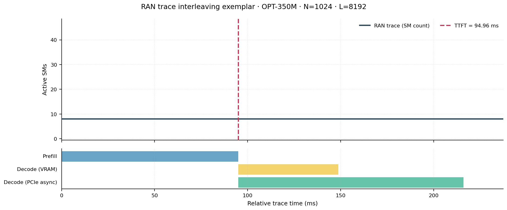
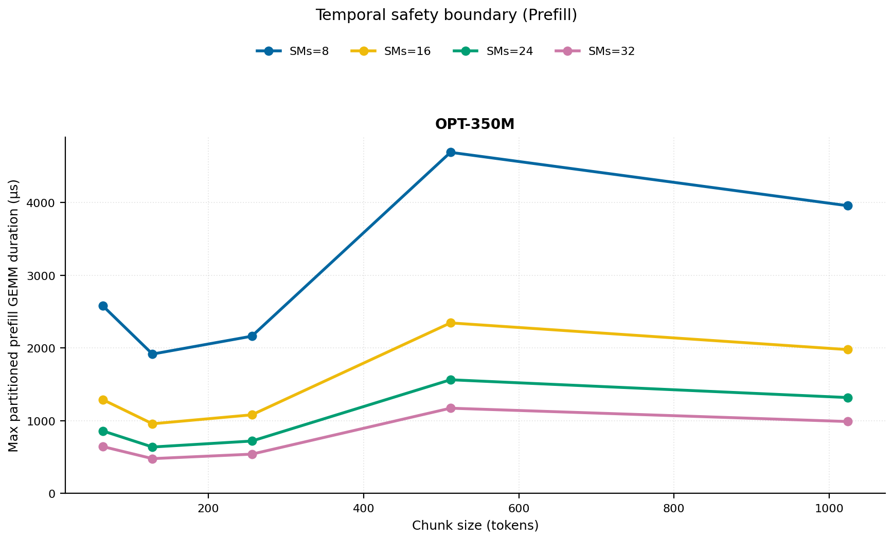
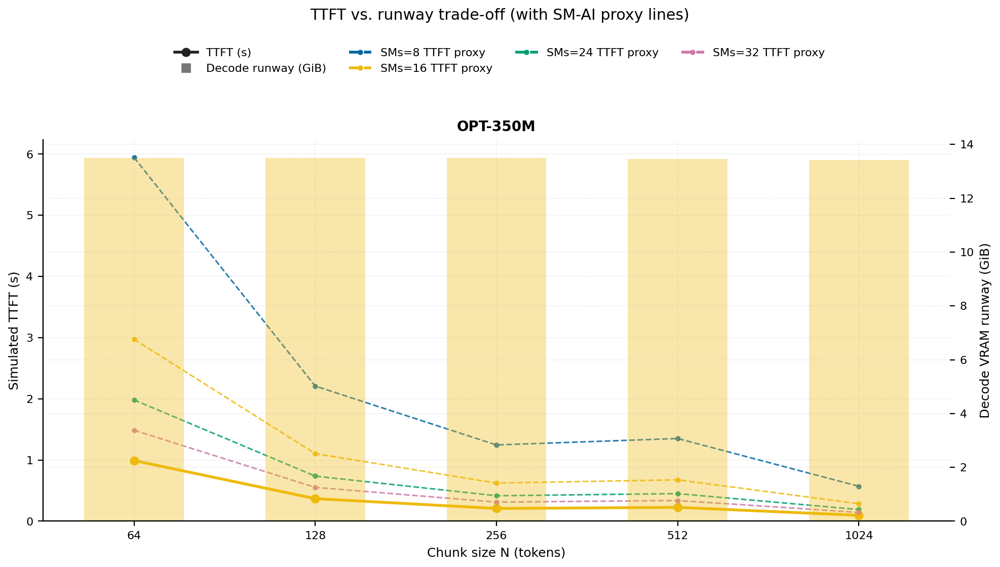
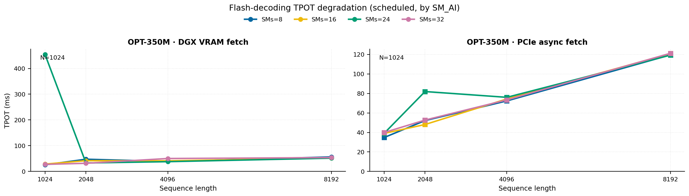
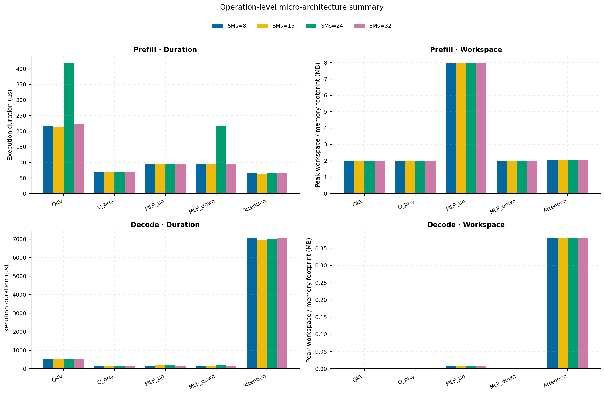
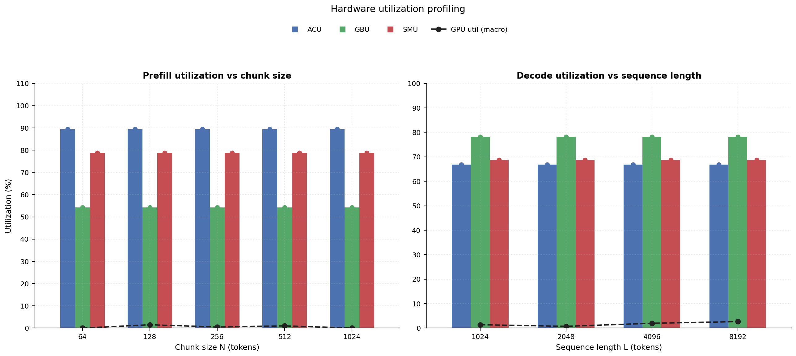
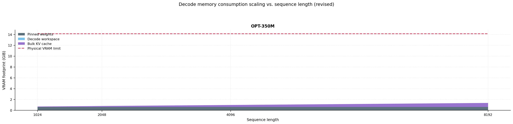

# RAN Inference Profiling Report

Run root: `/mnt/data/dheeraj/dicertation/inference-profile/runs/revised-full-20260414-g1-opt350m`

## Environment

| field | value |
| --- | --- |
| cache_root | n/a |
| captured_at | 2026-04-14T11:52:43Z |
| chunk_sizes | [64, 128, 256, 512, 1024] |
| cuda_available | true |
| cuda_device_count | 8 |
| cwd | /mnt/data/dheeraj/dicertation/inference-profile |
| decode_modes | ["vram", "pcie_async"] |
| experiment_type | ran-dgxspark-v1 |
| gpu_id | 1 |
| l_out | 1024 |
| models | ["facebook/opt-350m"] |
| platform | Linux-6.8.0-106-generic-x86_64-with-glibc2.35 |
| python_executable | /home/dheeraj/miniconda3/envs/mls/bin/python |
| python_version | 3.11.14 |
| run_root | /mnt/data/dheeraj/dicertation/inference-profile/runs/revised-full-20260414-g1-opt350m |
| scheduler | envelope_v1 |
| schema_version | ran_dgxspark_v1 |
| sequence_lengths | [1024, 2048, 4096, 8192] |
| sm_ai_cap | 32 |
| sm_ai_partition | 100 |
| sm_ai_partitions | [8, 16, 24, 32] |
| stage | profile |
| telemetry_tier | baseline_nvml_pt |
| timed_iterations | 5 |
| torch_available | true |
| torch_version | 2.10.0+cu128 |
| warmup_iterations | 3 |

## Model Constants

| model_id | sm_ai_partition | num_hidden_layers | hidden_size | num_attention_heads | ffn_dim | layer_index | layer_weight_bytes | total_weight_bytes_fp16 | vram_ceiling_bytes |
| --- | --- | --- | --- | --- | --- | --- | --- | --- | --- |
| facebook/opt-350m | 100 | 24 | 1024 | 16 | 4096 | 11 | 25192448 | 662392832 | 15170115993 |

## Trace Inspection

### Primary trace

| field | value |
| --- | --- |
| errors | [] |
| header | ["frame", "slot", "time_slot_sched_ns", "time_decode_start_est_ns", "time_decode_end_est_ns", "time_decode_start_actual_ns", "time_decode_end_actual_ns", "decode_dur_us", "deadline_met", "target_sm", "profile_idx", "sm_count", "num_pusch", "sum_prb", "sum_tbs_bytes", "max_mcs"] |
| median_positive_delta_ms | 5.6997 |
| monotonicity.checked_column | time_slot_sched_ns |
| monotonicity.is_non_decreasing | true |
| monotonicity.negative_delta_count | 0 |
| monotonicity.positive_delta_count | 28377 |
| monotonicity.zero_delta_count | 0 |
| normalization.last_row_duration_policy | median_positive_forward_delta_ms |
| normalization.output_columns | ["time_ms", "sm_utilization", "slot_duration_ms", "source_schema", "sm_count"] |
| normalization.output_relative_path | derived/normalized_ldpc_trace.csv |
| normalized_row_count | 28378 |
| path | /mnt/raid0sata2/netsys/weaver-ext/ran/traces/e2e_2026030418/e2e_20260304_182034_tractor_ran_ctrl/ldpc_trace.csv |
| row_count | 28378 |
| schema_detected | schema_b |
| time_unit_hint | ns |
| usable | true |
| usage_policy | primary_only |
| used_for_scheduler_capacity | true |

### Secondary trace

| field | value |
| --- | --- |
| errors | ["ran_ctrl_trace.csv line 182958 has 9 field(s); expected 12"] |
| header | ["frame", "slot", "sm_available", "prbs_available", "prbs_allocated", "w_avg_mcs_prev", "w_avg_mcs_curr", "slots_since_underutil", "ramp_up_count", "num_ue_sched", "max_ue_backlog", "sum_ue_backlog"] |
| monotonicity.checked_column | n/a |
| monotonicity.is_non_decreasing | n/a |
| monotonicity.negative_delta_count | n/a |
| path | /mnt/raid0sata2/netsys/weaver-ext/ran/traces/e2e_2026030418/e2e_20260304_182034_tractor_ran_ctrl/ran_ctrl_trace.csv |
| row_count | 182956 |
| time_unit_hints | [] |
| usable | false |
| usage_policy | structural_only |
| used_for_scheduler_capacity | false |

## Raw-Profile Summary Tables

### Prefill profile summary

Source raw rows: `raw/prefill_events.csv` = 700. Summary artifact: `derived/prefill_summary.csv`.

| model_id | chunk_tokens | sm_ai_partition | max_input_tokens | prefill_max_gemm_us | prefill_workspace_bytes | prefill_parked_activation_bytes | telemetry_tier | telemetry_provider | telemetry_status | nvml_available | gpu_util | gpu_mem_used_mb | sm_clock_mhz | mem_clock_mhz | power_w | pt_step_ms | pt_mem_alloc_mb | pt_mem_reserved_mb | pt_workspace_mb | acu_pct | gbu_pct | smu_pct | microscopic_telemetry_status | microscopic_error |
| --- | --- | --- | --- | --- | --- | --- | --- | --- | --- | --- | --- | --- | --- | --- | --- | --- | --- | --- | --- | --- | --- | --- | --- | --- |
| facebook/opt-350m | 64 | 8 | 1024 | 112.608 | 524288 | 524288 | baseline_nvml_pt | nvidia-smi | ok | true | 0 | 109 | 1695 | 8001 | 61.13 | 0.1126 | 34.6426 | 34.6426 | 0.5 | n/a | n/a | n/a | unavailable | n/a |
| facebook/opt-350m | 64 | 16 | 1024 | 103.584 | 524288 | 524288 | baseline_nvml_pt | nvidia-smi | ok | true | 0 | 109 | 1695 | 8001 | 61.06 | 0.1036 | 34.6426 | 34.6426 | 0.5 | n/a | n/a | n/a | unavailable | n/a |
| facebook/opt-350m | 64 | 24 | 1024 | 3087.3599 | 524288 | 524288 | baseline_nvml_pt | nvidia-smi | ok | true | 0 | 109 | 1695 | 7601 | 61.07 | 3.0874 | 34.6426 | 34.6426 | 0.5 | n/a | n/a | n/a | unavailable | n/a |
| facebook/opt-350m | 64 | 32 | 1024 | 107.52 | 524288 | 524288 | baseline_nvml_pt | nvidia-smi | ok | true | 0 | 109 | 1695 | 7601 | 61.75 | 0.1075 | 34.6426 | 34.6426 | 0.5 | n/a | n/a | n/a | unavailable | n/a |
| facebook/opt-350m | 128 | 8 | 1024 | 110.56 | 1048576 | 1048576 | baseline_nvml_pt | nvidia-smi | ok | true | 0 | 109 | 1695 | 7601 | 54.34 | 0.1106 | 36.1426 | 36.1426 | 1 | n/a | n/a | n/a | unavailable | n/a |
| facebook/opt-350m | 128 | 16 | 1024 | 76.8 | 1048576 | 1048576 | baseline_nvml_pt | nvidia-smi | ok | true | 0 | 109 | 1695 | 7601 | 57.17 | 0.0768 | 36.1426 | 36.1426 | 1 | n/a | n/a | n/a | unavailable | n/a |
| facebook/opt-350m | 128 | 24 | 1024 | 76.672 | 1048576 | 1048576 | baseline_nvml_pt | nvidia-smi | ok | true | 6 | 109 | 1695 | 7601 | 61.81 | 0.0767 | 36.1426 | 36.1426 | 1 | n/a | n/a | n/a | unavailable | n/a |
| facebook/opt-350m | 128 | 32 | 1024 | 79.872 | 1048576 | 1048576 | baseline_nvml_pt | nvidia-smi | ok | true | 0 | 109 | 1695 | 7601 | 62.35 | 0.0799 | 36.1426 | 36.1426 | 1 | n/a | n/a | n/a | unavailable | n/a |
| facebook/opt-350m | 256 | 8 | 1024 | 99.264 | 2097152 | 2097152 | baseline_nvml_pt | nvidia-smi | ok | true | 0 | 109 | 1695 | 7601 | 62.5 | 0.0993 | 39.1426 | 39.1426 | 2 | n/a | n/a | n/a | unavailable | n/a |
| facebook/opt-350m | 256 | 16 | 1024 | 97.472 | 2097152 | 2097152 | baseline_nvml_pt | nvidia-smi | ok | true | 0 | 109 | 1695 | 7601 | 62.06 | 0.0975 | 39.1426 | 39.1426 | 2 | n/a | n/a | n/a | unavailable | n/a |
| facebook/opt-350m | 256 | 24 | 1024 | 90.912 | 2097152 | 2097152 | baseline_nvml_pt | nvidia-smi | ok | true | 2 | 109 | 1695 | 7601 | 62.23 | 0.0909 | 39.1426 | 39.1426 | 2 | n/a | n/a | n/a | unavailable | n/a |
| facebook/opt-350m | 256 | 32 | 1024 | 90.112 | 2097152 | 2097152 | baseline_nvml_pt | nvidia-smi | ok | true | 0 | 109 | 1695 | 8001 | 62.51 | 0.0901 | 39.1426 | 39.1426 | 2 | n/a | n/a | n/a | unavailable | n/a |
| facebook/opt-350m | 512 | 8 | 1024 | 119.808 | 4194304 | 4194304 | baseline_nvml_pt | nvidia-smi | ok | true | 0 | 109 | 1695 | 7601 | 62.37 | 0.1198 | 45.1426 | 45.1426 | 4 | n/a | n/a | n/a | unavailable | n/a |
| facebook/opt-350m | 512 | 16 | 1024 | 115.648 | 4194304 | 4194304 | baseline_nvml_pt | nvidia-smi | ok | true | 1 | 109 | 1695 | 7601 | 62.33 | 0.1156 | 45.1426 | 45.1426 | 4 | n/a | n/a | n/a | unavailable | n/a |
| facebook/opt-350m | 512 | 24 | 1024 | 114.688 | 4194304 | 4194304 | baseline_nvml_pt | nvidia-smi | ok | true | 0 | 109 | 1695 | 7601 | 62.61 | 0.1147 | 45.1426 | 45.1426 | 4 | n/a | n/a | n/a | unavailable | n/a |
| facebook/opt-350m | 512 | 32 | 1024 | 195.456 | 4194304 | 4194304 | baseline_nvml_pt | nvidia-smi | ok | true | 3 | 109 | 1695 | 7601 | 61.71 | 0.1955 | 45.1426 | 45.1426 | 4 | n/a | n/a | n/a | unavailable | n/a |
| facebook/opt-350m | 1024 | 8 | 1024 | 178.176 | 8388608 | 8388608 | baseline_nvml_pt | nvidia-smi | ok | true | 0 | 109 | 1695 | 7601 | 62.94 | 0.1782 | 57.1426 | 57.1426 | 8 | n/a | n/a | n/a | unavailable | n/a |
| facebook/opt-350m | 1024 | 16 | 1024 | 171.008 | 8388608 | 8388608 | baseline_nvml_pt | nvidia-smi | ok | true | 0 | 109 | 1695 | 7601 | 64.07 | 0.171 | 57.1426 | 57.1426 | 8 | n/a | n/a | n/a | unavailable | n/a |
| facebook/opt-350m | 1024 | 24 | 1024 | 187.392 | 8388608 | 8388608 | baseline_nvml_pt | nvidia-smi | ok | true | 0 | 109 | 1695 | 7601 | 63.02 | 0.1874 | 57.1426 | 57.1426 | 8 | n/a | n/a | n/a | unavailable | n/a |
| facebook/opt-350m | 1024 | 32 | 1024 | 164.864 | 8388608 | 8388608 | baseline_nvml_pt | nvidia-smi | ok | true | 0 | 109 | 1695 | 7601 | 63.61 | 0.1649 | 57.1426 | 57.1426 | 8 | n/a | n/a | n/a | unavailable | n/a |

### Decode profile summary

Source raw rows: `raw/decode_events.csv` = 6400. Summary artifact: `derived/decode_summary.csv`.

| model_id | sequence_length | block_size | sm_ai_partition | decode_mode | decode_max_gemv_us | attention_fetch_compute_us | reduction_overhead_us | decode_workspace_bytes | decode_parked_activation_bytes | telemetry_tier | telemetry_provider | telemetry_status | nvml_available | gpu_util | gpu_mem_used_mb | sm_clock_mhz | mem_clock_mhz | power_w | pt_step_ms | pt_mem_alloc_mb | pt_mem_reserved_mb | pt_workspace_mb | acu_pct | gbu_pct | smu_pct | microscopic_telemetry_status | microscopic_error |
| --- | --- | --- | --- | --- | --- | --- | --- | --- | --- | --- | --- | --- | --- | --- | --- | --- | --- | --- | --- | --- | --- | --- | --- | --- | --- | --- | --- |
| facebook/opt-350m | 1024 | 64 | 8 | pcie_async | 212.8 | 1770.304 | 724.9344 | 54784 | 2048 | baseline_nvml_pt | nvidia-smi | ok | true | 7 | 109 | 1695 | 8001 | 63.43 | 1.8401 | 36.2085 | 36.2085 | 0.0522 | n/a | n/a | n/a | unavailable | n/a |
| facebook/opt-350m | 1024 | 64 | 8 | vram | 182.272 | 1718.3296 | 652.896 | 54784 | 2048 | baseline_nvml_pt | nvidia-smi | ok | true | 0 | 109 | 1695 | 7601 | 63.04 | 1.7398 | 36.2085 | 36.2085 | 0.0522 | n/a | n/a | n/a | unavailable | n/a |
| facebook/opt-350m | 1024 | 64 | 16 | pcie_async | 169.984 | 1811.2384 | 735.5776 | 54784 | 2048 | baseline_nvml_pt | nvidia-smi | ok | true | 0 | 109 | 1695 | 7601 | 63.81 | 1.8391 | 36.2085 | 36.2085 | 0.0522 | n/a | n/a | n/a | unavailable | n/a |
| facebook/opt-350m | 1024 | 64 | 16 | vram | 136.288 | 1808.7744 | 639.5712 | 54784 | 2048 | baseline_nvml_pt | nvidia-smi | ok | true | 0 | 109 | 1695 | 7601 | 63.44 | 2.2405 | 36.2085 | 36.2085 | 0.0522 | n/a | n/a | n/a | unavailable | n/a |
| facebook/opt-350m | 1024 | 64 | 24 | pcie_async | 144.384 | 1744.736 | 689.5936 | 54784 | 2048 | baseline_nvml_pt | nvidia-smi | ok | true | 0 | 109 | 1695 | 7601 | 57.48 | 1.7592 | 36.2085 | 36.2085 | 0.0522 | n/a | n/a | n/a | unavailable | n/a |
| facebook/opt-350m | 1024 | 64 | 24 | vram | 152.64 | 1732.3264 | 665.5808 | 54784 | 2048 | baseline_nvml_pt | nvidia-smi | ok | true | 0 | 109 | 1695 | 7601 | 63.79 | 1.7613 | 36.2085 | 36.2085 | 0.0522 | n/a | n/a | n/a | unavailable | n/a |
| facebook/opt-350m | 1024 | 64 | 32 | pcie_async | 147.456 | 1788.5248 | 661.0944 | 54784 | 2048 | baseline_nvml_pt | nvidia-smi | ok | true | 0 | 109 | 1695 | 7601 | 63.22 | 2.0613 | 36.2085 | 36.2085 | 0.0522 | n/a | n/a | n/a | unavailable | n/a |
| facebook/opt-350m | 1024 | 64 | 32 | vram | 166.976 | 1774.4896 | 704.2944 | 54784 | 2048 | baseline_nvml_pt | nvidia-smi | ok | true | 0 | 109 | 1695 | 7601 | 63.27 | 1.8452 | 36.2085 | 36.2085 | 0.0522 | n/a | n/a | n/a | unavailable | n/a |
| facebook/opt-350m | 1024 | 128 | 8 | pcie_async | 150.528 | 937.7216 | 408.4672 | 38400 | 2048 | baseline_nvml_pt | nvidia-smi | ok | true | 0 | 109 | 1695 | 7601 | 63.94 | 0.9503 | 36.1909 | 36.1909 | 0.0366 | n/a | n/a | n/a | unavailable | n/a |
| facebook/opt-350m | 1024 | 128 | 8 | vram | 141.056 | 896.0768 | 396.32 | 38400 | 2048 | baseline_nvml_pt | nvidia-smi | ok | true | 1 | 109 | 1695 | 8001 | 63.98 | 0.9073 | 36.1909 | 36.1909 | 0.0366 | n/a | n/a | n/a | unavailable | n/a |
| facebook/opt-350m | 1024 | 128 | 16 | pcie_async | 142.336 | 920.0256 | 397.0624 | 38400 | 2048 | baseline_nvml_pt | nvidia-smi | ok | true | 5 | 109 | 1695 | 7601 | 64.27 | 0.9277 | 36.1909 | 36.1909 | 0.0366 | n/a | n/a | n/a | unavailable | n/a |
| facebook/opt-350m | 1024 | 128 | 16 | vram | 180.48 | 929.2608 | 414.8928 | 38400 | 2048 | baseline_nvml_pt | nvidia-smi | ok | true | 5 | 109 | 1695 | 7601 | 63.4 | 0.9818 | 36.1909 | 36.1909 | 0.0366 | n/a | n/a | n/a | unavailable | n/a |
| facebook/opt-350m | 1024 | 128 | 24 | pcie_async | 142.112 | 922.848 | 421.888 | 38400 | 2048 | baseline_nvml_pt | nvidia-smi | ok | true | 1 | 109 | 1695 | 7601 | 63.36 | 0.939 | 36.1909 | 36.1909 | 0.0366 | n/a | n/a | n/a | unavailable | n/a |
| facebook/opt-350m | 1024 | 128 | 24 | vram | 241.664 | 997.8944 | 498.4064 | 38400 | 2048 | baseline_nvml_pt | nvidia-smi | ok | true | 0 | 109 | 1695 | 7601 | 63.99 | 1.0762 | 36.1909 | 36.1909 | 0.0366 | n/a | n/a | n/a | unavailable | n/a |
| facebook/opt-350m | 1024 | 128 | 32 | pcie_async | 144.192 | 936.9984 | 418.8032 | 38400 | 2048 | baseline_nvml_pt | nvidia-smi | ok | true | 2 | 109 | 1695 | 8001 | 64.17 | 0.9411 | 36.1909 | 36.1909 | 0.0366 | n/a | n/a | n/a | unavailable | n/a |
| facebook/opt-350m | 1024 | 128 | 32 | vram | 151.488 | 915.8848 | 401.408 | 38400 | 2048 | baseline_nvml_pt | nvidia-smi | ok | true | 1 | 109 | 1695 | 7601 | 63.89 | 0.93 | 36.1909 | 36.1909 | 0.0366 | n/a | n/a | n/a | unavailable | n/a |
| facebook/opt-350m | 1024 | 256 | 8 | pcie_async | 168.96 | 564.7808 | 314.9504 | 42496 | 2048 | baseline_nvml_pt | nvidia-smi | ok | true | 2 | 109 | 1695 | 7601 | 64.04 | 0.5927 | 36.1948 | 36.1948 | 0.0405 | n/a | n/a | n/a | unavailable | n/a |
| facebook/opt-350m | 1024 | 256 | 8 | vram | 142.368 | 530.6368 | 284.8448 | 42496 | 2048 | baseline_nvml_pt | nvidia-smi | ok | true | 1 | 109 | 1695 | 7601 | 63.48 | 0.5366 | 36.1948 | 36.1948 | 0.0405 | n/a | n/a | n/a | unavailable | n/a |
| facebook/opt-350m | 1024 | 256 | 16 | pcie_async | 208.096 | 512.8192 | 269.1008 | 42496 | 2048 | baseline_nvml_pt | nvidia-smi | ok | true | 3 | 109 | 1695 | 7601 | 63.71 | 0.5233 | 36.1948 | 36.1948 | 0.0405 | n/a | n/a | n/a | unavailable | n/a |
| facebook/opt-350m | 1024 | 256 | 16 | vram | 124.928 | 525.5168 | 286.048 | 42496 | 2048 | baseline_nvml_pt | nvidia-smi | ok | true | 1 | 109 | 1695 | 7601 | 57.9 | 0.5356 | 36.1948 | 36.1948 | 0.0405 | n/a | n/a | n/a | unavailable | n/a |
| facebook/opt-350m | 1024 | 256 | 24 | pcie_async | 149.568 | 527.1552 | 274.2528 | 42496 | 2048 | baseline_nvml_pt | nvidia-smi | ok | true | 4 | 109 | 1695 | 7601 | 63.84 | 0.5356 | 36.1948 | 36.1948 | 0.0405 | n/a | n/a | n/a | unavailable | n/a |
| facebook/opt-350m | 1024 | 256 | 24 | vram | 176.896 | 515.6736 | 292.5056 | 42496 | 2048 | baseline_nvml_pt | nvidia-smi | ok | true | 0 | 109 | 1695 | 7601 | 62.92 | 0.5284 | 36.1948 | 36.1948 | 0.0405 | n/a | n/a | n/a | unavailable | n/a |
| facebook/opt-350m | 1024 | 256 | 32 | pcie_async | 141.312 | 519.4496 | 270.5408 | 42496 | 2048 | baseline_nvml_pt | nvidia-smi | ok | true | 0 | 109 | 1695 | 7601 | 64.29 | 0.5325 | 36.1948 | 36.1948 | 0.0405 | n/a | n/a | n/a | unavailable | n/a |
| facebook/opt-350m | 1024 | 256 | 32 | vram | 168.96 | 522.4704 | 271.3408 | 42496 | 2048 | baseline_nvml_pt | nvidia-smi | ok | true | 3 | 109 | 1695 | 7601 | 62.2 | 0.5356 | 36.1948 | 36.1948 | 0.0405 | n/a | n/a | n/a | unavailable | n/a |
| facebook/opt-350m | 1024 | 512 | 8 | pcie_async | 168.768 | 287.3088 | 195.6352 | 69120 | 2048 | baseline_nvml_pt | nvidia-smi | ok | true | 0 | 109 | 1695 | 7601 | 64.49 | 0.298 | 36.2202 | 36.2202 | 0.0659 | n/a | n/a | n/a | unavailable | n/a |
| facebook/opt-350m | 1024 | 512 | 8 | vram | 144.384 | 284.7296 | 196.1664 | 69120 | 2048 | baseline_nvml_pt | nvidia-smi | ok | true | 0 | 109 | 1695 | 8001 | 64.28 | 0.297 | 36.2202 | 36.2202 | 0.0659 | n/a | n/a | n/a | unavailable | n/a |
| facebook/opt-350m | 1024 | 512 | 16 | pcie_async | 138.304 | 286.7456 | 193.3632 | 69120 | 2048 | baseline_nvml_pt | nvidia-smi | ok | true | 0 | 109 | 1695 | 7601 | 64.39 | 0.2921 | 36.2202 | 36.2202 | 0.0659 | n/a | n/a | n/a | unavailable | n/a |
| facebook/opt-350m | 1024 | 512 | 16 | vram | 146.368 | 280.5248 | 196.9664 | 69120 | 2048 | baseline_nvml_pt | nvidia-smi | ok | true | 6 | 109 | 1695 | 7601 | 64.55 | 0.2906 | 36.2202 | 36.2202 | 0.0659 | n/a | n/a | n/a | unavailable | n/a |
| facebook/opt-350m | 1024 | 512 | 24 | pcie_async | 144.256 | 288.8576 | 198.2784 | 69120 | 2048 | baseline_nvml_pt | nvidia-smi | ok | true | 3 | 109 | 1695 | 7601 | 64.01 | 0.3051 | 36.2202 | 36.2202 | 0.0659 | n/a | n/a | n/a | unavailable | n/a |
| facebook/opt-350m | 1024 | 512 | 24 | vram | 160 | 302.0736 | 215.8784 | 69120 | 2048 | baseline_nvml_pt | nvidia-smi | ok | true | 2 | 109 | 1695 | 7601 | 64.12 | 0.34 | 36.2202 | 36.2202 | 0.0659 | n/a | n/a | n/a | unavailable | n/a |
| facebook/opt-350m | 1024 | 512 | 32 | pcie_async | 140.32 | 285.2864 | 198.656 | 69120 | 2048 | baseline_nvml_pt | nvidia-smi | ok | true | 0 | 109 | 1695 | 8001 | 64.7 | 0.297 | 36.2202 | 36.2202 | 0.0659 | n/a | n/a | n/a | unavailable | n/a |
| facebook/opt-350m | 1024 | 512 | 32 | vram | 159.744 | 295.4624 | 213.3632 | 69120 | 2048 | baseline_nvml_pt | nvidia-smi | ok | true | 0 | 109 | 1695 | 7601 | 64.4 | 0.3123 | 36.2202 | 36.2202 | 0.0659 | n/a | n/a | n/a | unavailable | n/a |
| facebook/opt-350m | 1024 | 1024 | 8 | pcie_async | 122.88 | 178.8352 | 173.6576 | 98816 | 2048 | baseline_nvml_pt | nvidia-smi | ok | true | 1 | 109 | 1695 | 7601 | 59 | 0.1884 | 36.2485 | 36.2485 | 0.0942 | n/a | n/a | n/a | unavailable | n/a |
| facebook/opt-350m | 1024 | 1024 | 8 | vram | 122.112 | 171.8336 | 170.3808 | 98816 | 2048 | baseline_nvml_pt | nvidia-smi | ok | true | 0 | 109 | 1695 | 7601 | 64.51 | 0.1823 | 36.2485 | 36.2485 | 0.0942 | n/a | n/a | n/a | unavailable | n/a |
| facebook/opt-350m | 1024 | 1024 | 16 | pcie_async | 138.24 | 208.0832 | 229.1264 | 98816 | 2048 | baseline_nvml_pt | nvidia-smi | ok | true | 0 | 109 | 1695 | 7601 | 64.68 | 0.3319 | 36.2485 | 36.2485 | 0.0942 | n/a | n/a | n/a | unavailable | n/a |
| facebook/opt-350m | 1024 | 1024 | 16 | vram | 138.24 | 184.6272 | 177.3568 | 98816 | 2048 | baseline_nvml_pt | nvidia-smi | ok | true | 2 | 109 | 1695 | 7601 | 63.98 | 0.2057 | 36.2485 | 36.2485 | 0.0942 | n/a | n/a | n/a | unavailable | n/a |
| facebook/opt-350m | 1024 | 1024 | 24 | pcie_async | 139.264 | 246.1056 | 186.5728 | 98816 | 2048 | baseline_nvml_pt | nvidia-smi | ok | true | 0 | 109 | 1695 | 7601 | 64.03 | 0.382 | 36.2485 | 36.2485 | 0.0942 | n/a | n/a | n/a | unavailable | n/a |
| facebook/opt-350m | 1024 | 1024 | 24 | vram | 3092.4799 | 180.2368 | 173.2352 | 98816 | 2048 | baseline_nvml_pt | nvidia-smi | ok | true | 0 | 109 | 1695 | 7601 | 57.35 | 3.0925 | 36.2485 | 36.2485 | 0.0942 | n/a | n/a | n/a | unavailable | n/a |
| facebook/opt-350m | 1024 | 1024 | 32 | pcie_async | 152.576 | 196.9984 | 191.2192 | 98816 | 2048 | baseline_nvml_pt | nvidia-smi | ok | true | 0 | 109 | 1695 | 7601 | 64.02 | 0.213 | 36.2485 | 36.2485 | 0.0942 | n/a | n/a | n/a | unavailable | n/a |
| facebook/opt-350m | 1024 | 1024 | 32 | vram | 132.096 | 181.6704 | 172.0768 | 98816 | 2048 | baseline_nvml_pt | nvidia-smi | ok | true | 5 | 109 | 1695 | 7601 | 57.01 | 0.1905 | 36.2485 | 36.2485 | 0.0942 | n/a | n/a | n/a | unavailable | n/a |
| facebook/opt-350m | 2048 | 64 | 8 | pcie_async | 145.376 | 4158.4448 | 1237.2416 | 103936 | 2048 | baseline_nvml_pt | nvidia-smi | ok | true | 0 | 109 | 1695 | 7601 | 64.3 | 7.1946 | 40.2554 | 40.2554 | 0.0991 | n/a | n/a | n/a | unavailable | n/a |
| facebook/opt-350m | 2048 | 64 | 8 | vram | 146.4 | 4032.9729 | 1156.64 | 103936 | 2048 | baseline_nvml_pt | nvidia-smi | ok | true | 0 | 109 | 1695 | 7601 | 65.08 | 7.0134 | 40.2554 | 40.2554 | 0.0991 | n/a | n/a | n/a | unavailable | n/a |
| facebook/opt-350m | 2048 | 64 | 16 | pcie_async | 134.272 | 4025.5488 | 1157.9008 | 103936 | 2048 | baseline_nvml_pt | nvidia-smi | ok | true | 0 | 109 | 1695 | 8001 | 64.99 | 6.7625 | 40.2554 | 40.2554 | 0.0991 | n/a | n/a | n/a | unavailable | n/a |
| facebook/opt-350m | 2048 | 64 | 16 | vram | 165.888 | 4347.8847 | 1311.9616 | 103936 | 2048 | baseline_nvml_pt | nvidia-smi | ok | true | 0 | 109 | 1695 | 7601 | 64.97 | 8.2627 | 40.2554 | 40.2554 | 0.0991 | n/a | n/a | n/a | unavailable | n/a |
| facebook/opt-350m | 2048 | 64 | 24 | pcie_async | 239.68 | 4271.4816 | 1348.832 | 103936 | 2048 | baseline_nvml_pt | nvidia-smi | ok | true | 0 | 109 | 1695 | 8001 | 64.68 | 7.4762 | 40.2554 | 40.2554 | 0.0991 | n/a | n/a | n/a | unavailable | n/a |
| facebook/opt-350m | 2048 | 64 | 24 | vram | 177.152 | 4453.1648 | 1184.4096 | 103936 | 2048 | baseline_nvml_pt | nvidia-smi | ok | true | 0 | 109 | 1695 | 7601 | 64.12 | 8.917 | 40.2554 | 40.2554 | 0.0991 | n/a | n/a | n/a | unavailable | n/a |
| facebook/opt-350m | 2048 | 64 | 32 | pcie_async | 147.488 | 4023.7567 | 1171.2832 | 103936 | 2048 | baseline_nvml_pt | nvidia-smi | ok | true | 6 | 109 | 1695 | 7601 | 64.74 | 6.827 | 40.2554 | 40.2554 | 0.0991 | n/a | n/a | n/a | unavailable | n/a |
| facebook/opt-350m | 2048 | 64 | 32 | vram | 143.36 | 4192.2048 | 1209.12 | 103936 | 2048 | baseline_nvml_pt | nvidia-smi | ok | true | 0 | 109 | 1695 | 7601 | 64.42 | 7.559 | 40.2554 | 40.2554 | 0.0991 | n/a | n/a | n/a | unavailable | n/a |
| facebook/opt-350m | 2048 | 128 | 8 | pcie_async | 138.24 | 1724.7936 | 687.488 | 62976 | 2048 | baseline_nvml_pt | nvidia-smi | ok | true | 0 | 109 | 1695 | 7601 | 64.23 | 1.7418 | 40.2144 | 40.2144 | 0.0601 | n/a | n/a | n/a | unavailable | n/a |
| facebook/opt-350m | 2048 | 128 | 8 | vram | 141.536 | 1736.9088 | 649.4976 | 62976 | 2048 | baseline_nvml_pt | nvidia-smi | ok | true | 1 | 109 | 1695 | 7601 | 64.66 | 1.7572 | 40.2144 | 40.2144 | 0.0601 | n/a | n/a | n/a | unavailable | n/a |
| facebook/opt-350m | 2048 | 128 | 16 | pcie_async | 144.384 | 1743.2192 | 694.688 | 62976 | 2048 | baseline_nvml_pt | nvidia-smi | ok | true | 0 | 109 | 1695 | 8001 | 64.89 | 1.7582 | 40.2144 | 40.2144 | 0.0601 | n/a | n/a | n/a | unavailable | n/a |
| facebook/opt-350m | 2048 | 128 | 16 | vram | 163.744 | 1859.6096 | 707.5264 | 62976 | 2048 | baseline_nvml_pt | nvidia-smi | ok | true | 0 | 109 | 1695 | 7601 | 64.62 | 2.3378 | 40.2144 | 40.2144 | 0.0601 | n/a | n/a | n/a | unavailable | n/a |
| facebook/opt-350m | 2048 | 128 | 24 | pcie_async | 186.432 | 1799.0528 | 696.48 | 62976 | 2048 | baseline_nvml_pt | nvidia-smi | ok | true | 0 | 109 | 1695 | 8001 | 64.94 | 1.8628 | 40.2144 | 40.2144 | 0.0601 | n/a | n/a | n/a | unavailable | n/a |
| facebook/opt-350m | 2048 | 128 | 24 | vram | 273.408 | 1797.9072 | 655.7696 | 62976 | 2048 | baseline_nvml_pt | nvidia-smi | ok | true | 0 | 109 | 1695 | 7601 | 65.02 | 1.8985 | 40.2144 | 40.2144 | 0.0601 | n/a | n/a | n/a | unavailable | n/a |
| facebook/opt-350m | 2048 | 128 | 32 | pcie_async | 174.08 | 1793.44 | 747.3408 | 62976 | 2048 | baseline_nvml_pt | nvidia-smi | ok | true | 1 | 109 | 1695 | 7601 | 64.44 | 1.8084 | 40.2144 | 40.2144 | 0.0601 | n/a | n/a | n/a | unavailable | n/a |
| facebook/opt-350m | 2048 | 128 | 32 | vram | 133.12 | 1727.4816 | 661.6832 | 62976 | 2048 | baseline_nvml_pt | nvidia-smi | ok | true | 2 | 109 | 1695 | 7601 | 64.53 | 1.7437 | 40.2144 | 40.2144 | 0.0601 | n/a | n/a | n/a | unavailable | n/a |
| facebook/opt-350m | 2048 | 256 | 8 | pcie_async | 150.528 | 960.8576 | 441.568 | 54784 | 2048 | baseline_nvml_pt | nvidia-smi | ok | true | 0 | 109 | 1695 | 7601 | 64.54 | 0.9677 | 40.2065 | 40.2065 | 0.0522 | n/a | n/a | n/a | unavailable | n/a |
| facebook/opt-350m | 2048 | 256 | 8 | vram | 141.312 | 944.9024 | 392.9792 | 54784 | 2048 | baseline_nvml_pt | nvidia-smi | ok | true | 2 | 109 | 1695 | 7601 | 56.3 | 0.9594 | 40.2065 | 40.2065 | 0.0522 | n/a | n/a | n/a | unavailable | n/a |
| facebook/opt-350m | 2048 | 256 | 16 | pcie_async | 175.104 | 966.1824 | 436.2304 | 54784 | 2048 | baseline_nvml_pt | nvidia-smi | ok | true | 0 | 109 | 1695 | 7601 | 64.97 | 0.9903 | 40.2065 | 40.2065 | 0.0522 | n/a | n/a | n/a | unavailable | n/a |
| facebook/opt-350m | 2048 | 256 | 16 | vram | 133.12 | 955.4752 | 410.4832 | 54784 | 2048 | baseline_nvml_pt | nvidia-smi | ok | true | 0 | 109 | 1695 | 7601 | 64.23 | 0.9646 | 40.2065 | 40.2065 | 0.0522 | n/a | n/a | n/a | unavailable | n/a |
| facebook/opt-350m | 2048 | 256 | 24 | pcie_async | 141.312 | 955.136 | 394.6368 | 54784 | 2048 | baseline_nvml_pt | nvidia-smi | ok | true | 0 | 109 | 1695 | 7601 | 61.35 | 0.9695 | 40.2065 | 40.2065 | 0.0522 | n/a | n/a | n/a | unavailable | n/a |
| facebook/opt-350m | 2048 | 256 | 24 | vram | 151.552 | 991.6736 | 436.1152 | 54784 | 2048 | baseline_nvml_pt | nvidia-smi | ok | true | 6 | 109 | 1695 | 7601 | 64.66 | 1.015 | 40.2065 | 40.2065 | 0.0522 | n/a | n/a | n/a | unavailable | n/a |
| facebook/opt-350m | 2048 | 256 | 32 | pcie_async | 140.16 | 1005.5424 | 423.04 | 54784 | 2048 | baseline_nvml_pt | nvidia-smi | ok | true | 0 | 109 | 1695 | 7601 | 60.83 | 1.1693 | 40.2065 | 40.2065 | 0.0522 | n/a | n/a | n/a | unavailable | n/a |
| facebook/opt-350m | 2048 | 256 | 32 | vram | 144.352 | 981.792 | 428.3264 | 54784 | 2048 | baseline_nvml_pt | nvidia-smi | ok | true | 0 | 109 | 1695 | 7601 | 64.36 | 1.0004 | 40.2065 | 40.2065 | 0.0522 | n/a | n/a | n/a | unavailable | n/a |
| facebook/opt-350m | 2048 | 512 | 8 | pcie_async | 151.552 | 501.568 | 274.8992 | 75264 | 2048 | baseline_nvml_pt | nvidia-smi | ok | true | 0 | 109 | 1695 | 7601 | 65.17 | 0.5079 | 40.2261 | 40.2261 | 0.0718 | n/a | n/a | n/a | unavailable | n/a |
| facebook/opt-350m | 2048 | 512 | 8 | vram | 164.864 | 495.84 | 260.5184 | 75264 | 2048 | baseline_nvml_pt | nvidia-smi | ok | true | 0 | 109 | 1695 | 7601 | 64.6 | 0.5057 | 40.2261 | 40.2261 | 0.0718 | n/a | n/a | n/a | unavailable | n/a |
| facebook/opt-350m | 2048 | 512 | 16 | pcie_async | 349.024 | 546.3232 | 300.8256 | 75264 | 2048 | baseline_nvml_pt | nvidia-smi | ok | true | 0 | 109 | 1695 | 7601 | 64.49 | 0.6922 | 40.2261 | 40.2261 | 0.0718 | n/a | n/a | n/a | unavailable | n/a |
| facebook/opt-350m | 2048 | 512 | 16 | vram | 163.68 | 499.6992 | 267.5072 | 75264 | 2048 | baseline_nvml_pt | nvidia-smi | ok | true | 3 | 109 | 1695 | 7601 | 64.5 | 0.5161 | 40.2261 | 40.2261 | 0.0718 | n/a | n/a | n/a | unavailable | n/a |
| facebook/opt-350m | 2048 | 512 | 24 | pcie_async | 207.712 | 536.4736 | 299.4304 | 75264 | 2048 | baseline_nvml_pt | nvidia-smi | ok | true | 0 | 109 | 1695 | 7601 | 55.06 | 0.5498 | 40.2261 | 40.2261 | 0.0718 | n/a | n/a | n/a | unavailable | n/a |
| facebook/opt-350m | 2048 | 512 | 24 | vram | 143.36 | 494.9504 | 268.1216 | 75264 | 2048 | baseline_nvml_pt | nvidia-smi | ok | true | 0 | 109 | 1695 | 7601 | 56.93 | 0.513 | 40.2261 | 40.2261 | 0.0718 | n/a | n/a | n/a | unavailable | n/a |
| facebook/opt-350m | 2048 | 512 | 32 | pcie_async | 136.16 | 504.2304 | 270.3296 | 75264 | 2048 | baseline_nvml_pt | nvidia-smi | ok | true | 1 | 109 | 1695 | 7601 | 54.65 | 0.5304 | 40.2261 | 40.2261 | 0.0718 | n/a | n/a | n/a | unavailable | n/a |
| facebook/opt-350m | 2048 | 512 | 32 | vram | 166.848 | 523.392 | 294.7712 | 75264 | 2048 | baseline_nvml_pt | nvidia-smi | ok | true | 0 | 109 | 1695 | 7601 | 58.2 | 0.5407 | 40.2261 | 40.2261 | 0.0718 | n/a | n/a | n/a | unavailable | n/a |
| facebook/opt-350m | 2048 | 1024 | 8 | pcie_async | 155.712 | 315.4624 | 205.152 | 134656 | 2048 | baseline_nvml_pt | nvidia-smi | ok | true | 3 | 109 | 1695 | 7601 | 63.78 | 0.3512 | 40.2827 | 40.2827 | 0.1284 | n/a | n/a | n/a | unavailable | n/a |
| facebook/opt-350m | 2048 | 1024 | 8 | vram | 240.64 | 321.5232 | 214.048 | 134656 | 2048 | baseline_nvml_pt | nvidia-smi | ok | true | 0 | 109 | 1695 | 7601 | 60.35 | 0.3994 | 40.2827 | 40.2827 | 0.1284 | n/a | n/a | n/a | unavailable | n/a |
| facebook/opt-350m | 2048 | 1024 | 16 | pcie_async | 130.048 | 302.528 | 204.1664 | 134656 | 2048 | baseline_nvml_pt | nvidia-smi | ok | true | 0 | 109 | 1695 | 7601 | 58.09 | 0.3164 | 40.2827 | 40.2827 | 0.1284 | n/a | n/a | n/a | unavailable | n/a |
| facebook/opt-350m | 2048 | 1024 | 16 | vram | 207.808 | 297.2864 | 199.6416 | 134656 | 2048 | baseline_nvml_pt | nvidia-smi | ok | true | 0 | 109 | 1695 | 7601 | 61.22 | 0.3029 | 40.2827 | 40.2827 | 0.1284 | n/a | n/a | n/a | unavailable | n/a |
| facebook/opt-350m | 2048 | 1024 | 24 | pcie_async | 350.112 | 344.8832 | 249.8048 | 134656 | 2048 | baseline_nvml_pt | nvidia-smi | ok | true | 1 | 109 | 1695 | 7601 | 56.15 | 0.4803 | 40.2827 | 40.2827 | 0.1284 | n/a | n/a | n/a | unavailable | n/a |
| facebook/opt-350m | 2048 | 1024 | 24 | vram | 132.192 | 346.3104 | 231.488 | 134656 | 2048 | baseline_nvml_pt | nvidia-smi | ok | true | 0 | 109 | 1695 | 7601 | 64.9 | 0.4956 | 40.2827 | 40.2827 | 0.1284 | n/a | n/a | n/a | unavailable | n/a |
| facebook/opt-350m | 2048 | 1024 | 32 | pcie_async | 163.776 | 296.3264 | 197.888 | 134656 | 2048 | baseline_nvml_pt | nvidia-smi | ok | true | 0 | 109 | 1695 | 7601 | 64.44 | 0.3113 | 40.2827 | 40.2827 | 0.1284 | n/a | n/a | n/a | unavailable | n/a |
| facebook/opt-350m | 2048 | 1024 | 32 | vram | 130.304 | 323.9872 | 215.2448 | 134656 | 2048 | baseline_nvml_pt | nvidia-smi | ok | true | 3 | 109 | 1695 | 7601 | 64.29 | 0.3543 | 40.2827 | 40.2827 | 0.1284 | n/a | n/a | n/a | unavailable | n/a |
| facebook/opt-350m | 4096 | 64 | 8 | pcie_async | 129.024 | 6860.1535 | 2328.9855 | 202240 | 2048 | baseline_nvml_pt | nvidia-smi | ok | true | 1 | 109 | 1695 | 7601 | 65.34 | 6.9837 | 48.3491 | 48.3491 | 0.1929 | n/a | n/a | n/a | unavailable | n/a |
| facebook/opt-350m | 4096 | 64 | 8 | vram | 157.728 | 7035.9104 | 2506.7904 | 202240 | 2048 | baseline_nvml_pt | nvidia-smi | ok | true | 0 | 109 | 1695 | 7601 | 65.29 | 7.2753 | 48.3491 | 48.3491 | 0.1929 | n/a | n/a | n/a | unavailable | n/a |
| facebook/opt-350m | 4096 | 64 | 16 | pcie_async | 285.952 | 6695.9488 | 2215.3664 | 202240 | 2048 | baseline_nvml_pt | nvidia-smi | ok | true | 7 | 109 | 1695 | 7601 | 65.67 | 6.8434 | 48.3491 | 48.3491 | 0.1929 | n/a | n/a | n/a | unavailable | n/a |
| facebook/opt-350m | 4096 | 64 | 16 | vram | 191.744 | 7031.5905 | 2575.552 | 202240 | 2048 | baseline_nvml_pt | nvidia-smi | ok | true | 15 | 109 | 1695 | 7601 | 65.25 | 7.1721 | 48.3491 | 48.3491 | 0.1929 | n/a | n/a | n/a | unavailable | n/a |
| facebook/opt-350m | 4096 | 64 | 24 | pcie_async | 145.408 | 6528.4737 | 2253.408 | 202240 | 2048 | baseline_nvml_pt | nvidia-smi | ok | true | 0 | 109 | 1695 | 7601 | 64.77 | 6.7196 | 48.3491 | 48.3491 | 0.1929 | n/a | n/a | n/a | unavailable | n/a |
| facebook/opt-350m | 4096 | 64 | 24 | vram | 154.624 | 6794.4384 | 2328.5312 | 202240 | 2048 | baseline_nvml_pt | nvidia-smi | ok | true | 0 | 109 | 1695 | 7601 | 64.79 | 7.048 | 48.3491 | 48.3491 | 0.1929 | n/a | n/a | n/a | unavailable | n/a |
| facebook/opt-350m | 4096 | 64 | 32 | pcie_async | 139.392 | 6718.2208 | 2315.008 | 202240 | 2048 | baseline_nvml_pt | nvidia-smi | ok | true | 0 | 109 | 1695 | 7601 | 64.38 | 7.2069 | 48.3491 | 48.3491 | 0.1929 | n/a | n/a | n/a | unavailable | n/a |
| facebook/opt-350m | 4096 | 64 | 32 | vram | 132.16 | 6680.576 | 2269.4336 | 202240 | 2048 | baseline_nvml_pt | nvidia-smi | ok | true | 0 | 109 | 1695 | 7601 | 63.22 | 6.8095 | 48.3491 | 48.3491 | 0.1929 | n/a | n/a | n/a | unavailable | n/a |
| facebook/opt-350m | 4096 | 128 | 8 | pcie_async | 131.104 | 4234.8608 | 1217.9712 | 112128 | 2048 | baseline_nvml_pt | nvidia-smi | ok | true | 0 | 109 | 1695 | 7601 | 64.55 | 7.5909 | 48.2612 | 48.2612 | 0.1069 | n/a | n/a | n/a | unavailable | n/a |
| facebook/opt-350m | 4096 | 128 | 8 | vram | 189.44 | 3816.064 | 1337.1072 | 112128 | 2048 | baseline_nvml_pt | nvidia-smi | ok | true | 7 | 109 | 1695 | 7601 | 64.74 | 5.2472 | 48.2612 | 48.2612 | 0.1069 | n/a | n/a | n/a | unavailable | n/a |
| facebook/opt-350m | 4096 | 128 | 16 | pcie_async | 140.288 | 3586.8993 | 1214.2144 | 112128 | 2048 | baseline_nvml_pt | nvidia-smi | ok | true | 0 | 109 | 1695 | 8001 | 64.88 | 4.7442 | 48.2612 | 48.2612 | 0.1069 | n/a | n/a | n/a | unavailable | n/a |
| facebook/opt-350m | 4096 | 128 | 16 | vram | 146.24 | 3730.0032 | 1287.7696 | 112128 | 2048 | baseline_nvml_pt | nvidia-smi | ok | true | 6 | 109 | 1695 | 7601 | 65.2 | 5.1436 | 48.2612 | 48.2612 | 0.1069 | n/a | n/a | n/a | unavailable | n/a |
| facebook/opt-350m | 4096 | 128 | 24 | pcie_async | 134.08 | 3605.9648 | 1204.0256 | 112128 | 2048 | baseline_nvml_pt | nvidia-smi | ok | true | 5 | 109 | 1695 | 7601 | 64.98 | 4.8292 | 48.2612 | 48.2612 | 0.1069 | n/a | n/a | n/a | unavailable | n/a |
| facebook/opt-350m | 4096 | 128 | 24 | vram | 142.336 | 3867.6799 | 1302.1312 | 112128 | 2048 | baseline_nvml_pt | nvidia-smi | ok | true | 0 | 109 | 1695 | 7601 | 64.6 | 5.417 | 48.2612 | 48.2612 | 0.1069 | n/a | n/a | n/a | unavailable | n/a |
| facebook/opt-350m | 4096 | 128 | 32 | pcie_async | 145.248 | 3856.192 | 1319.936 | 112128 | 2048 | baseline_nvml_pt | nvidia-smi | ok | true | 0 | 109 | 1695 | 8001 | 64.67 | 5.249 | 48.2612 | 48.2612 | 0.1069 | n/a | n/a | n/a | unavailable | n/a |
| facebook/opt-350m | 4096 | 128 | 32 | vram | 158.72 | 4017.152 | 1176.2304 | 112128 | 2048 | baseline_nvml_pt | nvidia-smi | ok | true | 0 | 109 | 1695 | 7601 | 65.22 | 6.9192 | 48.2612 | 48.2612 | 0.1069 | n/a | n/a | n/a | unavailable | n/a |
| facebook/opt-350m | 4096 | 256 | 8 | pcie_async | 135.04 | 1785.504 | 660.9088 | 79360 | 2048 | baseline_nvml_pt | nvidia-smi | ok | true | 1 | 109 | 1695 | 7601 | 64.79 | 1.8176 | 48.23 | 48.23 | 0.0757 | n/a | n/a | n/a | unavailable | n/a |
| facebook/opt-350m | 4096 | 256 | 8 | vram | 150.336 | 1858.3552 | 713.2992 | 79360 | 2048 | baseline_nvml_pt | nvidia-smi | ok | true | 7 | 109 | 1695 | 7601 | 64.62 | 1.8708 | 48.23 | 48.23 | 0.0757 | n/a | n/a | n/a | unavailable | n/a |
| facebook/opt-350m | 4096 | 256 | 16 | pcie_async | 156.672 | 1789.5872 | 684.1728 | 79360 | 2048 | baseline_nvml_pt | nvidia-smi | ok | true | 0 | 109 | 1695 | 7601 | 64.22 | 1.8053 | 48.23 | 48.23 | 0.0757 | n/a | n/a | n/a | unavailable | n/a |
| facebook/opt-350m | 4096 | 256 | 16 | vram | 135.168 | 1748.4032 | 653.1584 | 79360 | 2048 | baseline_nvml_pt | nvidia-smi | ok | true | 0 | 109 | 1695 | 7601 | 55.69 | 1.785 | 48.23 | 48.23 | 0.0757 | n/a | n/a | n/a | unavailable | n/a |
| facebook/opt-350m | 4096 | 256 | 24 | pcie_async | 148.48 | 1809.5744 | 658.2976 | 79360 | 2048 | baseline_nvml_pt | nvidia-smi | ok | true | 0 | 109 | 1695 | 7601 | 64.47 | 1.8258 | 48.23 | 48.23 | 0.0757 | n/a | n/a | n/a | unavailable | n/a |
| facebook/opt-350m | 4096 | 256 | 24 | vram | 165.888 | 1778.0544 | 658.4512 | 79360 | 2048 | baseline_nvml_pt | nvidia-smi | ok | true | 0 | 109 | 1695 | 7601 | 64.72 | 1.835 | 48.23 | 48.23 | 0.0757 | n/a | n/a | n/a | unavailable | n/a |
| facebook/opt-350m | 4096 | 256 | 32 | pcie_async | 155.648 | 1803.296 | 690.7776 | 79360 | 2048 | baseline_nvml_pt | nvidia-smi | ok | true | 0 | 109 | 1695 | 7601 | 64.43 | 1.8156 | 48.23 | 48.23 | 0.0757 | n/a | n/a | n/a | unavailable | n/a |
| facebook/opt-350m | 4096 | 256 | 32 | vram | 142.336 | 1857.9136 | 700.9984 | 79360 | 2048 | baseline_nvml_pt | nvidia-smi | ok | true | 0 | 109 | 1695 | 7601 | 65.43 | 1.8749 | 48.23 | 48.23 | 0.0757 | n/a | n/a | n/a | unavailable | n/a |
| facebook/opt-350m | 4096 | 512 | 8 | pcie_async | 161.792 | 937.0112 | 430.048 | 87552 | 2048 | baseline_nvml_pt | nvidia-smi | ok | true | 0 | 109 | 1695 | 7601 | 51.95 | 0.9484 | 48.2378 | 48.2378 | 0.0835 | n/a | n/a | n/a | unavailable | n/a |
| facebook/opt-350m | 4096 | 512 | 8 | vram | 139.296 | 904.9856 | 400.9344 | 87552 | 2048 | baseline_nvml_pt | nvidia-smi | ok | true | 8 | 109 | 1695 | 7601 | 65.14 | 0.9144 | 48.2378 | 48.2378 | 0.0835 | n/a | n/a | n/a | unavailable | n/a |
| facebook/opt-350m | 4096 | 512 | 16 | pcie_async | 165.664 | 978.8416 | 457.9712 | 87552 | 2048 | baseline_nvml_pt | nvidia-smi | ok | true | 8 | 109 | 1695 | 7601 | 51.16 | 1.0138 | 48.2378 | 48.2378 | 0.0835 | n/a | n/a | n/a | unavailable | n/a |
| facebook/opt-350m | 4096 | 512 | 16 | vram | 373.472 | 1003.3344 | 589.5616 | 87552 | 2048 | baseline_nvml_pt | nvidia-smi | ok | true | 0 | 109 | 1695 | 7601 | 64.88 | 1.2216 | 48.2378 | 48.2378 | 0.0835 | n/a | n/a | n/a | unavailable | n/a |
| facebook/opt-350m | 4096 | 512 | 24 | pcie_async | 175.104 | 901.2992 | 386.0096 | 87552 | 2048 | baseline_nvml_pt | nvidia-smi | ok | true | 0 | 109 | 1695 | 7601 | 52.59 | 0.9103 | 48.2378 | 48.2378 | 0.0835 | n/a | n/a | n/a | unavailable | n/a |
| facebook/opt-350m | 4096 | 512 | 24 | vram | 136.064 | 946.5664 | 425.1904 | 87552 | 2048 | baseline_nvml_pt | nvidia-smi | ok | true | 0 | 109 | 1695 | 7601 | 64.29 | 0.9779 | 48.2378 | 48.2378 | 0.0835 | n/a | n/a | n/a | unavailable | n/a |
| facebook/opt-350m | 4096 | 512 | 32 | pcie_async | 151.552 | 889.216 | 389.0816 | 87552 | 2048 | baseline_nvml_pt | nvidia-smi | ok | true | 0 | 109 | 1695 | 7601 | 64.82 | 0.9052 | 48.2378 | 48.2378 | 0.0835 | n/a | n/a | n/a | unavailable | n/a |
| facebook/opt-350m | 4096 | 512 | 32 | vram | 163.648 | 912.8576 | 397.3056 | 87552 | 2048 | baseline_nvml_pt | nvidia-smi | ok | true | 7 | 109 | 1695 | 8001 | 64.68 | 0.9216 | 48.2378 | 48.2378 | 0.0835 | n/a | n/a | n/a | unavailable | n/a |
| facebook/opt-350m | 4096 | 1024 | 8 | pcie_async | 137.312 | 500.8704 | 252.4672 | 140800 | 2048 | baseline_nvml_pt | nvidia-smi | ok | true | 5 | 109 | 1695 | 7601 | 59.07 | 0.5159 | 48.2886 | 48.2886 | 0.1343 | n/a | n/a | n/a | unavailable | n/a |
| facebook/opt-350m | 4096 | 1024 | 8 | vram | 141.344 | 507.4112 | 266.4448 | 140800 | 2048 | baseline_nvml_pt | nvidia-smi | ok | true | 0 | 109 | 1695 | 7601 | 60.97 | 0.514 | 48.2886 | 48.2886 | 0.1343 | n/a | n/a | n/a | unavailable | n/a |
| facebook/opt-350m | 4096 | 1024 | 16 | pcie_async | 143.36 | 519.6288 | 281.4272 | 140800 | 2048 | baseline_nvml_pt | nvidia-smi | ok | true | 1 | 109 | 1695 | 7601 | 56.7 | 0.5363 | 48.2886 | 48.2886 | 0.1343 | n/a | n/a | n/a | unavailable | n/a |
| facebook/opt-350m | 4096 | 1024 | 16 | vram | 155.584 | 512.2304 | 274.3424 | 140800 | 2048 | baseline_nvml_pt | nvidia-smi | ok | true | 0 | 109 | 1695 | 7601 | 59.7 | 0.5202 | 48.2886 | 48.2886 | 0.1343 | n/a | n/a | n/a | unavailable | n/a |
| facebook/opt-350m | 4096 | 1024 | 24 | pcie_async | 154.624 | 523.2256 | 279.3472 | 140800 | 2048 | baseline_nvml_pt | nvidia-smi | ok | true | 0 | 109 | 1695 | 7601 | 62.23 | 0.5314 | 48.2886 | 48.2886 | 0.1343 | n/a | n/a | n/a | unavailable | n/a |
| facebook/opt-350m | 4096 | 1024 | 24 | vram | 132.96 | 515.2704 | 270.1376 | 140800 | 2048 | baseline_nvml_pt | nvidia-smi | ok | true | 0 | 109 | 1695 | 7601 | 64.23 | 0.5356 | 48.2886 | 48.2886 | 0.1343 | n/a | n/a | n/a | unavailable | n/a |
| facebook/opt-350m | 4096 | 1024 | 32 | pcie_async | 142.336 | 504.9856 | 261.4848 | 140800 | 2048 | baseline_nvml_pt | nvidia-smi | ok | true | 1 | 109 | 1695 | 7601 | 50.31 | 0.5263 | 48.2886 | 48.2886 | 0.1343 | n/a | n/a | n/a | unavailable | n/a |
| facebook/opt-350m | 4096 | 1024 | 32 | vram | 209.92 | 539.2064 | 295.904 | 140800 | 2048 | baseline_nvml_pt | nvidia-smi | ok | true | 0 | 109 | 1695 | 7601 | 64.15 | 0.5569 | 48.2886 | 48.2886 | 0.1343 | n/a | n/a | n/a | unavailable | n/a |
| facebook/opt-350m | 8192 | 64 | 8 | pcie_async | 148.48 | 13129.6768 | 4344.8256 | 398848 | 2048 | baseline_nvml_pt | nvidia-smi | ok | true | 0 | 109 | 1695 | 7601 | 65.71 | 13.707 | 64.5366 | 64.5366 | 0.3804 | n/a | n/a | n/a | unavailable | n/a |
| facebook/opt-350m | 8192 | 64 | 8 | vram | 142.336 | 12633.3698 | 4110.4193 | 398848 | 2048 | baseline_nvml_pt | nvidia-smi | ok | true | 18 | 109 | 1695 | 7601 | 65.63 | 13.3028 | 64.5366 | 64.5366 | 0.3804 | n/a | n/a | n/a | unavailable | n/a |
| facebook/opt-350m | 8192 | 64 | 16 | pcie_async | 160.96 | 12713.9904 | 4231.616 | 398848 | 2048 | baseline_nvml_pt | nvidia-smi | ok | true | 10 | 109 | 1695 | 7601 | 66.05 | 12.8381 | 64.5366 | 64.5366 | 0.3804 | n/a | n/a | n/a | unavailable | n/a |
| facebook/opt-350m | 8192 | 64 | 16 | vram | 153.6 | 12504.5248 | 4112.1792 | 398848 | 2048 | baseline_nvml_pt | nvidia-smi | ok | true | 0 | 109 | 1695 | 7601 | 65.26 | 12.6876 | 64.5366 | 64.5366 | 0.3804 | n/a | n/a | n/a | unavailable | n/a |
| facebook/opt-350m | 8192 | 64 | 24 | pcie_async | 160.768 | 12803.1233 | 4228.3136 | 398848 | 2048 | baseline_nvml_pt | nvidia-smi | ok | true | 0 | 109 | 1695 | 7601 | 51.94 | 13.141 | 64.5366 | 64.5366 | 0.3804 | n/a | n/a | n/a | unavailable | n/a |
| facebook/opt-350m | 8192 | 64 | 24 | vram | 156.864 | 12827.3151 | 4271.6353 | 398848 | 2048 | baseline_nvml_pt | nvidia-smi | ok | true | 14 | 109 | 1695 | 7601 | 65.21 | 13.1401 | 64.5366 | 64.5366 | 0.3804 | n/a | n/a | n/a | unavailable | n/a |
| facebook/opt-350m | 8192 | 64 | 32 | pcie_async | 191.616 | 13215.3152 | 4599.2128 | 398848 | 2048 | baseline_nvml_pt | nvidia-smi | ok | true | 0 | 109 | 1695 | 7601 | 65.21 | 13.4021 | 64.5366 | 64.5366 | 0.3804 | n/a | n/a | n/a | unavailable | n/a |
| facebook/opt-350m | 8192 | 64 | 32 | vram | 223.488 | 13627.5457 | 4962.8097 | 398848 | 2048 | baseline_nvml_pt | nvidia-smi | ok | true | 0 | 109 | 1695 | 7601 | 65.76 | 13.8095 | 64.5366 | 64.5366 | 0.3804 | n/a | n/a | n/a | unavailable | n/a |
| facebook/opt-350m | 8192 | 128 | 8 | pcie_async | 289.76 | 6766.9824 | 2391.6864 | 210432 | 2048 | baseline_nvml_pt | nvidia-smi | ok | true | 0 | 109 | 1695 | 7601 | 64.13 | 6.9837 | 64.355 | 64.355 | 0.2007 | n/a | n/a | n/a | unavailable | n/a |
| facebook/opt-350m | 8192 | 128 | 8 | vram | 219.136 | 7143.1552 | 2537.2544 | 210432 | 2048 | baseline_nvml_pt | nvidia-smi | ok | true | 0 | 109 | 1695 | 7601 | 64.41 | 8.4931 | 64.355 | 64.355 | 0.2007 | n/a | n/a | n/a | unavailable | n/a |
| facebook/opt-350m | 8192 | 128 | 16 | pcie_async | 131.008 | 6590.4641 | 2285.5872 | 210432 | 2048 | baseline_nvml_pt | nvidia-smi | ok | true | 0 | 109 | 1695 | 7601 | 65 | 6.7133 | 64.355 | 64.355 | 0.2007 | n/a | n/a | n/a | unavailable | n/a |
| facebook/opt-350m | 8192 | 128 | 16 | vram | 129.024 | 6932.0512 | 2384.3968 | 210432 | 2048 | baseline_nvml_pt | nvidia-smi | ok | true | 0 | 109 | 1695 | 7601 | 64.47 | 7.1273 | 64.355 | 64.355 | 0.2007 | n/a | n/a | n/a | unavailable | n/a |
| facebook/opt-350m | 8192 | 128 | 24 | pcie_async | 188.352 | 6522.4449 | 2201.2096 | 210432 | 2048 | baseline_nvml_pt | nvidia-smi | ok | true | 9 | 109 | 1695 | 7601 | 64.42 | 6.9478 | 64.355 | 64.355 | 0.2007 | n/a | n/a | n/a | unavailable | n/a |
| facebook/opt-350m | 8192 | 128 | 24 | vram | 346.304 | 6634.304 | 2240.608 | 210432 | 2048 | baseline_nvml_pt | nvidia-smi | ok | true | 0 | 109 | 1695 | 7601 | 64.56 | 6.8772 | 64.355 | 64.355 | 0.2007 | n/a | n/a | n/a | unavailable | n/a |
| facebook/opt-350m | 8192 | 128 | 32 | pcie_async | 132.096 | 6564.288 | 2226.3424 | 210432 | 2048 | baseline_nvml_pt | nvidia-smi | ok | true | 0 | 109 | 1695 | 7601 | 46.42 | 6.7707 | 64.355 | 64.355 | 0.2007 | n/a | n/a | n/a | unavailable | n/a |
| facebook/opt-350m | 8192 | 128 | 32 | vram | 175.936 | 6421.1265 | 2147.7888 | 210432 | 2048 | baseline_nvml_pt | nvidia-smi | ok | true | 0 | 109 | 1695 | 7601 | 64.36 | 6.5976 | 64.355 | 64.355 | 0.2007 | n/a | n/a | n/a | unavailable | n/a |
| facebook/opt-350m | 8192 | 256 | 8 | pcie_async | 135.168 | 3793.7984 | 1188.0064 | 128512 | 2048 | baseline_nvml_pt | nvidia-smi | ok | true | 0 | 109 | 1695 | 7601 | 49.08 | 5.1028 | 64.2769 | 64.2769 | 0.1226 | n/a | n/a | n/a | unavailable | n/a |
| facebook/opt-350m | 8192 | 256 | 8 | vram | 202.848 | 4570.1119 | 1310.528 | 128512 | 2048 | baseline_nvml_pt | nvidia-smi | ok | true | 11 | 109 | 1695 | 7601 | 65.15 | 8.6661 | 64.2769 | 64.2769 | 0.1226 | n/a | n/a | n/a | unavailable | n/a |
| facebook/opt-350m | 8192 | 256 | 16 | pcie_async | 139.264 | 3605.8624 | 1143.5712 | 128512 | 2048 | baseline_nvml_pt | nvidia-smi | ok | true | 1 | 109 | 1695 | 7601 | 44.96 | 4.5852 | 64.2769 | 64.2769 | 0.1226 | n/a | n/a | n/a | unavailable | n/a |
| facebook/opt-350m | 8192 | 256 | 16 | vram | 123.84 | 3765.0752 | 1208.5696 | 128512 | 2048 | baseline_nvml_pt | nvidia-smi | ok | true | 0 | 109 | 1695 | 7601 | 64.46 | 4.9101 | 64.2769 | 64.2769 | 0.1226 | n/a | n/a | n/a | unavailable | n/a |
| facebook/opt-350m | 8192 | 256 | 24 | pcie_async | 144.192 | 3799.5072 | 1199.9616 | 128512 | 2048 | baseline_nvml_pt | nvidia-smi | ok | true | 0 | 109 | 1695 | 7601 | 45.68 | 5.2111 | 64.2769 | 64.2769 | 0.1226 | n/a | n/a | n/a | unavailable | n/a |
| facebook/opt-350m | 8192 | 256 | 24 | vram | 162.816 | 4378.4192 | 1273.92 | 128512 | 2048 | baseline_nvml_pt | nvidia-smi | ok | true | 12 | 109 | 1695 | 7601 | 64.7 | 7.6278 | 64.2769 | 64.2769 | 0.1226 | n/a | n/a | n/a | unavailable | n/a |
| facebook/opt-350m | 8192 | 256 | 32 | pcie_async | 135.168 | 3747.2641 | 1193.1648 | 128512 | 2048 | baseline_nvml_pt | nvidia-smi | ok | true | 1 | 109 | 1695 | 7601 | 64.97 | 5.0381 | 64.2769 | 64.2769 | 0.1226 | n/a | n/a | n/a | unavailable | n/a |
| facebook/opt-350m | 8192 | 256 | 32 | vram | 158.656 | 4307.7248 | 1119.68 | 128512 | 2048 | baseline_nvml_pt | nvidia-smi | ok | true | 1 | 109 | 1695 | 7601 | 64.87 | 8.1746 | 64.2769 | 64.2769 | 0.1226 | n/a | n/a | n/a | unavailable | n/a |
| facebook/opt-350m | 8192 | 512 | 8 | pcie_async | 129.024 | 1694.2656 | 703.8912 | 112128 | 2048 | baseline_nvml_pt | nvidia-smi | ok | true | 7 | 109 | 1695 | 7601 | 65.1 | 1.7194 | 64.2612 | 64.2612 | 0.1069 | n/a | n/a | n/a | unavailable | n/a |
| facebook/opt-350m | 8192 | 512 | 8 | vram | 259.968 | 1693.248 | 643.4816 | 112128 | 2048 | baseline_nvml_pt | nvidia-smi | ok | true | 11 | 109 | 1695 | 7601 | 64.83 | 1.7111 | 64.2612 | 64.2612 | 0.1069 | n/a | n/a | n/a | unavailable | n/a |
| facebook/opt-350m | 8192 | 512 | 16 | pcie_async | 135.04 | 1764.1792 | 717.76 | 112128 | 2048 | baseline_nvml_pt | nvidia-smi | ok | true | 0 | 109 | 1695 | 7601 | 65.14 | 1.9149 | 64.2612 | 64.2612 | 0.1069 | n/a | n/a | n/a | unavailable | n/a |
| facebook/opt-350m | 8192 | 512 | 16 | vram | 137.28 | 1714.784 | 655.4176 | 112128 | 2048 | baseline_nvml_pt | nvidia-smi | ok | true | 0 | 109 | 1695 | 7601 | 50.44 | 1.7653 | 64.2612 | 64.2612 | 0.1069 | n/a | n/a | n/a | unavailable | n/a |
| facebook/opt-350m | 8192 | 512 | 24 | pcie_async | 143.36 | 1757.2352 | 704.9152 | 112128 | 2048 | baseline_nvml_pt | nvidia-smi | ok | true | 0 | 109 | 1695 | 7601 | 64.72 | 1.9497 | 64.2612 | 64.2612 | 0.1069 | n/a | n/a | n/a | unavailable | n/a |
| facebook/opt-350m | 8192 | 512 | 24 | vram | 155.648 | 1709.28 | 678.8864 | 112128 | 2048 | baseline_nvml_pt | nvidia-smi | ok | true | 1 | 109 | 1695 | 7601 | 46.77 | 1.7306 | 64.2612 | 64.2612 | 0.1069 | n/a | n/a | n/a | unavailable | n/a |
| facebook/opt-350m | 8192 | 512 | 32 | pcie_async | 138.24 | 1674.9696 | 661.0048 | 112128 | 2048 | baseline_nvml_pt | nvidia-smi | ok | true | 0 | 109 | 1695 | 7601 | 64.69 | 1.708 | 64.2612 | 64.2612 | 0.1069 | n/a | n/a | n/a | unavailable | n/a |
| facebook/opt-350m | 8192 | 512 | 32 | vram | 136.992 | 1669.5232 | 651.6608 | 112128 | 2048 | baseline_nvml_pt | nvidia-smi | ok | true | 0 | 109 | 1695 | 7601 | 50.72 | 1.6824 | 64.2612 | 64.2612 | 0.1069 | n/a | n/a | n/a | unavailable | n/a |
| facebook/opt-350m | 8192 | 1024 | 8 | pcie_async | 126.976 | 938.3168 | 407.1296 | 153088 | 2048 | baseline_nvml_pt | nvidia-smi | ok | true | 6 | 109 | 1695 | 7601 | 64.94 | 0.9452 | 64.3003 | 64.3003 | 0.146 | n/a | n/a | n/a | unavailable | n/a |
| facebook/opt-350m | 8192 | 1024 | 8 | vram | 161.056 | 982.8288 | 404.8 | 153088 | 2048 | baseline_nvml_pt | nvidia-smi | ok | true | 3 | 109 | 1695 | 7601 | 47.64 | 1.1295 | 64.3003 | 64.3003 | 0.146 | n/a | n/a | n/a | unavailable | n/a |
| facebook/opt-350m | 8192 | 1024 | 16 | pcie_async | 137.12 | 939.232 | 404.2048 | 153088 | 2048 | baseline_nvml_pt | nvidia-smi | ok | true | 0 | 109 | 1695 | 7601 | 63.01 | 0.9525 | 64.3003 | 64.3003 | 0.146 | n/a | n/a | n/a | unavailable | n/a |
| facebook/opt-350m | 8192 | 1024 | 16 | vram | 136.96 | 941.0752 | 397.9072 | 153088 | 2048 | baseline_nvml_pt | nvidia-smi | ok | true | 0 | 109 | 1695 | 7601 | 47.33 | 0.9494 | 64.3003 | 64.3003 | 0.146 | n/a | n/a | n/a | unavailable | n/a |
| facebook/opt-350m | 8192 | 1024 | 24 | pcie_async | 123.904 | 951.5648 | 403.04 | 153088 | 2048 | baseline_nvml_pt | nvidia-smi | ok | true | 0 | 109 | 1695 | 7601 | 51.72 | 0.9626 | 64.3003 | 64.3003 | 0.146 | n/a | n/a | n/a | unavailable | n/a |
| facebook/opt-350m | 8192 | 1024 | 24 | vram | 131.264 | 931.3728 | 432.3712 | 153088 | 2048 | baseline_nvml_pt | nvidia-smi | ok | true | 1 | 109 | 1695 | 7601 | 56.41 | 0.938 | 64.3003 | 64.3003 | 0.146 | n/a | n/a | n/a | unavailable | n/a |
| facebook/opt-350m | 8192 | 1024 | 32 | pcie_async | 137.184 | 952.5504 | 399.9616 | 153088 | 2048 | baseline_nvml_pt | nvidia-smi | ok | true | 0 | 109 | 1695 | 7601 | 64.55 | 0.9572 | 64.3003 | 64.3003 | 0.146 | n/a | n/a | n/a | unavailable | n/a |
| facebook/opt-350m | 8192 | 1024 | 32 | vram | 155.648 | 917.6704 | 389.7216 | 153088 | 2048 | baseline_nvml_pt | nvidia-smi | ok | true | 0 | 109 | 1695 | 7601 | 62.92 | 0.9288 | 64.3003 | 64.3003 | 0.146 | n/a | n/a | n/a | unavailable | n/a |

### PCIe profile summary

Source raw rows: `raw/pcie_events.csv` = 25. Summary artifact: `derived/pcie_summary.csv`.

| model_id | block_size | kv_block_bytes | transfer_only_us | overlap_total_us | dummy_compute_us | exposed_transfer_us | effective_gbps | overlap_status | telemetry_tier | telemetry_provider | telemetry_status | nvml_available | gpu_util | gpu_mem_used_mb | sm_clock_mhz | mem_clock_mhz | power_w | pt_step_ms | pt_mem_alloc_mb | pt_mem_reserved_mb | pt_workspace_mb | acu_pct | gbu_pct | smu_pct | microscopic_telemetry_status | microscopic_error |
| --- | --- | --- | --- | --- | --- | --- | --- | --- | --- | --- | --- | --- | --- | --- | --- | --- | --- | --- | --- | --- | --- | --- | --- | --- | --- | --- |
| facebook/opt-350m | 64 | 262144 | 262.0224 | 32189.811 | 31890.4197 | 299.3914 | 1.0005 | measured | baseline_nvml_pt | nvidia-smi | partial | true | 0 | 109 | 1695 | 7601 | 59.88 | n/a | n/a | n/a | n/a | n/a | n/a | n/a | unavailable | n/a |
| facebook/opt-350m | 128 | 524288 | 211.0784 | 29982.5535 | 29706.5025 | 276.051 | 2.4839 | measured | baseline_nvml_pt | nvidia-smi | partial | true | 0 | 109 | 1695 | 7601 | 56.59 | n/a | n/a | n/a | n/a | n/a | n/a | n/a | unavailable | n/a |
| facebook/opt-350m | 256 | 1048576 | 289.7408 | 31657.9136 | 31349.0191 | 308.8945 | 3.619 | measured | baseline_nvml_pt | nvidia-smi | partial | true | 0 | 109 | 1695 | 8001 | 65.44 | n/a | n/a | n/a | n/a | n/a | n/a | n/a | unavailable | n/a |
| facebook/opt-350m | 512 | 2097152 | 993.2224 | 31837.6318 | 31526.5788 | 311.053 | 2.1115 | measured | baseline_nvml_pt | nvidia-smi | partial | true | 0 | 109 | 1695 | 7601 | 45.84 | n/a | n/a | n/a | n/a | n/a | n/a | n/a | unavailable | n/a |
| facebook/opt-350m | 1024 | 4194304 | 994.9056 | 31064.1225 | 30705.2552 | 358.8673 | 4.2158 | measured | baseline_nvml_pt | nvidia-smi | partial | true | 7 | 109 | 1695 | 7601 | 48.15 | n/a | n/a | n/a | n/a | n/a | n/a | n/a | unavailable | n/a |

## SLA Tables

### Successful configurations

| model_id | chunk_tokens | sequence_length | ttft_ms | tpot_ms_vram | tpot_ms_pcie_async | decode_runway_tokens | status |
| --- | --- | --- | --- | --- | --- | --- | --- |
| facebook/opt-350m | 64 | 1024 | 990.9043 | 83.5354 | 194.9908 | 147515 | success |
| facebook/opt-350m | 64 | 2048 | 990.9043 | 150.2756 | 375.8518 | 147515 | success |
| facebook/opt-350m | 64 | 4096 | 990.9043 | 233.8313 | 696.7351 | 147514 | success |
| facebook/opt-350m | 64 | 8192 | 990.9043 | 478.3508 | 1374.8716 | 147512 | success |
| facebook/opt-350m | 128 | 1024 | 368.0502 | 53.4293 | 106.3047 | 147451 | success |
| facebook/opt-350m | 128 | 2048 | 368.0502 | 76.5092 | 192.0499 | 147451 | success |
| facebook/opt-350m | 128 | 4096 | 368.0502 | 147.4969 | 357.15 | 147451 | success |
| facebook/opt-350m | 128 | 8192 | 368.0502 | 230.9888 | 654.0113 | 147450 | success |
| facebook/opt-350m | 256 | 1024 | 207.618 | 43.3817 | 68.9626 | 147323 | success |
| facebook/opt-350m | 256 | 2048 | 207.618 | 54.6295 | 113.7768 | 147323 | success |
| facebook/opt-350m | 256 | 4096 | 207.618 | 81.9103 | 200.8866 | 147323 | success |
| facebook/opt-350m | 256 | 8192 | 207.618 | 153.1042 | 375.2655 | 147322 | success |
| facebook/opt-350m | 512 | 1024 | 225.1653 | 35.2149 | 46.7512 | 147067 | success |
| facebook/opt-350m | 512 | 2048 | 225.1653 | 43.662 | 68.0576 | 147067 | success |
| facebook/opt-350m | 512 | 4096 | 225.1653 | 55.0092 | 112.2248 | 147067 | success |
| facebook/opt-350m | 512 | 8192 | 225.1653 | 75.4353 | 195.4143 | 147067 | success |
| facebook/opt-350m | 1024 | 1024 | 94.9617 | 27.5118 | 39.901 | 146555 | success |
| facebook/opt-350m | 1024 | 2048 | 94.9617 | 31.7053 | 52.6705 | 146554 | success |
| facebook/opt-350m | 1024 | 4096 | 94.9617 | 50.2711 | 73.3429 | 146554 | success |
| facebook/opt-350m | 1024 | 8192 | 94.9617 | 53.7907 | 121.1173 | 146554 | success |

### Failed configurations

No rows available.

## Per-Model Scaling Analysis

| model_id | successful_configs | failed_configs | chunk_tokens_tested | sequence_lengths_tested | largest_successful_chunk_tokens | ttft_ms_min | ttft_ms_max | tpot_ms_vram_min | tpot_ms_vram_max | tpot_ms_pcie_async_min | tpot_ms_pcie_async_max | max_decode_runway_tokens |
| --- | --- | --- | --- | --- | --- | --- | --- | --- | --- | --- | --- | --- |
| facebook/opt-350m | 20 | 0 | 64, 128, 256, 512, 1024 | 1024, 2048, 4096, 8192 | 1024 | 94.9617 | 990.9043 | 27.5118 | 478.3508 | 39.901 | 1374.8716 | 147515 |

## Plots

### Revised 01 Ran Trace Interleaving

[Interactive companion](plots/revised_01_ran_trace_interleaving_interactive.html)

### Revised 02 Prefill Safety Boundary

### Revised 03 Prefill Vram Composition

### Revised 04 Ttft Vs Runway

### Revised 05 Decode Tpot Degradation

### Revised 06 Operation Level Microarchitecture Summary

### Revised 07 Hardware Utilization Profiling

### Revised 08 Decode Memory Consumption

### 09 Spatial VRAM Composition (Prefill) · Pie View

