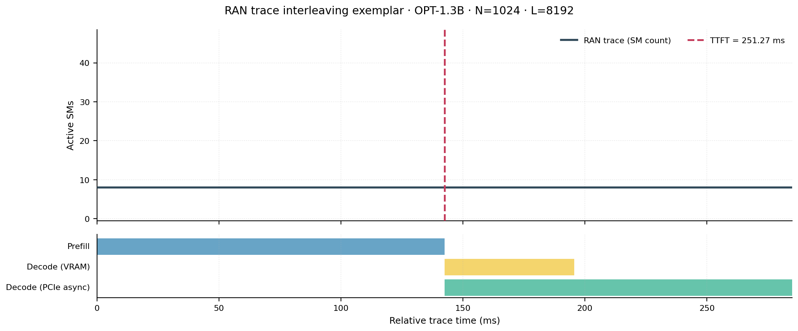
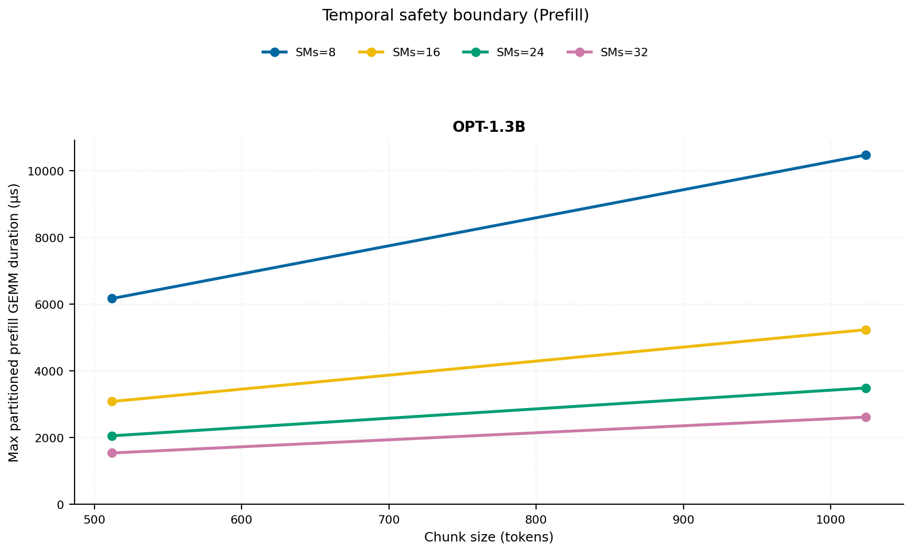
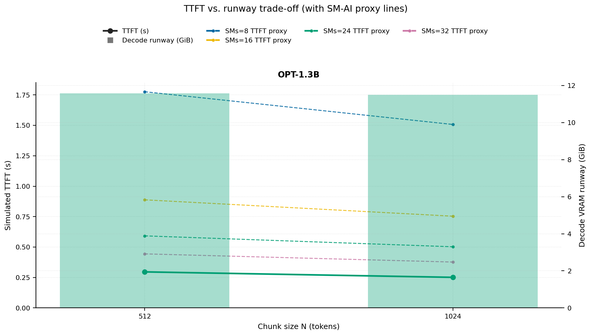
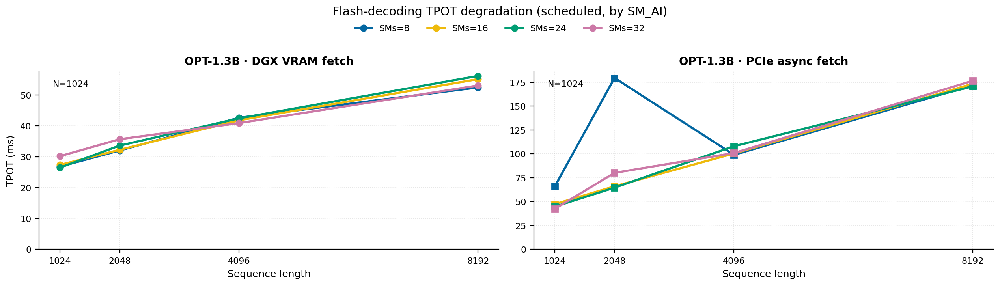
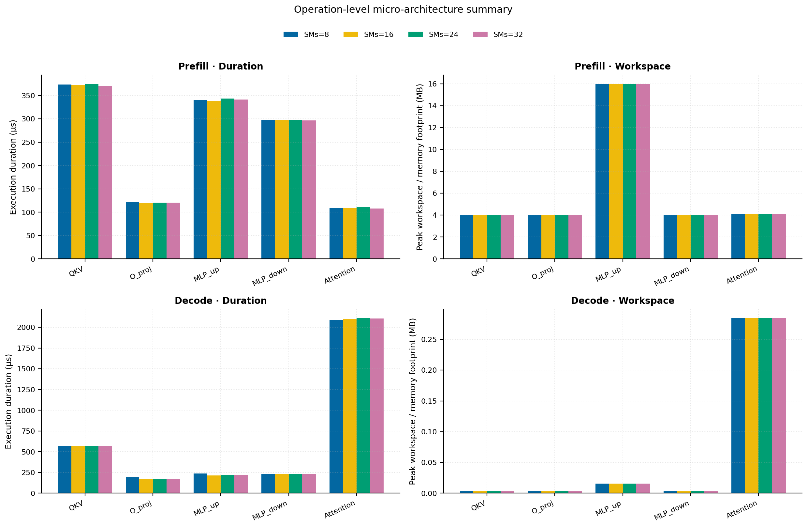
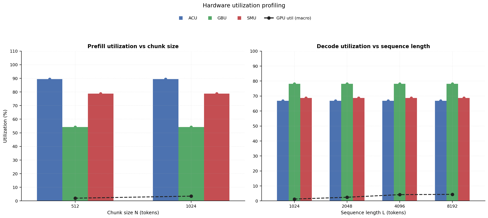
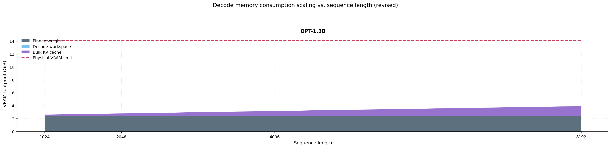

# RAN Inference Profiling Report

Run root: `/mnt/data/dheeraj/dicertation/inference-profile/runs/revised-full-20260414-g3-opt13b-c512-1024`

## Environment

| field | value |
| --- | --- |
| cache_root | n/a |
| captured_at | 2026-04-14T11:52:43Z |
| chunk_sizes | [512, 1024] |
| cuda_available | true |
| cuda_device_count | 8 |
| cwd | /mnt/data/dheeraj/dicertation/inference-profile |
| decode_modes | ["vram", "pcie_async"] |
| experiment_type | ran-dgxspark-v1 |
| gpu_id | 3 |
| l_out | 1024 |
| models | ["facebook/opt-1.3b"] |
| platform | Linux-6.8.0-106-generic-x86_64-with-glibc2.35 |
| python_executable | /home/dheeraj/miniconda3/envs/mls/bin/python |
| python_version | 3.11.14 |
| run_root | /mnt/data/dheeraj/dicertation/inference-profile/runs/revised-full-20260414-g3-opt13b-c512-1024 |
| scheduler | envelope_v1 |
| schema_version | ran_dgxspark_v1 |
| sequence_lengths | [1024, 2048, 4096, 8192] |
| sm_ai_cap | 32 |
| sm_ai_partition | 100 |
| sm_ai_partitions | [8, 16, 24, 32] |
| stage | profile |
| telemetry_tier | baseline_nvml_pt |
| timed_iterations | 5 |
| torch_available | true |
| torch_version | 2.10.0+cu128 |
| warmup_iterations | 3 |

## Model Constants

| model_id | sm_ai_partition | num_hidden_layers | hidden_size | num_attention_heads | ffn_dim | layer_index | layer_weight_bytes | total_weight_bytes_fp16 | vram_ceiling_bytes |
| --- | --- | --- | --- | --- | --- | --- | --- | --- | --- |
| facebook/opt-1.3b | 100 | 24 | 2048 | 32 | 8192 | 11 | 100716544 | 2631516160 | 15170115993 |

## Trace Inspection

### Primary trace

| field | value |
| --- | --- |
| errors | [] |
| header | ["frame", "slot", "time_slot_sched_ns", "time_decode_start_est_ns", "time_decode_end_est_ns", "time_decode_start_actual_ns", "time_decode_end_actual_ns", "decode_dur_us", "deadline_met", "target_sm", "profile_idx", "sm_count", "num_pusch", "sum_prb", "sum_tbs_bytes", "max_mcs"] |
| median_positive_delta_ms | 5.6997 |
| monotonicity.checked_column | time_slot_sched_ns |
| monotonicity.is_non_decreasing | true |
| monotonicity.negative_delta_count | 0 |
| monotonicity.positive_delta_count | 28377 |
| monotonicity.zero_delta_count | 0 |
| normalization.last_row_duration_policy | median_positive_forward_delta_ms |
| normalization.output_columns | ["time_ms", "sm_utilization", "slot_duration_ms", "source_schema", "sm_count"] |
| normalization.output_relative_path | derived/normalized_ldpc_trace.csv |
| normalized_row_count | 28378 |
| path | /mnt/raid0sata2/netsys/weaver-ext/ran/traces/e2e_2026030418/e2e_20260304_182034_tractor_ran_ctrl/ldpc_trace.csv |
| row_count | 28378 |
| schema_detected | schema_b |
| time_unit_hint | ns |
| usable | true |
| usage_policy | primary_only |
| used_for_scheduler_capacity | true |

### Secondary trace

| field | value |
| --- | --- |
| errors | ["ran_ctrl_trace.csv line 182958 has 9 field(s); expected 12"] |
| header | ["frame", "slot", "sm_available", "prbs_available", "prbs_allocated", "w_avg_mcs_prev", "w_avg_mcs_curr", "slots_since_underutil", "ramp_up_count", "num_ue_sched", "max_ue_backlog", "sum_ue_backlog"] |
| monotonicity.checked_column | n/a |
| monotonicity.is_non_decreasing | n/a |
| monotonicity.negative_delta_count | n/a |
| path | /mnt/raid0sata2/netsys/weaver-ext/ran/traces/e2e_2026030418/e2e_20260304_182034_tractor_ran_ctrl/ran_ctrl_trace.csv |
| row_count | 182956 |
| time_unit_hints | [] |
| usable | false |
| usage_policy | structural_only |
| used_for_scheduler_capacity | false |

## Raw-Profile Summary Tables

### Prefill profile summary

Source raw rows: `raw/prefill_events.csv` = 280. Summary artifact: `derived/prefill_summary.csv`.

| model_id | chunk_tokens | sm_ai_partition | max_input_tokens | prefill_max_gemm_us | prefill_workspace_bytes | prefill_parked_activation_bytes | telemetry_tier | telemetry_provider | telemetry_status | nvml_available | gpu_util | gpu_mem_used_mb | sm_clock_mhz | mem_clock_mhz | power_w | pt_step_ms | pt_mem_alloc_mb | pt_mem_reserved_mb | pt_workspace_mb | acu_pct | gbu_pct | smu_pct | microscopic_telemetry_status | microscopic_error |
| --- | --- | --- | --- | --- | --- | --- | --- | --- | --- | --- | --- | --- | --- | --- | --- | --- | --- | --- | --- | --- | --- | --- | --- | --- |
| facebook/opt-1.3b | 512 | 8 | 1024 | 256 | 8388608 | 8388608 | baseline_nvml_pt | nvidia-smi | ok | true | 0 | 41 | 1695 | 7601 | 65.09 | 0.256 | 129.1602 | 129.1602 | 8 | n/a | n/a | n/a | unavailable | n/a |
| facebook/opt-1.3b | 512 | 16 | 1024 | 248.832 | 8388608 | 8388608 | baseline_nvml_pt | nvidia-smi | ok | true | 0 | 41 | 1695 | 7601 | 65.36 | 0.2488 | 129.1602 | 129.1602 | 8 | n/a | n/a | n/a | unavailable | n/a |
| facebook/opt-1.3b | 512 | 24 | 1024 | 264.192 | 8388608 | 8388608 | baseline_nvml_pt | nvidia-smi | ok | true | 8 | 41 | 1695 | 7601 | 65.53 | 0.2642 | 129.1602 | 129.1602 | 8 | n/a | n/a | n/a | unavailable | n/a |
| facebook/opt-1.3b | 512 | 32 | 1024 | 257.024 | 8388608 | 8388608 | baseline_nvml_pt | nvidia-smi | ok | true | 0 | 41 | 1695 | 7601 | 66.67 | 0.257 | 129.1602 | 129.1602 | 8 | n/a | n/a | n/a | unavailable | n/a |
| facebook/opt-1.3b | 1024 | 8 | 1024 | 431.104 | 16777216 | 16777216 | baseline_nvml_pt | nvidia-smi | ok | true | 7 | 41 | 1695 | 8001 | 68.36 | 0.4311 | 153.1602 | 153.1602 | 16 | n/a | n/a | n/a | unavailable | n/a |
| facebook/opt-1.3b | 1024 | 16 | 1024 | 437.248 | 16777216 | 16777216 | baseline_nvml_pt | nvidia-smi | ok | true | 0 | 41 | 1695 | 7601 | 68.21 | 0.4372 | 153.1602 | 153.1602 | 16 | n/a | n/a | n/a | unavailable | n/a |
| facebook/opt-1.3b | 1024 | 24 | 1024 | 439.296 | 16777216 | 16777216 | baseline_nvml_pt | nvidia-smi | ok | true | 7 | 41 | 1695 | 8001 | 69.5 | 0.4393 | 153.1602 | 153.1602 | 16 | n/a | n/a | n/a | unavailable | n/a |
| facebook/opt-1.3b | 1024 | 32 | 1024 | 436.224 | 16777216 | 16777216 | baseline_nvml_pt | nvidia-smi | ok | true | 0 | 41 | 1695 | 8001 | 69.84 | 0.4362 | 153.1602 | 153.1602 | 16 | n/a | n/a | n/a | unavailable | n/a |

### Decode profile summary

Source raw rows: `raw/decode_events.csv` = 2560. Summary artifact: `derived/decode_summary.csv`.

| model_id | sequence_length | block_size | sm_ai_partition | decode_mode | decode_max_gemv_us | attention_fetch_compute_us | reduction_overhead_us | decode_workspace_bytes | decode_parked_activation_bytes | telemetry_tier | telemetry_provider | telemetry_status | nvml_available | gpu_util | gpu_mem_used_mb | sm_clock_mhz | mem_clock_mhz | power_w | pt_step_ms | pt_mem_alloc_mb | pt_mem_reserved_mb | pt_workspace_mb | acu_pct | gbu_pct | smu_pct | microscopic_telemetry_status | microscopic_error |
| --- | --- | --- | --- | --- | --- | --- | --- | --- | --- | --- | --- | --- | --- | --- | --- | --- | --- | --- | --- | --- | --- | --- | --- | --- | --- | --- | --- |
| facebook/opt-1.3b | 1024 | 512 | 8 | pcie_async | 169.056 | 311.0848 | 205.6192 | 136704 | 4096 | baseline_nvml_pt | nvidia-smi | ok | true | 0 | 41 | 1695 | 7601 | 68.05 | 0.3246 | 112.314 | 112.314 | 0.1304 | n/a | n/a | n/a | unavailable | n/a |
| facebook/opt-1.3b | 1024 | 512 | 8 | vram | 145.504 | 300.2816 | 251.2832 | 136704 | 4096 | baseline_nvml_pt | nvidia-smi | ok | true | 0 | 41 | 1695 | 7601 | 67.8 | 0.4116 | 112.314 | 112.314 | 0.1304 | n/a | n/a | n/a | unavailable | n/a |
| facebook/opt-1.3b | 1024 | 512 | 16 | pcie_async | 136.192 | 297.8688 | 198.2272 | 136704 | 4096 | baseline_nvml_pt | nvidia-smi | ok | true | 2 | 41 | 1695 | 7601 | 68.38 | 0.3082 | 112.314 | 112.314 | 0.1304 | n/a | n/a | n/a | unavailable | n/a |
| facebook/opt-1.3b | 1024 | 512 | 16 | vram | 143.36 | 293.9264 | 199.5456 | 136704 | 4096 | baseline_nvml_pt | nvidia-smi | ok | true | 0 | 41 | 1695 | 7601 | 68.32 | 0.306 | 112.314 | 112.314 | 0.1304 | n/a | n/a | n/a | unavailable | n/a |
| facebook/opt-1.3b | 1024 | 512 | 24 | pcie_async | 156.672 | 311.9104 | 201.2544 | 136704 | 4096 | baseline_nvml_pt | nvidia-smi | ok | true | 0 | 41 | 1695 | 8001 | 68.74 | 0.3297 | 112.314 | 112.314 | 0.1304 | n/a | n/a | n/a | unavailable | n/a |
| facebook/opt-1.3b | 1024 | 512 | 24 | vram | 160.768 | 317.888 | 214.6368 | 136704 | 4096 | baseline_nvml_pt | nvidia-smi | ok | true | 3 | 41 | 1695 | 7601 | 68.3 | 0.3235 | 112.314 | 112.314 | 0.1304 | n/a | n/a | n/a | unavailable | n/a |
| facebook/opt-1.3b | 1024 | 512 | 32 | pcie_async | 135.904 | 299.2256 | 196.9856 | 136704 | 4096 | baseline_nvml_pt | nvidia-smi | ok | true | 5 | 41 | 1695 | 7601 | 68.84 | 0.3093 | 112.314 | 112.314 | 0.1304 | n/a | n/a | n/a | unavailable | n/a |
| facebook/opt-1.3b | 1024 | 512 | 32 | vram | 152.576 | 294.56 | 202.2208 | 136704 | 4096 | baseline_nvml_pt | nvidia-smi | ok | true | 0 | 41 | 1695 | 7601 | 69.02 | 0.3041 | 112.314 | 112.314 | 0.1304 | n/a | n/a | n/a | unavailable | n/a |
| facebook/opt-1.3b | 1024 | 1024 | 8 | pcie_async | 295.872 | 181.2544 | 172.896 | 197120 | 4096 | baseline_nvml_pt | nvidia-smi | ok | true | 0 | 41 | 1695 | 7601 | 68.53 | 0.2959 | 112.3716 | 112.3716 | 0.188 | n/a | n/a | n/a | unavailable | n/a |
| facebook/opt-1.3b | 1024 | 1024 | 8 | vram | 125.952 | 179.5776 | 181.2672 | 197120 | 4096 | baseline_nvml_pt | nvidia-smi | ok | true | 0 | 41 | 1695 | 8001 | 68.97 | 0.1997 | 112.3716 | 112.3716 | 0.188 | n/a | n/a | n/a | unavailable | n/a |
| facebook/opt-1.3b | 1024 | 1024 | 16 | pcie_async | 162.816 | 184.1472 | 192.4352 | 197120 | 4096 | baseline_nvml_pt | nvidia-smi | ok | true | 0 | 41 | 1695 | 7601 | 69.05 | 0.208 | 112.3716 | 112.3716 | 0.188 | n/a | n/a | n/a | unavailable | n/a |
| facebook/opt-1.3b | 1024 | 1024 | 16 | vram | 132.096 | 173.6448 | 173.6704 | 197120 | 4096 | baseline_nvml_pt | nvidia-smi | ok | true | 0 | 41 | 1695 | 8001 | 69.45 | 0.1812 | 112.3716 | 112.3716 | 0.188 | n/a | n/a | n/a | unavailable | n/a |
| facebook/opt-1.3b | 1024 | 1024 | 24 | pcie_async | 147.456 | 175.0272 | 184.3712 | 197120 | 4096 | baseline_nvml_pt | nvidia-smi | ok | true | 0 | 41 | 1695 | 8001 | 69.52 | 0.1946 | 112.3716 | 112.3716 | 0.188 | n/a | n/a | n/a | unavailable | n/a |
| facebook/opt-1.3b | 1024 | 1024 | 24 | vram | 125.952 | 175.0464 | 172.4352 | 197120 | 4096 | baseline_nvml_pt | nvidia-smi | ok | true | 7 | 41 | 1695 | 8001 | 69.32 | 0.1832 | 112.3716 | 112.3716 | 0.188 | n/a | n/a | n/a | unavailable | n/a |
| facebook/opt-1.3b | 1024 | 1024 | 32 | pcie_async | 131.072 | 188.4224 | 172.8128 | 197120 | 4096 | baseline_nvml_pt | nvidia-smi | ok | true | 3 | 41 | 1695 | 7601 | 69.26 | 0.2026 | 112.3716 | 112.3716 | 0.188 | n/a | n/a | n/a | unavailable | n/a |
| facebook/opt-1.3b | 1024 | 1024 | 32 | vram | 149.568 | 178.1376 | 182.08 | 197120 | 4096 | baseline_nvml_pt | nvidia-smi | ok | true | 0 | 41 | 1695 | 8001 | 69.36 | 0.1894 | 112.3716 | 112.3716 | 0.188 | n/a | n/a | n/a | unavailable | n/a |
| facebook/opt-1.3b | 2048 | 512 | 8 | pcie_async | 156.512 | 531.6416 | 279.5008 | 146944 | 4096 | baseline_nvml_pt | nvidia-smi | ok | true | 0 | 41 | 1695 | 7601 | 69.3 | 0.541 | 120.3237 | 120.3237 | 0.1401 | n/a | n/a | n/a | unavailable | n/a |
| facebook/opt-1.3b | 2048 | 512 | 8 | vram | 142.336 | 524.1536 | 273.1968 | 146944 | 4096 | baseline_nvml_pt | nvidia-smi | ok | true | 2 | 41 | 1695 | 7601 | 69.14 | 0.5304 | 120.3237 | 120.3237 | 0.1401 | n/a | n/a | n/a | unavailable | n/a |
| facebook/opt-1.3b | 2048 | 512 | 16 | pcie_async | 147.296 | 522.8032 | 272.1344 | 146944 | 4096 | baseline_nvml_pt | nvidia-smi | ok | true | 6 | 41 | 1695 | 8001 | 69.79 | 0.5345 | 120.3237 | 120.3237 | 0.1401 | n/a | n/a | n/a | unavailable | n/a |
| facebook/opt-1.3b | 2048 | 512 | 16 | vram | 147.392 | 527.1168 | 280.1856 | 146944 | 4096 | baseline_nvml_pt | nvidia-smi | ok | true | 0 | 41 | 1695 | 8001 | 69.66 | 0.5333 | 120.3237 | 120.3237 | 0.1401 | n/a | n/a | n/a | unavailable | n/a |
| facebook/opt-1.3b | 2048 | 512 | 24 | pcie_async | 148.32 | 516.1856 | 272.576 | 146944 | 4096 | baseline_nvml_pt | nvidia-smi | ok | true | 2 | 41 | 1695 | 7601 | 69.81 | 0.5225 | 120.3237 | 120.3237 | 0.1401 | n/a | n/a | n/a | unavailable | n/a |
| facebook/opt-1.3b | 2048 | 512 | 24 | vram | 151.552 | 522.6496 | 279.4176 | 146944 | 4096 | baseline_nvml_pt | nvidia-smi | ok | true | 6 | 41 | 1695 | 7601 | 69.45 | 0.5295 | 120.3237 | 120.3237 | 0.1401 | n/a | n/a | n/a | unavailable | n/a |
| facebook/opt-1.3b | 2048 | 512 | 32 | pcie_async | 145.632 | 525.8688 | 272.5568 | 146944 | 4096 | baseline_nvml_pt | nvidia-smi | ok | true | 0 | 41 | 1695 | 7601 | 69.42 | 0.5356 | 120.3237 | 120.3237 | 0.1401 | n/a | n/a | n/a | unavailable | n/a |
| facebook/opt-1.3b | 2048 | 512 | 32 | vram | 136.352 | 522.6176 | 269.3952 | 146944 | 4096 | baseline_nvml_pt | nvidia-smi | ok | true | 8 | 41 | 1695 | 7601 | 69.09 | 0.5273 | 120.3237 | 120.3237 | 0.1401 | n/a | n/a | n/a | unavailable | n/a |
| facebook/opt-1.3b | 2048 | 1024 | 8 | pcie_async | 948.448 | 329.7472 | 225.9008 | 267776 | 4096 | baseline_nvml_pt | nvidia-smi | ok | true | 0 | 41 | 1695 | 8001 | 69.94 | 0.9484 | 120.439 | 120.439 | 0.2554 | n/a | n/a | n/a | unavailable | n/a |
| facebook/opt-1.3b | 2048 | 1024 | 8 | vram | 139.072 | 302.0096 | 197.984 | 267776 | 4096 | baseline_nvml_pt | nvidia-smi | ok | true | 0 | 41 | 1695 | 7601 | 69.35 | 0.3135 | 120.439 | 120.439 | 0.2554 | n/a | n/a | n/a | unavailable | n/a |
| facebook/opt-1.3b | 2048 | 1024 | 16 | pcie_async | 158.72 | 325.4464 | 235.5392 | 267776 | 4096 | baseline_nvml_pt | nvidia-smi | ok | true | 8 | 41 | 1695 | 7601 | 70.18 | 0.3533 | 120.439 | 120.439 | 0.2554 | n/a | n/a | n/a | unavailable | n/a |
| facebook/opt-1.3b | 2048 | 1024 | 16 | vram | 140.288 | 304.2816 | 197.5808 | 267776 | 4096 | baseline_nvml_pt | nvidia-smi | ok | true | 0 | 41 | 1695 | 7601 | 69.45 | 0.3103 | 120.439 | 120.439 | 0.2554 | n/a | n/a | n/a | unavailable | n/a |
| facebook/opt-1.3b | 2048 | 1024 | 24 | pcie_async | 152.832 | 317.8368 | 220.7424 | 267776 | 4096 | baseline_nvml_pt | nvidia-smi | ok | true | 0 | 41 | 1695 | 8001 | 70.42 | 0.3256 | 120.439 | 120.439 | 0.2554 | n/a | n/a | n/a | unavailable | n/a |
| facebook/opt-1.3b | 2048 | 1024 | 24 | vram | 146.432 | 310.2528 | 211.7824 | 267776 | 4096 | baseline_nvml_pt | nvidia-smi | ok | true | 0 | 41 | 1695 | 8001 | 70.23 | 0.3318 | 120.439 | 120.439 | 0.2554 | n/a | n/a | n/a | unavailable | n/a |
| facebook/opt-1.3b | 2048 | 1024 | 32 | pcie_async | 259.072 | 328.3072 | 219.1488 | 267776 | 4096 | baseline_nvml_pt | nvidia-smi | ok | true | 0 | 41 | 1695 | 7601 | 70.43 | 0.4118 | 120.439 | 120.439 | 0.2554 | n/a | n/a | n/a | unavailable | n/a |
| facebook/opt-1.3b | 2048 | 1024 | 32 | vram | 159.744 | 309.3248 | 218.6688 | 267776 | 4096 | baseline_nvml_pt | nvidia-smi | ok | true | 7 | 41 | 1695 | 7601 | 70.12 | 0.3297 | 120.439 | 120.439 | 0.2554 | n/a | n/a | n/a | unavailable | n/a |
| facebook/opt-1.3b | 4096 | 512 | 8 | pcie_async | 138.24 | 986.112 | 451.168 | 167424 | 4096 | baseline_nvml_pt | nvidia-smi | ok | true | 1 | 41 | 1695 | 7601 | 70 | 0.9902 | 136.3433 | 136.3433 | 0.1597 | n/a | n/a | n/a | unavailable | n/a |
| facebook/opt-1.3b | 4096 | 512 | 8 | vram | 138.176 | 961.4848 | 413.4912 | 167424 | 4096 | baseline_nvml_pt | nvidia-smi | ok | true | 0 | 41 | 1695 | 7601 | 70.57 | 0.9759 | 136.3433 | 136.3433 | 0.1597 | n/a | n/a | n/a | unavailable | n/a |
| facebook/opt-1.3b | 4096 | 512 | 16 | pcie_async | 139.264 | 981.1456 | 417.7408 | 167424 | 4096 | baseline_nvml_pt | nvidia-smi | ok | true | 6 | 41 | 1695 | 7601 | 70.2 | 0.9912 | 136.3433 | 136.3433 | 0.1597 | n/a | n/a | n/a | unavailable | n/a |
| facebook/opt-1.3b | 4096 | 512 | 16 | vram | 179.2 | 1020.6848 | 457.824 | 167424 | 4096 | baseline_nvml_pt | nvidia-smi | ok | true | 9 | 41 | 1695 | 7601 | 70.13 | 1.0495 | 136.3433 | 136.3433 | 0.1597 | n/a | n/a | n/a | unavailable | n/a |
| facebook/opt-1.3b | 4096 | 512 | 24 | pcie_async | 138.24 | 1031.7888 | 426.7776 | 167424 | 4096 | baseline_nvml_pt | nvidia-smi | ok | true | 5 | 41 | 1695 | 7601 | 70.23 | 1.109 | 136.3433 | 136.3433 | 0.1597 | n/a | n/a | n/a | unavailable | n/a |
| facebook/opt-1.3b | 4096 | 512 | 24 | vram | 124.832 | 1000.6528 | 436.416 | 167424 | 4096 | baseline_nvml_pt | nvidia-smi | ok | true | 0 | 41 | 1695 | 7601 | 70.35 | 1.022 | 136.3433 | 136.3433 | 0.1597 | n/a | n/a | n/a | unavailable | n/a |
| facebook/opt-1.3b | 4096 | 512 | 32 | pcie_async | 147.456 | 1027.0144 | 467.2064 | 167424 | 4096 | baseline_nvml_pt | nvidia-smi | ok | true | 8 | 41 | 1695 | 8001 | 70.42 | 1.0465 | 136.3433 | 136.3433 | 0.1597 | n/a | n/a | n/a | unavailable | n/a |
| facebook/opt-1.3b | 4096 | 512 | 32 | vram | 145.312 | 981.8112 | 421.408 | 167424 | 4096 | baseline_nvml_pt | nvidia-smi | ok | true | 0 | 41 | 1695 | 8001 | 70.6 | 0.9871 | 136.3433 | 136.3433 | 0.1597 | n/a | n/a | n/a | unavailable | n/a |
| facebook/opt-1.3b | 4096 | 1024 | 8 | pcie_async | 139.392 | 532.4416 | 282.6432 | 278016 | 4096 | baseline_nvml_pt | nvidia-smi | ok | true | 0 | 41 | 1695 | 7601 | 69.47 | 0.5477 | 136.4487 | 136.4487 | 0.2651 | n/a | n/a | n/a | unavailable | n/a |
| facebook/opt-1.3b | 4096 | 1024 | 8 | vram | 157.696 | 556.2048 | 274.1632 | 278016 | 4096 | baseline_nvml_pt | nvidia-smi | ok | true | 8 | 41 | 1695 | 8001 | 70.58 | 0.6932 | 136.4487 | 136.4487 | 0.2651 | n/a | n/a | n/a | unavailable | n/a |
| facebook/opt-1.3b | 4096 | 1024 | 16 | pcie_async | 150.368 | 526.3488 | 280.288 | 278016 | 4096 | baseline_nvml_pt | nvidia-smi | ok | true | 8 | 41 | 1695 | 8001 | 70.35 | 0.5345 | 136.4487 | 136.4487 | 0.2651 | n/a | n/a | n/a | unavailable | n/a |
| facebook/opt-1.3b | 4096 | 1024 | 16 | vram | 153.344 | 538.3936 | 283.8016 | 278016 | 4096 | baseline_nvml_pt | nvidia-smi | ok | true | 0 | 41 | 1695 | 7601 | 69.93 | 0.5468 | 136.4487 | 136.4487 | 0.2651 | n/a | n/a | n/a | unavailable | n/a |
| facebook/opt-1.3b | 4096 | 1024 | 24 | pcie_async | 200.8 | 543.584 | 277.1072 | 278016 | 4096 | baseline_nvml_pt | nvidia-smi | ok | true | 10 | 41 | 1695 | 7601 | 69.99 | 0.5727 | 136.4487 | 136.4487 | 0.2651 | n/a | n/a | n/a | unavailable | n/a |
| facebook/opt-1.3b | 4096 | 1024 | 24 | vram | 157.696 | 541.8368 | 280.4992 | 278016 | 4096 | baseline_nvml_pt | nvidia-smi | ok | true | 7 | 41 | 1695 | 7601 | 69.94 | 0.5581 | 136.4487 | 136.4487 | 0.2651 | n/a | n/a | n/a | unavailable | n/a |
| facebook/opt-1.3b | 4096 | 1024 | 32 | pcie_async | 152.32 | 530.016 | 285.5488 | 278016 | 4096 | baseline_nvml_pt | nvidia-smi | ok | true | 5 | 41 | 1695 | 7601 | 70.14 | 0.5437 | 136.4487 | 136.4487 | 0.2651 | n/a | n/a | n/a | unavailable | n/a |
| facebook/opt-1.3b | 4096 | 1024 | 32 | vram | 145.664 | 543.1616 | 287.3216 | 278016 | 4096 | baseline_nvml_pt | nvidia-smi | ok | true | 0 | 41 | 1695 | 7601 | 70.48 | 0.553 | 136.4487 | 136.4487 | 0.2651 | n/a | n/a | n/a | unavailable | n/a |
| facebook/opt-1.3b | 8192 | 512 | 8 | pcie_async | 147.456 | 1822.1504 | 686.912 | 208384 | 4096 | baseline_nvml_pt | nvidia-smi | ok | true | 2 | 41 | 1695 | 7601 | 70.14 | 1.8504 | 168.3823 | 168.3823 | 0.1987 | n/a | n/a | n/a | unavailable | n/a |
| facebook/opt-1.3b | 8192 | 512 | 8 | vram | 264.192 | 1834.816 | 720.1728 | 208384 | 4096 | baseline_nvml_pt | nvidia-smi | ok | true | 2 | 41 | 1695 | 7601 | 69.97 | 1.8412 | 168.3823 | 168.3823 | 0.1987 | n/a | n/a | n/a | unavailable | n/a |
| facebook/opt-1.3b | 8192 | 512 | 16 | pcie_async | 137.216 | 1840.7552 | 685.1776 | 208384 | 4096 | baseline_nvml_pt | nvidia-smi | ok | true | 8 | 41 | 1695 | 8001 | 70.43 | 1.8463 | 168.3823 | 168.3823 | 0.1987 | n/a | n/a | n/a | unavailable | n/a |
| facebook/opt-1.3b | 8192 | 512 | 16 | vram | 228.352 | 1892.7999 | 717.0496 | 208384 | 4096 | baseline_nvml_pt | nvidia-smi | ok | true | 6 | 41 | 1695 | 7601 | 70.15 | 2.0286 | 168.3823 | 168.3823 | 0.1987 | n/a | n/a | n/a | unavailable | n/a |
| facebook/opt-1.3b | 8192 | 512 | 24 | pcie_async | 151.616 | 1937.8048 | 793.4336 | 208384 | 4096 | baseline_nvml_pt | nvidia-smi | ok | true | 0 | 41 | 1695 | 7601 | 69.96 | 1.9752 | 168.3823 | 168.3823 | 0.1987 | n/a | n/a | n/a | unavailable | n/a |
| facebook/opt-1.3b | 8192 | 512 | 24 | vram | 140.288 | 1785.7728 | 664.4096 | 208384 | 4096 | baseline_nvml_pt | nvidia-smi | ok | true | 5 | 41 | 1695 | 8001 | 70.34 | 1.8268 | 168.3823 | 168.3823 | 0.1987 | n/a | n/a | n/a | unavailable | n/a |
| facebook/opt-1.3b | 8192 | 512 | 32 | pcie_async | 152.576 | 1845.4848 | 714.7712 | 208384 | 4096 | baseline_nvml_pt | nvidia-smi | ok | true | 0 | 41 | 1695 | 8001 | 70.17 | 1.879 | 168.3823 | 168.3823 | 0.1987 | n/a | n/a | n/a | unavailable | n/a |
| facebook/opt-1.3b | 8192 | 512 | 32 | vram | 140.288 | 1823.488 | 695.6992 | 208384 | 4096 | baseline_nvml_pt | nvidia-smi | ok | true | 0 | 41 | 1695 | 7601 | 69.68 | 1.839 | 168.3823 | 168.3823 | 0.1987 | n/a | n/a | n/a | unavailable | n/a |
| facebook/opt-1.3b | 8192 | 1024 | 8 | pcie_async | 135.104 | 997.8112 | 404.6144 | 298496 | 4096 | baseline_nvml_pt | nvidia-smi | ok | true | 8 | 41 | 1695 | 7601 | 70.07 | 1.1476 | 168.4683 | 168.4683 | 0.2847 | n/a | n/a | n/a | unavailable | n/a |
| facebook/opt-1.3b | 8192 | 1024 | 8 | vram | 138.24 | 947.2 | 408.6528 | 298496 | 4096 | baseline_nvml_pt | nvidia-smi | ok | true | 2 | 41 | 1695 | 7601 | 70.05 | 0.9792 | 168.4683 | 168.4683 | 0.2847 | n/a | n/a | n/a | unavailable | n/a |
| facebook/opt-1.3b | 8192 | 1024 | 16 | pcie_async | 145.408 | 989.8176 | 415.9552 | 298496 | 4096 | baseline_nvml_pt | nvidia-smi | ok | true | 0 | 41 | 1695 | 7601 | 70.3 | 1.0004 | 168.4683 | 168.4683 | 0.2847 | n/a | n/a | n/a | unavailable | n/a |
| facebook/opt-1.3b | 8192 | 1024 | 16 | vram | 155.52 | 942.3168 | 422.048 | 298496 | 4096 | baseline_nvml_pt | nvidia-smi | ok | true | 7 | 41 | 1695 | 7601 | 70.08 | 0.9718 | 168.4683 | 168.4683 | 0.2847 | n/a | n/a | n/a | unavailable | n/a |
| facebook/opt-1.3b | 8192 | 1024 | 24 | pcie_async | 133.248 | 955.5648 | 410.9568 | 298496 | 4096 | baseline_nvml_pt | nvidia-smi | ok | true | 8 | 41 | 1695 | 8001 | 70.18 | 0.9801 | 168.4683 | 168.4683 | 0.2847 | n/a | n/a | n/a | unavailable | n/a |
| facebook/opt-1.3b | 8192 | 1024 | 24 | vram | 154.624 | 981.1776 | 431.744 | 298496 | 4096 | baseline_nvml_pt | nvidia-smi | ok | true | 10 | 41 | 1695 | 7601 | 70.5 | 0.9912 | 168.4683 | 168.4683 | 0.2847 | n/a | n/a | n/a | unavailable | n/a |
| facebook/opt-1.3b | 8192 | 1024 | 32 | pcie_async | 156.672 | 1011.8912 | 458.7264 | 298496 | 4096 | baseline_nvml_pt | nvidia-smi | ok | true | 6 | 41 | 1695 | 7601 | 69.8 | 1.0271 | 168.4683 | 168.4683 | 0.2847 | n/a | n/a | n/a | unavailable | n/a |
| facebook/opt-1.3b | 8192 | 1024 | 32 | vram | 139.264 | 962.6496 | 413.7408 | 298496 | 4096 | baseline_nvml_pt | nvidia-smi | ok | true | 6 | 41 | 1695 | 7601 | 70.2 | 0.9728 | 168.4683 | 168.4683 | 0.2847 | n/a | n/a | n/a | unavailable | n/a |

### PCIe profile summary

Source raw rows: `raw/pcie_events.csv` = 10. Summary artifact: `derived/pcie_summary.csv`.

| model_id | block_size | kv_block_bytes | transfer_only_us | overlap_total_us | dummy_compute_us | exposed_transfer_us | effective_gbps | overlap_status | telemetry_tier | telemetry_provider | telemetry_status | nvml_available | gpu_util | gpu_mem_used_mb | sm_clock_mhz | mem_clock_mhz | power_w | pt_step_ms | pt_mem_alloc_mb | pt_mem_reserved_mb | pt_workspace_mb | acu_pct | gbu_pct | smu_pct | microscopic_telemetry_status | microscopic_error |
| --- | --- | --- | --- | --- | --- | --- | --- | --- | --- | --- | --- | --- | --- | --- | --- | --- | --- | --- | --- | --- | --- | --- | --- | --- | --- | --- |
| facebook/opt-1.3b | 512 | 4194304 | 920.1216 | 56406.2701 | 56058.741 | 347.529 | 4.5584 | measured | baseline_nvml_pt | nvidia-smi | partial | true | 0 | 41 | 1695 | 7601 | 58.21 | n/a | n/a | n/a | n/a | n/a | n/a | n/a | unavailable | n/a |
| facebook/opt-1.3b | 1024 | 8388608 | 943.8976 | 34964.1079 | 34345.3757 | 618.7321 | 8.8872 | measured | baseline_nvml_pt | nvidia-smi | partial | true | 0 | 41 | 1695 | 7601 | 69.4 | n/a | n/a | n/a | n/a | n/a | n/a | n/a | unavailable | n/a |

## SLA Tables

### Successful configurations

| model_id | chunk_tokens | sequence_length | ttft_ms | tpot_ms_vram | tpot_ms_pcie_async | decode_runway_tokens | status |
| --- | --- | --- | --- | --- | --- | --- | --- |
| facebook/opt-1.3b | 512 | 1024 | 296.0916 | 33.8937 | 48.1606 | 63261 | success |
| facebook/opt-1.3b | 512 | 2048 | 296.0916 | 38.643 | 73.496 | 63261 | success |
| facebook/opt-1.3b | 512 | 4096 | 296.0916 | 54.6022 | 123.8205 | 63261 | success |
| facebook/opt-1.3b | 512 | 8192 | 296.0916 | 80.662 | 216.8682 | 63261 | success |
| facebook/opt-1.3b | 1024 | 1024 | 251.265 | 30.183 | 42.3936 | 62749 | success |
| facebook/opt-1.3b | 1024 | 2048 | 251.265 | 35.675 | 80.1445 | 62749 | success |
| facebook/opt-1.3b | 1024 | 4096 | 251.265 | 40.9072 | 100.9059 | 62749 | success |
| facebook/opt-1.3b | 1024 | 8192 | 251.265 | 53.0874 | 176.6522 | 62749 | success |

### Failed configurations

No rows available.

## Per-Model Scaling Analysis

| model_id | successful_configs | failed_configs | chunk_tokens_tested | sequence_lengths_tested | largest_successful_chunk_tokens | ttft_ms_min | ttft_ms_max | tpot_ms_vram_min | tpot_ms_vram_max | tpot_ms_pcie_async_min | tpot_ms_pcie_async_max | max_decode_runway_tokens |
| --- | --- | --- | --- | --- | --- | --- | --- | --- | --- | --- | --- | --- |
| facebook/opt-1.3b | 8 | 0 | 512, 1024 | 1024, 2048, 4096, 8192 | 1024 | 251.265 | 296.0916 | 30.183 | 80.662 | 42.3936 | 216.8682 | 63261 |

## Plots

### Revised 01 Ran Trace Interleaving

[Interactive companion](../plots/revised_01_ran_trace_interleaving_interactive.html)

### Revised 02 Prefill Safety Boundary

### Revised 03 Prefill Vram Composition

### Revised 04 Ttft Vs Runway

### Revised 05 Decode Tpot Degradation

### Revised 06 Operation Level Microarchitecture Summary

### Revised 07 Hardware Utilization Profiling

### Revised 08 Decode Memory Consumption

### 09 Spatial VRAM Composition (Prefill) · Pie View

