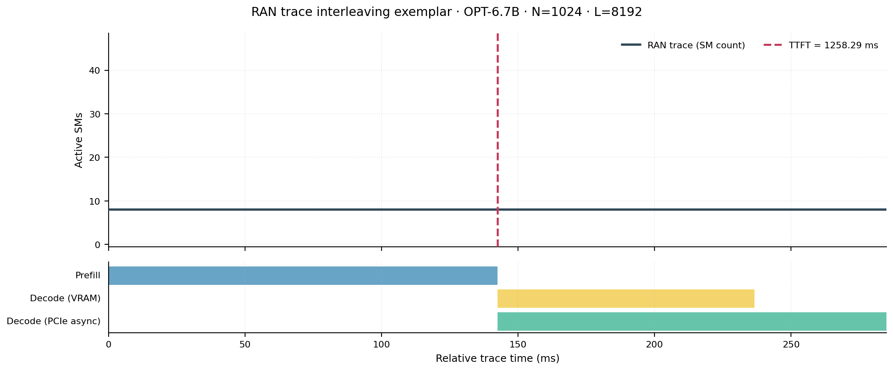
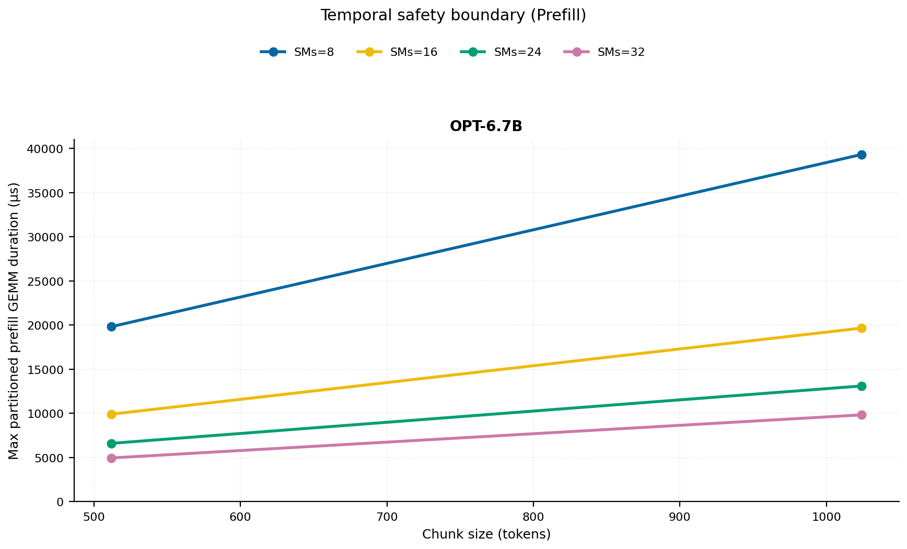
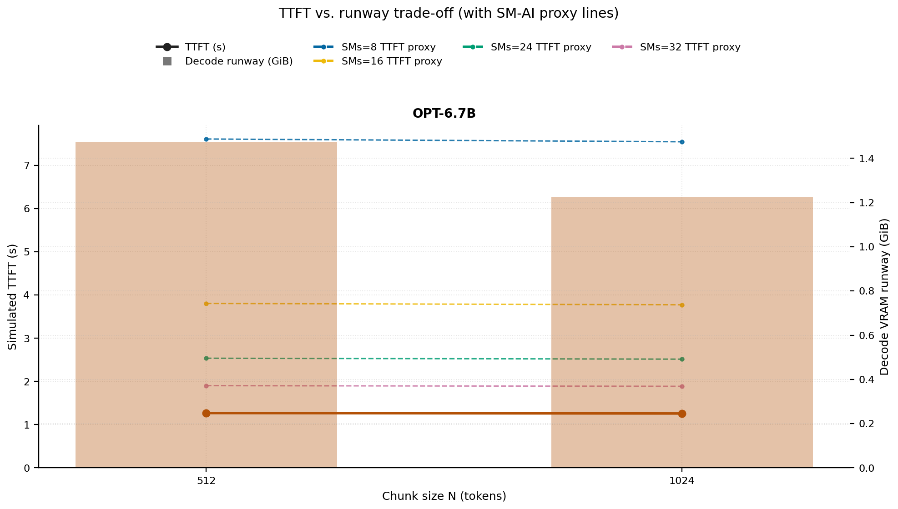
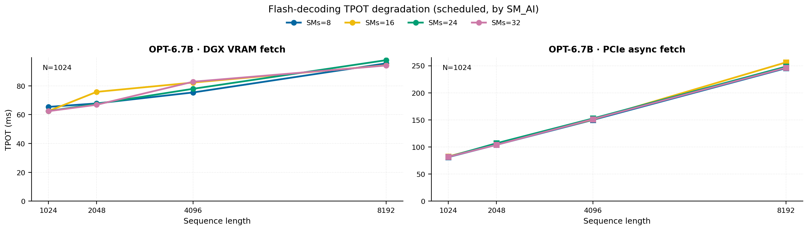
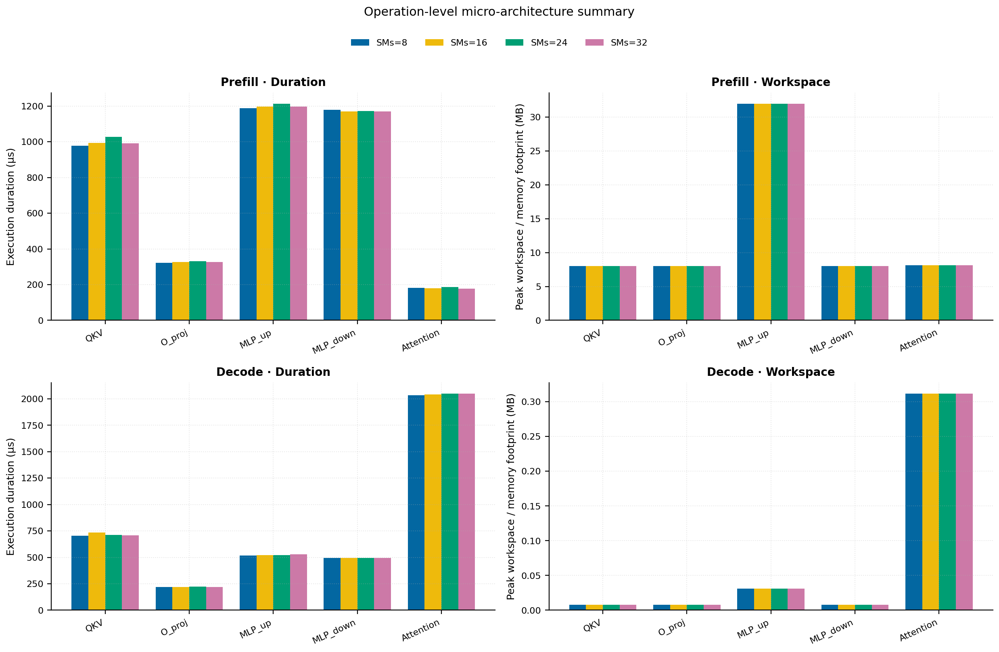
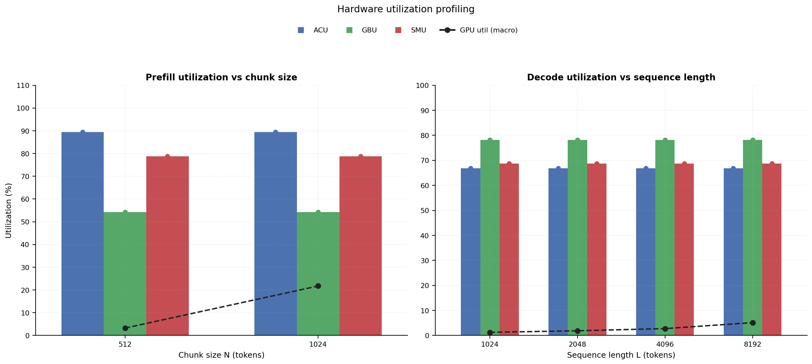
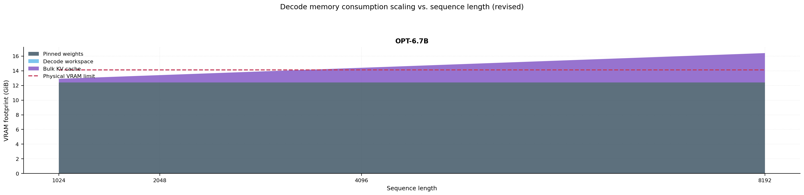

# RAN Inference Profiling Report

Run root: `/mnt/data/dheeraj/dicertation/inference-profile/runs/revised-full-20260414-g7-opt67b-c512-1024`

## Environment

| field | value |
| --- | --- |
| cache_root | n/a |
| captured_at | 2026-04-14T11:52:43Z |
| chunk_sizes | [512, 1024] |
| cuda_available | true |
| cuda_device_count | 8 |
| cwd | /mnt/data/dheeraj/dicertation/inference-profile |
| decode_modes | ["vram", "pcie_async"] |
| experiment_type | ran-dgxspark-v1 |
| gpu_id | 7 |
| l_out | 1024 |
| models | ["facebook/opt-6.7b"] |
| platform | Linux-6.8.0-106-generic-x86_64-with-glibc2.35 |
| python_executable | /home/dheeraj/miniconda3/envs/mls/bin/python |
| python_version | 3.11.14 |
| run_root | /mnt/data/dheeraj/dicertation/inference-profile/runs/revised-full-20260414-g7-opt67b-c512-1024 |
| scheduler | envelope_v1 |
| schema_version | ran_dgxspark_v1 |
| sequence_lengths | [1024, 2048, 4096, 8192] |
| sm_ai_cap | 32 |
| sm_ai_partition | 100 |
| sm_ai_partitions | [8, 16, 24, 32] |
| stage | profile |
| telemetry_tier | baseline_nvml_pt |
| timed_iterations | 5 |
| torch_available | true |
| torch_version | 2.10.0+cu128 |
| warmup_iterations | 3 |

## Model Constants

| model_id | sm_ai_partition | num_hidden_layers | hidden_size | num_attention_heads | ffn_dim | layer_index | layer_weight_bytes | total_weight_bytes_fp16 | vram_ceiling_bytes |
| --- | --- | --- | --- | --- | --- | --- | --- | --- | --- |
| facebook/opt-6.7b | 100 | 32 | 4096 | 32 | 16384 | 15 | 402759680 | 13316947968 | 15170115993 |

## Trace Inspection

### Primary trace

| field | value |
| --- | --- |
| errors | [] |
| header | ["frame", "slot", "time_slot_sched_ns", "time_decode_start_est_ns", "time_decode_end_est_ns", "time_decode_start_actual_ns", "time_decode_end_actual_ns", "decode_dur_us", "deadline_met", "target_sm", "profile_idx", "sm_count", "num_pusch", "sum_prb", "sum_tbs_bytes", "max_mcs"] |
| median_positive_delta_ms | 5.6997 |
| monotonicity.checked_column | time_slot_sched_ns |
| monotonicity.is_non_decreasing | true |
| monotonicity.negative_delta_count | 0 |
| monotonicity.positive_delta_count | 28377 |
| monotonicity.zero_delta_count | 0 |
| normalization.last_row_duration_policy | median_positive_forward_delta_ms |
| normalization.output_columns | ["time_ms", "sm_utilization", "slot_duration_ms", "source_schema", "sm_count"] |
| normalization.output_relative_path | derived/normalized_ldpc_trace.csv |
| normalized_row_count | 28378 |
| path | /mnt/raid0sata2/netsys/weaver-ext/ran/traces/e2e_2026030418/e2e_20260304_182034_tractor_ran_ctrl/ldpc_trace.csv |
| row_count | 28378 |
| schema_detected | schema_b |
| time_unit_hint | ns |
| usable | true |
| usage_policy | primary_only |
| used_for_scheduler_capacity | true |

### Secondary trace

| field | value |
| --- | --- |
| errors | ["ran_ctrl_trace.csv line 182958 has 9 field(s); expected 12"] |
| header | ["frame", "slot", "sm_available", "prbs_available", "prbs_allocated", "w_avg_mcs_prev", "w_avg_mcs_curr", "slots_since_underutil", "ramp_up_count", "num_ue_sched", "max_ue_backlog", "sum_ue_backlog"] |
| monotonicity.checked_column | n/a |
| monotonicity.is_non_decreasing | n/a |
| monotonicity.negative_delta_count | n/a |
| path | /mnt/raid0sata2/netsys/weaver-ext/ran/traces/e2e_2026030418/e2e_20260304_182034_tractor_ran_ctrl/ran_ctrl_trace.csv |
| row_count | 182956 |
| time_unit_hints | [] |
| usable | false |
| usage_policy | structural_only |
| used_for_scheduler_capacity | false |

## Raw-Profile Summary Tables

### Prefill profile summary

Source raw rows: `raw/prefill_events.csv` = 280. Summary artifact: `derived/prefill_summary.csv`.

| model_id | chunk_tokens | sm_ai_partition | max_input_tokens | prefill_max_gemm_us | prefill_workspace_bytes | prefill_parked_activation_bytes | telemetry_tier | telemetry_provider | telemetry_status | nvml_available | gpu_util | gpu_mem_used_mb | sm_clock_mhz | mem_clock_mhz | power_w | pt_step_ms | pt_mem_alloc_mb | pt_mem_reserved_mb | pt_workspace_mb | acu_pct | gbu_pct | smu_pct | microscopic_telemetry_status | microscopic_error |
| --- | --- | --- | --- | --- | --- | --- | --- | --- | --- | --- | --- | --- | --- | --- | --- | --- | --- | --- | --- | --- | --- | --- | --- | --- |
| facebook/opt-6.7b | 512 | 8 | 1024 | 822.272 | 16777216 | 16777216 | baseline_nvml_pt | nvidia-smi | ok | true | 0 | 5 | 1695 | 7601 | 68.54 | 0.8223 | 441.1953 | 441.1953 | 16 | n/a | n/a | n/a | unavailable | n/a |
| facebook/opt-6.7b | 512 | 16 | 1024 | 829.44 | 16777216 | 16777216 | baseline_nvml_pt | nvidia-smi | ok | true | 1 | 5 | 1695 | 7601 | 68.51 | 0.8294 | 441.1953 | 441.1953 | 16 | n/a | n/a | n/a | unavailable | n/a |
| facebook/opt-6.7b | 512 | 24 | 1024 | 828.288 | 16777216 | 16777216 | baseline_nvml_pt | nvidia-smi | ok | true | 6 | 5 | 1695 | 7601 | 69.06 | 0.8283 | 441.1953 | 441.1953 | 16 | n/a | n/a | n/a | unavailable | n/a |
| facebook/opt-6.7b | 512 | 32 | 1024 | 826.112 | 16777216 | 16777216 | baseline_nvml_pt | nvidia-smi | ok | true | 6 | 5 | 1695 | 7601 | 69.22 | 0.8261 | 441.1953 | 441.1953 | 16 | n/a | n/a | n/a | unavailable | n/a |
| facebook/opt-6.7b | 1024 | 8 | 1024 | 1795.072 | 33554432 | 33554432 | baseline_nvml_pt | nvidia-smi | ok | true | 0 | 5 | 1695 | 8001 | 74.99 | 1.7951 | 489.1953 | 489.1953 | 32 | n/a | n/a | n/a | unavailable | n/a |
| facebook/opt-6.7b | 1024 | 16 | 1024 | 1635.3281 | 33554432 | 33554432 | baseline_nvml_pt | nvidia-smi | ok | true | 39 | 5 | 1695 | 7601 | 74.23 | 1.6353 | 489.1953 | 489.1953 | 32 | n/a | n/a | n/a | unavailable | n/a |
| facebook/opt-6.7b | 1024 | 24 | 1024 | 1654.6561 | 33554432 | 33554432 | baseline_nvml_pt | nvidia-smi | ok | true | 48 | 5 | 1695 | 7601 | 74.58 | 1.6547 | 489.1953 | 489.1953 | 32 | n/a | n/a | n/a | unavailable | n/a |
| facebook/opt-6.7b | 1024 | 32 | 1024 | 1638.4 | 33554432 | 33554432 | baseline_nvml_pt | nvidia-smi | ok | true | 0 | 5 | 1695 | 8001 | 74.62 | 1.6384 | 489.1953 | 489.1953 | 32 | n/a | n/a | n/a | unavailable | n/a |

### Decode profile summary

Source raw rows: `raw/decode_events.csv` = 2560. Summary artifact: `derived/decode_summary.csv`.

| model_id | sequence_length | block_size | sm_ai_partition | decode_mode | decode_max_gemv_us | attention_fetch_compute_us | reduction_overhead_us | decode_workspace_bytes | decode_parked_activation_bytes | telemetry_tier | telemetry_provider | telemetry_status | nvml_available | gpu_util | gpu_mem_used_mb | sm_clock_mhz | mem_clock_mhz | power_w | pt_step_ms | pt_mem_alloc_mb | pt_mem_reserved_mb | pt_workspace_mb | acu_pct | gbu_pct | smu_pct | microscopic_telemetry_status | microscopic_error |
| --- | --- | --- | --- | --- | --- | --- | --- | --- | --- | --- | --- | --- | --- | --- | --- | --- | --- | --- | --- | --- | --- | --- | --- | --- | --- | --- | --- |
| facebook/opt-6.7b | 1024 | 512 | 8 | pcie_async | 277.344 | 312.6784 | 214.0288 | 140800 | 8192 | baseline_nvml_pt | nvidia-smi | ok | true | 17 | 5 | 1695 | 7601 | 66.26 | 0.3284 | 408.3765 | 408.3765 | 0.1343 | n/a | n/a | n/a | unavailable | n/a |
| facebook/opt-6.7b | 1024 | 512 | 8 | vram | 272.384 | 310.2656 | 210.3296 | 140800 | 8192 | baseline_nvml_pt | nvidia-smi | ok | true | 0 | 5 | 1695 | 7601 | 66.68 | 0.3183 | 408.3765 | 408.3765 | 0.1343 | n/a | n/a | n/a | unavailable | n/a |
| facebook/opt-6.7b | 1024 | 512 | 16 | pcie_async | 267.264 | 306.7776 | 201.9904 | 140800 | 8192 | baseline_nvml_pt | nvidia-smi | ok | true | 2 | 5 | 1695 | 7601 | 66.72 | 0.3223 | 408.3765 | 408.3765 | 0.1343 | n/a | n/a | n/a | unavailable | n/a |
| facebook/opt-6.7b | 1024 | 512 | 16 | vram | 650.24 | 400.1728 | 289.344 | 140800 | 8192 | baseline_nvml_pt | nvidia-smi | ok | true | 0 | 5 | 1695 | 7601 | 66.86 | 0.7055 | 408.3765 | 408.3765 | 0.1343 | n/a | n/a | n/a | unavailable | n/a |
| facebook/opt-6.7b | 1024 | 512 | 24 | pcie_async | 271.36 | 303.3984 | 205.2608 | 140800 | 8192 | baseline_nvml_pt | nvidia-smi | ok | true | 0 | 5 | 1695 | 7601 | 66.97 | 0.3145 | 408.3765 | 408.3765 | 0.1343 | n/a | n/a | n/a | unavailable | n/a |
| facebook/opt-6.7b | 1024 | 512 | 24 | vram | 293.696 | 361.6896 | 262.0608 | 140800 | 8192 | baseline_nvml_pt | nvidia-smi | ok | true | 0 | 5 | 1695 | 7601 | 66.58 | 0.4741 | 408.3765 | 408.3765 | 0.1343 | n/a | n/a | n/a | unavailable | n/a |
| facebook/opt-6.7b | 1024 | 512 | 32 | pcie_async | 342.816 | 313.312 | 202.5664 | 140800 | 8192 | baseline_nvml_pt | nvidia-smi | ok | true | 0 | 5 | 1695 | 7601 | 67.07 | 0.3613 | 408.3765 | 408.3765 | 0.1343 | n/a | n/a | n/a | unavailable | n/a |
| facebook/opt-6.7b | 1024 | 512 | 32 | vram | 538.624 | 374.0544 | 252.9472 | 140800 | 8192 | baseline_nvml_pt | nvidia-smi | ok | true | 0 | 5 | 1695 | 7601 | 67.05 | 0.5386 | 408.3765 | 408.3765 | 0.1343 | n/a | n/a | n/a | unavailable | n/a |
| facebook/opt-6.7b | 1024 | 1024 | 8 | pcie_async | 265.216 | 179.7376 | 176.5504 | 197120 | 8192 | baseline_nvml_pt | nvidia-smi | ok | true | 1 | 5 | 1695 | 7601 | 66.79 | 0.2652 | 408.4302 | 408.4302 | 0.188 | n/a | n/a | n/a | unavailable | n/a |
| facebook/opt-6.7b | 1024 | 1024 | 8 | vram | 276.48 | 195.84 | 189.0688 | 197120 | 8192 | baseline_nvml_pt | nvidia-smi | ok | true | 0 | 5 | 1695 | 8001 | 66.86 | 0.2765 | 408.4302 | 408.4302 | 0.188 | n/a | n/a | n/a | unavailable | n/a |
| facebook/opt-6.7b | 1024 | 1024 | 16 | pcie_async | 268.288 | 194.8352 | 182.2848 | 197120 | 8192 | baseline_nvml_pt | nvidia-smi | ok | true | 0 | 5 | 1695 | 7601 | 67.28 | 0.2683 | 408.4302 | 408.4302 | 0.188 | n/a | n/a | n/a | unavailable | n/a |
| facebook/opt-6.7b | 1024 | 1024 | 16 | vram | 266.24 | 179.1424 | 176.4672 | 197120 | 8192 | baseline_nvml_pt | nvidia-smi | ok | true | 0 | 5 | 1695 | 7601 | 66.98 | 0.2662 | 408.4302 | 408.4302 | 0.188 | n/a | n/a | n/a | unavailable | n/a |
| facebook/opt-6.7b | 1024 | 1024 | 24 | pcie_async | 267.424 | 185.76 | 173.632 | 197120 | 8192 | baseline_nvml_pt | nvidia-smi | ok | true | 0 | 5 | 1695 | 7601 | 67.47 | 0.2674 | 408.4302 | 408.4302 | 0.188 | n/a | n/a | n/a | unavailable | n/a |
| facebook/opt-6.7b | 1024 | 1024 | 24 | vram | 266.24 | 179.36 | 176.2944 | 197120 | 8192 | baseline_nvml_pt | nvidia-smi | ok | true | 0 | 5 | 1695 | 8001 | 67.75 | 0.2662 | 408.4302 | 408.4302 | 0.188 | n/a | n/a | n/a | unavailable | n/a |
| facebook/opt-6.7b | 1024 | 1024 | 32 | pcie_async | 270.176 | 176.3584 | 167.328 | 197120 | 8192 | baseline_nvml_pt | nvidia-smi | ok | true | 0 | 5 | 1695 | 7601 | 67.21 | 0.2702 | 408.4302 | 408.4302 | 0.188 | n/a | n/a | n/a | unavailable | n/a |
| facebook/opt-6.7b | 1024 | 1024 | 32 | vram | 266.976 | 176.2624 | 172.8704 | 197120 | 8192 | baseline_nvml_pt | nvidia-smi | ok | true | 0 | 5 | 1695 | 7601 | 67.42 | 0.267 | 408.4302 | 408.4302 | 0.188 | n/a | n/a | n/a | unavailable | n/a |
| facebook/opt-6.7b | 2048 | 512 | 8 | pcie_async | 274.656 | 514.7904 | 259.296 | 159232 | 8192 | baseline_nvml_pt | nvidia-smi | ok | true | 0 | 5 | 1695 | 7601 | 67.65 | 0.5281 | 424.394 | 424.394 | 0.1519 | n/a | n/a | n/a | unavailable | n/a |
| facebook/opt-6.7b | 2048 | 512 | 8 | vram | 266.048 | 522.2016 | 264.3072 | 159232 | 8192 | baseline_nvml_pt | nvidia-smi | ok | true | 0 | 5 | 1695 | 7601 | 67.07 | 0.5294 | 424.394 | 424.394 | 0.1519 | n/a | n/a | n/a | unavailable | n/a |
| facebook/opt-6.7b | 2048 | 512 | 16 | pcie_async | 263.168 | 515.3024 | 260.5376 | 159232 | 8192 | baseline_nvml_pt | nvidia-smi | ok | true | 0 | 5 | 1695 | 7601 | 67.77 | 0.5254 | 424.394 | 424.394 | 0.1519 | n/a | n/a | n/a | unavailable | n/a |
| facebook/opt-6.7b | 2048 | 512 | 16 | vram | 264.192 | 535.0016 | 289.1648 | 159232 | 8192 | baseline_nvml_pt | nvidia-smi | ok | true | 3 | 5 | 1695 | 7601 | 67.31 | 0.5829 | 424.394 | 424.394 | 0.1519 | n/a | n/a | n/a | unavailable | n/a |
| facebook/opt-6.7b | 2048 | 512 | 24 | pcie_async | 269.312 | 533.6896 | 284.0448 | 159232 | 8192 | baseline_nvml_pt | nvidia-smi | ok | true | 0 | 5 | 1695 | 7601 | 67.97 | 0.5417 | 424.394 | 424.394 | 0.1519 | n/a | n/a | n/a | unavailable | n/a |
| facebook/opt-6.7b | 2048 | 512 | 24 | vram | 271.616 | 535.1424 | 287.9936 | 159232 | 8192 | baseline_nvml_pt | nvidia-smi | ok | true | 0 | 5 | 1695 | 7601 | 68.25 | 0.5468 | 424.394 | 424.394 | 0.1519 | n/a | n/a | n/a | unavailable | n/a |
| facebook/opt-6.7b | 2048 | 512 | 32 | pcie_async | 273.408 | 519.936 | 260.2432 | 159232 | 8192 | baseline_nvml_pt | nvidia-smi | ok | true | 8 | 5 | 1695 | 7601 | 67.71 | 0.5425 | 424.394 | 424.394 | 0.1519 | n/a | n/a | n/a | unavailable | n/a |
| facebook/opt-6.7b | 2048 | 512 | 32 | vram | 268.288 | 526.7264 | 277.6576 | 159232 | 8192 | baseline_nvml_pt | nvidia-smi | ok | true | 8 | 5 | 1695 | 7601 | 67.8 | 0.5397 | 424.394 | 424.394 | 0.1519 | n/a | n/a | n/a | unavailable | n/a |
| facebook/opt-6.7b | 2048 | 1024 | 8 | pcie_async | 262.944 | 296.7232 | 192.9152 | 271872 | 8192 | baseline_nvml_pt | nvidia-smi | ok | true | 8 | 5 | 1695 | 8001 | 68.27 | 0.306 | 424.5015 | 424.5015 | 0.2593 | n/a | n/a | n/a | unavailable | n/a |
| facebook/opt-6.7b | 2048 | 1024 | 8 | vram | 270.336 | 300.6208 | 196.128 | 271872 | 8192 | baseline_nvml_pt | nvidia-smi | ok | true | 0 | 5 | 1695 | 7601 | 67.89 | 0.3123 | 424.5015 | 424.5015 | 0.2593 | n/a | n/a | n/a | unavailable | n/a |
| facebook/opt-6.7b | 2048 | 1024 | 16 | pcie_async | 267.264 | 310.3104 | 204.192 | 271872 | 8192 | baseline_nvml_pt | nvidia-smi | ok | true | 3 | 5 | 1695 | 7601 | 67.74 | 0.3338 | 424.5015 | 424.5015 | 0.2593 | n/a | n/a | n/a | unavailable | n/a |
| facebook/opt-6.7b | 2048 | 1024 | 16 | vram | 307.2 | 313.3184 | 212.7552 | 271872 | 8192 | baseline_nvml_pt | nvidia-smi | ok | true | 0 | 5 | 1695 | 7601 | 67.68 | 0.3224 | 424.5015 | 424.5015 | 0.2593 | n/a | n/a | n/a | unavailable | n/a |
| facebook/opt-6.7b | 2048 | 1024 | 24 | pcie_async | 275.264 | 303.0656 | 201.9712 | 271872 | 8192 | baseline_nvml_pt | nvidia-smi | ok | true | 0 | 5 | 1695 | 7601 | 67.64 | 0.3164 | 424.5015 | 424.5015 | 0.2593 | n/a | n/a | n/a | unavailable | n/a |
| facebook/opt-6.7b | 2048 | 1024 | 24 | vram | 268.288 | 297.1264 | 201.92 | 271872 | 8192 | baseline_nvml_pt | nvidia-smi | ok | true | 0 | 5 | 1695 | 7601 | 68.09 | 0.3031 | 424.5015 | 424.5015 | 0.2593 | n/a | n/a | n/a | unavailable | n/a |
| facebook/opt-6.7b | 2048 | 1024 | 32 | pcie_async | 264.128 | 292.6528 | 188.4928 | 271872 | 8192 | baseline_nvml_pt | nvidia-smi | ok | true | 0 | 5 | 1695 | 7601 | 67.97 | 0.3052 | 424.5015 | 424.5015 | 0.2593 | n/a | n/a | n/a | unavailable | n/a |
| facebook/opt-6.7b | 2048 | 1024 | 32 | vram | 266.24 | 295.3536 | 196.7872 | 271872 | 8192 | baseline_nvml_pt | nvidia-smi | ok | true | 0 | 5 | 1695 | 7601 | 67.78 | 0.3052 | 424.5015 | 424.5015 | 0.2593 | n/a | n/a | n/a | unavailable | n/a |
| facebook/opt-6.7b | 4096 | 512 | 8 | pcie_async | 264.192 | 955.3792 | 402.5088 | 196096 | 8192 | baseline_nvml_pt | nvidia-smi | ok | true | 1 | 5 | 1695 | 7601 | 67.79 | 0.9748 | 456.4292 | 456.4292 | 0.187 | n/a | n/a | n/a | unavailable | n/a |
| facebook/opt-6.7b | 4096 | 512 | 8 | vram | 266.24 | 967.0784 | 401.9968 | 196096 | 8192 | baseline_nvml_pt | nvidia-smi | ok | true | 0 | 5 | 1695 | 7601 | 67.69 | 0.978 | 456.4292 | 456.4292 | 0.187 | n/a | n/a | n/a | unavailable | n/a |
| facebook/opt-6.7b | 4096 | 512 | 16 | pcie_async | 268.128 | 967.5392 | 402.0352 | 196096 | 8192 | baseline_nvml_pt | nvidia-smi | ok | true | 0 | 5 | 1695 | 8001 | 68.11 | 0.978 | 456.4292 | 456.4292 | 0.187 | n/a | n/a | n/a | unavailable | n/a |
| facebook/opt-6.7b | 4096 | 512 | 16 | vram | 271.36 | 912.704 | 373.7152 | 196096 | 8192 | baseline_nvml_pt | nvidia-smi | ok | true | 0 | 5 | 1695 | 7601 | 68.07 | 0.9235 | 456.4292 | 456.4292 | 0.187 | n/a | n/a | n/a | unavailable | n/a |
| facebook/opt-6.7b | 4096 | 512 | 24 | pcie_async | 264.192 | 925.952 | 397.8624 | 196096 | 8192 | baseline_nvml_pt | nvidia-smi | ok | true | 0 | 5 | 1695 | 7601 | 67.65 | 0.9321 | 456.4292 | 456.4292 | 0.187 | n/a | n/a | n/a | unavailable | n/a |
| facebook/opt-6.7b | 4096 | 512 | 24 | vram | 264.192 | 941.216 | 381.8304 | 196096 | 8192 | baseline_nvml_pt | nvidia-smi | ok | true | 0 | 5 | 1695 | 7601 | 67.64 | 0.9585 | 456.4292 | 456.4292 | 0.187 | n/a | n/a | n/a | unavailable | n/a |
| facebook/opt-6.7b | 4096 | 512 | 32 | pcie_async | 264.192 | 980.9536 | 431.4496 | 196096 | 8192 | baseline_nvml_pt | nvidia-smi | ok | true | 0 | 5 | 1695 | 7601 | 67.91 | 0.989 | 456.4292 | 456.4292 | 0.187 | n/a | n/a | n/a | unavailable | n/a |
| facebook/opt-6.7b | 4096 | 512 | 32 | vram | 263.168 | 952.4032 | 394.8096 | 196096 | 8192 | baseline_nvml_pt | nvidia-smi | ok | true | 8 | 5 | 1695 | 7601 | 67.6 | 0.9963 | 456.4292 | 456.4292 | 0.187 | n/a | n/a | n/a | unavailable | n/a |
| facebook/opt-6.7b | 4096 | 1024 | 8 | pcie_async | 264.192 | 489.0816 | 246.528 | 290304 | 8192 | baseline_nvml_pt | nvidia-smi | ok | true | 12 | 5 | 1695 | 7601 | 67.62 | 0.5079 | 456.519 | 456.519 | 0.2769 | n/a | n/a | n/a | unavailable | n/a |
| facebook/opt-6.7b | 4096 | 1024 | 8 | vram | 264.192 | 508.9216 | 262.8736 | 290304 | 8192 | baseline_nvml_pt | nvidia-smi | ok | true | 0 | 5 | 1695 | 7601 | 67.75 | 0.5325 | 456.519 | 456.519 | 0.2769 | n/a | n/a | n/a | unavailable | n/a |
| facebook/opt-6.7b | 4096 | 1024 | 16 | pcie_async | 264.192 | 502.3872 | 256.608 | 290304 | 8192 | baseline_nvml_pt | nvidia-smi | ok | true | 0 | 5 | 1695 | 7601 | 67.97 | 0.512 | 456.519 | 456.519 | 0.2769 | n/a | n/a | n/a | unavailable | n/a |
| facebook/opt-6.7b | 4096 | 1024 | 16 | vram | 296.768 | 522.8544 | 267.6608 | 290304 | 8192 | baseline_nvml_pt | nvidia-smi | ok | true | 15 | 5 | 1695 | 7601 | 67.88 | 0.5284 | 456.519 | 456.519 | 0.2769 | n/a | n/a | n/a | unavailable | n/a |
| facebook/opt-6.7b | 4096 | 1024 | 24 | pcie_async | 269.312 | 511.9808 | 273.6128 | 290304 | 8192 | baseline_nvml_pt | nvidia-smi | ok | true | 1 | 5 | 1695 | 7601 | 68.1 | 0.5263 | 456.519 | 456.519 | 0.2769 | n/a | n/a | n/a | unavailable | n/a |
| facebook/opt-6.7b | 4096 | 1024 | 24 | vram | 273.408 | 526.2976 | 269.2864 | 290304 | 8192 | baseline_nvml_pt | nvidia-smi | ok | true | 7 | 5 | 1695 | 7601 | 68.1 | 0.5395 | 456.519 | 456.519 | 0.2769 | n/a | n/a | n/a | unavailable | n/a |
| facebook/opt-6.7b | 4096 | 1024 | 32 | pcie_async | 265.12 | 513.0752 | 257.8432 | 290304 | 8192 | baseline_nvml_pt | nvidia-smi | ok | true | 0 | 5 | 1695 | 7601 | 68.32 | 0.5202 | 456.519 | 456.519 | 0.2769 | n/a | n/a | n/a | unavailable | n/a |
| facebook/opt-6.7b | 4096 | 1024 | 32 | vram | 300.032 | 521.2288 | 268.1216 | 290304 | 8192 | baseline_nvml_pt | nvidia-smi | ok | true | 0 | 5 | 1695 | 7601 | 68.11 | 0.5315 | 456.519 | 456.519 | 0.2769 | n/a | n/a | n/a | unavailable | n/a |
| facebook/opt-6.7b | 8192 | 512 | 8 | pcie_async | 263.904 | 1841.3696 | 698.6112 | 269824 | 8192 | baseline_nvml_pt | nvidia-smi | ok | true | 19 | 5 | 1695 | 7601 | 68.67 | 1.8514 | 520.4995 | 520.4995 | 0.2573 | n/a | n/a | n/a | unavailable | n/a |
| facebook/opt-6.7b | 8192 | 512 | 8 | vram | 265.216 | 1802.7648 | 650.4704 | 269824 | 8192 | baseline_nvml_pt | nvidia-smi | ok | true | 13 | 5 | 1695 | 7601 | 68.25 | 1.8153 | 520.4995 | 520.4995 | 0.2573 | n/a | n/a | n/a | unavailable | n/a |
| facebook/opt-6.7b | 8192 | 512 | 16 | pcie_async | 266.368 | 1749.4144 | 638.784 | 269824 | 8192 | baseline_nvml_pt | nvidia-smi | ok | true | 0 | 5 | 1695 | 8001 | 69.12 | 1.8115 | 520.4995 | 520.4995 | 0.2573 | n/a | n/a | n/a | unavailable | n/a |
| facebook/opt-6.7b | 8192 | 512 | 16 | vram | 267.264 | 1765.6256 | 643.2896 | 269824 | 8192 | baseline_nvml_pt | nvidia-smi | ok | true | 3 | 5 | 1695 | 7601 | 68.9 | 1.7859 | 520.4995 | 520.4995 | 0.2573 | n/a | n/a | n/a | unavailable | n/a |
| facebook/opt-6.7b | 8192 | 512 | 24 | pcie_async | 262.976 | 1786.1312 | 638.1056 | 269824 | 8192 | baseline_nvml_pt | nvidia-smi | ok | true | 1 | 5 | 1695 | 7601 | 69.31 | 1.7981 | 520.4995 | 520.4995 | 0.2573 | n/a | n/a | n/a | unavailable | n/a |
| facebook/opt-6.7b | 8192 | 512 | 24 | vram | 264.192 | 1786.0224 | 669.088 | 269824 | 8192 | baseline_nvml_pt | nvidia-smi | ok | true | 0 | 5 | 1695 | 7601 | 68.76 | 1.8043 | 520.4995 | 520.4995 | 0.2573 | n/a | n/a | n/a | unavailable | n/a |
| facebook/opt-6.7b | 8192 | 512 | 32 | pcie_async | 266.24 | 1875.1104 | 705.5744 | 269824 | 8192 | baseline_nvml_pt | nvidia-smi | ok | true | 0 | 5 | 1695 | 7601 | 69.02 | 1.8952 | 520.4995 | 520.4995 | 0.2573 | n/a | n/a | n/a | unavailable | n/a |
| facebook/opt-6.7b | 8192 | 512 | 32 | vram | 264.192 | 1754.5216 | 660.896 | 269824 | 8192 | baseline_nvml_pt | nvidia-smi | ok | true | 0 | 5 | 1695 | 7601 | 68.94 | 1.7674 | 520.4995 | 520.4995 | 0.2573 | n/a | n/a | n/a | unavailable | n/a |
| facebook/opt-6.7b | 8192 | 1024 | 8 | pcie_async | 267.2 | 937.3824 | 390.1376 | 327168 | 8192 | baseline_nvml_pt | nvidia-smi | ok | true | 0 | 5 | 1695 | 7601 | 69.24 | 0.9667 | 520.5542 | 520.5542 | 0.312 | n/a | n/a | n/a | unavailable | n/a |
| facebook/opt-6.7b | 8192 | 1024 | 8 | vram | 267.2 | 970.3168 | 413.6768 | 327168 | 8192 | baseline_nvml_pt | nvidia-smi | ok | true | 17 | 5 | 1695 | 7601 | 69.04 | 0.98 | 520.5542 | 520.5542 | 0.312 | n/a | n/a | n/a | unavailable | n/a |
| facebook/opt-6.7b | 8192 | 1024 | 16 | pcie_async | 311.296 | 980 | 419.4624 | 327168 | 8192 | baseline_nvml_pt | nvidia-smi | ok | true | 21 | 5 | 1695 | 7601 | 68.85 | 1.0424 | 520.5542 | 520.5542 | 0.312 | n/a | n/a | n/a | unavailable | n/a |
| facebook/opt-6.7b | 8192 | 1024 | 16 | vram | 265.216 | 950.1312 | 405.6576 | 327168 | 8192 | baseline_nvml_pt | nvidia-smi | ok | true | 8 | 5 | 1695 | 8001 | 69.26 | 0.9659 | 520.5542 | 520.5542 | 0.312 | n/a | n/a | n/a | unavailable | n/a |
| facebook/opt-6.7b | 8192 | 1024 | 24 | pcie_async | 276.48 | 964.384 | 399.7888 | 327168 | 8192 | baseline_nvml_pt | nvidia-smi | ok | true | 0 | 5 | 1695 | 7601 | 68.65 | 0.9697 | 520.5542 | 520.5542 | 0.312 | n/a | n/a | n/a | unavailable | n/a |
| facebook/opt-6.7b | 8192 | 1024 | 24 | vram | 268.288 | 1001.0496 | 445.824 | 327168 | 8192 | baseline_nvml_pt | nvidia-smi | ok | true | 0 | 5 | 1695 | 7601 | 68.74 | 1.158 | 520.5542 | 520.5542 | 0.312 | n/a | n/a | n/a | unavailable | n/a |
| facebook/opt-6.7b | 8192 | 1024 | 32 | pcie_async | 268.288 | 958.6048 | 392.3968 | 327168 | 8192 | baseline_nvml_pt | nvidia-smi | ok | true | 0 | 5 | 1695 | 7601 | 68.94 | 0.9708 | 520.5542 | 520.5542 | 0.312 | n/a | n/a | n/a | unavailable | n/a |
| facebook/opt-6.7b | 8192 | 1024 | 32 | vram | 265.216 | 956.1216 | 393.632 | 327168 | 8192 | baseline_nvml_pt | nvidia-smi | ok | true | 0 | 5 | 1695 | 7601 | 68.81 | 0.9626 | 520.5542 | 520.5542 | 0.312 | n/a | n/a | n/a | unavailable | n/a |

### PCIe profile summary

Source raw rows: `raw/pcie_events.csv` = 10. Summary artifact: `derived/pcie_summary.csv`.

| model_id | block_size | kv_block_bytes | transfer_only_us | overlap_total_us | dummy_compute_us | exposed_transfer_us | effective_gbps | overlap_status | telemetry_tier | telemetry_provider | telemetry_status | nvml_available | gpu_util | gpu_mem_used_mb | sm_clock_mhz | mem_clock_mhz | power_w | pt_step_ms | pt_mem_alloc_mb | pt_mem_reserved_mb | pt_workspace_mb | acu_pct | gbu_pct | smu_pct | microscopic_telemetry_status | microscopic_error |
| --- | --- | --- | --- | --- | --- | --- | --- | --- | --- | --- | --- | --- | --- | --- | --- | --- | --- | --- | --- | --- | --- | --- | --- | --- | --- | --- |
| facebook/opt-6.7b | 512 | 8388608 | 16010.7773 | 44331.2131 | 43820.6785 | 510.5346 | 0.5239 | measured | baseline_nvml_pt | nvidia-smi | partial | true | 0 | 5 | 1695 | 7601 | 68.42 | n/a | n/a | n/a | n/a | n/a | n/a | n/a | unavailable | n/a |
| facebook/opt-6.7b | 1024 | 16777216 | 1194.4704 | 35975.5387 | 35383.1157 | 592.423 | 14.0457 | measured | baseline_nvml_pt | nvidia-smi | partial | true | 0 | 5 | 1695 | 7601 | 68.53 | n/a | n/a | n/a | n/a | n/a | n/a | n/a | unavailable | n/a |

## SLA Tables

### Successful configurations

| model_id | chunk_tokens | sequence_length | ttft_ms | tpot_ms_vram | tpot_ms_pcie_async | decode_runway_tokens | status |
| --- | --- | --- | --- | --- | --- | --- | --- |
| facebook/opt-6.7b | 512 | 1024 | 1268.908 | 123.4799 | 115.003 | 3022 | success |
| facebook/opt-6.7b | 512 | 2048 | 1268.908 | 77.2516 | 142.8085 | 3022 | success |
| facebook/opt-6.7b | 512 | 4096 | 1268.908 | 93.6391 | 226.6186 | 3022 | success |
| facebook/opt-6.7b | 512 | 8192 | 1268.908 | 128.0182 | 395.0937 | 3022 | success |
| facebook/opt-6.7b | 1024 | 1024 | 1258.2912 | 62.4316 | 81.8293 | 2510 | success |
| facebook/opt-6.7b | 1024 | 2048 | 1258.2912 | 66.8666 | 104.0243 | 2510 | success |
| facebook/opt-6.7b | 1024 | 4096 | 1258.2912 | 82.8654 | 151.4026 | 2510 | success |
| facebook/opt-6.7b | 1024 | 8192 | 1258.2912 | 94.1136 | 246.4036 | 2509 | success |

### Failed configurations

No rows available.

## Per-Model Scaling Analysis

| model_id | successful_configs | failed_configs | chunk_tokens_tested | sequence_lengths_tested | largest_successful_chunk_tokens | ttft_ms_min | ttft_ms_max | tpot_ms_vram_min | tpot_ms_vram_max | tpot_ms_pcie_async_min | tpot_ms_pcie_async_max | max_decode_runway_tokens |
| --- | --- | --- | --- | --- | --- | --- | --- | --- | --- | --- | --- | --- |
| facebook/opt-6.7b | 8 | 0 | 512, 1024 | 1024, 2048, 4096, 8192 | 1024 | 1258.2912 | 1268.908 | 62.4316 | 128.0182 | 81.8293 | 395.0937 | 3022 |

## Plots

### Revised 01 Ran Trace Interleaving

[Interactive companion](../plots/revised_01_ran_trace_interleaving_interactive.html)

### Revised 02 Prefill Safety Boundary

### Revised 03 Prefill Vram Composition

### Revised 04 Ttft Vs Runway

### Revised 05 Decode Tpot Degradation

### Revised 06 Operation Level Microarchitecture Summary

### Revised 07 Hardware Utilization Profiling

### Revised 08 Decode Memory Consumption

### 09 Spatial VRAM Composition (Prefill) · Pie View

