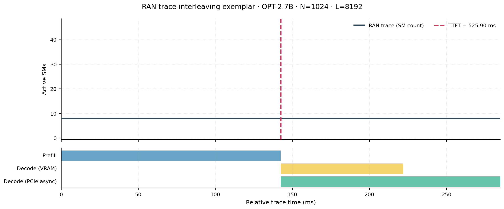
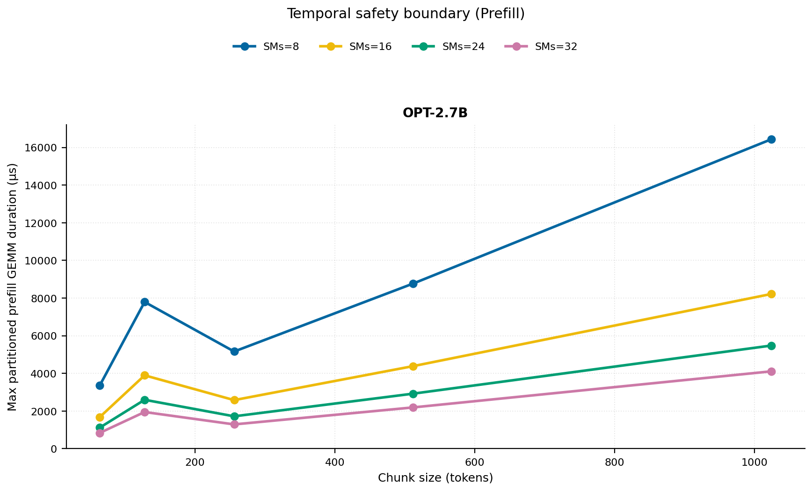
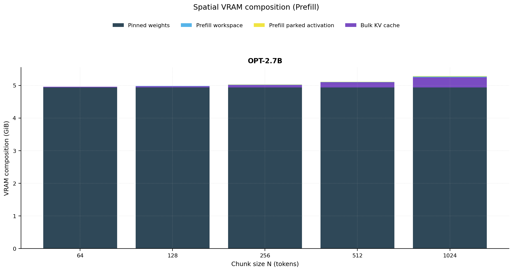
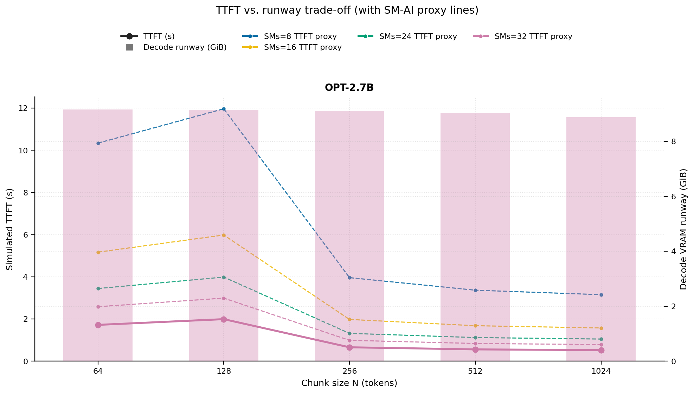
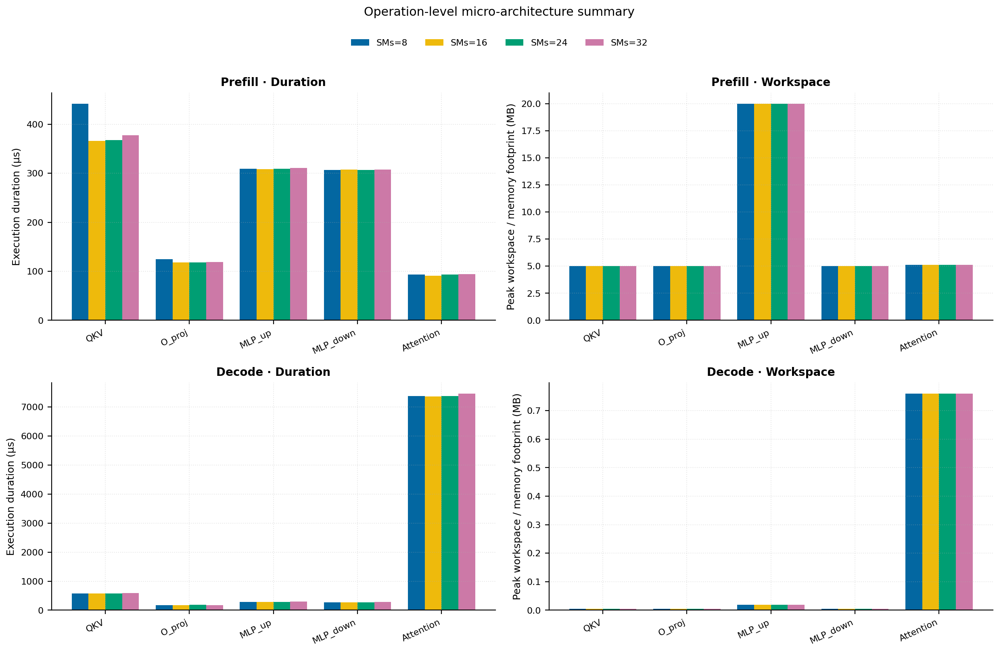
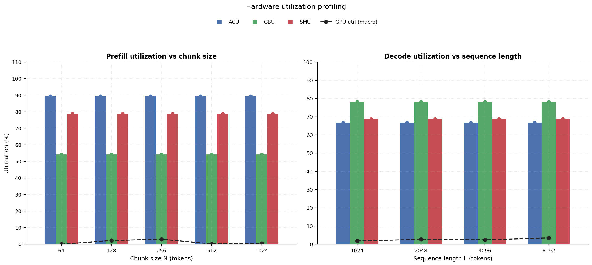
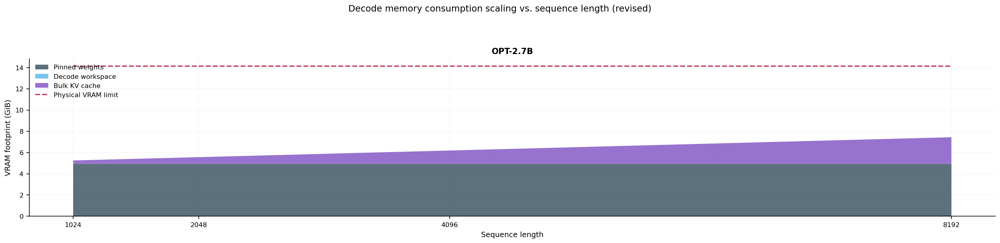
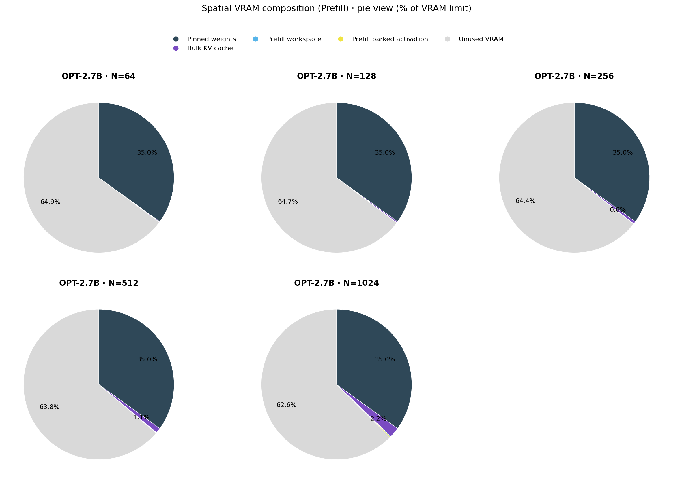

# RAN Inference Profiling Report

Run root: `/mnt/data/dheeraj/dicertation/inference-profile/runs/revised-full-20260414-opt27b-combined`

## Environment

| field | value |
| --- | --- |
| cache_root | n/a |
| captured_at | 2026-04-14T11:52:43Z |
| chunk_sizes | [64, 128, 256] |
| cuda_available | true |
| cuda_device_count | 8 |
| cwd | /mnt/data/dheeraj/dicertation/inference-profile |
| decode_modes | ["vram", "pcie_async"] |
| experiment_type | ran-dgxspark-v1 |
| gpu_id | 4 |
| l_out | 1024 |
| models | ["facebook/opt-2.7b"] |
| platform | Linux-6.8.0-106-generic-x86_64-with-glibc2.35 |
| python_executable | /home/dheeraj/miniconda3/envs/mls/bin/python |
| python_version | 3.11.14 |
| run_root | /mnt/data/dheeraj/dicertation/inference-profile/runs/revised-full-20260414-g4-opt27b-c64-256 |
| scheduler | envelope_v1 |
| schema_version | ran_dgxspark_v1 |
| sequence_lengths | [1024, 2048, 4096, 8192] |
| sm_ai_cap | 32 |
| sm_ai_partition | 100 |
| sm_ai_partitions | [8, 16, 24, 32] |
| stage | profile |
| telemetry_tier | baseline_nvml_pt |
| timed_iterations | 5 |
| torch_available | true |
| torch_version | 2.10.0+cu128 |
| warmup_iterations | 3 |

## Model Constants

| model_id | sm_ai_partition | num_hidden_layers | hidden_size | num_attention_heads | ffn_dim | layer_index | layer_weight_bytes | total_weight_bytes_fp16 | vram_ceiling_bytes |
| --- | --- | --- | --- | --- | --- | --- | --- | --- | --- |
| facebook/opt-2.7b | 100 | 32 | 2560 | 32 | 10240 | 15 | 157352960 | 5303193600 | 15170115993 |

## Trace Inspection

### Primary trace

| field | value |
| --- | --- |
| errors | [] |
| header | ["frame", "slot", "time_slot_sched_ns", "time_decode_start_est_ns", "time_decode_end_est_ns", "time_decode_start_actual_ns", "time_decode_end_actual_ns", "decode_dur_us", "deadline_met", "target_sm", "profile_idx", "sm_count", "num_pusch", "sum_prb", "sum_tbs_bytes", "max_mcs"] |
| median_positive_delta_ms | 5.6997 |
| monotonicity.checked_column | time_slot_sched_ns |
| monotonicity.is_non_decreasing | true |
| monotonicity.negative_delta_count | 0 |
| monotonicity.positive_delta_count | 28377 |
| monotonicity.zero_delta_count | 0 |
| normalization.last_row_duration_policy | median_positive_forward_delta_ms |
| normalization.output_columns | ["time_ms", "sm_utilization", "slot_duration_ms", "source_schema", "sm_count"] |
| normalization.output_relative_path | derived/normalized_ldpc_trace.csv |
| normalized_row_count | 28378 |
| path | /mnt/raid0sata2/netsys/weaver-ext/ran/traces/e2e_2026030418/e2e_20260304_182034_tractor_ran_ctrl/ldpc_trace.csv |
| row_count | 28378 |
| schema_detected | schema_b |
| time_unit_hint | ns |
| usable | true |
| usage_policy | primary_only |
| used_for_scheduler_capacity | true |

### Secondary trace

| field | value |
| --- | --- |
| errors | ["ran_ctrl_trace.csv line 182958 has 9 field(s); expected 12"] |
| header | ["frame", "slot", "sm_available", "prbs_available", "prbs_allocated", "w_avg_mcs_prev", "w_avg_mcs_curr", "slots_since_underutil", "ramp_up_count", "num_ue_sched", "max_ue_backlog", "sum_ue_backlog"] |
| monotonicity.checked_column | n/a |
| monotonicity.is_non_decreasing | n/a |
| monotonicity.negative_delta_count | n/a |
| path | /mnt/raid0sata2/netsys/weaver-ext/ran/traces/e2e_2026030418/e2e_20260304_182034_tractor_ran_ctrl/ran_ctrl_trace.csv |
| row_count | 182956 |
| time_unit_hints | [] |
| usable | false |
| usage_policy | structural_only |
| used_for_scheduler_capacity | false |

## Raw-Profile Summary Tables

### Prefill profile summary

Source raw rows: `raw/prefill_events.csv` = 700. Summary artifact: `derived/prefill_summary.csv`.

| model_id | chunk_tokens | sm_ai_partition | max_input_tokens | prefill_max_gemm_us | prefill_workspace_bytes | prefill_parked_activation_bytes | telemetry_tier | telemetry_provider | telemetry_status | nvml_available | gpu_util | gpu_mem_used_mb | sm_clock_mhz | mem_clock_mhz | power_w | pt_step_ms | pt_mem_alloc_mb | pt_mem_reserved_mb | pt_workspace_mb | acu_pct | gbu_pct | smu_pct | microscopic_telemetry_status | microscopic_error |
| --- | --- | --- | --- | --- | --- | --- | --- | --- | --- | --- | --- | --- | --- | --- | --- | --- | --- | --- | --- | --- | --- | --- | --- | --- |
| facebook/opt-2.7b | 64 | 8 | 1024 | 1783.808 | 1572864 | 1310720 | baseline_nvml_pt | nvidia-smi | ok | true | 0 | 5 | 1695 | 7601 | 60.01 | 1.7838 | 163.4189 | 163.4189 | 1.5 | n/a | n/a | n/a | unavailable | n/a |
| facebook/opt-2.7b | 64 | 16 | 1024 | 134.144 | 1572864 | 1310720 | baseline_nvml_pt | nvidia-smi | ok | true | 0 | 5 | 1695 | 8001 | 60.44 | 0.1341 | 163.4189 | 163.4189 | 1.5 | n/a | n/a | n/a | unavailable | n/a |
| facebook/opt-2.7b | 64 | 24 | 1024 | 130.048 | 1572864 | 1310720 | baseline_nvml_pt | nvidia-smi | ok | true | 0 | 5 | 1695 | 8001 | 60.32 | 0.13 | 163.4189 | 163.4189 | 1.5 | n/a | n/a | n/a | unavailable | n/a |
| facebook/opt-2.7b | 64 | 32 | 1024 | 140.288 | 1572864 | 1310720 | baseline_nvml_pt | nvidia-smi | ok | true | 0 | 5 | 1695 | 7601 | 60.23 | 0.1403 | 163.4189 | 163.4189 | 1.5 | n/a | n/a | n/a | unavailable | n/a |
| facebook/opt-2.7b | 128 | 8 | 1024 | 278.528 | 3538944 | 2621440 | baseline_nvml_pt | nvidia-smi | ok | true | 9 | 5 | 1695 | 7601 | 60.32 | 0.2785 | 167.5439 | 167.5439 | 3.375 | n/a | n/a | n/a | unavailable | n/a |
| facebook/opt-2.7b | 128 | 16 | 1024 | 193.44 | 3538944 | 2621440 | baseline_nvml_pt | nvidia-smi | ok | true | 0 | 5 | 1695 | 7601 | 60.25 | 0.1934 | 167.5439 | 167.5439 | 3.375 | n/a | n/a | n/a | unavailable | n/a |
| facebook/opt-2.7b | 128 | 24 | 1024 | 200.672 | 3538944 | 2621440 | baseline_nvml_pt | nvidia-smi | ok | true | 0 | 5 | 1695 | 7601 | 60.74 | 0.2007 | 167.5439 | 167.5439 | 3.375 | n/a | n/a | n/a | unavailable | n/a |
| facebook/opt-2.7b | 128 | 32 | 1024 | 324.704 | 3538944 | 2621440 | baseline_nvml_pt | nvidia-smi | ok | true | 0 | 5 | 1695 | 7601 | 60.67 | 0.3247 | 167.5439 | 167.5439 | 3.375 | n/a | n/a | n/a | unavailable | n/a |
| facebook/opt-2.7b | 256 | 8 | 1024 | 215.04 | 5242880 | 5242880 | baseline_nvml_pt | nvidia-smi | ok | true | 9 | 5 | 1695 | 7601 | 61.28 | 0.215 | 176.0439 | 176.0439 | 5 | n/a | n/a | n/a | unavailable | n/a |
| facebook/opt-2.7b | 256 | 16 | 1024 | 215.008 | 5242880 | 5242880 | baseline_nvml_pt | nvidia-smi | ok | true | 0 | 5 | 1695 | 7601 | 61.16 | 0.215 | 176.0439 | 176.0439 | 5 | n/a | n/a | n/a | unavailable | n/a |
| facebook/opt-2.7b | 256 | 24 | 1024 | 215.04 | 5242880 | 5242880 | baseline_nvml_pt | nvidia-smi | ok | true | 3 | 5 | 1695 | 7601 | 60.93 | 0.215 | 176.0439 | 176.0439 | 5 | n/a | n/a | n/a | unavailable | n/a |
| facebook/opt-2.7b | 256 | 32 | 1024 | 215.04 | 5242880 | 5242880 | baseline_nvml_pt | nvidia-smi | ok | true | 0 | 5 | 1695 | 7601 | 61.79 | 0.215 | 176.0439 | 176.0439 | 5 | n/a | n/a | n/a | unavailable | n/a |
| facebook/opt-2.7b | 512 | 8 | 1024 | 365.344 | 10485760 | 10485760 | baseline_nvml_pt | nvidia-smi | ok | true | 1 | 5 | 1695 | 7601 | 61.51 | 0.3653 | 189.1689 | 189.1689 | 10 | n/a | n/a | n/a | unavailable | n/a |
| facebook/opt-2.7b | 512 | 16 | 1024 | 364.832 | 10485760 | 10485760 | baseline_nvml_pt | nvidia-smi | ok | true | 0 | 5 | 1695 | 7601 | 61.68 | 0.3648 | 189.1689 | 189.1689 | 10 | n/a | n/a | n/a | unavailable | n/a |
| facebook/opt-2.7b | 512 | 24 | 1024 | 365.6 | 10485760 | 10485760 | baseline_nvml_pt | nvidia-smi | ok | true | 0 | 5 | 1695 | 7601 | 61.75 | 0.3656 | 189.1689 | 189.1689 | 10 | n/a | n/a | n/a | unavailable | n/a |
| facebook/opt-2.7b | 512 | 32 | 1024 | 365.504 | 10485760 | 10485760 | baseline_nvml_pt | nvidia-smi | ok | true | 0 | 5 | 1695 | 7601 | 61.68 | 0.3655 | 189.1689 | 189.1689 | 10 | n/a | n/a | n/a | unavailable | n/a |
| facebook/opt-2.7b | 1024 | 8 | 1024 | 681.792 | 20971520 | 20971520 | baseline_nvml_pt | nvidia-smi | ok | true | 0 | 5 | 1695 | 7601 | 63.73 | 0.6818 | 219.1689 | 219.1689 | 20 | n/a | n/a | n/a | unavailable | n/a |
| facebook/opt-2.7b | 1024 | 16 | 1024 | 699.392 | 20971520 | 20971520 | baseline_nvml_pt | nvidia-smi | ok | true | 0 | 5 | 1695 | 8001 | 63.96 | 0.6994 | 219.1689 | 219.1689 | 20 | n/a | n/a | n/a | unavailable | n/a |
| facebook/opt-2.7b | 1024 | 24 | 1024 | 681.984 | 20971520 | 20971520 | baseline_nvml_pt | nvidia-smi | ok | true | 0 | 5 | 1695 | 7601 | 63.98 | 0.682 | 219.1689 | 219.1689 | 20 | n/a | n/a | n/a | unavailable | n/a |
| facebook/opt-2.7b | 1024 | 32 | 1024 | 684.768 | 20971520 | 20971520 | baseline_nvml_pt | nvidia-smi | ok | true | 2 | 5 | 1695 | 7601 | 64.35 | 0.6848 | 219.1689 | 219.1689 | 20 | n/a | n/a | n/a | unavailable | n/a |

### Decode profile summary

Source raw rows: `raw/decode_events.csv` = 6400. Summary artifact: `derived/decode_summary.csv`.

| model_id | sequence_length | block_size | sm_ai_partition | decode_mode | decode_max_gemv_us | attention_fetch_compute_us | reduction_overhead_us | decode_workspace_bytes | decode_parked_activation_bytes | telemetry_tier | telemetry_provider | telemetry_status | nvml_available | gpu_util | gpu_mem_used_mb | sm_clock_mhz | mem_clock_mhz | power_w | pt_step_ms | pt_mem_alloc_mb | pt_mem_reserved_mb | pt_workspace_mb | acu_pct | gbu_pct | smu_pct | microscopic_telemetry_status | microscopic_error |
| --- | --- | --- | --- | --- | --- | --- | --- | --- | --- | --- | --- | --- | --- | --- | --- | --- | --- | --- | --- | --- | --- | --- | --- | --- | --- | --- | --- |
| facebook/opt-2.7b | 1024 | 64 | 8 | pcie_async | 167.904 | 1784.4224 | 710.4576 | 109056 | 5120 | baseline_nvml_pt | nvidia-smi | ok | true | 0 | 5 | 1695 | 7601 | 60.86 | 1.8022 | 169.1831 | 169.1831 | 0.104 | n/a | n/a | n/a | unavailable | n/a |
| facebook/opt-2.7b | 1024 | 64 | 8 | vram | 178.176 | 1761.2416 | 694.08 | 109056 | 5120 | baseline_nvml_pt | nvidia-smi | ok | true | 0 | 5 | 1695 | 7601 | 60.86 | 1.7887 | 169.1831 | 169.1831 | 0.104 | n/a | n/a | n/a | unavailable | n/a |
| facebook/opt-2.7b | 1024 | 64 | 16 | pcie_async | 175.104 | 1740.608 | 680.7552 | 109056 | 5120 | baseline_nvml_pt | nvidia-smi | ok | true | 0 | 5 | 1695 | 7601 | 61.17 | 1.7706 | 169.1831 | 169.1831 | 0.104 | n/a | n/a | n/a | unavailable | n/a |
| facebook/opt-2.7b | 1024 | 64 | 16 | vram | 174.08 | 1781.3632 | 715.9936 | 109056 | 5120 | baseline_nvml_pt | nvidia-smi | ok | true | 2 | 5 | 1695 | 7601 | 61.38 | 1.8268 | 169.1831 | 169.1831 | 0.104 | n/a | n/a | n/a | unavailable | n/a |
| facebook/opt-2.7b | 1024 | 64 | 24 | pcie_async | 172.032 | 1798.7648 | 730.2912 | 109056 | 5120 | baseline_nvml_pt | nvidia-smi | ok | true | 1 | 5 | 1695 | 7601 | 60.92 | 1.8227 | 169.1831 | 169.1831 | 0.104 | n/a | n/a | n/a | unavailable | n/a |
| facebook/opt-2.7b | 1024 | 64 | 24 | vram | 207.776 | 1829.0688 | 755.0784 | 109056 | 5120 | baseline_nvml_pt | nvidia-smi | ok | true | 0 | 5 | 1695 | 7601 | 60.67 | 1.922 | 169.1831 | 169.1831 | 0.104 | n/a | n/a | n/a | unavailable | n/a |
| facebook/opt-2.7b | 1024 | 64 | 32 | pcie_async | 196.608 | 1792.2176 | 718.6432 | 109056 | 5120 | baseline_nvml_pt | nvidia-smi | ok | true | 0 | 5 | 1695 | 7601 | 61.03 | 1.8104 | 169.1831 | 169.1831 | 0.104 | n/a | n/a | n/a | unavailable | n/a |
| facebook/opt-2.7b | 1024 | 64 | 32 | vram | 188.416 | 1762.304 | 707.168 | 109056 | 5120 | baseline_nvml_pt | nvidia-smi | ok | true | 1 | 5 | 1695 | 7601 | 61.14 | 1.8319 | 169.1831 | 169.1831 | 0.104 | n/a | n/a | n/a | unavailable | n/a |
| facebook/opt-2.7b | 1024 | 128 | 8 | pcie_async | 207.872 | 1037.5168 | 486.4 | 76288 | 5120 | baseline_nvml_pt | nvidia-smi | ok | true | 0 | 5 | 1695 | 7601 | 60.97 | 1.1151 | 169.146 | 169.146 | 0.0728 | n/a | n/a | n/a | unavailable | n/a |
| facebook/opt-2.7b | 1024 | 128 | 8 | vram | 165.888 | 977.6768 | 434.5664 | 76288 | 5120 | baseline_nvml_pt | nvidia-smi | ok | true | 0 | 5 | 1695 | 7601 | 61.19 | 1.0199 | 169.146 | 169.146 | 0.0728 | n/a | n/a | n/a | unavailable | n/a |
| facebook/opt-2.7b | 1024 | 128 | 16 | pcie_async | 156.672 | 970.9696 | 437.8688 | 76288 | 5120 | baseline_nvml_pt | nvidia-smi | ok | true | 4 | 5 | 1695 | 7601 | 61.13 | 0.9943 | 169.146 | 169.146 | 0.0728 | n/a | n/a | n/a | unavailable | n/a |
| facebook/opt-2.7b | 1024 | 128 | 16 | vram | 162.912 | 983.2128 | 441.1968 | 76288 | 5120 | baseline_nvml_pt | nvidia-smi | ok | true | 0 | 5 | 1695 | 7601 | 61.39 | 0.9851 | 169.146 | 169.146 | 0.0728 | n/a | n/a | n/a | unavailable | n/a |
| facebook/opt-2.7b | 1024 | 128 | 24 | pcie_async | 158.72 | 954.9376 | 421.92 | 76288 | 5120 | baseline_nvml_pt | nvidia-smi | ok | true | 0 | 5 | 1695 | 7601 | 61.4 | 0.9717 | 169.146 | 169.146 | 0.0728 | n/a | n/a | n/a | unavailable | n/a |
| facebook/opt-2.7b | 1024 | 128 | 24 | vram | 151.552 | 960.0768 | 411.2512 | 76288 | 5120 | baseline_nvml_pt | nvidia-smi | ok | true | 0 | 5 | 1695 | 8001 | 61.9 | 0.9677 | 169.146 | 169.146 | 0.0728 | n/a | n/a | n/a | unavailable | n/a |
| facebook/opt-2.7b | 1024 | 128 | 32 | pcie_async | 167.936 | 991.008 | 463.232 | 76288 | 5120 | baseline_nvml_pt | nvidia-smi | ok | true | 0 | 5 | 1695 | 7601 | 61.12 | 1.0136 | 169.146 | 169.146 | 0.0728 | n/a | n/a | n/a | unavailable | n/a |
| facebook/opt-2.7b | 1024 | 128 | 32 | vram | 156.544 | 968.0896 | 426.8032 | 76288 | 5120 | baseline_nvml_pt | nvidia-smi | ok | true | 0 | 5 | 1695 | 7601 | 61.26 | 0.9779 | 169.146 | 169.146 | 0.0728 | n/a | n/a | n/a | unavailable | n/a |
| facebook/opt-2.7b | 1024 | 256 | 8 | pcie_async | 163.84 | 536.3584 | 294.6048 | 84480 | 5120 | baseline_nvml_pt | nvidia-smi | ok | true | 8 | 5 | 1695 | 7601 | 61.5 | 0.5458 | 169.1538 | 169.1538 | 0.0806 | n/a | n/a | n/a | unavailable | n/a |
| facebook/opt-2.7b | 1024 | 256 | 8 | vram | 157.696 | 535.1424 | 283.0208 | 84480 | 5120 | baseline_nvml_pt | nvidia-smi | ok | true | 0 | 5 | 1695 | 7601 | 61.35 | 0.5448 | 169.1538 | 169.1538 | 0.0806 | n/a | n/a | n/a | unavailable | n/a |
| facebook/opt-2.7b | 1024 | 256 | 16 | pcie_async | 159.744 | 540.8768 | 294.5472 | 84480 | 5120 | baseline_nvml_pt | nvidia-smi | ok | true | 0 | 5 | 1695 | 7601 | 61.57 | 0.5745 | 169.1538 | 169.1538 | 0.0806 | n/a | n/a | n/a | unavailable | n/a |
| facebook/opt-2.7b | 1024 | 256 | 16 | vram | 155.648 | 549.6512 | 284.64 | 84480 | 5120 | baseline_nvml_pt | nvidia-smi | ok | true | 3 | 5 | 1695 | 7601 | 61.39 | 0.6113 | 169.1538 | 169.1538 | 0.0806 | n/a | n/a | n/a | unavailable | n/a |
| facebook/opt-2.7b | 1024 | 256 | 24 | pcie_async | 154.624 | 536.1728 | 289.1904 | 84480 | 5120 | baseline_nvml_pt | nvidia-smi | ok | true | 0 | 5 | 1695 | 8001 | 62.07 | 0.5468 | 169.1538 | 169.1538 | 0.0806 | n/a | n/a | n/a | unavailable | n/a |
| facebook/opt-2.7b | 1024 | 256 | 24 | vram | 173.056 | 551.488 | 297.3632 | 84480 | 5120 | baseline_nvml_pt | nvidia-smi | ok | true | 8 | 5 | 1695 | 8001 | 61.74 | 0.559 | 169.1538 | 169.1538 | 0.0806 | n/a | n/a | n/a | unavailable | n/a |
| facebook/opt-2.7b | 1024 | 256 | 32 | pcie_async | 163.936 | 532.6912 | 290.816 | 84480 | 5120 | baseline_nvml_pt | nvidia-smi | ok | true | 10 | 5 | 1695 | 7601 | 61.59 | 0.5468 | 169.1538 | 169.1538 | 0.0806 | n/a | n/a | n/a | unavailable | n/a |
| facebook/opt-2.7b | 1024 | 256 | 32 | vram | 167.936 | 543.712 | 289.5488 | 84480 | 5120 | baseline_nvml_pt | nvidia-smi | ok | true | 7 | 5 | 1695 | 8001 | 61.82 | 0.5499 | 169.1538 | 169.1538 | 0.0806 | n/a | n/a | n/a | unavailable | n/a |
| facebook/opt-2.7b | 1024 | 512 | 8 | pcie_async | 149.504 | 298.9696 | 193.2096 | 137728 | 5120 | baseline_nvml_pt | nvidia-smi | ok | true | 0 | 5 | 1695 | 7601 | 61.87 | 0.3043 | 169.2046 | 169.2046 | 0.1313 | n/a | n/a | n/a | unavailable | n/a |
| facebook/opt-2.7b | 1024 | 512 | 8 | vram | 148.48 | 299.7504 | 187.7504 | 137728 | 5120 | baseline_nvml_pt | nvidia-smi | ok | true | 6 | 5 | 1695 | 7601 | 61.27 | 0.3297 | 169.2046 | 169.2046 | 0.1313 | n/a | n/a | n/a | unavailable | n/a |
| facebook/opt-2.7b | 1024 | 512 | 16 | pcie_async | 156.672 | 295.5264 | 197.1584 | 137728 | 5120 | baseline_nvml_pt | nvidia-smi | ok | true | 1 | 5 | 1695 | 7601 | 61.56 | 0.3113 | 169.2046 | 169.2046 | 0.1313 | n/a | n/a | n/a | unavailable | n/a |
| facebook/opt-2.7b | 1024 | 512 | 16 | vram | 147.2 | 283.4688 | 192.0704 | 137728 | 5120 | baseline_nvml_pt | nvidia-smi | ok | true | 6 | 5 | 1695 | 7601 | 61.34 | 0.2991 | 169.2046 | 169.2046 | 0.1313 | n/a | n/a | n/a | unavailable | n/a |
| facebook/opt-2.7b | 1024 | 512 | 24 | pcie_async | 544.64 | 321.0752 | 228.2368 | 137728 | 5120 | baseline_nvml_pt | nvidia-smi | ok | true | 0 | 5 | 1695 | 7601 | 61.86 | 0.5446 | 169.2046 | 169.2046 | 0.1313 | n/a | n/a | n/a | unavailable | n/a |
| facebook/opt-2.7b | 1024 | 512 | 24 | vram | 147.456 | 299.5456 | 194.3296 | 137728 | 5120 | baseline_nvml_pt | nvidia-smi | ok | true | 1 | 5 | 1695 | 7601 | 61.66 | 0.3083 | 169.2046 | 169.2046 | 0.1313 | n/a | n/a | n/a | unavailable | n/a |
| facebook/opt-2.7b | 1024 | 512 | 32 | pcie_async | 152.576 | 292.7872 | 201.3312 | 137728 | 5120 | baseline_nvml_pt | nvidia-smi | ok | true | 0 | 5 | 1695 | 7601 | 61.99 | 0.299 | 169.2046 | 169.2046 | 0.1313 | n/a | n/a | n/a | unavailable | n/a |
| facebook/opt-2.7b | 1024 | 512 | 32 | vram | 157.696 | 299.4432 | 197.7152 | 137728 | 5120 | baseline_nvml_pt | nvidia-smi | ok | true | 0 | 5 | 1695 | 8001 | 62.35 | 0.3218 | 169.2046 | 169.2046 | 0.1313 | n/a | n/a | n/a | unavailable | n/a |
| facebook/opt-2.7b | 1024 | 1024 | 8 | pcie_async | 167.072 | 189.6 | 187.1232 | 197120 | 5120 | baseline_nvml_pt | nvidia-smi | ok | true | 3 | 5 | 1695 | 7601 | 61.87 | 0.214 | 169.2612 | 169.2612 | 0.188 | n/a | n/a | n/a | unavailable | n/a |
| facebook/opt-2.7b | 1024 | 1024 | 8 | vram | 148.48 | 173.6192 | 169.7088 | 197120 | 5120 | baseline_nvml_pt | nvidia-smi | ok | true | 0 | 5 | 1695 | 7601 | 62.29 | 0.178 | 169.2612 | 169.2612 | 0.188 | n/a | n/a | n/a | unavailable | n/a |
| facebook/opt-2.7b | 1024 | 1024 | 16 | pcie_async | 146.432 | 173.9136 | 171.8656 | 197120 | 5120 | baseline_nvml_pt | nvidia-smi | ok | true | 0 | 5 | 1695 | 7601 | 62.26 | 0.1792 | 169.2612 | 169.2612 | 0.188 | n/a | n/a | n/a | unavailable | n/a |
| facebook/opt-2.7b | 1024 | 1024 | 16 | vram | 295.872 | 214.208 | 198.8864 | 197120 | 5120 | baseline_nvml_pt | nvidia-smi | ok | true | 0 | 5 | 1695 | 7601 | 61.97 | 0.2972 | 169.2612 | 169.2612 | 0.188 | n/a | n/a | n/a | unavailable | n/a |
| facebook/opt-2.7b | 1024 | 1024 | 24 | pcie_async | 161.504 | 182.8928 | 174.9184 | 197120 | 5120 | baseline_nvml_pt | nvidia-smi | ok | true | 5 | 5 | 1695 | 7601 | 62.13 | 0.2017 | 169.2612 | 169.2612 | 0.188 | n/a | n/a | n/a | unavailable | n/a |
| facebook/opt-2.7b | 1024 | 1024 | 24 | vram | 147.424 | 188.5696 | 181.5232 | 197120 | 5120 | baseline_nvml_pt | nvidia-smi | ok | true | 0 | 5 | 1695 | 7601 | 62.36 | 0.2028 | 169.2612 | 169.2612 | 0.188 | n/a | n/a | n/a | unavailable | n/a |
| facebook/opt-2.7b | 1024 | 1024 | 32 | pcie_async | 158.72 | 181.7152 | 177.8368 | 197120 | 5120 | baseline_nvml_pt | nvidia-smi | ok | true | 0 | 5 | 1695 | 7601 | 62.31 | 0.1916 | 169.2612 | 169.2612 | 0.188 | n/a | n/a | n/a | unavailable | n/a |
| facebook/opt-2.7b | 1024 | 1024 | 32 | vram | 150.528 | 192.9728 | 195.5648 | 197120 | 5120 | baseline_nvml_pt | nvidia-smi | ok | true | 5 | 5 | 1695 | 8001 | 62.57 | 0.2232 | 169.2612 | 169.2612 | 0.188 | n/a | n/a | n/a | unavailable | n/a |
| facebook/opt-2.7b | 2048 | 64 | 8 | pcie_async | 210.944 | 4918.8608 | 1466.9952 | 207360 | 5120 | baseline_nvml_pt | nvidia-smi | ok | true | 8 | 5 | 1695 | 7601 | 62.37 | 9.8601 | 178.4019 | 178.4019 | 0.1978 | n/a | n/a | n/a | unavailable | n/a |
| facebook/opt-2.7b | 2048 | 64 | 8 | vram | 185.344 | 3754.5984 | 1255.0784 | 207360 | 5120 | baseline_nvml_pt | nvidia-smi | ok | true | 7 | 5 | 1695 | 8001 | 62.47 | 4.9572 | 178.4019 | 178.4019 | 0.1978 | n/a | n/a | n/a | unavailable | n/a |
| facebook/opt-2.7b | 2048 | 64 | 16 | pcie_async | 155.808 | 4195.7376 | 1255.2128 | 207360 | 5120 | baseline_nvml_pt | nvidia-smi | ok | true | 7 | 5 | 1695 | 7601 | 62.29 | 7.1373 | 178.4019 | 178.4019 | 0.1978 | n/a | n/a | n/a | unavailable | n/a |
| facebook/opt-2.7b | 2048 | 64 | 16 | vram | 150.528 | 3563.5263 | 1177.9456 | 207360 | 5120 | baseline_nvml_pt | nvidia-smi | ok | true | 13 | 5 | 1695 | 7601 | 62.06 | 4.5045 | 178.4019 | 178.4019 | 0.1978 | n/a | n/a | n/a | unavailable | n/a |
| facebook/opt-2.7b | 2048 | 64 | 24 | pcie_async | 184.16 | 4293.4272 | 1260.768 | 207360 | 5120 | baseline_nvml_pt | nvidia-smi | ok | true | 0 | 5 | 1695 | 8001 | 62.34 | 7.724 | 178.4019 | 178.4019 | 0.1978 | n/a | n/a | n/a | unavailable | n/a |
| facebook/opt-2.7b | 2048 | 64 | 24 | vram | 164.864 | 3702.9823 | 1241.728 | 207360 | 5120 | baseline_nvml_pt | nvidia-smi | ok | true | 0 | 5 | 1695 | 8001 | 62.28 | 4.9143 | 178.4019 | 178.4019 | 0.1978 | n/a | n/a | n/a | unavailable | n/a |
| facebook/opt-2.7b | 2048 | 64 | 32 | pcie_async | 154.624 | 3826.2912 | 1247.4368 | 207360 | 5120 | baseline_nvml_pt | nvidia-smi | ok | true | 0 | 5 | 1695 | 8001 | 62.37 | 5.3811 | 178.4019 | 178.4019 | 0.1978 | n/a | n/a | n/a | unavailable | n/a |
| facebook/opt-2.7b | 2048 | 64 | 32 | vram | 196.512 | 4292.1984 | 1290.0352 | 207360 | 5120 | baseline_nvml_pt | nvidia-smi | ok | true | 7 | 5 | 1695 | 7601 | 62.02 | 7.595 | 178.4019 | 178.4019 | 0.1978 | n/a | n/a | n/a | unavailable | n/a |
| facebook/opt-2.7b | 2048 | 128 | 8 | pcie_async | 187.392 | 1892.1472 | 746.0736 | 125440 | 5120 | baseline_nvml_pt | nvidia-smi | ok | true | 0 | 5 | 1695 | 7601 | 61.89 | 1.9098 | 178.3179 | 178.3179 | 0.1196 | n/a | n/a | n/a | unavailable | n/a |
| facebook/opt-2.7b | 2048 | 128 | 8 | vram | 152.576 | 1763.9744 | 636.4992 | 125440 | 5120 | baseline_nvml_pt | nvidia-smi | ok | true | 7 | 5 | 1695 | 7601 | 62.17 | 1.792 | 178.3179 | 178.3179 | 0.1196 | n/a | n/a | n/a | unavailable | n/a |
| facebook/opt-2.7b | 2048 | 128 | 16 | pcie_async | 167.936 | 1845.4144 | 695.4816 | 125440 | 5120 | baseline_nvml_pt | nvidia-smi | ok | true | 0 | 5 | 1695 | 7601 | 62.18 | 1.8696 | 178.3179 | 178.3179 | 0.1196 | n/a | n/a | n/a | unavailable | n/a |
| facebook/opt-2.7b | 2048 | 128 | 16 | vram | 157.696 | 1840.7424 | 704.9344 | 125440 | 5120 | baseline_nvml_pt | nvidia-smi | ok | true | 4 | 5 | 1695 | 7601 | 61.85 | 1.8575 | 178.3179 | 178.3179 | 0.1196 | n/a | n/a | n/a | unavailable | n/a |
| facebook/opt-2.7b | 2048 | 128 | 24 | pcie_async | 162.816 | 1848.1024 | 713.3184 | 125440 | 5120 | baseline_nvml_pt | nvidia-smi | ok | true | 0 | 5 | 1695 | 7601 | 62.1 | 1.925 | 178.3179 | 178.3179 | 0.1196 | n/a | n/a | n/a | unavailable | n/a |
| facebook/opt-2.7b | 2048 | 128 | 24 | vram | 153.6 | 1854.6624 | 696.9344 | 125440 | 5120 | baseline_nvml_pt | nvidia-smi | ok | true | 0 | 5 | 1695 | 7601 | 62.19 | 1.8841 | 178.3179 | 178.3179 | 0.1196 | n/a | n/a | n/a | unavailable | n/a |
| facebook/opt-2.7b | 2048 | 128 | 32 | pcie_async | 169.984 | 1874.0928 | 731.3408 | 125440 | 5120 | baseline_nvml_pt | nvidia-smi | ok | true | 0 | 5 | 1695 | 7601 | 62.11 | 1.9025 | 178.3179 | 178.3179 | 0.1196 | n/a | n/a | n/a | unavailable | n/a |
| facebook/opt-2.7b | 2048 | 128 | 32 | vram | 181.248 | 1913.4336 | 748.5696 | 125440 | 5120 | baseline_nvml_pt | nvidia-smi | ok | true | 9 | 5 | 1695 | 7601 | 62.24 | 1.9353 | 178.3179 | 178.3179 | 0.1196 | n/a | n/a | n/a | unavailable | n/a |
| facebook/opt-2.7b | 2048 | 256 | 8 | pcie_async | 161.664 | 973.056 | 425.1968 | 109056 | 5120 | baseline_nvml_pt | nvidia-smi | ok | true | 0 | 5 | 1695 | 7601 | 61.85 | 0.98 | 178.3022 | 178.3022 | 0.104 | n/a | n/a | n/a | unavailable | n/a |
| facebook/opt-2.7b | 2048 | 256 | 8 | vram | 216.064 | 1002.9312 | 450.944 | 109056 | 5120 | baseline_nvml_pt | nvidia-smi | ok | true | 0 | 5 | 1695 | 7601 | 61.91 | 1.0178 | 178.3022 | 178.3022 | 0.104 | n/a | n/a | n/a | unavailable | n/a |
| facebook/opt-2.7b | 2048 | 256 | 16 | pcie_async | 168.96 | 978.7328 | 421.0496 | 109056 | 5120 | baseline_nvml_pt | nvidia-smi | ok | true | 1 | 5 | 1695 | 7601 | 61.96 | 0.9861 | 178.3022 | 178.3022 | 0.104 | n/a | n/a | n/a | unavailable | n/a |
| facebook/opt-2.7b | 2048 | 256 | 16 | vram | 155.648 | 1034.8288 | 537.6064 | 109056 | 5120 | baseline_nvml_pt | nvidia-smi | ok | true | 0 | 5 | 1695 | 7601 | 61.57 | 1.0793 | 178.3022 | 178.3022 | 0.104 | n/a | n/a | n/a | unavailable | n/a |
| facebook/opt-2.7b | 2048 | 256 | 24 | pcie_async | 158.88 | 982.2144 | 443.5776 | 109056 | 5120 | baseline_nvml_pt | nvidia-smi | ok | true | 0 | 5 | 1695 | 7601 | 61.81 | 1.0139 | 178.3022 | 178.3022 | 0.104 | n/a | n/a | n/a | unavailable | n/a |
| facebook/opt-2.7b | 2048 | 256 | 24 | vram | 159.744 | 960.3072 | 420.864 | 109056 | 5120 | baseline_nvml_pt | nvidia-smi | ok | true | 0 | 5 | 1695 | 7601 | 61.66 | 0.9656 | 178.3022 | 178.3022 | 0.104 | n/a | n/a | n/a | unavailable | n/a |
| facebook/opt-2.7b | 2048 | 256 | 32 | pcie_async | 199.68 | 1066.1632 | 490.7456 | 109056 | 5120 | baseline_nvml_pt | nvidia-smi | ok | true | 0 | 5 | 1695 | 8001 | 62.02 | 1.1991 | 178.3022 | 178.3022 | 0.104 | n/a | n/a | n/a | unavailable | n/a |
| facebook/opt-2.7b | 2048 | 256 | 32 | vram | 160.768 | 975.0592 | 427.2384 | 109056 | 5120 | baseline_nvml_pt | nvidia-smi | ok | true | 0 | 5 | 1695 | 7601 | 61.84 | 1.0004 | 178.3022 | 178.3022 | 0.104 | n/a | n/a | n/a | unavailable | n/a |
| facebook/opt-2.7b | 2048 | 512 | 8 | pcie_async | 145.408 | 506.0096 | 256.4736 | 150016 | 5120 | baseline_nvml_pt | nvidia-smi | ok | true | 0 | 5 | 1695 | 7601 | 62.47 | 0.5192 | 178.3413 | 178.3413 | 0.1431 | n/a | n/a | n/a | unavailable | n/a |
| facebook/opt-2.7b | 2048 | 512 | 8 | vram | 148.672 | 524.2048 | 266.4256 | 150016 | 5120 | baseline_nvml_pt | nvidia-smi | ok | true | 7 | 5 | 1695 | 7601 | 62.76 | 0.5436 | 178.3413 | 178.3413 | 0.1431 | n/a | n/a | n/a | unavailable | n/a |
| facebook/opt-2.7b | 2048 | 512 | 16 | pcie_async | 153.6 | 501.7216 | 256.3072 | 150016 | 5120 | baseline_nvml_pt | nvidia-smi | ok | true | 8 | 5 | 1695 | 7601 | 62.5 | 0.5212 | 178.3413 | 178.3413 | 0.1431 | n/a | n/a | n/a | unavailable | n/a |
| facebook/opt-2.7b | 2048 | 512 | 16 | vram | 173.952 | 517.088 | 267.0784 | 150016 | 5120 | baseline_nvml_pt | nvidia-smi | ok | true | 9 | 5 | 1695 | 7601 | 62.83 | 0.5416 | 178.3413 | 178.3413 | 0.1431 | n/a | n/a | n/a | unavailable | n/a |
| facebook/opt-2.7b | 2048 | 512 | 24 | pcie_async | 149.504 | 516.3264 | 274.432 | 150016 | 5120 | baseline_nvml_pt | nvidia-smi | ok | true | 9 | 5 | 1695 | 7601 | 62.18 | 0.5286 | 178.3413 | 178.3413 | 0.1431 | n/a | n/a | n/a | unavailable | n/a |
| facebook/opt-2.7b | 2048 | 512 | 24 | vram | 146.432 | 513.3504 | 258.592 | 150016 | 5120 | baseline_nvml_pt | nvidia-smi | ok | true | 0 | 5 | 1695 | 7601 | 62.35 | 0.5212 | 178.3413 | 178.3413 | 0.1431 | n/a | n/a | n/a | unavailable | n/a |
| facebook/opt-2.7b | 2048 | 512 | 32 | pcie_async | 148.48 | 522.0224 | 261.9328 | 150016 | 5120 | baseline_nvml_pt | nvidia-smi | ok | true | 2 | 5 | 1695 | 7601 | 63.15 | 0.5437 | 178.3413 | 178.3413 | 0.1431 | n/a | n/a | n/a | unavailable | n/a |
| facebook/opt-2.7b | 2048 | 512 | 32 | vram | 194.56 | 618.0928 | 490.08 | 150016 | 5120 | baseline_nvml_pt | nvidia-smi | ok | true | 0 | 5 | 1695 | 7601 | 62.51 | 1.026 | 178.3413 | 178.3413 | 0.1431 | n/a | n/a | n/a | unavailable | n/a |
| facebook/opt-2.7b | 2048 | 1024 | 8 | pcie_async | 147.392 | 292.48 | 190.2528 | 268800 | 5120 | baseline_nvml_pt | nvidia-smi | ok | true | 5 | 5 | 1695 | 7601 | 63.06 | 0.2981 | 178.4546 | 178.4546 | 0.2563 | n/a | n/a | n/a | unavailable | n/a |
| facebook/opt-2.7b | 2048 | 1024 | 8 | vram | 150.528 | 301.664 | 190.8672 | 268800 | 5120 | baseline_nvml_pt | nvidia-smi | ok | true | 0 | 5 | 1695 | 8001 | 63.41 | 0.3103 | 178.4546 | 178.4546 | 0.2563 | n/a | n/a | n/a | unavailable | n/a |
| facebook/opt-2.7b | 2048 | 1024 | 16 | pcie_async | 147.456 | 293.1264 | 194.4704 | 268800 | 5120 | baseline_nvml_pt | nvidia-smi | ok | true | 1 | 5 | 1695 | 7601 | 63.42 | 0.3039 | 178.4546 | 178.4546 | 0.2563 | n/a | n/a | n/a | unavailable | n/a |
| facebook/opt-2.7b | 2048 | 1024 | 16 | vram | 153.6 | 300.16 | 191.0464 | 268800 | 5120 | baseline_nvml_pt | nvidia-smi | ok | true | 2 | 5 | 1695 | 7601 | 63.44 | 0.3029 | 178.4546 | 178.4546 | 0.2563 | n/a | n/a | n/a | unavailable | n/a |
| facebook/opt-2.7b | 2048 | 1024 | 24 | pcie_async | 151.552 | 304.1408 | 199.424 | 268800 | 5120 | baseline_nvml_pt | nvidia-smi | ok | true | 0 | 5 | 1695 | 7601 | 63.12 | 0.3143 | 178.4546 | 178.4546 | 0.2563 | n/a | n/a | n/a | unavailable | n/a |
| facebook/opt-2.7b | 2048 | 1024 | 24 | vram | 149.28 | 292.3072 | 191.232 | 268800 | 5120 | baseline_nvml_pt | nvidia-smi | ok | true | 0 | 5 | 1695 | 7601 | 63.08 | 0.3029 | 178.4546 | 178.4546 | 0.2563 | n/a | n/a | n/a | unavailable | n/a |
| facebook/opt-2.7b | 2048 | 1024 | 32 | pcie_async | 151.648 | 296.6912 | 200.5632 | 268800 | 5120 | baseline_nvml_pt | nvidia-smi | ok | true | 0 | 5 | 1695 | 7601 | 63.36 | 0.3028 | 178.4546 | 178.4546 | 0.2563 | n/a | n/a | n/a | unavailable | n/a |
| facebook/opt-2.7b | 2048 | 1024 | 32 | vram | 164.864 | 303.5712 | 203.744 | 268800 | 5120 | baseline_nvml_pt | nvidia-smi | ok | true | 1 | 5 | 1695 | 7601 | 63.15 | 0.3092 | 178.4546 | 178.4546 | 0.2563 | n/a | n/a | n/a | unavailable | n/a |
| facebook/opt-2.7b | 4096 | 64 | 8 | pcie_async | 149.504 | 6698.4064 | 2324.4801 | 403968 | 5120 | baseline_nvml_pt | nvidia-smi | ok | true | 10 | 5 | 1695 | 7601 | 62.71 | 6.9806 | 198.5894 | 198.5894 | 0.3853 | n/a | n/a | n/a | unavailable | n/a |
| facebook/opt-2.7b | 4096 | 64 | 8 | vram | 194.528 | 6708.6657 | 2319.8015 | 403968 | 5120 | baseline_nvml_pt | nvidia-smi | ok | true | 0 | 5 | 1695 | 8001 | 62.82 | 6.9009 | 198.5894 | 198.5894 | 0.3853 | n/a | n/a | n/a | unavailable | n/a |
| facebook/opt-2.7b | 4096 | 64 | 16 | pcie_async | 188.416 | 7038.144 | 2676.9344 | 403968 | 5120 | baseline_nvml_pt | nvidia-smi | ok | true | 0 | 5 | 1695 | 7601 | 62.64 | 7.2479 | 198.5894 | 198.5894 | 0.3853 | n/a | n/a | n/a | unavailable | n/a |
| facebook/opt-2.7b | 4096 | 64 | 16 | vram | 148.48 | 6621.2288 | 2354.6048 | 403968 | 5120 | baseline_nvml_pt | nvidia-smi | ok | true | 0 | 5 | 1695 | 7601 | 62.72 | 6.7657 | 198.5894 | 198.5894 | 0.3853 | n/a | n/a | n/a | unavailable | n/a |
| facebook/opt-2.7b | 4096 | 64 | 24 | pcie_async | 168.8 | 6774.9761 | 2408.6527 | 403968 | 5120 | baseline_nvml_pt | nvidia-smi | ok | true | 0 | 5 | 1695 | 7601 | 62.26 | 6.8649 | 198.5894 | 198.5894 | 0.3853 | n/a | n/a | n/a | unavailable | n/a |
| facebook/opt-2.7b | 4096 | 64 | 24 | vram | 168.96 | 6926.7455 | 2494.0224 | 403968 | 5120 | baseline_nvml_pt | nvidia-smi | ok | true | 0 | 5 | 1695 | 7601 | 62.68 | 7.0758 | 198.5894 | 198.5894 | 0.3853 | n/a | n/a | n/a | unavailable | n/a |
| facebook/opt-2.7b | 4096 | 64 | 32 | pcie_async | 310.272 | 7232.4991 | 2753.1263 | 403968 | 5120 | baseline_nvml_pt | nvidia-smi | ok | true | 8 | 5 | 1695 | 8001 | 63.13 | 7.3923 | 198.5894 | 198.5894 | 0.3853 | n/a | n/a | n/a | unavailable | n/a |
| facebook/opt-2.7b | 4096 | 64 | 32 | vram | 160.768 | 6734.0096 | 2286.8096 | 403968 | 5120 | baseline_nvml_pt | nvidia-smi | ok | true | 0 | 5 | 1695 | 7601 | 62.92 | 6.9202 | 198.5894 | 198.5894 | 0.3853 | n/a | n/a | n/a | unavailable | n/a |
| facebook/opt-2.7b | 4096 | 128 | 8 | pcie_async | 182.272 | 4172.3904 | 1489.4848 | 223744 | 5120 | baseline_nvml_pt | nvidia-smi | ok | true | 0 | 5 | 1695 | 7601 | 62.8 | 5.5122 | 198.4116 | 198.4116 | 0.2134 | n/a | n/a | n/a | unavailable | n/a |
| facebook/opt-2.7b | 4096 | 128 | 8 | vram | 238.624 | 5001.0047 | 1325.0816 | 223744 | 5120 | baseline_nvml_pt | nvidia-smi | ok | true | 0 | 5 | 1695 | 7601 | 62.76 | 10.026 | 198.4116 | 198.4116 | 0.2134 | n/a | n/a | n/a | unavailable | n/a |
| facebook/opt-2.7b | 4096 | 128 | 16 | pcie_async | 160.576 | 4419.1617 | 1248.6656 | 223744 | 5120 | baseline_nvml_pt | nvidia-smi | ok | true | 3 | 5 | 1695 | 7601 | 62.39 | 7.4516 | 198.4116 | 198.4116 | 0.2134 | n/a | n/a | n/a | unavailable | n/a |
| facebook/opt-2.7b | 4096 | 128 | 16 | vram | 178.176 | 3921.3056 | 1287.168 | 223744 | 5120 | baseline_nvml_pt | nvidia-smi | ok | true | 5 | 5 | 1695 | 7601 | 62.24 | 5.0012 | 198.4116 | 198.4116 | 0.2134 | n/a | n/a | n/a | unavailable | n/a |
| facebook/opt-2.7b | 4096 | 128 | 24 | pcie_async | 375.808 | 4430.656 | 1284.8768 | 223744 | 5120 | baseline_nvml_pt | nvidia-smi | ok | true | 7 | 5 | 1695 | 7601 | 62.05 | 7.7396 | 198.4116 | 198.4116 | 0.2134 | n/a | n/a | n/a | unavailable | n/a |
| facebook/opt-2.7b | 4096 | 128 | 24 | vram | 155.648 | 4462.1376 | 1264 | 223744 | 5120 | baseline_nvml_pt | nvidia-smi | ok | true | 0 | 5 | 1695 | 7601 | 62.11 | 7.9954 | 198.4116 | 198.4116 | 0.2134 | n/a | n/a | n/a | unavailable | n/a |
| facebook/opt-2.7b | 4096 | 128 | 32 | pcie_async | 169.984 | 3912.6976 | 1246.8416 | 223744 | 5120 | baseline_nvml_pt | nvidia-smi | ok | true | 0 | 5 | 1695 | 8001 | 62.54 | 5.1999 | 198.4116 | 198.4116 | 0.2134 | n/a | n/a | n/a | unavailable | n/a |
| facebook/opt-2.7b | 4096 | 128 | 32 | vram | 170.88 | 4502.9376 | 1295.5328 | 223744 | 5120 | baseline_nvml_pt | nvidia-smi | ok | true | 0 | 5 | 1695 | 7601 | 62.03 | 7.7435 | 198.4116 | 198.4116 | 0.2134 | n/a | n/a | n/a | unavailable | n/a |
| facebook/opt-2.7b | 4096 | 256 | 8 | pcie_async | 191.488 | 1993.1264 | 818.1696 | 158208 | 5120 | baseline_nvml_pt | nvidia-smi | ok | true | 0 | 5 | 1695 | 7601 | 62.24 | 2.0142 | 198.3491 | 198.3491 | 0.1509 | n/a | n/a | n/a | unavailable | n/a |
| facebook/opt-2.7b | 4096 | 256 | 8 | vram | 226.304 | 2003.9744 | 806.528 | 158208 | 5120 | baseline_nvml_pt | nvidia-smi | ok | true | 8 | 5 | 1695 | 7601 | 62.01 | 2.0224 | 198.3491 | 198.3491 | 0.1509 | n/a | n/a | n/a | unavailable | n/a |
| facebook/opt-2.7b | 4096 | 256 | 16 | pcie_async | 274.336 | 1885.376 | 689.3952 | 158208 | 5120 | baseline_nvml_pt | nvidia-smi | ok | true | 7 | 5 | 1695 | 8001 | 62.42 | 1.9885 | 198.3491 | 198.3491 | 0.1509 | n/a | n/a | n/a | unavailable | n/a |
| facebook/opt-2.7b | 4096 | 256 | 16 | vram | 170.848 | 1821.2608 | 686.2592 | 158208 | 5120 | baseline_nvml_pt | nvidia-smi | ok | true | 7 | 5 | 1695 | 8001 | 62.38 | 1.8369 | 198.3491 | 198.3491 | 0.1509 | n/a | n/a | n/a | unavailable | n/a |
| facebook/opt-2.7b | 4096 | 256 | 24 | pcie_async | 157.696 | 1878.4256 | 668.8832 | 158208 | 5120 | baseline_nvml_pt | nvidia-smi | ok | true | 7 | 5 | 1695 | 8001 | 62.55 | 2.0613 | 198.3491 | 198.3491 | 0.1509 | n/a | n/a | n/a | unavailable | n/a |
| facebook/opt-2.7b | 4096 | 256 | 24 | vram | 162.816 | 1906.2912 | 716.5952 | 158208 | 5120 | baseline_nvml_pt | nvidia-smi | ok | true | 0 | 5 | 1695 | 7601 | 62.32 | 2.0941 | 198.3491 | 198.3491 | 0.1509 | n/a | n/a | n/a | unavailable | n/a |
| facebook/opt-2.7b | 4096 | 256 | 32 | pcie_async | 165.888 | 1856.3136 | 717.248 | 158208 | 5120 | baseline_nvml_pt | nvidia-smi | ok | true | 0 | 5 | 1695 | 7601 | 62.47 | 1.8811 | 198.3491 | 198.3491 | 0.1509 | n/a | n/a | n/a | unavailable | n/a |
| facebook/opt-2.7b | 4096 | 256 | 32 | vram | 152.576 | 1868.96 | 721.12 | 158208 | 5120 | baseline_nvml_pt | nvidia-smi | ok | true | 0 | 5 | 1695 | 7601 | 62.04 | 1.8995 | 198.3491 | 198.3491 | 0.1509 | n/a | n/a | n/a | unavailable | n/a |
| facebook/opt-2.7b | 4096 | 512 | 8 | pcie_async | 150.272 | 970.7712 | 414.9248 | 174592 | 5120 | baseline_nvml_pt | nvidia-smi | ok | true | 9 | 5 | 1695 | 7601 | 63.49 | 0.9841 | 198.3647 | 198.3647 | 0.1665 | n/a | n/a | n/a | unavailable | n/a |
| facebook/opt-2.7b | 4096 | 512 | 8 | vram | 147.456 | 951.5008 | 393.3568 | 174592 | 5120 | baseline_nvml_pt | nvidia-smi | ok | true | 0 | 5 | 1695 | 7601 | 63.88 | 0.9615 | 198.3647 | 198.3647 | 0.1665 | n/a | n/a | n/a | unavailable | n/a |
| facebook/opt-2.7b | 4096 | 512 | 16 | pcie_async | 147.456 | 939.4816 | 386.1952 | 174592 | 5120 | baseline_nvml_pt | nvidia-smi | ok | true | 2 | 5 | 1695 | 7601 | 63.85 | 0.9492 | 198.3647 | 198.3647 | 0.1665 | n/a | n/a | n/a | unavailable | n/a |
| facebook/opt-2.7b | 4096 | 512 | 16 | vram | 168.096 | 1002.7072 | 438.016 | 174592 | 5120 | baseline_nvml_pt | nvidia-smi | ok | true | 7 | 5 | 1695 | 7601 | 63.17 | 1.0189 | 198.3647 | 198.3647 | 0.1665 | n/a | n/a | n/a | unavailable | n/a |
| facebook/opt-2.7b | 4096 | 512 | 24 | pcie_async | 148.416 | 964.5952 | 414.4512 | 174592 | 5120 | baseline_nvml_pt | nvidia-smi | ok | true | 0 | 5 | 1695 | 7601 | 63.42 | 0.9778 | 198.3647 | 198.3647 | 0.1665 | n/a | n/a | n/a | unavailable | n/a |
| facebook/opt-2.7b | 4096 | 512 | 24 | vram | 149.44 | 1016.4096 | 418.7712 | 174592 | 5120 | baseline_nvml_pt | nvidia-smi | ok | true | 0 | 5 | 1695 | 7601 | 63.75 | 1.1837 | 198.3647 | 198.3647 | 0.1665 | n/a | n/a | n/a | unavailable | n/a |
| facebook/opt-2.7b | 4096 | 512 | 32 | pcie_async | 145.408 | 919.168 | 379.2896 | 174592 | 5120 | baseline_nvml_pt | nvidia-smi | ok | true | 2 | 5 | 1695 | 7601 | 63.72 | 0.9247 | 198.3647 | 198.3647 | 0.1665 | n/a | n/a | n/a | unavailable | n/a |
| facebook/opt-2.7b | 4096 | 512 | 32 | vram | 147.456 | 943.9168 | 392.4032 | 174592 | 5120 | baseline_nvml_pt | nvidia-smi | ok | true | 7 | 5 | 1695 | 7601 | 63.42 | 0.9656 | 198.3647 | 198.3647 | 0.1665 | n/a | n/a | n/a | unavailable | n/a |
| facebook/opt-2.7b | 4096 | 1024 | 8 | pcie_async | 148.48 | 509.952 | 264.32 | 281088 | 5120 | baseline_nvml_pt | nvidia-smi | ok | true | 0 | 5 | 1695 | 7601 | 63.56 | 0.5192 | 198.4663 | 198.4663 | 0.2681 | n/a | n/a | n/a | unavailable | n/a |
| facebook/opt-2.7b | 4096 | 1024 | 8 | vram | 146.336 | 501.3376 | 252.4736 | 281088 | 5120 | baseline_nvml_pt | nvidia-smi | ok | true | 0 | 5 | 1695 | 7601 | 63.23 | 0.5089 | 198.4663 | 198.4663 | 0.2681 | n/a | n/a | n/a | unavailable | n/a |
| facebook/opt-2.7b | 4096 | 1024 | 16 | pcie_async | 146.304 | 521.856 | 261.5296 | 281088 | 5120 | baseline_nvml_pt | nvidia-smi | ok | true | 0 | 5 | 1695 | 7601 | 63.78 | 0.5325 | 198.4663 | 198.4663 | 0.2681 | n/a | n/a | n/a | unavailable | n/a |
| facebook/opt-2.7b | 4096 | 1024 | 16 | vram | 151.68 | 515.9488 | 264.8064 | 281088 | 5120 | baseline_nvml_pt | nvidia-smi | ok | true | 7 | 5 | 1695 | 7601 | 63.51 | 0.5256 | 198.4663 | 198.4663 | 0.2681 | n/a | n/a | n/a | unavailable | n/a |
| facebook/opt-2.7b | 4096 | 1024 | 24 | pcie_async | 148.48 | 516.064 | 275.0592 | 281088 | 5120 | baseline_nvml_pt | nvidia-smi | ok | true | 0 | 5 | 1695 | 7601 | 63.73 | 0.5315 | 198.4663 | 198.4663 | 0.2681 | n/a | n/a | n/a | unavailable | n/a |
| facebook/opt-2.7b | 4096 | 1024 | 24 | vram | 148.256 | 519.328 | 267.68 | 281088 | 5120 | baseline_nvml_pt | nvidia-smi | ok | true | 0 | 5 | 1695 | 7601 | 63.66 | 0.5346 | 198.4663 | 198.4663 | 0.2681 | n/a | n/a | n/a | unavailable | n/a |
| facebook/opt-2.7b | 4096 | 1024 | 32 | pcie_async | 157.696 | 516.096 | 258.0288 | 281088 | 5120 | baseline_nvml_pt | nvidia-smi | ok | true | 0 | 5 | 1695 | 7601 | 64.09 | 0.5284 | 198.4663 | 198.4663 | 0.2681 | n/a | n/a | n/a | unavailable | n/a |
| facebook/opt-2.7b | 4096 | 1024 | 32 | vram | 146.432 | 516.7552 | 262.3552 | 281088 | 5120 | baseline_nvml_pt | nvidia-smi | ok | true | 0 | 5 | 1695 | 7601 | 63.74 | 0.5212 | 198.4663 | 198.4663 | 0.2681 | n/a | n/a | n/a | unavailable | n/a |
| facebook/opt-2.7b | 8192 | 64 | 8 | pcie_async | 171.968 | 13291.7694 | 4697.4848 | 797184 | 5120 | baseline_nvml_pt | nvidia-smi | ok | true | 0 | 5 | 1695 | 7601 | 62.63 | 13.4472 | 238.9644 | 238.9644 | 0.7603 | n/a | n/a | n/a | unavailable | n/a |
| facebook/opt-2.7b | 8192 | 64 | 8 | vram | 169.984 | 13042.112 | 4504.3905 | 797184 | 5120 | baseline_nvml_pt | nvidia-smi | ok | true | 0 | 5 | 1695 | 7601 | 63.16 | 13.2567 | 238.9644 | 238.9644 | 0.7603 | n/a | n/a | n/a | unavailable | n/a |
| facebook/opt-2.7b | 8192 | 64 | 16 | pcie_async | 254.976 | 14132.2433 | 5301.248 | 797184 | 5120 | baseline_nvml_pt | nvidia-smi | ok | true | 0 | 5 | 1695 | 7601 | 63.06 | 14.3043 | 238.9644 | 238.9644 | 0.7603 | n/a | n/a | n/a | unavailable | n/a |
| facebook/opt-2.7b | 8192 | 64 | 16 | vram | 191.488 | 13629.8433 | 4949.2161 | 797184 | 5120 | baseline_nvml_pt | nvidia-smi | ok | true | 23 | 5 | 1695 | 7601 | 62.71 | 13.8475 | 238.9644 | 238.9644 | 0.7603 | n/a | n/a | n/a | unavailable | n/a |
| facebook/opt-2.7b | 8192 | 64 | 24 | pcie_async | 179.2 | 13486.8607 | 4723.6672 | 797184 | 5120 | baseline_nvml_pt | nvidia-smi | ok | true | 25 | 5 | 1695 | 7601 | 62.64 | 13.6745 | 238.9644 | 238.9644 | 0.7603 | n/a | n/a | n/a | unavailable | n/a |
| facebook/opt-2.7b | 8192 | 64 | 24 | vram | 186.368 | 14123.0082 | 5393.2032 | 797184 | 5120 | baseline_nvml_pt | nvidia-smi | ok | true | 0 | 5 | 1695 | 7601 | 63.14 | 14.3462 | 238.9644 | 238.9644 | 0.7603 | n/a | n/a | n/a | unavailable | n/a |
| facebook/opt-2.7b | 8192 | 64 | 32 | pcie_async | 434.176 | 13707.885 | 4822.816 | 797184 | 5120 | baseline_nvml_pt | nvidia-smi | ok | true | 0 | 5 | 1695 | 7601 | 63.33 | 14.212 | 238.9644 | 238.9644 | 0.7603 | n/a | n/a | n/a | unavailable | n/a |
| facebook/opt-2.7b | 8192 | 64 | 32 | vram | 229.376 | 13847.5264 | 4806.24 | 797184 | 5120 | baseline_nvml_pt | nvidia-smi | ok | true | 0 | 5 | 1695 | 7601 | 62.79 | 14.2807 | 238.9644 | 238.9644 | 0.7603 | n/a | n/a | n/a | unavailable | n/a |
| facebook/opt-2.7b | 8192 | 128 | 8 | pcie_async | 182.272 | 7277.3887 | 2426.4704 | 420352 | 5120 | baseline_nvml_pt | nvidia-smi | ok | true | 0 | 5 | 1695 | 7601 | 62.38 | 8.1889 | 238.5991 | 238.5991 | 0.4009 | n/a | n/a | n/a | unavailable | n/a |
| facebook/opt-2.7b | 8192 | 128 | 8 | vram | 156.512 | 6786.4575 | 2182.1184 | 420352 | 5120 | baseline_nvml_pt | nvidia-smi | ok | true | 6 | 5 | 1695 | 7601 | 62.56 | 7.0277 | 238.5991 | 238.5991 | 0.4009 | n/a | n/a | n/a | unavailable | n/a |
| facebook/opt-2.7b | 8192 | 128 | 16 | pcie_async | 180.224 | 7028.5312 | 2409.4592 | 420352 | 5120 | baseline_nvml_pt | nvidia-smi | ok | true | 11 | 5 | 1695 | 7601 | 62.73 | 7.2028 | 238.5991 | 238.5991 | 0.4009 | n/a | n/a | n/a | unavailable | n/a |
| facebook/opt-2.7b | 8192 | 128 | 16 | vram | 192.512 | 7508.7873 | 2772.992 | 420352 | 5120 | baseline_nvml_pt | nvidia-smi | ok | true | 7 | 5 | 1695 | 8001 | 63.3 | 7.6882 | 238.5991 | 238.5991 | 0.4009 | n/a | n/a | n/a | unavailable | n/a |
| facebook/opt-2.7b | 8192 | 128 | 24 | pcie_async | 155.584 | 7429.7344 | 2456.3584 | 420352 | 5120 | baseline_nvml_pt | nvidia-smi | ok | true | 0 | 5 | 1695 | 7601 | 62.36 | 7.8878 | 238.5991 | 238.5991 | 0.4009 | n/a | n/a | n/a | unavailable | n/a |
| facebook/opt-2.7b | 8192 | 128 | 24 | vram | 265.216 | 7063.9424 | 2444.288 | 420352 | 5120 | baseline_nvml_pt | nvidia-smi | ok | true | 0 | 5 | 1695 | 7601 | 62.59 | 7.2817 | 238.5991 | 238.5991 | 0.4009 | n/a | n/a | n/a | unavailable | n/a |
| facebook/opt-2.7b | 8192 | 128 | 32 | pcie_async | 192.512 | 7563.2639 | 2645.4016 | 420352 | 5120 | baseline_nvml_pt | nvidia-smi | ok | true | 0 | 5 | 1695 | 7601 | 62.73 | 7.9831 | 238.5991 | 238.5991 | 0.4009 | n/a | n/a | n/a | unavailable | n/a |
| facebook/opt-2.7b | 8192 | 128 | 32 | vram | 213.952 | 7211.2193 | 2583.3536 | 420352 | 5120 | baseline_nvml_pt | nvidia-smi | ok | true | 21 | 5 | 1695 | 7601 | 62.54 | 7.38 | 238.5991 | 238.5991 | 0.4009 | n/a | n/a | n/a | unavailable | n/a |
| facebook/opt-2.7b | 8192 | 256 | 8 | pcie_async | 153.6 | 4805.4336 | 1286.336 | 256512 | 5120 | baseline_nvml_pt | nvidia-smi | ok | true | 0 | 5 | 1695 | 7601 | 61.95 | 9.7526 | 238.4429 | 238.4429 | 0.2446 | n/a | n/a | n/a | unavailable | n/a |
| facebook/opt-2.7b | 8192 | 256 | 8 | vram | 165.888 | 5136.3841 | 1469.0304 | 256512 | 5120 | baseline_nvml_pt | nvidia-smi | ok | true | 0 | 5 | 1695 | 8001 | 62.76 | 10.111 | 238.4429 | 238.4429 | 0.2446 | n/a | n/a | n/a | unavailable | n/a |
| facebook/opt-2.7b | 8192 | 256 | 16 | pcie_async | 203.776 | 4581.1584 | 1206.88 | 256512 | 5120 | baseline_nvml_pt | nvidia-smi | ok | true | 0 | 5 | 1695 | 7601 | 62.16 | 8.7726 | 238.4429 | 238.4429 | 0.2446 | n/a | n/a | n/a | unavailable | n/a |
| facebook/opt-2.7b | 8192 | 256 | 16 | vram | 154.624 | 3928.6592 | 1197.0432 | 256512 | 5120 | baseline_nvml_pt | nvidia-smi | ok | true | 0 | 5 | 1695 | 7601 | 62.07 | 5.3238 | 238.4429 | 238.4429 | 0.2446 | n/a | n/a | n/a | unavailable | n/a |
| facebook/opt-2.7b | 8192 | 256 | 24 | pcie_async | 148.48 | 4174.5856 | 1220.4736 | 256512 | 5120 | baseline_nvml_pt | nvidia-smi | ok | true | 0 | 5 | 1695 | 7601 | 62.61 | 7.0328 | 238.4429 | 238.4429 | 0.2446 | n/a | n/a | n/a | unavailable | n/a |
| facebook/opt-2.7b | 8192 | 256 | 24 | vram | 165.888 | 4294.0416 | 1274.2656 | 256512 | 5120 | baseline_nvml_pt | nvidia-smi | ok | true | 18 | 5 | 1695 | 7601 | 62.19 | 7.3021 | 238.4429 | 238.4429 | 0.2446 | n/a | n/a | n/a | unavailable | n/a |
| facebook/opt-2.7b | 8192 | 256 | 32 | pcie_async | 197.824 | 4270.9312 | 1311.3344 | 256512 | 5120 | baseline_nvml_pt | nvidia-smi | ok | true | 0 | 5 | 1695 | 7601 | 61.94 | 6.955 | 238.4429 | 238.4429 | 0.2446 | n/a | n/a | n/a | unavailable | n/a |
| facebook/opt-2.7b | 8192 | 256 | 32 | vram | 150.528 | 4890.6304 | 1404.9536 | 256512 | 5120 | baseline_nvml_pt | nvidia-smi | ok | true | 0 | 5 | 1695 | 7601 | 62.21 | 9.6636 | 238.4429 | 238.4429 | 0.2446 | n/a | n/a | n/a | unavailable | n/a |
| facebook/opt-2.7b | 8192 | 512 | 8 | pcie_async | 155.68 | 1767.6224 | 643.52 | 223744 | 5120 | baseline_nvml_pt | nvidia-smi | ok | true | 0 | 5 | 1695 | 8001 | 64.57 | 1.8092 | 238.4116 | 238.4116 | 0.2134 | n/a | n/a | n/a | unavailable | n/a |
| facebook/opt-2.7b | 8192 | 512 | 8 | vram | 151.552 | 1802.4128 | 675.4944 | 223744 | 5120 | baseline_nvml_pt | nvidia-smi | ok | true | 0 | 5 | 1695 | 7601 | 64.1 | 1.8422 | 238.4116 | 238.4116 | 0.2134 | n/a | n/a | n/a | unavailable | n/a |
| facebook/opt-2.7b | 8192 | 512 | 16 | pcie_async | 145.408 | 1831.7952 | 661.5872 | 223744 | 5120 | baseline_nvml_pt | nvidia-smi | ok | true | 0 | 5 | 1695 | 8001 | 64.18 | 1.8587 | 238.4116 | 238.4116 | 0.2134 | n/a | n/a | n/a | unavailable | n/a |
| facebook/opt-2.7b | 8192 | 512 | 16 | vram | 149.504 | 1810.9312 | 690.3296 | 223744 | 5120 | baseline_nvml_pt | nvidia-smi | ok | true | 0 | 5 | 1695 | 7601 | 63.62 | 1.8452 | 238.4116 | 238.4116 | 0.2134 | n/a | n/a | n/a | unavailable | n/a |
| facebook/opt-2.7b | 8192 | 512 | 24 | pcie_async | 149.728 | 1801.0304 | 667.7376 | 223744 | 5120 | baseline_nvml_pt | nvidia-smi | ok | true | 5 | 5 | 1695 | 8001 | 63.92 | 1.8258 | 238.4116 | 238.4116 | 0.2134 | n/a | n/a | n/a | unavailable | n/a |
| facebook/opt-2.7b | 8192 | 512 | 24 | vram | 151.552 | 1819.8144 | 671.3664 | 223744 | 5120 | baseline_nvml_pt | nvidia-smi | ok | true | 2 | 5 | 1695 | 7601 | 63.88 | 1.8371 | 238.4116 | 238.4116 | 0.2134 | n/a | n/a | n/a | unavailable | n/a |
| facebook/opt-2.7b | 8192 | 512 | 32 | pcie_async | 154.624 | 1872.5184 | 742.5728 | 223744 | 5120 | baseline_nvml_pt | nvidia-smi | ok | true | 0 | 5 | 1695 | 7601 | 63.81 | 1.9139 | 238.4116 | 238.4116 | 0.2134 | n/a | n/a | n/a | unavailable | n/a |
| facebook/opt-2.7b | 8192 | 512 | 32 | vram | 248.992 | 1820.0448 | 667.8144 | 223744 | 5120 | baseline_nvml_pt | nvidia-smi | ok | true | 0 | 5 | 1695 | 7601 | 64.07 | 1.8371 | 238.4116 | 238.4116 | 0.2134 | n/a | n/a | n/a | unavailable | n/a |
| facebook/opt-2.7b | 8192 | 1024 | 8 | pcie_async | 152.576 | 998.6048 | 405.856 | 305664 | 5120 | baseline_nvml_pt | nvidia-smi | ok | true | 0 | 5 | 1695 | 7601 | 64.25 | 1.1254 | 238.4897 | 238.4897 | 0.2915 | n/a | n/a | n/a | unavailable | n/a |
| facebook/opt-2.7b | 8192 | 1024 | 8 | vram | 161.856 | 959.0912 | 414.272 | 305664 | 5120 | baseline_nvml_pt | nvidia-smi | ok | true | 7 | 5 | 1695 | 7601 | 63.74 | 0.9779 | 238.4897 | 238.4897 | 0.2915 | n/a | n/a | n/a | unavailable | n/a |
| facebook/opt-2.7b | 8192 | 1024 | 16 | pcie_async | 147.456 | 986.1376 | 394.1376 | 305664 | 5120 | baseline_nvml_pt | nvidia-smi | ok | true | 5 | 5 | 1695 | 7601 | 63.4 | 1.1008 | 238.4897 | 238.4897 | 0.2915 | n/a | n/a | n/a | unavailable | n/a |
| facebook/opt-2.7b | 8192 | 1024 | 16 | vram | 150.464 | 964.4288 | 393.5616 | 305664 | 5120 | baseline_nvml_pt | nvidia-smi | ok | true | 0 | 5 | 1695 | 8001 | 64.26 | 0.9851 | 238.4897 | 238.4897 | 0.2915 | n/a | n/a | n/a | unavailable | n/a |
| facebook/opt-2.7b | 8192 | 1024 | 24 | pcie_async | 152.576 | 905.2736 | 380.4352 | 305664 | 5120 | baseline_nvml_pt | nvidia-smi | ok | true | 2 | 5 | 1695 | 7601 | 63.79 | 0.9166 | 238.4897 | 238.4897 | 0.2915 | n/a | n/a | n/a | unavailable | n/a |
| facebook/opt-2.7b | 8192 | 1024 | 24 | vram | 147.456 | 943.5456 | 387.4688 | 305664 | 5120 | baseline_nvml_pt | nvidia-smi | ok | true | 0 | 5 | 1695 | 7601 | 63.65 | 0.9492 | 238.4897 | 238.4897 | 0.2915 | n/a | n/a | n/a | unavailable | n/a |
| facebook/opt-2.7b | 8192 | 1024 | 32 | pcie_async | 153.568 | 951.2 | 387.5712 | 305664 | 5120 | baseline_nvml_pt | nvidia-smi | ok | true | 7 | 5 | 1695 | 7601 | 63.75 | 0.9605 | 238.4897 | 238.4897 | 0.2915 | n/a | n/a | n/a | unavailable | n/a |
| facebook/opt-2.7b | 8192 | 1024 | 32 | vram | 161.792 | 1075.072 | 434.7968 | 305664 | 5120 | baseline_nvml_pt | nvidia-smi | ok | true | 0 | 5 | 1695 | 7601 | 64.01 | 1.3857 | 238.4897 | 238.4897 | 0.2915 | n/a | n/a | n/a | unavailable | n/a |

### PCIe profile summary

Source raw rows: `raw/pcie_events.csv` = 25. Summary artifact: `derived/pcie_summary.csv`.

| model_id | block_size | kv_block_bytes | transfer_only_us | overlap_total_us | dummy_compute_us | exposed_transfer_us | effective_gbps | overlap_status | telemetry_tier | telemetry_provider | telemetry_status | nvml_available | gpu_util | gpu_mem_used_mb | sm_clock_mhz | mem_clock_mhz | power_w | pt_step_ms | pt_mem_alloc_mb | pt_mem_reserved_mb | pt_workspace_mb | acu_pct | gbu_pct | smu_pct | microscopic_telemetry_status | microscopic_error |
| --- | --- | --- | --- | --- | --- | --- | --- | --- | --- | --- | --- | --- | --- | --- | --- | --- | --- | --- | --- | --- | --- | --- | --- | --- | --- | --- |
| facebook/opt-2.7b | 64 | 655360 | 237.7152 | 30718.7721 | 30452.5306 | 266.2416 | 2.7569 | measured | baseline_nvml_pt | nvidia-smi | partial | true | 0 | 5 | 1695 | 7601 | 57.71 | n/a | n/a | n/a | n/a | n/a | n/a | n/a | unavailable | n/a |
| facebook/opt-2.7b | 128 | 1310720 | 706.176 | 43121.2162 | 42768.3846 | 352.8315 | 1.8561 | measured | baseline_nvml_pt | nvidia-smi | partial | true | 1 | 5 | 1695 | 7601 | 57.96 | n/a | n/a | n/a | n/a | n/a | n/a | n/a | unavailable | n/a |
| facebook/opt-2.7b | 256 | 2621440 | 923.5712 | 36402.7893 | 33279.7952 | 3122.9941 | 2.8384 | measured | baseline_nvml_pt | nvidia-smi | partial | true | 0 | 5 | 1695 | 7601 | 53.32 | n/a | n/a | n/a | n/a | n/a | n/a | n/a | unavailable | n/a |
| facebook/opt-2.7b | 512 | 5242880 | 4847.6672 | 44027.6937 | 43414.5272 | 613.1666 | 1.0815 | measured | baseline_nvml_pt | nvidia-smi | partial | true | 9 | 5 | 1695 | 7601 | 63.88 | n/a | n/a | n/a | n/a | n/a | n/a | n/a | unavailable | n/a |
| facebook/opt-2.7b | 1024 | 10485760 | 22270.4453 | 37710.3821 | 31851.1095 | 5859.2726 | 0.4708 | measured | baseline_nvml_pt | nvidia-smi | partial | true | 9 | 5 | 1695 | 7601 | 63.84 | n/a | n/a | n/a | n/a | n/a | n/a | n/a | unavailable | n/a |

## SLA Tables

### Successful configurations

| model_id | chunk_tokens | sequence_length | ttft_ms | tpot_ms_vram | tpot_ms_pcie_async | decode_runway_tokens | status |
| --- | --- | --- | --- | --- | --- | --- | --- |
| facebook/opt-2.7b | 64 | 1024 | 1723.8589 | 115.199 | 254.412 | 30047 | success |
| facebook/opt-2.7b | 64 | 2048 | 1723.8589 | 216.3618 | 464.6785 | 30046 | success |
| facebook/opt-2.7b | 64 | 4096 | 1723.8589 | 319.5337 | 924.3749 | 30046 | success |
| facebook/opt-2.7b | 64 | 8192 | 1723.8589 | 640.9607 | 1766.8696 | 30045 | success |
| facebook/opt-2.7b | 128 | 1024 | 1994.9813 | 74.693 | 169.1043 | 29983 | success |
| facebook/opt-2.7b | 128 | 2048 | 1994.9813 | 119.9837 | 296.6605 | 29983 | success |
| facebook/opt-2.7b | 128 | 4096 | 1994.9813 | 218.36 | 559.0416 | 29982 | success |
| facebook/opt-2.7b | 128 | 8192 | 1994.9813 | 354.5051 | 1086.2385 | 29982 | success |
| facebook/opt-2.7b | 256 | 1024 | 660.6029 | 58.9081 | 457.5712 | 29855 | success |
| facebook/opt-2.7b | 256 | 2048 | 660.6029 | 75.741 | 887.6461 | 29855 | success |
| facebook/opt-2.7b | 256 | 4096 | 660.6029 | 112.1772 | 1713.1775 | 29854 | success |
| facebook/opt-2.7b | 256 | 8192 | 660.6029 | 230.3601 | 3414.5607 | 29854 | success |
| facebook/opt-2.7b | 512 | 1024 | 561.4141 | 46.1867 | 84.349 | 29599 | success |
| facebook/opt-2.7b | 512 | 2048 | 561.4141 | 72.8171 | 132.08 | 29598 | success |
| facebook/opt-2.7b | 512 | 4096 | 561.4141 | 71.0738 | 226.4396 | 29598 | success |
| facebook/opt-2.7b | 512 | 8192 | 561.4141 | 127.418 | 427.312 | 29598 | success |
| facebook/opt-2.7b | 1024 | 1024 | 525.9018 | 41.3346 | 229.4766 | 29086 | success |
| facebook/opt-2.7b | 1024 | 2048 | 525.9018 | 47.888 | 420.022 | 29086 | success |
| facebook/opt-2.7b | 1024 | 4096 | 525.9018 | 53.0465 | 805.0365 | 29086 | success |
| facebook/opt-2.7b | 1024 | 8192 | 525.9018 | 79.3799 | 1572.2995 | 29086 | success |

### Failed configurations

No rows available.

## Per-Model Scaling Analysis

| model_id | successful_configs | failed_configs | chunk_tokens_tested | sequence_lengths_tested | largest_successful_chunk_tokens | ttft_ms_min | ttft_ms_max | tpot_ms_vram_min | tpot_ms_vram_max | tpot_ms_pcie_async_min | tpot_ms_pcie_async_max | max_decode_runway_tokens |
| --- | --- | --- | --- | --- | --- | --- | --- | --- | --- | --- | --- | --- |
| facebook/opt-2.7b | 20 | 0 | 64, 128, 256, 512, 1024 | 1024, 2048, 4096, 8192 | 1024 | 525.9018 | 1994.9813 | 41.3346 | 640.9607 | 84.349 | 3414.5607 | 30047 |

## Plots

### Revised 01 Ran Trace Interleaving

[Interactive companion](plots/revised_01_ran_trace_interleaving_interactive.html)

### Revised 02 Prefill Safety Boundary

### Revised 03 Prefill Vram Composition

### Revised 04 Ttft Vs Runway

### Revised 05 Decode Tpot Degradation

### Revised 06 Operation Level Microarchitecture Summary

### Revised 07 Hardware Utilization Profiling

### Revised 08 Decode Memory Consumption

### 09 Spatial VRAM Composition (Prefill) · Pie View

