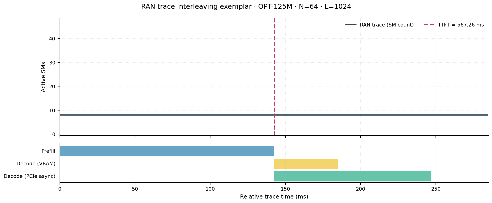
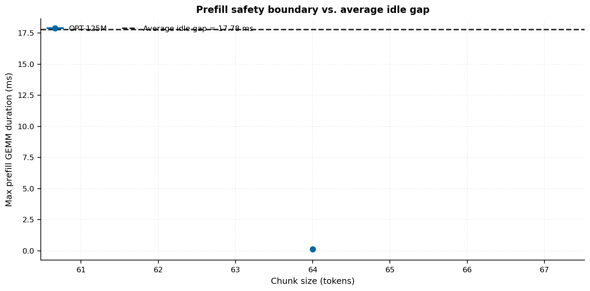
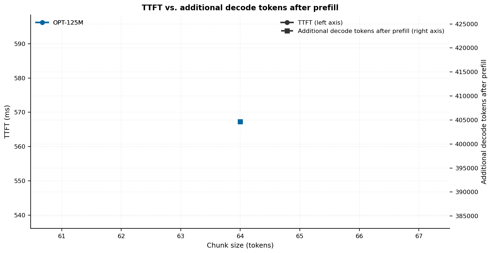
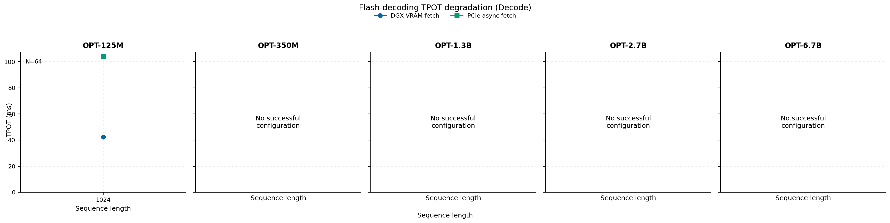
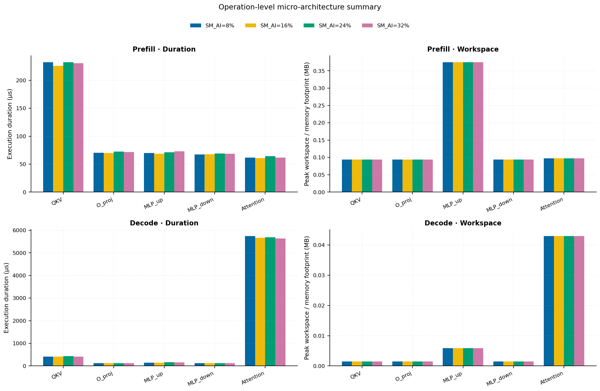
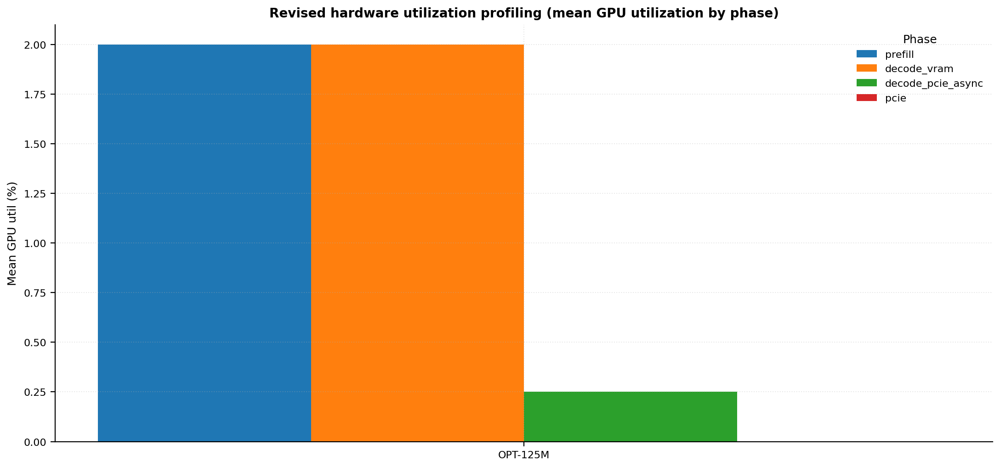
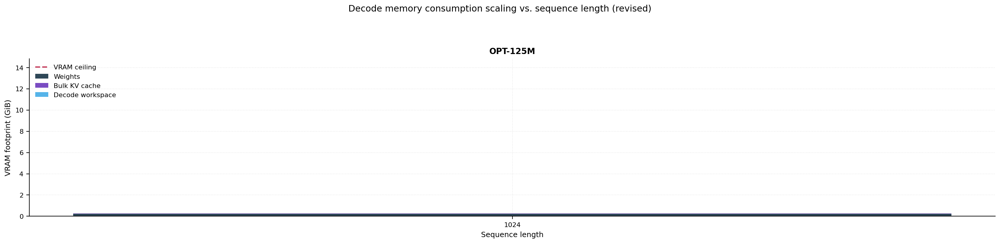

# RAN Inference Profiling Report

Run root: `/mnt/data/dheeraj/dicertation/inference-profile/runs/revised-ran-dgxspark-smoke`

## Environment

| field | value |
| --- | --- |
| cache_root | n/a |
| captured_at | 2026-04-14T01:01:41Z |
| chunk_sizes | [64] |
| cuda_available | true |
| cuda_device_count | 8 |
| cwd | /mnt/data/dheeraj/dicertation/inference-profile |
| decode_modes | ["vram", "pcie_async"] |
| experiment_type | ran-dgxspark-v1 |
| gpu_id | 0 |
| l_out | 1024 |
| models | ["facebook/opt-125m"] |
| platform | Linux-6.8.0-106-generic-x86_64-with-glibc2.35 |
| python_executable | /home/dheeraj/miniconda3/bin/python |
| python_version | 3.13.12 |
| run_root | /mnt/data/dheeraj/dicertation/inference-profile/runs/revised-ran-dgxspark-smoke |
| scheduler | envelope_v1 |
| schema_version | ran_dgxspark_v1 |
| sequence_lengths | [1024] |
| sm_ai_cap | 32 |
| sm_ai_partition | 8 |
| sm_ai_partitions | [8, 16, 24, 32] |
| stage | profile |
| telemetry_tier | baseline_nvml_pt |
| timed_iterations | 5 |
| torch_available | true |
| torch_version | 2.11.0+cu130 |
| warmup_iterations | 3 |

## Model Constants

| model_id | sm_ai_partition | num_hidden_layers | hidden_size | num_attention_heads | ffn_dim | layer_index | layer_weight_bytes | total_weight_bytes_fp16 | vram_ceiling_bytes |
| --- | --- | --- | --- | --- | --- | --- | --- | --- | --- |
| facebook/opt-125m | 8 | 12 | 768 | 12 | 3072 | 5 | 14175744 | 250478592 | 15170115993 |

## Trace Inspection

### Primary trace

| field | value |
| --- | --- |
| errors | [] |
| header | ["frame", "slot", "time_slot_sched_ns", "time_decode_start_est_ns", "time_decode_end_est_ns", "time_decode_start_actual_ns", "time_decode_end_actual_ns", "decode_dur_us", "deadline_met", "target_sm", "profile_idx", "sm_count", "num_pusch", "sum_prb", "sum_tbs_bytes", "max_mcs"] |
| median_positive_delta_ms | 5.6997 |
| monotonicity.checked_column | time_slot_sched_ns |
| monotonicity.is_non_decreasing | true |
| monotonicity.negative_delta_count | 0 |
| monotonicity.positive_delta_count | 28377 |
| monotonicity.zero_delta_count | 0 |
| normalization.last_row_duration_policy | median_positive_forward_delta_ms |
| normalization.output_columns | ["time_ms", "sm_utilization", "slot_duration_ms", "source_schema", "sm_count"] |
| normalization.output_relative_path | derived/normalized_ldpc_trace.csv |
| normalized_row_count | 28378 |
| path | /mnt/raid0sata2/netsys/weaver-ext/ran/traces/e2e_2026030418/e2e_20260304_182034_tractor_ran_ctrl/ldpc_trace.csv |
| row_count | 28378 |
| schema_detected | schema_b |
| time_unit_hint | ns |
| usable | true |
| usage_policy | primary_only |
| used_for_scheduler_capacity | true |

### Secondary trace

| field | value |
| --- | --- |
| errors | ["ran_ctrl_trace.csv line 182958 has 9 field(s); expected 12"] |
| header | ["frame", "slot", "sm_available", "prbs_available", "prbs_allocated", "w_avg_mcs_prev", "w_avg_mcs_curr", "slots_since_underutil", "ramp_up_count", "num_ue_sched", "max_ue_backlog", "sum_ue_backlog"] |
| monotonicity.checked_column | n/a |
| monotonicity.is_non_decreasing | n/a |
| monotonicity.negative_delta_count | n/a |
| path | /mnt/raid0sata2/netsys/weaver-ext/ran/traces/e2e_2026030418/e2e_20260304_182034_tractor_ran_ctrl/ran_ctrl_trace.csv |
| row_count | 182956 |
| time_unit_hints | [] |
| usable | false |
| usage_policy | structural_only |
| used_for_scheduler_capacity | false |

## Raw-Profile Summary Tables

### Prefill profile summary

Source raw rows: `raw/prefill_events.csv` = 140. Summary artifact: `derived/prefill_summary.csv`.

| model_id | chunk_tokens | sm_ai_partition | max_input_tokens | prefill_max_gemm_us | prefill_workspace_bytes | prefill_parked_activation_bytes | telemetry_tier | telemetry_provider | telemetry_status | nvml_available | gpu_util | gpu_mem_used_mb | sm_clock_mhz | mem_clock_mhz | power_w | pt_step_ms | pt_mem_alloc_mb | pt_mem_reserved_mb | pt_workspace_mb | acu_pct | gbu_pct | smu_pct | microscopic_telemetry_status | microscopic_error |
| --- | --- | --- | --- | --- | --- | --- | --- | --- | --- | --- | --- | --- | --- | --- | --- | --- | --- | --- | --- | --- | --- | --- | --- | --- |
| facebook/opt-125m | 64 | 8 | 1024 | 129.184 | 393216 | 393216 | baseline_nvml_pt | nvidia-smi | ok | true | 0 | 16207 | 1695 | 7601 | 40.67 | 0.1292 | 23.7632 | 23.7632 | 0.375 | n/a | n/a | n/a | unavailable | n/a |
| facebook/opt-125m | 64 | 16 | 1024 | 103.424 | 393216 | 393216 | baseline_nvml_pt | nvidia-smi | ok | true | 7 | 16207 | 1695 | 7601 | 46.33 | 0.1034 | 23.7632 | 23.7632 | 0.375 | n/a | n/a | n/a | unavailable | n/a |
| facebook/opt-125m | 64 | 24 | 1024 | 130.048 | 393216 | 393216 | baseline_nvml_pt | nvidia-smi | ok | true | 0 | 16207 | 1695 | 7601 | 44.35 | 0.13 | 23.7632 | 23.7632 | 0.375 | n/a | n/a | n/a | unavailable | n/a |
| facebook/opt-125m | 64 | 32 | 1024 | 123.104 | 393216 | 393216 | baseline_nvml_pt | nvidia-smi | ok | true | 1 | 16207 | 1695 | 7601 | 46.22 | 0.1231 | 23.7632 | 23.7632 | 0.375 | n/a | n/a | n/a | unavailable | n/a |

### Decode profile summary

Source raw rows: `raw/decode_events.csv` = 320. Summary artifact: `derived/decode_summary.csv`.

| model_id | sequence_length | block_size | sm_ai_partition | decode_mode | decode_max_gemv_us | attention_fetch_compute_us | reduction_overhead_us | decode_workspace_bytes | decode_parked_activation_bytes | telemetry_tier | telemetry_provider | telemetry_status | nvml_available | gpu_util | gpu_mem_used_mb | sm_clock_mhz | mem_clock_mhz | power_w | pt_step_ms | pt_mem_alloc_mb | pt_mem_reserved_mb | pt_workspace_mb | acu_pct | gbu_pct | smu_pct | microscopic_telemetry_status | microscopic_error |
| --- | --- | --- | --- | --- | --- | --- | --- | --- | --- | --- | --- | --- | --- | --- | --- | --- | --- | --- | --- | --- | --- | --- | --- | --- | --- | --- | --- |
| facebook/opt-125m | 1024 | 64 | 8 | pcie_async | 103.424 | 2077.2416 | 809.8048 | 45056 | 1536 | baseline_nvml_pt | nvidia-smi | ok | true | 1 | 16207 | 1695 | 7601 | 47.11 | 2.3583 | 25.6919 | 25.6919 | 0.043 | n/a | n/a | n/a | unavailable | n/a |
| facebook/opt-125m | 1024 | 64 | 8 | vram | 108.672 | 2080.9472 | 780.2368 | 45056 | 1536 | baseline_nvml_pt | nvidia-smi | ok | true | 1 | 16207 | 1695 | 7601 | 49.47 | 2.3521 | 25.6919 | 25.6919 | 0.043 | n/a | n/a | n/a | unavailable | n/a |
| facebook/opt-125m | 1024 | 64 | 16 | pcie_async | 104.576 | 2042.2784 | 766.7584 | 45056 | 1536 | baseline_nvml_pt | nvidia-smi | ok | true | 0 | 16207 | 1695 | 7601 | 47.85 | 2.2897 | 25.6919 | 25.6919 | 0.043 | n/a | n/a | n/a | unavailable | n/a |
| facebook/opt-125m | 1024 | 64 | 16 | vram | 106.56 | 2072.8128 | 781.7408 | 45056 | 1536 | baseline_nvml_pt | nvidia-smi | ok | true | 7 | 16207 | 1695 | 7601 | 60.35 | 2.3417 | 25.6919 | 25.6919 | 0.043 | n/a | n/a | n/a | unavailable | n/a |
| facebook/opt-125m | 1024 | 64 | 24 | pcie_async | 177.152 | 2039.9872 | 807.8784 | 45056 | 1536 | baseline_nvml_pt | nvidia-smi | ok | true | 0 | 16207 | 1695 | 7601 | 45.95 | 2.2999 | 25.6919 | 25.6919 | 0.043 | n/a | n/a | n/a | unavailable | n/a |
| facebook/opt-125m | 1024 | 64 | 24 | vram | 105.312 | 2058.0032 | 780.448 | 45056 | 1536 | baseline_nvml_pt | nvidia-smi | ok | true | 0 | 16207 | 1695 | 7601 | 47.64 | 2.3037 | 25.6919 | 25.6919 | 0.043 | n/a | n/a | n/a | unavailable | n/a |
| facebook/opt-125m | 1024 | 64 | 32 | pcie_async | 109.568 | 2024.2368 | 783.0912 | 45056 | 1536 | baseline_nvml_pt | nvidia-smi | ok | true | 0 | 16207 | 1695 | 7601 | 38.13 | 2.2764 | 25.6919 | 25.6919 | 0.043 | n/a | n/a | n/a | unavailable | n/a |
| facebook/opt-125m | 1024 | 64 | 32 | vram | 116.736 | 2049.3888 | 779.8976 | 45056 | 1536 | baseline_nvml_pt | nvidia-smi | ok | true | 0 | 16207 | 1695 | 7601 | 42.37 | 2.2578 | 25.6919 | 25.6919 | 0.043 | n/a | n/a | n/a | unavailable | n/a |

### PCIe profile summary

Source raw rows: `raw/pcie_events.csv` = 5. Summary artifact: `derived/pcie_summary.csv`.

| model_id | block_size | kv_block_bytes | transfer_only_us | overlap_total_us | dummy_compute_us | exposed_transfer_us | effective_gbps | overlap_status | telemetry_tier | telemetry_provider | telemetry_status | nvml_available | gpu_util | gpu_mem_used_mb | sm_clock_mhz | mem_clock_mhz | power_w | pt_step_ms | pt_mem_alloc_mb | pt_mem_reserved_mb | pt_workspace_mb | acu_pct | gbu_pct | smu_pct | microscopic_telemetry_status | microscopic_error |
| --- | --- | --- | --- | --- | --- | --- | --- | --- | --- | --- | --- | --- | --- | --- | --- | --- | --- | --- | --- | --- | --- | --- | --- | --- | --- | --- |
| facebook/opt-125m | 64 | 196608 | 297.5168 | 20685.5872 | 20359.6417 | 325.9455 | 0.6608 | measured | baseline_nvml_pt | nvidia-smi | partial | true | 0 | 16207 | 1695 | 7601 | 60.76 | n/a | n/a | n/a | n/a | n/a | n/a | n/a | unavailable | n/a |

## SLA Tables

### Successful configurations

| model_id | chunk_tokens | sequence_length | ttft_ms | tpot_ms_vram | tpot_ms_pcie_async | decode_runway_tokens | status |
| --- | --- | --- | --- | --- | --- | --- | --- |
| facebook/opt-125m | 64 | 1024 | 567.2632 | 42.3564 | 104.1584 | 404655 | success |

### Failed configurations

No rows available.

## Per-Model Scaling Analysis

| model_id | successful_configs | failed_configs | chunk_tokens_tested | sequence_lengths_tested | largest_successful_chunk_tokens | ttft_ms_min | ttft_ms_max | tpot_ms_vram_min | tpot_ms_vram_max | tpot_ms_pcie_async_min | tpot_ms_pcie_async_max | max_decode_runway_tokens |
| --- | --- | --- | --- | --- | --- | --- | --- | --- | --- | --- | --- | --- |
| facebook/opt-125m | 1 | 0 | 64 | 1024 | 64 | 567.2632 | 567.2632 | 42.3564 | 42.3564 | 104.1584 | 104.1584 | 404655 |

## Plots

### Revised 01 Ran Trace Interleaving

[Interactive companion](../plots/revised_01_ran_trace_interleaving_interactive.html)

### Revised 02 Prefill Safety Boundary

### Revised 03 Prefill Vram Composition

### Revised 04 Ttft Vs Runway

### Revised 05 Decode Tpot Degradation

### Revised 06 Operation Level Microarchitecture Summary

### Revised 07 Hardware Utilization Profiling

### Revised 08 Decode Memory Consumption

