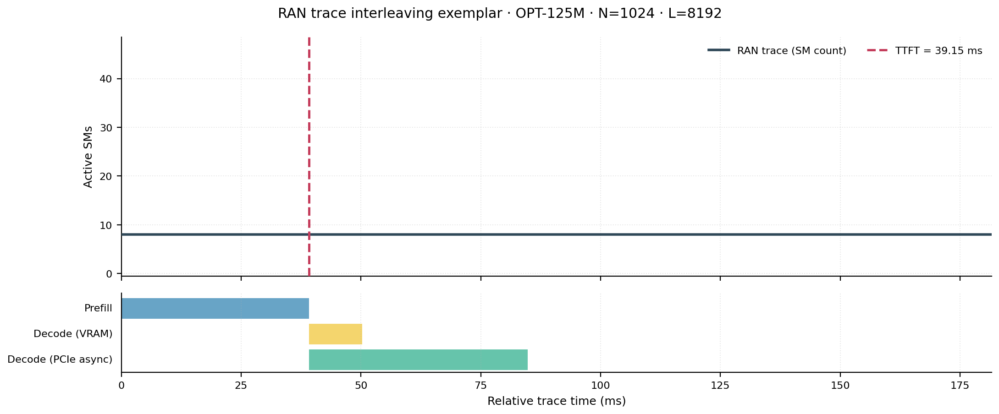
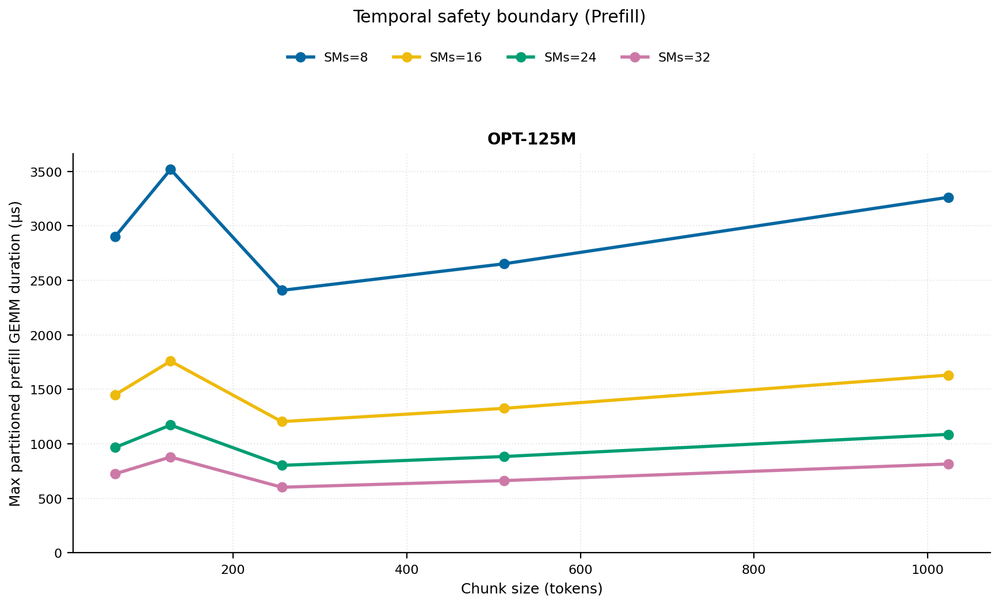
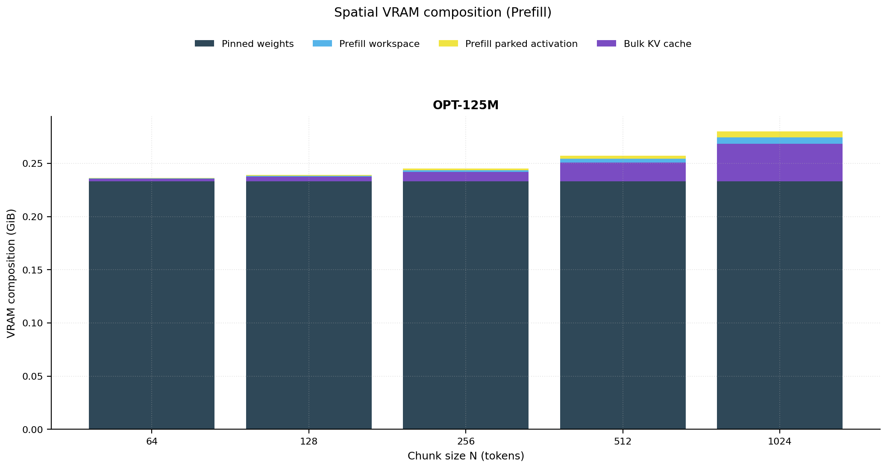
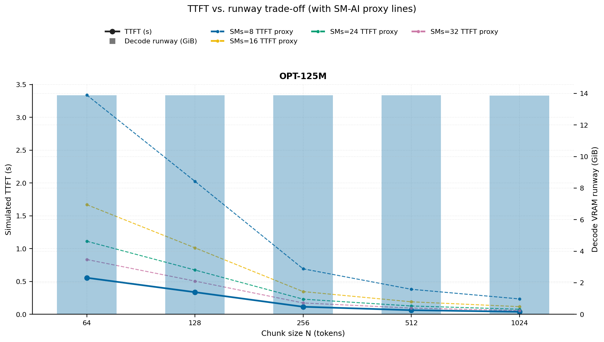
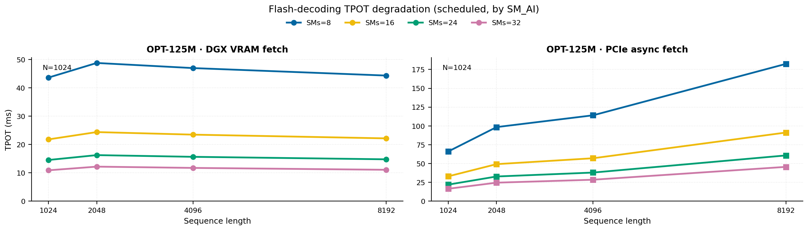
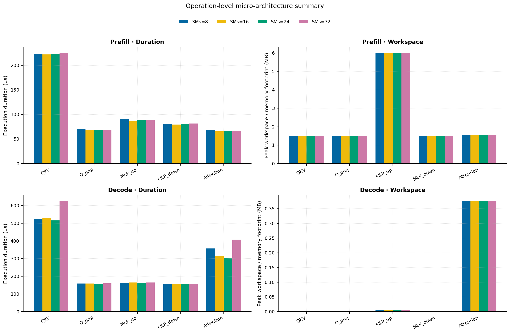
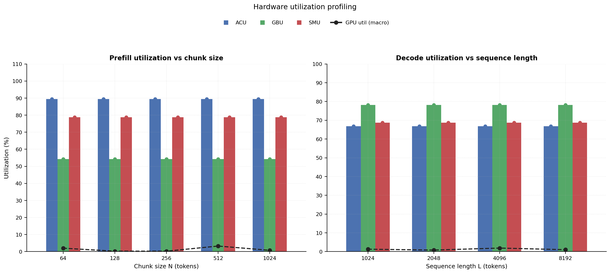

# RAN Inference Profiling Report

Run root: `/mnt/data/dheeraj/dicertation/inference-profile/runs/revised-rerun-20260415-020401-g0-opt125m`

## Environment

| field | value |
| --- | --- |
| cache_root | n/a |
| captured_at | 2026-04-15T01:04:08Z |
| chunk_sizes | [64, 128, 256, 512, 1024] |
| cuda_available | true |
| cuda_device_count | 8 |
| cwd | /mnt/data/dheeraj/dicertation/inference-profile |
| decode_modes | ["vram", "pcie_async"] |
| experiment_type | ran-dgxspark-v1 |
| gpu_id | 0 |
| l_out | 1024 |
| models | ["facebook/opt-125m"] |
| platform | Linux-6.8.0-106-generic-x86_64-with-glibc2.35 |
| python_executable | /home/dheeraj/miniconda3/envs/mls/bin/python |
| python_version | 3.11.14 |
| run_root | /mnt/data/dheeraj/dicertation/inference-profile/runs/revised-rerun-20260415-020401-g0-opt125m |
| scheduler | envelope_v1 |
| schema_version | ran_dgxspark_v1 |
| sequence_lengths | [1024, 2048, 4096, 8192] |
| sm_ai_cap | 32 |
| sm_ai_partition | 100 |
| sm_ai_partitions | [8, 16, 24, 32] |
| stage | profile |
| telemetry_tier | baseline_nvml_pt |
| timed_iterations | 5 |
| torch_available | true |
| torch_version | 2.10.0+cu128 |
| warmup_iterations | 3 |

## Model Constants

| model_id | sm_ai_partition | num_hidden_layers | hidden_size | num_attention_heads | ffn_dim | layer_index | layer_weight_bytes | total_weight_bytes_fp16 | vram_ceiling_bytes |
| --- | --- | --- | --- | --- | --- | --- | --- | --- | --- |
| facebook/opt-125m | 100 | 12 | 768 | 12 | 3072 | 5 | 14175744 | 250478592 | 15170115993 |

## Trace Inspection

### Primary trace

| field | value |
| --- | --- |
| errors | [] |
| header | ["frame", "slot", "time_slot_sched_ns", "time_decode_start_est_ns", "time_decode_end_est_ns", "time_decode_start_actual_ns", "time_decode_end_actual_ns", "decode_dur_us", "deadline_met", "target_sm", "profile_idx", "sm_count", "num_pusch", "sum_prb", "sum_tbs_bytes", "max_mcs"] |
| median_positive_delta_ms | 5.6997 |
| monotonicity.checked_column | time_slot_sched_ns |
| monotonicity.is_non_decreasing | true |
| monotonicity.negative_delta_count | 0 |
| monotonicity.positive_delta_count | 28377 |
| monotonicity.zero_delta_count | 0 |
| normalization.last_row_duration_policy | median_positive_forward_delta_ms |
| normalization.output_columns | ["time_ms", "sm_utilization", "slot_duration_ms", "source_schema", "sm_count"] |
| normalization.output_relative_path | derived/normalized_ldpc_trace.csv |
| normalized_row_count | 28378 |
| path | /mnt/raid0sata2/netsys/weaver-ext/ran/traces/e2e_2026030418/e2e_20260304_182034_tractor_ran_ctrl/ldpc_trace.csv |
| row_count | 28378 |
| schema_detected | schema_b |
| time_unit_hint | ns |
| usable | true |
| usage_policy | primary_only |
| used_for_scheduler_capacity | true |

### Secondary trace

| field | value |
| --- | --- |
| errors | ["ran_ctrl_trace.csv line 182958 has 9 field(s); expected 12"] |
| header | ["frame", "slot", "sm_available", "prbs_available", "prbs_allocated", "w_avg_mcs_prev", "w_avg_mcs_curr", "slots_since_underutil", "ramp_up_count", "num_ue_sched", "max_ue_backlog", "sum_ue_backlog"] |
| monotonicity.checked_column | n/a |
| monotonicity.is_non_decreasing | n/a |
| monotonicity.negative_delta_count | n/a |
| path | /mnt/raid0sata2/netsys/weaver-ext/ran/traces/e2e_2026030418/e2e_20260304_182034_tractor_ran_ctrl/ran_ctrl_trace.csv |
| row_count | 182956 |
| time_unit_hints | [] |
| usable | false |
| usage_policy | structural_only |
| used_for_scheduler_capacity | false |

## Raw-Profile Summary Tables

### Prefill profile summary

Source raw rows: `raw/prefill_events.csv` = 700. Summary artifact: `derived/prefill_summary.csv`.

| model_id | chunk_tokens | sm_ai_partition | max_input_tokens | prefill_max_gemm_us | prefill_workspace_bytes | prefill_parked_activation_bytes | telemetry_tier | telemetry_provider | telemetry_status | nvml_available | gpu_util | gpu_mem_used_mb | sm_clock_mhz | mem_clock_mhz | power_w | pt_step_ms | pt_mem_alloc_mb | pt_mem_reserved_mb | pt_workspace_mb | acu_pct | gbu_pct | smu_pct | microscopic_telemetry_status | microscopic_error |
| --- | --- | --- | --- | --- | --- | --- | --- | --- | --- | --- | --- | --- | --- | --- | --- | --- | --- | --- | --- | --- | --- | --- | --- | --- |
| facebook/opt-125m | 64 | 8 | 1024 | 142.336 | 393216 | 393216 | baseline_nvml_pt | nvidia-smi | ok | true | 1 | 2508 | 1695 | 7601 | 61.25 | 0.1423 | 23.7632 | 23.7632 | 0.375 | 79 | 62.5 | 67.5 | estimated | n/a |
| facebook/opt-125m | 64 | 16 | 1024 | 121.856 | 393216 | 393216 | baseline_nvml_pt | nvidia-smi | ok | true | 7 | 2508 | 1695 | 7601 | 61.95 | 0.1219 | 23.7632 | 23.7632 | 0.375 | 86 | 57 | 75 | estimated | n/a |
| facebook/opt-125m | 64 | 24 | 1024 | 127.808 | 393216 | 393216 | baseline_nvml_pt | nvidia-smi | ok | true | 0 | 2508 | 1695 | 7601 | 62.23 | 0.1278 | 23.7632 | 23.7632 | 0.375 | 93 | 51.5 | 82.5 | estimated | n/a |
| facebook/opt-125m | 64 | 32 | 1024 | 120.832 | 393216 | 393216 | baseline_nvml_pt | nvidia-smi | ok | true | 0 | 2508 | 1695 | 7601 | 62.44 | 0.1208 | 23.7632 | 23.7632 | 0.375 | 100 | 46 | 90 | estimated | n/a |
| facebook/opt-125m | 128 | 8 | 1024 | 107.776 | 786432 | 786432 | baseline_nvml_pt | nvidia-smi | ok | true | 0 | 2506 | 1695 | 7601 | 63.42 | 0.1078 | 24.8882 | 24.8882 | 0.75 | 79 | 62.5 | 67.5 | estimated | n/a |
| facebook/opt-125m | 128 | 16 | 1024 | 118.784 | 786432 | 786432 | baseline_nvml_pt | nvidia-smi | ok | true | 1 | 2506 | 1695 | 7601 | 55.45 | 0.1188 | 24.8882 | 24.8882 | 0.75 | 86 | 57 | 75 | estimated | n/a |
| facebook/opt-125m | 128 | 24 | 1024 | 177.152 | 786432 | 786432 | baseline_nvml_pt | nvidia-smi | ok | true | 0 | 2508 | 1695 | 7601 | 62.81 | 0.1772 | 24.8882 | 24.8882 | 0.75 | 93 | 51.5 | 82.5 | estimated | n/a |
| facebook/opt-125m | 128 | 32 | 1024 | 146.592 | 786432 | 786432 | baseline_nvml_pt | nvidia-smi | ok | true | 0 | 2508 | 1695 | 7601 | 63.3 | 0.1466 | 24.8882 | 24.8882 | 0.75 | 100 | 46 | 90 | estimated | n/a |
| facebook/opt-125m | 256 | 8 | 1024 | 103.424 | 1572864 | 1572864 | baseline_nvml_pt | nvidia-smi | ok | true | 0 | 2508 | 1695 | 7601 | 62.83 | 0.1034 | 27.1382 | 27.1382 | 1.5 | 79 | 62.5 | 67.5 | estimated | n/a |
| facebook/opt-125m | 256 | 16 | 1024 | 106.496 | 1572864 | 1572864 | baseline_nvml_pt | nvidia-smi | ok | true | 1 | 2508 | 1695 | 7601 | 63.63 | 0.1065 | 27.1382 | 27.1382 | 1.5 | 86 | 57 | 75 | estimated | n/a |
| facebook/opt-125m | 256 | 24 | 1024 | 101.28 | 1572864 | 1572864 | baseline_nvml_pt | nvidia-smi | ok | true | 0 | 2508 | 1695 | 7601 | 63.57 | 0.1013 | 27.1382 | 27.1382 | 1.5 | 93 | 51.5 | 82.5 | estimated | n/a |
| facebook/opt-125m | 256 | 32 | 1024 | 100.352 | 1572864 | 1572864 | baseline_nvml_pt | nvidia-smi | ok | true | 0 | 2508 | 1695 | 7601 | 63.76 | 0.1004 | 27.1382 | 27.1382 | 1.5 | 100 | 46 | 90 | estimated | n/a |
| facebook/opt-125m | 512 | 8 | 1024 | 119.808 | 3670016 | 3145728 | baseline_nvml_pt | nvidia-smi | ok | true | 7 | 2508 | 1695 | 7601 | 64.19 | 0.1198 | 32.1382 | 32.1382 | 3.5 | 79 | 62.5 | 67.5 | estimated | n/a |
| facebook/opt-125m | 512 | 16 | 1024 | 109.568 | 3670016 | 3145728 | baseline_nvml_pt | nvidia-smi | ok | true | 0 | 2508 | 1695 | 7601 | 64 | 0.1096 | 32.1382 | 32.1382 | 3.5 | 86 | 57 | 75 | estimated | n/a |
| facebook/opt-125m | 512 | 24 | 1024 | 108.544 | 3670016 | 3145728 | baseline_nvml_pt | nvidia-smi | ok | true | 0 | 2508 | 1695 | 7601 | 63.56 | 0.1085 | 32.1382 | 32.1382 | 3.5 | 93 | 51.5 | 82.5 | estimated | n/a |
| facebook/opt-125m | 512 | 32 | 1024 | 110.496 | 3670016 | 3145728 | baseline_nvml_pt | nvidia-smi | ok | true | 6 | 2508 | 1695 | 7601 | 63.8 | 0.1105 | 32.1382 | 32.1382 | 3.5 | 100 | 46 | 90 | estimated | n/a |
| facebook/opt-125m | 1024 | 8 | 1024 | 119.808 | 6291456 | 6291456 | baseline_nvml_pt | nvidia-smi | ok | true | 3 | 2508 | 1695 | 7601 | 63.98 | 0.1198 | 41.1382 | 41.1382 | 6 | 79 | 62.5 | 67.5 | estimated | n/a |
| facebook/opt-125m | 1024 | 16 | 1024 | 123.072 | 6291456 | 6291456 | baseline_nvml_pt | nvidia-smi | ok | true | 0 | 2508 | 1695 | 7601 | 64.6 | 0.1231 | 41.1382 | 41.1382 | 6 | 86 | 57 | 75 | estimated | n/a |
| facebook/opt-125m | 1024 | 24 | 1024 | 119.808 | 6291456 | 6291456 | baseline_nvml_pt | nvidia-smi | ok | true | 0 | 2508 | 1695 | 7601 | 64.62 | 0.1198 | 41.1382 | 41.1382 | 6 | 93 | 51.5 | 82.5 | estimated | n/a |
| facebook/opt-125m | 1024 | 32 | 1024 | 135.936 | 6291456 | 6291456 | baseline_nvml_pt | nvidia-smi | ok | true | 0 | 2506 | 1695 | 7601 | 64.54 | 0.1359 | 41.1382 | 41.1382 | 6 | 100 | 46 | 90 | estimated | n/a |

### Decode profile summary

Source raw rows: `raw/decode_events.csv` = 6400. Summary artifact: `derived/decode_summary.csv`.

| model_id | sequence_length | block_size | sm_ai_partition | decode_mode | decode_max_gemv_us | attention_fetch_compute_us | reduction_overhead_us | decode_workspace_bytes | decode_parked_activation_bytes | telemetry_tier | telemetry_provider | telemetry_status | nvml_available | gpu_util | gpu_mem_used_mb | sm_clock_mhz | mem_clock_mhz | power_w | pt_step_ms | pt_mem_alloc_mb | pt_mem_reserved_mb | pt_workspace_mb | acu_pct | gbu_pct | smu_pct | microscopic_telemetry_status | microscopic_error |
| --- | --- | --- | --- | --- | --- | --- | --- | --- | --- | --- | --- | --- | --- | --- | --- | --- | --- | --- | --- | --- | --- | --- | --- | --- | --- | --- | --- |
| facebook/opt-125m | 1024 | 64 | 8 | pcie_async | 158.72 | 143.4112 | 21.312 | 50688 | 1536 | baseline_nvml_pt | nvidia-smi | ok | true | 7 | 2506 | 1695 | 7601 | 64.01 | 0.1793 | 24.6953 | 24.6953 | 0.0483 | 56.5 | 87 | 59 | estimated | n/a |
| facebook/opt-125m | 1024 | 64 | 8 | vram | 144.64 | 128.4416 | 19.8912 | 50688 | 1536 | baseline_nvml_pt | nvidia-smi | ok | true | 0 | 2506 | 1695 | 7601 | 56.37 | 0.1446 | 24.6953 | 24.6953 | 0.0483 | 63 | 77.5 | 62 | estimated | n/a |
| facebook/opt-125m | 1024 | 64 | 16 | pcie_async | 143.36 | 135.9424 | 23.1104 | 50688 | 1536 | baseline_nvml_pt | nvidia-smi | ok | true | 0 | 2508 | 1695 | 7601 | 63.72 | 0.1444 | 24.6953 | 24.6953 | 0.0483 | 61 | 84 | 64 | estimated | n/a |
| facebook/opt-125m | 1024 | 64 | 16 | vram | 147.168 | 132.9472 | 21.1584 | 50688 | 1536 | baseline_nvml_pt | nvidia-smi | ok | true | 0 | 2508 | 1695 | 7601 | 64.08 | 0.1472 | 24.6953 | 24.6953 | 0.0483 | 68 | 75 | 68 | estimated | n/a |
| facebook/opt-125m | 1024 | 64 | 24 | pcie_async | 140.128 | 127.4176 | 20.4864 | 50688 | 1536 | baseline_nvml_pt | nvidia-smi | ok | true | 0 | 2506 | 1695 | 7601 | 64.41 | 0.1401 | 24.6953 | 24.6953 | 0.0483 | 65.5 | 81 | 69 | estimated | n/a |
| facebook/opt-125m | 1024 | 64 | 24 | vram | 147.52 | 131.4752 | 19.9744 | 50688 | 1536 | baseline_nvml_pt | nvidia-smi | ok | true | 0 | 2508 | 1695 | 7601 | 63.57 | 0.1475 | 24.6953 | 24.6953 | 0.0483 | 73 | 72.5 | 74 | estimated | n/a |
| facebook/opt-125m | 1024 | 64 | 32 | pcie_async | 145.536 | 132.9088 | 21.3056 | 50688 | 1536 | baseline_nvml_pt | nvidia-smi | ok | true | 1 | 2508 | 1695 | 7601 | 63.81 | 0.1455 | 24.6953 | 24.6953 | 0.0483 | 70 | 78 | 74 | estimated | n/a |
| facebook/opt-125m | 1024 | 64 | 32 | vram | 129.088 | 124.9664 | 19.6032 | 50688 | 1536 | baseline_nvml_pt | nvidia-smi | ok | true | 0 | 2508 | 1695 | 7601 | 64.1 | 0.1372 | 24.6953 | 24.6953 | 0.0483 | 78 | 70 | 80 | estimated | n/a |
| facebook/opt-125m | 1024 | 128 | 8 | pcie_async | 133.12 | 132.96 | 20.9152 | 50688 | 1536 | baseline_nvml_pt | nvidia-smi | ok | true | 0 | 2506 | 1695 | 7601 | 64.56 | 0.1413 | 24.6953 | 24.6953 | 0.0483 | 56.5 | 87 | 59 | estimated | n/a |
| facebook/opt-125m | 1024 | 128 | 8 | vram | 152.512 | 148.3648 | 24.6272 | 50688 | 1536 | baseline_nvml_pt | nvidia-smi | ok | true | 5 | 2508 | 1695 | 7601 | 64.09 | 0.1569 | 24.6953 | 24.6953 | 0.0483 | 63 | 77.5 | 62 | estimated | n/a |
| facebook/opt-125m | 1024 | 128 | 16 | pcie_async | 154.624 | 146.2144 | 23.5776 | 50688 | 1536 | baseline_nvml_pt | nvidia-smi | ok | true | 7 | 2506 | 1695 | 7601 | 64.51 | 0.1556 | 24.6953 | 24.6953 | 0.0483 | 61 | 84 | 64 | estimated | n/a |
| facebook/opt-125m | 1024 | 128 | 16 | vram | 157.664 | 141.9264 | 22.0864 | 50688 | 1536 | baseline_nvml_pt | nvidia-smi | ok | true | 0 | 2508 | 1695 | 7601 | 64.37 | 0.1577 | 24.6953 | 24.6953 | 0.0483 | 68 | 75 | 68 | estimated | n/a |
| facebook/opt-125m | 1024 | 128 | 24 | pcie_async | 146.592 | 124.352 | 20.032 | 50688 | 1536 | baseline_nvml_pt | nvidia-smi | ok | true | 0 | 2508 | 1695 | 7601 | 64.12 | 0.1466 | 24.6953 | 24.6953 | 0.0483 | 65.5 | 81 | 69 | estimated | n/a |
| facebook/opt-125m | 1024 | 128 | 24 | vram | 143.36 | 129.1968 | 20.4864 | 50688 | 1536 | baseline_nvml_pt | nvidia-smi | ok | true | 7 | 2508 | 1695 | 7601 | 64.64 | 0.1434 | 24.6953 | 24.6953 | 0.0483 | 73 | 72.5 | 74 | estimated | n/a |
| facebook/opt-125m | 1024 | 128 | 32 | pcie_async | 152.576 | 1941.7024 | 23.9104 | 50688 | 1536 | baseline_nvml_pt | nvidia-smi | ok | true | 0 | 2506 | 1695 | 7601 | 64.35 | 9.1516 | 24.6953 | 24.6953 | 0.0483 | 70 | 78 | 74 | estimated | n/a |
| facebook/opt-125m | 1024 | 128 | 32 | vram | 146.432 | 156.9152 | 23.9872 | 50688 | 1536 | baseline_nvml_pt | nvidia-smi | ok | true | 0 | 2506 | 1695 | 7601 | 64.84 | 0.1823 | 24.6953 | 24.6953 | 0.0483 | 78 | 70 | 80 | estimated | n/a |
| facebook/opt-125m | 1024 | 256 | 8 | pcie_async | 130.272 | 130.7968 | 20.9344 | 50688 | 1536 | baseline_nvml_pt | nvidia-smi | ok | true | 4 | 2508 | 1695 | 7601 | 63.65 | 0.1462 | 24.6953 | 24.6953 | 0.0483 | 56.5 | 87 | 59 | estimated | n/a |
| facebook/opt-125m | 1024 | 256 | 8 | vram | 153.696 | 138.8672 | 21.152 | 50688 | 1536 | baseline_nvml_pt | nvidia-smi | ok | true | 0 | 2508 | 1695 | 7601 | 63.67 | 0.1547 | 24.6953 | 24.6953 | 0.0483 | 63 | 77.5 | 62 | estimated | n/a |
| facebook/opt-125m | 1024 | 256 | 16 | pcie_async | 159.616 | 153.6128 | 24.608 | 50688 | 1536 | baseline_nvml_pt | nvidia-smi | ok | true | 0 | 2508 | 1695 | 7601 | 63.67 | 0.1648 | 24.6953 | 24.6953 | 0.0483 | 61 | 84 | 64 | estimated | n/a |
| facebook/opt-125m | 1024 | 256 | 16 | vram | 129.024 | 130.8352 | 21.2352 | 50688 | 1536 | baseline_nvml_pt | nvidia-smi | ok | true | 5 | 2508 | 1695 | 7601 | 64.58 | 0.1423 | 24.6953 | 24.6953 | 0.0483 | 68 | 75 | 68 | estimated | n/a |
| facebook/opt-125m | 1024 | 256 | 24 | pcie_async | 139.168 | 131.0976 | 20.6848 | 50688 | 1536 | baseline_nvml_pt | nvidia-smi | ok | true | 0 | 2508 | 1695 | 7601 | 64.19 | 0.1392 | 24.6953 | 24.6953 | 0.0483 | 65.5 | 81 | 69 | estimated | n/a |
| facebook/opt-125m | 1024 | 256 | 24 | vram | 148.48 | 145.1648 | 22.7264 | 50688 | 1536 | baseline_nvml_pt | nvidia-smi | ok | true | 0 | 2508 | 1695 | 7601 | 64.11 | 0.1528 | 24.6953 | 24.6953 | 0.0483 | 73 | 72.5 | 74 | estimated | n/a |
| facebook/opt-125m | 1024 | 256 | 32 | pcie_async | 154.528 | 132.96 | 19.936 | 50688 | 1536 | baseline_nvml_pt | nvidia-smi | ok | true | 1 | 2508 | 1695 | 7601 | 64.2 | 0.1545 | 24.6953 | 24.6953 | 0.0483 | 70 | 78 | 74 | estimated | n/a |
| facebook/opt-125m | 1024 | 256 | 32 | vram | 150.528 | 143.3472 | 22.144 | 50688 | 1536 | baseline_nvml_pt | nvidia-smi | ok | true | 5 | 2508 | 1695 | 7601 | 63.92 | 0.1545 | 24.6953 | 24.6953 | 0.0483 | 78 | 70 | 80 | estimated | n/a |
| facebook/opt-125m | 1024 | 512 | 8 | pcie_async | 137.216 | 135.6288 | 21.3696 | 50688 | 1536 | baseline_nvml_pt | nvidia-smi | ok | true | 0 | 2508 | 1695 | 7601 | 63.11 | 0.1403 | 24.6953 | 24.6953 | 0.0483 | 56.5 | 87 | 59 | estimated | n/a |
| facebook/opt-125m | 1024 | 512 | 8 | vram | 135.168 | 125.7792 | 21.0496 | 50688 | 1536 | baseline_nvml_pt | nvidia-smi | ok | true | 0 | 2508 | 1695 | 7601 | 64.52 | 0.1362 | 24.6953 | 24.6953 | 0.0483 | 63 | 77.5 | 62 | estimated | n/a |
| facebook/opt-125m | 1024 | 512 | 16 | pcie_async | 148.48 | 132.0384 | 20.9728 | 50688 | 1536 | baseline_nvml_pt | nvidia-smi | ok | true | 0 | 2508 | 1695 | 7601 | 64.69 | 0.1485 | 24.6953 | 24.6953 | 0.0483 | 61 | 84 | 64 | estimated | n/a |
| facebook/opt-125m | 1024 | 512 | 16 | vram | 142.464 | 130.0096 | 20.928 | 50688 | 1536 | baseline_nvml_pt | nvidia-smi | ok | true | 0 | 2506 | 1695 | 7601 | 64.16 | 0.1454 | 24.6953 | 24.6953 | 0.0483 | 68 | 75 | 68 | estimated | n/a |
| facebook/opt-125m | 1024 | 512 | 24 | pcie_async | 138.208 | 130.8224 | 22.2464 | 50688 | 1536 | baseline_nvml_pt | nvidia-smi | ok | true | 0 | 2508 | 1695 | 7601 | 64.71 | 0.1382 | 24.6953 | 24.6953 | 0.0483 | 65.5 | 81 | 69 | estimated | n/a |
| facebook/opt-125m | 1024 | 512 | 24 | vram | 114.848 | 126.7648 | 19.6928 | 50688 | 1536 | baseline_nvml_pt | nvidia-smi | ok | true | 0 | 2508 | 1695 | 7601 | 64.78 | 0.1331 | 24.6953 | 24.6953 | 0.0483 | 73 | 72.5 | 74 | estimated | n/a |
| facebook/opt-125m | 1024 | 512 | 32 | pcie_async | 136.48 | 145.1584 | 23.0464 | 50688 | 1536 | baseline_nvml_pt | nvidia-smi | ok | true | 3 | 2508 | 1695 | 7601 | 65.26 | 0.171 | 24.6953 | 24.6953 | 0.0483 | 70 | 78 | 74 | estimated | n/a |
| facebook/opt-125m | 1024 | 512 | 32 | vram | 140.288 | 128.8512 | 20.5248 | 50688 | 1536 | baseline_nvml_pt | nvidia-smi | ok | true | 1 | 2508 | 1695 | 7601 | 64.52 | 0.1403 | 24.6953 | 24.6953 | 0.0483 | 78 | 70 | 80 | estimated | n/a |
| facebook/opt-125m | 1024 | 1024 | 8 | pcie_async | 145.248 | 137.184 | 21.472 | 50688 | 1536 | baseline_nvml_pt | nvidia-smi | ok | true | 2 | 2506 | 1695 | 7601 | 64.32 | 0.1452 | 24.6953 | 24.6953 | 0.0483 | 56.5 | 87 | 59 | estimated | n/a |
| facebook/opt-125m | 1024 | 1024 | 8 | vram | 146.432 | 140.6592 | 21.4592 | 50688 | 1536 | baseline_nvml_pt | nvidia-smi | ok | true | 0 | 2506 | 1695 | 7601 | 65.87 | 0.1658 | 24.6953 | 24.6953 | 0.0483 | 63 | 77.5 | 62 | estimated | n/a |
| facebook/opt-125m | 1024 | 1024 | 16 | pcie_async | 141.312 | 133.7984 | 20.16 | 50688 | 1536 | baseline_nvml_pt | nvidia-smi | ok | true | 0 | 2508 | 1695 | 7601 | 65.77 | 0.1434 | 24.6953 | 24.6953 | 0.0483 | 61 | 84 | 64 | estimated | n/a |
| facebook/opt-125m | 1024 | 1024 | 16 | vram | 134.144 | 127.2256 | 20.7232 | 50688 | 1536 | baseline_nvml_pt | nvidia-smi | ok | true | 2 | 2508 | 1695 | 7601 | 65.42 | 0.1341 | 24.6953 | 24.6953 | 0.0483 | 68 | 75 | 68 | estimated | n/a |
| facebook/opt-125m | 1024 | 1024 | 24 | pcie_async | 147.296 | 134.0544 | 20.1152 | 50688 | 1536 | baseline_nvml_pt | nvidia-smi | ok | true | 0 | 2508 | 1695 | 7601 | 65.75 | 0.1473 | 24.6953 | 24.6953 | 0.0483 | 65.5 | 81 | 69 | estimated | n/a |
| facebook/opt-125m | 1024 | 1024 | 24 | vram | 142.336 | 132.5056 | 20.3328 | 50688 | 1536 | baseline_nvml_pt | nvidia-smi | ok | true | 0 | 2508 | 1695 | 7601 | 65.48 | 0.1462 | 24.6953 | 24.6953 | 0.0483 | 73 | 72.5 | 74 | estimated | n/a |
| facebook/opt-125m | 1024 | 1024 | 32 | pcie_async | 143.456 | 145.856 | 22.432 | 50688 | 1536 | baseline_nvml_pt | nvidia-smi | ok | true | 0 | 2508 | 1695 | 7601 | 65.94 | 0.1618 | 24.6953 | 24.6953 | 0.0483 | 70 | 78 | 74 | estimated | n/a |
| facebook/opt-125m | 1024 | 1024 | 32 | vram | 125.952 | 130.2912 | 22.7456 | 50688 | 1536 | baseline_nvml_pt | nvidia-smi | ok | true | 1 | 2508 | 1695 | 7601 | 65.61 | 0.1384 | 24.6953 | 24.6953 | 0.0483 | 78 | 70 | 80 | estimated | n/a |
| facebook/opt-125m | 2048 | 64 | 8 | pcie_async | 139.264 | 132.64 | 21.024 | 99840 | 1536 | baseline_nvml_pt | nvidia-smi | ok | true | 1 | 2508 | 1695 | 7601 | 65.03 | 0.1434 | 28.2422 | 28.2422 | 0.0952 | 56.5 | 87 | 59 | estimated | n/a |
| facebook/opt-125m | 2048 | 64 | 8 | vram | 144.192 | 128.224 | 21.4464 | 99840 | 1536 | baseline_nvml_pt | nvidia-smi | ok | true | 6 | 2508 | 1695 | 7601 | 65.85 | 0.1442 | 28.2422 | 28.2422 | 0.0952 | 63 | 77.5 | 62 | estimated | n/a |
| facebook/opt-125m | 2048 | 64 | 16 | pcie_async | 132.096 | 126.8544 | 19.7184 | 99840 | 1536 | baseline_nvml_pt | nvidia-smi | ok | true | 0 | 2508 | 1695 | 7601 | 65.44 | 0.1331 | 28.2422 | 28.2422 | 0.0952 | 61 | 84 | 64 | estimated | n/a |
| facebook/opt-125m | 2048 | 64 | 16 | vram | 140.256 | 129.2224 | 20.2304 | 99840 | 1536 | baseline_nvml_pt | nvidia-smi | ok | true | 1 | 2508 | 1695 | 7601 | 65.33 | 0.1403 | 28.2422 | 28.2422 | 0.0952 | 68 | 75 | 68 | estimated | n/a |
| facebook/opt-125m | 2048 | 64 | 24 | pcie_async | 134.144 | 126.6048 | 19.7312 | 99840 | 1536 | baseline_nvml_pt | nvidia-smi | ok | true | 0 | 2508 | 1695 | 7601 | 65.9 | 0.1341 | 28.2422 | 28.2422 | 0.0952 | 65.5 | 81 | 69 | estimated | n/a |
| facebook/opt-125m | 2048 | 64 | 24 | vram | 134.144 | 154.3552 | 23.5648 | 99840 | 1536 | baseline_nvml_pt | nvidia-smi | ok | true | 0 | 2508 | 1695 | 7601 | 65.77 | 0.1679 | 28.2422 | 28.2422 | 0.0952 | 73 | 72.5 | 74 | estimated | n/a |
| facebook/opt-125m | 2048 | 64 | 32 | pcie_async | 136.192 | 128.5952 | 20.7488 | 99840 | 1536 | baseline_nvml_pt | nvidia-smi | ok | true | 0 | 2506 | 1695 | 7601 | 65.44 | 0.1362 | 28.2422 | 28.2422 | 0.0952 | 70 | 78 | 74 | estimated | n/a |
| facebook/opt-125m | 2048 | 64 | 32 | vram | 9948.1602 | 162.8224 | 24.8768 | 99840 | 1536 | baseline_nvml_pt | nvidia-smi | ok | true | 0 | 2508 | 1695 | 7601 | 65.52 | 9.9482 | 28.2422 | 28.2422 | 0.0952 | 78 | 70 | 80 | estimated | n/a |
| facebook/opt-125m | 2048 | 128 | 8 | pcie_async | 144.384 | 126.3616 | 20.5312 | 99840 | 1536 | baseline_nvml_pt | nvidia-smi | ok | true | 1 | 2508 | 1695 | 7601 | 65.56 | 0.1444 | 28.2422 | 28.2422 | 0.0952 | 56.5 | 87 | 59 | estimated | n/a |
| facebook/opt-125m | 2048 | 128 | 8 | vram | 148.192 | 132.544 | 22.0736 | 99840 | 1536 | baseline_nvml_pt | nvidia-smi | ok | true | 5 | 2508 | 1695 | 7601 | 65.69 | 0.1482 | 28.2422 | 28.2422 | 0.0952 | 63 | 77.5 | 62 | estimated | n/a |
| facebook/opt-125m | 2048 | 128 | 16 | pcie_async | 169.984 | 138.4448 | 21.696 | 99840 | 1536 | baseline_nvml_pt | nvidia-smi | ok | true | 0 | 2508 | 1695 | 7601 | 65.82 | 0.17 | 28.2422 | 28.2422 | 0.0952 | 61 | 84 | 64 | estimated | n/a |
| facebook/opt-125m | 2048 | 128 | 16 | vram | 160.768 | 126.3936 | 22.08 | 99840 | 1536 | baseline_nvml_pt | nvidia-smi | ok | true | 0 | 2508 | 1695 | 7601 | 65.69 | 0.1608 | 28.2422 | 28.2422 | 0.0952 | 68 | 75 | 68 | estimated | n/a |
| facebook/opt-125m | 2048 | 128 | 24 | pcie_async | 133.12 | 134.5792 | 21.6768 | 99840 | 1536 | baseline_nvml_pt | nvidia-smi | ok | true | 1 | 2508 | 1695 | 7601 | 66.26 | 0.1413 | 28.2422 | 28.2422 | 0.0952 | 65.5 | 81 | 69 | estimated | n/a |
| facebook/opt-125m | 2048 | 128 | 24 | vram | 140.384 | 135.6864 | 20.2752 | 99840 | 1536 | baseline_nvml_pt | nvidia-smi | ok | true | 1 | 2508 | 1695 | 7601 | 65.78 | 0.1498 | 28.2422 | 28.2422 | 0.0952 | 73 | 72.5 | 74 | estimated | n/a |
| facebook/opt-125m | 2048 | 128 | 32 | pcie_async | 146.656 | 127.968 | 21.9264 | 99840 | 1536 | baseline_nvml_pt | nvidia-smi | ok | true | 0 | 2508 | 1695 | 7601 | 65.71 | 0.1467 | 28.2422 | 28.2422 | 0.0952 | 70 | 78 | 74 | estimated | n/a |
| facebook/opt-125m | 2048 | 128 | 32 | vram | 142.08 | 128.5952 | 20.0512 | 99840 | 1536 | baseline_nvml_pt | nvidia-smi | ok | true | 0 | 2506 | 1695 | 7601 | 65.91 | 0.1421 | 28.2422 | 28.2422 | 0.0952 | 78 | 70 | 80 | estimated | n/a |
| facebook/opt-125m | 2048 | 256 | 8 | pcie_async | 127.2 | 128.2368 | 20.416 | 99840 | 1536 | baseline_nvml_pt | nvidia-smi | ok | true | 0 | 2508 | 1695 | 7601 | 65.29 | 0.1465 | 28.2422 | 28.2422 | 0.0952 | 56.5 | 87 | 59 | estimated | n/a |
| facebook/opt-125m | 2048 | 256 | 8 | vram | 142.336 | 1072.1216 | 22.72 | 99840 | 1536 | baseline_nvml_pt | nvidia-smi | ok | true | 0 | 2506 | 1695 | 7601 | 65.85 | 4.8556 | 28.2422 | 28.2422 | 0.0952 | 63 | 77.5 | 62 | estimated | n/a |
| facebook/opt-125m | 2048 | 256 | 16 | pcie_async | 143.424 | 130.2016 | 20.2752 | 99840 | 1536 | baseline_nvml_pt | nvidia-smi | ok | true | 1 | 2508 | 1695 | 7601 | 65.42 | 0.1434 | 28.2422 | 28.2422 | 0.0952 | 61 | 84 | 64 | estimated | n/a |
| facebook/opt-125m | 2048 | 256 | 16 | vram | 137.216 | 132.1408 | 19.8912 | 99840 | 1536 | baseline_nvml_pt | nvidia-smi | ok | true | 0 | 2508 | 1695 | 7601 | 65.68 | 0.1372 | 28.2422 | 28.2422 | 0.0952 | 68 | 75 | 68 | estimated | n/a |
| facebook/opt-125m | 2048 | 256 | 24 | pcie_async | 131.072 | 128.7936 | 20.9088 | 99840 | 1536 | baseline_nvml_pt | nvidia-smi | ok | true | 0 | 2508 | 1695 | 7601 | 65.57 | 0.1331 | 28.2422 | 28.2422 | 0.0952 | 65.5 | 81 | 69 | estimated | n/a |
| facebook/opt-125m | 2048 | 256 | 24 | vram | 134.368 | 150.1376 | 20.864 | 99840 | 1536 | baseline_nvml_pt | nvidia-smi | ok | true | 0 | 2508 | 1695 | 7601 | 65.57 | 0.1729 | 28.2422 | 28.2422 | 0.0952 | 73 | 72.5 | 74 | estimated | n/a |
| facebook/opt-125m | 2048 | 256 | 32 | pcie_async | 144.384 | 128.6016 | 21.0304 | 99840 | 1536 | baseline_nvml_pt | nvidia-smi | ok | true | 5 | 2506 | 1695 | 7601 | 65.57 | 0.1444 | 28.2422 | 28.2422 | 0.0952 | 70 | 78 | 74 | estimated | n/a |
| facebook/opt-125m | 2048 | 256 | 32 | vram | 153.856 | 149.9328 | 22.7584 | 99840 | 1536 | baseline_nvml_pt | nvidia-smi | ok | true | 0 | 2508 | 1695 | 7601 | 64.97 | 0.1669 | 28.2422 | 28.2422 | 0.0952 | 78 | 70 | 80 | estimated | n/a |
| facebook/opt-125m | 2048 | 512 | 8 | pcie_async | 149.504 | 129.7728 | 19.8592 | 99840 | 1536 | baseline_nvml_pt | nvidia-smi | ok | true | 0 | 2508 | 1695 | 7601 | 65.46 | 0.1495 | 28.2422 | 28.2422 | 0.0952 | 56.5 | 87 | 59 | estimated | n/a |
| facebook/opt-125m | 2048 | 512 | 8 | vram | 142.336 | 129.824 | 20.896 | 99840 | 1536 | baseline_nvml_pt | nvidia-smi | ok | true | 0 | 2508 | 1695 | 7601 | 65.49 | 0.1423 | 28.2422 | 28.2422 | 0.0952 | 63 | 77.5 | 62 | estimated | n/a |
| facebook/opt-125m | 2048 | 512 | 16 | pcie_async | 125.152 | 131.456 | 21.4912 | 99840 | 1536 | baseline_nvml_pt | nvidia-smi | ok | true | 0 | 2508 | 1695 | 7601 | 65.58 | 0.1403 | 28.2422 | 28.2422 | 0.0952 | 61 | 84 | 64 | estimated | n/a |
| facebook/opt-125m | 2048 | 512 | 16 | vram | 145.344 | 132.9088 | 20.672 | 99840 | 1536 | baseline_nvml_pt | nvidia-smi | ok | true | 0 | 2508 | 1695 | 7601 | 61.26 | 0.1453 | 28.2422 | 28.2422 | 0.0952 | 68 | 75 | 68 | estimated | n/a |
| facebook/opt-125m | 2048 | 512 | 24 | pcie_async | 140.288 | 134.0992 | 21.0368 | 99840 | 1536 | baseline_nvml_pt | nvidia-smi | ok | true | 0 | 2506 | 1695 | 7601 | 65.67 | 0.1473 | 28.2422 | 28.2422 | 0.0952 | 65.5 | 81 | 69 | estimated | n/a |
| facebook/opt-125m | 2048 | 512 | 24 | vram | 132.096 | 125.3376 | 20.4352 | 99840 | 1536 | baseline_nvml_pt | nvidia-smi | ok | true | 0 | 2508 | 1695 | 7601 | 65.14 | 0.1321 | 28.2422 | 28.2422 | 0.0952 | 73 | 72.5 | 74 | estimated | n/a |
| facebook/opt-125m | 2048 | 512 | 32 | pcie_async | 156.736 | 141.3504 | 21.2608 | 99840 | 1536 | baseline_nvml_pt | nvidia-smi | ok | true | 0 | 2506 | 1695 | 7601 | 65.43 | 0.1567 | 28.2422 | 28.2422 | 0.0952 | 70 | 78 | 74 | estimated | n/a |
| facebook/opt-125m | 2048 | 512 | 32 | vram | 140.288 | 131.8784 | 20.6272 | 99840 | 1536 | baseline_nvml_pt | nvidia-smi | ok | true | 0 | 2506 | 1695 | 7601 | 65.11 | 0.1443 | 28.2422 | 28.2422 | 0.0952 | 78 | 70 | 80 | estimated | n/a |
| facebook/opt-125m | 2048 | 1024 | 8 | pcie_async | 159.744 | 141.6704 | 21.056 | 99840 | 1536 | baseline_nvml_pt | nvidia-smi | ok | true | 4 | 2508 | 1695 | 7601 | 65.45 | 0.1628 | 28.2422 | 28.2422 | 0.0952 | 56.5 | 87 | 59 | estimated | n/a |
| facebook/opt-125m | 2048 | 1024 | 8 | vram | 158.976 | 129.6832 | 23.3408 | 99840 | 1536 | baseline_nvml_pt | nvidia-smi | ok | true | 1 | 2508 | 1695 | 7601 | 65.13 | 0.159 | 28.2422 | 28.2422 | 0.0952 | 63 | 77.5 | 62 | estimated | n/a |
| facebook/opt-125m | 2048 | 1024 | 16 | pcie_async | 154.624 | 141.6576 | 20.1728 | 99840 | 1536 | baseline_nvml_pt | nvidia-smi | ok | true | 6 | 2506 | 1695 | 7601 | 63.59 | 0.1546 | 28.2422 | 28.2422 | 0.0952 | 61 | 84 | 64 | estimated | n/a |
| facebook/opt-125m | 2048 | 1024 | 16 | vram | 148.64 | 123.8784 | 19.4816 | 99840 | 1536 | baseline_nvml_pt | nvidia-smi | ok | true | 0 | 2506 | 1695 | 7601 | 65.01 | 0.1486 | 28.2422 | 28.2422 | 0.0952 | 68 | 75 | 68 | estimated | n/a |
| facebook/opt-125m | 2048 | 1024 | 24 | pcie_async | 149.504 | 132.3072 | 22.7392 | 99840 | 1536 | baseline_nvml_pt | nvidia-smi | ok | true | 0 | 2508 | 1695 | 7601 | 53.97 | 0.1495 | 28.2422 | 28.2422 | 0.0952 | 65.5 | 81 | 69 | estimated | n/a |
| facebook/opt-125m | 2048 | 1024 | 24 | vram | 130.048 | 123.5904 | 20.1152 | 99840 | 1536 | baseline_nvml_pt | nvidia-smi | ok | true | 0 | 2508 | 1695 | 7601 | 65.59 | 0.13 | 28.2422 | 28.2422 | 0.0952 | 73 | 72.5 | 74 | estimated | n/a |
| facebook/opt-125m | 2048 | 1024 | 32 | pcie_async | 199.52 | 137.8816 | 20.6208 | 99840 | 1536 | baseline_nvml_pt | nvidia-smi | ok | true | 0 | 2508 | 1695 | 7601 | 58.53 | 0.1995 | 28.2422 | 28.2422 | 0.0952 | 70 | 78 | 74 | estimated | n/a |
| facebook/opt-125m | 2048 | 1024 | 32 | vram | 143.648 | 131.6416 | 22.7008 | 99840 | 1536 | baseline_nvml_pt | nvidia-smi | ok | true | 0 | 2508 | 1695 | 7601 | 64.37 | 0.1436 | 28.2422 | 28.2422 | 0.0952 | 78 | 70 | 80 | estimated | n/a |
| facebook/opt-125m | 4096 | 64 | 8 | pcie_async | 147.456 | 160.9728 | 22.9248 | 198144 | 1536 | baseline_nvml_pt | nvidia-smi | ok | true | 1 | 2508 | 1695 | 7601 | 65.3 | 0.1874 | 34.3359 | 34.3359 | 0.189 | 56.5 | 87 | 59 | estimated | n/a |
| facebook/opt-125m | 4096 | 64 | 8 | vram | 135.168 | 147.8272 | 21.9648 | 198144 | 1536 | baseline_nvml_pt | nvidia-smi | ok | true | 0 | 2508 | 1695 | 7601 | 65.18 | 0.1638 | 34.3359 | 34.3359 | 0.189 | 63 | 77.5 | 62 | estimated | n/a |
| facebook/opt-125m | 4096 | 64 | 16 | pcie_async | 187.584 | 168.7232 | 28.448 | 198144 | 1536 | baseline_nvml_pt | nvidia-smi | ok | true | 6 | 2508 | 1695 | 7601 | 65.33 | 0.2038 | 34.3359 | 34.3359 | 0.189 | 61 | 84 | 64 | estimated | n/a |
| facebook/opt-125m | 4096 | 64 | 16 | vram | 189.6 | 145.4272 | 24.16 | 198144 | 1536 | baseline_nvml_pt | nvidia-smi | ok | true | 0 | 2508 | 1695 | 7601 | 65.51 | 0.1896 | 34.3359 | 34.3359 | 0.189 | 68 | 75 | 68 | estimated | n/a |
| facebook/opt-125m | 4096 | 64 | 24 | pcie_async | 114.784 | 125.5104 | 20.4672 | 198144 | 1536 | baseline_nvml_pt | nvidia-smi | ok | true | 0 | 2508 | 1695 | 7601 | 65.72 | 0.1309 | 34.3359 | 34.3359 | 0.189 | 65.5 | 81 | 69 | estimated | n/a |
| facebook/opt-125m | 4096 | 64 | 24 | vram | 129.216 | 126.5984 | 20.0448 | 198144 | 1536 | baseline_nvml_pt | nvidia-smi | ok | true | 3 | 2508 | 1695 | 7601 | 55.28 | 0.1319 | 34.3359 | 34.3359 | 0.189 | 73 | 72.5 | 74 | estimated | n/a |
| facebook/opt-125m | 4096 | 64 | 32 | pcie_async | 144.384 | 126.5472 | 20.1664 | 198144 | 1536 | baseline_nvml_pt | nvidia-smi | ok | true | 0 | 2508 | 1695 | 7601 | 65.14 | 0.1444 | 34.3359 | 34.3359 | 0.189 | 70 | 78 | 74 | estimated | n/a |
| facebook/opt-125m | 4096 | 64 | 32 | vram | 140.288 | 129.9456 | 20.4928 | 198144 | 1536 | baseline_nvml_pt | nvidia-smi | ok | true | 7 | 2508 | 1695 | 7601 | 65.7 | 0.1403 | 34.3359 | 34.3359 | 0.189 | 78 | 70 | 80 | estimated | n/a |
| facebook/opt-125m | 4096 | 128 | 8 | pcie_async | 130.048 | 125.7152 | 20.0384 | 198144 | 1536 | baseline_nvml_pt | nvidia-smi | ok | true | 1 | 2508 | 1695 | 7601 | 60.55 | 0.1331 | 34.3359 | 34.3359 | 0.189 | 56.5 | 87 | 59 | estimated | n/a |
| facebook/opt-125m | 4096 | 128 | 8 | vram | 145.312 | 128.256 | 22.1184 | 198144 | 1536 | baseline_nvml_pt | nvidia-smi | ok | true | 0 | 2508 | 1695 | 7601 | 62.09 | 0.1453 | 34.3359 | 34.3359 | 0.189 | 63 | 77.5 | 62 | estimated | n/a |
| facebook/opt-125m | 4096 | 128 | 16 | pcie_async | 141.12 | 128.4224 | 22.176 | 198144 | 1536 | baseline_nvml_pt | nvidia-smi | ok | true | 0 | 2508 | 1695 | 7601 | 65.68 | 0.1411 | 34.3359 | 34.3359 | 0.189 | 61 | 84 | 64 | estimated | n/a |
| facebook/opt-125m | 4096 | 128 | 16 | vram | 129.024 | 122.6752 | 20.1152 | 198144 | 1536 | baseline_nvml_pt | nvidia-smi | ok | true | 1 | 2508 | 1695 | 7601 | 65.95 | 0.129 | 34.3359 | 34.3359 | 0.189 | 68 | 75 | 68 | estimated | n/a |
| facebook/opt-125m | 4096 | 128 | 24 | pcie_async | 148.48 | 134.56 | 20.672 | 198144 | 1536 | baseline_nvml_pt | nvidia-smi | ok | true | 1 | 2508 | 1695 | 7601 | 64.44 | 0.1485 | 34.3359 | 34.3359 | 0.189 | 65.5 | 81 | 69 | estimated | n/a |
| facebook/opt-125m | 4096 | 128 | 24 | vram | 138.24 | 125.1968 | 20 | 198144 | 1536 | baseline_nvml_pt | nvidia-smi | ok | true | 0 | 2508 | 1695 | 7601 | 65.69 | 0.1382 | 34.3359 | 34.3359 | 0.189 | 73 | 72.5 | 74 | estimated | n/a |
| facebook/opt-125m | 4096 | 128 | 32 | pcie_async | 136.192 | 122.7776 | 21.5232 | 198144 | 1536 | baseline_nvml_pt | nvidia-smi | ok | true | 7 | 2508 | 1695 | 7601 | 66.45 | 0.1362 | 34.3359 | 34.3359 | 0.189 | 70 | 78 | 74 | estimated | n/a |
| facebook/opt-125m | 4096 | 128 | 32 | vram | 144.448 | 125.5936 | 19.9104 | 198144 | 1536 | baseline_nvml_pt | nvidia-smi | ok | true | 0 | 2508 | 1695 | 7601 | 65.76 | 0.1444 | 34.3359 | 34.3359 | 0.189 | 78 | 70 | 80 | estimated | n/a |
| facebook/opt-125m | 4096 | 256 | 8 | pcie_async | 130.24 | 124.0896 | 19.3856 | 198144 | 1536 | baseline_nvml_pt | nvidia-smi | ok | true | 3 | 2508 | 1695 | 7601 | 57.42 | 0.1302 | 34.3359 | 34.3359 | 0.189 | 56.5 | 87 | 59 | estimated | n/a |
| facebook/opt-125m | 4096 | 256 | 8 | vram | 128.224 | 128.128 | 19.6032 | 198144 | 1536 | baseline_nvml_pt | nvidia-smi | ok | true | 0 | 2508 | 1695 | 7601 | 65.81 | 0.134 | 34.3359 | 34.3359 | 0.189 | 63 | 77.5 | 62 | estimated | n/a |
| facebook/opt-125m | 4096 | 256 | 16 | pcie_async | 150.528 | 155.4752 | 23.5328 | 198144 | 1536 | baseline_nvml_pt | nvidia-smi | ok | true | 0 | 2508 | 1695 | 7601 | 58.93 | 0.1915 | 34.3359 | 34.3359 | 0.189 | 61 | 84 | 64 | estimated | n/a |
| facebook/opt-125m | 4096 | 256 | 16 | vram | 145.408 | 129.6256 | 20.4288 | 198144 | 1536 | baseline_nvml_pt | nvidia-smi | ok | true | 1 | 2508 | 1695 | 7601 | 66.39 | 0.1454 | 34.3359 | 34.3359 | 0.189 | 68 | 75 | 68 | estimated | n/a |
| facebook/opt-125m | 4096 | 256 | 24 | pcie_async | 137.248 | 143.3408 | 21.0496 | 198144 | 1536 | baseline_nvml_pt | nvidia-smi | ok | true | 5 | 2508 | 1695 | 7601 | 53.65 | 0.1555 | 34.3359 | 34.3359 | 0.189 | 65.5 | 81 | 69 | estimated | n/a |
| facebook/opt-125m | 4096 | 256 | 24 | vram | 135.168 | 122.0224 | 20.096 | 198144 | 1536 | baseline_nvml_pt | nvidia-smi | ok | true | 0 | 2508 | 1695 | 7601 | 66.37 | 0.1352 | 34.3359 | 34.3359 | 0.189 | 73 | 72.5 | 74 | estimated | n/a |
| facebook/opt-125m | 4096 | 256 | 32 | pcie_async | 144.384 | 134.496 | 23.4432 | 198144 | 1536 | baseline_nvml_pt | nvidia-smi | ok | true | 0 | 2506 | 1695 | 7601 | 65.91 | 0.1444 | 34.3359 | 34.3359 | 0.189 | 70 | 78 | 74 | estimated | n/a |
| facebook/opt-125m | 4096 | 256 | 32 | vram | 140.288 | 139.0656 | 20.48 | 198144 | 1536 | baseline_nvml_pt | nvidia-smi | ok | true | 0 | 2506 | 1695 | 7601 | 65.82 | 0.1637 | 34.3359 | 34.3359 | 0.189 | 78 | 70 | 80 | estimated | n/a |
| facebook/opt-125m | 4096 | 512 | 8 | pcie_async | 143.36 | 132.4992 | 19.9232 | 198144 | 1536 | baseline_nvml_pt | nvidia-smi | ok | true | 1 | 2508 | 1695 | 7601 | 52.49 | 0.1434 | 34.3359 | 34.3359 | 0.189 | 56.5 | 87 | 59 | estimated | n/a |
| facebook/opt-125m | 4096 | 512 | 8 | vram | 156.672 | 133.0816 | 20.6016 | 198144 | 1536 | baseline_nvml_pt | nvidia-smi | ok | true | 1 | 2508 | 1695 | 7601 | 65.94 | 0.1567 | 34.3359 | 34.3359 | 0.189 | 63 | 77.5 | 62 | estimated | n/a |
| facebook/opt-125m | 4096 | 512 | 16 | pcie_async | 154.624 | 152.9344 | 24.16 | 198144 | 1536 | baseline_nvml_pt | nvidia-smi | ok | true | 2 | 2508 | 1695 | 7601 | 49.16 | 0.169 | 34.3359 | 34.3359 | 0.189 | 61 | 84 | 64 | estimated | n/a |
| facebook/opt-125m | 4096 | 512 | 16 | vram | 137.216 | 125.1264 | 21.696 | 198144 | 1536 | baseline_nvml_pt | nvidia-smi | ok | true | 6 | 2508 | 1695 | 7601 | 54.31 | 0.1372 | 34.3359 | 34.3359 | 0.189 | 68 | 75 | 68 | estimated | n/a |
| facebook/opt-125m | 4096 | 512 | 24 | pcie_async | 138.176 | 125.4848 | 20.1152 | 198144 | 1536 | baseline_nvml_pt | nvidia-smi | ok | true | 6 | 2508 | 1695 | 7601 | 63.54 | 0.1382 | 34.3359 | 34.3359 | 0.189 | 65.5 | 81 | 69 | estimated | n/a |
| facebook/opt-125m | 4096 | 512 | 24 | vram | 130.24 | 129.5232 | 19.1104 | 198144 | 1536 | baseline_nvml_pt | nvidia-smi | ok | true | 1 | 2508 | 1695 | 7601 | 60.23 | 0.1465 | 34.3359 | 34.3359 | 0.189 | 73 | 72.5 | 74 | estimated | n/a |
| facebook/opt-125m | 4096 | 512 | 32 | pcie_async | 139.296 | 147.2256 | 26.2656 | 198144 | 1536 | baseline_nvml_pt | nvidia-smi | ok | true | 7 | 2506 | 1695 | 7601 | 66.22 | 0.1577 | 34.3359 | 34.3359 | 0.189 | 70 | 78 | 74 | estimated | n/a |
| facebook/opt-125m | 4096 | 512 | 32 | vram | 152.576 | 167.8656 | 23.3536 | 198144 | 1536 | baseline_nvml_pt | nvidia-smi | ok | true | 1 | 2506 | 1695 | 7601 | 65.92 | 0.218 | 34.3359 | 34.3359 | 0.189 | 78 | 70 | 80 | estimated | n/a |
| facebook/opt-125m | 4096 | 1024 | 8 | pcie_async | 142.336 | 131.4752 | 20.4096 | 198144 | 1536 | baseline_nvml_pt | nvidia-smi | ok | true | 0 | 2506 | 1695 | 7601 | 58 | 0.1423 | 34.3359 | 34.3359 | 0.189 | 56.5 | 87 | 59 | estimated | n/a |
| facebook/opt-125m | 4096 | 1024 | 8 | vram | 142.336 | 130.176 | 20.48 | 198144 | 1536 | baseline_nvml_pt | nvidia-smi | ok | true | 7 | 2508 | 1695 | 7601 | 66.22 | 0.1423 | 34.3359 | 34.3359 | 0.189 | 63 | 77.5 | 62 | estimated | n/a |
| facebook/opt-125m | 4096 | 1024 | 16 | pcie_async | 118.528 | 133.952 | 21.056 | 198144 | 1536 | baseline_nvml_pt | nvidia-smi | ok | true | 0 | 2506 | 1695 | 7601 | 66.13 | 0.1505 | 34.3359 | 34.3359 | 0.189 | 61 | 84 | 64 | estimated | n/a |
| facebook/opt-125m | 4096 | 1024 | 16 | vram | 143.424 | 129.6512 | 19.6928 | 198144 | 1536 | baseline_nvml_pt | nvidia-smi | ok | true | 7 | 2506 | 1695 | 7601 | 66.22 | 0.1434 | 34.3359 | 34.3359 | 0.189 | 68 | 75 | 68 | estimated | n/a |
| facebook/opt-125m | 4096 | 1024 | 24 | pcie_async | 147.456 | 128.704 | 24.5696 | 198144 | 1536 | baseline_nvml_pt | nvidia-smi | ok | true | 0 | 2508 | 1695 | 7601 | 65.86 | 0.1475 | 34.3359 | 34.3359 | 0.189 | 65.5 | 81 | 69 | estimated | n/a |
| facebook/opt-125m | 4096 | 1024 | 24 | vram | 136.384 | 129.4656 | 20.4288 | 198144 | 1536 | baseline_nvml_pt | nvidia-smi | ok | true | 0 | 2506 | 1695 | 7601 | 65.57 | 0.1414 | 34.3359 | 34.3359 | 0.189 | 73 | 72.5 | 74 | estimated | n/a |
| facebook/opt-125m | 4096 | 1024 | 32 | pcie_async | 139.008 | 132.2304 | 20.32 | 198144 | 1536 | baseline_nvml_pt | nvidia-smi | ok | true | 0 | 2506 | 1695 | 7601 | 65.57 | 0.1393 | 34.3359 | 34.3359 | 0.189 | 70 | 78 | 74 | estimated | n/a |
| facebook/opt-125m | 4096 | 1024 | 32 | vram | 138.24 | 128.7232 | 20.4416 | 198144 | 1536 | baseline_nvml_pt | nvidia-smi | ok | true | 0 | 2506 | 1695 | 7601 | 43.93 | 0.1382 | 34.3359 | 34.3359 | 0.189 | 78 | 70 | 80 | estimated | n/a |
| facebook/opt-125m | 8192 | 64 | 8 | pcie_async | 147.456 | 138.176 | 21.9136 | 394752 | 1536 | baseline_nvml_pt | nvidia-smi | ok | true | 0 | 2506 | 1695 | 7601 | 42.52 | 0.1597 | 46.0234 | 46.0234 | 0.3765 | 56.5 | 87 | 59 | estimated | n/a |
| facebook/opt-125m | 8192 | 64 | 8 | vram | 139.264 | 140.448 | 20.7424 | 394752 | 1536 | baseline_nvml_pt | nvidia-smi | ok | true | 0 | 2506 | 1695 | 7601 | 43.85 | 0.17 | 46.0234 | 46.0234 | 0.3765 | 63 | 77.5 | 62 | estimated | n/a |
| facebook/opt-125m | 8192 | 64 | 16 | pcie_async | 144.576 | 135.7888 | 20.64 | 394752 | 1536 | baseline_nvml_pt | nvidia-smi | ok | true | 0 | 2506 | 1695 | 7601 | 65.54 | 0.1505 | 46.0234 | 46.0234 | 0.3765 | 61 | 84 | 64 | estimated | n/a |
| facebook/opt-125m | 8192 | 64 | 16 | vram | 137.216 | 131.8912 | 21.2224 | 394752 | 1536 | baseline_nvml_pt | nvidia-smi | ok | true | 0 | 2508 | 1695 | 7601 | 44.55 | 0.1382 | 46.0234 | 46.0234 | 0.3765 | 68 | 75 | 68 | estimated | n/a |
| facebook/opt-125m | 8192 | 64 | 24 | pcie_async | 153.6 | 132.704 | 20.1024 | 394752 | 1536 | baseline_nvml_pt | nvidia-smi | ok | true | 0 | 2508 | 1695 | 7601 | 46.2 | 0.1536 | 46.0234 | 46.0234 | 0.3765 | 65.5 | 81 | 69 | estimated | n/a |
| facebook/opt-125m | 8192 | 64 | 24 | vram | 141.312 | 130.0288 | 19.3408 | 394752 | 1536 | baseline_nvml_pt | nvidia-smi | ok | true | 0 | 2508 | 1695 | 7601 | 42.1 | 0.1413 | 46.0234 | 46.0234 | 0.3765 | 73 | 72.5 | 74 | estimated | n/a |
| facebook/opt-125m | 8192 | 64 | 32 | pcie_async | 146.56 | 155.6096 | 22.5728 | 394752 | 1536 | baseline_nvml_pt | nvidia-smi | ok | true | 0 | 2508 | 1695 | 7601 | 44.2 | 0.1793 | 46.0234 | 46.0234 | 0.3765 | 70 | 78 | 74 | estimated | n/a |
| facebook/opt-125m | 8192 | 64 | 32 | vram | 154.624 | 140.9024 | 22.2592 | 394752 | 1536 | baseline_nvml_pt | nvidia-smi | ok | true | 0 | 2508 | 1695 | 7601 | 46.22 | 0.1546 | 46.0234 | 46.0234 | 0.3765 | 78 | 70 | 80 | estimated | n/a |
| facebook/opt-125m | 8192 | 128 | 8 | pcie_async | 147.456 | 143.1808 | 22.6112 | 394752 | 1536 | baseline_nvml_pt | nvidia-smi | ok | true | 7 | 2506 | 1695 | 7601 | 65.39 | 0.1597 | 46.0234 | 46.0234 | 0.3765 | 56.5 | 87 | 59 | estimated | n/a |
| facebook/opt-125m | 8192 | 128 | 8 | vram | 138.24 | 130.112 | 19.488 | 394752 | 1536 | baseline_nvml_pt | nvidia-smi | ok | true | 2 | 2506 | 1695 | 7601 | 61.97 | 0.1382 | 46.0234 | 46.0234 | 0.3765 | 63 | 77.5 | 62 | estimated | n/a |
| facebook/opt-125m | 8192 | 128 | 16 | pcie_async | 146.56 | 146.1248 | 22.5152 | 394752 | 1536 | baseline_nvml_pt | nvidia-smi | ok | true | 0 | 2506 | 1695 | 7601 | 42.98 | 0.1702 | 46.0234 | 46.0234 | 0.3765 | 61 | 84 | 64 | estimated | n/a |
| facebook/opt-125m | 8192 | 128 | 16 | vram | 150.528 | 130.2144 | 20.288 | 394752 | 1536 | baseline_nvml_pt | nvidia-smi | ok | true | 0 | 2506 | 1695 | 7601 | 62.95 | 0.1505 | 46.0234 | 46.0234 | 0.3765 | 68 | 75 | 68 | estimated | n/a |
| facebook/opt-125m | 8192 | 128 | 24 | pcie_async | 131.104 | 133.76 | 26.2528 | 394752 | 1536 | baseline_nvml_pt | nvidia-smi | ok | true | 7 | 2508 | 1695 | 7601 | 65.53 | 0.1457 | 46.0234 | 46.0234 | 0.3765 | 65.5 | 81 | 69 | estimated | n/a |
| facebook/opt-125m | 8192 | 128 | 24 | vram | 146.688 | 133.3568 | 22.3488 | 394752 | 1536 | baseline_nvml_pt | nvidia-smi | ok | true | 0 | 2506 | 1695 | 7601 | 65.87 | 0.1467 | 46.0234 | 46.0234 | 0.3765 | 73 | 72.5 | 74 | estimated | n/a |
| facebook/opt-125m | 8192 | 128 | 32 | pcie_async | 128.16 | 128.416 | 21.2288 | 394752 | 1536 | baseline_nvml_pt | nvidia-smi | ok | true | 0 | 2506 | 1695 | 7601 | 65.44 | 0.1329 | 46.0234 | 46.0234 | 0.3765 | 70 | 78 | 74 | estimated | n/a |
| facebook/opt-125m | 8192 | 128 | 32 | vram | 139.264 | 128.2368 | 20.128 | 394752 | 1536 | baseline_nvml_pt | nvidia-smi | ok | true | 1 | 2506 | 1695 | 7601 | 43.09 | 0.1393 | 46.0234 | 46.0234 | 0.3765 | 78 | 70 | 80 | estimated | n/a |
| facebook/opt-125m | 8192 | 256 | 8 | pcie_async | 145.408 | 126.4192 | 20.1216 | 394752 | 1536 | baseline_nvml_pt | nvidia-smi | ok | true | 1 | 2506 | 1695 | 7601 | 65.92 | 0.1454 | 46.0234 | 46.0234 | 0.3765 | 56.5 | 87 | 59 | estimated | n/a |
| facebook/opt-125m | 8192 | 256 | 8 | vram | 158.72 | 133.9776 | 20.1536 | 394752 | 1536 | baseline_nvml_pt | nvidia-smi | ok | true | 0 | 2506 | 1695 | 7601 | 65.48 | 0.1587 | 46.0234 | 46.0234 | 0.3765 | 63 | 77.5 | 62 | estimated | n/a |
| facebook/opt-125m | 8192 | 256 | 16 | pcie_async | 143.36 | 132.5248 | 21.3184 | 394752 | 1536 | baseline_nvml_pt | nvidia-smi | ok | true | 2 | 2508 | 1695 | 7601 | 65.78 | 0.1434 | 46.0234 | 46.0234 | 0.3765 | 61 | 84 | 64 | estimated | n/a |
| facebook/opt-125m | 8192 | 256 | 16 | vram | 126.976 | 152.8576 | 21.5744 | 394752 | 1536 | baseline_nvml_pt | nvidia-smi | ok | true | 8 | 2508 | 1695 | 7601 | 65.4 | 0.1751 | 46.0234 | 46.0234 | 0.3765 | 68 | 75 | 68 | estimated | n/a |
| facebook/opt-125m | 8192 | 256 | 24 | pcie_async | 116.736 | 131.84 | 20.0832 | 394752 | 1536 | baseline_nvml_pt | nvidia-smi | ok | true | 6 | 2506 | 1695 | 7601 | 39.42 | 0.1422 | 46.0234 | 46.0234 | 0.3765 | 65.5 | 81 | 69 | estimated | n/a |
| facebook/opt-125m | 8192 | 256 | 24 | vram | 149.504 | 137.248 | 20.896 | 394752 | 1536 | baseline_nvml_pt | nvidia-smi | ok | true | 1 | 2506 | 1695 | 7601 | 43.17 | 0.1495 | 46.0234 | 46.0234 | 0.3765 | 73 | 72.5 | 74 | estimated | n/a |
| facebook/opt-125m | 8192 | 256 | 32 | pcie_async | 167.936 | 167.7312 | 26.592 | 394752 | 1536 | baseline_nvml_pt | nvidia-smi | ok | true | 0 | 2506 | 1695 | 7601 | 65.76 | 0.1792 | 46.0234 | 46.0234 | 0.3765 | 70 | 78 | 74 | estimated | n/a |
| facebook/opt-125m | 8192 | 256 | 32 | vram | 134.176 | 130.3744 | 20.2304 | 394752 | 1536 | baseline_nvml_pt | nvidia-smi | ok | true | 0 | 2506 | 1695 | 7601 | 65.24 | 0.1352 | 46.0234 | 46.0234 | 0.3765 | 78 | 70 | 80 | estimated | n/a |
| facebook/opt-125m | 8192 | 512 | 8 | pcie_async | 134.336 | 141.2544 | 22.6816 | 394752 | 1536 | baseline_nvml_pt | nvidia-smi | ok | true | 0 | 2508 | 1695 | 7601 | 65.57 | 0.1566 | 46.0234 | 46.0234 | 0.3765 | 56.5 | 87 | 59 | estimated | n/a |
| facebook/opt-125m | 8192 | 512 | 8 | vram | 137.216 | 128.8832 | 20.3072 | 394752 | 1536 | baseline_nvml_pt | nvidia-smi | ok | true | 0 | 2508 | 1695 | 7601 | 65.83 | 0.1403 | 46.0234 | 46.0234 | 0.3765 | 63 | 77.5 | 62 | estimated | n/a |
| facebook/opt-125m | 8192 | 512 | 16 | pcie_async | 154.624 | 132.672 | 20.3456 | 394752 | 1536 | baseline_nvml_pt | nvidia-smi | ok | true | 0 | 2508 | 1695 | 7601 | 45.83 | 0.1546 | 46.0234 | 46.0234 | 0.3765 | 61 | 84 | 64 | estimated | n/a |
| facebook/opt-125m | 8192 | 512 | 16 | vram | 162.816 | 160.4032 | 23.9296 | 394752 | 1536 | baseline_nvml_pt | nvidia-smi | ok | true | 0 | 2508 | 1695 | 7601 | 46.02 | 0.1874 | 46.0234 | 46.0234 | 0.3765 | 68 | 75 | 68 | estimated | n/a |
| facebook/opt-125m | 8192 | 512 | 24 | pcie_async | 113.664 | 129.28 | 20.0384 | 394752 | 1536 | baseline_nvml_pt | nvidia-smi | ok | true | 0 | 2508 | 1695 | 7601 | 65.84 | 0.1341 | 46.0234 | 46.0234 | 0.3765 | 65.5 | 81 | 69 | estimated | n/a |
| facebook/opt-125m | 8192 | 512 | 24 | vram | 132.032 | 131.0848 | 19.8208 | 394752 | 1536 | baseline_nvml_pt | nvidia-smi | ok | true | 0 | 2508 | 1695 | 7601 | 65.8 | 0.1382 | 46.0234 | 46.0234 | 0.3765 | 73 | 72.5 | 74 | estimated | n/a |
| facebook/opt-125m | 8192 | 512 | 32 | pcie_async | 142.624 | 133.0304 | 21.504 | 394752 | 1536 | baseline_nvml_pt | nvidia-smi | ok | true | 0 | 2506 | 1695 | 7601 | 65.74 | 0.1452 | 46.0234 | 46.0234 | 0.3765 | 70 | 78 | 74 | estimated | n/a |
| facebook/opt-125m | 8192 | 512 | 32 | vram | 142.144 | 139.1936 | 20.4352 | 394752 | 1536 | baseline_nvml_pt | nvidia-smi | ok | true | 3 | 2508 | 1695 | 7601 | 48.24 | 0.1421 | 46.0234 | 46.0234 | 0.3765 | 78 | 70 | 80 | estimated | n/a |
| facebook/opt-125m | 8192 | 1024 | 8 | pcie_async | 132 | 132.1216 | 22.2848 | 394752 | 1536 | baseline_nvml_pt | nvidia-smi | ok | true | 0 | 2506 | 1695 | 7601 | 65.49 | 0.136 | 46.0234 | 46.0234 | 0.3765 | 56.5 | 87 | 59 | estimated | n/a |
| facebook/opt-125m | 8192 | 1024 | 8 | vram | 137.216 | 131.8656 | 21.2992 | 394752 | 1536 | baseline_nvml_pt | nvidia-smi | ok | true | 0 | 2506 | 1695 | 7601 | 65.49 | 0.1372 | 46.0234 | 46.0234 | 0.3765 | 63 | 77.5 | 62 | estimated | n/a |
| facebook/opt-125m | 8192 | 1024 | 16 | pcie_async | 135.456 | 130.2976 | 20.7488 | 394752 | 1536 | baseline_nvml_pt | nvidia-smi | ok | true | 0 | 2508 | 1695 | 7601 | 39.77 | 0.1362 | 46.0234 | 46.0234 | 0.3765 | 61 | 84 | 64 | estimated | n/a |
| facebook/opt-125m | 8192 | 1024 | 16 | vram | 131.136 | 126.848 | 19.6608 | 394752 | 1536 | baseline_nvml_pt | nvidia-smi | ok | true | 0 | 2506 | 1695 | 7601 | 42.33 | 0.1339 | 46.0234 | 46.0234 | 0.3765 | 68 | 75 | 68 | estimated | n/a |
| facebook/opt-125m | 8192 | 1024 | 24 | pcie_async | 145.408 | 129.6064 | 20.1088 | 394752 | 1536 | baseline_nvml_pt | nvidia-smi | ok | true | 0 | 2508 | 1695 | 7601 | 65.6 | 0.1454 | 46.0234 | 46.0234 | 0.3765 | 65.5 | 81 | 69 | estimated | n/a |
| facebook/opt-125m | 8192 | 1024 | 24 | vram | 149.408 | 131.9872 | 21.5744 | 394752 | 1536 | baseline_nvml_pt | nvidia-smi | ok | true | 0 | 2508 | 1695 | 7601 | 50.69 | 0.1494 | 46.0234 | 46.0234 | 0.3765 | 73 | 72.5 | 74 | estimated | n/a |
| facebook/opt-125m | 8192 | 1024 | 32 | pcie_async | 144.384 | 133.5104 | 20.1856 | 394752 | 1536 | baseline_nvml_pt | nvidia-smi | ok | true | 3 | 2508 | 1695 | 7601 | 52.94 | 0.1444 | 46.0234 | 46.0234 | 0.3765 | 70 | 78 | 74 | estimated | n/a |
| facebook/opt-125m | 8192 | 1024 | 32 | vram | 129.152 | 128.6592 | 20.0832 | 394752 | 1536 | baseline_nvml_pt | nvidia-smi | ok | true | 0 | 2508 | 1695 | 7601 | 65.66 | 0.1413 | 46.0234 | 46.0234 | 0.3765 | 78 | 70 | 80 | estimated | n/a |

### PCIe profile summary

Source raw rows: `raw/pcie_events.csv` = 25. Summary artifact: `derived/pcie_summary.csv`.

| model_id | block_size | kv_block_bytes | transfer_only_us | overlap_total_us | dummy_compute_us | exposed_transfer_us | effective_gbps | overlap_status | telemetry_tier | telemetry_provider | telemetry_status | nvml_available | gpu_util | gpu_mem_used_mb | sm_clock_mhz | mem_clock_mhz | power_w | pt_step_ms | pt_mem_alloc_mb | pt_mem_reserved_mb | pt_workspace_mb | acu_pct | gbu_pct | smu_pct | microscopic_telemetry_status | microscopic_error |
| --- | --- | --- | --- | --- | --- | --- | --- | --- | --- | --- | --- | --- | --- | --- | --- | --- | --- | --- | --- | --- | --- | --- | --- | --- | --- | --- |
| facebook/opt-125m | 64 | 196608 | 218.4 | 41850.8421 | 41565.4979 | 285.3442 | 0.9002 | measured | baseline_nvml_pt | nvidia-smi | partial | true | 1 | 2508 | 1695 | 7601 | 66.33 | n/a | n/a | n/a | n/a | 65 | 65 | 65 | estimated | n/a |
| facebook/opt-125m | 128 | 393216 | 3191.7185 | 39803.0706 | 39212.5489 | 590.5217 | 0.1232 | measured | baseline_nvml_pt | nvidia-smi | partial | true | 0 | 2508 | 1695 | 7601 | 55.78 | n/a | n/a | n/a | n/a | 65 | 65 | 65 | estimated | n/a |
| facebook/opt-125m | 256 | 786432 | 4614.2718 | 38060.838 | 37556 | 504.838 | 0.1704 | measured | baseline_nvml_pt | nvidia-smi | partial | true | 0 | 2506 | 1695 | 7601 | 47.37 | n/a | n/a | n/a | n/a | 65 | 65 | 65 | estimated | n/a |
| facebook/opt-125m | 512 | 1572864 | 495.264 | 32588.8511 | 32205.4665 | 383.3846 | 3.1758 | measured | baseline_nvml_pt | nvidia-smi | partial | true | 0 | 2506 | 1695 | 7601 | 45.13 | n/a | n/a | n/a | n/a | 65 | 65 | 65 | estimated | n/a |
| facebook/opt-125m | 1024 | 3145728 | 549.1072 | 33303.5585 | 32955.8857 | 347.6729 | 5.7288 | measured | baseline_nvml_pt | nvidia-smi | partial | true | 0 | 2506 | 1695 | 7601 | 45.37 | n/a | n/a | n/a | n/a | 65 | 65 | 65 | estimated | n/a |

## SLA Tables

### Successful configurations

| model_id | chunk_tokens | sequence_length | ttft_ms | tpot_ms_vram | tpot_ms_pcie_async | decode_runway_tokens | status |
| --- | --- | --- | --- | --- | --- | --- | --- |
| facebook/opt-125m | 64 | 1024 | 556.7939 | 11.0292 | 67.1153 | 404655 | success |
| facebook/opt-125m | 64 | 2048 | 556.7939 | 718.5199 | 121.1701 | 404654 | success |
| facebook/opt-125m | 64 | 4096 | 556.7939 | 11.906 | 231.3006 | 404651 | success |
| facebook/opt-125m | 64 | 8192 | 556.7939 | 13.0909 | 450.9792 | 404646 | success |
| facebook/opt-125m | 128 | 1024 | 337.748 | 12.7139 | 91.2629 | 404591 | success |
| facebook/opt-125m | 128 | 2048 | 337.748 | 12.0135 | 125.7381 | 404590 | success |
| facebook/opt-125m | 128 | 4096 | 337.748 | 12.1463 | 238.2978 | 404587 | success |
| facebook/opt-125m | 128 | 8192 | 337.748 | 11.8074 | 464.5439 | 404582 | success |
| facebook/opt-125m | 256 | 1024 | 115.6055 | 12.8239 | 37.193 | 404463 | success |
| facebook/opt-125m | 256 | 2048 | 115.6055 | 13.1499 | 60.6557 | 404462 | success |
| facebook/opt-125m | 256 | 4096 | 115.6055 | 12.0153 | 109.2198 | 404459 | success |
| facebook/opt-125m | 256 | 8192 | 115.6055 | 11.4679 | 208.2811 | 404454 | success |
| facebook/opt-125m | 512 | 1024 | 63.6457 | 11.8932 | 21.0462 | 404207 | success |
| facebook/opt-125m | 512 | 2048 | 63.6457 | 11.9308 | 31.6388 | 404206 | success |
| facebook/opt-125m | 512 | 4096 | 63.6457 | 13.2801 | 48.9161 | 404203 | success |
| facebook/opt-125m | 512 | 8192 | 63.6457 | 12.1499 | 85.7332 | 404198 | success |
| facebook/opt-125m | 1024 | 1024 | 39.1496 | 10.905 | 16.5204 | 403695 | success |
| facebook/opt-125m | 1024 | 2048 | 39.1496 | 12.1948 | 24.6116 | 403694 | success |
| facebook/opt-125m | 1024 | 4096 | 39.1496 | 11.7433 | 28.5275 | 403691 | success |
| facebook/opt-125m | 1024 | 8192 | 39.1496 | 11.0839 | 45.6166 | 403686 | success |

### Failed configurations

No rows available.

## Per-Model Scaling Analysis

| model_id | successful_configs | failed_configs | chunk_tokens_tested | sequence_lengths_tested | largest_successful_chunk_tokens | ttft_ms_min | ttft_ms_max | tpot_ms_vram_min | tpot_ms_vram_max | tpot_ms_pcie_async_min | tpot_ms_pcie_async_max | max_decode_runway_tokens |
| --- | --- | --- | --- | --- | --- | --- | --- | --- | --- | --- | --- | --- |
| facebook/opt-125m | 20 | 0 | 64, 128, 256, 512, 1024 | 1024, 2048, 4096, 8192 | 1024 | 39.1496 | 556.7939 | 10.905 | 718.5199 | 16.5204 | 464.5439 | 404655 |

## Plots

### Revised 01 Ran Trace Interleaving

[Interactive companion](plots/revised_01_ran_trace_interleaving_interactive.html)

### Revised 02 Prefill Safety Boundary

### Revised 03 Prefill Vram Composition

### Revised 04 Ttft Vs Runway

### Revised 05 Decode Tpot Degradation

### Revised 06 Operation Level Microarchitecture Summary

### Revised 07 Hardware Utilization Profiling

### Revised 08 Decode Memory Consumption

### 09 Spatial VRAM Composition (Prefill) · Pie View

