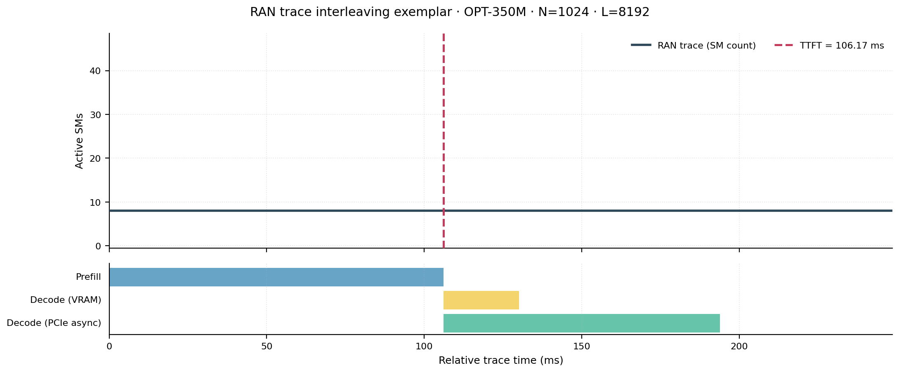
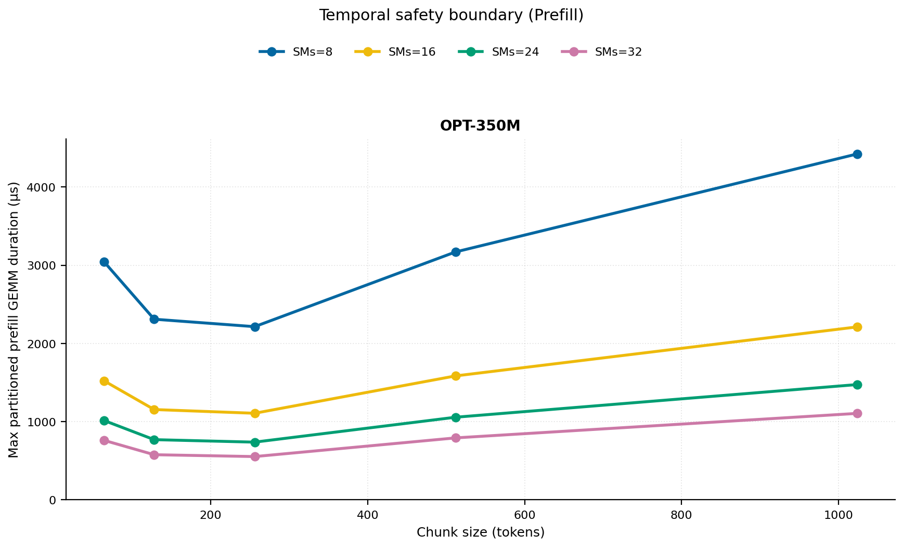
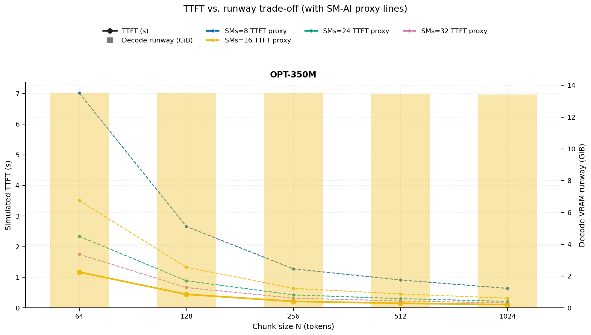
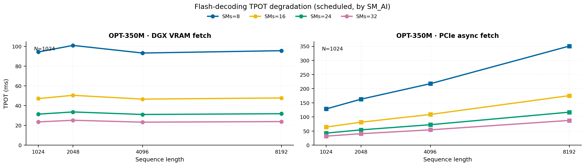
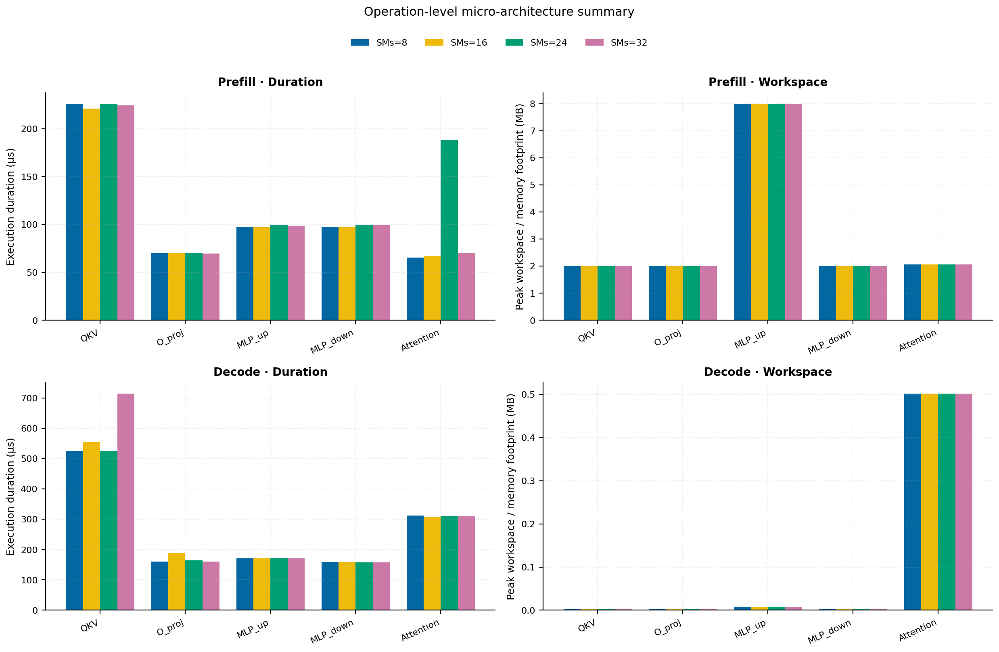
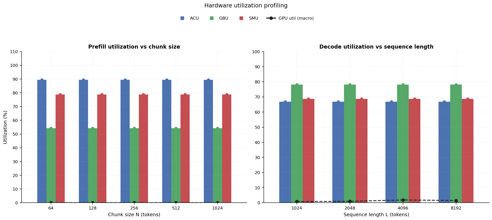

# RAN Inference Profiling Report

Run root: `/mnt/data/dheeraj/dicertation/inference-profile/runs/revised-rerun-20260415-020401-g1-opt350m`

## Environment

| field | value |
| --- | --- |
| cache_root | n/a |
| captured_at | 2026-04-15T01:04:08Z |
| chunk_sizes | [64, 128, 256, 512, 1024] |
| cuda_available | true |
| cuda_device_count | 8 |
| cwd | /mnt/data/dheeraj/dicertation/inference-profile |
| decode_modes | ["vram", "pcie_async"] |
| experiment_type | ran-dgxspark-v1 |
| gpu_id | 1 |
| l_out | 1024 |
| models | ["facebook/opt-350m"] |
| platform | Linux-6.8.0-106-generic-x86_64-with-glibc2.35 |
| python_executable | /home/dheeraj/miniconda3/envs/mls/bin/python |
| python_version | 3.11.14 |
| run_root | /mnt/data/dheeraj/dicertation/inference-profile/runs/revised-rerun-20260415-020401-g1-opt350m |
| scheduler | envelope_v1 |
| schema_version | ran_dgxspark_v1 |
| sequence_lengths | [1024, 2048, 4096, 8192] |
| sm_ai_cap | 32 |
| sm_ai_partition | 100 |
| sm_ai_partitions | [8, 16, 24, 32] |
| stage | profile |
| telemetry_tier | baseline_nvml_pt |
| timed_iterations | 5 |
| torch_available | true |
| torch_version | 2.10.0+cu128 |
| warmup_iterations | 3 |

## Model Constants

| model_id | sm_ai_partition | num_hidden_layers | hidden_size | num_attention_heads | ffn_dim | layer_index | layer_weight_bytes | total_weight_bytes_fp16 | vram_ceiling_bytes |
| --- | --- | --- | --- | --- | --- | --- | --- | --- | --- |
| facebook/opt-350m | 100 | 24 | 1024 | 16 | 4096 | 11 | 25192448 | 662392832 | 15170115993 |

## Trace Inspection

### Primary trace

| field | value |
| --- | --- |
| errors | [] |
| header | ["frame", "slot", "time_slot_sched_ns", "time_decode_start_est_ns", "time_decode_end_est_ns", "time_decode_start_actual_ns", "time_decode_end_actual_ns", "decode_dur_us", "deadline_met", "target_sm", "profile_idx", "sm_count", "num_pusch", "sum_prb", "sum_tbs_bytes", "max_mcs"] |
| median_positive_delta_ms | 5.6997 |
| monotonicity.checked_column | time_slot_sched_ns |
| monotonicity.is_non_decreasing | true |
| monotonicity.negative_delta_count | 0 |
| monotonicity.positive_delta_count | 28377 |
| monotonicity.zero_delta_count | 0 |
| normalization.last_row_duration_policy | median_positive_forward_delta_ms |
| normalization.output_columns | ["time_ms", "sm_utilization", "slot_duration_ms", "source_schema", "sm_count"] |
| normalization.output_relative_path | derived/normalized_ldpc_trace.csv |
| normalized_row_count | 28378 |
| path | /mnt/raid0sata2/netsys/weaver-ext/ran/traces/e2e_2026030418/e2e_20260304_182034_tractor_ran_ctrl/ldpc_trace.csv |
| row_count | 28378 |
| schema_detected | schema_b |
| time_unit_hint | ns |
| usable | true |
| usage_policy | primary_only |
| used_for_scheduler_capacity | true |

### Secondary trace

| field | value |
| --- | --- |
| errors | ["ran_ctrl_trace.csv line 182958 has 9 field(s); expected 12"] |
| header | ["frame", "slot", "sm_available", "prbs_available", "prbs_allocated", "w_avg_mcs_prev", "w_avg_mcs_curr", "slots_since_underutil", "ramp_up_count", "num_ue_sched", "max_ue_backlog", "sum_ue_backlog"] |
| monotonicity.checked_column | n/a |
| monotonicity.is_non_decreasing | n/a |
| monotonicity.negative_delta_count | n/a |
| path | /mnt/raid0sata2/netsys/weaver-ext/ran/traces/e2e_2026030418/e2e_20260304_182034_tractor_ran_ctrl/ran_ctrl_trace.csv |
| row_count | 182956 |
| time_unit_hints | [] |
| usable | false |
| usage_policy | structural_only |
| used_for_scheduler_capacity | false |

## Raw-Profile Summary Tables

### Prefill profile summary

Source raw rows: `raw/prefill_events.csv` = 700. Summary artifact: `derived/prefill_summary.csv`.

| model_id | chunk_tokens | sm_ai_partition | max_input_tokens | prefill_max_gemm_us | prefill_workspace_bytes | prefill_parked_activation_bytes | telemetry_tier | telemetry_provider | telemetry_status | nvml_available | gpu_util | gpu_mem_used_mb | sm_clock_mhz | mem_clock_mhz | power_w | pt_step_ms | pt_mem_alloc_mb | pt_mem_reserved_mb | pt_workspace_mb | acu_pct | gbu_pct | smu_pct | microscopic_telemetry_status | microscopic_error |
| --- | --- | --- | --- | --- | --- | --- | --- | --- | --- | --- | --- | --- | --- | --- | --- | --- | --- | --- | --- | --- | --- | --- | --- | --- |
| facebook/opt-350m | 64 | 8 | 1024 | 152.448 | 524288 | 524288 | baseline_nvml_pt | nvidia-smi | ok | true | 0 | 2538 | 1695 | 7601 | 60.15 | 0.1524 | 34.6426 | 34.6426 | 0.5 | 79 | 62.5 | 67.5 | estimated | n/a |
| facebook/opt-350m | 64 | 16 | 1024 | 126.112 | 524288 | 524288 | baseline_nvml_pt | nvidia-smi | ok | true | 0 | 2538 | 1695 | 7601 | 60 | 0.1261 | 34.6426 | 34.6426 | 0.5 | 86 | 57 | 75 | estimated | n/a |
| facebook/opt-350m | 64 | 24 | 1024 | 124.672 | 524288 | 524288 | baseline_nvml_pt | nvidia-smi | ok | true | 0 | 2538 | 1695 | 7601 | 60.52 | 0.1247 | 34.6426 | 34.6426 | 0.5 | 93 | 51.5 | 82.5 | estimated | n/a |
| facebook/opt-350m | 64 | 32 | 1024 | 126.912 | 524288 | 524288 | baseline_nvml_pt | nvidia-smi | ok | true | 0 | 2538 | 1695 | 7601 | 60.52 | 0.1269 | 34.6426 | 34.6426 | 0.5 | 100 | 46 | 90 | estimated | n/a |
| facebook/opt-350m | 128 | 8 | 1024 | 103.424 | 1048576 | 1048576 | baseline_nvml_pt | nvidia-smi | ok | true | 0 | 2538 | 1695 | 7601 | 60.87 | 0.1034 | 36.1426 | 36.1426 | 1 | 79 | 62.5 | 67.5 | estimated | n/a |
| facebook/opt-350m | 128 | 16 | 1024 | 86.272 | 1048576 | 1048576 | baseline_nvml_pt | nvidia-smi | ok | true | 0 | 2538 | 1695 | 7601 | 60.98 | 0.0863 | 36.1426 | 36.1426 | 1 | 86 | 57 | 75 | estimated | n/a |
| facebook/opt-350m | 128 | 24 | 1024 | 142.336 | 1048576 | 1048576 | baseline_nvml_pt | nvidia-smi | ok | true | 0 | 2538 | 1695 | 7601 | 60.99 | 0.1423 | 36.1426 | 36.1426 | 1 | 93 | 51.5 | 82.5 | estimated | n/a |
| facebook/opt-350m | 128 | 32 | 1024 | 96.256 | 1048576 | 1048576 | baseline_nvml_pt | nvidia-smi | ok | true | 0 | 2538 | 1695 | 7601 | 61.46 | 0.0963 | 36.1426 | 36.1426 | 1 | 100 | 46 | 90 | estimated | n/a |
| facebook/opt-350m | 256 | 8 | 1024 | 117.76 | 2097152 | 2097152 | baseline_nvml_pt | nvidia-smi | ok | true | 0 | 2538 | 1695 | 7601 | 61.68 | 0.1178 | 39.1426 | 39.1426 | 2 | 79 | 62.5 | 67.5 | estimated | n/a |
| facebook/opt-350m | 256 | 16 | 1024 | 102.4 | 2097152 | 2097152 | baseline_nvml_pt | nvidia-smi | ok | true | 0 | 2538 | 1695 | 7601 | 61.38 | 0.1024 | 39.1426 | 39.1426 | 2 | 86 | 57 | 75 | estimated | n/a |
| facebook/opt-350m | 256 | 24 | 1024 | 103.424 | 2097152 | 2097152 | baseline_nvml_pt | nvidia-smi | ok | true | 0 | 2538 | 1695 | 7601 | 61.47 | 0.1034 | 39.1426 | 39.1426 | 2 | 93 | 51.5 | 82.5 | estimated | n/a |
| facebook/opt-350m | 256 | 32 | 1024 | 92.288 | 2097152 | 2097152 | baseline_nvml_pt | nvidia-smi | ok | true | 0 | 2538 | 1695 | 7601 | 61.73 | 0.0923 | 39.1426 | 39.1426 | 2 | 100 | 46 | 90 | estimated | n/a |
| facebook/opt-350m | 512 | 8 | 1024 | 116.736 | 4194304 | 4194304 | baseline_nvml_pt | nvidia-smi | ok | true | 0 | 2538 | 1695 | 7601 | 62.05 | 0.1167 | 45.1426 | 45.1426 | 4 | 79 | 62.5 | 67.5 | estimated | n/a |
| facebook/opt-350m | 512 | 16 | 1024 | 119.808 | 4194304 | 4194304 | baseline_nvml_pt | nvidia-smi | ok | true | 0 | 2538 | 1695 | 7601 | 62.33 | 0.1198 | 45.1426 | 45.1426 | 4 | 86 | 57 | 75 | estimated | n/a |
| facebook/opt-350m | 512 | 24 | 1024 | 119.808 | 4194304 | 4194304 | baseline_nvml_pt | nvidia-smi | ok | true | 0 | 2538 | 1695 | 7601 | 61.88 | 0.1198 | 45.1426 | 45.1426 | 4 | 93 | 51.5 | 82.5 | estimated | n/a |
| facebook/opt-350m | 512 | 32 | 1024 | 132.096 | 4194304 | 4194304 | baseline_nvml_pt | nvidia-smi | ok | true | 0 | 2538 | 1695 | 7601 | 62.14 | 0.1321 | 45.1426 | 45.1426 | 4 | 100 | 46 | 90 | estimated | n/a |
| facebook/opt-350m | 1024 | 8 | 1024 | 172.32 | 8388608 | 8388608 | baseline_nvml_pt | nvidia-smi | ok | true | 0 | 2538 | 1695 | 7601 | 62.34 | 0.1723 | 57.1426 | 57.1426 | 8 | 79 | 62.5 | 67.5 | estimated | n/a |
| facebook/opt-350m | 1024 | 16 | 1024 | 166.688 | 8388608 | 8388608 | baseline_nvml_pt | nvidia-smi | ok | true | 0 | 2538 | 1695 | 7601 | 55.01 | 0.1667 | 57.1426 | 57.1426 | 8 | 86 | 57 | 75 | estimated | n/a |
| facebook/opt-350m | 1024 | 24 | 1024 | 180.224 | 8388608 | 8388608 | baseline_nvml_pt | nvidia-smi | ok | true | 0 | 2538 | 1695 | 7601 | 62.8 | 3.0597 | 57.1426 | 57.1426 | 8 | 93 | 51.5 | 82.5 | estimated | n/a |
| facebook/opt-350m | 1024 | 32 | 1024 | 184.32 | 8388608 | 8388608 | baseline_nvml_pt | nvidia-smi | ok | true | 0 | 2538 | 1695 | 7601 | 59.57 | 0.1843 | 57.1426 | 57.1426 | 8 | 100 | 46 | 90 | estimated | n/a |

### Decode profile summary

Source raw rows: `raw/decode_events.csv` = 6400. Summary artifact: `derived/decode_summary.csv`.

| model_id | sequence_length | block_size | sm_ai_partition | decode_mode | decode_max_gemv_us | attention_fetch_compute_us | reduction_overhead_us | decode_workspace_bytes | decode_parked_activation_bytes | telemetry_tier | telemetry_provider | telemetry_status | nvml_available | gpu_util | gpu_mem_used_mb | sm_clock_mhz | mem_clock_mhz | power_w | pt_step_ms | pt_mem_alloc_mb | pt_mem_reserved_mb | pt_workspace_mb | acu_pct | gbu_pct | smu_pct | microscopic_telemetry_status | microscopic_error |
| --- | --- | --- | --- | --- | --- | --- | --- | --- | --- | --- | --- | --- | --- | --- | --- | --- | --- | --- | --- | --- | --- | --- | --- | --- | --- | --- | --- |
| facebook/opt-350m | 1024 | 64 | 8 | pcie_async | 139.264 | 137.472 | 22.2464 | 67584 | 2048 | baseline_nvml_pt | nvidia-smi | ok | true | 0 | 2536 | 1695 | 7601 | 61.59 | 0.1546 | 36.2188 | 36.2188 | 0.0645 | 56.5 | 87 | 59 | estimated | n/a |
| facebook/opt-350m | 1024 | 64 | 8 | vram | 151.424 | 143.1168 | 22.688 | 67584 | 2048 | baseline_nvml_pt | nvidia-smi | ok | true | 0 | 2536 | 1695 | 7601 | 61.46 | 0.1567 | 36.2188 | 36.2188 | 0.0645 | 63 | 77.5 | 62 | estimated | n/a |
| facebook/opt-350m | 1024 | 64 | 16 | pcie_async | 141.344 | 134.2912 | 20.5376 | 67584 | 2048 | baseline_nvml_pt | nvidia-smi | ok | true | 0 | 2538 | 1695 | 7601 | 61.48 | 0.1413 | 36.2188 | 36.2188 | 0.0645 | 61 | 84 | 64 | estimated | n/a |
| facebook/opt-350m | 1024 | 64 | 16 | vram | 110.304 | 128.3776 | 20.1856 | 67584 | 2048 | baseline_nvml_pt | nvidia-smi | ok | true | 0 | 2538 | 1695 | 7601 | 62.14 | 0.1372 | 36.2188 | 36.2188 | 0.0645 | 68 | 75 | 68 | estimated | n/a |
| facebook/opt-350m | 1024 | 64 | 24 | pcie_async | 131.872 | 129.376 | 20.6528 | 67584 | 2048 | baseline_nvml_pt | nvidia-smi | ok | true | 0 | 2538 | 1695 | 7601 | 61.53 | 0.1432 | 36.2188 | 36.2188 | 0.0645 | 65.5 | 81 | 69 | estimated | n/a |
| facebook/opt-350m | 1024 | 64 | 24 | vram | 147.648 | 150.9568 | 24.1472 | 67584 | 2048 | baseline_nvml_pt | nvidia-smi | ok | true | 0 | 2538 | 1695 | 7601 | 61.81 | 0.169 | 36.2188 | 36.2188 | 0.0645 | 73 | 72.5 | 74 | estimated | n/a |
| facebook/opt-350m | 1024 | 64 | 32 | pcie_async | 148.48 | 127.6224 | 22.2464 | 67584 | 2048 | baseline_nvml_pt | nvidia-smi | ok | true | 0 | 2536 | 1695 | 7601 | 62.75 | 0.1485 | 36.2188 | 36.2188 | 0.0645 | 70 | 78 | 74 | estimated | n/a |
| facebook/opt-350m | 1024 | 64 | 32 | vram | 129.024 | 127.0208 | 20.4992 | 67584 | 2048 | baseline_nvml_pt | nvidia-smi | ok | true | 8 | 2536 | 1695 | 7601 | 62.69 | 0.1393 | 36.2188 | 36.2188 | 0.0645 | 78 | 70 | 80 | estimated | n/a |
| facebook/opt-350m | 1024 | 128 | 8 | pcie_async | 152.576 | 127.6096 | 20.6912 | 67584 | 2048 | baseline_nvml_pt | nvidia-smi | ok | true | 0 | 2536 | 1695 | 7601 | 62.69 | 0.1526 | 36.2188 | 36.2188 | 0.0645 | 56.5 | 87 | 59 | estimated | n/a |
| facebook/opt-350m | 1024 | 128 | 8 | vram | 138.24 | 127.296 | 20.736 | 67584 | 2048 | baseline_nvml_pt | nvidia-smi | ok | true | 0 | 2538 | 1695 | 7601 | 62.9 | 0.1382 | 36.2188 | 36.2188 | 0.0645 | 63 | 77.5 | 62 | estimated | n/a |
| facebook/opt-350m | 1024 | 128 | 16 | pcie_async | 147.456 | 138.2976 | 24.1344 | 67584 | 2048 | baseline_nvml_pt | nvidia-smi | ok | true | 0 | 2536 | 1695 | 7601 | 63.17 | 0.1536 | 36.2188 | 36.2188 | 0.0645 | 61 | 84 | 64 | estimated | n/a |
| facebook/opt-350m | 1024 | 128 | 16 | vram | 111.616 | 124.7104 | 19.904 | 67584 | 2048 | baseline_nvml_pt | nvidia-smi | ok | true | 0 | 2538 | 1695 | 7601 | 62.61 | 0.127 | 36.2188 | 36.2188 | 0.0645 | 68 | 75 | 68 | estimated | n/a |
| facebook/opt-350m | 1024 | 128 | 24 | pcie_async | 129.92 | 122.6752 | 21.4976 | 67584 | 2048 | baseline_nvml_pt | nvidia-smi | ok | true | 0 | 2538 | 1695 | 7601 | 62.69 | 0.1299 | 36.2188 | 36.2188 | 0.0645 | 65.5 | 81 | 69 | estimated | n/a |
| facebook/opt-350m | 1024 | 128 | 24 | vram | 142.208 | 127.4112 | 20.3264 | 67584 | 2048 | baseline_nvml_pt | nvidia-smi | ok | true | 0 | 2538 | 1695 | 7601 | 63.25 | 0.1422 | 36.2188 | 36.2188 | 0.0645 | 73 | 72.5 | 74 | estimated | n/a |
| facebook/opt-350m | 1024 | 128 | 32 | pcie_async | 146.624 | 133.7152 | 20.512 | 67584 | 2048 | baseline_nvml_pt | nvidia-smi | ok | true | 1 | 2536 | 1695 | 7601 | 62.08 | 0.1466 | 36.2188 | 36.2188 | 0.0645 | 70 | 78 | 74 | estimated | n/a |
| facebook/opt-350m | 1024 | 128 | 32 | vram | 135.168 | 131.4624 | 21.0816 | 67584 | 2048 | baseline_nvml_pt | nvidia-smi | ok | true | 8 | 2538 | 1695 | 7601 | 62.76 | 0.1402 | 36.2188 | 36.2188 | 0.0645 | 78 | 70 | 80 | estimated | n/a |
| facebook/opt-350m | 1024 | 256 | 8 | pcie_async | 139.264 | 128.6016 | 20.8 | 67584 | 2048 | baseline_nvml_pt | nvidia-smi | ok | true | 0 | 2538 | 1695 | 7601 | 62.99 | 0.1393 | 36.2188 | 36.2188 | 0.0645 | 56.5 | 87 | 59 | estimated | n/a |
| facebook/opt-350m | 1024 | 256 | 8 | vram | 141.28 | 127.5712 | 20.2944 | 67584 | 2048 | baseline_nvml_pt | nvidia-smi | ok | true | 1 | 2538 | 1695 | 7601 | 62.37 | 0.1413 | 36.2188 | 36.2188 | 0.0645 | 63 | 77.5 | 62 | estimated | n/a |
| facebook/opt-350m | 1024 | 256 | 16 | pcie_async | 143.36 | 131.936 | 20.0128 | 67584 | 2048 | baseline_nvml_pt | nvidia-smi | ok | true | 0 | 2538 | 1695 | 7601 | 62.58 | 0.1435 | 36.2188 | 36.2188 | 0.0645 | 61 | 84 | 64 | estimated | n/a |
| facebook/opt-350m | 1024 | 256 | 16 | vram | 133.12 | 130.0352 | 20.896 | 67584 | 2048 | baseline_nvml_pt | nvidia-smi | ok | true | 1 | 2538 | 1695 | 7601 | 63.05 | 0.1413 | 36.2188 | 36.2188 | 0.0645 | 68 | 75 | 68 | estimated | n/a |
| facebook/opt-350m | 1024 | 256 | 24 | pcie_async | 133.088 | 128.5696 | 21.4208 | 67584 | 2048 | baseline_nvml_pt | nvidia-smi | ok | true | 0 | 2538 | 1695 | 7601 | 62.53 | 0.1362 | 36.2188 | 36.2188 | 0.0645 | 65.5 | 81 | 69 | estimated | n/a |
| facebook/opt-350m | 1024 | 256 | 24 | vram | 149.44 | 134.3424 | 21.6576 | 67584 | 2048 | baseline_nvml_pt | nvidia-smi | ok | true | 0 | 2538 | 1695 | 7601 | 63.1 | 0.1494 | 36.2188 | 36.2188 | 0.0645 | 73 | 72.5 | 74 | estimated | n/a |
| facebook/opt-350m | 1024 | 256 | 32 | pcie_async | 129.952 | 124.4736 | 19.6608 | 67584 | 2048 | baseline_nvml_pt | nvidia-smi | ok | true | 0 | 2538 | 1695 | 7601 | 63.12 | 0.13 | 36.2188 | 36.2188 | 0.0645 | 70 | 78 | 74 | estimated | n/a |
| facebook/opt-350m | 1024 | 256 | 32 | vram | 143.36 | 130.656 | 21.3824 | 67584 | 2048 | baseline_nvml_pt | nvidia-smi | ok | true | 0 | 2538 | 1695 | 7601 | 62.9 | 0.1434 | 36.2188 | 36.2188 | 0.0645 | 78 | 70 | 80 | estimated | n/a |
| facebook/opt-350m | 1024 | 512 | 8 | pcie_async | 129.024 | 121.0368 | 19.968 | 67584 | 2048 | baseline_nvml_pt | nvidia-smi | ok | true | 0 | 2536 | 1695 | 7601 | 63.13 | 0.129 | 36.2188 | 36.2188 | 0.0645 | 56.5 | 87 | 59 | estimated | n/a |
| facebook/opt-350m | 1024 | 512 | 8 | vram | 148.672 | 139.616 | 21.376 | 67584 | 2048 | baseline_nvml_pt | nvidia-smi | ok | true | 1 | 2538 | 1695 | 7601 | 62.87 | 0.1487 | 36.2188 | 36.2188 | 0.0645 | 63 | 77.5 | 62 | estimated | n/a |
| facebook/opt-350m | 1024 | 512 | 16 | pcie_async | 148.48 | 141.9648 | 23.136 | 67584 | 2048 | baseline_nvml_pt | nvidia-smi | ok | true | 0 | 2538 | 1695 | 7601 | 62.54 | 0.1546 | 36.2188 | 36.2188 | 0.0645 | 61 | 84 | 64 | estimated | n/a |
| facebook/opt-350m | 1024 | 512 | 16 | vram | 132.288 | 127.5968 | 21.5104 | 67584 | 2048 | baseline_nvml_pt | nvidia-smi | ok | true | 8 | 2536 | 1695 | 7601 | 63.23 | 0.1403 | 36.2188 | 36.2188 | 0.0645 | 68 | 75 | 68 | estimated | n/a |
| facebook/opt-350m | 1024 | 512 | 24 | pcie_async | 131.072 | 134.688 | 21.3824 | 67584 | 2048 | baseline_nvml_pt | nvidia-smi | ok | true | 0 | 2538 | 1695 | 7601 | 62.88 | 0.1649 | 36.2188 | 36.2188 | 0.0645 | 65.5 | 81 | 69 | estimated | n/a |
| facebook/opt-350m | 1024 | 512 | 24 | vram | 143.36 | 137.8624 | 21.3568 | 67584 | 2048 | baseline_nvml_pt | nvidia-smi | ok | true | 1 | 2538 | 1695 | 7601 | 61.55 | 0.1546 | 36.2188 | 36.2188 | 0.0645 | 73 | 72.5 | 74 | estimated | n/a |
| facebook/opt-350m | 1024 | 512 | 32 | pcie_async | 19151.8726 | 158.496 | 29.8688 | 67584 | 2048 | baseline_nvml_pt | nvidia-smi | ok | true | 0 | 2538 | 1695 | 7601 | 63.1 | 19.1519 | 36.2188 | 36.2188 | 0.0645 | 70 | 78 | 74 | estimated | n/a |
| facebook/opt-350m | 1024 | 512 | 32 | vram | 147.456 | 143.1104 | 21.7344 | 67584 | 2048 | baseline_nvml_pt | nvidia-smi | ok | true | 0 | 2536 | 1695 | 7601 | 62.69 | 0.1567 | 36.2188 | 36.2188 | 0.0645 | 78 | 70 | 80 | estimated | n/a |
| facebook/opt-350m | 1024 | 1024 | 8 | pcie_async | 124.928 | 131.648 | 22.1568 | 67584 | 2048 | baseline_nvml_pt | nvidia-smi | ok | true | 1 | 2538 | 1695 | 7601 | 63.51 | 0.1567 | 36.2188 | 36.2188 | 0.0645 | 56.5 | 87 | 59 | estimated | n/a |
| facebook/opt-350m | 1024 | 1024 | 8 | vram | 154.624 | 151.6032 | 23.168 | 67584 | 2048 | baseline_nvml_pt | nvidia-smi | ok | true | 0 | 2538 | 1695 | 7601 | 63.53 | 0.1669 | 36.2188 | 36.2188 | 0.0645 | 63 | 77.5 | 62 | estimated | n/a |
| facebook/opt-350m | 1024 | 1024 | 16 | pcie_async | 134.08 | 124.5888 | 20.608 | 67584 | 2048 | baseline_nvml_pt | nvidia-smi | ok | true | 1 | 2538 | 1695 | 7601 | 63.06 | 0.1341 | 36.2188 | 36.2188 | 0.0645 | 61 | 84 | 64 | estimated | n/a |
| facebook/opt-350m | 1024 | 1024 | 16 | vram | 133.088 | 134.4192 | 21.184 | 67584 | 2048 | baseline_nvml_pt | nvidia-smi | ok | true | 1 | 2538 | 1695 | 7601 | 63.4 | 0.1543 | 36.2188 | 36.2188 | 0.0645 | 68 | 75 | 68 | estimated | n/a |
| facebook/opt-350m | 1024 | 1024 | 24 | pcie_async | 138.24 | 131.5264 | 20.3136 | 67584 | 2048 | baseline_nvml_pt | nvidia-smi | ok | true | 0 | 2538 | 1695 | 7601 | 63.17 | 0.1382 | 36.2188 | 36.2188 | 0.0645 | 65.5 | 81 | 69 | estimated | n/a |
| facebook/opt-350m | 1024 | 1024 | 24 | vram | 123.776 | 124.9856 | 20.32 | 67584 | 2048 | baseline_nvml_pt | nvidia-smi | ok | true | 0 | 2538 | 1695 | 7601 | 63.23 | 0.128 | 36.2188 | 36.2188 | 0.0645 | 73 | 72.5 | 74 | estimated | n/a |
| facebook/opt-350m | 1024 | 1024 | 32 | pcie_async | 142.336 | 126.4064 | 20.6336 | 67584 | 2048 | baseline_nvml_pt | nvidia-smi | ok | true | 0 | 2536 | 1695 | 7601 | 63.48 | 0.1423 | 36.2188 | 36.2188 | 0.0645 | 70 | 78 | 74 | estimated | n/a |
| facebook/opt-350m | 1024 | 1024 | 32 | vram | 139.264 | 126.432 | 20.6272 | 67584 | 2048 | baseline_nvml_pt | nvidia-smi | ok | true | 0 | 2538 | 1695 | 7601 | 63.22 | 0.1393 | 36.2188 | 36.2188 | 0.0645 | 78 | 70 | 80 | estimated | n/a |
| facebook/opt-350m | 2048 | 64 | 8 | pcie_async | 138.08 | 133.7344 | 21.5232 | 133120 | 2048 | baseline_nvml_pt | nvidia-smi | ok | true | 0 | 2536 | 1695 | 7601 | 62.88 | 0.1464 | 40.2812 | 40.2812 | 0.127 | 56.5 | 87 | 59 | estimated | n/a |
| facebook/opt-350m | 2048 | 64 | 8 | vram | 133.12 | 125.504 | 20.9216 | 133120 | 2048 | baseline_nvml_pt | nvidia-smi | ok | true | 1 | 2538 | 1695 | 7601 | 62.83 | 0.1331 | 40.2812 | 40.2812 | 0.127 | 63 | 77.5 | 62 | estimated | n/a |
| facebook/opt-350m | 2048 | 64 | 16 | pcie_async | 129.024 | 122.7072 | 19.6992 | 133120 | 2048 | baseline_nvml_pt | nvidia-smi | ok | true | 0 | 2538 | 1695 | 7601 | 63.2 | 0.129 | 40.2812 | 40.2812 | 0.127 | 61 | 84 | 64 | estimated | n/a |
| facebook/opt-350m | 2048 | 64 | 16 | vram | 140.288 | 126.8992 | 20.2304 | 133120 | 2048 | baseline_nvml_pt | nvidia-smi | ok | true | 1 | 2538 | 1695 | 7601 | 63.35 | 0.1403 | 40.2812 | 40.2812 | 0.127 | 68 | 75 | 68 | estimated | n/a |
| facebook/opt-350m | 2048 | 64 | 24 | pcie_async | 150.528 | 144.6464 | 21.7088 | 133120 | 2048 | baseline_nvml_pt | nvidia-smi | ok | true | 0 | 2538 | 1695 | 7601 | 63.38 | 0.1649 | 40.2812 | 40.2812 | 0.127 | 65.5 | 81 | 69 | estimated | n/a |
| facebook/opt-350m | 2048 | 64 | 24 | vram | 147.232 | 138.0032 | 20.8896 | 133120 | 2048 | baseline_nvml_pt | nvidia-smi | ok | true | 0 | 2538 | 1695 | 7601 | 63.03 | 0.1472 | 40.2812 | 40.2812 | 0.127 | 73 | 72.5 | 74 | estimated | n/a |
| facebook/opt-350m | 2048 | 64 | 32 | pcie_async | 139.264 | 130.8352 | 20.6976 | 133120 | 2048 | baseline_nvml_pt | nvidia-smi | ok | true | 0 | 2538 | 1695 | 7601 | 63.62 | 0.1483 | 40.2812 | 40.2812 | 0.127 | 70 | 78 | 74 | estimated | n/a |
| facebook/opt-350m | 2048 | 64 | 32 | vram | 155.648 | 133.12 | 20.4928 | 133120 | 2048 | baseline_nvml_pt | nvidia-smi | ok | true | 0 | 2538 | 1695 | 7601 | 63.06 | 0.1556 | 40.2812 | 40.2812 | 0.127 | 78 | 70 | 80 | estimated | n/a |
| facebook/opt-350m | 2048 | 128 | 8 | pcie_async | 130.048 | 122.2656 | 20.2368 | 133120 | 2048 | baseline_nvml_pt | nvidia-smi | ok | true | 0 | 2538 | 1695 | 7601 | 63.38 | 0.13 | 40.2812 | 40.2812 | 0.127 | 56.5 | 87 | 59 | estimated | n/a |
| facebook/opt-350m | 2048 | 128 | 8 | vram | 126.976 | 127.5776 | 20.3264 | 133120 | 2048 | baseline_nvml_pt | nvidia-smi | ok | true | 0 | 2538 | 1695 | 7601 | 63.68 | 0.1444 | 40.2812 | 40.2812 | 0.127 | 63 | 77.5 | 62 | estimated | n/a |
| facebook/opt-350m | 2048 | 128 | 16 | pcie_async | 131.072 | 121.9584 | 20.1728 | 133120 | 2048 | baseline_nvml_pt | nvidia-smi | ok | true | 0 | 2536 | 1695 | 7601 | 63.77 | 0.1311 | 40.2812 | 40.2812 | 0.127 | 61 | 84 | 64 | estimated | n/a |
| facebook/opt-350m | 2048 | 128 | 16 | vram | 137.216 | 133.6 | 21.0368 | 133120 | 2048 | baseline_nvml_pt | nvidia-smi | ok | true | 1 | 2538 | 1695 | 7601 | 62.63 | 0.1425 | 40.2812 | 40.2812 | 0.127 | 68 | 75 | 68 | estimated | n/a |
| facebook/opt-350m | 2048 | 128 | 24 | pcie_async | 130.048 | 128.8576 | 19.7952 | 133120 | 2048 | baseline_nvml_pt | nvidia-smi | ok | true | 6 | 2538 | 1695 | 7601 | 63.51 | 0.1423 | 40.2812 | 40.2812 | 0.127 | 65.5 | 81 | 69 | estimated | n/a |
| facebook/opt-350m | 2048 | 128 | 24 | vram | 131.072 | 125.8752 | 20.0832 | 133120 | 2048 | baseline_nvml_pt | nvidia-smi | ok | true | 1 | 2538 | 1695 | 7601 | 63.35 | 0.1331 | 40.2812 | 40.2812 | 0.127 | 73 | 72.5 | 74 | estimated | n/a |
| facebook/opt-350m | 2048 | 128 | 32 | pcie_async | 156.672 | 148.6912 | 22.464 | 133120 | 2048 | baseline_nvml_pt | nvidia-smi | ok | true | 2 | 2538 | 1695 | 7601 | 63.08 | 0.1609 | 40.2812 | 40.2812 | 0.127 | 70 | 78 | 74 | estimated | n/a |
| facebook/opt-350m | 2048 | 128 | 32 | vram | 129.28 | 123.8976 | 19.8656 | 133120 | 2048 | baseline_nvml_pt | nvidia-smi | ok | true | 0 | 2538 | 1695 | 7601 | 63.39 | 0.1311 | 40.2812 | 40.2812 | 0.127 | 78 | 70 | 80 | estimated | n/a |
| facebook/opt-350m | 2048 | 256 | 8 | pcie_async | 135.968 | 129.2352 | 20.2176 | 133120 | 2048 | baseline_nvml_pt | nvidia-smi | ok | true | 0 | 2538 | 1695 | 7601 | 63.48 | 0.136 | 40.2812 | 40.2812 | 0.127 | 56.5 | 87 | 59 | estimated | n/a |
| facebook/opt-350m | 2048 | 256 | 8 | vram | 144.384 | 126.56 | 22.1184 | 133120 | 2048 | baseline_nvml_pt | nvidia-smi | ok | true | 0 | 2538 | 1695 | 7601 | 62.84 | 0.1444 | 40.2812 | 40.2812 | 0.127 | 63 | 77.5 | 62 | estimated | n/a |
| facebook/opt-350m | 2048 | 256 | 16 | pcie_async | 146.432 | 133.92 | 20.8512 | 133120 | 2048 | baseline_nvml_pt | nvidia-smi | ok | true | 1 | 2538 | 1695 | 7601 | 63.55 | 0.1464 | 40.2812 | 40.2812 | 0.127 | 61 | 84 | 64 | estimated | n/a |
| facebook/opt-350m | 2048 | 256 | 16 | vram | 150.528 | 127.4176 | 21.2608 | 133120 | 2048 | baseline_nvml_pt | nvidia-smi | ok | true | 0 | 2538 | 1695 | 7601 | 62.81 | 0.1505 | 40.2812 | 40.2812 | 0.127 | 68 | 75 | 68 | estimated | n/a |
| facebook/opt-350m | 2048 | 256 | 24 | pcie_async | 137.216 | 138.752 | 21.1968 | 133120 | 2048 | baseline_nvml_pt | nvidia-smi | ok | true | 7 | 2538 | 1695 | 7601 | 63.44 | 0.1584 | 40.2812 | 40.2812 | 0.127 | 65.5 | 81 | 69 | estimated | n/a |
| facebook/opt-350m | 2048 | 256 | 24 | vram | 142.208 | 132.9152 | 20.5568 | 133120 | 2048 | baseline_nvml_pt | nvidia-smi | ok | true | 0 | 2538 | 1695 | 7601 | 63.62 | 0.1423 | 40.2812 | 40.2812 | 0.127 | 73 | 72.5 | 74 | estimated | n/a |
| facebook/opt-350m | 2048 | 256 | 32 | pcie_async | 148.48 | 131.232 | 20.9088 | 133120 | 2048 | baseline_nvml_pt | nvidia-smi | ok | true | 0 | 2538 | 1695 | 7601 | 63.3 | 0.1485 | 40.2812 | 40.2812 | 0.127 | 70 | 78 | 74 | estimated | n/a |
| facebook/opt-350m | 2048 | 256 | 32 | vram | 151.552 | 143.104 | 20.5056 | 133120 | 2048 | baseline_nvml_pt | nvidia-smi | ok | true | 0 | 2536 | 1695 | 7601 | 63.88 | 0.1669 | 40.2812 | 40.2812 | 0.127 | 78 | 70 | 80 | estimated | n/a |
| facebook/opt-350m | 2048 | 512 | 8 | pcie_async | 203.808 | 172.8256 | 25.888 | 133120 | 2048 | baseline_nvml_pt | nvidia-smi | ok | true | 0 | 2538 | 1695 | 7601 | 63.47 | 0.2038 | 40.2812 | 40.2812 | 0.127 | 56.5 | 87 | 59 | estimated | n/a |
| facebook/opt-350m | 2048 | 512 | 8 | vram | 129.024 | 124.3392 | 20.2752 | 133120 | 2048 | baseline_nvml_pt | nvidia-smi | ok | true | 0 | 2538 | 1695 | 7601 | 63.24 | 0.1311 | 40.2812 | 40.2812 | 0.127 | 63 | 77.5 | 62 | estimated | n/a |
| facebook/opt-350m | 2048 | 512 | 16 | pcie_async | 167.904 | 129.8432 | 21.2864 | 133120 | 2048 | baseline_nvml_pt | nvidia-smi | ok | true | 0 | 2538 | 1695 | 7601 | 61.05 | 0.1679 | 40.2812 | 40.2812 | 0.127 | 61 | 84 | 64 | estimated | n/a |
| facebook/opt-350m | 2048 | 512 | 16 | vram | 3087.168 | 128.2112 | 20.064 | 133120 | 2048 | baseline_nvml_pt | nvidia-smi | ok | true | 0 | 2538 | 1695 | 7601 | 60.99 | 3.0872 | 40.2812 | 40.2812 | 0.127 | 68 | 75 | 68 | estimated | n/a |
| facebook/opt-350m | 2048 | 512 | 24 | pcie_async | 433.248 | 133.8944 | 20.8832 | 133120 | 2048 | baseline_nvml_pt | nvidia-smi | ok | true | 1 | 2536 | 1695 | 7601 | 63.43 | 0.4332 | 40.2812 | 40.2812 | 0.127 | 65.5 | 81 | 69 | estimated | n/a |
| facebook/opt-350m | 2048 | 512 | 24 | vram | 139.264 | 126.5792 | 20.4672 | 133120 | 2048 | baseline_nvml_pt | nvidia-smi | ok | true | 0 | 2536 | 1695 | 7601 | 62.89 | 0.1393 | 40.2812 | 40.2812 | 0.127 | 73 | 72.5 | 74 | estimated | n/a |
| facebook/opt-350m | 2048 | 512 | 32 | pcie_async | 143.36 | 130.208 | 20.4928 | 133120 | 2048 | baseline_nvml_pt | nvidia-smi | ok | true | 0 | 2538 | 1695 | 7601 | 63.03 | 0.1434 | 40.2812 | 40.2812 | 0.127 | 70 | 78 | 74 | estimated | n/a |
| facebook/opt-350m | 2048 | 512 | 32 | vram | 144.384 | 134.912 | 20.6528 | 133120 | 2048 | baseline_nvml_pt | nvidia-smi | ok | true | 6 | 2536 | 1695 | 7601 | 63.38 | 0.1444 | 40.2812 | 40.2812 | 0.127 | 78 | 70 | 80 | estimated | n/a |
| facebook/opt-350m | 2048 | 1024 | 8 | pcie_async | 151.552 | 131.7312 | 20.7168 | 133120 | 2048 | baseline_nvml_pt | nvidia-smi | ok | true | 1 | 2538 | 1695 | 7601 | 63.6 | 0.1516 | 40.2812 | 40.2812 | 0.127 | 56.5 | 87 | 59 | estimated | n/a |
| facebook/opt-350m | 2048 | 1024 | 8 | vram | 169.76 | 160.9728 | 24.3392 | 133120 | 2048 | baseline_nvml_pt | nvidia-smi | ok | true | 4 | 2538 | 1695 | 7601 | 63.15 | 0.1874 | 40.2812 | 40.2812 | 0.127 | 63 | 77.5 | 62 | estimated | n/a |
| facebook/opt-350m | 2048 | 1024 | 16 | pcie_async | 136.192 | 126.0992 | 20.7616 | 133120 | 2048 | baseline_nvml_pt | nvidia-smi | ok | true | 0 | 2538 | 1695 | 7601 | 63.33 | 0.1362 | 40.2812 | 40.2812 | 0.127 | 61 | 84 | 64 | estimated | n/a |
| facebook/opt-350m | 2048 | 1024 | 16 | vram | 149.696 | 130.6112 | 20.6848 | 133120 | 2048 | baseline_nvml_pt | nvidia-smi | ok | true | 0 | 2536 | 1695 | 7601 | 63.45 | 0.1497 | 40.2812 | 40.2812 | 0.127 | 68 | 75 | 68 | estimated | n/a |
| facebook/opt-350m | 2048 | 1024 | 24 | pcie_async | 152.576 | 133.9008 | 21.92 | 133120 | 2048 | baseline_nvml_pt | nvidia-smi | ok | true | 0 | 2538 | 1695 | 7601 | 63.43 | 0.1526 | 40.2812 | 40.2812 | 0.127 | 65.5 | 81 | 69 | estimated | n/a |
| facebook/opt-350m | 2048 | 1024 | 24 | vram | 130.048 | 126.944 | 21.3632 | 133120 | 2048 | baseline_nvml_pt | nvidia-smi | ok | true | 0 | 2538 | 1695 | 7601 | 63.88 | 0.1341 | 40.2812 | 40.2812 | 0.127 | 73 | 72.5 | 74 | estimated | n/a |
| facebook/opt-350m | 2048 | 1024 | 32 | pcie_async | 145.28 | 131.2192 | 20.4544 | 133120 | 2048 | baseline_nvml_pt | nvidia-smi | ok | true | 6 | 2538 | 1695 | 7601 | 63.66 | 0.1453 | 40.2812 | 40.2812 | 0.127 | 70 | 78 | 74 | estimated | n/a |
| facebook/opt-350m | 2048 | 1024 | 32 | vram | 149.472 | 134.1568 | 20.8256 | 133120 | 2048 | baseline_nvml_pt | nvidia-smi | ok | true | 0 | 2538 | 1695 | 7601 | 64.34 | 0.1495 | 40.2812 | 40.2812 | 0.127 | 78 | 70 | 80 | estimated | n/a |
| facebook/opt-350m | 4096 | 64 | 8 | pcie_async | 151.68 | 142.1632 | 22.1376 | 264192 | 2048 | baseline_nvml_pt | nvidia-smi | ok | true | 0 | 2538 | 1695 | 7601 | 63.51 | 0.1536 | 48.4062 | 48.4062 | 0.252 | 56.5 | 87 | 59 | estimated | n/a |
| facebook/opt-350m | 4096 | 64 | 8 | vram | 158.72 | 128.9536 | 20.8576 | 264192 | 2048 | baseline_nvml_pt | nvidia-smi | ok | true | 0 | 2538 | 1695 | 7601 | 63.24 | 0.1587 | 48.4062 | 48.4062 | 0.252 | 63 | 77.5 | 62 | estimated | n/a |
| facebook/opt-350m | 4096 | 64 | 16 | pcie_async | 184.096 | 128.9536 | 25.9584 | 264192 | 2048 | baseline_nvml_pt | nvidia-smi | ok | true | 0 | 2538 | 1695 | 7601 | 63.51 | 0.1841 | 48.4062 | 48.4062 | 0.252 | 61 | 84 | 64 | estimated | n/a |
| facebook/opt-350m | 4096 | 64 | 16 | vram | 140.192 | 132.6976 | 20.3264 | 264192 | 2048 | baseline_nvml_pt | nvidia-smi | ok | true | 0 | 2538 | 1695 | 7601 | 63.33 | 0.1444 | 48.4062 | 48.4062 | 0.252 | 68 | 75 | 68 | estimated | n/a |
| facebook/opt-350m | 4096 | 64 | 24 | pcie_async | 128 | 127.0016 | 20.8384 | 264192 | 2048 | baseline_nvml_pt | nvidia-smi | ok | true | 0 | 2538 | 1695 | 7601 | 63.51 | 0.1312 | 48.4062 | 48.4062 | 0.252 | 65.5 | 81 | 69 | estimated | n/a |
| facebook/opt-350m | 4096 | 64 | 24 | vram | 175.104 | 144.7552 | 22.4128 | 264192 | 2048 | baseline_nvml_pt | nvidia-smi | ok | true | 6 | 2538 | 1695 | 7601 | 63.38 | 0.1751 | 48.4062 | 48.4062 | 0.252 | 73 | 72.5 | 74 | estimated | n/a |
| facebook/opt-350m | 4096 | 64 | 32 | pcie_async | 157.44 | 162.8416 | 25.056 | 264192 | 2048 | baseline_nvml_pt | nvidia-smi | ok | true | 7 | 2538 | 1695 | 7601 | 63.4 | 0.1772 | 48.4062 | 48.4062 | 0.252 | 70 | 78 | 74 | estimated | n/a |
| facebook/opt-350m | 4096 | 64 | 32 | vram | 128.832 | 120.6784 | 19.4688 | 264192 | 2048 | baseline_nvml_pt | nvidia-smi | ok | true | 0 | 2538 | 1695 | 7601 | 63.48 | 0.1288 | 48.4062 | 48.4062 | 0.252 | 78 | 70 | 80 | estimated | n/a |
| facebook/opt-350m | 4096 | 128 | 8 | pcie_async | 139.104 | 129.9264 | 21.1136 | 264192 | 2048 | baseline_nvml_pt | nvidia-smi | ok | true | 0 | 2538 | 1695 | 7601 | 63.09 | 0.1394 | 48.4062 | 48.4062 | 0.252 | 56.5 | 87 | 59 | estimated | n/a |
| facebook/opt-350m | 4096 | 128 | 8 | vram | 140.288 | 137.8048 | 20.512 | 264192 | 2048 | baseline_nvml_pt | nvidia-smi | ok | true | 0 | 2538 | 1695 | 7601 | 63.19 | 0.1615 | 48.4062 | 48.4062 | 0.252 | 63 | 77.5 | 62 | estimated | n/a |
| facebook/opt-350m | 4096 | 128 | 16 | pcie_async | 127.872 | 126.496 | 20.8 | 264192 | 2048 | baseline_nvml_pt | nvidia-smi | ok | true | 1 | 2538 | 1695 | 7601 | 63.75 | 0.138 | 48.4062 | 48.4062 | 0.252 | 61 | 84 | 64 | estimated | n/a |
| facebook/opt-350m | 4096 | 128 | 16 | vram | 145.408 | 131.1232 | 21.2672 | 264192 | 2048 | baseline_nvml_pt | nvidia-smi | ok | true | 0 | 2538 | 1695 | 7601 | 62.97 | 0.1454 | 48.4062 | 48.4062 | 0.252 | 68 | 75 | 68 | estimated | n/a |
| facebook/opt-350m | 4096 | 128 | 24 | pcie_async | 140.288 | 131.584 | 20.8768 | 264192 | 2048 | baseline_nvml_pt | nvidia-smi | ok | true | 6 | 2538 | 1695 | 7601 | 63.18 | 0.1403 | 48.4062 | 48.4062 | 0.252 | 65.5 | 81 | 69 | estimated | n/a |
| facebook/opt-350m | 4096 | 128 | 24 | vram | 132.096 | 132.5056 | 20.672 | 264192 | 2048 | baseline_nvml_pt | nvidia-smi | ok | true | 0 | 2538 | 1695 | 7601 | 63.58 | 0.1405 | 48.4062 | 48.4062 | 0.252 | 73 | 72.5 | 74 | estimated | n/a |
| facebook/opt-350m | 4096 | 128 | 32 | pcie_async | 138.24 | 125.4016 | 19.8528 | 264192 | 2048 | baseline_nvml_pt | nvidia-smi | ok | true | 8 | 2538 | 1695 | 7601 | 64.28 | 0.1382 | 48.4062 | 48.4062 | 0.252 | 70 | 78 | 74 | estimated | n/a |
| facebook/opt-350m | 4096 | 128 | 32 | vram | 147.456 | 126.5408 | 20.0192 | 264192 | 2048 | baseline_nvml_pt | nvidia-smi | ok | true | 0 | 2536 | 1695 | 7601 | 63.12 | 0.1475 | 48.4062 | 48.4062 | 0.252 | 78 | 70 | 80 | estimated | n/a |
| facebook/opt-350m | 4096 | 256 | 8 | pcie_async | 149.504 | 124.7232 | 20.2752 | 264192 | 2048 | baseline_nvml_pt | nvidia-smi | ok | true | 0 | 2536 | 1695 | 7601 | 53.62 | 0.1495 | 48.4062 | 48.4062 | 0.252 | 56.5 | 87 | 59 | estimated | n/a |
| facebook/opt-350m | 4096 | 256 | 8 | vram | 129.824 | 126.6176 | 20.1152 | 264192 | 2048 | baseline_nvml_pt | nvidia-smi | ok | true | 1 | 2536 | 1695 | 7601 | 58.33 | 0.1353 | 48.4062 | 48.4062 | 0.252 | 63 | 77.5 | 62 | estimated | n/a |
| facebook/opt-350m | 4096 | 256 | 16 | pcie_async | 155.52 | 146.7264 | 21.3056 | 264192 | 2048 | baseline_nvml_pt | nvidia-smi | ok | true | 1 | 2538 | 1695 | 7601 | 58.31 | 0.1979 | 48.4062 | 48.4062 | 0.252 | 61 | 84 | 64 | estimated | n/a |
| facebook/opt-350m | 4096 | 256 | 16 | vram | 156.672 | 141.056 | 21.664 | 264192 | 2048 | baseline_nvml_pt | nvidia-smi | ok | true | 0 | 2536 | 1695 | 7601 | 62.24 | 0.1567 | 48.4062 | 48.4062 | 0.252 | 68 | 75 | 68 | estimated | n/a |
| facebook/opt-350m | 4096 | 256 | 24 | pcie_async | 146.432 | 131.4176 | 21.2672 | 264192 | 2048 | baseline_nvml_pt | nvidia-smi | ok | true | 2 | 2536 | 1695 | 7601 | 63.67 | 0.1464 | 48.4062 | 48.4062 | 0.252 | 65.5 | 81 | 69 | estimated | n/a |
| facebook/opt-350m | 4096 | 256 | 24 | vram | 141.056 | 126.1632 | 23.5712 | 264192 | 2048 | baseline_nvml_pt | nvidia-smi | ok | true | 0 | 2536 | 1695 | 7601 | 64.29 | 0.1411 | 48.4062 | 48.4062 | 0.252 | 73 | 72.5 | 74 | estimated | n/a |
| facebook/opt-350m | 4096 | 256 | 32 | pcie_async | 145.28 | 137.7984 | 21.0496 | 264192 | 2048 | baseline_nvml_pt | nvidia-smi | ok | true | 0 | 2538 | 1695 | 7601 | 53.41 | 0.1567 | 48.4062 | 48.4062 | 0.252 | 70 | 78 | 74 | estimated | n/a |
| facebook/opt-350m | 4096 | 256 | 32 | vram | 139.264 | 133.0176 | 22.0928 | 264192 | 2048 | baseline_nvml_pt | nvidia-smi | ok | true | 8 | 2536 | 1695 | 7601 | 63.53 | 0.1393 | 48.4062 | 48.4062 | 0.252 | 78 | 70 | 80 | estimated | n/a |
| facebook/opt-350m | 4096 | 512 | 8 | pcie_async | 132.096 | 131.5072 | 21.2992 | 264192 | 2048 | baseline_nvml_pt | nvidia-smi | ok | true | 0 | 2536 | 1695 | 7601 | 49.01 | 0.1477 | 48.4062 | 48.4062 | 0.252 | 56.5 | 87 | 59 | estimated | n/a |
| facebook/opt-350m | 4096 | 512 | 8 | vram | 184.32 | 125.9712 | 20.2624 | 264192 | 2048 | baseline_nvml_pt | nvidia-smi | ok | true | 0 | 2536 | 1695 | 7601 | 48.35 | 0.1843 | 48.4062 | 48.4062 | 0.252 | 63 | 77.5 | 62 | estimated | n/a |
| facebook/opt-350m | 4096 | 512 | 16 | pcie_async | 141.216 | 127.296 | 20.0192 | 264192 | 2048 | baseline_nvml_pt | nvidia-smi | ok | true | 0 | 2536 | 1695 | 7601 | 54.23 | 0.1412 | 48.4062 | 48.4062 | 0.252 | 61 | 84 | 64 | estimated | n/a |
| facebook/opt-350m | 4096 | 512 | 16 | vram | 151.552 | 133.2992 | 22.5536 | 264192 | 2048 | baseline_nvml_pt | nvidia-smi | ok | true | 0 | 2536 | 1695 | 7601 | 42.74 | 0.1516 | 48.4062 | 48.4062 | 0.252 | 68 | 75 | 68 | estimated | n/a |
| facebook/opt-350m | 4096 | 512 | 24 | pcie_async | 143.36 | 135.5904 | 21.0496 | 264192 | 2048 | baseline_nvml_pt | nvidia-smi | ok | true | 0 | 2536 | 1695 | 7601 | 54.74 | 0.1434 | 48.4062 | 48.4062 | 0.252 | 65.5 | 81 | 69 | estimated | n/a |
| facebook/opt-350m | 4096 | 512 | 24 | vram | 131.264 | 127.7888 | 21.4144 | 264192 | 2048 | baseline_nvml_pt | nvidia-smi | ok | true | 0 | 2538 | 1695 | 7601 | 55.81 | 0.1319 | 48.4062 | 48.4062 | 0.252 | 73 | 72.5 | 74 | estimated | n/a |
| facebook/opt-350m | 4096 | 512 | 32 | pcie_async | 129.024 | 120.704 | 20.0704 | 264192 | 2048 | baseline_nvml_pt | nvidia-smi | ok | true | 8 | 2536 | 1695 | 7601 | 63.6 | 0.129 | 48.4062 | 48.4062 | 0.252 | 70 | 78 | 74 | estimated | n/a |
| facebook/opt-350m | 4096 | 512 | 32 | vram | 141.312 | 134.528 | 21.1328 | 264192 | 2048 | baseline_nvml_pt | nvidia-smi | ok | true | 0 | 2536 | 1695 | 7601 | 63.17 | 0.1413 | 48.4062 | 48.4062 | 0.252 | 78 | 70 | 80 | estimated | n/a |
| facebook/opt-350m | 4096 | 1024 | 8 | pcie_async | 142.336 | 129.9008 | 19.904 | 264192 | 2048 | baseline_nvml_pt | nvidia-smi | ok | true | 0 | 2536 | 1695 | 7601 | 63.44 | 0.1423 | 48.4062 | 48.4062 | 0.252 | 56.5 | 87 | 59 | estimated | n/a |
| facebook/opt-350m | 4096 | 1024 | 8 | vram | 134.88 | 126.2912 | 23.0528 | 264192 | 2048 | baseline_nvml_pt | nvidia-smi | ok | true | 8 | 2536 | 1695 | 7601 | 63.5 | 0.1349 | 48.4062 | 48.4062 | 0.252 | 63 | 77.5 | 62 | estimated | n/a |
| facebook/opt-350m | 4096 | 1024 | 16 | pcie_async | 150.528 | 131.6864 | 21.152 | 264192 | 2048 | baseline_nvml_pt | nvidia-smi | ok | true | 1 | 2536 | 1695 | 7601 | 63.37 | 0.1505 | 48.4062 | 48.4062 | 0.252 | 61 | 84 | 64 | estimated | n/a |
| facebook/opt-350m | 4096 | 1024 | 16 | vram | 137.024 | 137.1136 | 22.3232 | 264192 | 2048 | baseline_nvml_pt | nvidia-smi | ok | true | 8 | 2536 | 1695 | 7601 | 63.43 | 0.1596 | 48.4062 | 48.4062 | 0.252 | 68 | 75 | 68 | estimated | n/a |
| facebook/opt-350m | 4096 | 1024 | 24 | pcie_async | 142.336 | 134.4896 | 23.4944 | 264192 | 2048 | baseline_nvml_pt | nvidia-smi | ok | true | 1 | 2536 | 1695 | 7601 | 41.56 | 0.1434 | 48.4062 | 48.4062 | 0.252 | 65.5 | 81 | 69 | estimated | n/a |
| facebook/opt-350m | 4096 | 1024 | 24 | vram | 147.616 | 132.864 | 21.0304 | 264192 | 2048 | baseline_nvml_pt | nvidia-smi | ok | true | 1 | 2536 | 1695 | 7601 | 43.31 | 0.1476 | 48.4062 | 48.4062 | 0.252 | 73 | 72.5 | 74 | estimated | n/a |
| facebook/opt-350m | 4096 | 1024 | 32 | pcie_async | 129.952 | 122.6176 | 21.28 | 264192 | 2048 | baseline_nvml_pt | nvidia-smi | ok | true | 1 | 2536 | 1695 | 7601 | 63.03 | 0.13 | 48.4062 | 48.4062 | 0.252 | 70 | 78 | 74 | estimated | n/a |
| facebook/opt-350m | 4096 | 1024 | 32 | vram | 137.216 | 128.0448 | 20.2816 | 264192 | 2048 | baseline_nvml_pt | nvidia-smi | ok | true | 6 | 2536 | 1695 | 7601 | 63.11 | 0.1372 | 48.4062 | 48.4062 | 0.252 | 78 | 70 | 80 | estimated | n/a |
| facebook/opt-350m | 8192 | 64 | 8 | pcie_async | 151.328 | 139.936 | 21.0816 | 526336 | 2048 | baseline_nvml_pt | nvidia-smi | ok | true | 1 | 2536 | 1695 | 7601 | 40.63 | 0.1513 | 64.6562 | 64.6562 | 0.502 | 56.5 | 87 | 59 | estimated | n/a |
| facebook/opt-350m | 8192 | 64 | 8 | vram | 135.936 | 134.9056 | 21.5104 | 526336 | 2048 | baseline_nvml_pt | nvidia-smi | ok | true | 5 | 2538 | 1695 | 7601 | 63.03 | 0.1382 | 64.6562 | 64.6562 | 0.502 | 63 | 77.5 | 62 | estimated | n/a |
| facebook/opt-350m | 8192 | 64 | 16 | pcie_async | 142.336 | 143.8208 | 21.28 | 526336 | 2048 | baseline_nvml_pt | nvidia-smi | ok | true | 0 | 2536 | 1695 | 7601 | 63.38 | 0.1651 | 64.6562 | 64.6562 | 0.502 | 61 | 84 | 64 | estimated | n/a |
| facebook/opt-350m | 8192 | 64 | 16 | vram | 157.696 | 162.8032 | 25.6256 | 526336 | 2048 | baseline_nvml_pt | nvidia-smi | ok | true | 0 | 2538 | 1695 | 7601 | 44.6 | 0.1822 | 64.6562 | 64.6562 | 0.502 | 68 | 75 | 68 | estimated | n/a |
| facebook/opt-350m | 8192 | 64 | 24 | pcie_async | 133.28 | 137.1648 | 20.9408 | 526336 | 2048 | baseline_nvml_pt | nvidia-smi | ok | true | 3 | 2536 | 1695 | 7601 | 63.4 | 0.1505 | 64.6562 | 64.6562 | 0.502 | 65.5 | 81 | 69 | estimated | n/a |
| facebook/opt-350m | 8192 | 64 | 24 | vram | 153.792 | 150.4576 | 23.3216 | 526336 | 2048 | baseline_nvml_pt | nvidia-smi | ok | true | 6 | 2536 | 1695 | 7601 | 43.07 | 0.1791 | 64.6562 | 64.6562 | 0.502 | 73 | 72.5 | 74 | estimated | n/a |
| facebook/opt-350m | 8192 | 64 | 32 | pcie_async | 139.264 | 137.9904 | 20.352 | 526336 | 2048 | baseline_nvml_pt | nvidia-smi | ok | true | 0 | 2536 | 1695 | 7601 | 62.54 | 0.1564 | 64.6562 | 64.6562 | 0.502 | 70 | 78 | 74 | estimated | n/a |
| facebook/opt-350m | 8192 | 64 | 32 | vram | 145.312 | 148.8896 | 21.344 | 526336 | 2048 | baseline_nvml_pt | nvidia-smi | ok | true | 3 | 2536 | 1695 | 7601 | 42.26 | 0.1546 | 64.6562 | 64.6562 | 0.502 | 78 | 70 | 80 | estimated | n/a |
| facebook/opt-350m | 8192 | 128 | 8 | pcie_async | 143.552 | 137.6256 | 22.0416 | 526336 | 2048 | baseline_nvml_pt | nvidia-smi | ok | true | 0 | 2538 | 1695 | 7601 | 39.56 | 0.1485 | 64.6562 | 64.6562 | 0.502 | 56.5 | 87 | 59 | estimated | n/a |
| facebook/opt-350m | 8192 | 128 | 8 | vram | 113.568 | 136.1536 | 20.4416 | 526336 | 2048 | baseline_nvml_pt | nvidia-smi | ok | true | 0 | 2538 | 1695 | 7601 | 42.22 | 0.1505 | 64.6562 | 64.6562 | 0.502 | 63 | 77.5 | 62 | estimated | n/a |
| facebook/opt-350m | 8192 | 128 | 16 | pcie_async | 139.264 | 133.7856 | 21.3952 | 526336 | 2048 | baseline_nvml_pt | nvidia-smi | ok | true | 3 | 2536 | 1695 | 7601 | 42.5 | 0.1393 | 64.6562 | 64.6562 | 0.502 | 61 | 84 | 64 | estimated | n/a |
| facebook/opt-350m | 8192 | 128 | 16 | vram | 133.12 | 131.4816 | 21.0944 | 526336 | 2048 | baseline_nvml_pt | nvidia-smi | ok | true | 1 | 2536 | 1695 | 7601 | 63.36 | 0.1382 | 64.6562 | 64.6562 | 0.502 | 68 | 75 | 68 | estimated | n/a |
| facebook/opt-350m | 8192 | 128 | 24 | pcie_async | 130.816 | 129.6384 | 21.2736 | 526336 | 2048 | baseline_nvml_pt | nvidia-smi | ok | true | 0 | 2536 | 1695 | 7601 | 43.07 | 0.1311 | 64.6562 | 64.6562 | 0.502 | 65.5 | 81 | 69 | estimated | n/a |
| facebook/opt-350m | 8192 | 128 | 24 | vram | 148.48 | 145.7664 | 22.112 | 526336 | 2048 | baseline_nvml_pt | nvidia-smi | ok | true | 0 | 2536 | 1695 | 7601 | 63.34 | 0.1536 | 64.6562 | 64.6562 | 0.502 | 73 | 72.5 | 74 | estimated | n/a |
| facebook/opt-350m | 8192 | 128 | 32 | pcie_async | 127.008 | 131.8464 | 21.1456 | 526336 | 2048 | baseline_nvml_pt | nvidia-smi | ok | true | 2 | 2536 | 1695 | 7601 | 40.75 | 0.138 | 64.6562 | 64.6562 | 0.502 | 70 | 78 | 74 | estimated | n/a |
| facebook/opt-350m | 8192 | 128 | 32 | vram | 140.256 | 136.9152 | 21.5552 | 526336 | 2048 | baseline_nvml_pt | nvidia-smi | ok | true | 9 | 2536 | 1695 | 7601 | 63.66 | 0.1413 | 64.6562 | 64.6562 | 0.502 | 78 | 70 | 80 | estimated | n/a |
| facebook/opt-350m | 8192 | 256 | 8 | pcie_async | 142.496 | 150.528 | 23.0016 | 526336 | 2048 | baseline_nvml_pt | nvidia-smi | ok | true | 0 | 2536 | 1695 | 7601 | 63.1 | 0.1649 | 64.6562 | 64.6562 | 0.502 | 56.5 | 87 | 59 | estimated | n/a |
| facebook/opt-350m | 8192 | 256 | 8 | vram | 139.264 | 133.4528 | 20.6848 | 526336 | 2048 | baseline_nvml_pt | nvidia-smi | ok | true | 0 | 2536 | 1695 | 7601 | 63.82 | 0.1393 | 64.6562 | 64.6562 | 0.502 | 63 | 77.5 | 62 | estimated | n/a |
| facebook/opt-350m | 8192 | 256 | 16 | pcie_async | 136.192 | 142.7136 | 19.8208 | 526336 | 2048 | baseline_nvml_pt | nvidia-smi | ok | true | 0 | 2536 | 1695 | 7601 | 41.81 | 0.173 | 64.6562 | 64.6562 | 0.502 | 61 | 84 | 64 | estimated | n/a |
| facebook/opt-350m | 8192 | 256 | 16 | vram | 138.432 | 132.6784 | 22.2336 | 526336 | 2048 | baseline_nvml_pt | nvidia-smi | ok | true | 0 | 2536 | 1695 | 7601 | 62.95 | 0.1384 | 64.6562 | 64.6562 | 0.502 | 68 | 75 | 68 | estimated | n/a |
| facebook/opt-350m | 8192 | 256 | 24 | pcie_async | 142.336 | 140.0448 | 20.9152 | 526336 | 2048 | baseline_nvml_pt | nvidia-smi | ok | true | 0 | 2538 | 1695 | 7601 | 42.58 | 0.1505 | 64.6562 | 64.6562 | 0.502 | 65.5 | 81 | 69 | estimated | n/a |
| facebook/opt-350m | 8192 | 256 | 24 | vram | 130.048 | 130.016 | 20.5696 | 526336 | 2048 | baseline_nvml_pt | nvidia-smi | ok | true | 0 | 2536 | 1695 | 7601 | 44.21 | 0.1323 | 64.6562 | 64.6562 | 0.502 | 73 | 72.5 | 74 | estimated | n/a |
| facebook/opt-350m | 8192 | 256 | 32 | pcie_async | 131.328 | 131.4688 | 19.936 | 526336 | 2048 | baseline_nvml_pt | nvidia-smi | ok | true | 1 | 2536 | 1695 | 7601 | 61.8 | 0.1382 | 64.6562 | 64.6562 | 0.502 | 70 | 78 | 74 | estimated | n/a |
| facebook/opt-350m | 8192 | 256 | 32 | vram | 152.576 | 133.9136 | 20.3392 | 526336 | 2048 | baseline_nvml_pt | nvidia-smi | ok | true | 0 | 2536 | 1695 | 7601 | 63.74 | 0.1526 | 64.6562 | 64.6562 | 0.502 | 78 | 70 | 80 | estimated | n/a |
| facebook/opt-350m | 8192 | 512 | 8 | pcie_async | 151.552 | 132.0576 | 20.6848 | 526336 | 2048 | baseline_nvml_pt | nvidia-smi | ok | true | 1 | 2536 | 1695 | 7601 | 44.09 | 0.1516 | 64.6562 | 64.6562 | 0.502 | 56.5 | 87 | 59 | estimated | n/a |
| facebook/opt-350m | 8192 | 512 | 8 | vram | 148.608 | 159.5776 | 25.6 | 526336 | 2048 | baseline_nvml_pt | nvidia-smi | ok | true | 1 | 2536 | 1695 | 7601 | 60.42 | 0.1773 | 64.6562 | 64.6562 | 0.502 | 63 | 77.5 | 62 | estimated | n/a |
| facebook/opt-350m | 8192 | 512 | 16 | pcie_async | 148.224 | 135.3792 | 20.7296 | 526336 | 2048 | baseline_nvml_pt | nvidia-smi | ok | true | 1 | 2536 | 1695 | 7601 | 44.26 | 0.1495 | 64.6562 | 64.6562 | 0.502 | 61 | 84 | 64 | estimated | n/a |
| facebook/opt-350m | 8192 | 512 | 16 | vram | 139.264 | 133.9392 | 20.2688 | 526336 | 2048 | baseline_nvml_pt | nvidia-smi | ok | true | 1 | 2536 | 1695 | 7601 | 45.67 | 0.1393 | 64.6562 | 64.6562 | 0.502 | 68 | 75 | 68 | estimated | n/a |
| facebook/opt-350m | 8192 | 512 | 24 | pcie_async | 153.6 | 144.5312 | 23.424 | 526336 | 2048 | baseline_nvml_pt | nvidia-smi | ok | true | 0 | 2536 | 1695 | 7601 | 64.36 | 0.1536 | 64.6562 | 64.6562 | 0.502 | 65.5 | 81 | 69 | estimated | n/a |
| facebook/opt-350m | 8192 | 512 | 24 | vram | 148.352 | 141.7216 | 22.3552 | 526336 | 2048 | baseline_nvml_pt | nvidia-smi | ok | true | 1 | 2536 | 1695 | 7601 | 62.64 | 0.1505 | 64.6562 | 64.6562 | 0.502 | 73 | 72.5 | 74 | estimated | n/a |
| facebook/opt-350m | 8192 | 512 | 32 | pcie_async | 145.152 | 135.7696 | 20.9152 | 526336 | 2048 | baseline_nvml_pt | nvidia-smi | ok | true | 1 | 2536 | 1695 | 7601 | 42.91 | 0.1452 | 64.6562 | 64.6562 | 0.502 | 70 | 78 | 74 | estimated | n/a |
| facebook/opt-350m | 8192 | 512 | 32 | vram | 129.984 | 128.4096 | 20.5312 | 526336 | 2048 | baseline_nvml_pt | nvidia-smi | ok | true | 7 | 2536 | 1695 | 7601 | 64.13 | 0.1311 | 64.6562 | 64.6562 | 0.502 | 78 | 70 | 80 | estimated | n/a |
| facebook/opt-350m | 8192 | 1024 | 8 | pcie_async | 130.048 | 131.232 | 20.288 | 526336 | 2048 | baseline_nvml_pt | nvidia-smi | ok | true | 2 | 2536 | 1695 | 7601 | 44.35 | 0.1382 | 64.6562 | 64.6562 | 0.502 | 56.5 | 87 | 59 | estimated | n/a |
| facebook/opt-350m | 8192 | 1024 | 8 | vram | 131.84 | 135.1744 | 20.384 | 526336 | 2048 | baseline_nvml_pt | nvidia-smi | ok | true | 2 | 2536 | 1695 | 7601 | 44.76 | 0.1393 | 64.6562 | 64.6562 | 0.502 | 63 | 77.5 | 62 | estimated | n/a |
| facebook/opt-350m | 8192 | 1024 | 16 | pcie_async | 133.12 | 140.6976 | 21.2992 | 526336 | 2048 | baseline_nvml_pt | nvidia-smi | ok | true | 5 | 2536 | 1695 | 7601 | 42.93 | 0.1475 | 64.6562 | 64.6562 | 0.502 | 61 | 84 | 64 | estimated | n/a |
| facebook/opt-350m | 8192 | 1024 | 16 | vram | 131.072 | 130.6496 | 21.7344 | 526336 | 2048 | baseline_nvml_pt | nvidia-smi | ok | true | 0 | 2536 | 1695 | 7601 | 63.98 | 0.1382 | 64.6562 | 64.6562 | 0.502 | 68 | 75 | 68 | estimated | n/a |
| facebook/opt-350m | 8192 | 1024 | 24 | pcie_async | 140.288 | 134.6816 | 20.7104 | 526336 | 2048 | baseline_nvml_pt | nvidia-smi | ok | true | 1 | 2536 | 1695 | 7601 | 63 | 0.1403 | 64.6562 | 64.6562 | 0.502 | 65.5 | 81 | 69 | estimated | n/a |
| facebook/opt-350m | 8192 | 1024 | 24 | vram | 137.216 | 128.9088 | 20.6464 | 526336 | 2048 | baseline_nvml_pt | nvidia-smi | ok | true | 1 | 2536 | 1695 | 7601 | 47.63 | 0.1372 | 64.6562 | 64.6562 | 0.502 | 73 | 72.5 | 74 | estimated | n/a |
| facebook/opt-350m | 8192 | 1024 | 32 | pcie_async | 136.256 | 127.5904 | 20.4928 | 526336 | 2048 | baseline_nvml_pt | nvidia-smi | ok | true | 0 | 2536 | 1695 | 7601 | 43.81 | 0.1363 | 64.6562 | 64.6562 | 0.502 | 70 | 78 | 74 | estimated | n/a |
| facebook/opt-350m | 8192 | 1024 | 32 | vram | 138.176 | 145.1712 | 22.08 | 526336 | 2048 | baseline_nvml_pt | nvidia-smi | ok | true | 2 | 2536 | 1695 | 7601 | 64.24 | 0.1772 | 64.6562 | 64.6562 | 0.502 | 78 | 70 | 80 | estimated | n/a |

### PCIe profile summary

Source raw rows: `raw/pcie_events.csv` = 25. Summary artifact: `derived/pcie_summary.csv`.

| model_id | block_size | kv_block_bytes | transfer_only_us | overlap_total_us | dummy_compute_us | exposed_transfer_us | effective_gbps | overlap_status | telemetry_tier | telemetry_provider | telemetry_status | nvml_available | gpu_util | gpu_mem_used_mb | sm_clock_mhz | mem_clock_mhz | power_w | pt_step_ms | pt_mem_alloc_mb | pt_mem_reserved_mb | pt_workspace_mb | acu_pct | gbu_pct | smu_pct | microscopic_telemetry_status | microscopic_error |
| --- | --- | --- | --- | --- | --- | --- | --- | --- | --- | --- | --- | --- | --- | --- | --- | --- | --- | --- | --- | --- | --- | --- | --- | --- | --- | --- |
| facebook/opt-350m | 64 | 262144 | 220.7488 | 31267.641 | 30979.4446 | 288.1965 | 1.1875 | measured | baseline_nvml_pt | nvidia-smi | partial | true | 7 | 2536 | 1695 | 7601 | 61.18 | n/a | n/a | n/a | n/a | 65 | 65 | 65 | estimated | n/a |
| facebook/opt-350m | 128 | 524288 | 253.1968 | 32118.565 | 31825.0891 | 293.4759 | 2.0707 | measured | baseline_nvml_pt | nvidia-smi | partial | true | 5 | 2536 | 1695 | 7601 | 42.22 | n/a | n/a | n/a | n/a | 65 | 65 | 65 | estimated | n/a |
| facebook/opt-350m | 256 | 1048576 | 444.7808 | 33376.8692 | 32825.4578 | 551.4114 | 2.3575 | measured | baseline_nvml_pt | nvidia-smi | partial | true | 1 | 2536 | 1695 | 7601 | 44.08 | n/a | n/a | n/a | n/a | 65 | 65 | 65 | estimated | n/a |
| facebook/opt-350m | 512 | 2097152 | 480.5952 | 34598.1063 | 34276.3514 | 321.7549 | 4.3637 | measured | baseline_nvml_pt | nvidia-smi | partial | true | 1 | 2536 | 1695 | 7601 | 63.27 | n/a | n/a | n/a | n/a | 65 | 65 | 65 | estimated | n/a |
| facebook/opt-350m | 1024 | 4194304 | 577.1776 | 32684.852 | 32348.8271 | 336.0249 | 7.2669 | measured | baseline_nvml_pt | nvidia-smi | partial | true | 0 | 2536 | 1695 | 7601 | 45.87 | n/a | n/a | n/a | n/a | 65 | 65 | 65 | estimated | n/a |

## SLA Tables

### Successful configurations

| model_id | chunk_tokens | sequence_length | ttft_ms | tpot_ms_vram | tpot_ms_pcie_async | decode_runway_tokens | status |
| --- | --- | --- | --- | --- | --- | --- | --- |
| facebook/opt-350m | 64 | 1024 | 1169.621 | 22.1199 | 135.6454 | 147515 | success |
| facebook/opt-350m | 64 | 2048 | 1169.621 | 26.1 | 245.0257 | 147514 | success |
| facebook/opt-350m | 64 | 4096 | 1169.621 | 21.9153 | 469.8507 | 147513 | success |
| facebook/opt-350m | 64 | 8192 | 1169.621 | 25.0105 | 909.1938 | 147510 | success |
| facebook/opt-350m | 128 | 1024 | 443.5477 | 23.1252 | 81.1627 | 147451 | success |
| facebook/opt-350m | 128 | 2048 | 443.5477 | 22.0666 | 139.3632 | 147450 | success |
| facebook/opt-350m | 128 | 4096 | 443.5477 | 24.7511 | 248.7822 | 147449 | success |
| facebook/opt-350m | 128 | 8192 | 443.5477 | 24.0002 | 472.7399 | 147446 | success |
| facebook/opt-350m | 256 | 1024 | 212.6316 | 24.2928 | 75.1078 | 147323 | success |
| facebook/opt-350m | 256 | 2048 | 212.6316 | 25.7501 | 130.9035 | 147322 | success |
| facebook/opt-350m | 256 | 4096 | 212.6316 | 23.7767 | 236.4747 | 147321 | success |
| facebook/opt-350m | 256 | 8192 | 212.6316 | 25.673 | 446.0289 | 147318 | success |
| facebook/opt-350m | 512 | 1024 | 152.1746 | 25.1899 | 2777.8347 | 147067 | success |
| facebook/opt-350m | 512 | 2048 | 152.1746 | 24.5249 | 55.1491 | 147066 | success |
| facebook/opt-350m | 512 | 4096 | 152.1746 | 24.0848 | 83.735 | 147065 | success |
| facebook/opt-350m | 512 | 8192 | 152.1746 | 22.2923 | 148.2162 | 147062 | success |
| facebook/opt-350m | 1024 | 1024 | 106.1683 | 23.5834 | 32.0899 | 146555 | success |
| facebook/opt-350m | 1024 | 2048 | 106.1683 | 25.2435 | 40.6897 | 146554 | success |
| facebook/opt-350m | 1024 | 4096 | 106.1683 | 23.3189 | 54.425 | 146553 | success |
| facebook/opt-350m | 1024 | 8192 | 106.1683 | 23.9114 | 87.6916 | 146550 | success |

### Failed configurations

No rows available.

## Per-Model Scaling Analysis

| model_id | successful_configs | failed_configs | chunk_tokens_tested | sequence_lengths_tested | largest_successful_chunk_tokens | ttft_ms_min | ttft_ms_max | tpot_ms_vram_min | tpot_ms_vram_max | tpot_ms_pcie_async_min | tpot_ms_pcie_async_max | max_decode_runway_tokens |
| --- | --- | --- | --- | --- | --- | --- | --- | --- | --- | --- | --- | --- |
| facebook/opt-350m | 20 | 0 | 64, 128, 256, 512, 1024 | 1024, 2048, 4096, 8192 | 1024 | 106.1683 | 1169.621 | 21.9153 | 26.1 | 32.0899 | 2777.8347 | 147515 |

## Plots

### Revised 01 Ran Trace Interleaving

[Interactive companion](plots/revised_01_ran_trace_interleaving_interactive.html)

### Revised 02 Prefill Safety Boundary

### Revised 03 Prefill Vram Composition

### Revised 04 Ttft Vs Runway

### Revised 05 Decode Tpot Degradation

### Revised 06 Operation Level Microarchitecture Summary

### Revised 07 Hardware Utilization Profiling

### Revised 08 Decode Memory Consumption

### 09 Spatial VRAM Composition (Prefill) · Pie View

