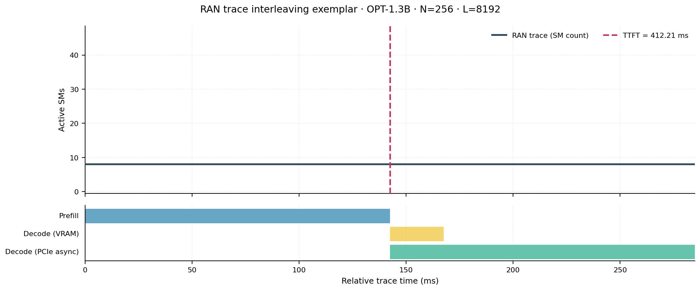
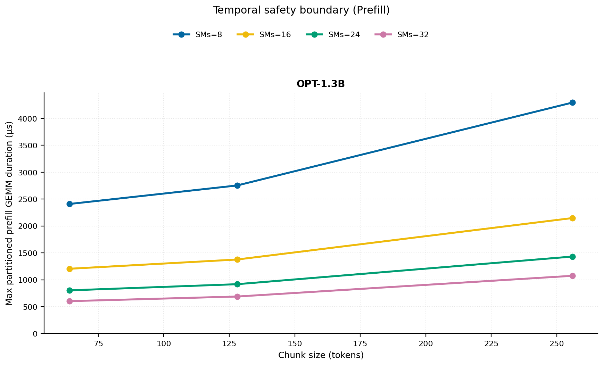
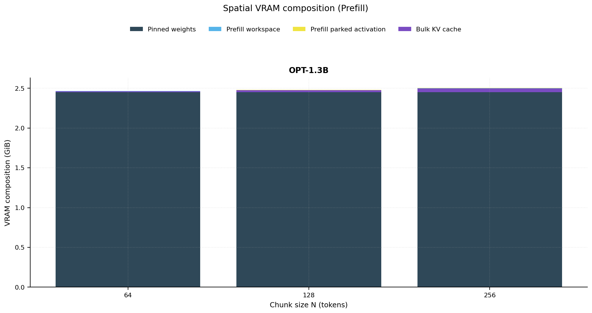
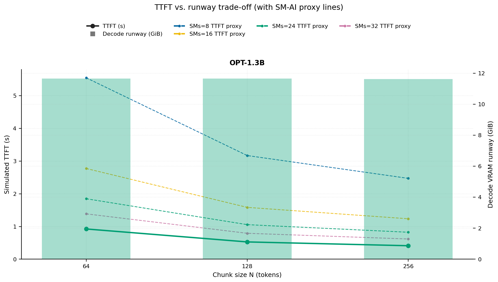
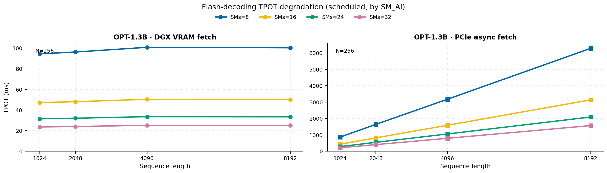
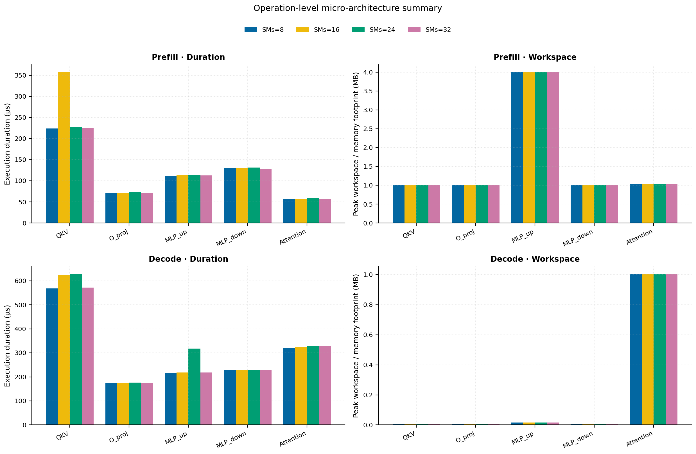
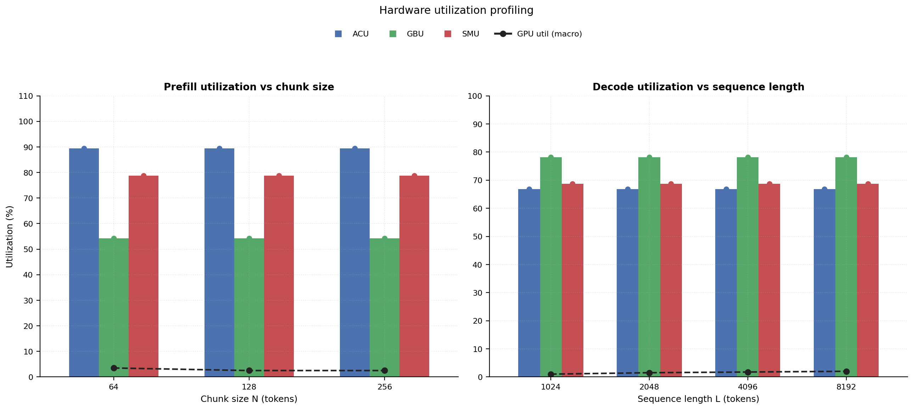

# RAN Inference Profiling Report

Run root: `/mnt/data/dheeraj/dicertation/inference-profile/runs/revised-rerun-20260415-020401-g2-opt13b-c64-256`

## Environment

| field | value |
| --- | --- |
| cache_root | n/a |
| captured_at | 2026-04-15T01:04:08Z |
| chunk_sizes | [64, 128, 256] |
| cuda_available | true |
| cuda_device_count | 8 |
| cwd | /mnt/data/dheeraj/dicertation/inference-profile |
| decode_modes | ["vram", "pcie_async"] |
| experiment_type | ran-dgxspark-v1 |
| gpu_id | 2 |
| l_out | 1024 |
| models | ["facebook/opt-1.3b"] |
| platform | Linux-6.8.0-106-generic-x86_64-with-glibc2.35 |
| python_executable | /home/dheeraj/miniconda3/envs/mls/bin/python |
| python_version | 3.11.14 |
| run_root | /mnt/data/dheeraj/dicertation/inference-profile/runs/revised-rerun-20260415-020401-g2-opt13b-c64-256 |
| scheduler | envelope_v1 |
| schema_version | ran_dgxspark_v1 |
| sequence_lengths | [1024, 2048, 4096, 8192] |
| sm_ai_cap | 32 |
| sm_ai_partition | 100 |
| sm_ai_partitions | [8, 16, 24, 32] |
| stage | profile |
| telemetry_tier | baseline_nvml_pt |
| timed_iterations | 5 |
| torch_available | true |
| torch_version | 2.10.0+cu128 |
| warmup_iterations | 3 |

## Model Constants

| model_id | sm_ai_partition | num_hidden_layers | hidden_size | num_attention_heads | ffn_dim | layer_index | layer_weight_bytes | total_weight_bytes_fp16 | vram_ceiling_bytes |
| --- | --- | --- | --- | --- | --- | --- | --- | --- | --- |
| facebook/opt-1.3b | 100 | 24 | 2048 | 32 | 8192 | 11 | 100716544 | 2631516160 | 15170115993 |

## Trace Inspection

### Primary trace

| field | value |
| --- | --- |
| errors | [] |
| header | ["frame", "slot", "time_slot_sched_ns", "time_decode_start_est_ns", "time_decode_end_est_ns", "time_decode_start_actual_ns", "time_decode_end_actual_ns", "decode_dur_us", "deadline_met", "target_sm", "profile_idx", "sm_count", "num_pusch", "sum_prb", "sum_tbs_bytes", "max_mcs"] |
| median_positive_delta_ms | 5.6997 |
| monotonicity.checked_column | time_slot_sched_ns |
| monotonicity.is_non_decreasing | true |
| monotonicity.negative_delta_count | 0 |
| monotonicity.positive_delta_count | 28377 |
| monotonicity.zero_delta_count | 0 |
| normalization.last_row_duration_policy | median_positive_forward_delta_ms |
| normalization.output_columns | ["time_ms", "sm_utilization", "slot_duration_ms", "source_schema", "sm_count"] |
| normalization.output_relative_path | derived/normalized_ldpc_trace.csv |
| normalized_row_count | 28378 |
| path | /mnt/raid0sata2/netsys/weaver-ext/ran/traces/e2e_2026030418/e2e_20260304_182034_tractor_ran_ctrl/ldpc_trace.csv |
| row_count | 28378 |
| schema_detected | schema_b |
| time_unit_hint | ns |
| usable | true |
| usage_policy | primary_only |
| used_for_scheduler_capacity | true |

### Secondary trace

| field | value |
| --- | --- |
| errors | ["ran_ctrl_trace.csv line 182958 has 9 field(s); expected 12"] |
| header | ["frame", "slot", "sm_available", "prbs_available", "prbs_allocated", "w_avg_mcs_prev", "w_avg_mcs_curr", "slots_since_underutil", "ramp_up_count", "num_ue_sched", "max_ue_backlog", "sum_ue_backlog"] |
| monotonicity.checked_column | n/a |
| monotonicity.is_non_decreasing | n/a |
| monotonicity.negative_delta_count | n/a |
| path | /mnt/raid0sata2/netsys/weaver-ext/ran/traces/e2e_2026030418/e2e_20260304_182034_tractor_ran_ctrl/ran_ctrl_trace.csv |
| row_count | 182956 |
| time_unit_hints | [] |
| usable | false |
| usage_policy | structural_only |
| used_for_scheduler_capacity | false |

## Raw-Profile Summary Tables

### Prefill profile summary

Source raw rows: `raw/prefill_events.csv` = 420. Summary artifact: `derived/prefill_summary.csv`.

| model_id | chunk_tokens | sm_ai_partition | max_input_tokens | prefill_max_gemm_us | prefill_workspace_bytes | prefill_parked_activation_bytes | telemetry_tier | telemetry_provider | telemetry_status | nvml_available | gpu_util | gpu_mem_used_mb | sm_clock_mhz | mem_clock_mhz | power_w | pt_step_ms | pt_mem_alloc_mb | pt_mem_reserved_mb | pt_workspace_mb | acu_pct | gbu_pct | smu_pct | microscopic_telemetry_status | microscopic_error |
| --- | --- | --- | --- | --- | --- | --- | --- | --- | --- | --- | --- | --- | --- | --- | --- | --- | --- | --- | --- | --- | --- | --- | --- | --- |
| facebook/opt-1.3b | 64 | 8 | 1024 | 107.52 | 1048576 | 1048576 | baseline_nvml_pt | nvidia-smi | ok | true | 7 | 2538 | 1695 | 7601 | 71.2 | 0.1075 | 108.1602 | 108.1602 | 1 | 79 | 62.5 | 67.5 | estimated | n/a |
| facebook/opt-1.3b | 64 | 16 | 1024 | 101.216 | 1048576 | 1048576 | baseline_nvml_pt | nvidia-smi | ok | true | 0 | 2538 | 1695 | 7601 | 71.07 | 0.1012 | 108.1602 | 108.1602 | 1 | 86 | 57 | 75 | estimated | n/a |
| facebook/opt-1.3b | 64 | 24 | 1024 | 100.416 | 1048576 | 1048576 | baseline_nvml_pt | nvidia-smi | ok | true | 3 | 2538 | 1695 | 7601 | 71.58 | 0.1004 | 108.1602 | 108.1602 | 1 | 93 | 51.5 | 82.5 | estimated | n/a |
| facebook/opt-1.3b | 64 | 32 | 1024 | 100.352 | 1048576 | 1048576 | baseline_nvml_pt | nvidia-smi | ok | true | 4 | 2536 | 1695 | 7601 | 71.05 | 0.1004 | 108.1602 | 108.1602 | 1 | 100 | 46 | 90 | estimated | n/a |
| facebook/opt-1.3b | 128 | 8 | 1024 | 120.608 | 2097152 | 2097152 | baseline_nvml_pt | nvidia-smi | ok | true | 0 | 2538 | 1695 | 7601 | 71.42 | 0.1206 | 111.1602 | 111.1602 | 2 | 79 | 62.5 | 67.5 | estimated | n/a |
| facebook/opt-1.3b | 128 | 16 | 1024 | 114.688 | 2097152 | 2097152 | baseline_nvml_pt | nvidia-smi | ok | true | 7 | 2538 | 1695 | 7601 | 71.1 | 0.1147 | 111.1602 | 111.1602 | 2 | 86 | 57 | 75 | estimated | n/a |
| facebook/opt-1.3b | 128 | 24 | 1024 | 120.832 | 2097152 | 2097152 | baseline_nvml_pt | nvidia-smi | ok | true | 0 | 2538 | 1695 | 7601 | 70.59 | 0.1208 | 111.1602 | 111.1602 | 2 | 93 | 51.5 | 82.5 | estimated | n/a |
| facebook/opt-1.3b | 128 | 32 | 1024 | 114.688 | 2097152 | 2097152 | baseline_nvml_pt | nvidia-smi | ok | true | 3 | 2536 | 1695 | 7601 | 70.64 | 0.1147 | 111.1602 | 111.1602 | 2 | 100 | 46 | 90 | estimated | n/a |
| facebook/opt-1.3b | 256 | 8 | 1024 | 191.392 | 4194304 | 4194304 | baseline_nvml_pt | nvidia-smi | ok | true | 0 | 2538 | 1695 | 7601 | 71.53 | 0.1914 | 117.1602 | 117.1602 | 4 | 79 | 62.5 | 67.5 | estimated | n/a |
| facebook/opt-1.3b | 256 | 16 | 1024 | 2035.712 | 4194304 | 4194304 | baseline_nvml_pt | nvidia-smi | ok | true | 6 | 2538 | 1695 | 7601 | 71.12 | 2.0357 | 117.1602 | 117.1602 | 4 | 86 | 57 | 75 | estimated | n/a |
| facebook/opt-1.3b | 256 | 24 | 1024 | 200.64 | 4194304 | 4194304 | baseline_nvml_pt | nvidia-smi | ok | true | 3 | 2538 | 1695 | 7601 | 71 | 0.2006 | 117.1602 | 117.1602 | 4 | 93 | 51.5 | 82.5 | estimated | n/a |
| facebook/opt-1.3b | 256 | 32 | 1024 | 178.912 | 4194304 | 4194304 | baseline_nvml_pt | nvidia-smi | ok | true | 1 | 2538 | 1695 | 7601 | 70.98 | 0.1789 | 117.1602 | 117.1602 | 4 | 100 | 46 | 90 | estimated | n/a |

### Decode profile summary

Source raw rows: `raw/decode_events.csv` = 3840. Summary artifact: `derived/decode_summary.csv`.

| model_id | sequence_length | block_size | sm_ai_partition | decode_mode | decode_max_gemv_us | attention_fetch_compute_us | reduction_overhead_us | decode_workspace_bytes | decode_parked_activation_bytes | telemetry_tier | telemetry_provider | telemetry_status | nvml_available | gpu_util | gpu_mem_used_mb | sm_clock_mhz | mem_clock_mhz | power_w | pt_step_ms | pt_mem_alloc_mb | pt_mem_reserved_mb | pt_workspace_mb | acu_pct | gbu_pct | smu_pct | microscopic_telemetry_status | microscopic_error |
| --- | --- | --- | --- | --- | --- | --- | --- | --- | --- | --- | --- | --- | --- | --- | --- | --- | --- | --- | --- | --- | --- | --- | --- | --- | --- | --- | --- |
| facebook/opt-1.3b | 1024 | 64 | 8 | pcie_async | 145.344 | 135.9424 | 21.8304 | 135168 | 4096 | baseline_nvml_pt | nvidia-smi | ok | true | 0 | 2536 | 1695 | 7601 | 70.78 | 0.1453 | 112.3125 | 112.3125 | 0.1289 | 56.5 | 87 | 59 | estimated | n/a |
| facebook/opt-1.3b | 1024 | 64 | 8 | vram | 137.216 | 122.4448 | 19.808 | 135168 | 4096 | baseline_nvml_pt | nvidia-smi | ok | true | 0 | 2538 | 1695 | 7601 | 70.64 | 0.1372 | 112.3125 | 112.3125 | 0.1289 | 63 | 77.5 | 62 | estimated | n/a |
| facebook/opt-1.3b | 1024 | 64 | 16 | pcie_async | 140.288 | 122.6368 | 20.4864 | 135168 | 4096 | baseline_nvml_pt | nvidia-smi | ok | true | 0 | 2536 | 1695 | 7601 | 70.73 | 0.1403 | 112.3125 | 112.3125 | 0.1289 | 61 | 84 | 64 | estimated | n/a |
| facebook/opt-1.3b | 1024 | 64 | 16 | vram | 140.384 | 123.9296 | 20.3008 | 135168 | 4096 | baseline_nvml_pt | nvidia-smi | ok | true | 2 | 2538 | 1695 | 7601 | 70.95 | 0.1404 | 112.3125 | 112.3125 | 0.1289 | 68 | 75 | 68 | estimated | n/a |
| facebook/opt-1.3b | 1024 | 64 | 24 | pcie_async | 328.704 | 154.9696 | 24.0512 | 135168 | 4096 | baseline_nvml_pt | nvidia-smi | ok | true | 0 | 2538 | 1695 | 7601 | 70.67 | 0.3287 | 112.3125 | 112.3125 | 0.1289 | 65.5 | 81 | 69 | estimated | n/a |
| facebook/opt-1.3b | 1024 | 64 | 24 | vram | 141.312 | 120.1472 | 19.584 | 135168 | 4096 | baseline_nvml_pt | nvidia-smi | ok | true | 0 | 2538 | 1695 | 7601 | 70.79 | 0.1413 | 112.3125 | 112.3125 | 0.1289 | 73 | 72.5 | 74 | estimated | n/a |
| facebook/opt-1.3b | 1024 | 64 | 32 | pcie_async | 141.312 | 123.7248 | 22.2528 | 135168 | 4096 | baseline_nvml_pt | nvidia-smi | ok | true | 0 | 2536 | 1695 | 7601 | 70.39 | 0.1413 | 112.3125 | 112.3125 | 0.1289 | 70 | 78 | 74 | estimated | n/a |
| facebook/opt-1.3b | 1024 | 64 | 32 | vram | 145.44 | 125.632 | 20.6592 | 135168 | 4096 | baseline_nvml_pt | nvidia-smi | ok | true | 0 | 2538 | 1695 | 7601 | 70.72 | 0.1454 | 112.3125 | 112.3125 | 0.1289 | 78 | 70 | 80 | estimated | n/a |
| facebook/opt-1.3b | 1024 | 128 | 8 | pcie_async | 140.288 | 123.552 | 20.256 | 135168 | 4096 | baseline_nvml_pt | nvidia-smi | ok | true | 0 | 2538 | 1695 | 7601 | 70.65 | 0.1403 | 112.3125 | 112.3125 | 0.1289 | 56.5 | 87 | 59 | estimated | n/a |
| facebook/opt-1.3b | 1024 | 128 | 8 | vram | 139.232 | 122.5728 | 20.4352 | 135168 | 4096 | baseline_nvml_pt | nvidia-smi | ok | true | 2 | 2538 | 1695 | 7601 | 71.23 | 0.1392 | 112.3125 | 112.3125 | 0.1289 | 63 | 77.5 | 62 | estimated | n/a |
| facebook/opt-1.3b | 1024 | 128 | 16 | pcie_async | 151.36 | 124.4096 | 21.248 | 135168 | 4096 | baseline_nvml_pt | nvidia-smi | ok | true | 8 | 2536 | 1695 | 7601 | 70.93 | 0.1514 | 112.3125 | 112.3125 | 0.1289 | 61 | 84 | 64 | estimated | n/a |
| facebook/opt-1.3b | 1024 | 128 | 16 | vram | 143.36 | 136.5824 | 22.9632 | 135168 | 4096 | baseline_nvml_pt | nvidia-smi | ok | true | 0 | 2536 | 1695 | 7601 | 70.73 | 0.1464 | 112.3125 | 112.3125 | 0.1289 | 68 | 75 | 68 | estimated | n/a |
| facebook/opt-1.3b | 1024 | 128 | 24 | pcie_async | 152.672 | 128.064 | 20.7488 | 135168 | 4096 | baseline_nvml_pt | nvidia-smi | ok | true | 0 | 2538 | 1695 | 7601 | 70.84 | 0.1527 | 112.3125 | 112.3125 | 0.1289 | 65.5 | 81 | 69 | estimated | n/a |
| facebook/opt-1.3b | 1024 | 128 | 24 | vram | 147.392 | 130.848 | 21.1264 | 135168 | 4096 | baseline_nvml_pt | nvidia-smi | ok | true | 4 | 2538 | 1695 | 7601 | 71 | 0.1474 | 112.3125 | 112.3125 | 0.1289 | 73 | 72.5 | 74 | estimated | n/a |
| facebook/opt-1.3b | 1024 | 128 | 32 | pcie_async | 146.56 | 124.5504 | 20.5184 | 135168 | 4096 | baseline_nvml_pt | nvidia-smi | ok | true | 1 | 2538 | 1695 | 7601 | 70.79 | 0.1466 | 112.3125 | 112.3125 | 0.1289 | 70 | 78 | 74 | estimated | n/a |
| facebook/opt-1.3b | 1024 | 128 | 32 | vram | 155.648 | 130.7008 | 22.2976 | 135168 | 4096 | baseline_nvml_pt | nvidia-smi | ok | true | 0 | 2538 | 1695 | 7601 | 70.81 | 0.1556 | 112.3125 | 112.3125 | 0.1289 | 78 | 70 | 80 | estimated | n/a |
| facebook/opt-1.3b | 1024 | 256 | 8 | pcie_async | 145.408 | 128.2496 | 21.0816 | 135168 | 4096 | baseline_nvml_pt | nvidia-smi | ok | true | 0 | 2538 | 1695 | 7601 | 70.9 | 0.1454 | 112.3125 | 112.3125 | 0.1289 | 56.5 | 87 | 59 | estimated | n/a |
| facebook/opt-1.3b | 1024 | 256 | 8 | vram | 146.432 | 145.7408 | 21.28 | 135168 | 4096 | baseline_nvml_pt | nvidia-smi | ok | true | 0 | 2538 | 1695 | 7601 | 70.71 | 0.1555 | 112.3125 | 112.3125 | 0.1289 | 63 | 77.5 | 62 | estimated | n/a |
| facebook/opt-1.3b | 1024 | 256 | 16 | pcie_async | 146.432 | 129.472 | 20.6848 | 135168 | 4096 | baseline_nvml_pt | nvidia-smi | ok | true | 0 | 2536 | 1695 | 7601 | 70.77 | 0.1464 | 112.3125 | 112.3125 | 0.1289 | 61 | 84 | 64 | estimated | n/a |
| facebook/opt-1.3b | 1024 | 256 | 16 | vram | 159.744 | 131.9104 | 20.4352 | 135168 | 4096 | baseline_nvml_pt | nvidia-smi | ok | true | 0 | 2538 | 1695 | 7601 | 71.25 | 0.1597 | 112.3125 | 112.3125 | 0.1289 | 68 | 75 | 68 | estimated | n/a |
| facebook/opt-1.3b | 1024 | 256 | 24 | pcie_async | 146.144 | 140.864 | 22.3424 | 135168 | 4096 | baseline_nvml_pt | nvidia-smi | ok | true | 1 | 2536 | 1695 | 7601 | 70.26 | 0.1627 | 112.3125 | 112.3125 | 0.1289 | 65.5 | 81 | 69 | estimated | n/a |
| facebook/opt-1.3b | 1024 | 256 | 24 | vram | 160.608 | 129.3888 | 21.2416 | 135168 | 4096 | baseline_nvml_pt | nvidia-smi | ok | true | 0 | 2538 | 1695 | 7601 | 70.3 | 0.1606 | 112.3125 | 112.3125 | 0.1289 | 73 | 72.5 | 74 | estimated | n/a |
| facebook/opt-1.3b | 1024 | 256 | 32 | pcie_async | 141.344 | 127.6224 | 22.5536 | 135168 | 4096 | baseline_nvml_pt | nvidia-smi | ok | true | 5 | 2538 | 1695 | 7601 | 70.67 | 0.1413 | 112.3125 | 112.3125 | 0.1289 | 70 | 78 | 74 | estimated | n/a |
| facebook/opt-1.3b | 1024 | 256 | 32 | vram | 139.264 | 128.4224 | 20.9088 | 135168 | 4096 | baseline_nvml_pt | nvidia-smi | ok | true | 1 | 2538 | 1695 | 7601 | 70.31 | 0.1393 | 112.3125 | 112.3125 | 0.1289 | 78 | 70 | 80 | estimated | n/a |
| facebook/opt-1.3b | 2048 | 64 | 8 | pcie_async | 154.784 | 127.8528 | 20.48 | 266240 | 4096 | baseline_nvml_pt | nvidia-smi | ok | true | 0 | 2538 | 1695 | 7601 | 70.66 | 0.1548 | 120.4375 | 120.4375 | 0.2539 | 56.5 | 87 | 59 | estimated | n/a |
| facebook/opt-1.3b | 2048 | 64 | 8 | vram | 152.576 | 128 | 20.4672 | 266240 | 4096 | baseline_nvml_pt | nvidia-smi | ok | true | 0 | 2536 | 1695 | 7601 | 70.81 | 0.1526 | 120.4375 | 120.4375 | 0.2539 | 63 | 77.5 | 62 | estimated | n/a |
| facebook/opt-1.3b | 2048 | 64 | 16 | pcie_async | 165.888 | 141.7664 | 22.9056 | 266240 | 4096 | baseline_nvml_pt | nvidia-smi | ok | true | 0 | 2538 | 1695 | 7601 | 70.52 | 0.1659 | 120.4375 | 120.4375 | 0.2539 | 61 | 84 | 64 | estimated | n/a |
| facebook/opt-1.3b | 2048 | 64 | 16 | vram | 3095.552 | 137.2352 | 24.224 | 266240 | 4096 | baseline_nvml_pt | nvidia-smi | ok | true | 1 | 2538 | 1695 | 7601 | 70.5 | 3.0956 | 120.4375 | 120.4375 | 0.2539 | 68 | 75 | 68 | estimated | n/a |
| facebook/opt-1.3b | 2048 | 64 | 24 | pcie_async | 151.552 | 128.0192 | 20.2624 | 266240 | 4096 | baseline_nvml_pt | nvidia-smi | ok | true | 0 | 2538 | 1695 | 7601 | 70.85 | 0.1516 | 120.4375 | 120.4375 | 0.2539 | 65.5 | 81 | 69 | estimated | n/a |
| facebook/opt-1.3b | 2048 | 64 | 24 | vram | 155.648 | 129.44 | 22.9248 | 266240 | 4096 | baseline_nvml_pt | nvidia-smi | ok | true | 4 | 2538 | 1695 | 7601 | 70.43 | 0.1556 | 120.4375 | 120.4375 | 0.2539 | 73 | 72.5 | 74 | estimated | n/a |
| facebook/opt-1.3b | 2048 | 64 | 32 | pcie_async | 169.856 | 136.928 | 21.0752 | 266240 | 4096 | baseline_nvml_pt | nvidia-smi | ok | true | 2 | 2538 | 1695 | 7601 | 70.82 | 0.1699 | 120.4375 | 120.4375 | 0.2539 | 70 | 78 | 74 | estimated | n/a |
| facebook/opt-1.3b | 2048 | 64 | 32 | vram | 172.032 | 140.6976 | 21.7024 | 266240 | 4096 | baseline_nvml_pt | nvidia-smi | ok | true | 0 | 2538 | 1695 | 7601 | 70.5 | 0.172 | 120.4375 | 120.4375 | 0.2539 | 78 | 70 | 80 | estimated | n/a |
| facebook/opt-1.3b | 2048 | 128 | 8 | pcie_async | 155.712 | 134.5344 | 21.6512 | 266240 | 4096 | baseline_nvml_pt | nvidia-smi | ok | true | 0 | 2536 | 1695 | 7601 | 71.31 | 0.1557 | 120.4375 | 120.4375 | 0.2539 | 56.5 | 87 | 59 | estimated | n/a |
| facebook/opt-1.3b | 2048 | 128 | 8 | vram | 160.576 | 133.3376 | 20.064 | 266240 | 4096 | baseline_nvml_pt | nvidia-smi | ok | true | 9 | 2538 | 1695 | 7601 | 70.47 | 0.1606 | 120.4375 | 120.4375 | 0.2539 | 63 | 77.5 | 62 | estimated | n/a |
| facebook/opt-1.3b | 2048 | 128 | 16 | pcie_async | 153.6 | 129.6576 | 20.6848 | 266240 | 4096 | baseline_nvml_pt | nvidia-smi | ok | true | 0 | 2536 | 1695 | 7601 | 70.84 | 0.1536 | 120.4375 | 120.4375 | 0.2539 | 61 | 84 | 64 | estimated | n/a |
| facebook/opt-1.3b | 2048 | 128 | 16 | vram | 145.696 | 127.712 | 20.4544 | 266240 | 4096 | baseline_nvml_pt | nvidia-smi | ok | true | 0 | 2536 | 1695 | 7601 | 71.11 | 0.1457 | 120.4375 | 120.4375 | 0.2539 | 68 | 75 | 68 | estimated | n/a |
| facebook/opt-1.3b | 2048 | 128 | 24 | pcie_async | 158.944 | 138.0096 | 21.2992 | 266240 | 4096 | baseline_nvml_pt | nvidia-smi | ok | true | 4 | 2536 | 1695 | 7601 | 71.12 | 0.1589 | 120.4375 | 120.4375 | 0.2539 | 65.5 | 81 | 69 | estimated | n/a |
| facebook/opt-1.3b | 2048 | 128 | 24 | vram | 3097.6 | 136.768 | 21.2928 | 266240 | 4096 | baseline_nvml_pt | nvidia-smi | ok | true | 0 | 2536 | 1695 | 7601 | 71.08 | 3.0976 | 120.4375 | 120.4375 | 0.2539 | 73 | 72.5 | 74 | estimated | n/a |
| facebook/opt-1.3b | 2048 | 128 | 32 | pcie_async | 166.912 | 143.776 | 23.168 | 266240 | 4096 | baseline_nvml_pt | nvidia-smi | ok | true | 0 | 2538 | 1695 | 7601 | 71.09 | 0.1669 | 120.4375 | 120.4375 | 0.2539 | 70 | 78 | 74 | estimated | n/a |
| facebook/opt-1.3b | 2048 | 128 | 32 | vram | 169.056 | 152.992 | 24.512 | 266240 | 4096 | baseline_nvml_pt | nvidia-smi | ok | true | 0 | 2536 | 1695 | 7601 | 71.15 | 0.1691 | 120.4375 | 120.4375 | 0.2539 | 78 | 70 | 80 | estimated | n/a |
| facebook/opt-1.3b | 2048 | 256 | 8 | pcie_async | 155.776 | 134.1888 | 21.2544 | 266240 | 4096 | baseline_nvml_pt | nvidia-smi | ok | true | 0 | 2538 | 1695 | 7601 | 71.09 | 0.1558 | 120.4375 | 120.4375 | 0.2539 | 56.5 | 87 | 59 | estimated | n/a |
| facebook/opt-1.3b | 2048 | 256 | 8 | vram | 158.72 | 131.0912 | 19.9552 | 266240 | 4096 | baseline_nvml_pt | nvidia-smi | ok | true | 0 | 2538 | 1695 | 7601 | 71.16 | 0.1587 | 120.4375 | 120.4375 | 0.2539 | 63 | 77.5 | 62 | estimated | n/a |
| facebook/opt-1.3b | 2048 | 256 | 16 | pcie_async | 167.008 | 129.7216 | 20.8576 | 266240 | 4096 | baseline_nvml_pt | nvidia-smi | ok | true | 0 | 2538 | 1695 | 7601 | 71.29 | 0.167 | 120.4375 | 120.4375 | 0.2539 | 61 | 84 | 64 | estimated | n/a |
| facebook/opt-1.3b | 2048 | 256 | 16 | vram | 171.904 | 151.3856 | 23.584 | 266240 | 4096 | baseline_nvml_pt | nvidia-smi | ok | true | 0 | 2538 | 1695 | 7601 | 71.62 | 0.1741 | 120.4375 | 120.4375 | 0.2539 | 68 | 75 | 68 | estimated | n/a |
| facebook/opt-1.3b | 2048 | 256 | 24 | pcie_async | 153.696 | 129.0624 | 20.7872 | 266240 | 4096 | baseline_nvml_pt | nvidia-smi | ok | true | 0 | 2536 | 1695 | 7601 | 71.2 | 0.1537 | 120.4375 | 120.4375 | 0.2539 | 65.5 | 81 | 69 | estimated | n/a |
| facebook/opt-1.3b | 2048 | 256 | 24 | vram | 142.432 | 127.968 | 21.5232 | 266240 | 4096 | baseline_nvml_pt | nvidia-smi | ok | true | 9 | 2538 | 1695 | 7601 | 71.08 | 0.1424 | 120.4375 | 120.4375 | 0.2539 | 73 | 72.5 | 74 | estimated | n/a |
| facebook/opt-1.3b | 2048 | 256 | 32 | pcie_async | 151.776 | 128.3136 | 21.1776 | 266240 | 4096 | baseline_nvml_pt | nvidia-smi | ok | true | 7 | 2538 | 1695 | 7601 | 71.57 | 0.1518 | 120.4375 | 120.4375 | 0.2539 | 70 | 78 | 74 | estimated | n/a |
| facebook/opt-1.3b | 2048 | 256 | 32 | vram | 142.336 | 128.8192 | 20.288 | 266240 | 4096 | baseline_nvml_pt | nvidia-smi | ok | true | 0 | 2536 | 1695 | 7601 | 71.03 | 0.1423 | 120.4375 | 120.4375 | 0.2539 | 78 | 70 | 80 | estimated | n/a |
| facebook/opt-1.3b | 4096 | 64 | 8 | pcie_async | 147.456 | 128.7168 | 20.6848 | 528384 | 4096 | baseline_nvml_pt | nvidia-smi | ok | true | 0 | 2538 | 1695 | 7601 | 71.2 | 0.1475 | 136.6875 | 136.6875 | 0.5039 | 56.5 | 87 | 59 | estimated | n/a |
| facebook/opt-1.3b | 4096 | 64 | 8 | vram | 152.576 | 132.6528 | 20.8576 | 528384 | 4096 | baseline_nvml_pt | nvidia-smi | ok | true | 1 | 2538 | 1695 | 7601 | 71.61 | 0.1526 | 136.6875 | 136.6875 | 0.5039 | 63 | 77.5 | 62 | estimated | n/a |
| facebook/opt-1.3b | 4096 | 64 | 16 | pcie_async | 140.352 | 130.4768 | 21.0176 | 528384 | 4096 | baseline_nvml_pt | nvidia-smi | ok | true | 0 | 2536 | 1695 | 7601 | 71.21 | 0.1404 | 136.6875 | 136.6875 | 0.5039 | 61 | 84 | 64 | estimated | n/a |
| facebook/opt-1.3b | 4096 | 64 | 16 | vram | 168.736 | 132.7104 | 20.9216 | 528384 | 4096 | baseline_nvml_pt | nvidia-smi | ok | true | 0 | 2538 | 1695 | 7601 | 71.56 | 0.1687 | 136.6875 | 136.6875 | 0.5039 | 68 | 75 | 68 | estimated | n/a |
| facebook/opt-1.3b | 4096 | 64 | 24 | pcie_async | 137.408 | 128.3776 | 20.0192 | 528384 | 4096 | baseline_nvml_pt | nvidia-smi | ok | true | 11 | 2538 | 1695 | 7601 | 70.9 | 0.1374 | 136.6875 | 136.6875 | 0.5039 | 65.5 | 81 | 69 | estimated | n/a |
| facebook/opt-1.3b | 4096 | 64 | 24 | vram | 139.264 | 128.9856 | 22.1376 | 528384 | 4096 | baseline_nvml_pt | nvidia-smi | ok | true | 0 | 2536 | 1695 | 7601 | 70.94 | 0.1393 | 136.6875 | 136.6875 | 0.5039 | 73 | 72.5 | 74 | estimated | n/a |
| facebook/opt-1.3b | 4096 | 64 | 32 | pcie_async | 142.208 | 126.9504 | 21.7216 | 528384 | 4096 | baseline_nvml_pt | nvidia-smi | ok | true | 0 | 2538 | 1695 | 7601 | 71.61 | 0.1422 | 136.6875 | 136.6875 | 0.5039 | 70 | 78 | 74 | estimated | n/a |
| facebook/opt-1.3b | 4096 | 64 | 32 | vram | 162.816 | 167.7184 | 25.9648 | 528384 | 4096 | baseline_nvml_pt | nvidia-smi | ok | true | 1 | 2538 | 1695 | 7601 | 71.43 | 0.1843 | 136.6875 | 136.6875 | 0.5039 | 78 | 70 | 80 | estimated | n/a |
| facebook/opt-1.3b | 4096 | 128 | 8 | pcie_async | 142.336 | 133.184 | 20.4608 | 528384 | 4096 | baseline_nvml_pt | nvidia-smi | ok | true | 3 | 2536 | 1695 | 7601 | 71.44 | 0.1466 | 136.6875 | 136.6875 | 0.5039 | 56.5 | 87 | 59 | estimated | n/a |
| facebook/opt-1.3b | 4096 | 128 | 8 | vram | 154.624 | 134.6752 | 20.7424 | 528384 | 4096 | baseline_nvml_pt | nvidia-smi | ok | true | 1 | 2536 | 1695 | 7601 | 71.67 | 0.1546 | 136.6875 | 136.6875 | 0.5039 | 63 | 77.5 | 62 | estimated | n/a |
| facebook/opt-1.3b | 4096 | 128 | 16 | pcie_async | 156.672 | 131.1616 | 20.5312 | 528384 | 4096 | baseline_nvml_pt | nvidia-smi | ok | true | 0 | 2538 | 1695 | 7601 | 71.54 | 0.1567 | 136.6875 | 136.6875 | 0.5039 | 61 | 84 | 64 | estimated | n/a |
| facebook/opt-1.3b | 4096 | 128 | 16 | vram | 147.616 | 131.648 | 20.2304 | 528384 | 4096 | baseline_nvml_pt | nvidia-smi | ok | true | 7 | 2536 | 1695 | 7601 | 71.31 | 0.1476 | 136.6875 | 136.6875 | 0.5039 | 68 | 75 | 68 | estimated | n/a |
| facebook/opt-1.3b | 4096 | 128 | 24 | pcie_async | 149.696 | 132.9152 | 20.5696 | 528384 | 4096 | baseline_nvml_pt | nvidia-smi | ok | true | 1 | 2538 | 1695 | 7601 | 70.88 | 0.1497 | 136.6875 | 136.6875 | 0.5039 | 65.5 | 81 | 69 | estimated | n/a |
| facebook/opt-1.3b | 4096 | 128 | 24 | vram | 205.024 | 168.5248 | 27.2384 | 528384 | 4096 | baseline_nvml_pt | nvidia-smi | ok | true | 0 | 2538 | 1695 | 7601 | 70.97 | 0.205 | 136.6875 | 136.6875 | 0.5039 | 73 | 72.5 | 74 | estimated | n/a |
| facebook/opt-1.3b | 4096 | 128 | 32 | pcie_async | 150.272 | 144.064 | 22.5088 | 528384 | 4096 | baseline_nvml_pt | nvidia-smi | ok | true | 7 | 2536 | 1695 | 7601 | 71.2 | 0.1534 | 136.6875 | 136.6875 | 0.5039 | 70 | 78 | 74 | estimated | n/a |
| facebook/opt-1.3b | 4096 | 128 | 32 | vram | 153.856 | 132.096 | 20.8704 | 528384 | 4096 | baseline_nvml_pt | nvidia-smi | ok | true | 1 | 2538 | 1695 | 7601 | 71.08 | 0.1539 | 136.6875 | 136.6875 | 0.5039 | 78 | 70 | 80 | estimated | n/a |
| facebook/opt-1.3b | 4096 | 256 | 8 | pcie_async | 153.6 | 135.7376 | 20.8896 | 528384 | 4096 | baseline_nvml_pt | nvidia-smi | ok | true | 1 | 2538 | 1695 | 7601 | 71.1 | 0.1536 | 136.6875 | 136.6875 | 0.5039 | 56.5 | 87 | 59 | estimated | n/a |
| facebook/opt-1.3b | 4096 | 256 | 8 | vram | 141.44 | 129.2288 | 21.28 | 528384 | 4096 | baseline_nvml_pt | nvidia-smi | ok | true | 1 | 2538 | 1695 | 7601 | 71.32 | 0.1414 | 136.6875 | 136.6875 | 0.5039 | 63 | 77.5 | 62 | estimated | n/a |
| facebook/opt-1.3b | 4096 | 256 | 16 | pcie_async | 209.984 | 143.5712 | 30.2464 | 528384 | 4096 | baseline_nvml_pt | nvidia-smi | ok | true | 0 | 2536 | 1695 | 7601 | 71.1 | 0.21 | 136.6875 | 136.6875 | 0.5039 | 61 | 84 | 64 | estimated | n/a |
| facebook/opt-1.3b | 4096 | 256 | 16 | vram | 187.392 | 138.8416 | 21.9008 | 528384 | 4096 | baseline_nvml_pt | nvidia-smi | ok | true | 6 | 2538 | 1695 | 7601 | 70.73 | 0.1874 | 136.6875 | 136.6875 | 0.5039 | 68 | 75 | 68 | estimated | n/a |
| facebook/opt-1.3b | 4096 | 256 | 24 | pcie_async | 165.12 | 138.1824 | 21.0944 | 528384 | 4096 | baseline_nvml_pt | nvidia-smi | ok | true | 1 | 2536 | 1695 | 7601 | 71.34 | 0.1651 | 136.6875 | 136.6875 | 0.5039 | 65.5 | 81 | 69 | estimated | n/a |
| facebook/opt-1.3b | 4096 | 256 | 24 | vram | 6086.6561 | 144.3136 | 23.168 | 528384 | 4096 | baseline_nvml_pt | nvidia-smi | ok | true | 0 | 2538 | 1695 | 7601 | 71.36 | 6.0867 | 136.6875 | 136.6875 | 0.5039 | 73 | 72.5 | 74 | estimated | n/a |
| facebook/opt-1.3b | 4096 | 256 | 32 | pcie_async | 136.192 | 126.6112 | 20.0704 | 528384 | 4096 | baseline_nvml_pt | nvidia-smi | ok | true | 0 | 2536 | 1695 | 7601 | 71.02 | 0.1362 | 136.6875 | 136.6875 | 0.5039 | 70 | 78 | 74 | estimated | n/a |
| facebook/opt-1.3b | 4096 | 256 | 32 | vram | 149.504 | 133.4976 | 20.2752 | 528384 | 4096 | baseline_nvml_pt | nvidia-smi | ok | true | 0 | 2538 | 1695 | 7601 | 70.77 | 0.1495 | 136.6875 | 136.6875 | 0.5039 | 78 | 70 | 80 | estimated | n/a |
| facebook/opt-1.3b | 8192 | 64 | 8 | pcie_async | 142.336 | 161.3824 | 19.7376 | 1052672 | 4096 | baseline_nvml_pt | nvidia-smi | ok | true | 0 | 2536 | 1695 | 7601 | 71.09 | 0.1649 | 169.1875 | 169.1875 | 1.0039 | 56.5 | 87 | 59 | estimated | n/a |
| facebook/opt-1.3b | 8192 | 64 | 8 | vram | 157.6 | 161.6064 | 20.3264 | 1052672 | 4096 | baseline_nvml_pt | nvidia-smi | ok | true | 1 | 2536 | 1695 | 7601 | 70.94 | 0.1659 | 169.1875 | 169.1875 | 1.0039 | 63 | 77.5 | 62 | estimated | n/a |
| facebook/opt-1.3b | 8192 | 64 | 16 | pcie_async | 150.528 | 163.0208 | 20.8896 | 1052672 | 4096 | baseline_nvml_pt | nvidia-smi | ok | true | 0 | 2536 | 1695 | 7601 | 70.74 | 0.1679 | 169.1875 | 169.1875 | 1.0039 | 61 | 84 | 64 | estimated | n/a |
| facebook/opt-1.3b | 8192 | 64 | 16 | vram | 150.528 | 164.0832 | 21.0688 | 1052672 | 4096 | baseline_nvml_pt | nvidia-smi | ok | true | 0 | 2538 | 1695 | 7601 | 70.65 | 0.172 | 169.1875 | 169.1875 | 1.0039 | 68 | 75 | 68 | estimated | n/a |
| facebook/opt-1.3b | 8192 | 64 | 24 | pcie_async | 158.976 | 163.6352 | 20.096 | 1052672 | 4096 | baseline_nvml_pt | nvidia-smi | ok | true | 4 | 2536 | 1695 | 7601 | 71.02 | 0.1679 | 169.1875 | 169.1875 | 1.0039 | 65.5 | 81 | 69 | estimated | n/a |
| facebook/opt-1.3b | 8192 | 64 | 24 | vram | 149.504 | 163.0784 | 19.8656 | 1052672 | 4096 | baseline_nvml_pt | nvidia-smi | ok | true | 0 | 2536 | 1695 | 7601 | 70.58 | 0.1722 | 169.1875 | 169.1875 | 1.0039 | 73 | 72.5 | 74 | estimated | n/a |
| facebook/opt-1.3b | 8192 | 64 | 32 | pcie_async | 141.312 | 166.0864 | 21.5168 | 1052672 | 4096 | baseline_nvml_pt | nvidia-smi | ok | true | 1 | 2538 | 1695 | 7601 | 70.81 | 0.1679 | 169.1875 | 169.1875 | 1.0039 | 70 | 78 | 74 | estimated | n/a |
| facebook/opt-1.3b | 8192 | 64 | 32 | vram | 151.328 | 171.5968 | 21.4144 | 1052672 | 4096 | baseline_nvml_pt | nvidia-smi | ok | true | 0 | 2538 | 1695 | 7601 | 70.59 | 0.1853 | 169.1875 | 169.1875 | 1.0039 | 78 | 70 | 80 | estimated | n/a |
| facebook/opt-1.3b | 8192 | 128 | 8 | pcie_async | 164.864 | 167.6736 | 21.2288 | 1052672 | 4096 | baseline_nvml_pt | nvidia-smi | ok | true | 2 | 2538 | 1695 | 7601 | 70.49 | 0.1802 | 169.1875 | 169.1875 | 1.0039 | 56.5 | 87 | 59 | estimated | n/a |
| facebook/opt-1.3b | 8192 | 128 | 8 | vram | 143.36 | 165.2736 | 20.0512 | 1052672 | 4096 | baseline_nvml_pt | nvidia-smi | ok | true | 0 | 2538 | 1695 | 7601 | 70.89 | 0.171 | 169.1875 | 169.1875 | 1.0039 | 63 | 77.5 | 62 | estimated | n/a |
| facebook/opt-1.3b | 8192 | 128 | 16 | pcie_async | 158.72 | 166.2784 | 20.9408 | 1052672 | 4096 | baseline_nvml_pt | nvidia-smi | ok | true | 0 | 2538 | 1695 | 7601 | 70.52 | 0.172 | 169.1875 | 169.1875 | 1.0039 | 61 | 84 | 64 | estimated | n/a |
| facebook/opt-1.3b | 8192 | 128 | 16 | vram | 142.048 | 162.2016 | 19.8464 | 1052672 | 4096 | baseline_nvml_pt | nvidia-smi | ok | true | 0 | 2538 | 1695 | 7601 | 70.59 | 0.1659 | 169.1875 | 169.1875 | 1.0039 | 68 | 75 | 68 | estimated | n/a |
| facebook/opt-1.3b | 8192 | 128 | 24 | pcie_async | 149.504 | 160.7168 | 20.5888 | 1052672 | 4096 | baseline_nvml_pt | nvidia-smi | ok | true | 0 | 2538 | 1695 | 7601 | 70.93 | 0.1636 | 169.1875 | 169.1875 | 1.0039 | 65.5 | 81 | 69 | estimated | n/a |
| facebook/opt-1.3b | 8192 | 128 | 24 | vram | 152.608 | 168.1408 | 19.9936 | 1052672 | 4096 | baseline_nvml_pt | nvidia-smi | ok | true | 7 | 2538 | 1695 | 7601 | 70.87 | 0.1802 | 169.1875 | 169.1875 | 1.0039 | 73 | 72.5 | 74 | estimated | n/a |
| facebook/opt-1.3b | 8192 | 128 | 32 | pcie_async | 169.984 | 180.224 | 24.1152 | 1052672 | 4096 | baseline_nvml_pt | nvidia-smi | ok | true | 8 | 2538 | 1695 | 7601 | 71.15 | 0.2006 | 169.1875 | 169.1875 | 1.0039 | 70 | 78 | 74 | estimated | n/a |
| facebook/opt-1.3b | 8192 | 128 | 32 | vram | 152.576 | 171.2192 | 21.6576 | 1052672 | 4096 | baseline_nvml_pt | nvidia-smi | ok | true | 7 | 2538 | 1695 | 7601 | 70.65 | 0.1884 | 169.1875 | 169.1875 | 1.0039 | 78 | 70 | 80 | estimated | n/a |
| facebook/opt-1.3b | 8192 | 256 | 8 | pcie_async | 159.744 | 164.9792 | 20.1216 | 1052672 | 4096 | baseline_nvml_pt | nvidia-smi | ok | true | 0 | 2538 | 1695 | 7601 | 71.34 | 0.1689 | 169.1875 | 169.1875 | 1.0039 | 56.5 | 87 | 59 | estimated | n/a |
| facebook/opt-1.3b | 8192 | 256 | 8 | vram | 165.888 | 164.8256 | 20.0896 | 1052672 | 4096 | baseline_nvml_pt | nvidia-smi | ok | true | 10 | 2536 | 1695 | 7601 | 71.04 | 0.1688 | 169.1875 | 169.1875 | 1.0039 | 63 | 77.5 | 62 | estimated | n/a |
| facebook/opt-1.3b | 8192 | 256 | 16 | pcie_async | 144.32 | 169.3376 | 21.7088 | 1052672 | 4096 | baseline_nvml_pt | nvidia-smi | ok | true | 0 | 2536 | 1695 | 7601 | 70.38 | 0.1863 | 169.1875 | 169.1875 | 1.0039 | 61 | 84 | 64 | estimated | n/a |
| facebook/opt-1.3b | 8192 | 256 | 16 | vram | 157.696 | 164 | 20.6912 | 1052672 | 4096 | baseline_nvml_pt | nvidia-smi | ok | true | 7 | 2538 | 1695 | 7601 | 70.96 | 0.1689 | 169.1875 | 169.1875 | 1.0039 | 68 | 75 | 68 | estimated | n/a |
| facebook/opt-1.3b | 8192 | 256 | 24 | pcie_async | 143.456 | 161.0048 | 20.2688 | 1052672 | 4096 | baseline_nvml_pt | nvidia-smi | ok | true | 0 | 2536 | 1695 | 7601 | 71 | 0.1618 | 169.1875 | 169.1875 | 1.0039 | 65.5 | 81 | 69 | estimated | n/a |
| facebook/opt-1.3b | 8192 | 256 | 24 | vram | 141.312 | 159.328 | 20.4096 | 1052672 | 4096 | baseline_nvml_pt | nvidia-smi | ok | true | 0 | 2536 | 1695 | 7601 | 70.88 | 0.1618 | 169.1875 | 169.1875 | 1.0039 | 73 | 72.5 | 74 | estimated | n/a |
| facebook/opt-1.3b | 8192 | 256 | 32 | pcie_async | 161.792 | 161.9648 | 19.9168 | 1052672 | 4096 | baseline_nvml_pt | nvidia-smi | ok | true | 1 | 2536 | 1695 | 7601 | 70.88 | 0.1638 | 169.1875 | 169.1875 | 1.0039 | 70 | 78 | 74 | estimated | n/a |
| facebook/opt-1.3b | 8192 | 256 | 32 | vram | 143.328 | 163.4304 | 22.752 | 1052672 | 4096 | baseline_nvml_pt | nvidia-smi | ok | true | 0 | 2536 | 1695 | 7601 | 70.96 | 0.1772 | 169.1875 | 169.1875 | 1.0039 | 78 | 70 | 80 | estimated | n/a |

### PCIe profile summary

Source raw rows: `raw/pcie_events.csv` = 15. Summary artifact: `derived/pcie_summary.csv`.

| model_id | block_size | kv_block_bytes | transfer_only_us | overlap_total_us | dummy_compute_us | exposed_transfer_us | effective_gbps | overlap_status | telemetry_tier | telemetry_provider | telemetry_status | nvml_available | gpu_util | gpu_mem_used_mb | sm_clock_mhz | mem_clock_mhz | power_w | pt_step_ms | pt_mem_alloc_mb | pt_mem_reserved_mb | pt_workspace_mb | acu_pct | gbu_pct | smu_pct | microscopic_telemetry_status | microscopic_error |
| --- | --- | --- | --- | --- | --- | --- | --- | --- | --- | --- | --- | --- | --- | --- | --- | --- | --- | --- | --- | --- | --- | --- | --- | --- | --- | --- |
| facebook/opt-1.3b | 64 | 524288 | 257.536 | 31660.0259 | 31386.6244 | 273.4015 | 2.0358 | measured | baseline_nvml_pt | nvidia-smi | partial | true | 0 | 2538 | 1695 | 7601 | 70.9 | n/a | n/a | n/a | n/a | 65 | 65 | 65 | estimated | n/a |
| facebook/opt-1.3b | 128 | 1048576 | 3320.768 | 50919.9816 | 48820.3772 | 2099.6044 | 0.3158 | measured | baseline_nvml_pt | nvidia-smi | partial | true | 0 | 2538 | 1695 | 7601 | 71.02 | n/a | n/a | n/a | n/a | 65 | 65 | 65 | estimated | n/a |
| facebook/opt-1.3b | 256 | 2097152 | 2158.2783 | 36996.6537 | 34987.6422 | 2009.0114 | 0.9717 | measured | baseline_nvml_pt | nvidia-smi | partial | true | 9 | 2538 | 1695 | 7601 | 70.94 | n/a | n/a | n/a | n/a | 65 | 65 | 65 | estimated | n/a |

## SLA Tables

### Successful configurations

| model_id | chunk_tokens | sequence_length | ttft_ms | tpot_ms_vram | tpot_ms_pcie_async | decode_runway_tokens | status |
| --- | --- | --- | --- | --- | --- | --- | --- |
| facebook/opt-1.3b | 64 | 1024 | 924.8441 | 24.4543 | 128.8386 | 63709 | success |
| facebook/opt-1.3b | 64 | 2048 | 924.8441 | 28.6702 | 238.2237 | 63709 | success |
| facebook/opt-1.3b | 64 | 4096 | 924.8441 | 28.0939 | 443.9908 | 63707 | success |
| facebook/opt-1.3b | 64 | 8192 | 924.8441 | 26.4235 | 864.7408 | 63705 | success |
| facebook/opt-1.3b | 128 | 1024 | 528.4823 | 26.0853 | 427.7103 | 63645 | success |
| facebook/opt-1.3b | 128 | 2048 | 528.4823 | 28.6042 | 834.2901 | 63645 | success |
| facebook/opt-1.3b | 128 | 4096 | 528.4823 | 25.8265 | 1638.1331 | 63643 | success |
| facebook/opt-1.3b | 128 | 8192 | 528.4823 | 26.6 | 3254.3742 | 63641 | success |
| facebook/opt-1.3b | 256 | 1024 | 412.2132 | 23.638 | 216.8229 | 63517 | success |
| facebook/opt-1.3b | 256 | 2048 | 412.2132 | 24.075 | 411.1737 | 63517 | success |
| facebook/opt-1.3b | 256 | 4096 | 412.2132 | 25.2191 | 794.5924 | 63515 | success |
| facebook/opt-1.3b | 256 | 8192 | 412.2132 | 25.1076 | 1570.584 | 63513 | success |

### Failed configurations

No rows available.

## Per-Model Scaling Analysis

| model_id | successful_configs | failed_configs | chunk_tokens_tested | sequence_lengths_tested | largest_successful_chunk_tokens | ttft_ms_min | ttft_ms_max | tpot_ms_vram_min | tpot_ms_vram_max | tpot_ms_pcie_async_min | tpot_ms_pcie_async_max | max_decode_runway_tokens |
| --- | --- | --- | --- | --- | --- | --- | --- | --- | --- | --- | --- | --- |
| facebook/opt-1.3b | 12 | 0 | 64, 128, 256 | 1024, 2048, 4096, 8192 | 256 | 412.2132 | 924.8441 | 23.638 | 28.6702 | 128.8386 | 3254.3742 | 63709 |

## Plots

### Revised 01 Ran Trace Interleaving

[Interactive companion](plots/revised_01_ran_trace_interleaving_interactive.html)

### Revised 02 Prefill Safety Boundary

### Revised 03 Prefill Vram Composition

### Revised 04 Ttft Vs Runway

### Revised 05 Decode Tpot Degradation

### Revised 06 Operation Level Microarchitecture Summary

### Revised 07 Hardware Utilization Profiling

### Revised 08 Decode Memory Consumption

### 09 Spatial VRAM Composition (Prefill) · Pie View

