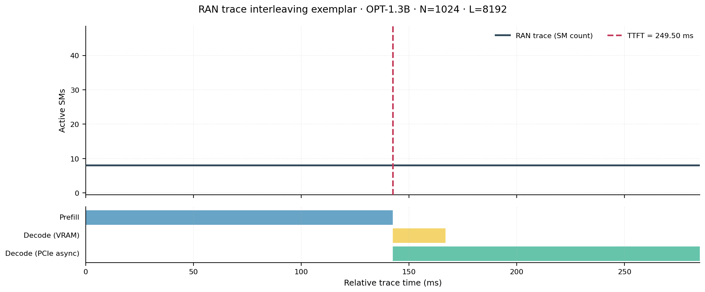
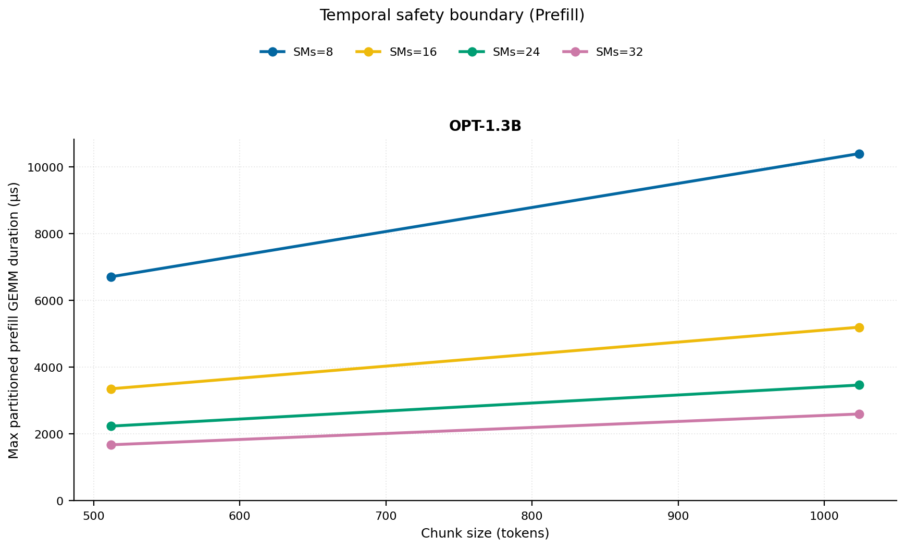
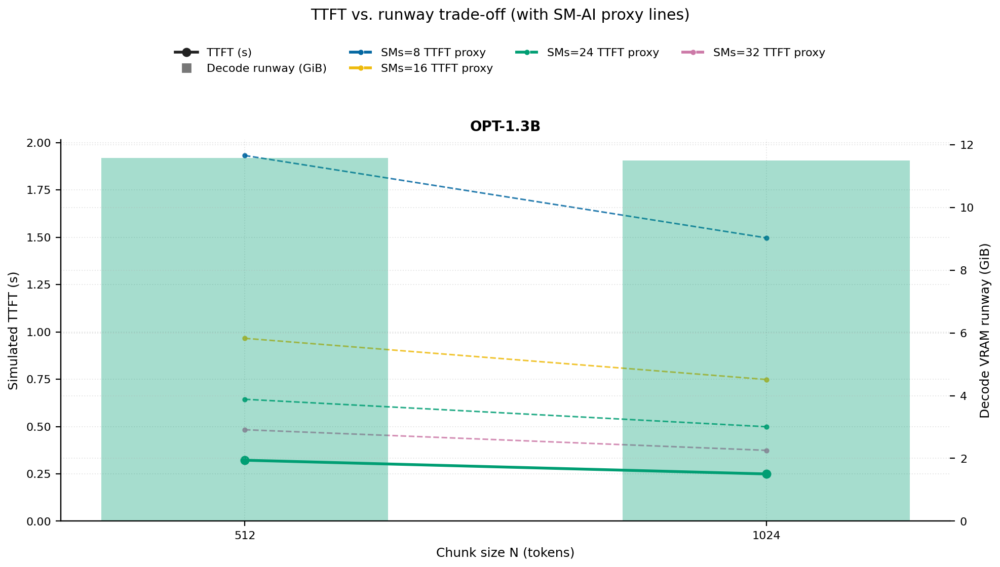
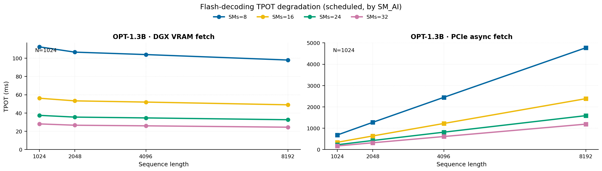
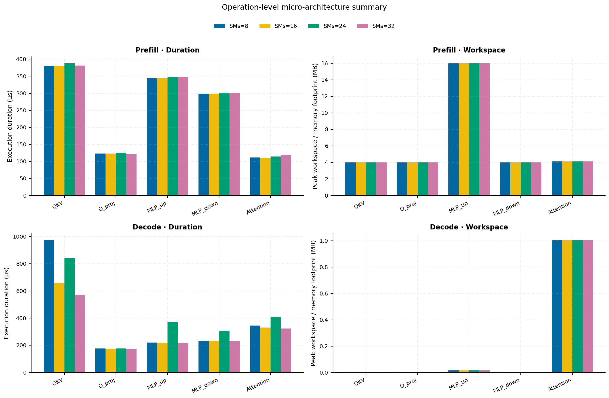
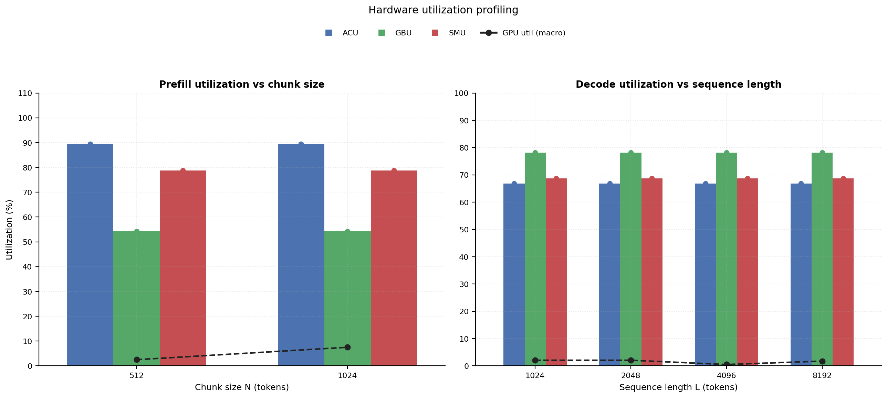
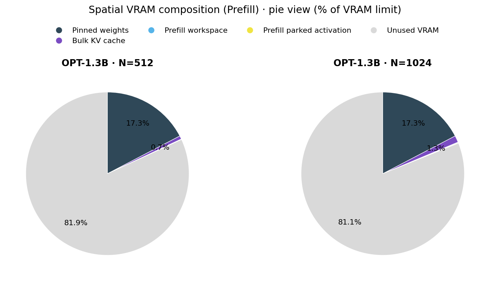

# RAN Inference Profiling Report

Run root: `/mnt/data/dheeraj/dicertation/inference-profile/runs/revised-rerun-20260415-020401-g3-opt13b-c512-1024`

## Environment

| field | value |
| --- | --- |
| cache_root | n/a |
| captured_at | 2026-04-15T01:04:08Z |
| chunk_sizes | [512, 1024] |
| cuda_available | true |
| cuda_device_count | 8 |
| cwd | /mnt/data/dheeraj/dicertation/inference-profile |
| decode_modes | ["vram", "pcie_async"] |
| experiment_type | ran-dgxspark-v1 |
| gpu_id | 3 |
| l_out | 1024 |
| models | ["facebook/opt-1.3b"] |
| platform | Linux-6.8.0-106-generic-x86_64-with-glibc2.35 |
| python_executable | /home/dheeraj/miniconda3/envs/mls/bin/python |
| python_version | 3.11.14 |
| run_root | /mnt/data/dheeraj/dicertation/inference-profile/runs/revised-rerun-20260415-020401-g3-opt13b-c512-1024 |
| scheduler | envelope_v1 |
| schema_version | ran_dgxspark_v1 |
| sequence_lengths | [1024, 2048, 4096, 8192] |
| sm_ai_cap | 32 |
| sm_ai_partition | 100 |
| sm_ai_partitions | [8, 16, 24, 32] |
| stage | profile |
| telemetry_tier | baseline_nvml_pt |
| timed_iterations | 5 |
| torch_available | true |
| torch_version | 2.10.0+cu128 |
| warmup_iterations | 3 |

## Model Constants

| model_id | sm_ai_partition | num_hidden_layers | hidden_size | num_attention_heads | ffn_dim | layer_index | layer_weight_bytes | total_weight_bytes_fp16 | vram_ceiling_bytes |
| --- | --- | --- | --- | --- | --- | --- | --- | --- | --- |
| facebook/opt-1.3b | 100 | 24 | 2048 | 32 | 8192 | 11 | 100716544 | 2631516160 | 15170115993 |

## Trace Inspection

### Primary trace

| field | value |
| --- | --- |
| errors | [] |
| header | ["frame", "slot", "time_slot_sched_ns", "time_decode_start_est_ns", "time_decode_end_est_ns", "time_decode_start_actual_ns", "time_decode_end_actual_ns", "decode_dur_us", "deadline_met", "target_sm", "profile_idx", "sm_count", "num_pusch", "sum_prb", "sum_tbs_bytes", "max_mcs"] |
| median_positive_delta_ms | 5.6997 |
| monotonicity.checked_column | time_slot_sched_ns |
| monotonicity.is_non_decreasing | true |
| monotonicity.negative_delta_count | 0 |
| monotonicity.positive_delta_count | 28377 |
| monotonicity.zero_delta_count | 0 |
| normalization.last_row_duration_policy | median_positive_forward_delta_ms |
| normalization.output_columns | ["time_ms", "sm_utilization", "slot_duration_ms", "source_schema", "sm_count"] |
| normalization.output_relative_path | derived/normalized_ldpc_trace.csv |
| normalized_row_count | 28378 |
| path | /mnt/raid0sata2/netsys/weaver-ext/ran/traces/e2e_2026030418/e2e_20260304_182034_tractor_ran_ctrl/ldpc_trace.csv |
| row_count | 28378 |
| schema_detected | schema_b |
| time_unit_hint | ns |
| usable | true |
| usage_policy | primary_only |
| used_for_scheduler_capacity | true |

### Secondary trace

| field | value |
| --- | --- |
| errors | ["ran_ctrl_trace.csv line 182958 has 9 field(s); expected 12"] |
| header | ["frame", "slot", "sm_available", "prbs_available", "prbs_allocated", "w_avg_mcs_prev", "w_avg_mcs_curr", "slots_since_underutil", "ramp_up_count", "num_ue_sched", "max_ue_backlog", "sum_ue_backlog"] |
| monotonicity.checked_column | n/a |
| monotonicity.is_non_decreasing | n/a |
| monotonicity.negative_delta_count | n/a |
| path | /mnt/raid0sata2/netsys/weaver-ext/ran/traces/e2e_2026030418/e2e_20260304_182034_tractor_ran_ctrl/ran_ctrl_trace.csv |
| row_count | 182956 |
| time_unit_hints | [] |
| usable | false |
| usage_policy | structural_only |
| used_for_scheduler_capacity | false |

## Raw-Profile Summary Tables

### Prefill profile summary

Source raw rows: `raw/prefill_events.csv` = 280. Summary artifact: `derived/prefill_summary.csv`.

| model_id | chunk_tokens | sm_ai_partition | max_input_tokens | prefill_max_gemm_us | prefill_workspace_bytes | prefill_parked_activation_bytes | telemetry_tier | telemetry_provider | telemetry_status | nvml_available | gpu_util | gpu_mem_used_mb | sm_clock_mhz | mem_clock_mhz | power_w | pt_step_ms | pt_mem_alloc_mb | pt_mem_reserved_mb | pt_workspace_mb | acu_pct | gbu_pct | smu_pct | microscopic_telemetry_status | microscopic_error |
| --- | --- | --- | --- | --- | --- | --- | --- | --- | --- | --- | --- | --- | --- | --- | --- | --- | --- | --- | --- | --- | --- | --- | --- | --- |
| facebook/opt-1.3b | 512 | 8 | 1024 | 265.216 | 8388608 | 8388608 | baseline_nvml_pt | nvidia-smi | ok | true | 8 | 2568 | 1695 | 7601 | 65.23 | 0.2652 | 129.1602 | 129.1602 | 8 | 79 | 62.5 | 67.5 | estimated | n/a |
| facebook/opt-1.3b | 512 | 16 | 1024 | 267.008 | 8388608 | 8388608 | baseline_nvml_pt | nvidia-smi | ok | true | 2 | 2568 | 1695 | 7601 | 66.02 | 0.267 | 129.1602 | 129.1602 | 8 | 86 | 57 | 75 | estimated | n/a |
| facebook/opt-1.3b | 512 | 24 | 1024 | 277.504 | 8388608 | 8388608 | baseline_nvml_pt | nvidia-smi | ok | true | 0 | 2568 | 1695 | 7601 | 66.14 | 0.2775 | 129.1602 | 129.1602 | 8 | 93 | 51.5 | 82.5 | estimated | n/a |
| facebook/opt-1.3b | 512 | 32 | 1024 | 279.552 | 8388608 | 8388608 | baseline_nvml_pt | nvidia-smi | ok | true | 0 | 2568 | 1695 | 7601 | 66.61 | 0.2796 | 129.1602 | 129.1602 | 8 | 100 | 46 | 90 | estimated | n/a |
| facebook/opt-1.3b | 1024 | 8 | 1024 | 438.272 | 16777216 | 16777216 | baseline_nvml_pt | nvidia-smi | ok | true | 13 | 2568 | 1695 | 7601 | 68.52 | 0.4383 | 153.1602 | 153.1602 | 16 | 79 | 62.5 | 67.5 | estimated | n/a |
| facebook/opt-1.3b | 1024 | 16 | 1024 | 432.128 | 16777216 | 16777216 | baseline_nvml_pt | nvidia-smi | ok | true | 2 | 2568 | 1695 | 7601 | 68.68 | 0.4321 | 153.1602 | 153.1602 | 16 | 86 | 57 | 75 | estimated | n/a |
| facebook/opt-1.3b | 1024 | 24 | 1024 | 433.152 | 16777216 | 16777216 | baseline_nvml_pt | nvidia-smi | ok | true | 15 | 2568 | 1695 | 7601 | 69.13 | 0.4332 | 153.1602 | 153.1602 | 16 | 93 | 51.5 | 82.5 | estimated | n/a |
| facebook/opt-1.3b | 1024 | 32 | 1024 | 433.152 | 16777216 | 16777216 | baseline_nvml_pt | nvidia-smi | ok | true | 0 | 2568 | 1695 | 7601 | 69.46 | 0.4332 | 153.1602 | 153.1602 | 16 | 100 | 46 | 90 | estimated | n/a |

### Decode profile summary

Source raw rows: `raw/decode_events.csv` = 2560. Summary artifact: `derived/decode_summary.csv`.

| model_id | sequence_length | block_size | sm_ai_partition | decode_mode | decode_max_gemv_us | attention_fetch_compute_us | reduction_overhead_us | decode_workspace_bytes | decode_parked_activation_bytes | telemetry_tier | telemetry_provider | telemetry_status | nvml_available | gpu_util | gpu_mem_used_mb | sm_clock_mhz | mem_clock_mhz | power_w | pt_step_ms | pt_mem_alloc_mb | pt_mem_reserved_mb | pt_workspace_mb | acu_pct | gbu_pct | smu_pct | microscopic_telemetry_status | microscopic_error |
| --- | --- | --- | --- | --- | --- | --- | --- | --- | --- | --- | --- | --- | --- | --- | --- | --- | --- | --- | --- | --- | --- | --- | --- | --- | --- | --- | --- |
| facebook/opt-1.3b | 1024 | 512 | 8 | pcie_async | 147.68 | 129.8752 | 20.0384 | 135168 | 4096 | baseline_nvml_pt | nvidia-smi | ok | true | 0 | 2568 | 1695 | 7601 | 67.59 | 0.1477 | 112.3125 | 112.3125 | 0.1289 | 56.5 | 87 | 59 | estimated | n/a |
| facebook/opt-1.3b | 1024 | 512 | 8 | vram | 137.216 | 128.5568 | 20.7104 | 135168 | 4096 | baseline_nvml_pt | nvidia-smi | ok | true | 6 | 2568 | 1695 | 7601 | 67.05 | 0.1372 | 112.3125 | 112.3125 | 0.1289 | 63 | 77.5 | 62 | estimated | n/a |
| facebook/opt-1.3b | 1024 | 512 | 16 | pcie_async | 3127.296 | 126.9568 | 20.7232 | 135168 | 4096 | baseline_nvml_pt | nvidia-smi | ok | true | 0 | 2568 | 1695 | 7601 | 68.37 | 3.1273 | 112.3125 | 112.3125 | 0.1289 | 61 | 84 | 64 | estimated | n/a |
| facebook/opt-1.3b | 1024 | 512 | 16 | vram | 141.568 | 129.8112 | 21.632 | 135168 | 4096 | baseline_nvml_pt | nvidia-smi | ok | true | 0 | 2568 | 1695 | 7601 | 68.38 | 0.1444 | 112.3125 | 112.3125 | 0.1289 | 68 | 75 | 68 | estimated | n/a |
| facebook/opt-1.3b | 1024 | 512 | 24 | pcie_async | 160.736 | 131.4624 | 20.7232 | 135168 | 4096 | baseline_nvml_pt | nvidia-smi | ok | true | 0 | 2568 | 1695 | 7601 | 68.84 | 0.1607 | 112.3125 | 112.3125 | 0.1289 | 65.5 | 81 | 69 | estimated | n/a |
| facebook/opt-1.3b | 1024 | 512 | 24 | vram | 3122.0479 | 735.7376 | 22.4512 | 135168 | 4096 | baseline_nvml_pt | nvidia-smi | ok | true | 0 | 2568 | 1695 | 7601 | 68.57 | 3.1375 | 112.3125 | 112.3125 | 0.1289 | 73 | 72.5 | 74 | estimated | n/a |
| facebook/opt-1.3b | 1024 | 512 | 32 | pcie_async | 153.6 | 128.1792 | 20.6784 | 135168 | 4096 | baseline_nvml_pt | nvidia-smi | ok | true | 5 | 2568 | 1695 | 7601 | 68.55 | 0.1536 | 112.3125 | 112.3125 | 0.1289 | 70 | 78 | 74 | estimated | n/a |
| facebook/opt-1.3b | 1024 | 512 | 32 | vram | 155.648 | 127.872 | 20.6464 | 135168 | 4096 | baseline_nvml_pt | nvidia-smi | ok | true | 1 | 2568 | 1695 | 7601 | 68.64 | 0.1556 | 112.3125 | 112.3125 | 0.1289 | 78 | 70 | 80 | estimated | n/a |
| facebook/opt-1.3b | 1024 | 1024 | 8 | pcie_async | 166.88 | 136.4032 | 20.672 | 135168 | 4096 | baseline_nvml_pt | nvidia-smi | ok | true | 0 | 2566 | 1695 | 7601 | 68.99 | 0.1669 | 112.3125 | 112.3125 | 0.1289 | 56.5 | 87 | 59 | estimated | n/a |
| facebook/opt-1.3b | 1024 | 1024 | 8 | vram | 220.16 | 224.064 | 26.2912 | 135168 | 4096 | baseline_nvml_pt | nvidia-smi | ok | true | 0 | 2568 | 1695 | 7601 | 68.82 | 0.4956 | 112.3125 | 112.3125 | 0.1289 | 63 | 77.5 | 62 | estimated | n/a |
| facebook/opt-1.3b | 1024 | 1024 | 16 | pcie_async | 156.672 | 129.472 | 20.48 | 135168 | 4096 | baseline_nvml_pt | nvidia-smi | ok | true | 6 | 2568 | 1695 | 7601 | 68.99 | 0.1567 | 112.3125 | 112.3125 | 0.1289 | 61 | 84 | 64 | estimated | n/a |
| facebook/opt-1.3b | 1024 | 1024 | 16 | vram | 139.264 | 124.064 | 20.8896 | 135168 | 4096 | baseline_nvml_pt | nvidia-smi | ok | true | 7 | 2568 | 1695 | 7601 | 69.32 | 0.1393 | 112.3125 | 112.3125 | 0.1289 | 68 | 75 | 68 | estimated | n/a |
| facebook/opt-1.3b | 1024 | 1024 | 24 | pcie_async | 141.504 | 127.424 | 24.3712 | 135168 | 4096 | baseline_nvml_pt | nvidia-smi | ok | true | 8 | 2568 | 1695 | 7601 | 69.29 | 0.1415 | 112.3125 | 112.3125 | 0.1289 | 65.5 | 81 | 69 | estimated | n/a |
| facebook/opt-1.3b | 1024 | 1024 | 24 | vram | 173.92 | 130.5088 | 20.8896 | 135168 | 4096 | baseline_nvml_pt | nvidia-smi | ok | true | 0 | 2568 | 1695 | 7601 | 68.97 | 0.1739 | 112.3125 | 112.3125 | 0.1289 | 73 | 72.5 | 74 | estimated | n/a |
| facebook/opt-1.3b | 1024 | 1024 | 32 | pcie_async | 147.456 | 122.6752 | 20.832 | 135168 | 4096 | baseline_nvml_pt | nvidia-smi | ok | true | 0 | 2566 | 1695 | 7601 | 69.4 | 0.1475 | 112.3125 | 112.3125 | 0.1289 | 70 | 78 | 74 | estimated | n/a |
| facebook/opt-1.3b | 1024 | 1024 | 32 | vram | 167.712 | 142.0992 | 22.3296 | 135168 | 4096 | baseline_nvml_pt | nvidia-smi | ok | true | 0 | 2568 | 1695 | 7601 | 68.55 | 0.1677 | 112.3125 | 112.3125 | 0.1289 | 78 | 70 | 80 | estimated | n/a |
| facebook/opt-1.3b | 2048 | 512 | 8 | pcie_async | 158.528 | 130.08 | 20.3072 | 266240 | 4096 | baseline_nvml_pt | nvidia-smi | ok | true | 7 | 2566 | 1695 | 7601 | 69.63 | 0.1585 | 120.4375 | 120.4375 | 0.2539 | 56.5 | 87 | 59 | estimated | n/a |
| facebook/opt-1.3b | 2048 | 512 | 8 | vram | 164.864 | 138.9888 | 22.528 | 266240 | 4096 | baseline_nvml_pt | nvidia-smi | ok | true | 7 | 2566 | 1695 | 7601 | 69.32 | 0.1649 | 120.4375 | 120.4375 | 0.2539 | 63 | 77.5 | 62 | estimated | n/a |
| facebook/opt-1.3b | 2048 | 512 | 16 | pcie_async | 173.056 | 164.032 | 25.3952 | 266240 | 4096 | baseline_nvml_pt | nvidia-smi | ok | true | 0 | 2566 | 1695 | 7601 | 69.31 | 0.1872 | 120.4375 | 120.4375 | 0.2539 | 61 | 84 | 64 | estimated | n/a |
| facebook/opt-1.3b | 2048 | 512 | 16 | vram | 162.88 | 127.6352 | 19.6928 | 266240 | 4096 | baseline_nvml_pt | nvidia-smi | ok | true | 0 | 2568 | 1695 | 7601 | 69.25 | 0.1629 | 120.4375 | 120.4375 | 0.2539 | 68 | 75 | 68 | estimated | n/a |
| facebook/opt-1.3b | 2048 | 512 | 24 | pcie_async | 140.416 | 123.4432 | 19.8144 | 266240 | 4096 | baseline_nvml_pt | nvidia-smi | ok | true | 7 | 2568 | 1695 | 7601 | 69.63 | 0.1404 | 120.4375 | 120.4375 | 0.2539 | 65.5 | 81 | 69 | estimated | n/a |
| facebook/opt-1.3b | 2048 | 512 | 24 | vram | 158.464 | 127.8336 | 20.5312 | 266240 | 4096 | baseline_nvml_pt | nvidia-smi | ok | true | 1 | 2568 | 1695 | 7601 | 69.53 | 0.1585 | 120.4375 | 120.4375 | 0.2539 | 73 | 72.5 | 74 | estimated | n/a |
| facebook/opt-1.3b | 2048 | 512 | 32 | pcie_async | 157.696 | 132.1536 | 21.1072 | 266240 | 4096 | baseline_nvml_pt | nvidia-smi | ok | true | 0 | 2568 | 1695 | 7601 | 69.15 | 0.1577 | 120.4375 | 120.4375 | 0.2539 | 70 | 78 | 74 | estimated | n/a |
| facebook/opt-1.3b | 2048 | 512 | 32 | vram | 140.288 | 125.2608 | 20.5376 | 266240 | 4096 | baseline_nvml_pt | nvidia-smi | ok | true | 0 | 2568 | 1695 | 7601 | 69.64 | 0.1403 | 120.4375 | 120.4375 | 0.2539 | 78 | 70 | 80 | estimated | n/a |
| facebook/opt-1.3b | 2048 | 1024 | 8 | pcie_async | 164.864 | 130.496 | 20.6208 | 266240 | 4096 | baseline_nvml_pt | nvidia-smi | ok | true | 0 | 2568 | 1695 | 7601 | 69.33 | 0.1649 | 120.4375 | 120.4375 | 0.2539 | 56.5 | 87 | 59 | estimated | n/a |
| facebook/opt-1.3b | 2048 | 1024 | 8 | vram | 145.408 | 127.2128 | 21.1136 | 266240 | 4096 | baseline_nvml_pt | nvidia-smi | ok | true | 0 | 2568 | 1695 | 7601 | 69.55 | 0.1454 | 120.4375 | 120.4375 | 0.2539 | 63 | 77.5 | 62 | estimated | n/a |
| facebook/opt-1.3b | 2048 | 1024 | 16 | pcie_async | 162.624 | 136.5632 | 21.888 | 266240 | 4096 | baseline_nvml_pt | nvidia-smi | ok | true | 0 | 2568 | 1695 | 7601 | 69.1 | 0.1626 | 120.4375 | 120.4375 | 0.2539 | 61 | 84 | 64 | estimated | n/a |
| facebook/opt-1.3b | 2048 | 1024 | 16 | vram | 160.768 | 152.192 | 24 | 266240 | 4096 | baseline_nvml_pt | nvidia-smi | ok | true | 0 | 2566 | 1695 | 7601 | 69.47 | 0.1608 | 120.4375 | 120.4375 | 0.2539 | 68 | 75 | 68 | estimated | n/a |
| facebook/opt-1.3b | 2048 | 1024 | 24 | pcie_async | 165.888 | 133.3504 | 21.5104 | 266240 | 4096 | baseline_nvml_pt | nvidia-smi | ok | true | 10 | 2568 | 1695 | 7601 | 69.27 | 0.1659 | 120.4375 | 120.4375 | 0.2539 | 65.5 | 81 | 69 | estimated | n/a |
| facebook/opt-1.3b | 2048 | 1024 | 24 | vram | 151.616 | 126.9504 | 20.6784 | 266240 | 4096 | baseline_nvml_pt | nvidia-smi | ok | true | 1 | 2568 | 1695 | 7601 | 69.17 | 0.1516 | 120.4375 | 120.4375 | 0.2539 | 73 | 72.5 | 74 | estimated | n/a |
| facebook/opt-1.3b | 2048 | 1024 | 32 | pcie_async | 162.816 | 136.4352 | 20.48 | 266240 | 4096 | baseline_nvml_pt | nvidia-smi | ok | true | 0 | 2566 | 1695 | 7601 | 69.25 | 0.1628 | 120.4375 | 120.4375 | 0.2539 | 70 | 78 | 74 | estimated | n/a |
| facebook/opt-1.3b | 2048 | 1024 | 32 | vram | 159.552 | 132.2304 | 20.8832 | 266240 | 4096 | baseline_nvml_pt | nvidia-smi | ok | true | 0 | 2566 | 1695 | 7601 | 69.44 | 0.1596 | 120.4375 | 120.4375 | 0.2539 | 78 | 70 | 80 | estimated | n/a |
| facebook/opt-1.3b | 4096 | 512 | 8 | pcie_async | 162.784 | 140.2176 | 21.1264 | 528384 | 4096 | baseline_nvml_pt | nvidia-smi | ok | true | 1 | 2568 | 1695 | 7601 | 69.79 | 0.1628 | 136.6875 | 136.6875 | 0.5039 | 56.5 | 87 | 59 | estimated | n/a |
| facebook/opt-1.3b | 4096 | 512 | 8 | vram | 159.744 | 150.2464 | 23.52 | 528384 | 4096 | baseline_nvml_pt | nvidia-smi | ok | true | 0 | 2566 | 1695 | 7601 | 69.46 | 0.1597 | 136.6875 | 136.6875 | 0.5039 | 63 | 77.5 | 62 | estimated | n/a |
| facebook/opt-1.3b | 4096 | 512 | 16 | pcie_async | 187.616 | 138.2016 | 20.8896 | 528384 | 4096 | baseline_nvml_pt | nvidia-smi | ok | true | 7 | 2568 | 1695 | 7601 | 69.51 | 0.1876 | 136.6875 | 136.6875 | 0.5039 | 61 | 84 | 64 | estimated | n/a |
| facebook/opt-1.3b | 4096 | 512 | 16 | vram | 172.8 | 135.3088 | 22.144 | 528384 | 4096 | baseline_nvml_pt | nvidia-smi | ok | true | 0 | 2568 | 1695 | 7601 | 69.46 | 0.1728 | 136.6875 | 136.6875 | 0.5039 | 68 | 75 | 68 | estimated | n/a |
| facebook/opt-1.3b | 4096 | 512 | 24 | pcie_async | 152.576 | 128.8064 | 20.6016 | 528384 | 4096 | baseline_nvml_pt | nvidia-smi | ok | true | 0 | 2568 | 1695 | 7601 | 69.78 | 0.1526 | 136.6875 | 136.6875 | 0.5039 | 65.5 | 81 | 69 | estimated | n/a |
| facebook/opt-1.3b | 4096 | 512 | 24 | vram | 224.256 | 156.5952 | 27.0208 | 528384 | 4096 | baseline_nvml_pt | nvidia-smi | ok | true | 0 | 2568 | 1695 | 7601 | 69.57 | 0.2243 | 136.6875 | 136.6875 | 0.5039 | 73 | 72.5 | 74 | estimated | n/a |
| facebook/opt-1.3b | 4096 | 512 | 32 | pcie_async | 139.328 | 128.4032 | 20.1088 | 528384 | 4096 | baseline_nvml_pt | nvidia-smi | ok | true | 0 | 2568 | 1695 | 7601 | 69.52 | 0.1393 | 136.6875 | 136.6875 | 0.5039 | 70 | 78 | 74 | estimated | n/a |
| facebook/opt-1.3b | 4096 | 512 | 32 | vram | 163.904 | 142.7456 | 22.6688 | 528384 | 4096 | baseline_nvml_pt | nvidia-smi | ok | true | 0 | 2568 | 1695 | 7601 | 69.79 | 0.1639 | 136.6875 | 136.6875 | 0.5039 | 78 | 70 | 80 | estimated | n/a |
| facebook/opt-1.3b | 4096 | 1024 | 8 | pcie_async | 160.992 | 135.1616 | 19.9296 | 528384 | 4096 | baseline_nvml_pt | nvidia-smi | ok | true | 0 | 2566 | 1695 | 7601 | 69.66 | 0.161 | 136.6875 | 136.6875 | 0.5039 | 56.5 | 87 | 59 | estimated | n/a |
| facebook/opt-1.3b | 4096 | 1024 | 8 | vram | 6093.9202 | 150.7008 | 21.7088 | 528384 | 4096 | baseline_nvml_pt | nvidia-smi | ok | true | 0 | 2568 | 1695 | 7601 | 69.76 | 6.0939 | 136.6875 | 136.6875 | 0.5039 | 63 | 77.5 | 62 | estimated | n/a |
| facebook/opt-1.3b | 4096 | 1024 | 16 | pcie_async | 151.488 | 132.8768 | 21.7216 | 528384 | 4096 | baseline_nvml_pt | nvidia-smi | ok | true | 0 | 2568 | 1695 | 7601 | 69.72 | 0.1515 | 136.6875 | 136.6875 | 0.5039 | 61 | 84 | 64 | estimated | n/a |
| facebook/opt-1.3b | 4096 | 1024 | 16 | vram | 146.432 | 132.2816 | 20.6592 | 528384 | 4096 | baseline_nvml_pt | nvidia-smi | ok | true | 0 | 2568 | 1695 | 7601 | 69.84 | 0.1464 | 136.6875 | 136.6875 | 0.5039 | 68 | 75 | 68 | estimated | n/a |
| facebook/opt-1.3b | 4096 | 1024 | 24 | pcie_async | 142.4 | 137.984 | 22.7136 | 528384 | 4096 | baseline_nvml_pt | nvidia-smi | ok | true | 0 | 2568 | 1695 | 7601 | 69.36 | 0.1464 | 136.6875 | 136.6875 | 0.5039 | 65.5 | 81 | 69 | estimated | n/a |
| facebook/opt-1.3b | 4096 | 1024 | 24 | vram | 142.336 | 130.6048 | 23.5392 | 528384 | 4096 | baseline_nvml_pt | nvidia-smi | ok | true | 0 | 2568 | 1695 | 7601 | 69.87 | 0.1423 | 136.6875 | 136.6875 | 0.5039 | 73 | 72.5 | 74 | estimated | n/a |
| facebook/opt-1.3b | 4096 | 1024 | 32 | pcie_async | 163.84 | 150.3168 | 23.7056 | 528384 | 4096 | baseline_nvml_pt | nvidia-smi | ok | true | 0 | 2568 | 1695 | 7601 | 69.28 | 0.1649 | 136.6875 | 136.6875 | 0.5039 | 70 | 78 | 74 | estimated | n/a |
| facebook/opt-1.3b | 4096 | 1024 | 32 | vram | 154.624 | 134.112 | 20.8576 | 528384 | 4096 | baseline_nvml_pt | nvidia-smi | ok | true | 0 | 2568 | 1695 | 7601 | 69.36 | 0.1546 | 136.6875 | 136.6875 | 0.5039 | 78 | 70 | 80 | estimated | n/a |
| facebook/opt-1.3b | 8192 | 512 | 8 | pcie_async | 153.632 | 168.3264 | 20.5056 | 1052672 | 4096 | baseline_nvml_pt | nvidia-smi | ok | true | 0 | 2568 | 1695 | 7601 | 70 | 0.1731 | 169.1875 | 169.1875 | 1.0039 | 56.5 | 87 | 59 | estimated | n/a |
| facebook/opt-1.3b | 8192 | 512 | 8 | vram | 312.32 | 182.4768 | 32.0448 | 1052672 | 4096 | baseline_nvml_pt | nvidia-smi | ok | true | 0 | 2568 | 1695 | 7601 | 69.44 | 0.3123 | 169.1875 | 169.1875 | 1.0039 | 63 | 77.5 | 62 | estimated | n/a |
| facebook/opt-1.3b | 8192 | 512 | 16 | pcie_async | 152.352 | 164.3264 | 22.144 | 1052672 | 4096 | baseline_nvml_pt | nvidia-smi | ok | true | 8 | 2568 | 1695 | 7601 | 69.74 | 0.1751 | 169.1875 | 169.1875 | 1.0039 | 61 | 84 | 64 | estimated | n/a |
| facebook/opt-1.3b | 8192 | 512 | 16 | vram | 156.704 | 172.4416 | 21.5552 | 1052672 | 4096 | baseline_nvml_pt | nvidia-smi | ok | true | 12 | 2568 | 1695 | 7601 | 69.2 | 0.2007 | 169.1875 | 169.1875 | 1.0039 | 68 | 75 | 68 | estimated | n/a |
| facebook/opt-1.3b | 8192 | 512 | 24 | pcie_async | 7213.2158 | 198.816 | 26.8224 | 1052672 | 4096 | baseline_nvml_pt | nvidia-smi | ok | true | 0 | 2568 | 1695 | 7601 | 69.61 | 7.2132 | 169.1875 | 169.1875 | 1.0039 | 65.5 | 81 | 69 | estimated | n/a |
| facebook/opt-1.3b | 8192 | 512 | 24 | vram | 141.216 | 160.7488 | 22.9312 | 1052672 | 4096 | baseline_nvml_pt | nvidia-smi | ok | true | 0 | 2568 | 1695 | 7601 | 69.59 | 0.1617 | 169.1875 | 169.1875 | 1.0039 | 73 | 72.5 | 74 | estimated | n/a |
| facebook/opt-1.3b | 8192 | 512 | 32 | pcie_async | 167.744 | 168.288 | 21.536 | 1052672 | 4096 | baseline_nvml_pt | nvidia-smi | ok | true | 0 | 2568 | 1695 | 7601 | 69.76 | 0.174 | 169.1875 | 169.1875 | 1.0039 | 70 | 78 | 74 | estimated | n/a |
| facebook/opt-1.3b | 8192 | 512 | 32 | vram | 163.84 | 165.248 | 21.8816 | 1052672 | 4096 | baseline_nvml_pt | nvidia-smi | ok | true | 0 | 2568 | 1695 | 7601 | 69.68 | 0.1761 | 169.1875 | 169.1875 | 1.0039 | 78 | 70 | 80 | estimated | n/a |
| facebook/opt-1.3b | 8192 | 1024 | 8 | pcie_async | 142.144 | 161.376 | 20.6336 | 1052672 | 4096 | baseline_nvml_pt | nvidia-smi | ok | true | 0 | 2568 | 1695 | 7601 | 69.28 | 0.1638 | 169.1875 | 169.1875 | 1.0039 | 56.5 | 87 | 59 | estimated | n/a |
| facebook/opt-1.3b | 8192 | 1024 | 8 | vram | 3133.312 | 170.1312 | 22.2912 | 1052672 | 4096 | baseline_nvml_pt | nvidia-smi | ok | true | 8 | 2568 | 1695 | 7601 | 69.68 | 3.1333 | 169.1875 | 169.1875 | 1.0039 | 63 | 77.5 | 62 | estimated | n/a |
| facebook/opt-1.3b | 8192 | 1024 | 16 | pcie_async | 168.96 | 165.8752 | 21.952 | 1052672 | 4096 | baseline_nvml_pt | nvidia-smi | ok | true | 0 | 2568 | 1695 | 7601 | 69.44 | 0.169 | 169.1875 | 169.1875 | 1.0039 | 61 | 84 | 64 | estimated | n/a |
| facebook/opt-1.3b | 8192 | 1024 | 16 | vram | 148.48 | 162.08 | 20.8768 | 1052672 | 4096 | baseline_nvml_pt | nvidia-smi | ok | true | 0 | 2568 | 1695 | 7601 | 69.96 | 0.1646 | 169.1875 | 169.1875 | 1.0039 | 68 | 75 | 68 | estimated | n/a |
| facebook/opt-1.3b | 8192 | 1024 | 24 | pcie_async | 190.464 | 176.2304 | 21.3056 | 1052672 | 4096 | baseline_nvml_pt | nvidia-smi | ok | true | 0 | 2568 | 1695 | 7601 | 69.9 | 0.1905 | 169.1875 | 169.1875 | 1.0039 | 65.5 | 81 | 69 | estimated | n/a |
| facebook/opt-1.3b | 8192 | 1024 | 24 | vram | 168.96 | 181.632 | 23.744 | 1052672 | 4096 | baseline_nvml_pt | nvidia-smi | ok | true | 0 | 2566 | 1695 | 7601 | 69.42 | 0.2118 | 169.1875 | 169.1875 | 1.0039 | 73 | 72.5 | 74 | estimated | n/a |
| facebook/opt-1.3b | 8192 | 1024 | 32 | pcie_async | 143.104 | 160.768 | 19.8208 | 1052672 | 4096 | baseline_nvml_pt | nvidia-smi | ok | true | 0 | 2568 | 1695 | 7601 | 69.79 | 0.1649 | 169.1875 | 169.1875 | 1.0039 | 70 | 78 | 74 | estimated | n/a |
| facebook/opt-1.3b | 8192 | 1024 | 32 | vram | 140.032 | 160.0768 | 20.1472 | 1052672 | 4096 | baseline_nvml_pt | nvidia-smi | ok | true | 0 | 2568 | 1695 | 7601 | 69.98 | 0.1618 | 169.1875 | 169.1875 | 1.0039 | 78 | 70 | 80 | estimated | n/a |

### PCIe profile summary

Source raw rows: `raw/pcie_events.csv` = 10. Summary artifact: `derived/pcie_summary.csv`.

| model_id | block_size | kv_block_bytes | transfer_only_us | overlap_total_us | dummy_compute_us | exposed_transfer_us | effective_gbps | overlap_status | telemetry_tier | telemetry_provider | telemetry_status | nvml_available | gpu_util | gpu_mem_used_mb | sm_clock_mhz | mem_clock_mhz | power_w | pt_step_ms | pt_mem_alloc_mb | pt_mem_reserved_mb | pt_workspace_mb | acu_pct | gbu_pct | smu_pct | microscopic_telemetry_status | microscopic_error |
| --- | --- | --- | --- | --- | --- | --- | --- | --- | --- | --- | --- | --- | --- | --- | --- | --- | --- | --- | --- | --- | --- | --- | --- | --- | --- | --- |
| facebook/opt-1.3b | 512 | 4194304 | 7034.4384 | 103709.489 | 100055.2598 | 3654.2292 | 0.5963 | measured | baseline_nvml_pt | nvidia-smi | partial | true | 0 | 2566 | 1695 | 7601 | 69.28 | n/a | n/a | n/a | n/a | 65 | 65 | 65 | estimated | n/a |
| facebook/opt-1.3b | 1024 | 8388608 | 21989.5238 | 69386.6637 | 63302.0925 | 6084.5712 | 0.3815 | measured | baseline_nvml_pt | nvidia-smi | partial | true | 0 | 2568 | 1695 | 7601 | 69.36 | n/a | n/a | n/a | n/a | 65 | 65 | 65 | estimated | n/a |

## SLA Tables

### Successful configurations

| model_id | chunk_tokens | sequence_length | ttft_ms | tpot_ms_vram | tpot_ms_pcie_async | decode_runway_tokens | status |
| --- | --- | --- | --- | --- | --- | --- | --- |
| facebook/opt-1.3b | 512 | 1024 | 322.0439 | 25.9778 | 201.094 | 63261 | success |
| facebook/opt-1.3b | 512 | 2048 | 322.0439 | 23.7006 | 377.1925 | 63261 | success |
| facebook/opt-1.3b | 512 | 4096 | 322.0439 | 27.5721 | 725.2395 | 63259 | success |
| facebook/opt-1.3b | 512 | 8192 | 322.0439 | 28.0841 | 1431.9349 | 63257 | success |
| facebook/opt-1.3b | 1024 | 1024 | 249.4955 | 28.0968 | 170.7075 | 62749 | success |
| facebook/opt-1.3b | 1024 | 2048 | 249.4955 | 26.6502 | 319.2709 | 62749 | success |
| facebook/opt-1.3b | 1024 | 4096 | 249.4955 | 25.9851 | 611.8883 | 62747 | success |
| facebook/opt-1.3b | 1024 | 8192 | 249.4955 | 24.49 | 1193.1788 | 62745 | success |

### Failed configurations

No rows available.

## Per-Model Scaling Analysis

| model_id | successful_configs | failed_configs | chunk_tokens_tested | sequence_lengths_tested | largest_successful_chunk_tokens | ttft_ms_min | ttft_ms_max | tpot_ms_vram_min | tpot_ms_vram_max | tpot_ms_pcie_async_min | tpot_ms_pcie_async_max | max_decode_runway_tokens |
| --- | --- | --- | --- | --- | --- | --- | --- | --- | --- | --- | --- | --- |
| facebook/opt-1.3b | 8 | 0 | 512, 1024 | 1024, 2048, 4096, 8192 | 1024 | 249.4955 | 322.0439 | 23.7006 | 28.0968 | 170.7075 | 1431.9349 | 63261 |

## Plots

### Revised 01 Ran Trace Interleaving

[Interactive companion](../plots/revised_01_ran_trace_interleaving_interactive.html)

### Revised 02 Prefill Safety Boundary

### Revised 03 Prefill Vram Composition

### Revised 04 Ttft Vs Runway

### Revised 05 Decode Tpot Degradation

### Revised 06 Operation Level Microarchitecture Summary

### Revised 07 Hardware Utilization Profiling

### Revised 08 Decode Memory Consumption

### 09 Spatial VRAM Composition (Prefill) · Pie View

