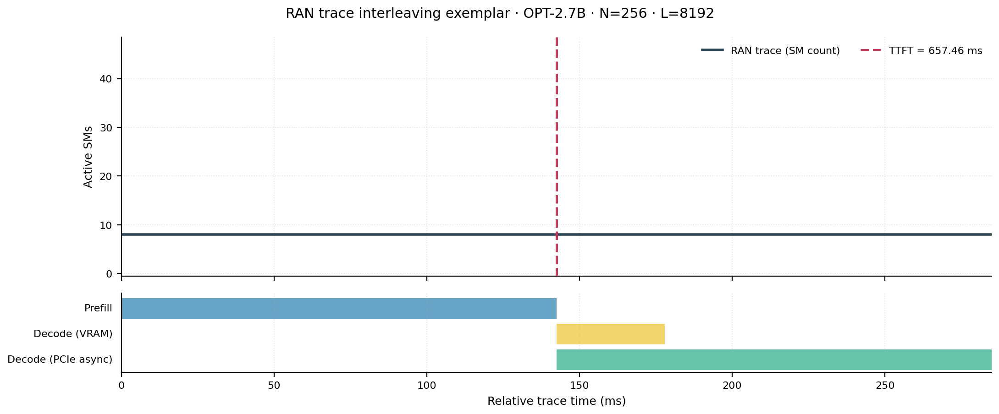
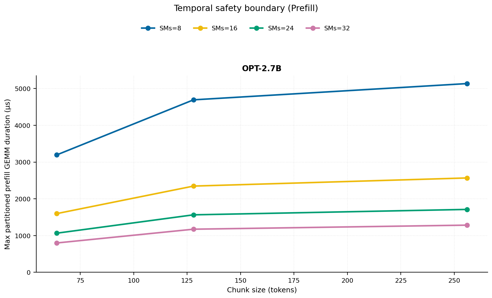
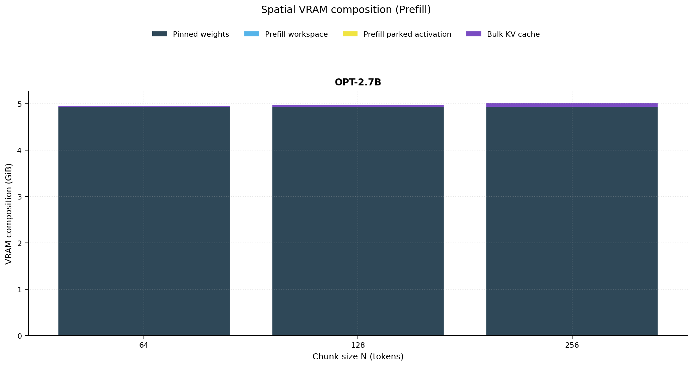
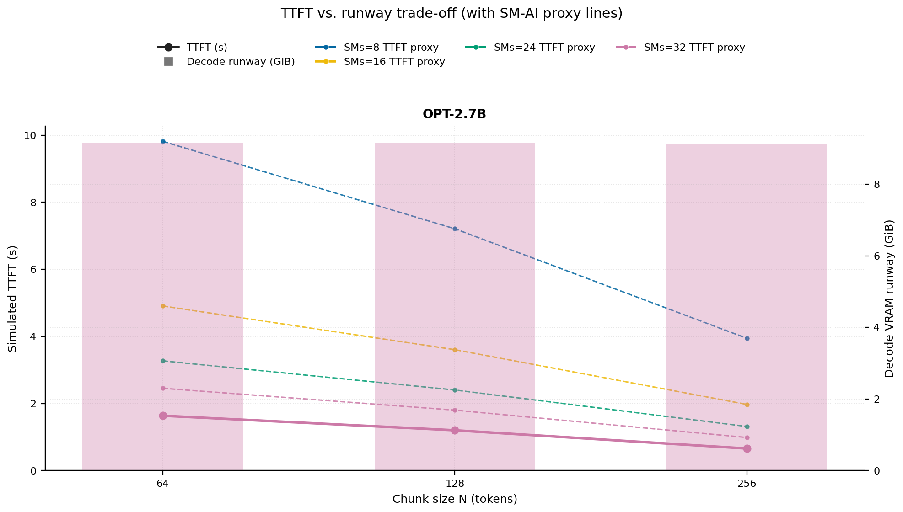
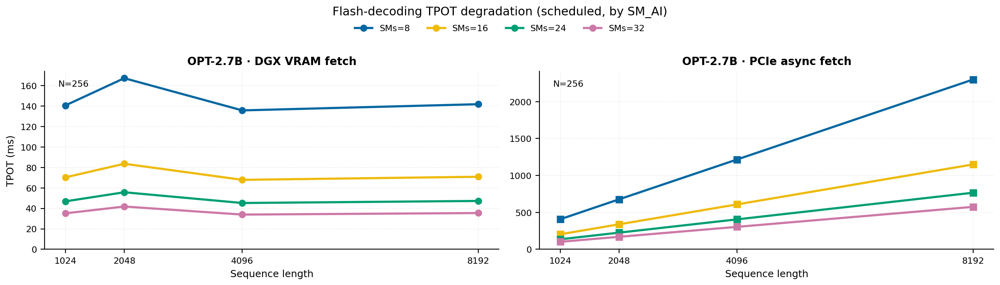
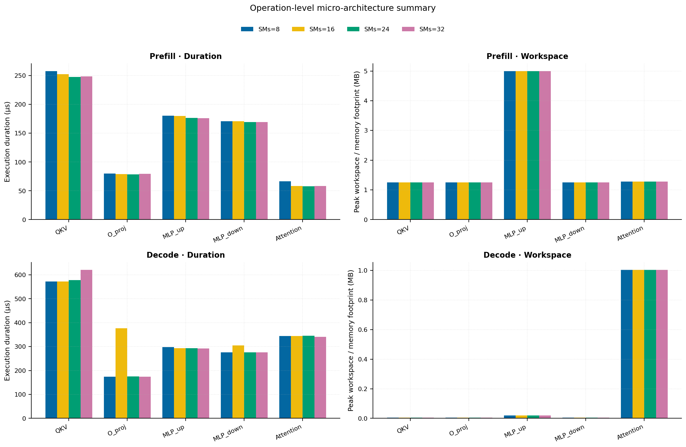
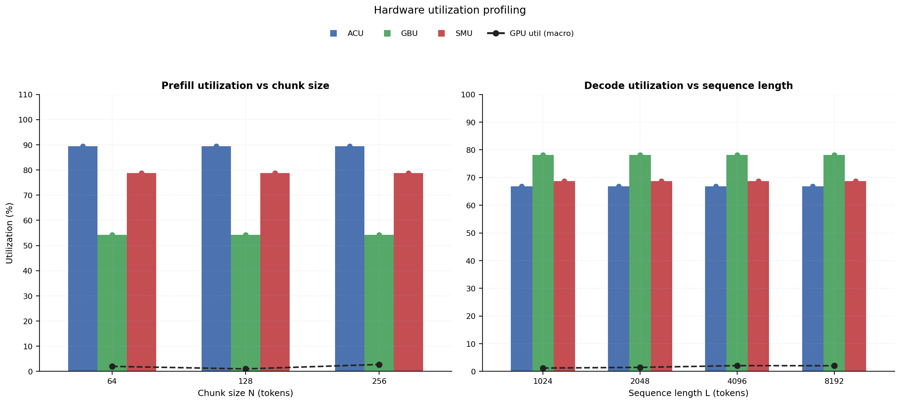
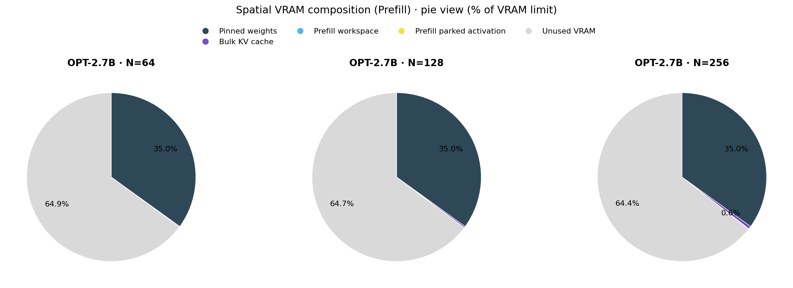

# RAN Inference Profiling Report

Run root: `/mnt/data/dheeraj/dicertation/inference-profile/runs/revised-rerun-20260415-020401-g4-opt27b-c64-256`

## Environment

| field | value |
| --- | --- |
| cache_root | n/a |
| captured_at | 2026-04-15T01:04:08Z |
| chunk_sizes | [64, 128, 256] |
| cuda_available | true |
| cuda_device_count | 8 |
| cwd | /mnt/data/dheeraj/dicertation/inference-profile |
| decode_modes | ["vram", "pcie_async"] |
| experiment_type | ran-dgxspark-v1 |
| gpu_id | 4 |
| l_out | 1024 |
| models | ["facebook/opt-2.7b"] |
| platform | Linux-6.8.0-106-generic-x86_64-with-glibc2.35 |
| python_executable | /home/dheeraj/miniconda3/envs/mls/bin/python |
| python_version | 3.11.14 |
| run_root | /mnt/data/dheeraj/dicertation/inference-profile/runs/revised-rerun-20260415-020401-g4-opt27b-c64-256 |
| scheduler | envelope_v1 |
| schema_version | ran_dgxspark_v1 |
| sequence_lengths | [1024, 2048, 4096, 8192] |
| sm_ai_cap | 32 |
| sm_ai_partition | 100 |
| sm_ai_partitions | [8, 16, 24, 32] |
| stage | profile |
| telemetry_tier | baseline_nvml_pt |
| timed_iterations | 5 |
| torch_available | true |
| torch_version | 2.10.0+cu128 |
| warmup_iterations | 3 |

## Model Constants

| model_id | sm_ai_partition | num_hidden_layers | hidden_size | num_attention_heads | ffn_dim | layer_index | layer_weight_bytes | total_weight_bytes_fp16 | vram_ceiling_bytes |
| --- | --- | --- | --- | --- | --- | --- | --- | --- | --- |
| facebook/opt-2.7b | 100 | 32 | 2560 | 32 | 10240 | 15 | 157352960 | 5303193600 | 15170115993 |

## Trace Inspection

### Primary trace

| field | value |
| --- | --- |
| errors | [] |
| header | ["frame", "slot", "time_slot_sched_ns", "time_decode_start_est_ns", "time_decode_end_est_ns", "time_decode_start_actual_ns", "time_decode_end_actual_ns", "decode_dur_us", "deadline_met", "target_sm", "profile_idx", "sm_count", "num_pusch", "sum_prb", "sum_tbs_bytes", "max_mcs"] |
| median_positive_delta_ms | 5.6997 |
| monotonicity.checked_column | time_slot_sched_ns |
| monotonicity.is_non_decreasing | true |
| monotonicity.negative_delta_count | 0 |
| monotonicity.positive_delta_count | 28377 |
| monotonicity.zero_delta_count | 0 |
| normalization.last_row_duration_policy | median_positive_forward_delta_ms |
| normalization.output_columns | ["time_ms", "sm_utilization", "slot_duration_ms", "source_schema", "sm_count"] |
| normalization.output_relative_path | derived/normalized_ldpc_trace.csv |
| normalized_row_count | 28378 |
| path | /mnt/raid0sata2/netsys/weaver-ext/ran/traces/e2e_2026030418/e2e_20260304_182034_tractor_ran_ctrl/ldpc_trace.csv |
| row_count | 28378 |
| schema_detected | schema_b |
| time_unit_hint | ns |
| usable | true |
| usage_policy | primary_only |
| used_for_scheduler_capacity | true |

### Secondary trace

| field | value |
| --- | --- |
| errors | ["ran_ctrl_trace.csv line 182958 has 9 field(s); expected 12"] |
| header | ["frame", "slot", "sm_available", "prbs_available", "prbs_allocated", "w_avg_mcs_prev", "w_avg_mcs_curr", "slots_since_underutil", "ramp_up_count", "num_ue_sched", "max_ue_backlog", "sum_ue_backlog"] |
| monotonicity.checked_column | n/a |
| monotonicity.is_non_decreasing | n/a |
| monotonicity.negative_delta_count | n/a |
| path | /mnt/raid0sata2/netsys/weaver-ext/ran/traces/e2e_2026030418/e2e_20260304_182034_tractor_ran_ctrl/ran_ctrl_trace.csv |
| row_count | 182956 |
| time_unit_hints | [] |
| usable | false |
| usage_policy | structural_only |
| used_for_scheduler_capacity | false |

## Raw-Profile Summary Tables

### Prefill profile summary

Source raw rows: `raw/prefill_events.csv` = 420. Summary artifact: `derived/prefill_summary.csv`.

| model_id | chunk_tokens | sm_ai_partition | max_input_tokens | prefill_max_gemm_us | prefill_workspace_bytes | prefill_parked_activation_bytes | telemetry_tier | telemetry_provider | telemetry_status | nvml_available | gpu_util | gpu_mem_used_mb | sm_clock_mhz | mem_clock_mhz | power_w | pt_step_ms | pt_mem_alloc_mb | pt_mem_reserved_mb | pt_workspace_mb | acu_pct | gbu_pct | smu_pct | microscopic_telemetry_status | microscopic_error |
| --- | --- | --- | --- | --- | --- | --- | --- | --- | --- | --- | --- | --- | --- | --- | --- | --- | --- | --- | --- | --- | --- | --- | --- | --- |
| facebook/opt-2.7b | 64 | 8 | 1024 | 138.112 | 1572864 | 1310720 | baseline_nvml_pt | nvidia-smi | ok | true | 0 | 2512 | 1695 | 7601 | 60.03 | 0.1381 | 163.4189 | 163.4189 | 1.5 | 79 | 62.5 | 67.5 | estimated | n/a |
| facebook/opt-2.7b | 64 | 16 | 1024 | 138.24 | 1572864 | 1310720 | baseline_nvml_pt | nvidia-smi | ok | true | 0 | 2512 | 1695 | 7601 | 60.07 | 0.1382 | 163.4189 | 163.4189 | 1.5 | 86 | 57 | 75 | estimated | n/a |
| facebook/opt-2.7b | 64 | 24 | 1024 | 132.96 | 1572864 | 1310720 | baseline_nvml_pt | nvidia-smi | ok | true | 8 | 2512 | 1695 | 7601 | 59.98 | 0.133 | 163.4189 | 163.4189 | 1.5 | 93 | 51.5 | 82.5 | estimated | n/a |
| facebook/opt-2.7b | 64 | 32 | 1024 | 133.12 | 1572864 | 1310720 | baseline_nvml_pt | nvidia-smi | ok | true | 0 | 2512 | 1695 | 7601 | 60.34 | 0.1331 | 163.4189 | 163.4189 | 1.5 | 100 | 46 | 90 | estimated | n/a |
| facebook/opt-2.7b | 128 | 8 | 1024 | 209.92 | 3538944 | 2621440 | baseline_nvml_pt | nvidia-smi | ok | true | 0 | 2512 | 1695 | 7601 | 60.28 | 0.2099 | 167.5439 | 167.5439 | 3.375 | 79 | 62.5 | 67.5 | estimated | n/a |
| facebook/opt-2.7b | 128 | 16 | 1024 | 219.136 | 3538944 | 2621440 | baseline_nvml_pt | nvidia-smi | ok | true | 0 | 2512 | 1695 | 7601 | 60.41 | 0.2191 | 167.5439 | 167.5439 | 3.375 | 86 | 57 | 75 | estimated | n/a |
| facebook/opt-2.7b | 128 | 24 | 1024 | 193.536 | 3538944 | 2621440 | baseline_nvml_pt | nvidia-smi | ok | true | 0 | 2510 | 1695 | 7601 | 61 | 0.1935 | 167.5439 | 167.5439 | 3.375 | 93 | 51.5 | 82.5 | estimated | n/a |
| facebook/opt-2.7b | 128 | 32 | 1024 | 195.584 | 3538944 | 2621440 | baseline_nvml_pt | nvidia-smi | ok | true | 4 | 2512 | 1695 | 7601 | 60.8 | 0.1956 | 167.5439 | 167.5439 | 3.375 | 100 | 46 | 90 | estimated | n/a |
| facebook/opt-2.7b | 256 | 8 | 1024 | 219.104 | 5242880 | 5242880 | baseline_nvml_pt | nvidia-smi | ok | true | 0 | 2512 | 1695 | 7601 | 61.05 | 0.2191 | 176.0439 | 176.0439 | 5 | 79 | 62.5 | 67.5 | estimated | n/a |
| facebook/opt-2.7b | 256 | 16 | 1024 | 220.16 | 5242880 | 5242880 | baseline_nvml_pt | nvidia-smi | ok | true | 11 | 2512 | 1695 | 7601 | 60.91 | 0.2202 | 176.0439 | 176.0439 | 5 | 86 | 57 | 75 | estimated | n/a |
| facebook/opt-2.7b | 256 | 24 | 1024 | 219.136 | 5242880 | 5242880 | baseline_nvml_pt | nvidia-smi | ok | true | 0 | 2512 | 1695 | 7601 | 61.43 | 0.2191 | 176.0439 | 176.0439 | 5 | 93 | 51.5 | 82.5 | estimated | n/a |
| facebook/opt-2.7b | 256 | 32 | 1024 | 214.016 | 5242880 | 5242880 | baseline_nvml_pt | nvidia-smi | ok | true | 0 | 2512 | 1695 | 7601 | 61.45 | 0.214 | 176.0439 | 176.0439 | 5 | 100 | 46 | 90 | estimated | n/a |

### Decode profile summary

Source raw rows: `raw/decode_events.csv` = 3840. Summary artifact: `derived/decode_summary.csv`.

| model_id | sequence_length | block_size | sm_ai_partition | decode_mode | decode_max_gemv_us | attention_fetch_compute_us | reduction_overhead_us | decode_workspace_bytes | decode_parked_activation_bytes | telemetry_tier | telemetry_provider | telemetry_status | nvml_available | gpu_util | gpu_mem_used_mb | sm_clock_mhz | mem_clock_mhz | power_w | pt_step_ms | pt_mem_alloc_mb | pt_mem_reserved_mb | pt_workspace_mb | acu_pct | gbu_pct | smu_pct | microscopic_telemetry_status | microscopic_error |
| --- | --- | --- | --- | --- | --- | --- | --- | --- | --- | --- | --- | --- | --- | --- | --- | --- | --- | --- | --- | --- | --- | --- | --- | --- | --- | --- | --- |
| facebook/opt-2.7b | 1024 | 64 | 8 | pcie_async | 159.744 | 125.12 | 22.1312 | 136192 | 5120 | baseline_nvml_pt | nvidia-smi | ok | true | 2 | 2510 | 1695 | 7601 | 60.95 | 0.1597 | 169.2031 | 169.2031 | 0.1299 | 56.5 | 87 | 59 | estimated | n/a |
| facebook/opt-2.7b | 1024 | 64 | 8 | vram | 158.72 | 141.5168 | 20.9344 | 136192 | 5120 | baseline_nvml_pt | nvidia-smi | ok | true | 1 | 2510 | 1695 | 7601 | 60.76 | 0.1587 | 169.2031 | 169.2031 | 0.1299 | 63 | 77.5 | 62 | estimated | n/a |
| facebook/opt-2.7b | 1024 | 64 | 16 | pcie_async | 6304.7681 | 175.7696 | 32.1216 | 136192 | 5120 | baseline_nvml_pt | nvidia-smi | ok | true | 7 | 2512 | 1695 | 7601 | 60.97 | 6.3048 | 169.2031 | 169.2031 | 0.1299 | 61 | 84 | 64 | estimated | n/a |
| facebook/opt-2.7b | 1024 | 64 | 16 | vram | 153.6 | 123.6608 | 19.6608 | 136192 | 5120 | baseline_nvml_pt | nvidia-smi | ok | true | 0 | 2512 | 1695 | 7601 | 60.61 | 0.1536 | 169.2031 | 169.2031 | 0.1299 | 68 | 75 | 68 | estimated | n/a |
| facebook/opt-2.7b | 1024 | 64 | 24 | pcie_async | 152.576 | 130.9056 | 20.0576 | 136192 | 5120 | baseline_nvml_pt | nvidia-smi | ok | true | 0 | 2510 | 1695 | 7601 | 60.84 | 0.1526 | 169.2031 | 169.2031 | 0.1299 | 65.5 | 81 | 69 | estimated | n/a |
| facebook/opt-2.7b | 1024 | 64 | 24 | vram | 150.4 | 123.2896 | 20.4736 | 136192 | 5120 | baseline_nvml_pt | nvidia-smi | ok | true | 0 | 2512 | 1695 | 7601 | 60.44 | 0.1504 | 169.2031 | 169.2031 | 0.1299 | 73 | 72.5 | 74 | estimated | n/a |
| facebook/opt-2.7b | 1024 | 64 | 32 | pcie_async | 159.776 | 130.048 | 19.68 | 136192 | 5120 | baseline_nvml_pt | nvidia-smi | ok | true | 0 | 2512 | 1695 | 7601 | 60.72 | 0.1598 | 169.2031 | 169.2031 | 0.1299 | 70 | 78 | 74 | estimated | n/a |
| facebook/opt-2.7b | 1024 | 64 | 32 | vram | 151.488 | 122.4128 | 20.256 | 136192 | 5120 | baseline_nvml_pt | nvidia-smi | ok | true | 0 | 2512 | 1695 | 7601 | 61.17 | 0.1515 | 169.2031 | 169.2031 | 0.1299 | 78 | 70 | 80 | estimated | n/a |
| facebook/opt-2.7b | 1024 | 128 | 8 | pcie_async | 168.96 | 166.912 | 24.2368 | 136192 | 5120 | baseline_nvml_pt | nvidia-smi | ok | true | 12 | 2512 | 1695 | 7601 | 60.97 | 0.1905 | 169.2031 | 169.2031 | 0.1299 | 56.5 | 87 | 59 | estimated | n/a |
| facebook/opt-2.7b | 1024 | 128 | 8 | vram | 162.816 | 137.6 | 24.8064 | 136192 | 5120 | baseline_nvml_pt | nvidia-smi | ok | true | 0 | 2510 | 1695 | 7601 | 60.9 | 0.1628 | 169.2031 | 169.2031 | 0.1299 | 63 | 77.5 | 62 | estimated | n/a |
| facebook/opt-2.7b | 1024 | 128 | 16 | pcie_async | 151.552 | 127.8208 | 19.6544 | 136192 | 5120 | baseline_nvml_pt | nvidia-smi | ok | true | 0 | 2512 | 1695 | 7601 | 60.45 | 0.1516 | 169.2031 | 169.2031 | 0.1299 | 61 | 84 | 64 | estimated | n/a |
| facebook/opt-2.7b | 1024 | 128 | 16 | vram | 155.712 | 121.4272 | 20.48 | 136192 | 5120 | baseline_nvml_pt | nvidia-smi | ok | true | 0 | 2512 | 1695 | 7601 | 60.83 | 0.1557 | 169.2031 | 169.2031 | 0.1299 | 68 | 75 | 68 | estimated | n/a |
| facebook/opt-2.7b | 1024 | 128 | 24 | pcie_async | 158.816 | 132.4736 | 21.504 | 136192 | 5120 | baseline_nvml_pt | nvidia-smi | ok | true | 0 | 2512 | 1695 | 7601 | 61.05 | 0.1588 | 169.2031 | 169.2031 | 0.1299 | 65.5 | 81 | 69 | estimated | n/a |
| facebook/opt-2.7b | 1024 | 128 | 24 | vram | 165.888 | 161.6256 | 24.192 | 136192 | 5120 | baseline_nvml_pt | nvidia-smi | ok | true | 1 | 2512 | 1695 | 7601 | 60.71 | 0.1905 | 169.2031 | 169.2031 | 0.1299 | 73 | 72.5 | 74 | estimated | n/a |
| facebook/opt-2.7b | 1024 | 128 | 32 | pcie_async | 152.512 | 127.3472 | 21.312 | 136192 | 5120 | baseline_nvml_pt | nvidia-smi | ok | true | 0 | 2512 | 1695 | 7601 | 60.8 | 0.1525 | 169.2031 | 169.2031 | 0.1299 | 70 | 78 | 74 | estimated | n/a |
| facebook/opt-2.7b | 1024 | 128 | 32 | vram | 155.648 | 126.1376 | 20.512 | 136192 | 5120 | baseline_nvml_pt | nvidia-smi | ok | true | 0 | 2512 | 1695 | 7601 | 60.91 | 0.1556 | 169.2031 | 169.2031 | 0.1299 | 78 | 70 | 80 | estimated | n/a |
| facebook/opt-2.7b | 1024 | 256 | 8 | pcie_async | 150.528 | 121.024 | 19.6608 | 136192 | 5120 | baseline_nvml_pt | nvidia-smi | ok | true | 1 | 2512 | 1695 | 7601 | 61.24 | 0.1505 | 169.2031 | 169.2031 | 0.1299 | 56.5 | 87 | 59 | estimated | n/a |
| facebook/opt-2.7b | 1024 | 256 | 8 | vram | 161.728 | 140.4608 | 22.5728 | 136192 | 5120 | baseline_nvml_pt | nvidia-smi | ok | true | 0 | 2512 | 1695 | 7601 | 61.1 | 0.1617 | 169.2031 | 169.2031 | 0.1299 | 63 | 77.5 | 62 | estimated | n/a |
| facebook/opt-2.7b | 1024 | 256 | 16 | pcie_async | 161.952 | 149.5104 | 23.7952 | 136192 | 5120 | baseline_nvml_pt | nvidia-smi | ok | true | 0 | 2510 | 1695 | 7601 | 60.62 | 0.1638 | 169.2031 | 169.2031 | 0.1299 | 61 | 84 | 64 | estimated | n/a |
| facebook/opt-2.7b | 1024 | 256 | 16 | vram | 149.504 | 122.2592 | 20.4416 | 136192 | 5120 | baseline_nvml_pt | nvidia-smi | ok | true | 0 | 2510 | 1695 | 7601 | 61.07 | 0.1495 | 169.2031 | 169.2031 | 0.1299 | 68 | 75 | 68 | estimated | n/a |
| facebook/opt-2.7b | 1024 | 256 | 24 | pcie_async | 160.832 | 148.7232 | 23.2128 | 136192 | 5120 | baseline_nvml_pt | nvidia-smi | ok | true | 0 | 2512 | 1695 | 7601 | 60.68 | 0.162 | 169.2031 | 169.2031 | 0.1299 | 65.5 | 81 | 69 | estimated | n/a |
| facebook/opt-2.7b | 1024 | 256 | 24 | vram | 167.936 | 131.2768 | 21.9072 | 136192 | 5120 | baseline_nvml_pt | nvidia-smi | ok | true | 4 | 2510 | 1695 | 7601 | 60.83 | 0.1679 | 169.2031 | 169.2031 | 0.1299 | 73 | 72.5 | 74 | estimated | n/a |
| facebook/opt-2.7b | 1024 | 256 | 32 | pcie_async | 153.504 | 128.6272 | 20.4608 | 136192 | 5120 | baseline_nvml_pt | nvidia-smi | ok | true | 1 | 2512 | 1695 | 7601 | 60.84 | 0.1535 | 169.2031 | 169.2031 | 0.1299 | 70 | 78 | 74 | estimated | n/a |
| facebook/opt-2.7b | 1024 | 256 | 32 | vram | 157.568 | 132.48 | 20.6976 | 136192 | 5120 | baseline_nvml_pt | nvidia-smi | ok | true | 0 | 2510 | 1695 | 7601 | 61.37 | 0.1576 | 169.2031 | 169.2031 | 0.1299 | 78 | 70 | 80 | estimated | n/a |
| facebook/opt-2.7b | 2048 | 64 | 8 | pcie_async | 167.808 | 158.112 | 23.7568 | 267264 | 5120 | baseline_nvml_pt | nvidia-smi | ok | true | 5 | 2512 | 1695 | 7601 | 60.81 | 0.1741 | 178.4531 | 178.4531 | 0.2549 | 56.5 | 87 | 59 | estimated | n/a |
| facebook/opt-2.7b | 2048 | 64 | 8 | vram | 156.672 | 127.1936 | 20.1152 | 267264 | 5120 | baseline_nvml_pt | nvidia-smi | ok | true | 0 | 2512 | 1695 | 7601 | 61.2 | 0.1567 | 178.4531 | 178.4531 | 0.2549 | 63 | 77.5 | 62 | estimated | n/a |
| facebook/opt-2.7b | 2048 | 64 | 16 | pcie_async | 155.648 | 127.968 | 21.0688 | 267264 | 5120 | baseline_nvml_pt | nvidia-smi | ok | true | 0 | 2512 | 1695 | 7601 | 61.45 | 0.1556 | 178.4531 | 178.4531 | 0.2549 | 61 | 84 | 64 | estimated | n/a |
| facebook/opt-2.7b | 2048 | 64 | 16 | vram | 159.744 | 129.4208 | 20.5056 | 267264 | 5120 | baseline_nvml_pt | nvidia-smi | ok | true | 3 | 2512 | 1695 | 7601 | 61.28 | 0.1597 | 178.4531 | 178.4531 | 0.2549 | 68 | 75 | 68 | estimated | n/a |
| facebook/opt-2.7b | 2048 | 64 | 24 | pcie_async | 148.576 | 124.928 | 19.872 | 267264 | 5120 | baseline_nvml_pt | nvidia-smi | ok | true | 0 | 2510 | 1695 | 7601 | 61.06 | 0.1486 | 178.4531 | 178.4531 | 0.2549 | 65.5 | 81 | 69 | estimated | n/a |
| facebook/opt-2.7b | 2048 | 64 | 24 | vram | 150.528 | 124.0768 | 20.0832 | 267264 | 5120 | baseline_nvml_pt | nvidia-smi | ok | true | 5 | 2510 | 1695 | 7601 | 60.88 | 0.1505 | 178.4531 | 178.4531 | 0.2549 | 73 | 72.5 | 74 | estimated | n/a |
| facebook/opt-2.7b | 2048 | 64 | 32 | pcie_async | 156.672 | 128.5824 | 20.6784 | 267264 | 5120 | baseline_nvml_pt | nvidia-smi | ok | true | 0 | 2512 | 1695 | 7601 | 60.65 | 0.1567 | 178.4531 | 178.4531 | 0.2549 | 70 | 78 | 74 | estimated | n/a |
| facebook/opt-2.7b | 2048 | 64 | 32 | vram | 155.648 | 129.4272 | 20.6912 | 267264 | 5120 | baseline_nvml_pt | nvidia-smi | ok | true | 0 | 2512 | 1695 | 7601 | 60.88 | 0.1556 | 178.4531 | 178.4531 | 0.2549 | 78 | 70 | 80 | estimated | n/a |
| facebook/opt-2.7b | 2048 | 128 | 8 | pcie_async | 165.888 | 134.048 | 20.8896 | 267264 | 5120 | baseline_nvml_pt | nvidia-smi | ok | true | 0 | 2512 | 1695 | 7601 | 61.33 | 0.1659 | 178.4531 | 178.4531 | 0.2549 | 56.5 | 87 | 59 | estimated | n/a |
| facebook/opt-2.7b | 2048 | 128 | 8 | vram | 152.576 | 129.024 | 22.1184 | 267264 | 5120 | baseline_nvml_pt | nvidia-smi | ok | true | 0 | 2512 | 1695 | 7601 | 61.12 | 0.1526 | 178.4531 | 178.4531 | 0.2549 | 63 | 77.5 | 62 | estimated | n/a |
| facebook/opt-2.7b | 2048 | 128 | 16 | pcie_async | 165.888 | 129.4016 | 20.1344 | 267264 | 5120 | baseline_nvml_pt | nvidia-smi | ok | true | 0 | 2512 | 1695 | 7601 | 61.31 | 0.1659 | 178.4531 | 178.4531 | 0.2549 | 61 | 84 | 64 | estimated | n/a |
| facebook/opt-2.7b | 2048 | 128 | 16 | vram | 159.744 | 142.336 | 24.1536 | 267264 | 5120 | baseline_nvml_pt | nvidia-smi | ok | true | 6 | 2512 | 1695 | 7601 | 61.12 | 0.169 | 178.4531 | 178.4531 | 0.2549 | 68 | 75 | 68 | estimated | n/a |
| facebook/opt-2.7b | 2048 | 128 | 24 | pcie_async | 167.072 | 134.5856 | 20.9152 | 267264 | 5120 | baseline_nvml_pt | nvidia-smi | ok | true | 1 | 2512 | 1695 | 7601 | 60.8 | 0.1671 | 178.4531 | 178.4531 | 0.2549 | 65.5 | 81 | 69 | estimated | n/a |
| facebook/opt-2.7b | 2048 | 128 | 24 | vram | 158.848 | 136.8064 | 21.28 | 267264 | 5120 | baseline_nvml_pt | nvidia-smi | ok | true | 0 | 2510 | 1695 | 7601 | 60.84 | 0.1588 | 178.4531 | 178.4531 | 0.2549 | 73 | 72.5 | 74 | estimated | n/a |
| facebook/opt-2.7b | 2048 | 128 | 32 | pcie_async | 3091.3279 | 154.624 | 23.9616 | 267264 | 5120 | baseline_nvml_pt | nvidia-smi | ok | true | 0 | 2510 | 1695 | 7601 | 61.51 | 3.0913 | 178.4531 | 178.4531 | 0.2549 | 70 | 78 | 74 | estimated | n/a |
| facebook/opt-2.7b | 2048 | 128 | 32 | vram | 158.72 | 128.0128 | 19.8656 | 267264 | 5120 | baseline_nvml_pt | nvidia-smi | ok | true | 0 | 2510 | 1695 | 7601 | 61.14 | 0.1587 | 178.4531 | 178.4531 | 0.2549 | 78 | 70 | 80 | estimated | n/a |
| facebook/opt-2.7b | 2048 | 256 | 8 | pcie_async | 152.576 | 130.8544 | 20.4928 | 267264 | 5120 | baseline_nvml_pt | nvidia-smi | ok | true | 0 | 2512 | 1695 | 7601 | 61.1 | 0.1526 | 178.4531 | 178.4531 | 0.2549 | 56.5 | 87 | 59 | estimated | n/a |
| facebook/opt-2.7b | 2048 | 256 | 8 | vram | 156.672 | 126.368 | 20.1024 | 267264 | 5120 | baseline_nvml_pt | nvidia-smi | ok | true | 0 | 2512 | 1695 | 7601 | 61.12 | 0.1567 | 178.4531 | 178.4531 | 0.2549 | 63 | 77.5 | 62 | estimated | n/a |
| facebook/opt-2.7b | 2048 | 256 | 16 | pcie_async | 169.952 | 146.848 | 22.8032 | 267264 | 5120 | baseline_nvml_pt | nvidia-smi | ok | true | 7 | 2512 | 1695 | 7601 | 60.98 | 0.1761 | 178.4531 | 178.4531 | 0.2549 | 61 | 84 | 64 | estimated | n/a |
| facebook/opt-2.7b | 2048 | 256 | 16 | vram | 166.912 | 143.328 | 23.9488 | 267264 | 5120 | baseline_nvml_pt | nvidia-smi | ok | true | 0 | 2512 | 1695 | 7601 | 60.82 | 0.1669 | 178.4531 | 178.4531 | 0.2549 | 68 | 75 | 68 | estimated | n/a |
| facebook/opt-2.7b | 2048 | 256 | 24 | pcie_async | 172.032 | 134.5856 | 20.7424 | 267264 | 5120 | baseline_nvml_pt | nvidia-smi | ok | true | 0 | 2512 | 1695 | 7601 | 61.13 | 0.172 | 178.4531 | 178.4531 | 0.2549 | 65.5 | 81 | 69 | estimated | n/a |
| facebook/opt-2.7b | 2048 | 256 | 24 | vram | 165.888 | 148.8768 | 25.5616 | 267264 | 5120 | baseline_nvml_pt | nvidia-smi | ok | true | 0 | 2512 | 1695 | 7601 | 61.01 | 0.1659 | 178.4531 | 178.4531 | 0.2549 | 73 | 72.5 | 74 | estimated | n/a |
| facebook/opt-2.7b | 2048 | 256 | 32 | pcie_async | 154.624 | 129.4336 | 20.8896 | 267264 | 5120 | baseline_nvml_pt | nvidia-smi | ok | true | 0 | 2512 | 1695 | 7601 | 60.89 | 0.1546 | 178.4531 | 178.4531 | 0.2549 | 70 | 78 | 74 | estimated | n/a |
| facebook/opt-2.7b | 2048 | 256 | 32 | vram | 189.472 | 147.0336 | 23.1168 | 267264 | 5120 | baseline_nvml_pt | nvidia-smi | ok | true | 8 | 2512 | 1695 | 7601 | 61.29 | 0.1895 | 178.4531 | 178.4531 | 0.2549 | 78 | 70 | 80 | estimated | n/a |
| facebook/opt-2.7b | 4096 | 64 | 8 | pcie_async | 153.6 | 142.9504 | 20.128 | 529408 | 5120 | baseline_nvml_pt | nvidia-smi | ok | true | 0 | 2512 | 1695 | 7601 | 61.07 | 0.1536 | 198.7031 | 198.7031 | 0.5049 | 56.5 | 87 | 59 | estimated | n/a |
| facebook/opt-2.7b | 4096 | 64 | 8 | vram | 326.656 | 144.7936 | 20.896 | 529408 | 5120 | baseline_nvml_pt | nvidia-smi | ok | true | 0 | 2512 | 1695 | 7601 | 61.22 | 0.3267 | 198.7031 | 198.7031 | 0.5049 | 63 | 77.5 | 62 | estimated | n/a |
| facebook/opt-2.7b | 4096 | 64 | 16 | pcie_async | 148.32 | 135.3472 | 20.704 | 529408 | 5120 | baseline_nvml_pt | nvidia-smi | ok | true | 0 | 2512 | 1695 | 7601 | 61.73 | 0.1483 | 198.7031 | 198.7031 | 0.5049 | 61 | 84 | 64 | estimated | n/a |
| facebook/opt-2.7b | 4096 | 64 | 16 | vram | 156.864 | 136.6016 | 19.8656 | 529408 | 5120 | baseline_nvml_pt | nvidia-smi | ok | true | 0 | 2512 | 1695 | 7601 | 61.37 | 0.1569 | 198.7031 | 198.7031 | 0.5049 | 68 | 75 | 68 | estimated | n/a |
| facebook/opt-2.7b | 4096 | 64 | 24 | pcie_async | 157.696 | 146.0096 | 20.5568 | 529408 | 5120 | baseline_nvml_pt | nvidia-smi | ok | true | 0 | 2512 | 1695 | 7601 | 61.51 | 0.1577 | 198.7031 | 198.7031 | 0.5049 | 65.5 | 81 | 69 | estimated | n/a |
| facebook/opt-2.7b | 4096 | 64 | 24 | vram | 152.576 | 142.72 | 22.7264 | 529408 | 5120 | baseline_nvml_pt | nvidia-smi | ok | true | 0 | 2512 | 1695 | 7601 | 61.09 | 0.1526 | 198.7031 | 198.7031 | 0.5049 | 73 | 72.5 | 74 | estimated | n/a |
| facebook/opt-2.7b | 4096 | 64 | 32 | pcie_async | 156.672 | 147.0464 | 21.504 | 529408 | 5120 | baseline_nvml_pt | nvidia-smi | ok | true | 0 | 2512 | 1695 | 7601 | 61.26 | 0.1567 | 198.7031 | 198.7031 | 0.5049 | 70 | 78 | 74 | estimated | n/a |
| facebook/opt-2.7b | 4096 | 64 | 32 | vram | 150.528 | 150.912 | 21.1072 | 529408 | 5120 | baseline_nvml_pt | nvidia-smi | ok | true | 1 | 2512 | 1695 | 7601 | 60.87 | 0.174 | 198.7031 | 198.7031 | 0.5049 | 78 | 70 | 80 | estimated | n/a |
| facebook/opt-2.7b | 4096 | 128 | 8 | pcie_async | 147.456 | 137.216 | 19.2256 | 529408 | 5120 | baseline_nvml_pt | nvidia-smi | ok | true | 0 | 2512 | 1695 | 7601 | 61.26 | 0.1475 | 198.7031 | 198.7031 | 0.5049 | 56.5 | 87 | 59 | estimated | n/a |
| facebook/opt-2.7b | 4096 | 128 | 8 | vram | 156.672 | 139.6864 | 20.8896 | 529408 | 5120 | baseline_nvml_pt | nvidia-smi | ok | true | 0 | 2512 | 1695 | 7601 | 61.25 | 0.1567 | 198.7031 | 198.7031 | 0.5049 | 63 | 77.5 | 62 | estimated | n/a |
| facebook/opt-2.7b | 4096 | 128 | 16 | pcie_async | 148.448 | 133.28 | 19.8016 | 529408 | 5120 | baseline_nvml_pt | nvidia-smi | ok | true | 1 | 2512 | 1695 | 7601 | 61.31 | 0.1484 | 198.7031 | 198.7031 | 0.5049 | 61 | 84 | 64 | estimated | n/a |
| facebook/opt-2.7b | 4096 | 128 | 16 | vram | 149.504 | 139.2512 | 20.0704 | 529408 | 5120 | baseline_nvml_pt | nvidia-smi | ok | true | 0 | 2512 | 1695 | 7601 | 61.4 | 0.1495 | 198.7031 | 198.7031 | 0.5049 | 68 | 75 | 68 | estimated | n/a |
| facebook/opt-2.7b | 4096 | 128 | 24 | pcie_async | 152.576 | 146.8672 | 20.7232 | 529408 | 5120 | baseline_nvml_pt | nvidia-smi | ok | true | 0 | 2512 | 1695 | 7601 | 60.94 | 0.1638 | 198.7031 | 198.7031 | 0.5049 | 65.5 | 81 | 69 | estimated | n/a |
| facebook/opt-2.7b | 4096 | 128 | 24 | vram | 246.944 | 140.0704 | 20.2816 | 529408 | 5120 | baseline_nvml_pt | nvidia-smi | ok | true | 0 | 2512 | 1695 | 7601 | 61.37 | 0.2469 | 198.7031 | 198.7031 | 0.5049 | 73 | 72.5 | 74 | estimated | n/a |
| facebook/opt-2.7b | 4096 | 128 | 32 | pcie_async | 156.48 | 144.9792 | 23.1424 | 529408 | 5120 | baseline_nvml_pt | nvidia-smi | ok | true | 15 | 2512 | 1695 | 7601 | 60.88 | 0.1565 | 198.7031 | 198.7031 | 0.5049 | 70 | 78 | 74 | estimated | n/a |
| facebook/opt-2.7b | 4096 | 128 | 32 | vram | 152.48 | 133.9392 | 26.2016 | 529408 | 5120 | baseline_nvml_pt | nvidia-smi | ok | true | 8 | 2512 | 1695 | 7601 | 60.75 | 0.1525 | 198.7031 | 198.7031 | 0.5049 | 78 | 70 | 80 | estimated | n/a |
| facebook/opt-2.7b | 4096 | 256 | 8 | pcie_async | 154.624 | 143.1232 | 20.8832 | 529408 | 5120 | baseline_nvml_pt | nvidia-smi | ok | true | 8 | 2510 | 1695 | 7601 | 61.78 | 0.1546 | 198.7031 | 198.7031 | 0.5049 | 56.5 | 87 | 59 | estimated | n/a |
| facebook/opt-2.7b | 4096 | 256 | 8 | vram | 151.552 | 140.2304 | 19.6928 | 529408 | 5120 | baseline_nvml_pt | nvidia-smi | ok | true | 1 | 2512 | 1695 | 7601 | 61.21 | 0.1516 | 198.7031 | 198.7031 | 0.5049 | 63 | 77.5 | 62 | estimated | n/a |
| facebook/opt-2.7b | 4096 | 256 | 16 | pcie_async | 152.672 | 140.7296 | 20.4672 | 529408 | 5120 | baseline_nvml_pt | nvidia-smi | ok | true | 0 | 2510 | 1695 | 7601 | 61.1 | 0.1527 | 198.7031 | 198.7031 | 0.5049 | 61 | 84 | 64 | estimated | n/a |
| facebook/opt-2.7b | 4096 | 256 | 16 | vram | 151.552 | 141.1328 | 20.6848 | 529408 | 5120 | baseline_nvml_pt | nvidia-smi | ok | true | 1 | 2510 | 1695 | 7601 | 60.93 | 0.1516 | 198.7031 | 198.7031 | 0.5049 | 68 | 75 | 68 | estimated | n/a |
| facebook/opt-2.7b | 4096 | 256 | 24 | pcie_async | 157.696 | 138.8736 | 20.6848 | 529408 | 5120 | baseline_nvml_pt | nvidia-smi | ok | true | 0 | 2510 | 1695 | 7601 | 61.46 | 0.1577 | 198.7031 | 198.7031 | 0.5049 | 65.5 | 81 | 69 | estimated | n/a |
| facebook/opt-2.7b | 4096 | 256 | 24 | vram | 167.072 | 144.128 | 20.5184 | 529408 | 5120 | baseline_nvml_pt | nvidia-smi | ok | true | 1 | 2512 | 1695 | 7601 | 61.24 | 0.1671 | 198.7031 | 198.7031 | 0.5049 | 73 | 72.5 | 74 | estimated | n/a |
| facebook/opt-2.7b | 4096 | 256 | 32 | pcie_async | 152.576 | 142.5408 | 22.4896 | 529408 | 5120 | baseline_nvml_pt | nvidia-smi | ok | true | 14 | 2512 | 1695 | 7601 | 61.14 | 0.1526 | 198.7031 | 198.7031 | 0.5049 | 70 | 78 | 74 | estimated | n/a |
| facebook/opt-2.7b | 4096 | 256 | 32 | vram | 150.528 | 137.6 | 20.2752 | 529408 | 5120 | baseline_nvml_pt | nvidia-smi | ok | true | 0 | 2512 | 1695 | 7601 | 61.27 | 0.1505 | 198.7031 | 198.7031 | 0.5049 | 78 | 70 | 80 | estimated | n/a |
| facebook/opt-2.7b | 8192 | 64 | 8 | pcie_async | 154.624 | 190.8736 | 20.704 | 1053696 | 5120 | baseline_nvml_pt | nvidia-smi | ok | true | 9 | 2512 | 1695 | 7601 | 61.43 | 0.1956 | 239.2031 | 239.2031 | 1.0049 | 56.5 | 87 | 59 | estimated | n/a |
| facebook/opt-2.7b | 8192 | 64 | 8 | vram | 156.576 | 193.536 | 23.3536 | 1053696 | 5120 | baseline_nvml_pt | nvidia-smi | ok | true | 0 | 2512 | 1695 | 7601 | 61.41 | 0.1946 | 239.2031 | 239.2031 | 1.0049 | 63 | 77.5 | 62 | estimated | n/a |
| facebook/opt-2.7b | 8192 | 64 | 16 | pcie_async | 162.816 | 194.528 | 22.3424 | 1053696 | 5120 | baseline_nvml_pt | nvidia-smi | ok | true | 0 | 2512 | 1695 | 7601 | 60.96 | 0.2007 | 239.2031 | 239.2031 | 1.0049 | 61 | 84 | 64 | estimated | n/a |
| facebook/opt-2.7b | 8192 | 64 | 16 | vram | 155.648 | 190.464 | 20.5184 | 1053696 | 5120 | baseline_nvml_pt | nvidia-smi | ok | true | 0 | 2512 | 1695 | 7601 | 61.28 | 0.1935 | 239.2031 | 239.2031 | 1.0049 | 68 | 75 | 68 | estimated | n/a |
| facebook/opt-2.7b | 8192 | 64 | 24 | pcie_async | 152.576 | 192.0768 | 20.8896 | 1053696 | 5120 | baseline_nvml_pt | nvidia-smi | ok | true | 0 | 2512 | 1695 | 7601 | 61.26 | 0.1997 | 239.2031 | 239.2031 | 1.0049 | 65.5 | 81 | 69 | estimated | n/a |
| facebook/opt-2.7b | 8192 | 64 | 24 | vram | 157.76 | 189.4848 | 20.2752 | 1053696 | 5120 | baseline_nvml_pt | nvidia-smi | ok | true | 7 | 2512 | 1695 | 7601 | 61.12 | 0.1925 | 239.2031 | 239.2031 | 1.0049 | 73 | 72.5 | 74 | estimated | n/a |
| facebook/opt-2.7b | 8192 | 64 | 32 | pcie_async | 153.6 | 193.0816 | 20.5376 | 1053696 | 5120 | baseline_nvml_pt | nvidia-smi | ok | true | 0 | 2510 | 1695 | 7601 | 61.01 | 0.2028 | 239.2031 | 239.2031 | 1.0049 | 70 | 78 | 74 | estimated | n/a |
| facebook/opt-2.7b | 8192 | 64 | 32 | vram | 160.768 | 194.3936 | 21.4912 | 1053696 | 5120 | baseline_nvml_pt | nvidia-smi | ok | true | 0 | 2510 | 1695 | 7601 | 60.94 | 0.1966 | 239.2031 | 239.2031 | 1.0049 | 78 | 70 | 80 | estimated | n/a |
| facebook/opt-2.7b | 8192 | 128 | 8 | pcie_async | 155.808 | 190.88 | 20.6848 | 1053696 | 5120 | baseline_nvml_pt | nvidia-smi | ok | true | 0 | 2512 | 1695 | 7601 | 61 | 0.1956 | 239.2031 | 239.2031 | 1.0049 | 56.5 | 87 | 59 | estimated | n/a |
| facebook/opt-2.7b | 8192 | 128 | 8 | vram | 149.376 | 186.7776 | 20.0576 | 1053696 | 5120 | baseline_nvml_pt | nvidia-smi | ok | true | 0 | 2510 | 1695 | 7601 | 61.06 | 0.1874 | 239.2031 | 239.2031 | 1.0049 | 63 | 77.5 | 62 | estimated | n/a |
| facebook/opt-2.7b | 8192 | 128 | 16 | pcie_async | 159.584 | 189.1968 | 21.0816 | 1053696 | 5120 | baseline_nvml_pt | nvidia-smi | ok | true | 0 | 2512 | 1695 | 7601 | 61.42 | 0.1925 | 239.2031 | 239.2031 | 1.0049 | 61 | 84 | 64 | estimated | n/a |
| facebook/opt-2.7b | 8192 | 128 | 16 | vram | 158.72 | 193.8816 | 22.1184 | 1053696 | 5120 | baseline_nvml_pt | nvidia-smi | ok | true | 0 | 2512 | 1695 | 7601 | 61.22 | 0.1997 | 239.2031 | 239.2031 | 1.0049 | 68 | 75 | 68 | estimated | n/a |
| facebook/opt-2.7b | 8192 | 128 | 24 | pcie_async | 153.6 | 189.4016 | 20.3712 | 1053696 | 5120 | baseline_nvml_pt | nvidia-smi | ok | true | 0 | 2510 | 1695 | 7601 | 61.21 | 0.1915 | 239.2031 | 239.2031 | 1.0049 | 65.5 | 81 | 69 | estimated | n/a |
| facebook/opt-2.7b | 8192 | 128 | 24 | vram | 151.456 | 189.6448 | 20.2624 | 1053696 | 5120 | baseline_nvml_pt | nvidia-smi | ok | true | 2 | 2510 | 1695 | 7601 | 60.9 | 0.1935 | 239.2031 | 239.2031 | 1.0049 | 73 | 72.5 | 74 | estimated | n/a |
| facebook/opt-2.7b | 8192 | 128 | 32 | pcie_async | 150.4 | 185.7088 | 19.2512 | 1053696 | 5120 | baseline_nvml_pt | nvidia-smi | ok | true | 7 | 2512 | 1695 | 7601 | 61.36 | 0.1864 | 239.2031 | 239.2031 | 1.0049 | 70 | 78 | 74 | estimated | n/a |
| facebook/opt-2.7b | 8192 | 128 | 32 | vram | 149.504 | 190.2592 | 20.4544 | 1053696 | 5120 | baseline_nvml_pt | nvidia-smi | ok | true | 0 | 2510 | 1695 | 7601 | 60.63 | 0.1946 | 239.2031 | 239.2031 | 1.0049 | 78 | 70 | 80 | estimated | n/a |
| facebook/opt-2.7b | 8192 | 256 | 8 | pcie_async | 157.696 | 187.0208 | 19.8848 | 1053696 | 5120 | baseline_nvml_pt | nvidia-smi | ok | true | 0 | 2512 | 1695 | 7601 | 61 | 0.1894 | 239.2031 | 239.2031 | 1.0049 | 56.5 | 87 | 59 | estimated | n/a |
| facebook/opt-2.7b | 8192 | 256 | 8 | vram | 293.888 | 189.6064 | 20.8896 | 1053696 | 5120 | baseline_nvml_pt | nvidia-smi | ok | true | 0 | 2512 | 1695 | 7601 | 61.31 | 0.2939 | 239.2031 | 239.2031 | 1.0049 | 63 | 77.5 | 62 | estimated | n/a |
| facebook/opt-2.7b | 8192 | 256 | 16 | pcie_async | 150.528 | 186.5408 | 20.2752 | 1053696 | 5120 | baseline_nvml_pt | nvidia-smi | ok | true | 0 | 2510 | 1695 | 7601 | 60.78 | 0.1874 | 239.2031 | 239.2031 | 1.0049 | 61 | 84 | 64 | estimated | n/a |
| facebook/opt-2.7b | 8192 | 256 | 16 | vram | 151.552 | 187.7568 | 20.0448 | 1053696 | 5120 | baseline_nvml_pt | nvidia-smi | ok | true | 0 | 2510 | 1695 | 7601 | 60.84 | 0.1915 | 239.2031 | 239.2031 | 1.0049 | 68 | 75 | 68 | estimated | n/a |
| facebook/opt-2.7b | 8192 | 256 | 24 | pcie_async | 162.848 | 190.2592 | 22.1568 | 1053696 | 5120 | baseline_nvml_pt | nvidia-smi | ok | true | 0 | 2510 | 1695 | 7601 | 61.09 | 0.1915 | 239.2031 | 239.2031 | 1.0049 | 65.5 | 81 | 69 | estimated | n/a |
| facebook/opt-2.7b | 8192 | 256 | 24 | vram | 148.48 | 187.8016 | 20.2624 | 1053696 | 5120 | baseline_nvml_pt | nvidia-smi | ok | true | 2 | 2510 | 1695 | 7601 | 61.04 | 0.1925 | 239.2031 | 239.2031 | 1.0049 | 73 | 72.5 | 74 | estimated | n/a |
| facebook/opt-2.7b | 8192 | 256 | 32 | pcie_async | 150.528 | 189.8432 | 21.6704 | 1053696 | 5120 | baseline_nvml_pt | nvidia-smi | ok | true | 7 | 2510 | 1695 | 7601 | 61.64 | 0.1956 | 239.2031 | 239.2031 | 1.0049 | 70 | 78 | 74 | estimated | n/a |
| facebook/opt-2.7b | 8192 | 256 | 32 | vram | 150.432 | 186.144 | 19.6288 | 1053696 | 5120 | baseline_nvml_pt | nvidia-smi | ok | true | 15 | 2512 | 1695 | 7601 | 60.77 | 0.1873 | 239.2031 | 239.2031 | 1.0049 | 78 | 70 | 80 | estimated | n/a |

### PCIe profile summary

Source raw rows: `raw/pcie_events.csv` = 15. Summary artifact: `derived/pcie_summary.csv`.

| model_id | block_size | kv_block_bytes | transfer_only_us | overlap_total_us | dummy_compute_us | exposed_transfer_us | effective_gbps | overlap_status | telemetry_tier | telemetry_provider | telemetry_status | nvml_available | gpu_util | gpu_mem_used_mb | sm_clock_mhz | mem_clock_mhz | power_w | pt_step_ms | pt_mem_alloc_mb | pt_mem_reserved_mb | pt_workspace_mb | acu_pct | gbu_pct | smu_pct | microscopic_telemetry_status | microscopic_error |
| --- | --- | --- | --- | --- | --- | --- | --- | --- | --- | --- | --- | --- | --- | --- | --- | --- | --- | --- | --- | --- | --- | --- | --- | --- | --- | --- |
| facebook/opt-2.7b | 64 | 655360 | 230.8544 | 39958.7329 | 39691.8585 | 266.8744 | 2.8388 | measured | baseline_nvml_pt | nvidia-smi | partial | true | 5 | 2510 | 1695 | 7601 | 47.19 | n/a | n/a | n/a | n/a | 65 | 65 | 65 | estimated | n/a |
| facebook/opt-2.7b | 128 | 1310720 | 1772.5377 | 38999.8585 | 36735.1545 | 2264.704 | 0.7395 | measured | baseline_nvml_pt | nvidia-smi | partial | true | 7 | 2510 | 1695 | 7601 | 61.62 | n/a | n/a | n/a | n/a | 65 | 65 | 65 | estimated | n/a |
| facebook/opt-2.7b | 256 | 2621440 | 1106.9568 | 52472.6388 | 51946.0858 | 526.553 | 2.3682 | measured | baseline_nvml_pt | nvidia-smi | partial | true | 1 | 2512 | 1695 | 7601 | 61.64 | n/a | n/a | n/a | n/a | 65 | 65 | 65 | estimated | n/a |

## SLA Tables

### Successful configurations

| model_id | chunk_tokens | sequence_length | ttft_ms | tpot_ms_vram | tpot_ms_pcie_async | decode_runway_tokens | status |
| --- | --- | --- | --- | --- | --- | --- | --- |
| facebook/opt-2.7b | 64 | 1024 | 1635.7786 | 33.6511 | 172.108 | 30047 | success |
| facebook/opt-2.7b | 64 | 2048 | 1635.7786 | 34.6882 | 308.1368 | 30046 | success |
| facebook/opt-2.7b | 64 | 4096 | 1635.7786 | 34.406 | 582.0335 | 30045 | success |
| facebook/opt-2.7b | 64 | 8192 | 1635.7786 | 37.7758 | 1129.4447 | 30044 | success |
| facebook/opt-2.7b | 128 | 1024 | 1201.6681 | 34.5772 | 613.8036 | 29983 | success |
| facebook/opt-2.7b | 128 | 2048 | 1201.6681 | 35.2063 | 1758.7782 | 29982 | success |
| facebook/opt-2.7b | 128 | 4096 | 1201.6681 | 34.4007 | 2354.481 | 29981 | success |
| facebook/opt-2.7b | 128 | 8192 | 1201.6681 | 35.4476 | 4673.5494 | 29980 | success |
| facebook/opt-2.7b | 256 | 1024 | 657.4572 | 35.1547 | 101.6424 | 29855 | success |
| facebook/opt-2.7b | 256 | 2048 | 657.4572 | 41.8234 | 169.2957 | 29854 | success |
| facebook/opt-2.7b | 256 | 4096 | 657.4572 | 33.9534 | 304.1707 | 29853 | success |
| facebook/opt-2.7b | 256 | 8192 | 657.4572 | 35.4677 | 574.8601 | 29852 | success |

### Failed configurations

No rows available.

## Per-Model Scaling Analysis

| model_id | successful_configs | failed_configs | chunk_tokens_tested | sequence_lengths_tested | largest_successful_chunk_tokens | ttft_ms_min | ttft_ms_max | tpot_ms_vram_min | tpot_ms_vram_max | tpot_ms_pcie_async_min | tpot_ms_pcie_async_max | max_decode_runway_tokens |
| --- | --- | --- | --- | --- | --- | --- | --- | --- | --- | --- | --- | --- |
| facebook/opt-2.7b | 12 | 0 | 64, 128, 256 | 1024, 2048, 4096, 8192 | 256 | 657.4572 | 1635.7786 | 33.6511 | 41.8234 | 101.6424 | 4673.5494 | 30047 |

## Plots

### Revised 01 Ran Trace Interleaving

[Interactive companion](plots/revised_01_ran_trace_interleaving_interactive.html)

### Revised 02 Prefill Safety Boundary

### Revised 03 Prefill Vram Composition

### Revised 04 Ttft Vs Runway

### Revised 05 Decode Tpot Degradation

### Revised 06 Operation Level Microarchitecture Summary

### Revised 07 Hardware Utilization Profiling

### Revised 08 Decode Memory Consumption

### 09 Spatial VRAM Composition (Prefill) · Pie View

