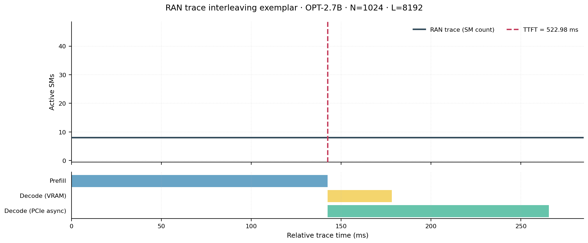
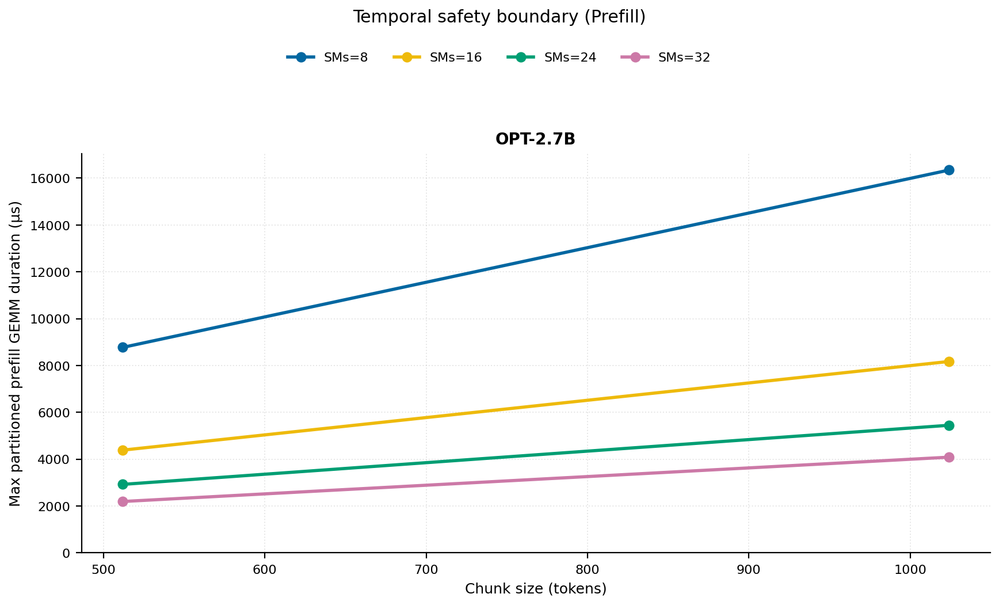
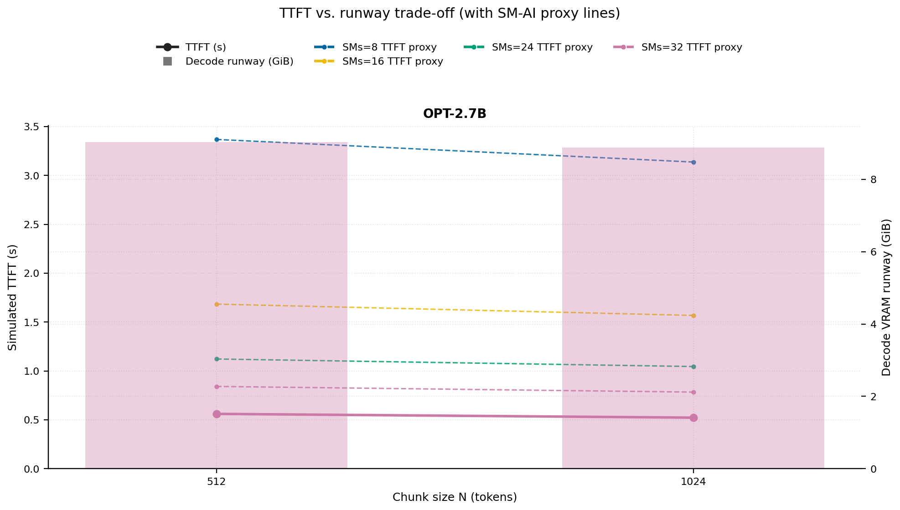
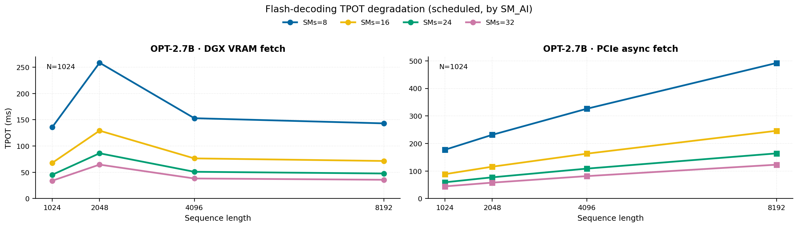
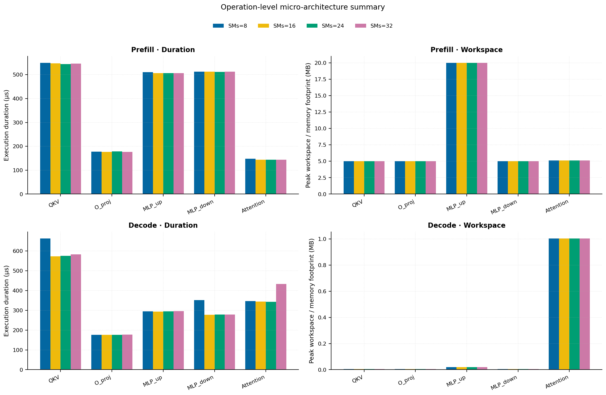
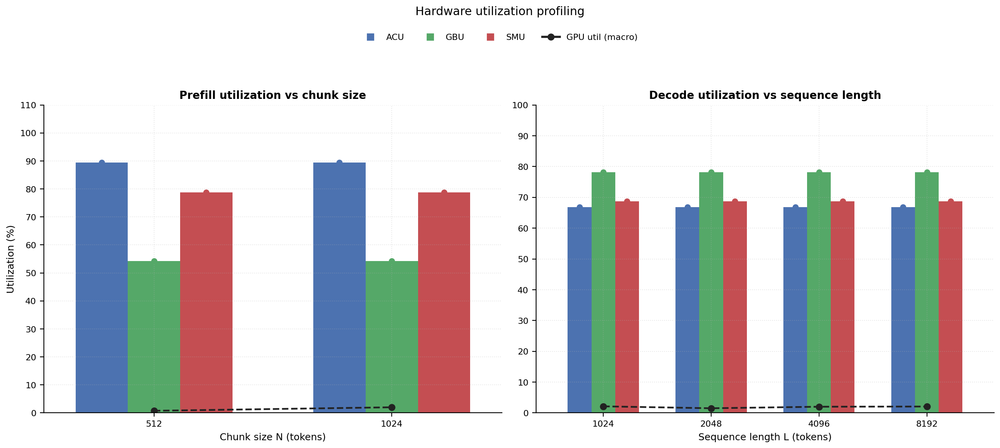
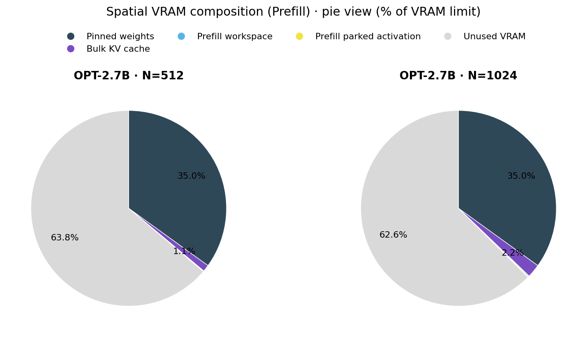

# RAN Inference Profiling Report

Run root: `/mnt/data/dheeraj/dicertation/inference-profile/runs/revised-rerun-20260415-020401-g5-opt27b-c512-1024`

## Environment

| field | value |
| --- | --- |
| cache_root | n/a |
| captured_at | 2026-04-15T01:04:08Z |
| chunk_sizes | [512, 1024] |
| cuda_available | true |
| cuda_device_count | 8 |
| cwd | /mnt/data/dheeraj/dicertation/inference-profile |
| decode_modes | ["vram", "pcie_async"] |
| experiment_type | ran-dgxspark-v1 |
| gpu_id | 5 |
| l_out | 1024 |
| models | ["facebook/opt-2.7b"] |
| platform | Linux-6.8.0-106-generic-x86_64-with-glibc2.35 |
| python_executable | /home/dheeraj/miniconda3/envs/mls/bin/python |
| python_version | 3.11.14 |
| run_root | /mnt/data/dheeraj/dicertation/inference-profile/runs/revised-rerun-20260415-020401-g5-opt27b-c512-1024 |
| scheduler | envelope_v1 |
| schema_version | ran_dgxspark_v1 |
| sequence_lengths | [1024, 2048, 4096, 8192] |
| sm_ai_cap | 32 |
| sm_ai_partition | 100 |
| sm_ai_partitions | [8, 16, 24, 32] |
| stage | profile |
| telemetry_tier | baseline_nvml_pt |
| timed_iterations | 5 |
| torch_available | true |
| torch_version | 2.10.0+cu128 |
| warmup_iterations | 3 |

## Model Constants

| model_id | sm_ai_partition | num_hidden_layers | hidden_size | num_attention_heads | ffn_dim | layer_index | layer_weight_bytes | total_weight_bytes_fp16 | vram_ceiling_bytes |
| --- | --- | --- | --- | --- | --- | --- | --- | --- | --- |
| facebook/opt-2.7b | 100 | 32 | 2560 | 32 | 10240 | 15 | 157352960 | 5303193600 | 15170115993 |

## Trace Inspection

### Primary trace

| field | value |
| --- | --- |
| errors | [] |
| header | ["frame", "slot", "time_slot_sched_ns", "time_decode_start_est_ns", "time_decode_end_est_ns", "time_decode_start_actual_ns", "time_decode_end_actual_ns", "decode_dur_us", "deadline_met", "target_sm", "profile_idx", "sm_count", "num_pusch", "sum_prb", "sum_tbs_bytes", "max_mcs"] |
| median_positive_delta_ms | 5.6997 |
| monotonicity.checked_column | time_slot_sched_ns |
| monotonicity.is_non_decreasing | true |
| monotonicity.negative_delta_count | 0 |
| monotonicity.positive_delta_count | 28377 |
| monotonicity.zero_delta_count | 0 |
| normalization.last_row_duration_policy | median_positive_forward_delta_ms |
| normalization.output_columns | ["time_ms", "sm_utilization", "slot_duration_ms", "source_schema", "sm_count"] |
| normalization.output_relative_path | derived/normalized_ldpc_trace.csv |
| normalized_row_count | 28378 |
| path | /mnt/raid0sata2/netsys/weaver-ext/ran/traces/e2e_2026030418/e2e_20260304_182034_tractor_ran_ctrl/ldpc_trace.csv |
| row_count | 28378 |
| schema_detected | schema_b |
| time_unit_hint | ns |
| usable | true |
| usage_policy | primary_only |
| used_for_scheduler_capacity | true |

### Secondary trace

| field | value |
| --- | --- |
| errors | ["ran_ctrl_trace.csv line 182958 has 9 field(s); expected 12"] |
| header | ["frame", "slot", "sm_available", "prbs_available", "prbs_allocated", "w_avg_mcs_prev", "w_avg_mcs_curr", "slots_since_underutil", "ramp_up_count", "num_ue_sched", "max_ue_backlog", "sum_ue_backlog"] |
| monotonicity.checked_column | n/a |
| monotonicity.is_non_decreasing | n/a |
| monotonicity.negative_delta_count | n/a |
| path | /mnt/raid0sata2/netsys/weaver-ext/ran/traces/e2e_2026030418/e2e_20260304_182034_tractor_ran_ctrl/ran_ctrl_trace.csv |
| row_count | 182956 |
| time_unit_hints | [] |
| usable | false |
| usage_policy | structural_only |
| used_for_scheduler_capacity | false |

## Raw-Profile Summary Tables

### Prefill profile summary

Source raw rows: `raw/prefill_events.csv` = 280. Summary artifact: `derived/prefill_summary.csv`.

| model_id | chunk_tokens | sm_ai_partition | max_input_tokens | prefill_max_gemm_us | prefill_workspace_bytes | prefill_parked_activation_bytes | telemetry_tier | telemetry_provider | telemetry_status | nvml_available | gpu_util | gpu_mem_used_mb | sm_clock_mhz | mem_clock_mhz | power_w | pt_step_ms | pt_mem_alloc_mb | pt_mem_reserved_mb | pt_workspace_mb | acu_pct | gbu_pct | smu_pct | microscopic_telemetry_status | microscopic_error |
| --- | --- | --- | --- | --- | --- | --- | --- | --- | --- | --- | --- | --- | --- | --- | --- | --- | --- | --- | --- | --- | --- | --- | --- | --- |
| facebook/opt-2.7b | 512 | 8 | 1024 | 366.592 | 10485760 | 10485760 | baseline_nvml_pt | nvidia-smi | ok | true | 0 | 2518 | 1695 | 7601 | 61.46 | 0.3666 | 189.1689 | 189.1689 | 10 | 79 | 62.5 | 67.5 | estimated | n/a |
| facebook/opt-2.7b | 512 | 16 | 1024 | 366.592 | 10485760 | 10485760 | baseline_nvml_pt | nvidia-smi | ok | true | 1 | 2518 | 1695 | 7601 | 61.7 | 0.3666 | 189.1689 | 189.1689 | 10 | 86 | 57 | 75 | estimated | n/a |
| facebook/opt-2.7b | 512 | 24 | 1024 | 364.544 | 10485760 | 10485760 | baseline_nvml_pt | nvidia-smi | ok | true | 0 | 2516 | 1695 | 7601 | 62.38 | 0.3645 | 189.1689 | 189.1689 | 10 | 93 | 51.5 | 82.5 | estimated | n/a |
| facebook/opt-2.7b | 512 | 32 | 1024 | 365.568 | 10485760 | 10485760 | baseline_nvml_pt | nvidia-smi | ok | true | 2 | 2516 | 1695 | 7601 | 62.15 | 0.3656 | 189.1689 | 189.1689 | 10 | 100 | 46 | 90 | estimated | n/a |
| facebook/opt-2.7b | 1024 | 8 | 1024 | 684.032 | 20971520 | 20971520 | baseline_nvml_pt | nvidia-smi | ok | true | 1 | 2518 | 1695 | 7601 | 63.65 | 0.684 | 219.1689 | 219.1689 | 20 | 79 | 62.5 | 67.5 | estimated | n/a |
| facebook/opt-2.7b | 1024 | 16 | 1024 | 683.936 | 20971520 | 20971520 | baseline_nvml_pt | nvidia-smi | ok | true | 0 | 2518 | 1695 | 7601 | 64.19 | 0.6839 | 219.1689 | 219.1689 | 20 | 86 | 57 | 75 | estimated | n/a |
| facebook/opt-2.7b | 1024 | 24 | 1024 | 680.96 | 20971520 | 20971520 | baseline_nvml_pt | nvidia-smi | ok | true | 0 | 2518 | 1695 | 7601 | 64.16 | 0.681 | 219.1689 | 219.1689 | 20 | 93 | 51.5 | 82.5 | estimated | n/a |
| facebook/opt-2.7b | 1024 | 32 | 1024 | 680.96 | 20971520 | 20971520 | baseline_nvml_pt | nvidia-smi | ok | true | 7 | 2518 | 1695 | 7601 | 64.63 | 0.681 | 219.1689 | 219.1689 | 20 | 100 | 46 | 90 | estimated | n/a |

### Decode profile summary

Source raw rows: `raw/decode_events.csv` = 2560. Summary artifact: `derived/decode_summary.csv`.

| model_id | sequence_length | block_size | sm_ai_partition | decode_mode | decode_max_gemv_us | attention_fetch_compute_us | reduction_overhead_us | decode_workspace_bytes | decode_parked_activation_bytes | telemetry_tier | telemetry_provider | telemetry_status | nvml_available | gpu_util | gpu_mem_used_mb | sm_clock_mhz | mem_clock_mhz | power_w | pt_step_ms | pt_mem_alloc_mb | pt_mem_reserved_mb | pt_workspace_mb | acu_pct | gbu_pct | smu_pct | microscopic_telemetry_status | microscopic_error |
| --- | --- | --- | --- | --- | --- | --- | --- | --- | --- | --- | --- | --- | --- | --- | --- | --- | --- | --- | --- | --- | --- | --- | --- | --- | --- | --- | --- |
| facebook/opt-2.7b | 1024 | 512 | 8 | pcie_async | 3342.2079 | 138.4448 | 21.5424 | 136192 | 5120 | baseline_nvml_pt | nvidia-smi | ok | true | 7 | 2518 | 1695 | 7601 | 61.26 | 3.3422 | 169.2031 | 169.2031 | 0.1299 | 56.5 | 87 | 59 | estimated | n/a |
| facebook/opt-2.7b | 1024 | 512 | 8 | vram | 154.624 | 123.9168 | 21.6704 | 136192 | 5120 | baseline_nvml_pt | nvidia-smi | ok | true | 0 | 2518 | 1695 | 7601 | 61.42 | 0.1546 | 169.2031 | 169.2031 | 0.1299 | 63 | 77.5 | 62 | estimated | n/a |
| facebook/opt-2.7b | 1024 | 512 | 16 | pcie_async | 150.528 | 123.3472 | 20.6016 | 136192 | 5120 | baseline_nvml_pt | nvidia-smi | ok | true | 0 | 2518 | 1695 | 7601 | 61.21 | 0.1505 | 169.2031 | 169.2031 | 0.1299 | 61 | 84 | 64 | estimated | n/a |
| facebook/opt-2.7b | 1024 | 512 | 16 | vram | 167.84 | 129.4784 | 22.1248 | 136192 | 5120 | baseline_nvml_pt | nvidia-smi | ok | true | 0 | 2518 | 1695 | 7601 | 61.36 | 0.1678 | 169.2031 | 169.2031 | 0.1299 | 68 | 75 | 68 | estimated | n/a |
| facebook/opt-2.7b | 1024 | 512 | 24 | pcie_async | 152.352 | 124.2688 | 20.1216 | 136192 | 5120 | baseline_nvml_pt | nvidia-smi | ok | true | 3 | 2518 | 1695 | 7601 | 61.78 | 0.1524 | 169.2031 | 169.2031 | 0.1299 | 65.5 | 81 | 69 | estimated | n/a |
| facebook/opt-2.7b | 1024 | 512 | 24 | vram | 152.576 | 130.0736 | 21.3184 | 136192 | 5120 | baseline_nvml_pt | nvidia-smi | ok | true | 0 | 2518 | 1695 | 7601 | 61.47 | 0.1526 | 169.2031 | 169.2031 | 0.1299 | 73 | 72.5 | 74 | estimated | n/a |
| facebook/opt-2.7b | 1024 | 512 | 32 | pcie_async | 148.48 | 121.8496 | 19.9808 | 136192 | 5120 | baseline_nvml_pt | nvidia-smi | ok | true | 7 | 2518 | 1695 | 7601 | 61.65 | 0.1485 | 169.2031 | 169.2031 | 0.1299 | 70 | 78 | 74 | estimated | n/a |
| facebook/opt-2.7b | 1024 | 512 | 32 | vram | 163.072 | 129.8624 | 22.1056 | 136192 | 5120 | baseline_nvml_pt | nvidia-smi | ok | true | 0 | 2518 | 1695 | 7601 | 61.92 | 0.1631 | 169.2031 | 169.2031 | 0.1299 | 78 | 70 | 80 | estimated | n/a |
| facebook/opt-2.7b | 1024 | 1024 | 8 | pcie_async | 151.52 | 129.2416 | 20.4544 | 136192 | 5120 | baseline_nvml_pt | nvidia-smi | ok | true | 1 | 2518 | 1695 | 7601 | 61.68 | 0.1547 | 169.2031 | 169.2031 | 0.1299 | 56.5 | 87 | 59 | estimated | n/a |
| facebook/opt-2.7b | 1024 | 1024 | 8 | vram | 151.552 | 124.9408 | 19.4368 | 136192 | 5120 | baseline_nvml_pt | nvidia-smi | ok | true | 0 | 2518 | 1695 | 7601 | 61.6 | 0.1516 | 169.2031 | 169.2031 | 0.1299 | 63 | 77.5 | 62 | estimated | n/a |
| facebook/opt-2.7b | 1024 | 1024 | 16 | pcie_async | 156.544 | 128.2496 | 20.1792 | 136192 | 5120 | baseline_nvml_pt | nvidia-smi | ok | true | 0 | 2518 | 1695 | 7601 | 61.99 | 0.1565 | 169.2031 | 169.2031 | 0.1299 | 61 | 84 | 64 | estimated | n/a |
| facebook/opt-2.7b | 1024 | 1024 | 16 | vram | 153.6 | 126.2272 | 20.6528 | 136192 | 5120 | baseline_nvml_pt | nvidia-smi | ok | true | 0 | 2516 | 1695 | 7601 | 61.57 | 0.1536 | 169.2031 | 169.2031 | 0.1299 | 68 | 75 | 68 | estimated | n/a |
| facebook/opt-2.7b | 1024 | 1024 | 24 | pcie_async | 156.672 | 122.9824 | 20.1152 | 136192 | 5120 | baseline_nvml_pt | nvidia-smi | ok | true | 0 | 2516 | 1695 | 7601 | 61.82 | 0.1567 | 169.2031 | 169.2031 | 0.1299 | 65.5 | 81 | 69 | estimated | n/a |
| facebook/opt-2.7b | 1024 | 1024 | 24 | vram | 154.624 | 126.976 | 21.7024 | 136192 | 5120 | baseline_nvml_pt | nvidia-smi | ok | true | 0 | 2518 | 1695 | 7601 | 62.02 | 0.1546 | 169.2031 | 169.2031 | 0.1299 | 73 | 72.5 | 74 | estimated | n/a |
| facebook/opt-2.7b | 1024 | 1024 | 32 | pcie_async | 149.696 | 125.7216 | 22.1376 | 136192 | 5120 | baseline_nvml_pt | nvidia-smi | ok | true | 11 | 2516 | 1695 | 7601 | 61.57 | 0.1497 | 169.2031 | 169.2031 | 0.1299 | 70 | 78 | 74 | estimated | n/a |
| facebook/opt-2.7b | 1024 | 1024 | 32 | vram | 152.512 | 125.152 | 20.5376 | 136192 | 5120 | baseline_nvml_pt | nvidia-smi | ok | true | 5 | 2516 | 1695 | 7601 | 61.3 | 0.1525 | 169.2031 | 169.2031 | 0.1299 | 78 | 70 | 80 | estimated | n/a |
| facebook/opt-2.7b | 2048 | 512 | 8 | pcie_async | 182.432 | 139.52 | 21.824 | 267264 | 5120 | baseline_nvml_pt | nvidia-smi | ok | true | 0 | 2518 | 1695 | 7601 | 61.64 | 0.1824 | 178.4531 | 178.4531 | 0.2549 | 56.5 | 87 | 59 | estimated | n/a |
| facebook/opt-2.7b | 2048 | 512 | 8 | vram | 181.248 | 139.2896 | 21.2928 | 267264 | 5120 | baseline_nvml_pt | nvidia-smi | ok | true | 0 | 2518 | 1695 | 7601 | 61.74 | 0.1812 | 178.4531 | 178.4531 | 0.2549 | 63 | 77.5 | 62 | estimated | n/a |
| facebook/opt-2.7b | 2048 | 512 | 16 | pcie_async | 181.248 | 133.568 | 21.0368 | 267264 | 5120 | baseline_nvml_pt | nvidia-smi | ok | true | 0 | 2516 | 1695 | 7601 | 61.86 | 0.1812 | 178.4531 | 178.4531 | 0.2549 | 61 | 84 | 64 | estimated | n/a |
| facebook/opt-2.7b | 2048 | 512 | 16 | vram | 151.456 | 124.416 | 20.0768 | 267264 | 5120 | baseline_nvml_pt | nvidia-smi | ok | true | 0 | 2518 | 1695 | 7601 | 62.29 | 0.1515 | 178.4531 | 178.4531 | 0.2549 | 68 | 75 | 68 | estimated | n/a |
| facebook/opt-2.7b | 2048 | 512 | 24 | pcie_async | 156.672 | 133.5296 | 21.1904 | 267264 | 5120 | baseline_nvml_pt | nvidia-smi | ok | true | 0 | 2516 | 1695 | 7601 | 61.87 | 0.1567 | 178.4531 | 178.4531 | 0.2549 | 65.5 | 81 | 69 | estimated | n/a |
| facebook/opt-2.7b | 2048 | 512 | 24 | vram | 155.648 | 134.5664 | 21.504 | 267264 | 5120 | baseline_nvml_pt | nvidia-smi | ok | true | 0 | 2516 | 1695 | 7601 | 62.3 | 0.1556 | 178.4531 | 178.4531 | 0.2549 | 73 | 72.5 | 74 | estimated | n/a |
| facebook/opt-2.7b | 2048 | 512 | 32 | pcie_async | 169.984 | 133.1776 | 21.5808 | 267264 | 5120 | baseline_nvml_pt | nvidia-smi | ok | true | 0 | 2518 | 1695 | 7601 | 62.09 | 0.17 | 178.4531 | 178.4531 | 0.2549 | 70 | 78 | 74 | estimated | n/a |
| facebook/opt-2.7b | 2048 | 512 | 32 | vram | 166.72 | 138.528 | 21.8624 | 267264 | 5120 | baseline_nvml_pt | nvidia-smi | ok | true | 7 | 2516 | 1695 | 7601 | 61.99 | 0.1667 | 178.4531 | 178.4531 | 0.2549 | 78 | 70 | 80 | estimated | n/a |
| facebook/opt-2.7b | 2048 | 1024 | 8 | pcie_async | 169.984 | 149.8368 | 22.9312 | 267264 | 5120 | baseline_nvml_pt | nvidia-smi | ok | true | 12 | 2518 | 1695 | 7601 | 61.66 | 0.17 | 178.4531 | 178.4531 | 0.2549 | 56.5 | 87 | 59 | estimated | n/a |
| facebook/opt-2.7b | 2048 | 1024 | 8 | vram | 157.696 | 129.4912 | 19.8912 | 267264 | 5120 | baseline_nvml_pt | nvidia-smi | ok | true | 1 | 2518 | 1695 | 7601 | 61.97 | 0.1577 | 178.4531 | 178.4531 | 0.2549 | 63 | 77.5 | 62 | estimated | n/a |
| facebook/opt-2.7b | 2048 | 1024 | 16 | pcie_async | 150.528 | 125.8368 | 20.6848 | 267264 | 5120 | baseline_nvml_pt | nvidia-smi | ok | true | 3 | 2518 | 1695 | 7601 | 61.98 | 0.1505 | 178.4531 | 178.4531 | 0.2549 | 61 | 84 | 64 | estimated | n/a |
| facebook/opt-2.7b | 2048 | 1024 | 16 | vram | 158.72 | 135.7824 | 21.6448 | 267264 | 5120 | baseline_nvml_pt | nvidia-smi | ok | true | 0 | 2516 | 1695 | 7601 | 62.22 | 0.1627 | 178.4531 | 178.4531 | 0.2549 | 68 | 75 | 68 | estimated | n/a |
| facebook/opt-2.7b | 2048 | 1024 | 24 | pcie_async | 160.768 | 140.5888 | 23.52 | 267264 | 5120 | baseline_nvml_pt | nvidia-smi | ok | true | 1 | 2518 | 1695 | 7601 | 61.99 | 0.1608 | 178.4531 | 178.4531 | 0.2549 | 65.5 | 81 | 69 | estimated | n/a |
| facebook/opt-2.7b | 2048 | 1024 | 24 | vram | 158.72 | 140.544 | 22.528 | 267264 | 5120 | baseline_nvml_pt | nvidia-smi | ok | true | 0 | 2518 | 1695 | 7601 | 62.01 | 0.1587 | 178.4531 | 178.4531 | 0.2549 | 73 | 72.5 | 74 | estimated | n/a |
| facebook/opt-2.7b | 2048 | 1024 | 32 | pcie_async | 159.648 | 151.136 | 23.328 | 267264 | 5120 | baseline_nvml_pt | nvidia-smi | ok | true | 0 | 2518 | 1695 | 7601 | 61.96 | 0.1741 | 178.4531 | 178.4531 | 0.2549 | 70 | 78 | 74 | estimated | n/a |
| facebook/opt-2.7b | 2048 | 1024 | 32 | vram | 196.608 | 152.6208 | 687.488 | 267264 | 5120 | baseline_nvml_pt | nvidia-smi | ok | true | 0 | 2516 | 1695 | 7601 | 62.1 | 3.3249 | 178.4531 | 178.4531 | 0.2549 | 78 | 70 | 80 | estimated | n/a |
| facebook/opt-2.7b | 4096 | 512 | 8 | pcie_async | 154.624 | 142.912 | 21.4464 | 529408 | 5120 | baseline_nvml_pt | nvidia-smi | ok | true | 0 | 2518 | 1695 | 7601 | 61.55 | 0.1546 | 198.7031 | 198.7031 | 0.5049 | 56.5 | 87 | 59 | estimated | n/a |
| facebook/opt-2.7b | 4096 | 512 | 8 | vram | 170.176 | 161.1456 | 22.5472 | 529408 | 5120 | baseline_nvml_pt | nvidia-smi | ok | true | 0 | 2518 | 1695 | 7601 | 61.96 | 0.1702 | 198.7031 | 198.7031 | 0.5049 | 63 | 77.5 | 62 | estimated | n/a |
| facebook/opt-2.7b | 4096 | 512 | 16 | pcie_async | 158.72 | 176.96 | 23.488 | 529408 | 5120 | baseline_nvml_pt | nvidia-smi | ok | true | 0 | 2518 | 1695 | 7601 | 62.4 | 0.2284 | 198.7031 | 198.7031 | 0.5049 | 61 | 84 | 64 | estimated | n/a |
| facebook/opt-2.7b | 4096 | 512 | 16 | vram | 152.576 | 150.6624 | 21.7152 | 529408 | 5120 | baseline_nvml_pt | nvidia-smi | ok | true | 0 | 2516 | 1695 | 7601 | 61.78 | 0.1567 | 198.7031 | 198.7031 | 0.5049 | 68 | 75 | 68 | estimated | n/a |
| facebook/opt-2.7b | 4096 | 512 | 24 | pcie_async | 153.6 | 163.6032 | 23.6416 | 529408 | 5120 | baseline_nvml_pt | nvidia-smi | ok | true | 1 | 2518 | 1695 | 7601 | 61.96 | 0.1966 | 198.7031 | 198.7031 | 0.5049 | 65.5 | 81 | 69 | estimated | n/a |
| facebook/opt-2.7b | 4096 | 512 | 24 | vram | 148.48 | 140.4992 | 19.7568 | 529408 | 5120 | baseline_nvml_pt | nvidia-smi | ok | true | 7 | 2518 | 1695 | 7601 | 62.25 | 0.1485 | 198.7031 | 198.7031 | 0.5049 | 73 | 72.5 | 74 | estimated | n/a |
| facebook/opt-2.7b | 4096 | 512 | 32 | pcie_async | 151.552 | 138.7776 | 20.7232 | 529408 | 5120 | baseline_nvml_pt | nvidia-smi | ok | true | 7 | 2518 | 1695 | 7601 | 62.1 | 0.1516 | 198.7031 | 198.7031 | 0.5049 | 70 | 78 | 74 | estimated | n/a |
| facebook/opt-2.7b | 4096 | 512 | 32 | vram | 151.424 | 142.0672 | 20.3072 | 529408 | 5120 | baseline_nvml_pt | nvidia-smi | ok | true | 0 | 2518 | 1695 | 7601 | 62.06 | 0.1514 | 198.7031 | 198.7031 | 0.5049 | 78 | 70 | 80 | estimated | n/a |
| facebook/opt-2.7b | 4096 | 1024 | 8 | pcie_async | 158.72 | 142.4896 | 20.8768 | 529408 | 5120 | baseline_nvml_pt | nvidia-smi | ok | true | 7 | 2518 | 1695 | 7601 | 62.39 | 0.1587 | 198.7031 | 198.7031 | 0.5049 | 56.5 | 87 | 59 | estimated | n/a |
| facebook/opt-2.7b | 4096 | 1024 | 8 | vram | 157.664 | 143.3024 | 20.48 | 529408 | 5120 | baseline_nvml_pt | nvidia-smi | ok | true | 0 | 2518 | 1695 | 7601 | 61.98 | 0.1577 | 198.7031 | 198.7031 | 0.5049 | 63 | 77.5 | 62 | estimated | n/a |
| facebook/opt-2.7b | 4096 | 1024 | 16 | pcie_async | 151.392 | 138.9952 | 21.536 | 529408 | 5120 | baseline_nvml_pt | nvidia-smi | ok | true | 0 | 2518 | 1695 | 7601 | 62.59 | 0.1514 | 198.7031 | 198.7031 | 0.5049 | 61 | 84 | 64 | estimated | n/a |
| facebook/opt-2.7b | 4096 | 1024 | 16 | vram | 164.864 | 147.9936 | 23.1232 | 529408 | 5120 | baseline_nvml_pt | nvidia-smi | ok | true | 0 | 2518 | 1695 | 7601 | 61.9 | 0.1669 | 198.7031 | 198.7031 | 0.5049 | 68 | 75 | 68 | estimated | n/a |
| facebook/opt-2.7b | 4096 | 1024 | 24 | pcie_async | 221.024 | 151.2576 | 21.2992 | 529408 | 5120 | baseline_nvml_pt | nvidia-smi | ok | true | 0 | 2518 | 1695 | 7601 | 61.79 | 0.221 | 198.7031 | 198.7031 | 0.5049 | 65.5 | 81 | 69 | estimated | n/a |
| facebook/opt-2.7b | 4096 | 1024 | 24 | vram | 149.76 | 139.008 | 19.8592 | 529408 | 5120 | baseline_nvml_pt | nvidia-smi | ok | true | 7 | 2518 | 1695 | 7601 | 62.37 | 0.1498 | 198.7031 | 198.7031 | 0.5049 | 73 | 72.5 | 74 | estimated | n/a |
| facebook/opt-2.7b | 4096 | 1024 | 32 | pcie_async | 165.888 | 176.8768 | 24.6464 | 529408 | 5120 | baseline_nvml_pt | nvidia-smi | ok | true | 3 | 2518 | 1695 | 7601 | 61.74 | 0.1997 | 198.7031 | 198.7031 | 0.5049 | 70 | 78 | 74 | estimated | n/a |
| facebook/opt-2.7b | 4096 | 1024 | 32 | vram | 168.96 | 156.48 | 24.7744 | 529408 | 5120 | baseline_nvml_pt | nvidia-smi | ok | true | 0 | 2518 | 1695 | 7601 | 62.27 | 0.1733 | 198.7031 | 198.7031 | 0.5049 | 78 | 70 | 80 | estimated | n/a |
| facebook/opt-2.7b | 8192 | 512 | 8 | pcie_async | 154.624 | 190.6688 | 20.4352 | 1053696 | 5120 | baseline_nvml_pt | nvidia-smi | ok | true | 0 | 2518 | 1695 | 7601 | 62.64 | 0.1966 | 239.2031 | 239.2031 | 1.0049 | 56.5 | 87 | 59 | estimated | n/a |
| facebook/opt-2.7b | 8192 | 512 | 8 | vram | 177.248 | 191.4112 | 22.3424 | 1053696 | 5120 | baseline_nvml_pt | nvidia-smi | ok | true | 0 | 2518 | 1695 | 7601 | 62.21 | 0.1955 | 239.2031 | 239.2031 | 1.0049 | 63 | 77.5 | 62 | estimated | n/a |
| facebook/opt-2.7b | 8192 | 512 | 16 | pcie_async | 156.672 | 189.2032 | 20.3136 | 1053696 | 5120 | baseline_nvml_pt | nvidia-smi | ok | true | 0 | 2518 | 1695 | 7601 | 62.33 | 0.1913 | 239.2031 | 239.2031 | 1.0049 | 61 | 84 | 64 | estimated | n/a |
| facebook/opt-2.7b | 8192 | 512 | 16 | vram | 176.384 | 196.5568 | 23.6288 | 1053696 | 5120 | baseline_nvml_pt | nvidia-smi | ok | true | 2 | 2518 | 1695 | 7601 | 62.15 | 0.2007 | 239.2031 | 239.2031 | 1.0049 | 68 | 75 | 68 | estimated | n/a |
| facebook/opt-2.7b | 8192 | 512 | 24 | pcie_async | 161.792 | 191.8016 | 24.1664 | 1053696 | 5120 | baseline_nvml_pt | nvidia-smi | ok | true | 0 | 2518 | 1695 | 7601 | 62.3 | 0.1976 | 239.2031 | 239.2031 | 1.0049 | 65.5 | 81 | 69 | estimated | n/a |
| facebook/opt-2.7b | 8192 | 512 | 24 | vram | 157.696 | 189.824 | 20.6976 | 1053696 | 5120 | baseline_nvml_pt | nvidia-smi | ok | true | 0 | 2518 | 1695 | 7601 | 62.26 | 0.1957 | 239.2031 | 239.2031 | 1.0049 | 73 | 72.5 | 74 | estimated | n/a |
| facebook/opt-2.7b | 8192 | 512 | 32 | pcie_async | 153.44 | 189.6192 | 19.9296 | 1053696 | 5120 | baseline_nvml_pt | nvidia-smi | ok | true | 0 | 2518 | 1695 | 7601 | 62.02 | 0.1915 | 239.2031 | 239.2031 | 1.0049 | 70 | 78 | 74 | estimated | n/a |
| facebook/opt-2.7b | 8192 | 512 | 32 | vram | 155.872 | 194.336 | 22.944 | 1053696 | 5120 | baseline_nvml_pt | nvidia-smi | ok | true | 0 | 2518 | 1695 | 7601 | 62.5 | 0.2019 | 239.2031 | 239.2031 | 1.0049 | 78 | 70 | 80 | estimated | n/a |
| facebook/opt-2.7b | 8192 | 1024 | 8 | pcie_async | 152.448 | 195.9296 | 21.504 | 1053696 | 5120 | baseline_nvml_pt | nvidia-smi | ok | true | 16 | 2518 | 1695 | 7601 | 61.92 | 0.2035 | 239.2031 | 239.2031 | 1.0049 | 56.5 | 87 | 59 | estimated | n/a |
| facebook/opt-2.7b | 8192 | 1024 | 8 | vram | 151.552 | 188.0064 | 19.904 | 1053696 | 5120 | baseline_nvml_pt | nvidia-smi | ok | true | 0 | 2518 | 1695 | 7601 | 62.53 | 0.1905 | 239.2031 | 239.2031 | 1.0049 | 63 | 77.5 | 62 | estimated | n/a |
| facebook/opt-2.7b | 8192 | 1024 | 16 | pcie_async | 151.328 | 189.12 | 20.4544 | 1053696 | 5120 | baseline_nvml_pt | nvidia-smi | ok | true | 2 | 2518 | 1695 | 7601 | 62.51 | 0.1925 | 239.2031 | 239.2031 | 1.0049 | 61 | 84 | 64 | estimated | n/a |
| facebook/opt-2.7b | 8192 | 1024 | 16 | vram | 153.6 | 191.2576 | 22.176 | 1053696 | 5120 | baseline_nvml_pt | nvidia-smi | ok | true | 0 | 2518 | 1695 | 7601 | 62.16 | 0.1966 | 239.2031 | 239.2031 | 1.0049 | 68 | 75 | 68 | estimated | n/a |
| facebook/opt-2.7b | 8192 | 1024 | 24 | pcie_async | 153.6 | 186.0736 | 20.096 | 1053696 | 5120 | baseline_nvml_pt | nvidia-smi | ok | true | 0 | 2518 | 1695 | 7601 | 62.58 | 0.1874 | 239.2031 | 239.2031 | 1.0049 | 65.5 | 81 | 69 | estimated | n/a |
| facebook/opt-2.7b | 8192 | 1024 | 24 | vram | 158.72 | 189.6192 | 20.0512 | 1053696 | 5120 | baseline_nvml_pt | nvidia-smi | ok | true | 0 | 2516 | 1695 | 7601 | 62.88 | 0.1956 | 239.2031 | 239.2031 | 1.0049 | 73 | 72.5 | 74 | estimated | n/a |
| facebook/opt-2.7b | 8192 | 1024 | 32 | pcie_async | 154.624 | 191.0464 | 21.0496 | 1053696 | 5120 | baseline_nvml_pt | nvidia-smi | ok | true | 7 | 2518 | 1695 | 7601 | 62.75 | 0.1966 | 239.2031 | 239.2031 | 1.0049 | 70 | 78 | 74 | estimated | n/a |
| facebook/opt-2.7b | 8192 | 1024 | 32 | vram | 151.552 | 188.0064 | 20.928 | 1053696 | 5120 | baseline_nvml_pt | nvidia-smi | ok | true | 6 | 2518 | 1695 | 7601 | 62.35 | 0.1915 | 239.2031 | 239.2031 | 1.0049 | 78 | 70 | 80 | estimated | n/a |

### PCIe profile summary

Source raw rows: `raw/pcie_events.csv` = 10. Summary artifact: `derived/pcie_summary.csv`.

| model_id | block_size | kv_block_bytes | transfer_only_us | overlap_total_us | dummy_compute_us | exposed_transfer_us | effective_gbps | overlap_status | telemetry_tier | telemetry_provider | telemetry_status | nvml_available | gpu_util | gpu_mem_used_mb | sm_clock_mhz | mem_clock_mhz | power_w | pt_step_ms | pt_mem_alloc_mb | pt_mem_reserved_mb | pt_workspace_mb | acu_pct | gbu_pct | smu_pct | microscopic_telemetry_status | microscopic_error |
| --- | --- | --- | --- | --- | --- | --- | --- | --- | --- | --- | --- | --- | --- | --- | --- | --- | --- | --- | --- | --- | --- | --- | --- | --- | --- | --- |
| facebook/opt-2.7b | 512 | 5242880 | 566.5984 | 48022.5658 | 47268.8626 | 753.7033 | 9.2533 | measured | baseline_nvml_pt | nvidia-smi | partial | true | 2 | 2516 | 1695 | 7601 | 62 | n/a | n/a | n/a | n/a | 65 | 65 | 65 | estimated | n/a |
| facebook/opt-2.7b | 1024 | 10485760 | 796.192 | 33702.2459 | 33364.0195 | 338.2264 | 13.1699 | measured | baseline_nvml_pt | nvidia-smi | partial | true | 0 | 2516 | 1695 | 7601 | 61.66 | n/a | n/a | n/a | n/a | 65 | 65 | 65 | estimated | n/a |

## SLA Tables

### Successful configurations

| model_id | chunk_tokens | sequence_length | ttft_ms | tpot_ms_vram | tpot_ms_pcie_async | decode_runway_tokens | status |
| --- | --- | --- | --- | --- | --- | --- | --- |
| facebook/opt-2.7b | 512 | 1024 | 561.5125 | 36.1728 | 81.2837 | 29599 | success |
| facebook/opt-2.7b | 512 | 2048 | 561.5125 | 37.1427 | 134.0632 | 29598 | success |
| facebook/opt-2.7b | 512 | 4096 | 561.5125 | 34.2694 | 227.15 | 29597 | success |
| facebook/opt-2.7b | 512 | 8192 | 561.5125 | 36.8804 | 422.0621 | 29596 | success |
| facebook/opt-2.7b | 1024 | 1024 | 522.9773 | 33.9444 | 44.2964 | 29087 | success |
| facebook/opt-2.7b | 1024 | 2048 | 522.9773 | 64.6322 | 57.8818 | 29086 | success |
| facebook/opt-2.7b | 1024 | 4096 | 522.9773 | 38.2405 | 81.5922 | 29085 | success |
| facebook/opt-2.7b | 1024 | 8192 | 522.9773 | 35.7839 | 123.0608 | 29084 | success |

### Failed configurations

No rows available.

## Per-Model Scaling Analysis

| model_id | successful_configs | failed_configs | chunk_tokens_tested | sequence_lengths_tested | largest_successful_chunk_tokens | ttft_ms_min | ttft_ms_max | tpot_ms_vram_min | tpot_ms_vram_max | tpot_ms_pcie_async_min | tpot_ms_pcie_async_max | max_decode_runway_tokens |
| --- | --- | --- | --- | --- | --- | --- | --- | --- | --- | --- | --- | --- |
| facebook/opt-2.7b | 8 | 0 | 512, 1024 | 1024, 2048, 4096, 8192 | 1024 | 522.9773 | 561.5125 | 33.9444 | 64.6322 | 44.2964 | 422.0621 | 29599 |

## Plots

### Revised 01 Ran Trace Interleaving

[Interactive companion](plots/revised_01_ran_trace_interleaving_interactive.html)

### Revised 02 Prefill Safety Boundary

### Revised 03 Prefill Vram Composition

### Revised 04 Ttft Vs Runway

### Revised 05 Decode Tpot Degradation

### Revised 06 Operation Level Microarchitecture Summary

### Revised 07 Hardware Utilization Profiling

### Revised 08 Decode Memory Consumption

### 09 Spatial VRAM Composition (Prefill) · Pie View

