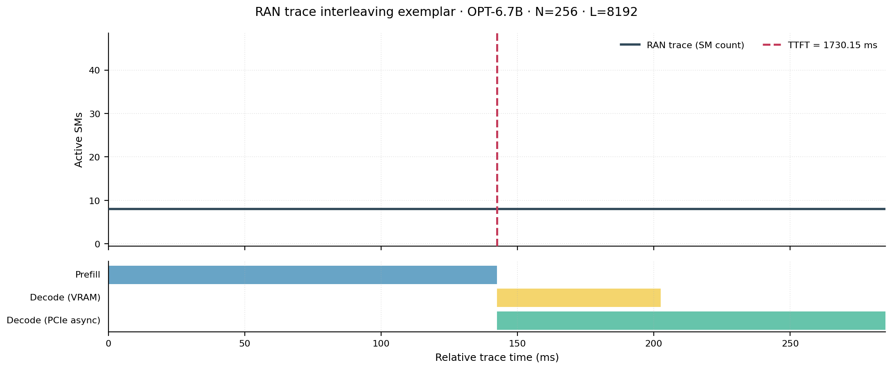
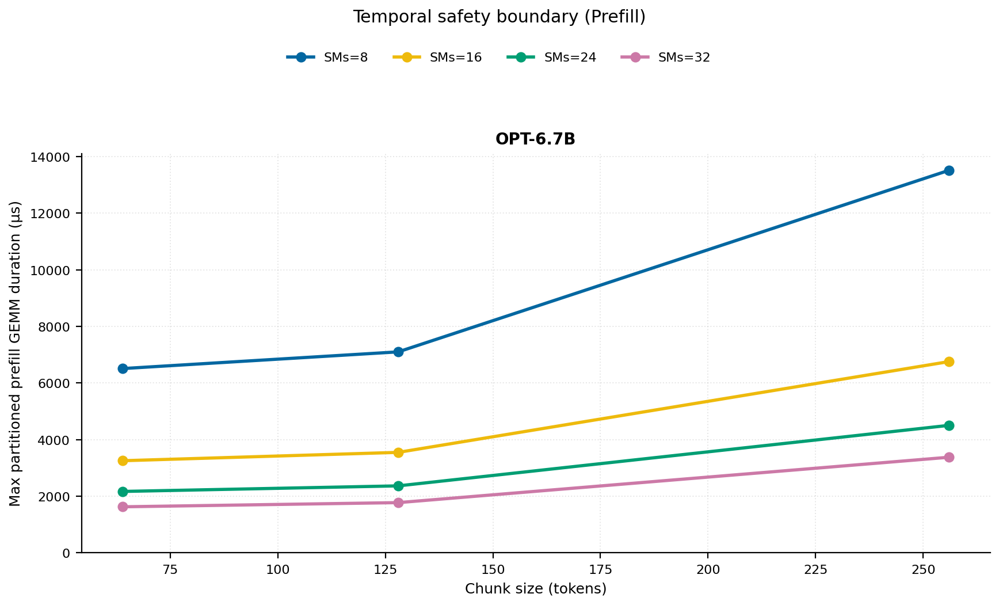
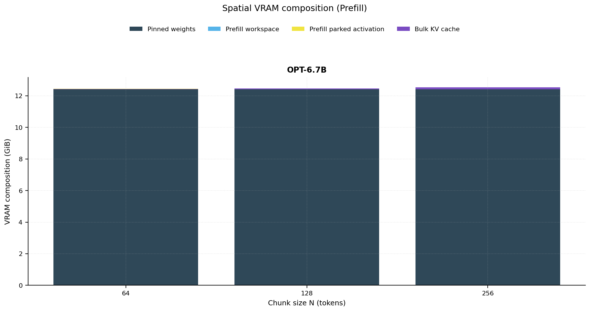
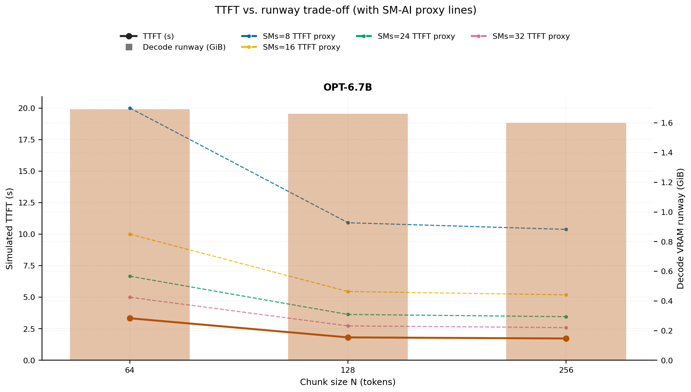
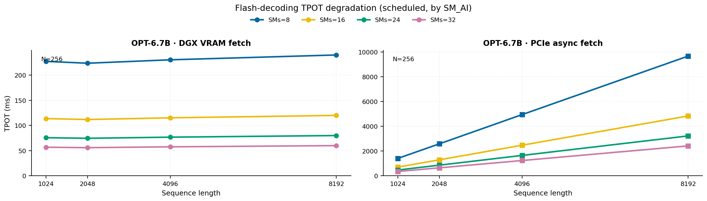
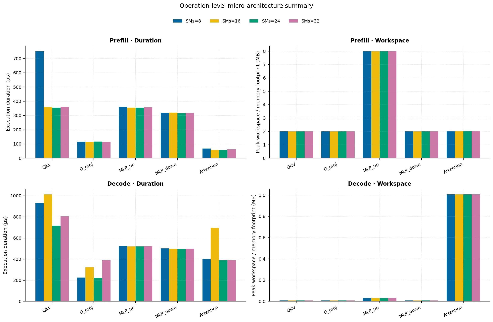
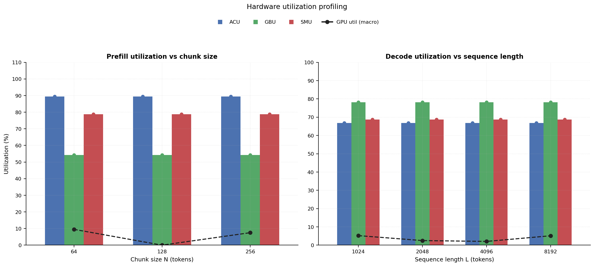

# RAN Inference Profiling Report

Run root: `/mnt/data/dheeraj/dicertation/inference-profile/runs/revised-rerun-20260415-020401-g6-opt67b-c64-256`

## Environment

| field | value |
| --- | --- |
| cache_root | n/a |
| captured_at | 2026-04-15T01:04:08Z |
| chunk_sizes | [64, 128, 256] |
| cuda_available | true |
| cuda_device_count | 8 |
| cwd | /mnt/data/dheeraj/dicertation/inference-profile |
| decode_modes | ["vram", "pcie_async"] |
| experiment_type | ran-dgxspark-v1 |
| gpu_id | 6 |
| l_out | 1024 |
| models | ["facebook/opt-6.7b"] |
| platform | Linux-6.8.0-106-generic-x86_64-with-glibc2.35 |
| python_executable | /home/dheeraj/miniconda3/envs/mls/bin/python |
| python_version | 3.11.14 |
| run_root | /mnt/data/dheeraj/dicertation/inference-profile/runs/revised-rerun-20260415-020401-g6-opt67b-c64-256 |
| scheduler | envelope_v1 |
| schema_version | ran_dgxspark_v1 |
| sequence_lengths | [1024, 2048, 4096, 8192] |
| sm_ai_cap | 32 |
| sm_ai_partition | 100 |
| sm_ai_partitions | [8, 16, 24, 32] |
| stage | profile |
| telemetry_tier | baseline_nvml_pt |
| timed_iterations | 5 |
| torch_available | true |
| torch_version | 2.10.0+cu128 |
| warmup_iterations | 3 |

## Model Constants

| model_id | sm_ai_partition | num_hidden_layers | hidden_size | num_attention_heads | ffn_dim | layer_index | layer_weight_bytes | total_weight_bytes_fp16 | vram_ceiling_bytes |
| --- | --- | --- | --- | --- | --- | --- | --- | --- | --- |
| facebook/opt-6.7b | 100 | 32 | 4096 | 32 | 16384 | 15 | 402759680 | 13316947968 | 15170115993 |

## Trace Inspection

### Primary trace

| field | value |
| --- | --- |
| errors | [] |
| header | ["frame", "slot", "time_slot_sched_ns", "time_decode_start_est_ns", "time_decode_end_est_ns", "time_decode_start_actual_ns", "time_decode_end_actual_ns", "decode_dur_us", "deadline_met", "target_sm", "profile_idx", "sm_count", "num_pusch", "sum_prb", "sum_tbs_bytes", "max_mcs"] |
| median_positive_delta_ms | 5.6997 |
| monotonicity.checked_column | time_slot_sched_ns |
| monotonicity.is_non_decreasing | true |
| monotonicity.negative_delta_count | 0 |
| monotonicity.positive_delta_count | 28377 |
| monotonicity.zero_delta_count | 0 |
| normalization.last_row_duration_policy | median_positive_forward_delta_ms |
| normalization.output_columns | ["time_ms", "sm_utilization", "slot_duration_ms", "source_schema", "sm_count"] |
| normalization.output_relative_path | derived/normalized_ldpc_trace.csv |
| normalized_row_count | 28378 |
| path | /mnt/raid0sata2/netsys/weaver-ext/ran/traces/e2e_2026030418/e2e_20260304_182034_tractor_ran_ctrl/ldpc_trace.csv |
| row_count | 28378 |
| schema_detected | schema_b |
| time_unit_hint | ns |
| usable | true |
| usage_policy | primary_only |
| used_for_scheduler_capacity | true |

### Secondary trace

| field | value |
| --- | --- |
| errors | ["ran_ctrl_trace.csv line 182958 has 9 field(s); expected 12"] |
| header | ["frame", "slot", "sm_available", "prbs_available", "prbs_allocated", "w_avg_mcs_prev", "w_avg_mcs_curr", "slots_since_underutil", "ramp_up_count", "num_ue_sched", "max_ue_backlog", "sum_ue_backlog"] |
| monotonicity.checked_column | n/a |
| monotonicity.is_non_decreasing | n/a |
| monotonicity.negative_delta_count | n/a |
| path | /mnt/raid0sata2/netsys/weaver-ext/ran/traces/e2e_2026030418/e2e_20260304_182034_tractor_ran_ctrl/ran_ctrl_trace.csv |
| row_count | 182956 |
| time_unit_hints | [] |
| usable | false |
| usage_policy | structural_only |
| used_for_scheduler_capacity | false |

## Raw-Profile Summary Tables

### Prefill profile summary

Source raw rows: `raw/prefill_events.csv` = 420. Summary artifact: `derived/prefill_summary.csv`.

| model_id | chunk_tokens | sm_ai_partition | max_input_tokens | prefill_max_gemm_us | prefill_workspace_bytes | prefill_parked_activation_bytes | telemetry_tier | telemetry_provider | telemetry_status | nvml_available | gpu_util | gpu_mem_used_mb | sm_clock_mhz | mem_clock_mhz | power_w | pt_step_ms | pt_mem_alloc_mb | pt_mem_reserved_mb | pt_workspace_mb | acu_pct | gbu_pct | smu_pct | microscopic_telemetry_status | microscopic_error |
| --- | --- | --- | --- | --- | --- | --- | --- | --- | --- | --- | --- | --- | --- | --- | --- | --- | --- | --- | --- | --- | --- | --- | --- | --- |
| facebook/opt-6.7b | 64 | 8 | 1024 | 269.312 | 2097152 | 2097152 | baseline_nvml_pt | nvidia-smi | ok | true | 0 | 2536 | 1695 | 7601 | 66.68 | 0.2693 | 399.1953 | 399.1953 | 2 | 79 | 62.5 | 67.5 | estimated | n/a |
| facebook/opt-6.7b | 64 | 16 | 1024 | 288.544 | 2097152 | 2097152 | baseline_nvml_pt | nvidia-smi | ok | true | 0 | 2536 | 1695 | 7601 | 67.39 | 0.2885 | 399.1953 | 399.1953 | 2 | 86 | 57 | 75 | estimated | n/a |
| facebook/opt-6.7b | 64 | 24 | 1024 | 270.336 | 2097152 | 2097152 | baseline_nvml_pt | nvidia-smi | ok | true | 18 | 2536 | 1695 | 7601 | 67.96 | 0.2703 | 399.1953 | 399.1953 | 2 | 93 | 51.5 | 82.5 | estimated | n/a |
| facebook/opt-6.7b | 64 | 32 | 1024 | 271.36 | 2097152 | 2097152 | baseline_nvml_pt | nvidia-smi | ok | true | 20 | 2538 | 1695 | 7601 | 67.92 | 0.2714 | 399.1953 | 399.1953 | 2 | 100 | 46 | 90 | estimated | n/a |
| facebook/opt-6.7b | 128 | 8 | 1024 | 5513.216 | 4194304 | 4194304 | baseline_nvml_pt | nvidia-smi | ok | true | 0 | 2538 | 1695 | 7601 | 69.14 | 5.5132 | 405.1953 | 405.1953 | 4 | 79 | 62.5 | 67.5 | estimated | n/a |
| facebook/opt-6.7b | 128 | 16 | 1024 | 305.152 | 4194304 | 4194304 | baseline_nvml_pt | nvidia-smi | ok | true | 0 | 2538 | 1695 | 7601 | 68.93 | 0.3052 | 405.1953 | 405.1953 | 4 | 86 | 57 | 75 | estimated | n/a |
| facebook/opt-6.7b | 128 | 24 | 1024 | 294.912 | 4194304 | 4194304 | baseline_nvml_pt | nvidia-smi | ok | true | 0 | 2538 | 1695 | 7601 | 69.41 | 0.2949 | 405.1953 | 405.1953 | 4 | 93 | 51.5 | 82.5 | estimated | n/a |
| facebook/opt-6.7b | 128 | 32 | 1024 | 295.936 | 4194304 | 4194304 | baseline_nvml_pt | nvidia-smi | ok | true | 0 | 2538 | 1695 | 7601 | 69.54 | 0.2959 | 405.1953 | 405.1953 | 4 | 100 | 46 | 90 | estimated | n/a |
| facebook/opt-6.7b | 256 | 8 | 1024 | 560.992 | 8388608 | 8388608 | baseline_nvml_pt | nvidia-smi | ok | true | 0 | 2538 | 1695 | 7601 | 70.55 | 0.561 | 417.1953 | 417.1953 | 8 | 79 | 62.5 | 67.5 | estimated | n/a |
| facebook/opt-6.7b | 256 | 16 | 1024 | 549.888 | 8388608 | 8388608 | baseline_nvml_pt | nvidia-smi | ok | true | 0 | 2538 | 1695 | 7601 | 70.6 | 0.5499 | 417.1953 | 417.1953 | 8 | 86 | 57 | 75 | estimated | n/a |
| facebook/opt-6.7b | 256 | 24 | 1024 | 553.984 | 8388608 | 8388608 | baseline_nvml_pt | nvidia-smi | ok | true | 18 | 2538 | 1695 | 7601 | 70.78 | 0.554 | 417.1953 | 417.1953 | 8 | 93 | 51.5 | 82.5 | estimated | n/a |
| facebook/opt-6.7b | 256 | 32 | 1024 | 563.2 | 8388608 | 8388608 | baseline_nvml_pt | nvidia-smi | ok | true | 12 | 2538 | 1695 | 7601 | 71.38 | 0.5632 | 417.1953 | 417.1953 | 8 | 100 | 46 | 90 | estimated | n/a |

### Decode profile summary

Source raw rows: `raw/decode_events.csv` = 3840. Summary artifact: `derived/decode_summary.csv`.

| model_id | sequence_length | block_size | sm_ai_partition | decode_mode | decode_max_gemv_us | attention_fetch_compute_us | reduction_overhead_us | decode_workspace_bytes | decode_parked_activation_bytes | telemetry_tier | telemetry_provider | telemetry_status | nvml_available | gpu_util | gpu_mem_used_mb | sm_clock_mhz | mem_clock_mhz | power_w | pt_step_ms | pt_mem_alloc_mb | pt_mem_reserved_mb | pt_workspace_mb | acu_pct | gbu_pct | smu_pct | microscopic_telemetry_status | microscopic_error |
| --- | --- | --- | --- | --- | --- | --- | --- | --- | --- | --- | --- | --- | --- | --- | --- | --- | --- | --- | --- | --- | --- | --- | --- | --- | --- | --- | --- |
| facebook/opt-6.7b | 1024 | 64 | 8 | pcie_async | 6183.9361 | 180.4544 | 39.5328 | 139264 | 8192 | baseline_nvml_pt | nvidia-smi | ok | true | 4 | 2536 | 1695 | 7601 | 69.56 | 6.1839 | 408.375 | 408.375 | 0.1328 | 56.5 | 87 | 59 | estimated | n/a |
| facebook/opt-6.7b | 1024 | 64 | 8 | vram | 279.552 | 139.8656 | 22.1568 | 139264 | 8192 | baseline_nvml_pt | nvidia-smi | ok | true | 11 | 2536 | 1695 | 7601 | 69.75 | 0.2796 | 408.375 | 408.375 | 0.1328 | 63 | 77.5 | 62 | estimated | n/a |
| facebook/opt-6.7b | 1024 | 64 | 16 | pcie_async | 274.432 | 155.6608 | 24.0576 | 139264 | 8192 | baseline_nvml_pt | nvidia-smi | ok | true | 8 | 2538 | 1695 | 7601 | 69.88 | 0.2744 | 408.375 | 408.375 | 0.1328 | 61 | 84 | 64 | estimated | n/a |
| facebook/opt-6.7b | 1024 | 64 | 16 | vram | 274.432 | 149.2864 | 23.2896 | 139264 | 8192 | baseline_nvml_pt | nvidia-smi | ok | true | 0 | 2536 | 1695 | 7601 | 69.98 | 0.2744 | 408.375 | 408.375 | 0.1328 | 68 | 75 | 68 | estimated | n/a |
| facebook/opt-6.7b | 1024 | 64 | 24 | pcie_async | 271.36 | 133.5168 | 23.3408 | 139264 | 8192 | baseline_nvml_pt | nvidia-smi | ok | true | 0 | 2538 | 1695 | 7601 | 70 | 0.2714 | 408.375 | 408.375 | 0.1328 | 65.5 | 81 | 69 | estimated | n/a |
| facebook/opt-6.7b | 1024 | 64 | 24 | vram | 270.336 | 144.6528 | 25.3888 | 139264 | 8192 | baseline_nvml_pt | nvidia-smi | ok | true | 0 | 2538 | 1695 | 7601 | 70.09 | 0.2703 | 408.375 | 408.375 | 0.1328 | 73 | 72.5 | 74 | estimated | n/a |
| facebook/opt-6.7b | 1024 | 64 | 32 | pcie_async | 270.08 | 130.72 | 20.2752 | 139264 | 8192 | baseline_nvml_pt | nvidia-smi | ok | true | 0 | 2536 | 1695 | 7601 | 70.28 | 0.2701 | 408.375 | 408.375 | 0.1328 | 70 | 78 | 74 | estimated | n/a |
| facebook/opt-6.7b | 1024 | 64 | 32 | vram | 269.12 | 128.8768 | 20.512 | 139264 | 8192 | baseline_nvml_pt | nvidia-smi | ok | true | 21 | 2538 | 1695 | 7601 | 70.37 | 0.2691 | 408.375 | 408.375 | 0.1328 | 78 | 70 | 80 | estimated | n/a |
| facebook/opt-6.7b | 1024 | 128 | 8 | pcie_async | 269.312 | 131.5264 | 20.9216 | 139264 | 8192 | baseline_nvml_pt | nvidia-smi | ok | true | 7 | 2538 | 1695 | 7601 | 69.99 | 0.2693 | 408.375 | 408.375 | 0.1328 | 56.5 | 87 | 59 | estimated | n/a |
| facebook/opt-6.7b | 1024 | 128 | 8 | vram | 269.088 | 140.2944 | 35.808 | 139264 | 8192 | baseline_nvml_pt | nvidia-smi | ok | true | 0 | 2536 | 1695 | 7601 | 70.12 | 0.2691 | 408.375 | 408.375 | 0.1328 | 63 | 77.5 | 62 | estimated | n/a |
| facebook/opt-6.7b | 1024 | 128 | 16 | pcie_async | 265.216 | 145.8304 | 23.3024 | 139264 | 8192 | baseline_nvml_pt | nvidia-smi | ok | true | 0 | 2538 | 1695 | 7601 | 70.45 | 0.2652 | 408.375 | 408.375 | 0.1328 | 61 | 84 | 64 | estimated | n/a |
| facebook/opt-6.7b | 1024 | 128 | 16 | vram | 269.312 | 133.9136 | 20.9984 | 139264 | 8192 | baseline_nvml_pt | nvidia-smi | ok | true | 0 | 2538 | 1695 | 7601 | 70.43 | 0.2693 | 408.375 | 408.375 | 0.1328 | 68 | 75 | 68 | estimated | n/a |
| facebook/opt-6.7b | 1024 | 128 | 24 | pcie_async | 267.264 | 127.1232 | 21.7344 | 139264 | 8192 | baseline_nvml_pt | nvidia-smi | ok | true | 24 | 2538 | 1695 | 7601 | 70.39 | 0.2673 | 408.375 | 408.375 | 0.1328 | 65.5 | 81 | 69 | estimated | n/a |
| facebook/opt-6.7b | 1024 | 128 | 24 | vram | 268.288 | 135.872 | 20.8576 | 139264 | 8192 | baseline_nvml_pt | nvidia-smi | ok | true | 0 | 2538 | 1695 | 7601 | 70.55 | 0.2683 | 408.375 | 408.375 | 0.1328 | 73 | 72.5 | 74 | estimated | n/a |
| facebook/opt-6.7b | 1024 | 128 | 32 | pcie_async | 267.232 | 130.2272 | 21.1136 | 139264 | 8192 | baseline_nvml_pt | nvidia-smi | ok | true | 7 | 2538 | 1695 | 7601 | 70.29 | 0.2672 | 408.375 | 408.375 | 0.1328 | 70 | 78 | 74 | estimated | n/a |
| facebook/opt-6.7b | 1024 | 128 | 32 | vram | 266.24 | 132.7232 | 19.8592 | 139264 | 8192 | baseline_nvml_pt | nvidia-smi | ok | true | 18 | 2538 | 1695 | 7601 | 70.58 | 0.2662 | 408.375 | 408.375 | 0.1328 | 78 | 70 | 80 | estimated | n/a |
| facebook/opt-6.7b | 1024 | 256 | 8 | pcie_async | 270.336 | 135.1552 | 23.5264 | 139264 | 8192 | baseline_nvml_pt | nvidia-smi | ok | true | 1 | 2538 | 1695 | 7601 | 70.49 | 0.2703 | 408.375 | 408.375 | 0.1328 | 56.5 | 87 | 59 | estimated | n/a |
| facebook/opt-6.7b | 1024 | 256 | 8 | vram | 269.312 | 150.464 | 23.1104 | 139264 | 8192 | baseline_nvml_pt | nvidia-smi | ok | true | 0 | 2538 | 1695 | 7601 | 70.46 | 0.2693 | 408.375 | 408.375 | 0.1328 | 63 | 77.5 | 62 | estimated | n/a |
| facebook/opt-6.7b | 1024 | 256 | 16 | pcie_async | 268.096 | 126.1632 | 21.0432 | 139264 | 8192 | baseline_nvml_pt | nvidia-smi | ok | true | 0 | 2538 | 1695 | 7601 | 70.81 | 0.2681 | 408.375 | 408.375 | 0.1328 | 61 | 84 | 64 | estimated | n/a |
| facebook/opt-6.7b | 1024 | 256 | 16 | vram | 265.216 | 124.5568 | 20.5376 | 139264 | 8192 | baseline_nvml_pt | nvidia-smi | ok | true | 0 | 2538 | 1695 | 7601 | 70.75 | 0.2652 | 408.375 | 408.375 | 0.1328 | 68 | 75 | 68 | estimated | n/a |
| facebook/opt-6.7b | 1024 | 256 | 24 | pcie_async | 269.312 | 139.2768 | 21.2096 | 139264 | 8192 | baseline_nvml_pt | nvidia-smi | ok | true | 0 | 2538 | 1695 | 7601 | 70.61 | 0.2693 | 408.375 | 408.375 | 0.1328 | 65.5 | 81 | 69 | estimated | n/a |
| facebook/opt-6.7b | 1024 | 256 | 24 | vram | 265.216 | 128.576 | 21.7856 | 139264 | 8192 | baseline_nvml_pt | nvidia-smi | ok | true | 0 | 2538 | 1695 | 7601 | 70.58 | 0.2652 | 408.375 | 408.375 | 0.1328 | 73 | 72.5 | 74 | estimated | n/a |
| facebook/opt-6.7b | 1024 | 256 | 32 | pcie_async | 270.336 | 138.6304 | 21.2928 | 139264 | 8192 | baseline_nvml_pt | nvidia-smi | ok | true | 24 | 2536 | 1695 | 7601 | 70.25 | 0.2703 | 408.375 | 408.375 | 0.1328 | 70 | 78 | 74 | estimated | n/a |
| facebook/opt-6.7b | 1024 | 256 | 32 | vram | 269.312 | 138.1696 | 22.88 | 139264 | 8192 | baseline_nvml_pt | nvidia-smi | ok | true | 0 | 2536 | 1695 | 7601 | 70.12 | 0.2693 | 408.375 | 408.375 | 0.1328 | 78 | 70 | 80 | estimated | n/a |
| facebook/opt-6.7b | 2048 | 64 | 8 | pcie_async | 267.264 | 131.0016 | 20.6656 | 270336 | 8192 | baseline_nvml_pt | nvidia-smi | ok | true | 0 | 2536 | 1695 | 7601 | 70.81 | 0.2673 | 424.5 | 424.5 | 0.2578 | 56.5 | 87 | 59 | estimated | n/a |
| facebook/opt-6.7b | 2048 | 64 | 8 | vram | 280.576 | 169.28 | 28.4672 | 270336 | 8192 | baseline_nvml_pt | nvidia-smi | ok | true | 0 | 2536 | 1695 | 7601 | 70.57 | 0.2806 | 424.5 | 424.5 | 0.2578 | 63 | 77.5 | 62 | estimated | n/a |
| facebook/opt-6.7b | 2048 | 64 | 16 | pcie_async | 266.048 | 127.744 | 21.3312 | 270336 | 8192 | baseline_nvml_pt | nvidia-smi | ok | true | 16 | 2536 | 1695 | 7601 | 70.53 | 0.266 | 424.5 | 424.5 | 0.2578 | 61 | 84 | 64 | estimated | n/a |
| facebook/opt-6.7b | 2048 | 64 | 16 | vram | 12215.2958 | 168.9216 | 22.9568 | 270336 | 8192 | baseline_nvml_pt | nvidia-smi | ok | true | 0 | 2536 | 1695 | 7601 | 70.76 | 12.2153 | 424.5 | 424.5 | 0.2578 | 68 | 75 | 68 | estimated | n/a |
| facebook/opt-6.7b | 2048 | 64 | 24 | pcie_async | 274.432 | 147.1744 | 24.1344 | 270336 | 8192 | baseline_nvml_pt | nvidia-smi | ok | true | 8 | 2536 | 1695 | 7601 | 70.43 | 0.2744 | 424.5 | 424.5 | 0.2578 | 65.5 | 81 | 69 | estimated | n/a |
| facebook/opt-6.7b | 2048 | 64 | 24 | vram | 269.12 | 132.4544 | 20.3648 | 270336 | 8192 | baseline_nvml_pt | nvidia-smi | ok | true | 0 | 2536 | 1695 | 7601 | 71.12 | 0.2691 | 424.5 | 424.5 | 0.2578 | 73 | 72.5 | 74 | estimated | n/a |
| facebook/opt-6.7b | 2048 | 64 | 32 | pcie_async | 268.288 | 143.1488 | 21.8816 | 270336 | 8192 | baseline_nvml_pt | nvidia-smi | ok | true | 1 | 2538 | 1695 | 7601 | 70.96 | 0.2683 | 424.5 | 424.5 | 0.2578 | 70 | 78 | 74 | estimated | n/a |
| facebook/opt-6.7b | 2048 | 64 | 32 | vram | 268.288 | 132.5248 | 19.7888 | 270336 | 8192 | baseline_nvml_pt | nvidia-smi | ok | true | 0 | 2538 | 1695 | 7601 | 71.08 | 0.2683 | 424.5 | 424.5 | 0.2578 | 78 | 70 | 80 | estimated | n/a |
| facebook/opt-6.7b | 2048 | 128 | 8 | pcie_async | 268.288 | 135.3664 | 21.1008 | 270336 | 8192 | baseline_nvml_pt | nvidia-smi | ok | true | 0 | 2536 | 1695 | 7601 | 70.56 | 0.2683 | 424.5 | 424.5 | 0.2578 | 56.5 | 87 | 59 | estimated | n/a |
| facebook/opt-6.7b | 2048 | 128 | 8 | vram | 269.312 | 136.7872 | 20.6464 | 270336 | 8192 | baseline_nvml_pt | nvidia-smi | ok | true | 0 | 2538 | 1695 | 7601 | 70.84 | 0.2693 | 424.5 | 424.5 | 0.2578 | 63 | 77.5 | 62 | estimated | n/a |
| facebook/opt-6.7b | 2048 | 128 | 16 | pcie_async | 265.184 | 129.6704 | 20.9664 | 270336 | 8192 | baseline_nvml_pt | nvidia-smi | ok | true | 0 | 2536 | 1695 | 7601 | 71.17 | 0.2652 | 424.5 | 424.5 | 0.2578 | 61 | 84 | 64 | estimated | n/a |
| facebook/opt-6.7b | 2048 | 128 | 16 | vram | 265.216 | 136.5376 | 20.9088 | 270336 | 8192 | baseline_nvml_pt | nvidia-smi | ok | true | 0 | 2538 | 1695 | 7601 | 71.16 | 0.2652 | 424.5 | 424.5 | 0.2578 | 68 | 75 | 68 | estimated | n/a |
| facebook/opt-6.7b | 2048 | 128 | 24 | pcie_async | 266.24 | 135.5584 | 21.0944 | 270336 | 8192 | baseline_nvml_pt | nvidia-smi | ok | true | 0 | 2536 | 1695 | 7601 | 71.15 | 0.2662 | 424.5 | 424.5 | 0.2578 | 65.5 | 81 | 69 | estimated | n/a |
| facebook/opt-6.7b | 2048 | 128 | 24 | vram | 265.216 | 132.0128 | 20.3072 | 270336 | 8192 | baseline_nvml_pt | nvidia-smi | ok | true | 0 | 2536 | 1695 | 7601 | 71.4 | 0.2652 | 424.5 | 424.5 | 0.2578 | 73 | 72.5 | 74 | estimated | n/a |
| facebook/opt-6.7b | 2048 | 128 | 32 | pcie_async | 265.216 | 132.0704 | 21.1264 | 270336 | 8192 | baseline_nvml_pt | nvidia-smi | ok | true | 12 | 2538 | 1695 | 7601 | 71.54 | 0.2652 | 424.5 | 424.5 | 0.2578 | 70 | 78 | 74 | estimated | n/a |
| facebook/opt-6.7b | 2048 | 128 | 32 | vram | 265.216 | 128.9728 | 21.0624 | 270336 | 8192 | baseline_nvml_pt | nvidia-smi | ok | true | 6 | 2538 | 1695 | 7601 | 71.47 | 0.2652 | 424.5 | 424.5 | 0.2578 | 78 | 70 | 80 | estimated | n/a |
| facebook/opt-6.7b | 2048 | 256 | 8 | pcie_async | 268.192 | 138.4448 | 20.7616 | 270336 | 8192 | baseline_nvml_pt | nvidia-smi | ok | true | 0 | 2538 | 1695 | 7601 | 71.47 | 0.2682 | 424.5 | 424.5 | 0.2578 | 56.5 | 87 | 59 | estimated | n/a |
| facebook/opt-6.7b | 2048 | 256 | 8 | vram | 329.568 | 131.4816 | 21.0944 | 270336 | 8192 | baseline_nvml_pt | nvidia-smi | ok | true | 8 | 2538 | 1695 | 7601 | 71.36 | 0.3296 | 424.5 | 424.5 | 0.2578 | 63 | 77.5 | 62 | estimated | n/a |
| facebook/opt-6.7b | 2048 | 256 | 16 | pcie_async | 266.24 | 131.6224 | 22.5472 | 270336 | 8192 | baseline_nvml_pt | nvidia-smi | ok | true | 0 | 2538 | 1695 | 7601 | 71.35 | 0.2662 | 424.5 | 424.5 | 0.2578 | 61 | 84 | 64 | estimated | n/a |
| facebook/opt-6.7b | 2048 | 256 | 16 | vram | 267.136 | 132.2688 | 22.0032 | 270336 | 8192 | baseline_nvml_pt | nvidia-smi | ok | true | 8 | 2538 | 1695 | 7601 | 71.35 | 0.2671 | 424.5 | 424.5 | 0.2578 | 68 | 75 | 68 | estimated | n/a |
| facebook/opt-6.7b | 2048 | 256 | 24 | pcie_async | 268.288 | 136.7552 | 21.1072 | 270336 | 8192 | baseline_nvml_pt | nvidia-smi | ok | true | 0 | 2538 | 1695 | 7601 | 71.61 | 0.2683 | 424.5 | 424.5 | 0.2578 | 65.5 | 81 | 69 | estimated | n/a |
| facebook/opt-6.7b | 2048 | 256 | 24 | vram | 267.264 | 130.816 | 20.4736 | 270336 | 8192 | baseline_nvml_pt | nvidia-smi | ok | true | 1 | 2536 | 1695 | 7601 | 71.49 | 0.2673 | 424.5 | 424.5 | 0.2578 | 73 | 72.5 | 74 | estimated | n/a |
| facebook/opt-6.7b | 2048 | 256 | 32 | pcie_async | 268.416 | 133.5744 | 20.6784 | 270336 | 8192 | baseline_nvml_pt | nvidia-smi | ok | true | 0 | 2538 | 1695 | 7601 | 71.49 | 0.2684 | 424.5 | 424.5 | 0.2578 | 70 | 78 | 74 | estimated | n/a |
| facebook/opt-6.7b | 2048 | 256 | 32 | vram | 266.272 | 129.9968 | 20.7744 | 270336 | 8192 | baseline_nvml_pt | nvidia-smi | ok | true | 0 | 2538 | 1695 | 7601 | 71.39 | 0.2663 | 424.5 | 424.5 | 0.2578 | 78 | 70 | 80 | estimated | n/a |
| facebook/opt-6.7b | 4096 | 64 | 8 | pcie_async | 267.264 | 160.768 | 20.6528 | 532480 | 8192 | baseline_nvml_pt | nvidia-smi | ok | true | 0 | 2538 | 1695 | 7601 | 71.27 | 0.2673 | 456.75 | 456.75 | 0.5078 | 56.5 | 87 | 59 | estimated | n/a |
| facebook/opt-6.7b | 4096 | 64 | 8 | vram | 269.216 | 161.6128 | 21.3184 | 532480 | 8192 | baseline_nvml_pt | nvidia-smi | ok | true | 0 | 2538 | 1695 | 7601 | 71.68 | 0.2692 | 456.75 | 456.75 | 0.5078 | 63 | 77.5 | 62 | estimated | n/a |
| facebook/opt-6.7b | 4096 | 64 | 16 | pcie_async | 3128.2239 | 183.648 | 21.3312 | 532480 | 8192 | baseline_nvml_pt | nvidia-smi | ok | true | 0 | 2536 | 1695 | 7601 | 71.54 | 3.1282 | 456.75 | 456.75 | 0.5078 | 61 | 84 | 64 | estimated | n/a |
| facebook/opt-6.7b | 4096 | 64 | 16 | vram | 6171.648 | 2571.8528 | 20.288 | 532480 | 8192 | baseline_nvml_pt | nvidia-smi | ok | true | 0 | 2538 | 1695 | 7601 | 71.25 | 6.2065 | 456.75 | 456.75 | 0.5078 | 68 | 75 | 68 | estimated | n/a |
| facebook/opt-6.7b | 4096 | 64 | 24 | pcie_async | 270.336 | 160.768 | 20.8384 | 532480 | 8192 | baseline_nvml_pt | nvidia-smi | ok | true | 7 | 2536 | 1695 | 7601 | 71.53 | 0.2703 | 456.75 | 456.75 | 0.5078 | 65.5 | 81 | 69 | estimated | n/a |
| facebook/opt-6.7b | 4096 | 64 | 24 | vram | 269.312 | 166.4576 | 20.8576 | 532480 | 8192 | baseline_nvml_pt | nvidia-smi | ok | true | 0 | 2536 | 1695 | 7601 | 71.16 | 0.2693 | 456.75 | 456.75 | 0.5078 | 73 | 72.5 | 74 | estimated | n/a |
| facebook/opt-6.7b | 4096 | 64 | 32 | pcie_async | 275.456 | 167.5264 | 20.384 | 532480 | 8192 | baseline_nvml_pt | nvidia-smi | ok | true | 4 | 2536 | 1695 | 7601 | 71.49 | 0.2755 | 456.75 | 456.75 | 0.5078 | 70 | 78 | 74 | estimated | n/a |
| facebook/opt-6.7b | 4096 | 64 | 32 | vram | 268.288 | 158.1888 | 20.032 | 532480 | 8192 | baseline_nvml_pt | nvidia-smi | ok | true | 13 | 2538 | 1695 | 7601 | 71.3 | 0.2683 | 456.75 | 456.75 | 0.5078 | 78 | 70 | 80 | estimated | n/a |
| facebook/opt-6.7b | 4096 | 128 | 8 | pcie_async | 267.264 | 161.1904 | 20.7616 | 532480 | 8192 | baseline_nvml_pt | nvidia-smi | ok | true | 0 | 2536 | 1695 | 7601 | 71.13 | 0.2673 | 456.75 | 456.75 | 0.5078 | 56.5 | 87 | 59 | estimated | n/a |
| facebook/opt-6.7b | 4096 | 128 | 8 | vram | 268.288 | 160.1536 | 20.6848 | 532480 | 8192 | baseline_nvml_pt | nvidia-smi | ok | true | 0 | 2538 | 1695 | 7601 | 71.22 | 0.2683 | 456.75 | 456.75 | 0.5078 | 63 | 77.5 | 62 | estimated | n/a |
| facebook/opt-6.7b | 4096 | 128 | 16 | pcie_async | 268.288 | 158.8992 | 19.8336 | 532480 | 8192 | baseline_nvml_pt | nvidia-smi | ok | true | 7 | 2536 | 1695 | 7601 | 71.04 | 0.2683 | 456.75 | 456.75 | 0.5078 | 61 | 84 | 64 | estimated | n/a |
| facebook/opt-6.7b | 4096 | 128 | 16 | vram | 271.168 | 166.2464 | 21.2864 | 532480 | 8192 | baseline_nvml_pt | nvidia-smi | ok | true | 0 | 2538 | 1695 | 7601 | 71.22 | 0.2712 | 456.75 | 456.75 | 0.5078 | 68 | 75 | 68 | estimated | n/a |
| facebook/opt-6.7b | 4096 | 128 | 24 | pcie_async | 265.216 | 168.7168 | 22.7392 | 532480 | 8192 | baseline_nvml_pt | nvidia-smi | ok | true | 0 | 2536 | 1695 | 7601 | 70.95 | 0.2652 | 456.75 | 456.75 | 0.5078 | 65.5 | 81 | 69 | estimated | n/a |
| facebook/opt-6.7b | 4096 | 128 | 24 | vram | 271.072 | 162.1376 | 20.608 | 532480 | 8192 | baseline_nvml_pt | nvidia-smi | ok | true | 0 | 2538 | 1695 | 7601 | 71.03 | 0.2711 | 456.75 | 456.75 | 0.5078 | 73 | 72.5 | 74 | estimated | n/a |
| facebook/opt-6.7b | 4096 | 128 | 32 | pcie_async | 267.264 | 159.0464 | 19.8272 | 532480 | 8192 | baseline_nvml_pt | nvidia-smi | ok | true | 1 | 2536 | 1695 | 7601 | 70.82 | 0.2673 | 456.75 | 456.75 | 0.5078 | 70 | 78 | 74 | estimated | n/a |
| facebook/opt-6.7b | 4096 | 128 | 32 | vram | 10117.1198 | 196.16 | 23.552 | 532480 | 8192 | baseline_nvml_pt | nvidia-smi | ok | true | 13 | 2536 | 1695 | 7601 | 70.68 | 10.1171 | 456.75 | 456.75 | 0.5078 | 78 | 70 | 80 | estimated | n/a |
| facebook/opt-6.7b | 4096 | 256 | 8 | pcie_async | 268.288 | 162.5088 | 19.9808 | 532480 | 8192 | baseline_nvml_pt | nvidia-smi | ok | true | 3 | 2538 | 1695 | 7601 | 71.25 | 0.2683 | 456.75 | 456.75 | 0.5078 | 56.5 | 87 | 59 | estimated | n/a |
| facebook/opt-6.7b | 4096 | 256 | 8 | vram | 269.312 | 174.272 | 21.3888 | 532480 | 8192 | baseline_nvml_pt | nvidia-smi | ok | true | 0 | 2538 | 1695 | 7601 | 71.19 | 0.2693 | 456.75 | 456.75 | 0.5078 | 63 | 77.5 | 62 | estimated | n/a |
| facebook/opt-6.7b | 4096 | 256 | 16 | pcie_async | 3119.8399 | 1374.6176 | 23.7376 | 532480 | 8192 | baseline_nvml_pt | nvidia-smi | ok | true | 1 | 2538 | 1695 | 7601 | 71.2 | 3.1898 | 456.75 | 456.75 | 0.5078 | 61 | 84 | 64 | estimated | n/a |
| facebook/opt-6.7b | 4096 | 256 | 16 | vram | 272.224 | 178.7904 | 22.7456 | 532480 | 8192 | baseline_nvml_pt | nvidia-smi | ok | true | 0 | 2536 | 1695 | 7601 | 71.2 | 0.2722 | 456.75 | 456.75 | 0.5078 | 68 | 75 | 68 | estimated | n/a |
| facebook/opt-6.7b | 4096 | 256 | 24 | pcie_async | 275.296 | 163.7888 | 21.472 | 532480 | 8192 | baseline_nvml_pt | nvidia-smi | ok | true | 0 | 2538 | 1695 | 7601 | 71.13 | 0.2753 | 456.75 | 456.75 | 0.5078 | 65.5 | 81 | 69 | estimated | n/a |
| facebook/opt-6.7b | 4096 | 256 | 24 | vram | 268.288 | 166.2848 | 20.5248 | 532480 | 8192 | baseline_nvml_pt | nvidia-smi | ok | true | 0 | 2538 | 1695 | 7601 | 71.07 | 0.2683 | 456.75 | 456.75 | 0.5078 | 73 | 72.5 | 74 | estimated | n/a |
| facebook/opt-6.7b | 4096 | 256 | 32 | pcie_async | 274.432 | 180.8 | 21.9776 | 532480 | 8192 | baseline_nvml_pt | nvidia-smi | ok | true | 0 | 2538 | 1695 | 7601 | 71.27 | 0.2744 | 456.75 | 456.75 | 0.5078 | 70 | 78 | 74 | estimated | n/a |
| facebook/opt-6.7b | 4096 | 256 | 32 | vram | 268.288 | 169.7984 | 22.1248 | 532480 | 8192 | baseline_nvml_pt | nvidia-smi | ok | true | 0 | 2538 | 1695 | 7601 | 71.13 | 0.2683 | 456.75 | 456.75 | 0.5078 | 78 | 70 | 80 | estimated | n/a |
| facebook/opt-6.7b | 8192 | 64 | 8 | pcie_async | 265.216 | 253.7024 | 19.84 | 1056768 | 8192 | baseline_nvml_pt | nvidia-smi | ok | true | 0 | 2536 | 1695 | 7601 | 70.92 | 0.2652 | 521.25 | 521.25 | 1.0078 | 56.5 | 87 | 59 | estimated | n/a |
| facebook/opt-6.7b | 8192 | 64 | 8 | vram | 266.24 | 260.2496 | 20.352 | 1056768 | 8192 | baseline_nvml_pt | nvidia-smi | ok | true | 0 | 2538 | 1695 | 7601 | 71.39 | 0.2662 | 521.25 | 521.25 | 1.0078 | 63 | 77.5 | 62 | estimated | n/a |
| facebook/opt-6.7b | 8192 | 64 | 16 | pcie_async | 264.192 | 254.1952 | 19.0208 | 1056768 | 8192 | baseline_nvml_pt | nvidia-smi | ok | true | 22 | 2538 | 1695 | 7601 | 71.47 | 0.2642 | 521.25 | 521.25 | 1.0078 | 61 | 84 | 64 | estimated | n/a |
| facebook/opt-6.7b | 8192 | 64 | 16 | vram | 264.192 | 256.832 | 20.576 | 1056768 | 8192 | baseline_nvml_pt | nvidia-smi | ok | true | 14 | 2538 | 1695 | 7601 | 71.64 | 0.2642 | 521.25 | 521.25 | 1.0078 | 68 | 75 | 68 | estimated | n/a |
| facebook/opt-6.7b | 8192 | 64 | 24 | pcie_async | 267.136 | 261.2992 | 20.3072 | 1056768 | 8192 | baseline_nvml_pt | nvidia-smi | ok | true | 0 | 2536 | 1695 | 7601 | 71.59 | 0.2672 | 521.25 | 521.25 | 1.0078 | 65.5 | 81 | 69 | estimated | n/a |
| facebook/opt-6.7b | 8192 | 64 | 24 | vram | 266.24 | 256.7232 | 20.5824 | 1056768 | 8192 | baseline_nvml_pt | nvidia-smi | ok | true | 2 | 2538 | 1695 | 7601 | 71.69 | 0.2662 | 521.25 | 521.25 | 1.0078 | 73 | 72.5 | 74 | estimated | n/a |
| facebook/opt-6.7b | 8192 | 64 | 32 | pcie_async | 266.24 | 254.5792 | 21.3504 | 1056768 | 8192 | baseline_nvml_pt | nvidia-smi | ok | true | 12 | 2536 | 1695 | 7601 | 71.3 | 0.2662 | 521.25 | 521.25 | 1.0078 | 70 | 78 | 74 | estimated | n/a |
| facebook/opt-6.7b | 8192 | 64 | 32 | vram | 279.552 | 259.0848 | 19.8912 | 1056768 | 8192 | baseline_nvml_pt | nvidia-smi | ok | true | 0 | 2538 | 1695 | 7601 | 71.36 | 0.2796 | 521.25 | 521.25 | 1.0078 | 78 | 70 | 80 | estimated | n/a |
| facebook/opt-6.7b | 8192 | 128 | 8 | pcie_async | 273.184 | 264.1728 | 21.088 | 1056768 | 8192 | baseline_nvml_pt | nvidia-smi | ok | true | 0 | 2536 | 1695 | 7601 | 71.23 | 0.2734 | 521.25 | 521.25 | 1.0078 | 56.5 | 87 | 59 | estimated | n/a |
| facebook/opt-6.7b | 8192 | 128 | 8 | vram | 265.216 | 258.4 | 20.1408 | 1056768 | 8192 | baseline_nvml_pt | nvidia-smi | ok | true | 0 | 2538 | 1695 | 7601 | 71.61 | 0.2652 | 521.25 | 521.25 | 1.0078 | 63 | 77.5 | 62 | estimated | n/a |
| facebook/opt-6.7b | 8192 | 128 | 16 | pcie_async | 265.216 | 254.2848 | 19.8976 | 1056768 | 8192 | baseline_nvml_pt | nvidia-smi | ok | true | 0 | 2538 | 1695 | 7601 | 71.61 | 0.2652 | 521.25 | 521.25 | 1.0078 | 61 | 84 | 64 | estimated | n/a |
| facebook/opt-6.7b | 8192 | 128 | 16 | vram | 266.24 | 255.9424 | 20.1024 | 1056768 | 8192 | baseline_nvml_pt | nvidia-smi | ok | true | 0 | 2536 | 1695 | 7601 | 71.33 | 0.2662 | 521.25 | 521.25 | 1.0078 | 68 | 75 | 68 | estimated | n/a |
| facebook/opt-6.7b | 8192 | 128 | 24 | pcie_async | 265.28 | 257.0176 | 19.2064 | 1056768 | 8192 | baseline_nvml_pt | nvidia-smi | ok | true | 0 | 2536 | 1695 | 7601 | 71.14 | 0.2653 | 521.25 | 521.25 | 1.0078 | 65.5 | 81 | 69 | estimated | n/a |
| facebook/opt-6.7b | 8192 | 128 | 24 | vram | 269.312 | 258.4576 | 19.2512 | 1056768 | 8192 | baseline_nvml_pt | nvidia-smi | ok | true | 0 | 2536 | 1695 | 7601 | 71.38 | 0.2693 | 521.25 | 521.25 | 1.0078 | 73 | 72.5 | 74 | estimated | n/a |
| facebook/opt-6.7b | 8192 | 128 | 32 | pcie_async | 264.192 | 255.3856 | 20.7872 | 1056768 | 8192 | baseline_nvml_pt | nvidia-smi | ok | true | 0 | 2536 | 1695 | 7601 | 71.49 | 0.2642 | 521.25 | 521.25 | 1.0078 | 70 | 78 | 74 | estimated | n/a |
| facebook/opt-6.7b | 8192 | 128 | 32 | vram | 267.264 | 256 | 20.0512 | 1056768 | 8192 | baseline_nvml_pt | nvidia-smi | ok | true | 0 | 2538 | 1695 | 7601 | 71.46 | 0.2673 | 521.25 | 521.25 | 1.0078 | 78 | 70 | 80 | estimated | n/a |
| facebook/opt-6.7b | 8192 | 256 | 8 | pcie_async | 280.416 | 264.8 | 22.3232 | 1056768 | 8192 | baseline_nvml_pt | nvidia-smi | ok | true | 0 | 2536 | 1695 | 7601 | 71.39 | 0.2804 | 521.25 | 521.25 | 1.0078 | 56.5 | 87 | 59 | estimated | n/a |
| facebook/opt-6.7b | 8192 | 256 | 8 | vram | 272.384 | 266.4576 | 19.8912 | 1056768 | 8192 | baseline_nvml_pt | nvidia-smi | ok | true | 0 | 2536 | 1695 | 7601 | 71.08 | 0.2785 | 521.25 | 521.25 | 1.0078 | 63 | 77.5 | 62 | estimated | n/a |
| facebook/opt-6.7b | 8192 | 256 | 16 | pcie_async | 266.24 | 258.4512 | 20.0896 | 1056768 | 8192 | baseline_nvml_pt | nvidia-smi | ok | true | 9 | 2536 | 1695 | 7601 | 71.26 | 0.2684 | 521.25 | 521.25 | 1.0078 | 61 | 84 | 64 | estimated | n/a |
| facebook/opt-6.7b | 8192 | 256 | 16 | vram | 267.52 | 256.192 | 20.6848 | 1056768 | 8192 | baseline_nvml_pt | nvidia-smi | ok | true | 15 | 2538 | 1695 | 7601 | 71.56 | 0.2675 | 521.25 | 521.25 | 1.0078 | 68 | 75 | 68 | estimated | n/a |
| facebook/opt-6.7b | 8192 | 256 | 24 | pcie_async | 264.192 | 256.704 | 20.2752 | 1056768 | 8192 | baseline_nvml_pt | nvidia-smi | ok | true | 21 | 2536 | 1695 | 7601 | 71.27 | 0.2642 | 521.25 | 521.25 | 1.0078 | 65.5 | 81 | 69 | estimated | n/a |
| facebook/opt-6.7b | 8192 | 256 | 24 | vram | 265.216 | 261.888 | 19.4624 | 1056768 | 8192 | baseline_nvml_pt | nvidia-smi | ok | true | 28 | 2536 | 1695 | 7601 | 71.22 | 0.2724 | 521.25 | 521.25 | 1.0078 | 73 | 72.5 | 74 | estimated | n/a |
| facebook/opt-6.7b | 8192 | 256 | 32 | pcie_async | 270.304 | 259.6416 | 21.3952 | 1056768 | 8192 | baseline_nvml_pt | nvidia-smi | ok | true | 0 | 2536 | 1695 | 7601 | 71.28 | 0.2703 | 521.25 | 521.25 | 1.0078 | 70 | 78 | 74 | estimated | n/a |
| facebook/opt-6.7b | 8192 | 256 | 32 | vram | 266.144 | 257.8176 | 21.8496 | 1056768 | 8192 | baseline_nvml_pt | nvidia-smi | ok | true | 0 | 2538 | 1695 | 7601 | 71.53 | 0.2661 | 521.25 | 521.25 | 1.0078 | 78 | 70 | 80 | estimated | n/a |

### PCIe profile summary

Source raw rows: `raw/pcie_events.csv` = 15. Summary artifact: `derived/pcie_summary.csv`.

| model_id | block_size | kv_block_bytes | transfer_only_us | overlap_total_us | dummy_compute_us | exposed_transfer_us | effective_gbps | overlap_status | telemetry_tier | telemetry_provider | telemetry_status | nvml_available | gpu_util | gpu_mem_used_mb | sm_clock_mhz | mem_clock_mhz | power_w | pt_step_ms | pt_mem_alloc_mb | pt_mem_reserved_mb | pt_workspace_mb | acu_pct | gbu_pct | smu_pct | microscopic_telemetry_status | microscopic_error |
| --- | --- | --- | --- | --- | --- | --- | --- | --- | --- | --- | --- | --- | --- | --- | --- | --- | --- | --- | --- | --- | --- | --- | --- | --- | --- | --- |
| facebook/opt-6.7b | 64 | 1048576 | 876.096 | 31031.6273 | 30351.3845 | 680.2428 | 1.1969 | measured | baseline_nvml_pt | nvidia-smi | partial | true | 0 | 2536 | 1695 | 7601 | 70.97 | n/a | n/a | n/a | n/a | 65 | 65 | 65 | estimated | n/a |
| facebook/opt-6.7b | 128 | 2097152 | 2944.5249 | 34683.4956 | 32577.0945 | 2106.4011 | 0.7122 | measured | baseline_nvml_pt | nvidia-smi | partial | true | 21 | 2536 | 1695 | 7601 | 70.86 | n/a | n/a | n/a | n/a | 65 | 65 | 65 | estimated | n/a |
| facebook/opt-6.7b | 256 | 4194304 | 2319.8592 | 47048.2487 | 44748.389 | 2299.8597 | 1.808 | measured | baseline_nvml_pt | nvidia-smi | partial | true | 0 | 2538 | 1695 | 7601 | 70.45 | n/a | n/a | n/a | n/a | 65 | 65 | 65 | estimated | n/a |

## SLA Tables

### Successful configurations

| model_id | chunk_tokens | sequence_length | ttft_ms | tpot_ms_vram | tpot_ms_pcie_async | decode_runway_tokens | status |
| --- | --- | --- | --- | --- | --- | --- | --- |
| facebook/opt-6.7b | 64 | 1024 | 3334.4718 | 56.4515 | 404.9715 | 3470 | success |
| facebook/opt-6.7b | 64 | 2048 | 3334.4718 | 56.3853 | 753.3609 | 3470 | success |
| facebook/opt-6.7b | 64 | 4096 | 3334.4718 | 57.2144 | 1452.038 | 3469 | success |
| facebook/opt-6.7b | 64 | 8192 | 3334.4718 | 62.6012 | 2846.2225 | 3468 | success |
| facebook/opt-6.7b | 128 | 1024 | 1818.2307 | 56.0007 | 595.3901 | 3406 | success |
| facebook/opt-6.7b | 128 | 2048 | 1818.2307 | 55.7226 | 1134.3011 | 3406 | success |
| facebook/opt-6.7b | 128 | 4096 | 1818.2307 | 1949.5178 | 2213.9933 | 3405 | success |
| facebook/opt-6.7b | 128 | 8192 | 1818.2307 | 60.1483 | 4373.4718 | 3404 | success |
| facebook/opt-6.7b | 256 | 1024 | 1730.1504 | 56.8615 | 351.4041 | 3278 | success |
| facebook/opt-6.7b | 256 | 2048 | 1730.1504 | 55.9489 | 645.236 | 3278 | success |
| facebook/opt-6.7b | 256 | 4096 | 1730.1504 | 57.6528 | 1236.708 | 3277 | success |
| facebook/opt-6.7b | 256 | 8192 | 1730.1504 | 60.049 | 2415.9478 | 3276 | success |

### Failed configurations

No rows available.

## Per-Model Scaling Analysis

| model_id | successful_configs | failed_configs | chunk_tokens_tested | sequence_lengths_tested | largest_successful_chunk_tokens | ttft_ms_min | ttft_ms_max | tpot_ms_vram_min | tpot_ms_vram_max | tpot_ms_pcie_async_min | tpot_ms_pcie_async_max | max_decode_runway_tokens |
| --- | --- | --- | --- | --- | --- | --- | --- | --- | --- | --- | --- | --- |
| facebook/opt-6.7b | 12 | 0 | 64, 128, 256 | 1024, 2048, 4096, 8192 | 256 | 1730.1504 | 3334.4718 | 55.7226 | 1949.5178 | 351.4041 | 4373.4718 | 3470 |

## Plots

### Revised 01 Ran Trace Interleaving

[Interactive companion](plots/revised_01_ran_trace_interleaving_interactive.html)

### Revised 02 Prefill Safety Boundary

### Revised 03 Prefill Vram Composition

### Revised 04 Ttft Vs Runway

### Revised 05 Decode Tpot Degradation

### Revised 06 Operation Level Microarchitecture Summary

### Revised 07 Hardware Utilization Profiling

### Revised 08 Decode Memory Consumption

### 09 Spatial VRAM Composition (Prefill) · Pie View

