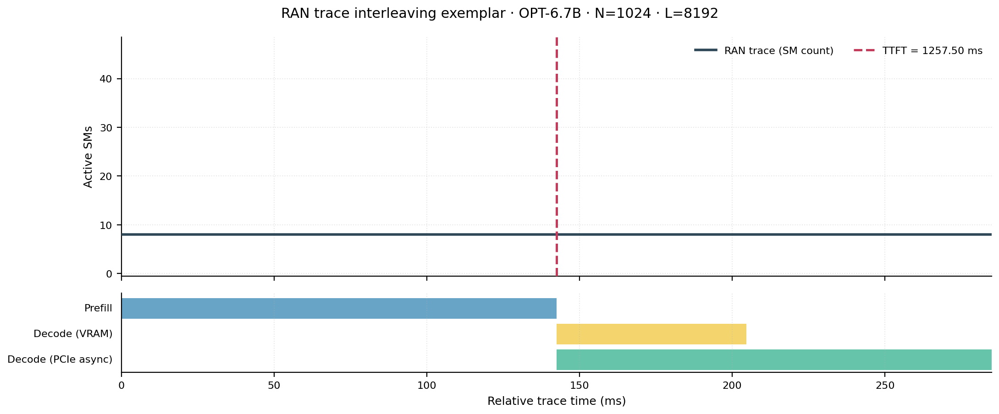
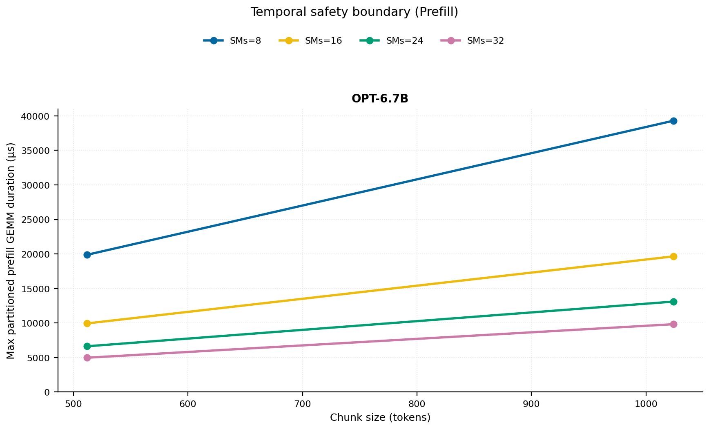
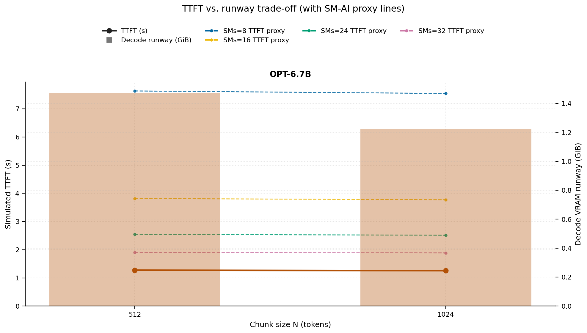
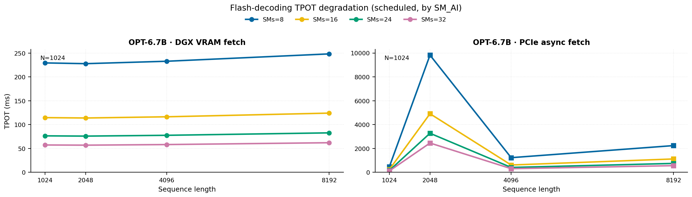
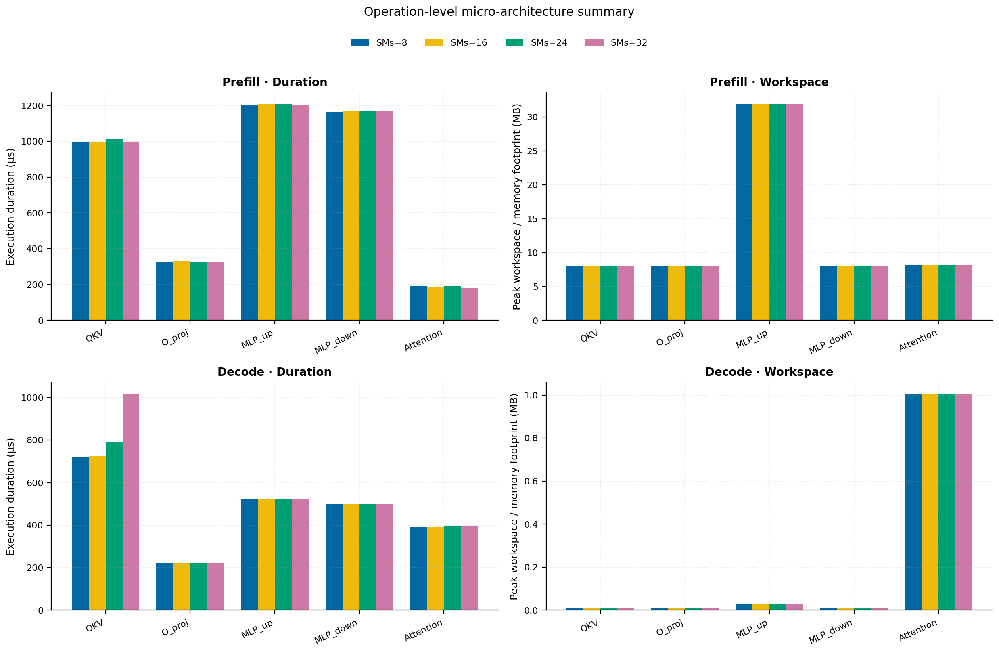
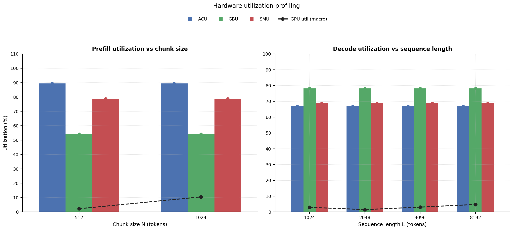
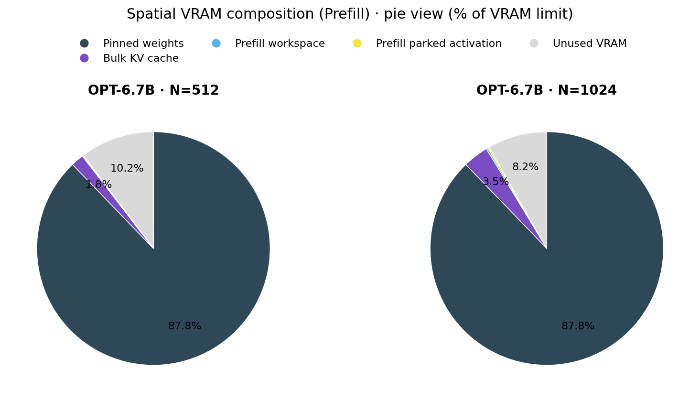

# RAN Inference Profiling Report

Run root: `/mnt/data/dheeraj/dicertation/inference-profile/runs/revised-rerun-20260415-020401-g7-opt67b-c512-1024`

## Environment

| field | value |
| --- | --- |
| cache_root | n/a |
| captured_at | 2026-04-15T01:04:08Z |
| chunk_sizes | [512, 1024] |
| cuda_available | true |
| cuda_device_count | 8 |
| cwd | /mnt/data/dheeraj/dicertation/inference-profile |
| decode_modes | ["vram", "pcie_async"] |
| experiment_type | ran-dgxspark-v1 |
| gpu_id | 7 |
| l_out | 1024 |
| models | ["facebook/opt-6.7b"] |
| platform | Linux-6.8.0-106-generic-x86_64-with-glibc2.35 |
| python_executable | /home/dheeraj/miniconda3/envs/mls/bin/python |
| python_version | 3.11.14 |
| run_root | /mnt/data/dheeraj/dicertation/inference-profile/runs/revised-rerun-20260415-020401-g7-opt67b-c512-1024 |
| scheduler | envelope_v1 |
| schema_version | ran_dgxspark_v1 |
| sequence_lengths | [1024, 2048, 4096, 8192] |
| sm_ai_cap | 32 |
| sm_ai_partition | 100 |
| sm_ai_partitions | [8, 16, 24, 32] |
| stage | profile |
| telemetry_tier | baseline_nvml_pt |
| timed_iterations | 5 |
| torch_available | true |
| torch_version | 2.10.0+cu128 |
| warmup_iterations | 3 |

## Model Constants

| model_id | sm_ai_partition | num_hidden_layers | hidden_size | num_attention_heads | ffn_dim | layer_index | layer_weight_bytes | total_weight_bytes_fp16 | vram_ceiling_bytes |
| --- | --- | --- | --- | --- | --- | --- | --- | --- | --- |
| facebook/opt-6.7b | 100 | 32 | 4096 | 32 | 16384 | 15 | 402759680 | 13316947968 | 15170115993 |

## Trace Inspection

### Primary trace

| field | value |
| --- | --- |
| errors | [] |
| header | ["frame", "slot", "time_slot_sched_ns", "time_decode_start_est_ns", "time_decode_end_est_ns", "time_decode_start_actual_ns", "time_decode_end_actual_ns", "decode_dur_us", "deadline_met", "target_sm", "profile_idx", "sm_count", "num_pusch", "sum_prb", "sum_tbs_bytes", "max_mcs"] |
| median_positive_delta_ms | 5.6997 |
| monotonicity.checked_column | time_slot_sched_ns |
| monotonicity.is_non_decreasing | true |
| monotonicity.negative_delta_count | 0 |
| monotonicity.positive_delta_count | 28377 |
| monotonicity.zero_delta_count | 0 |
| normalization.last_row_duration_policy | median_positive_forward_delta_ms |
| normalization.output_columns | ["time_ms", "sm_utilization", "slot_duration_ms", "source_schema", "sm_count"] |
| normalization.output_relative_path | derived/normalized_ldpc_trace.csv |
| normalized_row_count | 28378 |
| path | /mnt/raid0sata2/netsys/weaver-ext/ran/traces/e2e_2026030418/e2e_20260304_182034_tractor_ran_ctrl/ldpc_trace.csv |
| row_count | 28378 |
| schema_detected | schema_b |
| time_unit_hint | ns |
| usable | true |
| usage_policy | primary_only |
| used_for_scheduler_capacity | true |

### Secondary trace

| field | value |
| --- | --- |
| errors | ["ran_ctrl_trace.csv line 182958 has 9 field(s); expected 12"] |
| header | ["frame", "slot", "sm_available", "prbs_available", "prbs_allocated", "w_avg_mcs_prev", "w_avg_mcs_curr", "slots_since_underutil", "ramp_up_count", "num_ue_sched", "max_ue_backlog", "sum_ue_backlog"] |
| monotonicity.checked_column | n/a |
| monotonicity.is_non_decreasing | n/a |
| monotonicity.negative_delta_count | n/a |
| path | /mnt/raid0sata2/netsys/weaver-ext/ran/traces/e2e_2026030418/e2e_20260304_182034_tractor_ran_ctrl/ran_ctrl_trace.csv |
| row_count | 182956 |
| time_unit_hints | [] |
| usable | false |
| usage_policy | structural_only |
| used_for_scheduler_capacity | false |

## Raw-Profile Summary Tables

### Prefill profile summary

Source raw rows: `raw/prefill_events.csv` = 280. Summary artifact: `derived/prefill_summary.csv`.

| model_id | chunk_tokens | sm_ai_partition | max_input_tokens | prefill_max_gemm_us | prefill_workspace_bytes | prefill_parked_activation_bytes | telemetry_tier | telemetry_provider | telemetry_status | nvml_available | gpu_util | gpu_mem_used_mb | sm_clock_mhz | mem_clock_mhz | power_w | pt_step_ms | pt_mem_alloc_mb | pt_mem_reserved_mb | pt_workspace_mb | acu_pct | gbu_pct | smu_pct | microscopic_telemetry_status | microscopic_error |
| --- | --- | --- | --- | --- | --- | --- | --- | --- | --- | --- | --- | --- | --- | --- | --- | --- | --- | --- | --- | --- | --- | --- | --- | --- |
| facebook/opt-6.7b | 512 | 8 | 1024 | 856.064 | 16777216 | 16777216 | baseline_nvml_pt | nvidia-smi | ok | true | 0 | 2526 | 1695 | 7601 | 68.78 | 0.8561 | 441.1953 | 441.1953 | 16 | 79 | 62.5 | 67.5 | estimated | n/a |
| facebook/opt-6.7b | 512 | 16 | 1024 | 835.584 | 16777216 | 16777216 | baseline_nvml_pt | nvidia-smi | ok | true | 8 | 2526 | 1695 | 7601 | 68.97 | 0.8356 | 441.1953 | 441.1953 | 16 | 86 | 57 | 75 | estimated | n/a |
| facebook/opt-6.7b | 512 | 24 | 1024 | 832.512 | 16777216 | 16777216 | baseline_nvml_pt | nvidia-smi | ok | true | 0 | 2526 | 1695 | 7601 | 69.16 | 0.8325 | 441.1953 | 441.1953 | 16 | 93 | 51.5 | 82.5 | estimated | n/a |
| facebook/opt-6.7b | 512 | 32 | 1024 | 828.416 | 16777216 | 16777216 | baseline_nvml_pt | nvidia-smi | ok | true | 1 | 2524 | 1695 | 7601 | 69.06 | 0.8284 | 441.1953 | 441.1953 | 16 | 100 | 46 | 90 | estimated | n/a |
| facebook/opt-6.7b | 1024 | 8 | 1024 | 1628.16 | 33554432 | 33554432 | baseline_nvml_pt | nvidia-smi | ok | true | 27 | 2526 | 1695 | 7601 | 74.29 | 1.6282 | 489.1953 | 489.1953 | 32 | 79 | 62.5 | 67.5 | estimated | n/a |
| facebook/opt-6.7b | 1024 | 16 | 1024 | 1645.568 | 33554432 | 33554432 | baseline_nvml_pt | nvidia-smi | ok | true | 7 | 2524 | 1695 | 7601 | 74.44 | 1.6456 | 489.1953 | 489.1953 | 32 | 86 | 57 | 75 | estimated | n/a |
| facebook/opt-6.7b | 1024 | 24 | 1024 | 1641.664 | 33554432 | 33554432 | baseline_nvml_pt | nvidia-smi | ok | true | 1 | 2526 | 1695 | 7601 | 74.05 | 1.6417 | 489.1953 | 489.1953 | 32 | 93 | 51.5 | 82.5 | estimated | n/a |
| facebook/opt-6.7b | 1024 | 32 | 1024 | 1637.376 | 33554432 | 33554432 | baseline_nvml_pt | nvidia-smi | ok | true | 7 | 2524 | 1695 | 7601 | 74.48 | 1.6374 | 489.1953 | 489.1953 | 32 | 100 | 46 | 90 | estimated | n/a |

### Decode profile summary

Source raw rows: `raw/decode_events.csv` = 2560. Summary artifact: `derived/decode_summary.csv`.

| model_id | sequence_length | block_size | sm_ai_partition | decode_mode | decode_max_gemv_us | attention_fetch_compute_us | reduction_overhead_us | decode_workspace_bytes | decode_parked_activation_bytes | telemetry_tier | telemetry_provider | telemetry_status | nvml_available | gpu_util | gpu_mem_used_mb | sm_clock_mhz | mem_clock_mhz | power_w | pt_step_ms | pt_mem_alloc_mb | pt_mem_reserved_mb | pt_workspace_mb | acu_pct | gbu_pct | smu_pct | microscopic_telemetry_status | microscopic_error |
| --- | --- | --- | --- | --- | --- | --- | --- | --- | --- | --- | --- | --- | --- | --- | --- | --- | --- | --- | --- | --- | --- | --- | --- | --- | --- | --- | --- |
| facebook/opt-6.7b | 1024 | 512 | 8 | pcie_async | 269.312 | 129.6896 | 20.8 | 139264 | 8192 | baseline_nvml_pt | nvidia-smi | ok | true | 20 | 2526 | 1695 | 7601 | 66.62 | 0.2693 | 408.375 | 408.375 | 0.1328 | 56.5 | 87 | 59 | estimated | n/a |
| facebook/opt-6.7b | 1024 | 512 | 8 | vram | 307.2 | 132.544 | 21.0752 | 139264 | 8192 | baseline_nvml_pt | nvidia-smi | ok | true | 1 | 2524 | 1695 | 7601 | 66.51 | 0.3072 | 408.375 | 408.375 | 0.1328 | 63 | 77.5 | 62 | estimated | n/a |
| facebook/opt-6.7b | 1024 | 512 | 16 | pcie_async | 268 | 130.6176 | 21.28 | 139264 | 8192 | baseline_nvml_pt | nvidia-smi | ok | true | 0 | 2526 | 1695 | 7601 | 66.91 | 0.268 | 408.375 | 408.375 | 0.1328 | 61 | 84 | 64 | estimated | n/a |
| facebook/opt-6.7b | 1024 | 512 | 16 | vram | 268.288 | 128.2048 | 20.3072 | 139264 | 8192 | baseline_nvml_pt | nvidia-smi | ok | true | 0 | 2526 | 1695 | 7601 | 66.79 | 0.2683 | 408.375 | 408.375 | 0.1328 | 68 | 75 | 68 | estimated | n/a |
| facebook/opt-6.7b | 1024 | 512 | 24 | pcie_async | 266.24 | 122.7328 | 20.0704 | 139264 | 8192 | baseline_nvml_pt | nvidia-smi | ok | true | 1 | 2524 | 1695 | 7601 | 66.82 | 0.2662 | 408.375 | 408.375 | 0.1328 | 65.5 | 81 | 69 | estimated | n/a |
| facebook/opt-6.7b | 1024 | 512 | 24 | vram | 269.184 | 135.1488 | 21.4976 | 139264 | 8192 | baseline_nvml_pt | nvidia-smi | ok | true | 16 | 2524 | 1695 | 7601 | 66.67 | 0.2692 | 408.375 | 408.375 | 0.1328 | 73 | 72.5 | 74 | estimated | n/a |
| facebook/opt-6.7b | 1024 | 512 | 32 | pcie_async | 269.312 | 143.3536 | 23.5648 | 139264 | 8192 | baseline_nvml_pt | nvidia-smi | ok | true | 0 | 2524 | 1695 | 7601 | 67.52 | 0.2693 | 408.375 | 408.375 | 0.1328 | 70 | 78 | 74 | estimated | n/a |
| facebook/opt-6.7b | 1024 | 512 | 32 | vram | 266.368 | 128.4416 | 20.6464 | 139264 | 8192 | baseline_nvml_pt | nvidia-smi | ok | true | 0 | 2524 | 1695 | 7601 | 67.15 | 0.2664 | 408.375 | 408.375 | 0.1328 | 78 | 70 | 80 | estimated | n/a |
| facebook/opt-6.7b | 1024 | 1024 | 8 | pcie_async | 271.36 | 132.3328 | 21.2608 | 139264 | 8192 | baseline_nvml_pt | nvidia-smi | ok | true | 8 | 2526 | 1695 | 7601 | 67.19 | 0.2714 | 408.375 | 408.375 | 0.1328 | 56.5 | 87 | 59 | estimated | n/a |
| facebook/opt-6.7b | 1024 | 1024 | 8 | vram | 270.176 | 126.9632 | 20.2944 | 139264 | 8192 | baseline_nvml_pt | nvidia-smi | ok | true | 0 | 2526 | 1695 | 7601 | 67.04 | 0.2702 | 408.375 | 408.375 | 0.1328 | 63 | 77.5 | 62 | estimated | n/a |
| facebook/opt-6.7b | 1024 | 1024 | 16 | pcie_async | 269.312 | 127.5584 | 20.3264 | 139264 | 8192 | baseline_nvml_pt | nvidia-smi | ok | true | 1 | 2526 | 1695 | 7601 | 67.42 | 0.2693 | 408.375 | 408.375 | 0.1328 | 61 | 84 | 64 | estimated | n/a |
| facebook/opt-6.7b | 1024 | 1024 | 16 | vram | 272.384 | 131.5968 | 20.7296 | 139264 | 8192 | baseline_nvml_pt | nvidia-smi | ok | true | 0 | 2526 | 1695 | 7601 | 67.31 | 0.2724 | 408.375 | 408.375 | 0.1328 | 68 | 75 | 68 | estimated | n/a |
| facebook/opt-6.7b | 1024 | 1024 | 24 | pcie_async | 3092.4799 | 143.328 | 21.6128 | 139264 | 8192 | baseline_nvml_pt | nvidia-smi | ok | true | 0 | 2526 | 1695 | 7601 | 67.17 | 3.0925 | 408.375 | 408.375 | 0.1328 | 65.5 | 81 | 69 | estimated | n/a |
| facebook/opt-6.7b | 1024 | 1024 | 24 | vram | 270.336 | 127.2064 | 20.1728 | 139264 | 8192 | baseline_nvml_pt | nvidia-smi | ok | true | 0 | 2524 | 1695 | 7601 | 66.69 | 0.2703 | 408.375 | 408.375 | 0.1328 | 73 | 72.5 | 74 | estimated | n/a |
| facebook/opt-6.7b | 1024 | 1024 | 32 | pcie_async | 271.36 | 134.3424 | 21.888 | 139264 | 8192 | baseline_nvml_pt | nvidia-smi | ok | true | 0 | 2524 | 1695 | 7601 | 66.7 | 0.2714 | 408.375 | 408.375 | 0.1328 | 70 | 78 | 74 | estimated | n/a |
| facebook/opt-6.7b | 1024 | 1024 | 32 | vram | 272.288 | 136.5824 | 22.0672 | 139264 | 8192 | baseline_nvml_pt | nvidia-smi | ok | true | 0 | 2526 | 1695 | 7601 | 66.7 | 0.2723 | 408.375 | 408.375 | 0.1328 | 78 | 70 | 80 | estimated | n/a |
| facebook/opt-6.7b | 2048 | 512 | 8 | pcie_async | 273.408 | 149.056 | 22.4576 | 270336 | 8192 | baseline_nvml_pt | nvidia-smi | ok | true | 0 | 2526 | 1695 | 7601 | 67.39 | 0.2734 | 424.5 | 424.5 | 0.2578 | 56.5 | 87 | 59 | estimated | n/a |
| facebook/opt-6.7b | 2048 | 512 | 8 | vram | 266.272 | 148.4032 | 22.112 | 270336 | 8192 | baseline_nvml_pt | nvidia-smi | ok | true | 0 | 2526 | 1695 | 7601 | 66.87 | 0.2663 | 424.5 | 424.5 | 0.2578 | 63 | 77.5 | 62 | estimated | n/a |
| facebook/opt-6.7b | 2048 | 512 | 16 | pcie_async | 269.088 | 135.1168 | 20.7872 | 270336 | 8192 | baseline_nvml_pt | nvidia-smi | ok | true | 0 | 2526 | 1695 | 7601 | 66.83 | 0.2691 | 424.5 | 424.5 | 0.2578 | 61 | 84 | 64 | estimated | n/a |
| facebook/opt-6.7b | 2048 | 512 | 16 | vram | 268.288 | 135.3216 | 23.1296 | 270336 | 8192 | baseline_nvml_pt | nvidia-smi | ok | true | 0 | 2524 | 1695 | 7601 | 67.07 | 0.2683 | 424.5 | 424.5 | 0.2578 | 68 | 75 | 68 | estimated | n/a |
| facebook/opt-6.7b | 2048 | 512 | 24 | pcie_async | 270.336 | 142.5408 | 22.0992 | 270336 | 8192 | baseline_nvml_pt | nvidia-smi | ok | true | 0 | 2526 | 1695 | 7601 | 66.99 | 0.2703 | 424.5 | 424.5 | 0.2578 | 65.5 | 81 | 69 | estimated | n/a |
| facebook/opt-6.7b | 2048 | 512 | 24 | vram | 271.36 | 135.5584 | 20.3072 | 270336 | 8192 | baseline_nvml_pt | nvidia-smi | ok | true | 0 | 2526 | 1695 | 7601 | 67.2 | 0.2714 | 424.5 | 424.5 | 0.2578 | 73 | 72.5 | 74 | estimated | n/a |
| facebook/opt-6.7b | 2048 | 512 | 32 | pcie_async | 268.288 | 135.3728 | 20.9152 | 270336 | 8192 | baseline_nvml_pt | nvidia-smi | ok | true | 2 | 2524 | 1695 | 7601 | 67.14 | 0.2683 | 424.5 | 424.5 | 0.2578 | 70 | 78 | 74 | estimated | n/a |
| facebook/opt-6.7b | 2048 | 512 | 32 | vram | 266.24 | 133.2352 | 21.6704 | 270336 | 8192 | baseline_nvml_pt | nvidia-smi | ok | true | 0 | 2524 | 1695 | 7601 | 67.29 | 0.2662 | 424.5 | 424.5 | 0.2578 | 78 | 70 | 80 | estimated | n/a |
| facebook/opt-6.7b | 2048 | 1024 | 8 | pcie_async | 270.272 | 138.4192 | 21.6832 | 270336 | 8192 | baseline_nvml_pt | nvidia-smi | ok | true | 0 | 2526 | 1695 | 7601 | 67.47 | 0.2703 | 424.5 | 424.5 | 0.2578 | 56.5 | 87 | 59 | estimated | n/a |
| facebook/opt-6.7b | 2048 | 1024 | 8 | vram | 268.288 | 131.3152 | 20.704 | 270336 | 8192 | baseline_nvml_pt | nvidia-smi | ok | true | 0 | 2526 | 1695 | 7601 | 67.24 | 0.2683 | 424.5 | 424.5 | 0.2578 | 63 | 77.5 | 62 | estimated | n/a |
| facebook/opt-6.7b | 2048 | 1024 | 16 | pcie_async | 270.336 | 144.1216 | 23.1424 | 270336 | 8192 | baseline_nvml_pt | nvidia-smi | ok | true | 0 | 2526 | 1695 | 7601 | 67.38 | 0.2703 | 424.5 | 424.5 | 0.2578 | 61 | 84 | 64 | estimated | n/a |
| facebook/opt-6.7b | 2048 | 1024 | 16 | vram | 276.416 | 137.8432 | 19.232 | 270336 | 8192 | baseline_nvml_pt | nvidia-smi | ok | true | 0 | 2526 | 1695 | 7601 | 67.62 | 0.2764 | 424.5 | 424.5 | 0.2578 | 68 | 75 | 68 | estimated | n/a |
| facebook/opt-6.7b | 2048 | 1024 | 24 | pcie_async | 273.376 | 158.4704 | 24.9856 | 270336 | 8192 | baseline_nvml_pt | nvidia-smi | ok | true | 22 | 2524 | 1695 | 7601 | 67.3 | 0.2734 | 424.5 | 424.5 | 0.2578 | 65.5 | 81 | 69 | estimated | n/a |
| facebook/opt-6.7b | 2048 | 1024 | 24 | vram | 268.288 | 135.7568 | 20.448 | 270336 | 8192 | baseline_nvml_pt | nvidia-smi | ok | true | 0 | 2524 | 1695 | 7601 | 66.85 | 0.2683 | 424.5 | 424.5 | 0.2578 | 73 | 72.5 | 74 | estimated | n/a |
| facebook/opt-6.7b | 2048 | 1024 | 32 | pcie_async | 12111.9356 | 165.2416 | 24.3328 | 270336 | 8192 | baseline_nvml_pt | nvidia-smi | ok | true | 0 | 2524 | 1695 | 7601 | 67.25 | 12.1119 | 424.5 | 424.5 | 0.2578 | 70 | 78 | 74 | estimated | n/a |
| facebook/opt-6.7b | 2048 | 1024 | 32 | vram | 271.36 | 131.8848 | 19.9232 | 270336 | 8192 | baseline_nvml_pt | nvidia-smi | ok | true | 0 | 2526 | 1695 | 7601 | 67.97 | 0.2714 | 424.5 | 424.5 | 0.2578 | 78 | 70 | 80 | estimated | n/a |
| facebook/opt-6.7b | 4096 | 512 | 8 | pcie_async | 266.24 | 158.5088 | 20.1408 | 532480 | 8192 | baseline_nvml_pt | nvidia-smi | ok | true | 0 | 2524 | 1695 | 7601 | 67.61 | 0.2662 | 456.75 | 456.75 | 0.5078 | 56.5 | 87 | 59 | estimated | n/a |
| facebook/opt-6.7b | 4096 | 512 | 8 | vram | 266.24 | 166.5024 | 20.6528 | 532480 | 8192 | baseline_nvml_pt | nvidia-smi | ok | true | 0 | 2526 | 1695 | 7601 | 67.55 | 0.2662 | 456.75 | 456.75 | 0.5078 | 63 | 77.5 | 62 | estimated | n/a |
| facebook/opt-6.7b | 4096 | 512 | 16 | pcie_async | 267.264 | 157.9904 | 19.2704 | 532480 | 8192 | baseline_nvml_pt | nvidia-smi | ok | true | 1 | 2526 | 1695 | 7601 | 67.69 | 0.2673 | 456.75 | 456.75 | 0.5078 | 61 | 84 | 64 | estimated | n/a |
| facebook/opt-6.7b | 4096 | 512 | 16 | vram | 268.288 | 169.7472 | 20.3648 | 532480 | 8192 | baseline_nvml_pt | nvidia-smi | ok | true | 0 | 2524 | 1695 | 7601 | 67.55 | 0.2683 | 456.75 | 456.75 | 0.5078 | 68 | 75 | 68 | estimated | n/a |
| facebook/opt-6.7b | 4096 | 512 | 24 | pcie_async | 269.312 | 159.4688 | 19.5328 | 532480 | 8192 | baseline_nvml_pt | nvidia-smi | ok | true | 0 | 2526 | 1695 | 7601 | 67.23 | 0.2693 | 456.75 | 456.75 | 0.5078 | 65.5 | 81 | 69 | estimated | n/a |
| facebook/opt-6.7b | 4096 | 512 | 24 | vram | 278.272 | 158.2528 | 24.2176 | 532480 | 8192 | baseline_nvml_pt | nvidia-smi | ok | true | 7 | 2524 | 1695 | 7601 | 67.43 | 0.2783 | 456.75 | 456.75 | 0.5078 | 73 | 72.5 | 74 | estimated | n/a |
| facebook/opt-6.7b | 4096 | 512 | 32 | pcie_async | 269.152 | 162.6112 | 20.352 | 532480 | 8192 | baseline_nvml_pt | nvidia-smi | ok | true | 0 | 2524 | 1695 | 7601 | 67.84 | 0.2692 | 456.75 | 456.75 | 0.5078 | 70 | 78 | 74 | estimated | n/a |
| facebook/opt-6.7b | 4096 | 512 | 32 | vram | 273.408 | 175.3088 | 21.9136 | 532480 | 8192 | baseline_nvml_pt | nvidia-smi | ok | true | 7 | 2524 | 1695 | 7601 | 67.43 | 0.2734 | 456.75 | 456.75 | 0.5078 | 78 | 70 | 80 | estimated | n/a |
| facebook/opt-6.7b | 4096 | 1024 | 8 | pcie_async | 270.336 | 162.9632 | 29.9008 | 532480 | 8192 | baseline_nvml_pt | nvidia-smi | ok | true | 0 | 2524 | 1695 | 7601 | 67.32 | 0.2703 | 456.75 | 456.75 | 0.5078 | 56.5 | 87 | 59 | estimated | n/a |
| facebook/opt-6.7b | 4096 | 1024 | 8 | vram | 278.528 | 168.2048 | 20.8832 | 532480 | 8192 | baseline_nvml_pt | nvidia-smi | ok | true | 0 | 2524 | 1695 | 7601 | 67.18 | 0.2785 | 456.75 | 456.75 | 0.5078 | 63 | 77.5 | 62 | estimated | n/a |
| facebook/opt-6.7b | 4096 | 1024 | 16 | pcie_async | 271.36 | 166.24 | 20.032 | 532480 | 8192 | baseline_nvml_pt | nvidia-smi | ok | true | 0 | 2526 | 1695 | 7601 | 67.53 | 0.2714 | 456.75 | 456.75 | 0.5078 | 61 | 84 | 64 | estimated | n/a |
| facebook/opt-6.7b | 4096 | 1024 | 16 | vram | 274.432 | 174.72 | 22.3488 | 532480 | 8192 | baseline_nvml_pt | nvidia-smi | ok | true | 0 | 2526 | 1695 | 7601 | 67.27 | 0.2744 | 456.75 | 456.75 | 0.5078 | 68 | 75 | 68 | estimated | n/a |
| facebook/opt-6.7b | 4096 | 1024 | 24 | pcie_async | 269.312 | 161.792 | 21.4208 | 532480 | 8192 | baseline_nvml_pt | nvidia-smi | ok | true | 26 | 2526 | 1695 | 7601 | 67.5 | 0.2693 | 456.75 | 456.75 | 0.5078 | 65.5 | 81 | 69 | estimated | n/a |
| facebook/opt-6.7b | 4096 | 1024 | 24 | vram | 274.432 | 177.1904 | 22.4832 | 532480 | 8192 | baseline_nvml_pt | nvidia-smi | ok | true | 0 | 2526 | 1695 | 7601 | 67.9 | 0.2744 | 456.75 | 456.75 | 0.5078 | 73 | 72.5 | 74 | estimated | n/a |
| facebook/opt-6.7b | 4096 | 1024 | 32 | pcie_async | 268.288 | 161.344 | 20.9152 | 532480 | 8192 | baseline_nvml_pt | nvidia-smi | ok | true | 1 | 2526 | 1695 | 7601 | 67.68 | 0.2683 | 456.75 | 456.75 | 0.5078 | 70 | 78 | 74 | estimated | n/a |
| facebook/opt-6.7b | 4096 | 1024 | 32 | vram | 271.36 | 172.1856 | 19.3088 | 532480 | 8192 | baseline_nvml_pt | nvidia-smi | ok | true | 7 | 2526 | 1695 | 7601 | 67.93 | 0.2714 | 456.75 | 456.75 | 0.5078 | 78 | 70 | 80 | estimated | n/a |
| facebook/opt-6.7b | 8192 | 512 | 8 | pcie_async | 268.288 | 259.0656 | 23.3792 | 1056768 | 8192 | baseline_nvml_pt | nvidia-smi | ok | true | 0 | 2526 | 1695 | 7601 | 68.14 | 0.2683 | 521.25 | 521.25 | 1.0078 | 56.5 | 87 | 59 | estimated | n/a |
| facebook/opt-6.7b | 8192 | 512 | 8 | vram | 273.408 | 257.1904 | 19.5584 | 1056768 | 8192 | baseline_nvml_pt | nvidia-smi | ok | true | 0 | 2526 | 1695 | 7601 | 67.82 | 0.2734 | 521.25 | 521.25 | 1.0078 | 63 | 77.5 | 62 | estimated | n/a |
| facebook/opt-6.7b | 8192 | 512 | 16 | pcie_async | 273.408 | 267.6928 | 24 | 1056768 | 8192 | baseline_nvml_pt | nvidia-smi | ok | true | 0 | 2524 | 1695 | 7601 | 67.21 | 0.2734 | 521.25 | 521.25 | 1.0078 | 61 | 84 | 64 | estimated | n/a |
| facebook/opt-6.7b | 8192 | 512 | 16 | vram | 395.264 | 258.624 | 23.4624 | 1056768 | 8192 | baseline_nvml_pt | nvidia-smi | ok | true | 0 | 2524 | 1695 | 7601 | 67.67 | 0.3953 | 521.25 | 521.25 | 1.0078 | 68 | 75 | 68 | estimated | n/a |
| facebook/opt-6.7b | 8192 | 512 | 24 | pcie_async | 267.264 | 255.5456 | 19.8912 | 1056768 | 8192 | baseline_nvml_pt | nvidia-smi | ok | true | 0 | 2526 | 1695 | 7601 | 68.07 | 0.2673 | 521.25 | 521.25 | 1.0078 | 65.5 | 81 | 69 | estimated | n/a |
| facebook/opt-6.7b | 8192 | 512 | 24 | vram | 268.288 | 268.2368 | 23.392 | 1056768 | 8192 | baseline_nvml_pt | nvidia-smi | ok | true | 24 | 2526 | 1695 | 7601 | 67.53 | 0.2816 | 521.25 | 521.25 | 1.0078 | 73 | 72.5 | 74 | estimated | n/a |
| facebook/opt-6.7b | 8192 | 512 | 32 | pcie_async | 268.256 | 257.7088 | 19.7632 | 1056768 | 8192 | baseline_nvml_pt | nvidia-smi | ok | true | 19 | 2526 | 1695 | 7601 | 67.58 | 0.2683 | 521.25 | 521.25 | 1.0078 | 70 | 78 | 74 | estimated | n/a |
| facebook/opt-6.7b | 8192 | 512 | 32 | vram | 268.448 | 257.6384 | 20.6016 | 1056768 | 8192 | baseline_nvml_pt | nvidia-smi | ok | true | 0 | 2526 | 1695 | 7601 | 67.79 | 0.2684 | 521.25 | 521.25 | 1.0078 | 78 | 70 | 80 | estimated | n/a |
| facebook/opt-6.7b | 8192 | 1024 | 8 | pcie_async | 272.384 | 261.9392 | 21.5232 | 1056768 | 8192 | baseline_nvml_pt | nvidia-smi | ok | true | 0 | 2526 | 1695 | 7601 | 67.49 | 0.2724 | 521.25 | 521.25 | 1.0078 | 56.5 | 87 | 59 | estimated | n/a |
| facebook/opt-6.7b | 8192 | 1024 | 8 | vram | 271.36 | 260.9152 | 19.68 | 1056768 | 8192 | baseline_nvml_pt | nvidia-smi | ok | true | 11 | 2526 | 1695 | 7601 | 67.74 | 0.2714 | 521.25 | 521.25 | 1.0078 | 63 | 77.5 | 62 | estimated | n/a |
| facebook/opt-6.7b | 8192 | 1024 | 16 | pcie_async | 269.312 | 258.208 | 22.0992 | 1056768 | 8192 | baseline_nvml_pt | nvidia-smi | ok | true | 0 | 2526 | 1695 | 7601 | 67.59 | 0.2693 | 521.25 | 521.25 | 1.0078 | 61 | 84 | 64 | estimated | n/a |
| facebook/opt-6.7b | 8192 | 1024 | 16 | vram | 270.336 | 260.6016 | 21.8944 | 1056768 | 8192 | baseline_nvml_pt | nvidia-smi | ok | true | 0 | 2524 | 1695 | 7601 | 67.48 | 0.2703 | 521.25 | 521.25 | 1.0078 | 68 | 75 | 68 | estimated | n/a |
| facebook/opt-6.7b | 8192 | 1024 | 24 | pcie_async | 270.336 | 258.048 | 20.4672 | 1056768 | 8192 | baseline_nvml_pt | nvidia-smi | ok | true | 19 | 2526 | 1695 | 7601 | 67.93 | 0.2703 | 521.25 | 521.25 | 1.0078 | 65.5 | 81 | 69 | estimated | n/a |
| facebook/opt-6.7b | 8192 | 1024 | 24 | vram | 275.456 | 262.3424 | 21.472 | 1056768 | 8192 | baseline_nvml_pt | nvidia-smi | ok | true | 0 | 2526 | 1695 | 7601 | 67.36 | 0.2755 | 521.25 | 521.25 | 1.0078 | 73 | 72.5 | 74 | estimated | n/a |
| facebook/opt-6.7b | 8192 | 1024 | 32 | pcie_async | 269.216 | 256.16 | 21.3248 | 1056768 | 8192 | baseline_nvml_pt | nvidia-smi | ok | true | 3 | 2526 | 1695 | 7601 | 67.69 | 0.2692 | 521.25 | 521.25 | 1.0078 | 70 | 78 | 74 | estimated | n/a |
| facebook/opt-6.7b | 8192 | 1024 | 32 | vram | 276.48 | 259.7184 | 21.3504 | 1056768 | 8192 | baseline_nvml_pt | nvidia-smi | ok | true | 0 | 2524 | 1695 | 7601 | 67.5 | 0.2765 | 521.25 | 521.25 | 1.0078 | 78 | 70 | 80 | estimated | n/a |

### PCIe profile summary

Source raw rows: `raw/pcie_events.csv` = 10. Summary artifact: `derived/pcie_summary.csv`.

| model_id | block_size | kv_block_bytes | transfer_only_us | overlap_total_us | dummy_compute_us | exposed_transfer_us | effective_gbps | overlap_status | telemetry_tier | telemetry_provider | telemetry_status | nvml_available | gpu_util | gpu_mem_used_mb | sm_clock_mhz | mem_clock_mhz | power_w | pt_step_ms | pt_mem_alloc_mb | pt_mem_reserved_mb | pt_workspace_mb | acu_pct | gbu_pct | smu_pct | microscopic_telemetry_status | microscopic_error |
| --- | --- | --- | --- | --- | --- | --- | --- | --- | --- | --- | --- | --- | --- | --- | --- | --- | --- | --- | --- | --- | --- | --- | --- | --- | --- | --- |
| facebook/opt-6.7b | 512 | 8388608 | 5257.2226 | 62275.7376 | 58752.6157 | 3523.122 | 1.5956 | measured | baseline_nvml_pt | nvidia-smi | partial | true | 0 | 2526 | 1695 | 7601 | 67.07 | n/a | n/a | n/a | n/a | 65 | 65 | 65 | estimated | n/a |
| facebook/opt-6.7b | 1024 | 16777216 | 3773.7088 | 96322.7633 | 94370.8153 | 1951.948 | 4.4458 | measured | baseline_nvml_pt | nvidia-smi | partial | true | 0 | 2526 | 1695 | 7601 | 66.97 | n/a | n/a | n/a | n/a | 65 | 65 | 65 | estimated | n/a |

## SLA Tables

### Successful configurations

| model_id | chunk_tokens | sequence_length | ttft_ms | tpot_ms_vram | tpot_ms_pcie_async | decode_runway_tokens | status |
| --- | --- | --- | --- | --- | --- | --- | --- |
| facebook/opt-6.7b | 512 | 1024 | 1272.447 | 55.9135 | 282.5291 | 3022 | success |
| facebook/opt-6.7b | 512 | 2048 | 1272.447 | 56.0751 | 507.4721 | 3022 | success |
| facebook/opt-6.7b | 512 | 4096 | 1272.447 | 58.8055 | 959.4512 | 3021 | success |
| facebook/opt-6.7b | 512 | 8192 | 1272.447 | 60.4457 | 1864.2227 | 3020 | success |
| facebook/opt-6.7b | 1024 | 1024 | 1257.5047 | 57.3561 | 119.5628 | 2510 | success |
| facebook/opt-6.7b | 1024 | 2048 | 1257.5047 | 56.959 | 2456.4827 | 2510 | success |
| facebook/opt-6.7b | 1024 | 4096 | 1257.5047 | 58.2289 | 307.1929 | 2509 | success |
| facebook/opt-6.7b | 1024 | 8192 | 1257.5047 | 62.0784 | 560.2677 | 2508 | success |

### Failed configurations

No rows available.

## Per-Model Scaling Analysis

| model_id | successful_configs | failed_configs | chunk_tokens_tested | sequence_lengths_tested | largest_successful_chunk_tokens | ttft_ms_min | ttft_ms_max | tpot_ms_vram_min | tpot_ms_vram_max | tpot_ms_pcie_async_min | tpot_ms_pcie_async_max | max_decode_runway_tokens |
| --- | --- | --- | --- | --- | --- | --- | --- | --- | --- | --- | --- | --- |
| facebook/opt-6.7b | 8 | 0 | 512, 1024 | 1024, 2048, 4096, 8192 | 1024 | 1257.5047 | 1272.447 | 55.9135 | 62.0784 | 119.5628 | 2456.4827 | 3022 |

## Plots

### Revised 01 Ran Trace Interleaving

[Interactive companion](../plots/revised_01_ran_trace_interleaving_interactive.html)

### Revised 02 Prefill Safety Boundary

### Revised 03 Prefill Vram Composition

### Revised 04 Ttft Vs Runway

### Revised 05 Decode Tpot Degradation

### Revised 06 Operation Level Microarchitecture Summary

### Revised 07 Hardware Utilization Profiling

### Revised 08 Decode Memory Consumption

### 09 Spatial VRAM Composition (Prefill) · Pie View

