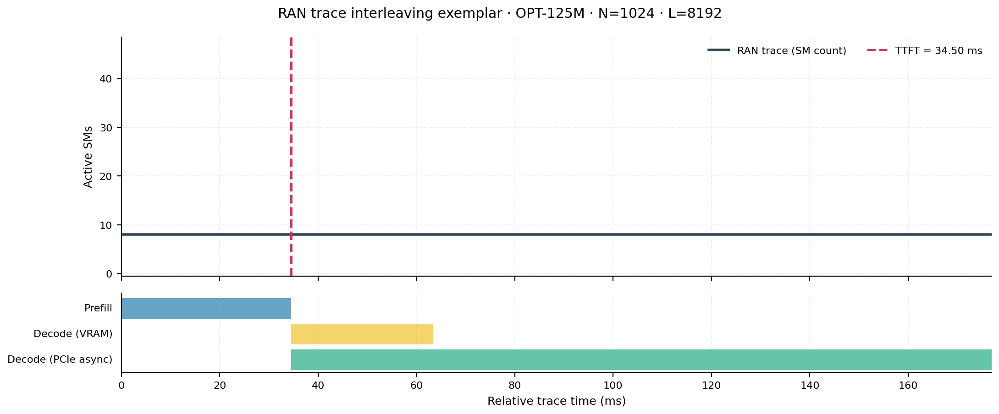
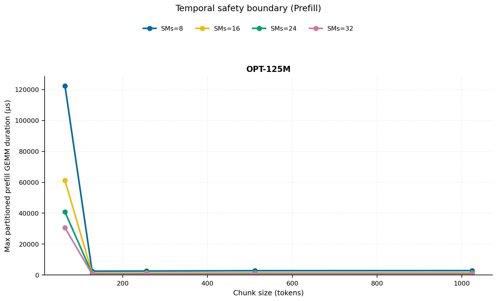
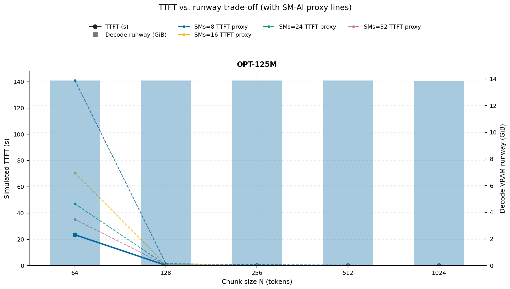
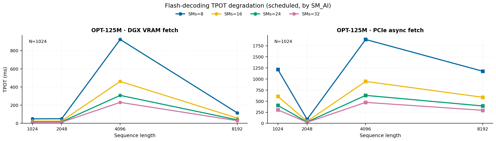
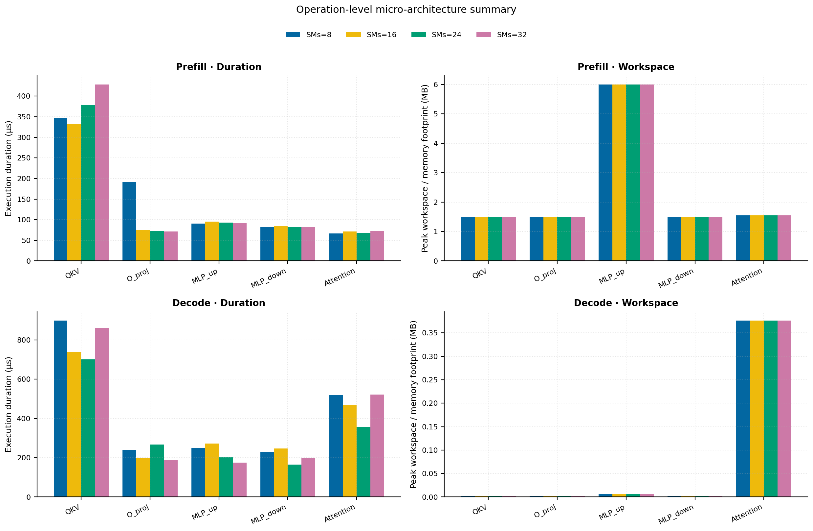
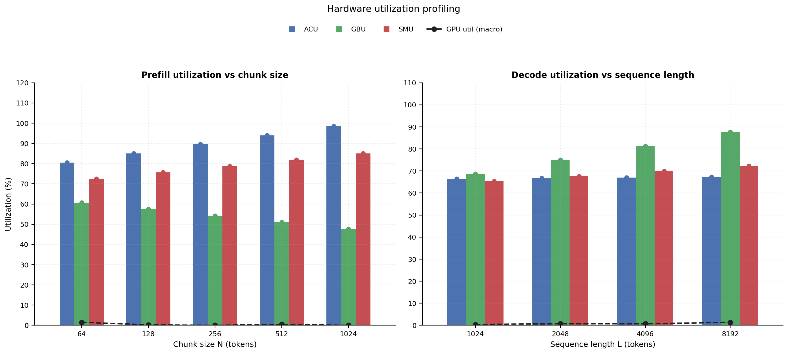
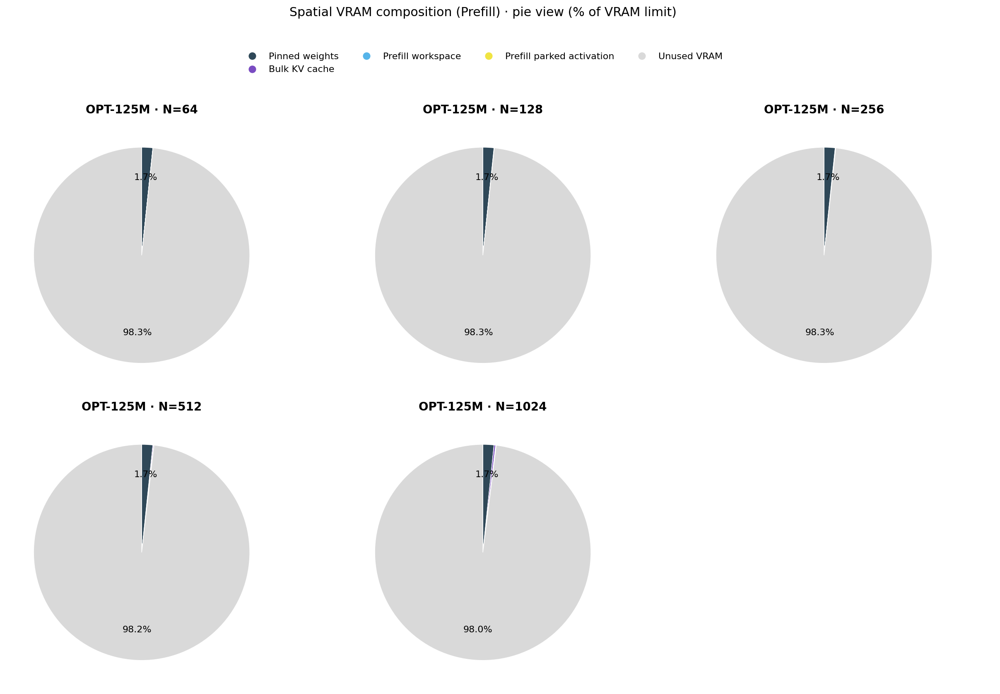

# RAN Inference Profiling Report

Run root: `/mnt/data/dheeraj/dicertation/inference-profile/runs/revised-rerun-20260415-145452-g0-opt125m`

## Environment

| field | value |
| --- | --- |
| cache_root | n/a |
| captured_at | 2026-04-15T13:55:00Z |
| chunk_sizes | [64, 128, 256, 512, 1024] |
| cuda_available | true |
| cuda_device_count | 8 |
| cwd | /mnt/data/dheeraj/dicertation/inference-profile |
| decode_modes | ["vram", "pcie_async"] |
| experiment_type | ran-dgxspark-v1 |
| gpu_id | 0 |
| l_out | 1024 |
| models | ["facebook/opt-125m"] |
| platform | Linux-6.8.0-106-generic-x86_64-with-glibc2.35 |
| python_executable | /home/dheeraj/miniconda3/envs/mls/bin/python |
| python_version | 3.11.14 |
| run_root | /mnt/data/dheeraj/dicertation/inference-profile/runs/revised-rerun-20260415-145452-g0-opt125m |
| scheduler | envelope_v1 |
| schema_version | ran_dgxspark_v1 |
| sequence_lengths | [1024, 2048, 4096, 8192] |
| sm_ai_cap | 32 |
| sm_ai_partition | 100 |
| sm_ai_partitions | [8, 16, 24, 32] |
| stage | profile |
| telemetry_tier | baseline_nvml_pt |
| timed_iterations | 5 |
| torch_available | true |
| torch_version | 2.10.0+cu128 |
| warmup_iterations | 3 |

## Model Constants

| model_id | sm_ai_partition | num_hidden_layers | hidden_size | num_attention_heads | ffn_dim | layer_index | layer_weight_bytes | total_weight_bytes_fp16 | vram_ceiling_bytes |
| --- | --- | --- | --- | --- | --- | --- | --- | --- | --- |
| facebook/opt-125m | 100 | 12 | 768 | 12 | 3072 | 5 | 14175744 | 250478592 | 15170115993 |

## Trace Inspection

### Primary trace

| field | value |
| --- | --- |
| errors | [] |
| header | ["frame", "slot", "time_slot_sched_ns", "time_decode_start_est_ns", "time_decode_end_est_ns", "time_decode_start_actual_ns", "time_decode_end_actual_ns", "decode_dur_us", "deadline_met", "target_sm", "profile_idx", "sm_count", "num_pusch", "sum_prb", "sum_tbs_bytes", "max_mcs"] |
| median_positive_delta_ms | 5.6997 |
| monotonicity.checked_column | time_slot_sched_ns |
| monotonicity.is_non_decreasing | true |
| monotonicity.negative_delta_count | 0 |
| monotonicity.positive_delta_count | 28377 |
| monotonicity.zero_delta_count | 0 |
| normalization.last_row_duration_policy | median_positive_forward_delta_ms |
| normalization.output_columns | ["time_ms", "sm_utilization", "slot_duration_ms", "source_schema", "sm_count"] |
| normalization.output_relative_path | derived/normalized_ldpc_trace.csv |
| normalized_row_count | 28378 |
| path | /mnt/raid0sata2/netsys/weaver-ext/ran/traces/e2e_2026030418/e2e_20260304_182034_tractor_ran_ctrl/ldpc_trace.csv |
| row_count | 28378 |
| schema_detected | schema_b |
| time_unit_hint | ns |
| usable | true |
| usage_policy | primary_only |
| used_for_scheduler_capacity | true |

### Secondary trace

| field | value |
| --- | --- |
| errors | ["ran_ctrl_trace.csv line 182958 has 9 field(s); expected 12"] |
| header | ["frame", "slot", "sm_available", "prbs_available", "prbs_allocated", "w_avg_mcs_prev", "w_avg_mcs_curr", "slots_since_underutil", "ramp_up_count", "num_ue_sched", "max_ue_backlog", "sum_ue_backlog"] |
| monotonicity.checked_column | n/a |
| monotonicity.is_non_decreasing | n/a |
| monotonicity.negative_delta_count | n/a |
| path | /mnt/raid0sata2/netsys/weaver-ext/ran/traces/e2e_2026030418/e2e_20260304_182034_tractor_ran_ctrl/ran_ctrl_trace.csv |
| row_count | 182956 |
| time_unit_hints | [] |
| usable | false |
| usage_policy | structural_only |
| used_for_scheduler_capacity | false |

## Raw-Profile Summary Tables

### Prefill profile summary

Source raw rows: `raw/prefill_events.csv` = 700. Summary artifact: `derived/prefill_summary.csv`.

| model_id | chunk_tokens | sm_ai_partition | max_input_tokens | prefill_max_gemm_us | prefill_workspace_bytes | prefill_parked_activation_bytes | telemetry_tier | telemetry_provider | telemetry_status | nvml_available | gpu_util | gpu_mem_used_mb | sm_clock_mhz | mem_clock_mhz | power_w | pt_step_ms | pt_mem_alloc_mb | pt_mem_reserved_mb | pt_workspace_mb | acu_pct | gbu_pct | smu_pct | microscopic_telemetry_status | microscopic_error |
| --- | --- | --- | --- | --- | --- | --- | --- | --- | --- | --- | --- | --- | --- | --- | --- | --- | --- | --- | --- | --- | --- | --- | --- | --- |
| facebook/opt-125m | 64 | 8 | 1024 | 136.16 | 393216 | 393216 | baseline_nvml_pt | nvidia-smi | ok | true | 0 | 35 | 1695 | 7601 | 61.36 | 0.1362 | 23.7632 | 23.7632 | 0.375 | 71.1 | 70 | 62.1 | estimated | n/a |
| facebook/opt-125m | 64 | 16 | 1024 | 165.888 | 393216 | 393216 | baseline_nvml_pt | nvidia-smi | ok | true | 6 | 35 | 1695 | 8001 | 62.25 | 0.1659 | 23.7632 | 23.7632 | 0.375 | 77.4 | 63.84 | 69 | estimated | n/a |
| facebook/opt-125m | 64 | 24 | 1024 | 153.536 | 393216 | 393216 | baseline_nvml_pt | nvidia-smi | ok | true | 0 | 35 | 1695 | 7601 | 61.92 | 0.1535 | 23.7632 | 23.7632 | 0.375 | 83.7 | 57.68 | 75.9 | estimated | n/a |
| facebook/opt-125m | 64 | 32 | 1024 | 5100.544 | 393216 | 393216 | baseline_nvml_pt | nvidia-smi | ok | true | 0 | 35 | 1695 | 7601 | 61.93 | 5.1005 | 23.7632 | 23.7632 | 0.375 | 90 | 51.52 | 82.8 | estimated | n/a |
| facebook/opt-125m | 128 | 8 | 1024 | 128 | 786432 | 786432 | baseline_nvml_pt | nvidia-smi | ok | true | 1 | 35 | 1695 | 7601 | 62.3 | 0.128 | 24.8882 | 24.8882 | 0.75 | 75.05 | 66.25 | 64.8 | estimated | n/a |
| facebook/opt-125m | 128 | 16 | 1024 | 121.856 | 786432 | 786432 | baseline_nvml_pt | nvidia-smi | ok | true | 0 | 35 | 1695 | 8001 | 62.67 | 0.1219 | 24.8882 | 24.8882 | 0.75 | 81.7 | 60.42 | 72 | estimated | n/a |
| facebook/opt-125m | 128 | 24 | 1024 | 130.176 | 786432 | 786432 | baseline_nvml_pt | nvidia-smi | ok | true | 0 | 35 | 1695 | 7601 | 62.66 | 0.1302 | 24.8882 | 24.8882 | 0.75 | 88.35 | 54.59 | 79.2 | estimated | n/a |
| facebook/opt-125m | 128 | 32 | 1024 | 104.448 | 786432 | 786432 | baseline_nvml_pt | nvidia-smi | ok | true | 0 | 35 | 1695 | 7601 | 62.39 | 0.1044 | 24.8882 | 24.8882 | 0.75 | 95 | 48.76 | 86.4 | estimated | n/a |
| facebook/opt-125m | 256 | 8 | 1024 | 105.472 | 1572864 | 1572864 | baseline_nvml_pt | nvidia-smi | ok | true | 0 | 35 | 1695 | 7601 | 62.2 | 0.1055 | 27.1382 | 27.1382 | 1.5 | 79 | 62.5 | 67.5 | estimated | n/a |
| facebook/opt-125m | 256 | 16 | 1024 | 267.264 | 1572864 | 1572864 | baseline_nvml_pt | nvidia-smi | ok | true | 0 | 35 | 1695 | 7601 | 62.41 | 0.2673 | 27.1382 | 27.1382 | 1.5 | 86 | 57 | 75 | estimated | n/a |
| facebook/opt-125m | 256 | 24 | 1024 | 144.384 | 1572864 | 1572864 | baseline_nvml_pt | nvidia-smi | ok | true | 0 | 35 | 1695 | 8001 | 63.11 | 0.1444 | 27.1382 | 27.1382 | 1.5 | 93 | 51.5 | 82.5 | estimated | n/a |
| facebook/opt-125m | 256 | 32 | 1024 | 108.544 | 1572864 | 1572864 | baseline_nvml_pt | nvidia-smi | ok | true | 0 | 35 | 1695 | 8001 | 62.81 | 0.1085 | 27.1382 | 27.1382 | 1.5 | 100 | 46 | 90 | estimated | n/a |
| facebook/opt-125m | 512 | 8 | 1024 | 3086.4 | 3670016 | 3145728 | baseline_nvml_pt | nvidia-smi | ok | true | 0 | 35 | 1695 | 7601 | 62.19 | 3.0864 | 32.1382 | 32.1382 | 3.5 | 82.95 | 58.75 | 70.2 | estimated | n/a |
| facebook/opt-125m | 512 | 16 | 1024 | 2410.496 | 3670016 | 3145728 | baseline_nvml_pt | nvidia-smi | ok | true | 0 | 35 | 1695 | 7601 | 62.74 | 2.4105 | 32.1382 | 32.1382 | 3.5 | 90.3 | 53.58 | 78 | estimated | n/a |
| facebook/opt-125m | 512 | 24 | 1024 | 126.048 | 3670016 | 3145728 | baseline_nvml_pt | nvidia-smi | ok | true | 2 | 35 | 1695 | 7601 | 62.85 | 0.126 | 32.1382 | 32.1382 | 3.5 | 97.65 | 48.41 | 85.8 | estimated | n/a |
| facebook/opt-125m | 512 | 32 | 1024 | 117.76 | 3670016 | 3145728 | baseline_nvml_pt | nvidia-smi | ok | true | 0 | 35 | 1695 | 8001 | 63.3 | 0.1178 | 32.1382 | 32.1382 | 3.5 | 100 | 43.24 | 93.6 | estimated | n/a |
| facebook/opt-125m | 1024 | 8 | 1024 | 120.832 | 6291456 | 6291456 | baseline_nvml_pt | nvidia-smi | ok | true | 0 | 35 | 1695 | 8001 | 63.69 | 0.1208 | 41.1382 | 41.1382 | 6 | 86.9 | 55 | 72.9 | estimated | n/a |
| facebook/opt-125m | 1024 | 16 | 1024 | 145.408 | 6291456 | 6291456 | baseline_nvml_pt | nvidia-smi | ok | true | 0 | 35 | 1695 | 7601 | 63.76 | 0.1454 | 41.1382 | 41.1382 | 6 | 94.6 | 50.16 | 81 | estimated | n/a |
| facebook/opt-125m | 1024 | 24 | 1024 | 3822.464 | 6291456 | 6291456 | baseline_nvml_pt | nvidia-smi | ok | true | 0 | 35 | 1695 | 7601 | 63.27 | 3.8225 | 41.1382 | 41.1382 | 6 | 100 | 45.32 | 89.1 | estimated | n/a |
| facebook/opt-125m | 1024 | 32 | 1024 | 119.808 | 6291456 | 6291456 | baseline_nvml_pt | nvidia-smi | ok | true | 0 | 35 | 1695 | 7601 | 63.43 | 0.2458 | 41.1382 | 41.1382 | 6 | 100 | 40.48 | 97.2 | estimated | n/a |

### Decode profile summary

Source raw rows: `raw/decode_events.csv` = 6400. Summary artifact: `derived/decode_summary.csv`.

| model_id | sequence_length | block_size | sm_ai_partition | decode_mode | decode_max_gemv_us | attention_fetch_compute_us | reduction_overhead_us | decode_workspace_bytes | decode_parked_activation_bytes | telemetry_tier | telemetry_provider | telemetry_status | nvml_available | gpu_util | gpu_mem_used_mb | sm_clock_mhz | mem_clock_mhz | power_w | pt_step_ms | pt_mem_alloc_mb | pt_mem_reserved_mb | pt_workspace_mb | acu_pct | gbu_pct | smu_pct | microscopic_telemetry_status | microscopic_error |
| --- | --- | --- | --- | --- | --- | --- | --- | --- | --- | --- | --- | --- | --- | --- | --- | --- | --- | --- | --- | --- | --- | --- | --- | --- | --- | --- | --- |
| facebook/opt-125m | 1024 | 64 | 8 | pcie_async | 2994.1759 | 132.3008 | 21.3056 | 50688 | 1536 | baseline_nvml_pt | nvidia-smi | ok | true | 0 | 35 | 1695 | 7601 | 63.06 | 2.9942 | 24.6953 | 24.6953 | 0.0483 | 58.195 | 75.69 | 56.64 | estimated | n/a |
| facebook/opt-125m | 1024 | 64 | 8 | vram | 149.6 | 138.2208 | 22.752 | 50688 | 1536 | baseline_nvml_pt | nvidia-smi | ok | true | 0 | 35 | 1695 | 7601 | 63.58 | 0.1496 | 24.6953 | 24.6953 | 0.0483 | 59.85 | 70.525 | 58.28 | estimated | n/a |
| facebook/opt-125m | 1024 | 64 | 16 | pcie_async | 185.632 | 139.872 | 28.0576 | 50688 | 1536 | baseline_nvml_pt | nvidia-smi | ok | true | 5 | 35 | 1695 | 7601 | 63.23 | 0.1856 | 24.6953 | 24.6953 | 0.0483 | 62.83 | 73.08 | 61.44 | estimated | n/a |
| facebook/opt-125m | 1024 | 64 | 16 | vram | 177.152 | 136.7104 | 21.7216 | 50688 | 1536 | baseline_nvml_pt | nvidia-smi | ok | true | 0 | 35 | 1695 | 7601 | 62.93 | 0.1772 | 24.6953 | 24.6953 | 0.0483 | 64.6 | 68.25 | 63.92 | estimated | n/a |
| facebook/opt-125m | 1024 | 64 | 24 | pcie_async | 2966.5279 | 133.3568 | 20.4608 | 50688 | 1536 | baseline_nvml_pt | nvidia-smi | ok | true | 0 | 35 | 1695 | 7601 | 62.88 | 2.9665 | 24.6953 | 24.6953 | 0.0483 | 67.465 | 70.47 | 66.24 | estimated | n/a |
| facebook/opt-125m | 1024 | 64 | 24 | vram | 152.576 | 130.7904 | 22.1632 | 50688 | 1536 | baseline_nvml_pt | nvidia-smi | ok | true | 3 | 35 | 1695 | 8001 | 63.57 | 0.1526 | 24.6953 | 24.6953 | 0.0483 | 69.35 | 65.975 | 69.56 | estimated | n/a |
| facebook/opt-125m | 1024 | 64 | 32 | pcie_async | 147.712 | 134.7648 | 21.1648 | 50688 | 1536 | baseline_nvml_pt | nvidia-smi | ok | true | 0 | 35 | 1695 | 7601 | 62.78 | 0.1477 | 24.6953 | 24.6953 | 0.0483 | 72.1 | 67.86 | 71.04 | estimated | n/a |
| facebook/opt-125m | 1024 | 64 | 32 | vram | 151.328 | 153.7984 | 23.3344 | 50688 | 1536 | baseline_nvml_pt | nvidia-smi | ok | true | 0 | 35 | 1695 | 8001 | 63.9 | 0.1641 | 24.6953 | 24.6953 | 0.0483 | 74.1 | 63.7 | 75.2 | estimated | n/a |
| facebook/opt-125m | 1024 | 128 | 8 | pcie_async | 3122.0479 | 743.6096 | 23.9552 | 50688 | 1536 | baseline_nvml_pt | nvidia-smi | ok | true | 0 | 35 | 1695 | 7601 | 63.39 | 3.1774 | 24.6953 | 24.6953 | 0.0483 | 58.195 | 75.255 | 56.64 | estimated | n/a |
| facebook/opt-125m | 1024 | 128 | 8 | vram | 3514.3681 | 146.2784 | 23.3472 | 50688 | 1536 | baseline_nvml_pt | nvidia-smi | ok | true | 0 | 35 | 1695 | 7601 | 63.4 | 3.5144 | 24.6953 | 24.6953 | 0.0483 | 60.165 | 70.1375 | 58.28 | estimated | n/a |
| facebook/opt-125m | 1024 | 128 | 16 | pcie_async | 3426.3041 | 155.6288 | 22.4256 | 50688 | 1536 | baseline_nvml_pt | nvidia-smi | ok | true | 0 | 35 | 1695 | 8001 | 63.97 | 3.4263 | 24.6953 | 24.6953 | 0.0483 | 62.83 | 72.66 | 61.44 | estimated | n/a |
| facebook/opt-125m | 1024 | 128 | 16 | vram | 3405.8239 | 172.6848 | 25.184 | 50688 | 1536 | baseline_nvml_pt | nvidia-smi | ok | true | 7 | 35 | 1695 | 7601 | 63.9 | 3.4058 | 24.6953 | 24.6953 | 0.0483 | 64.94 | 67.875 | 63.92 | estimated | n/a |
| facebook/opt-125m | 1024 | 128 | 24 | pcie_async | 209.632 | 139.84 | 22.8928 | 50688 | 1536 | baseline_nvml_pt | nvidia-smi | ok | true | 0 | 35 | 1695 | 7601 | 63.64 | 0.2096 | 24.6953 | 24.6953 | 0.0483 | 67.465 | 70.065 | 66.24 | estimated | n/a |
| facebook/opt-125m | 1024 | 128 | 24 | vram | 164.864 | 133.8304 | 22.2848 | 50688 | 1536 | baseline_nvml_pt | nvidia-smi | ok | true | 0 | 35 | 1695 | 7601 | 63.5 | 0.1649 | 24.6953 | 24.6953 | 0.0483 | 69.715 | 65.6125 | 69.56 | estimated | n/a |
| facebook/opt-125m | 1024 | 128 | 32 | pcie_async | 151.552 | 130.0544 | 21.7664 | 50688 | 1536 | baseline_nvml_pt | nvidia-smi | ok | true | 0 | 35 | 1695 | 7601 | 63.57 | 0.1516 | 24.6953 | 24.6953 | 0.0483 | 72.1 | 67.47 | 71.04 | estimated | n/a |
| facebook/opt-125m | 1024 | 128 | 32 | vram | 151.456 | 127.68 | 22.8288 | 50688 | 1536 | baseline_nvml_pt | nvidia-smi | ok | true | 0 | 35 | 1695 | 7601 | 63.24 | 0.1515 | 24.6953 | 24.6953 | 0.0483 | 74.49 | 63.35 | 75.2 | estimated | n/a |
| facebook/opt-125m | 1024 | 256 | 8 | pcie_async | 195.584 | 149.9072 | 23.5328 | 50688 | 1536 | baseline_nvml_pt | nvidia-smi | ok | true | 0 | 35 | 1695 | 7601 | 63.85 | 0.1956 | 24.6953 | 24.6953 | 0.0483 | 58.195 | 74.82 | 56.64 | estimated | n/a |
| facebook/opt-125m | 1024 | 256 | 8 | vram | 3098.8481 | 151.3024 | 22.2912 | 50688 | 1536 | baseline_nvml_pt | nvidia-smi | ok | true | 0 | 35 | 1695 | 7601 | 63.51 | 3.0988 | 24.6953 | 24.6953 | 0.0483 | 60.48 | 69.75 | 58.28 | estimated | n/a |
| facebook/opt-125m | 1024 | 256 | 16 | pcie_async | 154.624 | 141.5168 | 22.3168 | 50688 | 1536 | baseline_nvml_pt | nvidia-smi | ok | true | 0 | 35 | 1695 | 7601 | 63.57 | 0.1577 | 24.6953 | 24.6953 | 0.0483 | 62.83 | 72.24 | 61.44 | estimated | n/a |
| facebook/opt-125m | 1024 | 256 | 16 | vram | 167.936 | 163.9104 | 23.7504 | 50688 | 1536 | baseline_nvml_pt | nvidia-smi | ok | true | 0 | 35 | 1695 | 7601 | 63.65 | 0.2499 | 24.6953 | 24.6953 | 0.0483 | 65.28 | 67.5 | 63.92 | estimated | n/a |
| facebook/opt-125m | 1024 | 256 | 24 | pcie_async | 3499.872 | 146.6368 | 21.7216 | 50688 | 1536 | baseline_nvml_pt | nvidia-smi | ok | true | 0 | 35 | 1695 | 7601 | 63.58 | 3.4999 | 24.6953 | 24.6953 | 0.0483 | 67.465 | 69.66 | 66.24 | estimated | n/a |
| facebook/opt-125m | 1024 | 256 | 24 | vram | 535.488 | 198.3744 | 21.1712 | 50688 | 1536 | baseline_nvml_pt | nvidia-smi | ok | true | 0 | 35 | 1695 | 7601 | 63.73 | 0.5355 | 24.6953 | 24.6953 | 0.0483 | 70.08 | 65.25 | 69.56 | estimated | n/a |
| facebook/opt-125m | 1024 | 256 | 32 | pcie_async | 146.592 | 147.104 | 23.1424 | 50688 | 1536 | baseline_nvml_pt | nvidia-smi | ok | true | 0 | 35 | 1695 | 7601 | 63.31 | 0.1578 | 24.6953 | 24.6953 | 0.0483 | 72.1 | 67.08 | 71.04 | estimated | n/a |
| facebook/opt-125m | 1024 | 256 | 32 | vram | 173.216 | 136.0896 | 21.952 | 50688 | 1536 | baseline_nvml_pt | nvidia-smi | ok | true | 0 | 35 | 1695 | 7601 | 63.48 | 0.1732 | 24.6953 | 24.6953 | 0.0483 | 74.88 | 63 | 75.2 | estimated | n/a |
| facebook/opt-125m | 1024 | 512 | 8 | pcie_async | 1398.016 | 131.0016 | 21.9072 | 50688 | 1536 | baseline_nvml_pt | nvidia-smi | ok | true | 0 | 35 | 1695 | 7601 | 63.5 | 1.398 | 24.6953 | 24.6953 | 0.0483 | 58.195 | 74.385 | 56.64 | estimated | n/a |
| facebook/opt-125m | 1024 | 512 | 8 | vram | 107.52 | 127.4176 | 21.4848 | 50688 | 1536 | baseline_nvml_pt | nvidia-smi | ok | true | 1 | 35 | 1695 | 7601 | 63.81 | 0.13 | 24.6953 | 24.6953 | 0.0483 | 60.795 | 69.3625 | 58.28 | estimated | n/a |
| facebook/opt-125m | 1024 | 512 | 16 | pcie_async | 148.352 | 130.4768 | 21.888 | 50688 | 1536 | baseline_nvml_pt | nvidia-smi | ok | true | 0 | 35 | 1695 | 7601 | 63.58 | 0.1484 | 24.6953 | 24.6953 | 0.0483 | 62.83 | 71.82 | 61.44 | estimated | n/a |
| facebook/opt-125m | 1024 | 512 | 16 | vram | 136.192 | 736.8576 | 22.944 | 50688 | 1536 | baseline_nvml_pt | nvidia-smi | ok | true | 0 | 35 | 1695 | 7601 | 63.07 | 3.1693 | 24.6953 | 24.6953 | 0.0483 | 65.62 | 67.125 | 63.92 | estimated | n/a |
| facebook/opt-125m | 1024 | 512 | 24 | pcie_async | 156.672 | 142.9952 | 22.0096 | 50688 | 1536 | baseline_nvml_pt | nvidia-smi | ok | true | 0 | 35 | 1695 | 7601 | 63.33 | 0.1638 | 24.6953 | 24.6953 | 0.0483 | 67.465 | 69.255 | 66.24 | estimated | n/a |
| facebook/opt-125m | 1024 | 512 | 24 | vram | 116.48 | 132.3328 | 21.2608 | 50688 | 1536 | baseline_nvml_pt | nvidia-smi | ok | true | 0 | 35 | 1695 | 7601 | 63.8 | 0.1393 | 24.6953 | 24.6953 | 0.0483 | 70.445 | 64.8875 | 69.56 | estimated | n/a |
| facebook/opt-125m | 1024 | 512 | 32 | pcie_async | 1335.456 | 133.1712 | 21.184 | 50688 | 1536 | baseline_nvml_pt | nvidia-smi | ok | true | 0 | 35 | 1695 | 7601 | 63.35 | 1.3355 | 24.6953 | 24.6953 | 0.0483 | 72.1 | 66.69 | 71.04 | estimated | n/a |
| facebook/opt-125m | 1024 | 512 | 32 | vram | 149.504 | 138.208 | 23.0144 | 50688 | 1536 | baseline_nvml_pt | nvidia-smi | ok | true | 0 | 35 | 1695 | 7601 | 63.3 | 0.1495 | 24.6953 | 24.6953 | 0.0483 | 75.27 | 62.65 | 75.2 | estimated | n/a |
| facebook/opt-125m | 1024 | 1024 | 8 | pcie_async | 400.352 | 193.9712 | 604.0704 | 50688 | 1536 | baseline_nvml_pt | nvidia-smi | ok | true | 0 | 35 | 1695 | 7601 | 63.35 | 2.8992 | 24.6953 | 24.6953 | 0.0483 | 58.195 | 73.95 | 56.64 | estimated | n/a |
| facebook/opt-125m | 1024 | 1024 | 8 | vram | 148.32 | 126.3936 | 21.9136 | 50688 | 1536 | baseline_nvml_pt | nvidia-smi | ok | true | 0 | 35 | 1695 | 7601 | 63.52 | 0.1483 | 24.6953 | 24.6953 | 0.0483 | 61.11 | 68.975 | 58.28 | estimated | n/a |
| facebook/opt-125m | 1024 | 1024 | 16 | pcie_async | 172.256 | 149.8688 | 23.9936 | 50688 | 1536 | baseline_nvml_pt | nvidia-smi | ok | true | 0 | 35 | 1695 | 7601 | 63.76 | 0.181 | 24.6953 | 24.6953 | 0.0483 | 62.83 | 71.4 | 61.44 | estimated | n/a |
| facebook/opt-125m | 1024 | 1024 | 16 | vram | 1849.216 | 140.4352 | 22.9248 | 50688 | 1536 | baseline_nvml_pt | nvidia-smi | ok | true | 0 | 35 | 1695 | 7601 | 63.22 | 1.8492 | 24.6953 | 24.6953 | 0.0483 | 65.96 | 66.75 | 63.92 | estimated | n/a |
| facebook/opt-125m | 1024 | 1024 | 24 | pcie_async | 403.456 | 135.808 | 21.5232 | 50688 | 1536 | baseline_nvml_pt | nvidia-smi | ok | true | 0 | 35 | 1695 | 7601 | 63.22 | 0.4035 | 24.6953 | 24.6953 | 0.0483 | 67.465 | 68.85 | 66.24 | estimated | n/a |
| facebook/opt-125m | 1024 | 1024 | 24 | vram | 148.384 | 129.2352 | 21.4528 | 50688 | 1536 | baseline_nvml_pt | nvidia-smi | ok | true | 0 | 35 | 1695 | 7601 | 63.61 | 0.1484 | 24.6953 | 24.6953 | 0.0483 | 70.81 | 64.525 | 69.56 | estimated | n/a |
| facebook/opt-125m | 1024 | 1024 | 32 | pcie_async | 4124.4159 | 159.2768 | 23.7312 | 50688 | 1536 | baseline_nvml_pt | nvidia-smi | ok | true | 0 | 35 | 1695 | 7601 | 62.77 | 4.1244 | 24.6953 | 24.6953 | 0.0483 | 72.1 | 66.3 | 71.04 | estimated | n/a |
| facebook/opt-125m | 1024 | 1024 | 32 | vram | 146.432 | 129.6256 | 21.6576 | 50688 | 1536 | baseline_nvml_pt | nvidia-smi | ok | true | 0 | 35 | 1695 | 7601 | 63.56 | 0.1464 | 24.6953 | 24.6953 | 0.0483 | 75.66 | 62.3 | 75.2 | estimated | n/a |
| facebook/opt-125m | 2048 | 64 | 8 | pcie_async | 145.632 | 129.9008 | 20.5504 | 99840 | 1536 | baseline_nvml_pt | nvidia-smi | ok | true | 0 | 35 | 1695 | 7601 | 63.59 | 0.1456 | 28.2422 | 28.2422 | 0.0952 | 57.065 | 82.07 | 57.82 | estimated | n/a |
| facebook/opt-125m | 2048 | 64 | 8 | vram | 148.48 | 155.8272 | 21.664 | 99840 | 1536 | baseline_nvml_pt | nvidia-smi | ok | true | 0 | 35 | 1695 | 7601 | 63.14 | 0.2061 | 28.2422 | 28.2422 | 0.0952 | 61.11 | 74.6583 | 60.3467 | estimated | n/a |
| facebook/opt-125m | 2048 | 64 | 16 | pcie_async | 3023.8719 | 130.4 | 20.9664 | 99840 | 1536 | baseline_nvml_pt | nvidia-smi | ok | true | 0 | 35 | 1695 | 7601 | 63.38 | 3.0239 | 28.2422 | 28.2422 | 0.0952 | 61.61 | 79.24 | 62.72 | estimated | n/a |
| facebook/opt-125m | 2048 | 64 | 16 | vram | 139.264 | 131.0912 | 21.7024 | 99840 | 1536 | baseline_nvml_pt | nvidia-smi | ok | true | 0 | 35 | 1695 | 7601 | 63.73 | 0.1393 | 28.2422 | 28.2422 | 0.0952 | 65.96 | 72.25 | 66.1867 | estimated | n/a |
| facebook/opt-125m | 2048 | 64 | 24 | pcie_async | 3228.672 | 142.2016 | 26.4768 | 99840 | 1536 | baseline_nvml_pt | nvidia-smi | ok | true | 0 | 35 | 1695 | 7601 | 63.64 | 3.2287 | 28.2422 | 28.2422 | 0.0952 | 66.155 | 76.41 | 67.62 | estimated | n/a |
| facebook/opt-125m | 2048 | 64 | 24 | vram | 171.072 | 133.5232 | 21.7216 | 99840 | 1536 | baseline_nvml_pt | nvidia-smi | ok | true | 7 | 35 | 1695 | 8001 | 63.89 | 0.1711 | 28.2422 | 28.2422 | 0.0952 | 70.81 | 69.8417 | 72.0267 | estimated | n/a |
| facebook/opt-125m | 2048 | 64 | 32 | pcie_async | 218.112 | 826.208 | 29.5936 | 99840 | 1536 | baseline_nvml_pt | nvidia-smi | ok | true | 0 | 35 | 1695 | 7601 | 63.63 | 3.4826 | 28.2422 | 28.2422 | 0.0952 | 70.7 | 73.58 | 72.52 | estimated | n/a |
| facebook/opt-125m | 2048 | 64 | 32 | vram | 1128.544 | 142.3552 | 21.728 | 99840 | 1536 | baseline_nvml_pt | nvidia-smi | ok | true | 0 | 35 | 1695 | 7601 | 63.18 | 1.1285 | 28.2422 | 28.2422 | 0.0952 | 75.66 | 67.4333 | 77.8667 | estimated | n/a |
| facebook/opt-125m | 2048 | 128 | 8 | pcie_async | 126.976 | 127.1936 | 21.3568 | 99840 | 1536 | baseline_nvml_pt | nvidia-smi | ok | true | 0 | 35 | 1695 | 8001 | 63.63 | 0.13 | 28.2422 | 28.2422 | 0.0952 | 57.065 | 82.505 | 58.0167 | estimated | n/a |
| facebook/opt-125m | 2048 | 128 | 8 | vram | 144.384 | 129.3952 | 20.192 | 99840 | 1536 | baseline_nvml_pt | nvidia-smi | ok | true | 0 | 35 | 1695 | 7601 | 63.36 | 0.1444 | 28.2422 | 28.2422 | 0.0952 | 61.635 | 74.7875 | 60.5533 | estimated | n/a |
| facebook/opt-125m | 2048 | 128 | 16 | pcie_async | 305.152 | 178.9888 | 37.888 | 99840 | 1536 | baseline_nvml_pt | nvidia-smi | ok | true | 0 | 35 | 1695 | 7601 | 64.34 | 0.3052 | 28.2422 | 28.2422 | 0.0952 | 61.61 | 79.66 | 62.9333 | estimated | n/a |
| facebook/opt-125m | 2048 | 128 | 16 | vram | 3374.2399 | 129.024 | 21.1328 | 99840 | 1536 | baseline_nvml_pt | nvidia-smi | ok | true | 0 | 35 | 1695 | 8001 | 64 | 3.3742 | 28.2422 | 28.2422 | 0.0952 | 66.5267 | 72.375 | 66.4133 | estimated | n/a |
| facebook/opt-125m | 2048 | 128 | 24 | pcie_async | 209.952 | 177.1904 | 27.8528 | 99840 | 1536 | baseline_nvml_pt | nvidia-smi | ok | true | 0 | 35 | 1695 | 7601 | 63.66 | 0.3339 | 28.2422 | 28.2422 | 0.0952 | 66.155 | 76.815 | 67.85 | estimated | n/a |
| facebook/opt-125m | 2048 | 128 | 24 | vram | 145.472 | 128.4608 | 21.088 | 99840 | 1536 | baseline_nvml_pt | nvidia-smi | ok | true | 7 | 35 | 1695 | 8001 | 63.79 | 0.1455 | 28.2422 | 28.2422 | 0.0952 | 71.4183 | 69.9625 | 72.2733 | estimated | n/a |
| facebook/opt-125m | 2048 | 128 | 32 | pcie_async | 151.648 | 140.9344 | 22.112 | 99840 | 1536 | baseline_nvml_pt | nvidia-smi | ok | true | 0 | 35 | 1695 | 7601 | 63.68 | 0.1536 | 28.2422 | 28.2422 | 0.0952 | 70.7 | 73.97 | 72.7667 | estimated | n/a |
| facebook/opt-125m | 2048 | 128 | 32 | vram | 143.36 | 132.2816 | 21.9264 | 99840 | 1536 | baseline_nvml_pt | nvidia-smi | ok | true | 0 | 35 | 1695 | 7601 | 63.9 | 0.1434 | 28.2422 | 28.2422 | 0.0952 | 76.31 | 67.55 | 78.1333 | estimated | n/a |
| facebook/opt-125m | 2048 | 256 | 8 | pcie_async | 171.968 | 136.6336 | 22.1184 | 99840 | 1536 | baseline_nvml_pt | nvidia-smi | ok | true | 0 | 35 | 1695 | 7601 | 63.29 | 0.172 | 28.2422 | 28.2422 | 0.0952 | 57.065 | 82.94 | 58.2133 | estimated | n/a |
| facebook/opt-125m | 2048 | 256 | 8 | vram | 3128.32 | 665.7792 | 22.464 | 99840 | 1536 | baseline_nvml_pt | nvidia-smi | ok | true | 0 | 35 | 1695 | 7601 | 63.58 | 3.1283 | 28.2422 | 28.2422 | 0.0952 | 62.16 | 74.9167 | 60.76 | estimated | n/a |
| facebook/opt-125m | 2048 | 256 | 16 | pcie_async | 194.56 | 159.7056 | 22.368 | 99840 | 1536 | baseline_nvml_pt | nvidia-smi | ok | true | 0 | 35 | 1695 | 7601 | 63.55 | 0.2571 | 28.2422 | 28.2422 | 0.0952 | 61.61 | 80.08 | 63.1467 | estimated | n/a |
| facebook/opt-125m | 2048 | 256 | 16 | vram | 177.152 | 134.9312 | 22.656 | 99840 | 1536 | baseline_nvml_pt | nvidia-smi | ok | true | 0 | 35 | 1695 | 7601 | 63.67 | 0.1772 | 28.2422 | 28.2422 | 0.0952 | 67.0933 | 72.5 | 66.64 | estimated | n/a |
| facebook/opt-125m | 2048 | 256 | 24 | pcie_async | 266.208 | 496.6848 | 24.16 | 99840 | 1536 | baseline_nvml_pt | nvidia-smi | ok | true | 0 | 35 | 1695 | 7601 | 64.07 | 1.9067 | 28.2422 | 28.2422 | 0.0952 | 66.155 | 77.22 | 68.08 | estimated | n/a |
| facebook/opt-125m | 2048 | 256 | 24 | vram | 179.36 | 127.1424 | 21.8816 | 99840 | 1536 | baseline_nvml_pt | nvidia-smi | ok | true | 0 | 35 | 1695 | 8001 | 63.96 | 0.1794 | 28.2422 | 28.2422 | 0.0952 | 72.0267 | 70.0833 | 72.52 | estimated | n/a |
| facebook/opt-125m | 2048 | 256 | 32 | pcie_async | 144.384 | 131.072 | 21.312 | 99840 | 1536 | baseline_nvml_pt | nvidia-smi | ok | true | 0 | 35 | 1695 | 8001 | 64.26 | 0.1444 | 28.2422 | 28.2422 | 0.0952 | 70.7 | 74.36 | 73.0133 | estimated | n/a |
| facebook/opt-125m | 2048 | 256 | 32 | vram | 428.096 | 887.68 | 34.5216 | 99840 | 1536 | baseline_nvml_pt | nvidia-smi | ok | true | 0 | 35 | 1695 | 8001 | 64.37 | 3.8884 | 28.2422 | 28.2422 | 0.0952 | 76.96 | 67.6667 | 78.4 | estimated | n/a |
| facebook/opt-125m | 2048 | 512 | 8 | pcie_async | 245.472 | 153.9904 | 24.2432 | 99840 | 1536 | baseline_nvml_pt | nvidia-smi | ok | true | 0 | 35 | 1695 | 8001 | 64.18 | 0.2455 | 28.2422 | 28.2422 | 0.0952 | 57.065 | 83.375 | 58.41 | estimated | n/a |
| facebook/opt-125m | 2048 | 512 | 8 | vram | 6347.9362 | 138.6176 | 1231.2576 | 99840 | 1536 | baseline_nvml_pt | nvidia-smi | ok | true | 0 | 35 | 1695 | 7601 | 63.58 | 6.3479 | 28.2422 | 28.2422 | 0.0952 | 62.685 | 75.0458 | 60.9667 | estimated | n/a |
| facebook/opt-125m | 2048 | 512 | 16 | pcie_async | 441.312 | 139.0336 | 23.328 | 99840 | 1536 | baseline_nvml_pt | nvidia-smi | ok | true | 0 | 35 | 1695 | 7601 | 63.9 | 0.4413 | 28.2422 | 28.2422 | 0.0952 | 61.61 | 80.5 | 63.36 | estimated | n/a |
| facebook/opt-125m | 2048 | 512 | 16 | vram | 144.672 | 164.1792 | 21.5488 | 99840 | 1536 | baseline_nvml_pt | nvidia-smi | ok | true | 1 | 35 | 1695 | 7601 | 63.41 | 0.2836 | 28.2422 | 28.2422 | 0.0952 | 67.66 | 72.625 | 66.8667 | estimated | n/a |
| facebook/opt-125m | 2048 | 512 | 24 | pcie_async | 3552.2561 | 162.7968 | 23.9488 | 99840 | 1536 | baseline_nvml_pt | nvidia-smi | ok | true | 0 | 35 | 1695 | 7601 | 63.57 | 3.5523 | 28.2422 | 28.2422 | 0.0952 | 66.155 | 77.625 | 68.31 | estimated | n/a |
| facebook/opt-125m | 2048 | 512 | 24 | vram | 562.176 | 139.456 | 21.8304 | 99840 | 1536 | baseline_nvml_pt | nvidia-smi | ok | true | 0 | 35 | 1695 | 7601 | 63.95 | 0.5622 | 28.2422 | 28.2422 | 0.0952 | 72.635 | 70.2042 | 72.7667 | estimated | n/a |
| facebook/opt-125m | 2048 | 512 | 32 | pcie_async | 189.44 | 144.0128 | 21.76 | 99840 | 1536 | baseline_nvml_pt | nvidia-smi | ok | true | 0 | 35 | 1695 | 8001 | 63.94 | 0.1894 | 28.2422 | 28.2422 | 0.0952 | 70.7 | 74.75 | 73.26 | estimated | n/a |
| facebook/opt-125m | 2048 | 512 | 32 | vram | 154.72 | 132.0192 | 20.4608 | 99840 | 1536 | baseline_nvml_pt | nvidia-smi | ok | true | 0 | 35 | 1695 | 7601 | 63.31 | 0.1547 | 28.2422 | 28.2422 | 0.0952 | 77.61 | 67.7833 | 78.6667 | estimated | n/a |
| facebook/opt-125m | 2048 | 1024 | 8 | pcie_async | 184.32 | 143.168 | 22.5216 | 99840 | 1536 | baseline_nvml_pt | nvidia-smi | ok | true | 7 | 35 | 1695 | 8001 | 63.91 | 0.1843 | 28.2422 | 28.2422 | 0.0952 | 57.065 | 83.81 | 58.6067 | estimated | n/a |
| facebook/opt-125m | 2048 | 1024 | 8 | vram | 232.448 | 166.336 | 28.6464 | 99840 | 1536 | baseline_nvml_pt | nvidia-smi | ok | true | 0 | 35 | 1695 | 7601 | 63.58 | 0.2324 | 28.2422 | 28.2422 | 0.0952 | 63.21 | 75.175 | 61.1733 | estimated | n/a |
| facebook/opt-125m | 2048 | 1024 | 16 | pcie_async | 2426.8799 | 127.776 | 21.9072 | 99840 | 1536 | baseline_nvml_pt | nvidia-smi | ok | true | 0 | 35 | 1695 | 7601 | 63.96 | 2.4269 | 28.2422 | 28.2422 | 0.0952 | 61.61 | 80.92 | 63.5733 | estimated | n/a |
| facebook/opt-125m | 2048 | 1024 | 16 | vram | 190.464 | 148.2112 | 22.176 | 99840 | 1536 | baseline_nvml_pt | nvidia-smi | ok | true | 0 | 35 | 1695 | 7601 | 64.12 | 0.1905 | 28.2422 | 28.2422 | 0.0952 | 68.2267 | 72.75 | 67.0933 | estimated | n/a |
| facebook/opt-125m | 2048 | 1024 | 24 | pcie_async | 141.344 | 132.224 | 20.4416 | 99840 | 1536 | baseline_nvml_pt | nvidia-smi | ok | true | 0 | 35 | 1695 | 7601 | 64.23 | 0.1494 | 28.2422 | 28.2422 | 0.0952 | 66.155 | 78.03 | 68.54 | estimated | n/a |
| facebook/opt-125m | 2048 | 1024 | 24 | vram | 236.544 | 132.32 | 21.6064 | 99840 | 1536 | baseline_nvml_pt | nvidia-smi | ok | true | 7 | 35 | 1695 | 8001 | 64.27 | 0.2365 | 28.2422 | 28.2422 | 0.0952 | 73.2433 | 70.325 | 73.0133 | estimated | n/a |
| facebook/opt-125m | 2048 | 1024 | 32 | pcie_async | 156.672 | 162.8224 | 25.1904 | 99840 | 1536 | baseline_nvml_pt | nvidia-smi | ok | true | 0 | 35 | 1695 | 7601 | 63.8 | 0.1791 | 28.2422 | 28.2422 | 0.0952 | 70.7 | 75.14 | 73.5067 | estimated | n/a |
| facebook/opt-125m | 2048 | 1024 | 32 | vram | 150.528 | 127.616 | 22.336 | 99840 | 1536 | baseline_nvml_pt | nvidia-smi | ok | true | 0 | 35 | 1695 | 7601 | 63.44 | 0.1505 | 28.2422 | 28.2422 | 0.0952 | 78.26 | 67.9 | 78.9333 | estimated | n/a |
| facebook/opt-125m | 4096 | 64 | 8 | pcie_async | 118.944 | 131.936 | 21.12 | 198144 | 1536 | baseline_nvml_pt | nvidia-smi | ok | true | 0 | 35 | 1695 | 7601 | 64.44 | 0.1434 | 34.3359 | 34.3359 | 0.189 | 55.935 | 88.45 | 59 | estimated | n/a |
| facebook/opt-125m | 4096 | 64 | 8 | vram | 1216.4479 | 1123.6736 | 22.1376 | 198144 | 1536 | baseline_nvml_pt | nvidia-smi | ok | true | 0 | 35 | 1695 | 7601 | 64.33 | 4.996 | 34.3359 | 34.3359 | 0.189 | 62.37 | 78.7917 | 62.4133 | estimated | n/a |
| facebook/opt-125m | 4096 | 64 | 16 | pcie_async | 151.744 | 135.712 | 22.0288 | 198144 | 1536 | baseline_nvml_pt | nvidia-smi | ok | true | 0 | 35 | 1695 | 7601 | 64.18 | 0.1517 | 34.3359 | 34.3359 | 0.189 | 60.39 | 85.4 | 64 | estimated | n/a |
| facebook/opt-125m | 4096 | 64 | 16 | vram | 7097.3439 | 1442.0608 | 22.3488 | 198144 | 1536 | baseline_nvml_pt | nvidia-smi | ok | true | 0 | 35 | 1695 | 7601 | 64.1 | 7.0973 | 34.3359 | 34.3359 | 0.189 | 67.32 | 76.25 | 68.4533 | estimated | n/a |
| facebook/opt-125m | 4096 | 64 | 24 | pcie_async | 158.432 | 160.768 | 21.3184 | 198144 | 1536 | baseline_nvml_pt | nvidia-smi | ok | true | 0 | 35 | 1695 | 7601 | 63.6 | 0.2917 | 34.3359 | 34.3359 | 0.189 | 64.845 | 82.35 | 69 | estimated | n/a |
| facebook/opt-125m | 4096 | 64 | 24 | vram | 567.296 | 286.4 | 21.4976 | 198144 | 1536 | baseline_nvml_pt | nvidia-smi | ok | true | 0 | 35 | 1695 | 7601 | 63.77 | 0.6533 | 34.3359 | 34.3359 | 0.189 | 72.27 | 73.7083 | 74.4933 | estimated | n/a |
| facebook/opt-125m | 4096 | 64 | 32 | pcie_async | 132.096 | 135.4304 | 20.7296 | 198144 | 1536 | baseline_nvml_pt | nvidia-smi | ok | true | 0 | 35 | 1695 | 7601 | 63.78 | 0.1485 | 34.3359 | 34.3359 | 0.189 | 69.3 | 79.3 | 74 | estimated | n/a |
| facebook/opt-125m | 4096 | 64 | 32 | vram | 3185.6639 | 128 | 21.3056 | 198144 | 1536 | baseline_nvml_pt | nvidia-smi | ok | true | 5 | 35 | 1695 | 7601 | 63.87 | 3.1857 | 34.3359 | 34.3359 | 0.189 | 77.22 | 71.1667 | 80.5333 | estimated | n/a |
| facebook/opt-125m | 4096 | 128 | 8 | pcie_async | 3275.7759 | 131.3728 | 22.7328 | 198144 | 1536 | baseline_nvml_pt | nvidia-smi | ok | true | 0 | 35 | 1695 | 8001 | 63.98 | 3.2758 | 34.3359 | 34.3359 | 0.189 | 55.935 | 89.755 | 59.3933 | estimated | n/a |
| facebook/opt-125m | 4096 | 128 | 8 | vram | 157.696 | 126.2016 | 20.8064 | 198144 | 1536 | baseline_nvml_pt | nvidia-smi | ok | true | 1 | 35 | 1695 | 7601 | 47.73 | 0.1577 | 34.3359 | 34.3359 | 0.189 | 63.105 | 79.4375 | 62.8267 | estimated | n/a |
| facebook/opt-125m | 4096 | 128 | 16 | pcie_async | 189.504 | 139.6736 | 21.5936 | 198144 | 1536 | baseline_nvml_pt | nvidia-smi | ok | true | 0 | 35 | 1695 | 7601 | 64.02 | 0.1895 | 34.3359 | 34.3359 | 0.189 | 60.39 | 86.66 | 64.4267 | estimated | n/a |
| facebook/opt-125m | 4096 | 128 | 16 | vram | 166.912 | 127.7248 | 20.4992 | 198144 | 1536 | baseline_nvml_pt | nvidia-smi | ok | true | 0 | 35 | 1695 | 7601 | 63.91 | 0.1669 | 34.3359 | 34.3359 | 0.189 | 68.1133 | 76.875 | 68.9067 | estimated | n/a |
| facebook/opt-125m | 4096 | 128 | 24 | pcie_async | 135.136 | 128.1792 | 22.4 | 198144 | 1536 | baseline_nvml_pt | nvidia-smi | ok | true | 0 | 35 | 1695 | 7601 | 63.68 | 0.1402 | 34.3359 | 34.3359 | 0.189 | 64.845 | 83.565 | 69.46 | estimated | n/a |
| facebook/opt-125m | 4096 | 128 | 24 | vram | 165.888 | 130.0864 | 21.312 | 198144 | 1536 | baseline_nvml_pt | nvidia-smi | ok | true | 0 | 35 | 1695 | 7601 | 64.14 | 0.1659 | 34.3359 | 34.3359 | 0.189 | 73.1217 | 74.3125 | 74.9867 | estimated | n/a |
| facebook/opt-125m | 4096 | 128 | 32 | pcie_async | 171.04 | 139.0848 | 21.1264 | 198144 | 1536 | baseline_nvml_pt | nvidia-smi | ok | true | 0 | 35 | 1695 | 7601 | 63.74 | 0.171 | 34.3359 | 34.3359 | 0.189 | 69.3 | 80.47 | 74.4933 | estimated | n/a |
| facebook/opt-125m | 4096 | 128 | 32 | vram | 4239.3599 | 149.2672 | 28.6528 | 198144 | 1536 | baseline_nvml_pt | nvidia-smi | ok | true | 0 | 35 | 1695 | 7601 | 63.75 | 4.2394 | 34.3359 | 34.3359 | 0.189 | 78.13 | 71.75 | 81.0667 | estimated | n/a |
| facebook/opt-125m | 4096 | 256 | 8 | pcie_async | 177.152 | 135.968 | 21.5296 | 198144 | 1536 | baseline_nvml_pt | nvidia-smi | ok | true | 0 | 35 | 1695 | 7601 | 63.26 | 0.1772 | 34.3359 | 34.3359 | 0.189 | 55.935 | 91.06 | 59.7867 | estimated | n/a |
| facebook/opt-125m | 4096 | 256 | 8 | vram | 188.64 | 135.1296 | 29.1136 | 198144 | 1536 | baseline_nvml_pt | nvidia-smi | ok | true | 0 | 35 | 1695 | 7601 | 63.25 | 0.1886 | 34.3359 | 34.3359 | 0.189 | 63.84 | 80.0833 | 63.24 | estimated | n/a |
| facebook/opt-125m | 4096 | 256 | 16 | pcie_async | 110.368 | 134.5344 | 22.7648 | 198144 | 1536 | baseline_nvml_pt | nvidia-smi | ok | true | 0 | 35 | 1695 | 7601 | 63.25 | 0.1383 | 34.3359 | 34.3359 | 0.189 | 60.39 | 87.92 | 64.8533 | estimated | n/a |
| facebook/opt-125m | 4096 | 256 | 16 | vram | 149.504 | 129.056 | 20.7616 | 198144 | 1536 | baseline_nvml_pt | nvidia-smi | ok | true | 0 | 35 | 1695 | 7601 | 63.69 | 0.1495 | 34.3359 | 34.3359 | 0.189 | 68.9067 | 77.5 | 69.36 | estimated | n/a |
| facebook/opt-125m | 4096 | 256 | 24 | pcie_async | 179.2 | 131.36 | 19.8912 | 198144 | 1536 | baseline_nvml_pt | nvidia-smi | ok | true | 0 | 35 | 1695 | 7601 | 63.64 | 0.1792 | 34.3359 | 34.3359 | 0.189 | 64.845 | 84.78 | 69.92 | estimated | n/a |
| facebook/opt-125m | 4096 | 256 | 24 | vram | 160.864 | 139.4176 | 28.4992 | 198144 | 1536 | baseline_nvml_pt | nvidia-smi | ok | true | 5 | 35 | 1695 | 7601 | 64.33 | 0.1618 | 34.3359 | 34.3359 | 0.189 | 73.9733 | 74.9167 | 75.48 | estimated | n/a |
| facebook/opt-125m | 4096 | 256 | 32 | pcie_async | 119.808 | 129.8944 | 33.1968 | 198144 | 1536 | baseline_nvml_pt | nvidia-smi | ok | true | 0 | 35 | 1695 | 8001 | 63.9 | 0.1354 | 34.3359 | 34.3359 | 0.189 | 69.3 | 81.64 | 74.9867 | estimated | n/a |
| facebook/opt-125m | 4096 | 256 | 32 | vram | 153.6 | 128.7232 | 20.96 | 198144 | 1536 | baseline_nvml_pt | nvidia-smi | ok | true | 0 | 35 | 1695 | 7601 | 63.71 | 0.1536 | 34.3359 | 34.3359 | 0.189 | 79.04 | 72.3333 | 81.6 | estimated | n/a |
| facebook/opt-125m | 4096 | 512 | 8 | pcie_async | 204.8 | 146.4 | 26.6496 | 198144 | 1536 | baseline_nvml_pt | nvidia-smi | ok | true | 0 | 35 | 1695 | 7601 | 63.27 | 0.2048 | 34.3359 | 34.3359 | 0.189 | 55.935 | 92.365 | 60.18 | estimated | n/a |
| facebook/opt-125m | 4096 | 512 | 8 | vram | 140.288 | 138.8032 | 27.8144 | 198144 | 1536 | baseline_nvml_pt | nvidia-smi | ok | true | 0 | 35 | 1695 | 7601 | 63.3 | 0.1761 | 34.3359 | 34.3359 | 0.189 | 64.575 | 80.7292 | 63.6533 | estimated | n/a |
| facebook/opt-125m | 4096 | 512 | 16 | pcie_async | 164.864 | 148.5504 | 31.4944 | 198144 | 1536 | baseline_nvml_pt | nvidia-smi | ok | true | 7 | 35 | 1695 | 7601 | 63.71 | 0.212 | 34.3359 | 34.3359 | 0.189 | 60.39 | 89.18 | 65.28 | estimated | n/a |
| facebook/opt-125m | 4096 | 512 | 16 | vram | 165.888 | 179.0784 | 26.656 | 198144 | 1536 | baseline_nvml_pt | nvidia-smi | ok | true | 0 | 35 | 1695 | 7601 | 63.72 | 0.3451 | 34.3359 | 34.3359 | 0.189 | 69.7 | 78.125 | 69.8133 | estimated | n/a |
| facebook/opt-125m | 4096 | 512 | 24 | pcie_async | 175.104 | 136.4288 | 24.9472 | 198144 | 1536 | baseline_nvml_pt | nvidia-smi | ok | true | 0 | 35 | 1695 | 7601 | 63.2 | 0.1751 | 34.3359 | 34.3359 | 0.189 | 64.845 | 85.995 | 70.38 | estimated | n/a |
| facebook/opt-125m | 4096 | 512 | 24 | vram | 180.352 | 143.5136 | 21.12 | 198144 | 1536 | baseline_nvml_pt | nvidia-smi | ok | true | 0 | 35 | 1695 | 7601 | 63.78 | 0.1804 | 34.3359 | 34.3359 | 0.189 | 74.825 | 75.5208 | 75.9733 | estimated | n/a |
| facebook/opt-125m | 4096 | 512 | 32 | pcie_async | 3275.7759 | 146.6112 | 23.7184 | 198144 | 1536 | baseline_nvml_pt | nvidia-smi | ok | true | 5 | 35 | 1695 | 8001 | 63.79 | 3.2758 | 34.3359 | 34.3359 | 0.189 | 69.3 | 82.81 | 75.48 | estimated | n/a |
| facebook/opt-125m | 4096 | 512 | 32 | vram | 172.8 | 131.2512 | 21.6768 | 198144 | 1536 | baseline_nvml_pt | nvidia-smi | ok | true | 0 | 35 | 1695 | 7601 | 63.49 | 0.1728 | 34.3359 | 34.3359 | 0.189 | 79.95 | 72.9167 | 82.1333 | estimated | n/a |
| facebook/opt-125m | 4096 | 1024 | 8 | pcie_async | 178.176 | 130.4192 | 21.6384 | 198144 | 1536 | baseline_nvml_pt | nvidia-smi | ok | true | 0 | 35 | 1695 | 7601 | 63.47 | 0.1782 | 34.3359 | 34.3359 | 0.189 | 55.935 | 93.67 | 60.5733 | estimated | n/a |
| facebook/opt-125m | 4096 | 1024 | 8 | vram | 3844.0959 | 130.656 | 21.8112 | 198144 | 1536 | baseline_nvml_pt | nvidia-smi | ok | true | 0 | 35 | 1695 | 7601 | 63.05 | 3.8441 | 34.3359 | 34.3359 | 0.189 | 65.31 | 81.375 | 64.0667 | estimated | n/a |
| facebook/opt-125m | 4096 | 1024 | 16 | pcie_async | 3142.432 | 163.1104 | 22.656 | 198144 | 1536 | baseline_nvml_pt | nvidia-smi | ok | true | 0 | 35 | 1695 | 7601 | 63.1 | 3.1424 | 34.3359 | 34.3359 | 0.189 | 60.39 | 90.44 | 65.7067 | estimated | n/a |
| facebook/opt-125m | 4096 | 1024 | 16 | vram | 143.2 | 127.552 | 21.4784 | 198144 | 1536 | baseline_nvml_pt | nvidia-smi | ok | true | 0 | 35 | 1695 | 7601 | 62.69 | 0.1432 | 34.3359 | 34.3359 | 0.189 | 70.4933 | 78.75 | 70.2667 | estimated | n/a |
| facebook/opt-125m | 4096 | 1024 | 24 | pcie_async | 237.6 | 135.552 | 24.1088 | 198144 | 1536 | baseline_nvml_pt | nvidia-smi | ok | true | 0 | 35 | 1695 | 7601 | 53.74 | 0.2376 | 34.3359 | 34.3359 | 0.189 | 64.845 | 87.21 | 70.84 | estimated | n/a |
| facebook/opt-125m | 4096 | 1024 | 24 | vram | 3298.528 | 131.0784 | 22.688 | 198144 | 1536 | baseline_nvml_pt | nvidia-smi | ok | true | 5 | 35 | 1695 | 7601 | 62.97 | 3.2985 | 34.3359 | 34.3359 | 0.189 | 75.6767 | 76.125 | 76.4667 | estimated | n/a |
| facebook/opt-125m | 4096 | 1024 | 32 | pcie_async | 6287.3602 | 127.6544 | 21.0944 | 198144 | 1536 | baseline_nvml_pt | nvidia-smi | ok | true | 0 | 35 | 1695 | 7601 | 56.57 | 6.2874 | 34.3359 | 34.3359 | 0.189 | 69.3 | 83.98 | 75.9733 | estimated | n/a |
| facebook/opt-125m | 4096 | 1024 | 32 | vram | 3065.7599 | 793.1968 | 45.44 | 198144 | 1536 | baseline_nvml_pt | nvidia-smi | ok | true | 0 | 35 | 1695 | 7601 | 63.08 | 3.0658 | 34.3359 | 34.3359 | 0.189 | 80.86 | 73.5 | 82.6667 | estimated | n/a |
| facebook/opt-125m | 8192 | 64 | 8 | pcie_async | 168.96 | 138.8736 | 21.536 | 394752 | 1536 | baseline_nvml_pt | nvidia-smi | ok | true | 0 | 35 | 1695 | 7601 | 60.06 | 0.169 | 46.0234 | 46.0234 | 0.3765 | 54.805 | 94.83 | 60.18 | estimated | n/a |
| facebook/opt-125m | 8192 | 64 | 8 | vram | 118.752 | 130.432 | 20.0128 | 394752 | 1536 | baseline_nvml_pt | nvidia-smi | ok | true | 0 | 35 | 1695 | 7601 | 57.24 | 0.1332 | 46.0234 | 46.0234 | 0.3765 | 63.63 | 82.925 | 64.48 | estimated | n/a |
| facebook/opt-125m | 8192 | 64 | 16 | pcie_async | 145.408 | 134.5792 | 23.3792 | 394752 | 1536 | baseline_nvml_pt | nvidia-smi | ok | true | 0 | 35 | 1695 | 7601 | 63.63 | 0.1454 | 46.0234 | 46.0234 | 0.3765 | 59.17 | 91.56 | 65.28 | estimated | n/a |
| facebook/opt-125m | 8192 | 64 | 16 | vram | 302.08 | 148.8448 | 21.7088 | 394752 | 1536 | baseline_nvml_pt | nvidia-smi | ok | true | 0 | 35 | 1695 | 7601 | 63.47 | 0.3021 | 46.0234 | 46.0234 | 0.3765 | 68.68 | 80.25 | 70.72 | estimated | n/a |
| facebook/opt-125m | 8192 | 64 | 24 | pcie_async | 1141.5679 | 131.7888 | 22.0736 | 394752 | 1536 | baseline_nvml_pt | nvidia-smi | ok | true | 0 | 35 | 1695 | 7601 | 49.53 | 1.1416 | 46.0234 | 46.0234 | 0.3765 | 63.535 | 88.29 | 70.38 | estimated | n/a |
| facebook/opt-125m | 8192 | 64 | 24 | vram | 172.032 | 131.3344 | 21.3824 | 394752 | 1536 | baseline_nvml_pt | nvidia-smi | ok | true | 0 | 35 | 1695 | 7601 | 63.76 | 0.172 | 46.0234 | 46.0234 | 0.3765 | 73.73 | 77.575 | 76.96 | estimated | n/a |
| facebook/opt-125m | 8192 | 64 | 32 | pcie_async | 145.408 | 135.8144 | 20.6464 | 394752 | 1536 | baseline_nvml_pt | nvidia-smi | ok | true | 3 | 35 | 1695 | 7601 | 61.52 | 0.1507 | 46.0234 | 46.0234 | 0.3765 | 67.9 | 85.02 | 75.48 | estimated | n/a |
| facebook/opt-125m | 8192 | 64 | 32 | vram | 135.168 | 132.0576 | 21.1264 | 394752 | 1536 | baseline_nvml_pt | nvidia-smi | ok | true | 0 | 35 | 1695 | 7601 | 59.64 | 0.1485 | 46.0234 | 46.0234 | 0.3765 | 78.78 | 74.9 | 83.2 | estimated | n/a |
| facebook/opt-125m | 8192 | 128 | 8 | pcie_async | 150.528 | 135.808 | 21.7024 | 394752 | 1536 | baseline_nvml_pt | nvidia-smi | ok | true | 7 | 35 | 1695 | 7601 | 64.01 | 0.1505 | 46.0234 | 46.0234 | 0.3765 | 54.805 | 97.005 | 60.77 | estimated | n/a |
| facebook/opt-125m | 8192 | 128 | 8 | vram | 174.08 | 136.0064 | 22.4256 | 394752 | 1536 | baseline_nvml_pt | nvidia-smi | ok | true | 0 | 35 | 1695 | 7601 | 63.53 | 0.1741 | 46.0234 | 46.0234 | 0.3765 | 64.575 | 84.0875 | 65.1 | estimated | n/a |
| facebook/opt-125m | 8192 | 128 | 16 | pcie_async | 3857.408 | 128.9856 | 20.8768 | 394752 | 1536 | baseline_nvml_pt | nvidia-smi | ok | true | 0 | 35 | 1695 | 7601 | 63.29 | 3.8574 | 46.0234 | 46.0234 | 0.3765 | 59.17 | 93.66 | 65.92 | estimated | n/a |
| facebook/opt-125m | 8192 | 128 | 16 | vram | 187.264 | 127.5328 | 20.32 | 394752 | 1536 | baseline_nvml_pt | nvidia-smi | ok | true | 0 | 35 | 1695 | 7601 | 63.46 | 0.1873 | 46.0234 | 46.0234 | 0.3765 | 69.7 | 81.375 | 71.4 | estimated | n/a |
| facebook/opt-125m | 8192 | 128 | 24 | pcie_async | 2776.0639 | 191.2896 | 22.1248 | 394752 | 1536 | baseline_nvml_pt | nvidia-smi | ok | true | 0 | 35 | 1695 | 8001 | 64.05 | 2.7761 | 46.0234 | 46.0234 | 0.3765 | 63.535 | 90.315 | 71.07 | estimated | n/a |
| facebook/opt-125m | 8192 | 128 | 24 | vram | 185.472 | 129.2608 | 20.9408 | 394752 | 1536 | baseline_nvml_pt | nvidia-smi | ok | true | 0 | 35 | 1695 | 7601 | 57.82 | 0.1855 | 46.0234 | 46.0234 | 0.3765 | 74.825 | 78.6625 | 77.7 | estimated | n/a |
| facebook/opt-125m | 8192 | 128 | 32 | pcie_async | 3639.2961 | 824.9152 | 22.5152 | 394752 | 1536 | baseline_nvml_pt | nvidia-smi | ok | true | 6 | 35 | 1695 | 7601 | 63.69 | 3.6393 | 46.0234 | 46.0234 | 0.3765 | 67.9 | 86.97 | 76.22 | estimated | n/a |
| facebook/opt-125m | 8192 | 128 | 32 | vram | 146.432 | 135.2128 | 22.7136 | 394752 | 1536 | baseline_nvml_pt | nvidia-smi | ok | true | 7 | 35 | 1695 | 7601 | 63.39 | 0.1464 | 46.0234 | 46.0234 | 0.3765 | 79.95 | 75.95 | 84 | estimated | n/a |
| facebook/opt-125m | 8192 | 256 | 8 | pcie_async | 228.352 | 134.7776 | 22.144 | 394752 | 1536 | baseline_nvml_pt | nvidia-smi | ok | true | 0 | 35 | 1695 | 7601 | 64.26 | 0.2284 | 46.0234 | 46.0234 | 0.3765 | 54.805 | 99.18 | 61.36 | estimated | n/a |
| facebook/opt-125m | 8192 | 256 | 8 | vram | 3222.528 | 178.3616 | 26.2144 | 394752 | 1536 | baseline_nvml_pt | nvidia-smi | ok | true | 6 | 35 | 1695 | 7601 | 63.05 | 3.2225 | 46.0234 | 46.0234 | 0.3765 | 65.52 | 85.25 | 65.72 | estimated | n/a |
| facebook/opt-125m | 8192 | 256 | 16 | pcie_async | 216.064 | 146.5984 | 21.9264 | 394752 | 1536 | baseline_nvml_pt | nvidia-smi | ok | true | 0 | 35 | 1695 | 7601 | 63.69 | 0.2161 | 46.0234 | 46.0234 | 0.3765 | 59.17 | 95.76 | 66.56 | estimated | n/a |
| facebook/opt-125m | 8192 | 256 | 16 | vram | 169.984 | 136.4032 | 21.76 | 394752 | 1536 | baseline_nvml_pt | nvidia-smi | ok | true | 1 | 35 | 1695 | 7601 | 63.73 | 0.17 | 46.0234 | 46.0234 | 0.3765 | 70.72 | 82.5 | 72.08 | estimated | n/a |
| facebook/opt-125m | 8192 | 256 | 24 | pcie_async | 190.464 | 129.5936 | 20.32 | 394752 | 1536 | baseline_nvml_pt | nvidia-smi | ok | true | 0 | 35 | 1695 | 7601 | 56.47 | 0.1905 | 46.0234 | 46.0234 | 0.3765 | 63.535 | 92.34 | 71.76 | estimated | n/a |
| facebook/opt-125m | 8192 | 256 | 24 | vram | 244.704 | 216.8832 | 41.1456 | 394752 | 1536 | baseline_nvml_pt | nvidia-smi | ok | true | 0 | 35 | 1695 | 7601 | 64.03 | 0.2511 | 46.0234 | 46.0234 | 0.3765 | 75.92 | 79.75 | 78.44 | estimated | n/a |
| facebook/opt-125m | 8192 | 256 | 32 | pcie_async | 253.952 | 153.1776 | 29.888 | 394752 | 1536 | baseline_nvml_pt | nvidia-smi | ok | true | 7 | 35 | 1695 | 8001 | 63.53 | 0.254 | 46.0234 | 46.0234 | 0.3765 | 67.9 | 88.92 | 76.96 | estimated | n/a |
| facebook/opt-125m | 8192 | 256 | 32 | vram | 151.552 | 127.9936 | 21.4976 | 394752 | 1536 | baseline_nvml_pt | nvidia-smi | ok | true | 0 | 35 | 1695 | 7601 | 63.75 | 0.1516 | 46.0234 | 46.0234 | 0.3765 | 81.12 | 77 | 84.8 | estimated | n/a |
| facebook/opt-125m | 8192 | 512 | 8 | pcie_async | 377.92 | 138.8928 | 22.336 | 394752 | 1536 | baseline_nvml_pt | nvidia-smi | ok | true | 1 | 35 | 1695 | 7601 | 54.88 | 0.3779 | 46.0234 | 46.0234 | 0.3765 | 54.805 | 100 | 61.95 | estimated | n/a |
| facebook/opt-125m | 8192 | 512 | 8 | vram | 3164.16 | 129.8944 | 20.8384 | 394752 | 1536 | baseline_nvml_pt | nvidia-smi | ok | true | 0 | 35 | 1695 | 7601 | 62.22 | 3.1642 | 46.0234 | 46.0234 | 0.3765 | 66.465 | 86.4125 | 66.34 | estimated | n/a |
| facebook/opt-125m | 8192 | 512 | 16 | pcie_async | 159.744 | 129.4016 | 22.5792 | 394752 | 1536 | baseline_nvml_pt | nvidia-smi | ok | true | 0 | 35 | 1695 | 7601 | 63.39 | 0.1597 | 46.0234 | 46.0234 | 0.3765 | 59.17 | 97.86 | 67.2 | estimated | n/a |
| facebook/opt-125m | 8192 | 512 | 16 | vram | 167.936 | 130.4384 | 21.2544 | 394752 | 1536 | baseline_nvml_pt | nvidia-smi | ok | true | 2 | 35 | 1695 | 7601 | 64.2 | 0.1679 | 46.0234 | 46.0234 | 0.3765 | 71.74 | 83.625 | 72.76 | estimated | n/a |
| facebook/opt-125m | 8192 | 512 | 24 | pcie_async | 271.456 | 146.5408 | 26.5984 | 394752 | 1536 | baseline_nvml_pt | nvidia-smi | ok | true | 0 | 35 | 1695 | 7601 | 59.22 | 0.2715 | 46.0234 | 46.0234 | 0.3765 | 63.535 | 94.365 | 72.45 | estimated | n/a |
| facebook/opt-125m | 8192 | 512 | 24 | vram | 1010.656 | 134.1504 | 20.9664 | 394752 | 1536 | baseline_nvml_pt | nvidia-smi | ok | true | 7 | 35 | 1695 | 7601 | 63.48 | 1.0107 | 46.0234 | 46.0234 | 0.3765 | 77.015 | 80.8375 | 79.18 | estimated | n/a |
| facebook/opt-125m | 8192 | 512 | 32 | pcie_async | 187.392 | 144.4288 | 23.68 | 394752 | 1536 | baseline_nvml_pt | nvidia-smi | ok | true | 0 | 35 | 1695 | 7601 | 63.55 | 0.1935 | 46.0234 | 46.0234 | 0.3765 | 67.9 | 90.87 | 77.7 | estimated | n/a |
| facebook/opt-125m | 8192 | 512 | 32 | vram | 174.08 | 126.3616 | 20.4352 | 394752 | 1536 | baseline_nvml_pt | nvidia-smi | ok | true | 0 | 35 | 1695 | 7601 | 64.03 | 0.1741 | 46.0234 | 46.0234 | 0.3765 | 82.29 | 78.05 | 85.6 | estimated | n/a |
| facebook/opt-125m | 8192 | 1024 | 8 | pcie_async | 208.896 | 133.4464 | 20.5056 | 394752 | 1536 | baseline_nvml_pt | nvidia-smi | ok | true | 0 | 35 | 1695 | 8001 | 63.59 | 0.2089 | 46.0234 | 46.0234 | 0.3765 | 54.805 | 100 | 62.54 | estimated | n/a |
| facebook/opt-125m | 8192 | 1024 | 8 | vram | 160.608 | 129.2096 | 21.728 | 394752 | 1536 | baseline_nvml_pt | nvidia-smi | ok | true | 0 | 35 | 1695 | 7601 | 46.57 | 0.1606 | 46.0234 | 46.0234 | 0.3765 | 67.41 | 87.575 | 66.96 | estimated | n/a |
| facebook/opt-125m | 8192 | 1024 | 16 | pcie_async | 158.72 | 152.5952 | 57.4016 | 394752 | 1536 | baseline_nvml_pt | nvidia-smi | ok | true | 7 | 35 | 1695 | 7601 | 59.78 | 0.2071 | 46.0234 | 46.0234 | 0.3765 | 59.17 | 99.96 | 67.84 | estimated | n/a |
| facebook/opt-125m | 8192 | 1024 | 16 | vram | 266.24 | 916.3008 | 22.5344 | 394752 | 1536 | baseline_nvml_pt | nvidia-smi | ok | true | 0 | 35 | 1695 | 7601 | 63.37 | 3.0168 | 46.0234 | 46.0234 | 0.3765 | 72.76 | 84.75 | 73.44 | estimated | n/a |
| facebook/opt-125m | 8192 | 1024 | 24 | pcie_async | 182.496 | 140.2304 | 21.664 | 394752 | 1536 | baseline_nvml_pt | nvidia-smi | ok | true | 0 | 35 | 1695 | 7601 | 63.62 | 0.1833 | 46.0234 | 46.0234 | 0.3765 | 63.535 | 96.39 | 73.14 | estimated | n/a |
| facebook/opt-125m | 8192 | 1024 | 24 | vram | 172.032 | 133.0752 | 20.5824 | 394752 | 1536 | baseline_nvml_pt | nvidia-smi | ok | true | 0 | 35 | 1695 | 7601 | 63.3 | 0.172 | 46.0234 | 46.0234 | 0.3765 | 78.11 | 81.925 | 79.92 | estimated | n/a |
| facebook/opt-125m | 8192 | 1024 | 32 | pcie_async | 3540.992 | 135.5968 | 21.9136 | 394752 | 1536 | baseline_nvml_pt | nvidia-smi | ok | true | 0 | 35 | 1695 | 8001 | 63.58 | 3.541 | 46.0234 | 46.0234 | 0.3765 | 67.9 | 92.82 | 78.44 | estimated | n/a |
| facebook/opt-125m | 8192 | 1024 | 32 | vram | 174.112 | 1337.9712 | 21.4272 | 394752 | 1536 | baseline_nvml_pt | nvidia-smi | ok | true | 0 | 35 | 1695 | 7601 | 63.33 | 6.1746 | 46.0234 | 46.0234 | 0.3765 | 83.46 | 79.1 | 86.4 | estimated | n/a |

### PCIe profile summary

Source raw rows: `raw/pcie_events.csv` = 25. Summary artifact: `derived/pcie_summary.csv`.

| model_id | block_size | kv_block_bytes | transfer_only_us | overlap_total_us | dummy_compute_us | exposed_transfer_us | effective_gbps | overlap_status | telemetry_tier | telemetry_provider | telemetry_status | nvml_available | gpu_util | gpu_mem_used_mb | sm_clock_mhz | mem_clock_mhz | power_w | pt_step_ms | pt_mem_alloc_mb | pt_mem_reserved_mb | pt_workspace_mb | acu_pct | gbu_pct | smu_pct | microscopic_telemetry_status | microscopic_error |
| --- | --- | --- | --- | --- | --- | --- | --- | --- | --- | --- | --- | --- | --- | --- | --- | --- | --- | --- | --- | --- | --- | --- | --- | --- | --- | --- |
| facebook/opt-125m | 64 | 196608 | 252.192 | 37614.9068 | 37298.5871 | 316.3197 | 0.7796 | measured | baseline_nvml_pt | nvidia-smi | partial | true | 0 | 35 | 1695 | 7601 | 63.77 | n/a | n/a | n/a | n/a | 65 | 65 | 65 | estimated | n/a |
| facebook/opt-125m | 128 | 393216 | 227.1552 | 34738.3174 | 34336.5503 | 401.7671 | 1.731 | measured | baseline_nvml_pt | nvidia-smi | partial | true | 2 | 35 | 1695 | 7601 | 50.75 | n/a | n/a | n/a | n/a | 65 | 65 | 65 | estimated | n/a |
| facebook/opt-125m | 256 | 786432 | 240.0896 | 32813.6899 | 32431.4814 | 382.2085 | 3.2756 | measured | baseline_nvml_pt | nvidia-smi | partial | true | 0 | 35 | 1695 | 7601 | 63.61 | n/a | n/a | n/a | n/a | 65 | 65 | 65 | estimated | n/a |
| facebook/opt-125m | 512 | 1572864 | 317.6 | 69347.3361 | 69024.9662 | 322.3699 | 4.9523 | measured | baseline_nvml_pt | nvidia-smi | partial | true | 0 | 35 | 1695 | 7601 | 64.16 | n/a | n/a | n/a | n/a | 65 | 65 | 65 | estimated | n/a |
| facebook/opt-125m | 1024 | 3145728 | 1726.432 | 47772.5188 | 47386.0621 | 386.4567 | 1.8221 | measured | baseline_nvml_pt | nvidia-smi | partial | true | 3 | 35 | 1695 | 7601 | 63.87 | n/a | n/a | n/a | n/a | 65 | 65 | 65 | estimated | n/a |

## SLA Tables

### Successful configurations

| model_id | chunk_tokens | sequence_length | ttft_ms | tpot_ms_vram | tpot_ms_pcie_async | decode_runway_tokens | status |
| --- | --- | --- | --- | --- | --- | --- | --- |
| facebook/opt-125m | 64 | 1024 | 23503.3066 | 13.0212 | 73.2398 | 404655 | success |
| facebook/opt-125m | 64 | 2048 | 23503.3066 | 83.2242 | 147.4404 | 404654 | success |
| facebook/opt-125m | 64 | 4096 | 23503.3066 | 231.1595 | 254.3184 | 404651 | success |
| facebook/opt-125m | 64 | 8192 | 23503.3066 | 11.5703 | 498.214 | 404646 | success |
| facebook/opt-125m | 128 | 1024 | 240.6482 | 12.7109 | 51.3032 | 404591 | success |
| facebook/opt-125m | 128 | 2048 | 240.6482 | 12.1724 | 90.0145 | 404590 | success |
| facebook/opt-125m | 128 | 4096 | 240.6482 | 307.3689 | 168.516 | 404587 | success |
| facebook/opt-125m | 128 | 8192 | 240.6482 | 12.4382 | 580.7556 | 404582 | success |
| facebook/opt-125m | 256 | 1024 | 125.0427 | 14.3681 | 30.9436 | 404463 | success |
| facebook/opt-125m | 256 | 2048 | 125.0427 | 41.8893 | 48.9163 | 404462 | success |
| facebook/opt-125m | 256 | 4096 | 125.0427 | 12.8554 | 83.9673 | 404459 | success |
| facebook/opt-125m | 256 | 8192 | 125.0427 | 12.7056 | 167.2494 | 404454 | success |
| facebook/opt-125m | 512 | 1024 | 67.8298 | 12.699 | 105.742 | 404207 | success |
| facebook/opt-125m | 512 | 2048 | 67.8298 | 12.9696 | 31.1027 | 404206 | success |
| facebook/opt-125m | 512 | 4096 | 67.8298 | 14.2767 | 268.8473 | 404203 | success |
| facebook/opt-125m | 512 | 8192 | 67.8298 | 14.2953 | 77.4045 | 404198 | success |
| facebook/opt-125m | 1024 | 1024 | 34.5047 | 12.3585 | 303.7915 | 403695 | success |
| facebook/opt-125m | 1024 | 2048 | 34.5047 | 12.6374 | 22.8115 | 403694 | success |
| facebook/opt-125m | 1024 | 4096 | 34.5047 | 230.7984 | 473.0248 | 403691 | success |
| facebook/opt-125m | 1024 | 8192 | 34.5047 | 28.8488 | 293.9414 | 403686 | success |

### Failed configurations

No rows available.

## Per-Model Scaling Analysis

| model_id | successful_configs | failed_configs | chunk_tokens_tested | sequence_lengths_tested | largest_successful_chunk_tokens | ttft_ms_min | ttft_ms_max | tpot_ms_vram_min | tpot_ms_vram_max | tpot_ms_pcie_async_min | tpot_ms_pcie_async_max | max_decode_runway_tokens |
| --- | --- | --- | --- | --- | --- | --- | --- | --- | --- | --- | --- | --- |
| facebook/opt-125m | 20 | 0 | 64, 128, 256, 512, 1024 | 1024, 2048, 4096, 8192 | 1024 | 34.5047 | 23503.3066 | 11.5703 | 307.3689 | 22.8115 | 580.7556 | 404655 |

## Plots

### Revised 01 Ran Trace Interleaving

[Interactive companion](plots/revised_01_ran_trace_interleaving_interactive.html)

### Revised 02 Prefill Safety Boundary

### Revised 03 Prefill Vram Composition

### Revised 04 Ttft Vs Runway

### Revised 05 Decode Tpot Degradation

### Revised 06 Operation Level Microarchitecture Summary

### Revised 07 Hardware Utilization Profiling

### Revised 08 Decode Memory Consumption

### 09 Spatial VRAM Composition (Prefill) · Pie View

