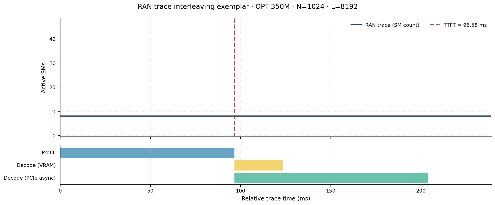
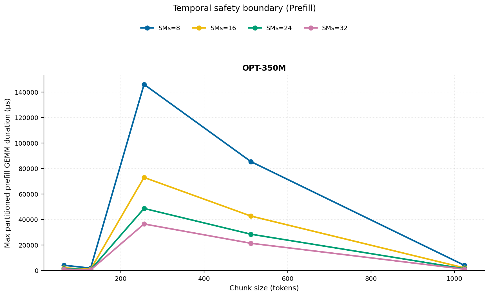
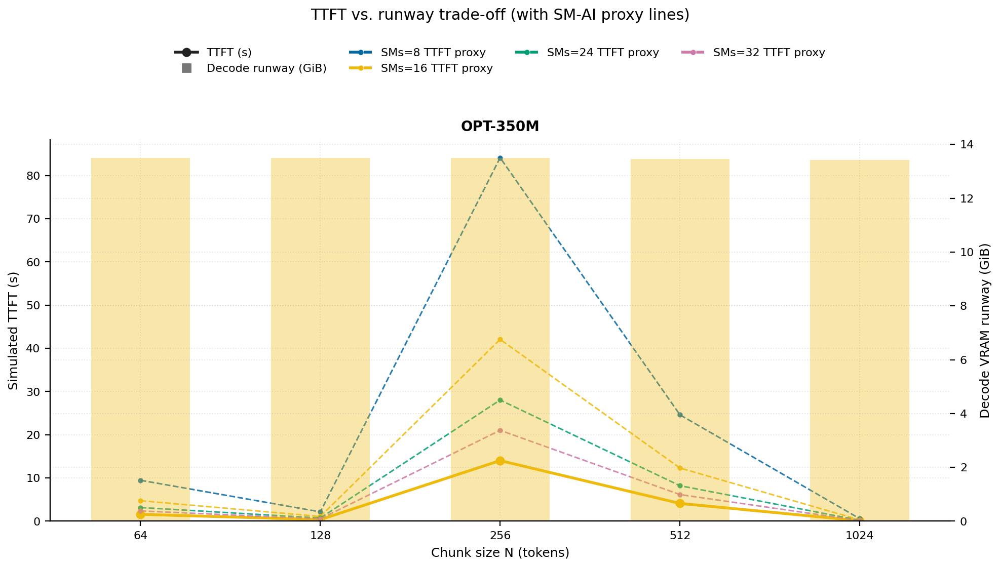
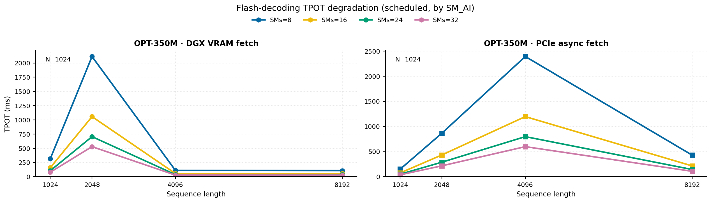
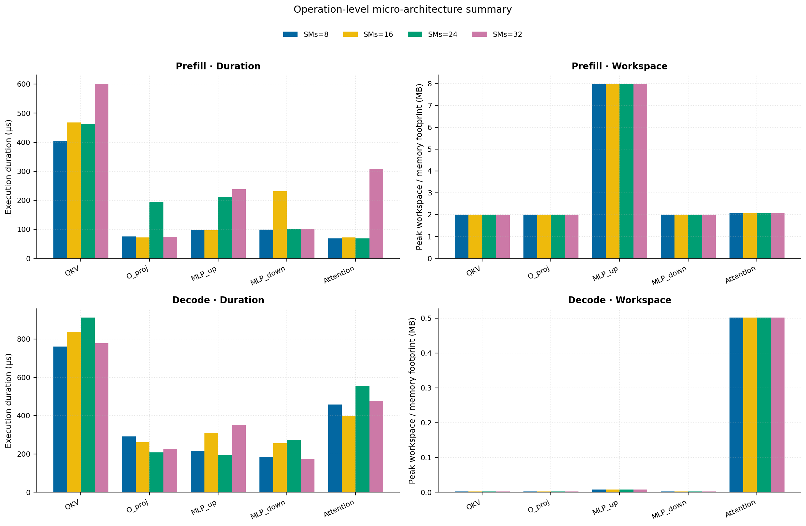
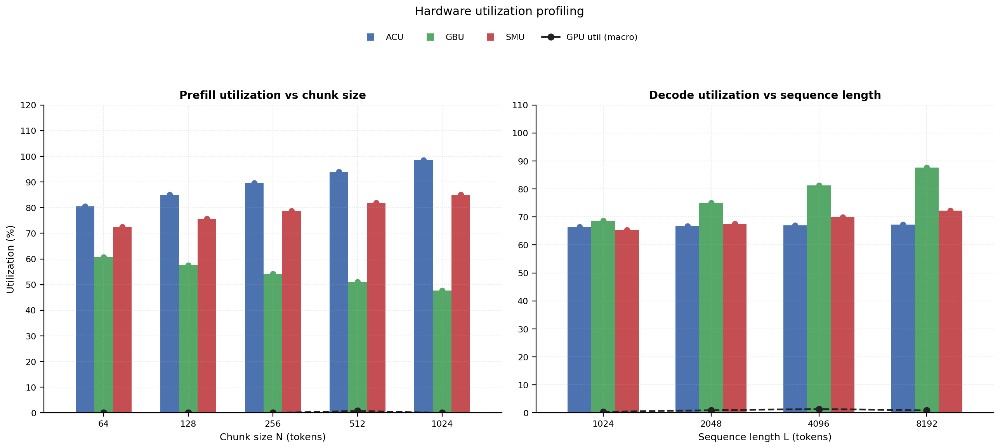
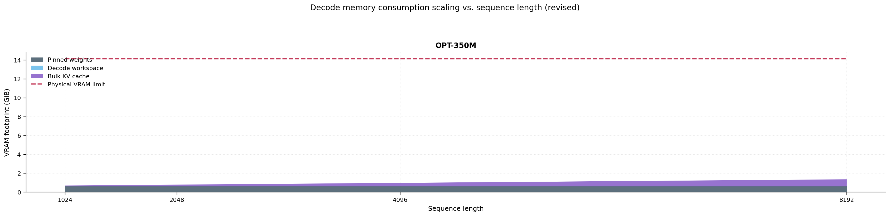
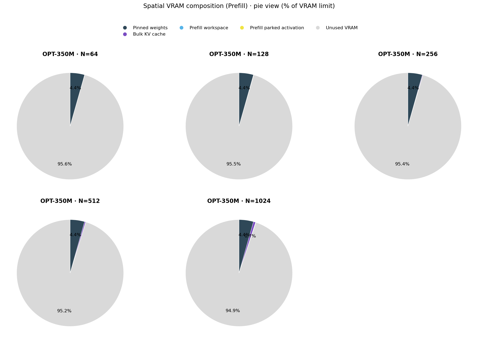

# RAN Inference Profiling Report

Run root: `/mnt/data/dheeraj/dicertation/inference-profile/runs/revised-rerun-20260415-145452-g1-opt350m`

## Environment

| field | value |
| --- | --- |
| cache_root | n/a |
| captured_at | 2026-04-15T13:55:01Z |
| chunk_sizes | [64, 128, 256, 512, 1024] |
| cuda_available | true |
| cuda_device_count | 8 |
| cwd | /mnt/data/dheeraj/dicertation/inference-profile |
| decode_modes | ["vram", "pcie_async"] |
| experiment_type | ran-dgxspark-v1 |
| gpu_id | 1 |
| l_out | 1024 |
| models | ["facebook/opt-350m"] |
| platform | Linux-6.8.0-106-generic-x86_64-with-glibc2.35 |
| python_executable | /home/dheeraj/miniconda3/envs/mls/bin/python |
| python_version | 3.11.14 |
| run_root | /mnt/data/dheeraj/dicertation/inference-profile/runs/revised-rerun-20260415-145452-g1-opt350m |
| scheduler | envelope_v1 |
| schema_version | ran_dgxspark_v1 |
| sequence_lengths | [1024, 2048, 4096, 8192] |
| sm_ai_cap | 32 |
| sm_ai_partition | 100 |
| sm_ai_partitions | [8, 16, 24, 32] |
| stage | profile |
| telemetry_tier | baseline_nvml_pt |
| timed_iterations | 5 |
| torch_available | true |
| torch_version | 2.10.0+cu128 |
| warmup_iterations | 3 |

## Model Constants

| model_id | sm_ai_partition | num_hidden_layers | hidden_size | num_attention_heads | ffn_dim | layer_index | layer_weight_bytes | total_weight_bytes_fp16 | vram_ceiling_bytes |
| --- | --- | --- | --- | --- | --- | --- | --- | --- | --- |
| facebook/opt-350m | 100 | 24 | 1024 | 16 | 4096 | 11 | 25192448 | 662392832 | 15170115993 |

## Trace Inspection

### Primary trace

| field | value |
| --- | --- |
| errors | [] |
| header | ["frame", "slot", "time_slot_sched_ns", "time_decode_start_est_ns", "time_decode_end_est_ns", "time_decode_start_actual_ns", "time_decode_end_actual_ns", "decode_dur_us", "deadline_met", "target_sm", "profile_idx", "sm_count", "num_pusch", "sum_prb", "sum_tbs_bytes", "max_mcs"] |
| median_positive_delta_ms | 5.6997 |
| monotonicity.checked_column | time_slot_sched_ns |
| monotonicity.is_non_decreasing | true |
| monotonicity.negative_delta_count | 0 |
| monotonicity.positive_delta_count | 28377 |
| monotonicity.zero_delta_count | 0 |
| normalization.last_row_duration_policy | median_positive_forward_delta_ms |
| normalization.output_columns | ["time_ms", "sm_utilization", "slot_duration_ms", "source_schema", "sm_count"] |
| normalization.output_relative_path | derived/normalized_ldpc_trace.csv |
| normalized_row_count | 28378 |
| path | /mnt/raid0sata2/netsys/weaver-ext/ran/traces/e2e_2026030418/e2e_20260304_182034_tractor_ran_ctrl/ldpc_trace.csv |
| row_count | 28378 |
| schema_detected | schema_b |
| time_unit_hint | ns |
| usable | true |
| usage_policy | primary_only |
| used_for_scheduler_capacity | true |

### Secondary trace

| field | value |
| --- | --- |
| errors | ["ran_ctrl_trace.csv line 182958 has 9 field(s); expected 12"] |
| header | ["frame", "slot", "sm_available", "prbs_available", "prbs_allocated", "w_avg_mcs_prev", "w_avg_mcs_curr", "slots_since_underutil", "ramp_up_count", "num_ue_sched", "max_ue_backlog", "sum_ue_backlog"] |
| monotonicity.checked_column | n/a |
| monotonicity.is_non_decreasing | n/a |
| monotonicity.negative_delta_count | n/a |
| path | /mnt/raid0sata2/netsys/weaver-ext/ran/traces/e2e_2026030418/e2e_20260304_182034_tractor_ran_ctrl/ran_ctrl_trace.csv |
| row_count | 182956 |
| time_unit_hints | [] |
| usable | false |
| usage_policy | structural_only |
| used_for_scheduler_capacity | false |

## Raw-Profile Summary Tables

### Prefill profile summary

Source raw rows: `raw/prefill_events.csv` = 700. Summary artifact: `derived/prefill_summary.csv`.

| model_id | chunk_tokens | sm_ai_partition | max_input_tokens | prefill_max_gemm_us | prefill_workspace_bytes | prefill_parked_activation_bytes | telemetry_tier | telemetry_provider | telemetry_status | nvml_available | gpu_util | gpu_mem_used_mb | sm_clock_mhz | mem_clock_mhz | power_w | pt_step_ms | pt_mem_alloc_mb | pt_mem_reserved_mb | pt_workspace_mb | acu_pct | gbu_pct | smu_pct | microscopic_telemetry_status | microscopic_error |
| --- | --- | --- | --- | --- | --- | --- | --- | --- | --- | --- | --- | --- | --- | --- | --- | --- | --- | --- | --- | --- | --- | --- | --- | --- |
| facebook/opt-350m | 64 | 8 | 1024 | 120.832 | 524288 | 524288 | baseline_nvml_pt | nvidia-smi | ok | true | 0 | 67 | 1695 | 7601 | 59.85 | 0.1208 | 34.6426 | 34.6426 | 0.5 | 71.1 | 70 | 62.1 | estimated | n/a |
| facebook/opt-350m | 64 | 16 | 1024 | 110.592 | 524288 | 524288 | baseline_nvml_pt | nvidia-smi | ok | true | 0 | 67 | 1695 | 7601 | 59.88 | 0.1106 | 34.6426 | 34.6426 | 0.5 | 77.4 | 63.84 | 69 | estimated | n/a |
| facebook/opt-350m | 64 | 24 | 1024 | 3002.368 | 524288 | 524288 | baseline_nvml_pt | nvidia-smi | ok | true | 0 | 67 | 1695 | 7601 | 60.68 | 3.0024 | 34.6426 | 34.6426 | 0.5 | 83.7 | 57.68 | 75.9 | estimated | n/a |
| facebook/opt-350m | 64 | 32 | 1024 | 171.072 | 524288 | 524288 | baseline_nvml_pt | nvidia-smi | ok | true | 0 | 67 | 1695 | 7601 | 60.59 | 0.1711 | 34.6426 | 34.6426 | 0.5 | 90 | 51.52 | 82.8 | estimated | n/a |
| facebook/opt-350m | 128 | 8 | 1024 | 147.456 | 1048576 | 1048576 | baseline_nvml_pt | nvidia-smi | ok | true | 0 | 67 | 1695 | 7601 | 60.59 | 0.1475 | 36.1426 | 36.1426 | 1 | 75.05 | 66.25 | 64.8 | estimated | n/a |
| facebook/opt-350m | 128 | 16 | 1024 | 84.992 | 1048576 | 1048576 | baseline_nvml_pt | nvidia-smi | ok | true | 0 | 67 | 1695 | 7601 | 60.73 | 0.2245 | 36.1426 | 36.1426 | 1 | 81.7 | 60.42 | 72 | estimated | n/a |
| facebook/opt-350m | 128 | 24 | 1024 | 3103.744 | 1048576 | 1048576 | baseline_nvml_pt | nvidia-smi | ok | true | 0 | 67 | 1695 | 7601 | 60.55 | 3.1037 | 36.1426 | 36.1426 | 1 | 88.35 | 54.59 | 79.2 | estimated | n/a |
| facebook/opt-350m | 128 | 32 | 1024 | 77.824 | 1048576 | 1048576 | baseline_nvml_pt | nvidia-smi | ok | true | 0 | 67 | 1695 | 7601 | 61.11 | 0.0778 | 36.1426 | 36.1426 | 1 | 95 | 48.76 | 86.4 | estimated | n/a |
| facebook/opt-350m | 256 | 8 | 1024 | 2983.8719 | 2097152 | 2097152 | baseline_nvml_pt | nvidia-smi | ok | true | 0 | 67 | 1695 | 8001 | 61.68 | 2.9839 | 39.1426 | 39.1426 | 2 | 79 | 62.5 | 67.5 | estimated | n/a |
| facebook/opt-350m | 256 | 16 | 1024 | 6098.9442 | 2097152 | 2097152 | baseline_nvml_pt | nvidia-smi | ok | true | 0 | 67 | 1695 | 7601 | 61.24 | 6.0989 | 39.1426 | 39.1426 | 2 | 86 | 57 | 75 | estimated | n/a |
| facebook/opt-350m | 256 | 24 | 1024 | 2924.448 | 2097152 | 2097152 | baseline_nvml_pt | nvidia-smi | ok | true | 0 | 67 | 1695 | 8001 | 61.42 | 2.9244 | 39.1426 | 39.1426 | 2 | 93 | 51.5 | 82.5 | estimated | n/a |
| facebook/opt-350m | 256 | 32 | 1024 | 6085.6318 | 2097152 | 2097152 | baseline_nvml_pt | nvidia-smi | ok | true | 0 | 67 | 1695 | 7601 | 60.95 | 6.0928 | 39.1426 | 39.1426 | 2 | 100 | 46 | 90 | estimated | n/a |
| facebook/opt-350m | 512 | 8 | 1024 | 1364.704 | 4194304 | 4194304 | baseline_nvml_pt | nvidia-smi | ok | true | 0 | 67 | 1695 | 7601 | 61.49 | 1.3647 | 45.1426 | 45.1426 | 4 | 82.95 | 58.75 | 70.2 | estimated | n/a |
| facebook/opt-350m | 512 | 16 | 1024 | 117.792 | 4194304 | 4194304 | baseline_nvml_pt | nvidia-smi | ok | true | 0 | 67 | 1695 | 8001 | 61.81 | 0.1178 | 45.1426 | 45.1426 | 4 | 90.3 | 53.58 | 78 | estimated | n/a |
| facebook/opt-350m | 512 | 24 | 1024 | 120.832 | 4194304 | 4194304 | baseline_nvml_pt | nvidia-smi | ok | true | 3 | 67 | 1695 | 7601 | 61.69 | 0.1208 | 45.1426 | 45.1426 | 4 | 97.65 | 48.41 | 85.8 | estimated | n/a |
| facebook/opt-350m | 512 | 32 | 1024 | 3561.3439 | 4194304 | 4194304 | baseline_nvml_pt | nvidia-smi | ok | true | 0 | 67 | 1695 | 7601 | 61.23 | 3.5613 | 45.1426 | 45.1426 | 4 | 100 | 43.24 | 93.6 | estimated | n/a |
| facebook/opt-350m | 1024 | 8 | 1024 | 168.96 | 8388608 | 8388608 | baseline_nvml_pt | nvidia-smi | ok | true | 0 | 67 | 1695 | 7601 | 62.09 | 0.169 | 57.1426 | 57.1426 | 8 | 86.9 | 55 | 72.9 | estimated | n/a |
| facebook/opt-350m | 1024 | 16 | 1024 | 3492.8639 | 8388608 | 8388608 | baseline_nvml_pt | nvidia-smi | ok | true | 0 | 67 | 1695 | 7601 | 61.66 | 3.4929 | 57.1426 | 57.1426 | 8 | 94.6 | 50.16 | 81 | estimated | n/a |
| facebook/opt-350m | 1024 | 24 | 1024 | 178.176 | 8388608 | 8388608 | baseline_nvml_pt | nvidia-smi | ok | true | 0 | 67 | 1695 | 7601 | 61.82 | 0.1782 | 57.1426 | 57.1426 | 8 | 100 | 45.32 | 89.1 | estimated | n/a |
| facebook/opt-350m | 1024 | 32 | 1024 | 167.68 | 8388608 | 8388608 | baseline_nvml_pt | nvidia-smi | ok | true | 0 | 67 | 1695 | 7601 | 62.25 | 0.1677 | 57.1426 | 57.1426 | 8 | 100 | 40.48 | 97.2 | estimated | n/a |

### Decode profile summary

Source raw rows: `raw/decode_events.csv` = 6400. Summary artifact: `derived/decode_summary.csv`.

| model_id | sequence_length | block_size | sm_ai_partition | decode_mode | decode_max_gemv_us | attention_fetch_compute_us | reduction_overhead_us | decode_workspace_bytes | decode_parked_activation_bytes | telemetry_tier | telemetry_provider | telemetry_status | nvml_available | gpu_util | gpu_mem_used_mb | sm_clock_mhz | mem_clock_mhz | power_w | pt_step_ms | pt_mem_alloc_mb | pt_mem_reserved_mb | pt_workspace_mb | acu_pct | gbu_pct | smu_pct | microscopic_telemetry_status | microscopic_error |
| --- | --- | --- | --- | --- | --- | --- | --- | --- | --- | --- | --- | --- | --- | --- | --- | --- | --- | --- | --- | --- | --- | --- | --- | --- | --- | --- | --- |
| facebook/opt-350m | 1024 | 64 | 8 | pcie_async | 1564.768 | 137.3696 | 26.592 | 67584 | 2048 | baseline_nvml_pt | nvidia-smi | ok | true | 7 | 67 | 1695 | 8001 | 62.09 | 1.5648 | 36.2188 | 36.2188 | 0.0645 | 58.195 | 75.69 | 56.64 | estimated | n/a |
| facebook/opt-350m | 1024 | 64 | 8 | vram | 268.352 | 136.5696 | 21.824 | 67584 | 2048 | baseline_nvml_pt | nvidia-smi | ok | true | 0 | 67 | 1695 | 7601 | 61.56 | 0.2684 | 36.2188 | 36.2188 | 0.0645 | 59.85 | 70.525 | 58.28 | estimated | n/a |
| facebook/opt-350m | 1024 | 64 | 16 | pcie_async | 174.08 | 133.1008 | 24.3584 | 67584 | 2048 | baseline_nvml_pt | nvidia-smi | ok | true | 7 | 67 | 1695 | 8001 | 62.16 | 0.1741 | 36.2188 | 36.2188 | 0.0645 | 62.83 | 73.08 | 61.44 | estimated | n/a |
| facebook/opt-350m | 1024 | 64 | 16 | vram | 166.048 | 163.2 | 23.7696 | 67584 | 2048 | baseline_nvml_pt | nvidia-smi | ok | true | 0 | 67 | 1695 | 7601 | 61.85 | 0.1833 | 36.2188 | 36.2188 | 0.0645 | 64.6 | 68.25 | 63.92 | estimated | n/a |
| facebook/opt-350m | 1024 | 64 | 24 | pcie_async | 143.072 | 131.3024 | 22.5472 | 67584 | 2048 | baseline_nvml_pt | nvidia-smi | ok | true | 0 | 67 | 1695 | 8001 | 62.13 | 0.1431 | 36.2188 | 36.2188 | 0.0645 | 67.465 | 70.47 | 66.24 | estimated | n/a |
| facebook/opt-350m | 1024 | 64 | 24 | vram | 198.656 | 141.4656 | 21.536 | 67584 | 2048 | baseline_nvml_pt | nvidia-smi | ok | true | 0 | 67 | 1695 | 7601 | 61.21 | 0.1987 | 36.2188 | 36.2188 | 0.0645 | 69.35 | 65.975 | 69.56 | estimated | n/a |
| facebook/opt-350m | 1024 | 64 | 32 | pcie_async | 175.104 | 164.48 | 26.5344 | 67584 | 2048 | baseline_nvml_pt | nvidia-smi | ok | true | 0 | 67 | 1695 | 7601 | 61.97 | 0.1927 | 36.2188 | 36.2188 | 0.0645 | 72.1 | 67.86 | 71.04 | estimated | n/a |
| facebook/opt-350m | 1024 | 64 | 32 | vram | 3105.696 | 134.8288 | 21.9264 | 67584 | 2048 | baseline_nvml_pt | nvidia-smi | ok | true | 0 | 67 | 1695 | 7601 | 61.95 | 3.1057 | 36.2188 | 36.2188 | 0.0645 | 74.1 | 63.7 | 75.2 | estimated | n/a |
| facebook/opt-350m | 1024 | 128 | 8 | pcie_async | 1514.496 | 138.0352 | 22.496 | 67584 | 2048 | baseline_nvml_pt | nvidia-smi | ok | true | 0 | 67 | 1695 | 7601 | 61.85 | 1.5145 | 36.2188 | 36.2188 | 0.0645 | 58.195 | 75.255 | 56.64 | estimated | n/a |
| facebook/opt-350m | 1024 | 128 | 8 | vram | 162.816 | 154.8288 | 25.8496 | 67584 | 2048 | baseline_nvml_pt | nvidia-smi | ok | true | 0 | 67 | 1695 | 7601 | 62.13 | 0.1965 | 36.2188 | 36.2188 | 0.0645 | 60.165 | 70.1375 | 58.28 | estimated | n/a |
| facebook/opt-350m | 1024 | 128 | 16 | pcie_async | 249.856 | 141.888 | 25.1456 | 67584 | 2048 | baseline_nvml_pt | nvidia-smi | ok | true | 0 | 67 | 1695 | 7601 | 62.46 | 0.2499 | 36.2188 | 36.2188 | 0.0645 | 62.83 | 72.66 | 61.44 | estimated | n/a |
| facebook/opt-350m | 1024 | 128 | 16 | vram | 281.6 | 143.1104 | 23.1424 | 67584 | 2048 | baseline_nvml_pt | nvidia-smi | ok | true | 0 | 67 | 1695 | 7601 | 62.12 | 0.2816 | 36.2188 | 36.2188 | 0.0645 | 64.94 | 67.875 | 63.92 | estimated | n/a |
| facebook/opt-350m | 1024 | 128 | 24 | pcie_async | 227.264 | 869.984 | 33.3888 | 67584 | 2048 | baseline_nvml_pt | nvidia-smi | ok | true | 0 | 67 | 1695 | 7601 | 62.19 | 3.1724 | 36.2188 | 36.2188 | 0.0645 | 67.465 | 70.065 | 66.24 | estimated | n/a |
| facebook/opt-350m | 1024 | 128 | 24 | vram | 3394.5601 | 1624.1024 | 32.3072 | 67584 | 2048 | baseline_nvml_pt | nvidia-smi | ok | true | 0 | 67 | 1695 | 7601 | 62.52 | 4.0192 | 36.2188 | 36.2188 | 0.0645 | 69.715 | 65.6125 | 69.56 | estimated | n/a |
| facebook/opt-350m | 1024 | 128 | 32 | pcie_async | 3153.9199 | 138.0352 | 21.2672 | 67584 | 2048 | baseline_nvml_pt | nvidia-smi | ok | true | 1 | 67 | 1695 | 7601 | 62.24 | 3.1539 | 36.2188 | 36.2188 | 0.0645 | 72.1 | 67.47 | 71.04 | estimated | n/a |
| facebook/opt-350m | 1024 | 128 | 32 | vram | 173.856 | 167.3536 | 25.3888 | 67584 | 2048 | baseline_nvml_pt | nvidia-smi | ok | true | 0 | 67 | 1695 | 7601 | 62.28 | 0.1874 | 36.2188 | 36.2188 | 0.0645 | 74.49 | 63.35 | 75.2 | estimated | n/a |
| facebook/opt-350m | 1024 | 256 | 8 | pcie_async | 3426.3041 | 135.3728 | 22.7456 | 67584 | 2048 | baseline_nvml_pt | nvidia-smi | ok | true | 0 | 67 | 1695 | 7601 | 62.43 | 3.4263 | 36.2188 | 36.2188 | 0.0645 | 58.195 | 74.82 | 56.64 | estimated | n/a |
| facebook/opt-350m | 1024 | 256 | 8 | vram | 197.472 | 136.8064 | 25.0432 | 67584 | 2048 | baseline_nvml_pt | nvidia-smi | ok | true | 0 | 67 | 1695 | 7601 | 62.42 | 0.1975 | 36.2188 | 36.2188 | 0.0645 | 60.48 | 69.75 | 58.28 | estimated | n/a |
| facebook/opt-350m | 1024 | 256 | 16 | pcie_async | 349.184 | 136.0448 | 21.0048 | 67584 | 2048 | baseline_nvml_pt | nvidia-smi | ok | true | 0 | 67 | 1695 | 8001 | 63.14 | 0.3492 | 36.2188 | 36.2188 | 0.0645 | 62.83 | 72.24 | 61.44 | estimated | n/a |
| facebook/opt-350m | 1024 | 256 | 16 | vram | 3381.248 | 141.7472 | 23.5712 | 67584 | 2048 | baseline_nvml_pt | nvidia-smi | ok | true | 0 | 67 | 1695 | 7601 | 62.68 | 3.3812 | 36.2188 | 36.2188 | 0.0645 | 65.28 | 67.5 | 63.92 | estimated | n/a |
| facebook/opt-350m | 1024 | 256 | 24 | pcie_async | 3121.1519 | 143.936 | 23.9616 | 67584 | 2048 | baseline_nvml_pt | nvidia-smi | ok | true | 0 | 67 | 1695 | 7601 | 62.48 | 3.1212 | 36.2188 | 36.2188 | 0.0645 | 67.465 | 69.66 | 66.24 | estimated | n/a |
| facebook/opt-350m | 1024 | 256 | 24 | vram | 368.544 | 198.8416 | 35.6672 | 67584 | 2048 | baseline_nvml_pt | nvidia-smi | ok | true | 0 | 67 | 1695 | 8001 | 63.33 | 0.3685 | 36.2188 | 36.2188 | 0.0645 | 70.08 | 65.25 | 69.56 | estimated | n/a |
| facebook/opt-350m | 1024 | 256 | 32 | pcie_async | 167.936 | 174.3488 | 25.5808 | 67584 | 2048 | baseline_nvml_pt | nvidia-smi | ok | true | 0 | 67 | 1695 | 7601 | 62.54 | 0.1864 | 36.2188 | 36.2188 | 0.0645 | 72.1 | 67.08 | 71.04 | estimated | n/a |
| facebook/opt-350m | 1024 | 256 | 32 | vram | 141.312 | 835.3408 | 21.8752 | 67584 | 2048 | baseline_nvml_pt | nvidia-smi | ok | true | 0 | 67 | 1695 | 7601 | 62.6 | 3.6393 | 36.2188 | 36.2188 | 0.0645 | 74.88 | 63 | 75.2 | estimated | n/a |
| facebook/opt-350m | 1024 | 512 | 8 | pcie_async | 224.256 | 133.12 | 21.8624 | 67584 | 2048 | baseline_nvml_pt | nvidia-smi | ok | true | 0 | 67 | 1695 | 7601 | 63.1 | 0.2243 | 36.2188 | 36.2188 | 0.0645 | 58.195 | 74.385 | 56.64 | estimated | n/a |
| facebook/opt-350m | 1024 | 512 | 8 | vram | 206.848 | 133.5616 | 22.72 | 67584 | 2048 | baseline_nvml_pt | nvidia-smi | ok | true | 0 | 67 | 1695 | 7601 | 62.84 | 0.2068 | 36.2188 | 36.2188 | 0.0645 | 60.795 | 69.3625 | 58.28 | estimated | n/a |
| facebook/opt-350m | 1024 | 512 | 16 | pcie_async | 3585.0241 | 147.0464 | 22.72 | 67584 | 2048 | baseline_nvml_pt | nvidia-smi | ok | true | 0 | 67 | 1695 | 7601 | 62.37 | 3.585 | 36.2188 | 36.2188 | 0.0645 | 62.83 | 71.82 | 61.44 | estimated | n/a |
| facebook/opt-350m | 1024 | 512 | 16 | vram | 3836.9279 | 137.0176 | 21.152 | 67584 | 2048 | baseline_nvml_pt | nvidia-smi | ok | true | 0 | 67 | 1695 | 7601 | 62.23 | 3.8369 | 36.2188 | 36.2188 | 0.0645 | 65.62 | 67.125 | 63.92 | estimated | n/a |
| facebook/opt-350m | 1024 | 512 | 24 | pcie_async | 288.768 | 168.7232 | 24.0512 | 67584 | 2048 | baseline_nvml_pt | nvidia-smi | ok | true | 0 | 67 | 1695 | 7601 | 62.44 | 0.2888 | 36.2188 | 36.2188 | 0.0645 | 67.465 | 69.255 | 66.24 | estimated | n/a |
| facebook/opt-350m | 1024 | 512 | 24 | vram | 3338.0799 | 208.4864 | 38.0416 | 67584 | 2048 | baseline_nvml_pt | nvidia-smi | ok | true | 0 | 67 | 1695 | 8001 | 62.85 | 3.3381 | 36.2188 | 36.2188 | 0.0645 | 70.445 | 64.8875 | 69.56 | estimated | n/a |
| facebook/opt-350m | 1024 | 512 | 32 | pcie_async | 238.688 | 139.5328 | 21.9008 | 67584 | 2048 | baseline_nvml_pt | nvidia-smi | ok | true | 0 | 67 | 1695 | 7601 | 62.71 | 0.2387 | 36.2188 | 36.2188 | 0.0645 | 72.1 | 66.69 | 71.04 | estimated | n/a |
| facebook/opt-350m | 1024 | 512 | 32 | vram | 181.024 | 139.4752 | 22.88 | 67584 | 2048 | baseline_nvml_pt | nvidia-smi | ok | true | 0 | 67 | 1695 | 8001 | 63.08 | 0.181 | 36.2188 | 36.2188 | 0.0645 | 75.27 | 62.65 | 75.2 | estimated | n/a |
| facebook/opt-350m | 1024 | 1024 | 8 | pcie_async | 164.864 | 139.1488 | 21.1328 | 67584 | 2048 | baseline_nvml_pt | nvidia-smi | ok | true | 0 | 67 | 1695 | 7601 | 62.69 | 0.1649 | 36.2188 | 36.2188 | 0.0645 | 58.195 | 73.95 | 56.64 | estimated | n/a |
| facebook/opt-350m | 1024 | 1024 | 8 | vram | 200.864 | 172.2112 | 22.3296 | 67584 | 2048 | baseline_nvml_pt | nvidia-smi | ok | true | 0 | 67 | 1695 | 7601 | 63.12 | 0.2693 | 36.2188 | 36.2188 | 0.0645 | 61.11 | 68.975 | 58.28 | estimated | n/a |
| facebook/opt-350m | 1024 | 1024 | 16 | pcie_async | 187.296 | 132.7168 | 21.7024 | 67584 | 2048 | baseline_nvml_pt | nvidia-smi | ok | true | 0 | 67 | 1695 | 8001 | 62.74 | 0.1873 | 36.2188 | 36.2188 | 0.0645 | 62.83 | 71.4 | 61.44 | estimated | n/a |
| facebook/opt-350m | 1024 | 1024 | 16 | vram | 159.744 | 129.0688 | 22.0288 | 67584 | 2048 | baseline_nvml_pt | nvidia-smi | ok | true | 0 | 67 | 1695 | 7601 | 62.34 | 0.1597 | 36.2188 | 36.2188 | 0.0645 | 65.96 | 66.75 | 63.92 | estimated | n/a |
| facebook/opt-350m | 1024 | 1024 | 24 | pcie_async | 148.48 | 129.0752 | 20.4544 | 67584 | 2048 | baseline_nvml_pt | nvidia-smi | ok | true | 0 | 67 | 1695 | 7601 | 62.79 | 0.1485 | 36.2188 | 36.2188 | 0.0645 | 67.465 | 68.85 | 66.24 | estimated | n/a |
| facebook/opt-350m | 1024 | 1024 | 24 | vram | 159.616 | 776.512 | 22.7328 | 67584 | 2048 | baseline_nvml_pt | nvidia-smi | ok | true | 0 | 67 | 1695 | 7601 | 62.78 | 3.3577 | 36.2188 | 36.2188 | 0.0645 | 70.81 | 64.525 | 69.56 | estimated | n/a |
| facebook/opt-350m | 1024 | 1024 | 32 | pcie_async | 173.056 | 163.7376 | 23.9488 | 67584 | 2048 | baseline_nvml_pt | nvidia-smi | ok | true | 0 | 67 | 1695 | 8001 | 63.41 | 0.2089 | 36.2188 | 36.2188 | 0.0645 | 72.1 | 66.3 | 71.04 | estimated | n/a |
| facebook/opt-350m | 1024 | 1024 | 32 | vram | 518.144 | 170.8544 | 24.4288 | 67584 | 2048 | baseline_nvml_pt | nvidia-smi | ok | true | 0 | 67 | 1695 | 7601 | 62.71 | 0.5181 | 36.2188 | 36.2188 | 0.0645 | 75.66 | 62.3 | 75.2 | estimated | n/a |
| facebook/opt-350m | 2048 | 64 | 8 | pcie_async | 132.096 | 130.6176 | 22.0416 | 133120 | 2048 | baseline_nvml_pt | nvidia-smi | ok | true | 0 | 67 | 1695 | 7601 | 62.61 | 0.1352 | 40.2812 | 40.2812 | 0.127 | 57.065 | 82.07 | 57.82 | estimated | n/a |
| facebook/opt-350m | 2048 | 64 | 8 | vram | 139.52 | 133.1008 | 21.12 | 133120 | 2048 | baseline_nvml_pt | nvidia-smi | ok | true | 0 | 67 | 1695 | 7601 | 62.7 | 0.1423 | 40.2812 | 40.2812 | 0.127 | 61.11 | 74.6583 | 60.3467 | estimated | n/a |
| facebook/opt-350m | 2048 | 64 | 16 | pcie_async | 143.36 | 167.1104 | 23.1104 | 133120 | 2048 | baseline_nvml_pt | nvidia-smi | ok | true | 0 | 67 | 1695 | 7601 | 62.33 | 0.1998 | 40.2812 | 40.2812 | 0.127 | 61.61 | 79.24 | 62.72 | estimated | n/a |
| facebook/opt-350m | 2048 | 64 | 16 | vram | 153.856 | 142.9184 | 20.1216 | 133120 | 2048 | baseline_nvml_pt | nvidia-smi | ok | true | 0 | 67 | 1695 | 7601 | 62.31 | 0.1772 | 40.2812 | 40.2812 | 0.127 | 65.96 | 72.25 | 66.1867 | estimated | n/a |
| facebook/opt-350m | 2048 | 64 | 24 | pcie_async | 3203.0721 | 136.1152 | 22.9696 | 133120 | 2048 | baseline_nvml_pt | nvidia-smi | ok | true | 0 | 67 | 1695 | 7601 | 62.65 | 3.2031 | 40.2812 | 40.2812 | 0.127 | 66.155 | 76.41 | 67.62 | estimated | n/a |
| facebook/opt-350m | 2048 | 64 | 24 | vram | 178.272 | 167.5904 | 21.9584 | 133120 | 2048 | baseline_nvml_pt | nvidia-smi | ok | true | 0 | 67 | 1695 | 7601 | 62.23 | 0.2869 | 40.2812 | 40.2812 | 0.127 | 70.81 | 69.8417 | 72.0267 | estimated | n/a |
| facebook/opt-350m | 2048 | 64 | 32 | pcie_async | 3800.0641 | 817.824 | 20.9024 | 133120 | 2048 | baseline_nvml_pt | nvidia-smi | ok | true | 0 | 67 | 1695 | 7601 | 62.46 | 3.8001 | 40.2812 | 40.2812 | 0.127 | 70.7 | 73.58 | 72.52 | estimated | n/a |
| facebook/opt-350m | 2048 | 64 | 32 | vram | 300.032 | 133.3632 | 20.7808 | 133120 | 2048 | baseline_nvml_pt | nvidia-smi | ok | true | 0 | 67 | 1695 | 7601 | 62.47 | 0.3 | 40.2812 | 40.2812 | 0.127 | 75.66 | 67.4333 | 77.8667 | estimated | n/a |
| facebook/opt-350m | 2048 | 128 | 8 | pcie_async | 147.456 | 281.376 | 23.5712 | 133120 | 2048 | baseline_nvml_pt | nvidia-smi | ok | true | 1 | 67 | 1695 | 7601 | 62.52 | 0.5927 | 40.2812 | 40.2812 | 0.127 | 57.065 | 82.505 | 58.0167 | estimated | n/a |
| facebook/opt-350m | 2048 | 128 | 8 | vram | 217.088 | 170.368 | 25.9008 | 133120 | 2048 | baseline_nvml_pt | nvidia-smi | ok | true | 7 | 67 | 1695 | 7601 | 61.92 | 0.2364 | 40.2812 | 40.2812 | 0.127 | 61.635 | 74.7875 | 60.5533 | estimated | n/a |
| facebook/opt-350m | 2048 | 128 | 16 | pcie_async | 176.288 | 196.4224 | 25.7856 | 133120 | 2048 | baseline_nvml_pt | nvidia-smi | ok | true | 0 | 67 | 1695 | 7601 | 62.31 | 0.3234 | 40.2812 | 40.2812 | 0.127 | 61.61 | 79.66 | 62.9333 | estimated | n/a |
| facebook/opt-350m | 2048 | 128 | 16 | vram | 6093.76 | 149.6832 | 22.912 | 133120 | 2048 | baseline_nvml_pt | nvidia-smi | ok | true | 0 | 67 | 1695 | 8001 | 62.76 | 6.0938 | 40.2812 | 40.2812 | 0.127 | 66.5267 | 72.375 | 66.4133 | estimated | n/a |
| facebook/opt-350m | 2048 | 128 | 24 | pcie_async | 210.944 | 134.976 | 21.92 | 133120 | 2048 | baseline_nvml_pt | nvidia-smi | ok | true | 0 | 67 | 1695 | 7601 | 62.76 | 0.2109 | 40.2812 | 40.2812 | 0.127 | 66.155 | 76.815 | 67.85 | estimated | n/a |
| facebook/opt-350m | 2048 | 128 | 24 | vram | 1553.408 | 165.3056 | 22.7392 | 133120 | 2048 | baseline_nvml_pt | nvidia-smi | ok | true | 0 | 67 | 1695 | 7601 | 62.76 | 1.5534 | 40.2812 | 40.2812 | 0.127 | 71.4183 | 69.9625 | 72.2733 | estimated | n/a |
| facebook/opt-350m | 2048 | 128 | 32 | pcie_async | 180.224 | 142.1376 | 24.1344 | 133120 | 2048 | baseline_nvml_pt | nvidia-smi | ok | true | 0 | 67 | 1695 | 7601 | 62.28 | 0.1802 | 40.2812 | 40.2812 | 0.127 | 70.7 | 73.97 | 72.7667 | estimated | n/a |
| facebook/opt-350m | 2048 | 128 | 32 | vram | 245.856 | 189.696 | 24.6016 | 133120 | 2048 | baseline_nvml_pt | nvidia-smi | ok | true | 0 | 67 | 1695 | 7601 | 62.53 | 0.2981 | 40.2812 | 40.2812 | 0.127 | 76.31 | 67.55 | 78.1333 | estimated | n/a |
| facebook/opt-350m | 2048 | 256 | 8 | pcie_async | 3164.0961 | 137.824 | 21.3312 | 133120 | 2048 | baseline_nvml_pt | nvidia-smi | ok | true | 0 | 67 | 1695 | 7601 | 62.31 | 3.1641 | 40.2812 | 40.2812 | 0.127 | 57.065 | 82.94 | 58.2133 | estimated | n/a |
| facebook/opt-350m | 2048 | 256 | 8 | vram | 147.456 | 141.2544 | 22.528 | 133120 | 2048 | baseline_nvml_pt | nvidia-smi | ok | true | 2 | 67 | 1695 | 7601 | 62.1 | 0.1504 | 40.2812 | 40.2812 | 0.127 | 62.16 | 74.9167 | 60.76 | estimated | n/a |
| facebook/opt-350m | 2048 | 256 | 16 | pcie_async | 145.248 | 135.3344 | 22.5216 | 133120 | 2048 | baseline_nvml_pt | nvidia-smi | ok | true | 0 | 67 | 1695 | 7601 | 62.82 | 0.1505 | 40.2812 | 40.2812 | 0.127 | 61.61 | 80.08 | 63.1467 | estimated | n/a |
| facebook/opt-350m | 2048 | 256 | 16 | vram | 421.888 | 165.1584 | 21.6832 | 133120 | 2048 | baseline_nvml_pt | nvidia-smi | ok | true | 1 | 67 | 1695 | 7601 | 62.74 | 0.4219 | 40.2812 | 40.2812 | 0.127 | 67.0933 | 72.5 | 66.64 | estimated | n/a |
| facebook/opt-350m | 2048 | 256 | 24 | pcie_async | 3421.4399 | 131.3216 | 21.408 | 133120 | 2048 | baseline_nvml_pt | nvidia-smi | ok | true | 7 | 67 | 1695 | 8001 | 62.99 | 3.4214 | 40.2812 | 40.2812 | 0.127 | 66.155 | 77.22 | 68.08 | estimated | n/a |
| facebook/opt-350m | 2048 | 256 | 24 | vram | 154.4 | 140.4992 | 21.3568 | 133120 | 2048 | baseline_nvml_pt | nvidia-smi | ok | true | 0 | 67 | 1695 | 7601 | 62.81 | 0.1781 | 40.2812 | 40.2812 | 0.127 | 72.0267 | 70.0833 | 72.52 | estimated | n/a |
| facebook/opt-350m | 2048 | 256 | 32 | pcie_async | 3855.5839 | 198.8288 | 21.6576 | 133120 | 2048 | baseline_nvml_pt | nvidia-smi | ok | true | 0 | 67 | 1695 | 7601 | 62.41 | 3.8556 | 40.2812 | 40.2812 | 0.127 | 70.7 | 74.36 | 73.0133 | estimated | n/a |
| facebook/opt-350m | 2048 | 256 | 32 | vram | 3366.1759 | 137.2224 | 23.9424 | 133120 | 2048 | baseline_nvml_pt | nvidia-smi | ok | true | 0 | 67 | 1695 | 8001 | 62.69 | 3.3662 | 40.2812 | 40.2812 | 0.127 | 76.96 | 67.6667 | 78.4 | estimated | n/a |
| facebook/opt-350m | 2048 | 512 | 8 | pcie_async | 143.392 | 154.6688 | 22.4512 | 133120 | 2048 | baseline_nvml_pt | nvidia-smi | ok | true | 7 | 67 | 1695 | 8001 | 62.72 | 0.2428 | 40.2812 | 40.2812 | 0.127 | 57.065 | 83.375 | 58.41 | estimated | n/a |
| facebook/opt-350m | 2048 | 512 | 8 | vram | 3168.1919 | 160.8576 | 21.0624 | 133120 | 2048 | baseline_nvml_pt | nvidia-smi | ok | true | 0 | 67 | 1695 | 7601 | 62.53 | 3.1682 | 40.2812 | 40.2812 | 0.127 | 62.685 | 75.0458 | 60.9667 | estimated | n/a |
| facebook/opt-350m | 2048 | 512 | 16 | pcie_async | 9103.1675 | 129.6512 | 22.144 | 133120 | 2048 | baseline_nvml_pt | nvidia-smi | ok | true | 6 | 67 | 1695 | 7601 | 62.13 | 9.1032 | 40.2812 | 40.2812 | 0.127 | 61.61 | 80.5 | 63.36 | estimated | n/a |
| facebook/opt-350m | 2048 | 512 | 16 | vram | 3110.1761 | 751.648 | 22.3104 | 133120 | 2048 | baseline_nvml_pt | nvidia-smi | ok | true | 0 | 67 | 1695 | 7601 | 62.12 | 3.2155 | 40.2812 | 40.2812 | 0.127 | 67.66 | 72.625 | 66.8667 | estimated | n/a |
| facebook/opt-350m | 2048 | 512 | 24 | pcie_async | 6110.3039 | 130.2208 | 22.8352 | 133120 | 2048 | baseline_nvml_pt | nvidia-smi | ok | true | 0 | 67 | 1695 | 8001 | 62.85 | 6.1103 | 40.2812 | 40.2812 | 0.127 | 66.155 | 77.625 | 68.31 | estimated | n/a |
| facebook/opt-350m | 2048 | 512 | 24 | vram | 3806.0801 | 793.8752 | 21.2864 | 133120 | 2048 | baseline_nvml_pt | nvidia-smi | ok | true | 7 | 67 | 1695 | 8001 | 62.85 | 3.8061 | 40.2812 | 40.2812 | 0.127 | 72.635 | 70.2042 | 72.7667 | estimated | n/a |
| facebook/opt-350m | 2048 | 512 | 32 | pcie_async | 179.104 | 154.5728 | 22.5984 | 133120 | 2048 | baseline_nvml_pt | nvidia-smi | ok | true | 0 | 67 | 1695 | 8001 | 63.15 | 0.2335 | 40.2812 | 40.2812 | 0.127 | 70.7 | 74.75 | 73.26 | estimated | n/a |
| facebook/opt-350m | 2048 | 512 | 32 | vram | 165.888 | 136.896 | 22.5792 | 133120 | 2048 | baseline_nvml_pt | nvidia-smi | ok | true | 0 | 67 | 1695 | 7601 | 62.55 | 0.1659 | 40.2812 | 40.2812 | 0.127 | 77.61 | 67.7833 | 78.6667 | estimated | n/a |
| facebook/opt-350m | 2048 | 1024 | 8 | pcie_async | 187.392 | 162.4 | 28.4928 | 133120 | 2048 | baseline_nvml_pt | nvidia-smi | ok | true | 0 | 67 | 1695 | 7601 | 62.31 | 0.1874 | 40.2812 | 40.2812 | 0.127 | 57.065 | 83.81 | 58.6067 | estimated | n/a |
| facebook/opt-350m | 2048 | 1024 | 8 | vram | 307.232 | 136.704 | 23.5072 | 133120 | 2048 | baseline_nvml_pt | nvidia-smi | ok | true | 0 | 67 | 1695 | 8001 | 62.84 | 0.3072 | 40.2812 | 40.2812 | 0.127 | 63.21 | 75.175 | 61.1733 | estimated | n/a |
| facebook/opt-350m | 2048 | 1024 | 16 | pcie_async | 149.504 | 130.3168 | 20.096 | 133120 | 2048 | baseline_nvml_pt | nvidia-smi | ok | true | 0 | 67 | 1695 | 7601 | 62.67 | 0.1495 | 40.2812 | 40.2812 | 0.127 | 61.61 | 80.92 | 63.5733 | estimated | n/a |
| facebook/opt-350m | 2048 | 1024 | 16 | vram | 157.696 | 135.3152 | 21.5104 | 133120 | 2048 | baseline_nvml_pt | nvidia-smi | ok | true | 0 | 67 | 1695 | 7601 | 62.32 | 0.1577 | 40.2812 | 40.2812 | 0.127 | 68.2267 | 72.75 | 67.0933 | estimated | n/a |
| facebook/opt-350m | 2048 | 1024 | 24 | pcie_async | 256.096 | 169.5808 | 23.0848 | 133120 | 2048 | baseline_nvml_pt | nvidia-smi | ok | true | 0 | 67 | 1695 | 7601 | 62.59 | 0.2561 | 40.2812 | 40.2812 | 0.127 | 66.155 | 78.03 | 68.54 | estimated | n/a |
| facebook/opt-350m | 2048 | 1024 | 24 | vram | 214.848 | 131.04 | 19.968 | 133120 | 2048 | baseline_nvml_pt | nvidia-smi | ok | true | 0 | 67 | 1695 | 7601 | 62.61 | 0.2148 | 40.2812 | 40.2812 | 0.127 | 73.2433 | 70.325 | 73.0133 | estimated | n/a |
| facebook/opt-350m | 2048 | 1024 | 32 | pcie_async | 1363.968 | 140.4736 | 20.992 | 133120 | 2048 | baseline_nvml_pt | nvidia-smi | ok | true | 0 | 67 | 1695 | 7601 | 62.37 | 1.364 | 40.2812 | 40.2812 | 0.127 | 70.7 | 75.14 | 73.5067 | estimated | n/a |
| facebook/opt-350m | 2048 | 1024 | 32 | vram | 3520.3199 | 876.8896 | 26.4384 | 133120 | 2048 | baseline_nvml_pt | nvidia-smi | ok | true | 0 | 67 | 1695 | 7601 | 62.52 | 3.8552 | 40.2812 | 40.2812 | 0.127 | 78.26 | 67.9 | 78.9333 | estimated | n/a |
| facebook/opt-350m | 4096 | 64 | 8 | pcie_async | 140.416 | 133.9072 | 20.7232 | 264192 | 2048 | baseline_nvml_pt | nvidia-smi | ok | true | 0 | 67 | 1695 | 7601 | 62.35 | 0.1412 | 48.4062 | 48.4062 | 0.252 | 55.935 | 88.45 | 59 | estimated | n/a |
| facebook/opt-350m | 4096 | 64 | 8 | vram | 179.456 | 136.992 | 21.1456 | 264192 | 2048 | baseline_nvml_pt | nvidia-smi | ok | true | 8 | 67 | 1695 | 7601 | 59.08 | 0.1795 | 48.4062 | 48.4062 | 0.252 | 62.37 | 78.7917 | 62.4133 | estimated | n/a |
| facebook/opt-350m | 4096 | 64 | 16 | pcie_async | 228.096 | 149.9968 | 21.312 | 264192 | 2048 | baseline_nvml_pt | nvidia-smi | ok | true | 0 | 67 | 1695 | 7601 | 62.74 | 0.2281 | 48.4062 | 48.4062 | 0.252 | 60.39 | 85.4 | 64 | estimated | n/a |
| facebook/opt-350m | 4096 | 64 | 16 | vram | 140.576 | 152.1408 | 20.7488 | 264192 | 2048 | baseline_nvml_pt | nvidia-smi | ok | true | 0 | 67 | 1695 | 7601 | 62.11 | 0.1843 | 48.4062 | 48.4062 | 0.252 | 67.32 | 76.25 | 68.4533 | estimated | n/a |
| facebook/opt-350m | 4096 | 64 | 24 | pcie_async | 160.768 | 132.7168 | 23.4304 | 264192 | 2048 | baseline_nvml_pt | nvidia-smi | ok | true | 0 | 67 | 1695 | 7601 | 62.38 | 0.1608 | 48.4062 | 48.4062 | 0.252 | 64.845 | 82.35 | 69 | estimated | n/a |
| facebook/opt-350m | 4096 | 64 | 24 | vram | 235.52 | 131.7376 | 20.3456 | 264192 | 2048 | baseline_nvml_pt | nvidia-smi | ok | true | 0 | 67 | 1695 | 8001 | 62.83 | 0.2355 | 48.4062 | 48.4062 | 0.252 | 72.27 | 73.7083 | 74.4933 | estimated | n/a |
| facebook/opt-350m | 4096 | 64 | 32 | pcie_async | 3307.5199 | 137.5936 | 20.9024 | 264192 | 2048 | baseline_nvml_pt | nvidia-smi | ok | true | 0 | 67 | 1695 | 7601 | 62.63 | 3.3075 | 48.4062 | 48.4062 | 0.252 | 69.3 | 79.3 | 74 | estimated | n/a |
| facebook/opt-350m | 4096 | 64 | 32 | vram | 222.176 | 150.5472 | 517.7792 | 264192 | 2048 | baseline_nvml_pt | nvidia-smi | ok | true | 0 | 67 | 1695 | 7601 | 62.74 | 2.4996 | 48.4062 | 48.4062 | 0.252 | 77.22 | 71.1667 | 80.5333 | estimated | n/a |
| facebook/opt-350m | 4096 | 128 | 8 | pcie_async | 3139.5841 | 237.3312 | 23.776 | 264192 | 2048 | baseline_nvml_pt | nvidia-smi | ok | true | 0 | 67 | 1695 | 7601 | 62.46 | 3.1396 | 48.4062 | 48.4062 | 0.252 | 55.935 | 89.755 | 59.3933 | estimated | n/a |
| facebook/opt-350m | 4096 | 128 | 8 | vram | 215.04 | 143.1872 | 21.8816 | 264192 | 2048 | baseline_nvml_pt | nvidia-smi | ok | true | 0 | 67 | 1695 | 7601 | 62.44 | 0.215 | 48.4062 | 48.4062 | 0.252 | 63.105 | 79.4375 | 62.8267 | estimated | n/a |
| facebook/opt-350m | 4096 | 128 | 16 | pcie_async | 125.952 | 132.5504 | 20.5184 | 264192 | 2048 | baseline_nvml_pt | nvidia-smi | ok | true | 0 | 67 | 1695 | 7601 | 63.05 | 0.1403 | 48.4062 | 48.4062 | 0.252 | 60.39 | 86.66 | 64.4267 | estimated | n/a |
| facebook/opt-350m | 4096 | 128 | 16 | vram | 163.776 | 138.8096 | 21.1584 | 264192 | 2048 | baseline_nvml_pt | nvidia-smi | ok | true | 0 | 67 | 1695 | 7601 | 62.26 | 0.1638 | 48.4062 | 48.4062 | 0.252 | 68.1133 | 76.875 | 68.9067 | estimated | n/a |
| facebook/opt-350m | 4096 | 128 | 24 | pcie_async | 149.28 | 136.6336 | 22.1312 | 264192 | 2048 | baseline_nvml_pt | nvidia-smi | ok | true | 0 | 67 | 1695 | 7601 | 62.17 | 0.1493 | 48.4062 | 48.4062 | 0.252 | 64.845 | 83.565 | 69.46 | estimated | n/a |
| facebook/opt-350m | 4096 | 128 | 24 | vram | 131.872 | 133.5104 | 21.5168 | 264192 | 2048 | baseline_nvml_pt | nvidia-smi | ok | true | 0 | 67 | 1695 | 7601 | 62.56 | 0.1494 | 48.4062 | 48.4062 | 0.252 | 73.1217 | 74.3125 | 74.9867 | estimated | n/a |
| facebook/opt-350m | 4096 | 128 | 32 | pcie_async | 261.12 | 142.8672 | 21.216 | 264192 | 2048 | baseline_nvml_pt | nvidia-smi | ok | true | 8 | 67 | 1695 | 7601 | 62.18 | 0.2611 | 48.4062 | 48.4062 | 0.252 | 69.3 | 80.47 | 74.4933 | estimated | n/a |
| facebook/opt-350m | 4096 | 128 | 32 | vram | 131.04 | 135.2128 | 21.1008 | 264192 | 2048 | baseline_nvml_pt | nvidia-smi | ok | true | 0 | 67 | 1695 | 7601 | 62.35 | 0.1475 | 48.4062 | 48.4062 | 0.252 | 78.13 | 71.75 | 81.0667 | estimated | n/a |
| facebook/opt-350m | 4096 | 256 | 8 | pcie_async | 155.584 | 130.2656 | 21.4784 | 264192 | 2048 | baseline_nvml_pt | nvidia-smi | ok | true | 8 | 67 | 1695 | 8001 | 62.41 | 0.1556 | 48.4062 | 48.4062 | 0.252 | 55.935 | 91.06 | 59.7867 | estimated | n/a |
| facebook/opt-350m | 4096 | 256 | 8 | vram | 3139.3919 | 145.0176 | 21.9712 | 264192 | 2048 | baseline_nvml_pt | nvidia-smi | ok | true | 0 | 67 | 1695 | 7601 | 62.71 | 3.1394 | 48.4062 | 48.4062 | 0.252 | 63.84 | 80.0833 | 63.24 | estimated | n/a |
| facebook/opt-350m | 4096 | 256 | 16 | pcie_async | 3757.056 | 672.1664 | 23.3024 | 264192 | 2048 | baseline_nvml_pt | nvidia-smi | ok | true | 0 | 67 | 1695 | 7601 | 62.16 | 3.7571 | 48.4062 | 48.4062 | 0.252 | 60.39 | 87.92 | 64.8533 | estimated | n/a |
| facebook/opt-350m | 4096 | 256 | 16 | vram | 172.288 | 138.6112 | 21.7088 | 264192 | 2048 | baseline_nvml_pt | nvidia-smi | ok | true | 0 | 67 | 1695 | 7601 | 62.04 | 0.1723 | 48.4062 | 48.4062 | 0.252 | 68.9067 | 77.5 | 69.36 | estimated | n/a |
| facebook/opt-350m | 4096 | 256 | 24 | pcie_async | 149.504 | 154.6496 | 23.0848 | 264192 | 2048 | baseline_nvml_pt | nvidia-smi | ok | true | 7 | 67 | 1695 | 7601 | 62.32 | 0.1812 | 48.4062 | 48.4062 | 0.252 | 64.845 | 84.78 | 69.92 | estimated | n/a |
| facebook/opt-350m | 4096 | 256 | 24 | vram | 223.168 | 918.2528 | 27.4432 | 264192 | 2048 | baseline_nvml_pt | nvidia-smi | ok | true | 0 | 67 | 1695 | 8001 | 63.05 | 3.8136 | 48.4062 | 48.4062 | 0.252 | 73.9733 | 74.9167 | 75.48 | estimated | n/a |
| facebook/opt-350m | 4096 | 256 | 32 | pcie_async | 169.984 | 148.7104 | 22.3104 | 264192 | 2048 | baseline_nvml_pt | nvidia-smi | ok | true | 0 | 67 | 1695 | 8001 | 62.6 | 0.2017 | 48.4062 | 48.4062 | 0.252 | 69.3 | 81.64 | 74.9867 | estimated | n/a |
| facebook/opt-350m | 4096 | 256 | 32 | vram | 160.768 | 161.1776 | 23.1488 | 264192 | 2048 | baseline_nvml_pt | nvidia-smi | ok | true | 0 | 67 | 1695 | 7601 | 62.51 | 0.2181 | 48.4062 | 48.4062 | 0.252 | 79.04 | 72.3333 | 81.6 | estimated | n/a |
| facebook/opt-350m | 4096 | 512 | 8 | pcie_async | 162.784 | 221.056 | 20.6464 | 264192 | 2048 | baseline_nvml_pt | nvidia-smi | ok | true | 0 | 67 | 1695 | 7601 | 62.46 | 0.5878 | 48.4062 | 48.4062 | 0.252 | 55.935 | 92.365 | 60.18 | estimated | n/a |
| facebook/opt-350m | 4096 | 512 | 8 | vram | 172.032 | 145.6128 | 20.4288 | 264192 | 2048 | baseline_nvml_pt | nvidia-smi | ok | true | 0 | 67 | 1695 | 7601 | 62.05 | 0.1894 | 48.4062 | 48.4062 | 0.252 | 64.575 | 80.7292 | 63.6533 | estimated | n/a |
| facebook/opt-350m | 4096 | 512 | 16 | pcie_async | 209.088 | 161.888 | 28.1024 | 264192 | 2048 | baseline_nvml_pt | nvidia-smi | ok | true | 0 | 67 | 1695 | 7601 | 62.65 | 0.2091 | 48.4062 | 48.4062 | 0.252 | 60.39 | 89.18 | 65.28 | estimated | n/a |
| facebook/opt-350m | 4096 | 512 | 16 | vram | 144.608 | 138.592 | 21.6128 | 264192 | 2048 | baseline_nvml_pt | nvidia-smi | ok | true | 0 | 67 | 1695 | 7601 | 61.77 | 0.1546 | 48.4062 | 48.4062 | 0.252 | 69.7 | 78.125 | 69.8133 | estimated | n/a |
| facebook/opt-350m | 4096 | 512 | 24 | pcie_async | 144.384 | 135.9872 | 21.1264 | 264192 | 2048 | baseline_nvml_pt | nvidia-smi | ok | true | 0 | 67 | 1695 | 7601 | 62.24 | 0.169 | 48.4062 | 48.4062 | 0.252 | 64.845 | 85.995 | 70.38 | estimated | n/a |
| facebook/opt-350m | 4096 | 512 | 24 | vram | 168.96 | 131.2704 | 20.9216 | 264192 | 2048 | baseline_nvml_pt | nvidia-smi | ok | true | 8 | 67 | 1695 | 8001 | 63.05 | 0.169 | 48.4062 | 48.4062 | 0.252 | 74.825 | 75.5208 | 75.9733 | estimated | n/a |
| facebook/opt-350m | 4096 | 512 | 32 | pcie_async | 149.504 | 139.6736 | 20.2688 | 264192 | 2048 | baseline_nvml_pt | nvidia-smi | ok | true | 0 | 67 | 1695 | 7601 | 56.3 | 0.1608 | 48.4062 | 48.4062 | 0.252 | 69.3 | 82.81 | 75.48 | estimated | n/a |
| facebook/opt-350m | 4096 | 512 | 32 | vram | 140.352 | 211.1744 | 26.2336 | 264192 | 2048 | baseline_nvml_pt | nvidia-smi | ok | true | 0 | 67 | 1695 | 7601 | 62.38 | 0.4906 | 48.4062 | 48.4062 | 0.252 | 79.95 | 72.9167 | 82.1333 | estimated | n/a |
| facebook/opt-350m | 4096 | 1024 | 8 | pcie_async | 151.552 | 755.7696 | 21.1072 | 264192 | 2048 | baseline_nvml_pt | nvidia-smi | ok | true | 0 | 67 | 1695 | 7601 | 62.39 | 3.2122 | 48.4062 | 48.4062 | 0.252 | 55.935 | 93.67 | 60.5733 | estimated | n/a |
| facebook/opt-350m | 4096 | 1024 | 8 | vram | 149.504 | 130.8736 | 20.8768 | 264192 | 2048 | baseline_nvml_pt | nvidia-smi | ok | true | 8 | 67 | 1695 | 7601 | 59.53 | 0.1495 | 48.4062 | 48.4062 | 0.252 | 65.31 | 81.375 | 64.0667 | estimated | n/a |
| facebook/opt-350m | 4096 | 1024 | 16 | pcie_async | 180.224 | 129.2864 | 21.12 | 264192 | 2048 | baseline_nvml_pt | nvidia-smi | ok | true | 0 | 67 | 1695 | 7601 | 62.96 | 0.1802 | 48.4062 | 48.4062 | 0.252 | 60.39 | 90.44 | 65.7067 | estimated | n/a |
| facebook/opt-350m | 4096 | 1024 | 16 | vram | 3686.3999 | 138.4384 | 21.056 | 264192 | 2048 | baseline_nvml_pt | nvidia-smi | ok | true | 0 | 67 | 1695 | 7601 | 62.39 | 3.6864 | 48.4062 | 48.4062 | 0.252 | 70.4933 | 78.75 | 70.2667 | estimated | n/a |
| facebook/opt-350m | 4096 | 1024 | 24 | pcie_async | 140.288 | 129.2736 | 21.0176 | 264192 | 2048 | baseline_nvml_pt | nvidia-smi | ok | true | 8 | 67 | 1695 | 7601 | 62.74 | 0.1403 | 48.4062 | 48.4062 | 0.252 | 64.845 | 87.21 | 70.84 | estimated | n/a |
| facebook/opt-350m | 4096 | 1024 | 24 | vram | 2902.976 | 128.2752 | 21.9392 | 264192 | 2048 | baseline_nvml_pt | nvidia-smi | ok | true | 0 | 67 | 1695 | 7601 | 62.28 | 2.903 | 48.4062 | 48.4062 | 0.252 | 75.6767 | 76.125 | 76.4667 | estimated | n/a |
| facebook/opt-350m | 4096 | 1024 | 32 | pcie_async | 3898.56 | 150.6944 | 23.1424 | 264192 | 2048 | baseline_nvml_pt | nvidia-smi | ok | true | 0 | 67 | 1695 | 7601 | 62.06 | 3.8986 | 48.4062 | 48.4062 | 0.252 | 69.3 | 83.98 | 75.9733 | estimated | n/a |
| facebook/opt-350m | 4096 | 1024 | 32 | vram | 167.168 | 132.7616 | 20.64 | 264192 | 2048 | baseline_nvml_pt | nvidia-smi | ok | true | 0 | 67 | 1695 | 7601 | 61.59 | 0.1672 | 48.4062 | 48.4062 | 0.252 | 80.86 | 73.5 | 82.6667 | estimated | n/a |
| facebook/opt-350m | 8192 | 64 | 8 | pcie_async | 134.112 | 133.3184 | 20.7104 | 526336 | 2048 | baseline_nvml_pt | nvidia-smi | ok | true | 2 | 67 | 1695 | 7601 | 63.1 | 0.1372 | 64.6562 | 64.6562 | 0.502 | 54.805 | 94.83 | 60.18 | estimated | n/a |
| facebook/opt-350m | 8192 | 64 | 8 | vram | 3837.024 | 134.7776 | 768.7168 | 526336 | 2048 | baseline_nvml_pt | nvidia-smi | ok | true | 0 | 67 | 1695 | 7601 | 62.02 | 3.837 | 64.6562 | 64.6562 | 0.502 | 63.63 | 82.925 | 64.48 | estimated | n/a |
| facebook/opt-350m | 8192 | 64 | 16 | pcie_async | 3413.856 | 137.3568 | 21.4592 | 526336 | 2048 | baseline_nvml_pt | nvidia-smi | ok | true | 0 | 67 | 1695 | 7601 | 62.28 | 3.4139 | 64.6562 | 64.6562 | 0.502 | 59.17 | 91.56 | 65.28 | estimated | n/a |
| facebook/opt-350m | 8192 | 64 | 16 | vram | 148.672 | 136.7552 | 21.0944 | 526336 | 2048 | baseline_nvml_pt | nvidia-smi | ok | true | 0 | 67 | 1695 | 7601 | 62.58 | 0.1487 | 64.6562 | 64.6562 | 0.502 | 68.68 | 80.25 | 70.72 | estimated | n/a |
| facebook/opt-350m | 8192 | 64 | 24 | pcie_async | 497.664 | 257.248 | 21.3056 | 526336 | 2048 | baseline_nvml_pt | nvidia-smi | ok | true | 0 | 67 | 1695 | 7601 | 62.36 | 0.7444 | 64.6562 | 64.6562 | 0.502 | 63.535 | 88.29 | 70.38 | estimated | n/a |
| facebook/opt-350m | 8192 | 64 | 24 | vram | 122.88 | 133.5232 | 21.1968 | 526336 | 2048 | baseline_nvml_pt | nvidia-smi | ok | true | 0 | 67 | 1695 | 7601 | 62.31 | 0.1403 | 64.6562 | 64.6562 | 0.502 | 73.73 | 77.575 | 76.96 | estimated | n/a |
| facebook/opt-350m | 8192 | 64 | 32 | pcie_async | 270.08 | 141.312 | 20.0768 | 526336 | 2048 | baseline_nvml_pt | nvidia-smi | ok | true | 3 | 67 | 1695 | 7601 | 62.37 | 0.2701 | 64.6562 | 64.6562 | 0.502 | 67.9 | 85.02 | 75.48 | estimated | n/a |
| facebook/opt-350m | 8192 | 64 | 32 | vram | 279.712 | 173.4656 | 21.0816 | 526336 | 2048 | baseline_nvml_pt | nvidia-smi | ok | true | 0 | 67 | 1695 | 7601 | 62.22 | 0.2797 | 64.6562 | 64.6562 | 0.502 | 78.78 | 74.9 | 83.2 | estimated | n/a |
| facebook/opt-350m | 8192 | 128 | 8 | pcie_async | 3237.8881 | 1068.9856 | 21.888 | 526336 | 2048 | baseline_nvml_pt | nvidia-smi | ok | true | 0 | 67 | 1695 | 7601 | 62.1 | 3.2379 | 64.6562 | 64.6562 | 0.502 | 54.805 | 97.005 | 60.77 | estimated | n/a |
| facebook/opt-350m | 8192 | 128 | 8 | vram | 145.408 | 135.9232 | 22.3232 | 526336 | 2048 | baseline_nvml_pt | nvidia-smi | ok | true | 0 | 67 | 1695 | 8001 | 62.52 | 0.1454 | 64.6562 | 64.6562 | 0.502 | 64.575 | 84.0875 | 65.1 | estimated | n/a |
| facebook/opt-350m | 8192 | 128 | 16 | pcie_async | 3125.248 | 139.1936 | 21.8944 | 526336 | 2048 | baseline_nvml_pt | nvidia-smi | ok | true | 0 | 67 | 1695 | 7601 | 62.6 | 3.1252 | 64.6562 | 64.6562 | 0.502 | 59.17 | 93.66 | 65.92 | estimated | n/a |
| facebook/opt-350m | 8192 | 128 | 16 | vram | 192.512 | 183.84 | 26.432 | 526336 | 2048 | baseline_nvml_pt | nvidia-smi | ok | true | 0 | 67 | 1695 | 7601 | 62.28 | 0.2806 | 64.6562 | 64.6562 | 0.502 | 69.7 | 81.375 | 71.4 | estimated | n/a |
| facebook/opt-350m | 8192 | 128 | 24 | pcie_async | 126.176 | 133.696 | 20.8896 | 526336 | 2048 | baseline_nvml_pt | nvidia-smi | ok | true | 0 | 67 | 1695 | 7601 | 62.56 | 0.1413 | 64.6562 | 64.6562 | 0.502 | 63.535 | 90.315 | 71.07 | estimated | n/a |
| facebook/opt-350m | 8192 | 128 | 24 | vram | 172.992 | 147.456 | 20.5504 | 526336 | 2048 | baseline_nvml_pt | nvidia-smi | ok | true | 0 | 67 | 1695 | 7601 | 62.19 | 0.173 | 64.6562 | 64.6562 | 0.502 | 74.825 | 78.6625 | 77.7 | estimated | n/a |
| facebook/opt-350m | 8192 | 128 | 32 | pcie_async | 155.584 | 191.2896 | 23.3472 | 526336 | 2048 | baseline_nvml_pt | nvidia-smi | ok | true | 0 | 67 | 1695 | 7601 | 62.34 | 0.3584 | 64.6562 | 64.6562 | 0.502 | 67.9 | 86.97 | 76.22 | estimated | n/a |
| facebook/opt-350m | 8192 | 128 | 32 | vram | 161.792 | 140.2368 | 21.536 | 526336 | 2048 | baseline_nvml_pt | nvidia-smi | ok | true | 0 | 67 | 1695 | 7601 | 62.24 | 0.1618 | 64.6562 | 64.6562 | 0.502 | 79.95 | 75.95 | 84 | estimated | n/a |
| facebook/opt-350m | 8192 | 256 | 8 | pcie_async | 193.536 | 140.032 | 21.2672 | 526336 | 2048 | baseline_nvml_pt | nvidia-smi | ok | true | 1 | 67 | 1695 | 7601 | 62.89 | 0.1935 | 64.6562 | 64.6562 | 0.502 | 54.805 | 99.18 | 61.36 | estimated | n/a |
| facebook/opt-350m | 8192 | 256 | 8 | vram | 329.824 | 135.7248 | 22.9696 | 526336 | 2048 | baseline_nvml_pt | nvidia-smi | ok | true | 0 | 67 | 1695 | 7601 | 62.33 | 0.3298 | 64.6562 | 64.6562 | 0.502 | 65.52 | 85.25 | 65.72 | estimated | n/a |
| facebook/opt-350m | 8192 | 256 | 16 | pcie_async | 210.944 | 137.5104 | 21.7216 | 526336 | 2048 | baseline_nvml_pt | nvidia-smi | ok | true | 2 | 67 | 1695 | 7601 | 62.78 | 0.2109 | 64.6562 | 64.6562 | 0.502 | 59.17 | 95.76 | 66.56 | estimated | n/a |
| facebook/opt-350m | 8192 | 256 | 16 | vram | 132.32 | 141.1456 | 22.9952 | 526336 | 2048 | baseline_nvml_pt | nvidia-smi | ok | true | 0 | 67 | 1695 | 7601 | 62.99 | 0.1454 | 64.6562 | 64.6562 | 0.502 | 70.72 | 82.5 | 72.08 | estimated | n/a |
| facebook/opt-350m | 8192 | 256 | 24 | pcie_async | 199.68 | 154.3424 | 21.2992 | 526336 | 2048 | baseline_nvml_pt | nvidia-smi | ok | true | 0 | 67 | 1695 | 7601 | 62.42 | 0.1997 | 64.6562 | 64.6562 | 0.502 | 63.535 | 92.34 | 71.76 | estimated | n/a |
| facebook/opt-350m | 8192 | 256 | 24 | vram | 176 | 140.3776 | 21.0112 | 526336 | 2048 | baseline_nvml_pt | nvidia-smi | ok | true | 0 | 67 | 1695 | 7601 | 62.78 | 0.176 | 64.6562 | 64.6562 | 0.502 | 75.92 | 79.75 | 78.44 | estimated | n/a |
| facebook/opt-350m | 8192 | 256 | 32 | pcie_async | 148.48 | 137.4208 | 20.7936 | 526336 | 2048 | baseline_nvml_pt | nvidia-smi | ok | true | 0 | 67 | 1695 | 7601 | 62.35 | 0.1485 | 64.6562 | 64.6562 | 0.502 | 67.9 | 88.92 | 76.96 | estimated | n/a |
| facebook/opt-350m | 8192 | 256 | 32 | vram | 3789.824 | 135.0464 | 21.12 | 526336 | 2048 | baseline_nvml_pt | nvidia-smi | ok | true | 0 | 67 | 1695 | 7601 | 62.51 | 3.7898 | 64.6562 | 64.6562 | 0.502 | 81.12 | 77 | 84.8 | estimated | n/a |
| facebook/opt-350m | 8192 | 512 | 8 | pcie_async | 164.864 | 140.864 | 21.4976 | 526336 | 2048 | baseline_nvml_pt | nvidia-smi | ok | true | 0 | 67 | 1695 | 7601 | 62.65 | 0.1649 | 64.6562 | 64.6562 | 0.502 | 54.805 | 100 | 61.95 | estimated | n/a |
| facebook/opt-350m | 8192 | 512 | 8 | vram | 145.408 | 149.2672 | 21.5168 | 526336 | 2048 | baseline_nvml_pt | nvidia-smi | ok | true | 0 | 67 | 1695 | 7601 | 62.24 | 0.1904 | 64.6562 | 64.6562 | 0.502 | 66.465 | 86.4125 | 66.34 | estimated | n/a |
| facebook/opt-350m | 8192 | 512 | 16 | pcie_async | 141.44 | 137.9968 | 22.3232 | 526336 | 2048 | baseline_nvml_pt | nvidia-smi | ok | true | 0 | 67 | 1695 | 7601 | 62.46 | 0.1423 | 64.6562 | 64.6562 | 0.502 | 59.17 | 97.86 | 67.2 | estimated | n/a |
| facebook/opt-350m | 8192 | 512 | 16 | vram | 492.544 | 239.04 | 29.9392 | 526336 | 2048 | baseline_nvml_pt | nvidia-smi | ok | true | 0 | 67 | 1695 | 8001 | 62.85 | 0.4925 | 64.6562 | 64.6562 | 0.502 | 71.74 | 83.625 | 72.76 | estimated | n/a |
| facebook/opt-350m | 8192 | 512 | 24 | pcie_async | 3652.4799 | 137.7728 | 21.0624 | 526336 | 2048 | baseline_nvml_pt | nvidia-smi | ok | true | 7 | 67 | 1695 | 7601 | 62.65 | 3.6525 | 64.6562 | 64.6562 | 0.502 | 63.535 | 94.365 | 72.45 | estimated | n/a |
| facebook/opt-350m | 8192 | 512 | 24 | vram | 223.232 | 155.6224 | 26.432 | 526336 | 2048 | baseline_nvml_pt | nvidia-smi | ok | true | 0 | 67 | 1695 | 7601 | 62.57 | 0.2232 | 64.6562 | 64.6562 | 0.502 | 77.015 | 80.8375 | 79.18 | estimated | n/a |
| facebook/opt-350m | 8192 | 512 | 32 | pcie_async | 3649.7281 | 140.6784 | 20.6784 | 526336 | 2048 | baseline_nvml_pt | nvidia-smi | ok | true | 0 | 67 | 1695 | 7601 | 63.08 | 3.6497 | 64.6562 | 64.6562 | 0.502 | 67.9 | 90.87 | 77.7 | estimated | n/a |
| facebook/opt-350m | 8192 | 512 | 32 | vram | 140.288 | 139.4368 | 21.0816 | 526336 | 2048 | baseline_nvml_pt | nvidia-smi | ok | true | 1 | 67 | 1695 | 7601 | 43.27 | 0.1536 | 64.6562 | 64.6562 | 0.502 | 82.29 | 78.05 | 85.6 | estimated | n/a |
| facebook/opt-350m | 8192 | 1024 | 8 | pcie_async | 183.296 | 140.064 | 27.8272 | 526336 | 2048 | baseline_nvml_pt | nvidia-smi | ok | true | 7 | 67 | 1695 | 7601 | 62.59 | 0.1833 | 64.6562 | 64.6562 | 0.502 | 54.805 | 100 | 62.54 | estimated | n/a |
| facebook/opt-350m | 8192 | 1024 | 8 | vram | 128 | 142.4576 | 22.304 | 526336 | 2048 | baseline_nvml_pt | nvidia-smi | ok | true | 7 | 67 | 1695 | 7601 | 62.62 | 0.1504 | 64.6562 | 64.6562 | 0.502 | 67.41 | 87.575 | 66.96 | estimated | n/a |
| facebook/opt-350m | 8192 | 1024 | 16 | pcie_async | 1659.904 | 147.456 | 22.5152 | 526336 | 2048 | baseline_nvml_pt | nvidia-smi | ok | true | 2 | 67 | 1695 | 7601 | 61.93 | 1.6599 | 64.6562 | 64.6562 | 0.502 | 59.17 | 99.96 | 67.84 | estimated | n/a |
| facebook/opt-350m | 8192 | 1024 | 16 | vram | 145.376 | 211.3216 | 22.5216 | 526336 | 2048 | baseline_nvml_pt | nvidia-smi | ok | true | 0 | 67 | 1695 | 7601 | 62.19 | 0.4106 | 64.6562 | 64.6562 | 0.502 | 72.76 | 84.75 | 73.44 | estimated | n/a |
| facebook/opt-350m | 8192 | 1024 | 24 | pcie_async | 232.448 | 150.7008 | 22.5792 | 526336 | 2048 | baseline_nvml_pt | nvidia-smi | ok | true | 0 | 67 | 1695 | 7601 | 62.1 | 0.2324 | 64.6562 | 64.6562 | 0.502 | 63.535 | 96.39 | 73.14 | estimated | n/a |
| facebook/opt-350m | 8192 | 1024 | 24 | vram | 153.632 | 137.472 | 23.0848 | 526336 | 2048 | baseline_nvml_pt | nvidia-smi | ok | true | 0 | 67 | 1695 | 7601 | 62.57 | 0.1536 | 64.6562 | 64.6562 | 0.502 | 78.11 | 81.925 | 79.92 | estimated | n/a |
| facebook/opt-350m | 8192 | 1024 | 32 | pcie_async | 269.216 | 136.1856 | 20.768 | 526336 | 2048 | baseline_nvml_pt | nvidia-smi | ok | true | 4 | 67 | 1695 | 7601 | 62.43 | 0.2692 | 64.6562 | 64.6562 | 0.502 | 67.9 | 92.82 | 78.44 | estimated | n/a |
| facebook/opt-350m | 8192 | 1024 | 32 | vram | 158.72 | 146.8416 | 22.0544 | 526336 | 2048 | baseline_nvml_pt | nvidia-smi | ok | true | 0 | 67 | 1695 | 7601 | 62.78 | 0.1935 | 64.6562 | 64.6562 | 0.502 | 83.46 | 79.1 | 86.4 | estimated | n/a |

### PCIe profile summary

Source raw rows: `raw/pcie_events.csv` = 25. Summary artifact: `derived/pcie_summary.csv`.

| model_id | block_size | kv_block_bytes | transfer_only_us | overlap_total_us | dummy_compute_us | exposed_transfer_us | effective_gbps | overlap_status | telemetry_tier | telemetry_provider | telemetry_status | nvml_available | gpu_util | gpu_mem_used_mb | sm_clock_mhz | mem_clock_mhz | power_w | pt_step_ms | pt_mem_alloc_mb | pt_mem_reserved_mb | pt_workspace_mb | acu_pct | gbu_pct | smu_pct | microscopic_telemetry_status | microscopic_error |
| --- | --- | --- | --- | --- | --- | --- | --- | --- | --- | --- | --- | --- | --- | --- | --- | --- | --- | --- | --- | --- | --- | --- | --- | --- | --- | --- |
| facebook/opt-350m | 64 | 262144 | 998.4512 | 65349.8258 | 65025.881 | 323.9448 | 0.2626 | measured | baseline_nvml_pt | nvidia-smi | partial | true | 0 | 67 | 1695 | 7601 | 61.85 | n/a | n/a | n/a | n/a | 65 | 65 | 65 | estimated | n/a |
| facebook/opt-350m | 128 | 524288 | 538.5024 | 39422.2134 | 39039.6299 | 382.5835 | 0.9736 | measured | baseline_nvml_pt | nvidia-smi | partial | true | 0 | 67 | 1695 | 7601 | 36.76 | n/a | n/a | n/a | n/a | 65 | 65 | 65 | estimated | n/a |
| facebook/opt-350m | 256 | 1048576 | 1884.2752 | 40209.5735 | 39849.7807 | 359.7928 | 0.5565 | measured | baseline_nvml_pt | nvidia-smi | partial | true | 3 | 67 | 1695 | 7601 | 47.91 | n/a | n/a | n/a | n/a | 65 | 65 | 65 | estimated | n/a |
| facebook/opt-350m | 512 | 2097152 | 1183.6416 | 64252.3642 | 63813.6633 | 438.7009 | 1.7718 | measured | baseline_nvml_pt | nvidia-smi | partial | true | 0 | 67 | 1695 | 7601 | 61.75 | n/a | n/a | n/a | n/a | 65 | 65 | 65 | estimated | n/a |
| facebook/opt-350m | 1024 | 4194304 | 934.8224 | 48186.4 | 47848.0385 | 338.3615 | 4.4867 | measured | baseline_nvml_pt | nvidia-smi | partial | true | 0 | 67 | 1695 | 7601 | 62.61 | n/a | n/a | n/a | n/a | 65 | 65 | 65 | estimated | n/a |

## SLA Tables

### Successful configurations

| model_id | chunk_tokens | sequence_length | ttft_ms | tpot_ms_vram | tpot_ms_pcie_async | decode_runway_tokens | status |
| --- | --- | --- | --- | --- | --- | --- | --- |
| facebook/opt-350m | 64 | 1024 | 1576.5996 | 450.9823 | 154.1941 | 147515 | success |
| facebook/opt-350m | 64 | 2048 | 1576.5996 | 46.9041 | 816.1283 | 147514 | success |
| facebook/opt-350m | 64 | 4096 | 1576.5996 | 48.0332 | 977.6659 | 147513 | success |
| facebook/opt-350m | 64 | 8192 | 1576.5996 | 44.9477 | 1037.9232 | 147510 | success |
| facebook/opt-350m | 128 | 1024 | 358.613 | 29.6611 | 531.4438 | 147451 | success |
| facebook/opt-350m | 128 | 2048 | 358.613 | 40.5464 | 176.8549 | 147450 | success |
| facebook/opt-350m | 128 | 4096 | 358.613 | 22.6213 | 335.3634 | 147449 | success |
| facebook/opt-350m | 128 | 8192 | 358.613 | 27.1806 | 615.2037 | 147446 | success |
| facebook/opt-350m | 256 | 1024 | 14021.2958 | 40.9221 | 63.5212 | 147323 | success |
| facebook/opt-350m | 256 | 2048 | 14021.2958 | 488.5973 | 629.576 | 147322 | success |
| facebook/opt-350m | 256 | 4096 | 14021.2958 | 27.5744 | 166.7426 | 147321 | success |
| facebook/opt-350m | 256 | 8192 | 14021.2958 | 549.4827 | 301.4992 | 147318 | success |
| facebook/opt-350m | 512 | 1024 | 4102.6682 | 29.964 | 59.3031 | 147067 | success |
| facebook/opt-350m | 512 | 2048 | 4102.6682 | 27.7153 | 72.1584 | 147066 | success |
| facebook/opt-350m | 512 | 4096 | 4102.6682 | 25.9085 | 109.5978 | 147065 | success |
| facebook/opt-350m | 512 | 8192 | 4102.6682 | 24.0539 | 697.8945 | 147062 | success |
| facebook/opt-350m | 1024 | 1024 | 96.5837 | 79.2995 | 37.5452 | 146555 | success |
| facebook/opt-350m | 1024 | 2048 | 96.5837 | 528.6059 | 216.5279 | 146554 | success |
| facebook/opt-350m | 1024 | 4096 | 96.5837 | 27.7538 | 598.0474 | 146553 | success |
| facebook/opt-350m | 1024 | 8192 | 96.5837 | 26.9092 | 107.4994 | 146550 | success |

### Failed configurations

No rows available.

## Per-Model Scaling Analysis

| model_id | successful_configs | failed_configs | chunk_tokens_tested | sequence_lengths_tested | largest_successful_chunk_tokens | ttft_ms_min | ttft_ms_max | tpot_ms_vram_min | tpot_ms_vram_max | tpot_ms_pcie_async_min | tpot_ms_pcie_async_max | max_decode_runway_tokens |
| --- | --- | --- | --- | --- | --- | --- | --- | --- | --- | --- | --- | --- |
| facebook/opt-350m | 20 | 0 | 64, 128, 256, 512, 1024 | 1024, 2048, 4096, 8192 | 1024 | 96.5837 | 14021.2958 | 22.6213 | 549.4827 | 37.5452 | 1037.9232 | 147515 |

## Plots

### Revised 01 Ran Trace Interleaving

[Interactive companion](plots/revised_01_ran_trace_interleaving_interactive.html)

### Revised 02 Prefill Safety Boundary

### Revised 03 Prefill Vram Composition

### Revised 04 Ttft Vs Runway

### Revised 05 Decode Tpot Degradation

### Revised 06 Operation Level Microarchitecture Summary

### Revised 07 Hardware Utilization Profiling

### Revised 08 Decode Memory Consumption

### 09 Spatial VRAM Composition (Prefill) · Pie View

