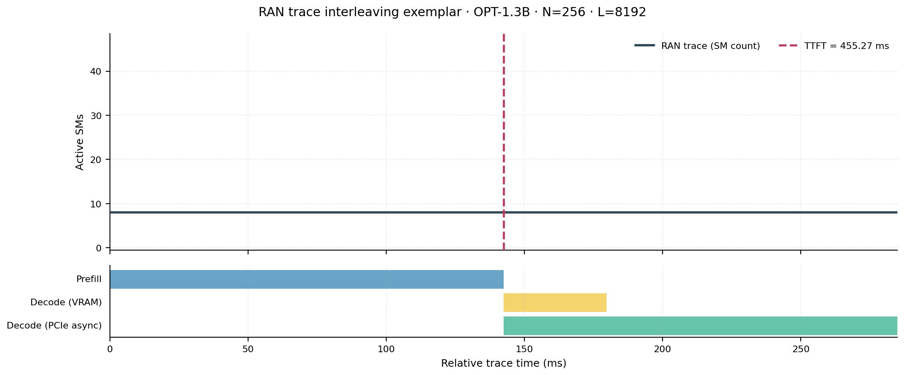
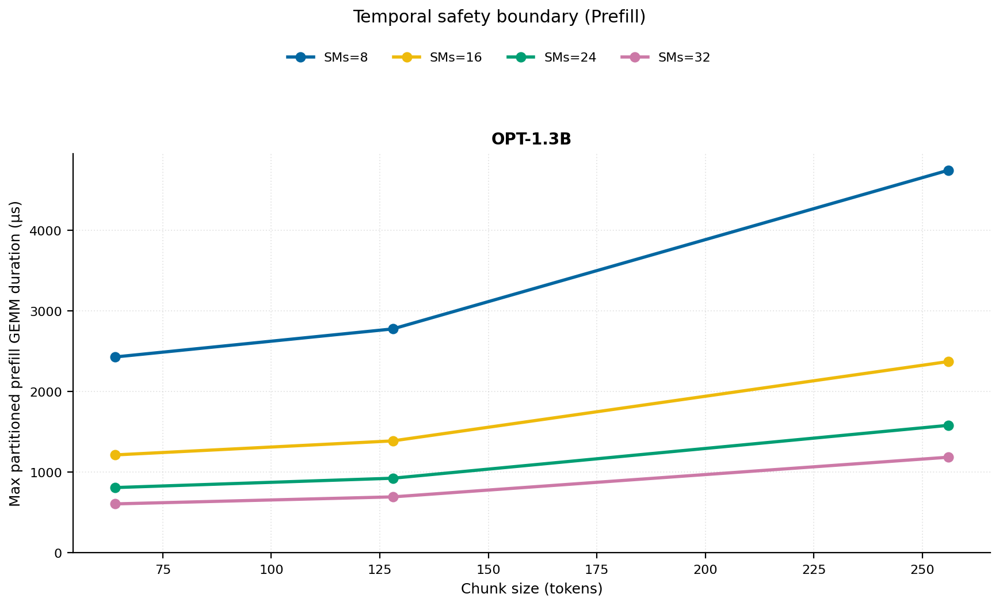
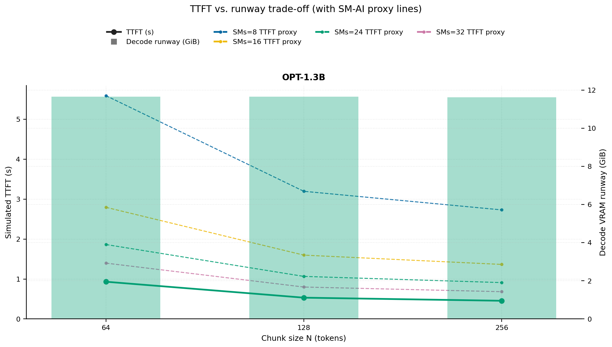
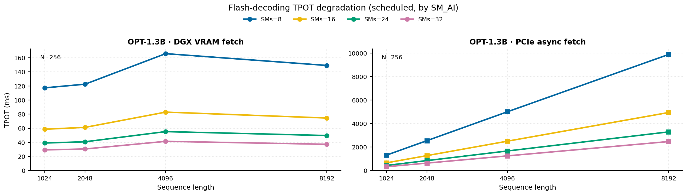
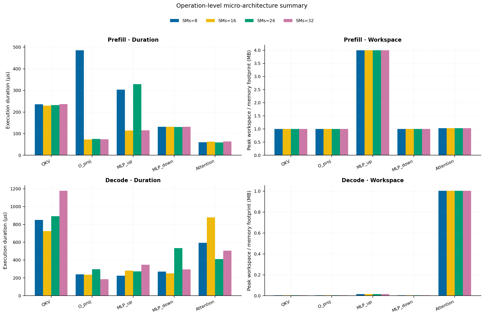
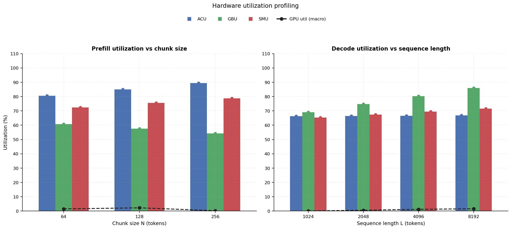

# RAN Inference Profiling Report

Run root: `/mnt/data/dheeraj/dicertation/inference-profile/runs/revised-rerun-20260415-145452-g2-opt13b-c64-256`

## Environment

| field | value |
| --- | --- |
| cache_root | n/a |
| captured_at | 2026-04-15T13:55:01Z |
| chunk_sizes | [64, 128, 256] |
| cuda_available | true |
| cuda_device_count | 8 |
| cwd | /mnt/data/dheeraj/dicertation/inference-profile |
| decode_modes | ["vram", "pcie_async"] |
| experiment_type | ran-dgxspark-v1 |
| gpu_id | 2 |
| l_out | 1024 |
| models | ["facebook/opt-1.3b"] |
| platform | Linux-6.8.0-106-generic-x86_64-with-glibc2.35 |
| python_executable | /home/dheeraj/miniconda3/envs/mls/bin/python |
| python_version | 3.11.14 |
| run_root | /mnt/data/dheeraj/dicertation/inference-profile/runs/revised-rerun-20260415-145452-g2-opt13b-c64-256 |
| scheduler | envelope_v1 |
| schema_version | ran_dgxspark_v1 |
| sequence_lengths | [1024, 2048, 4096, 8192] |
| sm_ai_cap | 32 |
| sm_ai_partition | 100 |
| sm_ai_partitions | [8, 16, 24, 32] |
| stage | profile |
| telemetry_tier | baseline_nvml_pt |
| timed_iterations | 5 |
| torch_available | true |
| torch_version | 2.10.0+cu128 |
| warmup_iterations | 3 |

## Model Constants

| model_id | sm_ai_partition | num_hidden_layers | hidden_size | num_attention_heads | ffn_dim | layer_index | layer_weight_bytes | total_weight_bytes_fp16 | vram_ceiling_bytes |
| --- | --- | --- | --- | --- | --- | --- | --- | --- | --- |
| facebook/opt-1.3b | 100 | 24 | 2048 | 32 | 8192 | 11 | 100716544 | 2631516160 | 15170115993 |

## Trace Inspection

### Primary trace

| field | value |
| --- | --- |
| errors | [] |
| header | ["frame", "slot", "time_slot_sched_ns", "time_decode_start_est_ns", "time_decode_end_est_ns", "time_decode_start_actual_ns", "time_decode_end_actual_ns", "decode_dur_us", "deadline_met", "target_sm", "profile_idx", "sm_count", "num_pusch", "sum_prb", "sum_tbs_bytes", "max_mcs"] |
| median_positive_delta_ms | 5.6997 |
| monotonicity.checked_column | time_slot_sched_ns |
| monotonicity.is_non_decreasing | true |
| monotonicity.negative_delta_count | 0 |
| monotonicity.positive_delta_count | 28377 |
| monotonicity.zero_delta_count | 0 |
| normalization.last_row_duration_policy | median_positive_forward_delta_ms |
| normalization.output_columns | ["time_ms", "sm_utilization", "slot_duration_ms", "source_schema", "sm_count"] |
| normalization.output_relative_path | derived/normalized_ldpc_trace.csv |
| normalized_row_count | 28378 |
| path | /mnt/raid0sata2/netsys/weaver-ext/ran/traces/e2e_2026030418/e2e_20260304_182034_tractor_ran_ctrl/ldpc_trace.csv |
| row_count | 28378 |
| schema_detected | schema_b |
| time_unit_hint | ns |
| usable | true |
| usage_policy | primary_only |
| used_for_scheduler_capacity | true |

### Secondary trace

| field | value |
| --- | --- |
| errors | ["ran_ctrl_trace.csv line 182958 has 9 field(s); expected 12"] |
| header | ["frame", "slot", "sm_available", "prbs_available", "prbs_allocated", "w_avg_mcs_prev", "w_avg_mcs_curr", "slots_since_underutil", "ramp_up_count", "num_ue_sched", "max_ue_backlog", "sum_ue_backlog"] |
| monotonicity.checked_column | n/a |
| monotonicity.is_non_decreasing | n/a |
| monotonicity.negative_delta_count | n/a |
| path | /mnt/raid0sata2/netsys/weaver-ext/ran/traces/e2e_2026030418/e2e_20260304_182034_tractor_ran_ctrl/ran_ctrl_trace.csv |
| row_count | 182956 |
| time_unit_hints | [] |
| usable | false |
| usage_policy | structural_only |
| used_for_scheduler_capacity | false |

## Raw-Profile Summary Tables

### Prefill profile summary

Source raw rows: `raw/prefill_events.csv` = 420. Summary artifact: `derived/prefill_summary.csv`.

| model_id | chunk_tokens | sm_ai_partition | max_input_tokens | prefill_max_gemm_us | prefill_workspace_bytes | prefill_parked_activation_bytes | telemetry_tier | telemetry_provider | telemetry_status | nvml_available | gpu_util | gpu_mem_used_mb | sm_clock_mhz | mem_clock_mhz | power_w | pt_step_ms | pt_mem_alloc_mb | pt_mem_reserved_mb | pt_workspace_mb | acu_pct | gbu_pct | smu_pct | microscopic_telemetry_status | microscopic_error |
| --- | --- | --- | --- | --- | --- | --- | --- | --- | --- | --- | --- | --- | --- | --- | --- | --- | --- | --- | --- | --- | --- | --- | --- | --- |
| facebook/opt-1.3b | 64 | 8 | 1024 | 3237.8881 | 1048576 | 1048576 | baseline_nvml_pt | nvidia-smi | ok | true | 6 | 117 | 1695 | 8001 | 69.36 | 3.2379 | 108.1602 | 108.1602 | 1 | 71.1 | 70 | 62.1 | estimated | n/a |
| facebook/opt-1.3b | 64 | 16 | 1024 | 103.424 | 1048576 | 1048576 | baseline_nvml_pt | nvidia-smi | ok | true | 0 | 117 | 1695 | 7601 | 69.18 | 0.1034 | 108.1602 | 108.1602 | 1 | 77.4 | 63.84 | 69 | estimated | n/a |
| facebook/opt-1.3b | 64 | 24 | 1024 | 101.088 | 1048576 | 1048576 | baseline_nvml_pt | nvidia-smi | ok | true | 0 | 117 | 1695 | 7601 | 69.32 | 0.1011 | 108.1602 | 108.1602 | 1 | 83.7 | 57.68 | 75.9 | estimated | n/a |
| facebook/opt-1.3b | 64 | 32 | 1024 | 101.152 | 1048576 | 1048576 | baseline_nvml_pt | nvidia-smi | ok | true | 0 | 117 | 1695 | 7601 | 69.39 | 0.1012 | 108.1602 | 108.1602 | 1 | 90 | 51.52 | 82.8 | estimated | n/a |
| facebook/opt-1.3b | 128 | 8 | 1024 | 3091.584 | 2097152 | 2097152 | baseline_nvml_pt | nvidia-smi | ok | true | 6 | 117 | 1695 | 8001 | 69.96 | 3.0916 | 111.1602 | 111.1602 | 2 | 75.05 | 66.25 | 64.8 | estimated | n/a |
| facebook/opt-1.3b | 128 | 16 | 1024 | 117.76 | 2097152 | 2097152 | baseline_nvml_pt | nvidia-smi | ok | true | 3 | 117 | 1695 | 7601 | 69.42 | 0.1178 | 111.1602 | 111.1602 | 2 | 81.7 | 60.42 | 72 | estimated | n/a |
| facebook/opt-1.3b | 128 | 24 | 1024 | 134.944 | 2097152 | 2097152 | baseline_nvml_pt | nvidia-smi | ok | true | 0 | 117 | 1695 | 7601 | 69.27 | 0.1349 | 111.1602 | 111.1602 | 2 | 88.35 | 54.59 | 79.2 | estimated | n/a |
| facebook/opt-1.3b | 128 | 32 | 1024 | 115.648 | 2097152 | 2097152 | baseline_nvml_pt | nvidia-smi | ok | true | 0 | 117 | 1695 | 7601 | 69.51 | 0.1156 | 111.1602 | 111.1602 | 2 | 95 | 48.76 | 86.4 | estimated | n/a |
| facebook/opt-1.3b | 256 | 8 | 1024 | 177.984 | 4194304 | 4194304 | baseline_nvml_pt | nvidia-smi | ok | true | 1 | 117 | 1695 | 7601 | 69.36 | 0.178 | 117.1602 | 117.1602 | 4 | 79 | 62.5 | 67.5 | estimated | n/a |
| facebook/opt-1.3b | 256 | 16 | 1024 | 190.464 | 4194304 | 4194304 | baseline_nvml_pt | nvidia-smi | ok | true | 0 | 117 | 1695 | 8001 | 69.04 | 0.1905 | 117.1602 | 117.1602 | 4 | 86 | 57 | 75 | estimated | n/a |
| facebook/opt-1.3b | 256 | 24 | 1024 | 3349.504 | 4194304 | 4194304 | baseline_nvml_pt | nvidia-smi | ok | true | 0 | 117 | 1695 | 8001 | 69.09 | 3.3495 | 117.1602 | 117.1602 | 4 | 93 | 51.5 | 82.5 | estimated | n/a |
| facebook/opt-1.3b | 256 | 32 | 1024 | 197.6 | 4194304 | 4194304 | baseline_nvml_pt | nvidia-smi | ok | true | 0 | 117 | 1695 | 7601 | 68.79 | 0.1976 | 117.1602 | 117.1602 | 4 | 100 | 46 | 90 | estimated | n/a |

### Decode profile summary

Source raw rows: `raw/decode_events.csv` = 3840. Summary artifact: `derived/decode_summary.csv`.

| model_id | sequence_length | block_size | sm_ai_partition | decode_mode | decode_max_gemv_us | attention_fetch_compute_us | reduction_overhead_us | decode_workspace_bytes | decode_parked_activation_bytes | telemetry_tier | telemetry_provider | telemetry_status | nvml_available | gpu_util | gpu_mem_used_mb | sm_clock_mhz | mem_clock_mhz | power_w | pt_step_ms | pt_mem_alloc_mb | pt_mem_reserved_mb | pt_workspace_mb | acu_pct | gbu_pct | smu_pct | microscopic_telemetry_status | microscopic_error |
| --- | --- | --- | --- | --- | --- | --- | --- | --- | --- | --- | --- | --- | --- | --- | --- | --- | --- | --- | --- | --- | --- | --- | --- | --- | --- | --- | --- |
| facebook/opt-1.3b | 1024 | 64 | 8 | pcie_async | 179.2 | 134.112 | 21.6576 | 135168 | 4096 | baseline_nvml_pt | nvidia-smi | ok | true | 0 | 117 | 1695 | 7601 | 69.18 | 0.1792 | 112.3125 | 112.3125 | 0.1289 | 58.195 | 75.69 | 56.64 | estimated | n/a |
| facebook/opt-1.3b | 1024 | 64 | 8 | vram | 241.664 | 136.48 | 22.784 | 135168 | 4096 | baseline_nvml_pt | nvidia-smi | ok | true | 1 | 117 | 1695 | 7601 | 68.92 | 0.2417 | 112.3125 | 112.3125 | 0.1289 | 59.85 | 70.525 | 58.28 | estimated | n/a |
| facebook/opt-1.3b | 1024 | 64 | 16 | pcie_async | 173.056 | 134.1632 | 21.6768 | 135168 | 4096 | baseline_nvml_pt | nvidia-smi | ok | true | 0 | 117 | 1695 | 7601 | 69.23 | 0.1731 | 112.3125 | 112.3125 | 0.1289 | 62.83 | 73.08 | 61.44 | estimated | n/a |
| facebook/opt-1.3b | 1024 | 64 | 16 | vram | 267.328 | 133.9392 | 22.0032 | 135168 | 4096 | baseline_nvml_pt | nvidia-smi | ok | true | 0 | 117 | 1695 | 7601 | 68.99 | 0.2673 | 112.3125 | 112.3125 | 0.1289 | 64.6 | 68.25 | 63.92 | estimated | n/a |
| facebook/opt-1.3b | 1024 | 64 | 24 | pcie_async | 172.032 | 134.8096 | 21.7024 | 135168 | 4096 | baseline_nvml_pt | nvidia-smi | ok | true | 0 | 117 | 1695 | 7601 | 69.03 | 0.172 | 112.3125 | 112.3125 | 0.1289 | 67.465 | 70.47 | 66.24 | estimated | n/a |
| facebook/opt-1.3b | 1024 | 64 | 24 | vram | 2792.448 | 142.7776 | 21.6512 | 135168 | 4096 | baseline_nvml_pt | nvidia-smi | ok | true | 0 | 117 | 1695 | 7601 | 69.27 | 2.7924 | 112.3125 | 112.3125 | 0.1289 | 69.35 | 65.975 | 69.56 | estimated | n/a |
| facebook/opt-1.3b | 1024 | 64 | 32 | pcie_async | 3165.184 | 138.1888 | 24.576 | 135168 | 4096 | baseline_nvml_pt | nvidia-smi | ok | true | 1 | 117 | 1695 | 7601 | 69.06 | 3.1652 | 112.3125 | 112.3125 | 0.1289 | 72.1 | 67.86 | 71.04 | estimated | n/a |
| facebook/opt-1.3b | 1024 | 64 | 32 | vram | 177.024 | 126.3424 | 20.7232 | 135168 | 4096 | baseline_nvml_pt | nvidia-smi | ok | true | 0 | 117 | 1695 | 7601 | 69.29 | 0.177 | 112.3125 | 112.3125 | 0.1289 | 74.1 | 63.7 | 75.2 | estimated | n/a |
| facebook/opt-1.3b | 1024 | 128 | 8 | pcie_async | 200.704 | 817.8048 | 21.1904 | 135168 | 4096 | baseline_nvml_pt | nvidia-smi | ok | true | 0 | 117 | 1695 | 8001 | 69.11 | 3.5645 | 112.3125 | 112.3125 | 0.1289 | 58.195 | 75.255 | 56.64 | estimated | n/a |
| facebook/opt-1.3b | 1024 | 128 | 8 | vram | 2965.5039 | 136.384 | 21.76 | 135168 | 4096 | baseline_nvml_pt | nvidia-smi | ok | true | 0 | 117 | 1695 | 7601 | 69.01 | 2.9655 | 112.3125 | 112.3125 | 0.1289 | 60.165 | 70.1375 | 58.28 | estimated | n/a |
| facebook/opt-1.3b | 1024 | 128 | 16 | pcie_async | 424.96 | 132.864 | 23.3024 | 135168 | 4096 | baseline_nvml_pt | nvidia-smi | ok | true | 0 | 117 | 1695 | 7601 | 69.51 | 0.425 | 112.3125 | 112.3125 | 0.1289 | 62.83 | 72.66 | 61.44 | estimated | n/a |
| facebook/opt-1.3b | 1024 | 128 | 16 | vram | 298.752 | 135.8144 | 22.2272 | 135168 | 4096 | baseline_nvml_pt | nvidia-smi | ok | true | 0 | 117 | 1695 | 7601 | 69.26 | 0.2988 | 112.3125 | 112.3125 | 0.1289 | 64.94 | 67.875 | 63.92 | estimated | n/a |
| facebook/opt-1.3b | 1024 | 128 | 24 | pcie_async | 2604.032 | 152.96 | 23.168 | 135168 | 4096 | baseline_nvml_pt | nvidia-smi | ok | true | 0 | 117 | 1695 | 7601 | 69.3 | 2.604 | 112.3125 | 112.3125 | 0.1289 | 67.465 | 70.065 | 66.24 | estimated | n/a |
| facebook/opt-1.3b | 1024 | 128 | 24 | vram | 202.784 | 130.6944 | 22.0288 | 135168 | 4096 | baseline_nvml_pt | nvidia-smi | ok | true | 0 | 117 | 1695 | 7601 | 69.06 | 0.2028 | 112.3125 | 112.3125 | 0.1289 | 69.715 | 65.6125 | 69.56 | estimated | n/a |
| facebook/opt-1.3b | 1024 | 128 | 32 | pcie_async | 4176.0001 | 182.2656 | 22.3552 | 135168 | 4096 | baseline_nvml_pt | nvidia-smi | ok | true | 0 | 117 | 1695 | 8001 | 69.58 | 4.176 | 112.3125 | 112.3125 | 0.1289 | 72.1 | 67.47 | 71.04 | estimated | n/a |
| facebook/opt-1.3b | 1024 | 128 | 32 | vram | 3662.0481 | 820.032 | 20.672 | 135168 | 4096 | baseline_nvml_pt | nvidia-smi | ok | true | 0 | 117 | 1695 | 8001 | 69.57 | 3.662 | 112.3125 | 112.3125 | 0.1289 | 74.49 | 63.35 | 75.2 | estimated | n/a |
| facebook/opt-1.3b | 1024 | 256 | 8 | pcie_async | 303.904 | 137.8176 | 113.2608 | 135168 | 4096 | baseline_nvml_pt | nvidia-smi | ok | true | 0 | 117 | 1695 | 7601 | 69.08 | 0.4762 | 112.3125 | 112.3125 | 0.1289 | 58.195 | 74.82 | 56.64 | estimated | n/a |
| facebook/opt-1.3b | 1024 | 256 | 8 | vram | 315.392 | 136.1792 | 22.688 | 135168 | 4096 | baseline_nvml_pt | nvidia-smi | ok | true | 0 | 117 | 1695 | 7601 | 68.83 | 0.3154 | 112.3125 | 112.3125 | 0.1289 | 60.48 | 69.75 | 58.28 | estimated | n/a |
| facebook/opt-1.3b | 1024 | 256 | 16 | pcie_async | 3619.8399 | 1918.7072 | 22.304 | 135168 | 4096 | baseline_nvml_pt | nvidia-smi | ok | true | 0 | 117 | 1695 | 7601 | 69.26 | 5.4515 | 112.3125 | 112.3125 | 0.1289 | 62.83 | 72.24 | 61.44 | estimated | n/a |
| facebook/opt-1.3b | 1024 | 256 | 16 | vram | 840.64 | 150.9312 | 22.9888 | 135168 | 4096 | baseline_nvml_pt | nvidia-smi | ok | true | 0 | 117 | 1695 | 7601 | 69.03 | 0.8406 | 112.3125 | 112.3125 | 0.1289 | 65.28 | 67.5 | 63.92 | estimated | n/a |
| facebook/opt-1.3b | 1024 | 256 | 24 | pcie_async | 3124.2239 | 168.096 | 26.432 | 135168 | 4096 | baseline_nvml_pt | nvidia-smi | ok | true | 0 | 117 | 1695 | 7601 | 68.8 | 3.1242 | 112.3125 | 112.3125 | 0.1289 | 67.465 | 69.66 | 66.24 | estimated | n/a |
| facebook/opt-1.3b | 1024 | 256 | 24 | vram | 3711.072 | 133.3952 | 21.2032 | 135168 | 4096 | baseline_nvml_pt | nvidia-smi | ok | true | 0 | 117 | 1695 | 7601 | 69.07 | 3.7111 | 112.3125 | 112.3125 | 0.1289 | 70.08 | 65.25 | 69.56 | estimated | n/a |
| facebook/opt-1.3b | 1024 | 256 | 32 | pcie_async | 148.48 | 126.336 | 21.6192 | 135168 | 4096 | baseline_nvml_pt | nvidia-smi | ok | true | 0 | 117 | 1695 | 7601 | 69.3 | 0.1485 | 112.3125 | 112.3125 | 0.1289 | 72.1 | 67.08 | 71.04 | estimated | n/a |
| facebook/opt-1.3b | 1024 | 256 | 32 | vram | 178.176 | 131.1232 | 22.0736 | 135168 | 4096 | baseline_nvml_pt | nvidia-smi | ok | true | 0 | 117 | 1695 | 7601 | 68.75 | 0.1782 | 112.3125 | 112.3125 | 0.1289 | 74.88 | 63 | 75.2 | estimated | n/a |
| facebook/opt-1.3b | 2048 | 64 | 8 | pcie_async | 163.872 | 154.4192 | 25.0944 | 266240 | 4096 | baseline_nvml_pt | nvidia-smi | ok | true | 0 | 117 | 1695 | 8001 | 69.64 | 0.1987 | 120.4375 | 120.4375 | 0.2539 | 57.065 | 82.07 | 57.82 | estimated | n/a |
| facebook/opt-1.3b | 2048 | 64 | 8 | vram | 157.696 | 834.9696 | 21.3248 | 266240 | 4096 | baseline_nvml_pt | nvidia-smi | ok | true | 0 | 117 | 1695 | 7601 | 69.32 | 3.6535 | 120.4375 | 120.4375 | 0.2539 | 61.11 | 74.6583 | 60.3467 | estimated | n/a |
| facebook/opt-1.3b | 2048 | 64 | 16 | pcie_async | 176.32 | 742.5216 | 615.0464 | 266240 | 4096 | baseline_nvml_pt | nvidia-smi | ok | true | 0 | 117 | 1695 | 7601 | 69.04 | 3.1794 | 120.4375 | 120.4375 | 0.2539 | 61.61 | 79.24 | 62.72 | estimated | n/a |
| facebook/opt-1.3b | 2048 | 64 | 16 | vram | 162.848 | 1151.2064 | 22.7776 | 266240 | 4096 | baseline_nvml_pt | nvidia-smi | ok | true | 0 | 117 | 1695 | 8001 | 69.24 | 5.1802 | 120.4375 | 120.4375 | 0.2539 | 65.96 | 72.25 | 66.1867 | estimated | n/a |
| facebook/opt-1.3b | 2048 | 64 | 24 | pcie_async | 374.784 | 172.5504 | 41.9904 | 266240 | 4096 | baseline_nvml_pt | nvidia-smi | ok | true | 0 | 117 | 1695 | 7601 | 69.1 | 0.3748 | 120.4375 | 120.4375 | 0.2539 | 66.155 | 76.41 | 67.62 | estimated | n/a |
| facebook/opt-1.3b | 2048 | 64 | 24 | vram | 3139.4241 | 137.44 | 22.3296 | 266240 | 4096 | baseline_nvml_pt | nvidia-smi | ok | true | 0 | 117 | 1695 | 7601 | 69.09 | 3.1394 | 120.4375 | 120.4375 | 0.2539 | 70.81 | 69.8417 | 72.0267 | estimated | n/a |
| facebook/opt-1.3b | 2048 | 64 | 32 | pcie_async | 3983.3601 | 742.9312 | 22.3232 | 266240 | 4096 | baseline_nvml_pt | nvidia-smi | ok | true | 0 | 117 | 1695 | 7601 | 69.12 | 3.9834 | 120.4375 | 120.4375 | 0.2539 | 70.7 | 73.58 | 72.52 | estimated | n/a |
| facebook/opt-1.3b | 2048 | 64 | 32 | vram | 185.344 | 133.9968 | 21.7024 | 266240 | 4096 | baseline_nvml_pt | nvidia-smi | ok | true | 0 | 117 | 1695 | 7601 | 69.08 | 0.1853 | 120.4375 | 120.4375 | 0.2539 | 75.66 | 67.4333 | 77.8667 | estimated | n/a |
| facebook/opt-1.3b | 2048 | 128 | 8 | pcie_async | 614.656 | 140.6784 | 25.1008 | 266240 | 4096 | baseline_nvml_pt | nvidia-smi | ok | true | 0 | 117 | 1695 | 7601 | 69.07 | 0.6147 | 120.4375 | 120.4375 | 0.2539 | 57.065 | 82.505 | 58.0167 | estimated | n/a |
| facebook/opt-1.3b | 2048 | 128 | 8 | vram | 3443.712 | 874.1312 | 22.0992 | 266240 | 4096 | baseline_nvml_pt | nvidia-smi | ok | true | 0 | 117 | 1695 | 7601 | 69.09 | 3.8052 | 120.4375 | 120.4375 | 0.2539 | 61.635 | 74.7875 | 60.5533 | estimated | n/a |
| facebook/opt-1.3b | 2048 | 128 | 16 | pcie_async | 163.808 | 133.504 | 21.3056 | 266240 | 4096 | baseline_nvml_pt | nvidia-smi | ok | true | 0 | 117 | 1695 | 7601 | 69.36 | 0.1638 | 120.4375 | 120.4375 | 0.2539 | 61.61 | 79.66 | 62.9333 | estimated | n/a |
| facebook/opt-1.3b | 2048 | 128 | 16 | vram | 153.6 | 129.4272 | 21.3312 | 266240 | 4096 | baseline_nvml_pt | nvidia-smi | ok | true | 0 | 117 | 1695 | 8001 | 69.65 | 0.1536 | 120.4375 | 120.4375 | 0.2539 | 66.5267 | 72.375 | 66.4133 | estimated | n/a |
| facebook/opt-1.3b | 2048 | 128 | 24 | pcie_async | 184.32 | 150.9184 | 24.1216 | 266240 | 4096 | baseline_nvml_pt | nvidia-smi | ok | true | 0 | 117 | 1695 | 7601 | 69.35 | 0.1843 | 120.4375 | 120.4375 | 0.2539 | 66.155 | 76.815 | 67.85 | estimated | n/a |
| facebook/opt-1.3b | 2048 | 128 | 24 | vram | 3610.6241 | 144.5376 | 22.4704 | 266240 | 4096 | baseline_nvml_pt | nvidia-smi | ok | true | 0 | 117 | 1695 | 7601 | 69 | 3.6106 | 120.4375 | 120.4375 | 0.2539 | 71.4183 | 69.9625 | 72.2733 | estimated | n/a |
| facebook/opt-1.3b | 2048 | 128 | 32 | pcie_async | 208.736 | 164.4608 | 24.5568 | 266240 | 4096 | baseline_nvml_pt | nvidia-smi | ok | true | 0 | 117 | 1695 | 7601 | 69.07 | 0.2324 | 120.4375 | 120.4375 | 0.2539 | 70.7 | 73.97 | 72.7667 | estimated | n/a |
| facebook/opt-1.3b | 2048 | 128 | 32 | vram | 3116.8001 | 194.336 | 25.1136 | 266240 | 4096 | baseline_nvml_pt | nvidia-smi | ok | true | 5 | 117 | 1695 | 7601 | 69.09 | 3.1168 | 120.4375 | 120.4375 | 0.2539 | 76.31 | 67.55 | 78.1333 | estimated | n/a |
| facebook/opt-1.3b | 2048 | 256 | 8 | pcie_async | 181.184 | 164.6336 | 21.8944 | 266240 | 4096 | baseline_nvml_pt | nvidia-smi | ok | true | 0 | 117 | 1695 | 7601 | 69 | 0.3059 | 120.4375 | 120.4375 | 0.2539 | 57.065 | 82.94 | 58.2133 | estimated | n/a |
| facebook/opt-1.3b | 2048 | 256 | 8 | vram | 181.376 | 147.2768 | 23.6352 | 266240 | 4096 | baseline_nvml_pt | nvidia-smi | ok | true | 0 | 117 | 1695 | 7601 | 69.35 | 0.1814 | 120.4375 | 120.4375 | 0.2539 | 62.16 | 74.9167 | 60.76 | estimated | n/a |
| facebook/opt-1.3b | 2048 | 256 | 16 | pcie_async | 198.528 | 137.056 | 26.272 | 266240 | 4096 | baseline_nvml_pt | nvidia-smi | ok | true | 0 | 117 | 1695 | 7601 | 69.24 | 0.1985 | 120.4375 | 120.4375 | 0.2539 | 61.61 | 80.08 | 63.1467 | estimated | n/a |
| facebook/opt-1.3b | 2048 | 256 | 16 | vram | 165.952 | 156.0064 | 22.9184 | 266240 | 4096 | baseline_nvml_pt | nvidia-smi | ok | true | 0 | 117 | 1695 | 7601 | 69.51 | 0.1872 | 120.4375 | 120.4375 | 0.2539 | 67.0933 | 72.5 | 66.64 | estimated | n/a |
| facebook/opt-1.3b | 2048 | 256 | 24 | pcie_async | 189.44 | 161.9712 | 21.7088 | 266240 | 4096 | baseline_nvml_pt | nvidia-smi | ok | true | 0 | 117 | 1695 | 7601 | 69.46 | 0.2847 | 120.4375 | 120.4375 | 0.2539 | 66.155 | 77.22 | 68.08 | estimated | n/a |
| facebook/opt-1.3b | 2048 | 256 | 24 | vram | 194.432 | 130.8928 | 20.672 | 266240 | 4096 | baseline_nvml_pt | nvidia-smi | ok | true | 0 | 117 | 1695 | 7601 | 69.21 | 0.1944 | 120.4375 | 120.4375 | 0.2539 | 72.0267 | 70.0833 | 72.52 | estimated | n/a |
| facebook/opt-1.3b | 2048 | 256 | 32 | pcie_async | 161.792 | 128.1536 | 20.6144 | 266240 | 4096 | baseline_nvml_pt | nvidia-smi | ok | true | 0 | 117 | 1695 | 8001 | 69.15 | 0.1618 | 120.4375 | 120.4375 | 0.2539 | 70.7 | 74.36 | 73.0133 | estimated | n/a |
| facebook/opt-1.3b | 2048 | 256 | 32 | vram | 184.288 | 147.7952 | 22.8992 | 266240 | 4096 | baseline_nvml_pt | nvidia-smi | ok | true | 8 | 117 | 1695 | 8001 | 69.47 | 0.1843 | 120.4375 | 120.4375 | 0.2539 | 76.96 | 67.6667 | 78.4 | estimated | n/a |
| facebook/opt-1.3b | 4096 | 64 | 8 | pcie_async | 3789.824 | 134.5536 | 21.504 | 528384 | 4096 | baseline_nvml_pt | nvidia-smi | ok | true | 2 | 117 | 1695 | 7601 | 69.21 | 3.7898 | 136.6875 | 136.6875 | 0.5039 | 55.935 | 88.45 | 59 | estimated | n/a |
| facebook/opt-1.3b | 4096 | 64 | 8 | vram | 3577.8561 | 156.0576 | 23.232 | 528384 | 4096 | baseline_nvml_pt | nvidia-smi | ok | true | 0 | 117 | 1695 | 8001 | 69.67 | 3.5779 | 136.6875 | 136.6875 | 0.5039 | 62.37 | 78.7917 | 62.4133 | estimated | n/a |
| facebook/opt-1.3b | 4096 | 64 | 16 | pcie_async | 184.32 | 141.8368 | 21.6064 | 528384 | 4096 | baseline_nvml_pt | nvidia-smi | ok | true | 1 | 117 | 1695 | 7601 | 69.6 | 0.1843 | 136.6875 | 136.6875 | 0.5039 | 60.39 | 85.4 | 64 | estimated | n/a |
| facebook/opt-1.3b | 4096 | 64 | 16 | vram | 192.512 | 144.352 | 21.5232 | 528384 | 4096 | baseline_nvml_pt | nvidia-smi | ok | true | 0 | 117 | 1695 | 7601 | 69.62 | 0.1925 | 136.6875 | 136.6875 | 0.5039 | 67.32 | 76.25 | 68.4533 | estimated | n/a |
| facebook/opt-1.3b | 4096 | 64 | 24 | pcie_async | 179.2 | 142.7456 | 23.7056 | 528384 | 4096 | baseline_nvml_pt | nvidia-smi | ok | true | 2 | 117 | 1695 | 7601 | 69.04 | 0.1792 | 136.6875 | 136.6875 | 0.5039 | 64.845 | 82.35 | 69 | estimated | n/a |
| facebook/opt-1.3b | 4096 | 64 | 24 | vram | 3528.4481 | 138.6112 | 21.1072 | 528384 | 4096 | baseline_nvml_pt | nvidia-smi | ok | true | 0 | 117 | 1695 | 7601 | 69.43 | 3.5284 | 136.6875 | 136.6875 | 0.5039 | 72.27 | 73.7083 | 74.4933 | estimated | n/a |
| facebook/opt-1.3b | 4096 | 64 | 32 | pcie_async | 565.248 | 136.9856 | 21.6704 | 528384 | 4096 | baseline_nvml_pt | nvidia-smi | ok | true | 8 | 117 | 1695 | 8001 | 69.45 | 0.5652 | 136.6875 | 136.6875 | 0.5039 | 69.3 | 79.3 | 74 | estimated | n/a |
| facebook/opt-1.3b | 4096 | 64 | 32 | vram | 157.696 | 137.6064 | 21.4848 | 528384 | 4096 | baseline_nvml_pt | nvidia-smi | ok | true | 0 | 117 | 1695 | 7601 | 69.43 | 0.1577 | 136.6875 | 136.6875 | 0.5039 | 77.22 | 71.1667 | 80.5333 | estimated | n/a |
| facebook/opt-1.3b | 4096 | 128 | 8 | pcie_async | 160.768 | 865.6896 | 21.5232 | 528384 | 4096 | baseline_nvml_pt | nvidia-smi | ok | true | 0 | 117 | 1695 | 8001 | 69.43 | 3.7919 | 136.6875 | 136.6875 | 0.5039 | 55.935 | 89.755 | 59.3933 | estimated | n/a |
| facebook/opt-1.3b | 4096 | 128 | 8 | vram | 2286.592 | 146.2592 | 23.1168 | 528384 | 4096 | baseline_nvml_pt | nvidia-smi | ok | true | 0 | 117 | 1695 | 7601 | 69.29 | 2.2866 | 136.6875 | 136.6875 | 0.5039 | 63.105 | 79.4375 | 62.8267 | estimated | n/a |
| facebook/opt-1.3b | 4096 | 128 | 16 | pcie_async | 2955.2641 | 131.872 | 21.2672 | 528384 | 4096 | baseline_nvml_pt | nvidia-smi | ok | true | 0 | 117 | 1695 | 7601 | 69.11 | 2.9553 | 136.6875 | 136.6875 | 0.5039 | 60.39 | 86.66 | 64.4267 | estimated | n/a |
| facebook/opt-1.3b | 4096 | 128 | 16 | vram | 157.472 | 142.9376 | 24.1088 | 528384 | 4096 | baseline_nvml_pt | nvidia-smi | ok | true | 0 | 117 | 1695 | 7601 | 69.39 | 0.1575 | 136.6875 | 136.6875 | 0.5039 | 68.1133 | 76.875 | 68.9067 | estimated | n/a |
| facebook/opt-1.3b | 4096 | 128 | 24 | pcie_async | 3247.1039 | 193.7664 | 27.3984 | 528384 | 4096 | baseline_nvml_pt | nvidia-smi | ok | true | 0 | 117 | 1695 | 7601 | 69.2 | 3.2471 | 136.6875 | 136.6875 | 0.5039 | 64.845 | 83.565 | 69.46 | estimated | n/a |
| facebook/opt-1.3b | 4096 | 128 | 24 | vram | 380.928 | 149.92 | 36.8256 | 528384 | 4096 | baseline_nvml_pt | nvidia-smi | ok | true | 0 | 117 | 1695 | 7601 | 69.32 | 0.3809 | 136.6875 | 136.6875 | 0.5039 | 73.1217 | 74.3125 | 74.9867 | estimated | n/a |
| facebook/opt-1.3b | 4096 | 128 | 32 | pcie_async | 153.504 | 733.3248 | 23.3664 | 528384 | 4096 | baseline_nvml_pt | nvidia-smi | ok | true | 0 | 117 | 1695 | 7601 | 69.26 | 3.1436 | 136.6875 | 136.6875 | 0.5039 | 69.3 | 80.47 | 74.4933 | estimated | n/a |
| facebook/opt-1.3b | 4096 | 128 | 32 | vram | 7133.472 | 158.976 | 27.0656 | 528384 | 4096 | baseline_nvml_pt | nvidia-smi | ok | true | 0 | 117 | 1695 | 7601 | 69.41 | 7.1335 | 136.6875 | 136.6875 | 0.5039 | 78.13 | 71.75 | 81.0667 | estimated | n/a |
| facebook/opt-1.3b | 4096 | 256 | 8 | pcie_async | 144.544 | 136.6528 | 21.2224 | 528384 | 4096 | baseline_nvml_pt | nvidia-smi | ok | true | 0 | 117 | 1695 | 8001 | 69.39 | 0.1445 | 136.6875 | 136.6875 | 0.5039 | 55.935 | 91.06 | 59.7867 | estimated | n/a |
| facebook/opt-1.3b | 4096 | 256 | 8 | vram | 138.24 | 135.9936 | 21.632 | 528384 | 4096 | baseline_nvml_pt | nvidia-smi | ok | true | 0 | 117 | 1695 | 7601 | 68.82 | 0.1464 | 136.6875 | 136.6875 | 0.5039 | 63.84 | 80.0833 | 63.24 | estimated | n/a |
| facebook/opt-1.3b | 4096 | 256 | 16 | pcie_async | 3273.7279 | 156.0384 | 23.3856 | 528384 | 4096 | baseline_nvml_pt | nvidia-smi | ok | true | 0 | 117 | 1695 | 7601 | 68.75 | 3.2737 | 136.6875 | 136.6875 | 0.5039 | 60.39 | 87.92 | 64.8533 | estimated | n/a |
| facebook/opt-1.3b | 4096 | 256 | 16 | vram | 204.96 | 138.8032 | 23.3472 | 528384 | 4096 | baseline_nvml_pt | nvidia-smi | ok | true | 0 | 117 | 1695 | 7601 | 69.07 | 0.205 | 136.6875 | 136.6875 | 0.5039 | 68.9067 | 77.5 | 69.36 | estimated | n/a |
| facebook/opt-1.3b | 4096 | 256 | 24 | pcie_async | 180.224 | 138.2208 | 21.4656 | 528384 | 4096 | baseline_nvml_pt | nvidia-smi | ok | true | 3 | 117 | 1695 | 7601 | 69.13 | 0.1802 | 136.6875 | 136.6875 | 0.5039 | 64.845 | 84.78 | 69.92 | estimated | n/a |
| facebook/opt-1.3b | 4096 | 256 | 24 | vram | 234.272 | 180.6016 | 21.4656 | 528384 | 4096 | baseline_nvml_pt | nvidia-smi | ok | true | 6 | 117 | 1695 | 7601 | 69.04 | 0.3554 | 136.6875 | 136.6875 | 0.5039 | 73.9733 | 74.9167 | 75.48 | estimated | n/a |
| facebook/opt-1.3b | 4096 | 256 | 32 | pcie_async | 200.544 | 138.2272 | 21.92 | 528384 | 4096 | baseline_nvml_pt | nvidia-smi | ok | true | 0 | 117 | 1695 | 7601 | 69.34 | 0.2005 | 136.6875 | 136.6875 | 0.5039 | 69.3 | 81.64 | 74.9867 | estimated | n/a |
| facebook/opt-1.3b | 4096 | 256 | 32 | vram | 260.096 | 144.8832 | 22.0736 | 528384 | 4096 | baseline_nvml_pt | nvidia-smi | ok | true | 7 | 117 | 1695 | 7601 | 69.58 | 0.2601 | 136.6875 | 136.6875 | 0.5039 | 79.04 | 72.3333 | 81.6 | estimated | n/a |
| facebook/opt-1.3b | 8192 | 64 | 8 | pcie_async | 3121.1519 | 189.1648 | 27.6096 | 1052672 | 4096 | baseline_nvml_pt | nvidia-smi | ok | true | 0 | 117 | 1695 | 7601 | 68.43 | 3.1212 | 169.1875 | 169.1875 | 1.0039 | 54.805 | 94.83 | 60.18 | estimated | n/a |
| facebook/opt-1.3b | 8192 | 64 | 8 | vram | 173.952 | 180.6336 | 23.0656 | 1052672 | 4096 | baseline_nvml_pt | nvidia-smi | ok | true | 6 | 117 | 1695 | 7601 | 69.42 | 0.2048 | 169.1875 | 169.1875 | 1.0039 | 63.63 | 82.925 | 64.48 | estimated | n/a |
| facebook/opt-1.3b | 8192 | 64 | 16 | pcie_async | 163.84 | 161.1264 | 24.0512 | 1052672 | 4096 | baseline_nvml_pt | nvidia-smi | ok | true | 0 | 117 | 1695 | 7601 | 69.2 | 0.1638 | 169.1875 | 169.1875 | 1.0039 | 59.17 | 91.56 | 65.28 | estimated | n/a |
| facebook/opt-1.3b | 8192 | 64 | 16 | vram | 236.544 | 166.2976 | 22.112 | 1052672 | 4096 | baseline_nvml_pt | nvidia-smi | ok | true | 0 | 117 | 1695 | 7601 | 69.35 | 0.2365 | 169.1875 | 169.1875 | 1.0039 | 68.68 | 80.25 | 70.72 | estimated | n/a |
| facebook/opt-1.3b | 8192 | 64 | 24 | pcie_async | 3177.4721 | 169.28 | 21.6704 | 1052672 | 4096 | baseline_nvml_pt | nvidia-smi | ok | true | 7 | 117 | 1695 | 8001 | 69.35 | 3.1775 | 169.1875 | 169.1875 | 1.0039 | 63.535 | 88.29 | 70.38 | estimated | n/a |
| facebook/opt-1.3b | 8192 | 64 | 24 | vram | 158.784 | 164.6016 | 660.992 | 1052672 | 4096 | baseline_nvml_pt | nvidia-smi | ok | true | 0 | 117 | 1695 | 7601 | 69.27 | 3.2225 | 169.1875 | 169.1875 | 1.0039 | 73.73 | 77.575 | 76.96 | estimated | n/a |
| facebook/opt-1.3b | 8192 | 64 | 32 | pcie_async | 159.744 | 162.3616 | 21.2224 | 1052672 | 4096 | baseline_nvml_pt | nvidia-smi | ok | true | 12 | 117 | 1695 | 7601 | 69.14 | 0.1657 | 169.1875 | 169.1875 | 1.0039 | 67.9 | 85.02 | 75.48 | estimated | n/a |
| facebook/opt-1.3b | 8192 | 64 | 32 | vram | 178.176 | 162.784 | 21.2544 | 1052672 | 4096 | baseline_nvml_pt | nvidia-smi | ok | true | 0 | 117 | 1695 | 7601 | 69.12 | 0.1782 | 169.1875 | 169.1875 | 1.0039 | 78.78 | 74.9 | 83.2 | estimated | n/a |
| facebook/opt-1.3b | 8192 | 128 | 8 | pcie_async | 160.736 | 162.2016 | 21.2608 | 1052672 | 4096 | baseline_nvml_pt | nvidia-smi | ok | true | 0 | 117 | 1695 | 7601 | 69.65 | 0.1659 | 169.1875 | 169.1875 | 1.0039 | 54.805 | 97.005 | 60.77 | estimated | n/a |
| facebook/opt-1.3b | 8192 | 128 | 8 | vram | 177.152 | 213.3568 | 25.2224 | 1052672 | 4096 | baseline_nvml_pt | nvidia-smi | ok | true | 0 | 117 | 1695 | 7601 | 69.73 | 0.3233 | 169.1875 | 169.1875 | 1.0039 | 64.575 | 84.0875 | 65.1 | estimated | n/a |
| facebook/opt-1.3b | 8192 | 128 | 16 | pcie_async | 403.296 | 202.752 | 25.8048 | 1052672 | 4096 | baseline_nvml_pt | nvidia-smi | ok | true | 0 | 117 | 1695 | 7601 | 69.27 | 0.4033 | 169.1875 | 169.1875 | 1.0039 | 59.17 | 93.66 | 65.92 | estimated | n/a |
| facebook/opt-1.3b | 8192 | 128 | 16 | vram | 175.104 | 180.224 | 22.9568 | 1052672 | 4096 | baseline_nvml_pt | nvidia-smi | ok | true | 0 | 117 | 1695 | 7601 | 69.62 | 0.1925 | 169.1875 | 169.1875 | 1.0039 | 69.7 | 81.375 | 71.4 | estimated | n/a |
| facebook/opt-1.3b | 8192 | 128 | 24 | pcie_async | 334.88 | 192.1152 | 22.2592 | 1052672 | 4096 | baseline_nvml_pt | nvidia-smi | ok | true | 0 | 117 | 1695 | 7601 | 69.21 | 0.3349 | 169.1875 | 169.1875 | 1.0039 | 63.535 | 90.315 | 71.07 | estimated | n/a |
| facebook/opt-1.3b | 8192 | 128 | 24 | vram | 276.736 | 163.1552 | 22.5344 | 1052672 | 4096 | baseline_nvml_pt | nvidia-smi | ok | true | 0 | 117 | 1695 | 8001 | 69.65 | 0.2767 | 169.1875 | 169.1875 | 1.0039 | 74.825 | 78.6625 | 77.7 | estimated | n/a |
| facebook/opt-1.3b | 8192 | 128 | 32 | pcie_async | 185.568 | 162.9824 | 21.1136 | 1052672 | 4096 | baseline_nvml_pt | nvidia-smi | ok | true | 0 | 117 | 1695 | 7601 | 69.1 | 0.1856 | 169.1875 | 169.1875 | 1.0039 | 67.9 | 86.97 | 76.22 | estimated | n/a |
| facebook/opt-1.3b | 8192 | 128 | 32 | vram | 185.344 | 159.7056 | 20.8064 | 1052672 | 4096 | baseline_nvml_pt | nvidia-smi | ok | true | 0 | 117 | 1695 | 7601 | 69.39 | 0.1853 | 169.1875 | 169.1875 | 1.0039 | 79.95 | 75.95 | 84 | estimated | n/a |
| facebook/opt-1.3b | 8192 | 256 | 8 | pcie_async | 178.112 | 171.9232 | 22.8672 | 1052672 | 4096 | baseline_nvml_pt | nvidia-smi | ok | true | 0 | 117 | 1695 | 7601 | 68.71 | 0.1948 | 169.1875 | 169.1875 | 1.0039 | 54.805 | 99.18 | 61.36 | estimated | n/a |
| facebook/opt-1.3b | 8192 | 256 | 8 | vram | 388.128 | 171.2064 | 21.9456 | 1052672 | 4096 | baseline_nvml_pt | nvidia-smi | ok | true | 0 | 117 | 1695 | 7601 | 69.07 | 0.3881 | 169.1875 | 169.1875 | 1.0039 | 65.52 | 85.25 | 65.72 | estimated | n/a |
| facebook/opt-1.3b | 8192 | 256 | 16 | pcie_async | 181.12 | 167.2768 | 21.4144 | 1052672 | 4096 | baseline_nvml_pt | nvidia-smi | ok | true | 7 | 117 | 1695 | 8001 | 69.47 | 0.1833 | 169.1875 | 169.1875 | 1.0039 | 59.17 | 95.76 | 66.56 | estimated | n/a |
| facebook/opt-1.3b | 8192 | 256 | 16 | vram | 227.296 | 2618.9824 | 26.1888 | 1052672 | 4096 | baseline_nvml_pt | nvidia-smi | ok | true | 0 | 117 | 1695 | 7601 | 69.09 | 6.2066 | 169.1875 | 169.1875 | 1.0039 | 70.72 | 82.5 | 72.08 | estimated | n/a |
| facebook/opt-1.3b | 8192 | 256 | 24 | pcie_async | 253.952 | 176.6912 | 22.1056 | 1052672 | 4096 | baseline_nvml_pt | nvidia-smi | ok | true | 6 | 117 | 1695 | 7601 | 68.74 | 0.254 | 169.1875 | 169.1875 | 1.0039 | 63.535 | 92.34 | 71.76 | estimated | n/a |
| facebook/opt-1.3b | 8192 | 256 | 24 | vram | 3108.8319 | 164.0512 | 21.6256 | 1052672 | 4096 | baseline_nvml_pt | nvidia-smi | ok | true | 0 | 117 | 1695 | 7601 | 68.72 | 3.1088 | 169.1875 | 169.1875 | 1.0039 | 75.92 | 79.75 | 78.44 | estimated | n/a |
| facebook/opt-1.3b | 8192 | 256 | 32 | pcie_async | 196.608 | 169.1264 | 22.1184 | 1052672 | 4096 | baseline_nvml_pt | nvidia-smi | ok | true | 0 | 117 | 1695 | 7601 | 69.17 | 0.1966 | 169.1875 | 169.1875 | 1.0039 | 67.9 | 88.92 | 76.96 | estimated | n/a |
| facebook/opt-1.3b | 8192 | 256 | 32 | vram | 214.784 | 238.9824 | 25.5744 | 1052672 | 4096 | baseline_nvml_pt | nvidia-smi | ok | true | 0 | 117 | 1695 | 8001 | 69.42 | 0.469 | 169.1875 | 169.1875 | 1.0039 | 81.12 | 77 | 84.8 | estimated | n/a |

### PCIe profile summary

Source raw rows: `raw/pcie_events.csv` = 15. Summary artifact: `derived/pcie_summary.csv`.

| model_id | block_size | kv_block_bytes | transfer_only_us | overlap_total_us | dummy_compute_us | exposed_transfer_us | effective_gbps | overlap_status | telemetry_tier | telemetry_provider | telemetry_status | nvml_available | gpu_util | gpu_mem_used_mb | sm_clock_mhz | mem_clock_mhz | power_w | pt_step_ms | pt_mem_alloc_mb | pt_mem_reserved_mb | pt_workspace_mb | acu_pct | gbu_pct | smu_pct | microscopic_telemetry_status | microscopic_error |
| --- | --- | --- | --- | --- | --- | --- | --- | --- | --- | --- | --- | --- | --- | --- | --- | --- | --- | --- | --- | --- | --- | --- | --- | --- | --- | --- |
| facebook/opt-1.3b | 64 | 524288 | 1886.4256 | 62838.6032 | 62510.0745 | 328.5286 | 0.2779 | measured | baseline_nvml_pt | nvidia-smi | partial | true | 0 | 117 | 1695 | 7601 | 68.4 | n/a | n/a | n/a | n/a | 65 | 65 | 65 | estimated | n/a |
| facebook/opt-1.3b | 128 | 1048576 | 816.4288 | 39329.8433 | 39037.0893 | 292.7541 | 1.2843 | measured | baseline_nvml_pt | nvidia-smi | partial | true | 6 | 117 | 1695 | 7601 | 69.35 | n/a | n/a | n/a | n/a | 65 | 65 | 65 | estimated | n/a |
| facebook/opt-1.3b | 256 | 2097152 | 1602.6944 | 64246.4961 | 61068.6973 | 3177.7989 | 1.3085 | measured | baseline_nvml_pt | nvidia-smi | partial | true | 0 | 117 | 1695 | 7601 | 68.95 | n/a | n/a | n/a | n/a | 65 | 65 | 65 | estimated | n/a |

## SLA Tables

### Successful configurations

| model_id | chunk_tokens | sequence_length | ttft_ms | tpot_ms_vram | tpot_ms_pcie_async | decode_runway_tokens | status |
| --- | --- | --- | --- | --- | --- | --- | --- |
| facebook/opt-1.3b | 64 | 1024 | 932.2169 | 29.021 | 585.8478 | 63709 | success |
| facebook/opt-1.3b | 64 | 2048 | 932.2169 | 30.4263 | 844.2799 | 63709 | success |
| facebook/opt-1.3b | 64 | 4096 | 932.2169 | 26.5264 | 589.8234 | 63707 | success |
| facebook/opt-1.3b | 64 | 8192 | 932.2169 | 30.0743 | 1036.649 | 63705 | success |
| facebook/opt-1.3b | 128 | 1024 | 532.906 | 547.5118 | 662.4637 | 63645 | success |
| facebook/opt-1.3b | 128 | 2048 | 532.906 | 454.086 | 147.012 | 63645 | success |
| facebook/opt-1.3b | 128 | 4096 | 532.906 | 1031.685 | 265.1003 | 63643 | success |
| facebook/opt-1.3b | 128 | 8192 | 532.906 | 31.0218 | 480.8103 | 63641 | success |
| facebook/opt-1.3b | 256 | 1024 | 455.2704 | 29.3341 | 330.0007 | 63517 | success |
| facebook/opt-1.3b | 256 | 2048 | 455.2704 | 30.6341 | 637.0059 | 63517 | success |
| facebook/opt-1.3b | 256 | 4096 | 455.2704 | 41.4608 | 1252.9966 | 63515 | success |
| facebook/opt-1.3b | 256 | 8192 | 455.2704 | 37.2783 | 2473.451 | 63513 | success |

### Failed configurations

No rows available.

## Per-Model Scaling Analysis

| model_id | successful_configs | failed_configs | chunk_tokens_tested | sequence_lengths_tested | largest_successful_chunk_tokens | ttft_ms_min | ttft_ms_max | tpot_ms_vram_min | tpot_ms_vram_max | tpot_ms_pcie_async_min | tpot_ms_pcie_async_max | max_decode_runway_tokens |
| --- | --- | --- | --- | --- | --- | --- | --- | --- | --- | --- | --- | --- |
| facebook/opt-1.3b | 12 | 0 | 64, 128, 256 | 1024, 2048, 4096, 8192 | 256 | 455.2704 | 932.2169 | 26.5264 | 1031.685 | 147.012 | 2473.451 | 63709 |

## Plots

### Revised 01 Ran Trace Interleaving

[Interactive companion](../plots/revised_01_ran_trace_interleaving_interactive.html)

### Revised 02 Prefill Safety Boundary

### Revised 03 Prefill Vram Composition

### Revised 04 Ttft Vs Runway

### Revised 05 Decode Tpot Degradation

### Revised 06 Operation Level Microarchitecture Summary

### Revised 07 Hardware Utilization Profiling

### Revised 08 Decode Memory Consumption

### 09 Spatial VRAM Composition (Prefill) · Pie View

