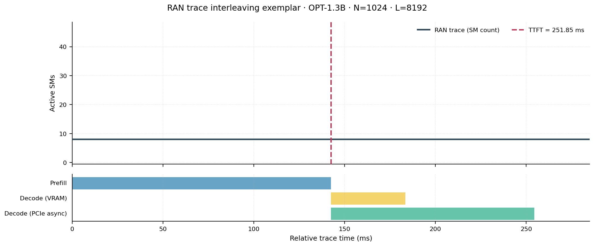
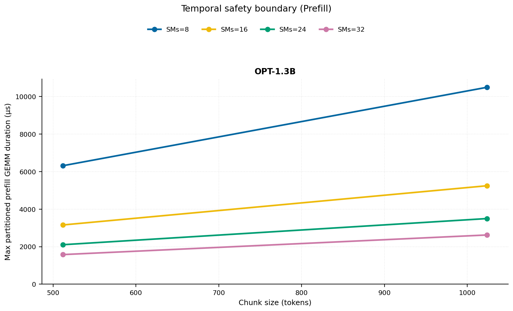
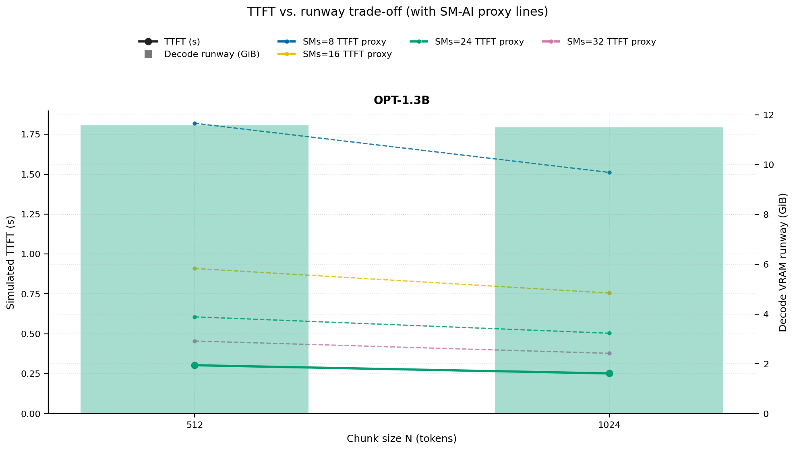
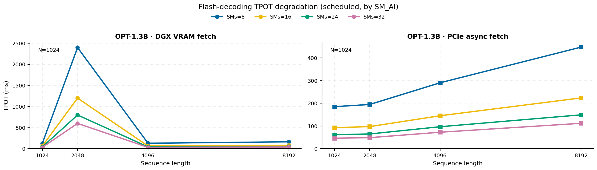
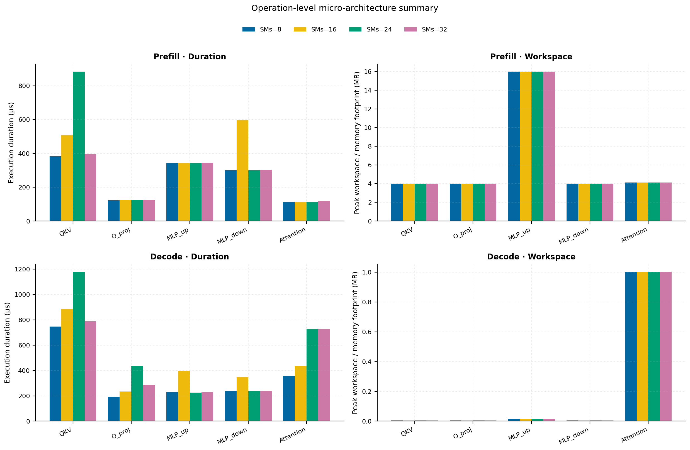
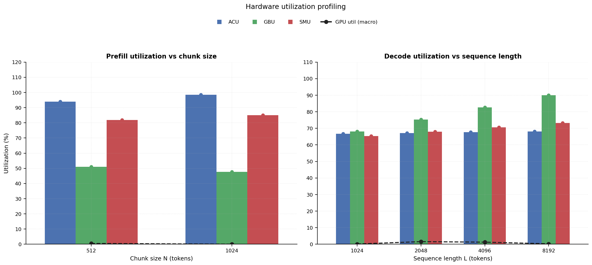

# RAN Inference Profiling Report

Run root: `/mnt/data/dheeraj/dicertation/inference-profile/runs/revised-rerun-20260415-145452-g3-opt13b-c512-1024`

## Environment

| field | value |
| --- | --- |
| cache_root | n/a |
| captured_at | 2026-04-15T13:55:00Z |
| chunk_sizes | [512, 1024] |
| cuda_available | true |
| cuda_device_count | 8 |
| cwd | /mnt/data/dheeraj/dicertation/inference-profile |
| decode_modes | ["vram", "pcie_async"] |
| experiment_type | ran-dgxspark-v1 |
| gpu_id | 3 |
| l_out | 1024 |
| models | ["facebook/opt-1.3b"] |
| platform | Linux-6.8.0-106-generic-x86_64-with-glibc2.35 |
| python_executable | /home/dheeraj/miniconda3/envs/mls/bin/python |
| python_version | 3.11.14 |
| run_root | /mnt/data/dheeraj/dicertation/inference-profile/runs/revised-rerun-20260415-145452-g3-opt13b-c512-1024 |
| scheduler | envelope_v1 |
| schema_version | ran_dgxspark_v1 |
| sequence_lengths | [1024, 2048, 4096, 8192] |
| sm_ai_cap | 32 |
| sm_ai_partition | 100 |
| sm_ai_partitions | [8, 16, 24, 32] |
| stage | profile |
| telemetry_tier | baseline_nvml_pt |
| timed_iterations | 5 |
| torch_available | true |
| torch_version | 2.10.0+cu128 |
| warmup_iterations | 3 |

## Model Constants

| model_id | sm_ai_partition | num_hidden_layers | hidden_size | num_attention_heads | ffn_dim | layer_index | layer_weight_bytes | total_weight_bytes_fp16 | vram_ceiling_bytes |
| --- | --- | --- | --- | --- | --- | --- | --- | --- | --- |
| facebook/opt-1.3b | 100 | 24 | 2048 | 32 | 8192 | 11 | 100716544 | 2631516160 | 15170115993 |

## Trace Inspection

### Primary trace

| field | value |
| --- | --- |
| errors | [] |
| header | ["frame", "slot", "time_slot_sched_ns", "time_decode_start_est_ns", "time_decode_end_est_ns", "time_decode_start_actual_ns", "time_decode_end_actual_ns", "decode_dur_us", "deadline_met", "target_sm", "profile_idx", "sm_count", "num_pusch", "sum_prb", "sum_tbs_bytes", "max_mcs"] |
| median_positive_delta_ms | 5.6997 |
| monotonicity.checked_column | time_slot_sched_ns |
| monotonicity.is_non_decreasing | true |
| monotonicity.negative_delta_count | 0 |
| monotonicity.positive_delta_count | 28377 |
| monotonicity.zero_delta_count | 0 |
| normalization.last_row_duration_policy | median_positive_forward_delta_ms |
| normalization.output_columns | ["time_ms", "sm_utilization", "slot_duration_ms", "source_schema", "sm_count"] |
| normalization.output_relative_path | derived/normalized_ldpc_trace.csv |
| normalized_row_count | 28378 |
| path | /mnt/raid0sata2/netsys/weaver-ext/ran/traces/e2e_2026030418/e2e_20260304_182034_tractor_ran_ctrl/ldpc_trace.csv |
| row_count | 28378 |
| schema_detected | schema_b |
| time_unit_hint | ns |
| usable | true |
| usage_policy | primary_only |
| used_for_scheduler_capacity | true |

### Secondary trace

| field | value |
| --- | --- |
| errors | ["ran_ctrl_trace.csv line 182958 has 9 field(s); expected 12"] |
| header | ["frame", "slot", "sm_available", "prbs_available", "prbs_allocated", "w_avg_mcs_prev", "w_avg_mcs_curr", "slots_since_underutil", "ramp_up_count", "num_ue_sched", "max_ue_backlog", "sum_ue_backlog"] |
| monotonicity.checked_column | n/a |
| monotonicity.is_non_decreasing | n/a |
| monotonicity.negative_delta_count | n/a |
| path | /mnt/raid0sata2/netsys/weaver-ext/ran/traces/e2e_2026030418/e2e_20260304_182034_tractor_ran_ctrl/ran_ctrl_trace.csv |
| row_count | 182956 |
| time_unit_hints | [] |
| usable | false |
| usage_policy | structural_only |
| used_for_scheduler_capacity | false |

## Raw-Profile Summary Tables

### Prefill profile summary

Source raw rows: `raw/prefill_events.csv` = 280. Summary artifact: `derived/prefill_summary.csv`.

| model_id | chunk_tokens | sm_ai_partition | max_input_tokens | prefill_max_gemm_us | prefill_workspace_bytes | prefill_parked_activation_bytes | telemetry_tier | telemetry_provider | telemetry_status | nvml_available | gpu_util | gpu_mem_used_mb | sm_clock_mhz | mem_clock_mhz | power_w | pt_step_ms | pt_mem_alloc_mb | pt_mem_reserved_mb | pt_workspace_mb | acu_pct | gbu_pct | smu_pct | microscopic_telemetry_status | microscopic_error |
| --- | --- | --- | --- | --- | --- | --- | --- | --- | --- | --- | --- | --- | --- | --- | --- | --- | --- | --- | --- | --- | --- | --- | --- | --- |
| facebook/opt-1.3b | 512 | 8 | 1024 | 252.928 | 8388608 | 8388608 | baseline_nvml_pt | nvidia-smi | ok | true | 1 | 93 | 1695 | 7601 | 65.13 | 0.2529 | 129.1602 | 129.1602 | 8 | 82.95 | 58.75 | 70.2 | estimated | n/a |
| facebook/opt-1.3b | 512 | 16 | 1024 | 1380.096 | 8388608 | 8388608 | baseline_nvml_pt | nvidia-smi | ok | true | 1 | 93 | 1695 | 7601 | 65.72 | 1.3801 | 129.1602 | 129.1602 | 8 | 90.3 | 53.58 | 78 | estimated | n/a |
| facebook/opt-1.3b | 512 | 24 | 1024 | 252.8 | 8388608 | 8388608 | baseline_nvml_pt | nvidia-smi | ok | true | 0 | 93 | 1695 | 7601 | 66.07 | 0.2528 | 129.1602 | 129.1602 | 8 | 97.65 | 48.41 | 85.8 | estimated | n/a |
| facebook/opt-1.3b | 512 | 32 | 1024 | 263.168 | 8388608 | 8388608 | baseline_nvml_pt | nvidia-smi | ok | true | 0 | 93 | 1695 | 7601 | 66.58 | 0.2632 | 129.1602 | 129.1602 | 8 | 100 | 43.24 | 93.6 | estimated | n/a |
| facebook/opt-1.3b | 1024 | 8 | 1024 | 436.224 | 16777216 | 16777216 | baseline_nvml_pt | nvidia-smi | ok | true | 0 | 93 | 1695 | 7601 | 68.07 | 0.4362 | 153.1602 | 153.1602 | 16 | 86.9 | 55 | 72.9 | estimated | n/a |
| facebook/opt-1.3b | 1024 | 16 | 1024 | 3350.3039 | 16777216 | 16777216 | baseline_nvml_pt | nvidia-smi | ok | true | 0 | 93 | 1695 | 8001 | 66.39 | 3.3503 | 153.1602 | 153.1602 | 16 | 94.6 | 50.16 | 81 | estimated | n/a |
| facebook/opt-1.3b | 1024 | 24 | 1024 | 5157.8879 | 16777216 | 16777216 | baseline_nvml_pt | nvidia-smi | ok | true | 0 | 93 | 1695 | 8001 | 68.72 | 5.1579 | 153.1602 | 153.1602 | 16 | 100 | 45.32 | 89.1 | estimated | n/a |
| facebook/opt-1.3b | 1024 | 32 | 1024 | 437.248 | 16777216 | 16777216 | baseline_nvml_pt | nvidia-smi | ok | true | 0 | 93 | 1695 | 7601 | 67.54 | 0.4372 | 153.1602 | 153.1602 | 16 | 100 | 40.48 | 97.2 | estimated | n/a |

### Decode profile summary

Source raw rows: `raw/decode_events.csv` = 2560. Summary artifact: `derived/decode_summary.csv`.

| model_id | sequence_length | block_size | sm_ai_partition | decode_mode | decode_max_gemv_us | attention_fetch_compute_us | reduction_overhead_us | decode_workspace_bytes | decode_parked_activation_bytes | telemetry_tier | telemetry_provider | telemetry_status | nvml_available | gpu_util | gpu_mem_used_mb | sm_clock_mhz | mem_clock_mhz | power_w | pt_step_ms | pt_mem_alloc_mb | pt_mem_reserved_mb | pt_workspace_mb | acu_pct | gbu_pct | smu_pct | microscopic_telemetry_status | microscopic_error |
| --- | --- | --- | --- | --- | --- | --- | --- | --- | --- | --- | --- | --- | --- | --- | --- | --- | --- | --- | --- | --- | --- | --- | --- | --- | --- | --- | --- |
| facebook/opt-1.3b | 1024 | 512 | 8 | pcie_async | 208.096 | 142.5152 | 24.128 | 135168 | 4096 | baseline_nvml_pt | nvidia-smi | ok | true | 2 | 93 | 1695 | 7601 | 66.96 | 0.2081 | 112.3125 | 112.3125 | 0.1289 | 58.195 | 74.385 | 56.64 | estimated | n/a |
| facebook/opt-1.3b | 1024 | 512 | 8 | vram | 172.192 | 134.6816 | 22.6304 | 135168 | 4096 | baseline_nvml_pt | nvidia-smi | ok | true | 0 | 93 | 1695 | 7601 | 66.84 | 0.1722 | 112.3125 | 112.3125 | 0.1289 | 60.795 | 69.3625 | 58.28 | estimated | n/a |
| facebook/opt-1.3b | 1024 | 512 | 16 | pcie_async | 325.632 | 206.6176 | 27.1424 | 135168 | 4096 | baseline_nvml_pt | nvidia-smi | ok | true | 0 | 93 | 1695 | 8001 | 66.77 | 0.3256 | 112.3125 | 112.3125 | 0.1289 | 62.83 | 71.82 | 61.44 | estimated | n/a |
| facebook/opt-1.3b | 1024 | 512 | 16 | vram | 166.72 | 145.2992 | 21.9136 | 135168 | 4096 | baseline_nvml_pt | nvidia-smi | ok | true | 0 | 93 | 1695 | 7601 | 66.57 | 0.1667 | 112.3125 | 112.3125 | 0.1289 | 65.62 | 67.125 | 63.92 | estimated | n/a |
| facebook/opt-1.3b | 1024 | 512 | 24 | pcie_async | 216.064 | 131.9168 | 22.1888 | 135168 | 4096 | baseline_nvml_pt | nvidia-smi | ok | true | 0 | 93 | 1695 | 8001 | 68.08 | 0.2161 | 112.3125 | 112.3125 | 0.1289 | 67.465 | 69.255 | 66.24 | estimated | n/a |
| facebook/opt-1.3b | 1024 | 512 | 24 | vram | 184.32 | 146.5984 | 23.5392 | 135168 | 4096 | baseline_nvml_pt | nvidia-smi | ok | true | 0 | 93 | 1695 | 7601 | 67.43 | 0.1988 | 112.3125 | 112.3125 | 0.1289 | 70.445 | 64.8875 | 69.56 | estimated | n/a |
| facebook/opt-1.3b | 1024 | 512 | 32 | pcie_async | 176.96 | 803.456 | 20.8832 | 135168 | 4096 | baseline_nvml_pt | nvidia-smi | ok | true | 0 | 93 | 1695 | 7601 | 67.55 | 3.5095 | 112.3125 | 112.3125 | 0.1289 | 72.1 | 66.69 | 71.04 | estimated | n/a |
| facebook/opt-1.3b | 1024 | 512 | 32 | vram | 218.976 | 734.0032 | 21.5808 | 135168 | 4096 | baseline_nvml_pt | nvidia-smi | ok | true | 0 | 93 | 1695 | 8001 | 67.9 | 3.1406 | 112.3125 | 112.3125 | 0.1289 | 75.27 | 62.65 | 75.2 | estimated | n/a |
| facebook/opt-1.3b | 1024 | 1024 | 8 | pcie_async | 188.416 | 128.0384 | 21.4272 | 135168 | 4096 | baseline_nvml_pt | nvidia-smi | ok | true | 0 | 93 | 1695 | 7601 | 67.68 | 0.1884 | 112.3125 | 112.3125 | 0.1289 | 58.195 | 73.95 | 56.64 | estimated | n/a |
| facebook/opt-1.3b | 1024 | 1024 | 8 | vram | 204.032 | 127.168 | 21.1264 | 135168 | 4096 | baseline_nvml_pt | nvidia-smi | ok | true | 0 | 93 | 1695 | 7601 | 67.88 | 0.204 | 112.3125 | 112.3125 | 0.1289 | 61.11 | 68.975 | 58.28 | estimated | n/a |
| facebook/opt-1.3b | 1024 | 1024 | 16 | pcie_async | 3128.32 | 131.5008 | 21.7472 | 135168 | 4096 | baseline_nvml_pt | nvidia-smi | ok | true | 0 | 93 | 1695 | 7601 | 67.63 | 3.1283 | 112.3125 | 112.3125 | 0.1289 | 62.83 | 71.4 | 61.44 | estimated | n/a |
| facebook/opt-1.3b | 1024 | 1024 | 16 | vram | 197.504 | 139.4496 | 22.9824 | 135168 | 4096 | baseline_nvml_pt | nvidia-smi | ok | true | 0 | 93 | 1695 | 7601 | 67.86 | 0.1975 | 112.3125 | 112.3125 | 0.1289 | 65.96 | 66.75 | 63.92 | estimated | n/a |
| facebook/opt-1.3b | 1024 | 1024 | 24 | pcie_async | 193.28 | 736.5056 | 22.4896 | 135168 | 4096 | baseline_nvml_pt | nvidia-smi | ok | true | 0 | 93 | 1695 | 8001 | 68.34 | 3.1652 | 112.3125 | 112.3125 | 0.1289 | 67.465 | 68.85 | 66.24 | estimated | n/a |
| facebook/opt-1.3b | 1024 | 1024 | 24 | vram | 391.168 | 169.408 | 55.2128 | 135168 | 4096 | baseline_nvml_pt | nvidia-smi | ok | true | 0 | 93 | 1695 | 7601 | 67.68 | 0.3912 | 112.3125 | 112.3125 | 0.1289 | 70.81 | 64.525 | 69.56 | estimated | n/a |
| facebook/opt-1.3b | 1024 | 1024 | 32 | pcie_async | 227.136 | 135.3728 | 21.5808 | 135168 | 4096 | baseline_nvml_pt | nvidia-smi | ok | true | 0 | 93 | 1695 | 7601 | 67.72 | 0.2271 | 112.3125 | 112.3125 | 0.1289 | 72.1 | 66.3 | 71.04 | estimated | n/a |
| facebook/opt-1.3b | 1024 | 1024 | 32 | vram | 196.608 | 129.2288 | 20.6848 | 135168 | 4096 | baseline_nvml_pt | nvidia-smi | ok | true | 0 | 93 | 1695 | 7601 | 67.97 | 0.1966 | 112.3125 | 112.3125 | 0.1289 | 75.66 | 62.3 | 75.2 | estimated | n/a |
| facebook/opt-1.3b | 2048 | 512 | 8 | pcie_async | 166.624 | 129.6768 | 21.152 | 266240 | 4096 | baseline_nvml_pt | nvidia-smi | ok | true | 0 | 93 | 1695 | 7601 | 67.98 | 0.1666 | 120.4375 | 120.4375 | 0.2539 | 57.065 | 83.375 | 58.41 | estimated | n/a |
| facebook/opt-1.3b | 2048 | 512 | 8 | vram | 222.464 | 135.6288 | 21.9328 | 266240 | 4096 | baseline_nvml_pt | nvidia-smi | ok | true | 0 | 93 | 1695 | 7601 | 68.06 | 0.2225 | 120.4375 | 120.4375 | 0.2539 | 62.685 | 75.0458 | 60.9667 | estimated | n/a |
| facebook/opt-1.3b | 2048 | 512 | 16 | pcie_async | 329.728 | 139.648 | 21.312 | 266240 | 4096 | baseline_nvml_pt | nvidia-smi | ok | true | 0 | 93 | 1695 | 7601 | 67.82 | 0.3297 | 120.4375 | 120.4375 | 0.2539 | 61.61 | 80.5 | 63.36 | estimated | n/a |
| facebook/opt-1.3b | 2048 | 512 | 16 | vram | 736.256 | 153.8432 | 22.912 | 266240 | 4096 | baseline_nvml_pt | nvidia-smi | ok | true | 8 | 93 | 1695 | 8001 | 68.58 | 0.7363 | 120.4375 | 120.4375 | 0.2539 | 67.66 | 72.625 | 66.8667 | estimated | n/a |
| facebook/opt-1.3b | 2048 | 512 | 24 | pcie_async | 171.04 | 1339.6224 | 22.5024 | 266240 | 4096 | baseline_nvml_pt | nvidia-smi | ok | true | 0 | 93 | 1695 | 8001 | 68.49 | 3.1498 | 120.4375 | 120.4375 | 0.2539 | 66.155 | 77.625 | 68.31 | estimated | n/a |
| facebook/opt-1.3b | 2048 | 512 | 24 | vram | 270.336 | 702.4512 | 22.72 | 266240 | 4096 | baseline_nvml_pt | nvidia-smi | ok | true | 0 | 93 | 1695 | 7601 | 68.1 | 2.9829 | 120.4375 | 120.4375 | 0.2539 | 72.635 | 70.2042 | 72.7667 | estimated | n/a |
| facebook/opt-1.3b | 2048 | 512 | 32 | pcie_async | 161.536 | 131.7824 | 20.5952 | 266240 | 4096 | baseline_nvml_pt | nvidia-smi | ok | true | 8 | 93 | 1695 | 8001 | 68.64 | 0.1615 | 120.4375 | 120.4375 | 0.2539 | 70.7 | 74.75 | 73.26 | estimated | n/a |
| facebook/opt-1.3b | 2048 | 512 | 32 | vram | 3855.36 | 135.7248 | 22.7264 | 266240 | 4096 | baseline_nvml_pt | nvidia-smi | ok | true | 0 | 93 | 1695 | 7601 | 67.9 | 3.8554 | 120.4375 | 120.4375 | 0.2539 | 77.61 | 67.7833 | 78.6667 | estimated | n/a |
| facebook/opt-1.3b | 2048 | 1024 | 8 | pcie_async | 159.68 | 133.888 | 20.928 | 266240 | 4096 | baseline_nvml_pt | nvidia-smi | ok | true | 0 | 93 | 1695 | 7601 | 67.83 | 0.1597 | 120.4375 | 120.4375 | 0.2539 | 57.065 | 83.81 | 58.6067 | estimated | n/a |
| facebook/opt-1.3b | 2048 | 1024 | 8 | vram | 206.848 | 143.36 | 22.7072 | 266240 | 4096 | baseline_nvml_pt | nvidia-smi | ok | true | 9 | 93 | 1695 | 7601 | 67.75 | 0.2068 | 120.4375 | 120.4375 | 0.2539 | 63.21 | 75.175 | 61.1733 | estimated | n/a |
| facebook/opt-1.3b | 2048 | 1024 | 16 | pcie_async | 3360.7681 | 132.4736 | 21.4336 | 266240 | 4096 | baseline_nvml_pt | nvidia-smi | ok | true | 0 | 93 | 1695 | 7601 | 68.09 | 3.3608 | 120.4375 | 120.4375 | 0.2539 | 61.61 | 80.92 | 63.5733 | estimated | n/a |
| facebook/opt-1.3b | 2048 | 1024 | 16 | vram | 3119.2961 | 141.0368 | 22.1568 | 266240 | 4096 | baseline_nvml_pt | nvidia-smi | ok | true | 0 | 93 | 1695 | 7601 | 67.96 | 3.1193 | 120.4375 | 120.4375 | 0.2539 | 68.2267 | 72.75 | 67.0933 | estimated | n/a |
| facebook/opt-1.3b | 2048 | 1024 | 24 | pcie_async | 170.848 | 128.4224 | 21.3376 | 266240 | 4096 | baseline_nvml_pt | nvidia-smi | ok | true | 0 | 93 | 1695 | 7601 | 68.07 | 0.1708 | 120.4375 | 120.4375 | 0.2539 | 66.155 | 78.03 | 68.54 | estimated | n/a |
| facebook/opt-1.3b | 2048 | 1024 | 24 | vram | 3095.552 | 131.0464 | 21.1072 | 266240 | 4096 | baseline_nvml_pt | nvidia-smi | ok | true | 0 | 93 | 1695 | 8001 | 68.09 | 3.0956 | 120.4375 | 120.4375 | 0.2539 | 73.2433 | 70.325 | 73.0133 | estimated | n/a |
| facebook/opt-1.3b | 2048 | 1024 | 32 | pcie_async | 176.128 | 130.0608 | 22.3232 | 266240 | 4096 | baseline_nvml_pt | nvidia-smi | ok | true | 0 | 93 | 1695 | 7601 | 67.96 | 0.1761 | 120.4375 | 120.4375 | 0.2539 | 70.7 | 75.14 | 73.5067 | estimated | n/a |
| facebook/opt-1.3b | 2048 | 1024 | 32 | vram | 4133.8878 | 144.832 | 24.1728 | 266240 | 4096 | baseline_nvml_pt | nvidia-smi | ok | true | 0 | 93 | 1695 | 8001 | 68.45 | 4.1339 | 120.4375 | 120.4375 | 0.2539 | 78.26 | 67.9 | 78.9333 | estimated | n/a |
| facebook/opt-1.3b | 4096 | 512 | 8 | pcie_async | 137.216 | 136.9344 | 20.6528 | 528384 | 4096 | baseline_nvml_pt | nvidia-smi | ok | true | 4 | 93 | 1695 | 7601 | 67.79 | 0.1464 | 136.6875 | 136.6875 | 0.5039 | 55.935 | 92.365 | 60.18 | estimated | n/a |
| facebook/opt-1.3b | 4096 | 512 | 8 | vram | 221.184 | 161.376 | 24.2048 | 528384 | 4096 | baseline_nvml_pt | nvidia-smi | ok | true | 8 | 93 | 1695 | 8001 | 68.71 | 0.2212 | 136.6875 | 136.6875 | 0.5039 | 64.575 | 80.7292 | 63.6533 | estimated | n/a |
| facebook/opt-1.3b | 4096 | 512 | 16 | pcie_async | 153.664 | 134.944 | 22.4896 | 528384 | 4096 | baseline_nvml_pt | nvidia-smi | ok | true | 0 | 93 | 1695 | 8001 | 68.37 | 0.1537 | 136.6875 | 136.6875 | 0.5039 | 60.39 | 89.18 | 65.28 | estimated | n/a |
| facebook/opt-1.3b | 4096 | 512 | 16 | vram | 175.104 | 136.1728 | 20.5952 | 528384 | 4096 | baseline_nvml_pt | nvidia-smi | ok | true | 1 | 93 | 1695 | 7601 | 67.79 | 0.1751 | 136.6875 | 136.6875 | 0.5039 | 69.7 | 78.125 | 69.8133 | estimated | n/a |
| facebook/opt-1.3b | 4096 | 512 | 24 | pcie_async | 3751.8401 | 159.904 | 22.6752 | 528384 | 4096 | baseline_nvml_pt | nvidia-smi | ok | true | 0 | 93 | 1695 | 7601 | 68.37 | 3.7518 | 136.6875 | 136.6875 | 0.5039 | 64.845 | 85.995 | 70.38 | estimated | n/a |
| facebook/opt-1.3b | 4096 | 512 | 24 | vram | 151.552 | 133.8944 | 21.1328 | 528384 | 4096 | baseline_nvml_pt | nvidia-smi | ok | true | 0 | 93 | 1695 | 8001 | 68.45 | 0.1516 | 136.6875 | 136.6875 | 0.5039 | 74.825 | 75.5208 | 75.9733 | estimated | n/a |
| facebook/opt-1.3b | 4096 | 512 | 32 | pcie_async | 188.416 | 726.2784 | 23.7184 | 528384 | 4096 | baseline_nvml_pt | nvidia-smi | ok | true | 0 | 93 | 1695 | 7601 | 68.37 | 3.0781 | 136.6875 | 136.6875 | 0.5039 | 69.3 | 82.81 | 75.48 | estimated | n/a |
| facebook/opt-1.3b | 4096 | 512 | 32 | vram | 179.424 | 148.8896 | 21.728 | 528384 | 4096 | baseline_nvml_pt | nvidia-smi | ok | true | 0 | 93 | 1695 | 7601 | 68.51 | 0.1864 | 136.6875 | 136.6875 | 0.5039 | 79.95 | 72.9167 | 82.1333 | estimated | n/a |
| facebook/opt-1.3b | 4096 | 1024 | 8 | pcie_async | 207.872 | 159.6416 | 42.8032 | 528384 | 4096 | baseline_nvml_pt | nvidia-smi | ok | true | 0 | 93 | 1695 | 7601 | 68.35 | 0.2079 | 136.6875 | 136.6875 | 0.5039 | 55.935 | 93.67 | 60.5733 | estimated | n/a |
| facebook/opt-1.3b | 4096 | 1024 | 8 | vram | 2208.7679 | 150.5152 | 39.4752 | 528384 | 4096 | baseline_nvml_pt | nvidia-smi | ok | true | 0 | 93 | 1695 | 8001 | 68.63 | 2.2088 | 136.6875 | 136.6875 | 0.5039 | 65.31 | 81.375 | 64.0667 | estimated | n/a |
| facebook/opt-1.3b | 4096 | 1024 | 16 | pcie_async | 257.92 | 143.5648 | 25.3568 | 528384 | 4096 | baseline_nvml_pt | nvidia-smi | ok | true | 0 | 93 | 1695 | 7601 | 68.31 | 0.2579 | 136.6875 | 136.6875 | 0.5039 | 60.39 | 90.44 | 65.7067 | estimated | n/a |
| facebook/opt-1.3b | 4096 | 1024 | 16 | vram | 3830.6561 | 140.4096 | 21.056 | 528384 | 4096 | baseline_nvml_pt | nvidia-smi | ok | true | 0 | 93 | 1695 | 7601 | 68.56 | 3.8307 | 136.6875 | 136.6875 | 0.5039 | 70.4933 | 78.75 | 70.2667 | estimated | n/a |
| facebook/opt-1.3b | 4096 | 1024 | 24 | pcie_async | 137.984 | 133.056 | 20.32 | 528384 | 4096 | baseline_nvml_pt | nvidia-smi | ok | true | 7 | 93 | 1695 | 8001 | 68.63 | 0.138 | 136.6875 | 136.6875 | 0.5039 | 64.845 | 87.21 | 70.84 | estimated | n/a |
| facebook/opt-1.3b | 4096 | 1024 | 24 | vram | 3140.8961 | 144.736 | 23.9744 | 528384 | 4096 | baseline_nvml_pt | nvidia-smi | ok | true | 0 | 93 | 1695 | 8001 | 68.63 | 3.1409 | 136.6875 | 136.6875 | 0.5039 | 75.6767 | 76.125 | 76.4667 | estimated | n/a |
| facebook/opt-1.3b | 4096 | 1024 | 32 | pcie_async | 202.752 | 147.0464 | 21.5296 | 528384 | 4096 | baseline_nvml_pt | nvidia-smi | ok | true | 0 | 93 | 1695 | 7601 | 68.26 | 0.2028 | 136.6875 | 136.6875 | 0.5039 | 69.3 | 83.98 | 75.9733 | estimated | n/a |
| facebook/opt-1.3b | 4096 | 1024 | 32 | vram | 192.512 | 174.08 | 21.2992 | 528384 | 4096 | baseline_nvml_pt | nvidia-smi | ok | true | 0 | 93 | 1695 | 7601 | 68.55 | 0.2959 | 136.6875 | 136.6875 | 0.5039 | 80.86 | 73.5 | 82.6667 | estimated | n/a |
| facebook/opt-1.3b | 8192 | 512 | 8 | pcie_async | 223.232 | 212.544 | 30.1504 | 1052672 | 4096 | baseline_nvml_pt | nvidia-smi | ok | true | 0 | 93 | 1695 | 7601 | 68.54 | 0.2458 | 169.1875 | 169.1875 | 1.0039 | 54.805 | 100 | 61.95 | estimated | n/a |
| facebook/opt-1.3b | 8192 | 512 | 8 | vram | 244.736 | 179.2 | 25.8688 | 1052672 | 4096 | baseline_nvml_pt | nvidia-smi | ok | true | 0 | 93 | 1695 | 7601 | 68.41 | 0.2447 | 169.1875 | 169.1875 | 1.0039 | 66.465 | 86.4125 | 66.34 | estimated | n/a |
| facebook/opt-1.3b | 8192 | 512 | 16 | pcie_async | 196.608 | 795.4432 | 27.0912 | 1052672 | 4096 | baseline_nvml_pt | nvidia-smi | ok | true | 0 | 93 | 1695 | 7601 | 68.48 | 3.2842 | 169.1875 | 169.1875 | 1.0039 | 59.17 | 97.86 | 67.2 | estimated | n/a |
| facebook/opt-1.3b | 8192 | 512 | 16 | vram | 161.792 | 163.4304 | 22.528 | 1052672 | 4096 | baseline_nvml_pt | nvidia-smi | ok | true | 0 | 93 | 1695 | 7601 | 68.92 | 0.169 | 169.1875 | 169.1875 | 1.0039 | 71.74 | 83.625 | 72.76 | estimated | n/a |
| facebook/opt-1.3b | 8192 | 512 | 24 | pcie_async | 3708.9281 | 836.192 | 22.2016 | 1052672 | 4096 | baseline_nvml_pt | nvidia-smi | ok | true | 0 | 93 | 1695 | 7601 | 68.42 | 3.7089 | 169.1875 | 169.1875 | 1.0039 | 63.535 | 94.365 | 72.45 | estimated | n/a |
| facebook/opt-1.3b | 8192 | 512 | 24 | vram | 4102.3359 | 188.3968 | 21.9008 | 1052672 | 4096 | baseline_nvml_pt | nvidia-smi | ok | true | 0 | 93 | 1695 | 8001 | 68.65 | 4.1023 | 169.1875 | 169.1875 | 1.0039 | 77.015 | 80.8375 | 79.18 | estimated | n/a |
| facebook/opt-1.3b | 8192 | 512 | 32 | pcie_async | 3174.592 | 772.6976 | 612.5184 | 1052672 | 4096 | baseline_nvml_pt | nvidia-smi | ok | true | 4 | 93 | 1695 | 7601 | 68.79 | 3.2205 | 169.1875 | 169.1875 | 1.0039 | 67.9 | 90.87 | 77.7 | estimated | n/a |
| facebook/opt-1.3b | 8192 | 512 | 32 | vram | 219.136 | 170.144 | 28.0832 | 1052672 | 4096 | baseline_nvml_pt | nvidia-smi | ok | true | 0 | 93 | 1695 | 7601 | 68.76 | 0.2191 | 169.1875 | 169.1875 | 1.0039 | 82.29 | 78.05 | 85.6 | estimated | n/a |
| facebook/opt-1.3b | 8192 | 1024 | 8 | pcie_async | 433.152 | 164.2432 | 20.3328 | 1052672 | 4096 | baseline_nvml_pt | nvidia-smi | ok | true | 0 | 93 | 1695 | 7601 | 68.57 | 0.4332 | 169.1875 | 169.1875 | 1.0039 | 54.805 | 100 | 62.54 | estimated | n/a |
| facebook/opt-1.3b | 8192 | 1024 | 8 | vram | 1022.976 | 216.2752 | 31.744 | 1052672 | 4096 | baseline_nvml_pt | nvidia-smi | ok | true | 0 | 93 | 1695 | 7601 | 68.94 | 1.023 | 169.1875 | 169.1875 | 1.0039 | 67.41 | 87.575 | 66.96 | estimated | n/a |
| facebook/opt-1.3b | 8192 | 1024 | 16 | pcie_async | 1939.456 | 219.168 | 25.152 | 1052672 | 4096 | baseline_nvml_pt | nvidia-smi | ok | true | 0 | 93 | 1695 | 7601 | 69.15 | 1.9395 | 169.1875 | 169.1875 | 1.0039 | 59.17 | 99.96 | 67.84 | estimated | n/a |
| facebook/opt-1.3b | 8192 | 1024 | 16 | vram | 300.128 | 180.3392 | 28.0384 | 1052672 | 4096 | baseline_nvml_pt | nvidia-smi | ok | true | 0 | 93 | 1695 | 7601 | 68.8 | 0.3001 | 169.1875 | 169.1875 | 1.0039 | 72.76 | 84.75 | 73.44 | estimated | n/a |
| facebook/opt-1.3b | 8192 | 1024 | 24 | pcie_async | 3113.9841 | 163.4176 | 22.3744 | 1052672 | 4096 | baseline_nvml_pt | nvidia-smi | ok | true | 0 | 93 | 1695 | 7601 | 68.53 | 3.114 | 169.1875 | 169.1875 | 1.0039 | 63.535 | 96.39 | 73.14 | estimated | n/a |
| facebook/opt-1.3b | 8192 | 1024 | 24 | vram | 172.032 | 168.5312 | 21.7088 | 1052672 | 4096 | baseline_nvml_pt | nvidia-smi | ok | true | 0 | 93 | 1695 | 7601 | 68.87 | 0.1791 | 169.1875 | 169.1875 | 1.0039 | 78.11 | 81.925 | 79.92 | estimated | n/a |
| facebook/opt-1.3b | 8192 | 1024 | 32 | pcie_async | 196.832 | 177.3248 | 20.48 | 1052672 | 4096 | baseline_nvml_pt | nvidia-smi | ok | true | 0 | 93 | 1695 | 7601 | 68.63 | 0.2028 | 169.1875 | 169.1875 | 1.0039 | 67.9 | 92.82 | 78.44 | estimated | n/a |
| facebook/opt-1.3b | 8192 | 1024 | 32 | vram | 246.784 | 196.4224 | 27.4304 | 1052672 | 4096 | baseline_nvml_pt | nvidia-smi | ok | true | 0 | 93 | 1695 | 7601 | 68.66 | 0.2468 | 169.1875 | 169.1875 | 1.0039 | 83.46 | 79.1 | 86.4 | estimated | n/a |

### PCIe profile summary

Source raw rows: `raw/pcie_events.csv` = 10. Summary artifact: `derived/pcie_summary.csv`.

| model_id | block_size | kv_block_bytes | transfer_only_us | overlap_total_us | dummy_compute_us | exposed_transfer_us | effective_gbps | overlap_status | telemetry_tier | telemetry_provider | telemetry_status | nvml_available | gpu_util | gpu_mem_used_mb | sm_clock_mhz | mem_clock_mhz | power_w | pt_step_ms | pt_mem_alloc_mb | pt_mem_reserved_mb | pt_workspace_mb | acu_pct | gbu_pct | smu_pct | microscopic_telemetry_status | microscopic_error |
| --- | --- | --- | --- | --- | --- | --- | --- | --- | --- | --- | --- | --- | --- | --- | --- | --- | --- | --- | --- | --- | --- | --- | --- | --- | --- | --- |
| facebook/opt-1.3b | 512 | 4194304 | 10829.3438 | 94811.2894 | 91772.5211 | 3038.7682 | 0.3873 | measured | baseline_nvml_pt | nvidia-smi | partial | true | 0 | 93 | 1695 | 8001 | 68.45 | n/a | n/a | n/a | n/a | 65 | 65 | 65 | estimated | n/a |
| facebook/opt-1.3b | 1024 | 8388608 | 6753.3505 | 59127.645 | 58717.0541 | 410.5909 | 1.2421 | measured | baseline_nvml_pt | nvidia-smi | partial | true | 0 | 93 | 1695 | 8001 | 68.31 | n/a | n/a | n/a | n/a | 65 | 65 | 65 | estimated | n/a |

## SLA Tables

### Successful configurations

| model_id | chunk_tokens | sequence_length | ttft_ms | tpot_ms_vram | tpot_ms_pcie_async | decode_runway_tokens | status |
| --- | --- | --- | --- | --- | --- | --- | --- |
| facebook/opt-1.3b | 512 | 1024 | 303.1695 | 49.6666 | 191.1273 | 63261 | success |
| facebook/opt-1.3b | 512 | 2048 | 303.1695 | 558.9747 | 318.64 | 63261 | success |
| facebook/opt-1.3b | 512 | 4096 | 303.1695 | 29.9319 | 628.5753 | 63259 | success |
| facebook/opt-1.3b | 512 | 8192 | 303.1695 | 36.313 | 1657.2734 | 63257 | success |
| facebook/opt-1.3b | 1024 | 1024 | 251.8548 | 31.9095 | 46.3287 | 62749 | success |
| facebook/opt-1.3b | 1024 | 2048 | 251.8548 | 599.336 | 48.728 | 62749 | success |
| facebook/opt-1.3b | 1024 | 4096 | 251.8548 | 32.4108 | 72.6588 | 62747 | success |
| facebook/opt-1.3b | 1024 | 8192 | 251.8548 | 40.9094 | 111.9246 | 62745 | success |

### Failed configurations

No rows available.

## Per-Model Scaling Analysis

| model_id | successful_configs | failed_configs | chunk_tokens_tested | sequence_lengths_tested | largest_successful_chunk_tokens | ttft_ms_min | ttft_ms_max | tpot_ms_vram_min | tpot_ms_vram_max | tpot_ms_pcie_async_min | tpot_ms_pcie_async_max | max_decode_runway_tokens |
| --- | --- | --- | --- | --- | --- | --- | --- | --- | --- | --- | --- | --- |
| facebook/opt-1.3b | 8 | 0 | 512, 1024 | 1024, 2048, 4096, 8192 | 1024 | 251.8548 | 303.1695 | 29.9319 | 599.336 | 46.3287 | 1657.2734 | 63261 |

## Plots

### Revised 01 Ran Trace Interleaving

[Interactive companion](../plots/revised_01_ran_trace_interleaving_interactive.html)

### Revised 02 Prefill Safety Boundary

### Revised 03 Prefill Vram Composition

### Revised 04 Ttft Vs Runway

### Revised 05 Decode Tpot Degradation

### Revised 06 Operation Level Microarchitecture Summary

### Revised 07 Hardware Utilization Profiling

### Revised 08 Decode Memory Consumption

### 09 Spatial VRAM Composition (Prefill) · Pie View

