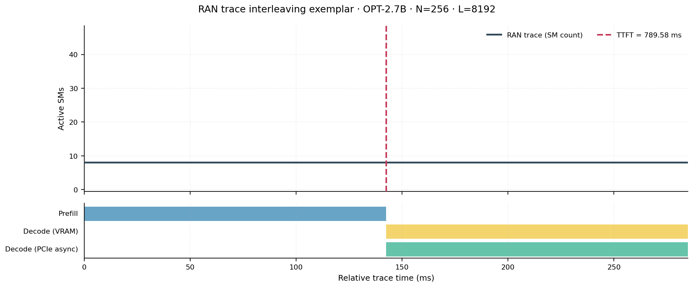
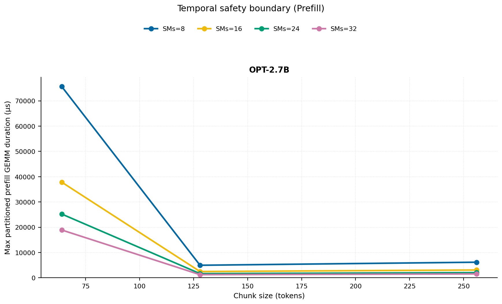
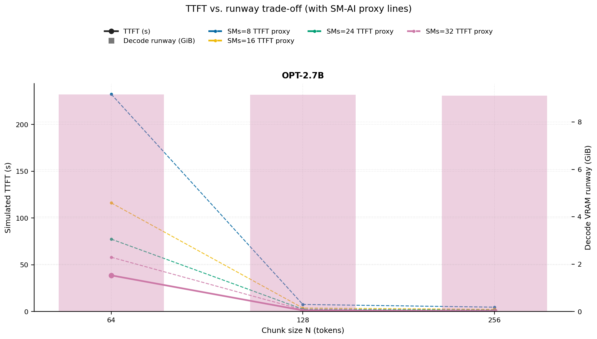
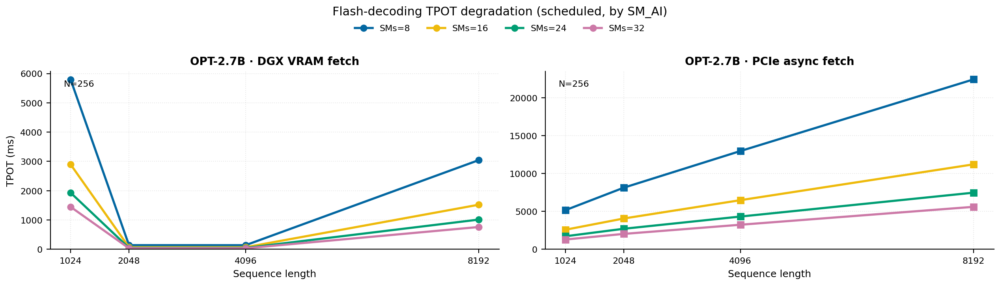
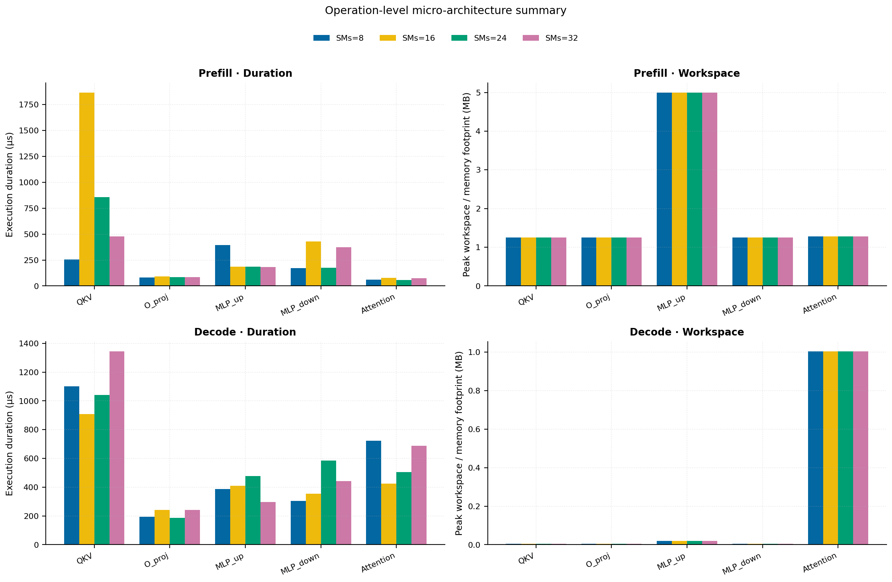
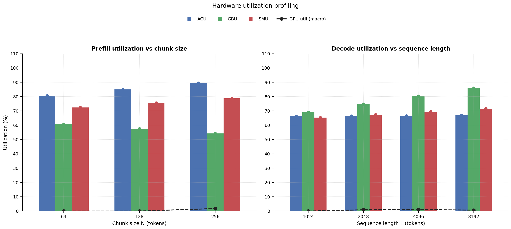

# RAN Inference Profiling Report

Run root: `/mnt/data/dheeraj/dicertation/inference-profile/runs/revised-rerun-20260415-145452-g4-opt27b-c64-256`

## Environment

| field | value |
| --- | --- |
| cache_root | n/a |
| captured_at | 2026-04-15T13:55:01Z |
| chunk_sizes | [64, 128, 256] |
| cuda_available | true |
| cuda_device_count | 8 |
| cwd | /mnt/data/dheeraj/dicertation/inference-profile |
| decode_modes | ["vram", "pcie_async"] |
| experiment_type | ran-dgxspark-v1 |
| gpu_id | 4 |
| l_out | 1024 |
| models | ["facebook/opt-2.7b"] |
| platform | Linux-6.8.0-106-generic-x86_64-with-glibc2.35 |
| python_executable | /home/dheeraj/miniconda3/envs/mls/bin/python |
| python_version | 3.11.14 |
| run_root | /mnt/data/dheeraj/dicertation/inference-profile/runs/revised-rerun-20260415-145452-g4-opt27b-c64-256 |
| scheduler | envelope_v1 |
| schema_version | ran_dgxspark_v1 |
| sequence_lengths | [1024, 2048, 4096, 8192] |
| sm_ai_cap | 32 |
| sm_ai_partition | 100 |
| sm_ai_partitions | [8, 16, 24, 32] |
| stage | profile |
| telemetry_tier | baseline_nvml_pt |
| timed_iterations | 5 |
| torch_available | true |
| torch_version | 2.10.0+cu128 |
| warmup_iterations | 3 |

## Model Constants

| model_id | sm_ai_partition | num_hidden_layers | hidden_size | num_attention_heads | ffn_dim | layer_index | layer_weight_bytes | total_weight_bytes_fp16 | vram_ceiling_bytes |
| --- | --- | --- | --- | --- | --- | --- | --- | --- | --- |
| facebook/opt-2.7b | 100 | 32 | 2560 | 32 | 10240 | 15 | 157352960 | 5303193600 | 15170115993 |

## Trace Inspection

### Primary trace

| field | value |
| --- | --- |
| errors | [] |
| header | ["frame", "slot", "time_slot_sched_ns", "time_decode_start_est_ns", "time_decode_end_est_ns", "time_decode_start_actual_ns", "time_decode_end_actual_ns", "decode_dur_us", "deadline_met", "target_sm", "profile_idx", "sm_count", "num_pusch", "sum_prb", "sum_tbs_bytes", "max_mcs"] |
| median_positive_delta_ms | 5.6997 |
| monotonicity.checked_column | time_slot_sched_ns |
| monotonicity.is_non_decreasing | true |
| monotonicity.negative_delta_count | 0 |
| monotonicity.positive_delta_count | 28377 |
| monotonicity.zero_delta_count | 0 |
| normalization.last_row_duration_policy | median_positive_forward_delta_ms |
| normalization.output_columns | ["time_ms", "sm_utilization", "slot_duration_ms", "source_schema", "sm_count"] |
| normalization.output_relative_path | derived/normalized_ldpc_trace.csv |
| normalized_row_count | 28378 |
| path | /mnt/raid0sata2/netsys/weaver-ext/ran/traces/e2e_2026030418/e2e_20260304_182034_tractor_ran_ctrl/ldpc_trace.csv |
| row_count | 28378 |
| schema_detected | schema_b |
| time_unit_hint | ns |
| usable | true |
| usage_policy | primary_only |
| used_for_scheduler_capacity | true |

### Secondary trace

| field | value |
| --- | --- |
| errors | ["ran_ctrl_trace.csv line 182958 has 9 field(s); expected 12"] |
| header | ["frame", "slot", "sm_available", "prbs_available", "prbs_allocated", "w_avg_mcs_prev", "w_avg_mcs_curr", "slots_since_underutil", "ramp_up_count", "num_ue_sched", "max_ue_backlog", "sum_ue_backlog"] |
| monotonicity.checked_column | n/a |
| monotonicity.is_non_decreasing | n/a |
| monotonicity.negative_delta_count | n/a |
| path | /mnt/raid0sata2/netsys/weaver-ext/ran/traces/e2e_2026030418/e2e_20260304_182034_tractor_ran_ctrl/ran_ctrl_trace.csv |
| row_count | 182956 |
| time_unit_hints | [] |
| usable | false |
| usage_policy | structural_only |
| used_for_scheduler_capacity | false |

## Raw-Profile Summary Tables

### Prefill profile summary

Source raw rows: `raw/prefill_events.csv` = 420. Summary artifact: `derived/prefill_summary.csv`.

| model_id | chunk_tokens | sm_ai_partition | max_input_tokens | prefill_max_gemm_us | prefill_workspace_bytes | prefill_parked_activation_bytes | telemetry_tier | telemetry_provider | telemetry_status | nvml_available | gpu_util | gpu_mem_used_mb | sm_clock_mhz | mem_clock_mhz | power_w | pt_step_ms | pt_mem_alloc_mb | pt_mem_reserved_mb | pt_workspace_mb | acu_pct | gbu_pct | smu_pct | microscopic_telemetry_status | microscopic_error |
| --- | --- | --- | --- | --- | --- | --- | --- | --- | --- | --- | --- | --- | --- | --- | --- | --- | --- | --- | --- | --- | --- | --- | --- | --- |
| facebook/opt-2.7b | 64 | 8 | 1024 | 3372.0319 | 1572864 | 1310720 | baseline_nvml_pt | nvidia-smi | ok | true | 0 | 39 | 1695 | 8001 | 59.94 | 3.372 | 163.4189 | 163.4189 | 1.5 | 71.1 | 70 | 62.1 | estimated | n/a |
| facebook/opt-2.7b | 64 | 16 | 1024 | 6440.9599 | 1572864 | 1310720 | baseline_nvml_pt | nvidia-smi | ok | true | 0 | 39 | 1695 | 7601 | 60.01 | 6.441 | 163.4189 | 163.4189 | 1.5 | 77.4 | 63.84 | 69 | estimated | n/a |
| facebook/opt-2.7b | 64 | 24 | 1024 | 192.512 | 1572864 | 1310720 | baseline_nvml_pt | nvidia-smi | ok | true | 0 | 39 | 1695 | 7601 | 60.27 | 0.1925 | 163.4189 | 163.4189 | 1.5 | 83.7 | 57.68 | 75.9 | estimated | n/a |
| facebook/opt-2.7b | 64 | 32 | 1024 | 3151.8719 | 1572864 | 1310720 | baseline_nvml_pt | nvidia-smi | ok | true | 0 | 39 | 1695 | 7601 | 60.74 | 3.1519 | 163.4189 | 163.4189 | 1.5 | 90 | 51.52 | 82.8 | estimated | n/a |
| facebook/opt-2.7b | 128 | 8 | 1024 | 194.56 | 3538944 | 2621440 | baseline_nvml_pt | nvidia-smi | ok | true | 0 | 39 | 1695 | 7601 | 60.4 | 0.1946 | 167.5439 | 167.5439 | 3.375 | 75.05 | 66.25 | 64.8 | estimated | n/a |
| facebook/opt-2.7b | 128 | 16 | 1024 | 3894.2721 | 3538944 | 2621440 | baseline_nvml_pt | nvidia-smi | ok | true | 0 | 39 | 1695 | 7601 | 59.97 | 3.8943 | 167.5439 | 167.5439 | 3.375 | 81.7 | 60.42 | 72 | estimated | n/a |
| facebook/opt-2.7b | 128 | 24 | 1024 | 9088.0003 | 3538944 | 2621440 | baseline_nvml_pt | nvidia-smi | ok | true | 0 | 39 | 1695 | 7601 | 60.64 | 9.088 | 167.5439 | 167.5439 | 3.375 | 88.35 | 54.59 | 79.2 | estimated | n/a |
| facebook/opt-2.7b | 128 | 32 | 1024 | 206.816 | 3538944 | 2621440 | baseline_nvml_pt | nvidia-smi | ok | true | 0 | 39 | 1695 | 7601 | 60.41 | 0.2068 | 167.5439 | 167.5439 | 3.375 | 95 | 48.76 | 86.4 | estimated | n/a |
| facebook/opt-2.7b | 256 | 8 | 1024 | 221.184 | 5242880 | 5242880 | baseline_nvml_pt | nvidia-smi | ok | true | 7 | 39 | 1695 | 8001 | 60.08 | 0.2212 | 176.0439 | 176.0439 | 5 | 79 | 62.5 | 67.5 | estimated | n/a |
| facebook/opt-2.7b | 256 | 16 | 1024 | 3472.384 | 5242880 | 5242880 | baseline_nvml_pt | nvidia-smi | ok | true | 0 | 39 | 1695 | 7601 | 60.09 | 3.4724 | 176.0439 | 176.0439 | 5 | 86 | 57 | 75 | estimated | n/a |
| facebook/opt-2.7b | 256 | 24 | 1024 | 221.184 | 5242880 | 5242880 | baseline_nvml_pt | nvidia-smi | ok | true | 0 | 39 | 1695 | 8001 | 60.65 | 0.2212 | 176.0439 | 176.0439 | 5 | 93 | 51.5 | 82.5 | estimated | n/a |
| facebook/opt-2.7b | 256 | 32 | 1024 | 257.024 | 5242880 | 5242880 | baseline_nvml_pt | nvidia-smi | ok | true | 0 | 39 | 1695 | 7601 | 60.99 | 0.257 | 176.0439 | 176.0439 | 5 | 100 | 46 | 90 | estimated | n/a |

### Decode profile summary

Source raw rows: `raw/decode_events.csv` = 3840. Summary artifact: `derived/decode_summary.csv`.

| model_id | sequence_length | block_size | sm_ai_partition | decode_mode | decode_max_gemv_us | attention_fetch_compute_us | reduction_overhead_us | decode_workspace_bytes | decode_parked_activation_bytes | telemetry_tier | telemetry_provider | telemetry_status | nvml_available | gpu_util | gpu_mem_used_mb | sm_clock_mhz | mem_clock_mhz | power_w | pt_step_ms | pt_mem_alloc_mb | pt_mem_reserved_mb | pt_workspace_mb | acu_pct | gbu_pct | smu_pct | microscopic_telemetry_status | microscopic_error |
| --- | --- | --- | --- | --- | --- | --- | --- | --- | --- | --- | --- | --- | --- | --- | --- | --- | --- | --- | --- | --- | --- | --- | --- | --- | --- | --- | --- |
| facebook/opt-2.7b | 1024 | 64 | 8 | pcie_async | 2968.672 | 131.8912 | 22.528 | 136192 | 5120 | baseline_nvml_pt | nvidia-smi | ok | true | 0 | 39 | 1695 | 7601 | 60.4 | 2.9687 | 169.2031 | 169.2031 | 0.1299 | 58.195 | 75.69 | 56.64 | estimated | n/a |
| facebook/opt-2.7b | 1024 | 64 | 8 | vram | 151.488 | 129.4336 | 21.1456 | 136192 | 5120 | baseline_nvml_pt | nvidia-smi | ok | true | 0 | 39 | 1695 | 7601 | 60.43 | 0.1515 | 169.2031 | 169.2031 | 0.1299 | 59.85 | 70.525 | 58.28 | estimated | n/a |
| facebook/opt-2.7b | 1024 | 64 | 16 | pcie_async | 3057.6639 | 129.2608 | 22.3744 | 136192 | 5120 | baseline_nvml_pt | nvidia-smi | ok | true | 0 | 39 | 1695 | 8001 | 61.02 | 3.0577 | 169.2031 | 169.2031 | 0.1299 | 62.83 | 73.08 | 61.44 | estimated | n/a |
| facebook/opt-2.7b | 1024 | 64 | 16 | vram | 3777.632 | 132.096 | 22.3232 | 136192 | 5120 | baseline_nvml_pt | nvidia-smi | ok | true | 0 | 39 | 1695 | 7601 | 60.47 | 3.7776 | 169.2031 | 169.2031 | 0.1299 | 64.6 | 68.25 | 63.92 | estimated | n/a |
| facebook/opt-2.7b | 1024 | 64 | 24 | pcie_async | 176.128 | 126.9824 | 22.144 | 136192 | 5120 | baseline_nvml_pt | nvidia-smi | ok | true | 0 | 39 | 1695 | 7601 | 60.6 | 0.1761 | 169.2031 | 169.2031 | 0.1299 | 67.465 | 70.47 | 66.24 | estimated | n/a |
| facebook/opt-2.7b | 1024 | 64 | 24 | vram | 3496.9599 | 126.7712 | 21.8944 | 136192 | 5120 | baseline_nvml_pt | nvidia-smi | ok | true | 0 | 39 | 1695 | 7601 | 60.58 | 3.497 | 169.2031 | 169.2031 | 0.1299 | 69.35 | 65.975 | 69.56 | estimated | n/a |
| facebook/opt-2.7b | 1024 | 64 | 32 | pcie_async | 3302.4001 | 130.6496 | 662.528 | 136192 | 5120 | baseline_nvml_pt | nvidia-smi | ok | true | 0 | 39 | 1695 | 7601 | 60.7 | 3.3024 | 169.2031 | 169.2031 | 0.1299 | 72.1 | 67.86 | 71.04 | estimated | n/a |
| facebook/opt-2.7b | 1024 | 64 | 32 | vram | 3600.384 | 127.9552 | 20.9216 | 136192 | 5120 | baseline_nvml_pt | nvidia-smi | ok | true | 0 | 39 | 1695 | 7601 | 60.22 | 3.6004 | 169.2031 | 169.2031 | 0.1299 | 74.1 | 63.7 | 75.2 | estimated | n/a |
| facebook/opt-2.7b | 1024 | 128 | 8 | pcie_async | 1172.48 | 142.784 | 24.1792 | 136192 | 5120 | baseline_nvml_pt | nvidia-smi | ok | true | 0 | 39 | 1695 | 8001 | 60.52 | 1.1725 | 169.2031 | 169.2031 | 0.1299 | 58.195 | 75.255 | 56.64 | estimated | n/a |
| facebook/opt-2.7b | 1024 | 128 | 8 | vram | 3868.6719 | 132.2688 | 671.5328 | 136192 | 5120 | baseline_nvml_pt | nvidia-smi | ok | true | 0 | 39 | 1695 | 7601 | 60.34 | 3.8687 | 169.2031 | 169.2031 | 0.1299 | 60.165 | 70.1375 | 58.28 | estimated | n/a |
| facebook/opt-2.7b | 1024 | 128 | 16 | pcie_async | 151.552 | 129.9008 | 21.0688 | 136192 | 5120 | baseline_nvml_pt | nvidia-smi | ok | true | 0 | 39 | 1695 | 7601 | 61.06 | 0.1516 | 169.2031 | 169.2031 | 0.1299 | 62.83 | 72.66 | 61.44 | estimated | n/a |
| facebook/opt-2.7b | 1024 | 128 | 16 | vram | 239.68 | 141.1072 | 22.336 | 136192 | 5120 | baseline_nvml_pt | nvidia-smi | ok | true | 0 | 39 | 1695 | 7601 | 60.63 | 0.2397 | 169.2031 | 169.2031 | 0.1299 | 64.94 | 67.875 | 63.92 | estimated | n/a |
| facebook/opt-2.7b | 1024 | 128 | 24 | pcie_async | 153.504 | 128.032 | 21.0688 | 136192 | 5120 | baseline_nvml_pt | nvidia-smi | ok | true | 0 | 39 | 1695 | 7601 | 60.99 | 0.1535 | 169.2031 | 169.2031 | 0.1299 | 67.465 | 70.065 | 66.24 | estimated | n/a |
| facebook/opt-2.7b | 1024 | 128 | 24 | vram | 210.944 | 128.4096 | 28.8768 | 136192 | 5120 | baseline_nvml_pt | nvidia-smi | ok | true | 0 | 39 | 1695 | 7601 | 60.36 | 0.2109 | 169.2031 | 169.2031 | 0.1299 | 69.715 | 65.6125 | 69.56 | estimated | n/a |
| facebook/opt-2.7b | 1024 | 128 | 32 | pcie_async | 3735.5521 | 128.2048 | 22.5152 | 136192 | 5120 | baseline_nvml_pt | nvidia-smi | ok | true | 0 | 39 | 1695 | 7601 | 61.16 | 3.7356 | 169.2031 | 169.2031 | 0.1299 | 72.1 | 67.47 | 71.04 | estimated | n/a |
| facebook/opt-2.7b | 1024 | 128 | 32 | vram | 2996.2239 | 131.0848 | 20.5376 | 136192 | 5120 | baseline_nvml_pt | nvidia-smi | ok | true | 0 | 39 | 1695 | 7601 | 61.07 | 2.9962 | 169.2031 | 169.2031 | 0.1299 | 74.49 | 63.35 | 75.2 | estimated | n/a |
| facebook/opt-2.7b | 1024 | 256 | 8 | pcie_async | 3417.088 | 129.8368 | 20.3392 | 136192 | 5120 | baseline_nvml_pt | nvidia-smi | ok | true | 0 | 39 | 1695 | 8001 | 60.84 | 3.4171 | 169.2031 | 169.2031 | 0.1299 | 58.195 | 74.82 | 56.64 | estimated | n/a |
| facebook/opt-2.7b | 1024 | 256 | 8 | vram | 171.008 | 139.712 | 23.7568 | 136192 | 5120 | baseline_nvml_pt | nvidia-smi | ok | true | 0 | 39 | 1695 | 7601 | 60.42 | 0.171 | 169.2031 | 169.2031 | 0.1299 | 60.48 | 69.75 | 58.28 | estimated | n/a |
| facebook/opt-2.7b | 1024 | 256 | 16 | pcie_async | 243.712 | 175.5328 | 36.448 | 136192 | 5120 | baseline_nvml_pt | nvidia-smi | ok | true | 0 | 39 | 1695 | 7601 | 60.67 | 0.2437 | 169.2031 | 169.2031 | 0.1299 | 62.83 | 72.24 | 61.44 | estimated | n/a |
| facebook/opt-2.7b | 1024 | 256 | 16 | vram | 258.048 | 134.5664 | 22.528 | 136192 | 5120 | baseline_nvml_pt | nvidia-smi | ok | true | 0 | 39 | 1695 | 7601 | 61.1 | 0.258 | 169.2031 | 169.2031 | 0.1299 | 65.28 | 67.5 | 63.92 | estimated | n/a |
| facebook/opt-2.7b | 1024 | 256 | 24 | pcie_async | 161.792 | 122.6752 | 21.504 | 136192 | 5120 | baseline_nvml_pt | nvidia-smi | ok | true | 0 | 39 | 1695 | 7601 | 60.88 | 0.1618 | 169.2031 | 169.2031 | 0.1299 | 67.465 | 69.66 | 66.24 | estimated | n/a |
| facebook/opt-2.7b | 1024 | 256 | 24 | vram | 193.536 | 177.9712 | 28.672 | 136192 | 5120 | baseline_nvml_pt | nvidia-smi | ok | true | 0 | 39 | 1695 | 7601 | 61.09 | 0.2273 | 169.2031 | 169.2031 | 0.1299 | 70.08 | 65.25 | 69.56 | estimated | n/a |
| facebook/opt-2.7b | 1024 | 256 | 32 | pcie_async | 3122.1759 | 126.9632 | 21.0944 | 136192 | 5120 | baseline_nvml_pt | nvidia-smi | ok | true | 0 | 39 | 1695 | 7601 | 60.43 | 3.1222 | 169.2031 | 169.2031 | 0.1299 | 72.1 | 67.08 | 71.04 | estimated | n/a |
| facebook/opt-2.7b | 1024 | 256 | 32 | vram | 7509.0241 | 127.3856 | 21.504 | 136192 | 5120 | baseline_nvml_pt | nvidia-smi | ok | true | 0 | 39 | 1695 | 7601 | 60.62 | 7.509 | 169.2031 | 169.2031 | 0.1299 | 74.88 | 63 | 75.2 | estimated | n/a |
| facebook/opt-2.7b | 2048 | 64 | 8 | pcie_async | 204.8 | 153.5872 | 23.7312 | 267264 | 5120 | baseline_nvml_pt | nvidia-smi | ok | true | 7 | 39 | 1695 | 7601 | 60.88 | 0.2048 | 178.4531 | 178.4531 | 0.2549 | 57.065 | 82.07 | 57.82 | estimated | n/a |
| facebook/opt-2.7b | 2048 | 64 | 8 | vram | 177.056 | 128.8 | 21.4848 | 267264 | 5120 | baseline_nvml_pt | nvidia-smi | ok | true | 0 | 39 | 1695 | 7601 | 60.38 | 0.1771 | 178.4531 | 178.4531 | 0.2549 | 61.11 | 74.6583 | 60.3467 | estimated | n/a |
| facebook/opt-2.7b | 2048 | 64 | 16 | pcie_async | 3565.568 | 136.4096 | 21.6512 | 267264 | 5120 | baseline_nvml_pt | nvidia-smi | ok | true | 0 | 39 | 1695 | 7601 | 61.16 | 3.5656 | 178.4531 | 178.4531 | 0.2549 | 61.61 | 79.24 | 62.72 | estimated | n/a |
| facebook/opt-2.7b | 2048 | 64 | 16 | vram | 3168.256 | 134.3488 | 22.528 | 267264 | 5120 | baseline_nvml_pt | nvidia-smi | ok | true | 0 | 39 | 1695 | 7601 | 60.75 | 3.1683 | 178.4531 | 178.4531 | 0.2549 | 65.96 | 72.25 | 66.1867 | estimated | n/a |
| facebook/opt-2.7b | 2048 | 64 | 24 | pcie_async | 4791.296 | 201.5232 | 26.208 | 267264 | 5120 | baseline_nvml_pt | nvidia-smi | ok | true | 0 | 39 | 1695 | 7601 | 60.99 | 4.7913 | 178.4531 | 178.4531 | 0.2549 | 66.155 | 76.41 | 67.62 | estimated | n/a |
| facebook/opt-2.7b | 2048 | 64 | 24 | vram | 166.88 | 145.792 | 23.3152 | 267264 | 5120 | baseline_nvml_pt | nvidia-smi | ok | true | 0 | 39 | 1695 | 7601 | 60.43 | 0.1782 | 178.4531 | 178.4531 | 0.2549 | 70.81 | 69.8417 | 72.0267 | estimated | n/a |
| facebook/opt-2.7b | 2048 | 64 | 32 | pcie_async | 231.424 | 142.9504 | 23.552 | 267264 | 5120 | baseline_nvml_pt | nvidia-smi | ok | true | 0 | 39 | 1695 | 8001 | 61.46 | 0.2314 | 178.4531 | 178.4531 | 0.2549 | 70.7 | 73.58 | 72.52 | estimated | n/a |
| facebook/opt-2.7b | 2048 | 64 | 32 | vram | 157.792 | 130.2656 | 21.9136 | 267264 | 5120 | baseline_nvml_pt | nvidia-smi | ok | true | 0 | 39 | 1695 | 7601 | 60.89 | 0.1578 | 178.4531 | 178.4531 | 0.2549 | 75.66 | 67.4333 | 77.8667 | estimated | n/a |
| facebook/opt-2.7b | 2048 | 128 | 8 | pcie_async | 3837.9519 | 190.0416 | 37.6832 | 267264 | 5120 | baseline_nvml_pt | nvidia-smi | ok | true | 0 | 39 | 1695 | 7601 | 60.83 | 3.838 | 178.4531 | 178.4531 | 0.2549 | 57.065 | 82.505 | 58.0167 | estimated | n/a |
| facebook/opt-2.7b | 2048 | 128 | 8 | vram | 190.464 | 133.7344 | 21.1072 | 267264 | 5120 | baseline_nvml_pt | nvidia-smi | ok | true | 0 | 39 | 1695 | 8001 | 61.05 | 0.1905 | 178.4531 | 178.4531 | 0.2549 | 61.635 | 74.7875 | 60.5533 | estimated | n/a |
| facebook/opt-2.7b | 2048 | 128 | 16 | pcie_async | 377.888 | 154.4128 | 29.9264 | 267264 | 5120 | baseline_nvml_pt | nvidia-smi | ok | true | 0 | 39 | 1695 | 7601 | 61.04 | 0.3779 | 178.4531 | 178.4531 | 0.2549 | 61.61 | 79.66 | 62.9333 | estimated | n/a |
| facebook/opt-2.7b | 2048 | 128 | 16 | vram | 170.88 | 129.44 | 20.6784 | 267264 | 5120 | baseline_nvml_pt | nvidia-smi | ok | true | 0 | 39 | 1695 | 8001 | 60.96 | 0.1709 | 178.4531 | 178.4531 | 0.2549 | 66.5267 | 72.375 | 66.4133 | estimated | n/a |
| facebook/opt-2.7b | 2048 | 128 | 24 | pcie_async | 197.632 | 130.5088 | 21.8752 | 267264 | 5120 | baseline_nvml_pt | nvidia-smi | ok | true | 0 | 39 | 1695 | 7601 | 60.98 | 0.1976 | 178.4531 | 178.4531 | 0.2549 | 66.155 | 76.815 | 67.85 | estimated | n/a |
| facebook/opt-2.7b | 2048 | 128 | 24 | vram | 3094.528 | 747.7376 | 21.7216 | 267264 | 5120 | baseline_nvml_pt | nvidia-smi | ok | true | 0 | 39 | 1695 | 7601 | 60.83 | 3.2102 | 178.4531 | 178.4531 | 0.2549 | 71.4183 | 69.9625 | 72.2733 | estimated | n/a |
| facebook/opt-2.7b | 2048 | 128 | 32 | pcie_async | 3136.512 | 166.944 | 625.0496 | 267264 | 5120 | baseline_nvml_pt | nvidia-smi | ok | true | 0 | 39 | 1695 | 7601 | 60.67 | 3.1365 | 178.4531 | 178.4531 | 0.2549 | 70.7 | 73.97 | 72.7667 | estimated | n/a |
| facebook/opt-2.7b | 2048 | 128 | 32 | vram | 195.584 | 153.0112 | 26.6048 | 267264 | 5120 | baseline_nvml_pt | nvidia-smi | ok | true | 7 | 39 | 1695 | 8001 | 60.79 | 0.1956 | 178.4531 | 178.4531 | 0.2549 | 76.31 | 67.55 | 78.1333 | estimated | n/a |
| facebook/opt-2.7b | 2048 | 256 | 8 | pcie_async | 3474.432 | 135.3856 | 21.504 | 267264 | 5120 | baseline_nvml_pt | nvidia-smi | ok | true | 0 | 39 | 1695 | 8001 | 61.14 | 3.4744 | 178.4531 | 178.4531 | 0.2549 | 57.065 | 82.94 | 58.2133 | estimated | n/a |
| facebook/opt-2.7b | 2048 | 256 | 8 | vram | 254.976 | 133.3312 | 21.9136 | 267264 | 5120 | baseline_nvml_pt | nvidia-smi | ok | true | 0 | 39 | 1695 | 7601 | 61 | 0.255 | 178.4531 | 178.4531 | 0.2549 | 62.16 | 74.9167 | 60.76 | estimated | n/a |
| facebook/opt-2.7b | 2048 | 256 | 16 | pcie_async | 2956.2881 | 180.6336 | 30.3424 | 267264 | 5120 | baseline_nvml_pt | nvidia-smi | ok | true | 0 | 39 | 1695 | 7601 | 60.98 | 2.9563 | 178.4531 | 178.4531 | 0.2549 | 61.61 | 80.08 | 63.1467 | estimated | n/a |
| facebook/opt-2.7b | 2048 | 256 | 16 | vram | 162.88 | 130.6624 | 21.9072 | 267264 | 5120 | baseline_nvml_pt | nvidia-smi | ok | true | 0 | 39 | 1695 | 7601 | 61.15 | 0.1629 | 178.4531 | 178.4531 | 0.2549 | 67.0933 | 72.5 | 66.64 | estimated | n/a |
| facebook/opt-2.7b | 2048 | 256 | 24 | pcie_async | 3485.6961 | 132.7104 | 24.3776 | 267264 | 5120 | baseline_nvml_pt | nvidia-smi | ok | true | 0 | 39 | 1695 | 7601 | 60.84 | 3.4857 | 178.4531 | 178.4531 | 0.2549 | 66.155 | 77.22 | 68.08 | estimated | n/a |
| facebook/opt-2.7b | 2048 | 256 | 24 | vram | 6448.1282 | 136.7808 | 21.3184 | 267264 | 5120 | baseline_nvml_pt | nvidia-smi | ok | true | 0 | 39 | 1695 | 7601 | 60.94 | 6.4481 | 178.4531 | 178.4531 | 0.2549 | 72.0267 | 70.0833 | 72.52 | estimated | n/a |
| facebook/opt-2.7b | 2048 | 256 | 32 | pcie_async | 3283.968 | 768.2048 | 21.2608 | 267264 | 5120 | baseline_nvml_pt | nvidia-smi | ok | true | 0 | 39 | 1695 | 7601 | 60.76 | 3.3178 | 178.4531 | 178.4531 | 0.2549 | 70.7 | 74.36 | 73.0133 | estimated | n/a |
| facebook/opt-2.7b | 2048 | 256 | 32 | vram | 157.696 | 132.3392 | 21.7088 | 267264 | 5120 | baseline_nvml_pt | nvidia-smi | ok | true | 7 | 39 | 1695 | 8001 | 60.99 | 0.1577 | 178.4531 | 178.4531 | 0.2549 | 76.96 | 67.6667 | 78.4 | estimated | n/a |
| facebook/opt-2.7b | 4096 | 64 | 8 | pcie_async | 3185.6639 | 763.2768 | 20.6848 | 529408 | 5120 | baseline_nvml_pt | nvidia-smi | ok | true | 0 | 39 | 1695 | 7601 | 60.96 | 3.2246 | 198.7031 | 198.7031 | 0.5049 | 55.935 | 88.45 | 59 | estimated | n/a |
| facebook/opt-2.7b | 4096 | 64 | 8 | vram | 150.528 | 760.4224 | 21.2928 | 529408 | 5120 | baseline_nvml_pt | nvidia-smi | ok | true | 0 | 39 | 1695 | 7601 | 60.29 | 3.2246 | 198.7031 | 198.7031 | 0.5049 | 62.37 | 78.7917 | 62.4133 | estimated | n/a |
| facebook/opt-2.7b | 4096 | 64 | 16 | pcie_async | 162.816 | 147.6096 | 21.4848 | 529408 | 5120 | baseline_nvml_pt | nvidia-smi | ok | true | 0 | 39 | 1695 | 7601 | 60.27 | 0.1628 | 198.7031 | 198.7031 | 0.5049 | 60.39 | 85.4 | 64 | estimated | n/a |
| facebook/opt-2.7b | 4096 | 64 | 16 | vram | 253.024 | 268.288 | 26.2208 | 529408 | 5120 | baseline_nvml_pt | nvidia-smi | ok | true | 0 | 39 | 1695 | 7601 | 60.61 | 0.6093 | 198.7031 | 198.7031 | 0.5049 | 67.32 | 76.25 | 68.4533 | estimated | n/a |
| facebook/opt-2.7b | 4096 | 64 | 24 | pcie_async | 3179.5199 | 148.6976 | 21.9328 | 529408 | 5120 | baseline_nvml_pt | nvidia-smi | ok | true | 0 | 39 | 1695 | 8001 | 61.17 | 3.1795 | 198.7031 | 198.7031 | 0.5049 | 64.845 | 82.35 | 69 | estimated | n/a |
| facebook/opt-2.7b | 4096 | 64 | 24 | vram | 3160.064 | 146.6048 | 21.9328 | 529408 | 5120 | baseline_nvml_pt | nvidia-smi | ok | true | 0 | 39 | 1695 | 7601 | 60.89 | 3.1601 | 198.7031 | 198.7031 | 0.5049 | 72.27 | 73.7083 | 74.4933 | estimated | n/a |
| facebook/opt-2.7b | 4096 | 64 | 32 | pcie_async | 4376.5759 | 190.6304 | 27.4432 | 529408 | 5120 | baseline_nvml_pt | nvidia-smi | ok | true | 0 | 39 | 1695 | 7601 | 60.82 | 4.3766 | 198.7031 | 198.7031 | 0.5049 | 69.3 | 79.3 | 74 | estimated | n/a |
| facebook/opt-2.7b | 4096 | 64 | 32 | vram | 3675.1361 | 147.6608 | 23.3472 | 529408 | 5120 | baseline_nvml_pt | nvidia-smi | ok | true | 0 | 39 | 1695 | 7601 | 60.93 | 3.6751 | 198.7031 | 198.7031 | 0.5049 | 77.22 | 71.1667 | 80.5333 | estimated | n/a |
| facebook/opt-2.7b | 4096 | 128 | 8 | pcie_async | 183.296 | 539.0528 | 630.752 | 529408 | 5120 | baseline_nvml_pt | nvidia-smi | ok | true | 8 | 39 | 1695 | 8001 | 60.99 | 3.0669 | 198.7031 | 198.7031 | 0.5049 | 55.935 | 89.755 | 59.3933 | estimated | n/a |
| facebook/opt-2.7b | 4096 | 128 | 8 | vram | 1906.688 | 877.3632 | 25.1648 | 529408 | 5120 | baseline_nvml_pt | nvidia-smi | ok | true | 0 | 39 | 1695 | 7601 | 60.24 | 3.5133 | 198.7031 | 198.7031 | 0.5049 | 63.105 | 79.4375 | 62.8267 | estimated | n/a |
| facebook/opt-2.7b | 4096 | 128 | 16 | pcie_async | 3094.528 | 744.448 | 21.0304 | 529408 | 5120 | baseline_nvml_pt | nvidia-smi | ok | true | 0 | 39 | 1695 | 7601 | 61.1 | 3.159 | 198.7031 | 198.7031 | 0.5049 | 60.39 | 86.66 | 64.4267 | estimated | n/a |
| facebook/opt-2.7b | 4096 | 128 | 16 | vram | 6766.592 | 155.4304 | 21.8752 | 529408 | 5120 | baseline_nvml_pt | nvidia-smi | ok | true | 0 | 39 | 1695 | 7601 | 60.78 | 6.7666 | 198.7031 | 198.7031 | 0.5049 | 68.1133 | 76.875 | 68.9067 | estimated | n/a |
| facebook/opt-2.7b | 4096 | 128 | 24 | pcie_async | 332.8 | 203.552 | 23.7568 | 529408 | 5120 | baseline_nvml_pt | nvidia-smi | ok | true | 0 | 39 | 1695 | 7601 | 61.14 | 0.3512 | 198.7031 | 198.7031 | 0.5049 | 64.845 | 83.565 | 69.46 | estimated | n/a |
| facebook/opt-2.7b | 4096 | 128 | 24 | vram | 5638.144 | 494.6176 | 26.0096 | 529408 | 5120 | baseline_nvml_pt | nvidia-smi | ok | true | 0 | 39 | 1695 | 7601 | 60.73 | 5.6381 | 198.7031 | 198.7031 | 0.5049 | 73.1217 | 74.3125 | 74.9867 | estimated | n/a |
| facebook/opt-2.7b | 4096 | 128 | 32 | pcie_async | 3405.8239 | 142.08 | 21.2864 | 529408 | 5120 | baseline_nvml_pt | nvidia-smi | ok | true | 0 | 39 | 1695 | 7601 | 60.57 | 3.4058 | 198.7031 | 198.7031 | 0.5049 | 69.3 | 80.47 | 74.4933 | estimated | n/a |
| facebook/opt-2.7b | 4096 | 128 | 32 | vram | 217.088 | 150.5088 | 23.5456 | 529408 | 5120 | baseline_nvml_pt | nvidia-smi | ok | true | 0 | 39 | 1695 | 8001 | 61.36 | 0.2171 | 198.7031 | 198.7031 | 0.5049 | 78.13 | 71.75 | 81.0667 | estimated | n/a |
| facebook/opt-2.7b | 4096 | 256 | 8 | pcie_async | 284.672 | 169.568 | 21.7088 | 529408 | 5120 | baseline_nvml_pt | nvidia-smi | ok | true | 8 | 39 | 1695 | 8001 | 60.97 | 0.2847 | 198.7031 | 198.7031 | 0.5049 | 55.935 | 91.06 | 59.7867 | estimated | n/a |
| facebook/opt-2.7b | 4096 | 256 | 8 | vram | 297.92 | 140.6336 | 23.424 | 529408 | 5120 | baseline_nvml_pt | nvidia-smi | ok | true | 8 | 39 | 1695 | 8001 | 61.42 | 0.2979 | 198.7031 | 198.7031 | 0.5049 | 63.84 | 80.0833 | 63.24 | estimated | n/a |
| facebook/opt-2.7b | 4096 | 256 | 16 | pcie_async | 151.552 | 146.0224 | 21.2992 | 529408 | 5120 | baseline_nvml_pt | nvidia-smi | ok | true | 0 | 39 | 1695 | 7601 | 60.64 | 0.1567 | 198.7031 | 198.7031 | 0.5049 | 60.39 | 87.92 | 64.8533 | estimated | n/a |
| facebook/opt-2.7b | 4096 | 256 | 16 | vram | 186.368 | 152.576 | 21.7088 | 529408 | 5120 | baseline_nvml_pt | nvidia-smi | ok | true | 0 | 39 | 1695 | 8001 | 60.88 | 0.1864 | 198.7031 | 198.7031 | 0.5049 | 68.9067 | 77.5 | 69.36 | estimated | n/a |
| facebook/opt-2.7b | 4096 | 256 | 24 | pcie_async | 5326.848 | 165.2736 | 23.7568 | 529408 | 5120 | baseline_nvml_pt | nvidia-smi | ok | true | 0 | 39 | 1695 | 7601 | 60.68 | 5.3268 | 198.7031 | 198.7031 | 0.5049 | 64.845 | 84.78 | 69.92 | estimated | n/a |
| facebook/opt-2.7b | 4096 | 256 | 24 | vram | 200.704 | 154.1568 | 21.4848 | 529408 | 5120 | baseline_nvml_pt | nvidia-smi | ok | true | 0 | 39 | 1695 | 7601 | 60.98 | 0.2007 | 198.7031 | 198.7031 | 0.5049 | 73.9733 | 74.9167 | 75.48 | estimated | n/a |
| facebook/opt-2.7b | 4096 | 256 | 32 | pcie_async | 2492.4159 | 195.1616 | 24.7936 | 529408 | 5120 | baseline_nvml_pt | nvidia-smi | ok | true | 0 | 39 | 1695 | 7601 | 60.54 | 2.4924 | 198.7031 | 198.7031 | 0.5049 | 69.3 | 81.64 | 74.9867 | estimated | n/a |
| facebook/opt-2.7b | 4096 | 256 | 32 | vram | 154.624 | 143.5392 | 22.0992 | 529408 | 5120 | baseline_nvml_pt | nvidia-smi | ok | true | 0 | 39 | 1695 | 7601 | 61.33 | 0.1546 | 198.7031 | 198.7031 | 0.5049 | 79.04 | 72.3333 | 81.6 | estimated | n/a |
| facebook/opt-2.7b | 8192 | 64 | 8 | pcie_async | 1292.2879 | 234.9056 | 24.5824 | 1053696 | 5120 | baseline_nvml_pt | nvidia-smi | ok | true | 0 | 39 | 1695 | 7601 | 60.92 | 1.2923 | 239.2031 | 239.2031 | 1.0049 | 54.805 | 94.83 | 60.18 | estimated | n/a |
| facebook/opt-2.7b | 8192 | 64 | 8 | vram | 161.792 | 192.512 | 21.28 | 1053696 | 5120 | baseline_nvml_pt | nvidia-smi | ok | true | 0 | 39 | 1695 | 7601 | 60.7 | 0.1997 | 239.2031 | 239.2031 | 1.0049 | 63.63 | 82.925 | 64.48 | estimated | n/a |
| facebook/opt-2.7b | 8192 | 64 | 16 | pcie_async | 3919.008 | 190.7968 | 20.9024 | 1053696 | 5120 | baseline_nvml_pt | nvidia-smi | ok | true | 0 | 39 | 1695 | 8001 | 61.47 | 3.919 | 239.2031 | 239.2031 | 1.0049 | 59.17 | 91.56 | 65.28 | estimated | n/a |
| facebook/opt-2.7b | 8192 | 64 | 16 | vram | 192.512 | 195.1744 | 21.3056 | 1053696 | 5120 | baseline_nvml_pt | nvidia-smi | ok | true | 0 | 39 | 1695 | 7601 | 61.07 | 0.2017 | 239.2031 | 239.2031 | 1.0049 | 68.68 | 80.25 | 70.72 | estimated | n/a |
| facebook/opt-2.7b | 8192 | 64 | 24 | pcie_async | 153.6 | 198.048 | 22.7328 | 1053696 | 5120 | baseline_nvml_pt | nvidia-smi | ok | true | 0 | 39 | 1695 | 7601 | 60.88 | 0.2079 | 239.2031 | 239.2031 | 1.0049 | 63.535 | 88.29 | 70.38 | estimated | n/a |
| facebook/opt-2.7b | 8192 | 64 | 24 | vram | 174.08 | 912.7808 | 21.888 | 1053696 | 5120 | baseline_nvml_pt | nvidia-smi | ok | true | 0 | 39 | 1695 | 7601 | 60.49 | 3.8093 | 239.2031 | 239.2031 | 1.0049 | 73.73 | 77.575 | 76.96 | estimated | n/a |
| facebook/opt-2.7b | 8192 | 64 | 32 | pcie_async | 183.296 | 1382.7904 | 22.1056 | 1053696 | 5120 | baseline_nvml_pt | nvidia-smi | ok | true | 0 | 39 | 1695 | 7601 | 60.27 | 3.3608 | 239.2031 | 239.2031 | 1.0049 | 67.9 | 85.02 | 75.48 | estimated | n/a |
| facebook/opt-2.7b | 8192 | 64 | 32 | vram | 356.288 | 192.1088 | 21.0752 | 1053696 | 5120 | baseline_nvml_pt | nvidia-smi | ok | true | 0 | 39 | 1695 | 7601 | 61.01 | 0.3563 | 239.2031 | 239.2031 | 1.0049 | 78.78 | 74.9 | 83.2 | estimated | n/a |
| facebook/opt-2.7b | 8192 | 128 | 8 | pcie_async | 2400.3201 | 198.8288 | 21.696 | 1053696 | 5120 | baseline_nvml_pt | nvidia-smi | ok | true | 0 | 39 | 1695 | 7601 | 60.65 | 2.4003 | 239.2031 | 239.2031 | 1.0049 | 54.805 | 97.005 | 60.77 | estimated | n/a |
| facebook/opt-2.7b | 8192 | 128 | 8 | vram | 171.008 | 200.0896 | 22.1568 | 1053696 | 5120 | baseline_nvml_pt | nvidia-smi | ok | true | 8 | 39 | 1695 | 8001 | 61.47 | 0.2079 | 239.2031 | 239.2031 | 1.0049 | 64.575 | 84.0875 | 65.1 | estimated | n/a |
| facebook/opt-2.7b | 8192 | 128 | 16 | pcie_async | 151.552 | 191.0464 | 20.3008 | 1053696 | 5120 | baseline_nvml_pt | nvidia-smi | ok | true | 0 | 39 | 1695 | 7601 | 61.12 | 0.1946 | 239.2031 | 239.2031 | 1.0049 | 59.17 | 93.66 | 65.92 | estimated | n/a |
| facebook/opt-2.7b | 8192 | 128 | 16 | vram | 274.432 | 245.12 | 21.2864 | 1053696 | 5120 | baseline_nvml_pt | nvidia-smi | ok | true | 0 | 39 | 1695 | 7601 | 60.88 | 0.4668 | 239.2031 | 239.2031 | 1.0049 | 69.7 | 81.375 | 71.4 | estimated | n/a |
| facebook/opt-2.7b | 8192 | 128 | 24 | pcie_async | 212.992 | 189.6 | 21.2992 | 1053696 | 5120 | baseline_nvml_pt | nvidia-smi | ok | true | 0 | 39 | 1695 | 7601 | 61.1 | 0.213 | 239.2031 | 239.2031 | 1.0049 | 63.535 | 90.315 | 71.07 | estimated | n/a |
| facebook/opt-2.7b | 8192 | 128 | 24 | vram | 155.648 | 209.1008 | 21.0944 | 1053696 | 5120 | baseline_nvml_pt | nvidia-smi | ok | true | 0 | 39 | 1695 | 7601 | 61.46 | 0.2611 | 239.2031 | 239.2031 | 1.0049 | 74.825 | 78.6625 | 77.7 | estimated | n/a |
| facebook/opt-2.7b | 8192 | 128 | 32 | pcie_async | 2468.672 | 292.4544 | 23.9616 | 1053696 | 5120 | baseline_nvml_pt | nvidia-smi | ok | true | 0 | 39 | 1695 | 7601 | 60.5 | 2.4687 | 239.2031 | 239.2031 | 1.0049 | 67.9 | 86.97 | 76.22 | estimated | n/a |
| facebook/opt-2.7b | 8192 | 128 | 32 | vram | 209.92 | 197.5936 | 23.1552 | 1053696 | 5120 | baseline_nvml_pt | nvidia-smi | ok | true | 0 | 39 | 1695 | 7601 | 60.94 | 0.2099 | 239.2031 | 239.2031 | 1.0049 | 79.95 | 75.95 | 84 | estimated | n/a |
| facebook/opt-2.7b | 8192 | 256 | 8 | pcie_async | 3420.1601 | 928.3136 | 21.056 | 1053696 | 5120 | baseline_nvml_pt | nvidia-smi | ok | true | 0 | 39 | 1695 | 7601 | 60.97 | 3.8768 | 239.2031 | 239.2031 | 1.0049 | 54.805 | 99.18 | 61.36 | estimated | n/a |
| facebook/opt-2.7b | 8192 | 256 | 8 | vram | 204.8 | 199.0656 | 21.9136 | 1053696 | 5120 | baseline_nvml_pt | nvidia-smi | ok | true | 0 | 39 | 1695 | 7601 | 60.23 | 0.212 | 239.2031 | 239.2031 | 1.0049 | 65.52 | 85.25 | 65.72 | estimated | n/a |
| facebook/opt-2.7b | 8192 | 256 | 16 | pcie_async | 359.424 | 189.6256 | 20.896 | 1053696 | 5120 | baseline_nvml_pt | nvidia-smi | ok | true | 0 | 39 | 1695 | 7601 | 60.87 | 0.3594 | 239.2031 | 239.2031 | 1.0049 | 59.17 | 95.76 | 66.56 | estimated | n/a |
| facebook/opt-2.7b | 8192 | 256 | 16 | vram | 208.864 | 194.56 | 21.7088 | 1053696 | 5120 | baseline_nvml_pt | nvidia-smi | ok | true | 0 | 39 | 1695 | 8001 | 61.56 | 0.2089 | 239.2031 | 239.2031 | 1.0049 | 70.72 | 82.5 | 72.08 | estimated | n/a |
| facebook/opt-2.7b | 8192 | 256 | 24 | pcie_async | 162.816 | 190.6688 | 26.432 | 1053696 | 5120 | baseline_nvml_pt | nvidia-smi | ok | true | 8 | 39 | 1695 | 7601 | 60.95 | 0.1956 | 239.2031 | 239.2031 | 1.0049 | 63.535 | 92.34 | 71.76 | estimated | n/a |
| facebook/opt-2.7b | 8192 | 256 | 24 | vram | 163.84 | 189.8496 | 21.5232 | 1053696 | 5120 | baseline_nvml_pt | nvidia-smi | ok | true | 0 | 39 | 1695 | 7601 | 60.41 | 0.1946 | 239.2031 | 239.2031 | 1.0049 | 75.92 | 79.75 | 78.44 | estimated | n/a |
| facebook/opt-2.7b | 8192 | 256 | 32 | pcie_async | 427.008 | 294.08 | 20.3008 | 1053696 | 5120 | baseline_nvml_pt | nvidia-smi | ok | true | 0 | 39 | 1695 | 7601 | 61.45 | 0.7096 | 239.2031 | 239.2031 | 1.0049 | 67.9 | 88.92 | 76.96 | estimated | n/a |
| facebook/opt-2.7b | 8192 | 256 | 32 | vram | 3815.424 | 864.0512 | 22.1248 | 1053696 | 5120 | baseline_nvml_pt | nvidia-smi | ok | true | 0 | 39 | 1695 | 7601 | 60.4 | 3.8154 | 239.2031 | 239.2031 | 1.0049 | 81.12 | 77 | 84.8 | estimated | n/a |

### PCIe profile summary

Source raw rows: `raw/pcie_events.csv` = 15. Summary artifact: `derived/pcie_summary.csv`.

| model_id | block_size | kv_block_bytes | transfer_only_us | overlap_total_us | dummy_compute_us | exposed_transfer_us | effective_gbps | overlap_status | telemetry_tier | telemetry_provider | telemetry_status | nvml_available | gpu_util | gpu_mem_used_mb | sm_clock_mhz | mem_clock_mhz | power_w | pt_step_ms | pt_mem_alloc_mb | pt_mem_reserved_mb | pt_workspace_mb | acu_pct | gbu_pct | smu_pct | microscopic_telemetry_status | microscopic_error |
| --- | --- | --- | --- | --- | --- | --- | --- | --- | --- | --- | --- | --- | --- | --- | --- | --- | --- | --- | --- | --- | --- | --- | --- | --- | --- | --- |
| facebook/opt-2.7b | 64 | 655360 | 238.6944 | 38241.0633 | 37951.4875 | 289.5757 | 2.7456 | measured | baseline_nvml_pt | nvidia-smi | partial | true | 0 | 39 | 1695 | 7601 | 61.21 | n/a | n/a | n/a | n/a | 65 | 65 | 65 | estimated | n/a |
| facebook/opt-2.7b | 128 | 1310720 | 1036.2432 | 67103.5393 | 66526.2108 | 577.3284 | 1.2649 | measured | baseline_nvml_pt | nvidia-smi | partial | true | 0 | 39 | 1695 | 7601 | 60.7 | n/a | n/a | n/a | n/a | 65 | 65 | 65 | estimated | n/a |
| facebook/opt-2.7b | 256 | 2621440 | 5143.968 | 96777.4095 | 91390.3644 | 5387.0451 | 0.5096 | measured | baseline_nvml_pt | nvidia-smi | partial | true | 5 | 39 | 1695 | 7601 | 60.65 | n/a | n/a | n/a | n/a | 65 | 65 | 65 | estimated | n/a |

## SLA Tables

### Successful configurations

| model_id | chunk_tokens | sequence_length | ttft_ms | tpot_ms_vram | tpot_ms_pcie_async | decode_runway_tokens | status |
| --- | --- | --- | --- | --- | --- | --- | --- |
| facebook/opt-2.7b | 64 | 1024 | 38730.2021 | 696.0378 | 807.7053 | 30047 | success |
| facebook/opt-2.7b | 64 | 2048 | 38730.2021 | 35.1658 | 346.287 | 30046 | success |
| facebook/opt-2.7b | 64 | 4096 | 38730.2021 | 711.0984 | 1440.3321 | 30045 | success |
| facebook/opt-2.7b | 64 | 8192 | 38730.2021 | 75.2292 | 1266.2517 | 30044 | success |
| facebook/opt-2.7b | 128 | 1024 | 1270.6775 | 580.1269 | 869.8451 | 29983 | success |
| facebook/opt-2.7b | 128 | 2048 | 1270.6775 | 43.2998 | 923.1463 | 29982 | success |
| facebook/opt-2.7b | 128 | 4096 | 1270.6775 | 47.2506 | 1250.3302 | 29981 | success |
| facebook/opt-2.7b | 128 | 8192 | 1270.6775 | 47.3686 | 1666.479 | 29980 | success |
| facebook/opt-2.7b | 256 | 1024 | 789.5777 | 1446.4971 | 1293.7374 | 29855 | success |
| facebook/opt-2.7b | 256 | 2048 | 789.5777 | 35.2072 | 2034.8683 | 29854 | success |
| facebook/opt-2.7b | 256 | 4096 | 789.5777 | 34.9882 | 3243.7495 | 29853 | success |
| facebook/opt-2.7b | 256 | 8192 | 789.5777 | 760.919 | 5608.3799 | 29852 | success |

### Failed configurations

No rows available.

## Per-Model Scaling Analysis

| model_id | successful_configs | failed_configs | chunk_tokens_tested | sequence_lengths_tested | largest_successful_chunk_tokens | ttft_ms_min | ttft_ms_max | tpot_ms_vram_min | tpot_ms_vram_max | tpot_ms_pcie_async_min | tpot_ms_pcie_async_max | max_decode_runway_tokens |
| --- | --- | --- | --- | --- | --- | --- | --- | --- | --- | --- | --- | --- |
| facebook/opt-2.7b | 12 | 0 | 64, 128, 256 | 1024, 2048, 4096, 8192 | 256 | 789.5777 | 38730.2021 | 34.9882 | 1446.4971 | 346.287 | 5608.3799 | 30047 |

## Plots

### Revised 01 Ran Trace Interleaving

[Interactive companion](plots/revised_01_ran_trace_interleaving_interactive.html)

### Revised 02 Prefill Safety Boundary

### Revised 03 Prefill Vram Composition

### Revised 04 Ttft Vs Runway

### Revised 05 Decode Tpot Degradation

### Revised 06 Operation Level Microarchitecture Summary

### Revised 07 Hardware Utilization Profiling

### Revised 08 Decode Memory Consumption

### 09 Spatial VRAM Composition (Prefill) · Pie View

