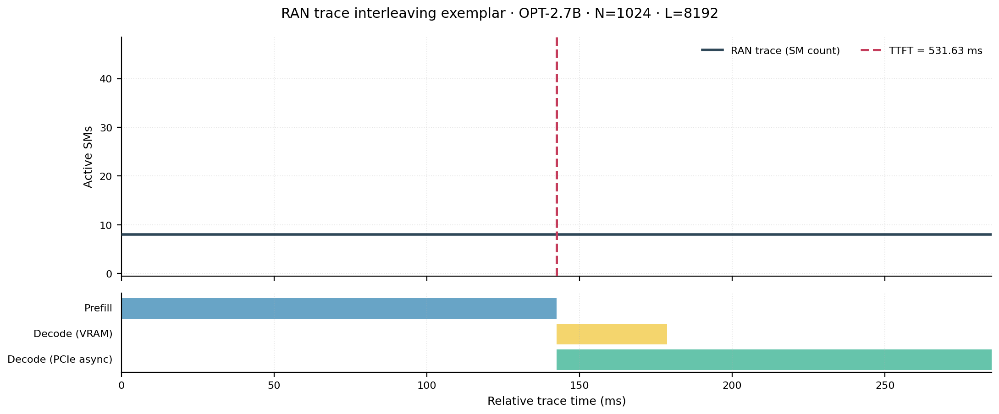
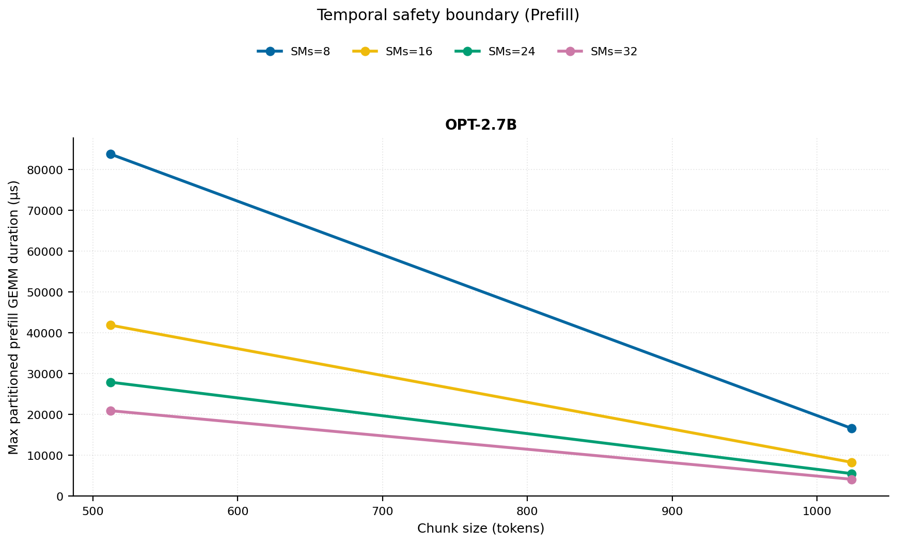
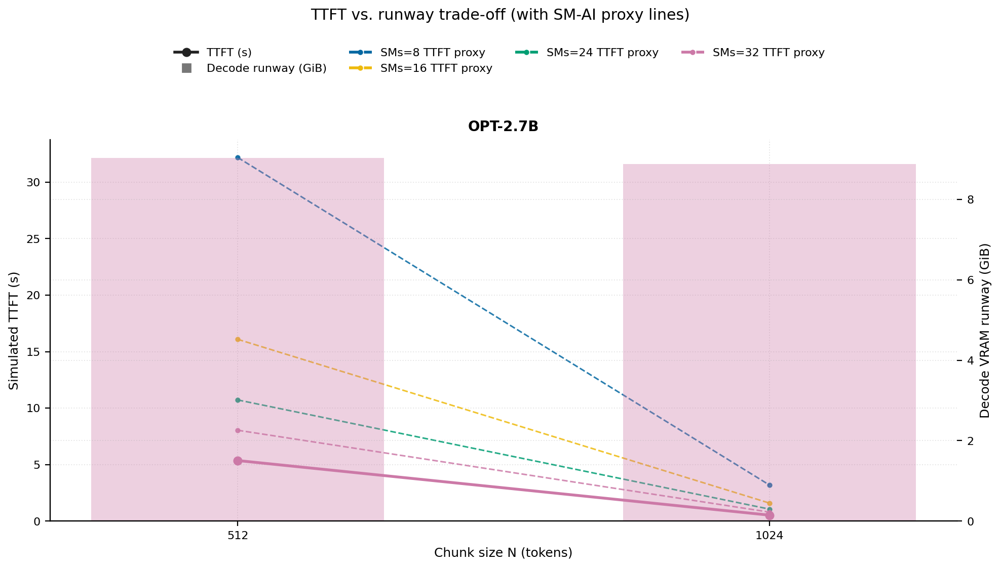
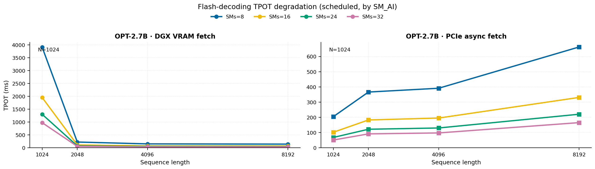
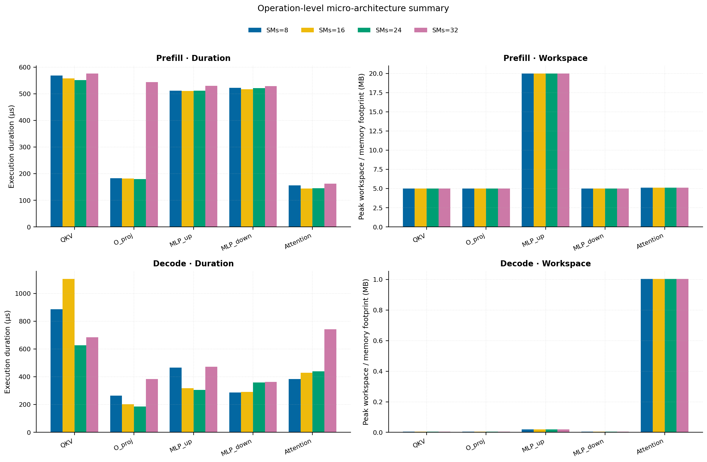
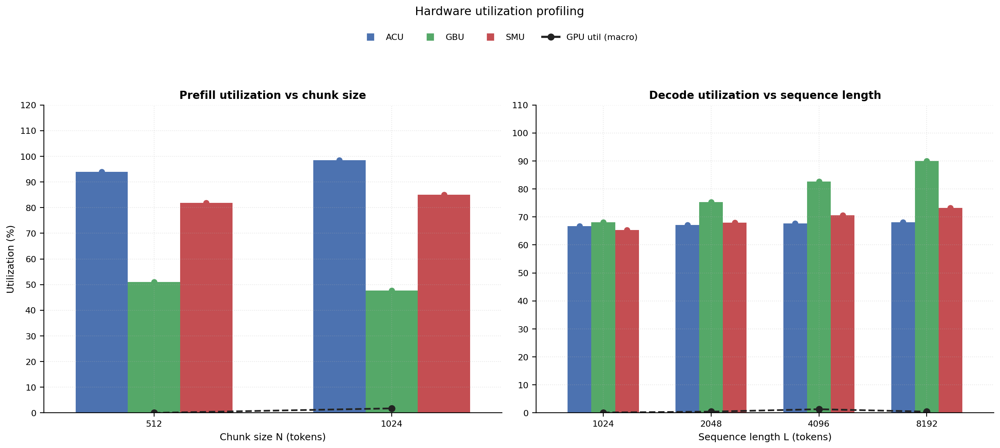
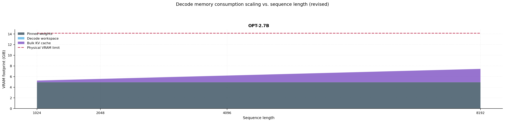

# RAN Inference Profiling Report

Run root: `/mnt/data/dheeraj/dicertation/inference-profile/runs/revised-rerun-20260415-145452-g5-opt27b-c512-1024`

## Environment

| field | value |
| --- | --- |
| cache_root | n/a |
| captured_at | 2026-04-15T13:55:01Z |
| chunk_sizes | [512, 1024] |
| cuda_available | true |
| cuda_device_count | 8 |
| cwd | /mnt/data/dheeraj/dicertation/inference-profile |
| decode_modes | ["vram", "pcie_async"] |
| experiment_type | ran-dgxspark-v1 |
| gpu_id | 5 |
| l_out | 1024 |
| models | ["facebook/opt-2.7b"] |
| platform | Linux-6.8.0-106-generic-x86_64-with-glibc2.35 |
| python_executable | /home/dheeraj/miniconda3/envs/mls/bin/python |
| python_version | 3.11.14 |
| run_root | /mnt/data/dheeraj/dicertation/inference-profile/runs/revised-rerun-20260415-145452-g5-opt27b-c512-1024 |
| scheduler | envelope_v1 |
| schema_version | ran_dgxspark_v1 |
| sequence_lengths | [1024, 2048, 4096, 8192] |
| sm_ai_cap | 32 |
| sm_ai_partition | 100 |
| sm_ai_partitions | [8, 16, 24, 32] |
| stage | profile |
| telemetry_tier | baseline_nvml_pt |
| timed_iterations | 5 |
| torch_available | true |
| torch_version | 2.10.0+cu128 |
| warmup_iterations | 3 |

## Model Constants

| model_id | sm_ai_partition | num_hidden_layers | hidden_size | num_attention_heads | ffn_dim | layer_index | layer_weight_bytes | total_weight_bytes_fp16 | vram_ceiling_bytes |
| --- | --- | --- | --- | --- | --- | --- | --- | --- | --- |
| facebook/opt-2.7b | 100 | 32 | 2560 | 32 | 10240 | 15 | 157352960 | 5303193600 | 15170115993 |

## Trace Inspection

### Primary trace

| field | value |
| --- | --- |
| errors | [] |
| header | ["frame", "slot", "time_slot_sched_ns", "time_decode_start_est_ns", "time_decode_end_est_ns", "time_decode_start_actual_ns", "time_decode_end_actual_ns", "decode_dur_us", "deadline_met", "target_sm", "profile_idx", "sm_count", "num_pusch", "sum_prb", "sum_tbs_bytes", "max_mcs"] |
| median_positive_delta_ms | 5.6997 |
| monotonicity.checked_column | time_slot_sched_ns |
| monotonicity.is_non_decreasing | true |
| monotonicity.negative_delta_count | 0 |
| monotonicity.positive_delta_count | 28377 |
| monotonicity.zero_delta_count | 0 |
| normalization.last_row_duration_policy | median_positive_forward_delta_ms |
| normalization.output_columns | ["time_ms", "sm_utilization", "slot_duration_ms", "source_schema", "sm_count"] |
| normalization.output_relative_path | derived/normalized_ldpc_trace.csv |
| normalized_row_count | 28378 |
| path | /mnt/raid0sata2/netsys/weaver-ext/ran/traces/e2e_2026030418/e2e_20260304_182034_tractor_ran_ctrl/ldpc_trace.csv |
| row_count | 28378 |
| schema_detected | schema_b |
| time_unit_hint | ns |
| usable | true |
| usage_policy | primary_only |
| used_for_scheduler_capacity | true |

### Secondary trace

| field | value |
| --- | --- |
| errors | ["ran_ctrl_trace.csv line 182958 has 9 field(s); expected 12"] |
| header | ["frame", "slot", "sm_available", "prbs_available", "prbs_allocated", "w_avg_mcs_prev", "w_avg_mcs_curr", "slots_since_underutil", "ramp_up_count", "num_ue_sched", "max_ue_backlog", "sum_ue_backlog"] |
| monotonicity.checked_column | n/a |
| monotonicity.is_non_decreasing | n/a |
| monotonicity.negative_delta_count | n/a |
| path | /mnt/raid0sata2/netsys/weaver-ext/ran/traces/e2e_2026030418/e2e_20260304_182034_tractor_ran_ctrl/ran_ctrl_trace.csv |
| row_count | 182956 |
| time_unit_hints | [] |
| usable | false |
| usage_policy | structural_only |
| used_for_scheduler_capacity | false |

## Raw-Profile Summary Tables

### Prefill profile summary

Source raw rows: `raw/prefill_events.csv` = 280. Summary artifact: `derived/prefill_summary.csv`.

| model_id | chunk_tokens | sm_ai_partition | max_input_tokens | prefill_max_gemm_us | prefill_workspace_bytes | prefill_parked_activation_bytes | telemetry_tier | telemetry_provider | telemetry_status | nvml_available | gpu_util | gpu_mem_used_mb | sm_clock_mhz | mem_clock_mhz | power_w | pt_step_ms | pt_mem_alloc_mb | pt_mem_reserved_mb | pt_workspace_mb | acu_pct | gbu_pct | smu_pct | microscopic_telemetry_status | microscopic_error |
| --- | --- | --- | --- | --- | --- | --- | --- | --- | --- | --- | --- | --- | --- | --- | --- | --- | --- | --- | --- | --- | --- | --- | --- | --- |
| facebook/opt-2.7b | 512 | 8 | 1024 | 389.12 | 10485760 | 10485760 | baseline_nvml_pt | nvidia-smi | ok | true | 0 | 55 | 1695 | 7601 | 61.95 | 0.3891 | 189.1689 | 189.1689 | 10 | 82.95 | 58.75 | 70.2 | estimated | n/a |
| facebook/opt-2.7b | 512 | 16 | 1024 | 373.76 | 10485760 | 10485760 | baseline_nvml_pt | nvidia-smi | ok | true | 0 | 55 | 1695 | 7601 | 62.21 | 0.3738 | 189.1689 | 189.1689 | 10 | 90.3 | 53.58 | 78 | estimated | n/a |
| facebook/opt-2.7b | 512 | 24 | 1024 | 379.904 | 10485760 | 10485760 | baseline_nvml_pt | nvidia-smi | ok | true | 0 | 55 | 1695 | 7601 | 62.35 | 0.3799 | 189.1689 | 189.1689 | 10 | 97.65 | 48.41 | 85.8 | estimated | n/a |
| facebook/opt-2.7b | 512 | 32 | 1024 | 3491.8399 | 10485760 | 10485760 | baseline_nvml_pt | nvidia-smi | ok | true | 0 | 55 | 1695 | 8001 | 63.01 | 3.4918 | 189.1689 | 189.1689 | 10 | 100 | 43.24 | 93.6 | estimated | n/a |
| facebook/opt-2.7b | 1024 | 8 | 1024 | 683.776 | 20971520 | 20971520 | baseline_nvml_pt | nvidia-smi | ok | true | 7 | 55 | 1695 | 8001 | 64.66 | 0.6838 | 219.1689 | 219.1689 | 20 | 86.9 | 55 | 72.9 | estimated | n/a |
| facebook/opt-2.7b | 1024 | 16 | 1024 | 699.36 | 20971520 | 20971520 | baseline_nvml_pt | nvidia-smi | ok | true | 0 | 55 | 1695 | 7601 | 64.35 | 0.6994 | 219.1689 | 219.1689 | 20 | 94.6 | 50.16 | 81 | estimated | n/a |
| facebook/opt-2.7b | 1024 | 24 | 1024 | 733.184 | 20971520 | 20971520 | baseline_nvml_pt | nvidia-smi | ok | true | 0 | 55 | 1695 | 7601 | 64.67 | 0.7332 | 219.1689 | 219.1689 | 20 | 100 | 45.32 | 89.1 | estimated | n/a |
| facebook/opt-2.7b | 1024 | 32 | 1024 | 692.224 | 20971520 | 20971520 | baseline_nvml_pt | nvidia-smi | ok | true | 0 | 55 | 1695 | 8001 | 61.68 | 0.6922 | 219.1689 | 219.1689 | 20 | 100 | 40.48 | 97.2 | estimated | n/a |

### Decode profile summary

Source raw rows: `raw/decode_events.csv` = 2560. Summary artifact: `derived/decode_summary.csv`.

| model_id | sequence_length | block_size | sm_ai_partition | decode_mode | decode_max_gemv_us | attention_fetch_compute_us | reduction_overhead_us | decode_workspace_bytes | decode_parked_activation_bytes | telemetry_tier | telemetry_provider | telemetry_status | nvml_available | gpu_util | gpu_mem_used_mb | sm_clock_mhz | mem_clock_mhz | power_w | pt_step_ms | pt_mem_alloc_mb | pt_mem_reserved_mb | pt_workspace_mb | acu_pct | gbu_pct | smu_pct | microscopic_telemetry_status | microscopic_error |
| --- | --- | --- | --- | --- | --- | --- | --- | --- | --- | --- | --- | --- | --- | --- | --- | --- | --- | --- | --- | --- | --- | --- | --- | --- | --- | --- | --- |
| facebook/opt-2.7b | 1024 | 512 | 8 | pcie_async | 193.536 | 132.8 | 21.1328 | 136192 | 5120 | baseline_nvml_pt | nvidia-smi | ok | true | 0 | 55 | 1695 | 7601 | 61.48 | 0.1935 | 169.2031 | 169.2031 | 0.1299 | 58.195 | 74.385 | 56.64 | estimated | n/a |
| facebook/opt-2.7b | 1024 | 512 | 8 | vram | 173.856 | 132.256 | 21.7088 | 136192 | 5120 | baseline_nvml_pt | nvidia-smi | ok | true | 0 | 55 | 1695 | 8001 | 61.76 | 0.1739 | 169.2031 | 169.2031 | 0.1299 | 60.795 | 69.3625 | 58.28 | estimated | n/a |
| facebook/opt-2.7b | 1024 | 512 | 16 | pcie_async | 182.336 | 136.6528 | 21.7088 | 136192 | 5120 | baseline_nvml_pt | nvidia-smi | ok | true | 0 | 55 | 1695 | 7601 | 61.71 | 0.1823 | 169.2031 | 169.2031 | 0.1299 | 62.83 | 71.82 | 61.44 | estimated | n/a |
| facebook/opt-2.7b | 1024 | 512 | 16 | vram | 230.4 | 132.1792 | 22.1568 | 136192 | 5120 | baseline_nvml_pt | nvidia-smi | ok | true | 0 | 55 | 1695 | 7601 | 61.54 | 0.2304 | 169.2031 | 169.2031 | 0.1299 | 65.62 | 67.125 | 63.92 | estimated | n/a |
| facebook/opt-2.7b | 1024 | 512 | 24 | pcie_async | 155.648 | 127.9552 | 21.5616 | 136192 | 5120 | baseline_nvml_pt | nvidia-smi | ok | true | 0 | 55 | 1695 | 7601 | 61.75 | 0.1556 | 169.2031 | 169.2031 | 0.1299 | 67.465 | 69.255 | 66.24 | estimated | n/a |
| facebook/opt-2.7b | 1024 | 512 | 24 | vram | 195.584 | 134.5536 | 22.9376 | 136192 | 5120 | baseline_nvml_pt | nvidia-smi | ok | true | 2 | 55 | 1695 | 7601 | 61.73 | 0.1956 | 169.2031 | 169.2031 | 0.1299 | 70.445 | 64.8875 | 69.56 | estimated | n/a |
| facebook/opt-2.7b | 1024 | 512 | 32 | pcie_async | 3185.6639 | 132.5184 | 21.2416 | 136192 | 5120 | baseline_nvml_pt | nvidia-smi | ok | true | 0 | 55 | 1695 | 8001 | 62.06 | 3.1857 | 169.2031 | 169.2031 | 0.1299 | 72.1 | 66.69 | 71.04 | estimated | n/a |
| facebook/opt-2.7b | 1024 | 512 | 32 | vram | 285.696 | 136.4096 | 21.2736 | 136192 | 5120 | baseline_nvml_pt | nvidia-smi | ok | true | 0 | 55 | 1695 | 7601 | 61.88 | 0.2857 | 169.2031 | 169.2031 | 0.1299 | 75.27 | 62.65 | 75.2 | estimated | n/a |
| facebook/opt-2.7b | 1024 | 1024 | 8 | pcie_async | 187.392 | 138.0352 | 22.6944 | 136192 | 5120 | baseline_nvml_pt | nvidia-smi | ok | true | 0 | 55 | 1695 | 7601 | 61.83 | 0.1874 | 169.2031 | 169.2031 | 0.1299 | 58.195 | 73.95 | 56.64 | estimated | n/a |
| facebook/opt-2.7b | 1024 | 1024 | 8 | vram | 164.896 | 137.3184 | 21.92 | 136192 | 5120 | baseline_nvml_pt | nvidia-smi | ok | true | 0 | 55 | 1695 | 7601 | 61.67 | 0.1649 | 169.2031 | 169.2031 | 0.1299 | 61.11 | 68.975 | 58.28 | estimated | n/a |
| facebook/opt-2.7b | 1024 | 1024 | 16 | pcie_async | 2984.9601 | 132.2112 | 21.3568 | 136192 | 5120 | baseline_nvml_pt | nvidia-smi | ok | true | 0 | 55 | 1695 | 7601 | 61.97 | 2.985 | 169.2031 | 169.2031 | 0.1299 | 62.83 | 71.4 | 61.44 | estimated | n/a |
| facebook/opt-2.7b | 1024 | 1024 | 16 | vram | 223.232 | 136.1408 | 22.144 | 136192 | 5120 | baseline_nvml_pt | nvidia-smi | ok | true | 0 | 55 | 1695 | 7601 | 61.87 | 0.2232 | 169.2031 | 169.2031 | 0.1299 | 65.96 | 66.75 | 63.92 | estimated | n/a |
| facebook/opt-2.7b | 1024 | 1024 | 24 | pcie_async | 198.656 | 750.3936 | 23.1488 | 136192 | 5120 | baseline_nvml_pt | nvidia-smi | ok | true | 0 | 55 | 1695 | 7601 | 61.72 | 3.1653 | 169.2031 | 169.2031 | 0.1299 | 67.465 | 68.85 | 66.24 | estimated | n/a |
| facebook/opt-2.7b | 1024 | 1024 | 24 | vram | 176.128 | 132.608 | 21.76 | 136192 | 5120 | baseline_nvml_pt | nvidia-smi | ok | true | 0 | 55 | 1695 | 7601 | 61.67 | 0.1761 | 169.2031 | 169.2031 | 0.1299 | 70.81 | 64.525 | 69.56 | estimated | n/a |
| facebook/opt-2.7b | 1024 | 1024 | 32 | pcie_async | 159.904 | 134.7136 | 21.2416 | 136192 | 5120 | baseline_nvml_pt | nvidia-smi | ok | true | 0 | 55 | 1695 | 8001 | 61.79 | 0.1599 | 169.2031 | 169.2031 | 0.1299 | 72.1 | 66.3 | 71.04 | estimated | n/a |
| facebook/opt-2.7b | 1024 | 1024 | 32 | vram | 5063.6802 | 136.7872 | 24.5376 | 136192 | 5120 | baseline_nvml_pt | nvidia-smi | ok | true | 0 | 55 | 1695 | 7601 | 61.85 | 5.0637 | 169.2031 | 169.2031 | 0.1299 | 75.66 | 62.3 | 75.2 | estimated | n/a |
| facebook/opt-2.7b | 2048 | 512 | 8 | pcie_async | 204 | 155.8528 | 23.52 | 267264 | 5120 | baseline_nvml_pt | nvidia-smi | ok | true | 0 | 55 | 1695 | 8001 | 62.14 | 0.2284 | 178.4531 | 178.4531 | 0.2549 | 57.065 | 83.375 | 58.41 | estimated | n/a |
| facebook/opt-2.7b | 2048 | 512 | 8 | vram | 6735.5838 | 153.4528 | 26.2144 | 267264 | 5120 | baseline_nvml_pt | nvidia-smi | ok | true | 0 | 55 | 1695 | 8001 | 62.13 | 6.7356 | 178.4531 | 178.4531 | 0.2549 | 62.685 | 75.0458 | 60.9667 | estimated | n/a |
| facebook/opt-2.7b | 2048 | 512 | 16 | pcie_async | 210.944 | 135.7696 | 22.7584 | 267264 | 5120 | baseline_nvml_pt | nvidia-smi | ok | true | 0 | 55 | 1695 | 7601 | 61.71 | 0.2109 | 178.4531 | 178.4531 | 0.2549 | 61.61 | 80.5 | 63.36 | estimated | n/a |
| facebook/opt-2.7b | 2048 | 512 | 16 | vram | 182.336 | 133.312 | 21.7856 | 267264 | 5120 | baseline_nvml_pt | nvidia-smi | ok | true | 0 | 55 | 1695 | 7601 | 61.99 | 0.1823 | 178.4531 | 178.4531 | 0.2549 | 67.66 | 72.625 | 66.8667 | estimated | n/a |
| facebook/opt-2.7b | 2048 | 512 | 24 | pcie_async | 167.936 | 134.2784 | 24.7232 | 267264 | 5120 | baseline_nvml_pt | nvidia-smi | ok | true | 0 | 55 | 1695 | 7601 | 61.45 | 0.1679 | 178.4531 | 178.4531 | 0.2549 | 66.155 | 77.625 | 68.31 | estimated | n/a |
| facebook/opt-2.7b | 2048 | 512 | 24 | vram | 218.272 | 136.8064 | 22.3552 | 267264 | 5120 | baseline_nvml_pt | nvidia-smi | ok | true | 0 | 55 | 1695 | 7601 | 61.7 | 0.2183 | 178.4531 | 178.4531 | 0.2549 | 72.635 | 70.2042 | 72.7667 | estimated | n/a |
| facebook/opt-2.7b | 2048 | 512 | 32 | pcie_async | 178.208 | 847.8528 | 22.2144 | 267264 | 5120 | baseline_nvml_pt | nvidia-smi | ok | true | 0 | 55 | 1695 | 7601 | 61.96 | 3.7079 | 178.4531 | 178.4531 | 0.2549 | 70.7 | 74.75 | 73.26 | estimated | n/a |
| facebook/opt-2.7b | 2048 | 512 | 32 | vram | 7062.5281 | 149.7024 | 22.7776 | 267264 | 5120 | baseline_nvml_pt | nvidia-smi | ok | true | 0 | 55 | 1695 | 8001 | 61.83 | 7.0625 | 178.4531 | 178.4531 | 0.2549 | 77.61 | 67.7833 | 78.6667 | estimated | n/a |
| facebook/opt-2.7b | 2048 | 1024 | 8 | pcie_async | 3105.792 | 136.8512 | 21.12 | 267264 | 5120 | baseline_nvml_pt | nvidia-smi | ok | true | 0 | 55 | 1695 | 7601 | 62.29 | 3.1058 | 178.4531 | 178.4531 | 0.2549 | 57.065 | 83.81 | 58.6067 | estimated | n/a |
| facebook/opt-2.7b | 2048 | 1024 | 8 | vram | 208.896 | 202.592 | 28.0768 | 267264 | 5120 | baseline_nvml_pt | nvidia-smi | ok | true | 0 | 55 | 1695 | 8001 | 61.88 | 0.2245 | 178.4531 | 178.4531 | 0.2549 | 63.21 | 75.175 | 61.1733 | estimated | n/a |
| facebook/opt-2.7b | 2048 | 1024 | 16 | pcie_async | 227.328 | 170.2016 | 42.5024 | 267264 | 5120 | baseline_nvml_pt | nvidia-smi | ok | true | 0 | 55 | 1695 | 7601 | 62.41 | 0.3031 | 178.4531 | 178.4531 | 0.2549 | 61.61 | 80.92 | 63.5733 | estimated | n/a |
| facebook/opt-2.7b | 2048 | 1024 | 16 | vram | 690.176 | 173.5424 | 25.344 | 267264 | 5120 | baseline_nvml_pt | nvidia-smi | ok | true | 0 | 55 | 1695 | 7601 | 61.79 | 0.6902 | 178.4531 | 178.4531 | 0.2549 | 68.2267 | 72.75 | 67.0933 | estimated | n/a |
| facebook/opt-2.7b | 2048 | 1024 | 24 | pcie_async | 157.696 | 128.6912 | 22.9184 | 267264 | 5120 | baseline_nvml_pt | nvidia-smi | ok | true | 0 | 55 | 1695 | 7601 | 62.19 | 0.1577 | 178.4531 | 178.4531 | 0.2549 | 66.155 | 78.03 | 68.54 | estimated | n/a |
| facebook/opt-2.7b | 2048 | 1024 | 24 | vram | 259.36 | 139.9104 | 22.5536 | 267264 | 5120 | baseline_nvml_pt | nvidia-smi | ok | true | 0 | 55 | 1695 | 8001 | 62.32 | 0.2594 | 178.4531 | 178.4531 | 0.2549 | 73.2433 | 70.325 | 73.0133 | estimated | n/a |
| facebook/opt-2.7b | 2048 | 1024 | 32 | pcie_async | 191.488 | 151.2192 | 592.224 | 267264 | 5120 | baseline_nvml_pt | nvidia-smi | ok | true | 7 | 55 | 1695 | 8001 | 62.52 | 2.8693 | 178.4531 | 178.4531 | 0.2549 | 70.7 | 75.14 | 73.5067 | estimated | n/a |
| facebook/opt-2.7b | 2048 | 1024 | 32 | vram | 174.272 | 696.4224 | 21.952 | 267264 | 5120 | baseline_nvml_pt | nvidia-smi | ok | true | 0 | 55 | 1695 | 7601 | 61.6 | 2.937 | 178.4531 | 178.4531 | 0.2549 | 78.26 | 67.9 | 78.9333 | estimated | n/a |
| facebook/opt-2.7b | 4096 | 512 | 8 | pcie_async | 157.696 | 143.6224 | 20.6336 | 529408 | 5120 | baseline_nvml_pt | nvidia-smi | ok | true | 0 | 55 | 1695 | 7601 | 62.08 | 0.1577 | 198.7031 | 198.7031 | 0.5049 | 55.935 | 92.365 | 60.18 | estimated | n/a |
| facebook/opt-2.7b | 4096 | 512 | 8 | vram | 1187.8721 | 174.5152 | 22.08 | 529408 | 5120 | baseline_nvml_pt | nvidia-smi | ok | true | 0 | 55 | 1695 | 8001 | 62.48 | 1.1879 | 198.7031 | 198.7031 | 0.5049 | 64.575 | 80.7292 | 63.6533 | estimated | n/a |
| facebook/opt-2.7b | 4096 | 512 | 16 | pcie_async | 342.016 | 165.2736 | 23.9424 | 529408 | 5120 | baseline_nvml_pt | nvidia-smi | ok | true | 0 | 55 | 1695 | 8001 | 62.69 | 0.342 | 198.7031 | 198.7031 | 0.5049 | 60.39 | 89.18 | 65.28 | estimated | n/a |
| facebook/opt-2.7b | 4096 | 512 | 16 | vram | 221.344 | 155.0336 | 22.1568 | 529408 | 5120 | baseline_nvml_pt | nvidia-smi | ok | true | 0 | 55 | 1695 | 7601 | 62.18 | 0.2213 | 198.7031 | 198.7031 | 0.5049 | 69.7 | 78.125 | 69.8133 | estimated | n/a |
| facebook/opt-2.7b | 4096 | 512 | 24 | pcie_async | 224.256 | 188.6336 | 29.5936 | 529408 | 5120 | baseline_nvml_pt | nvidia-smi | ok | true | 0 | 55 | 1695 | 7601 | 62.39 | 0.3082 | 198.7031 | 198.7031 | 0.5049 | 64.845 | 85.995 | 70.38 | estimated | n/a |
| facebook/opt-2.7b | 4096 | 512 | 24 | vram | 224.992 | 188.6848 | 24.5696 | 529408 | 5120 | baseline_nvml_pt | nvidia-smi | ok | true | 0 | 55 | 1695 | 8001 | 62.29 | 0.225 | 198.7031 | 198.7031 | 0.5049 | 74.825 | 75.5208 | 75.9733 | estimated | n/a |
| facebook/opt-2.7b | 4096 | 512 | 32 | pcie_async | 162.816 | 148.832 | 21.2864 | 529408 | 5120 | baseline_nvml_pt | nvidia-smi | ok | true | 7 | 55 | 1695 | 7601 | 62.58 | 0.1669 | 198.7031 | 198.7031 | 0.5049 | 69.3 | 82.81 | 75.48 | estimated | n/a |
| facebook/opt-2.7b | 4096 | 512 | 32 | vram | 155.648 | 141.7216 | 21.4976 | 529408 | 5120 | baseline_nvml_pt | nvidia-smi | ok | true | 0 | 55 | 1695 | 7601 | 62.28 | 0.1556 | 198.7031 | 198.7031 | 0.5049 | 79.95 | 72.9167 | 82.1333 | estimated | n/a |
| facebook/opt-2.7b | 4096 | 1024 | 8 | pcie_async | 152.576 | 143.1104 | 21.4656 | 529408 | 5120 | baseline_nvml_pt | nvidia-smi | ok | true | 0 | 55 | 1695 | 7601 | 62.11 | 0.1526 | 198.7031 | 198.7031 | 0.5049 | 55.935 | 93.67 | 60.5733 | estimated | n/a |
| facebook/opt-2.7b | 4096 | 1024 | 8 | vram | 3321.728 | 259.8144 | 22.8928 | 529408 | 5120 | baseline_nvml_pt | nvidia-smi | ok | true | 0 | 55 | 1695 | 7601 | 61.88 | 3.3217 | 198.7031 | 198.7031 | 0.5049 | 65.31 | 81.375 | 64.0667 | estimated | n/a |
| facebook/opt-2.7b | 4096 | 1024 | 16 | pcie_async | 158.624 | 188.576 | 22.3424 | 529408 | 5120 | baseline_nvml_pt | nvidia-smi | ok | true | 0 | 55 | 1695 | 7601 | 62.52 | 0.3408 | 198.7031 | 198.7031 | 0.5049 | 60.39 | 90.44 | 65.7067 | estimated | n/a |
| facebook/opt-2.7b | 4096 | 1024 | 16 | vram | 233.248 | 176.9472 | 24.5888 | 529408 | 5120 | baseline_nvml_pt | nvidia-smi | ok | true | 0 | 55 | 1695 | 7601 | 62.6 | 0.2355 | 198.7031 | 198.7031 | 0.5049 | 70.4933 | 78.75 | 70.2667 | estimated | n/a |
| facebook/opt-2.7b | 4096 | 1024 | 24 | pcie_async | 3154.9439 | 174.4448 | 24.96 | 529408 | 5120 | baseline_nvml_pt | nvidia-smi | ok | true | 0 | 55 | 1695 | 8001 | 62.45 | 3.1549 | 198.7031 | 198.7031 | 0.5049 | 64.845 | 87.21 | 70.84 | estimated | n/a |
| facebook/opt-2.7b | 4096 | 1024 | 24 | vram | 155.456 | 145.728 | 20.6528 | 529408 | 5120 | baseline_nvml_pt | nvidia-smi | ok | true | 14 | 55 | 1695 | 7601 | 61.93 | 0.1649 | 198.7031 | 198.7031 | 0.5049 | 75.6767 | 76.125 | 76.4667 | estimated | n/a |
| facebook/opt-2.7b | 4096 | 1024 | 32 | pcie_async | 158.88 | 143.2768 | 20.1152 | 529408 | 5120 | baseline_nvml_pt | nvidia-smi | ok | true | 0 | 55 | 1695 | 7601 | 62.28 | 0.1589 | 198.7031 | 198.7031 | 0.5049 | 69.3 | 83.98 | 75.9733 | estimated | n/a |
| facebook/opt-2.7b | 4096 | 1024 | 32 | vram | 172.032 | 146.6368 | 21.2928 | 529408 | 5120 | baseline_nvml_pt | nvidia-smi | ok | true | 0 | 55 | 1695 | 7601 | 62.12 | 0.172 | 198.7031 | 198.7031 | 0.5049 | 80.86 | 73.5 | 82.6667 | estimated | n/a |
| facebook/opt-2.7b | 8192 | 512 | 8 | pcie_async | 270.336 | 193.5168 | 22.144 | 1053696 | 5120 | baseline_nvml_pt | nvidia-smi | ok | true | 0 | 55 | 1695 | 7601 | 62.46 | 0.2703 | 239.2031 | 239.2031 | 1.0049 | 54.805 | 100 | 61.95 | estimated | n/a |
| facebook/opt-2.7b | 8192 | 512 | 8 | vram | 169.696 | 189.2736 | 20.8768 | 1053696 | 5120 | baseline_nvml_pt | nvidia-smi | ok | true | 7 | 55 | 1695 | 8001 | 62.52 | 0.1946 | 239.2031 | 239.2031 | 1.0049 | 66.465 | 86.4125 | 66.34 | estimated | n/a |
| facebook/opt-2.7b | 8192 | 512 | 16 | pcie_async | 160.704 | 195.1104 | 22.5664 | 1053696 | 5120 | baseline_nvml_pt | nvidia-smi | ok | true | 0 | 55 | 1695 | 7601 | 62.04 | 0.2028 | 239.2031 | 239.2031 | 1.0049 | 59.17 | 97.86 | 67.2 | estimated | n/a |
| facebook/opt-2.7b | 8192 | 512 | 16 | vram | 170.816 | 606.1568 | 21.5104 | 1053696 | 5120 | baseline_nvml_pt | nvidia-smi | ok | true | 0 | 55 | 1695 | 7601 | 62.32 | 2.258 | 239.2031 | 239.2031 | 1.0049 | 71.74 | 83.625 | 72.76 | estimated | n/a |
| facebook/opt-2.7b | 8192 | 512 | 24 | pcie_async | 160.768 | 196.16 | 20.8896 | 1053696 | 5120 | baseline_nvml_pt | nvidia-smi | ok | true | 0 | 55 | 1695 | 7601 | 62.13 | 0.215 | 239.2031 | 239.2031 | 1.0049 | 63.535 | 94.365 | 72.45 | estimated | n/a |
| facebook/opt-2.7b | 8192 | 512 | 24 | vram | 171.232 | 193.6896 | 20.6016 | 1053696 | 5120 | baseline_nvml_pt | nvidia-smi | ok | true | 0 | 55 | 1695 | 7601 | 62.05 | 0.2048 | 239.2031 | 239.2031 | 1.0049 | 77.015 | 80.8375 | 79.18 | estimated | n/a |
| facebook/opt-2.7b | 8192 | 512 | 32 | pcie_async | 198.592 | 228.9152 | 23.1104 | 1053696 | 5120 | baseline_nvml_pt | nvidia-smi | ok | true | 0 | 55 | 1695 | 8001 | 62.24 | 0.3676 | 239.2031 | 239.2031 | 1.0049 | 67.9 | 90.87 | 77.7 | estimated | n/a |
| facebook/opt-2.7b | 8192 | 512 | 32 | vram | 3123.1999 | 1389.5104 | 23.808 | 1053696 | 5120 | baseline_nvml_pt | nvidia-smi | ok | true | 0 | 55 | 1695 | 8001 | 62.92 | 3.2041 | 239.2031 | 239.2031 | 1.0049 | 82.29 | 78.05 | 85.6 | estimated | n/a |
| facebook/opt-2.7b | 8192 | 1024 | 8 | pcie_async | 307.2 | 189.8496 | 21.056 | 1053696 | 5120 | baseline_nvml_pt | nvidia-smi | ok | true | 0 | 55 | 1695 | 7601 | 62.29 | 0.3072 | 239.2031 | 239.2031 | 1.0049 | 54.805 | 100 | 62.54 | estimated | n/a |
| facebook/opt-2.7b | 8192 | 1024 | 8 | vram | 1325.056 | 221.5936 | 24.5696 | 1053696 | 5120 | baseline_nvml_pt | nvidia-smi | ok | true | 0 | 55 | 1695 | 7601 | 62.51 | 1.3251 | 239.2031 | 239.2031 | 1.0049 | 67.41 | 87.575 | 66.96 | estimated | n/a |
| facebook/opt-2.7b | 8192 | 1024 | 16 | pcie_async | 152.704 | 190.4256 | 21.664 | 1053696 | 5120 | baseline_nvml_pt | nvidia-smi | ok | true | 0 | 55 | 1695 | 7601 | 62.29 | 0.1956 | 239.2031 | 239.2031 | 1.0049 | 59.17 | 99.96 | 67.84 | estimated | n/a |
| facebook/opt-2.7b | 8192 | 1024 | 16 | vram | 9570.24 | 224.8256 | 23.6416 | 1053696 | 5120 | baseline_nvml_pt | nvidia-smi | ok | true | 0 | 55 | 1695 | 7601 | 61.94 | 9.5702 | 239.2031 | 239.2031 | 1.0049 | 72.76 | 84.75 | 73.44 | estimated | n/a |
| facebook/opt-2.7b | 8192 | 1024 | 24 | pcie_async | 172.992 | 192.448 | 21.3568 | 1053696 | 5120 | baseline_nvml_pt | nvidia-smi | ok | true | 0 | 55 | 1695 | 7601 | 62.41 | 0.2028 | 239.2031 | 239.2031 | 1.0049 | 63.535 | 96.39 | 73.14 | estimated | n/a |
| facebook/opt-2.7b | 8192 | 1024 | 24 | vram | 160.768 | 190.208 | 21.1456 | 1053696 | 5120 | baseline_nvml_pt | nvidia-smi | ok | true | 0 | 55 | 1695 | 7601 | 61.76 | 0.1946 | 239.2031 | 239.2031 | 1.0049 | 78.11 | 81.925 | 79.92 | estimated | n/a |
| facebook/opt-2.7b | 8192 | 1024 | 32 | pcie_async | 173.888 | 225.8816 | 24.096 | 1053696 | 5120 | baseline_nvml_pt | nvidia-smi | ok | true | 0 | 55 | 1695 | 7601 | 62.31 | 0.298 | 239.2031 | 239.2031 | 1.0049 | 67.9 | 92.82 | 78.44 | estimated | n/a |
| facebook/opt-2.7b | 8192 | 1024 | 32 | vram | 152.8 | 190.0416 | 24.5632 | 1053696 | 5120 | baseline_nvml_pt | nvidia-smi | ok | true | 0 | 55 | 1695 | 7601 | 62.05 | 0.1946 | 239.2031 | 239.2031 | 1.0049 | 83.46 | 79.1 | 86.4 | estimated | n/a |

### PCIe profile summary

Source raw rows: `raw/pcie_events.csv` = 10. Summary artifact: `derived/pcie_summary.csv`.

| model_id | block_size | kv_block_bytes | transfer_only_us | overlap_total_us | dummy_compute_us | exposed_transfer_us | effective_gbps | overlap_status | telemetry_tier | telemetry_provider | telemetry_status | nvml_available | gpu_util | gpu_mem_used_mb | sm_clock_mhz | mem_clock_mhz | power_w | pt_step_ms | pt_mem_alloc_mb | pt_mem_reserved_mb | pt_workspace_mb | acu_pct | gbu_pct | smu_pct | microscopic_telemetry_status | microscopic_error |
| --- | --- | --- | --- | --- | --- | --- | --- | --- | --- | --- | --- | --- | --- | --- | --- | --- | --- | --- | --- | --- | --- | --- | --- | --- | --- | --- |
| facebook/opt-2.7b | 512 | 5242880 | 7098.0031 | 65574.3339 | 63589.6573 | 1984.6766 | 0.7386 | measured | baseline_nvml_pt | nvidia-smi | partial | true | 0 | 55 | 1695 | 8001 | 61.87 | n/a | n/a | n/a | n/a | 65 | 65 | 65 | estimated | n/a |
| facebook/opt-2.7b | 1024 | 10485760 | 2690.976 | 35388.4665 | 34903.245 | 485.2215 | 3.8966 | measured | baseline_nvml_pt | nvidia-smi | partial | true | 0 | 55 | 1695 | 7601 | 61.77 | n/a | n/a | n/a | n/a | 65 | 65 | 65 | estimated | n/a |

## SLA Tables

### Successful configurations

| model_id | chunk_tokens | sequence_length | ttft_ms | tpot_ms_vram | tpot_ms_pcie_async | decode_runway_tokens | status |
| --- | --- | --- | --- | --- | --- | --- | --- |
| facebook/opt-2.7b | 512 | 1024 | 5363.4661 | 59.8995 | 743.5871 | 29599 | success |
| facebook/opt-2.7b | 512 | 2048 | 5363.4661 | 1361.5248 | 316.0967 | 29598 | success |
| facebook/opt-2.7b | 512 | 4096 | 5363.4661 | 35.1074 | 544.7817 | 29597 | success |
| facebook/opt-2.7b | 512 | 8192 | 5363.4661 | 644.8806 | 1062.3489 | 29596 | success |
| facebook/opt-2.7b | 1024 | 1024 | 531.6281 | 977.389 | 51.2192 | 29087 | success |
| facebook/opt-2.7b | 1024 | 2048 | 531.6281 | 56.4482 | 91.6101 | 29086 | success |
| facebook/opt-2.7b | 1024 | 4096 | 531.6281 | 38.4039 | 97.8419 | 29085 | success |
| facebook/opt-2.7b | 1024 | 8192 | 531.6281 | 36.205 | 165.6025 | 29084 | success |

### Failed configurations

No rows available.

## Per-Model Scaling Analysis

| model_id | successful_configs | failed_configs | chunk_tokens_tested | sequence_lengths_tested | largest_successful_chunk_tokens | ttft_ms_min | ttft_ms_max | tpot_ms_vram_min | tpot_ms_vram_max | tpot_ms_pcie_async_min | tpot_ms_pcie_async_max | max_decode_runway_tokens |
| --- | --- | --- | --- | --- | --- | --- | --- | --- | --- | --- | --- | --- |
| facebook/opt-2.7b | 8 | 0 | 512, 1024 | 1024, 2048, 4096, 8192 | 1024 | 531.6281 | 5363.4661 | 35.1074 | 1361.5248 | 51.2192 | 1062.3489 | 29599 |

## Plots

### Revised 01 Ran Trace Interleaving

[Interactive companion](plots/revised_01_ran_trace_interleaving_interactive.html)

### Revised 02 Prefill Safety Boundary

### Revised 03 Prefill Vram Composition

### Revised 04 Ttft Vs Runway

### Revised 05 Decode Tpot Degradation

### Revised 06 Operation Level Microarchitecture Summary

### Revised 07 Hardware Utilization Profiling

### Revised 08 Decode Memory Consumption

### 09 Spatial VRAM Composition (Prefill) · Pie View

