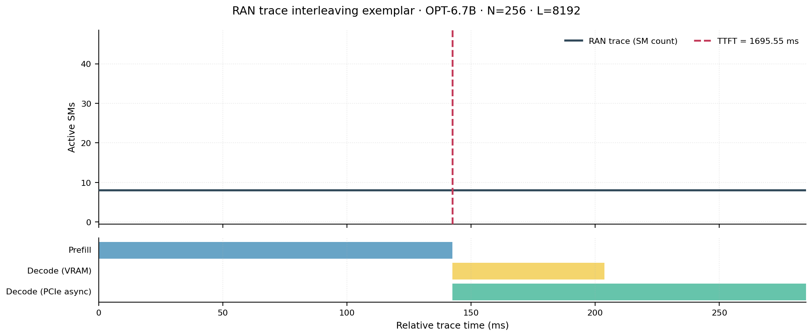
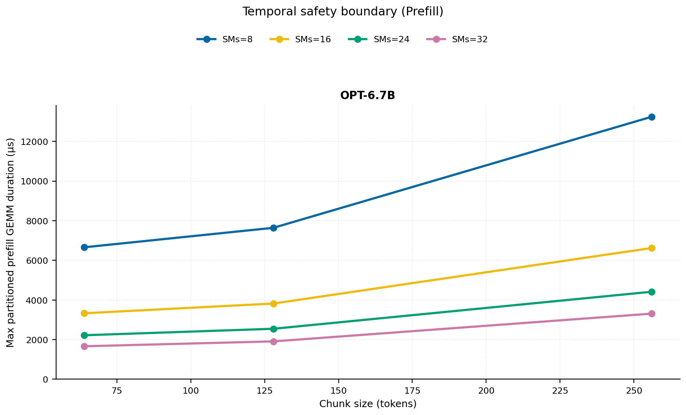
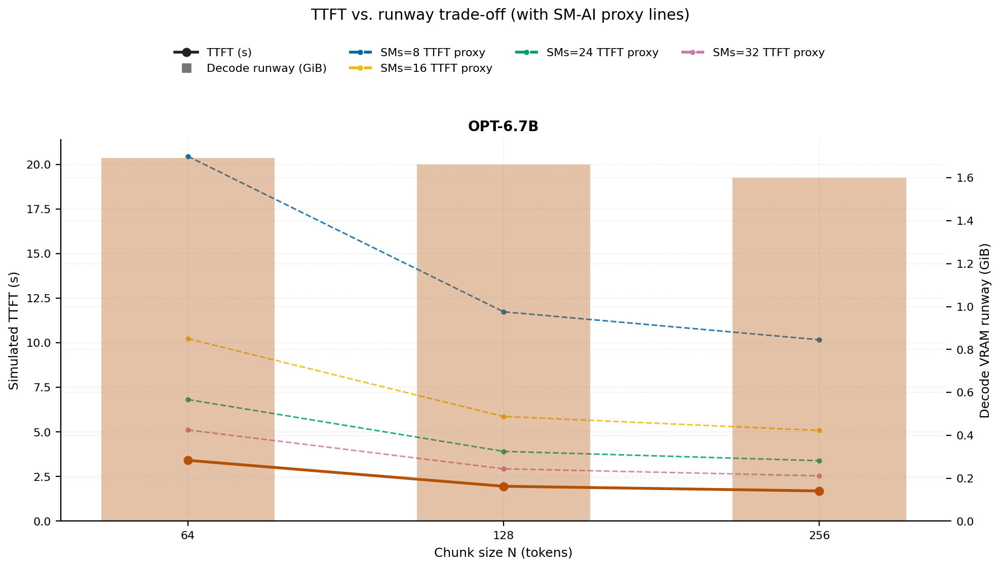
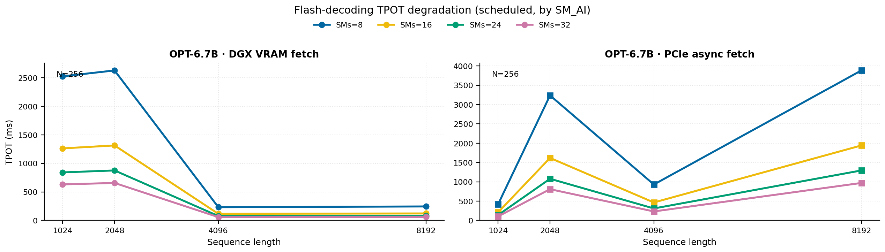
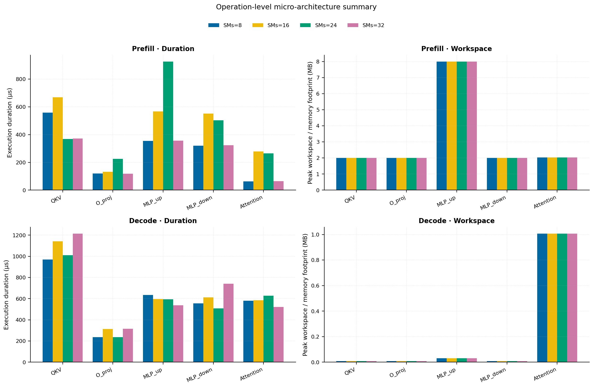
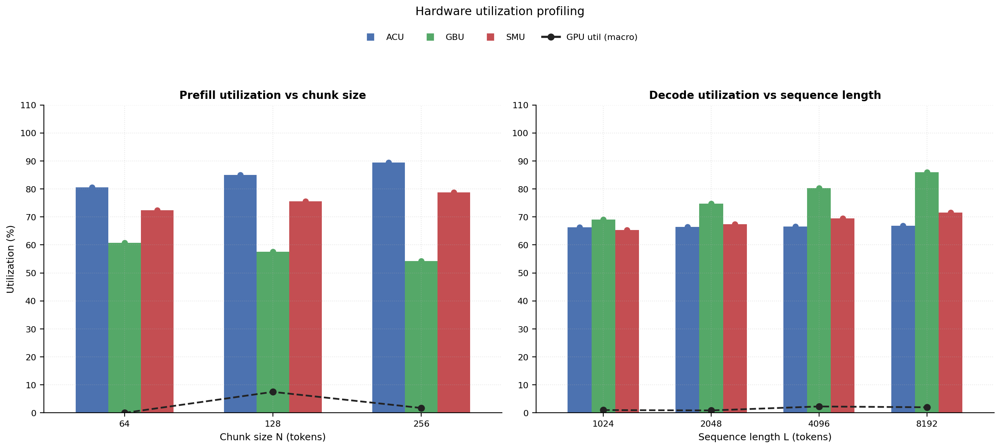

# RAN Inference Profiling Report

Run root: `/mnt/data/dheeraj/dicertation/inference-profile/runs/revised-rerun-20260415-145452-g6-opt67b-c64-256`

## Environment

| field | value |
| --- | --- |
| cache_root | n/a |
| captured_at | 2026-04-15T13:55:00Z |
| chunk_sizes | [64, 128, 256] |
| cuda_available | true |
| cuda_device_count | 8 |
| cwd | /mnt/data/dheeraj/dicertation/inference-profile |
| decode_modes | ["vram", "pcie_async"] |
| experiment_type | ran-dgxspark-v1 |
| gpu_id | 6 |
| l_out | 1024 |
| models | ["facebook/opt-6.7b"] |
| platform | Linux-6.8.0-106-generic-x86_64-with-glibc2.35 |
| python_executable | /home/dheeraj/miniconda3/envs/mls/bin/python |
| python_version | 3.11.14 |
| run_root | /mnt/data/dheeraj/dicertation/inference-profile/runs/revised-rerun-20260415-145452-g6-opt67b-c64-256 |
| scheduler | envelope_v1 |
| schema_version | ran_dgxspark_v1 |
| sequence_lengths | [1024, 2048, 4096, 8192] |
| sm_ai_cap | 32 |
| sm_ai_partition | 100 |
| sm_ai_partitions | [8, 16, 24, 32] |
| stage | profile |
| telemetry_tier | baseline_nvml_pt |
| timed_iterations | 5 |
| torch_available | true |
| torch_version | 2.10.0+cu128 |
| warmup_iterations | 3 |

## Model Constants

| model_id | sm_ai_partition | num_hidden_layers | hidden_size | num_attention_heads | ffn_dim | layer_index | layer_weight_bytes | total_weight_bytes_fp16 | vram_ceiling_bytes |
| --- | --- | --- | --- | --- | --- | --- | --- | --- | --- |
| facebook/opt-6.7b | 100 | 32 | 4096 | 32 | 16384 | 15 | 402759680 | 13316947968 | 15170115993 |

## Trace Inspection

### Primary trace

| field | value |
| --- | --- |
| errors | [] |
| header | ["frame", "slot", "time_slot_sched_ns", "time_decode_start_est_ns", "time_decode_end_est_ns", "time_decode_start_actual_ns", "time_decode_end_actual_ns", "decode_dur_us", "deadline_met", "target_sm", "profile_idx", "sm_count", "num_pusch", "sum_prb", "sum_tbs_bytes", "max_mcs"] |
| median_positive_delta_ms | 5.6997 |
| monotonicity.checked_column | time_slot_sched_ns |
| monotonicity.is_non_decreasing | true |
| monotonicity.negative_delta_count | 0 |
| monotonicity.positive_delta_count | 28377 |
| monotonicity.zero_delta_count | 0 |
| normalization.last_row_duration_policy | median_positive_forward_delta_ms |
| normalization.output_columns | ["time_ms", "sm_utilization", "slot_duration_ms", "source_schema", "sm_count"] |
| normalization.output_relative_path | derived/normalized_ldpc_trace.csv |
| normalized_row_count | 28378 |
| path | /mnt/raid0sata2/netsys/weaver-ext/ran/traces/e2e_2026030418/e2e_20260304_182034_tractor_ran_ctrl/ldpc_trace.csv |
| row_count | 28378 |
| schema_detected | schema_b |
| time_unit_hint | ns |
| usable | true |
| usage_policy | primary_only |
| used_for_scheduler_capacity | true |

### Secondary trace

| field | value |
| --- | --- |
| errors | ["ran_ctrl_trace.csv line 182958 has 9 field(s); expected 12"] |
| header | ["frame", "slot", "sm_available", "prbs_available", "prbs_allocated", "w_avg_mcs_prev", "w_avg_mcs_curr", "slots_since_underutil", "ramp_up_count", "num_ue_sched", "max_ue_backlog", "sum_ue_backlog"] |
| monotonicity.checked_column | n/a |
| monotonicity.is_non_decreasing | n/a |
| monotonicity.negative_delta_count | n/a |
| path | /mnt/raid0sata2/netsys/weaver-ext/ran/traces/e2e_2026030418/e2e_20260304_182034_tractor_ran_ctrl/ran_ctrl_trace.csv |
| row_count | 182956 |
| time_unit_hints | [] |
| usable | false |
| usage_policy | structural_only |
| used_for_scheduler_capacity | false |

## Raw-Profile Summary Tables

### Prefill profile summary

Source raw rows: `raw/prefill_events.csv` = 420. Summary artifact: `derived/prefill_summary.csv`.

| model_id | chunk_tokens | sm_ai_partition | max_input_tokens | prefill_max_gemm_us | prefill_workspace_bytes | prefill_parked_activation_bytes | telemetry_tier | telemetry_provider | telemetry_status | nvml_available | gpu_util | gpu_mem_used_mb | sm_clock_mhz | mem_clock_mhz | power_w | pt_step_ms | pt_mem_alloc_mb | pt_mem_reserved_mb | pt_workspace_mb | acu_pct | gbu_pct | smu_pct | microscopic_telemetry_status | microscopic_error |
| --- | --- | --- | --- | --- | --- | --- | --- | --- | --- | --- | --- | --- | --- | --- | --- | --- | --- | --- | --- | --- | --- | --- | --- | --- |
| facebook/opt-6.7b | 64 | 8 | 1024 | 2913.28 | 2097152 | 2097152 | baseline_nvml_pt | nvidia-smi | ok | true | 0 | 53 | 1695 | 7601 | 67.84 | 2.9133 | 399.1953 | 399.1953 | 2 | 71.1 | 70 | 62.1 | estimated | n/a |
| facebook/opt-6.7b | 64 | 16 | 1024 | 3735.296 | 2097152 | 2097152 | baseline_nvml_pt | nvidia-smi | ok | true | 0 | 53 | 1695 | 7601 | 68.15 | 3.7353 | 399.1953 | 399.1953 | 2 | 77.4 | 63.84 | 69 | estimated | n/a |
| facebook/opt-6.7b | 64 | 24 | 1024 | 271.584 | 2097152 | 2097152 | baseline_nvml_pt | nvidia-smi | ok | true | 0 | 53 | 1695 | 8001 | 68.95 | 0.2716 | 399.1953 | 399.1953 | 2 | 83.7 | 57.68 | 75.9 | estimated | n/a |
| facebook/opt-6.7b | 64 | 32 | 1024 | 277.504 | 2097152 | 2097152 | baseline_nvml_pt | nvidia-smi | ok | true | 0 | 53 | 1695 | 8001 | 68.17 | 0.2775 | 399.1953 | 399.1953 | 2 | 90 | 51.52 | 82.8 | estimated | n/a |
| facebook/opt-6.7b | 128 | 8 | 1024 | 313.344 | 4194304 | 4194304 | baseline_nvml_pt | nvidia-smi | ok | true | 0 | 53 | 1695 | 7601 | 68.12 | 0.3133 | 405.1953 | 405.1953 | 4 | 75.05 | 66.25 | 64.8 | estimated | n/a |
| facebook/opt-6.7b | 128 | 16 | 1024 | 4622.2401 | 4194304 | 4194304 | baseline_nvml_pt | nvidia-smi | ok | true | 7 | 53 | 1695 | 7601 | 68.39 | 4.6222 | 405.1953 | 405.1953 | 4 | 81.7 | 60.42 | 72 | estimated | n/a |
| facebook/opt-6.7b | 128 | 24 | 1024 | 3241.9839 | 4194304 | 4194304 | baseline_nvml_pt | nvidia-smi | ok | true | 16 | 53 | 1695 | 7601 | 69.84 | 3.242 | 405.1953 | 405.1953 | 4 | 88.35 | 54.59 | 79.2 | estimated | n/a |
| facebook/opt-6.7b | 128 | 32 | 1024 | 318.464 | 4194304 | 4194304 | baseline_nvml_pt | nvidia-smi | ok | true | 7 | 53 | 1695 | 8001 | 70.01 | 0.3185 | 405.1953 | 405.1953 | 4 | 95 | 48.76 | 86.4 | estimated | n/a |
| facebook/opt-6.7b | 256 | 8 | 1024 | 544.736 | 8388608 | 8388608 | baseline_nvml_pt | nvidia-smi | ok | true | 0 | 53 | 1695 | 7601 | 70.05 | 0.5447 | 417.1953 | 417.1953 | 8 | 79 | 62.5 | 67.5 | estimated | n/a |
| facebook/opt-6.7b | 256 | 16 | 1024 | 548.704 | 8388608 | 8388608 | baseline_nvml_pt | nvidia-smi | ok | true | 0 | 53 | 1695 | 7601 | 70.98 | 3.2645 | 417.1953 | 417.1953 | 8 | 86 | 57 | 75 | estimated | n/a |
| facebook/opt-6.7b | 256 | 24 | 1024 | 5413.888 | 8388608 | 8388608 | baseline_nvml_pt | nvidia-smi | ok | true | 7 | 53 | 1695 | 8001 | 68.97 | 5.4139 | 417.1953 | 417.1953 | 8 | 93 | 51.5 | 82.5 | estimated | n/a |
| facebook/opt-6.7b | 256 | 32 | 1024 | 551.936 | 8388608 | 8388608 | baseline_nvml_pt | nvidia-smi | ok | true | 0 | 53 | 1695 | 7601 | 68.79 | 0.5519 | 417.1953 | 417.1953 | 8 | 100 | 46 | 90 | estimated | n/a |

### Decode profile summary

Source raw rows: `raw/decode_events.csv` = 3840. Summary artifact: `derived/decode_summary.csv`.

| model_id | sequence_length | block_size | sm_ai_partition | decode_mode | decode_max_gemv_us | attention_fetch_compute_us | reduction_overhead_us | decode_workspace_bytes | decode_parked_activation_bytes | telemetry_tier | telemetry_provider | telemetry_status | nvml_available | gpu_util | gpu_mem_used_mb | sm_clock_mhz | mem_clock_mhz | power_w | pt_step_ms | pt_mem_alloc_mb | pt_mem_reserved_mb | pt_workspace_mb | acu_pct | gbu_pct | smu_pct | microscopic_telemetry_status | microscopic_error |
| --- | --- | --- | --- | --- | --- | --- | --- | --- | --- | --- | --- | --- | --- | --- | --- | --- | --- | --- | --- | --- | --- | --- | --- | --- | --- | --- | --- |
| facebook/opt-6.7b | 1024 | 64 | 8 | pcie_async | 275.456 | 135.008 | 21.9072 | 139264 | 8192 | baseline_nvml_pt | nvidia-smi | ok | true | 0 | 53 | 1695 | 7601 | 69.89 | 0.2755 | 408.375 | 408.375 | 0.1328 | 58.195 | 75.69 | 56.64 | estimated | n/a |
| facebook/opt-6.7b | 1024 | 64 | 8 | vram | 3041.312 | 142.4704 | 23.0336 | 139264 | 8192 | baseline_nvml_pt | nvidia-smi | ok | true | 0 | 53 | 1695 | 7601 | 69.72 | 3.0413 | 408.375 | 408.375 | 0.1328 | 59.85 | 70.525 | 58.28 | estimated | n/a |
| facebook/opt-6.7b | 1024 | 64 | 16 | pcie_async | 272.384 | 141.3952 | 22.9504 | 139264 | 8192 | baseline_nvml_pt | nvidia-smi | ok | true | 0 | 53 | 1695 | 7601 | 69.94 | 0.2724 | 408.375 | 408.375 | 0.1328 | 62.83 | 73.08 | 61.44 | estimated | n/a |
| facebook/opt-6.7b | 1024 | 64 | 16 | vram | 274.432 | 133.696 | 21.1072 | 139264 | 8192 | baseline_nvml_pt | nvidia-smi | ok | true | 0 | 53 | 1695 | 7601 | 69.79 | 0.2744 | 408.375 | 408.375 | 0.1328 | 64.6 | 68.25 | 63.92 | estimated | n/a |
| facebook/opt-6.7b | 1024 | 64 | 24 | pcie_async | 3146.7521 | 146.336 | 21.7024 | 139264 | 8192 | baseline_nvml_pt | nvidia-smi | ok | true | 0 | 53 | 1695 | 7601 | 69.79 | 3.1468 | 408.375 | 408.375 | 0.1328 | 67.465 | 70.47 | 66.24 | estimated | n/a |
| facebook/opt-6.7b | 1024 | 64 | 24 | vram | 275.456 | 137.2672 | 21.8752 | 139264 | 8192 | baseline_nvml_pt | nvidia-smi | ok | true | 1 | 53 | 1695 | 8001 | 69.07 | 0.2755 | 408.375 | 408.375 | 0.1328 | 69.35 | 65.975 | 69.56 | estimated | n/a |
| facebook/opt-6.7b | 1024 | 64 | 32 | pcie_async | 269.312 | 128.7872 | 21.6832 | 139264 | 8192 | baseline_nvml_pt | nvidia-smi | ok | true | 0 | 53 | 1695 | 7601 | 69.9 | 0.2693 | 408.375 | 408.375 | 0.1328 | 72.1 | 67.86 | 71.04 | estimated | n/a |
| facebook/opt-6.7b | 1024 | 64 | 32 | vram | 1462.0481 | 134.8928 | 23.9616 | 139264 | 8192 | baseline_nvml_pt | nvidia-smi | ok | true | 0 | 53 | 1695 | 7601 | 69.73 | 1.462 | 408.375 | 408.375 | 0.1328 | 74.1 | 63.7 | 75.2 | estimated | n/a |
| facebook/opt-6.7b | 1024 | 128 | 8 | pcie_async | 277.504 | 136.3712 | 22.8416 | 139264 | 8192 | baseline_nvml_pt | nvidia-smi | ok | true | 0 | 53 | 1695 | 7601 | 69.91 | 0.2775 | 408.375 | 408.375 | 0.1328 | 58.195 | 75.255 | 56.64 | estimated | n/a |
| facebook/opt-6.7b | 1024 | 128 | 8 | vram | 3003.2959 | 132.0576 | 22.528 | 139264 | 8192 | baseline_nvml_pt | nvidia-smi | ok | true | 0 | 53 | 1695 | 8001 | 70.04 | 3.0033 | 408.375 | 408.375 | 0.1328 | 60.165 | 70.1375 | 58.28 | estimated | n/a |
| facebook/opt-6.7b | 1024 | 128 | 16 | pcie_async | 451.488 | 175.9168 | 29.5936 | 139264 | 8192 | baseline_nvml_pt | nvidia-smi | ok | true | 0 | 53 | 1695 | 7601 | 70.17 | 0.4515 | 408.375 | 408.375 | 0.1328 | 62.83 | 72.66 | 61.44 | estimated | n/a |
| facebook/opt-6.7b | 1024 | 128 | 16 | vram | 3789.696 | 215.8464 | 26.3552 | 139264 | 8192 | baseline_nvml_pt | nvidia-smi | ok | true | 0 | 53 | 1695 | 8001 | 70.08 | 3.7897 | 408.375 | 408.375 | 0.1328 | 64.94 | 67.875 | 63.92 | estimated | n/a |
| facebook/opt-6.7b | 1024 | 128 | 24 | pcie_async | 327.68 | 134.144 | 21.504 | 139264 | 8192 | baseline_nvml_pt | nvidia-smi | ok | true | 0 | 53 | 1695 | 8001 | 70.41 | 0.3277 | 408.375 | 408.375 | 0.1328 | 67.465 | 70.065 | 66.24 | estimated | n/a |
| facebook/opt-6.7b | 1024 | 128 | 24 | vram | 274.432 | 150.3296 | 25.2544 | 139264 | 8192 | baseline_nvml_pt | nvidia-smi | ok | true | 0 | 53 | 1695 | 8001 | 70.35 | 0.2744 | 408.375 | 408.375 | 0.1328 | 69.715 | 65.6125 | 69.56 | estimated | n/a |
| facebook/opt-6.7b | 1024 | 128 | 32 | pcie_async | 3739.9039 | 173.0304 | 27.2512 | 139264 | 8192 | baseline_nvml_pt | nvidia-smi | ok | true | 0 | 53 | 1695 | 7601 | 70.09 | 3.7399 | 408.375 | 408.375 | 0.1328 | 72.1 | 67.47 | 71.04 | estimated | n/a |
| facebook/opt-6.7b | 1024 | 128 | 32 | vram | 3267.5841 | 143.808 | 26.432 | 139264 | 8192 | baseline_nvml_pt | nvidia-smi | ok | true | 0 | 53 | 1695 | 8001 | 69.68 | 3.2676 | 408.375 | 408.375 | 0.1328 | 74.49 | 63.35 | 75.2 | estimated | n/a |
| facebook/opt-6.7b | 1024 | 256 | 8 | pcie_async | 280.32 | 142.912 | 22.6368 | 139264 | 8192 | baseline_nvml_pt | nvidia-smi | ok | true | 16 | 53 | 1695 | 7601 | 70.04 | 0.2803 | 408.375 | 408.375 | 0.1328 | 58.195 | 74.82 | 56.64 | estimated | n/a |
| facebook/opt-6.7b | 1024 | 256 | 8 | vram | 3243.0079 | 136.7552 | 22.2528 | 139264 | 8192 | baseline_nvml_pt | nvidia-smi | ok | true | 0 | 53 | 1695 | 7601 | 70.19 | 3.243 | 408.375 | 408.375 | 0.1328 | 60.48 | 69.75 | 58.28 | estimated | n/a |
| facebook/opt-6.7b | 1024 | 256 | 16 | pcie_async | 3273.6001 | 171.6032 | 24.96 | 139264 | 8192 | baseline_nvml_pt | nvidia-smi | ok | true | 0 | 53 | 1695 | 7601 | 70.1 | 3.2736 | 408.375 | 408.375 | 0.1328 | 62.83 | 72.24 | 61.44 | estimated | n/a |
| facebook/opt-6.7b | 1024 | 256 | 16 | vram | 3776.3519 | 136.288 | 21.3632 | 139264 | 8192 | baseline_nvml_pt | nvidia-smi | ok | true | 0 | 53 | 1695 | 7601 | 70 | 3.7764 | 408.375 | 408.375 | 0.1328 | 65.28 | 67.5 | 63.92 | estimated | n/a |
| facebook/opt-6.7b | 1024 | 256 | 24 | pcie_async | 274.432 | 133.056 | 21.2736 | 139264 | 8192 | baseline_nvml_pt | nvidia-smi | ok | true | 7 | 53 | 1695 | 8001 | 70.42 | 0.2744 | 408.375 | 408.375 | 0.1328 | 67.465 | 69.66 | 66.24 | estimated | n/a |
| facebook/opt-6.7b | 1024 | 256 | 24 | vram | 3677.1841 | 132.288 | 20.8896 | 139264 | 8192 | baseline_nvml_pt | nvidia-smi | ok | true | 0 | 53 | 1695 | 7601 | 70.19 | 3.6772 | 408.375 | 408.375 | 0.1328 | 70.08 | 65.25 | 69.56 | estimated | n/a |
| facebook/opt-6.7b | 1024 | 256 | 32 | pcie_async | 305.376 | 148.48 | 21.7472 | 139264 | 8192 | baseline_nvml_pt | nvidia-smi | ok | true | 0 | 53 | 1695 | 7601 | 70.21 | 0.3054 | 408.375 | 408.375 | 0.1328 | 72.1 | 67.08 | 71.04 | estimated | n/a |
| facebook/opt-6.7b | 1024 | 256 | 32 | vram | 3247.1039 | 206.9632 | 27.5328 | 139264 | 8192 | baseline_nvml_pt | nvidia-smi | ok | true | 0 | 53 | 1695 | 7601 | 70.07 | 3.2471 | 408.375 | 408.375 | 0.1328 | 74.88 | 63 | 75.2 | estimated | n/a |
| facebook/opt-6.7b | 2048 | 64 | 8 | pcie_async | 272.384 | 132.3008 | 22.7136 | 270336 | 8192 | baseline_nvml_pt | nvidia-smi | ok | true | 0 | 53 | 1695 | 8001 | 70.1 | 0.2724 | 424.5 | 424.5 | 0.2578 | 57.065 | 82.07 | 57.82 | estimated | n/a |
| facebook/opt-6.7b | 2048 | 64 | 8 | vram | 3112.1919 | 139.6224 | 23.136 | 270336 | 8192 | baseline_nvml_pt | nvidia-smi | ok | true | 0 | 53 | 1695 | 7601 | 70.4 | 3.1122 | 424.5 | 424.5 | 0.2578 | 61.11 | 74.6583 | 60.3467 | estimated | n/a |
| facebook/opt-6.7b | 2048 | 64 | 16 | pcie_async | 3420.1601 | 138.3488 | 20.736 | 270336 | 8192 | baseline_nvml_pt | nvidia-smi | ok | true | 0 | 53 | 1695 | 7601 | 70.39 | 3.4202 | 424.5 | 424.5 | 0.2578 | 61.61 | 79.24 | 62.72 | estimated | n/a |
| facebook/opt-6.7b | 2048 | 64 | 16 | vram | 279.552 | 134.9632 | 21.5616 | 270336 | 8192 | baseline_nvml_pt | nvidia-smi | ok | true | 0 | 53 | 1695 | 8001 | 70.6 | 0.2796 | 424.5 | 424.5 | 0.2578 | 65.96 | 72.25 | 66.1867 | estimated | n/a |
| facebook/opt-6.7b | 2048 | 64 | 24 | pcie_async | 280.576 | 146.3616 | 23.4112 | 270336 | 8192 | baseline_nvml_pt | nvidia-smi | ok | true | 0 | 53 | 1695 | 7601 | 70.52 | 0.2806 | 424.5 | 424.5 | 0.2578 | 66.155 | 76.41 | 67.62 | estimated | n/a |
| facebook/opt-6.7b | 2048 | 64 | 24 | vram | 326.656 | 194.8992 | 26.976 | 270336 | 8192 | baseline_nvml_pt | nvidia-smi | ok | true | 0 | 53 | 1695 | 7601 | 70.45 | 0.3267 | 424.5 | 424.5 | 0.2578 | 70.81 | 69.8417 | 72.0267 | estimated | n/a |
| facebook/opt-6.7b | 2048 | 64 | 32 | pcie_async | 1525.7601 | 764.7232 | 24.576 | 270336 | 8192 | baseline_nvml_pt | nvidia-smi | ok | true | 0 | 53 | 1695 | 7601 | 70.18 | 3.189 | 424.5 | 424.5 | 0.2578 | 70.7 | 73.58 | 72.52 | estimated | n/a |
| facebook/opt-6.7b | 2048 | 64 | 32 | vram | 3207.36 | 173.0496 | 25.8496 | 270336 | 8192 | baseline_nvml_pt | nvidia-smi | ok | true | 0 | 53 | 1695 | 7601 | 70.32 | 3.2074 | 424.5 | 424.5 | 0.2578 | 75.66 | 67.4333 | 77.8667 | estimated | n/a |
| facebook/opt-6.7b | 2048 | 128 | 8 | pcie_async | 301.952 | 136.192 | 22.016 | 270336 | 8192 | baseline_nvml_pt | nvidia-smi | ok | true | 0 | 53 | 1695 | 8001 | 69.54 | 0.302 | 424.5 | 424.5 | 0.2578 | 57.065 | 82.505 | 58.0167 | estimated | n/a |
| facebook/opt-6.7b | 2048 | 128 | 8 | vram | 368.64 | 161.3632 | 24.3456 | 270336 | 8192 | baseline_nvml_pt | nvidia-smi | ok | true | 0 | 53 | 1695 | 7601 | 70.45 | 0.3686 | 424.5 | 424.5 | 0.2578 | 61.635 | 74.7875 | 60.5533 | estimated | n/a |
| facebook/opt-6.7b | 2048 | 128 | 16 | pcie_async | 280.576 | 143.1552 | 27.424 | 270336 | 8192 | baseline_nvml_pt | nvidia-smi | ok | true | 7 | 53 | 1695 | 8001 | 70.48 | 0.2806 | 424.5 | 424.5 | 0.2578 | 61.61 | 79.66 | 62.9333 | estimated | n/a |
| facebook/opt-6.7b | 2048 | 128 | 16 | vram | 3813.184 | 160.1344 | 23.5392 | 270336 | 8192 | baseline_nvml_pt | nvidia-smi | ok | true | 0 | 53 | 1695 | 7601 | 69.33 | 3.8132 | 424.5 | 424.5 | 0.2578 | 66.5267 | 72.375 | 66.4133 | estimated | n/a |
| facebook/opt-6.7b | 2048 | 128 | 24 | pcie_async | 3131.392 | 140.288 | 27.2384 | 270336 | 8192 | baseline_nvml_pt | nvidia-smi | ok | true | 0 | 53 | 1695 | 8001 | 70.58 | 3.1314 | 424.5 | 424.5 | 0.2578 | 66.155 | 76.815 | 67.85 | estimated | n/a |
| facebook/opt-6.7b | 2048 | 128 | 24 | vram | 925.696 | 221.7728 | 21.12 | 270336 | 8192 | baseline_nvml_pt | nvidia-smi | ok | true | 7 | 53 | 1695 | 8001 | 70.49 | 0.9257 | 424.5 | 424.5 | 0.2578 | 71.4183 | 69.9625 | 72.2733 | estimated | n/a |
| facebook/opt-6.7b | 2048 | 128 | 32 | pcie_async | 3125.1521 | 164.5888 | 25.4016 | 270336 | 8192 | baseline_nvml_pt | nvidia-smi | ok | true | 7 | 53 | 1695 | 8001 | 69.79 | 3.1252 | 424.5 | 424.5 | 0.2578 | 70.7 | 73.97 | 72.7667 | estimated | n/a |
| facebook/opt-6.7b | 2048 | 128 | 32 | vram | 3263.4881 | 144.5568 | 21.3056 | 270336 | 8192 | baseline_nvml_pt | nvidia-smi | ok | true | 0 | 53 | 1695 | 7601 | 70.03 | 3.2635 | 424.5 | 424.5 | 0.2578 | 76.31 | 67.55 | 78.1333 | estimated | n/a |
| facebook/opt-6.7b | 2048 | 256 | 8 | pcie_async | 271.36 | 143.0592 | 22.5344 | 270336 | 8192 | baseline_nvml_pt | nvidia-smi | ok | true | 0 | 53 | 1695 | 7601 | 70.31 | 0.2714 | 424.5 | 424.5 | 0.2578 | 57.065 | 82.94 | 58.2133 | estimated | n/a |
| facebook/opt-6.7b | 2048 | 256 | 8 | vram | 381.952 | 199.712 | 27.6672 | 270336 | 8192 | baseline_nvml_pt | nvidia-smi | ok | true | 0 | 53 | 1695 | 8001 | 70.34 | 0.382 | 424.5 | 424.5 | 0.2578 | 62.16 | 74.9167 | 60.76 | estimated | n/a |
| facebook/opt-6.7b | 2048 | 256 | 16 | pcie_async | 270.208 | 138.0032 | 21.9136 | 270336 | 8192 | baseline_nvml_pt | nvidia-smi | ok | true | 0 | 53 | 1695 | 7601 | 70.05 | 0.2702 | 424.5 | 424.5 | 0.2578 | 61.61 | 80.08 | 63.1467 | estimated | n/a |
| facebook/opt-6.7b | 2048 | 256 | 16 | vram | 280.384 | 163.6352 | 24.6528 | 270336 | 8192 | baseline_nvml_pt | nvidia-smi | ok | true | 0 | 53 | 1695 | 7601 | 70.06 | 0.2804 | 424.5 | 424.5 | 0.2578 | 67.0933 | 72.5 | 66.64 | estimated | n/a |
| facebook/opt-6.7b | 2048 | 256 | 24 | pcie_async | 6126.6241 | 1353.2672 | 23.36 | 270336 | 8192 | baseline_nvml_pt | nvidia-smi | ok | true | 0 | 53 | 1695 | 7601 | 70.14 | 6.144 | 424.5 | 424.5 | 0.2578 | 66.155 | 77.22 | 68.08 | estimated | n/a |
| facebook/opt-6.7b | 2048 | 256 | 24 | vram | 280.576 | 140.6976 | 21.7728 | 270336 | 8192 | baseline_nvml_pt | nvidia-smi | ok | true | 0 | 53 | 1695 | 7601 | 69.99 | 0.2806 | 424.5 | 424.5 | 0.2578 | 72.0267 | 70.0833 | 72.52 | estimated | n/a |
| facebook/opt-6.7b | 2048 | 256 | 32 | pcie_async | 3757.056 | 144.384 | 23.904 | 270336 | 8192 | baseline_nvml_pt | nvidia-smi | ok | true | 0 | 53 | 1695 | 7601 | 70.14 | 3.7571 | 424.5 | 424.5 | 0.2578 | 70.7 | 74.36 | 73.0133 | estimated | n/a |
| facebook/opt-6.7b | 2048 | 256 | 32 | vram | 3290.112 | 757.5232 | 23.9936 | 270336 | 8192 | baseline_nvml_pt | nvidia-smi | ok | true | 0 | 53 | 1695 | 7601 | 70.2 | 3.2901 | 424.5 | 424.5 | 0.2578 | 76.96 | 67.6667 | 78.4 | estimated | n/a |
| facebook/opt-6.7b | 4096 | 64 | 8 | pcie_async | 3105.8559 | 165.4656 | 21.664 | 532480 | 8192 | baseline_nvml_pt | nvidia-smi | ok | true | 0 | 53 | 1695 | 7601 | 70.36 | 3.1059 | 456.75 | 456.75 | 0.5078 | 55.935 | 88.45 | 59 | estimated | n/a |
| facebook/opt-6.7b | 4096 | 64 | 8 | vram | 299.008 | 247.9552 | 28.064 | 532480 | 8192 | baseline_nvml_pt | nvidia-smi | ok | true | 0 | 53 | 1695 | 8001 | 69.53 | 0.3756 | 456.75 | 456.75 | 0.5078 | 62.37 | 78.7917 | 62.4133 | estimated | n/a |
| facebook/opt-6.7b | 4096 | 64 | 16 | pcie_async | 370.624 | 173.632 | 21.344 | 532480 | 8192 | baseline_nvml_pt | nvidia-smi | ok | true | 0 | 53 | 1695 | 7601 | 70.11 | 0.3706 | 456.75 | 456.75 | 0.5078 | 60.39 | 85.4 | 64 | estimated | n/a |
| facebook/opt-6.7b | 4096 | 64 | 16 | vram | 300 | 168.6976 | 21.6768 | 532480 | 8192 | baseline_nvml_pt | nvidia-smi | ok | true | 8 | 53 | 1695 | 7601 | 70.06 | 0.3 | 456.75 | 456.75 | 0.5078 | 67.32 | 76.25 | 68.4533 | estimated | n/a |
| facebook/opt-6.7b | 4096 | 64 | 24 | pcie_async | 276.48 | 172.032 | 21.5808 | 532480 | 8192 | baseline_nvml_pt | nvidia-smi | ok | true | 2 | 53 | 1695 | 7601 | 69.92 | 0.2765 | 456.75 | 456.75 | 0.5078 | 64.845 | 82.35 | 69 | estimated | n/a |
| facebook/opt-6.7b | 4096 | 64 | 24 | vram | 286.72 | 212.0512 | 24.8448 | 532480 | 8192 | baseline_nvml_pt | nvidia-smi | ok | true | 0 | 53 | 1695 | 7601 | 69.88 | 0.2867 | 456.75 | 456.75 | 0.5078 | 72.27 | 73.7083 | 74.4933 | estimated | n/a |
| facebook/opt-6.7b | 4096 | 64 | 32 | pcie_async | 549.888 | 206.2208 | 24.5568 | 532480 | 8192 | baseline_nvml_pt | nvidia-smi | ok | true | 0 | 53 | 1695 | 7601 | 70.12 | 0.5499 | 456.75 | 456.75 | 0.5078 | 69.3 | 79.3 | 74 | estimated | n/a |
| facebook/opt-6.7b | 4096 | 64 | 32 | vram | 276.48 | 167.7312 | 20.3648 | 532480 | 8192 | baseline_nvml_pt | nvidia-smi | ok | true | 8 | 53 | 1695 | 8001 | 70.53 | 0.2765 | 456.75 | 456.75 | 0.5078 | 77.22 | 71.1667 | 80.5333 | estimated | n/a |
| facebook/opt-6.7b | 4096 | 128 | 8 | pcie_async | 278.272 | 172.8896 | 22.4 | 532480 | 8192 | baseline_nvml_pt | nvidia-smi | ok | true | 6 | 53 | 1695 | 7601 | 70.37 | 0.2783 | 456.75 | 456.75 | 0.5078 | 55.935 | 89.755 | 59.3933 | estimated | n/a |
| facebook/opt-6.7b | 4096 | 128 | 8 | vram | 274.432 | 862.0352 | 22.7072 | 532480 | 8192 | baseline_nvml_pt | nvidia-smi | ok | true | 4 | 53 | 1695 | 7601 | 70.31 | 3.5698 | 456.75 | 456.75 | 0.5078 | 63.105 | 79.4375 | 62.8267 | estimated | n/a |
| facebook/opt-6.7b | 4096 | 128 | 16 | pcie_async | 290.816 | 209.92 | 26.1952 | 532480 | 8192 | baseline_nvml_pt | nvidia-smi | ok | true | 0 | 53 | 1695 | 7601 | 69.7 | 0.2908 | 456.75 | 456.75 | 0.5078 | 60.39 | 86.66 | 64.4267 | estimated | n/a |
| facebook/opt-6.7b | 4096 | 128 | 16 | vram | 277.504 | 166.0096 | 647.1168 | 532480 | 8192 | baseline_nvml_pt | nvidia-smi | ok | true | 4 | 53 | 1695 | 7601 | 70.36 | 3.1475 | 456.75 | 456.75 | 0.5078 | 68.1133 | 76.875 | 68.9067 | estimated | n/a |
| facebook/opt-6.7b | 4096 | 128 | 24 | pcie_async | 282.464 | 200.0512 | 23.7248 | 532480 | 8192 | baseline_nvml_pt | nvidia-smi | ok | true | 0 | 53 | 1695 | 8001 | 70.89 | 0.2825 | 456.75 | 456.75 | 0.5078 | 64.845 | 83.565 | 69.46 | estimated | n/a |
| facebook/opt-6.7b | 4096 | 128 | 24 | vram | 291.84 | 187.776 | 23.552 | 532480 | 8192 | baseline_nvml_pt | nvidia-smi | ok | true | 2 | 53 | 1695 | 7601 | 70.46 | 0.2918 | 456.75 | 456.75 | 0.5078 | 73.1217 | 74.3125 | 74.9867 | estimated | n/a |
| facebook/opt-6.7b | 4096 | 128 | 32 | pcie_async | 272.384 | 167.2384 | 21.5104 | 532480 | 8192 | baseline_nvml_pt | nvidia-smi | ok | true | 7 | 53 | 1695 | 7601 | 70.35 | 0.2724 | 456.75 | 456.75 | 0.5078 | 69.3 | 80.47 | 74.4933 | estimated | n/a |
| facebook/opt-6.7b | 4096 | 128 | 32 | vram | 288.768 | 177.7088 | 21.2416 | 532480 | 8192 | baseline_nvml_pt | nvidia-smi | ok | true | 0 | 53 | 1695 | 7601 | 70.28 | 0.2888 | 456.75 | 456.75 | 0.5078 | 78.13 | 71.75 | 81.0667 | estimated | n/a |
| facebook/opt-6.7b | 4096 | 256 | 8 | pcie_async | 273.408 | 165.4336 | 29.2992 | 532480 | 8192 | baseline_nvml_pt | nvidia-smi | ok | true | 0 | 53 | 1695 | 7601 | 70.78 | 0.2734 | 456.75 | 456.75 | 0.5078 | 55.935 | 91.06 | 59.7867 | estimated | n/a |
| facebook/opt-6.7b | 4096 | 256 | 8 | vram | 3526.6559 | 840.64 | 21.3248 | 532480 | 8192 | baseline_nvml_pt | nvidia-smi | ok | true | 0 | 53 | 1695 | 7601 | 70.65 | 3.5285 | 456.75 | 456.75 | 0.5078 | 63.84 | 80.0833 | 63.24 | estimated | n/a |
| facebook/opt-6.7b | 4096 | 256 | 16 | pcie_async | 4089.6959 | 169.216 | 21.6448 | 532480 | 8192 | baseline_nvml_pt | nvidia-smi | ok | true | 0 | 53 | 1695 | 7601 | 70.68 | 4.0897 | 456.75 | 456.75 | 0.5078 | 60.39 | 87.92 | 64.8533 | estimated | n/a |
| facebook/opt-6.7b | 4096 | 256 | 16 | vram | 409.6 | 165.4784 | 20.5312 | 532480 | 8192 | baseline_nvml_pt | nvidia-smi | ok | true | 10 | 53 | 1695 | 7601 | 70.67 | 0.4096 | 456.75 | 456.75 | 0.5078 | 68.9067 | 77.5 | 69.36 | estimated | n/a |
| facebook/opt-6.7b | 4096 | 256 | 24 | pcie_async | 434.336 | 1440.544 | 23.1424 | 532480 | 8192 | baseline_nvml_pt | nvidia-smi | ok | true | 0 | 53 | 1695 | 7601 | 70.59 | 3.3587 | 456.75 | 456.75 | 0.5078 | 64.845 | 84.78 | 69.92 | estimated | n/a |
| facebook/opt-6.7b | 4096 | 256 | 24 | vram | 272.608 | 173.4336 | 20.2432 | 532480 | 8192 | baseline_nvml_pt | nvidia-smi | ok | true | 2 | 53 | 1695 | 7601 | 70.51 | 0.2726 | 456.75 | 456.75 | 0.5078 | 73.9733 | 74.9167 | 75.48 | estimated | n/a |
| facebook/opt-6.7b | 4096 | 256 | 32 | pcie_async | 316.416 | 182.6816 | 24.1664 | 532480 | 8192 | baseline_nvml_pt | nvidia-smi | ok | true | 0 | 53 | 1695 | 7601 | 70.75 | 0.3164 | 456.75 | 456.75 | 0.5078 | 69.3 | 81.64 | 74.9867 | estimated | n/a |
| facebook/opt-6.7b | 4096 | 256 | 32 | vram | 271.328 | 160.4928 | 21.8816 | 532480 | 8192 | baseline_nvml_pt | nvidia-smi | ok | true | 2 | 53 | 1695 | 7601 | 70.6 | 0.2713 | 456.75 | 456.75 | 0.5078 | 79.04 | 72.3333 | 81.6 | estimated | n/a |
| facebook/opt-6.7b | 8192 | 64 | 8 | pcie_async | 273.408 | 272.7936 | 23.584 | 1056768 | 8192 | baseline_nvml_pt | nvidia-smi | ok | true | 0 | 53 | 1695 | 7601 | 70.74 | 0.298 | 521.25 | 521.25 | 1.0078 | 54.805 | 94.83 | 60.18 | estimated | n/a |
| facebook/opt-6.7b | 8192 | 64 | 8 | vram | 3130.2719 | 861.9776 | 22.9504 | 1056768 | 8192 | baseline_nvml_pt | nvidia-smi | ok | true | 9 | 53 | 1695 | 7601 | 70.9 | 3.2276 | 521.25 | 521.25 | 1.0078 | 63.63 | 82.925 | 64.48 | estimated | n/a |
| facebook/opt-6.7b | 8192 | 64 | 16 | pcie_async | 293.888 | 266.6944 | 22.7712 | 1056768 | 8192 | baseline_nvml_pt | nvidia-smi | ok | true | 0 | 53 | 1695 | 7601 | 70.66 | 0.2939 | 521.25 | 521.25 | 1.0078 | 59.17 | 91.56 | 65.28 | estimated | n/a |
| facebook/opt-6.7b | 8192 | 64 | 16 | vram | 273.408 | 263.8016 | 21.0624 | 1056768 | 8192 | baseline_nvml_pt | nvidia-smi | ok | true | 0 | 53 | 1695 | 7601 | 70.72 | 0.2806 | 521.25 | 521.25 | 1.0078 | 68.68 | 80.25 | 70.72 | estimated | n/a |
| facebook/opt-6.7b | 8192 | 64 | 24 | pcie_async | 279.552 | 263.776 | 22.3168 | 1056768 | 8192 | baseline_nvml_pt | nvidia-smi | ok | true | 0 | 53 | 1695 | 7601 | 70.56 | 0.2796 | 521.25 | 521.25 | 1.0078 | 63.535 | 88.29 | 70.38 | estimated | n/a |
| facebook/opt-6.7b | 8192 | 64 | 24 | vram | 270.592 | 262.5088 | 21.1072 | 1056768 | 8192 | baseline_nvml_pt | nvidia-smi | ok | true | 16 | 53 | 1695 | 7601 | 70.69 | 0.2824 | 521.25 | 521.25 | 1.0078 | 73.73 | 77.575 | 76.96 | estimated | n/a |
| facebook/opt-6.7b | 8192 | 64 | 32 | pcie_async | 1047.648 | 262.9632 | 23.2128 | 1056768 | 8192 | baseline_nvml_pt | nvidia-smi | ok | true | 0 | 53 | 1695 | 7601 | 70.86 | 1.0476 | 521.25 | 521.25 | 1.0078 | 67.9 | 85.02 | 75.48 | estimated | n/a |
| facebook/opt-6.7b | 8192 | 64 | 32 | vram | 274.432 | 260.4992 | 22.9824 | 1056768 | 8192 | baseline_nvml_pt | nvidia-smi | ok | true | 0 | 53 | 1695 | 7601 | 70.5 | 0.2744 | 521.25 | 521.25 | 1.0078 | 78.78 | 74.9 | 83.2 | estimated | n/a |
| facebook/opt-6.7b | 8192 | 128 | 8 | pcie_async | 282.368 | 267.0592 | 20.6336 | 1056768 | 8192 | baseline_nvml_pt | nvidia-smi | ok | true | 0 | 53 | 1695 | 7601 | 70.61 | 0.2836 | 521.25 | 521.25 | 1.0078 | 54.805 | 97.005 | 60.77 | estimated | n/a |
| facebook/opt-6.7b | 8192 | 128 | 8 | vram | 335.936 | 279.7184 | 22.4768 | 1056768 | 8192 | baseline_nvml_pt | nvidia-smi | ok | true | 0 | 53 | 1695 | 7601 | 70.68 | 0.3359 | 521.25 | 521.25 | 1.0078 | 64.575 | 84.0875 | 65.1 | estimated | n/a |
| facebook/opt-6.7b | 8192 | 128 | 16 | pcie_async | 285.696 | 261.4976 | 24.3904 | 1056768 | 8192 | baseline_nvml_pt | nvidia-smi | ok | true | 0 | 53 | 1695 | 7601 | 70.92 | 0.2857 | 521.25 | 521.25 | 1.0078 | 59.17 | 93.66 | 65.92 | estimated | n/a |
| facebook/opt-6.7b | 8192 | 128 | 16 | vram | 3262.208 | 869.888 | 20.8896 | 1056768 | 8192 | baseline_nvml_pt | nvidia-smi | ok | true | 8 | 53 | 1695 | 8001 | 70.81 | 3.2809 | 521.25 | 521.25 | 1.0078 | 69.7 | 81.375 | 71.4 | estimated | n/a |
| facebook/opt-6.7b | 8192 | 128 | 24 | pcie_async | 272.384 | 258.6496 | 20.7168 | 1056768 | 8192 | baseline_nvml_pt | nvidia-smi | ok | true | 0 | 53 | 1695 | 7601 | 70.48 | 0.2724 | 521.25 | 521.25 | 1.0078 | 63.535 | 90.315 | 71.07 | estimated | n/a |
| facebook/opt-6.7b | 8192 | 128 | 24 | vram | 276.48 | 262.5728 | 21.1264 | 1056768 | 8192 | baseline_nvml_pt | nvidia-smi | ok | true | 0 | 53 | 1695 | 7601 | 70.68 | 0.2765 | 521.25 | 521.25 | 1.0078 | 74.825 | 78.6625 | 77.7 | estimated | n/a |
| facebook/opt-6.7b | 8192 | 128 | 32 | pcie_async | 269.216 | 256.6016 | 20.5248 | 1056768 | 8192 | baseline_nvml_pt | nvidia-smi | ok | true | 0 | 53 | 1695 | 8001 | 70.83 | 0.2692 | 521.25 | 521.25 | 1.0078 | 67.9 | 86.97 | 76.22 | estimated | n/a |
| facebook/opt-6.7b | 8192 | 128 | 32 | vram | 272.384 | 258.3744 | 21.2864 | 1056768 | 8192 | baseline_nvml_pt | nvidia-smi | ok | true | 7 | 53 | 1695 | 8001 | 70.77 | 0.2724 | 521.25 | 521.25 | 1.0078 | 79.95 | 75.95 | 84 | estimated | n/a |
| facebook/opt-6.7b | 8192 | 256 | 8 | pcie_async | 281.6 | 265.5488 | 22.6496 | 1056768 | 8192 | baseline_nvml_pt | nvidia-smi | ok | true | 0 | 53 | 1695 | 7601 | 70.18 | 0.2816 | 521.25 | 521.25 | 1.0078 | 54.805 | 99.18 | 61.36 | estimated | n/a |
| facebook/opt-6.7b | 8192 | 256 | 8 | vram | 272.384 | 258.8096 | 24.1344 | 1056768 | 8192 | baseline_nvml_pt | nvidia-smi | ok | true | 0 | 53 | 1695 | 8001 | 70.5 | 0.2724 | 521.25 | 521.25 | 1.0078 | 65.52 | 85.25 | 65.72 | estimated | n/a |
| facebook/opt-6.7b | 8192 | 256 | 16 | pcie_async | 3862.5281 | 259.8976 | 20.6848 | 1056768 | 8192 | baseline_nvml_pt | nvidia-smi | ok | true | 0 | 53 | 1695 | 7601 | 70.03 | 3.8625 | 521.25 | 521.25 | 1.0078 | 59.17 | 95.76 | 66.56 | estimated | n/a |
| facebook/opt-6.7b | 8192 | 256 | 16 | vram | 283.648 | 264.224 | 781.2032 | 1056768 | 8192 | baseline_nvml_pt | nvidia-smi | ok | true | 0 | 53 | 1695 | 7601 | 70.18 | 3.8218 | 521.25 | 521.25 | 1.0078 | 70.72 | 82.5 | 72.08 | estimated | n/a |
| facebook/opt-6.7b | 8192 | 256 | 24 | pcie_async | 276.48 | 261.7216 | 24.9408 | 1056768 | 8192 | baseline_nvml_pt | nvidia-smi | ok | true | 0 | 53 | 1695 | 7601 | 70.31 | 0.2765 | 521.25 | 521.25 | 1.0078 | 63.535 | 92.34 | 71.76 | estimated | n/a |
| facebook/opt-6.7b | 8192 | 256 | 24 | vram | 279.552 | 261.1456 | 22.1184 | 1056768 | 8192 | baseline_nvml_pt | nvidia-smi | ok | true | 0 | 53 | 1695 | 7601 | 70.31 | 0.2796 | 521.25 | 521.25 | 1.0078 | 75.92 | 79.75 | 78.44 | estimated | n/a |
| facebook/opt-6.7b | 8192 | 256 | 32 | pcie_async | 3291.2321 | 257.5808 | 21.1328 | 1056768 | 8192 | baseline_nvml_pt | nvidia-smi | ok | true | 0 | 53 | 1695 | 8001 | 70.43 | 3.2912 | 521.25 | 521.25 | 1.0078 | 67.9 | 88.92 | 76.96 | estimated | n/a |
| facebook/opt-6.7b | 8192 | 256 | 32 | vram | 272.384 | 258.2336 | 21.2224 | 1056768 | 8192 | baseline_nvml_pt | nvidia-smi | ok | true | 8 | 53 | 1695 | 7601 | 70.08 | 0.2724 | 521.25 | 521.25 | 1.0078 | 81.12 | 77 | 84.8 | estimated | n/a |

### PCIe profile summary

Source raw rows: `raw/pcie_events.csv` = 15. Summary artifact: `derived/pcie_summary.csv`.

| model_id | block_size | kv_block_bytes | transfer_only_us | overlap_total_us | dummy_compute_us | exposed_transfer_us | effective_gbps | overlap_status | telemetry_tier | telemetry_provider | telemetry_status | nvml_available | gpu_util | gpu_mem_used_mb | sm_clock_mhz | mem_clock_mhz | power_w | pt_step_ms | pt_mem_alloc_mb | pt_mem_reserved_mb | pt_workspace_mb | acu_pct | gbu_pct | smu_pct | microscopic_telemetry_status | microscopic_error |
| --- | --- | --- | --- | --- | --- | --- | --- | --- | --- | --- | --- | --- | --- | --- | --- | --- | --- | --- | --- | --- | --- | --- | --- | --- | --- | --- |
| facebook/opt-6.7b | 64 | 1048576 | 700.3136 | 42757.67 | 42081.7213 | 675.9487 | 1.4973 | measured | baseline_nvml_pt | nvidia-smi | partial | true | 0 | 53 | 1695 | 7601 | 70.08 | n/a | n/a | n/a | n/a | 65 | 65 | 65 | estimated | n/a |
| facebook/opt-6.7b | 128 | 2097152 | 475.7312 | 33774.3871 | 33454.2834 | 320.1037 | 4.4083 | measured | baseline_nvml_pt | nvidia-smi | partial | true | 25 | 53 | 1695 | 7601 | 63.25 | n/a | n/a | n/a | n/a | 65 | 65 | 65 | estimated | n/a |
| facebook/opt-6.7b | 256 | 4194304 | 2319.0016 | 34444.4415 | 34121.7282 | 322.7132 | 1.8087 | measured | baseline_nvml_pt | nvidia-smi | partial | true | 0 | 53 | 1695 | 7601 | 69.87 | n/a | n/a | n/a | n/a | 65 | 65 | 65 | estimated | n/a |

## SLA Tables

### Successful configurations

| model_id | chunk_tokens | sequence_length | ttft_ms | tpot_ms_vram | tpot_ms_pcie_async | decode_runway_tokens | status |
| --- | --- | --- | --- | --- | --- | --- | --- |
| facebook/opt-6.7b | 64 | 1024 | 3409.9691 | 285.7966 | 402.6087 | 3470 | success |
| facebook/opt-6.7b | 64 | 2048 | 3409.9691 | 622.1779 | 1010.375 | 3470 | success |
| facebook/opt-6.7b | 64 | 4096 | 3409.9691 | 59.1032 | 1497.3063 | 3469 | success |
| facebook/opt-6.7b | 64 | 8192 | 3409.9691 | 61.7624 | 2978.9919 | 3468 | success |
| facebook/opt-6.7b | 128 | 1024 | 1956.6429 | 632.8238 | 806.4171 | 3406 | success |
| facebook/opt-6.7b | 128 | 2048 | 1956.6429 | 631.8973 | 770.002 | 3406 | success |
| facebook/opt-6.7b | 128 | 4096 | 1956.6429 | 61.8099 | 386.1239 | 3405 | success |
| facebook/opt-6.7b | 128 | 8192 | 1956.6429 | 61.2469 | 716.1299 | 3404 | success |
| facebook/opt-6.7b | 256 | 1024 | 1695.5473 | 630.9478 | 105.3868 | 3278 | success |
| facebook/opt-6.7b | 256 | 2048 | 1695.5473 | 656.71 | 809.3546 | 3278 | success |
| facebook/opt-6.7b | 256 | 4096 | 1695.5473 | 57.931 | 232.6002 | 3277 | success |
| facebook/opt-6.7b | 256 | 8192 | 1695.5473 | 61.2403 | 971.2937 | 3276 | success |

### Failed configurations

No rows available.

## Per-Model Scaling Analysis

| model_id | successful_configs | failed_configs | chunk_tokens_tested | sequence_lengths_tested | largest_successful_chunk_tokens | ttft_ms_min | ttft_ms_max | tpot_ms_vram_min | tpot_ms_vram_max | tpot_ms_pcie_async_min | tpot_ms_pcie_async_max | max_decode_runway_tokens |
| --- | --- | --- | --- | --- | --- | --- | --- | --- | --- | --- | --- | --- |
| facebook/opt-6.7b | 12 | 0 | 64, 128, 256 | 1024, 2048, 4096, 8192 | 256 | 1695.5473 | 3409.9691 | 57.931 | 656.71 | 105.3868 | 2978.9919 | 3470 |

## Plots

### Revised 01 Ran Trace Interleaving

[Interactive companion](plots/revised_01_ran_trace_interleaving_interactive.html)

### Revised 02 Prefill Safety Boundary

### Revised 03 Prefill Vram Composition

### Revised 04 Ttft Vs Runway

### Revised 05 Decode Tpot Degradation

### Revised 06 Operation Level Microarchitecture Summary

### Revised 07 Hardware Utilization Profiling

### Revised 08 Decode Memory Consumption

### 09 Spatial VRAM Composition (Prefill) · Pie View

