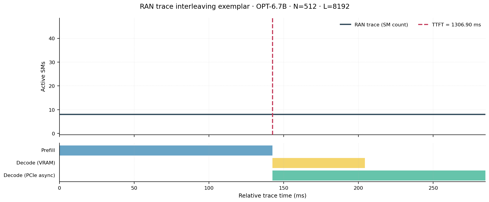
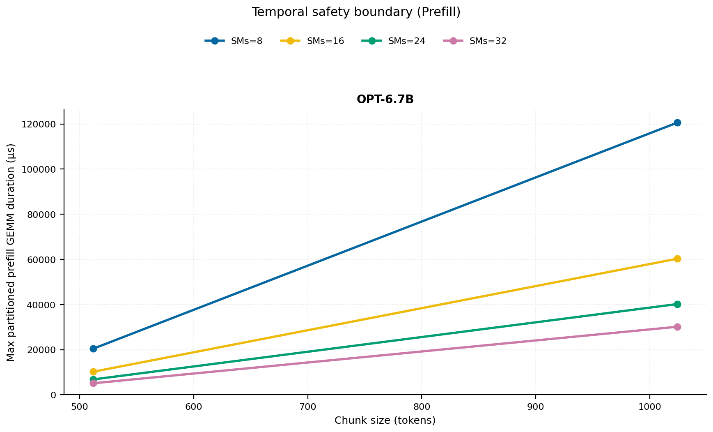
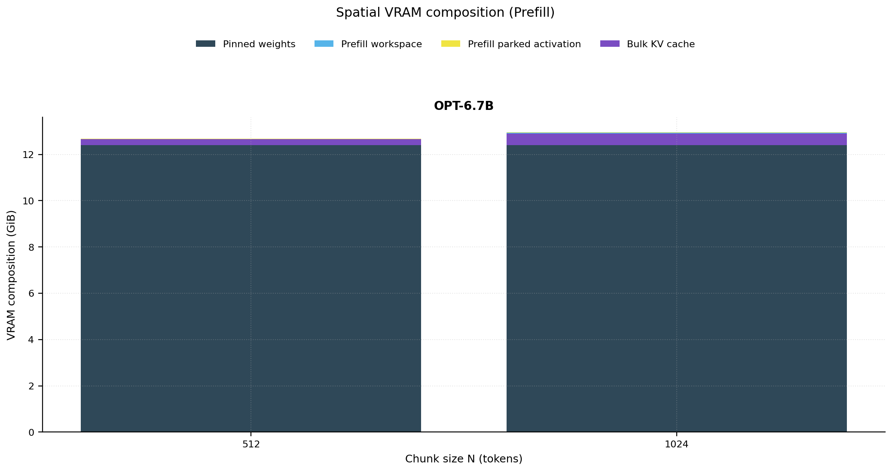
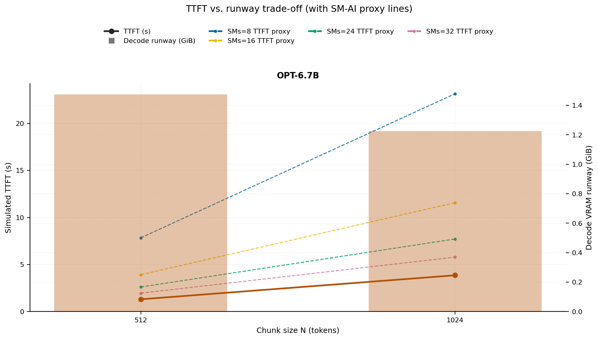
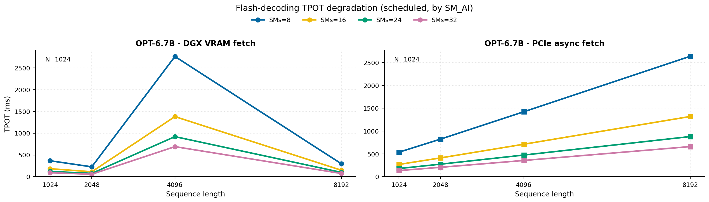
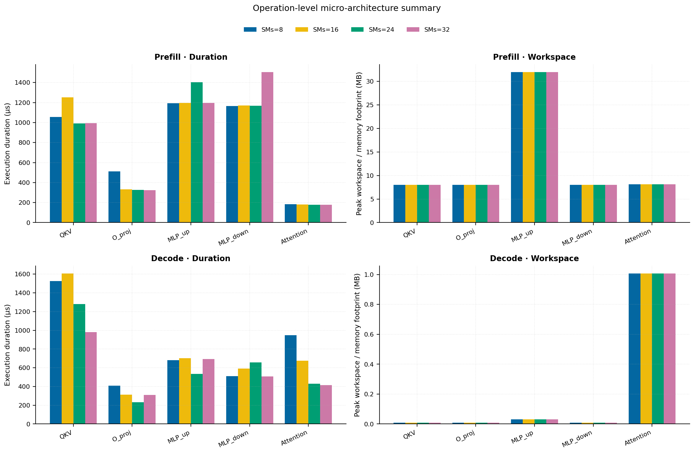
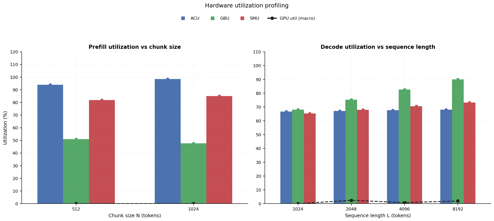

# RAN Inference Profiling Report

Run root: `/mnt/data/dheeraj/dicertation/inference-profile/runs/revised-rerun-20260415-145452-g7-opt67b-c512-1024`

## Environment

| field | value |
| --- | --- |
| cache_root | n/a |
| captured_at | 2026-04-15T13:55:00Z |
| chunk_sizes | [512, 1024] |
| cuda_available | true |
| cuda_device_count | 8 |
| cwd | /mnt/data/dheeraj/dicertation/inference-profile |
| decode_modes | ["vram", "pcie_async"] |
| experiment_type | ran-dgxspark-v1 |
| gpu_id | 7 |
| l_out | 1024 |
| models | ["facebook/opt-6.7b"] |
| platform | Linux-6.8.0-106-generic-x86_64-with-glibc2.35 |
| python_executable | /home/dheeraj/miniconda3/envs/mls/bin/python |
| python_version | 3.11.14 |
| run_root | /mnt/data/dheeraj/dicertation/inference-profile/runs/revised-rerun-20260415-145452-g7-opt67b-c512-1024 |
| scheduler | envelope_v1 |
| schema_version | ran_dgxspark_v1 |
| sequence_lengths | [1024, 2048, 4096, 8192] |
| sm_ai_cap | 32 |
| sm_ai_partition | 100 |
| sm_ai_partitions | [8, 16, 24, 32] |
| stage | profile |
| telemetry_tier | baseline_nvml_pt |
| timed_iterations | 5 |
| torch_available | true |
| torch_version | 2.10.0+cu128 |
| warmup_iterations | 3 |

## Model Constants

| model_id | sm_ai_partition | num_hidden_layers | hidden_size | num_attention_heads | ffn_dim | layer_index | layer_weight_bytes | total_weight_bytes_fp16 | vram_ceiling_bytes |
| --- | --- | --- | --- | --- | --- | --- | --- | --- | --- |
| facebook/opt-6.7b | 100 | 32 | 4096 | 32 | 16384 | 15 | 402759680 | 13316947968 | 15170115993 |

## Trace Inspection

### Primary trace

| field | value |
| --- | --- |
| errors | [] |
| header | ["frame", "slot", "time_slot_sched_ns", "time_decode_start_est_ns", "time_decode_end_est_ns", "time_decode_start_actual_ns", "time_decode_end_actual_ns", "decode_dur_us", "deadline_met", "target_sm", "profile_idx", "sm_count", "num_pusch", "sum_prb", "sum_tbs_bytes", "max_mcs"] |
| median_positive_delta_ms | 5.6997 |
| monotonicity.checked_column | time_slot_sched_ns |
| monotonicity.is_non_decreasing | true |
| monotonicity.negative_delta_count | 0 |
| monotonicity.positive_delta_count | 28377 |
| monotonicity.zero_delta_count | 0 |
| normalization.last_row_duration_policy | median_positive_forward_delta_ms |
| normalization.output_columns | ["time_ms", "sm_utilization", "slot_duration_ms", "source_schema", "sm_count"] |
| normalization.output_relative_path | derived/normalized_ldpc_trace.csv |
| normalized_row_count | 28378 |
| path | /mnt/raid0sata2/netsys/weaver-ext/ran/traces/e2e_2026030418/e2e_20260304_182034_tractor_ran_ctrl/ldpc_trace.csv |
| row_count | 28378 |
| schema_detected | schema_b |
| time_unit_hint | ns |
| usable | true |
| usage_policy | primary_only |
| used_for_scheduler_capacity | true |

### Secondary trace

| field | value |
| --- | --- |
| errors | ["ran_ctrl_trace.csv line 182958 has 9 field(s); expected 12"] |
| header | ["frame", "slot", "sm_available", "prbs_available", "prbs_allocated", "w_avg_mcs_prev", "w_avg_mcs_curr", "slots_since_underutil", "ramp_up_count", "num_ue_sched", "max_ue_backlog", "sum_ue_backlog"] |
| monotonicity.checked_column | n/a |
| monotonicity.is_non_decreasing | n/a |
| monotonicity.negative_delta_count | n/a |
| path | /mnt/raid0sata2/netsys/weaver-ext/ran/traces/e2e_2026030418/e2e_20260304_182034_tractor_ran_ctrl/ran_ctrl_trace.csv |
| row_count | 182956 |
| time_unit_hints | [] |
| usable | false |
| usage_policy | structural_only |
| used_for_scheduler_capacity | false |

## Raw-Profile Summary Tables

### Prefill profile summary

Source raw rows: `raw/prefill_events.csv` = 280. Summary artifact: `derived/prefill_summary.csv`.

| model_id | chunk_tokens | sm_ai_partition | max_input_tokens | prefill_max_gemm_us | prefill_workspace_bytes | prefill_parked_activation_bytes | telemetry_tier | telemetry_provider | telemetry_status | nvml_available | gpu_util | gpu_mem_used_mb | sm_clock_mhz | mem_clock_mhz | power_w | pt_step_ms | pt_mem_alloc_mb | pt_mem_reserved_mb | pt_workspace_mb | acu_pct | gbu_pct | smu_pct | microscopic_telemetry_status | microscopic_error |
| --- | --- | --- | --- | --- | --- | --- | --- | --- | --- | --- | --- | --- | --- | --- | --- | --- | --- | --- | --- | --- | --- | --- | --- | --- |
| facebook/opt-6.7b | 512 | 8 | 1024 | 2083.6799 | 16777216 | 16777216 | baseline_nvml_pt | nvidia-smi | ok | true | 0 | 109 | 1695 | 8001 | 64.8 | 2.0837 | 441.1953 | 441.1953 | 16 | 82.95 | 58.75 | 70.2 | estimated | n/a |
| facebook/opt-6.7b | 512 | 16 | 1024 | 2792.64 | 16777216 | 16777216 | baseline_nvml_pt | nvidia-smi | ok | true | 0 | 109 | 1695 | 7601 | 68.89 | 2.7926 | 441.1953 | 441.1953 | 16 | 90.3 | 53.58 | 78 | estimated | n/a |
| facebook/opt-6.7b | 512 | 24 | 1024 | 838.656 | 16777216 | 16777216 | baseline_nvml_pt | nvidia-smi | ok | true | 0 | 109 | 1695 | 7601 | 65.8 | 0.8387 | 441.1953 | 441.1953 | 16 | 97.65 | 48.41 | 85.8 | estimated | n/a |
| facebook/opt-6.7b | 512 | 32 | 1024 | 850.848 | 16777216 | 16777216 | baseline_nvml_pt | nvidia-smi | ok | true | 0 | 109 | 1695 | 8001 | 65.06 | 0.8508 | 441.1953 | 441.1953 | 16 | 100 | 43.24 | 93.6 | estimated | n/a |
| facebook/opt-6.7b | 1024 | 8 | 1024 | 1626.112 | 33554432 | 33554432 | baseline_nvml_pt | nvidia-smi | ok | true | 0 | 109 | 1695 | 7601 | 65.4 | 1.6261 | 489.1953 | 489.1953 | 32 | 86.9 | 55 | 72.9 | estimated | n/a |
| facebook/opt-6.7b | 1024 | 16 | 1024 | 1635.3281 | 33554432 | 33554432 | baseline_nvml_pt | nvidia-smi | ok | true | 0 | 109 | 1695 | 7601 | 70.56 | 1.6353 | 489.1953 | 489.1953 | 32 | 94.6 | 50.16 | 81 | estimated | n/a |
| facebook/opt-6.7b | 1024 | 24 | 1024 | 3659.776 | 33554432 | 33554432 | baseline_nvml_pt | nvidia-smi | ok | true | 0 | 109 | 1695 | 7601 | 73.95 | 3.6598 | 489.1953 | 489.1953 | 32 | 100 | 45.32 | 89.1 | estimated | n/a |
| facebook/opt-6.7b | 1024 | 32 | 1024 | 5024.7679 | 33554432 | 33554432 | baseline_nvml_pt | nvidia-smi | ok | true | 0 | 109 | 1695 | 7601 | 65.56 | 5.0248 | 489.1953 | 489.1953 | 32 | 100 | 40.48 | 97.2 | estimated | n/a |

### Decode profile summary

Source raw rows: `raw/decode_events.csv` = 2560. Summary artifact: `derived/decode_summary.csv`.

| model_id | sequence_length | block_size | sm_ai_partition | decode_mode | decode_max_gemv_us | attention_fetch_compute_us | reduction_overhead_us | decode_workspace_bytes | decode_parked_activation_bytes | telemetry_tier | telemetry_provider | telemetry_status | nvml_available | gpu_util | gpu_mem_used_mb | sm_clock_mhz | mem_clock_mhz | power_w | pt_step_ms | pt_mem_alloc_mb | pt_mem_reserved_mb | pt_workspace_mb | acu_pct | gbu_pct | smu_pct | microscopic_telemetry_status | microscopic_error |
| --- | --- | --- | --- | --- | --- | --- | --- | --- | --- | --- | --- | --- | --- | --- | --- | --- | --- | --- | --- | --- | --- | --- | --- | --- | --- | --- | --- |
| facebook/opt-6.7b | 1024 | 512 | 8 | pcie_async | 293.888 | 876.0832 | 694.3232 | 139264 | 8192 | baseline_nvml_pt | nvidia-smi | ok | true | 0 | 109 | 1695 | 7601 | 65.97 | 3.797 | 408.375 | 408.375 | 0.1328 | 58.195 | 74.385 | 56.64 | estimated | n/a |
| facebook/opt-6.7b | 1024 | 512 | 8 | vram | 324.608 | 159.9232 | 24.3648 | 139264 | 8192 | baseline_nvml_pt | nvidia-smi | ok | true | 0 | 109 | 1695 | 7601 | 65.68 | 0.3246 | 408.375 | 408.375 | 0.1328 | 60.795 | 69.3625 | 58.28 | estimated | n/a |
| facebook/opt-6.7b | 1024 | 512 | 16 | pcie_async | 927.648 | 164.16 | 27.4304 | 139264 | 8192 | baseline_nvml_pt | nvidia-smi | ok | true | 0 | 109 | 1695 | 7601 | 65.97 | 0.9276 | 408.375 | 408.375 | 0.1328 | 62.83 | 71.82 | 61.44 | estimated | n/a |
| facebook/opt-6.7b | 1024 | 512 | 16 | vram | 3545.0881 | 138.3744 | 22.0992 | 139264 | 8192 | baseline_nvml_pt | nvidia-smi | ok | true | 0 | 109 | 1695 | 7601 | 66.64 | 3.5451 | 408.375 | 408.375 | 0.1328 | 65.62 | 67.125 | 63.92 | estimated | n/a |
| facebook/opt-6.7b | 1024 | 512 | 24 | pcie_async | 271.168 | 132.6656 | 21.8368 | 139264 | 8192 | baseline_nvml_pt | nvidia-smi | ok | true | 0 | 109 | 1695 | 7601 | 66.57 | 0.2712 | 408.375 | 408.375 | 0.1328 | 67.465 | 69.255 | 66.24 | estimated | n/a |
| facebook/opt-6.7b | 1024 | 512 | 24 | vram | 10290.3681 | 175.1168 | 25.6064 | 139264 | 8192 | baseline_nvml_pt | nvidia-smi | ok | true | 0 | 109 | 1695 | 8001 | 66.06 | 10.2904 | 408.375 | 408.375 | 0.1328 | 70.445 | 64.8875 | 69.56 | estimated | n/a |
| facebook/opt-6.7b | 1024 | 512 | 32 | pcie_async | 276.224 | 129.6704 | 21.1584 | 139264 | 8192 | baseline_nvml_pt | nvidia-smi | ok | true | 0 | 109 | 1695 | 7601 | 65.48 | 0.2762 | 408.375 | 408.375 | 0.1328 | 72.1 | 66.69 | 71.04 | estimated | n/a |
| facebook/opt-6.7b | 1024 | 512 | 32 | vram | 298.752 | 132.2176 | 22.144 | 139264 | 8192 | baseline_nvml_pt | nvidia-smi | ok | true | 0 | 109 | 1695 | 7601 | 65.62 | 0.2988 | 408.375 | 408.375 | 0.1328 | 75.27 | 62.65 | 75.2 | estimated | n/a |
| facebook/opt-6.7b | 1024 | 1024 | 8 | pcie_async | 6289.1521 | 132.0896 | 22.0736 | 139264 | 8192 | baseline_nvml_pt | nvidia-smi | ok | true | 0 | 109 | 1695 | 7601 | 66.69 | 6.2892 | 408.375 | 408.375 | 0.1328 | 58.195 | 73.95 | 56.64 | estimated | n/a |
| facebook/opt-6.7b | 1024 | 1024 | 8 | vram | 303.104 | 1965.6128 | 26.4128 | 139264 | 8192 | baseline_nvml_pt | nvidia-smi | ok | true | 0 | 109 | 1695 | 7601 | 66.48 | 9.2639 | 408.375 | 408.375 | 0.1328 | 61.11 | 68.975 | 58.28 | estimated | n/a |
| facebook/opt-6.7b | 1024 | 1024 | 16 | pcie_async | 286.72 | 140.2112 | 22.0736 | 139264 | 8192 | baseline_nvml_pt | nvidia-smi | ok | true | 0 | 109 | 1695 | 7601 | 65.81 | 0.2867 | 408.375 | 408.375 | 0.1328 | 62.83 | 71.4 | 61.44 | estimated | n/a |
| facebook/opt-6.7b | 1024 | 1024 | 16 | vram | 3222.2719 | 131.6288 | 21.6896 | 139264 | 8192 | baseline_nvml_pt | nvidia-smi | ok | true | 0 | 109 | 1695 | 8001 | 66.25 | 3.2223 | 408.375 | 408.375 | 0.1328 | 65.96 | 66.75 | 63.92 | estimated | n/a |
| facebook/opt-6.7b | 1024 | 1024 | 24 | pcie_async | 3854.336 | 129.632 | 21.1584 | 139264 | 8192 | baseline_nvml_pt | nvidia-smi | ok | true | 0 | 109 | 1695 | 8001 | 66.39 | 3.8543 | 408.375 | 408.375 | 0.1328 | 67.465 | 68.85 | 66.24 | estimated | n/a |
| facebook/opt-6.7b | 1024 | 1024 | 24 | vram | 271.36 | 135.328 | 22.9056 | 139264 | 8192 | baseline_nvml_pt | nvidia-smi | ok | true | 0 | 109 | 1695 | 7601 | 65.88 | 0.2714 | 408.375 | 408.375 | 0.1328 | 70.81 | 64.525 | 69.56 | estimated | n/a |
| facebook/opt-6.7b | 1024 | 1024 | 32 | pcie_async | 286.624 | 130.4128 | 21.4848 | 139264 | 8192 | baseline_nvml_pt | nvidia-smi | ok | true | 0 | 109 | 1695 | 8001 | 66.42 | 0.2866 | 408.375 | 408.375 | 0.1328 | 72.1 | 66.3 | 71.04 | estimated | n/a |
| facebook/opt-6.7b | 1024 | 1024 | 32 | vram | 443.392 | 172.7424 | 25.408 | 139264 | 8192 | baseline_nvml_pt | nvidia-smi | ok | true | 0 | 109 | 1695 | 7601 | 65.82 | 0.4434 | 408.375 | 408.375 | 0.1328 | 75.66 | 62.3 | 75.2 | estimated | n/a |
| facebook/opt-6.7b | 2048 | 512 | 8 | pcie_async | 3226.624 | 132.704 | 21.5104 | 270336 | 8192 | baseline_nvml_pt | nvidia-smi | ok | true | 0 | 109 | 1695 | 7601 | 66.95 | 3.2266 | 424.5 | 424.5 | 0.2578 | 57.065 | 83.375 | 58.41 | estimated | n/a |
| facebook/opt-6.7b | 2048 | 512 | 8 | vram | 3905.5359 | 135.5392 | 22.3104 | 270336 | 8192 | baseline_nvml_pt | nvidia-smi | ok | true | 0 | 109 | 1695 | 7601 | 66.09 | 3.9055 | 424.5 | 424.5 | 0.2578 | 62.685 | 75.0458 | 60.9667 | estimated | n/a |
| facebook/opt-6.7b | 2048 | 512 | 16 | pcie_async | 3096.4799 | 150.2464 | 23.8976 | 270336 | 8192 | baseline_nvml_pt | nvidia-smi | ok | true | 0 | 109 | 1695 | 8001 | 66.36 | 3.0965 | 424.5 | 424.5 | 0.2578 | 61.61 | 80.5 | 63.36 | estimated | n/a |
| facebook/opt-6.7b | 2048 | 512 | 16 | vram | 298.176 | 175.6672 | 25.7728 | 270336 | 8192 | baseline_nvml_pt | nvidia-smi | ok | true | 7 | 109 | 1695 | 8001 | 66.29 | 0.2982 | 424.5 | 424.5 | 0.2578 | 67.66 | 72.625 | 66.8667 | estimated | n/a |
| facebook/opt-6.7b | 2048 | 512 | 24 | pcie_async | 272.384 | 129.824 | 20.6144 | 270336 | 8192 | baseline_nvml_pt | nvidia-smi | ok | true | 0 | 109 | 1695 | 7601 | 66.67 | 0.2724 | 424.5 | 424.5 | 0.2578 | 66.155 | 77.625 | 68.31 | estimated | n/a |
| facebook/opt-6.7b | 2048 | 512 | 24 | vram | 293.888 | 171.9488 | 22.0864 | 270336 | 8192 | baseline_nvml_pt | nvidia-smi | ok | true | 0 | 109 | 1695 | 7601 | 66.9 | 0.2939 | 424.5 | 424.5 | 0.2578 | 72.635 | 70.2042 | 72.7667 | estimated | n/a |
| facebook/opt-6.7b | 2048 | 512 | 32 | pcie_async | 273.376 | 141.0432 | 20.672 | 270336 | 8192 | baseline_nvml_pt | nvidia-smi | ok | true | 0 | 109 | 1695 | 7601 | 66.13 | 0.2734 | 424.5 | 424.5 | 0.2578 | 70.7 | 74.75 | 73.26 | estimated | n/a |
| facebook/opt-6.7b | 2048 | 512 | 32 | vram | 293.888 | 224.0128 | 28.4992 | 270336 | 8192 | baseline_nvml_pt | nvidia-smi | ok | true | 0 | 109 | 1695 | 7601 | 66.54 | 0.3655 | 424.5 | 424.5 | 0.2578 | 77.61 | 67.7833 | 78.6667 | estimated | n/a |
| facebook/opt-6.7b | 2048 | 1024 | 8 | pcie_async | 426.88 | 136.7552 | 22.4768 | 270336 | 8192 | baseline_nvml_pt | nvidia-smi | ok | true | 7 | 109 | 1695 | 7601 | 66.29 | 0.4269 | 424.5 | 424.5 | 0.2578 | 57.065 | 83.81 | 58.6067 | estimated | n/a |
| facebook/opt-6.7b | 2048 | 1024 | 8 | vram | 1484.576 | 138.4448 | 25.2096 | 270336 | 8192 | baseline_nvml_pt | nvidia-smi | ok | true | 7 | 109 | 1695 | 8001 | 66.04 | 1.4846 | 424.5 | 424.5 | 0.2578 | 63.21 | 75.175 | 61.1733 | estimated | n/a |
| facebook/opt-6.7b | 2048 | 1024 | 16 | pcie_async | 3765.2481 | 139.8784 | 22.848 | 270336 | 8192 | baseline_nvml_pt | nvidia-smi | ok | true | 0 | 109 | 1695 | 7601 | 67.08 | 3.7652 | 424.5 | 424.5 | 0.2578 | 61.61 | 80.92 | 63.5733 | estimated | n/a |
| facebook/opt-6.7b | 2048 | 1024 | 16 | vram | 3390.2719 | 197.6 | 24.2048 | 270336 | 8192 | baseline_nvml_pt | nvidia-smi | ok | true | 0 | 109 | 1695 | 7601 | 67.31 | 3.3903 | 424.5 | 424.5 | 0.2578 | 68.2267 | 72.75 | 67.0933 | estimated | n/a |
| facebook/opt-6.7b | 2048 | 1024 | 24 | pcie_async | 539.552 | 320.2816 | 44.6528 | 270336 | 8192 | baseline_nvml_pt | nvidia-smi | ok | true | 7 | 109 | 1695 | 8001 | 67.11 | 0.639 | 424.5 | 424.5 | 0.2578 | 66.155 | 78.03 | 68.54 | estimated | n/a |
| facebook/opt-6.7b | 2048 | 1024 | 24 | vram | 3834.08 | 142.9504 | 22.6624 | 270336 | 8192 | baseline_nvml_pt | nvidia-smi | ok | true | 0 | 109 | 1695 | 7601 | 67.32 | 3.8341 | 424.5 | 424.5 | 0.2578 | 73.2433 | 70.325 | 73.0133 | estimated | n/a |
| facebook/opt-6.7b | 2048 | 1024 | 32 | pcie_async | 270.336 | 134.5152 | 20.864 | 270336 | 8192 | baseline_nvml_pt | nvidia-smi | ok | true | 11 | 109 | 1695 | 7601 | 66.93 | 0.2703 | 424.5 | 424.5 | 0.2578 | 70.7 | 75.14 | 73.5067 | estimated | n/a |
| facebook/opt-6.7b | 2048 | 1024 | 32 | vram | 269.312 | 131.6608 | 22.2528 | 270336 | 8192 | baseline_nvml_pt | nvidia-smi | ok | true | 0 | 109 | 1695 | 7601 | 67.07 | 0.2693 | 424.5 | 424.5 | 0.2578 | 78.26 | 67.9 | 78.9333 | estimated | n/a |
| facebook/opt-6.7b | 4096 | 512 | 8 | pcie_async | 273.408 | 1295.232 | 56.1536 | 532480 | 8192 | baseline_nvml_pt | nvidia-smi | ok | true | 0 | 109 | 1695 | 7601 | 66.55 | 5.8017 | 456.75 | 456.75 | 0.5078 | 55.935 | 92.365 | 60.18 | estimated | n/a |
| facebook/opt-6.7b | 4096 | 512 | 8 | vram | 279.584 | 187.1552 | 23.008 | 532480 | 8192 | baseline_nvml_pt | nvidia-smi | ok | true | 0 | 109 | 1695 | 7601 | 67.02 | 0.2796 | 456.75 | 456.75 | 0.5078 | 64.575 | 80.7292 | 63.6533 | estimated | n/a |
| facebook/opt-6.7b | 4096 | 512 | 16 | pcie_async | 3814.3041 | 162.9952 | 20.4864 | 532480 | 8192 | baseline_nvml_pt | nvidia-smi | ok | true | 0 | 109 | 1695 | 7601 | 66.12 | 3.8143 | 456.75 | 456.75 | 0.5078 | 60.39 | 89.18 | 65.28 | estimated | n/a |
| facebook/opt-6.7b | 4096 | 512 | 16 | vram | 290.816 | 218.8928 | 24.3712 | 532480 | 8192 | baseline_nvml_pt | nvidia-smi | ok | true | 0 | 109 | 1695 | 7601 | 66.57 | 0.2948 | 456.75 | 456.75 | 0.5078 | 69.7 | 78.125 | 69.8133 | estimated | n/a |
| facebook/opt-6.7b | 4096 | 512 | 24 | pcie_async | 272.512 | 171.9808 | 20.5824 | 532480 | 8192 | baseline_nvml_pt | nvidia-smi | ok | true | 0 | 109 | 1695 | 7601 | 66.86 | 0.2725 | 456.75 | 456.75 | 0.5078 | 64.845 | 85.995 | 70.38 | estimated | n/a |
| facebook/opt-6.7b | 4096 | 512 | 24 | vram | 3368.9599 | 162.1568 | 20.7616 | 532480 | 8192 | baseline_nvml_pt | nvidia-smi | ok | true | 0 | 109 | 1695 | 8001 | 67.27 | 3.369 | 456.75 | 456.75 | 0.5078 | 74.825 | 75.5208 | 75.9733 | estimated | n/a |
| facebook/opt-6.7b | 4096 | 512 | 32 | pcie_async | 3400.8 | 164.3712 | 21.2928 | 532480 | 8192 | baseline_nvml_pt | nvidia-smi | ok | true | 13 | 109 | 1695 | 7601 | 66.95 | 3.4008 | 456.75 | 456.75 | 0.5078 | 69.3 | 82.81 | 75.48 | estimated | n/a |
| facebook/opt-6.7b | 4096 | 512 | 32 | vram | 3292.16 | 176.9408 | 21.5744 | 532480 | 8192 | baseline_nvml_pt | nvidia-smi | ok | true | 0 | 109 | 1695 | 8001 | 66.51 | 3.2922 | 456.75 | 456.75 | 0.5078 | 79.95 | 72.9167 | 82.1333 | estimated | n/a |
| facebook/opt-6.7b | 4096 | 1024 | 8 | pcie_async | 276.256 | 170.5984 | 21.6832 | 532480 | 8192 | baseline_nvml_pt | nvidia-smi | ok | true | 0 | 109 | 1695 | 7601 | 65.65 | 0.2763 | 456.75 | 456.75 | 0.5078 | 55.935 | 93.67 | 60.5733 | estimated | n/a |
| facebook/opt-6.7b | 4096 | 1024 | 8 | vram | 269.088 | 161.7408 | 21.0432 | 532480 | 8192 | baseline_nvml_pt | nvidia-smi | ok | true | 0 | 109 | 1695 | 7601 | 66.08 | 0.2691 | 456.75 | 456.75 | 0.5078 | 65.31 | 81.375 | 64.0667 | estimated | n/a |
| facebook/opt-6.7b | 4096 | 1024 | 16 | pcie_async | 278.528 | 166.016 | 21.2992 | 532480 | 8192 | baseline_nvml_pt | nvidia-smi | ok | true | 0 | 109 | 1695 | 7601 | 67.23 | 0.2785 | 456.75 | 456.75 | 0.5078 | 60.39 | 90.44 | 65.7067 | estimated | n/a |
| facebook/opt-6.7b | 4096 | 1024 | 16 | vram | 271.36 | 163.7312 | 21.4848 | 532480 | 8192 | baseline_nvml_pt | nvidia-smi | ok | true | 0 | 109 | 1695 | 7601 | 66.89 | 0.2714 | 456.75 | 456.75 | 0.5078 | 70.4933 | 78.75 | 70.2667 | estimated | n/a |
| facebook/opt-6.7b | 4096 | 1024 | 24 | pcie_async | 3391.4881 | 175.3088 | 22.0288 | 532480 | 8192 | baseline_nvml_pt | nvidia-smi | ok | true | 0 | 109 | 1695 | 7601 | 66.19 | 3.3915 | 456.75 | 456.75 | 0.5078 | 64.845 | 87.21 | 70.84 | estimated | n/a |
| facebook/opt-6.7b | 4096 | 1024 | 24 | vram | 316.416 | 165.2096 | 20.544 | 532480 | 8192 | baseline_nvml_pt | nvidia-smi | ok | true | 0 | 109 | 1695 | 7601 | 67.2 | 0.3164 | 456.75 | 456.75 | 0.5078 | 75.6767 | 76.125 | 76.4667 | estimated | n/a |
| facebook/opt-6.7b | 4096 | 1024 | 32 | pcie_async | 268.096 | 161.76 | 21.5296 | 532480 | 8192 | baseline_nvml_pt | nvidia-smi | ok | true | 0 | 109 | 1695 | 7601 | 67 | 0.2681 | 456.75 | 456.75 | 0.5078 | 69.3 | 83.98 | 75.9733 | estimated | n/a |
| facebook/opt-6.7b | 4096 | 1024 | 32 | vram | 3557.2481 | 212.288 | 22.848 | 532480 | 8192 | baseline_nvml_pt | nvidia-smi | ok | true | 0 | 109 | 1695 | 7601 | 66.36 | 3.5572 | 456.75 | 456.75 | 0.5078 | 80.86 | 73.5 | 82.6667 | estimated | n/a |
| facebook/opt-6.7b | 8192 | 512 | 8 | pcie_async | 6320.0321 | 258.0928 | 21.0944 | 1056768 | 8192 | baseline_nvml_pt | nvidia-smi | ok | true | 0 | 109 | 1695 | 7601 | 67.22 | 6.32 | 521.25 | 521.25 | 1.0078 | 54.805 | 100 | 61.95 | estimated | n/a |
| facebook/opt-6.7b | 8192 | 512 | 8 | vram | 272.384 | 258.2016 | 20.9152 | 1056768 | 8192 | baseline_nvml_pt | nvidia-smi | ok | true | 0 | 109 | 1695 | 7601 | 67.04 | 0.2724 | 521.25 | 521.25 | 1.0078 | 66.465 | 86.4125 | 66.34 | estimated | n/a |
| facebook/opt-6.7b | 8192 | 512 | 16 | pcie_async | 3033.216 | 854.6304 | 22.208 | 1056768 | 8192 | baseline_nvml_pt | nvidia-smi | ok | true | 0 | 109 | 1695 | 7601 | 65.88 | 3.2276 | 521.25 | 521.25 | 1.0078 | 59.17 | 97.86 | 67.2 | estimated | n/a |
| facebook/opt-6.7b | 8192 | 512 | 16 | vram | 6134.7842 | 270.912 | 57.952 | 1056768 | 8192 | baseline_nvml_pt | nvidia-smi | ok | true | 0 | 109 | 1695 | 7601 | 67.36 | 6.1348 | 521.25 | 521.25 | 1.0078 | 71.74 | 83.625 | 72.76 | estimated | n/a |
| facebook/opt-6.7b | 8192 | 512 | 24 | pcie_async | 276.48 | 260.4992 | 20.6528 | 1056768 | 8192 | baseline_nvml_pt | nvidia-smi | ok | true | 0 | 109 | 1695 | 8001 | 66.36 | 0.2765 | 521.25 | 521.25 | 1.0078 | 63.535 | 94.365 | 72.45 | estimated | n/a |
| facebook/opt-6.7b | 8192 | 512 | 24 | vram | 287.488 | 271.3152 | 21.5552 | 1056768 | 8192 | baseline_nvml_pt | nvidia-smi | ok | true | 0 | 109 | 1695 | 7601 | 67.4 | 0.3031 | 521.25 | 521.25 | 1.0078 | 77.015 | 80.8375 | 79.18 | estimated | n/a |
| facebook/opt-6.7b | 8192 | 512 | 32 | pcie_async | 274.432 | 262.8992 | 21.0944 | 1056768 | 8192 | baseline_nvml_pt | nvidia-smi | ok | true | 0 | 109 | 1695 | 7601 | 67.07 | 0.2744 | 521.25 | 521.25 | 1.0078 | 67.9 | 90.87 | 77.7 | estimated | n/a |
| facebook/opt-6.7b | 8192 | 512 | 32 | vram | 275.296 | 259.4176 | 21.3824 | 1056768 | 8192 | baseline_nvml_pt | nvidia-smi | ok | true | 0 | 109 | 1695 | 7601 | 67.24 | 0.2753 | 521.25 | 521.25 | 1.0078 | 82.29 | 78.05 | 85.6 | estimated | n/a |
| facebook/opt-6.7b | 8192 | 1024 | 8 | pcie_async | 282.624 | 256.0064 | 21.3184 | 1056768 | 8192 | baseline_nvml_pt | nvidia-smi | ok | true | 0 | 109 | 1695 | 7601 | 67 | 0.2826 | 521.25 | 521.25 | 1.0078 | 54.805 | 100 | 62.54 | estimated | n/a |
| facebook/opt-6.7b | 8192 | 1024 | 8 | vram | 3765.2481 | 257.6832 | 21.1712 | 1056768 | 8192 | baseline_nvml_pt | nvidia-smi | ok | true | 0 | 109 | 1695 | 8001 | 66.97 | 3.7652 | 521.25 | 521.25 | 1.0078 | 67.41 | 87.575 | 66.96 | estimated | n/a |
| facebook/opt-6.7b | 8192 | 1024 | 16 | pcie_async | 309.248 | 266.0288 | 21.2736 | 1056768 | 8192 | baseline_nvml_pt | nvidia-smi | ok | true | 0 | 109 | 1695 | 7601 | 67 | 0.3092 | 521.25 | 521.25 | 1.0078 | 59.17 | 99.96 | 67.84 | estimated | n/a |
| facebook/opt-6.7b | 8192 | 1024 | 16 | vram | 287.84 | 1654.3616 | 23.0144 | 1056768 | 8192 | baseline_nvml_pt | nvidia-smi | ok | true | 23 | 109 | 1695 | 7601 | 66.76 | 3.8195 | 521.25 | 521.25 | 1.0078 | 72.76 | 84.75 | 73.44 | estimated | n/a |
| facebook/opt-6.7b | 8192 | 1024 | 24 | pcie_async | 273.408 | 262.0736 | 21.536 | 1056768 | 8192 | baseline_nvml_pt | nvidia-smi | ok | true | 0 | 109 | 1695 | 7601 | 65.53 | 0.2794 | 521.25 | 521.25 | 1.0078 | 63.535 | 96.39 | 73.14 | estimated | n/a |
| facebook/opt-6.7b | 8192 | 1024 | 24 | vram | 266.24 | 256.9856 | 20.5312 | 1056768 | 8192 | baseline_nvml_pt | nvidia-smi | ok | true | 0 | 109 | 1695 | 8001 | 67.42 | 0.2662 | 521.25 | 521.25 | 1.0078 | 78.11 | 81.925 | 79.92 | estimated | n/a |
| facebook/opt-6.7b | 8192 | 1024 | 32 | pcie_async | 278.496 | 263.3856 | 21.9008 | 1056768 | 8192 | baseline_nvml_pt | nvidia-smi | ok | true | 8 | 109 | 1695 | 8001 | 67.27 | 0.2785 | 521.25 | 521.25 | 1.0078 | 67.9 | 92.82 | 78.44 | estimated | n/a |
| facebook/opt-6.7b | 8192 | 1024 | 32 | vram | 340.992 | 263.4944 | 21.0752 | 1056768 | 8192 | baseline_nvml_pt | nvidia-smi | ok | true | 0 | 109 | 1695 | 7601 | 66.68 | 0.341 | 521.25 | 521.25 | 1.0078 | 83.46 | 79.1 | 86.4 | estimated | n/a |

### PCIe profile summary

Source raw rows: `raw/pcie_events.csv` = 10. Summary artifact: `derived/pcie_summary.csv`.

| model_id | block_size | kv_block_bytes | transfer_only_us | overlap_total_us | dummy_compute_us | exposed_transfer_us | effective_gbps | overlap_status | telemetry_tier | telemetry_provider | telemetry_status | nvml_available | gpu_util | gpu_mem_used_mb | sm_clock_mhz | mem_clock_mhz | power_w | pt_step_ms | pt_mem_alloc_mb | pt_mem_reserved_mb | pt_workspace_mb | acu_pct | gbu_pct | smu_pct | microscopic_telemetry_status | microscopic_error |
| --- | --- | --- | --- | --- | --- | --- | --- | --- | --- | --- | --- | --- | --- | --- | --- | --- | --- | --- | --- | --- | --- | --- | --- | --- | --- | --- |
| facebook/opt-6.7b | 512 | 8388608 | 7578.208 | 79294.2698 | 76801.6403 | 2492.6295 | 1.1069 | measured | baseline_nvml_pt | nvidia-smi | partial | true | 0 | 109 | 1695 | 7601 | 65.6 | n/a | n/a | n/a | n/a | 65 | 65 | 65 | estimated | n/a |
| facebook/opt-6.7b | 1024 | 16777216 | 16261.8944 | 66548.0487 | 64216.2701 | 2331.7786 | 1.0317 | measured | baseline_nvml_pt | nvidia-smi | partial | true | 0 | 109 | 1695 | 7601 | 65.82 | n/a | n/a | n/a | n/a | 65 | 65 | 65 | estimated | n/a |

## SLA Tables

### Successful configurations

| model_id | chunk_tokens | sequence_length | ttft_ms | tpot_ms_vram | tpot_ms_pcie_async | decode_runway_tokens | status |
| --- | --- | --- | --- | --- | --- | --- | --- |
| facebook/opt-6.7b | 512 | 1024 | 1306.9026 | 62.3 | 217.3898 | 3022 | success |
| facebook/opt-6.7b | 512 | 2048 | 1306.9026 | 64.5069 | 376.7197 | 3022 | success |
| facebook/opt-6.7b | 512 | 4096 | 1306.9026 | 638.4472 | 1297.008 | 3021 | success |
| facebook/opt-6.7b | 512 | 8192 | 1306.9026 | 61.8424 | 1338.005 | 3020 | success |
| facebook/opt-6.7b | 1024 | 1024 | 3859.0217 | 91.4721 | 134.5094 | 2510 | success |
| facebook/opt-6.7b | 1024 | 2048 | 3859.0217 | 56.6331 | 206.1105 | 2510 | success |
| facebook/opt-6.7b | 1024 | 4096 | 3859.0217 | 690.516 | 355.8074 | 2509 | success |
| facebook/opt-6.7b | 1024 | 8192 | 3859.0217 | 74.5767 | 659.5357 | 2508 | success |

### Failed configurations

No rows available.

## Per-Model Scaling Analysis

| model_id | successful_configs | failed_configs | chunk_tokens_tested | sequence_lengths_tested | largest_successful_chunk_tokens | ttft_ms_min | ttft_ms_max | tpot_ms_vram_min | tpot_ms_vram_max | tpot_ms_pcie_async_min | tpot_ms_pcie_async_max | max_decode_runway_tokens |
| --- | --- | --- | --- | --- | --- | --- | --- | --- | --- | --- | --- | --- |
| facebook/opt-6.7b | 8 | 0 | 512, 1024 | 1024, 2048, 4096, 8192 | 1024 | 1306.9026 | 3859.0217 | 56.6331 | 690.516 | 134.5094 | 1338.005 | 3022 |

## Plots

### Revised 01 Ran Trace Interleaving

[Interactive companion](plots/revised_01_ran_trace_interleaving_interactive.html)

### Revised 02 Prefill Safety Boundary

### Revised 03 Prefill Vram Composition

### Revised 04 Ttft Vs Runway

### Revised 05 Decode Tpot Degradation

### Revised 06 Operation Level Microarchitecture Summary

### Revised 07 Hardware Utilization Profiling

### Revised 08 Decode Memory Consumption

### 09 Spatial VRAM Composition (Prefill) · Pie View

