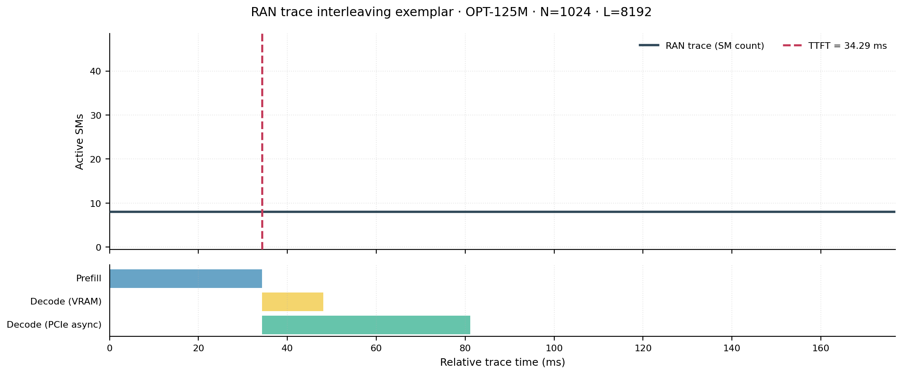
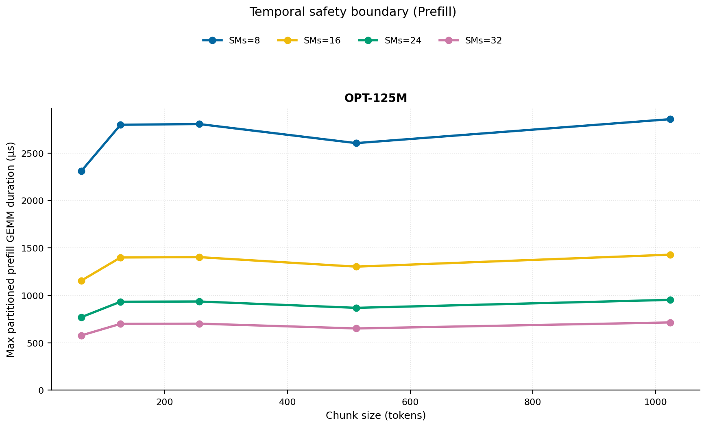
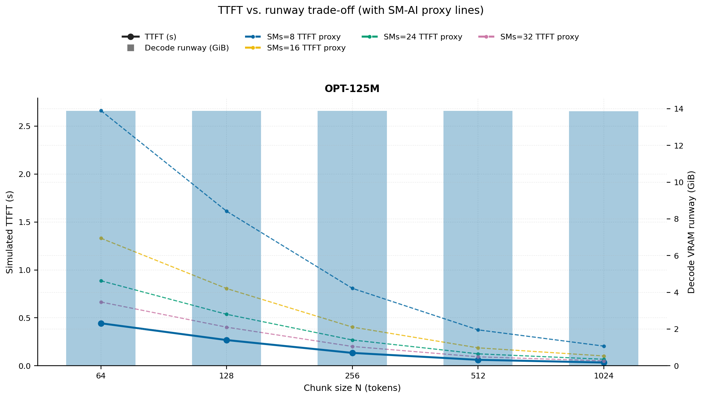
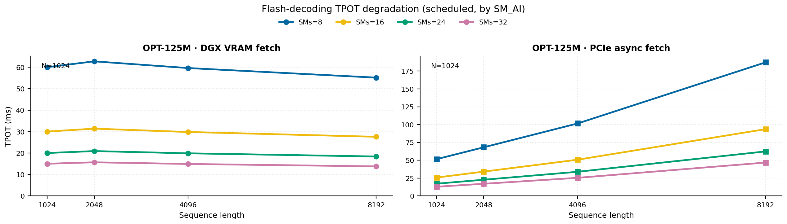
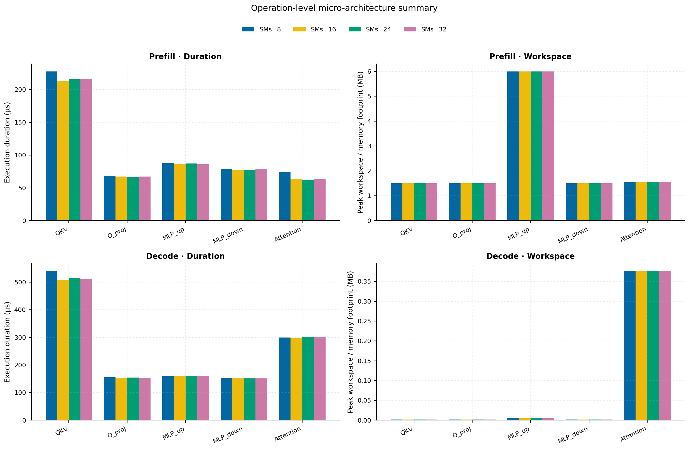
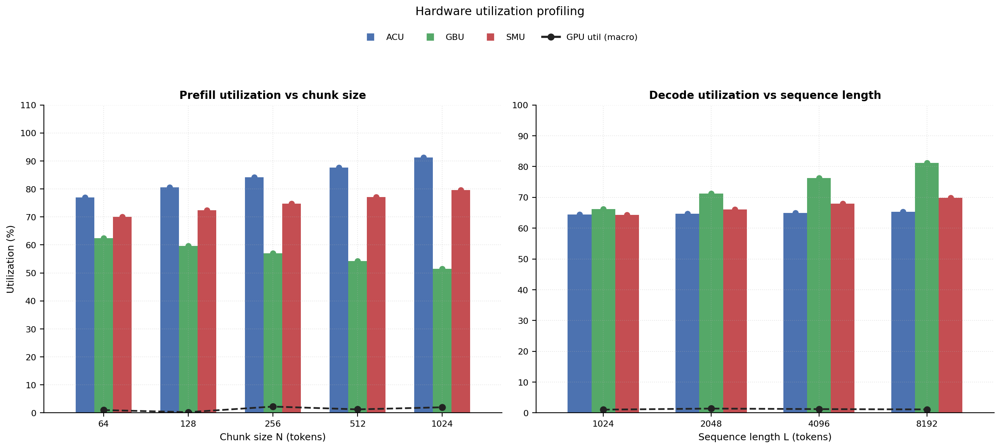
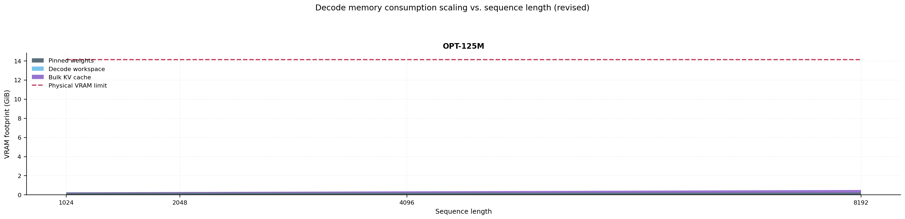

# RAN Inference Profiling Report

Run root: `/mnt/data/dheeraj/dicertation/inference-profile/runs/revised-rerun-20260415-171945-g0-opt125m`

## Environment

| field | value |
| --- | --- |
| cache_root | n/a |
| captured_at | 2026-04-15T16:19:53Z |
| chunk_sizes | [64, 128, 256, 512, 1024] |
| cuda_available | true |
| cuda_device_count | 8 |
| cwd | /mnt/data/dheeraj/dicertation/inference-profile |
| decode_modes | ["vram", "pcie_async"] |
| experiment_type | ran-dgxspark-v1 |
| gpu_id | 0 |
| l_out | 1024 |
| models | ["facebook/opt-125m"] |
| platform | Linux-6.8.0-106-generic-x86_64-with-glibc2.35 |
| python_executable | /home/dheeraj/miniconda3/envs/mls/bin/python |
| python_version | 3.11.14 |
| run_root | /mnt/data/dheeraj/dicertation/inference-profile/runs/revised-rerun-20260415-171945-g0-opt125m |
| scheduler | envelope_v1 |
| schema_version | ran_dgxspark_v1 |
| sequence_lengths | [1024, 2048, 4096, 8192] |
| sm_ai_cap | 32 |
| sm_ai_partition | 100 |
| sm_ai_partitions | [8, 16, 24, 32] |
| stage | profile |
| telemetry_tier | baseline_nvml_pt |
| timed_iterations | 5 |
| torch_available | true |
| torch_version | 2.10.0+cu128 |
| warmup_iterations | 3 |

## Model Constants

| model_id | sm_ai_partition | num_hidden_layers | hidden_size | num_attention_heads | ffn_dim | layer_index | layer_weight_bytes | total_weight_bytes_fp16 | vram_ceiling_bytes |
| --- | --- | --- | --- | --- | --- | --- | --- | --- | --- |
| facebook/opt-125m | 100 | 12 | 768 | 12 | 3072 | 5 | 14175744 | 250478592 | 15170115993 |

## Trace Inspection

### Primary trace

| field | value |
| --- | --- |
| errors | [] |
| header | ["frame", "slot", "time_slot_sched_ns", "time_decode_start_est_ns", "time_decode_end_est_ns", "time_decode_start_actual_ns", "time_decode_end_actual_ns", "decode_dur_us", "deadline_met", "target_sm", "profile_idx", "sm_count", "num_pusch", "sum_prb", "sum_tbs_bytes", "max_mcs"] |
| median_positive_delta_ms | 5.6997 |
| monotonicity.checked_column | time_slot_sched_ns |
| monotonicity.is_non_decreasing | true |
| monotonicity.negative_delta_count | 0 |
| monotonicity.positive_delta_count | 28377 |
| monotonicity.zero_delta_count | 0 |
| normalization.last_row_duration_policy | median_positive_forward_delta_ms |
| normalization.output_columns | ["time_ms", "sm_utilization", "slot_duration_ms", "source_schema", "sm_count"] |
| normalization.output_relative_path | derived/normalized_ldpc_trace.csv |
| normalized_row_count | 28378 |
| path | /mnt/raid0sata2/netsys/weaver-ext/ran/traces/e2e_2026030418/e2e_20260304_182034_tractor_ran_ctrl/ldpc_trace.csv |
| row_count | 28378 |
| schema_detected | schema_b |
| time_unit_hint | ns |
| usable | true |
| usage_policy | primary_only |
| used_for_scheduler_capacity | true |

### Secondary trace

| field | value |
| --- | --- |
| errors | ["ran_ctrl_trace.csv line 182958 has 9 field(s); expected 12"] |
| header | ["frame", "slot", "sm_available", "prbs_available", "prbs_allocated", "w_avg_mcs_prev", "w_avg_mcs_curr", "slots_since_underutil", "ramp_up_count", "num_ue_sched", "max_ue_backlog", "sum_ue_backlog"] |
| monotonicity.checked_column | n/a |
| monotonicity.is_non_decreasing | n/a |
| monotonicity.negative_delta_count | n/a |
| path | /mnt/raid0sata2/netsys/weaver-ext/ran/traces/e2e_2026030418/e2e_20260304_182034_tractor_ran_ctrl/ran_ctrl_trace.csv |
| row_count | 182956 |
| time_unit_hints | [] |
| usable | false |
| usage_policy | structural_only |
| used_for_scheduler_capacity | false |

## Raw-Profile Summary Tables

### Prefill profile summary

Source raw rows: `raw/prefill_events.csv` = 700. Summary artifact: `derived/prefill_summary.csv`.

| model_id | chunk_tokens | sm_ai_partition | max_input_tokens | prefill_max_gemm_us | prefill_workspace_bytes | prefill_parked_activation_bytes | telemetry_tier | telemetry_provider | telemetry_status | nvml_available | gpu_util | gpu_mem_used_mb | sm_clock_mhz | mem_clock_mhz | power_w | pt_step_ms | pt_mem_alloc_mb | pt_mem_reserved_mb | pt_workspace_mb | acu_pct | gbu_pct | smu_pct | microscopic_telemetry_status | microscopic_error |
| --- | --- | --- | --- | --- | --- | --- | --- | --- | --- | --- | --- | --- | --- | --- | --- | --- | --- | --- | --- | --- | --- | --- | --- | --- |
| facebook/opt-125m | 64 | 8 | 1024 | 137.408 | 393216 | 393216 | baseline_nvml_pt | nvidia-smi | ok | true | 0 | 35 | 1695 | 7601 | 61.62 | 0.1374 | 23.7632 | 23.7632 | 0.375 | 67.94 | 71.875 | 60.075 | estimated | n/a |
| facebook/opt-125m | 64 | 16 | 1024 | 97.28 | 393216 | 393216 | baseline_nvml_pt | nvidia-smi | ok | true | 3 | 35 | 1695 | 7601 | 47.82 | 0.0973 | 23.7632 | 23.7632 | 0.375 | 73.96 | 65.55 | 66.75 | estimated | n/a |
| facebook/opt-125m | 64 | 24 | 1024 | 122.88 | 393216 | 393216 | baseline_nvml_pt | nvidia-smi | ok | true | 1 | 35 | 1695 | 7601 | 53.9 | 0.1229 | 23.7632 | 23.7632 | 0.375 | 79.98 | 59.225 | 73.425 | estimated | n/a |
| facebook/opt-125m | 64 | 32 | 1024 | 96.256 | 393216 | 393216 | baseline_nvml_pt | nvidia-smi | ok | true | 0 | 35 | 1695 | 7601 | 58.85 | 0.0963 | 23.7632 | 23.7632 | 0.375 | 86 | 52.9 | 80.1 | estimated | n/a |
| facebook/opt-125m | 128 | 8 | 1024 | 91.168 | 786432 | 786432 | baseline_nvml_pt | nvidia-smi | ok | true | 1 | 35 | 1695 | 7601 | 62.75 | 0.0912 | 24.8882 | 24.8882 | 0.75 | 71.1 | 68.75 | 62.1 | estimated | n/a |
| facebook/opt-125m | 128 | 16 | 1024 | 130.048 | 786432 | 786432 | baseline_nvml_pt | nvidia-smi | ok | true | 0 | 35 | 1695 | 7601 | 62.99 | 0.13 | 24.8882 | 24.8882 | 0.75 | 77.4 | 62.7 | 69 | estimated | n/a |
| facebook/opt-125m | 128 | 24 | 1024 | 115.712 | 786432 | 786432 | baseline_nvml_pt | nvidia-smi | ok | true | 0 | 35 | 1695 | 7601 | 62.78 | 0.1157 | 24.8882 | 24.8882 | 0.75 | 83.7 | 56.65 | 75.9 | estimated | n/a |
| facebook/opt-125m | 128 | 32 | 1024 | 116.608 | 786432 | 786432 | baseline_nvml_pt | nvidia-smi | ok | true | 0 | 35 | 1695 | 8001 | 63.29 | 0.1166 | 24.8882 | 24.8882 | 0.75 | 90 | 50.6 | 82.8 | estimated | n/a |
| facebook/opt-125m | 256 | 8 | 1024 | 86.784 | 1572864 | 1572864 | baseline_nvml_pt | nvidia-smi | ok | true | 7 | 35 | 1695 | 8001 | 61.45 | 0.0868 | 27.1382 | 27.1382 | 1.5 | 74.26 | 65.625 | 64.125 | estimated | n/a |
| facebook/opt-125m | 256 | 16 | 1024 | 86.016 | 1572864 | 1572864 | baseline_nvml_pt | nvidia-smi | ok | true | 0 | 35 | 1695 | 7601 | 63.33 | 0.086 | 27.1382 | 27.1382 | 1.5 | 80.84 | 59.85 | 71.25 | estimated | n/a |
| facebook/opt-125m | 256 | 24 | 1024 | 89.088 | 1572864 | 1572864 | baseline_nvml_pt | nvidia-smi | ok | true | 2 | 35 | 1695 | 7601 | 54.25 | 0.0891 | 27.1382 | 27.1382 | 1.5 | 87.42 | 54.075 | 78.375 | estimated | n/a |
| facebook/opt-125m | 256 | 32 | 1024 | 116.928 | 1572864 | 1572864 | baseline_nvml_pt | nvidia-smi | ok | true | 0 | 35 | 1695 | 7601 | 64.1 | 0.1169 | 27.1382 | 27.1382 | 1.5 | 94 | 48.3 | 85.5 | estimated | n/a |
| facebook/opt-125m | 512 | 8 | 1024 | 109.568 | 3670016 | 3145728 | baseline_nvml_pt | nvidia-smi | ok | true | 2 | 35 | 1695 | 7601 | 53.47 | 0.1096 | 32.1382 | 32.1382 | 3.5 | 77.42 | 62.5 | 66.15 | estimated | n/a |
| facebook/opt-125m | 512 | 16 | 1024 | 106.784 | 3670016 | 3145728 | baseline_nvml_pt | nvidia-smi | ok | true | 0 | 35 | 1695 | 7601 | 56.01 | 0.1068 | 32.1382 | 32.1382 | 3.5 | 84.28 | 57 | 73.5 | estimated | n/a |
| facebook/opt-125m | 512 | 24 | 1024 | 107.52 | 3670016 | 3145728 | baseline_nvml_pt | nvidia-smi | ok | true | 1 | 35 | 1695 | 7601 | 64.67 | 0.1075 | 32.1382 | 32.1382 | 3.5 | 91.14 | 51.5 | 80.85 | estimated | n/a |
| facebook/opt-125m | 512 | 32 | 1024 | 108.544 | 3670016 | 3145728 | baseline_nvml_pt | nvidia-smi | ok | true | 2 | 35 | 1695 | 7601 | 62.69 | 0.1085 | 32.1382 | 32.1382 | 3.5 | 98 | 46 | 88.2 | estimated | n/a |
| facebook/opt-125m | 1024 | 8 | 1024 | 218.112 | 6291456 | 6291456 | baseline_nvml_pt | nvidia-smi | ok | true | 4 | 35 | 1695 | 7601 | 65.64 | 0.2519 | 41.1382 | 41.1382 | 6 | 80.58 | 59.375 | 68.175 | estimated | n/a |
| facebook/opt-125m | 1024 | 16 | 1024 | 122.72 | 6291456 | 6291456 | baseline_nvml_pt | nvidia-smi | ok | true | 4 | 35 | 1695 | 7601 | 65.22 | 0.1227 | 41.1382 | 41.1382 | 6 | 87.72 | 54.15 | 75.75 | estimated | n/a |
| facebook/opt-125m | 1024 | 24 | 1024 | 175.168 | 6291456 | 6291456 | baseline_nvml_pt | nvidia-smi | ok | true | 0 | 35 | 1695 | 7601 | 65.72 | 0.1752 | 41.1382 | 41.1382 | 6 | 94.86 | 48.925 | 83.325 | estimated | n/a |
| facebook/opt-125m | 1024 | 32 | 1024 | 119.072 | 6291456 | 6291456 | baseline_nvml_pt | nvidia-smi | ok | true | 0 | 35 | 1695 | 7601 | 66.03 | 0.1191 | 41.1382 | 41.1382 | 6 | 100 | 43.7 | 90.9 | estimated | n/a |

### Decode profile summary

Source raw rows: `raw/decode_events.csv` = 6400. Summary artifact: `derived/decode_summary.csv`.

| model_id | sequence_length | block_size | sm_ai_partition | decode_mode | decode_max_gemv_us | attention_fetch_compute_us | reduction_overhead_us | decode_workspace_bytes | decode_parked_activation_bytes | telemetry_tier | telemetry_provider | telemetry_status | nvml_available | gpu_util | gpu_mem_used_mb | sm_clock_mhz | mem_clock_mhz | power_w | pt_step_ms | pt_mem_alloc_mb | pt_mem_reserved_mb | pt_workspace_mb | acu_pct | gbu_pct | smu_pct | microscopic_telemetry_status | microscopic_error |
| --- | --- | --- | --- | --- | --- | --- | --- | --- | --- | --- | --- | --- | --- | --- | --- | --- | --- | --- | --- | --- | --- | --- | --- | --- | --- | --- | --- |
| facebook/opt-125m | 1024 | 64 | 8 | pcie_async | 190.464 | 126.7712 | 20.2624 | 50688 | 1536 | baseline_nvml_pt | nvidia-smi | ok | true | 0 | 35 | 1695 | 7601 | 59.65 | 0.1905 | 24.6953 | 24.6953 | 0.0483 | 56.5 | 71.34 | 56.05 | estimated | n/a |
| facebook/opt-125m | 1024 | 64 | 8 | vram | 161.792 | 162.848 | 22.4192 | 50688 | 1536 | baseline_nvml_pt | nvidia-smi | ok | true | 0 | 35 | 1695 | 7601 | 65.08 | 0.2509 | 24.6953 | 24.6953 | 0.0483 | 57.96 | 69.75 | 57.04 | estimated | n/a |
| facebook/opt-125m | 1024 | 64 | 16 | pcie_async | 107.36 | 122.3936 | 21.8496 | 50688 | 1536 | baseline_nvml_pt | nvidia-smi | ok | true | 0 | 35 | 1695 | 7601 | 65.8 | 0.1309 | 24.6953 | 24.6953 | 0.0483 | 61 | 68.88 | 60.8 | estimated | n/a |
| facebook/opt-125m | 1024 | 64 | 16 | vram | 158.72 | 152.4864 | 20.8704 | 50688 | 1536 | baseline_nvml_pt | nvidia-smi | ok | true | 0 | 35 | 1695 | 7601 | 65.47 | 0.2169 | 24.6953 | 24.6953 | 0.0483 | 62.56 | 67.5 | 62.56 | estimated | n/a |
| facebook/opt-125m | 1024 | 64 | 24 | pcie_async | 416.768 | 178.4256 | 21.152 | 50688 | 1536 | baseline_nvml_pt | nvidia-smi | ok | true | 0 | 35 | 1695 | 8001 | 66.39 | 0.4168 | 24.6953 | 24.6953 | 0.0483 | 65.5 | 66.42 | 65.55 | estimated | n/a |
| facebook/opt-125m | 1024 | 64 | 24 | vram | 148.48 | 128.9664 | 19.7056 | 50688 | 1536 | baseline_nvml_pt | nvidia-smi | ok | true | 1 | 35 | 1695 | 7601 | 66.23 | 0.1485 | 24.6953 | 24.6953 | 0.0483 | 67.16 | 65.25 | 68.08 | estimated | n/a |
| facebook/opt-125m | 1024 | 64 | 32 | pcie_async | 156.672 | 139.6736 | 22.1376 | 50688 | 1536 | baseline_nvml_pt | nvidia-smi | ok | true | 5 | 35 | 1695 | 7601 | 61.67 | 0.1628 | 24.6953 | 24.6953 | 0.0483 | 70 | 63.96 | 70.3 | estimated | n/a |
| facebook/opt-125m | 1024 | 64 | 32 | vram | 133.12 | 123.9488 | 20 | 50688 | 1536 | baseline_nvml_pt | nvidia-smi | ok | true | 0 | 35 | 1695 | 7601 | 66.13 | 0.1341 | 24.6953 | 24.6953 | 0.0483 | 71.76 | 63 | 73.6 | estimated | n/a |
| facebook/opt-125m | 1024 | 128 | 8 | pcie_async | 142.08 | 127.9936 | 20.5312 | 50688 | 1536 | baseline_nvml_pt | nvidia-smi | ok | true | 5 | 35 | 1695 | 7601 | 65.21 | 0.1463 | 24.6953 | 24.6953 | 0.0483 | 56.5 | 70.905 | 56.05 | estimated | n/a |
| facebook/opt-125m | 1024 | 128 | 8 | vram | 3080.256 | 123.2448 | 19.2512 | 50688 | 1536 | baseline_nvml_pt | nvidia-smi | ok | true | 0 | 35 | 1695 | 7601 | 65.83 | 3.0803 | 24.6953 | 24.6953 | 0.0483 | 58.275 | 69.3625 | 57.04 | estimated | n/a |
| facebook/opt-125m | 1024 | 128 | 16 | pcie_async | 154.848 | 128.8384 | 20.096 | 50688 | 1536 | baseline_nvml_pt | nvidia-smi | ok | true | 0 | 35 | 1695 | 8001 | 66.06 | 0.1548 | 24.6953 | 24.6953 | 0.0483 | 61 | 68.46 | 60.8 | estimated | n/a |
| facebook/opt-125m | 1024 | 128 | 16 | vram | 145.408 | 124.2752 | 19.2448 | 50688 | 1536 | baseline_nvml_pt | nvidia-smi | ok | true | 7 | 35 | 1695 | 8001 | 66 | 0.1454 | 24.6953 | 24.6953 | 0.0483 | 62.9 | 67.125 | 62.56 | estimated | n/a |
| facebook/opt-125m | 1024 | 128 | 24 | pcie_async | 122.88 | 122.3104 | 19.4688 | 50688 | 1536 | baseline_nvml_pt | nvidia-smi | ok | true | 1 | 35 | 1695 | 7601 | 66.31 | 0.1262 | 24.6953 | 24.6953 | 0.0483 | 65.5 | 66.015 | 65.55 | estimated | n/a |
| facebook/opt-125m | 1024 | 128 | 24 | vram | 160.768 | 132.9152 | 21.8176 | 50688 | 1536 | baseline_nvml_pt | nvidia-smi | ok | true | 0 | 35 | 1695 | 7601 | 65.65 | 0.1608 | 24.6953 | 24.6953 | 0.0483 | 67.525 | 64.8875 | 68.08 | estimated | n/a |
| facebook/opt-125m | 1024 | 128 | 32 | pcie_async | 151.552 | 127.1936 | 19.8656 | 50688 | 1536 | baseline_nvml_pt | nvidia-smi | ok | true | 0 | 35 | 1695 | 7601 | 65.19 | 0.1516 | 24.6953 | 24.6953 | 0.0483 | 70 | 63.57 | 70.3 | estimated | n/a |
| facebook/opt-125m | 1024 | 128 | 32 | vram | 188.416 | 155.3216 | 22.0416 | 50688 | 1536 | baseline_nvml_pt | nvidia-smi | ok | true | 0 | 35 | 1695 | 7601 | 65.95 | 0.1987 | 24.6953 | 24.6953 | 0.0483 | 72.15 | 62.65 | 73.6 | estimated | n/a |
| facebook/opt-125m | 1024 | 256 | 8 | pcie_async | 156.48 | 135.8336 | 19.4944 | 50688 | 1536 | baseline_nvml_pt | nvidia-smi | ok | true | 7 | 35 | 1695 | 8001 | 66.17 | 0.1565 | 24.6953 | 24.6953 | 0.0483 | 56.5 | 70.47 | 56.05 | estimated | n/a |
| facebook/opt-125m | 1024 | 256 | 8 | vram | 157.536 | 129.28 | 19.84 | 50688 | 1536 | baseline_nvml_pt | nvidia-smi | ok | true | 0 | 35 | 1695 | 7601 | 65.54 | 0.1575 | 24.6953 | 24.6953 | 0.0483 | 58.59 | 68.975 | 57.04 | estimated | n/a |
| facebook/opt-125m | 1024 | 256 | 16 | pcie_async | 154.624 | 123.5392 | 19.008 | 50688 | 1536 | baseline_nvml_pt | nvidia-smi | ok | true | 0 | 35 | 1695 | 7601 | 65.83 | 0.1546 | 24.6953 | 24.6953 | 0.0483 | 61 | 68.04 | 60.8 | estimated | n/a |
| facebook/opt-125m | 1024 | 256 | 16 | vram | 107.52 | 125.696 | 19.616 | 50688 | 1536 | baseline_nvml_pt | nvidia-smi | ok | true | 0 | 35 | 1695 | 8001 | 66.16 | 0.135 | 24.6953 | 24.6953 | 0.0483 | 63.24 | 66.75 | 62.56 | estimated | n/a |
| facebook/opt-125m | 1024 | 256 | 24 | pcie_async | 209.92 | 188.6784 | 24.9984 | 50688 | 1536 | baseline_nvml_pt | nvidia-smi | ok | true | 0 | 35 | 1695 | 7601 | 64.13 | 0.3553 | 24.6953 | 24.6953 | 0.0483 | 65.5 | 65.61 | 65.55 | estimated | n/a |
| facebook/opt-125m | 1024 | 256 | 24 | vram | 160.608 | 128.8128 | 19.904 | 50688 | 1536 | baseline_nvml_pt | nvidia-smi | ok | true | 4 | 35 | 1695 | 8001 | 66.24 | 0.1606 | 24.6953 | 24.6953 | 0.0483 | 67.89 | 64.525 | 68.08 | estimated | n/a |
| facebook/opt-125m | 1024 | 256 | 32 | pcie_async | 101.632 | 124.9792 | 20.0832 | 50688 | 1536 | baseline_nvml_pt | nvidia-smi | ok | true | 0 | 35 | 1695 | 7601 | 66.04 | 0.131 | 24.6953 | 24.6953 | 0.0483 | 70 | 63.18 | 70.3 | estimated | n/a |
| facebook/opt-125m | 1024 | 256 | 32 | vram | 288.768 | 125.5424 | 18.9696 | 50688 | 1536 | baseline_nvml_pt | nvidia-smi | ok | true | 1 | 35 | 1695 | 7601 | 62.83 | 0.2888 | 24.6953 | 24.6953 | 0.0483 | 72.54 | 62.3 | 73.6 | estimated | n/a |
| facebook/opt-125m | 1024 | 512 | 8 | pcie_async | 140.352 | 126.144 | 20.0512 | 50688 | 1536 | baseline_nvml_pt | nvidia-smi | ok | true | 0 | 35 | 1695 | 7601 | 66.23 | 0.1404 | 24.6953 | 24.6953 | 0.0483 | 56.5 | 70.035 | 56.05 | estimated | n/a |
| facebook/opt-125m | 1024 | 512 | 8 | vram | 115.712 | 131.0912 | 20.224 | 50688 | 1536 | baseline_nvml_pt | nvidia-smi | ok | true | 0 | 35 | 1695 | 7601 | 65.75 | 0.1495 | 24.6953 | 24.6953 | 0.0483 | 58.905 | 68.5875 | 57.04 | estimated | n/a |
| facebook/opt-125m | 1024 | 512 | 16 | pcie_async | 172.192 | 131.0464 | 19.9424 | 50688 | 1536 | baseline_nvml_pt | nvidia-smi | ok | true | 0 | 35 | 1695 | 7601 | 65.8 | 0.1722 | 24.6953 | 24.6953 | 0.0483 | 61 | 67.62 | 60.8 | estimated | n/a |
| facebook/opt-125m | 1024 | 512 | 16 | vram | 242.944 | 141.0688 | 20.2816 | 50688 | 1536 | baseline_nvml_pt | nvidia-smi | ok | true | 0 | 35 | 1695 | 7601 | 63.55 | 0.2429 | 24.6953 | 24.6953 | 0.0483 | 63.58 | 66.375 | 62.56 | estimated | n/a |
| facebook/opt-125m | 1024 | 512 | 24 | pcie_async | 106.752 | 125.7024 | 21.4848 | 50688 | 1536 | baseline_nvml_pt | nvidia-smi | ok | true | 0 | 35 | 1695 | 7601 | 59.07 | 0.1311 | 24.6953 | 24.6953 | 0.0483 | 65.5 | 65.205 | 65.55 | estimated | n/a |
| facebook/opt-125m | 1024 | 512 | 24 | vram | 130.016 | 126.3552 | 20.096 | 50688 | 1536 | baseline_nvml_pt | nvidia-smi | ok | true | 0 | 35 | 1695 | 7601 | 64.96 | 0.1341 | 24.6953 | 24.6953 | 0.0483 | 68.255 | 64.1625 | 68.08 | estimated | n/a |
| facebook/opt-125m | 1024 | 512 | 32 | pcie_async | 149.504 | 126.5792 | 19.2832 | 50688 | 1536 | baseline_nvml_pt | nvidia-smi | ok | true | 3 | 35 | 1695 | 7601 | 50.13 | 0.1495 | 24.6953 | 24.6953 | 0.0483 | 70 | 62.79 | 70.3 | estimated | n/a |
| facebook/opt-125m | 1024 | 512 | 32 | vram | 156.672 | 137.5744 | 20.384 | 50688 | 1536 | baseline_nvml_pt | nvidia-smi | ok | true | 0 | 35 | 1695 | 7601 | 66.48 | 0.1606 | 24.6953 | 24.6953 | 0.0483 | 72.93 | 61.95 | 73.6 | estimated | n/a |
| facebook/opt-125m | 1024 | 1024 | 8 | pcie_async | 148.512 | 132.6976 | 20.0832 | 50688 | 1536 | baseline_nvml_pt | nvidia-smi | ok | true | 0 | 35 | 1695 | 8001 | 66.72 | 0.1485 | 24.6953 | 24.6953 | 0.0483 | 56.5 | 69.6 | 56.05 | estimated | n/a |
| facebook/opt-125m | 1024 | 1024 | 8 | vram | 176.096 | 126.1504 | 19.5712 | 50688 | 1536 | baseline_nvml_pt | nvidia-smi | ok | true | 0 | 35 | 1695 | 7601 | 59.37 | 0.1761 | 24.6953 | 24.6953 | 0.0483 | 59.22 | 68.2 | 57.04 | estimated | n/a |
| facebook/opt-125m | 1024 | 1024 | 16 | pcie_async | 193.472 | 137.4272 | 19.6544 | 50688 | 1536 | baseline_nvml_pt | nvidia-smi | ok | true | 0 | 35 | 1695 | 8001 | 66.48 | 0.1935 | 24.6953 | 24.6953 | 0.0483 | 61 | 67.2 | 60.8 | estimated | n/a |
| facebook/opt-125m | 1024 | 1024 | 16 | vram | 164.896 | 133.8176 | 19.4624 | 50688 | 1536 | baseline_nvml_pt | nvidia-smi | ok | true | 7 | 35 | 1695 | 8001 | 66.25 | 0.1649 | 24.6953 | 24.6953 | 0.0483 | 63.92 | 66 | 62.56 | estimated | n/a |
| facebook/opt-125m | 1024 | 1024 | 24 | pcie_async | 169.984 | 141.7152 | 19.2896 | 50688 | 1536 | baseline_nvml_pt | nvidia-smi | ok | true | 0 | 35 | 1695 | 7601 | 66.1 | 0.1935 | 24.6953 | 24.6953 | 0.0483 | 65.5 | 64.8 | 65.55 | estimated | n/a |
| facebook/opt-125m | 1024 | 1024 | 24 | vram | 167.712 | 132.3072 | 20.6592 | 50688 | 1536 | baseline_nvml_pt | nvidia-smi | ok | true | 0 | 35 | 1695 | 8001 | 66.7 | 0.1677 | 24.6953 | 24.6953 | 0.0483 | 68.62 | 63.8 | 68.08 | estimated | n/a |
| facebook/opt-125m | 1024 | 1024 | 32 | pcie_async | 100.224 | 123.2064 | 19.5584 | 50688 | 1536 | baseline_nvml_pt | nvidia-smi | ok | true | 0 | 35 | 1695 | 7601 | 66.55 | 0.1352 | 24.6953 | 24.6953 | 0.0483 | 70 | 62.4 | 70.3 | estimated | n/a |
| facebook/opt-125m | 1024 | 1024 | 32 | vram | 182.272 | 136.2432 | 20.8896 | 50688 | 1536 | baseline_nvml_pt | nvidia-smi | ok | true | 1 | 35 | 1695 | 7601 | 67 | 0.1823 | 24.6953 | 24.6953 | 0.0483 | 73.32 | 61.6 | 73.6 | estimated | n/a |
| facebook/opt-125m | 2048 | 64 | 8 | pcie_async | 214.016 | 131.648 | 20.2304 | 99840 | 1536 | baseline_nvml_pt | nvidia-smi | ok | true | 0 | 35 | 1695 | 7601 | 66.02 | 0.214 | 28.2422 | 28.2422 | 0.0952 | 55.7467 | 75.98 | 56.8367 | estimated | n/a |
| facebook/opt-125m | 2048 | 64 | 8 | vram | 175.104 | 128.6592 | 19.6416 | 99840 | 1536 | baseline_nvml_pt | nvidia-smi | ok | true | 0 | 35 | 1695 | 8001 | 66.47 | 0.1751 | 28.2422 | 28.2422 | 0.0952 | 58.8 | 72.85 | 58.6933 | estimated | n/a |
| facebook/opt-125m | 2048 | 64 | 16 | pcie_async | 145.568 | 135.8208 | 19.8272 | 99840 | 1536 | baseline_nvml_pt | nvidia-smi | ok | true | 6 | 35 | 1695 | 7601 | 66.44 | 0.1475 | 28.2422 | 28.2422 | 0.0952 | 60.1867 | 73.36 | 61.6533 | estimated | n/a |
| facebook/opt-125m | 2048 | 64 | 16 | vram | 130.816 | 128.032 | 21.8752 | 99840 | 1536 | baseline_nvml_pt | nvidia-smi | ok | true | 3 | 35 | 1695 | 7601 | 51.92 | 0.1403 | 28.2422 | 28.2422 | 0.0952 | 63.4667 | 70.5 | 64.3733 | estimated | n/a |
| facebook/opt-125m | 2048 | 64 | 24 | pcie_async | 99.392 | 119.7568 | 19.1168 | 99840 | 1536 | baseline_nvml_pt | nvidia-smi | ok | true | 0 | 35 | 1695 | 7601 | 66.92 | 0.124 | 28.2422 | 28.2422 | 0.0952 | 64.6267 | 70.74 | 66.47 | estimated | n/a |
| facebook/opt-125m | 2048 | 64 | 24 | vram | 103.424 | 123.136 | 20.224 | 99840 | 1536 | baseline_nvml_pt | nvidia-smi | ok | true | 0 | 35 | 1695 | 7601 | 66.84 | 0.1313 | 28.2422 | 28.2422 | 0.0952 | 68.1333 | 68.15 | 70.0533 | estimated | n/a |
| facebook/opt-125m | 2048 | 64 | 32 | pcie_async | 178.272 | 131.8592 | 20.3456 | 99840 | 1536 | baseline_nvml_pt | nvidia-smi | ok | true | 0 | 35 | 1695 | 7601 | 63.26 | 0.1783 | 28.2422 | 28.2422 | 0.0952 | 69.0667 | 68.12 | 71.2867 | estimated | n/a |
| facebook/opt-125m | 2048 | 64 | 32 | vram | 132.096 | 123.9168 | 22.1376 | 99840 | 1536 | baseline_nvml_pt | nvidia-smi | ok | true | 0 | 35 | 1695 | 7601 | 63.75 | 0.1382 | 28.2422 | 28.2422 | 0.0952 | 72.8 | 65.8 | 75.7333 | estimated | n/a |
| facebook/opt-125m | 2048 | 128 | 8 | pcie_async | 125.952 | 122.5088 | 19.3408 | 99840 | 1536 | baseline_nvml_pt | nvidia-smi | ok | true | 0 | 35 | 1695 | 7601 | 66.76 | 0.1302 | 28.2422 | 28.2422 | 0.0952 | 55.7467 | 76.415 | 57.0333 | estimated | n/a |
| facebook/opt-125m | 2048 | 128 | 8 | vram | 146.656 | 163.5776 | 19.6352 | 99840 | 1536 | baseline_nvml_pt | nvidia-smi | ok | true | 0 | 35 | 1695 | 7601 | 66.8 | 0.3174 | 28.2422 | 28.2422 | 0.0952 | 59.325 | 72.9792 | 58.9 | estimated | n/a |
| facebook/opt-125m | 2048 | 128 | 16 | pcie_async | 147.456 | 126.3168 | 18.8672 | 99840 | 1536 | baseline_nvml_pt | nvidia-smi | ok | true | 1 | 35 | 1695 | 7601 | 66.94 | 0.1475 | 28.2422 | 28.2422 | 0.0952 | 60.1867 | 73.78 | 61.8667 | estimated | n/a |
| facebook/opt-125m | 2048 | 128 | 16 | vram | 126.848 | 123.712 | 19.4432 | 99840 | 1536 | baseline_nvml_pt | nvidia-smi | ok | true | 5 | 35 | 1695 | 7601 | 66.36 | 0.1354 | 28.2422 | 28.2422 | 0.0952 | 64.0333 | 70.625 | 64.6 | estimated | n/a |
| facebook/opt-125m | 2048 | 128 | 24 | pcie_async | 161.568 | 122.7328 | 19.0336 | 99840 | 1536 | baseline_nvml_pt | nvidia-smi | ok | true | 0 | 35 | 1695 | 7601 | 65.17 | 0.1616 | 28.2422 | 28.2422 | 0.0952 | 64.6267 | 71.145 | 66.7 | estimated | n/a |
| facebook/opt-125m | 2048 | 128 | 24 | vram | 136.192 | 135.9552 | 20.3392 | 99840 | 1536 | baseline_nvml_pt | nvidia-smi | ok | true | 0 | 35 | 1695 | 8001 | 66.71 | 0.1577 | 28.2422 | 28.2422 | 0.0952 | 68.7417 | 68.2708 | 70.3 | estimated | n/a |
| facebook/opt-125m | 2048 | 128 | 32 | pcie_async | 282.624 | 123.1488 | 19.6736 | 99840 | 1536 | baseline_nvml_pt | nvidia-smi | ok | true | 0 | 35 | 1695 | 7601 | 66.8 | 0.2826 | 28.2422 | 28.2422 | 0.0952 | 69.0667 | 68.51 | 71.5333 | estimated | n/a |
| facebook/opt-125m | 2048 | 128 | 32 | vram | 116.736 | 127.7824 | 19.2128 | 99840 | 1536 | baseline_nvml_pt | nvidia-smi | ok | true | 1 | 35 | 1695 | 7601 | 66.36 | 0.1393 | 28.2422 | 28.2422 | 0.0952 | 73.45 | 65.9167 | 76 | estimated | n/a |
| facebook/opt-125m | 2048 | 256 | 8 | pcie_async | 156.672 | 131.2384 | 20.4032 | 99840 | 1536 | baseline_nvml_pt | nvidia-smi | ok | true | 0 | 35 | 1695 | 7601 | 66.5 | 0.1567 | 28.2422 | 28.2422 | 0.0952 | 55.7467 | 76.85 | 57.23 | estimated | n/a |
| facebook/opt-125m | 2048 | 256 | 8 | vram | 161.792 | 131.4816 | 21.8944 | 99840 | 1536 | baseline_nvml_pt | nvidia-smi | ok | true | 0 | 35 | 1695 | 7601 | 62.05 | 0.1618 | 28.2422 | 28.2422 | 0.0952 | 59.85 | 73.1083 | 59.1067 | estimated | n/a |
| facebook/opt-125m | 2048 | 256 | 16 | pcie_async | 146.432 | 126.5792 | 19.4944 | 99840 | 1536 | baseline_nvml_pt | nvidia-smi | ok | true | 7 | 35 | 1695 | 8001 | 67.01 | 0.1464 | 28.2422 | 28.2422 | 0.0952 | 60.1867 | 74.2 | 62.08 | estimated | n/a |
| facebook/opt-125m | 2048 | 256 | 16 | vram | 134.144 | 122.8928 | 21.184 | 99840 | 1536 | baseline_nvml_pt | nvidia-smi | ok | true | 2 | 35 | 1695 | 7601 | 57.6 | 0.1341 | 28.2422 | 28.2422 | 0.0952 | 64.6 | 70.75 | 64.8267 | estimated | n/a |
| facebook/opt-125m | 2048 | 256 | 24 | pcie_async | 157.44 | 128.832 | 20.0704 | 99840 | 1536 | baseline_nvml_pt | nvidia-smi | ok | true | 0 | 35 | 1695 | 8001 | 66.85 | 0.1574 | 28.2422 | 28.2422 | 0.0952 | 64.6267 | 71.55 | 66.93 | estimated | n/a |
| facebook/opt-125m | 2048 | 256 | 24 | vram | 125.952 | 134.2656 | 21.3312 | 99840 | 1536 | baseline_nvml_pt | nvidia-smi | ok | true | 0 | 35 | 1695 | 7601 | 66.95 | 0.1464 | 28.2422 | 28.2422 | 0.0952 | 69.35 | 68.3917 | 70.5467 | estimated | n/a |
| facebook/opt-125m | 2048 | 256 | 32 | pcie_async | 122.88 | 123.5008 | 19.52 | 99840 | 1536 | baseline_nvml_pt | nvidia-smi | ok | true | 1 | 35 | 1695 | 7601 | 64.05 | 0.131 | 28.2422 | 28.2422 | 0.0952 | 69.0667 | 68.9 | 71.78 | estimated | n/a |
| facebook/opt-125m | 2048 | 256 | 32 | vram | 243.712 | 180.6784 | 22.9568 | 99840 | 1536 | baseline_nvml_pt | nvidia-smi | ok | true | 1 | 35 | 1695 | 7601 | 65.71 | 0.3533 | 28.2422 | 28.2422 | 0.0952 | 74.1 | 66.0333 | 76.2667 | estimated | n/a |
| facebook/opt-125m | 2048 | 512 | 8 | pcie_async | 156.672 | 126.3296 | 19.264 | 99840 | 1536 | baseline_nvml_pt | nvidia-smi | ok | true | 0 | 35 | 1695 | 7601 | 66.66 | 0.1567 | 28.2422 | 28.2422 | 0.0952 | 55.7467 | 77.285 | 57.4267 | estimated | n/a |
| facebook/opt-125m | 2048 | 512 | 8 | vram | 159.744 | 137.4272 | 20.6976 | 99840 | 1536 | baseline_nvml_pt | nvidia-smi | ok | true | 6 | 35 | 1695 | 7601 | 66.65 | 0.1597 | 28.2422 | 28.2422 | 0.0952 | 60.375 | 73.2375 | 59.3133 | estimated | n/a |
| facebook/opt-125m | 2048 | 512 | 16 | pcie_async | 123.84 | 131.9104 | 19.8784 | 99840 | 1536 | baseline_nvml_pt | nvidia-smi | ok | true | 0 | 35 | 1695 | 7601 | 66.79 | 0.1444 | 28.2422 | 28.2422 | 0.0952 | 60.1867 | 74.62 | 62.2933 | estimated | n/a |
| facebook/opt-125m | 2048 | 512 | 16 | vram | 118.496 | 127.1808 | 20.48 | 99840 | 1536 | baseline_nvml_pt | nvidia-smi | ok | true | 7 | 35 | 1695 | 7601 | 67.05 | 0.1372 | 28.2422 | 28.2422 | 0.0952 | 65.1667 | 70.875 | 65.0533 | estimated | n/a |
| facebook/opt-125m | 2048 | 512 | 24 | pcie_async | 261.12 | 143.072 | 21.5424 | 99840 | 1536 | baseline_nvml_pt | nvidia-smi | ok | true | 0 | 35 | 1695 | 7601 | 66.93 | 0.2611 | 28.2422 | 28.2422 | 0.0952 | 64.6267 | 71.955 | 67.16 | estimated | n/a |
| facebook/opt-125m | 2048 | 512 | 24 | vram | 137.216 | 123.5456 | 20.2688 | 99840 | 1536 | baseline_nvml_pt | nvidia-smi | ok | true | 0 | 35 | 1695 | 8001 | 67.2 | 0.1372 | 28.2422 | 28.2422 | 0.0952 | 69.9583 | 68.5125 | 70.7933 | estimated | n/a |
| facebook/opt-125m | 2048 | 512 | 32 | pcie_async | 121.728 | 124.1664 | 19.2832 | 99840 | 1536 | baseline_nvml_pt | nvidia-smi | ok | true | 6 | 35 | 1695 | 7601 | 62.39 | 0.1311 | 28.2422 | 28.2422 | 0.0952 | 69.0667 | 69.29 | 72.0267 | estimated | n/a |
| facebook/opt-125m | 2048 | 512 | 32 | vram | 178.176 | 131.2768 | 22.4256 | 99840 | 1536 | baseline_nvml_pt | nvidia-smi | ok | true | 1 | 35 | 1695 | 7601 | 60.26 | 0.1782 | 28.2422 | 28.2422 | 0.0952 | 74.75 | 66.15 | 76.5333 | estimated | n/a |
| facebook/opt-125m | 2048 | 1024 | 8 | pcie_async | 139.264 | 125.8688 | 19.0144 | 99840 | 1536 | baseline_nvml_pt | nvidia-smi | ok | true | 0 | 35 | 1695 | 7601 | 66.76 | 0.1411 | 28.2422 | 28.2422 | 0.0952 | 55.7467 | 77.72 | 57.6233 | estimated | n/a |
| facebook/opt-125m | 2048 | 1024 | 8 | vram | 123.904 | 126.8608 | 19.8336 | 99840 | 1536 | baseline_nvml_pt | nvidia-smi | ok | true | 2 | 35 | 1695 | 7601 | 52.43 | 0.1382 | 28.2422 | 28.2422 | 0.0952 | 60.9 | 73.3667 | 59.52 | estimated | n/a |
| facebook/opt-125m | 2048 | 1024 | 16 | pcie_async | 105.664 | 123.3536 | 19.8272 | 99840 | 1536 | baseline_nvml_pt | nvidia-smi | ok | true | 0 | 35 | 1695 | 7601 | 64.04 | 0.1271 | 28.2422 | 28.2422 | 0.0952 | 60.1867 | 75.04 | 62.5067 | estimated | n/a |
| facebook/opt-125m | 2048 | 1024 | 16 | vram | 177.152 | 134.7456 | 20.064 | 99840 | 1536 | baseline_nvml_pt | nvidia-smi | ok | true | 1 | 35 | 1695 | 7601 | 66.32 | 0.1772 | 28.2422 | 28.2422 | 0.0952 | 65.7333 | 71 | 65.28 | estimated | n/a |
| facebook/opt-125m | 2048 | 1024 | 24 | pcie_async | 141.312 | 126.592 | 19.7056 | 99840 | 1536 | baseline_nvml_pt | nvidia-smi | ok | true | 1 | 35 | 1695 | 7601 | 55.71 | 0.1413 | 28.2422 | 28.2422 | 0.0952 | 64.6267 | 72.36 | 67.39 | estimated | n/a |
| facebook/opt-125m | 2048 | 1024 | 24 | vram | 139.264 | 130.8672 | 19.8144 | 99840 | 1536 | baseline_nvml_pt | nvidia-smi | ok | true | 0 | 35 | 1695 | 7601 | 61.11 | 0.1485 | 28.2422 | 28.2422 | 0.0952 | 70.5667 | 68.6333 | 71.04 | estimated | n/a |
| facebook/opt-125m | 2048 | 1024 | 32 | pcie_async | 101.568 | 129.5936 | 19.6608 | 99840 | 1536 | baseline_nvml_pt | nvidia-smi | ok | true | 0 | 35 | 1695 | 7601 | 66.72 | 0.1547 | 28.2422 | 28.2422 | 0.0952 | 69.0667 | 69.68 | 72.2733 | estimated | n/a |
| facebook/opt-125m | 2048 | 1024 | 32 | vram | 184.32 | 178.5792 | 22.7072 | 99840 | 1536 | baseline_nvml_pt | nvidia-smi | ok | true | 5 | 35 | 1695 | 7601 | 66.33 | 0.2867 | 28.2422 | 28.2422 | 0.0952 | 75.4 | 66.2667 | 76.8 | estimated | n/a |
| facebook/opt-125m | 4096 | 64 | 8 | pcie_async | 155.648 | 128.352 | 21.1328 | 198144 | 1536 | baseline_nvml_pt | nvidia-smi | ok | true | 0 | 35 | 1695 | 7601 | 62.9 | 0.1556 | 34.3359 | 34.3359 | 0.189 | 54.9933 | 80.62 | 57.6233 | estimated | n/a |
| facebook/opt-125m | 4096 | 64 | 8 | vram | 144.384 | 128.8192 | 19.2832 | 198144 | 1536 | baseline_nvml_pt | nvidia-smi | ok | true | 0 | 35 | 1695 | 7601 | 66.3 | 0.1444 | 34.3359 | 34.3359 | 0.189 | 59.64 | 75.95 | 60.3467 | estimated | n/a |
| facebook/opt-125m | 4096 | 64 | 16 | pcie_async | 126.976 | 124.096 | 18.4256 | 198144 | 1536 | baseline_nvml_pt | nvidia-smi | ok | true | 5 | 35 | 1695 | 7601 | 66.69 | 0.1328 | 34.3359 | 34.3359 | 0.189 | 59.3733 | 77.84 | 62.5067 | estimated | n/a |
| facebook/opt-125m | 4096 | 64 | 16 | vram | 114.784 | 123.1296 | 19.488 | 198144 | 1536 | baseline_nvml_pt | nvidia-smi | ok | true | 0 | 35 | 1695 | 7601 | 66.72 | 0.13 | 34.3359 | 34.3359 | 0.189 | 64.3733 | 73.5 | 66.1867 | estimated | n/a |
| facebook/opt-125m | 4096 | 64 | 24 | pcie_async | 136.352 | 122.848 | 19.2896 | 198144 | 1536 | baseline_nvml_pt | nvidia-smi | ok | true | 0 | 35 | 1695 | 7601 | 66.61 | 0.1364 | 34.3359 | 34.3359 | 0.189 | 63.7533 | 75.06 | 67.39 | estimated | n/a |
| facebook/opt-125m | 4096 | 64 | 24 | vram | 135.168 | 121.6576 | 19.2192 | 198144 | 1536 | baseline_nvml_pt | nvidia-smi | ok | true | 0 | 35 | 1695 | 7601 | 66.43 | 0.1352 | 34.3359 | 34.3359 | 0.189 | 69.1067 | 71.05 | 72.0267 | estimated | n/a |
| facebook/opt-125m | 4096 | 64 | 32 | pcie_async | 178.4 | 134.6112 | 20.3712 | 198144 | 1536 | baseline_nvml_pt | nvidia-smi | ok | true | 0 | 35 | 1695 | 7601 | 64.09 | 0.1784 | 34.3359 | 34.3359 | 0.189 | 68.1333 | 72.28 | 72.2733 | estimated | n/a |
| facebook/opt-125m | 4096 | 64 | 32 | vram | 107.392 | 122.272 | 19.7184 | 198144 | 1536 | baseline_nvml_pt | nvidia-smi | ok | true | 0 | 35 | 1695 | 7601 | 57.43 | 0.129 | 34.3359 | 34.3359 | 0.189 | 73.84 | 68.6 | 77.8667 | estimated | n/a |
| facebook/opt-125m | 4096 | 128 | 8 | pcie_async | 101.376 | 127.3792 | 19.4688 | 198144 | 1536 | baseline_nvml_pt | nvidia-smi | ok | true | 1 | 35 | 1695 | 7601 | 53.63 | 0.1341 | 34.3359 | 34.3359 | 0.189 | 54.9933 | 81.925 | 58.0167 | estimated | n/a |
| facebook/opt-125m | 4096 | 128 | 8 | vram | 147.456 | 121.9776 | 19.104 | 198144 | 1536 | baseline_nvml_pt | nvidia-smi | ok | true | 0 | 35 | 1695 | 7601 | 54.71 | 0.1475 | 34.3359 | 34.3359 | 0.189 | 60.375 | 76.5958 | 60.76 | estimated | n/a |
| facebook/opt-125m | 4096 | 128 | 16 | pcie_async | 152.576 | 125.0944 | 19.8912 | 198144 | 1536 | baseline_nvml_pt | nvidia-smi | ok | true | 0 | 35 | 1695 | 7601 | 61.03 | 0.1526 | 34.3359 | 34.3359 | 0.189 | 59.3733 | 79.1 | 62.9333 | estimated | n/a |
| facebook/opt-125m | 4096 | 128 | 16 | vram | 185.216 | 135.4048 | 21.7024 | 198144 | 1536 | baseline_nvml_pt | nvidia-smi | ok | true | 0 | 35 | 1695 | 7601 | 66.78 | 0.1852 | 34.3359 | 34.3359 | 0.189 | 65.1667 | 74.125 | 66.64 | estimated | n/a |
| facebook/opt-125m | 4096 | 128 | 24 | pcie_async | 168.96 | 122.3104 | 19.3024 | 198144 | 1536 | baseline_nvml_pt | nvidia-smi | ok | true | 0 | 35 | 1695 | 7601 | 66.88 | 0.169 | 34.3359 | 34.3359 | 0.189 | 63.7533 | 76.275 | 67.85 | estimated | n/a |
| facebook/opt-125m | 4096 | 128 | 24 | vram | 150.528 | 126.0864 | 19.7184 | 198144 | 1536 | baseline_nvml_pt | nvidia-smi | ok | true | 0 | 35 | 1695 | 7601 | 46.4 | 0.1505 | 34.3359 | 34.3359 | 0.189 | 69.9583 | 71.6542 | 72.52 | estimated | n/a |
| facebook/opt-125m | 4096 | 128 | 32 | pcie_async | 135.168 | 126.7264 | 19.456 | 198144 | 1536 | baseline_nvml_pt | nvidia-smi | ok | true | 0 | 35 | 1695 | 7601 | 64.49 | 0.1352 | 34.3359 | 34.3359 | 0.189 | 68.1333 | 73.45 | 72.7667 | estimated | n/a |
| facebook/opt-125m | 4096 | 128 | 32 | vram | 185.056 | 124.5184 | 19.4496 | 198144 | 1536 | baseline_nvml_pt | nvidia-smi | ok | true | 5 | 35 | 1695 | 7601 | 66.8 | 0.1851 | 34.3359 | 34.3359 | 0.189 | 74.75 | 69.1833 | 78.4 | estimated | n/a |
| facebook/opt-125m | 4096 | 256 | 8 | pcie_async | 145.216 | 120.0512 | 18.8352 | 198144 | 1536 | baseline_nvml_pt | nvidia-smi | ok | true | 1 | 35 | 1695 | 7601 | 55.84 | 0.1452 | 34.3359 | 34.3359 | 0.189 | 54.9933 | 83.23 | 58.41 | estimated | n/a |
| facebook/opt-125m | 4096 | 256 | 8 | vram | 141.248 | 122.6752 | 19.2512 | 198144 | 1536 | baseline_nvml_pt | nvidia-smi | ok | true | 0 | 35 | 1695 | 7601 | 67.06 | 0.1412 | 34.3359 | 34.3359 | 0.189 | 61.11 | 77.2417 | 61.1733 | estimated | n/a |
| facebook/opt-125m | 4096 | 256 | 16 | pcie_async | 118.784 | 120.4096 | 18.8608 | 198144 | 1536 | baseline_nvml_pt | nvidia-smi | ok | true | 0 | 35 | 1695 | 8001 | 66.89 | 0.1249 | 34.3359 | 34.3359 | 0.189 | 59.3733 | 80.36 | 63.36 | estimated | n/a |
| facebook/opt-125m | 4096 | 256 | 16 | vram | 143.232 | 129.3312 | 20.672 | 198144 | 1536 | baseline_nvml_pt | nvidia-smi | ok | true | 0 | 35 | 1695 | 8001 | 67.08 | 0.1432 | 34.3359 | 34.3359 | 0.189 | 65.96 | 74.75 | 67.0933 | estimated | n/a |
| facebook/opt-125m | 4096 | 256 | 24 | pcie_async | 123.904 | 119.3216 | 19.0016 | 198144 | 1536 | baseline_nvml_pt | nvidia-smi | ok | true | 1 | 35 | 1695 | 7601 | 60.96 | 0.1239 | 34.3359 | 34.3359 | 0.189 | 63.7533 | 77.49 | 68.31 | estimated | n/a |
| facebook/opt-125m | 4096 | 256 | 24 | vram | 292.928 | 130.0096 | 19.8848 | 198144 | 1536 | baseline_nvml_pt | nvidia-smi | ok | true | 1 | 35 | 1695 | 7601 | 59.49 | 0.2929 | 34.3359 | 34.3359 | 0.189 | 70.81 | 72.2583 | 73.0133 | estimated | n/a |
| facebook/opt-125m | 4096 | 256 | 32 | pcie_async | 144.384 | 132.6848 | 19.0528 | 198144 | 1536 | baseline_nvml_pt | nvidia-smi | ok | true | 0 | 35 | 1695 | 7601 | 66.94 | 0.1444 | 34.3359 | 34.3359 | 0.189 | 68.1333 | 74.62 | 73.26 | estimated | n/a |
| facebook/opt-125m | 4096 | 256 | 32 | vram | 136.096 | 126.8544 | 19.4368 | 198144 | 1536 | baseline_nvml_pt | nvidia-smi | ok | true | 0 | 35 | 1695 | 7601 | 54.54 | 0.1393 | 34.3359 | 34.3359 | 0.189 | 75.66 | 69.7667 | 78.9333 | estimated | n/a |
| facebook/opt-125m | 4096 | 512 | 8 | pcie_async | 144.384 | 125.2096 | 19.4624 | 198144 | 1536 | baseline_nvml_pt | nvidia-smi | ok | true | 0 | 35 | 1695 | 7601 | 59.33 | 0.1444 | 34.3359 | 34.3359 | 0.189 | 54.9933 | 84.535 | 58.8033 | estimated | n/a |
| facebook/opt-125m | 4096 | 512 | 8 | vram | 150.528 | 127.8208 | 19.616 | 198144 | 1536 | baseline_nvml_pt | nvidia-smi | ok | true | 5 | 35 | 1695 | 7601 | 60.99 | 0.1505 | 34.3359 | 34.3359 | 0.189 | 61.845 | 77.8875 | 61.5867 | estimated | n/a |
| facebook/opt-125m | 4096 | 512 | 16 | pcie_async | 134.144 | 123.8656 | 20.2176 | 198144 | 1536 | baseline_nvml_pt | nvidia-smi | ok | true | 0 | 35 | 1695 | 7601 | 53.44 | 0.1341 | 34.3359 | 34.3359 | 0.189 | 59.3733 | 81.62 | 63.7867 | estimated | n/a |
| facebook/opt-125m | 4096 | 512 | 16 | vram | 147.584 | 122.4448 | 19.0464 | 198144 | 1536 | baseline_nvml_pt | nvidia-smi | ok | true | 3 | 35 | 1695 | 7601 | 48.97 | 0.1476 | 34.3359 | 34.3359 | 0.189 | 66.7533 | 75.375 | 67.5467 | estimated | n/a |
| facebook/opt-125m | 4096 | 512 | 24 | pcie_async | 179.296 | 124.1536 | 19.1616 | 198144 | 1536 | baseline_nvml_pt | nvidia-smi | ok | true | 1 | 35 | 1695 | 7601 | 50.76 | 0.1793 | 34.3359 | 34.3359 | 0.189 | 63.7533 | 78.705 | 68.77 | estimated | n/a |
| facebook/opt-125m | 4096 | 512 | 24 | vram | 163.84 | 120.0384 | 18.6816 | 198144 | 1536 | baseline_nvml_pt | nvidia-smi | ok | true | 0 | 35 | 1695 | 7601 | 63.61 | 0.1638 | 34.3359 | 34.3359 | 0.189 | 71.6617 | 72.8625 | 73.5067 | estimated | n/a |
| facebook/opt-125m | 4096 | 512 | 32 | pcie_async | 101.568 | 121.0304 | 18.6688 | 198144 | 1536 | baseline_nvml_pt | nvidia-smi | ok | true | 5 | 35 | 1695 | 7601 | 48.32 | 0.126 | 34.3359 | 34.3359 | 0.189 | 68.1333 | 75.79 | 73.7533 | estimated | n/a |
| facebook/opt-125m | 4096 | 512 | 32 | vram | 132.064 | 126.784 | 19.1168 | 198144 | 1536 | baseline_nvml_pt | nvidia-smi | ok | true | 6 | 35 | 1695 | 7601 | 64.1 | 0.1444 | 34.3359 | 34.3359 | 0.189 | 76.57 | 70.35 | 79.4667 | estimated | n/a |
| facebook/opt-125m | 4096 | 1024 | 8 | pcie_async | 110.592 | 124.1088 | 18.8864 | 198144 | 1536 | baseline_nvml_pt | nvidia-smi | ok | true | 1 | 35 | 1695 | 7601 | 64.85 | 0.1352 | 34.3359 | 34.3359 | 0.189 | 54.9933 | 85.84 | 59.1967 | estimated | n/a |
| facebook/opt-125m | 4096 | 1024 | 8 | vram | 230.4 | 130.6624 | 20.3008 | 198144 | 1536 | baseline_nvml_pt | nvidia-smi | ok | true | 5 | 35 | 1695 | 7601 | 63.93 | 0.2304 | 34.3359 | 34.3359 | 0.189 | 62.58 | 78.5333 | 62 | estimated | n/a |
| facebook/opt-125m | 4096 | 1024 | 16 | pcie_async | 156.768 | 130.016 | 19.4944 | 198144 | 1536 | baseline_nvml_pt | nvidia-smi | ok | true | 1 | 35 | 1695 | 7601 | 57.81 | 0.1568 | 34.3359 | 34.3359 | 0.189 | 59.3733 | 82.88 | 64.2133 | estimated | n/a |
| facebook/opt-125m | 4096 | 1024 | 16 | vram | 135.168 | 125.2864 | 19.7952 | 198144 | 1536 | baseline_nvml_pt | nvidia-smi | ok | true | 0 | 35 | 1695 | 7601 | 56.03 | 0.1369 | 34.3359 | 34.3359 | 0.189 | 67.5467 | 76 | 68 | estimated | n/a |
| facebook/opt-125m | 4096 | 1024 | 24 | pcie_async | 111.904 | 120.7552 | 19.4624 | 198144 | 1536 | baseline_nvml_pt | nvidia-smi | ok | true | 0 | 35 | 1695 | 7601 | 51.62 | 0.1259 | 34.3359 | 34.3359 | 0.189 | 63.7533 | 79.92 | 69.23 | estimated | n/a |
| facebook/opt-125m | 4096 | 1024 | 24 | vram | 136.288 | 121.9968 | 19.0592 | 198144 | 1536 | baseline_nvml_pt | nvidia-smi | ok | true | 1 | 35 | 1695 | 7601 | 54.87 | 0.1363 | 34.3359 | 34.3359 | 0.189 | 72.5133 | 73.4667 | 74 | estimated | n/a |
| facebook/opt-125m | 4096 | 1024 | 32 | pcie_async | 108.544 | 122.8672 | 19.8656 | 198144 | 1536 | baseline_nvml_pt | nvidia-smi | ok | true | 0 | 35 | 1695 | 7601 | 67.11 | 0.1403 | 34.3359 | 34.3359 | 0.189 | 68.1333 | 76.96 | 74.2467 | estimated | n/a |
| facebook/opt-125m | 4096 | 1024 | 32 | vram | 182.272 | 128.832 | 19.6352 | 198144 | 1536 | baseline_nvml_pt | nvidia-smi | ok | true | 7 | 35 | 1695 | 7601 | 66.2 | 0.1823 | 34.3359 | 34.3359 | 0.189 | 77.48 | 70.9333 | 80 | estimated | n/a |
| facebook/opt-125m | 8192 | 64 | 8 | pcie_async | 176.128 | 162.7904 | 21.4848 | 394752 | 1536 | baseline_nvml_pt | nvidia-smi | ok | true | 0 | 35 | 1695 | 7601 | 45.93 | 0.2354 | 46.0234 | 46.0234 | 0.3765 | 54.24 | 85.26 | 58.41 | estimated | n/a |
| facebook/opt-125m | 8192 | 64 | 8 | vram | 132.096 | 124.1472 | 20.2368 | 394752 | 1536 | baseline_nvml_pt | nvidia-smi | ok | true | 0 | 35 | 1695 | 7601 | 61.76 | 0.1321 | 46.0234 | 46.0234 | 0.3765 | 60.48 | 79.05 | 62 | estimated | n/a |
| facebook/opt-125m | 8192 | 64 | 16 | pcie_async | 184.608 | 130.1568 | 20.6784 | 394752 | 1536 | baseline_nvml_pt | nvidia-smi | ok | true | 7 | 35 | 1695 | 7601 | 66.51 | 0.1846 | 46.0234 | 46.0234 | 0.3765 | 58.56 | 82.32 | 63.36 | estimated | n/a |
| facebook/opt-125m | 8192 | 64 | 16 | vram | 181.248 | 123.4816 | 18.4704 | 394752 | 1536 | baseline_nvml_pt | nvidia-smi | ok | true | 2 | 35 | 1695 | 7601 | 66.46 | 0.1812 | 46.0234 | 46.0234 | 0.3765 | 65.28 | 76.5 | 68 | estimated | n/a |
| facebook/opt-125m | 8192 | 64 | 24 | pcie_async | 121.856 | 124.9536 | 19.4944 | 394752 | 1536 | baseline_nvml_pt | nvidia-smi | ok | true | 0 | 35 | 1695 | 7601 | 65.82 | 0.1341 | 46.0234 | 46.0234 | 0.3765 | 62.88 | 79.38 | 68.31 | estimated | n/a |
| facebook/opt-125m | 8192 | 64 | 24 | vram | 242.688 | 124.8768 | 19.0528 | 394752 | 1536 | baseline_nvml_pt | nvidia-smi | ok | true | 0 | 35 | 1695 | 7601 | 66.47 | 0.2427 | 46.0234 | 46.0234 | 0.3765 | 70.08 | 73.95 | 74 | estimated | n/a |
| facebook/opt-125m | 8192 | 64 | 32 | pcie_async | 165.632 | 128.3392 | 20.0448 | 394752 | 1536 | baseline_nvml_pt | nvidia-smi | ok | true | 0 | 35 | 1695 | 7601 | 51.43 | 0.1656 | 46.0234 | 46.0234 | 0.3765 | 67.2 | 76.44 | 73.26 | estimated | n/a |
| facebook/opt-125m | 8192 | 64 | 32 | vram | 158.72 | 125.0496 | 19.104 | 394752 | 1536 | baseline_nvml_pt | nvidia-smi | ok | true | 1 | 35 | 1695 | 7601 | 61.39 | 0.1587 | 46.0234 | 46.0234 | 0.3765 | 74.88 | 71.4 | 80 | estimated | n/a |
| facebook/opt-125m | 8192 | 128 | 8 | pcie_async | 186.368 | 126.1056 | 21.4464 | 394752 | 1536 | baseline_nvml_pt | nvidia-smi | ok | true | 1 | 35 | 1695 | 7601 | 57.83 | 0.1864 | 46.0234 | 46.0234 | 0.3765 | 54.24 | 87.435 | 59 | estimated | n/a |
| facebook/opt-125m | 8192 | 128 | 8 | vram | 182.272 | 123.5264 | 19.2704 | 394752 | 1536 | baseline_nvml_pt | nvidia-smi | ok | true | 0 | 35 | 1695 | 7601 | 63.92 | 0.1823 | 46.0234 | 46.0234 | 0.3765 | 61.425 | 80.2125 | 62.62 | estimated | n/a |
| facebook/opt-125m | 8192 | 128 | 16 | pcie_async | 166.912 | 129.8048 | 19.6608 | 394752 | 1536 | baseline_nvml_pt | nvidia-smi | ok | true | 5 | 35 | 1695 | 7601 | 66.33 | 0.1669 | 46.0234 | 46.0234 | 0.3765 | 58.56 | 84.42 | 64 | estimated | n/a |
| facebook/opt-125m | 8192 | 128 | 16 | vram | 165.888 | 154.6368 | 19.2832 | 394752 | 1536 | baseline_nvml_pt | nvidia-smi | ok | true | 5 | 35 | 1695 | 7601 | 47.45 | 0.2561 | 46.0234 | 46.0234 | 0.3765 | 66.3 | 77.625 | 68.68 | estimated | n/a |
| facebook/opt-125m | 8192 | 128 | 24 | pcie_async | 176.128 | 123.0912 | 20.9344 | 394752 | 1536 | baseline_nvml_pt | nvidia-smi | ok | true | 0 | 35 | 1695 | 7601 | 61.96 | 0.1761 | 46.0234 | 46.0234 | 0.3765 | 62.88 | 81.405 | 69 | estimated | n/a |
| facebook/opt-125m | 8192 | 128 | 24 | vram | 180.224 | 132.9152 | 57.0944 | 394752 | 1536 | baseline_nvml_pt | nvidia-smi | ok | true | 0 | 35 | 1695 | 7601 | 64.83 | 0.2048 | 46.0234 | 46.0234 | 0.3765 | 71.175 | 75.0375 | 74.74 | estimated | n/a |
| facebook/opt-125m | 8192 | 128 | 32 | pcie_async | 160.768 | 126.5856 | 18.6624 | 394752 | 1536 | baseline_nvml_pt | nvidia-smi | ok | true | 0 | 35 | 1695 | 7601 | 64.97 | 0.1608 | 46.0234 | 46.0234 | 0.3765 | 67.2 | 78.39 | 74 | estimated | n/a |
| facebook/opt-125m | 8192 | 128 | 32 | vram | 186.368 | 134.8736 | 19.8208 | 394752 | 1536 | baseline_nvml_pt | nvidia-smi | ok | true | 2 | 35 | 1695 | 7601 | 52.48 | 0.1864 | 46.0234 | 46.0234 | 0.3765 | 76.05 | 72.45 | 80.8 | estimated | n/a |
| facebook/opt-125m | 8192 | 256 | 8 | pcie_async | 147.264 | 125.9648 | 19.456 | 394752 | 1536 | baseline_nvml_pt | nvidia-smi | ok | true | 0 | 35 | 1695 | 7601 | 66.51 | 0.1473 | 46.0234 | 46.0234 | 0.3765 | 54.24 | 89.61 | 59.59 | estimated | n/a |
| facebook/opt-125m | 8192 | 256 | 8 | vram | 172 | 120.8704 | 18.88 | 394752 | 1536 | baseline_nvml_pt | nvidia-smi | ok | true | 0 | 35 | 1695 | 7601 | 64.34 | 0.172 | 46.0234 | 46.0234 | 0.3765 | 62.37 | 81.375 | 63.24 | estimated | n/a |
| facebook/opt-125m | 8192 | 256 | 16 | pcie_async | 162.72 | 124.3776 | 19.6224 | 394752 | 1536 | baseline_nvml_pt | nvidia-smi | ok | true | 0 | 35 | 1695 | 7601 | 43.94 | 0.1627 | 46.0234 | 46.0234 | 0.3765 | 58.56 | 86.52 | 64.64 | estimated | n/a |
| facebook/opt-125m | 8192 | 256 | 16 | vram | 146.432 | 123.6544 | 19.616 | 394752 | 1536 | baseline_nvml_pt | nvidia-smi | ok | true | 0 | 35 | 1695 | 7601 | 53.16 | 0.1464 | 46.0234 | 46.0234 | 0.3765 | 67.32 | 78.75 | 69.36 | estimated | n/a |
| facebook/opt-125m | 8192 | 256 | 24 | pcie_async | 186.176 | 130.4832 | 19.8912 | 394752 | 1536 | baseline_nvml_pt | nvidia-smi | ok | true | 0 | 35 | 1695 | 7601 | 64.91 | 0.1862 | 46.0234 | 46.0234 | 0.3765 | 62.88 | 83.43 | 69.69 | estimated | n/a |
| facebook/opt-125m | 8192 | 256 | 24 | vram | 154.656 | 126.4576 | 19.8592 | 394752 | 1536 | baseline_nvml_pt | nvidia-smi | ok | true | 0 | 35 | 1695 | 7601 | 45.19 | 0.1547 | 46.0234 | 46.0234 | 0.3765 | 72.27 | 76.125 | 75.48 | estimated | n/a |
| facebook/opt-125m | 8192 | 256 | 32 | pcie_async | 144.384 | 124.3584 | 18.8096 | 394752 | 1536 | baseline_nvml_pt | nvidia-smi | ok | true | 1 | 35 | 1695 | 7601 | 58.02 | 0.1444 | 46.0234 | 46.0234 | 0.3765 | 67.2 | 80.34 | 74.74 | estimated | n/a |
| facebook/opt-125m | 8192 | 256 | 32 | vram | 185.088 | 159.5392 | 20.2112 | 394752 | 1536 | baseline_nvml_pt | nvidia-smi | ok | true | 0 | 35 | 1695 | 7601 | 64.46 | 0.2499 | 46.0234 | 46.0234 | 0.3765 | 77.22 | 73.5 | 81.6 | estimated | n/a |
| facebook/opt-125m | 8192 | 512 | 8 | pcie_async | 173.056 | 122.528 | 18.6432 | 394752 | 1536 | baseline_nvml_pt | nvidia-smi | ok | true | 0 | 35 | 1695 | 7601 | 66.51 | 0.1731 | 46.0234 | 46.0234 | 0.3765 | 54.24 | 91.785 | 60.18 | estimated | n/a |
| facebook/opt-125m | 8192 | 512 | 8 | vram | 148.48 | 128.5568 | 19.616 | 394752 | 1536 | baseline_nvml_pt | nvidia-smi | ok | true | 0 | 35 | 1695 | 7601 | 55.82 | 0.1485 | 46.0234 | 46.0234 | 0.3765 | 63.315 | 82.5375 | 63.86 | estimated | n/a |
| facebook/opt-125m | 8192 | 512 | 16 | pcie_async | 171.008 | 132.6208 | 20.9024 | 394752 | 1536 | baseline_nvml_pt | nvidia-smi | ok | true | 0 | 35 | 1695 | 7601 | 66.49 | 0.171 | 46.0234 | 46.0234 | 0.3765 | 58.56 | 88.62 | 65.28 | estimated | n/a |
| facebook/opt-125m | 8192 | 512 | 16 | vram | 146.624 | 123.968 | 19.2896 | 394752 | 1536 | baseline_nvml_pt | nvidia-smi | ok | true | 1 | 35 | 1695 | 7601 | 46.02 | 0.1466 | 46.0234 | 46.0234 | 0.3765 | 68.34 | 79.875 | 70.04 | estimated | n/a |
| facebook/opt-125m | 8192 | 512 | 24 | pcie_async | 136.192 | 124.5056 | 19.0848 | 394752 | 1536 | baseline_nvml_pt | nvidia-smi | ok | true | 0 | 35 | 1695 | 7601 | 66.59 | 0.1372 | 46.0234 | 46.0234 | 0.3765 | 62.88 | 85.455 | 70.38 | estimated | n/a |
| facebook/opt-125m | 8192 | 512 | 24 | vram | 181.216 | 120.8064 | 20.032 | 394752 | 1536 | baseline_nvml_pt | nvidia-smi | ok | true | 0 | 35 | 1695 | 7601 | 66.44 | 0.1812 | 46.0234 | 46.0234 | 0.3765 | 73.365 | 77.2125 | 76.22 | estimated | n/a |
| facebook/opt-125m | 8192 | 512 | 32 | pcie_async | 167.104 | 121.6448 | 18.4768 | 394752 | 1536 | baseline_nvml_pt | nvidia-smi | ok | true | 0 | 35 | 1695 | 7601 | 66.32 | 0.1671 | 46.0234 | 46.0234 | 0.3765 | 67.2 | 82.29 | 75.48 | estimated | n/a |
| facebook/opt-125m | 8192 | 512 | 32 | vram | 162.56 | 129.2224 | 20.6336 | 394752 | 1536 | baseline_nvml_pt | nvidia-smi | ok | true | 0 | 35 | 1695 | 7601 | 55.64 | 0.1762 | 46.0234 | 46.0234 | 0.3765 | 78.39 | 74.55 | 82.4 | estimated | n/a |
| facebook/opt-125m | 8192 | 1024 | 8 | pcie_async | 160.768 | 122.4192 | 20.0192 | 394752 | 1536 | baseline_nvml_pt | nvidia-smi | ok | true | 0 | 35 | 1695 | 7601 | 54.69 | 0.1608 | 46.0234 | 46.0234 | 0.3765 | 54.24 | 93.96 | 60.77 | estimated | n/a |
| facebook/opt-125m | 8192 | 1024 | 8 | vram | 166.912 | 123.6352 | 21.312 | 394752 | 1536 | baseline_nvml_pt | nvidia-smi | ok | true | 7 | 35 | 1695 | 7601 | 60.54 | 0.1669 | 46.0234 | 46.0234 | 0.3765 | 64.26 | 83.7 | 64.48 | estimated | n/a |
| facebook/opt-125m | 8192 | 1024 | 16 | pcie_async | 186.624 | 124.8768 | 20.0448 | 394752 | 1536 | baseline_nvml_pt | nvidia-smi | ok | true | 5 | 35 | 1695 | 7601 | 48.8 | 0.1866 | 46.0234 | 46.0234 | 0.3765 | 58.56 | 90.72 | 65.92 | estimated | n/a |
| facebook/opt-125m | 8192 | 1024 | 16 | vram | 157.92 | 120.8704 | 19.04 | 394752 | 1536 | baseline_nvml_pt | nvidia-smi | ok | true | 0 | 35 | 1695 | 7601 | 63.5 | 0.1579 | 46.0234 | 46.0234 | 0.3765 | 69.36 | 81 | 70.72 | estimated | n/a |
| facebook/opt-125m | 8192 | 1024 | 24 | pcie_async | 172.032 | 120.1792 | 19.2256 | 394752 | 1536 | baseline_nvml_pt | nvidia-smi | ok | true | 2 | 35 | 1695 | 7601 | 45.23 | 0.172 | 46.0234 | 46.0234 | 0.3765 | 62.88 | 87.48 | 71.07 | estimated | n/a |
| facebook/opt-125m | 8192 | 1024 | 24 | vram | 185.344 | 123.872 | 18.8672 | 394752 | 1536 | baseline_nvml_pt | nvidia-smi | ok | true | 0 | 35 | 1695 | 7601 | 49.82 | 0.1853 | 46.0234 | 46.0234 | 0.3765 | 74.46 | 78.3 | 76.96 | estimated | n/a |
| facebook/opt-125m | 8192 | 1024 | 32 | pcie_async | 186.368 | 119.8208 | 18.7072 | 394752 | 1536 | baseline_nvml_pt | nvidia-smi | ok | true | 0 | 35 | 1695 | 7601 | 48.68 | 0.1864 | 46.0234 | 46.0234 | 0.3765 | 67.2 | 84.24 | 76.22 | estimated | n/a |
| facebook/opt-125m | 8192 | 1024 | 32 | vram | 167.936 | 122.6624 | 18.8608 | 394752 | 1536 | baseline_nvml_pt | nvidia-smi | ok | true | 6 | 35 | 1695 | 7601 | 66.45 | 0.1679 | 46.0234 | 46.0234 | 0.3765 | 79.56 | 75.6 | 83.2 | estimated | n/a |

### PCIe profile summary

Source raw rows: `raw/pcie_events.csv` = 25. Summary artifact: `derived/pcie_summary.csv`.

| model_id | block_size | kv_block_bytes | transfer_only_us | overlap_total_us | dummy_compute_us | exposed_transfer_us | effective_gbps | overlap_status | telemetry_tier | telemetry_provider | telemetry_status | nvml_available | gpu_util | gpu_mem_used_mb | sm_clock_mhz | mem_clock_mhz | power_w | pt_step_ms | pt_mem_alloc_mb | pt_mem_reserved_mb | pt_workspace_mb | acu_pct | gbu_pct | smu_pct | microscopic_telemetry_status | microscopic_error |
| --- | --- | --- | --- | --- | --- | --- | --- | --- | --- | --- | --- | --- | --- | --- | --- | --- | --- | --- | --- | --- | --- | --- | --- | --- | --- | --- |
| facebook/opt-125m | 64 | 196608 | 222.976 | 30984.2748 | 30686.8209 | 297.4539 | 0.8817 | measured | baseline_nvml_pt | nvidia-smi | partial | true | 1 | 35 | 1695 | 7601 | 47.43 | n/a | n/a | n/a | n/a | 65 | 65 | 65 | estimated | n/a |
| facebook/opt-125m | 128 | 393216 | 232.1536 | 31303.2769 | 31017.9651 | 285.3118 | 1.6938 | measured | baseline_nvml_pt | nvidia-smi | partial | true | 0 | 35 | 1695 | 7601 | 48.13 | n/a | n/a | n/a | n/a | 65 | 65 | 65 | estimated | n/a |
| facebook/opt-125m | 256 | 786432 | 229.7344 | 31290.4142 | 30999.5339 | 290.8803 | 3.4232 | measured | baseline_nvml_pt | nvidia-smi | partial | true | 3 | 35 | 1695 | 7601 | 43.6 | n/a | n/a | n/a | n/a | 65 | 65 | 65 | estimated | n/a |
| facebook/opt-125m | 512 | 1572864 | 556.192 | 33297.0111 | 32867.9671 | 429.044 | 2.8279 | measured | baseline_nvml_pt | nvidia-smi | partial | true | 0 | 35 | 1695 | 7601 | 67.24 | n/a | n/a | n/a | n/a | 65 | 65 | 65 | estimated | n/a |
| facebook/opt-125m | 1024 | 3145728 | 339.7056 | 30548.562 | 30218.0345 | 330.5275 | 9.2602 | measured | baseline_nvml_pt | nvidia-smi | partial | true | 0 | 35 | 1695 | 7601 | 47.69 | n/a | n/a | n/a | n/a | 65 | 65 | 65 | estimated | n/a |

## SLA Tables

### Successful configurations

| model_id | chunk_tokens | sequence_length | ttft_ms | tpot_ms_vram | tpot_ms_pcie_async | decode_runway_tokens | status |
| --- | --- | --- | --- | --- | --- | --- | --- |
| facebook/opt-125m | 64 | 1024 | 443.5477 | 11.312 | 70.3333 | 404655 | success |
| facebook/opt-125m | 64 | 2048 | 443.5477 | 11.2636 | 128.8844 | 404654 | success |
| facebook/opt-125m | 64 | 4096 | 443.5477 | 9.4361 | 243.1492 | 404651 | success |
| facebook/opt-125m | 64 | 8192 | 443.5477 | 13.1577 | 470.5954 | 404646 | success |
| facebook/opt-125m | 128 | 1024 | 268.6648 | 15.6943 | 40.0664 | 404591 | success |
| facebook/opt-125m | 128 | 2048 | 268.6648 | 10.1689 | 76.8427 | 404590 | success |
| facebook/opt-125m | 128 | 4096 | 268.6648 | 15.0516 | 121.046 | 404587 | success |
| facebook/opt-125m | 128 | 8192 | 268.6648 | 15.2748 | 232.4378 | 404582 | success |
| facebook/opt-125m | 256 | 1024 | 134.7011 | 22.5254 | 23.0205 | 404463 | success |
| facebook/opt-125m | 256 | 2048 | 134.7011 | 19.9909 | 38.4881 | 404462 | success |
| facebook/opt-125m | 256 | 4096 | 134.7011 | 11.5544 | 68.0655 | 404459 | success |
| facebook/opt-125m | 256 | 8192 | 134.7011 | 15.4833 | 123.8117 | 404454 | success |
| facebook/opt-125m | 512 | 1024 | 62.5213 | 13.1759 | 22.8117 | 404207 | success |
| facebook/opt-125m | 512 | 2048 | 62.5213 | 14.6731 | 31.0799 | 404206 | success |
| facebook/opt-125m | 512 | 4096 | 62.5213 | 11.2594 | 50.1775 | 404203 | success |
| facebook/opt-125m | 512 | 8192 | 62.5213 | 13.5026 | 96.0894 | 404198 | success |
| facebook/opt-125m | 1024 | 1024 | 34.2927 | 15.0092 | 12.8956 | 403695 | success |
| facebook/opt-125m | 1024 | 2048 | 34.2927 | 15.6865 | 17.0366 | 403694 | success |
| facebook/opt-125m | 1024 | 4096 | 34.2927 | 14.9052 | 25.3933 | 403691 | success |
| facebook/opt-125m | 1024 | 8192 | 34.2927 | 13.7897 | 46.8115 | 403686 | success |

### Failed configurations

No rows available.

## Per-Model Scaling Analysis

| model_id | successful_configs | failed_configs | chunk_tokens_tested | sequence_lengths_tested | largest_successful_chunk_tokens | ttft_ms_min | ttft_ms_max | tpot_ms_vram_min | tpot_ms_vram_max | tpot_ms_pcie_async_min | tpot_ms_pcie_async_max | max_decode_runway_tokens |
| --- | --- | --- | --- | --- | --- | --- | --- | --- | --- | --- | --- | --- |
| facebook/opt-125m | 20 | 0 | 64, 128, 256, 512, 1024 | 1024, 2048, 4096, 8192 | 1024 | 34.2927 | 443.5477 | 9.4361 | 22.5254 | 12.8956 | 470.5954 | 404655 |

## Plots

### Revised 01 Ran Trace Interleaving

[Interactive companion](plots/revised_01_ran_trace_interleaving_interactive.html)

### Revised 02 Prefill Safety Boundary

### Revised 03 Prefill Vram Composition

### Revised 04 Ttft Vs Runway

### Revised 05 Decode Tpot Degradation

### Revised 06 Operation Level Microarchitecture Summary

### Revised 07 Hardware Utilization Profiling

### Revised 08 Decode Memory Consumption

### 09 Spatial VRAM Composition (Prefill) · Pie View

