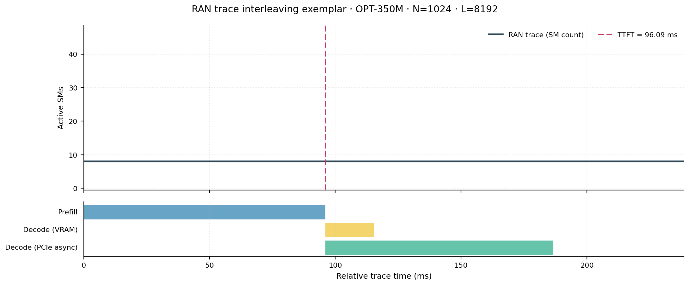
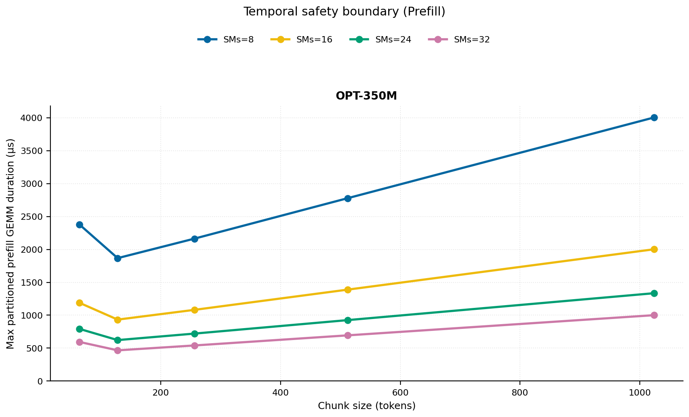
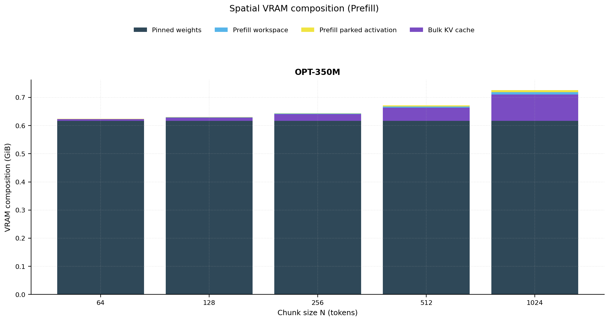
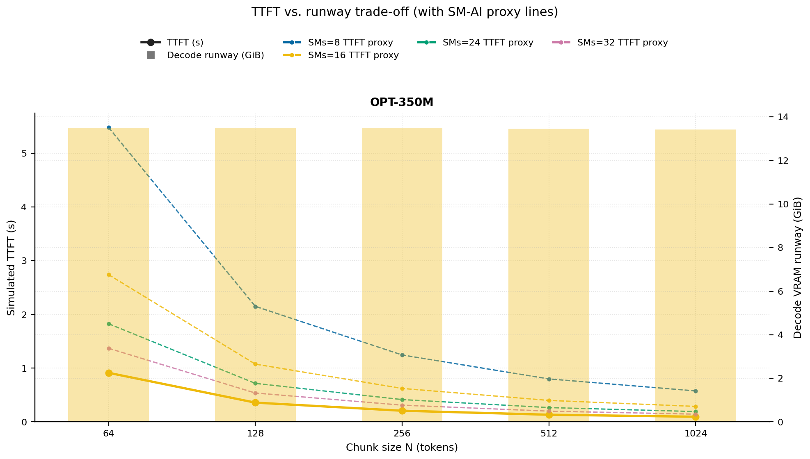
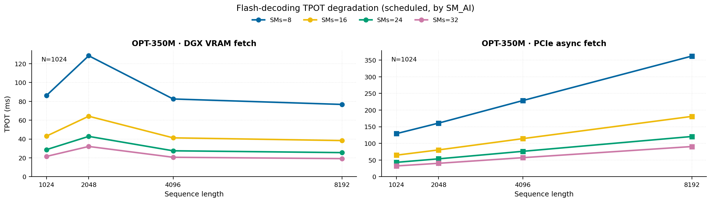
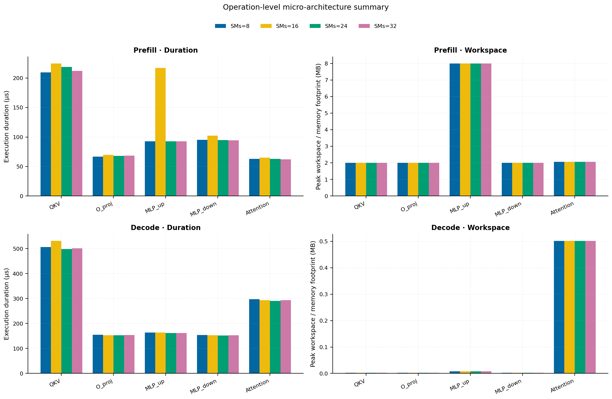
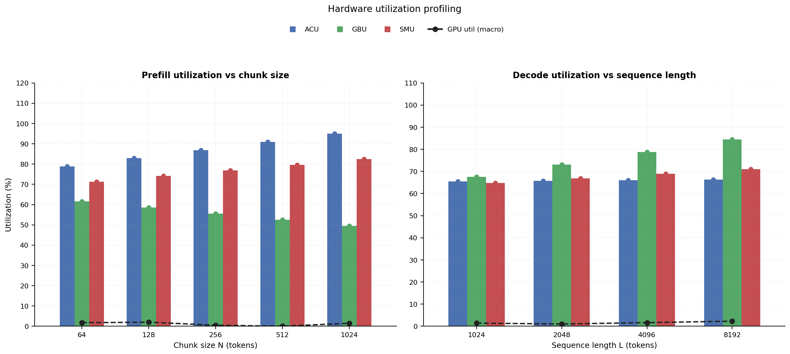

# RAN Inference Profiling Report

Run root: `/mnt/data/dheeraj/dicertation/inference-profile/runs/revised-rerun-20260415-171945-g1-opt350m`

## Environment

| field | value |
| --- | --- |
| cache_root | n/a |
| captured_at | 2026-04-15T16:19:53Z |
| chunk_sizes | [64, 128, 256, 512, 1024] |
| cuda_available | true |
| cuda_device_count | 8 |
| cwd | /mnt/data/dheeraj/dicertation/inference-profile |
| decode_modes | ["vram", "pcie_async"] |
| experiment_type | ran-dgxspark-v1 |
| gpu_id | 1 |
| l_out | 1024 |
| models | ["facebook/opt-350m"] |
| platform | Linux-6.8.0-106-generic-x86_64-with-glibc2.35 |
| python_executable | /home/dheeraj/miniconda3/envs/mls/bin/python |
| python_version | 3.11.14 |
| run_root | /mnt/data/dheeraj/dicertation/inference-profile/runs/revised-rerun-20260415-171945-g1-opt350m |
| scheduler | envelope_v1 |
| schema_version | ran_dgxspark_v1 |
| sequence_lengths | [1024, 2048, 4096, 8192] |
| sm_ai_cap | 32 |
| sm_ai_partition | 100 |
| sm_ai_partitions | [8, 16, 24, 32] |
| stage | profile |
| telemetry_tier | baseline_nvml_pt |
| timed_iterations | 5 |
| torch_available | true |
| torch_version | 2.10.0+cu128 |
| warmup_iterations | 3 |

## Model Constants

| model_id | sm_ai_partition | num_hidden_layers | hidden_size | num_attention_heads | ffn_dim | layer_index | layer_weight_bytes | total_weight_bytes_fp16 | vram_ceiling_bytes |
| --- | --- | --- | --- | --- | --- | --- | --- | --- | --- |
| facebook/opt-350m | 100 | 24 | 1024 | 16 | 4096 | 11 | 25192448 | 662392832 | 15170115993 |

## Trace Inspection

### Primary trace

| field | value |
| --- | --- |
| errors | [] |
| header | ["frame", "slot", "time_slot_sched_ns", "time_decode_start_est_ns", "time_decode_end_est_ns", "time_decode_start_actual_ns", "time_decode_end_actual_ns", "decode_dur_us", "deadline_met", "target_sm", "profile_idx", "sm_count", "num_pusch", "sum_prb", "sum_tbs_bytes", "max_mcs"] |
| median_positive_delta_ms | 5.6997 |
| monotonicity.checked_column | time_slot_sched_ns |
| monotonicity.is_non_decreasing | true |
| monotonicity.negative_delta_count | 0 |
| monotonicity.positive_delta_count | 28377 |
| monotonicity.zero_delta_count | 0 |
| normalization.last_row_duration_policy | median_positive_forward_delta_ms |
| normalization.output_columns | ["time_ms", "sm_utilization", "slot_duration_ms", "source_schema", "sm_count"] |
| normalization.output_relative_path | derived/normalized_ldpc_trace.csv |
| normalized_row_count | 28378 |
| path | /mnt/raid0sata2/netsys/weaver-ext/ran/traces/e2e_2026030418/e2e_20260304_182034_tractor_ran_ctrl/ldpc_trace.csv |
| row_count | 28378 |
| schema_detected | schema_b |
| time_unit_hint | ns |
| usable | true |
| usage_policy | primary_only |
| used_for_scheduler_capacity | true |

### Secondary trace

| field | value |
| --- | --- |
| errors | ["ran_ctrl_trace.csv line 182958 has 9 field(s); expected 12"] |
| header | ["frame", "slot", "sm_available", "prbs_available", "prbs_allocated", "w_avg_mcs_prev", "w_avg_mcs_curr", "slots_since_underutil", "ramp_up_count", "num_ue_sched", "max_ue_backlog", "sum_ue_backlog"] |
| monotonicity.checked_column | n/a |
| monotonicity.is_non_decreasing | n/a |
| monotonicity.negative_delta_count | n/a |
| path | /mnt/raid0sata2/netsys/weaver-ext/ran/traces/e2e_2026030418/e2e_20260304_182034_tractor_ran_ctrl/ran_ctrl_trace.csv |
| row_count | 182956 |
| time_unit_hints | [] |
| usable | false |
| usage_policy | structural_only |
| used_for_scheduler_capacity | false |

## Raw-Profile Summary Tables

### Prefill profile summary

Source raw rows: `raw/prefill_events.csv` = 700. Summary artifact: `derived/prefill_summary.csv`.

| model_id | chunk_tokens | sm_ai_partition | max_input_tokens | prefill_max_gemm_us | prefill_workspace_bytes | prefill_parked_activation_bytes | telemetry_tier | telemetry_provider | telemetry_status | nvml_available | gpu_util | gpu_mem_used_mb | sm_clock_mhz | mem_clock_mhz | power_w | pt_step_ms | pt_mem_alloc_mb | pt_mem_reserved_mb | pt_workspace_mb | acu_pct | gbu_pct | smu_pct | microscopic_telemetry_status | microscopic_error |
| --- | --- | --- | --- | --- | --- | --- | --- | --- | --- | --- | --- | --- | --- | --- | --- | --- | --- | --- | --- | --- | --- | --- | --- | --- |
| facebook/opt-350m | 64 | 8 | 1024 | 107.68 | 524288 | 524288 | baseline_nvml_pt | nvidia-smi | ok | true | 0 | 67 | 1695 | 7601 | 60.08 | 0.1077 | 34.6426 | 34.6426 | 0.5 | 69.5743 | 70.9053 | 61.1223 | estimated | n/a |
| facebook/opt-350m | 64 | 16 | 1024 | 151.296 | 524288 | 524288 | baseline_nvml_pt | nvidia-smi | ok | true | 6 | 67 | 1695 | 8001 | 60.87 | 0.1513 | 34.6426 | 34.6426 | 0.5 | 75.7392 | 64.6656 | 67.9137 | estimated | n/a |
| facebook/opt-350m | 64 | 24 | 1024 | 108.544 | 524288 | 524288 | baseline_nvml_pt | nvidia-smi | ok | true | 1 | 67 | 1695 | 7601 | 54.17 | 0.1085 | 34.6426 | 34.6426 | 0.5 | 81.904 | 58.4259 | 74.7051 | estimated | n/a |
| facebook/opt-350m | 64 | 32 | 1024 | 99.136 | 524288 | 524288 | baseline_nvml_pt | nvidia-smi | ok | true | 0 | 67 | 1695 | 7601 | 57.47 | 0.0991 | 34.6426 | 34.6426 | 0.5 | 88.0688 | 52.1863 | 81.4964 | estimated | n/a |
| facebook/opt-350m | 128 | 8 | 1024 | 83.84 | 1048576 | 1048576 | baseline_nvml_pt | nvidia-smi | ok | true | 6 | 67 | 1695 | 7601 | 61.1 | 0.0838 | 36.1426 | 36.1426 | 1 | 73.1429 | 67.457 | 63.4964 | estimated | n/a |
| facebook/opt-350m | 128 | 16 | 1024 | 3119.1039 | 1048576 | 1048576 | baseline_nvml_pt | nvidia-smi | ok | true | 0 | 67 | 1695 | 7601 | 61.23 | 3.1191 | 36.1426 | 36.1426 | 1 | 79.6239 | 61.5208 | 70.5516 | estimated | n/a |
| facebook/opt-350m | 128 | 24 | 1024 | 72.704 | 1048576 | 1048576 | baseline_nvml_pt | nvidia-smi | ok | true | 0 | 67 | 1695 | 8001 | 61.52 | 0.0727 | 36.1426 | 36.1426 | 1 | 86.105 | 55.5846 | 77.6067 | estimated | n/a |
| facebook/opt-350m | 128 | 32 | 1024 | 77.792 | 1048576 | 1048576 | baseline_nvml_pt | nvidia-smi | ok | true | 2 | 67 | 1695 | 7601 | 55.64 | 0.0778 | 36.1426 | 36.1426 | 1 | 92.586 | 49.6484 | 84.6619 | estimated | n/a |
| facebook/opt-350m | 256 | 8 | 1024 | 88.896 | 2097152 | 2097152 | baseline_nvml_pt | nvidia-smi | ok | true | 0 | 67 | 1695 | 7601 | 57.9 | 0.0889 | 39.1426 | 39.1426 | 2 | 76.7115 | 64.0088 | 65.8705 | estimated | n/a |
| facebook/opt-350m | 256 | 16 | 1024 | 98.112 | 2097152 | 2097152 | baseline_nvml_pt | nvidia-smi | ok | true | 2 | 67 | 1695 | 7601 | 53.93 | 0.0981 | 39.1426 | 39.1426 | 2 | 83.5087 | 58.376 | 73.1895 | estimated | n/a |
| facebook/opt-350m | 256 | 24 | 1024 | 101.216 | 2097152 | 2097152 | baseline_nvml_pt | nvidia-smi | ok | true | 0 | 67 | 1695 | 7601 | 61.4 | 0.1012 | 39.1426 | 39.1426 | 2 | 90.306 | 52.7432 | 80.5084 | estimated | n/a |
| facebook/opt-350m | 256 | 32 | 1024 | 90.112 | 2097152 | 2097152 | baseline_nvml_pt | nvidia-smi | ok | true | 0 | 67 | 1695 | 7601 | 53.89 | 0.0901 | 39.1426 | 39.1426 | 2 | 97.1032 | 47.1105 | 87.8274 | estimated | n/a |
| facebook/opt-350m | 512 | 8 | 1024 | 113.792 | 4194304 | 4194304 | baseline_nvml_pt | nvidia-smi | ok | true | 0 | 67 | 1695 | 7601 | 62.71 | 0.1138 | 45.1426 | 45.1426 | 4 | 80.2801 | 60.5605 | 68.2446 | estimated | n/a |
| facebook/opt-350m | 512 | 16 | 1024 | 145.408 | 4194304 | 4194304 | baseline_nvml_pt | nvidia-smi | ok | true | 0 | 67 | 1695 | 7601 | 58.6 | 0.1454 | 45.1426 | 45.1426 | 4 | 87.3935 | 55.2312 | 75.8274 | estimated | n/a |
| facebook/opt-350m | 512 | 24 | 1024 | 242.464 | 4194304 | 4194304 | baseline_nvml_pt | nvidia-smi | ok | true | 0 | 67 | 1695 | 7601 | 61.74 | 0.2425 | 45.1426 | 45.1426 | 4 | 94.5069 | 49.9019 | 83.4101 | estimated | n/a |
| facebook/opt-350m | 512 | 32 | 1024 | 115.712 | 4194304 | 4194304 | baseline_nvml_pt | nvidia-smi | ok | true | 0 | 67 | 1695 | 7601 | 62.98 | 0.1157 | 45.1426 | 45.1426 | 4 | 100 | 44.5725 | 90.9929 | estimated | n/a |
| facebook/opt-350m | 1024 | 8 | 1024 | 165.888 | 8388608 | 8388608 | baseline_nvml_pt | nvidia-smi | ok | true | 4 | 67 | 1695 | 8001 | 63.95 | 0.1659 | 57.1426 | 57.1426 | 8 | 83.8487 | 57.1123 | 70.6187 | estimated | n/a |
| facebook/opt-350m | 1024 | 16 | 1024 | 303.04 | 8388608 | 8388608 | baseline_nvml_pt | nvidia-smi | ok | true | 0 | 67 | 1695 | 7601 | 60.97 | 0.303 | 57.1426 | 57.1426 | 8 | 91.2783 | 52.0864 | 78.4653 | estimated | n/a |
| facebook/opt-350m | 1024 | 24 | 1024 | 164.864 | 8388608 | 8388608 | baseline_nvml_pt | nvidia-smi | ok | true | 0 | 67 | 1695 | 7601 | 63.19 | 0.1649 | 57.1426 | 57.1426 | 8 | 98.7079 | 47.0605 | 86.3118 | estimated | n/a |
| facebook/opt-350m | 1024 | 32 | 1024 | 166.816 | 8388608 | 8388608 | baseline_nvml_pt | nvidia-smi | ok | true | 2 | 67 | 1695 | 7601 | 63.88 | 0.1668 | 57.1426 | 57.1426 | 8 | 100 | 42.0346 | 94.1583 | estimated | n/a |

### Decode profile summary

Source raw rows: `raw/decode_events.csv` = 6400. Summary artifact: `derived/decode_summary.csv`.

| model_id | sequence_length | block_size | sm_ai_partition | decode_mode | decode_max_gemv_us | attention_fetch_compute_us | reduction_overhead_us | decode_workspace_bytes | decode_parked_activation_bytes | telemetry_tier | telemetry_provider | telemetry_status | nvml_available | gpu_util | gpu_mem_used_mb | sm_clock_mhz | mem_clock_mhz | power_w | pt_step_ms | pt_mem_alloc_mb | pt_mem_reserved_mb | pt_workspace_mb | acu_pct | gbu_pct | smu_pct | microscopic_telemetry_status | microscopic_error |
| --- | --- | --- | --- | --- | --- | --- | --- | --- | --- | --- | --- | --- | --- | --- | --- | --- | --- | --- | --- | --- | --- | --- | --- | --- | --- | --- | --- |
| facebook/opt-350m | 1024 | 64 | 8 | pcie_async | 129.024 | 122.3424 | 22.0928 | 67584 | 2048 | baseline_nvml_pt | nvidia-smi | ok | true | 0 | 67 | 1695 | 7601 | 63.28 | 0.129 | 36.2188 | 36.2188 | 0.0645 | 57.3766 | 73.5898 | 56.3551 | estimated | n/a |
| facebook/opt-350m | 1024 | 64 | 8 | vram | 266.24 | 141.536 | 21.216 | 67584 | 2048 | baseline_nvml_pt | nvidia-smi | ok | true | 0 | 67 | 1695 | 7601 | 63.31 | 0.2662 | 36.2188 | 36.2188 | 0.0645 | 58.9375 | 70.1508 | 57.6813 | estimated | n/a |
| facebook/opt-350m | 1024 | 64 | 16 | pcie_async | 128.16 | 122.8608 | 20.6592 | 67584 | 2048 | baseline_nvml_pt | nvidia-smi | ok | true | 5 | 67 | 1695 | 7601 | 63.66 | 0.1282 | 36.2188 | 36.2188 | 0.0645 | 61.9465 | 71.0522 | 61.131 | estimated | n/a |
| facebook/opt-350m | 1024 | 64 | 16 | vram | 3138.72 | 122.688 | 20.064 | 67584 | 2048 | baseline_nvml_pt | nvidia-smi | ok | true | 1 | 67 | 1695 | 7601 | 48.79 | 3.1387 | 36.2188 | 36.2188 | 0.0645 | 63.6151 | 67.8879 | 63.2634 | estimated | n/a |
| facebook/opt-350m | 1024 | 64 | 24 | pcie_async | 135.264 | 128.8384 | 19.4816 | 67584 | 2048 | baseline_nvml_pt | nvidia-smi | ok | true | 0 | 67 | 1695 | 7601 | 63.4 | 0.1405 | 36.2188 | 36.2188 | 0.0645 | 66.5163 | 68.5146 | 65.9069 | estimated | n/a |
| facebook/opt-350m | 1024 | 64 | 24 | vram | 137.216 | 135.7248 | 21.0496 | 67584 | 2048 | baseline_nvml_pt | nvidia-smi | ok | true | 1 | 67 | 1695 | 7601 | 63.58 | 0.1402 | 36.2188 | 36.2188 | 0.0645 | 68.2927 | 65.625 | 68.8454 | estimated | n/a |
| facebook/opt-350m | 1024 | 64 | 32 | pcie_async | 128.864 | 124.6784 | 19.6416 | 67584 | 2048 | baseline_nvml_pt | nvidia-smi | ok | true | 0 | 67 | 1695 | 7601 | 58.31 | 0.1372 | 36.2188 | 36.2188 | 0.0645 | 71.0861 | 65.9771 | 70.6827 | estimated | n/a |
| facebook/opt-350m | 1024 | 64 | 32 | vram | 151.552 | 131.9296 | 20.3136 | 67584 | 2048 | baseline_nvml_pt | nvidia-smi | ok | true | 1 | 67 | 1695 | 7601 | 63.83 | 0.1516 | 36.2188 | 36.2188 | 0.0645 | 72.9702 | 63.362 | 74.4275 | estimated | n/a |
| facebook/opt-350m | 1024 | 128 | 8 | pcie_async | 139.488 | 124.384 | 20.0448 | 67584 | 2048 | baseline_nvml_pt | nvidia-smi | ok | true | 5 | 67 | 1695 | 7601 | 61.2 | 0.1395 | 36.2188 | 36.2188 | 0.0645 | 57.3766 | 73.1548 | 56.3551 | estimated | n/a |
| facebook/opt-350m | 1024 | 128 | 8 | vram | 141.312 | 125.568 | 20.8896 | 67584 | 2048 | baseline_nvml_pt | nvidia-smi | ok | true | 0 | 67 | 1695 | 7601 | 63.59 | 0.1413 | 36.2188 | 36.2188 | 0.0645 | 59.2525 | 69.7633 | 57.6813 | estimated | n/a |
| facebook/opt-350m | 1024 | 128 | 16 | pcie_async | 142.176 | 126.848 | 20.4736 | 67584 | 2048 | baseline_nvml_pt | nvidia-smi | ok | true | 0 | 67 | 1695 | 7601 | 64.13 | 0.1435 | 36.2188 | 36.2188 | 0.0645 | 61.9465 | 70.6322 | 61.131 | estimated | n/a |
| facebook/opt-350m | 1024 | 128 | 16 | vram | 126.976 | 122.2336 | 21.0816 | 67584 | 2048 | baseline_nvml_pt | nvidia-smi | ok | true | 0 | 67 | 1695 | 7601 | 63.41 | 0.1321 | 36.2188 | 36.2188 | 0.0645 | 63.9551 | 67.5129 | 63.2634 | estimated | n/a |
| facebook/opt-350m | 1024 | 128 | 24 | pcie_async | 145.312 | 123.072 | 20.4288 | 67584 | 2048 | baseline_nvml_pt | nvidia-smi | ok | true | 5 | 67 | 1695 | 7601 | 63.97 | 0.1453 | 36.2188 | 36.2188 | 0.0645 | 66.5163 | 68.1096 | 65.9069 | estimated | n/a |
| facebook/opt-350m | 1024 | 128 | 24 | vram | 126.976 | 122.6944 | 19.6736 | 67584 | 2048 | baseline_nvml_pt | nvidia-smi | ok | true | 4 | 67 | 1695 | 7601 | 62.48 | 0.1272 | 36.2188 | 36.2188 | 0.0645 | 68.6577 | 65.2625 | 68.8454 | estimated | n/a |
| facebook/opt-350m | 1024 | 128 | 32 | pcie_async | 137.216 | 123.1104 | 21.3632 | 67584 | 2048 | baseline_nvml_pt | nvidia-smi | ok | true | 0 | 67 | 1695 | 8001 | 63.28 | 0.1372 | 36.2188 | 36.2188 | 0.0645 | 71.0861 | 65.5871 | 70.6827 | estimated | n/a |
| facebook/opt-350m | 1024 | 128 | 32 | vram | 141.312 | 122.2784 | 20.2944 | 67584 | 2048 | baseline_nvml_pt | nvidia-smi | ok | true | 0 | 67 | 1695 | 7601 | 64 | 0.1413 | 36.2188 | 36.2188 | 0.0645 | 73.3602 | 63.012 | 74.4275 | estimated | n/a |
| facebook/opt-350m | 1024 | 256 | 8 | pcie_async | 131.072 | 119.5328 | 19.1808 | 67584 | 2048 | baseline_nvml_pt | nvidia-smi | ok | true | 1 | 67 | 1695 | 7601 | 63.47 | 0.1311 | 36.2188 | 36.2188 | 0.0645 | 57.3766 | 72.7198 | 56.3551 | estimated | n/a |
| facebook/opt-350m | 1024 | 256 | 8 | vram | 129.024 | 123.136 | 19.712 | 67584 | 2048 | baseline_nvml_pt | nvidia-smi | ok | true | 0 | 67 | 1695 | 8001 | 63.85 | 0.1341 | 36.2188 | 36.2188 | 0.0645 | 59.5675 | 69.3758 | 57.6813 | estimated | n/a |
| facebook/opt-350m | 1024 | 256 | 16 | pcie_async | 128 | 122.5344 | 20.0384 | 67584 | 2048 | baseline_nvml_pt | nvidia-smi | ok | true | 1 | 67 | 1695 | 7601 | 64.07 | 0.128 | 36.2188 | 36.2188 | 0.0645 | 61.9465 | 70.2122 | 61.131 | estimated | n/a |
| facebook/opt-350m | 1024 | 256 | 16 | vram | 149.664 | 129.44 | 21.9136 | 67584 | 2048 | baseline_nvml_pt | nvidia-smi | ok | true | 0 | 67 | 1695 | 7601 | 63.61 | 0.1497 | 36.2188 | 36.2188 | 0.0645 | 64.2951 | 67.1379 | 63.2634 | estimated | n/a |
| facebook/opt-350m | 1024 | 256 | 24 | pcie_async | 150.4 | 129.8624 | 20.1856 | 67584 | 2048 | baseline_nvml_pt | nvidia-smi | ok | true | 0 | 67 | 1695 | 7601 | 61.58 | 0.1516 | 36.2188 | 36.2188 | 0.0645 | 66.5163 | 67.7046 | 65.9069 | estimated | n/a |
| facebook/opt-350m | 1024 | 256 | 24 | vram | 124.064 | 118.6048 | 19.4048 | 67584 | 2048 | baseline_nvml_pt | nvidia-smi | ok | true | 0 | 67 | 1695 | 7601 | 63.71 | 0.1291 | 36.2188 | 36.2188 | 0.0645 | 69.0227 | 64.9 | 68.8454 | estimated | n/a |
| facebook/opt-350m | 1024 | 256 | 32 | pcie_async | 129.984 | 128.64 | 20.0256 | 67584 | 2048 | baseline_nvml_pt | nvidia-smi | ok | true | 8 | 67 | 1695 | 7601 | 62.81 | 0.1403 | 36.2188 | 36.2188 | 0.0645 | 71.0861 | 65.1971 | 70.6827 | estimated | n/a |
| facebook/opt-350m | 1024 | 256 | 32 | vram | 135.168 | 121.4592 | 20.0832 | 67584 | 2048 | baseline_nvml_pt | nvidia-smi | ok | true | 1 | 67 | 1695 | 7601 | 62.24 | 0.1352 | 36.2188 | 36.2188 | 0.0645 | 73.7502 | 62.662 | 74.4275 | estimated | n/a |
| facebook/opt-350m | 1024 | 512 | 8 | pcie_async | 128 | 124.4864 | 20.1216 | 67584 | 2048 | baseline_nvml_pt | nvidia-smi | ok | true | 0 | 67 | 1695 | 8001 | 64.25 | 0.1341 | 36.2188 | 36.2188 | 0.0645 | 57.3766 | 72.2848 | 56.3551 | estimated | n/a |
| facebook/opt-350m | 1024 | 512 | 8 | vram | 145.28 | 119.8208 | 19.6608 | 67584 | 2048 | baseline_nvml_pt | nvidia-smi | ok | true | 0 | 67 | 1695 | 7601 | 64.06 | 0.1453 | 36.2188 | 36.2188 | 0.0645 | 59.8825 | 68.9883 | 57.6813 | estimated | n/a |
| facebook/opt-350m | 1024 | 512 | 16 | pcie_async | 151.424 | 136.352 | 20.4672 | 67584 | 2048 | baseline_nvml_pt | nvidia-smi | ok | true | 0 | 67 | 1695 | 7601 | 64.36 | 0.163 | 36.2188 | 36.2188 | 0.0645 | 61.9465 | 69.7922 | 61.131 | estimated | n/a |
| facebook/opt-350m | 1024 | 512 | 16 | vram | 131.072 | 120.9024 | 19.4176 | 67584 | 2048 | baseline_nvml_pt | nvidia-smi | ok | true | 0 | 67 | 1695 | 7601 | 61.23 | 0.1311 | 36.2188 | 36.2188 | 0.0645 | 64.6351 | 66.7629 | 63.2634 | estimated | n/a |
| facebook/opt-350m | 1024 | 512 | 24 | pcie_async | 142.56 | 122.9312 | 20.3264 | 67584 | 2048 | baseline_nvml_pt | nvidia-smi | ok | true | 0 | 67 | 1695 | 7601 | 56.85 | 0.1426 | 36.2188 | 36.2188 | 0.0645 | 66.5163 | 67.2996 | 65.9069 | estimated | n/a |
| facebook/opt-350m | 1024 | 512 | 24 | vram | 148.48 | 124.3392 | 19.6992 | 67584 | 2048 | baseline_nvml_pt | nvidia-smi | ok | true | 0 | 67 | 1695 | 8001 | 64.33 | 0.1485 | 36.2188 | 36.2188 | 0.0645 | 69.3877 | 64.5375 | 68.8454 | estimated | n/a |
| facebook/opt-350m | 1024 | 512 | 32 | pcie_async | 138.24 | 126.1184 | 19.6096 | 67584 | 2048 | baseline_nvml_pt | nvidia-smi | ok | true | 2 | 67 | 1695 | 7601 | 63.9 | 0.1413 | 36.2188 | 36.2188 | 0.0645 | 71.0861 | 64.8071 | 70.6827 | estimated | n/a |
| facebook/opt-350m | 1024 | 512 | 32 | vram | 135.136 | 122.8928 | 19.6608 | 67584 | 2048 | baseline_nvml_pt | nvidia-smi | ok | true | 8 | 67 | 1695 | 8001 | 63.62 | 0.1351 | 36.2188 | 36.2188 | 0.0645 | 74.1402 | 62.312 | 74.4275 | estimated | n/a |
| facebook/opt-350m | 1024 | 1024 | 8 | pcie_async | 145.408 | 129.2544 | 20.6848 | 67584 | 2048 | baseline_nvml_pt | nvidia-smi | ok | true | 0 | 67 | 1695 | 7601 | 64.65 | 0.1485 | 36.2188 | 36.2188 | 0.0645 | 57.3766 | 71.8498 | 56.3551 | estimated | n/a |
| facebook/opt-350m | 1024 | 1024 | 8 | vram | 126.976 | 119.0144 | 19.4944 | 67584 | 2048 | baseline_nvml_pt | nvidia-smi | ok | true | 1 | 67 | 1695 | 7601 | 64.79 | 0.127 | 36.2188 | 36.2188 | 0.0645 | 60.1975 | 68.6008 | 57.6813 | estimated | n/a |
| facebook/opt-350m | 1024 | 1024 | 16 | pcie_async | 167.936 | 130.8608 | 19.9424 | 67584 | 2048 | baseline_nvml_pt | nvidia-smi | ok | true | 0 | 67 | 1695 | 7601 | 64.58 | 0.1679 | 36.2188 | 36.2188 | 0.0645 | 61.9465 | 69.3722 | 61.131 | estimated | n/a |
| facebook/opt-350m | 1024 | 1024 | 16 | vram | 137.12 | 121.1968 | 19.2064 | 67584 | 2048 | baseline_nvml_pt | nvidia-smi | ok | true | 6 | 67 | 1695 | 7601 | 64.24 | 0.1371 | 36.2188 | 36.2188 | 0.0645 | 64.9751 | 66.3879 | 63.2634 | estimated | n/a |
| facebook/opt-350m | 1024 | 1024 | 24 | pcie_async | 131.328 | 129.5104 | 20.3328 | 67584 | 2048 | baseline_nvml_pt | nvidia-smi | ok | true | 0 | 67 | 1695 | 7601 | 62.62 | 0.1548 | 36.2188 | 36.2188 | 0.0645 | 66.5163 | 66.8946 | 65.9069 | estimated | n/a |
| facebook/opt-350m | 1024 | 1024 | 24 | vram | 128.896 | 122.1952 | 19.4496 | 67584 | 2048 | baseline_nvml_pt | nvidia-smi | ok | true | 0 | 67 | 1695 | 8001 | 64.63 | 0.1289 | 36.2188 | 36.2188 | 0.0645 | 69.7527 | 64.175 | 68.8454 | estimated | n/a |
| facebook/opt-350m | 1024 | 1024 | 32 | pcie_async | 141.344 | 121.6 | 19.5008 | 67584 | 2048 | baseline_nvml_pt | nvidia-smi | ok | true | 6 | 67 | 1695 | 7601 | 64.22 | 0.1413 | 36.2188 | 36.2188 | 0.0645 | 71.0861 | 64.4171 | 70.6827 | estimated | n/a |
| facebook/opt-350m | 1024 | 1024 | 32 | vram | 127.008 | 117.5552 | 19.0592 | 67584 | 2048 | baseline_nvml_pt | nvidia-smi | ok | true | 0 | 67 | 1695 | 7601 | 64.84 | 0.127 | 36.2188 | 36.2188 | 0.0645 | 74.5302 | 61.962 | 74.4275 | estimated | n/a |
| facebook/opt-350m | 2048 | 64 | 8 | pcie_async | 129.024 | 122.6816 | 20.5376 | 133120 | 2048 | baseline_nvml_pt | nvidia-smi | ok | true | 0 | 67 | 1695 | 7601 | 60.59 | 0.1341 | 40.2812 | 40.2812 | 0.127 | 56.4285 | 79.1297 | 57.3452 | estimated | n/a |
| facebook/opt-350m | 2048 | 64 | 8 | vram | 151.552 | 127.1296 | 21.1072 | 133120 | 2048 | baseline_nvml_pt | nvidia-smi | ok | true | 2 | 67 | 1695 | 7601 | 64.06 | 0.1516 | 40.2812 | 40.2812 | 0.127 | 59.9947 | 73.7853 | 59.5484 | estimated | n/a |
| facebook/opt-350m | 2048 | 64 | 16 | pcie_async | 182.272 | 125.5872 | 20.0064 | 133120 | 2048 | baseline_nvml_pt | nvidia-smi | ok | true | 0 | 67 | 1695 | 7601 | 61.6 | 0.1823 | 40.2812 | 40.2812 | 0.127 | 60.9228 | 76.4011 | 62.205 | estimated | n/a |
| facebook/opt-350m | 2048 | 64 | 16 | vram | 144.384 | 124.1088 | 20.2752 | 133120 | 2048 | baseline_nvml_pt | nvidia-smi | ok | true | 0 | 67 | 1695 | 8001 | 64.73 | 0.1444 | 40.2812 | 40.2812 | 0.127 | 64.7562 | 71.4051 | 65.3112 | estimated | n/a |
| facebook/opt-350m | 2048 | 64 | 24 | pcie_async | 133.12 | 124.7232 | 19.1936 | 133120 | 2048 | baseline_nvml_pt | nvidia-smi | ok | true | 0 | 67 | 1695 | 7601 | 65.05 | 0.1331 | 40.2812 | 40.2812 | 0.127 | 65.4171 | 73.6725 | 67.0648 | estimated | n/a |
| facebook/opt-350m | 2048 | 64 | 24 | vram | 182.432 | 136.8832 | 21.3184 | 133120 | 2048 | baseline_nvml_pt | nvidia-smi | ok | true | 3 | 67 | 1695 | 7601 | 53.31 | 0.1824 | 40.2812 | 40.2812 | 0.127 | 69.5177 | 69.0249 | 71.0739 | estimated | n/a |
| facebook/opt-350m | 2048 | 64 | 32 | pcie_async | 138.08 | 161.4144 | 19.5968 | 133120 | 2048 | baseline_nvml_pt | nvidia-smi | ok | true | 0 | 67 | 1695 | 8001 | 65 | 0.3113 | 40.2812 | 40.2812 | 0.127 | 69.9114 | 70.9439 | 71.9245 | estimated | n/a |
| facebook/opt-350m | 2048 | 64 | 32 | vram | 149.408 | 124.9856 | 19.4112 | 133120 | 2048 | baseline_nvml_pt | nvidia-smi | ok | true | 0 | 67 | 1695 | 7601 | 64.31 | 0.1494 | 40.2812 | 40.2812 | 0.127 | 74.2792 | 66.6448 | 76.8367 | estimated | n/a |
| facebook/opt-350m | 2048 | 128 | 8 | pcie_async | 161.792 | 124.4928 | 20.0064 | 133120 | 2048 | baseline_nvml_pt | nvidia-smi | ok | true | 0 | 67 | 1695 | 7601 | 64.72 | 0.1618 | 40.2812 | 40.2812 | 0.127 | 56.4285 | 79.5647 | 57.5419 | estimated | n/a |
| facebook/opt-350m | 2048 | 128 | 8 | vram | 135.2 | 124.7104 | 20.0128 | 133120 | 2048 | baseline_nvml_pt | nvidia-smi | ok | true | 0 | 67 | 1695 | 8001 | 65.16 | 0.1352 | 40.2812 | 40.2812 | 0.127 | 60.5197 | 73.9144 | 59.7551 | estimated | n/a |
| facebook/opt-350m | 2048 | 128 | 16 | pcie_async | 133.12 | 126.8288 | 20 | 133120 | 2048 | baseline_nvml_pt | nvidia-smi | ok | true | 0 | 67 | 1695 | 7601 | 64.31 | 0.1352 | 40.2812 | 40.2812 | 0.127 | 60.9228 | 76.8211 | 62.4183 | estimated | n/a |
| facebook/opt-350m | 2048 | 128 | 16 | vram | 147.328 | 128.992 | 19.8144 | 133120 | 2048 | baseline_nvml_pt | nvidia-smi | ok | true | 0 | 67 | 1695 | 8001 | 64.9 | 0.1473 | 40.2812 | 40.2812 | 0.127 | 65.3229 | 71.5301 | 65.5378 | estimated | n/a |
| facebook/opt-350m | 2048 | 128 | 24 | pcie_async | 131.968 | 124.032 | 19.4496 | 133120 | 2048 | baseline_nvml_pt | nvidia-smi | ok | true | 0 | 67 | 1695 | 7601 | 64.63 | 0.1341 | 40.2812 | 40.2812 | 0.127 | 65.4171 | 74.0775 | 67.2948 | estimated | n/a |
| facebook/opt-350m | 2048 | 128 | 24 | vram | 134.368 | 124.2432 | 18.9248 | 133120 | 2048 | baseline_nvml_pt | nvidia-smi | ok | true | 2 | 67 | 1695 | 7601 | 64.61 | 0.1344 | 40.2812 | 40.2812 | 0.127 | 70.126 | 69.1458 | 71.3206 | estimated | n/a |
| facebook/opt-350m | 2048 | 128 | 32 | pcie_async | 147.264 | 121.5936 | 19.8656 | 133120 | 2048 | baseline_nvml_pt | nvidia-smi | ok | true | 2 | 67 | 1695 | 7601 | 58.21 | 0.1473 | 40.2812 | 40.2812 | 0.127 | 69.9114 | 71.3339 | 72.1712 | estimated | n/a |
| facebook/opt-350m | 2048 | 128 | 32 | vram | 142.336 | 127.2192 | 20.8896 | 133120 | 2048 | baseline_nvml_pt | nvidia-smi | ok | true | 3 | 67 | 1695 | 7601 | 53.91 | 0.1423 | 40.2812 | 40.2812 | 0.127 | 74.9292 | 66.7614 | 77.1034 | estimated | n/a |
| facebook/opt-350m | 2048 | 256 | 8 | pcie_async | 145.344 | 126.0416 | 19.8848 | 133120 | 2048 | baseline_nvml_pt | nvidia-smi | ok | true | 0 | 67 | 1695 | 7601 | 60.62 | 0.1453 | 40.2812 | 40.2812 | 0.127 | 56.4285 | 79.9997 | 57.7386 | estimated | n/a |
| facebook/opt-350m | 2048 | 256 | 8 | vram | 152.576 | 130.4704 | 19.8336 | 133120 | 2048 | baseline_nvml_pt | nvidia-smi | ok | true | 0 | 67 | 1695 | 8001 | 64.82 | 0.1526 | 40.2812 | 40.2812 | 0.127 | 61.0447 | 74.0436 | 59.9618 | estimated | n/a |
| facebook/opt-350m | 2048 | 256 | 16 | pcie_async | 132.096 | 124.448 | 19.6864 | 133120 | 2048 | baseline_nvml_pt | nvidia-smi | ok | true | 0 | 67 | 1695 | 7601 | 58.77 | 0.1321 | 40.2812 | 40.2812 | 0.127 | 60.9228 | 77.2411 | 62.6317 | estimated | n/a |
| facebook/opt-350m | 2048 | 256 | 16 | vram | 147.456 | 129.4016 | 20.8512 | 133120 | 2048 | baseline_nvml_pt | nvidia-smi | ok | true | 7 | 67 | 1695 | 7601 | 65.04 | 0.1475 | 40.2812 | 40.2812 | 0.127 | 65.8895 | 71.6551 | 65.7645 | estimated | n/a |
| facebook/opt-350m | 2048 | 256 | 24 | pcie_async | 129.952 | 124.3456 | 20.1792 | 133120 | 2048 | baseline_nvml_pt | nvidia-smi | ok | true | 0 | 67 | 1695 | 8001 | 65.08 | 0.13 | 40.2812 | 40.2812 | 0.127 | 65.4171 | 74.4825 | 67.5248 | estimated | n/a |
| facebook/opt-350m | 2048 | 256 | 24 | vram | 131.072 | 123.6928 | 19.8464 | 133120 | 2048 | baseline_nvml_pt | nvidia-smi | ok | true | 1 | 67 | 1695 | 7601 | 61.23 | 0.1311 | 40.2812 | 40.2812 | 0.127 | 70.7344 | 69.2666 | 71.5673 | estimated | n/a |
| facebook/opt-350m | 2048 | 256 | 32 | pcie_async | 143.264 | 127.0208 | 20.6848 | 133120 | 2048 | baseline_nvml_pt | nvidia-smi | ok | true | 0 | 67 | 1695 | 7601 | 61.8 | 0.1433 | 40.2812 | 40.2812 | 0.127 | 69.9114 | 71.7239 | 72.4179 | estimated | n/a |
| facebook/opt-350m | 2048 | 256 | 32 | vram | 126.976 | 123.3088 | 19.2448 | 133120 | 2048 | baseline_nvml_pt | nvidia-smi | ok | true | 2 | 67 | 1695 | 7601 | 54.21 | 0.1279 | 40.2812 | 40.2812 | 0.127 | 75.5792 | 66.8781 | 77.37 | estimated | n/a |
| facebook/opt-350m | 2048 | 512 | 8 | pcie_async | 126.112 | 128.6976 | 20.448 | 133120 | 2048 | baseline_nvml_pt | nvidia-smi | ok | true | 0 | 67 | 1695 | 7601 | 60.62 | 0.1403 | 40.2812 | 40.2812 | 0.127 | 56.4285 | 80.4347 | 57.9352 | estimated | n/a |
| facebook/opt-350m | 2048 | 512 | 8 | vram | 152.512 | 126.9312 | 19.6608 | 133120 | 2048 | baseline_nvml_pt | nvidia-smi | ok | true | 0 | 67 | 1695 | 8001 | 65.14 | 0.1525 | 40.2812 | 40.2812 | 0.127 | 61.5697 | 74.1728 | 60.1684 | estimated | n/a |
| facebook/opt-350m | 2048 | 512 | 16 | pcie_async | 269.312 | 130.2528 | 20.7488 | 133120 | 2048 | baseline_nvml_pt | nvidia-smi | ok | true | 2 | 67 | 1695 | 7601 | 53.46 | 0.2693 | 40.2812 | 40.2812 | 0.127 | 60.9228 | 77.6611 | 62.845 | estimated | n/a |
| facebook/opt-350m | 2048 | 512 | 16 | vram | 150.24 | 139.552 | 22.9312 | 133120 | 2048 | baseline_nvml_pt | nvidia-smi | ok | true | 1 | 67 | 1695 | 7601 | 55.79 | 0.1938 | 40.2812 | 40.2812 | 0.127 | 66.4562 | 71.7801 | 65.9912 | estimated | n/a |
| facebook/opt-350m | 2048 | 512 | 24 | pcie_async | 126.752 | 121.6512 | 19.6672 | 133120 | 2048 | baseline_nvml_pt | nvidia-smi | ok | true | 0 | 67 | 1695 | 7601 | 64.9 | 0.129 | 40.2812 | 40.2812 | 0.127 | 65.4171 | 74.8875 | 67.7548 | estimated | n/a |
| facebook/opt-350m | 2048 | 512 | 24 | vram | 128 | 122.2976 | 20.0256 | 133120 | 2048 | baseline_nvml_pt | nvidia-smi | ok | true | 2 | 67 | 1695 | 7601 | 45.53 | 0.128 | 40.2812 | 40.2812 | 0.127 | 71.3427 | 69.3874 | 71.8139 | estimated | n/a |
| facebook/opt-350m | 2048 | 512 | 32 | pcie_async | 127.808 | 119.3472 | 19.0016 | 133120 | 2048 | baseline_nvml_pt | nvidia-smi | ok | true | 0 | 67 | 1695 | 7601 | 65.26 | 0.1278 | 40.2812 | 40.2812 | 0.127 | 69.9114 | 72.1139 | 72.6645 | estimated | n/a |
| facebook/opt-350m | 2048 | 512 | 32 | vram | 135.232 | 127.424 | 21.0368 | 133120 | 2048 | baseline_nvml_pt | nvidia-smi | ok | true | 0 | 67 | 1695 | 7601 | 59.39 | 0.1352 | 40.2812 | 40.2812 | 0.127 | 76.2292 | 66.9948 | 77.6367 | estimated | n/a |
| facebook/opt-350m | 2048 | 1024 | 8 | pcie_async | 141.44 | 128.352 | 20.1792 | 133120 | 2048 | baseline_nvml_pt | nvidia-smi | ok | true | 0 | 67 | 1695 | 7601 | 65.13 | 0.1414 | 40.2812 | 40.2812 | 0.127 | 56.4285 | 80.8697 | 58.1319 | estimated | n/a |
| facebook/opt-350m | 2048 | 1024 | 8 | vram | 134.144 | 121.2416 | 19.872 | 133120 | 2048 | baseline_nvml_pt | nvidia-smi | ok | true | 4 | 67 | 1695 | 7601 | 51.36 | 0.1341 | 40.2812 | 40.2812 | 0.127 | 62.0947 | 74.3019 | 60.3751 | estimated | n/a |
| facebook/opt-350m | 2048 | 1024 | 16 | pcie_async | 126.176 | 124.128 | 19.4624 | 133120 | 2048 | baseline_nvml_pt | nvidia-smi | ok | true | 1 | 67 | 1695 | 7601 | 64.74 | 0.13 | 40.2812 | 40.2812 | 0.127 | 60.9228 | 78.0811 | 63.0583 | estimated | n/a |
| facebook/opt-350m | 2048 | 1024 | 16 | vram | 140.288 | 123.0848 | 19.904 | 133120 | 2048 | baseline_nvml_pt | nvidia-smi | ok | true | 1 | 67 | 1695 | 7601 | 55.04 | 0.1403 | 40.2812 | 40.2812 | 0.127 | 67.0229 | 71.9051 | 66.2178 | estimated | n/a |
| facebook/opt-350m | 2048 | 1024 | 24 | pcie_async | 110.592 | 121.4272 | 19.4624 | 133120 | 2048 | baseline_nvml_pt | nvidia-smi | ok | true | 0 | 67 | 1695 | 8001 | 64.79 | 0.1259 | 40.2812 | 40.2812 | 0.127 | 65.4171 | 75.2925 | 67.9848 | estimated | n/a |
| facebook/opt-350m | 2048 | 1024 | 24 | vram | 142.336 | 123.456 | 20.1472 | 133120 | 2048 | baseline_nvml_pt | nvidia-smi | ok | true | 0 | 67 | 1695 | 7601 | 60.19 | 0.1423 | 40.2812 | 40.2812 | 0.127 | 71.951 | 69.5083 | 72.0606 | estimated | n/a |
| facebook/opt-350m | 2048 | 1024 | 32 | pcie_async | 136.192 | 124.4864 | 20.2752 | 133120 | 2048 | baseline_nvml_pt | nvidia-smi | ok | true | 7 | 67 | 1695 | 8001 | 64.86 | 0.1362 | 40.2812 | 40.2812 | 0.127 | 69.9114 | 72.5039 | 72.9112 | estimated | n/a |
| facebook/opt-350m | 2048 | 1024 | 32 | vram | 197.632 | 132.5312 | 19.808 | 133120 | 2048 | baseline_nvml_pt | nvidia-smi | ok | true | 1 | 67 | 1695 | 7601 | 58.79 | 0.1976 | 40.2812 | 40.2812 | 0.127 | 76.8792 | 67.1114 | 77.9034 | estimated | n/a |
| facebook/opt-350m | 4096 | 64 | 8 | pcie_async | 160.64 | 125.7024 | 20.0128 | 264192 | 2048 | baseline_nvml_pt | nvidia-smi | ok | true | 0 | 67 | 1695 | 7601 | 58.67 | 0.1606 | 48.4062 | 48.4062 | 0.252 | 55.4804 | 84.6696 | 58.3353 | estimated | n/a |
| facebook/opt-350m | 4096 | 64 | 8 | vram | 125.792 | 126.9248 | 20.2304 | 264192 | 2048 | baseline_nvml_pt | nvidia-smi | ok | true | 0 | 67 | 1695 | 7601 | 63.66 | 0.136 | 48.4062 | 48.4062 | 0.252 | 61.0519 | 77.4197 | 61.4155 | estimated | n/a |
| facebook/opt-350m | 4096 | 64 | 16 | pcie_async | 129.28 | 128.8256 | 20.4096 | 264192 | 2048 | baseline_nvml_pt | nvidia-smi | ok | true | 0 | 67 | 1695 | 7601 | 61.5 | 0.1352 | 48.4062 | 48.4062 | 0.252 | 59.8991 | 81.75 | 63.279 | estimated | n/a |
| facebook/opt-350m | 4096 | 64 | 16 | vram | 133.12 | 124.9728 | 22.2848 | 264192 | 2048 | baseline_nvml_pt | nvidia-smi | ok | true | 2 | 67 | 1695 | 7601 | 60.58 | 0.1331 | 48.4062 | 48.4062 | 0.252 | 65.8973 | 74.9223 | 67.359 | estimated | n/a |
| facebook/opt-350m | 4096 | 64 | 24 | pcie_async | 129.824 | 121.0368 | 19.4176 | 264192 | 2048 | baseline_nvml_pt | nvidia-smi | ok | true | 4 | 67 | 1695 | 7601 | 59.44 | 0.1298 | 48.4062 | 48.4062 | 0.252 | 64.3179 | 78.8304 | 68.2227 | estimated | n/a |
| facebook/opt-350m | 4096 | 64 | 24 | vram | 143.36 | 123.296 | 19.072 | 264192 | 2048 | baseline_nvml_pt | nvidia-smi | ok | true | 0 | 67 | 1695 | 7601 | 64.37 | 0.1434 | 48.4062 | 48.4062 | 0.252 | 70.7427 | 72.4249 | 73.3024 | estimated | n/a |
| facebook/opt-350m | 4096 | 64 | 32 | pcie_async | 127.04 | 127.4496 | 22.3296 | 264192 | 2048 | baseline_nvml_pt | nvidia-smi | ok | true | 0 | 67 | 1695 | 7601 | 64.93 | 0.1423 | 48.4062 | 48.4062 | 0.252 | 68.7367 | 75.9107 | 73.1664 | estimated | n/a |
| facebook/opt-350m | 4096 | 64 | 32 | vram | 118.816 | 124.8832 | 20 | 264192 | 2048 | baseline_nvml_pt | nvidia-smi | ok | true | 0 | 67 | 1695 | 7601 | 45.93 | 0.1331 | 48.4062 | 48.4062 | 0.252 | 75.5881 | 69.9275 | 79.2459 | estimated | n/a |
| facebook/opt-350m | 4096 | 128 | 8 | pcie_async | 481.28 | 154.8224 | 22.9376 | 264192 | 2048 | baseline_nvml_pt | nvidia-smi | ok | true | 0 | 67 | 1695 | 7601 | 62.92 | 0.4813 | 48.4062 | 48.4062 | 0.252 | 55.4804 | 85.9746 | 58.7287 | estimated | n/a |
| facebook/opt-350m | 4096 | 128 | 8 | vram | 137.216 | 126.9312 | 19.8208 | 264192 | 2048 | baseline_nvml_pt | nvidia-smi | ok | true | 0 | 67 | 1695 | 7601 | 65.16 | 0.1393 | 48.4062 | 48.4062 | 0.252 | 61.7869 | 78.0655 | 61.8289 | estimated | n/a |
| facebook/opt-350m | 4096 | 128 | 16 | pcie_async | 185.152 | 129.984 | 19.7312 | 264192 | 2048 | baseline_nvml_pt | nvidia-smi | ok | true | 4 | 67 | 1695 | 7601 | 63.97 | 0.1852 | 48.4062 | 48.4062 | 0.252 | 59.8991 | 83.01 | 63.7057 | estimated | n/a |
| facebook/opt-350m | 4096 | 128 | 16 | vram | 134.144 | 120.832 | 19.744 | 264192 | 2048 | baseline_nvml_pt | nvidia-smi | ok | true | 0 | 67 | 1695 | 7601 | 63.29 | 0.1341 | 48.4062 | 48.4062 | 0.252 | 66.6907 | 75.5473 | 67.8123 | estimated | n/a |
| facebook/opt-350m | 4096 | 128 | 24 | pcie_async | 129.024 | 122.9952 | 19.552 | 264192 | 2048 | baseline_nvml_pt | nvidia-smi | ok | true | 1 | 67 | 1695 | 7601 | 61.16 | 0.1352 | 48.4062 | 48.4062 | 0.252 | 64.3179 | 80.0454 | 68.6827 | estimated | n/a |
| facebook/opt-350m | 4096 | 128 | 24 | vram | 181.248 | 125.5232 | 19.648 | 264192 | 2048 | baseline_nvml_pt | nvidia-smi | ok | true | 0 | 67 | 1695 | 7601 | 64.48 | 0.1812 | 48.4062 | 48.4062 | 0.252 | 71.5944 | 73.029 | 73.7957 | estimated | n/a |
| facebook/opt-350m | 4096 | 128 | 32 | pcie_async | 150.528 | 119.6672 | 19.232 | 264192 | 2048 | baseline_nvml_pt | nvidia-smi | ok | true | 0 | 67 | 1695 | 7601 | 59.24 | 0.1505 | 48.4062 | 48.4062 | 0.252 | 68.7367 | 77.0807 | 73.6597 | estimated | n/a |
| facebook/opt-350m | 4096 | 128 | 32 | vram | 153.696 | 129.568 | 20.0448 | 264192 | 2048 | baseline_nvml_pt | nvidia-smi | ok | true | 2 | 67 | 1695 | 7601 | 64.35 | 0.1537 | 48.4062 | 48.4062 | 0.252 | 76.4981 | 70.5108 | 79.7792 | estimated | n/a |
| facebook/opt-350m | 4096 | 256 | 8 | pcie_async | 138.016 | 122.6688 | 19.616 | 264192 | 2048 | baseline_nvml_pt | nvidia-smi | ok | true | 1 | 67 | 1695 | 7601 | 57.5 | 0.138 | 48.4062 | 48.4062 | 0.252 | 55.4804 | 87.2796 | 59.122 | estimated | n/a |
| facebook/opt-350m | 4096 | 256 | 8 | vram | 166.912 | 127.3984 | 20.1152 | 264192 | 2048 | baseline_nvml_pt | nvidia-smi | ok | true | 7 | 67 | 1695 | 7601 | 58.11 | 0.1669 | 48.4062 | 48.4062 | 0.252 | 62.5219 | 78.7114 | 62.2422 | estimated | n/a |
| facebook/opt-350m | 4096 | 256 | 16 | pcie_async | 138.24 | 125.9264 | 21.7472 | 264192 | 2048 | baseline_nvml_pt | nvidia-smi | ok | true | 5 | 67 | 1695 | 7601 | 53.2 | 0.1382 | 48.4062 | 48.4062 | 0.252 | 59.8991 | 84.27 | 64.1323 | estimated | n/a |
| facebook/opt-350m | 4096 | 256 | 16 | vram | 133.12 | 122.1376 | 19.456 | 264192 | 2048 | baseline_nvml_pt | nvidia-smi | ok | true | 0 | 67 | 1695 | 7601 | 55.24 | 0.1331 | 48.4062 | 48.4062 | 0.252 | 67.484 | 76.1723 | 68.2656 | estimated | n/a |
| facebook/opt-350m | 4096 | 256 | 24 | pcie_async | 158.816 | 123.04 | 19.3024 | 264192 | 2048 | baseline_nvml_pt | nvidia-smi | ok | true | 6 | 67 | 1695 | 8001 | 64.46 | 0.1588 | 48.4062 | 48.4062 | 0.252 | 64.3179 | 81.2604 | 69.1427 | estimated | n/a |
| facebook/opt-350m | 4096 | 256 | 24 | vram | 159.712 | 129.4144 | 20.448 | 264192 | 2048 | baseline_nvml_pt | nvidia-smi | ok | true | 0 | 67 | 1695 | 7601 | 57.88 | 0.1597 | 48.4062 | 48.4062 | 0.252 | 72.4461 | 73.6332 | 74.2891 | estimated | n/a |
| facebook/opt-350m | 4096 | 256 | 32 | pcie_async | 150.528 | 129.5872 | 20.8832 | 264192 | 2048 | baseline_nvml_pt | nvidia-smi | ok | true | 7 | 67 | 1695 | 8001 | 65.36 | 0.1505 | 48.4062 | 48.4062 | 0.252 | 68.7367 | 78.2507 | 74.153 | estimated | n/a |
| facebook/opt-350m | 4096 | 256 | 32 | vram | 143.36 | 122.5728 | 19.5904 | 264192 | 2048 | baseline_nvml_pt | nvidia-smi | ok | true | 0 | 67 | 1695 | 7601 | 65.04 | 0.1434 | 48.4062 | 48.4062 | 0.252 | 77.4081 | 71.0941 | 80.3125 | estimated | n/a |
| facebook/opt-350m | 4096 | 512 | 8 | pcie_async | 144.16 | 129.824 | 20.3328 | 264192 | 2048 | baseline_nvml_pt | nvidia-smi | ok | true | 4 | 67 | 1695 | 7601 | 57.77 | 0.1444 | 48.4062 | 48.4062 | 0.252 | 55.4804 | 88.5846 | 59.5153 | estimated | n/a |
| facebook/opt-350m | 4096 | 512 | 8 | vram | 133.12 | 118.3744 | 20.1344 | 264192 | 2048 | baseline_nvml_pt | nvidia-smi | ok | true | 0 | 67 | 1695 | 7601 | 65.28 | 0.1331 | 48.4062 | 48.4062 | 0.252 | 63.2569 | 79.3572 | 62.6555 | estimated | n/a |
| facebook/opt-350m | 4096 | 512 | 16 | pcie_async | 131.072 | 121.6512 | 19.5008 | 264192 | 2048 | baseline_nvml_pt | nvidia-smi | ok | true | 0 | 67 | 1695 | 7601 | 58.35 | 0.1311 | 48.4062 | 48.4062 | 0.252 | 59.8991 | 85.53 | 64.559 | estimated | n/a |
| facebook/opt-350m | 4096 | 512 | 16 | vram | 134.144 | 122.8288 | 19.6352 | 264192 | 2048 | baseline_nvml_pt | nvidia-smi | ok | true | 3 | 67 | 1695 | 7601 | 50.72 | 0.1341 | 48.4062 | 48.4062 | 0.252 | 68.2773 | 76.7973 | 68.719 | estimated | n/a |
| facebook/opt-350m | 4096 | 512 | 24 | pcie_async | 115.808 | 127.3152 | 19.9616 | 264192 | 2048 | baseline_nvml_pt | nvidia-smi | ok | true | 0 | 67 | 1695 | 7601 | 57.05 | 0.1318 | 48.4062 | 48.4062 | 0.252 | 64.3179 | 82.4754 | 69.6027 | estimated | n/a |
| facebook/opt-350m | 4096 | 512 | 24 | vram | 150.528 | 125.696 | 20.2752 | 264192 | 2048 | baseline_nvml_pt | nvidia-smi | ok | true | 4 | 67 | 1695 | 7601 | 54.73 | 0.1505 | 48.4062 | 48.4062 | 0.252 | 73.2977 | 74.2374 | 74.7824 | estimated | n/a |
| facebook/opt-350m | 4096 | 512 | 32 | pcie_async | 131.072 | 126.368 | 18.976 | 264192 | 2048 | baseline_nvml_pt | nvidia-smi | ok | true | 0 | 67 | 1695 | 7601 | 50.01 | 0.1341 | 48.4062 | 48.4062 | 0.252 | 68.7367 | 79.4207 | 74.6464 | estimated | n/a |
| facebook/opt-350m | 4096 | 512 | 32 | vram | 145.152 | 124.2688 | 19.6736 | 264192 | 2048 | baseline_nvml_pt | nvidia-smi | ok | true | 0 | 67 | 1695 | 7601 | 59.9 | 0.1483 | 48.4062 | 48.4062 | 0.252 | 78.3181 | 71.6775 | 80.8459 | estimated | n/a |
| facebook/opt-350m | 4096 | 1024 | 8 | pcie_async | 126.88 | 126.7264 | 20.352 | 264192 | 2048 | baseline_nvml_pt | nvidia-smi | ok | true | 0 | 67 | 1695 | 7601 | 48.25 | 0.1351 | 48.4062 | 48.4062 | 0.252 | 55.4804 | 89.8896 | 59.9087 | estimated | n/a |
| facebook/opt-350m | 4096 | 1024 | 8 | vram | 130.048 | 125.9968 | 20.0832 | 264192 | 2048 | baseline_nvml_pt | nvidia-smi | ok | true | 1 | 67 | 1695 | 7601 | 58.85 | 0.1318 | 48.4062 | 48.4062 | 0.252 | 63.9919 | 80.003 | 63.0689 | estimated | n/a |
| facebook/opt-350m | 4096 | 1024 | 16 | pcie_async | 120.864 | 125.7344 | 19.904 | 264192 | 2048 | baseline_nvml_pt | nvidia-smi | ok | true | 9 | 67 | 1695 | 7601 | 63.08 | 0.1383 | 48.4062 | 48.4062 | 0.252 | 59.8991 | 86.79 | 64.9857 | estimated | n/a |
| facebook/opt-350m | 4096 | 1024 | 16 | vram | 141.312 | 122.6304 | 19.5968 | 264192 | 2048 | baseline_nvml_pt | nvidia-smi | ok | true | 0 | 67 | 1695 | 7601 | 56.43 | 0.1413 | 48.4062 | 48.4062 | 0.252 | 69.0707 | 77.4223 | 69.1723 | estimated | n/a |
| facebook/opt-350m | 4096 | 1024 | 24 | pcie_async | 144.384 | 121.4976 | 19.232 | 264192 | 2048 | baseline_nvml_pt | nvidia-smi | ok | true | 4 | 67 | 1695 | 7601 | 47.33 | 0.1444 | 48.4062 | 48.4062 | 0.252 | 64.3179 | 83.6904 | 70.0627 | estimated | n/a |
| facebook/opt-350m | 4096 | 1024 | 24 | vram | 148.48 | 126.1824 | 19.9744 | 264192 | 2048 | baseline_nvml_pt | nvidia-smi | ok | true | 0 | 67 | 1695 | 7601 | 61.58 | 0.1485 | 48.4062 | 48.4062 | 0.252 | 74.1494 | 74.8415 | 75.2757 | estimated | n/a |
| facebook/opt-350m | 4096 | 1024 | 32 | pcie_async | 135.168 | 123.7312 | 19.6352 | 264192 | 2048 | baseline_nvml_pt | nvidia-smi | ok | true | 1 | 67 | 1695 | 7601 | 50.38 | 0.1352 | 48.4062 | 48.4062 | 0.252 | 68.7367 | 80.5907 | 75.1397 | estimated | n/a |
| facebook/opt-350m | 4096 | 1024 | 32 | vram | 119.04 | 125.312 | 20.224 | 264192 | 2048 | baseline_nvml_pt | nvidia-smi | ok | true | 0 | 67 | 1695 | 7601 | 65.08 | 0.1339 | 48.4062 | 48.4062 | 0.252 | 79.2281 | 72.2608 | 81.3792 | estimated | n/a |
| facebook/opt-350m | 8192 | 64 | 8 | pcie_async | 109.696 | 128.1792 | 20.5248 | 526336 | 2048 | baseline_nvml_pt | nvidia-smi | ok | true | 0 | 67 | 1695 | 7601 | 47.87 | 0.1403 | 64.6562 | 64.6562 | 0.502 | 54.5322 | 90.2096 | 59.3254 | estimated | n/a |
| facebook/opt-350m | 8192 | 64 | 8 | vram | 131.296 | 129.216 | 19.456 | 526336 | 2048 | baseline_nvml_pt | nvidia-smi | ok | true | 0 | 67 | 1695 | 7601 | 63.51 | 0.1352 | 64.6562 | 64.6562 | 0.502 | 62.1092 | 81.0541 | 63.2826 | estimated | n/a |
| facebook/opt-350m | 8192 | 64 | 16 | pcie_async | 102.4 | 127.9168 | 19.232 | 526336 | 2048 | baseline_nvml_pt | nvidia-smi | ok | true | 0 | 67 | 1695 | 7601 | 60.52 | 0.1349 | 64.6562 | 64.6562 | 0.502 | 58.8755 | 87.0989 | 64.353 | estimated | n/a |
| facebook/opt-350m | 8192 | 64 | 16 | vram | 144.384 | 132.9088 | 19.3216 | 526336 | 2048 | baseline_nvml_pt | nvidia-smi | ok | true | 1 | 67 | 1695 | 7601 | 54.91 | 0.1444 | 64.6562 | 64.6562 | 0.502 | 67.0385 | 78.4395 | 69.4068 | estimated | n/a |
| facebook/opt-350m | 8192 | 64 | 24 | pcie_async | 131.072 | 124.7104 | 19.8656 | 526336 | 2048 | baseline_nvml_pt | nvidia-smi | ok | true | 1 | 67 | 1695 | 7601 | 55.96 | 0.1311 | 64.6562 | 64.6562 | 0.502 | 63.2188 | 83.9882 | 69.3806 | estimated | n/a |
| facebook/opt-350m | 8192 | 64 | 24 | vram | 110.592 | 127.7504 | 19.6608 | 526336 | 2048 | baseline_nvml_pt | nvidia-smi | ok | true | 1 | 67 | 1695 | 7601 | 47.46 | 0.1321 | 64.6562 | 64.6562 | 0.502 | 71.9678 | 75.8248 | 75.5309 | estimated | n/a |
| facebook/opt-350m | 8192 | 64 | 32 | pcie_async | 132.096 | 127.1104 | 19.4688 | 526336 | 2048 | baseline_nvml_pt | nvidia-smi | ok | true | 2 | 67 | 1695 | 7601 | 62.44 | 0.1321 | 64.6562 | 64.6562 | 0.502 | 67.562 | 80.8775 | 74.4082 | estimated | n/a |
| facebook/opt-350m | 8192 | 64 | 32 | vram | 129.024 | 129.2288 | 20.0384 | 526336 | 2048 | baseline_nvml_pt | nvidia-smi | ok | true | 0 | 67 | 1695 | 7601 | 57.94 | 0.1372 | 64.6562 | 64.6562 | 0.502 | 76.8971 | 73.2102 | 81.655 | estimated | n/a |
| facebook/opt-350m | 8192 | 128 | 8 | pcie_async | 133.12 | 124.832 | 19.2768 | 526336 | 2048 | baseline_nvml_pt | nvidia-smi | ok | true | 0 | 67 | 1695 | 7601 | 64.93 | 0.1331 | 64.6562 | 64.6562 | 0.502 | 54.5322 | 92.3846 | 59.9154 | estimated | n/a |
| facebook/opt-350m | 8192 | 128 | 8 | vram | 133.92 | 125.248 | 19.8464 | 526336 | 2048 | baseline_nvml_pt | nvidia-smi | ok | true | 0 | 67 | 1695 | 7601 | 60.53 | 0.1339 | 64.6562 | 64.6562 | 0.502 | 63.0542 | 82.2166 | 63.9026 | estimated | n/a |
| facebook/opt-350m | 8192 | 128 | 16 | pcie_async | 129.024 | 132.8192 | 19.4752 | 526336 | 2048 | baseline_nvml_pt | nvidia-smi | ok | true | 0 | 67 | 1695 | 7601 | 46.43 | 0.1411 | 64.6562 | 64.6562 | 0.502 | 58.8755 | 89.1989 | 64.993 | estimated | n/a |
| facebook/opt-350m | 8192 | 128 | 16 | vram | 124.672 | 124.2944 | 20.3072 | 526336 | 2048 | baseline_nvml_pt | nvidia-smi | ok | true | 0 | 67 | 1695 | 7601 | 41.32 | 0.127 | 64.6562 | 64.6562 | 0.502 | 68.0585 | 79.5645 | 70.0868 | estimated | n/a |
| facebook/opt-350m | 8192 | 128 | 24 | pcie_async | 141.312 | 129.6128 | 19.4176 | 526336 | 2048 | baseline_nvml_pt | nvidia-smi | ok | true | 0 | 67 | 1695 | 8001 | 65.17 | 0.1413 | 64.6562 | 64.6562 | 0.502 | 63.2188 | 86.0132 | 70.0706 | estimated | n/a |
| facebook/opt-350m | 8192 | 128 | 24 | vram | 106.496 | 128.3584 | 19.6864 | 526336 | 2048 | baseline_nvml_pt | nvidia-smi | ok | true | 2 | 67 | 1695 | 7601 | 56.38 | 0.1331 | 64.6562 | 64.6562 | 0.502 | 73.0628 | 76.9123 | 76.2709 | estimated | n/a |
| facebook/opt-350m | 8192 | 128 | 32 | pcie_async | 139.264 | 134.0864 | 19.3536 | 526336 | 2048 | baseline_nvml_pt | nvidia-smi | ok | true | 0 | 67 | 1695 | 7601 | 58.8 | 0.1393 | 64.6562 | 64.6562 | 0.502 | 67.562 | 82.8275 | 75.1482 | estimated | n/a |
| facebook/opt-350m | 8192 | 128 | 32 | vram | 129.024 | 131.6032 | 19.8528 | 526336 | 2048 | baseline_nvml_pt | nvidia-smi | ok | true | 0 | 67 | 1695 | 7601 | 50.87 | 0.1381 | 64.6562 | 64.6562 | 0.502 | 78.0671 | 74.2602 | 82.455 | estimated | n/a |
| facebook/opt-350m | 8192 | 256 | 8 | pcie_async | 141.216 | 128.8256 | 22.0096 | 526336 | 2048 | baseline_nvml_pt | nvidia-smi | ok | true | 0 | 67 | 1695 | 7601 | 58.08 | 0.1412 | 64.6562 | 64.6562 | 0.502 | 54.5322 | 94.5596 | 60.5054 | estimated | n/a |
| facebook/opt-350m | 8192 | 256 | 8 | vram | 121.856 | 131.2512 | 19.2704 | 526336 | 2048 | baseline_nvml_pt | nvidia-smi | ok | true | 6 | 67 | 1695 | 7601 | 50.16 | 0.1382 | 64.6562 | 64.6562 | 0.502 | 63.9992 | 83.3791 | 64.5226 | estimated | n/a |
| facebook/opt-350m | 8192 | 256 | 16 | pcie_async | 124.064 | 124.928 | 19.8912 | 526336 | 2048 | baseline_nvml_pt | nvidia-smi | ok | true | 0 | 67 | 1695 | 7601 | 45.27 | 0.129 | 64.6562 | 64.6562 | 0.502 | 58.8755 | 91.2989 | 65.633 | estimated | n/a |
| facebook/opt-350m | 8192 | 256 | 16 | vram | 110.592 | 127.136 | 20.288 | 526336 | 2048 | baseline_nvml_pt | nvidia-smi | ok | true | 9 | 67 | 1695 | 7601 | 46.04 | 0.1423 | 64.6562 | 64.6562 | 0.502 | 69.0785 | 80.6895 | 70.7668 | estimated | n/a |
| facebook/opt-350m | 8192 | 256 | 24 | pcie_async | 136.32 | 128.608 | 19.5328 | 526336 | 2048 | baseline_nvml_pt | nvidia-smi | ok | true | 2 | 67 | 1695 | 7601 | 55.85 | 0.1363 | 64.6562 | 64.6562 | 0.502 | 63.2188 | 88.0382 | 70.7606 | estimated | n/a |
| facebook/opt-350m | 8192 | 256 | 24 | vram | 149.568 | 125.8304 | 19.4816 | 526336 | 2048 | baseline_nvml_pt | nvidia-smi | ok | true | 10 | 67 | 1695 | 7601 | 42.83 | 0.1496 | 64.6562 | 64.6562 | 0.502 | 74.1578 | 77.9998 | 77.0109 | estimated | n/a |
| facebook/opt-350m | 8192 | 256 | 32 | pcie_async | 142.336 | 125.2992 | 19.8912 | 526336 | 2048 | baseline_nvml_pt | nvidia-smi | ok | true | 0 | 67 | 1695 | 7601 | 52.83 | 0.1423 | 64.6562 | 64.6562 | 0.502 | 67.562 | 84.7775 | 75.8882 | estimated | n/a |
| facebook/opt-350m | 8192 | 256 | 32 | vram | 134.944 | 126.8032 | 20.5184 | 526336 | 2048 | baseline_nvml_pt | nvidia-smi | ok | true | 0 | 67 | 1695 | 7601 | 43.41 | 0.1349 | 64.6562 | 64.6562 | 0.502 | 79.2371 | 75.3102 | 83.255 | estimated | n/a |
| facebook/opt-350m | 8192 | 512 | 8 | pcie_async | 147.456 | 133.0624 | 20.4608 | 526336 | 2048 | baseline_nvml_pt | nvidia-smi | ok | true | 1 | 67 | 1695 | 7601 | 57.3 | 0.1475 | 64.6562 | 64.6562 | 0.502 | 54.5322 | 96.7346 | 61.0954 | estimated | n/a |
| facebook/opt-350m | 8192 | 512 | 8 | vram | 108.544 | 127.9744 | 28.8384 | 526336 | 2048 | baseline_nvml_pt | nvidia-smi | ok | true | 8 | 67 | 1695 | 7601 | 63.44 | 0.1352 | 64.6562 | 64.6562 | 0.502 | 64.9442 | 84.5416 | 65.1426 | estimated | n/a |
| facebook/opt-350m | 8192 | 512 | 16 | pcie_async | 160.768 | 129.3632 | 20.8512 | 526336 | 2048 | baseline_nvml_pt | nvidia-smi | ok | true | 0 | 67 | 1695 | 7601 | 52.88 | 0.1608 | 64.6562 | 64.6562 | 0.502 | 58.8755 | 93.3989 | 66.273 | estimated | n/a |
| facebook/opt-350m | 8192 | 512 | 16 | vram | 131.072 | 126.7456 | 19.4688 | 526336 | 2048 | baseline_nvml_pt | nvidia-smi | ok | true | 0 | 67 | 1695 | 7601 | 62.18 | 0.1311 | 64.6562 | 64.6562 | 0.502 | 70.0985 | 81.8145 | 71.4468 | estimated | n/a |
| facebook/opt-350m | 8192 | 512 | 24 | pcie_async | 125.728 | 125.28 | 18.3104 | 526336 | 2048 | baseline_nvml_pt | nvidia-smi | ok | true | 0 | 67 | 1695 | 7601 | 49.06 | 0.1351 | 64.6562 | 64.6562 | 0.502 | 63.2188 | 90.0632 | 71.4506 | estimated | n/a |
| facebook/opt-350m | 8192 | 512 | 24 | vram | 125.088 | 127.6928 | 20.2368 | 526336 | 2048 | baseline_nvml_pt | nvidia-smi | ok | true | 3 | 67 | 1695 | 7601 | 56.46 | 0.1339 | 64.6562 | 64.6562 | 0.502 | 75.2528 | 79.0873 | 77.7509 | estimated | n/a |
| facebook/opt-350m | 8192 | 512 | 32 | pcie_async | 152.48 | 128.0576 | 20.4416 | 526336 | 2048 | baseline_nvml_pt | nvidia-smi | ok | true | 6 | 67 | 1695 | 7601 | 50.22 | 0.1525 | 64.6562 | 64.6562 | 0.502 | 67.562 | 86.7275 | 76.6282 | estimated | n/a |
| facebook/opt-350m | 8192 | 512 | 32 | vram | 163.872 | 128.4032 | 19.2512 | 526336 | 2048 | baseline_nvml_pt | nvidia-smi | ok | true | 11 | 67 | 1695 | 7601 | 65.11 | 0.1639 | 64.6562 | 64.6562 | 0.502 | 80.4071 | 76.3602 | 84.055 | estimated | n/a |
| facebook/opt-350m | 8192 | 1024 | 8 | pcie_async | 274.432 | 171.9424 | 22.6944 | 526336 | 2048 | baseline_nvml_pt | nvidia-smi | ok | true | 7 | 67 | 1695 | 7601 | 63.67 | 0.3359 | 64.6562 | 64.6562 | 0.502 | 54.5322 | 98.9096 | 61.6854 | estimated | n/a |
| facebook/opt-350m | 8192 | 1024 | 8 | vram | 136.256 | 127.0144 | 19.7184 | 526336 | 2048 | baseline_nvml_pt | nvidia-smi | ok | true | 0 | 67 | 1695 | 7601 | 56.91 | 0.1363 | 64.6562 | 64.6562 | 0.502 | 65.8892 | 85.7041 | 65.7626 | estimated | n/a |
| facebook/opt-350m | 8192 | 1024 | 16 | pcie_async | 141.088 | 124.672 | 20.2816 | 526336 | 2048 | baseline_nvml_pt | nvidia-smi | ok | true | 0 | 67 | 1695 | 7601 | 58.14 | 0.1411 | 64.6562 | 64.6562 | 0.502 | 58.8755 | 95.4989 | 66.913 | estimated | n/a |
| facebook/opt-350m | 8192 | 1024 | 16 | vram | 135.168 | 125.088 | 19.456 | 526336 | 2048 | baseline_nvml_pt | nvidia-smi | ok | true | 4 | 67 | 1695 | 7601 | 49.49 | 0.1352 | 64.6562 | 64.6562 | 0.502 | 71.1185 | 82.9395 | 72.1268 | estimated | n/a |
| facebook/opt-350m | 8192 | 1024 | 24 | pcie_async | 130.176 | 124.896 | 19.1936 | 526336 | 2048 | baseline_nvml_pt | nvidia-smi | ok | true | 8 | 67 | 1695 | 7601 | 63.9 | 0.1302 | 64.6562 | 64.6562 | 0.502 | 63.2188 | 92.0882 | 72.1406 | estimated | n/a |
| facebook/opt-350m | 8192 | 1024 | 24 | vram | 126.976 | 123.6992 | 18.9824 | 526336 | 2048 | baseline_nvml_pt | nvidia-smi | ok | true | 8 | 67 | 1695 | 7601 | 64.02 | 0.128 | 64.6562 | 64.6562 | 0.502 | 76.3478 | 80.1748 | 78.4909 | estimated | n/a |
| facebook/opt-350m | 8192 | 1024 | 32 | pcie_async | 128 | 127.968 | 19.8784 | 526336 | 2048 | baseline_nvml_pt | nvidia-smi | ok | true | 0 | 67 | 1695 | 7601 | 64.97 | 0.133 | 64.6562 | 64.6562 | 0.502 | 67.562 | 88.6775 | 77.3682 | estimated | n/a |
| facebook/opt-350m | 8192 | 1024 | 32 | vram | 108.352 | 127.5456 | 21.76 | 526336 | 2048 | baseline_nvml_pt | nvidia-smi | ok | true | 2 | 67 | 1695 | 7601 | 48.63 | 0.1462 | 64.6562 | 64.6562 | 0.502 | 81.5771 | 77.4102 | 84.855 | estimated | n/a |

### PCIe profile summary

Source raw rows: `raw/pcie_events.csv` = 25. Summary artifact: `derived/pcie_summary.csv`.

| model_id | block_size | kv_block_bytes | transfer_only_us | overlap_total_us | dummy_compute_us | exposed_transfer_us | effective_gbps | overlap_status | telemetry_tier | telemetry_provider | telemetry_status | nvml_available | gpu_util | gpu_mem_used_mb | sm_clock_mhz | mem_clock_mhz | power_w | pt_step_ms | pt_mem_alloc_mb | pt_mem_reserved_mb | pt_workspace_mb | acu_pct | gbu_pct | smu_pct | microscopic_telemetry_status | microscopic_error |
| --- | --- | --- | --- | --- | --- | --- | --- | --- | --- | --- | --- | --- | --- | --- | --- | --- | --- | --- | --- | --- | --- | --- | --- | --- | --- | --- |
| facebook/opt-350m | 64 | 262144 | 1128.6336 | 38110.0022 | 35486.9251 | 2623.077 | 0.2323 | measured | baseline_nvml_pt | nvidia-smi | partial | true | 0 | 67 | 1695 | 7601 | 65.18 | n/a | n/a | n/a | n/a | 65 | 65 | 65 | estimated | n/a |
| facebook/opt-350m | 128 | 524288 | 427.5392 | 30032.9164 | 29687.8469 | 345.0695 | 1.2263 | measured | baseline_nvml_pt | nvidia-smi | partial | true | 0 | 67 | 1695 | 7601 | 41.08 | n/a | n/a | n/a | n/a | 65 | 65 | 65 | estimated | n/a |
| facebook/opt-350m | 256 | 1048576 | 633.92 | 30109.7478 | 29768.1097 | 341.6381 | 1.6541 | measured | baseline_nvml_pt | nvidia-smi | partial | true | 0 | 67 | 1695 | 7601 | 44.41 | n/a | n/a | n/a | n/a | 65 | 65 | 65 | estimated | n/a |
| facebook/opt-350m | 512 | 2097152 | 1144.3904 | 31692.6526 | 31336.4978 | 356.1547 | 1.8325 | measured | baseline_nvml_pt | nvidia-smi | partial | true | 0 | 67 | 1695 | 7601 | 54.98 | n/a | n/a | n/a | n/a | 65 | 65 | 65 | estimated | n/a |
| facebook/opt-350m | 1024 | 4194304 | 1928.1536 | 31480.2126 | 31123.2964 | 356.9162 | 2.1753 | measured | baseline_nvml_pt | nvidia-smi | partial | true | 0 | 67 | 1695 | 7601 | 62.27 | n/a | n/a | n/a | n/a | 65 | 65 | 65 | estimated | n/a |

## SLA Tables

### Successful configurations

| model_id | chunk_tokens | sequence_length | ttft_ms | tpot_ms_vram | tpot_ms_pcie_async | decode_runway_tokens | status |
| --- | --- | --- | --- | --- | --- | --- | --- |
| facebook/opt-350m | 64 | 1024 | 913.6373 | 25.4773 | 1029.2817 | 147515 | success |
| facebook/opt-350m | 64 | 2048 | 913.6373 | 24.9803 | 2038.751 | 147514 | success |
| facebook/opt-350m | 64 | 4096 | 913.6373 | 20.5867 | 4050.9348 | 147513 | success |
| facebook/opt-350m | 64 | 8192 | 913.6373 | 22.1619 | 8080.6324 | 147510 | success |
| facebook/opt-350m | 128 | 1024 | 358.4655 | 23.7707 | 89.4798 | 147451 | success |
| facebook/opt-350m | 128 | 2048 | 358.4655 | 24.051 | 157.1077 | 147450 | success |
| facebook/opt-350m | 128 | 4096 | 358.4655 | 25.7229 | 290.023 | 147449 | success |
| facebook/opt-350m | 128 | 8192 | 358.4655 | 22.2144 | 553.7633 | 147446 | success |
| facebook/opt-350m | 256 | 1024 | 207.618 | 22.8612 | 55.0829 | 147323 | success |
| facebook/opt-350m | 256 | 2048 | 207.618 | 21.7058 | 89.7695 | 147322 | success |
| facebook/opt-350m | 256 | 4096 | 207.618 | 24.0558 | 156.4764 | 147321 | success |
| facebook/opt-350m | 256 | 8192 | 207.618 | 22.9677 | 286.359 | 147318 | success |
| facebook/opt-350m | 512 | 1024 | 133.3002 | 22.8809 | 40.4995 | 147067 | success |
| facebook/opt-350m | 512 | 2048 | 133.3002 | 23.0365 | 55.9156 | 147066 | success |
| facebook/opt-350m | 512 | 4096 | 133.3002 | 24.3565 | 90.7443 | 147065 | success |
| facebook/opt-350m | 512 | 8192 | 133.3002 | 27.1413 | 162.2845 | 147062 | success |
| facebook/opt-350m | 1024 | 1024 | 96.086 | 21.5679 | 32.3059 | 146555 | success |
| facebook/opt-350m | 1024 | 2048 | 96.086 | 32.1151 | 40.2179 | 146554 | success |
| facebook/opt-350m | 1024 | 4096 | 96.086 | 20.6346 | 57.1689 | 146553 | success |
| facebook/opt-350m | 1024 | 8192 | 96.086 | 19.186 | 90.5082 | 146550 | success |

### Failed configurations

No rows available.

## Per-Model Scaling Analysis

| model_id | successful_configs | failed_configs | chunk_tokens_tested | sequence_lengths_tested | largest_successful_chunk_tokens | ttft_ms_min | ttft_ms_max | tpot_ms_vram_min | tpot_ms_vram_max | tpot_ms_pcie_async_min | tpot_ms_pcie_async_max | max_decode_runway_tokens |
| --- | --- | --- | --- | --- | --- | --- | --- | --- | --- | --- | --- | --- |
| facebook/opt-350m | 20 | 0 | 64, 128, 256, 512, 1024 | 1024, 2048, 4096, 8192 | 1024 | 96.086 | 913.6373 | 19.186 | 32.1151 | 32.3059 | 8080.6324 | 147515 |

## Plots

### Revised 01 Ran Trace Interleaving

[Interactive companion](plots/revised_01_ran_trace_interleaving_interactive.html)

### Revised 02 Prefill Safety Boundary

### Revised 03 Prefill Vram Composition

### Revised 04 Ttft Vs Runway

### Revised 05 Decode Tpot Degradation

### Revised 06 Operation Level Microarchitecture Summary

### Revised 07 Hardware Utilization Profiling

### Revised 08 Decode Memory Consumption

### 09 Spatial VRAM Composition (Prefill) · Pie View

