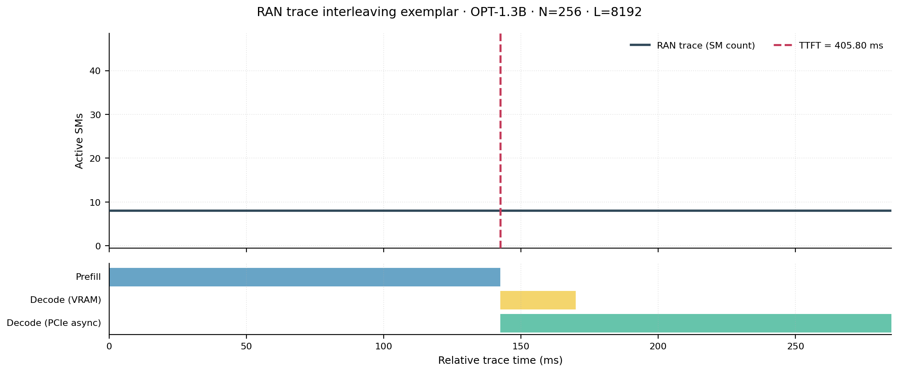
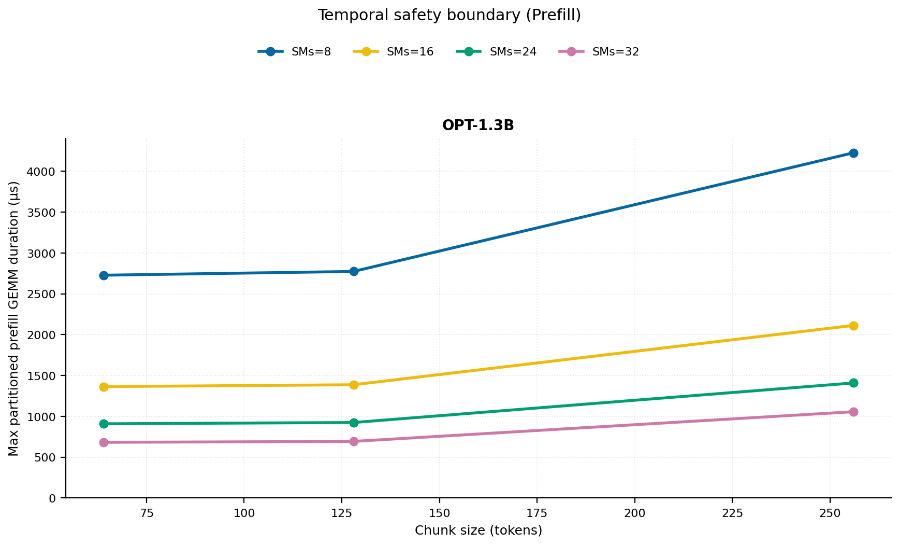
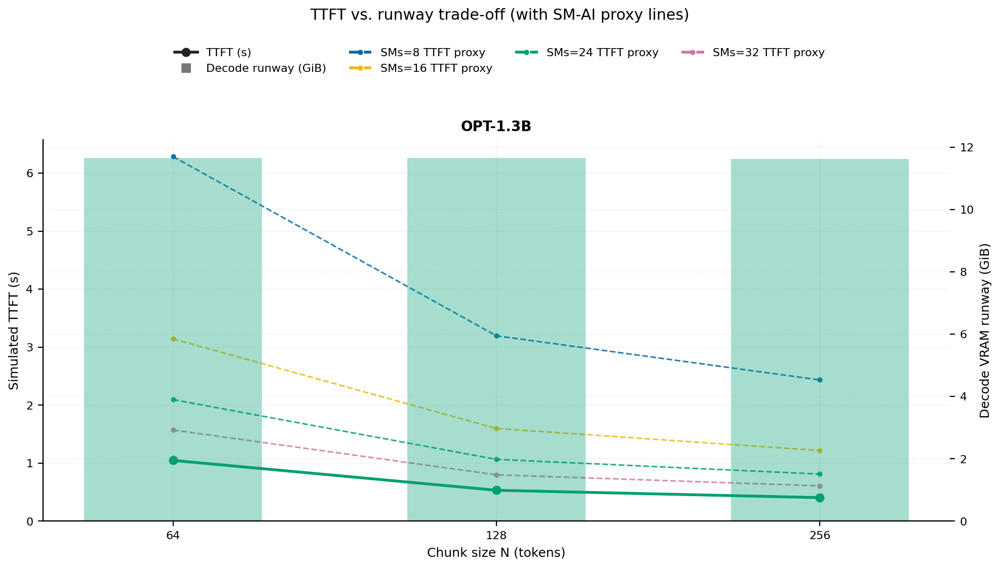
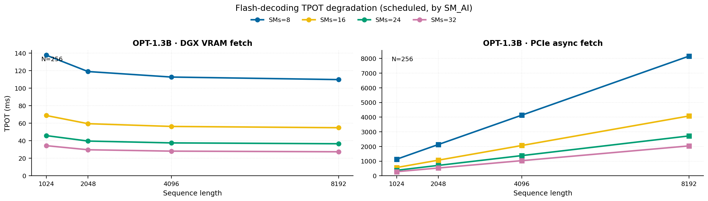
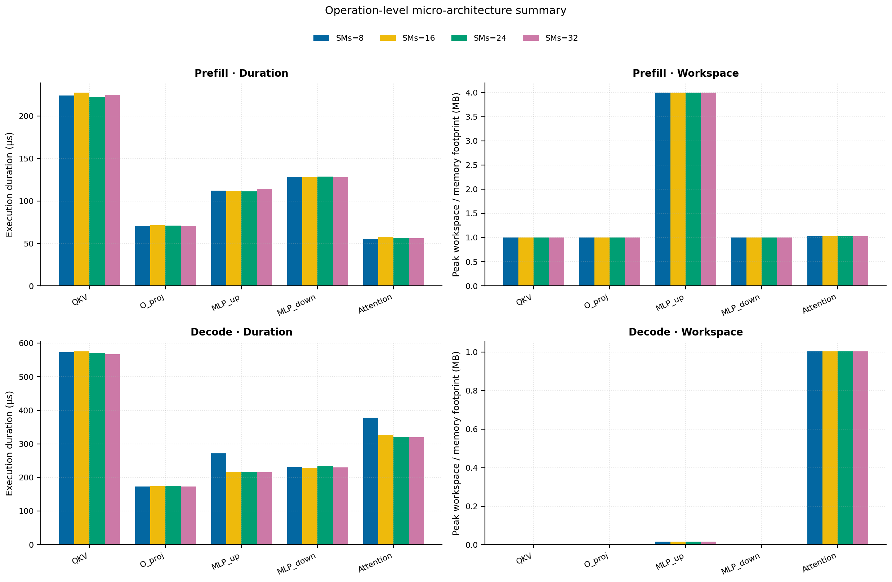
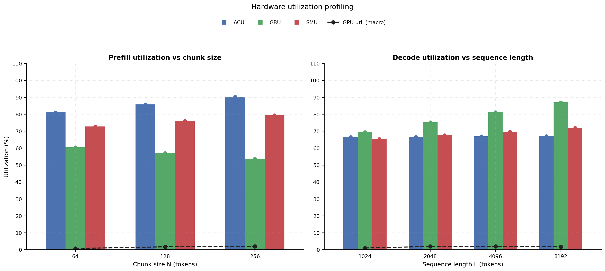
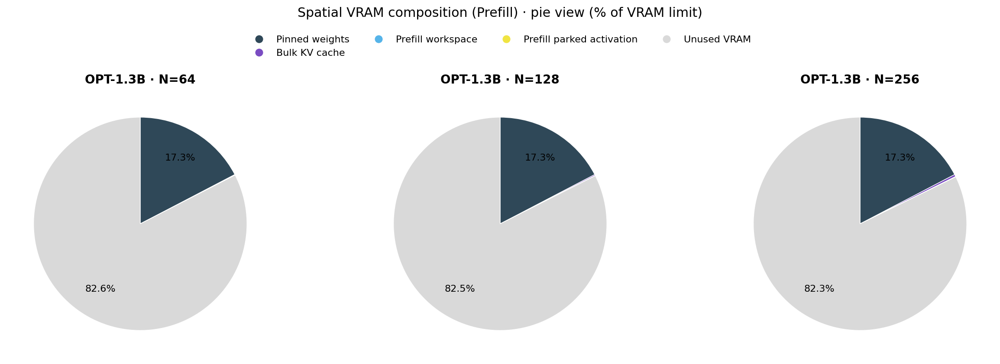

# RAN Inference Profiling Report

Run root: `/mnt/data/dheeraj/dicertation/inference-profile/runs/revised-rerun-20260415-171945-g2-opt13b-c64-256`

## Environment

| field | value |
| --- | --- |
| cache_root | n/a |
| captured_at | 2026-04-15T16:19:53Z |
| chunk_sizes | [64, 128, 256] |
| cuda_available | true |
| cuda_device_count | 8 |
| cwd | /mnt/data/dheeraj/dicertation/inference-profile |
| decode_modes | ["vram", "pcie_async"] |
| experiment_type | ran-dgxspark-v1 |
| gpu_id | 2 |
| l_out | 1024 |
| models | ["facebook/opt-1.3b"] |
| platform | Linux-6.8.0-106-generic-x86_64-with-glibc2.35 |
| python_executable | /home/dheeraj/miniconda3/envs/mls/bin/python |
| python_version | 3.11.14 |
| run_root | /mnt/data/dheeraj/dicertation/inference-profile/runs/revised-rerun-20260415-171945-g2-opt13b-c64-256 |
| scheduler | envelope_v1 |
| schema_version | ran_dgxspark_v1 |
| sequence_lengths | [1024, 2048, 4096, 8192] |
| sm_ai_cap | 32 |
| sm_ai_partition | 100 |
| sm_ai_partitions | [8, 16, 24, 32] |
| stage | profile |
| telemetry_tier | baseline_nvml_pt |
| timed_iterations | 5 |
| torch_available | true |
| torch_version | 2.10.0+cu128 |
| warmup_iterations | 3 |

## Model Constants

| model_id | sm_ai_partition | num_hidden_layers | hidden_size | num_attention_heads | ffn_dim | layer_index | layer_weight_bytes | total_weight_bytes_fp16 | vram_ceiling_bytes |
| --- | --- | --- | --- | --- | --- | --- | --- | --- | --- |
| facebook/opt-1.3b | 100 | 24 | 2048 | 32 | 8192 | 11 | 100716544 | 2631516160 | 15170115993 |

## Trace Inspection

### Primary trace

| field | value |
| --- | --- |
| errors | [] |
| header | ["frame", "slot", "time_slot_sched_ns", "time_decode_start_est_ns", "time_decode_end_est_ns", "time_decode_start_actual_ns", "time_decode_end_actual_ns", "decode_dur_us", "deadline_met", "target_sm", "profile_idx", "sm_count", "num_pusch", "sum_prb", "sum_tbs_bytes", "max_mcs"] |
| median_positive_delta_ms | 5.6997 |
| monotonicity.checked_column | time_slot_sched_ns |
| monotonicity.is_non_decreasing | true |
| monotonicity.negative_delta_count | 0 |
| monotonicity.positive_delta_count | 28377 |
| monotonicity.zero_delta_count | 0 |
| normalization.last_row_duration_policy | median_positive_forward_delta_ms |
| normalization.output_columns | ["time_ms", "sm_utilization", "slot_duration_ms", "source_schema", "sm_count"] |
| normalization.output_relative_path | derived/normalized_ldpc_trace.csv |
| normalized_row_count | 28378 |
| path | /mnt/raid0sata2/netsys/weaver-ext/ran/traces/e2e_2026030418/e2e_20260304_182034_tractor_ran_ctrl/ldpc_trace.csv |
| row_count | 28378 |
| schema_detected | schema_b |
| time_unit_hint | ns |
| usable | true |
| usage_policy | primary_only |
| used_for_scheduler_capacity | true |

### Secondary trace

| field | value |
| --- | --- |
| errors | ["ran_ctrl_trace.csv line 182958 has 9 field(s); expected 12"] |
| header | ["frame", "slot", "sm_available", "prbs_available", "prbs_allocated", "w_avg_mcs_prev", "w_avg_mcs_curr", "slots_since_underutil", "ramp_up_count", "num_ue_sched", "max_ue_backlog", "sum_ue_backlog"] |
| monotonicity.checked_column | n/a |
| monotonicity.is_non_decreasing | n/a |
| monotonicity.negative_delta_count | n/a |
| path | /mnt/raid0sata2/netsys/weaver-ext/ran/traces/e2e_2026030418/e2e_20260304_182034_tractor_ran_ctrl/ran_ctrl_trace.csv |
| row_count | 182956 |
| time_unit_hints | [] |
| usable | false |
| usage_policy | structural_only |
| used_for_scheduler_capacity | false |

## Raw-Profile Summary Tables

### Prefill profile summary

Source raw rows: `raw/prefill_events.csv` = 420. Summary artifact: `derived/prefill_summary.csv`.

| model_id | chunk_tokens | sm_ai_partition | max_input_tokens | prefill_max_gemm_us | prefill_workspace_bytes | prefill_parked_activation_bytes | telemetry_tier | telemetry_provider | telemetry_status | nvml_available | gpu_util | gpu_mem_used_mb | sm_clock_mhz | mem_clock_mhz | power_w | pt_step_ms | pt_mem_alloc_mb | pt_mem_reserved_mb | pt_workspace_mb | acu_pct | gbu_pct | smu_pct | microscopic_telemetry_status | microscopic_error |
| --- | --- | --- | --- | --- | --- | --- | --- | --- | --- | --- | --- | --- | --- | --- | --- | --- | --- | --- | --- | --- | --- | --- | --- | --- |
| facebook/opt-1.3b | 64 | 8 | 1024 | 101.376 | 1048576 | 1048576 | baseline_nvml_pt | nvidia-smi | ok | true | 0 | 117 | 1695 | 7601 | 71.89 | 0.1014 | 108.1602 | 108.1602 | 1 | 71.6572 | 69.6694 | 62.4571 | estimated | n/a |
| facebook/opt-1.3b | 64 | 16 | 1024 | 137.216 | 1048576 | 1048576 | baseline_nvml_pt | nvidia-smi | ok | true | 0 | 117 | 1695 | 8001 | 72.22 | 0.1372 | 108.1602 | 108.1602 | 1 | 78.0066 | 63.5385 | 69.3967 | estimated | n/a |
| facebook/opt-1.3b | 64 | 24 | 1024 | 98.304 | 1048576 | 1048576 | baseline_nvml_pt | nvidia-smi | ok | true | 3 | 117 | 1695 | 8001 | 72.42 | 0.0983 | 108.1602 | 108.1602 | 1 | 84.3559 | 57.4076 | 76.3364 | estimated | n/a |
| facebook/opt-1.3b | 64 | 32 | 1024 | 113.664 | 1048576 | 1048576 | baseline_nvml_pt | nvidia-smi | ok | true | 0 | 117 | 1695 | 8001 | 71.95 | 0.1137 | 108.1602 | 108.1602 | 1 | 90.7053 | 51.2767 | 83.2761 | estimated | n/a |
| facebook/opt-1.3b | 128 | 8 | 1024 | 113.472 | 2097152 | 2097152 | baseline_nvml_pt | nvidia-smi | ok | true | 0 | 117 | 1695 | 7601 | 72.32 | 0.1135 | 111.1602 | 111.1602 | 2 | 75.7465 | 65.8092 | 65.2761 | estimated | n/a |
| facebook/opt-1.3b | 128 | 16 | 1024 | 113.664 | 2097152 | 2097152 | baseline_nvml_pt | nvidia-smi | ok | true | 1 | 117 | 1695 | 7601 | 72.14 | 0.1137 | 111.1602 | 111.1602 | 2 | 82.4582 | 60.018 | 72.529 | estimated | n/a |
| facebook/opt-1.3b | 128 | 24 | 1024 | 114.688 | 2097152 | 2097152 | baseline_nvml_pt | nvidia-smi | ok | true | 6 | 117 | 1695 | 8001 | 72.38 | 0.1147 | 111.1602 | 111.1602 | 2 | 89.1699 | 54.2268 | 79.7819 | estimated | n/a |
| facebook/opt-1.3b | 128 | 32 | 1024 | 115.584 | 2097152 | 2097152 | baseline_nvml_pt | nvidia-smi | ok | true | 0 | 117 | 1695 | 7601 | 71.45 | 0.1156 | 111.1602 | 111.1602 | 2 | 95.8816 | 48.4356 | 87.0348 | estimated | n/a |
| facebook/opt-1.3b | 256 | 8 | 1024 | 182.56 | 4194304 | 4194304 | baseline_nvml_pt | nvidia-smi | ok | true | 0 | 117 | 1695 | 7601 | 72.06 | 0.1826 | 117.1602 | 117.1602 | 4 | 79.8358 | 61.949 | 68.0951 | estimated | n/a |
| facebook/opt-1.3b | 256 | 16 | 1024 | 175.104 | 4194304 | 4194304 | baseline_nvml_pt | nvidia-smi | ok | true | 7 | 117 | 1695 | 7601 | 71.86 | 0.1751 | 117.1602 | 117.1602 | 4 | 86.9099 | 56.4975 | 75.6612 | estimated | n/a |
| facebook/opt-1.3b | 256 | 24 | 1024 | 179.2 | 4194304 | 4194304 | baseline_nvml_pt | nvidia-smi | ok | true | 1 | 117 | 1695 | 8001 | 72.33 | 0.1792 | 117.1602 | 117.1602 | 4 | 93.9839 | 51.046 | 83.2274 | estimated | n/a |
| facebook/opt-1.3b | 256 | 32 | 1024 | 176.128 | 4194304 | 4194304 | baseline_nvml_pt | nvidia-smi | ok | true | 0 | 117 | 1695 | 8001 | 72.09 | 0.1761 | 117.1602 | 117.1602 | 4 | 100 | 45.5944 | 90.7935 | estimated | n/a |

### Decode profile summary

Source raw rows: `raw/decode_events.csv` = 3840. Summary artifact: `derived/decode_summary.csv`.

| model_id | sequence_length | block_size | sm_ai_partition | decode_mode | decode_max_gemv_us | attention_fetch_compute_us | reduction_overhead_us | decode_workspace_bytes | decode_parked_activation_bytes | telemetry_tier | telemetry_provider | telemetry_status | nvml_available | gpu_util | gpu_mem_used_mb | sm_clock_mhz | mem_clock_mhz | power_w | pt_step_ms | pt_mem_alloc_mb | pt_mem_reserved_mb | pt_workspace_mb | acu_pct | gbu_pct | smu_pct | microscopic_telemetry_status | microscopic_error |
| --- | --- | --- | --- | --- | --- | --- | --- | --- | --- | --- | --- | --- | --- | --- | --- | --- | --- | --- | --- | --- | --- | --- | --- | --- | --- | --- | --- |
| facebook/opt-1.3b | 1024 | 64 | 8 | pcie_async | 248.832 | 180.416 | 25.8752 | 135168 | 4096 | baseline_nvml_pt | nvidia-smi | ok | true | 0 | 117 | 1695 | 7601 | 71.18 | 0.2488 | 112.3125 | 112.3125 | 0.1289 | 58.4939 | 76.457 | 56.744 | estimated | n/a |
| facebook/opt-1.3b | 1024 | 64 | 8 | vram | 237.408 | 131.1488 | 19.0784 | 135168 | 4096 | baseline_nvml_pt | nvidia-smi | ok | true | 0 | 117 | 1695 | 8001 | 71.68 | 0.2374 | 112.3125 | 112.3125 | 0.1289 | 60.1833 | 70.6617 | 58.4986 | estimated | n/a |
| facebook/opt-1.3b | 1024 | 64 | 16 | pcie_async | 198.656 | 136.672 | 21.3376 | 135168 | 4096 | baseline_nvml_pt | nvidia-smi | ok | true | 0 | 117 | 1695 | 7601 | 71.26 | 0.1987 | 112.3125 | 112.3125 | 0.1289 | 63.1527 | 73.8206 | 61.5529 | estimated | n/a |
| facebook/opt-1.3b | 1024 | 64 | 16 | vram | 186.624 | 151.8912 | 21.7856 | 135168 | 4096 | baseline_nvml_pt | nvidia-smi | ok | true | 0 | 117 | 1695 | 7601 | 71.32 | 0.1933 | 112.3125 | 112.3125 | 0.1289 | 64.9597 | 68.3822 | 64.1598 | estimated | n/a |
| facebook/opt-1.3b | 1024 | 64 | 24 | pcie_async | 130.208 | 125.7408 | 18.976 | 135168 | 4096 | baseline_nvml_pt | nvidia-smi | ok | true | 0 | 117 | 1695 | 8001 | 71.67 | 0.1353 | 112.3125 | 112.3125 | 0.1289 | 67.8115 | 71.1841 | 66.3617 | estimated | n/a |
| facebook/opt-1.3b | 1024 | 64 | 24 | vram | 170.912 | 141.2928 | 21.1008 | 135168 | 4096 | baseline_nvml_pt | nvidia-smi | ok | true | 0 | 117 | 1695 | 7601 | 71.35 | 0.1709 | 112.3125 | 112.3125 | 0.1289 | 69.7362 | 66.1028 | 69.821 | estimated | n/a |
| facebook/opt-1.3b | 1024 | 64 | 32 | pcie_async | 186.368 | 149.8624 | 22.1312 | 135168 | 4096 | baseline_nvml_pt | nvidia-smi | ok | true | 0 | 117 | 1695 | 7601 | 71.58 | 0.2058 | 112.3125 | 112.3125 | 0.1289 | 72.4703 | 68.5477 | 71.1705 | estimated | n/a |
| facebook/opt-1.3b | 1024 | 64 | 32 | vram | 165.888 | 128.0832 | 19.6224 | 135168 | 4096 | baseline_nvml_pt | nvidia-smi | ok | true | 0 | 117 | 1695 | 7601 | 71.39 | 0.1659 | 112.3125 | 112.3125 | 0.1289 | 74.5126 | 63.8234 | 75.4821 | estimated | n/a |
| facebook/opt-1.3b | 1024 | 128 | 8 | pcie_async | 167.936 | 127.0336 | 19.904 | 135168 | 4096 | baseline_nvml_pt | nvidia-smi | ok | true | 0 | 117 | 1695 | 7601 | 71.07 | 0.1679 | 112.3125 | 112.3125 | 0.1289 | 58.4939 | 76.022 | 56.744 | estimated | n/a |
| facebook/opt-1.3b | 1024 | 128 | 8 | vram | 164.864 | 131.8912 | 19.6288 | 135168 | 4096 | baseline_nvml_pt | nvidia-smi | ok | true | 0 | 117 | 1695 | 7601 | 71.85 | 0.1649 | 112.3125 | 112.3125 | 0.1289 | 60.4983 | 70.2742 | 58.4986 | estimated | n/a |
| facebook/opt-1.3b | 1024 | 128 | 16 | pcie_async | 149.472 | 126.24 | 20.1088 | 135168 | 4096 | baseline_nvml_pt | nvidia-smi | ok | true | 1 | 117 | 1695 | 7601 | 71.67 | 0.1495 | 112.3125 | 112.3125 | 0.1289 | 63.1527 | 73.4006 | 61.5529 | estimated | n/a |
| facebook/opt-1.3b | 1024 | 128 | 16 | vram | 167.936 | 170.848 | 22.9056 | 135168 | 4096 | baseline_nvml_pt | nvidia-smi | ok | true | 0 | 117 | 1695 | 8001 | 71.49 | 0.2682 | 112.3125 | 112.3125 | 0.1289 | 65.2997 | 68.0072 | 64.1598 | estimated | n/a |
| facebook/opt-1.3b | 1024 | 128 | 24 | pcie_async | 157.696 | 126.7456 | 20.9088 | 135168 | 4096 | baseline_nvml_pt | nvidia-smi | ok | true | 0 | 117 | 1695 | 7601 | 71.31 | 0.1577 | 112.3125 | 112.3125 | 0.1289 | 67.8115 | 70.7791 | 66.3617 | estimated | n/a |
| facebook/opt-1.3b | 1024 | 128 | 24 | vram | 175.104 | 165.6896 | 22.1184 | 135168 | 4096 | baseline_nvml_pt | nvidia-smi | ok | true | 5 | 117 | 1695 | 7601 | 71.19 | 0.2611 | 112.3125 | 112.3125 | 0.1289 | 70.1012 | 65.7403 | 69.821 | estimated | n/a |
| facebook/opt-1.3b | 1024 | 128 | 32 | pcie_async | 156.96 | 135.8208 | 21.824 | 135168 | 4096 | baseline_nvml_pt | nvidia-smi | ok | true | 1 | 117 | 1695 | 7601 | 71.68 | 0.1845 | 112.3125 | 112.3125 | 0.1289 | 72.4703 | 68.1577 | 71.1705 | estimated | n/a |
| facebook/opt-1.3b | 1024 | 128 | 32 | vram | 158.72 | 126.4128 | 20.6848 | 135168 | 4096 | baseline_nvml_pt | nvidia-smi | ok | true | 4 | 117 | 1695 | 7601 | 70.99 | 0.1587 | 112.3125 | 112.3125 | 0.1289 | 74.9026 | 63.4734 | 75.4821 | estimated | n/a |
| facebook/opt-1.3b | 1024 | 256 | 8 | pcie_async | 158.72 | 122.4064 | 18.8992 | 135168 | 4096 | baseline_nvml_pt | nvidia-smi | ok | true | 0 | 117 | 1695 | 7601 | 71.25 | 0.1587 | 112.3125 | 112.3125 | 0.1289 | 58.4939 | 75.587 | 56.744 | estimated | n/a |
| facebook/opt-1.3b | 1024 | 256 | 8 | vram | 168.928 | 129.8624 | 19.8848 | 135168 | 4096 | baseline_nvml_pt | nvidia-smi | ok | true | 7 | 117 | 1695 | 8001 | 71.71 | 0.1689 | 112.3125 | 112.3125 | 0.1289 | 60.8133 | 69.8867 | 58.4986 | estimated | n/a |
| facebook/opt-1.3b | 1024 | 256 | 16 | pcie_async | 167.872 | 127.8656 | 20.096 | 135168 | 4096 | baseline_nvml_pt | nvidia-smi | ok | true | 5 | 117 | 1695 | 7601 | 71.19 | 0.1679 | 112.3125 | 112.3125 | 0.1289 | 63.1527 | 72.9806 | 61.5529 | estimated | n/a |
| facebook/opt-1.3b | 1024 | 256 | 16 | vram | 176.128 | 126.1312 | 19.4688 | 135168 | 4096 | baseline_nvml_pt | nvidia-smi | ok | true | 0 | 117 | 1695 | 7601 | 71.46 | 0.1761 | 112.3125 | 112.3125 | 0.1289 | 65.6397 | 67.6322 | 64.1598 | estimated | n/a |
| facebook/opt-1.3b | 1024 | 256 | 24 | pcie_async | 158.72 | 128.0064 | 19.6928 | 135168 | 4096 | baseline_nvml_pt | nvidia-smi | ok | true | 1 | 117 | 1695 | 7601 | 71.54 | 0.1587 | 112.3125 | 112.3125 | 0.1289 | 67.8115 | 70.3741 | 66.3617 | estimated | n/a |
| facebook/opt-1.3b | 1024 | 256 | 24 | vram | 183.296 | 131.8912 | 20.6848 | 135168 | 4096 | baseline_nvml_pt | nvidia-smi | ok | true | 0 | 117 | 1695 | 7601 | 70.93 | 0.1833 | 112.3125 | 112.3125 | 0.1289 | 70.4662 | 65.3778 | 69.821 | estimated | n/a |
| facebook/opt-1.3b | 1024 | 256 | 32 | pcie_async | 187.232 | 125.7216 | 19.2832 | 135168 | 4096 | baseline_nvml_pt | nvidia-smi | ok | true | 1 | 117 | 1695 | 7601 | 71.44 | 0.1872 | 112.3125 | 112.3125 | 0.1289 | 72.4703 | 67.7677 | 71.1705 | estimated | n/a |
| facebook/opt-1.3b | 1024 | 256 | 32 | vram | 212 | 141.312 | 21.3056 | 135168 | 4096 | baseline_nvml_pt | nvidia-smi | ok | true | 0 | 117 | 1695 | 8001 | 71.84 | 0.212 | 112.3125 | 112.3125 | 0.1289 | 75.2926 | 63.1234 | 75.4821 | estimated | n/a |
| facebook/opt-1.3b | 2048 | 64 | 8 | pcie_async | 183.296 | 124.5184 | 19.8272 | 266240 | 4096 | baseline_nvml_pt | nvidia-smi | ok | true | 7 | 117 | 1695 | 8001 | 71.72 | 0.1833 | 120.4375 | 120.4375 | 0.2539 | 57.2975 | 83.1438 | 57.9934 | estimated | n/a |
| facebook/opt-1.3b | 2048 | 64 | 8 | vram | 161.792 | 123.04 | 19.4368 | 266240 | 4096 | baseline_nvml_pt | nvidia-smi | ok | true | 1 | 117 | 1695 | 7601 | 71.23 | 0.1618 | 120.4375 | 120.4375 | 0.2539 | 61.5173 | 74.9772 | 60.6382 | estimated | n/a |
| facebook/opt-1.3b | 2048 | 64 | 16 | pcie_async | 152.416 | 128.8832 | 19.7056 | 266240 | 4096 | baseline_nvml_pt | nvidia-smi | ok | true | 0 | 117 | 1695 | 7601 | 71.97 | 0.1597 | 120.4375 | 120.4375 | 0.2539 | 61.861 | 80.2768 | 62.9081 | estimated | n/a |
| facebook/opt-1.3b | 2048 | 64 | 16 | vram | 158.72 | 126.4448 | 19.68 | 266240 | 4096 | baseline_nvml_pt | nvidia-smi | ok | true | 0 | 117 | 1695 | 7601 | 71.39 | 0.1587 | 120.4375 | 120.4375 | 0.2539 | 66.3996 | 72.5586 | 66.5064 | estimated | n/a |
| facebook/opt-1.3b | 2048 | 64 | 24 | pcie_async | 184.448 | 126.3872 | 18.9056 | 266240 | 4096 | baseline_nvml_pt | nvidia-smi | ok | true | 0 | 117 | 1695 | 7601 | 71.43 | 0.1844 | 120.4375 | 120.4375 | 0.2539 | 66.4245 | 77.4098 | 67.8228 | estimated | n/a |
| facebook/opt-1.3b | 2048 | 64 | 24 | vram | 297.984 | 128.7168 | 19.0784 | 266240 | 4096 | baseline_nvml_pt | nvidia-smi | ok | true | 0 | 117 | 1695 | 8001 | 71.46 | 0.298 | 120.4375 | 120.4375 | 0.2539 | 71.282 | 70.14 | 72.3746 | estimated | n/a |
| facebook/opt-1.3b | 2048 | 64 | 32 | pcie_async | 164.096 | 132.5568 | 20.288 | 266240 | 4096 | baseline_nvml_pt | nvidia-smi | ok | true | 0 | 117 | 1695 | 7601 | 70.95 | 0.1641 | 120.4375 | 120.4375 | 0.2539 | 70.988 | 74.5428 | 72.7375 | estimated | n/a |
| facebook/opt-1.3b | 2048 | 64 | 32 | vram | 156.672 | 124.9344 | 18.5088 | 266240 | 4096 | baseline_nvml_pt | nvidia-smi | ok | true | 5 | 117 | 1695 | 7601 | 71.03 | 0.1567 | 120.4375 | 120.4375 | 0.2539 | 76.1643 | 67.7213 | 78.2428 | estimated | n/a |
| facebook/opt-1.3b | 2048 | 128 | 8 | pcie_async | 167.776 | 136.0128 | 20.0128 | 266240 | 4096 | baseline_nvml_pt | nvidia-smi | ok | true | 0 | 117 | 1695 | 8001 | 71.46 | 0.172 | 120.4375 | 120.4375 | 0.2539 | 57.2975 | 83.5788 | 58.1901 | estimated | n/a |
| facebook/opt-1.3b | 2048 | 128 | 8 | vram | 150.496 | 124.2688 | 20.0576 | 266240 | 4096 | baseline_nvml_pt | nvidia-smi | ok | true | 1 | 117 | 1695 | 7601 | 71.42 | 0.1505 | 120.4375 | 120.4375 | 0.2539 | 62.0423 | 75.1064 | 60.8449 | estimated | n/a |
| facebook/opt-1.3b | 2048 | 128 | 16 | pcie_async | 143.232 | 124.896 | 19.872 | 266240 | 4096 | baseline_nvml_pt | nvidia-smi | ok | true | 1 | 117 | 1695 | 7601 | 71.58 | 0.1432 | 120.4375 | 120.4375 | 0.2539 | 61.861 | 80.6968 | 63.1214 | estimated | n/a |
| facebook/opt-1.3b | 2048 | 128 | 16 | vram | 168.704 | 126.3552 | 19.456 | 266240 | 4096 | baseline_nvml_pt | nvidia-smi | ok | true | 10 | 117 | 1695 | 7601 | 71.11 | 0.1687 | 120.4375 | 120.4375 | 0.2539 | 66.9663 | 72.6836 | 66.7331 | estimated | n/a |
| facebook/opt-1.3b | 2048 | 128 | 24 | pcie_async | 160.768 | 133.5232 | 19.5072 | 266240 | 4096 | baseline_nvml_pt | nvidia-smi | ok | true | 0 | 117 | 1695 | 7601 | 71.2 | 0.1608 | 120.4375 | 120.4375 | 0.2539 | 66.4245 | 77.8148 | 68.0528 | estimated | n/a |
| facebook/opt-1.3b | 2048 | 128 | 24 | vram | 127.872 | 126.8288 | 19.8528 | 266240 | 4096 | baseline_nvml_pt | nvidia-smi | ok | true | 1 | 117 | 1695 | 7601 | 71.34 | 0.1341 | 120.4375 | 120.4375 | 0.2539 | 71.8903 | 70.2608 | 72.6213 | estimated | n/a |
| facebook/opt-1.3b | 2048 | 128 | 32 | pcie_async | 163.84 | 124.5184 | 19.072 | 266240 | 4096 | baseline_nvml_pt | nvidia-smi | ok | true | 0 | 117 | 1695 | 7601 | 71.11 | 0.1638 | 120.4375 | 120.4375 | 0.2539 | 70.988 | 74.9328 | 72.9841 | estimated | n/a |
| facebook/opt-1.3b | 2048 | 128 | 32 | vram | 161.792 | 128 | 19.9936 | 266240 | 4096 | baseline_nvml_pt | nvidia-smi | ok | true | 0 | 117 | 1695 | 8001 | 71.42 | 0.1618 | 120.4375 | 120.4375 | 0.2539 | 76.8143 | 67.838 | 78.5095 | estimated | n/a |
| facebook/opt-1.3b | 2048 | 256 | 8 | pcie_async | 196.544 | 127.9744 | 18.72 | 266240 | 4096 | baseline_nvml_pt | nvidia-smi | ok | true | 11 | 117 | 1695 | 7601 | 71.4 | 0.1965 | 120.4375 | 120.4375 | 0.2539 | 57.2975 | 84.0138 | 58.3867 | estimated | n/a |
| facebook/opt-1.3b | 2048 | 256 | 8 | vram | 243.712 | 223.5968 | 26.1824 | 266240 | 4096 | baseline_nvml_pt | nvidia-smi | ok | true | 0 | 117 | 1695 | 7601 | 71.16 | 0.4524 | 120.4375 | 120.4375 | 0.2539 | 62.5673 | 75.2355 | 61.0515 | estimated | n/a |
| facebook/opt-1.3b | 2048 | 256 | 16 | pcie_async | 160.768 | 123.0592 | 19.0976 | 266240 | 4096 | baseline_nvml_pt | nvidia-smi | ok | true | 0 | 117 | 1695 | 8001 | 71.96 | 0.1608 | 120.4375 | 120.4375 | 0.2539 | 61.861 | 81.1168 | 63.3348 | estimated | n/a |
| facebook/opt-1.3b | 2048 | 256 | 16 | vram | 571.648 | 186.7776 | 26.4128 | 266240 | 4096 | baseline_nvml_pt | nvidia-smi | ok | true | 0 | 117 | 1695 | 7601 | 71.54 | 0.5716 | 120.4375 | 120.4375 | 0.2539 | 67.533 | 72.8086 | 66.9597 | estimated | n/a |
| facebook/opt-1.3b | 2048 | 256 | 24 | pcie_async | 187.392 | 127.1104 | 20.2752 | 266240 | 4096 | baseline_nvml_pt | nvidia-smi | ok | true | 0 | 117 | 1695 | 7601 | 71.36 | 0.1874 | 120.4375 | 120.4375 | 0.2539 | 66.4245 | 78.2198 | 68.2828 | estimated | n/a |
| facebook/opt-1.3b | 2048 | 256 | 24 | vram | 156.672 | 133.1712 | 20.3968 | 266240 | 4096 | baseline_nvml_pt | nvidia-smi | ok | true | 0 | 117 | 1695 | 7601 | 71.13 | 0.1567 | 120.4375 | 120.4375 | 0.2539 | 72.4986 | 70.3816 | 72.868 | estimated | n/a |
| facebook/opt-1.3b | 2048 | 256 | 32 | pcie_async | 179.2 | 131.0144 | 20.0832 | 266240 | 4096 | baseline_nvml_pt | nvidia-smi | ok | true | 0 | 117 | 1695 | 7601 | 71.01 | 0.1792 | 120.4375 | 120.4375 | 0.2539 | 70.988 | 75.3228 | 73.2308 | estimated | n/a |
| facebook/opt-1.3b | 2048 | 256 | 32 | vram | 180.224 | 138.1888 | 20.4672 | 266240 | 4096 | baseline_nvml_pt | nvidia-smi | ok | true | 10 | 117 | 1695 | 7601 | 70.75 | 0.1802 | 120.4375 | 120.4375 | 0.2539 | 77.4643 | 67.9547 | 78.7762 | estimated | n/a |
| facebook/opt-1.3b | 4096 | 64 | 8 | pcie_async | 131.264 | 132.4352 | 19.872 | 528384 | 4096 | baseline_nvml_pt | nvidia-smi | ok | true | 0 | 117 | 1695 | 8001 | 71.42 | 0.1393 | 136.6875 | 136.6875 | 0.5039 | 56.101 | 89.8307 | 59.2427 | estimated | n/a |
| facebook/opt-1.3b | 4096 | 64 | 8 | vram | 121.856 | 129.7792 | 20.4224 | 528384 | 4096 | baseline_nvml_pt | nvidia-smi | ok | true | 0 | 117 | 1695 | 7601 | 71.44 | 0.1371 | 136.6875 | 136.6875 | 0.5039 | 62.8514 | 79.2927 | 62.7777 | estimated | n/a |
| facebook/opt-1.3b | 4096 | 64 | 16 | pcie_async | 136.224 | 132.096 | 19.2768 | 528384 | 4096 | baseline_nvml_pt | nvidia-smi | ok | true | 0 | 117 | 1695 | 7601 | 71.35 | 0.1464 | 136.6875 | 136.6875 | 0.5039 | 60.5693 | 86.733 | 64.2633 | estimated | n/a |
| facebook/opt-1.3b | 4096 | 64 | 16 | vram | 169.088 | 138.208 | 20.6784 | 528384 | 4096 | baseline_nvml_pt | nvidia-smi | ok | true | 0 | 117 | 1695 | 7601 | 70.88 | 0.1691 | 136.6875 | 136.6875 | 0.5039 | 67.8396 | 76.7349 | 68.853 | estimated | n/a |
| facebook/opt-1.3b | 4096 | 64 | 24 | pcie_async | 151.552 | 130.2208 | 19.6864 | 528384 | 4096 | baseline_nvml_pt | nvidia-smi | ok | true | 0 | 117 | 1695 | 7601 | 71.49 | 0.1516 | 136.6875 | 136.6875 | 0.5039 | 65.0375 | 83.6354 | 69.2839 | estimated | n/a |
| facebook/opt-1.3b | 4096 | 64 | 24 | vram | 204.8 | 139.8784 | 20.5632 | 528384 | 4096 | baseline_nvml_pt | nvidia-smi | ok | true | 0 | 117 | 1695 | 7601 | 71.15 | 0.2048 | 136.6875 | 136.6875 | 0.5039 | 72.8278 | 74.1771 | 74.9283 | estimated | n/a |
| facebook/opt-1.3b | 4096 | 64 | 32 | pcie_async | 178.944 | 141.9136 | 20.0512 | 528384 | 4096 | baseline_nvml_pt | nvidia-smi | ok | true | 0 | 117 | 1695 | 7601 | 71.11 | 0.1789 | 136.6875 | 136.6875 | 0.5039 | 69.5057 | 80.5378 | 74.3045 | estimated | n/a |
| facebook/opt-1.3b | 4096 | 64 | 32 | vram | 156.672 | 132.2496 | 19.8336 | 528384 | 4096 | baseline_nvml_pt | nvidia-smi | ok | true | 8 | 117 | 1695 | 8001 | 71.28 | 0.1567 | 136.6875 | 136.6875 | 0.5039 | 77.816 | 71.6192 | 81.0035 | estimated | n/a |
| facebook/opt-1.3b | 4096 | 128 | 8 | pcie_async | 172.192 | 134.944 | 20.1024 | 528384 | 4096 | baseline_nvml_pt | nvidia-smi | ok | true | 0 | 117 | 1695 | 7601 | 71.02 | 0.1722 | 136.6875 | 136.6875 | 0.5039 | 56.101 | 91.1357 | 59.6361 | estimated | n/a |
| facebook/opt-1.3b | 4096 | 128 | 8 | vram | 143.2 | 129.9648 | 19.6992 | 528384 | 4096 | baseline_nvml_pt | nvidia-smi | ok | true | 0 | 117 | 1695 | 7601 | 71.36 | 0.1432 | 136.6875 | 136.6875 | 0.5039 | 63.5864 | 79.9386 | 63.1911 | estimated | n/a |
| facebook/opt-1.3b | 4096 | 128 | 16 | pcie_async | 119.68 | 129.3824 | 19.4624 | 528384 | 4096 | baseline_nvml_pt | nvidia-smi | ok | true | 0 | 117 | 1695 | 8001 | 71.87 | 0.139 | 136.6875 | 136.6875 | 0.5039 | 60.5693 | 87.993 | 64.69 | estimated | n/a |
| facebook/opt-1.3b | 4096 | 128 | 16 | vram | 140.576 | 127.2128 | 19.04 | 528384 | 4096 | baseline_nvml_pt | nvidia-smi | ok | true | 0 | 117 | 1695 | 8001 | 71.82 | 0.1406 | 136.6875 | 136.6875 | 0.5039 | 68.6329 | 77.3599 | 69.3063 | estimated | n/a |
| facebook/opt-1.3b | 4096 | 128 | 24 | pcie_async | 156.672 | 135.7312 | 20.9088 | 528384 | 4096 | baseline_nvml_pt | nvidia-smi | ok | true | 8 | 117 | 1695 | 8001 | 71.66 | 0.1567 | 136.6875 | 136.6875 | 0.5039 | 65.0375 | 84.8504 | 69.7439 | estimated | n/a |
| facebook/opt-1.3b | 4096 | 128 | 24 | vram | 133.12 | 132.8832 | 19.68 | 528384 | 4096 | baseline_nvml_pt | nvidia-smi | ok | true | 0 | 117 | 1695 | 8001 | 71.63 | 0.1403 | 136.6875 | 136.6875 | 0.5039 | 73.6795 | 74.7812 | 75.4216 | estimated | n/a |
| facebook/opt-1.3b | 4096 | 128 | 32 | pcie_async | 134.144 | 135.5648 | 20.256 | 528384 | 4096 | baseline_nvml_pt | nvidia-smi | ok | true | 11 | 117 | 1695 | 7601 | 71.21 | 0.1607 | 136.6875 | 136.6875 | 0.5039 | 69.5057 | 81.7078 | 74.7978 | estimated | n/a |
| facebook/opt-1.3b | 4096 | 128 | 32 | vram | 193.536 | 143.4752 | 21.2992 | 528384 | 4096 | baseline_nvml_pt | nvidia-smi | ok | true | 0 | 117 | 1695 | 8001 | 71.39 | 0.1935 | 136.6875 | 136.6875 | 0.5039 | 78.726 | 72.2026 | 81.5369 | estimated | n/a |
| facebook/opt-1.3b | 4096 | 256 | 8 | pcie_async | 3241.9839 | 741.3632 | 20.5184 | 528384 | 4096 | baseline_nvml_pt | nvidia-smi | ok | true | 0 | 117 | 1695 | 7601 | 71.56 | 3.242 | 136.6875 | 136.6875 | 0.5039 | 56.101 | 92.4407 | 60.0294 | estimated | n/a |
| facebook/opt-1.3b | 4096 | 256 | 8 | vram | 171.008 | 131.6736 | 20.0768 | 528384 | 4096 | baseline_nvml_pt | nvidia-smi | ok | true | 0 | 117 | 1695 | 7601 | 71.33 | 0.171 | 136.6875 | 136.6875 | 0.5039 | 64.3214 | 80.5844 | 63.6044 | estimated | n/a |
| facebook/opt-1.3b | 4096 | 256 | 16 | pcie_async | 214.016 | 138.6304 | 20.8384 | 528384 | 4096 | baseline_nvml_pt | nvidia-smi | ok | true | 0 | 117 | 1695 | 7601 | 71.22 | 0.214 | 136.6875 | 136.6875 | 0.5039 | 60.5693 | 89.253 | 65.1167 | estimated | n/a |
| facebook/opt-1.3b | 4096 | 256 | 16 | vram | 169.76 | 134.9056 | 20.9152 | 528384 | 4096 | baseline_nvml_pt | nvidia-smi | ok | true | 12 | 117 | 1695 | 7601 | 71.13 | 0.1698 | 136.6875 | 136.6875 | 0.5039 | 69.4262 | 77.9849 | 69.7597 | estimated | n/a |
| facebook/opt-1.3b | 4096 | 256 | 24 | pcie_async | 166.912 | 128.6656 | 19.6416 | 528384 | 4096 | baseline_nvml_pt | nvidia-smi | ok | true | 0 | 117 | 1695 | 7601 | 71.41 | 0.1669 | 136.6875 | 136.6875 | 0.5039 | 65.0375 | 86.0654 | 70.2039 | estimated | n/a |
| facebook/opt-1.3b | 4096 | 256 | 24 | vram | 159.904 | 128.4992 | 19.1104 | 528384 | 4096 | baseline_nvml_pt | nvidia-smi | ok | true | 0 | 117 | 1695 | 7601 | 70.99 | 0.1599 | 136.6875 | 136.6875 | 0.5039 | 74.5311 | 75.3854 | 75.9149 | estimated | n/a |
| facebook/opt-1.3b | 4096 | 256 | 32 | pcie_async | 155.456 | 133.7728 | 19.6992 | 528384 | 4096 | baseline_nvml_pt | nvidia-smi | ok | true | 7 | 117 | 1695 | 7601 | 71.02 | 0.1555 | 136.6875 | 136.6875 | 0.5039 | 69.5057 | 82.8778 | 75.2911 | estimated | n/a |
| facebook/opt-1.3b | 4096 | 256 | 32 | vram | 171.008 | 128.768 | 19.6096 | 528384 | 4096 | baseline_nvml_pt | nvidia-smi | ok | true | 2 | 117 | 1695 | 7601 | 71.06 | 0.171 | 136.6875 | 136.6875 | 0.5039 | 79.636 | 72.7859 | 82.0702 | estimated | n/a |
| facebook/opt-1.3b | 8192 | 64 | 8 | pcie_async | 155.648 | 162.144 | 19.2256 | 1052672 | 4096 | baseline_nvml_pt | nvidia-smi | ok | true | 0 | 117 | 1695 | 7601 | 70.85 | 0.17 | 169.1875 | 169.1875 | 1.0039 | 54.9046 | 96.5175 | 60.4921 | estimated | n/a |
| facebook/opt-1.3b | 8192 | 64 | 8 | vram | 147.456 | 158.8416 | 19.488 | 1052672 | 4096 | baseline_nvml_pt | nvidia-smi | ok | true | 5 | 117 | 1695 | 7601 | 71.04 | 0.1608 | 169.1875 | 169.1875 | 1.0039 | 64.1854 | 83.6083 | 64.9173 | estimated | n/a |
| facebook/opt-1.3b | 8192 | 64 | 16 | pcie_async | 152.544 | 160.8 | 19.36 | 1052672 | 4096 | baseline_nvml_pt | nvidia-smi | ok | true | 2 | 117 | 1695 | 7601 | 71.18 | 0.169 | 169.1875 | 169.1875 | 1.0039 | 59.2776 | 93.1893 | 65.6186 | estimated | n/a |
| facebook/opt-1.3b | 8192 | 64 | 16 | vram | 168.96 | 167.6928 | 20.064 | 1052672 | 4096 | baseline_nvml_pt | nvidia-smi | ok | true | 0 | 117 | 1695 | 7601 | 70.89 | 0.1852 | 169.1875 | 169.1875 | 1.0039 | 69.2795 | 80.9112 | 71.1996 | estimated | n/a |
| facebook/opt-1.3b | 8192 | 64 | 24 | pcie_async | 343.04 | 170.1376 | 19.936 | 1052672 | 4096 | baseline_nvml_pt | nvidia-smi | ok | true | 13 | 117 | 1695 | 7601 | 70.73 | 0.343 | 169.1875 | 169.1875 | 1.0039 | 63.6505 | 89.8611 | 70.745 | estimated | n/a |
| facebook/opt-1.3b | 8192 | 64 | 24 | vram | 143.328 | 161.3696 | 19.8912 | 1052672 | 4096 | baseline_nvml_pt | nvidia-smi | ok | true | 7 | 117 | 1695 | 7601 | 70.72 | 0.1649 | 169.1875 | 169.1875 | 1.0039 | 74.3736 | 78.2142 | 77.4819 | estimated | n/a |
| facebook/opt-1.3b | 8192 | 64 | 32 | pcie_async | 147.712 | 159.8848 | 19.6096 | 1052672 | 4096 | baseline_nvml_pt | nvidia-smi | ok | true | 0 | 117 | 1695 | 7601 | 71.09 | 0.1649 | 169.1875 | 169.1875 | 1.0039 | 68.0234 | 86.5329 | 75.8715 | estimated | n/a |
| facebook/opt-1.3b | 8192 | 64 | 32 | vram | 170.912 | 159.6736 | 20.0448 | 1052672 | 4096 | baseline_nvml_pt | nvidia-smi | ok | true | 3 | 117 | 1695 | 7601 | 70.59 | 0.1709 | 169.1875 | 169.1875 | 1.0039 | 79.4677 | 75.5172 | 83.7643 | estimated | n/a |
| facebook/opt-1.3b | 8192 | 128 | 8 | pcie_async | 158.72 | 162.3424 | 20.8576 | 1052672 | 4096 | baseline_nvml_pt | nvidia-smi | ok | true | 6 | 117 | 1695 | 7601 | 70.93 | 0.1688 | 169.1875 | 169.1875 | 1.0039 | 54.9046 | 98.6925 | 61.0821 | estimated | n/a |
| facebook/opt-1.3b | 8192 | 128 | 8 | vram | 154.624 | 166.912 | 20.0384 | 1052672 | 4096 | baseline_nvml_pt | nvidia-smi | ok | true | 0 | 117 | 1695 | 7601 | 71.07 | 0.1976 | 169.1875 | 169.1875 | 1.0039 | 65.1304 | 84.7708 | 65.5373 | estimated | n/a |
| facebook/opt-1.3b | 8192 | 128 | 16 | pcie_async | 208.896 | 161.3312 | 19.8784 | 1052672 | 4096 | baseline_nvml_pt | nvidia-smi | ok | true | 0 | 117 | 1695 | 7601 | 71.46 | 0.2089 | 169.1875 | 169.1875 | 1.0039 | 59.2776 | 95.2893 | 66.2586 | estimated | n/a |
| facebook/opt-1.3b | 8192 | 128 | 16 | vram | 130.912 | 158.9056 | 19.0656 | 1052672 | 4096 | baseline_nvml_pt | nvidia-smi | ok | true | 0 | 117 | 1695 | 8001 | 71.05 | 0.1649 | 169.1875 | 169.1875 | 1.0039 | 70.2995 | 82.0362 | 71.8796 | estimated | n/a |
| facebook/opt-1.3b | 8192 | 128 | 24 | pcie_async | 134.144 | 165.4144 | 18.08 | 1052672 | 4096 | baseline_nvml_pt | nvidia-smi | ok | true | 0 | 117 | 1695 | 7601 | 70.89 | 0.1812 | 169.1875 | 169.1875 | 1.0039 | 63.6505 | 91.8861 | 71.435 | estimated | n/a |
| facebook/opt-1.3b | 8192 | 128 | 24 | vram | 191.488 | 166.2656 | 21.2928 | 1052672 | 4096 | baseline_nvml_pt | nvidia-smi | ok | true | 1 | 117 | 1695 | 7601 | 71.11 | 0.1915 | 169.1875 | 169.1875 | 1.0039 | 75.4686 | 79.3017 | 78.2219 | estimated | n/a |
| facebook/opt-1.3b | 8192 | 128 | 32 | pcie_async | 124.832 | 162.9952 | 19.6288 | 1052672 | 4096 | baseline_nvml_pt | nvidia-smi | ok | true | 0 | 117 | 1695 | 7601 | 71.01 | 0.171 | 169.1875 | 169.1875 | 1.0039 | 68.0234 | 88.4829 | 76.6115 | estimated | n/a |
| facebook/opt-1.3b | 8192 | 128 | 32 | vram | 129.024 | 161.3824 | 18.8032 | 1052672 | 4096 | baseline_nvml_pt | nvidia-smi | ok | true | 0 | 117 | 1695 | 7601 | 70.66 | 0.171 | 169.1875 | 169.1875 | 1.0039 | 80.6377 | 76.5672 | 84.5643 | estimated | n/a |
| facebook/opt-1.3b | 8192 | 256 | 8 | pcie_async | 155.648 | 159.168 | 18.4192 | 1052672 | 4096 | baseline_nvml_pt | nvidia-smi | ok | true | 0 | 117 | 1695 | 7601 | 70.92 | 0.1661 | 169.1875 | 169.1875 | 1.0039 | 54.9046 | 100 | 61.6721 | estimated | n/a |
| facebook/opt-1.3b | 8192 | 256 | 8 | vram | 156.672 | 159.328 | 19.0784 | 1052672 | 4096 | baseline_nvml_pt | nvidia-smi | ok | true | 0 | 117 | 1695 | 7601 | 70.97 | 0.1628 | 169.1875 | 169.1875 | 1.0039 | 66.0754 | 85.9333 | 66.1573 | estimated | n/a |
| facebook/opt-1.3b | 8192 | 256 | 16 | pcie_async | 150.528 | 160.736 | 18.4576 | 1052672 | 4096 | baseline_nvml_pt | nvidia-smi | ok | true | 0 | 117 | 1695 | 7601 | 70.98 | 0.1699 | 169.1875 | 169.1875 | 1.0039 | 59.2776 | 97.3893 | 66.8986 | estimated | n/a |
| facebook/opt-1.3b | 8192 | 256 | 16 | vram | 165.888 | 160.8064 | 20 | 1052672 | 4096 | baseline_nvml_pt | nvidia-smi | ok | true | 0 | 117 | 1695 | 7601 | 71.08 | 0.169 | 169.1875 | 169.1875 | 1.0039 | 71.3195 | 83.1612 | 72.5596 | estimated | n/a |
| facebook/opt-1.3b | 8192 | 256 | 24 | pcie_async | 171.008 | 166.0544 | 19.7184 | 1052672 | 4096 | baseline_nvml_pt | nvidia-smi | ok | true | 0 | 117 | 1695 | 7601 | 71.37 | 0.178 | 169.1875 | 169.1875 | 1.0039 | 63.6505 | 93.9111 | 72.125 | estimated | n/a |
| facebook/opt-1.3b | 8192 | 256 | 24 | vram | 137.216 | 158.4832 | 18.5664 | 1052672 | 4096 | baseline_nvml_pt | nvidia-smi | ok | true | 0 | 117 | 1695 | 7601 | 71.03 | 0.1628 | 169.1875 | 169.1875 | 1.0039 | 76.5636 | 80.3892 | 78.9619 | estimated | n/a |
| facebook/opt-1.3b | 8192 | 256 | 32 | pcie_async | 131.328 | 158.3168 | 18.848 | 1052672 | 4096 | baseline_nvml_pt | nvidia-smi | ok | true | 2 | 117 | 1695 | 7601 | 71.67 | 0.1618 | 169.1875 | 169.1875 | 1.0039 | 68.0234 | 90.4329 | 77.3515 | estimated | n/a |
| facebook/opt-1.3b | 8192 | 256 | 32 | vram | 160.704 | 160.1088 | 19.84 | 1052672 | 4096 | baseline_nvml_pt | nvidia-smi | ok | true | 2 | 117 | 1695 | 7601 | 71.75 | 0.1669 | 169.1875 | 169.1875 | 1.0039 | 81.8077 | 77.6172 | 85.3643 | estimated | n/a |

### PCIe profile summary

Source raw rows: `raw/pcie_events.csv` = 15. Summary artifact: `derived/pcie_summary.csv`.

| model_id | block_size | kv_block_bytes | transfer_only_us | overlap_total_us | dummy_compute_us | exposed_transfer_us | effective_gbps | overlap_status | telemetry_tier | telemetry_provider | telemetry_status | nvml_available | gpu_util | gpu_mem_used_mb | sm_clock_mhz | mem_clock_mhz | power_w | pt_step_ms | pt_mem_alloc_mb | pt_mem_reserved_mb | pt_workspace_mb | acu_pct | gbu_pct | smu_pct | microscopic_telemetry_status | microscopic_error |
| --- | --- | --- | --- | --- | --- | --- | --- | --- | --- | --- | --- | --- | --- | --- | --- | --- | --- | --- | --- | --- | --- | --- | --- | --- | --- | --- |
| facebook/opt-1.3b | 64 | 524288 | 1059.4368 | 54342.4214 | 52695.4486 | 1646.9728 | 0.4949 | measured | baseline_nvml_pt | nvidia-smi | partial | true | 1 | 117 | 1695 | 7601 | 71.48 | n/a | n/a | n/a | n/a | 65 | 65 | 65 | estimated | n/a |
| facebook/opt-1.3b | 128 | 1048576 | 5957.024 | 41498.1453 | 39564.7167 | 1933.4287 | 0.176 | measured | baseline_nvml_pt | nvidia-smi | partial | true | 0 | 117 | 1695 | 7601 | 71.42 | n/a | n/a | n/a | n/a | 65 | 65 | 65 | estimated | n/a |
| facebook/opt-1.3b | 256 | 2097152 | 1652.1216 | 56027.8468 | 53401.4909 | 2626.3559 | 1.2694 | measured | baseline_nvml_pt | nvidia-smi | partial | true | 0 | 117 | 1695 | 7601 | 71.36 | n/a | n/a | n/a | n/a | 65 | 65 | 65 | estimated | n/a |

## SLA Tables

### Successful configurations

| model_id | chunk_tokens | sequence_length | ttft_ms | tpot_ms_vram | tpot_ms_pcie_async | decode_runway_tokens | status |
| --- | --- | --- | --- | --- | --- | --- | --- |
| facebook/opt-1.3b | 64 | 1024 | 1047.5274 | 27.4328 | 663.4024 | 63709 | success |
| facebook/opt-1.3b | 64 | 2048 | 1047.5274 | 26.0034 | 1292.1732 | 63709 | success |
| facebook/opt-1.3b | 64 | 4096 | 1047.5274 | 26.2108 | 2559.4053 | 63707 | success |
| facebook/opt-1.3b | 64 | 8192 | 1047.5274 | 28.9246 | 5085.0788 | 63705 | success |
| facebook/opt-1.3b | 128 | 1024 | 532.6111 | 26.386 | 397.604 | 63645 | success |
| facebook/opt-1.3b | 128 | 2048 | 532.6111 | 26.8499 | 769.4757 | 63645 | success |
| facebook/opt-1.3b | 128 | 4096 | 532.6111 | 31.8238 | 1507.9297 | 63643 | success |
| facebook/opt-1.3b | 128 | 8192 | 532.6111 | 22.9039 | 2992.1052 | 63641 | success |
| facebook/opt-1.3b | 256 | 1024 | 405.7989 | 34.4308 | 282.5717 | 63517 | success |
| facebook/opt-1.3b | 256 | 2048 | 405.7989 | 29.76 | 533.6915 | 63517 | success |
| facebook/opt-1.3b | 256 | 4096 | 405.7989 | 28.1862 | 1034.5897 | 63515 | success |
| facebook/opt-1.3b | 256 | 8192 | 405.7989 | 27.4601 | 2040.2045 | 63513 | success |

### Failed configurations

No rows available.

## Per-Model Scaling Analysis

| model_id | successful_configs | failed_configs | chunk_tokens_tested | sequence_lengths_tested | largest_successful_chunk_tokens | ttft_ms_min | ttft_ms_max | tpot_ms_vram_min | tpot_ms_vram_max | tpot_ms_pcie_async_min | tpot_ms_pcie_async_max | max_decode_runway_tokens |
| --- | --- | --- | --- | --- | --- | --- | --- | --- | --- | --- | --- | --- |
| facebook/opt-1.3b | 12 | 0 | 64, 128, 256 | 1024, 2048, 4096, 8192 | 256 | 405.7989 | 1047.5274 | 22.9039 | 34.4308 | 282.5717 | 5085.0788 | 63709 |

## Plots

### Revised 01 Ran Trace Interleaving

[Interactive companion](../plots/revised_01_ran_trace_interleaving_interactive.html)

### Revised 02 Prefill Safety Boundary

### Revised 03 Prefill Vram Composition

### Revised 04 Ttft Vs Runway

### Revised 05 Decode Tpot Degradation

### Revised 06 Operation Level Microarchitecture Summary

### Revised 07 Hardware Utilization Profiling

### Revised 08 Decode Memory Consumption

### 09 Spatial VRAM Composition (Prefill) · Pie View

