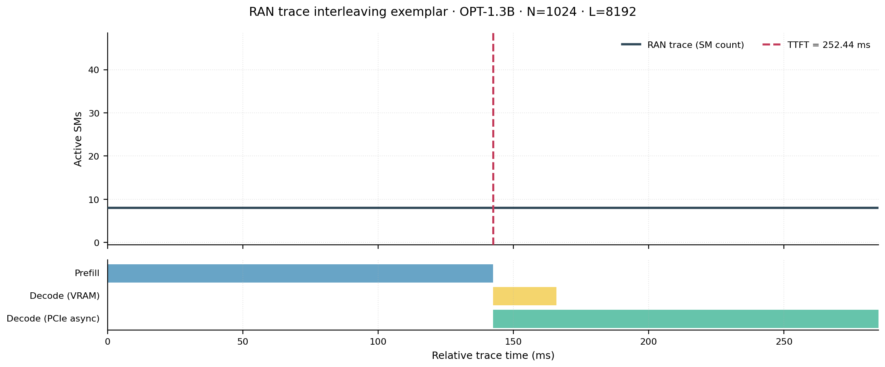
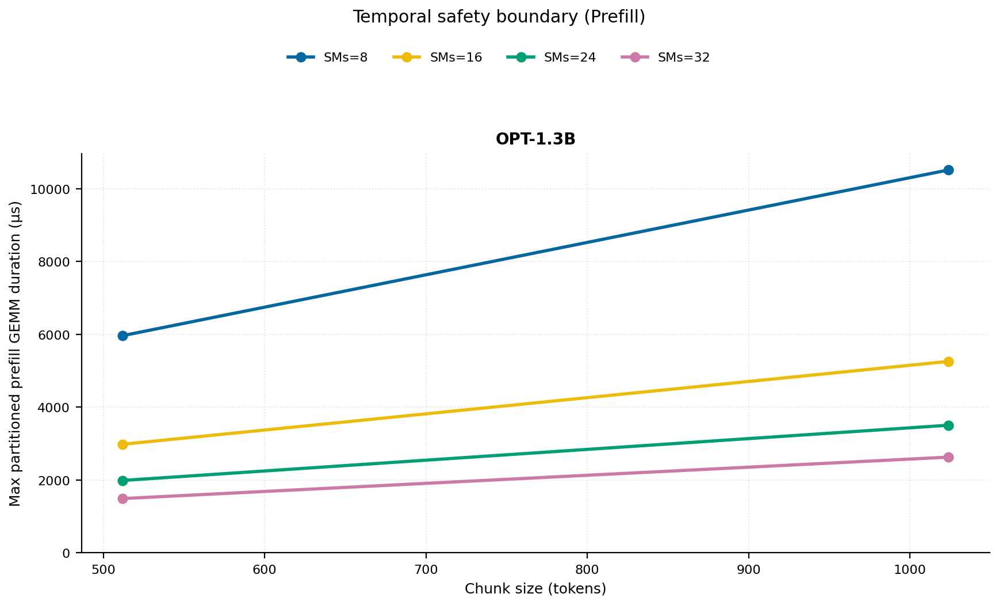
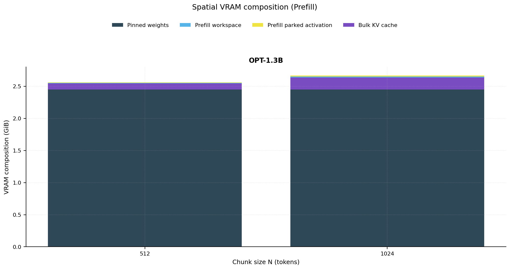
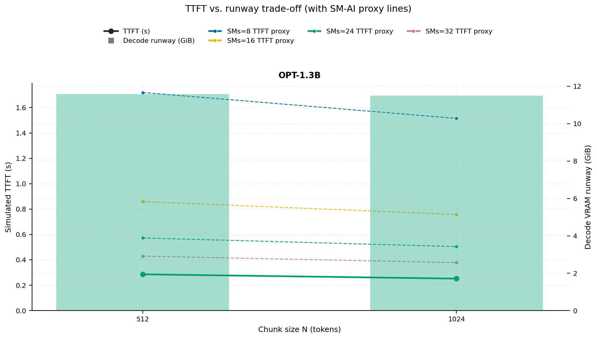
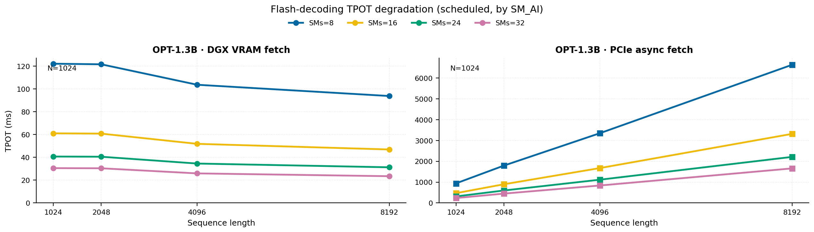
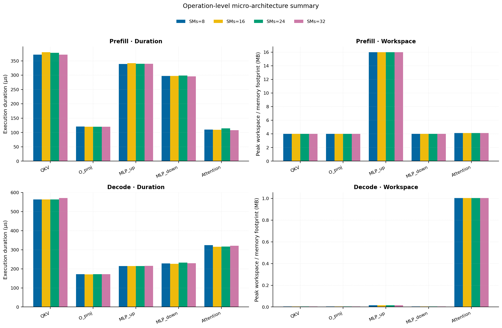
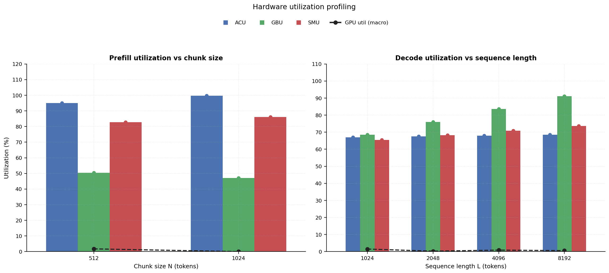
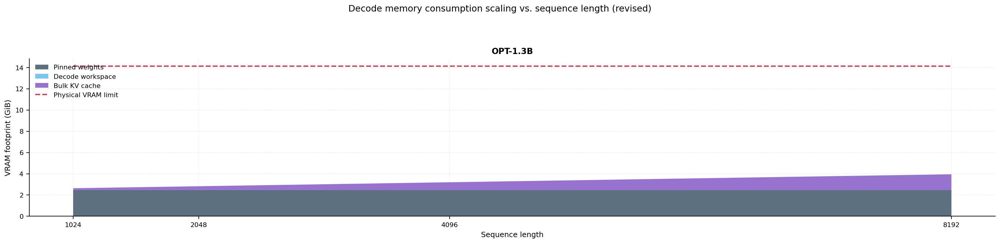

# RAN Inference Profiling Report

Run root: `/mnt/data/dheeraj/dicertation/inference-profile/runs/revised-rerun-20260415-171945-g3-opt13b-c512-1024`

## Environment

| field | value |
| --- | --- |
| cache_root | n/a |
| captured_at | 2026-04-15T16:19:53Z |
| chunk_sizes | [512, 1024] |
| cuda_available | true |
| cuda_device_count | 8 |
| cwd | /mnt/data/dheeraj/dicertation/inference-profile |
| decode_modes | ["vram", "pcie_async"] |
| experiment_type | ran-dgxspark-v1 |
| gpu_id | 3 |
| l_out | 1024 |
| models | ["facebook/opt-1.3b"] |
| platform | Linux-6.8.0-106-generic-x86_64-with-glibc2.35 |
| python_executable | /home/dheeraj/miniconda3/envs/mls/bin/python |
| python_version | 3.11.14 |
| run_root | /mnt/data/dheeraj/dicertation/inference-profile/runs/revised-rerun-20260415-171945-g3-opt13b-c512-1024 |
| scheduler | envelope_v1 |
| schema_version | ran_dgxspark_v1 |
| sequence_lengths | [1024, 2048, 4096, 8192] |
| sm_ai_cap | 32 |
| sm_ai_partition | 100 |
| sm_ai_partitions | [8, 16, 24, 32] |
| stage | profile |
| telemetry_tier | baseline_nvml_pt |
| timed_iterations | 5 |
| torch_available | true |
| torch_version | 2.10.0+cu128 |
| warmup_iterations | 3 |

## Model Constants

| model_id | sm_ai_partition | num_hidden_layers | hidden_size | num_attention_heads | ffn_dim | layer_index | layer_weight_bytes | total_weight_bytes_fp16 | vram_ceiling_bytes |
| --- | --- | --- | --- | --- | --- | --- | --- | --- | --- |
| facebook/opt-1.3b | 100 | 24 | 2048 | 32 | 8192 | 11 | 100716544 | 2631516160 | 15170115993 |

## Trace Inspection

### Primary trace

| field | value |
| --- | --- |
| errors | [] |
| header | ["frame", "slot", "time_slot_sched_ns", "time_decode_start_est_ns", "time_decode_end_est_ns", "time_decode_start_actual_ns", "time_decode_end_actual_ns", "decode_dur_us", "deadline_met", "target_sm", "profile_idx", "sm_count", "num_pusch", "sum_prb", "sum_tbs_bytes", "max_mcs"] |
| median_positive_delta_ms | 5.6997 |
| monotonicity.checked_column | time_slot_sched_ns |
| monotonicity.is_non_decreasing | true |
| monotonicity.negative_delta_count | 0 |
| monotonicity.positive_delta_count | 28377 |
| monotonicity.zero_delta_count | 0 |
| normalization.last_row_duration_policy | median_positive_forward_delta_ms |
| normalization.output_columns | ["time_ms", "sm_utilization", "slot_duration_ms", "source_schema", "sm_count"] |
| normalization.output_relative_path | derived/normalized_ldpc_trace.csv |
| normalized_row_count | 28378 |
| path | /mnt/raid0sata2/netsys/weaver-ext/ran/traces/e2e_2026030418/e2e_20260304_182034_tractor_ran_ctrl/ldpc_trace.csv |
| row_count | 28378 |
| schema_detected | schema_b |
| time_unit_hint | ns |
| usable | true |
| usage_policy | primary_only |
| used_for_scheduler_capacity | true |

### Secondary trace

| field | value |
| --- | --- |
| errors | ["ran_ctrl_trace.csv line 182958 has 9 field(s); expected 12"] |
| header | ["frame", "slot", "sm_available", "prbs_available", "prbs_allocated", "w_avg_mcs_prev", "w_avg_mcs_curr", "slots_since_underutil", "ramp_up_count", "num_ue_sched", "max_ue_backlog", "sum_ue_backlog"] |
| monotonicity.checked_column | n/a |
| monotonicity.is_non_decreasing | n/a |
| monotonicity.negative_delta_count | n/a |
| path | /mnt/raid0sata2/netsys/weaver-ext/ran/traces/e2e_2026030418/e2e_20260304_182034_tractor_ran_ctrl/ran_ctrl_trace.csv |
| row_count | 182956 |
| time_unit_hints | [] |
| usable | false |
| usage_policy | structural_only |
| used_for_scheduler_capacity | false |

## Raw-Profile Summary Tables

### Prefill profile summary

Source raw rows: `raw/prefill_events.csv` = 280. Summary artifact: `derived/prefill_summary.csv`.

| model_id | chunk_tokens | sm_ai_partition | max_input_tokens | prefill_max_gemm_us | prefill_workspace_bytes | prefill_parked_activation_bytes | telemetry_tier | telemetry_provider | telemetry_status | nvml_available | gpu_util | gpu_mem_used_mb | sm_clock_mhz | mem_clock_mhz | power_w | pt_step_ms | pt_mem_alloc_mb | pt_mem_reserved_mb | pt_workspace_mb | acu_pct | gbu_pct | smu_pct | microscopic_telemetry_status | microscopic_error |
| --- | --- | --- | --- | --- | --- | --- | --- | --- | --- | --- | --- | --- | --- | --- | --- | --- | --- | --- | --- | --- | --- | --- | --- | --- |
| facebook/opt-1.3b | 512 | 8 | 1024 | 250.688 | 8388608 | 8388608 | baseline_nvml_pt | nvidia-smi | ok | true | 0 | 93 | 1695 | 7601 | 65.42 | 0.2507 | 129.1602 | 129.1602 | 8 | 83.9251 | 58.0888 | 70.9141 | estimated | n/a |
| facebook/opt-1.3b | 512 | 16 | 1024 | 267.264 | 8388608 | 8388608 | baseline_nvml_pt | nvidia-smi | ok | true | 7 | 93 | 1695 | 8001 | 66.37 | 0.2673 | 129.1602 | 129.1602 | 8 | 91.3615 | 52.977 | 78.7935 | estimated | n/a |
| facebook/opt-1.3b | 512 | 24 | 1024 | 251.904 | 8388608 | 8388608 | baseline_nvml_pt | nvidia-smi | ok | true | 0 | 93 | 1695 | 7601 | 66.64 | 0.2519 | 129.1602 | 129.1602 | 8 | 98.7979 | 47.8651 | 86.6728 | estimated | n/a |
| facebook/opt-1.3b | 512 | 32 | 1024 | 248.64 | 8388608 | 8388608 | baseline_nvml_pt | nvidia-smi | ok | true | 0 | 93 | 1695 | 7601 | 66.64 | 0.2486 | 129.1602 | 129.1602 | 8 | 100 | 42.7533 | 94.5522 | estimated | n/a |
| facebook/opt-1.3b | 1024 | 8 | 1024 | 433.024 | 16777216 | 16777216 | baseline_nvml_pt | nvidia-smi | ok | true | 0 | 93 | 1695 | 7601 | 68 | 0.433 | 153.1602 | 153.1602 | 16 | 88.0144 | 54.2286 | 73.7332 | estimated | n/a |
| facebook/opt-1.3b | 1024 | 16 | 1024 | 430.08 | 16777216 | 16777216 | baseline_nvml_pt | nvidia-smi | ok | true | 0 | 93 | 1695 | 7601 | 68.34 | 0.4301 | 153.1602 | 153.1602 | 16 | 95.8131 | 49.4564 | 81.9257 | estimated | n/a |
| facebook/opt-1.3b | 1024 | 24 | 1024 | 434.112 | 16777216 | 16777216 | baseline_nvml_pt | nvidia-smi | ok | true | 0 | 93 | 1695 | 8001 | 69.18 | 0.4341 | 153.1602 | 153.1602 | 16 | 100 | 44.6843 | 90.1183 | estimated | n/a |
| facebook/opt-1.3b | 1024 | 32 | 1024 | 438.272 | 16777216 | 16777216 | baseline_nvml_pt | nvidia-smi | ok | true | 0 | 93 | 1695 | 7601 | 69.34 | 0.4383 | 153.1602 | 153.1602 | 16 | 100 | 39.9122 | 98.3109 | estimated | n/a |

### Decode profile summary

Source raw rows: `raw/decode_events.csv` = 2560. Summary artifact: `derived/decode_summary.csv`.

| model_id | sequence_length | block_size | sm_ai_partition | decode_mode | decode_max_gemv_us | attention_fetch_compute_us | reduction_overhead_us | decode_workspace_bytes | decode_parked_activation_bytes | telemetry_tier | telemetry_provider | telemetry_status | nvml_available | gpu_util | gpu_mem_used_mb | sm_clock_mhz | mem_clock_mhz | power_w | pt_step_ms | pt_mem_alloc_mb | pt_mem_reserved_mb | pt_workspace_mb | acu_pct | gbu_pct | smu_pct | microscopic_telemetry_status | microscopic_error |
| --- | --- | --- | --- | --- | --- | --- | --- | --- | --- | --- | --- | --- | --- | --- | --- | --- | --- | --- | --- | --- | --- | --- | --- | --- | --- | --- | --- |
| facebook/opt-1.3b | 1024 | 512 | 8 | pcie_async | 132.256 | 132.8256 | 19.648 | 135168 | 4096 | baseline_nvml_pt | nvidia-smi | ok | true | 0 | 93 | 1695 | 7601 | 68.05 | 0.1482 | 112.3125 | 112.3125 | 0.1289 | 58.4939 | 75.152 | 56.744 | estimated | n/a |
| facebook/opt-1.3b | 1024 | 512 | 8 | vram | 159.744 | 126.88 | 20.0256 | 135168 | 4096 | baseline_nvml_pt | nvidia-smi | ok | true | 5 | 93 | 1695 | 7601 | 66.88 | 0.1597 | 112.3125 | 112.3125 | 0.1289 | 61.1283 | 69.4992 | 58.4986 | estimated | n/a |
| facebook/opt-1.3b | 1024 | 512 | 16 | pcie_async | 187.392 | 127.968 | 19.9808 | 135168 | 4096 | baseline_nvml_pt | nvidia-smi | ok | true | 0 | 93 | 1695 | 7601 | 68.39 | 0.1874 | 112.3125 | 112.3125 | 0.1289 | 63.1527 | 72.5606 | 61.5529 | estimated | n/a |
| facebook/opt-1.3b | 1024 | 512 | 16 | vram | 160 | 119.52 | 20.1472 | 135168 | 4096 | baseline_nvml_pt | nvidia-smi | ok | true | 8 | 93 | 1695 | 8001 | 68.66 | 0.16 | 112.3125 | 112.3125 | 0.1289 | 65.9797 | 67.2572 | 64.1598 | estimated | n/a |
| facebook/opt-1.3b | 1024 | 512 | 24 | pcie_async | 208.896 | 127.0592 | 19.456 | 135168 | 4096 | baseline_nvml_pt | nvidia-smi | ok | true | 0 | 93 | 1695 | 7601 | 68.84 | 0.2089 | 112.3125 | 112.3125 | 0.1289 | 67.8115 | 69.9691 | 66.3617 | estimated | n/a |
| facebook/opt-1.3b | 1024 | 512 | 24 | vram | 177.408 | 124.096 | 18.912 | 135168 | 4096 | baseline_nvml_pt | nvidia-smi | ok | true | 0 | 93 | 1695 | 7601 | 68.34 | 0.1774 | 112.3125 | 112.3125 | 0.1289 | 70.8312 | 65.0153 | 69.821 | estimated | n/a |
| facebook/opt-1.3b | 1024 | 512 | 32 | pcie_async | 193.536 | 134.7584 | 21.4464 | 135168 | 4096 | baseline_nvml_pt | nvidia-smi | ok | true | 0 | 93 | 1695 | 7601 | 68.88 | 0.1935 | 112.3125 | 112.3125 | 0.1289 | 72.4703 | 67.3777 | 71.1705 | estimated | n/a |
| facebook/opt-1.3b | 1024 | 512 | 32 | vram | 156.672 | 121.7088 | 19.4944 | 135168 | 4096 | baseline_nvml_pt | nvidia-smi | ok | true | 0 | 93 | 1695 | 8001 | 68.96 | 0.1567 | 112.3125 | 112.3125 | 0.1289 | 75.6826 | 62.7734 | 75.4821 | estimated | n/a |
| facebook/opt-1.3b | 1024 | 1024 | 8 | pcie_async | 162.624 | 142.5728 | 21.1456 | 135168 | 4096 | baseline_nvml_pt | nvidia-smi | ok | true | 10 | 93 | 1695 | 7601 | 68.85 | 0.1925 | 112.3125 | 112.3125 | 0.1289 | 58.4939 | 74.717 | 56.744 | estimated | n/a |
| facebook/opt-1.3b | 1024 | 1024 | 8 | vram | 181.248 | 178.1696 | 22.2976 | 135168 | 4096 | baseline_nvml_pt | nvidia-smi | ok | true | 0 | 93 | 1695 | 7601 | 68.78 | 0.3438 | 112.3125 | 112.3125 | 0.1289 | 61.4433 | 69.1117 | 58.4986 | estimated | n/a |
| facebook/opt-1.3b | 1024 | 1024 | 16 | pcie_async | 155.456 | 125.2288 | 19.0848 | 135168 | 4096 | baseline_nvml_pt | nvidia-smi | ok | true | 0 | 93 | 1695 | 7601 | 69.33 | 0.1555 | 112.3125 | 112.3125 | 0.1289 | 63.1527 | 72.1406 | 61.5529 | estimated | n/a |
| facebook/opt-1.3b | 1024 | 1024 | 16 | vram | 151.552 | 128.5952 | 19.8656 | 135168 | 4096 | baseline_nvml_pt | nvidia-smi | ok | true | 0 | 93 | 1695 | 7601 | 68.96 | 0.1567 | 112.3125 | 112.3125 | 0.1289 | 66.3197 | 66.8822 | 64.1598 | estimated | n/a |
| facebook/opt-1.3b | 1024 | 1024 | 24 | pcie_async | 158.656 | 137.216 | 20.1792 | 135168 | 4096 | baseline_nvml_pt | nvidia-smi | ok | true | 0 | 93 | 1695 | 7601 | 69.45 | 0.1925 | 112.3125 | 112.3125 | 0.1289 | 67.8115 | 69.5641 | 66.3617 | estimated | n/a |
| facebook/opt-1.3b | 1024 | 1024 | 24 | vram | 159.744 | 129.2288 | 20.4864 | 135168 | 4096 | baseline_nvml_pt | nvidia-smi | ok | true | 0 | 93 | 1695 | 7601 | 69.07 | 0.1597 | 112.3125 | 112.3125 | 0.1289 | 71.1962 | 64.6528 | 69.821 | estimated | n/a |
| facebook/opt-1.3b | 1024 | 1024 | 32 | pcie_async | 194.56 | 137.8176 | 20.4928 | 135168 | 4096 | baseline_nvml_pt | nvidia-smi | ok | true | 1 | 93 | 1695 | 7601 | 69.51 | 0.1946 | 112.3125 | 112.3125 | 0.1289 | 72.4703 | 66.9877 | 71.1705 | estimated | n/a |
| facebook/opt-1.3b | 1024 | 1024 | 32 | vram | 187.392 | 126.784 | 19.7376 | 135168 | 4096 | baseline_nvml_pt | nvidia-smi | ok | true | 0 | 93 | 1695 | 7601 | 68.87 | 0.1874 | 112.3125 | 112.3125 | 0.1289 | 76.0726 | 62.4234 | 75.4821 | estimated | n/a |
| facebook/opt-1.3b | 2048 | 512 | 8 | pcie_async | 169.76 | 129.2288 | 20.6336 | 266240 | 4096 | baseline_nvml_pt | nvidia-smi | ok | true | 0 | 93 | 1695 | 7601 | 69.45 | 0.1698 | 120.4375 | 120.4375 | 0.2539 | 57.2975 | 84.4488 | 58.5834 | estimated | n/a |
| facebook/opt-1.3b | 2048 | 512 | 8 | vram | 146.432 | 124.32 | 20.5056 | 266240 | 4096 | baseline_nvml_pt | nvidia-smi | ok | true | 1 | 93 | 1695 | 7601 | 69.44 | 0.1464 | 120.4375 | 120.4375 | 0.2539 | 63.0923 | 75.3647 | 61.2582 | estimated | n/a |
| facebook/opt-1.3b | 2048 | 512 | 16 | pcie_async | 177.152 | 139.7184 | 21.1136 | 266240 | 4096 | baseline_nvml_pt | nvidia-smi | ok | true | 0 | 93 | 1695 | 7601 | 70.07 | 0.1772 | 120.4375 | 120.4375 | 0.2539 | 61.861 | 81.5368 | 63.5481 | estimated | n/a |
| facebook/opt-1.3b | 2048 | 512 | 16 | vram | 183.296 | 127.8208 | 20.3264 | 266240 | 4096 | baseline_nvml_pt | nvidia-smi | ok | true | 0 | 93 | 1695 | 7601 | 69.46 | 0.1833 | 120.4375 | 120.4375 | 0.2539 | 68.0996 | 72.9336 | 67.1864 | estimated | n/a |
| facebook/opt-1.3b | 2048 | 512 | 24 | pcie_async | 190.464 | 129.6192 | 20.2432 | 266240 | 4096 | baseline_nvml_pt | nvidia-smi | ok | true | 0 | 93 | 1695 | 7601 | 69.09 | 0.1905 | 120.4375 | 120.4375 | 0.2539 | 66.4245 | 78.6248 | 68.5128 | estimated | n/a |
| facebook/opt-1.3b | 2048 | 512 | 24 | vram | 210.944 | 134.5664 | 20.8512 | 266240 | 4096 | baseline_nvml_pt | nvidia-smi | ok | true | 0 | 93 | 1695 | 8001 | 69.91 | 0.2109 | 120.4375 | 120.4375 | 0.2539 | 73.107 | 70.5025 | 73.1146 | estimated | n/a |
| facebook/opt-1.3b | 2048 | 512 | 32 | pcie_async | 164.864 | 122.0544 | 21.312 | 266240 | 4096 | baseline_nvml_pt | nvidia-smi | ok | true | 0 | 93 | 1695 | 7601 | 70.02 | 0.1649 | 120.4375 | 120.4375 | 0.2539 | 70.988 | 75.7128 | 73.4775 | estimated | n/a |
| facebook/opt-1.3b | 2048 | 512 | 32 | vram | 153.536 | 123.072 | 19.104 | 266240 | 4096 | baseline_nvml_pt | nvidia-smi | ok | true | 0 | 93 | 1695 | 7601 | 69.97 | 0.1535 | 120.4375 | 120.4375 | 0.2539 | 78.1143 | 68.0713 | 79.0428 | estimated | n/a |
| facebook/opt-1.3b | 2048 | 1024 | 8 | pcie_async | 152.576 | 121.2224 | 20.0704 | 266240 | 4096 | baseline_nvml_pt | nvidia-smi | ok | true | 0 | 93 | 1695 | 7601 | 70.22 | 0.1526 | 120.4375 | 120.4375 | 0.2539 | 57.2975 | 84.8838 | 58.7801 | estimated | n/a |
| facebook/opt-1.3b | 2048 | 1024 | 8 | vram | 163.84 | 123.6544 | 20.0832 | 266240 | 4096 | baseline_nvml_pt | nvidia-smi | ok | true | 0 | 93 | 1695 | 8001 | 70.45 | 0.1638 | 120.4375 | 120.4375 | 0.2539 | 63.6173 | 75.4939 | 61.4649 | estimated | n/a |
| facebook/opt-1.3b | 2048 | 1024 | 16 | pcie_async | 151.648 | 125.7344 | 20.064 | 266240 | 4096 | baseline_nvml_pt | nvidia-smi | ok | true | 0 | 93 | 1695 | 7601 | 62.3 | 0.1516 | 120.4375 | 120.4375 | 0.2539 | 61.861 | 81.9568 | 63.7614 | estimated | n/a |
| facebook/opt-1.3b | 2048 | 1024 | 16 | vram | 261.12 | 126.2656 | 18.9632 | 266240 | 4096 | baseline_nvml_pt | nvidia-smi | ok | true | 0 | 93 | 1695 | 7601 | 70.31 | 0.2611 | 120.4375 | 120.4375 | 0.2539 | 68.6663 | 73.0586 | 67.4131 | estimated | n/a |
| facebook/opt-1.3b | 2048 | 1024 | 24 | pcie_async | 299.008 | 125.6256 | 19.8336 | 266240 | 4096 | baseline_nvml_pt | nvidia-smi | ok | true | 0 | 93 | 1695 | 7601 | 69.72 | 0.299 | 120.4375 | 120.4375 | 0.2539 | 66.4245 | 79.0298 | 68.7428 | estimated | n/a |
| facebook/opt-1.3b | 2048 | 1024 | 24 | vram | 137.216 | 131.0656 | 22.3104 | 266240 | 4096 | baseline_nvml_pt | nvidia-smi | ok | true | 0 | 93 | 1695 | 7601 | 69.62 | 0.1476 | 120.4375 | 120.4375 | 0.2539 | 73.7153 | 70.6233 | 73.3613 | estimated | n/a |
| facebook/opt-1.3b | 2048 | 1024 | 32 | pcie_async | 269.312 | 148.2816 | 22.0224 | 266240 | 4096 | baseline_nvml_pt | nvidia-smi | ok | true | 3 | 93 | 1695 | 7601 | 69.92 | 0.2693 | 120.4375 | 120.4375 | 0.2539 | 70.988 | 76.1028 | 73.7241 | estimated | n/a |
| facebook/opt-1.3b | 2048 | 1024 | 32 | vram | 185.344 | 133.3504 | 20.3392 | 266240 | 4096 | baseline_nvml_pt | nvidia-smi | ok | true | 0 | 93 | 1695 | 7601 | 69.87 | 0.1853 | 120.4375 | 120.4375 | 0.2539 | 78.7643 | 68.188 | 79.3095 | estimated | n/a |
| facebook/opt-1.3b | 4096 | 512 | 8 | pcie_async | 348.032 | 149.472 | 21.0816 | 528384 | 4096 | baseline_nvml_pt | nvidia-smi | ok | true | 0 | 93 | 1695 | 7601 | 70.17 | 0.348 | 136.6875 | 136.6875 | 0.5039 | 56.101 | 93.7457 | 60.4227 | estimated | n/a |
| facebook/opt-1.3b | 4096 | 512 | 8 | vram | 134.112 | 126.7264 | 19.2448 | 528384 | 4096 | baseline_nvml_pt | nvidia-smi | ok | true | 0 | 93 | 1695 | 7601 | 70.32 | 0.1341 | 136.6875 | 136.6875 | 0.5039 | 65.0564 | 81.2302 | 64.0177 | estimated | n/a |
| facebook/opt-1.3b | 4096 | 512 | 16 | pcie_async | 136.192 | 132.2496 | 18.8864 | 528384 | 4096 | baseline_nvml_pt | nvidia-smi | ok | true | 0 | 93 | 1695 | 7601 | 70.02 | 0.1564 | 136.6875 | 136.6875 | 0.5039 | 60.5693 | 90.513 | 65.5433 | estimated | n/a |
| facebook/opt-1.3b | 4096 | 512 | 16 | vram | 164.864 | 136.5696 | 20.0512 | 528384 | 4096 | baseline_nvml_pt | nvidia-smi | ok | true | 0 | 93 | 1695 | 7601 | 70.35 | 0.1649 | 136.6875 | 136.6875 | 0.5039 | 70.2196 | 78.6099 | 70.213 | estimated | n/a |
| facebook/opt-1.3b | 4096 | 512 | 24 | pcie_async | 147.456 | 129.8624 | 19.84 | 528384 | 4096 | baseline_nvml_pt | nvidia-smi | ok | true | 0 | 93 | 1695 | 8001 | 70.62 | 0.1557 | 136.6875 | 136.6875 | 0.5039 | 65.0375 | 87.2804 | 70.6639 | estimated | n/a |
| facebook/opt-1.3b | 4096 | 512 | 24 | vram | 131.136 | 126.752 | 19.456 | 528384 | 4096 | baseline_nvml_pt | nvidia-smi | ok | true | 0 | 93 | 1695 | 7601 | 69.91 | 0.1352 | 136.6875 | 136.6875 | 0.5039 | 75.3828 | 75.9896 | 76.4083 | estimated | n/a |
| facebook/opt-1.3b | 4096 | 512 | 32 | pcie_async | 137.216 | 122.2208 | 20.0192 | 528384 | 4096 | baseline_nvml_pt | nvidia-smi | ok | true | 7 | 93 | 1695 | 8001 | 70.96 | 0.1372 | 136.6875 | 136.6875 | 0.5039 | 69.5057 | 84.0478 | 75.7845 | estimated | n/a |
| facebook/opt-1.3b | 4096 | 512 | 32 | vram | 177.152 | 160.9728 | 21.5232 | 528384 | 4096 | baseline_nvml_pt | nvidia-smi | ok | true | 0 | 93 | 1695 | 7601 | 70.27 | 0.2499 | 136.6875 | 136.6875 | 0.5039 | 80.546 | 73.3692 | 82.6035 | estimated | n/a |
| facebook/opt-1.3b | 4096 | 1024 | 8 | pcie_async | 196.608 | 129.7792 | 20.4416 | 528384 | 4096 | baseline_nvml_pt | nvidia-smi | ok | true | 0 | 93 | 1695 | 7601 | 70.91 | 0.1966 | 136.6875 | 136.6875 | 0.5039 | 56.101 | 95.0507 | 60.8161 | estimated | n/a |
| facebook/opt-1.3b | 4096 | 1024 | 8 | vram | 163.84 | 140.4416 | 19.9168 | 528384 | 4096 | baseline_nvml_pt | nvidia-smi | ok | true | 0 | 93 | 1695 | 7601 | 70.64 | 0.1638 | 136.6875 | 136.6875 | 0.5039 | 65.7914 | 81.8761 | 64.4311 | estimated | n/a |
| facebook/opt-1.3b | 4096 | 1024 | 16 | pcie_async | 128.128 | 131.232 | 19.8464 | 528384 | 4096 | baseline_nvml_pt | nvidia-smi | ok | true | 0 | 93 | 1695 | 7601 | 70.08 | 0.1403 | 136.6875 | 136.6875 | 0.5039 | 60.5693 | 91.773 | 65.97 | estimated | n/a |
| facebook/opt-1.3b | 4096 | 1024 | 16 | vram | 153.6 | 129.0944 | 19.2448 | 528384 | 4096 | baseline_nvml_pt | nvidia-smi | ok | true | 0 | 93 | 1695 | 7601 | 70.74 | 0.1536 | 136.6875 | 136.6875 | 0.5039 | 71.0129 | 79.2349 | 70.6663 | estimated | n/a |
| facebook/opt-1.3b | 4096 | 1024 | 24 | pcie_async | 155.808 | 128.5888 | 20.2624 | 528384 | 4096 | baseline_nvml_pt | nvidia-smi | ok | true | 0 | 93 | 1695 | 7601 | 70.1 | 0.1558 | 136.6875 | 136.6875 | 0.5039 | 65.0375 | 88.4954 | 71.1239 | estimated | n/a |
| facebook/opt-1.3b | 4096 | 1024 | 24 | vram | 148.352 | 135.8336 | 19.6416 | 528384 | 4096 | baseline_nvml_pt | nvidia-smi | ok | true | 0 | 93 | 1695 | 8001 | 70.52 | 0.1484 | 136.6875 | 136.6875 | 0.5039 | 76.2345 | 76.5937 | 76.9016 | estimated | n/a |
| facebook/opt-1.3b | 4096 | 1024 | 32 | pcie_async | 157.664 | 131.6096 | 18.5024 | 528384 | 4096 | baseline_nvml_pt | nvidia-smi | ok | true | 0 | 93 | 1695 | 7601 | 70.69 | 0.1577 | 136.6875 | 136.6875 | 0.5039 | 69.5057 | 85.2178 | 76.2778 | estimated | n/a |
| facebook/opt-1.3b | 4096 | 1024 | 32 | vram | 154.72 | 130.8864 | 19.6416 | 528384 | 4096 | baseline_nvml_pt | nvidia-smi | ok | true | 7 | 93 | 1695 | 8001 | 70.6 | 0.1547 | 136.6875 | 136.6875 | 0.5039 | 81.456 | 73.9526 | 83.1369 | estimated | n/a |
| facebook/opt-1.3b | 8192 | 512 | 8 | pcie_async | 150.528 | 164.8384 | 19.68 | 1052672 | 4096 | baseline_nvml_pt | nvidia-smi | ok | true | 0 | 93 | 1695 | 7601 | 70.25 | 0.1833 | 169.1875 | 169.1875 | 1.0039 | 54.9046 | 100 | 62.2621 | estimated | n/a |
| facebook/opt-1.3b | 8192 | 512 | 8 | vram | 136 | 158.8672 | 19.7632 | 1052672 | 4096 | baseline_nvml_pt | nvidia-smi | ok | true | 3 | 93 | 1695 | 7601 | 70.01 | 0.1637 | 169.1875 | 169.1875 | 1.0039 | 67.0204 | 87.0958 | 66.7773 | estimated | n/a |
| facebook/opt-1.3b | 8192 | 512 | 16 | pcie_async | 153.6 | 160.7424 | 19.136 | 1052672 | 4096 | baseline_nvml_pt | nvidia-smi | ok | true | 0 | 93 | 1695 | 7601 | 65.3 | 0.1678 | 169.1875 | 169.1875 | 1.0039 | 59.2776 | 99.4893 | 67.5386 | estimated | n/a |
| facebook/opt-1.3b | 8192 | 512 | 16 | vram | 133.984 | 159.8656 | 19.8784 | 1052672 | 4096 | baseline_nvml_pt | nvidia-smi | ok | true | 6 | 93 | 1695 | 7601 | 69.94 | 0.1649 | 169.1875 | 169.1875 | 1.0039 | 72.3395 | 84.2862 | 73.2396 | estimated | n/a |
| facebook/opt-1.3b | 8192 | 512 | 24 | pcie_async | 136.288 | 158.9632 | 20.2752 | 1052672 | 4096 | baseline_nvml_pt | nvidia-smi | ok | true | 0 | 93 | 1695 | 7601 | 70.25 | 0.1641 | 169.1875 | 169.1875 | 1.0039 | 63.6505 | 95.9361 | 72.815 | estimated | n/a |
| facebook/opt-1.3b | 8192 | 512 | 24 | vram | 175.104 | 165.696 | 19.4496 | 1052672 | 4096 | baseline_nvml_pt | nvidia-smi | ok | true | 0 | 93 | 1695 | 7601 | 70.2 | 0.1782 | 169.1875 | 169.1875 | 1.0039 | 77.6586 | 81.4767 | 79.7019 | estimated | n/a |
| facebook/opt-1.3b | 8192 | 512 | 32 | pcie_async | 176.416 | 162.6112 | 20.2304 | 1052672 | 4096 | baseline_nvml_pt | nvidia-smi | ok | true | 0 | 93 | 1695 | 7601 | 70.31 | 0.1764 | 169.1875 | 169.1875 | 1.0039 | 68.0234 | 92.3829 | 78.0915 | estimated | n/a |
| facebook/opt-1.3b | 8192 | 512 | 32 | vram | 161.792 | 163.8016 | 19.9424 | 1052672 | 4096 | baseline_nvml_pt | nvidia-smi | ok | true | 0 | 93 | 1695 | 7601 | 70.48 | 0.1731 | 169.1875 | 169.1875 | 1.0039 | 82.9777 | 78.6672 | 86.1643 | estimated | n/a |
| facebook/opt-1.3b | 8192 | 1024 | 8 | pcie_async | 152.576 | 160.1216 | 18.6048 | 1052672 | 4096 | baseline_nvml_pt | nvidia-smi | ok | true | 0 | 93 | 1695 | 8001 | 70.83 | 0.1648 | 169.1875 | 169.1875 | 1.0039 | 54.9046 | 100 | 62.8521 | estimated | n/a |
| facebook/opt-1.3b | 8192 | 1024 | 8 | vram | 149.504 | 161.4208 | 20.8768 | 1052672 | 4096 | baseline_nvml_pt | nvidia-smi | ok | true | 0 | 93 | 1695 | 7601 | 70.83 | 0.1679 | 169.1875 | 169.1875 | 1.0039 | 67.9654 | 88.2583 | 67.3973 | estimated | n/a |
| facebook/opt-1.3b | 8192 | 1024 | 16 | pcie_async | 168.896 | 173.28 | 20.9152 | 1052672 | 4096 | baseline_nvml_pt | nvidia-smi | ok | true | 0 | 93 | 1695 | 7601 | 70.9 | 0.2191 | 169.1875 | 169.1875 | 1.0039 | 59.2776 | 100 | 68.1786 | estimated | n/a |
| facebook/opt-1.3b | 8192 | 1024 | 16 | vram | 158.72 | 163.8272 | 19.7568 | 1052672 | 4096 | baseline_nvml_pt | nvidia-smi | ok | true | 0 | 93 | 1695 | 7601 | 70.72 | 0.17 | 169.1875 | 169.1875 | 1.0039 | 73.3595 | 85.4112 | 73.9196 | estimated | n/a |
| facebook/opt-1.3b | 8192 | 1024 | 24 | pcie_async | 153.888 | 164.6272 | 20.8704 | 1052672 | 4096 | baseline_nvml_pt | nvidia-smi | ok | true | 0 | 93 | 1695 | 7601 | 70.29 | 0.1731 | 169.1875 | 169.1875 | 1.0039 | 63.6505 | 97.9611 | 73.505 | estimated | n/a |
| facebook/opt-1.3b | 8192 | 1024 | 24 | vram | 212.992 | 162.816 | 19.6928 | 1052672 | 4096 | baseline_nvml_pt | nvidia-smi | ok | true | 0 | 93 | 1695 | 7601 | 70.46 | 0.213 | 169.1875 | 169.1875 | 1.0039 | 78.7536 | 82.5642 | 80.4419 | estimated | n/a |
| facebook/opt-1.3b | 8192 | 1024 | 32 | pcie_async | 216.064 | 164.832 | 20.0064 | 1052672 | 4096 | baseline_nvml_pt | nvidia-smi | ok | true | 0 | 93 | 1695 | 7601 | 70.61 | 0.2161 | 169.1875 | 169.1875 | 1.0039 | 68.0234 | 94.3329 | 78.8315 | estimated | n/a |
| facebook/opt-1.3b | 8192 | 1024 | 32 | vram | 132.064 | 165.0496 | 18.6624 | 1052672 | 4096 | baseline_nvml_pt | nvidia-smi | ok | true | 0 | 93 | 1695 | 7601 | 70.38 | 0.172 | 169.1875 | 169.1875 | 1.0039 | 84.1477 | 79.7172 | 86.9643 | estimated | n/a |

### PCIe profile summary

Source raw rows: `raw/pcie_events.csv` = 10. Summary artifact: `derived/pcie_summary.csv`.

| model_id | block_size | kv_block_bytes | transfer_only_us | overlap_total_us | dummy_compute_us | exposed_transfer_us | effective_gbps | overlap_status | telemetry_tier | telemetry_provider | telemetry_status | nvml_available | gpu_util | gpu_mem_used_mb | sm_clock_mhz | mem_clock_mhz | power_w | pt_step_ms | pt_mem_alloc_mb | pt_mem_reserved_mb | pt_workspace_mb | acu_pct | gbu_pct | smu_pct | microscopic_telemetry_status | microscopic_error |
| --- | --- | --- | --- | --- | --- | --- | --- | --- | --- | --- | --- | --- | --- | --- | --- | --- | --- | --- | --- | --- | --- | --- | --- | --- | --- | --- |
| facebook/opt-1.3b | 512 | 4194304 | 6156.2431 | 83764.405 | 81059.8403 | 2704.5646 | 0.6813 | measured | baseline_nvml_pt | nvidia-smi | partial | true | 4 | 93 | 1695 | 7601 | 70.76 | n/a | n/a | n/a | n/a | 65 | 65 | 65 | estimated | n/a |
| facebook/opt-1.3b | 1024 | 8388608 | 2528.32 | 61365.7923 | 52908.2367 | 8457.5556 | 3.3179 | measured | baseline_nvml_pt | nvidia-smi | partial | true | 3 | 93 | 1695 | 7601 | 70.49 | n/a | n/a | n/a | n/a | 65 | 65 | 65 | estimated | n/a |

## SLA Tables

### Successful configurations

| model_id | chunk_tokens | sequence_length | ttft_ms | tpot_ms_vram | tpot_ms_pcie_async | decode_runway_tokens | status |
| --- | --- | --- | --- | --- | --- | --- | --- |
| facebook/opt-1.3b | 512 | 1024 | 286.4333 | 25.9496 | 161.4372 | 63261 | success |
| facebook/opt-1.3b | 512 | 2048 | 286.4333 | 25.5214 | 286.8194 | 63261 | success |
| facebook/opt-1.3b | 512 | 4096 | 286.4333 | 29.8898 | 542.4493 | 63259 | success |
| facebook/opt-1.3b | 512 | 8192 | 286.4333 | 27.7079 | 1068.3449 | 63257 | success |
| facebook/opt-1.3b | 1024 | 1024 | 252.4447 | 30.501 | 234.7974 | 62749 | success |
| facebook/opt-1.3b | 1024 | 2048 | 252.4447 | 30.3781 | 448.8309 | 62749 | success |
| facebook/opt-1.3b | 1024 | 4096 | 252.4447 | 25.8924 | 838.2316 | 62747 | success |
| facebook/opt-1.3b | 1024 | 8192 | 252.4447 | 23.4263 | 1659.4 | 62745 | success |

### Failed configurations

No rows available.

## Per-Model Scaling Analysis

| model_id | successful_configs | failed_configs | chunk_tokens_tested | sequence_lengths_tested | largest_successful_chunk_tokens | ttft_ms_min | ttft_ms_max | tpot_ms_vram_min | tpot_ms_vram_max | tpot_ms_pcie_async_min | tpot_ms_pcie_async_max | max_decode_runway_tokens |
| --- | --- | --- | --- | --- | --- | --- | --- | --- | --- | --- | --- | --- |
| facebook/opt-1.3b | 8 | 0 | 512, 1024 | 1024, 2048, 4096, 8192 | 1024 | 252.4447 | 286.4333 | 23.4263 | 30.501 | 161.4372 | 1659.4 | 63261 |

## Plots

### Revised 01 Ran Trace Interleaving

[Interactive companion](../plots/revised_01_ran_trace_interleaving_interactive.html)

### Revised 02 Prefill Safety Boundary

### Revised 03 Prefill Vram Composition

### Revised 04 Ttft Vs Runway

### Revised 05 Decode Tpot Degradation

### Revised 06 Operation Level Microarchitecture Summary

### Revised 07 Hardware Utilization Profiling

### Revised 08 Decode Memory Consumption

### 09 Spatial VRAM Composition (Prefill) · Pie View

