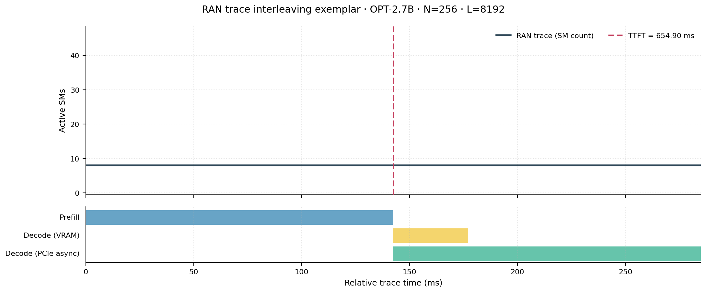
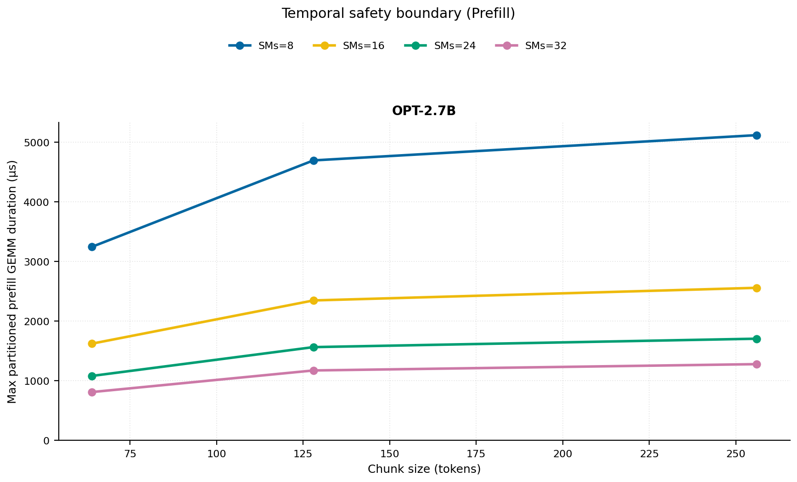
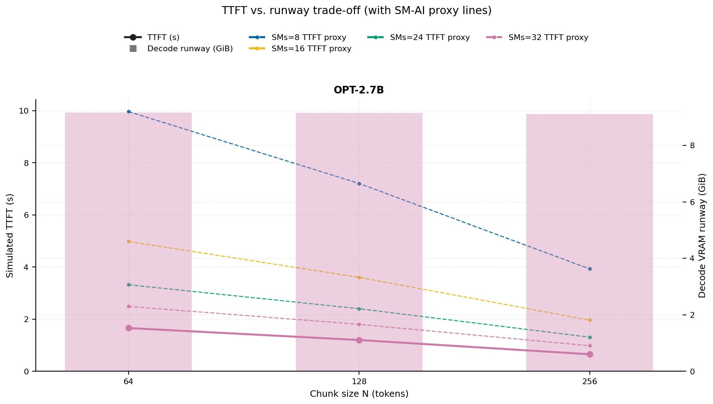
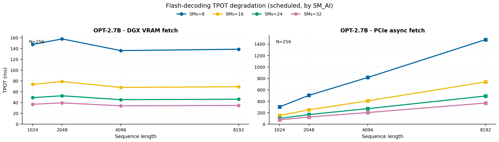
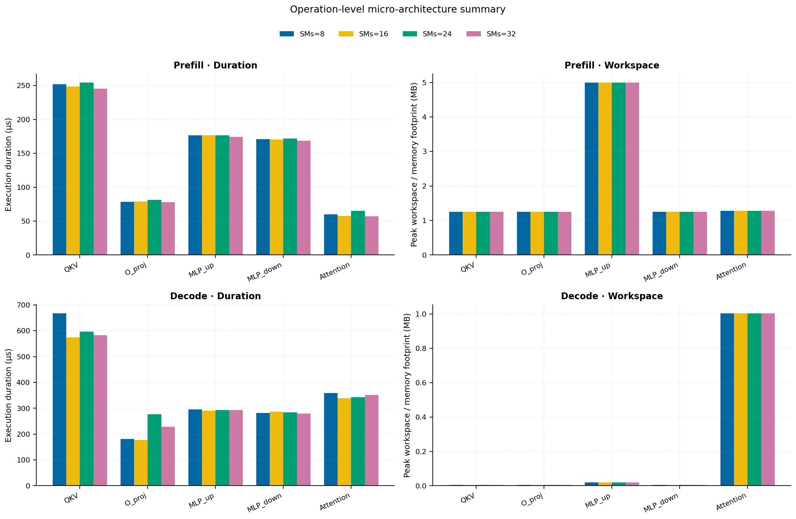
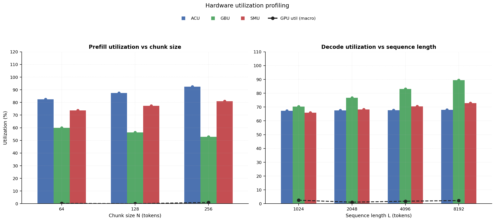

# RAN Inference Profiling Report

Run root: `/mnt/data/dheeraj/dicertation/inference-profile/runs/revised-rerun-20260415-171945-g4-opt27b-c64-256`

## Environment

| field | value |
| --- | --- |
| cache_root | n/a |
| captured_at | 2026-04-15T16:19:53Z |
| chunk_sizes | [64, 128, 256] |
| cuda_available | true |
| cuda_device_count | 8 |
| cwd | /mnt/data/dheeraj/dicertation/inference-profile |
| decode_modes | ["vram", "pcie_async"] |
| experiment_type | ran-dgxspark-v1 |
| gpu_id | 4 |
| l_out | 1024 |
| models | ["facebook/opt-2.7b"] |
| platform | Linux-6.8.0-106-generic-x86_64-with-glibc2.35 |
| python_executable | /home/dheeraj/miniconda3/envs/mls/bin/python |
| python_version | 3.11.14 |
| run_root | /mnt/data/dheeraj/dicertation/inference-profile/runs/revised-rerun-20260415-171945-g4-opt27b-c64-256 |
| scheduler | envelope_v1 |
| schema_version | ran_dgxspark_v1 |
| sequence_lengths | [1024, 2048, 4096, 8192] |
| sm_ai_cap | 32 |
| sm_ai_partition | 100 |
| sm_ai_partitions | [8, 16, 24, 32] |
| stage | profile |
| telemetry_tier | baseline_nvml_pt |
| timed_iterations | 5 |
| torch_available | true |
| torch_version | 2.10.0+cu128 |
| warmup_iterations | 3 |

## Model Constants

| model_id | sm_ai_partition | num_hidden_layers | hidden_size | num_attention_heads | ffn_dim | layer_index | layer_weight_bytes | total_weight_bytes_fp16 | vram_ceiling_bytes |
| --- | --- | --- | --- | --- | --- | --- | --- | --- | --- |
| facebook/opt-2.7b | 100 | 32 | 2560 | 32 | 10240 | 15 | 157352960 | 5303193600 | 15170115993 |

## Trace Inspection

### Primary trace

| field | value |
| --- | --- |
| errors | [] |
| header | ["frame", "slot", "time_slot_sched_ns", "time_decode_start_est_ns", "time_decode_end_est_ns", "time_decode_start_actual_ns", "time_decode_end_actual_ns", "decode_dur_us", "deadline_met", "target_sm", "profile_idx", "sm_count", "num_pusch", "sum_prb", "sum_tbs_bytes", "max_mcs"] |
| median_positive_delta_ms | 5.6997 |
| monotonicity.checked_column | time_slot_sched_ns |
| monotonicity.is_non_decreasing | true |
| monotonicity.negative_delta_count | 0 |
| monotonicity.positive_delta_count | 28377 |
| monotonicity.zero_delta_count | 0 |
| normalization.last_row_duration_policy | median_positive_forward_delta_ms |
| normalization.output_columns | ["time_ms", "sm_utilization", "slot_duration_ms", "source_schema", "sm_count"] |
| normalization.output_relative_path | derived/normalized_ldpc_trace.csv |
| normalized_row_count | 28378 |
| path | /mnt/raid0sata2/netsys/weaver-ext/ran/traces/e2e_2026030418/e2e_20260304_182034_tractor_ran_ctrl/ldpc_trace.csv |
| row_count | 28378 |
| schema_detected | schema_b |
| time_unit_hint | ns |
| usable | true |
| usage_policy | primary_only |
| used_for_scheduler_capacity | true |

### Secondary trace

| field | value |
| --- | --- |
| errors | ["ran_ctrl_trace.csv line 182958 has 9 field(s); expected 12"] |
| header | ["frame", "slot", "sm_available", "prbs_available", "prbs_allocated", "w_avg_mcs_prev", "w_avg_mcs_curr", "slots_since_underutil", "ramp_up_count", "num_ue_sched", "max_ue_backlog", "sum_ue_backlog"] |
| monotonicity.checked_column | n/a |
| monotonicity.is_non_decreasing | n/a |
| monotonicity.negative_delta_count | n/a |
| path | /mnt/raid0sata2/netsys/weaver-ext/ran/traces/e2e_2026030418/e2e_20260304_182034_tractor_ran_ctrl/ran_ctrl_trace.csv |
| row_count | 182956 |
| time_unit_hints | [] |
| usable | false |
| usage_policy | structural_only |
| used_for_scheduler_capacity | false |

## Raw-Profile Summary Tables

### Prefill profile summary

Source raw rows: `raw/prefill_events.csv` = 420. Summary artifact: `derived/prefill_summary.csv`.

| model_id | chunk_tokens | sm_ai_partition | max_input_tokens | prefill_max_gemm_us | prefill_workspace_bytes | prefill_parked_activation_bytes | telemetry_tier | telemetry_provider | telemetry_status | nvml_available | gpu_util | gpu_mem_used_mb | sm_clock_mhz | mem_clock_mhz | power_w | pt_step_ms | pt_mem_alloc_mb | pt_mem_reserved_mb | pt_workspace_mb | acu_pct | gbu_pct | smu_pct | microscopic_telemetry_status | microscopic_error |
| --- | --- | --- | --- | --- | --- | --- | --- | --- | --- | --- | --- | --- | --- | --- | --- | --- | --- | --- | --- | --- | --- | --- | --- | --- |
| facebook/opt-2.7b | 64 | 8 | 1024 | 132.096 | 1572864 | 1310720 | baseline_nvml_pt | nvidia-smi | ok | true | 0 | 39 | 1695 | 7601 | 60.65 | 0.1321 | 163.4189 | 163.4189 | 1.5 | 72.8174 | 68.981 | 63.2005 | estimated | n/a |
| facebook/opt-2.7b | 64 | 16 | 1024 | 132.096 | 1572864 | 1310720 | baseline_nvml_pt | nvidia-smi | ok | true | 0 | 39 | 1695 | 8001 | 60.37 | 0.1321 | 163.4189 | 163.4189 | 1.5 | 79.2695 | 62.9107 | 70.2228 | estimated | n/a |
| facebook/opt-2.7b | 64 | 24 | 1024 | 133.12 | 1572864 | 1310720 | baseline_nvml_pt | nvidia-smi | ok | true | 1 | 39 | 1695 | 8001 | 60.98 | 0.1331 | 163.4189 | 163.4189 | 1.5 | 85.7217 | 56.8403 | 77.2451 | estimated | n/a |
| facebook/opt-2.7b | 64 | 32 | 1024 | 135.168 | 1572864 | 1310720 | baseline_nvml_pt | nvidia-smi | ok | true | 0 | 39 | 1695 | 8001 | 60.7 | 0.1352 | 163.4189 | 163.4189 | 1.5 | 92.1739 | 50.77 | 84.2674 | estimated | n/a |
| facebook/opt-2.7b | 128 | 8 | 1024 | 197.632 | 3538944 | 2621440 | baseline_nvml_pt | nvidia-smi | ok | true | 0 | 39 | 1695 | 7601 | 60.69 | 0.1976 | 167.5439 | 167.5439 | 3.375 | 77.1967 | 64.8913 | 66.2674 | estimated | n/a |
| facebook/opt-2.7b | 128 | 16 | 1024 | 193.536 | 3538944 | 2621440 | baseline_nvml_pt | nvidia-smi | ok | true | 0 | 39 | 1695 | 7601 | 60.79 | 0.1935 | 167.5439 | 167.5439 | 3.375 | 84.0369 | 59.1809 | 73.6304 | estimated | n/a |
| facebook/opt-2.7b | 128 | 24 | 1024 | 191.552 | 3538944 | 2621440 | baseline_nvml_pt | nvidia-smi | ok | true | 0 | 39 | 1695 | 7601 | 61.12 | 0.1916 | 167.5439 | 167.5439 | 3.375 | 90.8771 | 53.4705 | 80.9934 | estimated | n/a |
| facebook/opt-2.7b | 128 | 32 | 1024 | 195.552 | 3538944 | 2621440 | baseline_nvml_pt | nvidia-smi | ok | true | 0 | 39 | 1695 | 7601 | 60.84 | 0.1956 | 167.5439 | 167.5439 | 3.375 | 97.7173 | 47.76 | 88.3565 | estimated | n/a |
| facebook/opt-2.7b | 256 | 8 | 1024 | 221.184 | 5242880 | 5242880 | baseline_nvml_pt | nvidia-smi | ok | true | 4 | 39 | 1695 | 7601 | 61.51 | 0.2212 | 176.0439 | 176.0439 | 5 | 81.576 | 60.8017 | 69.3342 | estimated | n/a |
| facebook/opt-2.7b | 256 | 16 | 1024 | 217.088 | 5242880 | 5242880 | baseline_nvml_pt | nvidia-smi | ok | true | 0 | 39 | 1695 | 7601 | 61.53 | 0.2171 | 176.0439 | 176.0439 | 5 | 88.8043 | 55.4511 | 77.038 | estimated | n/a |
| facebook/opt-2.7b | 256 | 24 | 1024 | 220.16 | 5242880 | 5242880 | baseline_nvml_pt | nvidia-smi | ok | true | 0 | 39 | 1695 | 7601 | 60.67 | 0.2202 | 176.0439 | 176.0439 | 5 | 96.0325 | 50.1006 | 84.7418 | estimated | n/a |
| facebook/opt-2.7b | 256 | 32 | 1024 | 213.184 | 5242880 | 5242880 | baseline_nvml_pt | nvidia-smi | ok | true | 0 | 39 | 1695 | 7601 | 61.72 | 0.2132 | 176.0439 | 176.0439 | 5 | 100 | 44.75 | 92.4456 | estimated | n/a |

### Decode profile summary

Source raw rows: `raw/decode_events.csv` = 3840. Summary artifact: `derived/decode_summary.csv`.

| model_id | sequence_length | block_size | sm_ai_partition | decode_mode | decode_max_gemv_us | attention_fetch_compute_us | reduction_overhead_us | decode_workspace_bytes | decode_parked_activation_bytes | telemetry_tier | telemetry_provider | telemetry_status | nvml_available | gpu_util | gpu_mem_used_mb | sm_clock_mhz | mem_clock_mhz | power_w | pt_step_ms | pt_mem_alloc_mb | pt_mem_reserved_mb | pt_workspace_mb | acu_pct | gbu_pct | smu_pct | microscopic_telemetry_status | microscopic_error |
| --- | --- | --- | --- | --- | --- | --- | --- | --- | --- | --- | --- | --- | --- | --- | --- | --- | --- | --- | --- | --- | --- | --- | --- | --- | --- | --- | --- |
| facebook/opt-2.7b | 1024 | 64 | 8 | pcie_async | 176.128 | 131.1232 | 20.256 | 136192 | 5120 | baseline_nvml_pt | nvidia-smi | ok | true | 0 | 39 | 1695 | 7601 | 61.19 | 0.1761 | 169.2031 | 169.2031 | 0.1299 | 59.1162 | 78.0541 | 56.9606 | estimated | n/a |
| facebook/opt-2.7b | 1024 | 64 | 8 | vram | 155.584 | 131.6992 | 20.736 | 136192 | 5120 | baseline_nvml_pt | nvidia-smi | ok | true | 5 | 39 | 1695 | 7601 | 61.04 | 0.1556 | 169.2031 | 169.2031 | 0.1299 | 60.8772 | 70.9462 | 58.9539 | estimated | n/a |
| facebook/opt-2.7b | 1024 | 64 | 16 | pcie_async | 162.816 | 130.4576 | 20.2944 | 136192 | 5120 | baseline_nvml_pt | nvidia-smi | ok | true | 0 | 39 | 1695 | 7601 | 61.04 | 0.1628 | 169.2031 | 169.2031 | 0.1299 | 63.8245 | 75.3626 | 61.7878 | estimated | n/a |
| facebook/opt-2.7b | 1024 | 64 | 16 | vram | 156.672 | 126.1376 | 20.032 | 136192 | 5120 | baseline_nvml_pt | nvidia-smi | ok | true | 1 | 39 | 1695 | 7601 | 61.17 | 0.1567 | 169.2031 | 169.2031 | 0.1299 | 65.7087 | 68.6576 | 64.6591 | estimated | n/a |
| facebook/opt-2.7b | 1024 | 64 | 24 | pcie_async | 169.984 | 148.6336 | 21.5232 | 136192 | 5120 | baseline_nvml_pt | nvidia-smi | ok | true | 0 | 39 | 1695 | 7601 | 61.38 | 0.1843 | 169.2031 | 169.2031 | 0.1299 | 68.5329 | 72.671 | 66.615 | estimated | n/a |
| facebook/opt-2.7b | 1024 | 64 | 24 | vram | 323.712 | 167.9168 | 25.5808 | 136192 | 5120 | baseline_nvml_pt | nvidia-smi | ok | true | 0 | 39 | 1695 | 7601 | 60.7 | 0.3237 | 169.2031 | 169.2031 | 0.1299 | 70.5402 | 66.369 | 70.3643 | estimated | n/a |
| facebook/opt-2.7b | 1024 | 64 | 32 | pcie_async | 175.104 | 151.5328 | 21.1584 | 136192 | 5120 | baseline_nvml_pt | nvidia-smi | ok | true | 6 | 39 | 1695 | 7601 | 61.3 | 0.2183 | 169.2031 | 169.2031 | 0.1299 | 73.2413 | 69.9795 | 71.4422 | estimated | n/a |
| facebook/opt-2.7b | 1024 | 64 | 32 | vram | 166.912 | 128.0448 | 19.6928 | 136192 | 5120 | baseline_nvml_pt | nvidia-smi | ok | true | 8 | 39 | 1695 | 7601 | 61.45 | 0.1669 | 169.2031 | 169.2031 | 0.1299 | 75.3717 | 64.0804 | 76.0695 | estimated | n/a |
| facebook/opt-2.7b | 1024 | 128 | 8 | pcie_async | 3417.088 | 144.2048 | 21.8816 | 136192 | 5120 | baseline_nvml_pt | nvidia-smi | ok | true | 8 | 39 | 1695 | 8001 | 61.61 | 3.4171 | 169.2031 | 169.2031 | 0.1299 | 59.1162 | 77.6191 | 56.9606 | estimated | n/a |
| facebook/opt-2.7b | 1024 | 128 | 8 | vram | 163.84 | 137.2032 | 20.512 | 136192 | 5120 | baseline_nvml_pt | nvidia-smi | ok | true | 8 | 39 | 1695 | 7601 | 61.34 | 0.1638 | 169.2031 | 169.2031 | 0.1299 | 61.1922 | 70.5587 | 58.9539 | estimated | n/a |
| facebook/opt-2.7b | 1024 | 128 | 16 | pcie_async | 186.464 | 164.4544 | 24.1472 | 136192 | 5120 | baseline_nvml_pt | nvidia-smi | ok | true | 0 | 39 | 1695 | 7601 | 61.43 | 0.1956 | 169.2031 | 169.2031 | 0.1299 | 63.8245 | 74.9426 | 61.7878 | estimated | n/a |
| facebook/opt-2.7b | 1024 | 128 | 16 | vram | 612.352 | 127.5904 | 21.056 | 136192 | 5120 | baseline_nvml_pt | nvidia-smi | ok | true | 0 | 39 | 1695 | 7601 | 61.52 | 0.6124 | 169.2031 | 169.2031 | 0.1299 | 66.0487 | 68.2826 | 64.6591 | estimated | n/a |
| facebook/opt-2.7b | 1024 | 128 | 24 | pcie_async | 312.32 | 140.4928 | 22.3232 | 136192 | 5120 | baseline_nvml_pt | nvidia-smi | ok | true | 0 | 39 | 1695 | 7601 | 61.17 | 0.3123 | 169.2031 | 169.2031 | 0.1299 | 68.5329 | 72.266 | 66.615 | estimated | n/a |
| facebook/opt-2.7b | 1024 | 128 | 24 | vram | 154.624 | 124.7296 | 20.2816 | 136192 | 5120 | baseline_nvml_pt | nvidia-smi | ok | true | 1 | 39 | 1695 | 7601 | 61.25 | 0.1546 | 169.2031 | 169.2031 | 0.1299 | 70.9052 | 66.0065 | 70.3643 | estimated | n/a |
| facebook/opt-2.7b | 1024 | 128 | 32 | pcie_async | 154.624 | 127.7632 | 20.64 | 136192 | 5120 | baseline_nvml_pt | nvidia-smi | ok | true | 0 | 39 | 1695 | 7601 | 61.53 | 0.1546 | 169.2031 | 169.2031 | 0.1299 | 73.2413 | 69.5895 | 71.4422 | estimated | n/a |
| facebook/opt-2.7b | 1024 | 128 | 32 | vram | 151.552 | 126.1568 | 20.6848 | 136192 | 5120 | baseline_nvml_pt | nvidia-smi | ok | true | 0 | 39 | 1695 | 7601 | 61.06 | 0.1516 | 169.2031 | 169.2031 | 0.1299 | 75.7617 | 63.7304 | 76.0695 | estimated | n/a |
| facebook/opt-2.7b | 1024 | 256 | 8 | pcie_async | 269.312 | 164.8768 | 21.7344 | 136192 | 5120 | baseline_nvml_pt | nvidia-smi | ok | true | 12 | 39 | 1695 | 7601 | 61.4 | 0.3154 | 169.2031 | 169.2031 | 0.1299 | 59.1162 | 77.1841 | 56.9606 | estimated | n/a |
| facebook/opt-2.7b | 1024 | 256 | 8 | vram | 175.072 | 125.1328 | 19.6736 | 136192 | 5120 | baseline_nvml_pt | nvidia-smi | ok | true | 0 | 39 | 1695 | 7601 | 61.46 | 0.1751 | 169.2031 | 169.2031 | 0.1299 | 61.5072 | 70.1712 | 58.9539 | estimated | n/a |
| facebook/opt-2.7b | 1024 | 256 | 16 | pcie_async | 178.176 | 133.9008 | 21.1456 | 136192 | 5120 | baseline_nvml_pt | nvidia-smi | ok | true | 0 | 39 | 1695 | 7601 | 61.42 | 0.1782 | 169.2031 | 169.2031 | 0.1299 | 63.8245 | 74.5226 | 61.7878 | estimated | n/a |
| facebook/opt-2.7b | 1024 | 256 | 16 | vram | 154.464 | 125.7024 | 20.512 | 136192 | 5120 | baseline_nvml_pt | nvidia-smi | ok | true | 0 | 39 | 1695 | 7601 | 61.39 | 0.1545 | 169.2031 | 169.2031 | 0.1299 | 66.3887 | 67.9076 | 64.6591 | estimated | n/a |
| facebook/opt-2.7b | 1024 | 256 | 24 | pcie_async | 147.456 | 125.1072 | 20.0576 | 136192 | 5120 | baseline_nvml_pt | nvidia-smi | ok | true | 2 | 39 | 1695 | 7601 | 62.05 | 0.1475 | 169.2031 | 169.2031 | 0.1299 | 68.5329 | 71.861 | 66.615 | estimated | n/a |
| facebook/opt-2.7b | 1024 | 256 | 24 | vram | 196.608 | 126.9568 | 19.872 | 136192 | 5120 | baseline_nvml_pt | nvidia-smi | ok | true | 0 | 39 | 1695 | 7601 | 61.68 | 0.1966 | 169.2031 | 169.2031 | 0.1299 | 71.2702 | 65.644 | 70.3643 | estimated | n/a |
| facebook/opt-2.7b | 1024 | 256 | 32 | pcie_async | 152.576 | 129.8432 | 20.448 | 136192 | 5120 | baseline_nvml_pt | nvidia-smi | ok | true | 1 | 39 | 1695 | 7601 | 61.92 | 0.1526 | 169.2031 | 169.2031 | 0.1299 | 73.2413 | 69.1995 | 71.4422 | estimated | n/a |
| facebook/opt-2.7b | 1024 | 256 | 32 | vram | 164.864 | 138.4128 | 23.7568 | 136192 | 5120 | baseline_nvml_pt | nvidia-smi | ok | true | 8 | 39 | 1695 | 7601 | 61.7 | 0.1649 | 169.2031 | 169.2031 | 0.1299 | 76.1517 | 63.3804 | 76.0695 | estimated | n/a |
| facebook/opt-2.7b | 2048 | 64 | 8 | pcie_async | 211.968 | 131.072 | 21.9136 | 267264 | 5120 | baseline_nvml_pt | nvidia-smi | ok | true | 0 | 39 | 1695 | 7601 | 61.57 | 0.212 | 178.4531 | 178.4531 | 0.2549 | 57.7815 | 85.3797 | 58.3544 | estimated | n/a |
| facebook/opt-2.7b | 2048 | 64 | 8 | vram | 212.992 | 134.1504 | 21.9008 | 267264 | 5120 | baseline_nvml_pt | nvidia-smi | ok | true | 0 | 39 | 1695 | 7601 | 62.04 | 0.213 | 178.4531 | 178.4531 | 0.2549 | 62.3654 | 75.6411 | 61.2452 | estimated | n/a |
| facebook/opt-2.7b | 2048 | 64 | 16 | pcie_async | 274.432 | 129.0432 | 20.6848 | 267264 | 5120 | baseline_nvml_pt | nvidia-smi | ok | true | 0 | 39 | 1695 | 7601 | 62.23 | 0.2744 | 178.4531 | 178.4531 | 0.2549 | 62.3835 | 82.4356 | 63.2997 | estimated | n/a |
| facebook/opt-2.7b | 2048 | 64 | 16 | vram | 171.008 | 123.2704 | 19.584 | 267264 | 5120 | baseline_nvml_pt | nvidia-smi | ok | true | 0 | 39 | 1695 | 7601 | 61.9 | 0.171 | 178.4531 | 178.4531 | 0.2549 | 67.315 | 73.2011 | 67.1722 | estimated | n/a |
| facebook/opt-2.7b | 2048 | 64 | 24 | pcie_async | 297.984 | 131.6864 | 20.288 | 267264 | 5120 | baseline_nvml_pt | nvidia-smi | ok | true | 0 | 39 | 1695 | 7601 | 61.58 | 0.298 | 178.4531 | 178.4531 | 0.2549 | 66.9856 | 79.4915 | 68.245 | estimated | n/a |
| facebook/opt-2.7b | 2048 | 64 | 24 | vram | 167.936 | 128.6464 | 20.2496 | 267264 | 5120 | baseline_nvml_pt | nvidia-smi | ok | true | 0 | 39 | 1695 | 8001 | 62.25 | 0.1679 | 178.4531 | 178.4531 | 0.2549 | 72.2647 | 70.761 | 73.0991 | estimated | n/a |
| facebook/opt-2.7b | 2048 | 64 | 32 | pcie_async | 159.712 | 125.5744 | 20.608 | 267264 | 5120 | baseline_nvml_pt | nvidia-smi | ok | true | 0 | 39 | 1695 | 7601 | 62.18 | 0.1597 | 178.4531 | 178.4531 | 0.2549 | 71.5877 | 76.5473 | 73.1903 | estimated | n/a |
| facebook/opt-2.7b | 2048 | 64 | 32 | vram | 153.6 | 123.9296 | 19.808 | 267264 | 5120 | baseline_nvml_pt | nvidia-smi | ok | true | 0 | 39 | 1695 | 7601 | 62.06 | 0.1536 | 178.4531 | 178.4531 | 0.2549 | 77.2143 | 68.321 | 79.0261 | estimated | n/a |
| facebook/opt-2.7b | 2048 | 128 | 8 | pcie_async | 172.032 | 135.5776 | 22.3232 | 267264 | 5120 | baseline_nvml_pt | nvidia-smi | ok | true | 0 | 39 | 1695 | 7601 | 61.52 | 0.172 | 178.4531 | 178.4531 | 0.2549 | 57.7815 | 85.8147 | 58.5511 | estimated | n/a |
| facebook/opt-2.7b | 2048 | 128 | 8 | vram | 159.744 | 130.048 | 20.1536 | 267264 | 5120 | baseline_nvml_pt | nvidia-smi | ok | true | 0 | 39 | 1695 | 7601 | 61.48 | 0.1597 | 178.4531 | 178.4531 | 0.2549 | 62.8904 | 75.7703 | 61.4519 | estimated | n/a |
| facebook/opt-2.7b | 2048 | 128 | 16 | pcie_async | 166.912 | 127.4176 | 20.2496 | 267264 | 5120 | baseline_nvml_pt | nvidia-smi | ok | true | 0 | 39 | 1695 | 7601 | 61.52 | 0.1669 | 178.4531 | 178.4531 | 0.2549 | 62.3835 | 82.8556 | 63.513 | estimated | n/a |
| facebook/opt-2.7b | 2048 | 128 | 16 | vram | 239.616 | 142.1312 | 21.9136 | 267264 | 5120 | baseline_nvml_pt | nvidia-smi | ok | true | 0 | 39 | 1695 | 7601 | 61.53 | 0.2396 | 178.4531 | 178.4531 | 0.2549 | 67.8817 | 73.3261 | 67.3988 | estimated | n/a |
| facebook/opt-2.7b | 2048 | 128 | 24 | pcie_async | 176.128 | 126.7968 | 20.4992 | 267264 | 5120 | baseline_nvml_pt | nvidia-smi | ok | true | 0 | 39 | 1695 | 7601 | 62.08 | 0.1761 | 178.4531 | 178.4531 | 0.2549 | 66.9856 | 79.8965 | 68.475 | estimated | n/a |
| facebook/opt-2.7b | 2048 | 128 | 24 | vram | 6115.3278 | 134.7136 | 20.6784 | 267264 | 5120 | baseline_nvml_pt | nvidia-smi | ok | true | 4 | 39 | 1695 | 7601 | 61.97 | 6.1153 | 178.4531 | 178.4531 | 0.2549 | 72.873 | 70.8819 | 73.3458 | estimated | n/a |
| facebook/opt-2.7b | 2048 | 128 | 32 | pcie_async | 392.16 | 230.2016 | 27.2256 | 267264 | 5120 | baseline_nvml_pt | nvidia-smi | ok | true | 0 | 39 | 1695 | 7601 | 61.69 | 0.5324 | 178.4531 | 178.4531 | 0.2549 | 71.5877 | 76.9373 | 73.4369 | estimated | n/a |
| facebook/opt-2.7b | 2048 | 128 | 32 | vram | 152.576 | 133.7216 | 21.4592 | 267264 | 5120 | baseline_nvml_pt | nvidia-smi | ok | true | 0 | 39 | 1695 | 7601 | 61.75 | 0.1526 | 178.4531 | 178.4531 | 0.2549 | 77.8643 | 68.4377 | 79.2927 | estimated | n/a |
| facebook/opt-2.7b | 2048 | 256 | 8 | pcie_async | 159.744 | 128.2112 | 20.2624 | 267264 | 5120 | baseline_nvml_pt | nvidia-smi | ok | true | 0 | 39 | 1695 | 8001 | 61.94 | 0.1597 | 178.4531 | 178.4531 | 0.2549 | 57.7815 | 86.2497 | 58.7477 | estimated | n/a |
| facebook/opt-2.7b | 2048 | 256 | 8 | vram | 158.816 | 129.2544 | 20.4352 | 267264 | 5120 | baseline_nvml_pt | nvidia-smi | ok | true | 0 | 39 | 1695 | 7601 | 61.74 | 0.1588 | 178.4531 | 178.4531 | 0.2549 | 63.4154 | 75.8994 | 61.6585 | estimated | n/a |
| facebook/opt-2.7b | 2048 | 256 | 16 | pcie_async | 157.632 | 133.7664 | 20.0128 | 267264 | 5120 | baseline_nvml_pt | nvidia-smi | ok | true | 2 | 39 | 1695 | 7601 | 61.88 | 0.1576 | 178.4531 | 178.4531 | 0.2549 | 62.3835 | 83.2756 | 63.7264 | estimated | n/a |
| facebook/opt-2.7b | 2048 | 256 | 16 | vram | 151.552 | 125.9392 | 20.2496 | 267264 | 5120 | baseline_nvml_pt | nvidia-smi | ok | true | 0 | 39 | 1695 | 7601 | 61.89 | 0.1516 | 178.4531 | 178.4531 | 0.2549 | 68.4484 | 73.4511 | 67.6255 | estimated | n/a |
| facebook/opt-2.7b | 2048 | 256 | 24 | pcie_async | 150.528 | 131.6736 | 22.1184 | 267264 | 5120 | baseline_nvml_pt | nvidia-smi | ok | true | 0 | 39 | 1695 | 7601 | 61.82 | 0.1505 | 178.4531 | 178.4531 | 0.2549 | 66.9856 | 80.3015 | 68.705 | estimated | n/a |
| facebook/opt-2.7b | 2048 | 256 | 24 | vram | 169.984 | 125.1392 | 20.4544 | 267264 | 5120 | baseline_nvml_pt | nvidia-smi | ok | true | 6 | 39 | 1695 | 7601 | 62.42 | 0.17 | 178.4531 | 178.4531 | 0.2549 | 73.4813 | 71.0027 | 73.5924 | estimated | n/a |
| facebook/opt-2.7b | 2048 | 256 | 32 | pcie_async | 196.544 | 139.9168 | 21.888 | 267264 | 5120 | baseline_nvml_pt | nvidia-smi | ok | true | 12 | 39 | 1695 | 7601 | 61.76 | 0.1965 | 178.4531 | 178.4531 | 0.2549 | 71.5877 | 77.3273 | 73.6836 | estimated | n/a |
| facebook/opt-2.7b | 2048 | 256 | 32 | vram | 180.032 | 128.576 | 23.104 | 267264 | 5120 | baseline_nvml_pt | nvidia-smi | ok | true | 2 | 39 | 1695 | 7601 | 62.04 | 0.18 | 178.4531 | 178.4531 | 0.2549 | 78.5143 | 68.5543 | 79.5594 | estimated | n/a |
| facebook/opt-2.7b | 4096 | 64 | 8 | pcie_async | 150.336 | 136.192 | 20.0576 | 529408 | 5120 | baseline_nvml_pt | nvidia-smi | ok | true | 0 | 39 | 1695 | 7601 | 62.33 | 0.1503 | 198.7031 | 198.7031 | 0.5049 | 56.4468 | 92.7053 | 59.7482 | estimated | n/a |
| facebook/opt-2.7b | 4096 | 64 | 8 | vram | 153.664 | 146.8416 | 21.2864 | 529408 | 5120 | baseline_nvml_pt | nvidia-smi | ok | true | 0 | 39 | 1695 | 7601 | 61.68 | 0.1638 | 198.7031 | 198.7031 | 0.5049 | 63.8537 | 80.336 | 63.5365 | estimated | n/a |
| facebook/opt-2.7b | 4096 | 64 | 16 | pcie_async | 147.456 | 136.8064 | 19.6608 | 529408 | 5120 | baseline_nvml_pt | nvidia-smi | ok | true | 7 | 39 | 1695 | 8001 | 62.49 | 0.1475 | 198.7031 | 198.7031 | 0.5049 | 60.9425 | 89.5086 | 64.8116 | estimated | n/a |
| facebook/opt-2.7b | 4096 | 64 | 16 | vram | 159.744 | 143.36 | 20.4608 | 529408 | 5120 | baseline_nvml_pt | nvidia-smi | ok | true | 7 | 39 | 1695 | 7601 | 61.99 | 0.1597 | 198.7031 | 198.7031 | 0.5049 | 68.9214 | 77.7445 | 69.6852 | estimated | n/a |
| facebook/opt-2.7b | 4096 | 64 | 24 | pcie_async | 152.576 | 135.7824 | 19.2512 | 529408 | 5120 | baseline_nvml_pt | nvidia-smi | ok | true | 0 | 39 | 1695 | 7601 | 61.97 | 0.1526 | 198.7031 | 198.7031 | 0.5049 | 65.4383 | 86.3119 | 69.875 | estimated | n/a |
| facebook/opt-2.7b | 4096 | 64 | 24 | vram | 161.792 | 140.4928 | 21.92 | 529408 | 5120 | baseline_nvml_pt | nvidia-smi | ok | true | 7 | 39 | 1695 | 8001 | 62.55 | 0.1618 | 198.7031 | 198.7031 | 0.5049 | 73.9892 | 75.153 | 75.8339 | estimated | n/a |
| facebook/opt-2.7b | 4096 | 64 | 32 | pcie_async | 3133.44 | 167.3216 | 21.7152 | 529408 | 5120 | baseline_nvml_pt | nvidia-smi | ok | true | 0 | 39 | 1695 | 7601 | 62.17 | 3.1334 | 198.7031 | 198.7031 | 0.5049 | 69.934 | 83.1151 | 74.9384 | estimated | n/a |
| facebook/opt-2.7b | 4096 | 64 | 32 | vram | 158.72 | 141.0368 | 19.4688 | 529408 | 5120 | baseline_nvml_pt | nvidia-smi | ok | true | 0 | 39 | 1695 | 7601 | 62.16 | 0.1587 | 198.7031 | 198.7031 | 0.5049 | 79.0569 | 72.5616 | 81.9826 | estimated | n/a |
| facebook/opt-2.7b | 4096 | 128 | 8 | pcie_async | 171.008 | 159.296 | 21.5552 | 529408 | 5120 | baseline_nvml_pt | nvidia-smi | ok | true | 0 | 39 | 1695 | 7601 | 62.26 | 0.2159 | 198.7031 | 198.7031 | 0.5049 | 56.4468 | 94.0103 | 60.1415 | estimated | n/a |
| facebook/opt-2.7b | 4096 | 128 | 8 | vram | 153.6 | 143.9744 | 20.9088 | 529408 | 5120 | baseline_nvml_pt | nvidia-smi | ok | true | 0 | 39 | 1695 | 7601 | 62.46 | 0.1536 | 198.7031 | 198.7031 | 0.5049 | 64.5887 | 80.9818 | 63.9498 | estimated | n/a |
| facebook/opt-2.7b | 4096 | 128 | 16 | pcie_async | 161.792 | 139.008 | 20.032 | 529408 | 5120 | baseline_nvml_pt | nvidia-smi | ok | true | 0 | 39 | 1695 | 7601 | 62.2 | 0.1618 | 198.7031 | 198.7031 | 0.5049 | 60.9425 | 90.7686 | 65.2382 | estimated | n/a |
| facebook/opt-2.7b | 4096 | 128 | 16 | vram | 148.48 | 138.2464 | 20.672 | 529408 | 5120 | baseline_nvml_pt | nvidia-smi | ok | true | 0 | 39 | 1695 | 7601 | 61.82 | 0.1485 | 198.7031 | 198.7031 | 0.5049 | 69.7147 | 78.3695 | 70.1385 | estimated | n/a |
| facebook/opt-2.7b | 4096 | 128 | 24 | pcie_async | 199.68 | 155.0336 | 20.4992 | 529408 | 5120 | baseline_nvml_pt | nvidia-smi | ok | true | 11 | 39 | 1695 | 7601 | 62.29 | 0.1997 | 198.7031 | 198.7031 | 0.5049 | 65.4383 | 87.5269 | 70.335 | estimated | n/a |
| facebook/opt-2.7b | 4096 | 128 | 24 | vram | 152.576 | 141.0944 | 20.064 | 529408 | 5120 | baseline_nvml_pt | nvidia-smi | ok | true | 0 | 39 | 1695 | 7601 | 62.49 | 0.1576 | 198.7031 | 198.7031 | 0.5049 | 74.8408 | 75.7572 | 76.3272 | estimated | n/a |
| facebook/opt-2.7b | 4096 | 128 | 32 | pcie_async | 160.768 | 136.992 | 19.232 | 529408 | 5120 | baseline_nvml_pt | nvidia-smi | ok | true | 0 | 39 | 1695 | 7601 | 62.03 | 0.1608 | 198.7031 | 198.7031 | 0.5049 | 69.934 | 84.2851 | 75.4317 | estimated | n/a |
| facebook/opt-2.7b | 4096 | 128 | 32 | vram | 163.84 | 144.96 | 20.0704 | 529408 | 5120 | baseline_nvml_pt | nvidia-smi | ok | true | 1 | 39 | 1695 | 7601 | 62 | 0.1638 | 198.7031 | 198.7031 | 0.5049 | 79.9669 | 73.1449 | 82.5159 | estimated | n/a |
| facebook/opt-2.7b | 4096 | 256 | 8 | pcie_async | 169.984 | 140.0832 | 20.2688 | 529408 | 5120 | baseline_nvml_pt | nvidia-smi | ok | true | 3 | 39 | 1695 | 7601 | 61.88 | 0.17 | 198.7031 | 198.7031 | 0.5049 | 56.4468 | 95.3153 | 60.5348 | estimated | n/a |
| facebook/opt-2.7b | 4096 | 256 | 8 | vram | 179.2 | 146.4256 | 20.4928 | 529408 | 5120 | baseline_nvml_pt | nvidia-smi | ok | true | 7 | 39 | 1695 | 8001 | 62.06 | 0.1792 | 198.7031 | 198.7031 | 0.5049 | 65.3237 | 81.6277 | 64.3632 | estimated | n/a |
| facebook/opt-2.7b | 4096 | 256 | 16 | pcie_async | 151.552 | 138.6496 | 19.84 | 529408 | 5120 | baseline_nvml_pt | nvidia-smi | ok | true | 0 | 39 | 1695 | 7601 | 61.86 | 0.1546 | 198.7031 | 198.7031 | 0.5049 | 60.9425 | 92.0286 | 65.6649 | estimated | n/a |
| facebook/opt-2.7b | 4096 | 256 | 16 | vram | 153.6 | 142.912 | 19.0592 | 529408 | 5120 | baseline_nvml_pt | nvidia-smi | ok | true | 0 | 39 | 1695 | 7601 | 62.19 | 0.1536 | 198.7031 | 198.7031 | 0.5049 | 70.5081 | 78.9945 | 70.5919 | estimated | n/a |
| facebook/opt-2.7b | 4096 | 256 | 24 | pcie_async | 164.96 | 157.2736 | 20.6592 | 529408 | 5120 | baseline_nvml_pt | nvidia-smi | ok | true | 0 | 39 | 1695 | 7601 | 61.95 | 0.2294 | 198.7031 | 198.7031 | 0.5049 | 65.4383 | 88.7419 | 70.795 | estimated | n/a |
| facebook/opt-2.7b | 4096 | 256 | 24 | vram | 175.104 | 145.1776 | 21.2864 | 529408 | 5120 | baseline_nvml_pt | nvidia-smi | ok | true | 0 | 39 | 1695 | 7601 | 61.76 | 0.1751 | 198.7031 | 198.7031 | 0.5049 | 75.6925 | 76.3614 | 76.8206 | estimated | n/a |
| facebook/opt-2.7b | 4096 | 256 | 32 | pcie_async | 168.96 | 148.6912 | 20.6976 | 529408 | 5120 | baseline_nvml_pt | nvidia-smi | ok | true | 0 | 39 | 1695 | 7601 | 61.57 | 0.169 | 198.7031 | 198.7031 | 0.5049 | 69.934 | 85.4551 | 75.9251 | estimated | n/a |
| facebook/opt-2.7b | 4096 | 256 | 32 | vram | 150.528 | 139.264 | 20.6464 | 529408 | 5120 | baseline_nvml_pt | nvidia-smi | ok | true | 0 | 39 | 1695 | 7601 | 62.18 | 0.1505 | 198.7031 | 198.7031 | 0.5049 | 80.8769 | 73.7282 | 83.0492 | estimated | n/a |
| facebook/opt-2.7b | 8192 | 64 | 8 | pcie_async | 749.568 | 304.1152 | 28.2624 | 1053696 | 5120 | baseline_nvml_pt | nvidia-smi | ok | true | 0 | 39 | 1695 | 7601 | 62.07 | 0.7496 | 239.2031 | 239.2031 | 1.0049 | 55.1121 | 100 | 61.1419 | estimated | n/a |
| facebook/opt-2.7b | 8192 | 64 | 8 | vram | 198.656 | 235.3152 | 23.9744 | 1053696 | 5120 | baseline_nvml_pt | nvidia-smi | ok | true | 0 | 39 | 1695 | 7601 | 62.29 | 0.3686 | 239.2031 | 239.2031 | 1.0049 | 65.3419 | 85.0309 | 65.8278 | estimated | n/a |
| facebook/opt-2.7b | 8192 | 64 | 16 | pcie_async | 151.552 | 188.4096 | 19.2512 | 1053696 | 5120 | baseline_nvml_pt | nvidia-smi | ok | true | 0 | 39 | 1695 | 8001 | 62.34 | 0.1935 | 239.2031 | 239.2031 | 1.0049 | 59.5015 | 96.5816 | 66.3235 | estimated | n/a |
| facebook/opt-2.7b | 8192 | 64 | 16 | vram | 174.08 | 193.5488 | 21.2672 | 1053696 | 5120 | baseline_nvml_pt | nvidia-smi | ok | true | 0 | 39 | 1695 | 7601 | 61.76 | 0.213 | 239.2031 | 239.2031 | 1.0049 | 70.5278 | 82.288 | 72.1982 | estimated | n/a |
| facebook/opt-2.7b | 8192 | 64 | 24 | pcie_async | 145.408 | 189.0304 | 19.2832 | 1053696 | 5120 | baseline_nvml_pt | nvidia-smi | ok | true | 2 | 39 | 1695 | 7601 | 62.19 | 0.1925 | 239.2031 | 239.2031 | 1.0049 | 63.891 | 93.1323 | 71.505 | estimated | n/a |
| facebook/opt-2.7b | 8192 | 64 | 24 | vram | 146.496 | 191.488 | 20.9216 | 1053696 | 5120 | baseline_nvml_pt | nvidia-smi | ok | true | 0 | 39 | 1695 | 7601 | 62.08 | 0.1997 | 239.2031 | 239.2031 | 1.0049 | 75.7137 | 79.5451 | 78.5687 | estimated | n/a |
| facebook/opt-2.7b | 8192 | 64 | 32 | pcie_async | 182.272 | 202.752 | 22.1184 | 1053696 | 5120 | baseline_nvml_pt | nvidia-smi | ok | true | 9 | 39 | 1695 | 7601 | 61.82 | 0.2447 | 239.2031 | 239.2031 | 1.0049 | 68.2804 | 89.6829 | 76.6865 | estimated | n/a |
| facebook/opt-2.7b | 8192 | 64 | 32 | vram | 147.456 | 188.416 | 19.4816 | 1053696 | 5120 | baseline_nvml_pt | nvidia-smi | ok | true | 0 | 39 | 1695 | 7601 | 61.64 | 0.1915 | 239.2031 | 239.2031 | 1.0049 | 80.8995 | 76.8021 | 84.9391 | estimated | n/a |
| facebook/opt-2.7b | 8192 | 128 | 8 | pcie_async | 253.952 | 193.9456 | 21.504 | 1053696 | 5120 | baseline_nvml_pt | nvidia-smi | ok | true | 7 | 39 | 1695 | 8001 | 62.22 | 0.254 | 239.2031 | 239.2031 | 1.0049 | 55.1121 | 100 | 61.7319 | estimated | n/a |
| facebook/opt-2.7b | 8192 | 128 | 8 | vram | 183.296 | 190.2592 | 20.9088 | 1053696 | 5120 | baseline_nvml_pt | nvidia-smi | ok | true | 0 | 39 | 1695 | 7601 | 62.23 | 0.1976 | 239.2031 | 239.2031 | 1.0049 | 66.2869 | 86.1934 | 66.4478 | estimated | n/a |
| facebook/opt-2.7b | 8192 | 128 | 16 | pcie_async | 155.488 | 201.1136 | 20.2624 | 1053696 | 5120 | baseline_nvml_pt | nvidia-smi | ok | true | 0 | 39 | 1695 | 7601 | 62.09 | 0.2202 | 239.2031 | 239.2031 | 1.0049 | 59.5015 | 98.6816 | 66.9635 | estimated | n/a |
| facebook/opt-2.7b | 8192 | 128 | 16 | vram | 146.432 | 187.1552 | 21.088 | 1053696 | 5120 | baseline_nvml_pt | nvidia-smi | ok | true | 0 | 39 | 1695 | 7601 | 61.83 | 0.1905 | 239.2031 | 239.2031 | 1.0049 | 71.5478 | 83.413 | 72.8782 | estimated | n/a |
| facebook/opt-2.7b | 8192 | 128 | 24 | pcie_async | 148.32 | 190.6432 | 18.9056 | 1053696 | 5120 | baseline_nvml_pt | nvidia-smi | ok | true | 0 | 39 | 1695 | 7601 | 61.77 | 0.1964 | 239.2031 | 239.2031 | 1.0049 | 63.891 | 95.1573 | 72.195 | estimated | n/a |
| facebook/opt-2.7b | 8192 | 128 | 24 | vram | 160.608 | 186.7776 | 19.4496 | 1053696 | 5120 | baseline_nvml_pt | nvidia-smi | ok | true | 1 | 39 | 1695 | 7601 | 61.89 | 0.1925 | 239.2031 | 239.2031 | 1.0049 | 76.8087 | 80.6326 | 79.3087 | estimated | n/a |
| facebook/opt-2.7b | 8192 | 128 | 32 | pcie_async | 156.672 | 188.2112 | 20.4544 | 1053696 | 5120 | baseline_nvml_pt | nvidia-smi | ok | true | 15 | 39 | 1695 | 7601 | 61.91 | 0.1915 | 239.2031 | 239.2031 | 1.0049 | 68.2804 | 91.6329 | 77.4265 | estimated | n/a |
| facebook/opt-2.7b | 8192 | 128 | 32 | vram | 150.528 | 191.488 | 19.488 | 1053696 | 5120 | baseline_nvml_pt | nvidia-smi | ok | true | 0 | 39 | 1695 | 7601 | 62.25 | 0.2017 | 239.2031 | 239.2031 | 1.0049 | 82.0695 | 77.8521 | 85.7391 | estimated | n/a |
| facebook/opt-2.7b | 8192 | 256 | 8 | pcie_async | 149.504 | 187.2 | 19.648 | 1053696 | 5120 | baseline_nvml_pt | nvidia-smi | ok | true | 7 | 39 | 1695 | 7601 | 62.79 | 0.1915 | 239.2031 | 239.2031 | 1.0049 | 55.1121 | 100 | 62.3219 | estimated | n/a |
| facebook/opt-2.7b | 8192 | 256 | 8 | vram | 162.816 | 191.488 | 19.456 | 1053696 | 5120 | baseline_nvml_pt | nvidia-smi | ok | true | 0 | 39 | 1695 | 7601 | 62.27 | 0.2028 | 239.2031 | 239.2031 | 1.0049 | 67.2319 | 87.3559 | 67.0678 | estimated | n/a |
| facebook/opt-2.7b | 8192 | 256 | 16 | pcie_async | 149.344 | 189.2032 | 24.1472 | 1053696 | 5120 | baseline_nvml_pt | nvidia-smi | ok | true | 0 | 39 | 1695 | 7601 | 62.88 | 0.1987 | 239.2031 | 239.2031 | 1.0049 | 59.5015 | 100 | 67.6035 | estimated | n/a |
| facebook/opt-2.7b | 8192 | 256 | 16 | vram | 147.456 | 191.2832 | 18.8672 | 1053696 | 5120 | baseline_nvml_pt | nvidia-smi | ok | true | 13 | 39 | 1695 | 7601 | 62.63 | 0.206 | 239.2031 | 239.2031 | 1.0049 | 72.5678 | 84.538 | 73.5582 | estimated | n/a |
| facebook/opt-2.7b | 8192 | 256 | 24 | pcie_async | 149.408 | 189.44 | 20.8512 | 1053696 | 5120 | baseline_nvml_pt | nvidia-smi | ok | true | 0 | 39 | 1695 | 7601 | 61.95 | 0.1976 | 239.2031 | 239.2031 | 1.0049 | 63.891 | 97.1823 | 72.885 | estimated | n/a |
| facebook/opt-2.7b | 8192 | 256 | 24 | vram | 150.464 | 188.3904 | 19.04 | 1053696 | 5120 | baseline_nvml_pt | nvidia-smi | ok | true | 0 | 39 | 1695 | 7601 | 62.21 | 0.1915 | 239.2031 | 239.2031 | 1.0049 | 77.9037 | 81.7201 | 80.0487 | estimated | n/a |
| facebook/opt-2.7b | 8192 | 256 | 32 | pcie_async | 157.696 | 190.0544 | 19.0656 | 1053696 | 5120 | baseline_nvml_pt | nvidia-smi | ok | true | 0 | 39 | 1695 | 8001 | 62.5 | 0.1966 | 239.2031 | 239.2031 | 1.0049 | 68.2804 | 93.5829 | 78.1665 | estimated | n/a |
| facebook/opt-2.7b | 8192 | 256 | 32 | vram | 145.408 | 189.824 | 20.2496 | 1053696 | 5120 | baseline_nvml_pt | nvidia-smi | ok | true | 0 | 39 | 1695 | 8001 | 62.08 | 0.1987 | 239.2031 | 239.2031 | 1.0049 | 83.2395 | 78.9021 | 86.5391 | estimated | n/a |

### PCIe profile summary

Source raw rows: `raw/pcie_events.csv` = 15. Summary artifact: `derived/pcie_summary.csv`.

| model_id | block_size | kv_block_bytes | transfer_only_us | overlap_total_us | dummy_compute_us | exposed_transfer_us | effective_gbps | overlap_status | telemetry_tier | telemetry_provider | telemetry_status | nvml_available | gpu_util | gpu_mem_used_mb | sm_clock_mhz | mem_clock_mhz | power_w | pt_step_ms | pt_mem_alloc_mb | pt_mem_reserved_mb | pt_workspace_mb | acu_pct | gbu_pct | smu_pct | microscopic_telemetry_status | microscopic_error |
| --- | --- | --- | --- | --- | --- | --- | --- | --- | --- | --- | --- | --- | --- | --- | --- | --- | --- | --- | --- | --- | --- | --- | --- | --- | --- | --- |
| facebook/opt-2.7b | 64 | 655360 | 1941.2864 | 35118.2905 | 33830.707 | 1287.5835 | 0.3376 | measured | baseline_nvml_pt | nvidia-smi | partial | true | 1 | 39 | 1695 | 7601 | 59.55 | n/a | n/a | n/a | n/a | 65 | 65 | 65 | estimated | n/a |
| facebook/opt-2.7b | 128 | 1310720 | 433.8816 | 33842.3795 | 33545.8616 | 296.5179 | 3.0209 | measured | baseline_nvml_pt | nvidia-smi | partial | true | 0 | 39 | 1695 | 7601 | 62.35 | n/a | n/a | n/a | n/a | 65 | 65 | 65 | estimated | n/a |
| facebook/opt-2.7b | 256 | 2621440 | 1542.3808 | 29931.7068 | 29606.7062 | 325.0006 | 1.6996 | measured | baseline_nvml_pt | nvidia-smi | partial | true | 0 | 39 | 1695 | 7601 | 62.68 | n/a | n/a | n/a | n/a | 65 | 65 | 65 | estimated | n/a |

## SLA Tables

### Successful configurations

| model_id | chunk_tokens | sequence_length | ttft_ms | tpot_ms_vram | tpot_ms_pcie_async | decode_runway_tokens | status |
| --- | --- | --- | --- | --- | --- | --- | --- |
| facebook/opt-2.7b | 64 | 1024 | 1660.9444 | 36.7747 | 698.3888 | 30047 | success |
| facebook/opt-2.7b | 64 | 2048 | 1660.9444 | 34.0908 | 1353.828 | 30046 | success |
| facebook/opt-2.7b | 64 | 4096 | 1660.9444 | 35.6104 | 3244.6407 | 30045 | success |
| facebook/opt-2.7b | 64 | 8192 | 1660.9444 | 34.9643 | 5316.1341 | 30044 | success |
| facebook/opt-2.7b | 128 | 1024 | 1201.4715 | 33.7969 | 110.3453 | 29983 | success |
| facebook/opt-2.7b | 128 | 2048 | 1201.4715 | 34.2604 | 235.3496 | 29982 | success |
| facebook/opt-2.7b | 128 | 4096 | 1201.4715 | 36.7383 | 339.501 | 29981 | success |
| facebook/opt-2.7b | 128 | 8192 | 1201.4715 | 35.6526 | 644.0271 | 29980 | success |
| facebook/opt-2.7b | 256 | 1024 | 654.9012 | 36.8433 | 75.704 | 29855 | success |
| facebook/opt-2.7b | 256 | 2048 | 654.9012 | 39.4199 | 126.1144 | 29854 | success |
| facebook/opt-2.7b | 256 | 4096 | 654.9012 | 34.0185 | 204.2611 | 29853 | success |
| facebook/opt-2.7b | 256 | 8192 | 654.9012 | 34.6407 | 369.7701 | 29852 | success |

### Failed configurations

No rows available.

## Per-Model Scaling Analysis

| model_id | successful_configs | failed_configs | chunk_tokens_tested | sequence_lengths_tested | largest_successful_chunk_tokens | ttft_ms_min | ttft_ms_max | tpot_ms_vram_min | tpot_ms_vram_max | tpot_ms_pcie_async_min | tpot_ms_pcie_async_max | max_decode_runway_tokens |
| --- | --- | --- | --- | --- | --- | --- | --- | --- | --- | --- | --- | --- |
| facebook/opt-2.7b | 12 | 0 | 64, 128, 256 | 1024, 2048, 4096, 8192 | 256 | 654.9012 | 1660.9444 | 33.7969 | 39.4199 | 75.704 | 5316.1341 | 30047 |

## Plots

### Revised 01 Ran Trace Interleaving

[Interactive companion](../plots/revised_01_ran_trace_interleaving_interactive.html)

### Revised 02 Prefill Safety Boundary

### Revised 03 Prefill Vram Composition

### Revised 04 Ttft Vs Runway

### Revised 05 Decode Tpot Degradation

### Revised 06 Operation Level Microarchitecture Summary

### Revised 07 Hardware Utilization Profiling

### Revised 08 Decode Memory Consumption

### 09 Spatial VRAM Composition (Prefill) · Pie View

