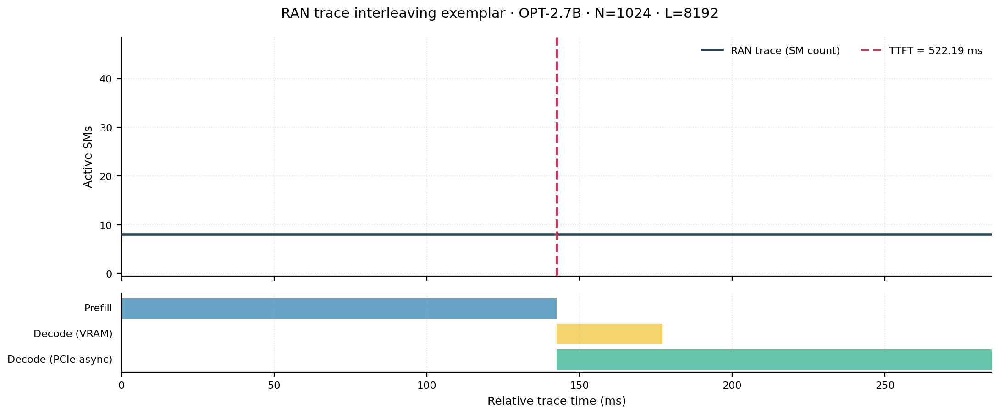
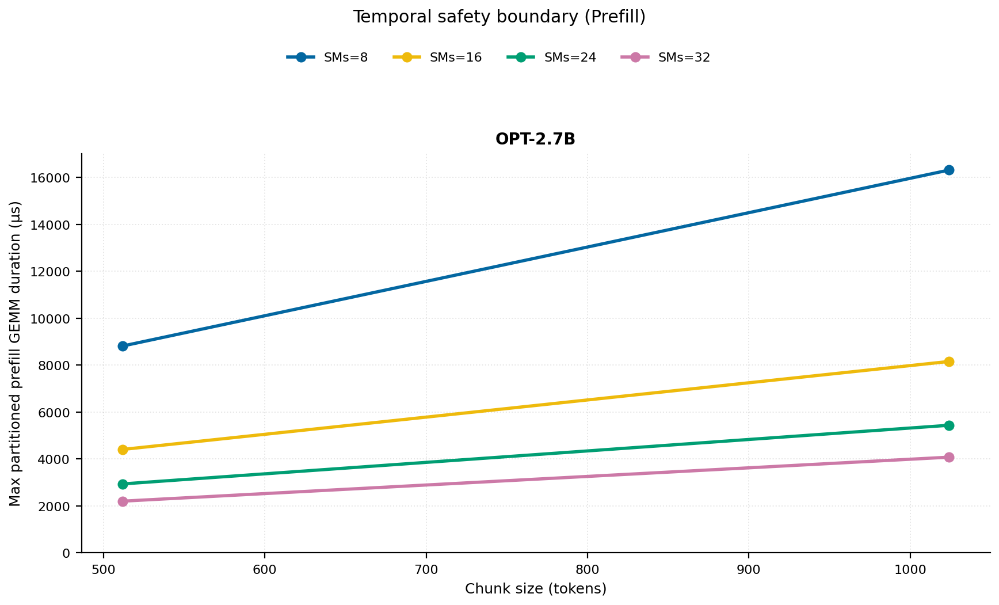
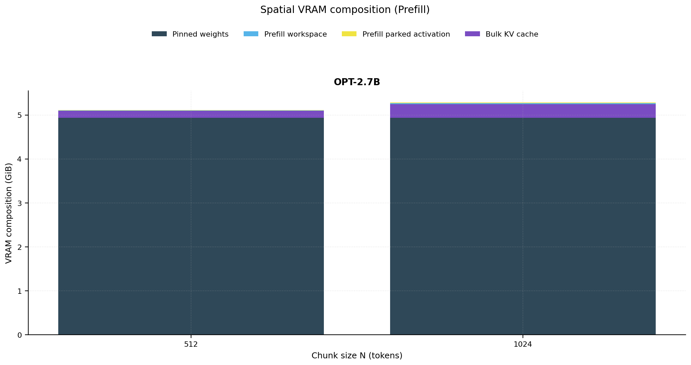
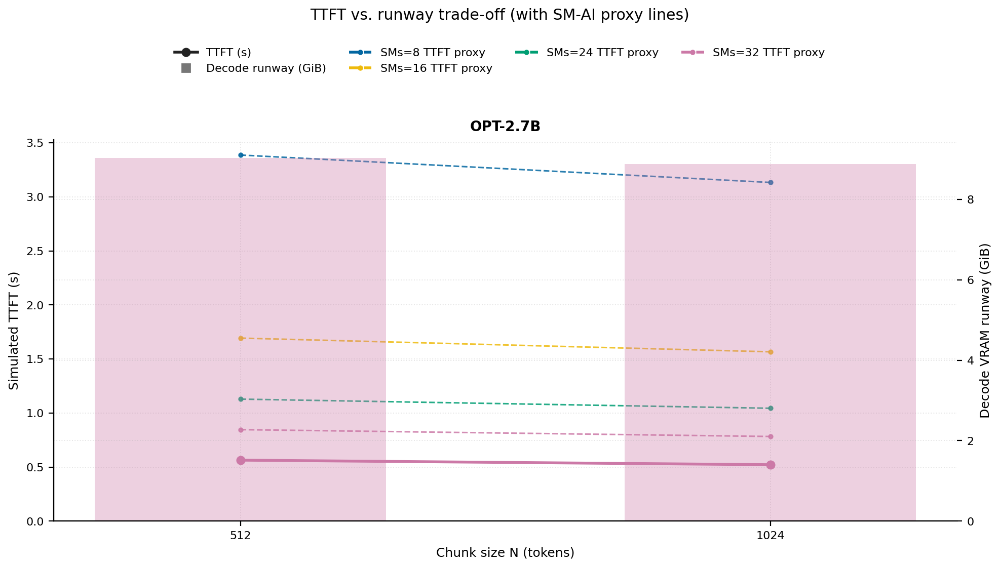
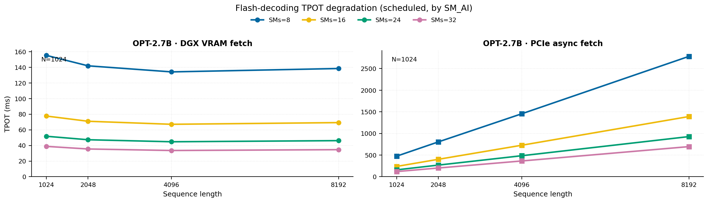
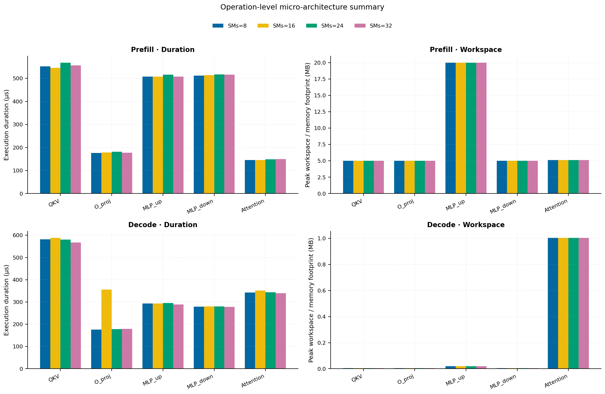
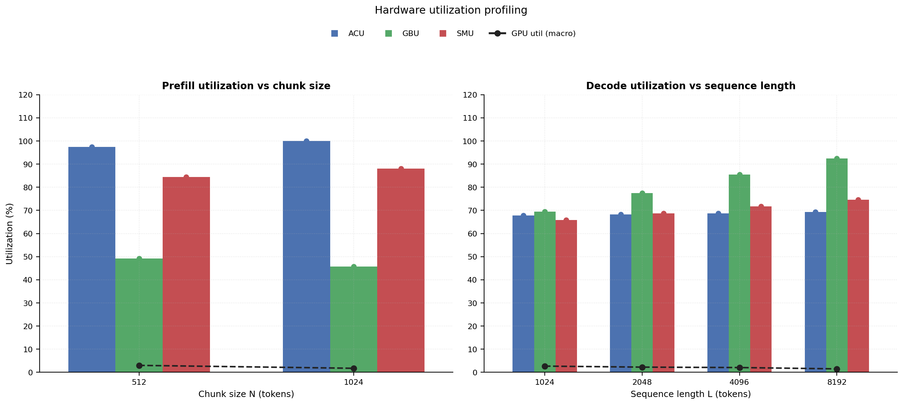

# RAN Inference Profiling Report

Run root: `/mnt/data/dheeraj/dicertation/inference-profile/runs/revised-rerun-20260415-171945-g5-opt27b-c512-1024`

## Environment

| field | value |
| --- | --- |
| cache_root | n/a |
| captured_at | 2026-04-15T16:19:53Z |
| chunk_sizes | [512, 1024] |
| cuda_available | true |
| cuda_device_count | 8 |
| cwd | /mnt/data/dheeraj/dicertation/inference-profile |
| decode_modes | ["vram", "pcie_async"] |
| experiment_type | ran-dgxspark-v1 |
| gpu_id | 5 |
| l_out | 1024 |
| models | ["facebook/opt-2.7b"] |
| platform | Linux-6.8.0-106-generic-x86_64-with-glibc2.35 |
| python_executable | /home/dheeraj/miniconda3/envs/mls/bin/python |
| python_version | 3.11.14 |
| run_root | /mnt/data/dheeraj/dicertation/inference-profile/runs/revised-rerun-20260415-171945-g5-opt27b-c512-1024 |
| scheduler | envelope_v1 |
| schema_version | ran_dgxspark_v1 |
| sequence_lengths | [1024, 2048, 4096, 8192] |
| sm_ai_cap | 32 |
| sm_ai_partition | 100 |
| sm_ai_partitions | [8, 16, 24, 32] |
| stage | profile |
| telemetry_tier | baseline_nvml_pt |
| timed_iterations | 5 |
| torch_available | true |
| torch_version | 2.10.0+cu128 |
| warmup_iterations | 3 |

## Model Constants

| model_id | sm_ai_partition | num_hidden_layers | hidden_size | num_attention_heads | ffn_dim | layer_index | layer_weight_bytes | total_weight_bytes_fp16 | vram_ceiling_bytes |
| --- | --- | --- | --- | --- | --- | --- | --- | --- | --- |
| facebook/opt-2.7b | 100 | 32 | 2560 | 32 | 10240 | 15 | 157352960 | 5303193600 | 15170115993 |

## Trace Inspection

### Primary trace

| field | value |
| --- | --- |
| errors | [] |
| header | ["frame", "slot", "time_slot_sched_ns", "time_decode_start_est_ns", "time_decode_end_est_ns", "time_decode_start_actual_ns", "time_decode_end_actual_ns", "decode_dur_us", "deadline_met", "target_sm", "profile_idx", "sm_count", "num_pusch", "sum_prb", "sum_tbs_bytes", "max_mcs"] |
| median_positive_delta_ms | 5.6997 |
| monotonicity.checked_column | time_slot_sched_ns |
| monotonicity.is_non_decreasing | true |
| monotonicity.negative_delta_count | 0 |
| monotonicity.positive_delta_count | 28377 |
| monotonicity.zero_delta_count | 0 |
| normalization.last_row_duration_policy | median_positive_forward_delta_ms |
| normalization.output_columns | ["time_ms", "sm_utilization", "slot_duration_ms", "source_schema", "sm_count"] |
| normalization.output_relative_path | derived/normalized_ldpc_trace.csv |
| normalized_row_count | 28378 |
| path | /mnt/raid0sata2/netsys/weaver-ext/ran/traces/e2e_2026030418/e2e_20260304_182034_tractor_ran_ctrl/ldpc_trace.csv |
| row_count | 28378 |
| schema_detected | schema_b |
| time_unit_hint | ns |
| usable | true |
| usage_policy | primary_only |
| used_for_scheduler_capacity | true |

### Secondary trace

| field | value |
| --- | --- |
| errors | ["ran_ctrl_trace.csv line 182958 has 9 field(s); expected 12"] |
| header | ["frame", "slot", "sm_available", "prbs_available", "prbs_allocated", "w_avg_mcs_prev", "w_avg_mcs_curr", "slots_since_underutil", "ramp_up_count", "num_ue_sched", "max_ue_backlog", "sum_ue_backlog"] |
| monotonicity.checked_column | n/a |
| monotonicity.is_non_decreasing | n/a |
| monotonicity.negative_delta_count | n/a |
| path | /mnt/raid0sata2/netsys/weaver-ext/ran/traces/e2e_2026030418/e2e_20260304_182034_tractor_ran_ctrl/ran_ctrl_trace.csv |
| row_count | 182956 |
| time_unit_hints | [] |
| usable | false |
| usage_policy | structural_only |
| used_for_scheduler_capacity | false |

## Raw-Profile Summary Tables

### Prefill profile summary

Source raw rows: `raw/prefill_events.csv` = 280. Summary artifact: `derived/prefill_summary.csv`.

| model_id | chunk_tokens | sm_ai_partition | max_input_tokens | prefill_max_gemm_us | prefill_workspace_bytes | prefill_parked_activation_bytes | telemetry_tier | telemetry_provider | telemetry_status | nvml_available | gpu_util | gpu_mem_used_mb | sm_clock_mhz | mem_clock_mhz | power_w | pt_step_ms | pt_mem_alloc_mb | pt_mem_reserved_mb | pt_workspace_mb | acu_pct | gbu_pct | smu_pct | microscopic_telemetry_status | microscopic_error |
| --- | --- | --- | --- | --- | --- | --- | --- | --- | --- | --- | --- | --- | --- | --- | --- | --- | --- | --- | --- | --- | --- | --- | --- | --- |
| facebook/opt-2.7b | 512 | 8 | 1024 | 366.592 | 10485760 | 10485760 | baseline_nvml_pt | nvidia-smi | ok | true | 0 | 55 | 1695 | 7601 | 61.36 | 0.3666 | 189.1689 | 189.1689 | 10 | 85.9554 | 56.712 | 72.401 | estimated | n/a |
| facebook/opt-2.7b | 512 | 16 | 1024 | 366.592 | 10485760 | 10485760 | baseline_nvml_pt | nvidia-smi | ok | true | 12 | 55 | 1695 | 7601 | 61.8 | 0.3666 | 189.1689 | 189.1689 | 10 | 93.5717 | 51.7213 | 80.4456 | estimated | n/a |
| facebook/opt-2.7b | 512 | 24 | 1024 | 366.688 | 10485760 | 10485760 | baseline_nvml_pt | nvidia-smi | ok | true | 0 | 55 | 1695 | 7601 | 61.81 | 0.3667 | 189.1689 | 189.1689 | 10 | 100 | 46.7307 | 88.4902 | estimated | n/a |
| facebook/opt-2.7b | 512 | 32 | 1024 | 367.488 | 10485760 | 10485760 | baseline_nvml_pt | nvidia-smi | ok | true | 0 | 55 | 1695 | 7601 | 61.81 | 0.3675 | 189.1689 | 189.1689 | 10 | 100 | 41.74 | 96.5347 | estimated | n/a |
| facebook/opt-2.7b | 1024 | 8 | 1024 | 681.984 | 20971520 | 20971520 | baseline_nvml_pt | nvidia-smi | ok | true | 7 | 55 | 1695 | 8001 | 64.18 | 0.682 | 219.1689 | 219.1689 | 20 | 90.3347 | 52.6223 | 75.4679 | estimated | n/a |
| facebook/opt-2.7b | 1024 | 16 | 1024 | 686.08 | 20971520 | 20971520 | baseline_nvml_pt | nvidia-smi | ok | true | 0 | 55 | 1695 | 7601 | 64.44 | 0.6861 | 219.1689 | 219.1689 | 20 | 98.339 | 47.9916 | 83.8532 | estimated | n/a |
| facebook/opt-2.7b | 1024 | 24 | 1024 | 702.464 | 20971520 | 20971520 | baseline_nvml_pt | nvidia-smi | ok | true | 0 | 55 | 1695 | 8001 | 63.9 | 0.7025 | 219.1689 | 219.1689 | 20 | 100 | 43.3608 | 92.2385 | estimated | n/a |
| facebook/opt-2.7b | 1024 | 32 | 1024 | 679.936 | 20971520 | 20971520 | baseline_nvml_pt | nvidia-smi | ok | true | 0 | 55 | 1695 | 7601 | 63.96 | 0.6799 | 219.1689 | 219.1689 | 20 | 100 | 38.73 | 100 | estimated | n/a |

### Decode profile summary

Source raw rows: `raw/decode_events.csv` = 2560. Summary artifact: `derived/decode_summary.csv`.

| model_id | sequence_length | block_size | sm_ai_partition | decode_mode | decode_max_gemv_us | attention_fetch_compute_us | reduction_overhead_us | decode_workspace_bytes | decode_parked_activation_bytes | telemetry_tier | telemetry_provider | telemetry_status | nvml_available | gpu_util | gpu_mem_used_mb | sm_clock_mhz | mem_clock_mhz | power_w | pt_step_ms | pt_mem_alloc_mb | pt_mem_reserved_mb | pt_workspace_mb | acu_pct | gbu_pct | smu_pct | microscopic_telemetry_status | microscopic_error |
| --- | --- | --- | --- | --- | --- | --- | --- | --- | --- | --- | --- | --- | --- | --- | --- | --- | --- | --- | --- | --- | --- | --- | --- | --- | --- | --- | --- |
| facebook/opt-2.7b | 1024 | 512 | 8 | pcie_async | 152.576 | 129.9968 | 21.8688 | 136192 | 5120 | baseline_nvml_pt | nvidia-smi | ok | true | 3 | 55 | 1695 | 8001 | 61.74 | 0.1526 | 169.2031 | 169.2031 | 0.1299 | 59.1162 | 76.7491 | 56.9606 | estimated | n/a |
| facebook/opt-2.7b | 1024 | 512 | 8 | vram | 172.16 | 136.64 | 19.8912 | 136192 | 5120 | baseline_nvml_pt | nvidia-smi | ok | true | 12 | 55 | 1695 | 7601 | 60.78 | 0.1722 | 169.2031 | 169.2031 | 0.1299 | 61.8222 | 69.7837 | 58.9539 | estimated | n/a |
| facebook/opt-2.7b | 1024 | 512 | 16 | pcie_async | 147.456 | 126.6624 | 19.4304 | 136192 | 5120 | baseline_nvml_pt | nvidia-smi | ok | true | 0 | 55 | 1695 | 7601 | 61.22 | 0.1475 | 169.2031 | 169.2031 | 0.1299 | 63.8245 | 74.1026 | 61.7878 | estimated | n/a |
| facebook/opt-2.7b | 1024 | 512 | 16 | vram | 158.72 | 128.7296 | 20.0192 | 136192 | 5120 | baseline_nvml_pt | nvidia-smi | ok | true | 0 | 55 | 1695 | 7601 | 61.1 | 0.1587 | 169.2031 | 169.2031 | 0.1299 | 66.7287 | 67.5326 | 64.6591 | estimated | n/a |
| facebook/opt-2.7b | 1024 | 512 | 24 | pcie_async | 159.648 | 131.904 | 21.2928 | 136192 | 5120 | baseline_nvml_pt | nvidia-smi | ok | true | 0 | 55 | 1695 | 7601 | 61.8 | 0.1596 | 169.2031 | 169.2031 | 0.1299 | 68.5329 | 71.456 | 66.615 | estimated | n/a |
| facebook/opt-2.7b | 1024 | 512 | 24 | vram | 164.864 | 125.7152 | 21.536 | 136192 | 5120 | baseline_nvml_pt | nvidia-smi | ok | true | 0 | 55 | 1695 | 7601 | 61.74 | 0.1649 | 169.2031 | 169.2031 | 0.1299 | 71.6352 | 65.2815 | 70.3643 | estimated | n/a |
| facebook/opt-2.7b | 1024 | 512 | 32 | pcie_async | 179.2 | 126.7968 | 20.3136 | 136192 | 5120 | baseline_nvml_pt | nvidia-smi | ok | true | 0 | 55 | 1695 | 7601 | 61.58 | 0.1792 | 169.2031 | 169.2031 | 0.1299 | 73.2413 | 68.8095 | 71.4422 | estimated | n/a |
| facebook/opt-2.7b | 1024 | 512 | 32 | vram | 174.08 | 127.3792 | 19.8336 | 136192 | 5120 | baseline_nvml_pt | nvidia-smi | ok | true | 0 | 55 | 1695 | 7601 | 61.47 | 0.1741 | 169.2031 | 169.2031 | 0.1299 | 76.5417 | 63.0304 | 76.0695 | estimated | n/a |
| facebook/opt-2.7b | 1024 | 1024 | 8 | pcie_async | 153.6 | 127.0464 | 21.3376 | 136192 | 5120 | baseline_nvml_pt | nvidia-smi | ok | true | 0 | 55 | 1695 | 8001 | 61.95 | 0.1536 | 169.2031 | 169.2031 | 0.1299 | 59.1162 | 76.3141 | 56.9606 | estimated | n/a |
| facebook/opt-2.7b | 1024 | 1024 | 8 | vram | 205.824 | 130.4128 | 20.0192 | 136192 | 5120 | baseline_nvml_pt | nvidia-smi | ok | true | 0 | 55 | 1695 | 7601 | 61.81 | 0.2058 | 169.2031 | 169.2031 | 0.1299 | 62.1372 | 69.3962 | 58.9539 | estimated | n/a |
| facebook/opt-2.7b | 1024 | 1024 | 16 | pcie_async | 198.656 | 138.3744 | 21.2608 | 136192 | 5120 | baseline_nvml_pt | nvidia-smi | ok | true | 12 | 55 | 1695 | 7601 | 61.39 | 0.1987 | 169.2031 | 169.2031 | 0.1299 | 63.8245 | 73.6826 | 61.7878 | estimated | n/a |
| facebook/opt-2.7b | 1024 | 1024 | 16 | vram | 211.04 | 147.904 | 22.3296 | 136192 | 5120 | baseline_nvml_pt | nvidia-smi | ok | true | 2 | 55 | 1695 | 7601 | 61.72 | 0.211 | 169.2031 | 169.2031 | 0.1299 | 67.0687 | 67.1576 | 64.6591 | estimated | n/a |
| facebook/opt-2.7b | 1024 | 1024 | 24 | pcie_async | 155.648 | 127.5584 | 20.896 | 136192 | 5120 | baseline_nvml_pt | nvidia-smi | ok | true | 7 | 55 | 1695 | 7601 | 61.93 | 0.1556 | 169.2031 | 169.2031 | 0.1299 | 68.5329 | 71.051 | 66.615 | estimated | n/a |
| facebook/opt-2.7b | 1024 | 1024 | 24 | vram | 186.368 | 140.6848 | 22.9888 | 136192 | 5120 | baseline_nvml_pt | nvidia-smi | ok | true | 0 | 55 | 1695 | 7601 | 61.97 | 0.1864 | 169.2031 | 169.2031 | 0.1299 | 72.0002 | 64.919 | 70.3643 | estimated | n/a |
| facebook/opt-2.7b | 1024 | 1024 | 32 | pcie_async | 163.68 | 130.432 | 20.1152 | 136192 | 5120 | baseline_nvml_pt | nvidia-smi | ok | true | 7 | 55 | 1695 | 7601 | 62.05 | 0.1637 | 169.2031 | 169.2031 | 0.1299 | 73.2413 | 68.4195 | 71.4422 | estimated | n/a |
| facebook/opt-2.7b | 1024 | 1024 | 32 | vram | 177.216 | 129.9904 | 19.968 | 136192 | 5120 | baseline_nvml_pt | nvidia-smi | ok | true | 0 | 55 | 1695 | 7601 | 62.4 | 0.1772 | 169.2031 | 169.2031 | 0.1299 | 76.9317 | 62.6804 | 76.0695 | estimated | n/a |
| facebook/opt-2.7b | 2048 | 512 | 8 | pcie_async | 165.888 | 133.9136 | 20.6912 | 267264 | 5120 | baseline_nvml_pt | nvidia-smi | ok | true | 0 | 55 | 1695 | 7601 | 61.8 | 0.1659 | 178.4531 | 178.4531 | 0.2549 | 57.7815 | 86.6847 | 58.9444 | estimated | n/a |
| facebook/opt-2.7b | 2048 | 512 | 8 | vram | 269.024 | 128.3776 | 19.8336 | 267264 | 5120 | baseline_nvml_pt | nvidia-smi | ok | true | 3 | 55 | 1695 | 7601 | 61.95 | 0.269 | 178.4531 | 178.4531 | 0.2549 | 63.9404 | 76.0286 | 61.8652 | estimated | n/a |
| facebook/opt-2.7b | 2048 | 512 | 16 | pcie_async | 166.912 | 128.992 | 20.6208 | 267264 | 5120 | baseline_nvml_pt | nvidia-smi | ok | true | 2 | 55 | 1695 | 7601 | 61.78 | 0.1669 | 178.4531 | 178.4531 | 0.2549 | 62.3835 | 83.6956 | 63.9397 | estimated | n/a |
| facebook/opt-2.7b | 2048 | 512 | 16 | vram | 181.12 | 142.0928 | 23.5264 | 267264 | 5120 | baseline_nvml_pt | nvidia-smi | ok | true | 13 | 55 | 1695 | 7601 | 61.56 | 0.1954 | 178.4531 | 178.4531 | 0.2549 | 69.015 | 73.5761 | 67.8522 | estimated | n/a |
| facebook/opt-2.7b | 2048 | 512 | 24 | pcie_async | 176.128 | 139.6608 | 21.152 | 267264 | 5120 | baseline_nvml_pt | nvidia-smi | ok | true | 1 | 55 | 1695 | 7601 | 62.01 | 0.1761 | 178.4531 | 178.4531 | 0.2549 | 66.9856 | 80.7065 | 68.935 | estimated | n/a |
| facebook/opt-2.7b | 2048 | 512 | 24 | vram | 242.688 | 129.4016 | 20.1984 | 267264 | 5120 | baseline_nvml_pt | nvidia-smi | ok | true | 0 | 55 | 1695 | 7601 | 62.06 | 0.2427 | 178.4531 | 178.4531 | 0.2549 | 74.0897 | 71.1235 | 73.8391 | estimated | n/a |
| facebook/opt-2.7b | 2048 | 512 | 32 | pcie_async | 150.528 | 126.176 | 19.5776 | 267264 | 5120 | baseline_nvml_pt | nvidia-smi | ok | true | 0 | 55 | 1695 | 7601 | 62 | 0.1505 | 178.4531 | 178.4531 | 0.2549 | 71.5877 | 77.7173 | 73.9303 | estimated | n/a |
| facebook/opt-2.7b | 2048 | 512 | 32 | vram | 193.536 | 178.0992 | 21.5104 | 267264 | 5120 | baseline_nvml_pt | nvidia-smi | ok | true | 0 | 55 | 1695 | 7601 | 61.75 | 0.263 | 178.4531 | 178.4531 | 0.2549 | 79.1643 | 68.671 | 79.8261 | estimated | n/a |
| facebook/opt-2.7b | 2048 | 1024 | 8 | pcie_async | 173.056 | 135.9616 | 20.2176 | 267264 | 5120 | baseline_nvml_pt | nvidia-smi | ok | true | 0 | 55 | 1695 | 7601 | 62.2 | 0.1731 | 178.4531 | 178.4531 | 0.2549 | 57.7815 | 87.1197 | 59.1411 | estimated | n/a |
| facebook/opt-2.7b | 2048 | 1024 | 8 | vram | 214.016 | 151.5968 | 20.8256 | 267264 | 5120 | baseline_nvml_pt | nvidia-smi | ok | true | 0 | 55 | 1695 | 7601 | 62.39 | 0.2335 | 178.4531 | 178.4531 | 0.2549 | 64.4654 | 76.1578 | 62.0719 | estimated | n/a |
| facebook/opt-2.7b | 2048 | 1024 | 16 | pcie_async | 162.816 | 165.8304 | 19.8336 | 267264 | 5120 | baseline_nvml_pt | nvidia-smi | ok | true | 5 | 55 | 1695 | 7601 | 62.02 | 0.3166 | 178.4531 | 178.4531 | 0.2549 | 62.3835 | 84.1156 | 64.153 | estimated | n/a |
| facebook/opt-2.7b | 2048 | 1024 | 16 | vram | 421.888 | 156.3456 | 24.544 | 267264 | 5120 | baseline_nvml_pt | nvidia-smi | ok | true | 0 | 55 | 1695 | 7601 | 61.99 | 0.4219 | 178.4531 | 178.4531 | 0.2549 | 69.5817 | 73.7011 | 68.0788 | estimated | n/a |
| facebook/opt-2.7b | 2048 | 1024 | 24 | pcie_async | 196.48 | 140.0832 | 21.6064 | 267264 | 5120 | baseline_nvml_pt | nvidia-smi | ok | true | 12 | 55 | 1695 | 7601 | 61.89 | 0.1965 | 178.4531 | 178.4531 | 0.2549 | 66.9856 | 81.1115 | 69.165 | estimated | n/a |
| facebook/opt-2.7b | 2048 | 1024 | 24 | vram | 177.152 | 128.4352 | 19.8784 | 267264 | 5120 | baseline_nvml_pt | nvidia-smi | ok | true | 0 | 55 | 1695 | 7601 | 62 | 0.1772 | 178.4531 | 178.4531 | 0.2549 | 74.698 | 71.2444 | 74.0858 | estimated | n/a |
| facebook/opt-2.7b | 2048 | 1024 | 32 | pcie_async | 164.864 | 132.96 | 20.2752 | 267264 | 5120 | baseline_nvml_pt | nvidia-smi | ok | true | 0 | 55 | 1695 | 7601 | 62.45 | 0.1649 | 178.4531 | 178.4531 | 0.2549 | 71.5877 | 78.1073 | 74.1769 | estimated | n/a |
| facebook/opt-2.7b | 2048 | 1024 | 32 | vram | 160.672 | 124.704 | 19.8656 | 267264 | 5120 | baseline_nvml_pt | nvidia-smi | ok | true | 0 | 55 | 1695 | 7601 | 62.19 | 0.1607 | 178.4531 | 178.4531 | 0.2549 | 79.8143 | 68.7877 | 80.0927 | estimated | n/a |
| facebook/opt-2.7b | 4096 | 512 | 8 | pcie_async | 225.28 | 163.6352 | 20.3008 | 529408 | 5120 | baseline_nvml_pt | nvidia-smi | ok | true | 2 | 55 | 1695 | 7601 | 62.48 | 0.2253 | 198.7031 | 198.7031 | 0.5049 | 56.4468 | 96.6203 | 60.9282 | estimated | n/a |
| facebook/opt-2.7b | 4096 | 512 | 8 | vram | 168.096 | 139.4112 | 19.1552 | 529408 | 5120 | baseline_nvml_pt | nvidia-smi | ok | true | 8 | 55 | 1695 | 7601 | 62.13 | 0.1681 | 198.7031 | 198.7031 | 0.5049 | 66.0587 | 82.2735 | 64.7765 | estimated | n/a |
| facebook/opt-2.7b | 4096 | 512 | 16 | pcie_async | 148.48 | 148.7616 | 19.8976 | 529408 | 5120 | baseline_nvml_pt | nvidia-smi | ok | true | 1 | 55 | 1695 | 7601 | 63.28 | 0.1801 | 198.7031 | 198.7031 | 0.5049 | 60.9425 | 93.2886 | 66.0916 | estimated | n/a |
| facebook/opt-2.7b | 4096 | 512 | 16 | vram | 4121.664 | 143.7696 | 20.6144 | 529408 | 5120 | baseline_nvml_pt | nvidia-smi | ok | true | 0 | 55 | 1695 | 8001 | 63.14 | 4.1217 | 198.7031 | 198.7031 | 0.5049 | 71.3014 | 79.6195 | 71.0452 | estimated | n/a |
| facebook/opt-2.7b | 4096 | 512 | 24 | pcie_async | 149.504 | 142.5088 | 19.2128 | 529408 | 5120 | baseline_nvml_pt | nvidia-smi | ok | true | 0 | 55 | 1695 | 8001 | 63.43 | 0.1577 | 198.7031 | 198.7031 | 0.5049 | 65.4383 | 89.9569 | 71.255 | estimated | n/a |
| facebook/opt-2.7b | 4096 | 512 | 24 | vram | 206.848 | 148.8896 | 19.9296 | 529408 | 5120 | baseline_nvml_pt | nvidia-smi | ok | true | 0 | 55 | 1695 | 7601 | 62.94 | 0.2068 | 198.7031 | 198.7031 | 0.5049 | 76.5442 | 76.9655 | 77.3139 | estimated | n/a |
| facebook/opt-2.7b | 4096 | 512 | 32 | pcie_async | 155.392 | 146.4576 | 19.9808 | 529408 | 5120 | baseline_nvml_pt | nvidia-smi | ok | true | 0 | 55 | 1695 | 7601 | 62.9 | 0.1554 | 198.7031 | 198.7031 | 0.5049 | 69.934 | 86.6251 | 76.4184 | estimated | n/a |
| facebook/opt-2.7b | 4096 | 512 | 32 | vram | 232.672 | 144.3776 | 20.7296 | 529408 | 5120 | baseline_nvml_pt | nvidia-smi | ok | true | 0 | 55 | 1695 | 7601 | 62.95 | 0.2327 | 198.7031 | 198.7031 | 0.5049 | 81.7869 | 74.3116 | 83.5826 | estimated | n/a |
| facebook/opt-2.7b | 4096 | 1024 | 8 | pcie_async | 173.056 | 145.408 | 19.9168 | 529408 | 5120 | baseline_nvml_pt | nvidia-smi | ok | true | 0 | 55 | 1695 | 7601 | 63.2 | 0.1731 | 198.7031 | 198.7031 | 0.5049 | 56.4468 | 97.9253 | 61.3215 | estimated | n/a |
| facebook/opt-2.7b | 4096 | 1024 | 8 | vram | 148.64 | 143.3344 | 19.616 | 529408 | 5120 | baseline_nvml_pt | nvidia-smi | ok | true | 0 | 55 | 1695 | 7601 | 63.23 | 0.1586 | 198.7031 | 198.7031 | 0.5049 | 66.7937 | 82.9193 | 65.1898 | estimated | n/a |
| facebook/opt-2.7b | 4096 | 1024 | 16 | pcie_async | 3100.6401 | 142.2976 | 21.4592 | 529408 | 5120 | baseline_nvml_pt | nvidia-smi | ok | true | 7 | 55 | 1695 | 8001 | 63.26 | 3.1006 | 198.7031 | 198.7031 | 0.5049 | 60.9425 | 94.5486 | 66.5182 | estimated | n/a |
| facebook/opt-2.7b | 4096 | 1024 | 16 | vram | 217.824 | 147.5968 | 20.4992 | 529408 | 5120 | baseline_nvml_pt | nvidia-smi | ok | true | 1 | 55 | 1695 | 7601 | 62.88 | 0.2178 | 198.7031 | 198.7031 | 0.5049 | 72.0947 | 80.2445 | 71.4985 | estimated | n/a |
| facebook/opt-2.7b | 4096 | 1024 | 24 | pcie_async | 155.648 | 144.1152 | 20.0512 | 529408 | 5120 | baseline_nvml_pt | nvidia-smi | ok | true | 0 | 55 | 1695 | 7601 | 63.01 | 0.1556 | 198.7031 | 198.7031 | 0.5049 | 65.4383 | 91.1719 | 71.715 | estimated | n/a |
| facebook/opt-2.7b | 4096 | 1024 | 24 | vram | 314.176 | 170.1696 | 19.9232 | 529408 | 5120 | baseline_nvml_pt | nvidia-smi | ok | true | 0 | 55 | 1695 | 7601 | 63.01 | 0.3142 | 198.7031 | 198.7031 | 0.5049 | 77.3958 | 77.5697 | 77.8072 | estimated | n/a |
| facebook/opt-2.7b | 4096 | 1024 | 32 | pcie_async | 154.624 | 139.232 | 19.2704 | 529408 | 5120 | baseline_nvml_pt | nvidia-smi | ok | true | 14 | 55 | 1695 | 7601 | 63.09 | 0.1546 | 198.7031 | 198.7031 | 0.5049 | 69.934 | 87.7951 | 76.9117 | estimated | n/a |
| facebook/opt-2.7b | 4096 | 1024 | 32 | vram | 148.48 | 137.3696 | 19.6224 | 529408 | 5120 | baseline_nvml_pt | nvidia-smi | ok | true | 0 | 55 | 1695 | 7601 | 63.48 | 0.1485 | 198.7031 | 198.7031 | 0.5049 | 82.6969 | 74.8949 | 84.1159 | estimated | n/a |
| facebook/opt-2.7b | 8192 | 512 | 8 | pcie_async | 145.472 | 187.8016 | 19.0912 | 1053696 | 5120 | baseline_nvml_pt | nvidia-smi | ok | true | 0 | 55 | 1695 | 7601 | 63.61 | 0.1925 | 239.2031 | 239.2031 | 1.0049 | 55.1121 | 100 | 62.9119 | estimated | n/a |
| facebook/opt-2.7b | 8192 | 512 | 8 | vram | 157.728 | 188.3648 | 18.8864 | 1053696 | 5120 | baseline_nvml_pt | nvidia-smi | ok | true | 0 | 55 | 1695 | 7601 | 63.38 | 0.1915 | 239.2031 | 239.2031 | 1.0049 | 68.1769 | 88.5184 | 67.6878 | estimated | n/a |
| facebook/opt-2.7b | 8192 | 512 | 16 | pcie_async | 149.504 | 189.6448 | 19.8656 | 1053696 | 5120 | baseline_nvml_pt | nvidia-smi | ok | true | 0 | 55 | 1695 | 7601 | 63.32 | 0.1935 | 239.2031 | 239.2031 | 1.0049 | 59.5015 | 100 | 68.2435 | estimated | n/a |
| facebook/opt-2.7b | 8192 | 512 | 16 | vram | 146.208 | 187.552 | 19.8144 | 1053696 | 5120 | baseline_nvml_pt | nvidia-smi | ok | true | 0 | 55 | 1695 | 7601 | 63.38 | 0.1925 | 239.2031 | 239.2031 | 1.0049 | 73.5878 | 85.663 | 74.2382 | estimated | n/a |
| facebook/opt-2.7b | 8192 | 512 | 24 | pcie_async | 178.176 | 188.1408 | 19.8208 | 1053696 | 5120 | baseline_nvml_pt | nvidia-smi | ok | true | 0 | 55 | 1695 | 7601 | 63.58 | 0.1935 | 239.2031 | 239.2031 | 1.0049 | 63.891 | 99.2073 | 73.575 | estimated | n/a |
| facebook/opt-2.7b | 8192 | 512 | 24 | vram | 148.48 | 188.416 | 18.4448 | 1053696 | 5120 | baseline_nvml_pt | nvidia-smi | ok | true | 0 | 55 | 1695 | 7601 | 63.25 | 0.1966 | 239.2031 | 239.2031 | 1.0049 | 78.9987 | 82.8076 | 80.7887 | estimated | n/a |
| facebook/opt-2.7b | 8192 | 512 | 32 | pcie_async | 149.504 | 187.3408 | 19.808 | 1053696 | 5120 | baseline_nvml_pt | nvidia-smi | ok | true | 0 | 55 | 1695 | 7601 | 63.42 | 0.1925 | 239.2031 | 239.2031 | 1.0049 | 68.2804 | 95.5329 | 78.9065 | estimated | n/a |
| facebook/opt-2.7b | 8192 | 512 | 32 | vram | 146.432 | 186.7776 | 19.2192 | 1053696 | 5120 | baseline_nvml_pt | nvidia-smi | ok | true | 0 | 55 | 1695 | 7601 | 63.75 | 0.1905 | 239.2031 | 239.2031 | 1.0049 | 84.4095 | 79.9521 | 87.3391 | estimated | n/a |
| facebook/opt-2.7b | 8192 | 1024 | 8 | pcie_async | 154.624 | 192.0704 | 20.3008 | 1053696 | 5120 | baseline_nvml_pt | nvidia-smi | ok | true | 0 | 55 | 1695 | 7601 | 63.2 | 0.1965 | 239.2031 | 239.2031 | 1.0049 | 55.1121 | 100 | 63.5019 | estimated | n/a |
| facebook/opt-2.7b | 8192 | 1024 | 8 | vram | 162.72 | 188.384 | 20.4672 | 1053696 | 5120 | baseline_nvml_pt | nvidia-smi | ok | true | 0 | 55 | 1695 | 7601 | 63.24 | 0.1935 | 239.2031 | 239.2031 | 1.0049 | 69.1219 | 89.6809 | 68.3078 | estimated | n/a |
| facebook/opt-2.7b | 8192 | 1024 | 16 | pcie_async | 149.408 | 189.9776 | 21.7088 | 1053696 | 5120 | baseline_nvml_pt | nvidia-smi | ok | true | 13 | 55 | 1695 | 7601 | 63.07 | 0.2005 | 239.2031 | 239.2031 | 1.0049 | 59.5015 | 100 | 68.8835 | estimated | n/a |
| facebook/opt-2.7b | 8192 | 1024 | 16 | vram | 148.192 | 189.792 | 20.4288 | 1053696 | 5120 | baseline_nvml_pt | nvidia-smi | ok | true | 0 | 55 | 1695 | 8001 | 63.3 | 0.1925 | 239.2031 | 239.2031 | 1.0049 | 74.6078 | 86.788 | 74.9182 | estimated | n/a |
| facebook/opt-2.7b | 8192 | 1024 | 24 | pcie_async | 148.48 | 188.9792 | 20.3904 | 1053696 | 5120 | baseline_nvml_pt | nvidia-smi | ok | true | 0 | 55 | 1695 | 7601 | 63.53 | 0.1925 | 239.2031 | 239.2031 | 1.0049 | 63.891 | 100 | 74.265 | estimated | n/a |
| facebook/opt-2.7b | 8192 | 1024 | 24 | vram | 148.48 | 190.688 | 20.832 | 1053696 | 5120 | baseline_nvml_pt | nvidia-smi | ok | true | 7 | 55 | 1695 | 8001 | 63.88 | 0.1976 | 239.2031 | 239.2031 | 1.0049 | 80.0937 | 83.8951 | 81.5287 | estimated | n/a |
| facebook/opt-2.7b | 8192 | 1024 | 32 | pcie_async | 157.696 | 191.8656 | 20.0704 | 1053696 | 5120 | baseline_nvml_pt | nvidia-smi | ok | true | 4 | 55 | 1695 | 7601 | 63.46 | 0.1976 | 239.2031 | 239.2031 | 1.0049 | 68.2804 | 97.4829 | 79.6465 | estimated | n/a |
| facebook/opt-2.7b | 8192 | 1024 | 32 | vram | 145.408 | 190.1504 | 19.0912 | 1053696 | 5120 | baseline_nvml_pt | nvidia-smi | ok | true | 0 | 55 | 1695 | 7601 | 63.39 | 0.1975 | 239.2031 | 239.2031 | 1.0049 | 85.5795 | 81.0021 | 88.1391 | estimated | n/a |

### PCIe profile summary

Source raw rows: `raw/pcie_events.csv` = 10. Summary artifact: `derived/pcie_summary.csv`.

| model_id | block_size | kv_block_bytes | transfer_only_us | overlap_total_us | dummy_compute_us | exposed_transfer_us | effective_gbps | overlap_status | telemetry_tier | telemetry_provider | telemetry_status | nvml_available | gpu_util | gpu_mem_used_mb | sm_clock_mhz | mem_clock_mhz | power_w | pt_step_ms | pt_mem_alloc_mb | pt_mem_reserved_mb | pt_workspace_mb | acu_pct | gbu_pct | smu_pct | microscopic_telemetry_status | microscopic_error |
| --- | --- | --- | --- | --- | --- | --- | --- | --- | --- | --- | --- | --- | --- | --- | --- | --- | --- | --- | --- | --- | --- | --- | --- | --- | --- | --- |
| facebook/opt-2.7b | 512 | 5242880 | 993.4784 | 29854.1892 | 29103.1627 | 751.0265 | 5.2773 | measured | baseline_nvml_pt | nvidia-smi | partial | true | 0 | 55 | 1695 | 7601 | 52.92 | n/a | n/a | n/a | n/a | 65 | 65 | 65 | estimated | n/a |
| facebook/opt-2.7b | 1024 | 10485760 | 4172.512 | 49880.0435 | 47308.0434 | 2572.0001 | 2.5131 | measured | baseline_nvml_pt | nvidia-smi | partial | true | 9 | 55 | 1695 | 8001 | 63.42 | n/a | n/a | n/a | n/a | 65 | 65 | 65 | estimated | n/a |

## SLA Tables

### Successful configurations

| model_id | chunk_tokens | sequence_length | ttft_ms | tpot_ms_vram | tpot_ms_pcie_async | decode_runway_tokens | status |
| --- | --- | --- | --- | --- | --- | --- | --- |
| facebook/opt-2.7b | 512 | 1024 | 564.4616 | 38.1342 | 87.1796 | 29599 | success |
| facebook/opt-2.7b | 512 | 2048 | 564.4616 | 43.5464 | 129.6969 | 29598 | success |
| facebook/opt-2.7b | 512 | 4096 | 564.4616 | 49.9565 | 227.4241 | 29597 | success |
| facebook/opt-2.7b | 512 | 8192 | 564.4616 | 34.7068 | 419.8591 | 29596 | success |
| facebook/opt-2.7b | 1024 | 1024 | 522.1908 | 38.8241 | 118.5481 | 29087 | success |
| facebook/opt-2.7b | 1024 | 2048 | 522.1908 | 35.4753 | 201.1654 | 29086 | success |
| facebook/opt-2.7b | 1024 | 4096 | 522.1908 | 33.5319 | 363.9759 | 29085 | success |
| facebook/opt-2.7b | 1024 | 8192 | 522.1908 | 34.6141 | 695.4916 | 29084 | success |

### Failed configurations

No rows available.

## Per-Model Scaling Analysis

| model_id | successful_configs | failed_configs | chunk_tokens_tested | sequence_lengths_tested | largest_successful_chunk_tokens | ttft_ms_min | ttft_ms_max | tpot_ms_vram_min | tpot_ms_vram_max | tpot_ms_pcie_async_min | tpot_ms_pcie_async_max | max_decode_runway_tokens |
| --- | --- | --- | --- | --- | --- | --- | --- | --- | --- | --- | --- | --- |
| facebook/opt-2.7b | 8 | 0 | 512, 1024 | 1024, 2048, 4096, 8192 | 1024 | 522.1908 | 564.4616 | 33.5319 | 49.9565 | 87.1796 | 695.4916 | 29599 |

## Plots

### Revised 01 Ran Trace Interleaving

[Interactive companion](../plots/revised_01_ran_trace_interleaving_interactive.html)

### Revised 02 Prefill Safety Boundary

### Revised 03 Prefill Vram Composition

### Revised 04 Ttft Vs Runway

### Revised 05 Decode Tpot Degradation

### Revised 06 Operation Level Microarchitecture Summary

### Revised 07 Hardware Utilization Profiling

### Revised 08 Decode Memory Consumption

### 09 Spatial VRAM Composition (Prefill) · Pie View

