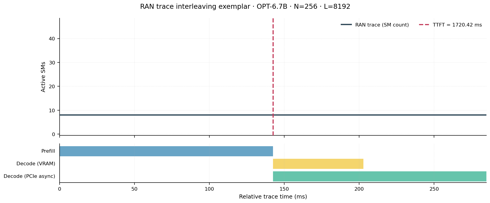
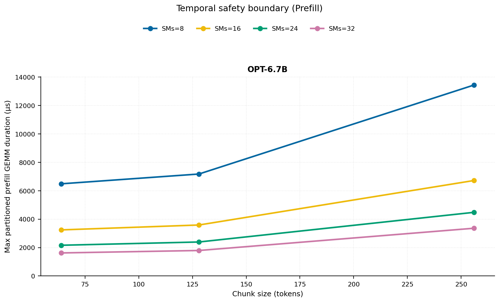
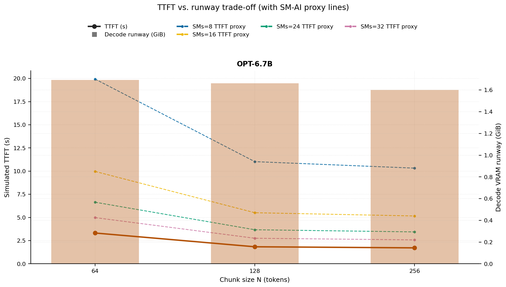
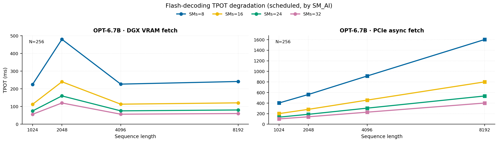
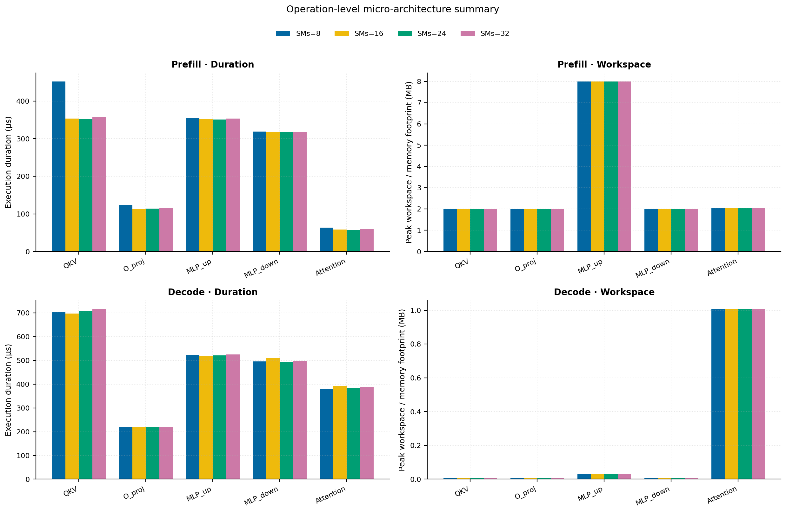
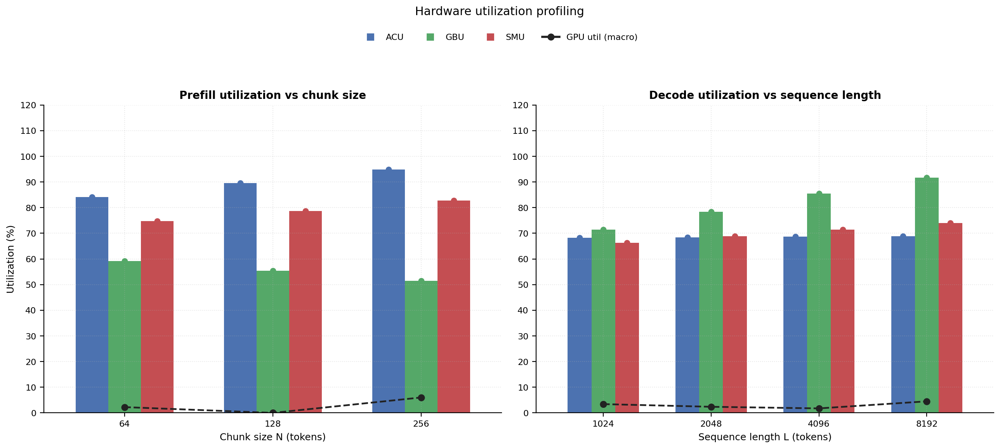
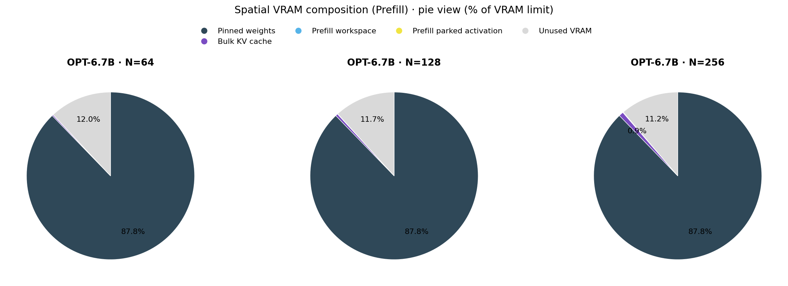

# RAN Inference Profiling Report

Run root: `/mnt/data/dheeraj/dicertation/inference-profile/runs/revised-rerun-20260415-171945-g6-opt67b-c64-256`

## Environment

| field | value |
| --- | --- |
| cache_root | n/a |
| captured_at | 2026-04-15T16:19:53Z |
| chunk_sizes | [64, 128, 256] |
| cuda_available | true |
| cuda_device_count | 8 |
| cwd | /mnt/data/dheeraj/dicertation/inference-profile |
| decode_modes | ["vram", "pcie_async"] |
| experiment_type | ran-dgxspark-v1 |
| gpu_id | 6 |
| l_out | 1024 |
| models | ["facebook/opt-6.7b"] |
| platform | Linux-6.8.0-106-generic-x86_64-with-glibc2.35 |
| python_executable | /home/dheeraj/miniconda3/envs/mls/bin/python |
| python_version | 3.11.14 |
| run_root | /mnt/data/dheeraj/dicertation/inference-profile/runs/revised-rerun-20260415-171945-g6-opt67b-c64-256 |
| scheduler | envelope_v1 |
| schema_version | ran_dgxspark_v1 |
| sequence_lengths | [1024, 2048, 4096, 8192] |
| sm_ai_cap | 32 |
| sm_ai_partition | 100 |
| sm_ai_partitions | [8, 16, 24, 32] |
| stage | profile |
| telemetry_tier | baseline_nvml_pt |
| timed_iterations | 5 |
| torch_available | true |
| torch_version | 2.10.0+cu128 |
| warmup_iterations | 3 |

## Model Constants

| model_id | sm_ai_partition | num_hidden_layers | hidden_size | num_attention_heads | ffn_dim | layer_index | layer_weight_bytes | total_weight_bytes_fp16 | vram_ceiling_bytes |
| --- | --- | --- | --- | --- | --- | --- | --- | --- | --- |
| facebook/opt-6.7b | 100 | 32 | 4096 | 32 | 16384 | 15 | 402759680 | 13316947968 | 15170115993 |

## Trace Inspection

### Primary trace

| field | value |
| --- | --- |
| errors | [] |
| header | ["frame", "slot", "time_slot_sched_ns", "time_decode_start_est_ns", "time_decode_end_est_ns", "time_decode_start_actual_ns", "time_decode_end_actual_ns", "decode_dur_us", "deadline_met", "target_sm", "profile_idx", "sm_count", "num_pusch", "sum_prb", "sum_tbs_bytes", "max_mcs"] |
| median_positive_delta_ms | 5.6997 |
| monotonicity.checked_column | time_slot_sched_ns |
| monotonicity.is_non_decreasing | true |
| monotonicity.negative_delta_count | 0 |
| monotonicity.positive_delta_count | 28377 |
| monotonicity.zero_delta_count | 0 |
| normalization.last_row_duration_policy | median_positive_forward_delta_ms |
| normalization.output_columns | ["time_ms", "sm_utilization", "slot_duration_ms", "source_schema", "sm_count"] |
| normalization.output_relative_path | derived/normalized_ldpc_trace.csv |
| normalized_row_count | 28378 |
| path | /mnt/raid0sata2/netsys/weaver-ext/ran/traces/e2e_2026030418/e2e_20260304_182034_tractor_ran_ctrl/ldpc_trace.csv |
| row_count | 28378 |
| schema_detected | schema_b |
| time_unit_hint | ns |
| usable | true |
| usage_policy | primary_only |
| used_for_scheduler_capacity | true |

### Secondary trace

| field | value |
| --- | --- |
| errors | ["ran_ctrl_trace.csv line 182958 has 9 field(s); expected 12"] |
| header | ["frame", "slot", "sm_available", "prbs_available", "prbs_allocated", "w_avg_mcs_prev", "w_avg_mcs_curr", "slots_since_underutil", "ramp_up_count", "num_ue_sched", "max_ue_backlog", "sum_ue_backlog"] |
| monotonicity.checked_column | n/a |
| monotonicity.is_non_decreasing | n/a |
| monotonicity.negative_delta_count | n/a |
| path | /mnt/raid0sata2/netsys/weaver-ext/ran/traces/e2e_2026030418/e2e_20260304_182034_tractor_ran_ctrl/ran_ctrl_trace.csv |
| row_count | 182956 |
| time_unit_hints | [] |
| usable | false |
| usage_policy | structural_only |
| used_for_scheduler_capacity | false |

## Raw-Profile Summary Tables

### Prefill profile summary

Source raw rows: `raw/prefill_events.csv` = 420. Summary artifact: `derived/prefill_summary.csv`.

| model_id | chunk_tokens | sm_ai_partition | max_input_tokens | prefill_max_gemm_us | prefill_workspace_bytes | prefill_parked_activation_bytes | telemetry_tier | telemetry_provider | telemetry_status | nvml_available | gpu_util | gpu_mem_used_mb | sm_clock_mhz | mem_clock_mhz | power_w | pt_step_ms | pt_mem_alloc_mb | pt_mem_reserved_mb | pt_workspace_mb | acu_pct | gbu_pct | smu_pct | microscopic_telemetry_status | microscopic_error |
| --- | --- | --- | --- | --- | --- | --- | --- | --- | --- | --- | --- | --- | --- | --- | --- | --- | --- | --- | --- | --- | --- | --- | --- | --- |
| facebook/opt-6.7b | 64 | 8 | 1024 | 275.456 | 2097152 | 2097152 | baseline_nvml_pt | nvidia-smi | ok | true | 0 | 53 | 1695 | 8001 | 67.31 | 0.2755 | 399.1953 | 399.1953 | 2 | 74.26 | 68.125 | 64.125 | estimated | n/a |
| facebook/opt-6.7b | 64 | 16 | 1024 | 270.336 | 2097152 | 2097152 | baseline_nvml_pt | nvidia-smi | ok | true | 0 | 53 | 1695 | 7601 | 67.4 | 0.2703 | 399.1953 | 399.1953 | 2 | 80.84 | 62.13 | 71.25 | estimated | n/a |
| facebook/opt-6.7b | 64 | 24 | 1024 | 271.2 | 2097152 | 2097152 | baseline_nvml_pt | nvidia-smi | ok | true | 0 | 53 | 1695 | 8001 | 68.36 | 0.2712 | 399.1953 | 399.1953 | 2 | 87.42 | 56.135 | 78.375 | estimated | n/a |
| facebook/opt-6.7b | 64 | 32 | 1024 | 270.336 | 2097152 | 2097152 | baseline_nvml_pt | nvidia-smi | ok | true | 9 | 53 | 1695 | 7601 | 68.03 | 0.2703 | 399.1953 | 399.1953 | 2 | 94 | 50.14 | 85.5 | estimated | n/a |
| facebook/opt-6.7b | 128 | 8 | 1024 | 302.08 | 4194304 | 4194304 | baseline_nvml_pt | nvidia-smi | ok | true | 0 | 53 | 1695 | 7601 | 68.78 | 0.3021 | 405.1953 | 405.1953 | 4 | 79 | 63.75 | 67.5 | estimated | n/a |
| facebook/opt-6.7b | 128 | 16 | 1024 | 295.936 | 4194304 | 4194304 | baseline_nvml_pt | nvidia-smi | ok | true | 0 | 53 | 1695 | 8001 | 69.58 | 0.2959 | 405.1953 | 405.1953 | 4 | 86 | 58.14 | 75 | estimated | n/a |
| facebook/opt-6.7b | 128 | 24 | 1024 | 297.984 | 4194304 | 4194304 | baseline_nvml_pt | nvidia-smi | ok | true | 0 | 53 | 1695 | 7601 | 69.28 | 0.298 | 405.1953 | 405.1953 | 4 | 93 | 52.53 | 82.5 | estimated | n/a |
| facebook/opt-6.7b | 128 | 32 | 1024 | 299.008 | 4194304 | 4194304 | baseline_nvml_pt | nvidia-smi | ok | true | 0 | 53 | 1695 | 7601 | 69.57 | 0.299 | 405.1953 | 405.1953 | 4 | 100 | 46.92 | 90 | estimated | n/a |
| facebook/opt-6.7b | 256 | 8 | 1024 | 1376.256 | 8388608 | 8388608 | baseline_nvml_pt | nvidia-smi | ok | true | 0 | 53 | 1695 | 7601 | 70.87 | 1.3763 | 417.1953 | 417.1953 | 8 | 83.74 | 59.375 | 70.875 | estimated | n/a |
| facebook/opt-6.7b | 256 | 16 | 1024 | 552.896 | 8388608 | 8388608 | baseline_nvml_pt | nvidia-smi | ok | true | 0 | 53 | 1695 | 7601 | 71.15 | 0.5529 | 417.1953 | 417.1953 | 8 | 91.16 | 54.15 | 78.75 | estimated | n/a |
| facebook/opt-6.7b | 256 | 24 | 1024 | 543.52 | 8388608 | 8388608 | baseline_nvml_pt | nvidia-smi | ok | true | 0 | 53 | 1695 | 7601 | 71.31 | 0.5435 | 417.1953 | 417.1953 | 8 | 98.58 | 48.925 | 86.625 | estimated | n/a |
| facebook/opt-6.7b | 256 | 32 | 1024 | 560.032 | 8388608 | 8388608 | baseline_nvml_pt | nvidia-smi | ok | true | 24 | 53 | 1695 | 7601 | 71.18 | 0.56 | 417.1953 | 417.1953 | 8 | 100 | 43.7 | 94.5 | estimated | n/a |

### Decode profile summary

Source raw rows: `raw/decode_events.csv` = 3840. Summary artifact: `derived/decode_summary.csv`.

| model_id | sequence_length | block_size | sm_ai_partition | decode_mode | decode_max_gemv_us | attention_fetch_compute_us | reduction_overhead_us | decode_workspace_bytes | decode_parked_activation_bytes | telemetry_tier | telemetry_provider | telemetry_status | nvml_available | gpu_util | gpu_mem_used_mb | sm_clock_mhz | mem_clock_mhz | power_w | pt_step_ms | pt_mem_alloc_mb | pt_mem_reserved_mb | pt_workspace_mb | acu_pct | gbu_pct | smu_pct | microscopic_telemetry_status | microscopic_error |
| --- | --- | --- | --- | --- | --- | --- | --- | --- | --- | --- | --- | --- | --- | --- | --- | --- | --- | --- | --- | --- | --- | --- | --- | --- | --- | --- | --- |
| facebook/opt-6.7b | 1024 | 64 | 8 | pcie_async | 268.288 | 123.3088 | 19.8464 | 139264 | 8192 | baseline_nvml_pt | nvidia-smi | ok | true | 0 | 53 | 1695 | 7601 | 70.3 | 0.2683 | 408.375 | 408.375 | 0.1328 | 59.89 | 80.04 | 57.23 | estimated | n/a |
| facebook/opt-6.7b | 1024 | 64 | 8 | vram | 273.248 | 132.4992 | 21.8816 | 139264 | 8192 | baseline_nvml_pt | nvidia-smi | ok | true | 0 | 53 | 1695 | 7601 | 69.94 | 0.2732 | 408.375 | 408.375 | 0.1328 | 61.74 | 71.3 | 59.52 | estimated | n/a |
| facebook/opt-6.7b | 1024 | 64 | 16 | pcie_async | 268 | 123.8272 | 20.0768 | 139264 | 8192 | baseline_nvml_pt | nvidia-smi | ok | true | 8 | 53 | 1695 | 8001 | 70.58 | 0.268 | 408.375 | 408.375 | 0.1328 | 64.66 | 77.28 | 62.08 | estimated | n/a |
| facebook/opt-6.7b | 1024 | 64 | 16 | vram | 272.352 | 131.0912 | 20.9216 | 139264 | 8192 | baseline_nvml_pt | nvidia-smi | ok | true | 0 | 53 | 1695 | 7601 | 70.15 | 0.2724 | 408.375 | 408.375 | 0.1328 | 66.64 | 69 | 65.28 | estimated | n/a |
| facebook/opt-6.7b | 1024 | 64 | 24 | pcie_async | 272.384 | 144.3584 | 22.0544 | 139264 | 8192 | baseline_nvml_pt | nvidia-smi | ok | true | 0 | 53 | 1695 | 7601 | 70.67 | 0.2724 | 408.375 | 408.375 | 0.1328 | 69.43 | 74.52 | 66.93 | estimated | n/a |
| facebook/opt-6.7b | 1024 | 64 | 24 | vram | 271.52 | 129.536 | 20.2816 | 139264 | 8192 | baseline_nvml_pt | nvidia-smi | ok | true | 1 | 53 | 1695 | 7601 | 70.46 | 0.2715 | 408.375 | 408.375 | 0.1328 | 71.54 | 66.7 | 71.04 | estimated | n/a |
| facebook/opt-6.7b | 1024 | 64 | 32 | pcie_async | 269.152 | 131.4816 | 20.7744 | 139264 | 8192 | baseline_nvml_pt | nvidia-smi | ok | true | 0 | 53 | 1695 | 7601 | 70.93 | 0.2692 | 408.375 | 408.375 | 0.1328 | 74.2 | 71.76 | 71.78 | estimated | n/a |
| facebook/opt-6.7b | 1024 | 64 | 32 | vram | 277.6 | 134.7968 | 20.736 | 139264 | 8192 | baseline_nvml_pt | nvidia-smi | ok | true | 0 | 53 | 1695 | 7601 | 70.81 | 0.2776 | 408.375 | 408.375 | 0.1328 | 76.44 | 64.4 | 76.8 | estimated | n/a |
| facebook/opt-6.7b | 1024 | 128 | 8 | pcie_async | 272.224 | 128.8512 | 21.7856 | 139264 | 8192 | baseline_nvml_pt | nvidia-smi | ok | true | 4 | 53 | 1695 | 7601 | 70.98 | 0.2722 | 408.375 | 408.375 | 0.1328 | 59.89 | 79.605 | 57.23 | estimated | n/a |
| facebook/opt-6.7b | 1024 | 128 | 8 | vram | 269.312 | 125.1072 | 20.1408 | 139264 | 8192 | baseline_nvml_pt | nvidia-smi | ok | true | 1 | 53 | 1695 | 7601 | 71.04 | 0.2693 | 408.375 | 408.375 | 0.1328 | 62.055 | 70.9125 | 59.52 | estimated | n/a |
| facebook/opt-6.7b | 1024 | 128 | 16 | pcie_async | 270.336 | 132.6464 | 20.8896 | 139264 | 8192 | baseline_nvml_pt | nvidia-smi | ok | true | 22 | 53 | 1695 | 8001 | 71.22 | 0.2703 | 408.375 | 408.375 | 0.1328 | 64.66 | 76.86 | 62.08 | estimated | n/a |
| facebook/opt-6.7b | 1024 | 128 | 16 | vram | 269.312 | 123.0208 | 19.4368 | 139264 | 8192 | baseline_nvml_pt | nvidia-smi | ok | true | 0 | 53 | 1695 | 8001 | 70.82 | 0.2693 | 408.375 | 408.375 | 0.1328 | 66.98 | 68.625 | 65.28 | estimated | n/a |
| facebook/opt-6.7b | 1024 | 128 | 24 | pcie_async | 270.336 | 129.7216 | 20.9664 | 139264 | 8192 | baseline_nvml_pt | nvidia-smi | ok | true | 0 | 53 | 1695 | 8001 | 71.41 | 0.2703 | 408.375 | 408.375 | 0.1328 | 69.43 | 74.115 | 66.93 | estimated | n/a |
| facebook/opt-6.7b | 1024 | 128 | 24 | vram | 441.344 | 153.12 | 22.0416 | 139264 | 8192 | baseline_nvml_pt | nvidia-smi | ok | true | 0 | 53 | 1695 | 8001 | 71.27 | 0.4413 | 408.375 | 408.375 | 0.1328 | 71.905 | 66.3375 | 71.04 | estimated | n/a |
| facebook/opt-6.7b | 1024 | 128 | 32 | pcie_async | 273.248 | 126.5472 | 19.6608 | 139264 | 8192 | baseline_nvml_pt | nvidia-smi | ok | true | 0 | 53 | 1695 | 7601 | 71.13 | 0.2732 | 408.375 | 408.375 | 0.1328 | 74.2 | 71.37 | 71.78 | estimated | n/a |
| facebook/opt-6.7b | 1024 | 128 | 32 | vram | 274.144 | 126.3808 | 20.1216 | 139264 | 8192 | baseline_nvml_pt | nvidia-smi | ok | true | 16 | 53 | 1695 | 8001 | 71.31 | 0.2741 | 408.375 | 408.375 | 0.1328 | 76.83 | 64.05 | 76.8 | estimated | n/a |
| facebook/opt-6.7b | 1024 | 256 | 8 | pcie_async | 264.192 | 123.1168 | 20.0448 | 139264 | 8192 | baseline_nvml_pt | nvidia-smi | ok | true | 0 | 53 | 1695 | 7601 | 71.6 | 0.2642 | 408.375 | 408.375 | 0.1328 | 59.89 | 79.17 | 57.23 | estimated | n/a |
| facebook/opt-6.7b | 1024 | 256 | 8 | vram | 267.072 | 123.3088 | 19.3216 | 139264 | 8192 | baseline_nvml_pt | nvidia-smi | ok | true | 0 | 53 | 1695 | 7601 | 71.66 | 0.2671 | 408.375 | 408.375 | 0.1328 | 62.37 | 70.525 | 59.52 | estimated | n/a |
| facebook/opt-6.7b | 1024 | 256 | 16 | pcie_async | 288.768 | 123.456 | 22.5216 | 139264 | 8192 | baseline_nvml_pt | nvidia-smi | ok | true | 0 | 53 | 1695 | 7601 | 71.58 | 0.2888 | 408.375 | 408.375 | 0.1328 | 64.66 | 76.44 | 62.08 | estimated | n/a |
| facebook/opt-6.7b | 1024 | 256 | 16 | vram | 265.216 | 127.2384 | 20.4864 | 139264 | 8192 | baseline_nvml_pt | nvidia-smi | ok | true | 22 | 53 | 1695 | 7601 | 71.49 | 0.2652 | 408.375 | 408.375 | 0.1328 | 67.32 | 68.25 | 65.28 | estimated | n/a |
| facebook/opt-6.7b | 1024 | 256 | 24 | pcie_async | 266.24 | 128.5952 | 20.4096 | 139264 | 8192 | baseline_nvml_pt | nvidia-smi | ok | true | 3 | 53 | 1695 | 7601 | 71.64 | 0.2662 | 408.375 | 408.375 | 0.1328 | 69.43 | 73.71 | 66.93 | estimated | n/a |
| facebook/opt-6.7b | 1024 | 256 | 24 | vram | 272.384 | 137.7792 | 20.4992 | 139264 | 8192 | baseline_nvml_pt | nvidia-smi | ok | true | 2 | 53 | 1695 | 7601 | 71.45 | 0.2724 | 408.375 | 408.375 | 0.1328 | 72.27 | 65.975 | 71.04 | estimated | n/a |
| facebook/opt-6.7b | 1024 | 256 | 32 | pcie_async | 276.48 | 132.7104 | 20.8448 | 139264 | 8192 | baseline_nvml_pt | nvidia-smi | ok | true | 0 | 53 | 1695 | 7601 | 71.6 | 0.2765 | 408.375 | 408.375 | 0.1328 | 74.2 | 70.98 | 71.78 | estimated | n/a |
| facebook/opt-6.7b | 1024 | 256 | 32 | vram | 268.128 | 125.9392 | 19.392 | 139264 | 8192 | baseline_nvml_pt | nvidia-smi | ok | true | 3 | 53 | 1695 | 7601 | 71.74 | 0.2681 | 408.375 | 408.375 | 0.1328 | 77.22 | 63.7 | 76.8 | estimated | n/a |
| facebook/opt-6.7b | 2048 | 64 | 8 | pcie_async | 267.264 | 131.232 | 19.9936 | 270336 | 8192 | baseline_nvml_pt | nvidia-smi | ok | true | 7 | 53 | 1695 | 8001 | 71.92 | 0.2673 | 424.5 | 424.5 | 0.2578 | 58.3833 | 88.16 | 58.8033 | estimated | n/a |
| facebook/opt-6.7b | 2048 | 64 | 8 | vram | 269.408 | 131.2512 | 20.832 | 270336 | 8192 | baseline_nvml_pt | nvidia-smi | ok | true | 14 | 53 | 1695 | 7601 | 71.42 | 0.2694 | 424.5 | 424.5 | 0.2578 | 63.42 | 76.4667 | 62 | estimated | n/a |
| facebook/opt-6.7b | 2048 | 64 | 16 | pcie_async | 275.2 | 134.2848 | 20.4544 | 270336 | 8192 | baseline_nvml_pt | nvidia-smi | ok | true | 0 | 53 | 1695 | 8001 | 71.61 | 0.2752 | 424.5 | 424.5 | 0.2578 | 63.0333 | 85.12 | 63.7867 | estimated | n/a |
| facebook/opt-6.7b | 2048 | 64 | 16 | vram | 974.848 | 276.6336 | 23.1296 | 270336 | 8192 | baseline_nvml_pt | nvidia-smi | ok | true | 14 | 53 | 1695 | 7601 | 71.41 | 0.9748 | 424.5 | 424.5 | 0.2578 | 68.4533 | 74 | 68 | estimated | n/a |
| facebook/opt-6.7b | 2048 | 64 | 24 | pcie_async | 269.312 | 132.9152 | 20.2432 | 270336 | 8192 | baseline_nvml_pt | nvidia-smi | ok | true | 0 | 53 | 1695 | 7601 | 71.44 | 0.2693 | 424.5 | 424.5 | 0.2578 | 67.6833 | 82.08 | 68.77 | estimated | n/a |
| facebook/opt-6.7b | 2048 | 64 | 24 | vram | 272.384 | 130.9568 | 19.6544 | 270336 | 8192 | baseline_nvml_pt | nvidia-smi | ok | true | 0 | 53 | 1695 | 7601 | 71.63 | 0.2724 | 424.5 | 424.5 | 0.2578 | 73.4867 | 71.5333 | 74 | estimated | n/a |
| facebook/opt-6.7b | 2048 | 64 | 32 | pcie_async | 272.384 | 137.728 | 21.0432 | 270336 | 8192 | baseline_nvml_pt | nvidia-smi | ok | true | 0 | 53 | 1695 | 7601 | 71.5 | 0.2724 | 424.5 | 424.5 | 0.2578 | 72.3333 | 79.04 | 73.7533 | estimated | n/a |
| facebook/opt-6.7b | 2048 | 64 | 32 | vram | 268.288 | 133.2992 | 20.4864 | 270336 | 8192 | baseline_nvml_pt | nvidia-smi | ok | true | 0 | 53 | 1695 | 8001 | 71.67 | 0.2683 | 424.5 | 424.5 | 0.2578 | 78.52 | 69.0667 | 80 | estimated | n/a |
| facebook/opt-6.7b | 2048 | 128 | 8 | pcie_async | 269.312 | 136.9728 | 19.6608 | 270336 | 8192 | baseline_nvml_pt | nvidia-smi | ok | true | 0 | 53 | 1695 | 8001 | 72.18 | 0.2693 | 424.5 | 424.5 | 0.2578 | 58.3833 | 88.595 | 59 | estimated | n/a |
| facebook/opt-6.7b | 2048 | 128 | 8 | vram | 278.528 | 133.2544 | 20.896 | 270336 | 8192 | baseline_nvml_pt | nvidia-smi | ok | true | 0 | 53 | 1695 | 7601 | 71.52 | 0.2785 | 424.5 | 424.5 | 0.2578 | 63.945 | 76.5958 | 62.2067 | estimated | n/a |
| facebook/opt-6.7b | 2048 | 128 | 16 | pcie_async | 270.336 | 132.4736 | 19.968 | 270336 | 8192 | baseline_nvml_pt | nvidia-smi | ok | true | 1 | 53 | 1695 | 7601 | 71.97 | 0.2703 | 424.5 | 424.5 | 0.2578 | 63.0333 | 85.54 | 64 | estimated | n/a |
| facebook/opt-6.7b | 2048 | 128 | 16 | vram | 271.36 | 128.3072 | 19.8464 | 270336 | 8192 | baseline_nvml_pt | nvidia-smi | ok | true | 0 | 53 | 1695 | 8001 | 72.1 | 0.2714 | 424.5 | 424.5 | 0.2578 | 69.02 | 74.125 | 68.2267 | estimated | n/a |
| facebook/opt-6.7b | 2048 | 128 | 24 | pcie_async | 271.36 | 131.4048 | 19.9808 | 270336 | 8192 | baseline_nvml_pt | nvidia-smi | ok | true | 0 | 53 | 1695 | 7601 | 72.05 | 0.2714 | 424.5 | 424.5 | 0.2578 | 67.6833 | 82.485 | 69 | estimated | n/a |
| facebook/opt-6.7b | 2048 | 128 | 24 | vram | 274.432 | 142.336 | 20.4544 | 270336 | 8192 | baseline_nvml_pt | nvidia-smi | ok | true | 0 | 53 | 1695 | 7601 | 71.75 | 0.2744 | 424.5 | 424.5 | 0.2578 | 74.095 | 71.6542 | 74.2467 | estimated | n/a |
| facebook/opt-6.7b | 2048 | 128 | 32 | pcie_async | 272.384 | 130.5728 | 21.7536 | 270336 | 8192 | baseline_nvml_pt | nvidia-smi | ok | true | 7 | 53 | 1695 | 8001 | 71.95 | 0.2724 | 424.5 | 424.5 | 0.2578 | 72.3333 | 79.43 | 74 | estimated | n/a |
| facebook/opt-6.7b | 2048 | 128 | 32 | vram | 274.24 | 134.528 | 19.872 | 270336 | 8192 | baseline_nvml_pt | nvidia-smi | ok | true | 0 | 53 | 1695 | 7601 | 71.7 | 0.2742 | 424.5 | 424.5 | 0.2578 | 79.17 | 69.1833 | 80.2667 | estimated | n/a |
| facebook/opt-6.7b | 2048 | 256 | 8 | pcie_async | 271.296 | 134.9568 | 20.4416 | 270336 | 8192 | baseline_nvml_pt | nvidia-smi | ok | true | 0 | 53 | 1695 | 8001 | 71.87 | 0.2713 | 424.5 | 424.5 | 0.2578 | 58.3833 | 89.03 | 59.1967 | estimated | n/a |
| facebook/opt-6.7b | 2048 | 256 | 8 | vram | 269.216 | 129.8432 | 20.3328 | 270336 | 8192 | baseline_nvml_pt | nvidia-smi | ok | true | 2 | 53 | 1695 | 8001 | 72.16 | 0.2692 | 424.5 | 424.5 | 0.2578 | 64.47 | 76.725 | 62.4133 | estimated | n/a |
| facebook/opt-6.7b | 2048 | 256 | 16 | pcie_async | 273.408 | 160.704 | 21.8688 | 270336 | 8192 | baseline_nvml_pt | nvidia-smi | ok | true | 0 | 53 | 1695 | 7601 | 71.55 | 0.2734 | 424.5 | 424.5 | 0.2578 | 63.0333 | 85.96 | 64.2133 | estimated | n/a |
| facebook/opt-6.7b | 2048 | 256 | 16 | vram | 271.424 | 139.9616 | 20.2816 | 270336 | 8192 | baseline_nvml_pt | nvidia-smi | ok | true | 0 | 53 | 1695 | 7601 | 71.86 | 0.2714 | 424.5 | 424.5 | 0.2578 | 69.5867 | 74.25 | 68.4533 | estimated | n/a |
| facebook/opt-6.7b | 2048 | 256 | 24 | pcie_async | 267.488 | 129.0304 | 20.0064 | 270336 | 8192 | baseline_nvml_pt | nvidia-smi | ok | true | 12 | 53 | 1695 | 7601 | 71.53 | 0.2675 | 424.5 | 424.5 | 0.2578 | 67.6833 | 82.89 | 69.23 | estimated | n/a |
| facebook/opt-6.7b | 2048 | 256 | 24 | vram | 275.456 | 134.2848 | 20.0192 | 270336 | 8192 | baseline_nvml_pt | nvidia-smi | ok | true | 0 | 53 | 1695 | 8001 | 71.63 | 0.2755 | 424.5 | 424.5 | 0.2578 | 74.7033 | 71.775 | 74.4933 | estimated | n/a |
| facebook/opt-6.7b | 2048 | 256 | 32 | pcie_async | 265.216 | 131.0208 | 20.0448 | 270336 | 8192 | baseline_nvml_pt | nvidia-smi | ok | true | 0 | 53 | 1695 | 8001 | 71.73 | 0.2652 | 424.5 | 424.5 | 0.2578 | 72.3333 | 79.82 | 74.2467 | estimated | n/a |
| facebook/opt-6.7b | 2048 | 256 | 32 | vram | 592.704 | 166.2656 | 23.9232 | 270336 | 8192 | baseline_nvml_pt | nvidia-smi | ok | true | 0 | 53 | 1695 | 7601 | 71.45 | 0.5927 | 424.5 | 424.5 | 0.2578 | 79.82 | 69.3 | 80.5333 | estimated | n/a |
| facebook/opt-6.7b | 4096 | 64 | 8 | pcie_async | 274.432 | 166.0544 | 20.4928 | 532480 | 8192 | baseline_nvml_pt | nvidia-smi | ok | true | 0 | 53 | 1695 | 7601 | 72.08 | 0.2744 | 456.75 | 456.75 | 0.5078 | 56.8767 | 96.28 | 60.3767 | estimated | n/a |
| facebook/opt-6.7b | 4096 | 64 | 8 | vram | 265.216 | 158.6816 | 18.9312 | 532480 | 8192 | baseline_nvml_pt | nvidia-smi | ok | true | 0 | 53 | 1695 | 7601 | 71.57 | 0.2652 | 456.75 | 456.75 | 0.5078 | 65.1 | 81.6333 | 64.48 | estimated | n/a |
| facebook/opt-6.7b | 4096 | 64 | 16 | pcie_async | 265.216 | 158.048 | 19.1168 | 532480 | 8192 | baseline_nvml_pt | nvidia-smi | ok | true | 0 | 53 | 1695 | 7601 | 71.69 | 0.2652 | 456.75 | 456.75 | 0.5078 | 61.4067 | 92.96 | 65.4933 | estimated | n/a |
| facebook/opt-6.7b | 4096 | 64 | 16 | vram | 268.288 | 158.0928 | 18.5856 | 532480 | 8192 | baseline_nvml_pt | nvidia-smi | ok | true | 0 | 53 | 1695 | 7601 | 71.71 | 0.2683 | 456.75 | 456.75 | 0.5078 | 70.2667 | 79 | 70.72 | estimated | n/a |
| facebook/opt-6.7b | 4096 | 64 | 24 | pcie_async | 269.312 | 159.5008 | 18.8352 | 532480 | 8192 | baseline_nvml_pt | nvidia-smi | ok | true | 9 | 53 | 1695 | 7601 | 71.63 | 0.2693 | 456.75 | 456.75 | 0.5078 | 65.9367 | 89.64 | 70.61 | estimated | n/a |
| facebook/opt-6.7b | 4096 | 64 | 24 | vram | 266.112 | 158.6688 | 19.9552 | 532480 | 8192 | baseline_nvml_pt | nvidia-smi | ok | true | 0 | 53 | 1695 | 7601 | 71.75 | 0.2661 | 456.75 | 456.75 | 0.5078 | 75.4333 | 76.3667 | 76.96 | estimated | n/a |
| facebook/opt-6.7b | 4096 | 64 | 32 | pcie_async | 272.384 | 160.096 | 20.4928 | 532480 | 8192 | baseline_nvml_pt | nvidia-smi | ok | true | 0 | 53 | 1695 | 7601 | 71.83 | 0.2724 | 456.75 | 456.75 | 0.5078 | 70.4667 | 86.32 | 75.7267 | estimated | n/a |
| facebook/opt-6.7b | 4096 | 64 | 32 | vram | 271.36 | 165.4656 | 21.0944 | 532480 | 8192 | baseline_nvml_pt | nvidia-smi | ok | true | 0 | 53 | 1695 | 7601 | 71.89 | 0.2714 | 456.75 | 456.75 | 0.5078 | 80.6 | 73.7333 | 83.2 | estimated | n/a |
| facebook/opt-6.7b | 4096 | 128 | 8 | pcie_async | 338.944 | 165.9968 | 21.7088 | 532480 | 8192 | baseline_nvml_pt | nvidia-smi | ok | true | 0 | 53 | 1695 | 7601 | 71.76 | 0.3389 | 456.75 | 456.75 | 0.5078 | 56.8767 | 97.585 | 60.77 | estimated | n/a |
| facebook/opt-6.7b | 4096 | 128 | 8 | vram | 270.336 | 163.6288 | 19.6608 | 532480 | 8192 | baseline_nvml_pt | nvidia-smi | ok | true | 1 | 53 | 1695 | 7601 | 71.67 | 0.2703 | 456.75 | 456.75 | 0.5078 | 65.835 | 82.2792 | 64.8933 | estimated | n/a |
| facebook/opt-6.7b | 4096 | 128 | 16 | pcie_async | 270.336 | 159.9488 | 19.8592 | 532480 | 8192 | baseline_nvml_pt | nvidia-smi | ok | true | 0 | 53 | 1695 | 7601 | 72.05 | 0.2703 | 456.75 | 456.75 | 0.5078 | 61.4067 | 94.22 | 65.92 | estimated | n/a |
| facebook/opt-6.7b | 4096 | 128 | 16 | vram | 267.264 | 158.912 | 19.8976 | 532480 | 8192 | baseline_nvml_pt | nvidia-smi | ok | true | 0 | 53 | 1695 | 7601 | 71.76 | 0.2673 | 456.75 | 456.75 | 0.5078 | 71.06 | 79.625 | 71.1733 | estimated | n/a |
| facebook/opt-6.7b | 4096 | 128 | 24 | pcie_async | 268.288 | 157.728 | 20.6016 | 532480 | 8192 | baseline_nvml_pt | nvidia-smi | ok | true | 0 | 53 | 1695 | 7601 | 72 | 0.2683 | 456.75 | 456.75 | 0.5078 | 65.9367 | 90.855 | 71.07 | estimated | n/a |
| facebook/opt-6.7b | 4096 | 128 | 24 | vram | 280.544 | 165.4784 | 20.768 | 532480 | 8192 | baseline_nvml_pt | nvidia-smi | ok | true | 0 | 53 | 1695 | 7601 | 71.74 | 0.2805 | 456.75 | 456.75 | 0.5078 | 76.285 | 76.9708 | 77.4533 | estimated | n/a |
| facebook/opt-6.7b | 4096 | 128 | 32 | pcie_async | 277.504 | 193.2992 | 22.7392 | 532480 | 8192 | baseline_nvml_pt | nvidia-smi | ok | true | 0 | 53 | 1695 | 7601 | 71.78 | 0.2775 | 456.75 | 456.75 | 0.5078 | 70.4667 | 87.49 | 76.22 | estimated | n/a |
| facebook/opt-6.7b | 4096 | 128 | 32 | vram | 270.336 | 156.8704 | 19.1168 | 532480 | 8192 | baseline_nvml_pt | nvidia-smi | ok | true | 0 | 53 | 1695 | 7601 | 71.76 | 0.2703 | 456.75 | 456.75 | 0.5078 | 81.51 | 74.3167 | 83.7333 | estimated | n/a |
| facebook/opt-6.7b | 4096 | 256 | 8 | pcie_async | 272.32 | 161.4464 | 20.0704 | 532480 | 8192 | baseline_nvml_pt | nvidia-smi | ok | true | 0 | 53 | 1695 | 8001 | 71.99 | 0.2723 | 456.75 | 456.75 | 0.5078 | 56.8767 | 98.89 | 61.1633 | estimated | n/a |
| facebook/opt-6.7b | 4096 | 256 | 8 | vram | 280.576 | 164.6592 | 21.1456 | 532480 | 8192 | baseline_nvml_pt | nvidia-smi | ok | true | 0 | 53 | 1695 | 7601 | 71.66 | 0.2806 | 456.75 | 456.75 | 0.5078 | 66.57 | 82.925 | 65.3067 | estimated | n/a |
| facebook/opt-6.7b | 4096 | 256 | 16 | pcie_async | 272.288 | 158.7136 | 19.7056 | 532480 | 8192 | baseline_nvml_pt | nvidia-smi | ok | true | 0 | 53 | 1695 | 7601 | 71.83 | 0.2723 | 456.75 | 456.75 | 0.5078 | 61.4067 | 95.48 | 66.3467 | estimated | n/a |
| facebook/opt-6.7b | 4096 | 256 | 16 | vram | 270.336 | 159.3664 | 20 | 532480 | 8192 | baseline_nvml_pt | nvidia-smi | ok | true | 10 | 53 | 1695 | 7601 | 71.84 | 0.2703 | 456.75 | 456.75 | 0.5078 | 71.8533 | 80.25 | 71.6267 | estimated | n/a |
| facebook/opt-6.7b | 4096 | 256 | 24 | pcie_async | 270.336 | 159.904 | 19.6608 | 532480 | 8192 | baseline_nvml_pt | nvidia-smi | ok | true | 0 | 53 | 1695 | 7601 | 71.58 | 0.2703 | 456.75 | 456.75 | 0.5078 | 65.9367 | 92.07 | 71.53 | estimated | n/a |
| facebook/opt-6.7b | 4096 | 256 | 24 | vram | 280.48 | 162.8608 | 20.9344 | 532480 | 8192 | baseline_nvml_pt | nvidia-smi | ok | true | 12 | 53 | 1695 | 7601 | 71.69 | 0.2805 | 456.75 | 456.75 | 0.5078 | 77.1367 | 77.575 | 77.9467 | estimated | n/a |
| facebook/opt-6.7b | 4096 | 256 | 32 | pcie_async | 271.36 | 174.6944 | 21.6512 | 532480 | 8192 | baseline_nvml_pt | nvidia-smi | ok | true | 2 | 53 | 1695 | 7601 | 71.75 | 0.2714 | 456.75 | 456.75 | 0.5078 | 70.4667 | 88.66 | 76.7133 | estimated | n/a |
| facebook/opt-6.7b | 4096 | 256 | 32 | vram | 265.216 | 158.0544 | 20.2752 | 532480 | 8192 | baseline_nvml_pt | nvidia-smi | ok | true | 8 | 53 | 1695 | 8001 | 71.98 | 0.2652 | 456.75 | 456.75 | 0.5078 | 82.42 | 74.9 | 84.2667 | estimated | n/a |
| facebook/opt-6.7b | 8192 | 64 | 8 | pcie_async | 269.216 | 254.7648 | 18.2272 | 1056768 | 8192 | baseline_nvml_pt | nvidia-smi | ok | true | 0 | 53 | 1695 | 8001 | 73.11 | 0.2692 | 521.25 | 521.25 | 1.0078 | 55.37 | 100 | 61.95 | estimated | n/a |
| facebook/opt-6.7b | 8192 | 64 | 8 | vram | 265.216 | 257.152 | 19.8016 | 1056768 | 8192 | baseline_nvml_pt | nvidia-smi | ok | true | 0 | 53 | 1695 | 7601 | 72 | 0.2662 | 521.25 | 521.25 | 1.0078 | 66.78 | 86.8 | 66.96 | estimated | n/a |
| facebook/opt-6.7b | 8192 | 64 | 16 | pcie_async | 267.264 | 255.3408 | 19.6544 | 1056768 | 8192 | baseline_nvml_pt | nvidia-smi | ok | true | 8 | 53 | 1695 | 8001 | 73.22 | 0.2673 | 521.25 | 521.25 | 1.0078 | 59.78 | 100 | 67.2 | estimated | n/a |
| facebook/opt-6.7b | 8192 | 64 | 16 | vram | 413.664 | 256.576 | 20.2112 | 1056768 | 8192 | baseline_nvml_pt | nvidia-smi | ok | true | 13 | 53 | 1695 | 7601 | 72.94 | 0.4137 | 521.25 | 521.25 | 1.0078 | 72.08 | 84 | 73.44 | estimated | n/a |
| facebook/opt-6.7b | 8192 | 64 | 24 | pcie_async | 272.384 | 256.4096 | 20.5248 | 1056768 | 8192 | baseline_nvml_pt | nvidia-smi | ok | true | 0 | 53 | 1695 | 7601 | 72.85 | 0.2724 | 521.25 | 521.25 | 1.0078 | 64.19 | 97.2 | 72.45 | estimated | n/a |
| facebook/opt-6.7b | 8192 | 64 | 24 | vram | 261.12 | 253.0944 | 18.9056 | 1056768 | 8192 | baseline_nvml_pt | nvidia-smi | ok | true | 0 | 53 | 1695 | 7601 | 72.84 | 0.2611 | 521.25 | 521.25 | 1.0078 | 77.38 | 81.2 | 79.92 | estimated | n/a |
| facebook/opt-6.7b | 8192 | 64 | 32 | pcie_async | 266.24 | 255.1552 | 19.84 | 1056768 | 8192 | baseline_nvml_pt | nvidia-smi | ok | true | 24 | 53 | 1695 | 7601 | 73.08 | 0.2662 | 521.25 | 521.25 | 1.0078 | 68.6 | 93.6 | 77.7 | estimated | n/a |
| facebook/opt-6.7b | 8192 | 64 | 32 | vram | 266.144 | 254.3168 | 18.8416 | 1056768 | 8192 | baseline_nvml_pt | nvidia-smi | ok | true | 0 | 53 | 1695 | 7601 | 73.05 | 0.2661 | 521.25 | 521.25 | 1.0078 | 82.68 | 78.4 | 86.4 | estimated | n/a |
| facebook/opt-6.7b | 8192 | 128 | 8 | pcie_async | 280.576 | 257.4464 | 19.2896 | 1056768 | 8192 | baseline_nvml_pt | nvidia-smi | ok | true | 0 | 53 | 1695 | 7601 | 73.25 | 0.2806 | 521.25 | 521.25 | 1.0078 | 55.37 | 100 | 62.54 | estimated | n/a |
| facebook/opt-6.7b | 8192 | 128 | 8 | vram | 272.448 | 253.7216 | 19.0784 | 1056768 | 8192 | baseline_nvml_pt | nvidia-smi | ok | true | 18 | 53 | 1695 | 7601 | 73.24 | 0.2724 | 521.25 | 521.25 | 1.0078 | 67.725 | 87.9625 | 67.58 | estimated | n/a |
| facebook/opt-6.7b | 8192 | 128 | 16 | pcie_async | 268.288 | 256 | 19.5456 | 1056768 | 8192 | baseline_nvml_pt | nvidia-smi | ok | true | 13 | 53 | 1695 | 7601 | 73.29 | 0.2683 | 521.25 | 521.25 | 1.0078 | 59.78 | 100 | 67.84 | estimated | n/a |
| facebook/opt-6.7b | 8192 | 128 | 16 | vram | 267.264 | 255.3728 | 19.1296 | 1056768 | 8192 | baseline_nvml_pt | nvidia-smi | ok | true | 0 | 53 | 1695 | 7601 | 73.11 | 0.2673 | 521.25 | 521.25 | 1.0078 | 73.1 | 85.125 | 74.12 | estimated | n/a |
| facebook/opt-6.7b | 8192 | 128 | 24 | pcie_async | 267.264 | 255.904 | 19.7952 | 1056768 | 8192 | baseline_nvml_pt | nvidia-smi | ok | true | 0 | 53 | 1695 | 7601 | 73.29 | 0.2673 | 521.25 | 521.25 | 1.0078 | 64.19 | 99.225 | 73.14 | estimated | n/a |
| facebook/opt-6.7b | 8192 | 128 | 24 | vram | 269.312 | 256.512 | 20.1472 | 1056768 | 8192 | baseline_nvml_pt | nvidia-smi | ok | true | 0 | 53 | 1695 | 7601 | 73.31 | 0.2693 | 521.25 | 521.25 | 1.0078 | 78.475 | 82.2875 | 80.66 | estimated | n/a |
| facebook/opt-6.7b | 8192 | 128 | 32 | pcie_async | 266.24 | 257.8432 | 19.5264 | 1056768 | 8192 | baseline_nvml_pt | nvidia-smi | ok | true | 0 | 53 | 1695 | 7601 | 73.17 | 0.2683 | 521.25 | 521.25 | 1.0078 | 68.6 | 95.55 | 78.44 | estimated | n/a |
| facebook/opt-6.7b | 8192 | 128 | 32 | vram | 267.264 | 257.6384 | 20.8704 | 1056768 | 8192 | baseline_nvml_pt | nvidia-smi | ok | true | 0 | 53 | 1695 | 7601 | 73.04 | 0.2673 | 521.25 | 521.25 | 1.0078 | 83.85 | 79.45 | 87.2 | estimated | n/a |
| facebook/opt-6.7b | 8192 | 256 | 8 | pcie_async | 265.216 | 254.5664 | 19.6736 | 1056768 | 8192 | baseline_nvml_pt | nvidia-smi | ok | true | 0 | 53 | 1695 | 7601 | 73.29 | 0.2652 | 521.25 | 521.25 | 1.0078 | 55.37 | 100 | 63.13 | estimated | n/a |
| facebook/opt-6.7b | 8192 | 256 | 8 | vram | 268.288 | 257.728 | 19.4688 | 1056768 | 8192 | baseline_nvml_pt | nvidia-smi | ok | true | 0 | 53 | 1695 | 7601 | 72.98 | 0.2683 | 521.25 | 521.25 | 1.0078 | 68.67 | 89.125 | 68.2 | estimated | n/a |
| facebook/opt-6.7b | 8192 | 256 | 16 | pcie_async | 268.288 | 255.7696 | 19.52 | 1056768 | 8192 | baseline_nvml_pt | nvidia-smi | ok | true | 16 | 53 | 1695 | 7601 | 72.96 | 0.2683 | 521.25 | 521.25 | 1.0078 | 59.78 | 100 | 68.48 | estimated | n/a |
| facebook/opt-6.7b | 8192 | 256 | 16 | vram | 266.24 | 258.2016 | 20.0832 | 1056768 | 8192 | baseline_nvml_pt | nvidia-smi | ok | true | 3 | 53 | 1695 | 7601 | 73.26 | 0.2692 | 521.25 | 521.25 | 1.0078 | 74.12 | 86.25 | 74.8 | estimated | n/a |
| facebook/opt-6.7b | 8192 | 256 | 24 | pcie_async | 267.008 | 258.8992 | 19.8528 | 1056768 | 8192 | baseline_nvml_pt | nvidia-smi | ok | true | 0 | 53 | 1695 | 7601 | 73.14 | 0.2715 | 521.25 | 521.25 | 1.0078 | 64.19 | 100 | 73.83 | estimated | n/a |
| facebook/opt-6.7b | 8192 | 256 | 24 | vram | 267.264 | 255.9616 | 19.3792 | 1056768 | 8192 | baseline_nvml_pt | nvidia-smi | ok | true | 13 | 53 | 1695 | 7601 | 72.99 | 0.2673 | 521.25 | 521.25 | 1.0078 | 79.57 | 83.375 | 81.4 | estimated | n/a |
| facebook/opt-6.7b | 8192 | 256 | 32 | pcie_async | 272.608 | 259.072 | 19.2704 | 1056768 | 8192 | baseline_nvml_pt | nvidia-smi | ok | true | 0 | 53 | 1695 | 8001 | 73.07 | 0.2726 | 521.25 | 521.25 | 1.0078 | 68.6 | 97.5 | 79.18 | estimated | n/a |
| facebook/opt-6.7b | 8192 | 256 | 32 | vram | 268.288 | 255.6352 | 19.8784 | 1056768 | 8192 | baseline_nvml_pt | nvidia-smi | ok | true | 0 | 53 | 1695 | 7601 | 73.02 | 0.2683 | 521.25 | 521.25 | 1.0078 | 85.02 | 80.5 | 88 | estimated | n/a |

### PCIe profile summary

Source raw rows: `raw/pcie_events.csv` = 15. Summary artifact: `derived/pcie_summary.csv`.

| model_id | block_size | kv_block_bytes | transfer_only_us | overlap_total_us | dummy_compute_us | exposed_transfer_us | effective_gbps | overlap_status | telemetry_tier | telemetry_provider | telemetry_status | nvml_available | gpu_util | gpu_mem_used_mb | sm_clock_mhz | mem_clock_mhz | power_w | pt_step_ms | pt_mem_alloc_mb | pt_mem_reserved_mb | pt_workspace_mb | acu_pct | gbu_pct | smu_pct | microscopic_telemetry_status | microscopic_error |
| --- | --- | --- | --- | --- | --- | --- | --- | --- | --- | --- | --- | --- | --- | --- | --- | --- | --- | --- | --- | --- | --- | --- | --- | --- | --- | --- |
| facebook/opt-6.7b | 64 | 1048576 | 918.5088 | 30356.8328 | 30008.1138 | 348.719 | 1.1416 | measured | baseline_nvml_pt | nvidia-smi | partial | true | 0 | 53 | 1695 | 7601 | 67.11 | n/a | n/a | n/a | n/a | 65 | 65 | 65 | estimated | n/a |
| facebook/opt-6.7b | 128 | 2097152 | 9483.2192 | 40347.0015 | 38746.725 | 1600.2765 | 0.2211 | measured | baseline_nvml_pt | nvidia-smi | partial | true | 10 | 53 | 1695 | 7601 | 72.17 | n/a | n/a | n/a | n/a | 65 | 65 | 65 | estimated | n/a |
| facebook/opt-6.7b | 256 | 4194304 | 3707.04 | 34406.9957 | 34075.649 | 331.3468 | 1.1314 | measured | baseline_nvml_pt | nvidia-smi | partial | true | 8 | 53 | 1695 | 7601 | 44.62 | n/a | n/a | n/a | n/a | 65 | 65 | 65 | estimated | n/a |

## SLA Tables

### Successful configurations

| model_id | chunk_tokens | sequence_length | ttft_ms | tpot_ms_vram | tpot_ms_pcie_async | decode_runway_tokens | status |
| --- | --- | --- | --- | --- | --- | --- | --- |
| facebook/opt-6.7b | 64 | 1024 | 3321.8888 | 58.2762 | 235.0935 | 3470 | success |
| facebook/opt-6.7b | 64 | 2048 | 3321.8888 | 56.4324 | 414.4667 | 3470 | success |
| facebook/opt-6.7b | 64 | 4096 | 3321.8888 | 58.071 | 772.2532 | 3469 | success |
| facebook/opt-6.7b | 64 | 8192 | 3321.8888 | 59.8407 | 1488.2711 | 3468 | success |
| facebook/opt-6.7b | 128 | 1024 | 1837.1052 | 57.3237 | 466.8131 | 3406 | success |
| facebook/opt-6.7b | 128 | 2048 | 1837.1052 | 57.5949 | 876.5137 | 3406 | success |
| facebook/opt-6.7b | 128 | 4096 | 1837.1052 | 57.5361 | 1698.8771 | 3405 | success |
| facebook/opt-6.7b | 128 | 8192 | 1837.1052 | 60.227 | 3337.3602 | 3404 | success |
| facebook/opt-6.7b | 256 | 1024 | 1720.4183 | 56.1312 | 100.4103 | 3278 | success |
| facebook/opt-6.7b | 256 | 2048 | 1720.4183 | 119.8852 | 140.5803 | 3278 | success |
| facebook/opt-6.7b | 256 | 4096 | 1720.4183 | 56.628 | 228.0337 | 3277 | success |
| facebook/opt-6.7b | 256 | 8192 | 1720.4183 | 60.3277 | 400.5468 | 3276 | success |

### Failed configurations

No rows available.

## Per-Model Scaling Analysis

| model_id | successful_configs | failed_configs | chunk_tokens_tested | sequence_lengths_tested | largest_successful_chunk_tokens | ttft_ms_min | ttft_ms_max | tpot_ms_vram_min | tpot_ms_vram_max | tpot_ms_pcie_async_min | tpot_ms_pcie_async_max | max_decode_runway_tokens |
| --- | --- | --- | --- | --- | --- | --- | --- | --- | --- | --- | --- | --- |
| facebook/opt-6.7b | 12 | 0 | 64, 128, 256 | 1024, 2048, 4096, 8192 | 256 | 1720.4183 | 3321.8888 | 56.1312 | 119.8852 | 100.4103 | 3337.3602 | 3470 |

## Plots

### Revised 01 Ran Trace Interleaving

[Interactive companion](../plots/revised_01_ran_trace_interleaving_interactive.html)

### Revised 02 Prefill Safety Boundary

### Revised 03 Prefill Vram Composition

### Revised 04 Ttft Vs Runway

### Revised 05 Decode Tpot Degradation

### Revised 06 Operation Level Microarchitecture Summary

### Revised 07 Hardware Utilization Profiling

### Revised 08 Decode Memory Consumption

### 09 Spatial VRAM Composition (Prefill) · Pie View

