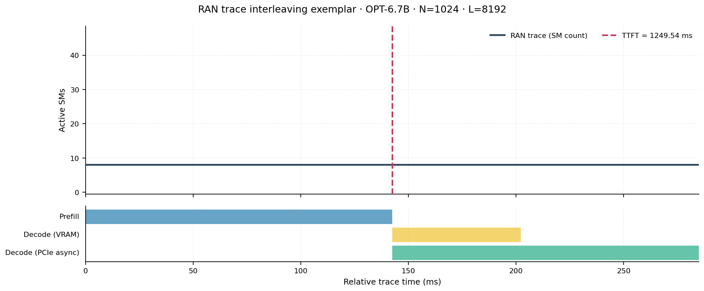
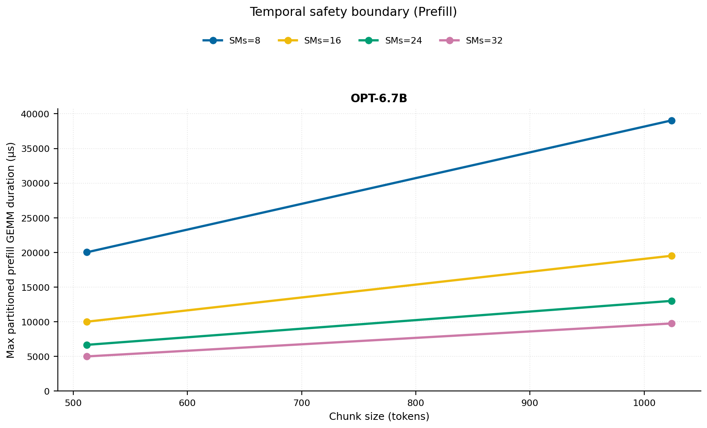
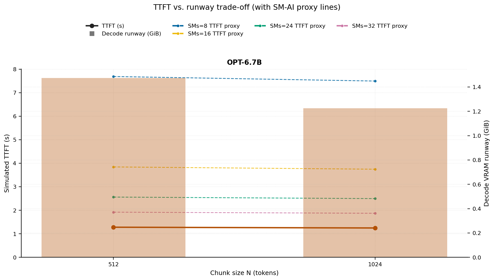
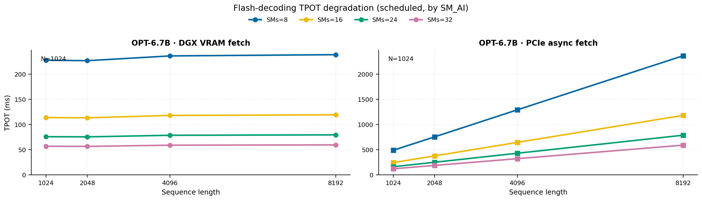
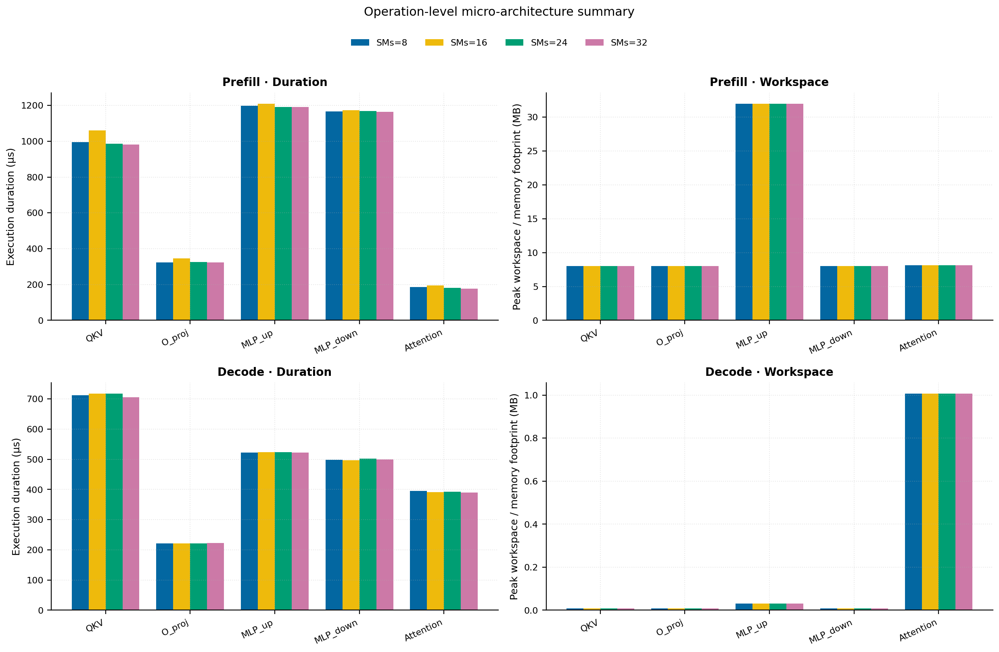
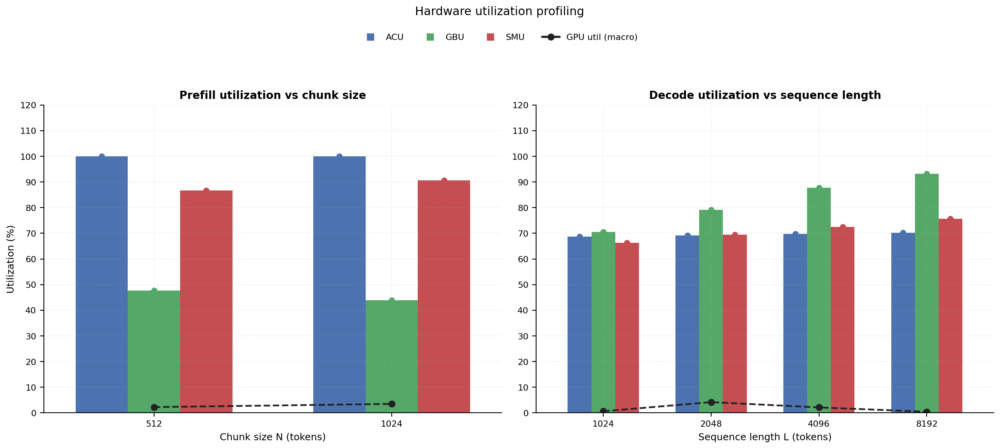
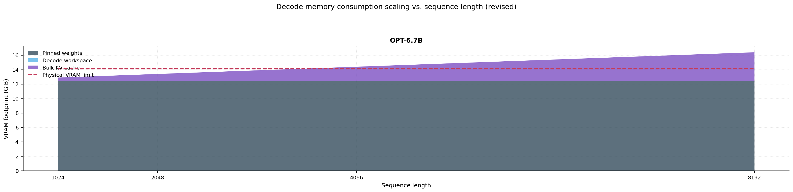

# RAN Inference Profiling Report

Run root: `/mnt/data/dheeraj/dicertation/inference-profile/runs/revised-rerun-20260415-171945-g7-opt67b-c512-1024`

## Environment

| field | value |
| --- | --- |
| cache_root | n/a |
| captured_at | 2026-04-15T16:19:53Z |
| chunk_sizes | [512, 1024] |
| cuda_available | true |
| cuda_device_count | 8 |
| cwd | /mnt/data/dheeraj/dicertation/inference-profile |
| decode_modes | ["vram", "pcie_async"] |
| experiment_type | ran-dgxspark-v1 |
| gpu_id | 7 |
| l_out | 1024 |
| models | ["facebook/opt-6.7b"] |
| platform | Linux-6.8.0-106-generic-x86_64-with-glibc2.35 |
| python_executable | /home/dheeraj/miniconda3/envs/mls/bin/python |
| python_version | 3.11.14 |
| run_root | /mnt/data/dheeraj/dicertation/inference-profile/runs/revised-rerun-20260415-171945-g7-opt67b-c512-1024 |
| scheduler | envelope_v1 |
| schema_version | ran_dgxspark_v1 |
| sequence_lengths | [1024, 2048, 4096, 8192] |
| sm_ai_cap | 32 |
| sm_ai_partition | 100 |
| sm_ai_partitions | [8, 16, 24, 32] |
| stage | profile |
| telemetry_tier | baseline_nvml_pt |
| timed_iterations | 5 |
| torch_available | true |
| torch_version | 2.10.0+cu128 |
| warmup_iterations | 3 |

## Model Constants

| model_id | sm_ai_partition | num_hidden_layers | hidden_size | num_attention_heads | ffn_dim | layer_index | layer_weight_bytes | total_weight_bytes_fp16 | vram_ceiling_bytes |
| --- | --- | --- | --- | --- | --- | --- | --- | --- | --- |
| facebook/opt-6.7b | 100 | 32 | 4096 | 32 | 16384 | 15 | 402759680 | 13316947968 | 15170115993 |

## Trace Inspection

### Primary trace

| field | value |
| --- | --- |
| errors | [] |
| header | ["frame", "slot", "time_slot_sched_ns", "time_decode_start_est_ns", "time_decode_end_est_ns", "time_decode_start_actual_ns", "time_decode_end_actual_ns", "decode_dur_us", "deadline_met", "target_sm", "profile_idx", "sm_count", "num_pusch", "sum_prb", "sum_tbs_bytes", "max_mcs"] |
| median_positive_delta_ms | 5.6997 |
| monotonicity.checked_column | time_slot_sched_ns |
| monotonicity.is_non_decreasing | true |
| monotonicity.negative_delta_count | 0 |
| monotonicity.positive_delta_count | 28377 |
| monotonicity.zero_delta_count | 0 |
| normalization.last_row_duration_policy | median_positive_forward_delta_ms |
| normalization.output_columns | ["time_ms", "sm_utilization", "slot_duration_ms", "source_schema", "sm_count"] |
| normalization.output_relative_path | derived/normalized_ldpc_trace.csv |
| normalized_row_count | 28378 |
| path | /mnt/raid0sata2/netsys/weaver-ext/ran/traces/e2e_2026030418/e2e_20260304_182034_tractor_ran_ctrl/ldpc_trace.csv |
| row_count | 28378 |
| schema_detected | schema_b |
| time_unit_hint | ns |
| usable | true |
| usage_policy | primary_only |
| used_for_scheduler_capacity | true |

### Secondary trace

| field | value |
| --- | --- |
| errors | ["ran_ctrl_trace.csv line 182958 has 9 field(s); expected 12"] |
| header | ["frame", "slot", "sm_available", "prbs_available", "prbs_allocated", "w_avg_mcs_prev", "w_avg_mcs_curr", "slots_since_underutil", "ramp_up_count", "num_ue_sched", "max_ue_backlog", "sum_ue_backlog"] |
| monotonicity.checked_column | n/a |
| monotonicity.is_non_decreasing | n/a |
| monotonicity.negative_delta_count | n/a |
| path | /mnt/raid0sata2/netsys/weaver-ext/ran/traces/e2e_2026030418/e2e_20260304_182034_tractor_ran_ctrl/ran_ctrl_trace.csv |
| row_count | 182956 |
| time_unit_hints | [] |
| usable | false |
| usage_policy | structural_only |
| used_for_scheduler_capacity | false |

## Raw-Profile Summary Tables

### Prefill profile summary

Source raw rows: `raw/prefill_events.csv` = 280. Summary artifact: `derived/prefill_summary.csv`.

| model_id | chunk_tokens | sm_ai_partition | max_input_tokens | prefill_max_gemm_us | prefill_workspace_bytes | prefill_parked_activation_bytes | telemetry_tier | telemetry_provider | telemetry_status | nvml_available | gpu_util | gpu_mem_used_mb | sm_clock_mhz | mem_clock_mhz | power_w | pt_step_ms | pt_mem_alloc_mb | pt_mem_reserved_mb | pt_workspace_mb | acu_pct | gbu_pct | smu_pct | microscopic_telemetry_status | microscopic_error |
| --- | --- | --- | --- | --- | --- | --- | --- | --- | --- | --- | --- | --- | --- | --- | --- | --- | --- | --- | --- | --- | --- | --- | --- | --- |
| facebook/opt-6.7b | 512 | 8 | 1024 | 855.04 | 16777216 | 16777216 | baseline_nvml_pt | nvidia-smi | ok | true | 9 | 109 | 1695 | 7601 | 68.16 | 0.855 | 441.1953 | 441.1953 | 16 | 88.48 | 55 | 74.25 | estimated | n/a |
| facebook/opt-6.7b | 512 | 16 | 1024 | 833.536 | 16777216 | 16777216 | baseline_nvml_pt | nvidia-smi | ok | true | 0 | 109 | 1695 | 8001 | 69.22 | 0.8335 | 441.1953 | 441.1953 | 16 | 96.32 | 50.16 | 82.5 | estimated | n/a |
| facebook/opt-6.7b | 512 | 24 | 1024 | 826.368 | 16777216 | 16777216 | baseline_nvml_pt | nvidia-smi | ok | true | 0 | 109 | 1695 | 7601 | 68.95 | 0.8264 | 441.1953 | 441.1953 | 16 | 100 | 45.32 | 90.75 | estimated | n/a |
| facebook/opt-6.7b | 512 | 32 | 1024 | 834.56 | 16777216 | 16777216 | baseline_nvml_pt | nvidia-smi | ok | true | 0 | 109 | 1695 | 7601 | 69.05 | 0.8346 | 441.1953 | 441.1953 | 16 | 100 | 40.48 | 99 | estimated | n/a |
| facebook/opt-6.7b | 1024 | 8 | 1024 | 1626.848 | 33554432 | 33554432 | baseline_nvml_pt | nvidia-smi | ok | true | 0 | 109 | 1695 | 8001 | 65.67 | 1.6268 | 489.1953 | 489.1953 | 32 | 93.22 | 50.625 | 77.625 | estimated | n/a |
| facebook/opt-6.7b | 1024 | 16 | 1024 | 1647.616 | 33554432 | 33554432 | baseline_nvml_pt | nvidia-smi | ok | true | 7 | 109 | 1695 | 8001 | 74.55 | 1.6476 | 489.1953 | 489.1953 | 32 | 100 | 46.17 | 86.25 | estimated | n/a |
| facebook/opt-6.7b | 1024 | 24 | 1024 | 1640.448 | 33554432 | 33554432 | baseline_nvml_pt | nvidia-smi | ok | true | 0 | 109 | 1695 | 7601 | 74.56 | 1.6404 | 489.1953 | 489.1953 | 32 | 100 | 41.715 | 94.875 | estimated | n/a |
| facebook/opt-6.7b | 1024 | 32 | 1024 | 1627.008 | 33554432 | 33554432 | baseline_nvml_pt | nvidia-smi | ok | true | 7 | 109 | 1695 | 8001 | 74.92 | 1.627 | 489.1953 | 489.1953 | 32 | 100 | 37.26 | 100 | estimated | n/a |

### Decode profile summary

Source raw rows: `raw/decode_events.csv` = 2560. Summary artifact: `derived/decode_summary.csv`.

| model_id | sequence_length | block_size | sm_ai_partition | decode_mode | decode_max_gemv_us | attention_fetch_compute_us | reduction_overhead_us | decode_workspace_bytes | decode_parked_activation_bytes | telemetry_tier | telemetry_provider | telemetry_status | nvml_available | gpu_util | gpu_mem_used_mb | sm_clock_mhz | mem_clock_mhz | power_w | pt_step_ms | pt_mem_alloc_mb | pt_mem_reserved_mb | pt_workspace_mb | acu_pct | gbu_pct | smu_pct | microscopic_telemetry_status | microscopic_error |
| --- | --- | --- | --- | --- | --- | --- | --- | --- | --- | --- | --- | --- | --- | --- | --- | --- | --- | --- | --- | --- | --- | --- | --- | --- | --- | --- | --- |
| facebook/opt-6.7b | 1024 | 512 | 8 | pcie_async | 273.408 | 127.3728 | 22.9568 | 139264 | 8192 | baseline_nvml_pt | nvidia-smi | ok | true | 0 | 109 | 1695 | 7601 | 66.69 | 0.2734 | 408.375 | 408.375 | 0.1328 | 59.89 | 78.735 | 57.23 | estimated | n/a |
| facebook/opt-6.7b | 1024 | 512 | 8 | vram | 273.184 | 132.8448 | 20.1088 | 139264 | 8192 | baseline_nvml_pt | nvidia-smi | ok | true | 1 | 109 | 1695 | 7601 | 66.45 | 0.2732 | 408.375 | 408.375 | 0.1328 | 62.685 | 70.1375 | 59.52 | estimated | n/a |
| facebook/opt-6.7b | 1024 | 512 | 16 | pcie_async | 269.12 | 126.6688 | 20.0704 | 139264 | 8192 | baseline_nvml_pt | nvidia-smi | ok | true | 0 | 109 | 1695 | 7601 | 66.76 | 0.2691 | 408.375 | 408.375 | 0.1328 | 64.66 | 76.02 | 62.08 | estimated | n/a |
| facebook/opt-6.7b | 1024 | 512 | 16 | vram | 274.432 | 127.3728 | 20.0704 | 139264 | 8192 | baseline_nvml_pt | nvidia-smi | ok | true | 0 | 109 | 1695 | 7601 | 66.76 | 0.2744 | 408.375 | 408.375 | 0.1328 | 67.66 | 67.875 | 65.28 | estimated | n/a |
| facebook/opt-6.7b | 1024 | 512 | 24 | pcie_async | 270.336 | 127.3472 | 19.7312 | 139264 | 8192 | baseline_nvml_pt | nvidia-smi | ok | true | 0 | 109 | 1695 | 7601 | 67.01 | 0.2703 | 408.375 | 408.375 | 0.1328 | 69.43 | 73.305 | 66.93 | estimated | n/a |
| facebook/opt-6.7b | 1024 | 512 | 24 | vram | 296.96 | 157.7344 | 22.7328 | 139264 | 8192 | baseline_nvml_pt | nvidia-smi | ok | true | 0 | 109 | 1695 | 8001 | 67.36 | 0.297 | 408.375 | 408.375 | 0.1328 | 72.635 | 65.6125 | 71.04 | estimated | n/a |
| facebook/opt-6.7b | 1024 | 512 | 32 | pcie_async | 273.408 | 168.96 | 23.52 | 139264 | 8192 | baseline_nvml_pt | nvidia-smi | ok | true | 0 | 109 | 1695 | 7601 | 67.22 | 0.2734 | 408.375 | 408.375 | 0.1328 | 74.2 | 70.59 | 71.78 | estimated | n/a |
| facebook/opt-6.7b | 1024 | 512 | 32 | vram | 271.2 | 138.1056 | 21.6832 | 139264 | 8192 | baseline_nvml_pt | nvidia-smi | ok | true | 0 | 109 | 1695 | 7601 | 67.2 | 0.2712 | 408.375 | 408.375 | 0.1328 | 77.61 | 63.35 | 76.8 | estimated | n/a |
| facebook/opt-6.7b | 1024 | 1024 | 8 | pcie_async | 271.36 | 163.1744 | 21.1456 | 139264 | 8192 | baseline_nvml_pt | nvidia-smi | ok | true | 0 | 109 | 1695 | 7601 | 67.27 | 0.2835 | 408.375 | 408.375 | 0.1328 | 59.89 | 78.3 | 57.23 | estimated | n/a |
| facebook/opt-6.7b | 1024 | 1024 | 8 | vram | 270.336 | 136.6336 | 58.1568 | 139264 | 8192 | baseline_nvml_pt | nvidia-smi | ok | true | 0 | 109 | 1695 | 7601 | 67.21 | 0.2703 | 408.375 | 408.375 | 0.1328 | 63 | 69.75 | 59.52 | estimated | n/a |
| facebook/opt-6.7b | 1024 | 1024 | 16 | pcie_async | 274.368 | 128 | 19.4368 | 139264 | 8192 | baseline_nvml_pt | nvidia-smi | ok | true | 1 | 109 | 1695 | 7601 | 67.41 | 0.2744 | 408.375 | 408.375 | 0.1328 | 64.66 | 75.6 | 62.08 | estimated | n/a |
| facebook/opt-6.7b | 1024 | 1024 | 16 | vram | 282.624 | 132.032 | 21.44 | 139264 | 8192 | baseline_nvml_pt | nvidia-smi | ok | true | 0 | 109 | 1695 | 7601 | 67.44 | 0.2826 | 408.375 | 408.375 | 0.1328 | 68 | 67.5 | 65.28 | estimated | n/a |
| facebook/opt-6.7b | 1024 | 1024 | 24 | pcie_async | 277.44 | 128.256 | 22.4576 | 139264 | 8192 | baseline_nvml_pt | nvidia-smi | ok | true | 0 | 109 | 1695 | 8001 | 67.65 | 0.2774 | 408.375 | 408.375 | 0.1328 | 69.43 | 72.9 | 66.93 | estimated | n/a |
| facebook/opt-6.7b | 1024 | 1024 | 24 | vram | 266.24 | 143.7824 | 21.0496 | 139264 | 8192 | baseline_nvml_pt | nvidia-smi | ok | true | 0 | 109 | 1695 | 8001 | 67.67 | 0.2662 | 408.375 | 408.375 | 0.1328 | 73 | 65.25 | 71.04 | estimated | n/a |
| facebook/opt-6.7b | 1024 | 1024 | 32 | pcie_async | 268.064 | 125.3376 | 21.9392 | 139264 | 8192 | baseline_nvml_pt | nvidia-smi | ok | true | 8 | 109 | 1695 | 8001 | 68.04 | 0.2681 | 408.375 | 408.375 | 0.1328 | 74.2 | 70.2 | 71.78 | estimated | n/a |
| facebook/opt-6.7b | 1024 | 1024 | 32 | vram | 272.288 | 126.9952 | 19.8656 | 139264 | 8192 | baseline_nvml_pt | nvidia-smi | ok | true | 0 | 109 | 1695 | 7601 | 67.75 | 0.2723 | 408.375 | 408.375 | 0.1328 | 78 | 63 | 76.8 | estimated | n/a |
| facebook/opt-6.7b | 2048 | 512 | 8 | pcie_async | 267.264 | 132.9024 | 19.8144 | 270336 | 8192 | baseline_nvml_pt | nvidia-smi | ok | true | 0 | 109 | 1695 | 7601 | 67.98 | 0.2673 | 424.5 | 424.5 | 0.2578 | 58.3833 | 89.465 | 59.3933 | estimated | n/a |
| facebook/opt-6.7b | 2048 | 512 | 8 | vram | 269.312 | 137.8496 | 20.8576 | 270336 | 8192 | baseline_nvml_pt | nvidia-smi | ok | true | 22 | 109 | 1695 | 7601 | 67.58 | 0.2693 | 424.5 | 424.5 | 0.2578 | 64.995 | 76.8542 | 62.62 | estimated | n/a |
| facebook/opt-6.7b | 2048 | 512 | 16 | pcie_async | 276.48 | 133.5296 | 19.6544 | 270336 | 8192 | baseline_nvml_pt | nvidia-smi | ok | true | 8 | 109 | 1695 | 8001 | 68.14 | 0.2765 | 424.5 | 424.5 | 0.2578 | 63.0333 | 86.38 | 64.4267 | estimated | n/a |
| facebook/opt-6.7b | 2048 | 512 | 16 | vram | 275.616 | 135.5968 | 19.5456 | 270336 | 8192 | baseline_nvml_pt | nvidia-smi | ok | true | 0 | 109 | 1695 | 7601 | 67.49 | 0.2756 | 424.5 | 424.5 | 0.2578 | 70.1533 | 74.375 | 68.68 | estimated | n/a |
| facebook/opt-6.7b | 2048 | 512 | 24 | pcie_async | 269.152 | 136.6016 | 20.2688 | 270336 | 8192 | baseline_nvml_pt | nvidia-smi | ok | true | 0 | 109 | 1695 | 8001 | 68.3 | 0.2692 | 424.5 | 424.5 | 0.2578 | 67.6833 | 83.295 | 69.46 | estimated | n/a |
| facebook/opt-6.7b | 2048 | 512 | 24 | vram | 271.36 | 136.5568 | 20.0704 | 270336 | 8192 | baseline_nvml_pt | nvidia-smi | ok | true | 14 | 109 | 1695 | 7601 | 67.63 | 0.2714 | 424.5 | 424.5 | 0.2578 | 75.3117 | 71.8958 | 74.74 | estimated | n/a |
| facebook/opt-6.7b | 2048 | 512 | 32 | pcie_async | 279.552 | 135.1168 | 22.1504 | 270336 | 8192 | baseline_nvml_pt | nvidia-smi | ok | true | 7 | 109 | 1695 | 7601 | 67.99 | 0.2796 | 424.5 | 424.5 | 0.2578 | 72.3333 | 80.21 | 74.4933 | estimated | n/a |
| facebook/opt-6.7b | 2048 | 512 | 32 | vram | 272.256 | 138.4448 | 22.2912 | 270336 | 8192 | baseline_nvml_pt | nvidia-smi | ok | true | 0 | 109 | 1695 | 7601 | 67.72 | 0.2723 | 424.5 | 424.5 | 0.2578 | 80.47 | 69.4167 | 80.8 | estimated | n/a |
| facebook/opt-6.7b | 2048 | 1024 | 8 | pcie_async | 270.144 | 132.4736 | 20.5248 | 270336 | 8192 | baseline_nvml_pt | nvidia-smi | ok | true | 0 | 109 | 1695 | 8001 | 68.34 | 0.2701 | 424.5 | 424.5 | 0.2578 | 58.3833 | 89.9 | 59.59 | estimated | n/a |
| facebook/opt-6.7b | 2048 | 1024 | 8 | vram | 272.64 | 134.7328 | 19.6736 | 270336 | 8192 | baseline_nvml_pt | nvidia-smi | ok | true | 0 | 109 | 1695 | 7601 | 67.8 | 0.2726 | 424.5 | 424.5 | 0.2578 | 65.52 | 76.9833 | 62.8267 | estimated | n/a |
| facebook/opt-6.7b | 2048 | 1024 | 16 | pcie_async | 265.216 | 137.2992 | 20.4864 | 270336 | 8192 | baseline_nvml_pt | nvidia-smi | ok | true | 9 | 109 | 1695 | 7601 | 67.89 | 0.2652 | 424.5 | 424.5 | 0.2578 | 63.0333 | 86.8 | 64.64 | estimated | n/a |
| facebook/opt-6.7b | 2048 | 1024 | 16 | vram | 267.104 | 127.9616 | 19.4304 | 270336 | 8192 | baseline_nvml_pt | nvidia-smi | ok | true | 0 | 109 | 1695 | 8001 | 68.22 | 0.2671 | 424.5 | 424.5 | 0.2578 | 70.72 | 74.5 | 68.9067 | estimated | n/a |
| facebook/opt-6.7b | 2048 | 1024 | 24 | pcie_async | 389.248 | 134.1312 | 21.0944 | 270336 | 8192 | baseline_nvml_pt | nvidia-smi | ok | true | 7 | 109 | 1695 | 8001 | 68.12 | 0.3892 | 424.5 | 424.5 | 0.2578 | 67.6833 | 83.7 | 69.69 | estimated | n/a |
| facebook/opt-6.7b | 2048 | 1024 | 24 | vram | 374.496 | 133.0816 | 20.5184 | 270336 | 8192 | baseline_nvml_pt | nvidia-smi | ok | true | 0 | 109 | 1695 | 8001 | 68.41 | 0.3745 | 424.5 | 424.5 | 0.2578 | 75.92 | 72.0167 | 74.9867 | estimated | n/a |
| facebook/opt-6.7b | 2048 | 1024 | 32 | pcie_async | 269.312 | 132.4864 | 20.9216 | 270336 | 8192 | baseline_nvml_pt | nvidia-smi | ok | true | 0 | 109 | 1695 | 7601 | 67.91 | 0.2693 | 424.5 | 424.5 | 0.2578 | 72.3333 | 80.6 | 74.74 | estimated | n/a |
| facebook/opt-6.7b | 2048 | 1024 | 32 | vram | 270.08 | 132.7104 | 19.6352 | 270336 | 8192 | baseline_nvml_pt | nvidia-smi | ok | true | 0 | 109 | 1695 | 8001 | 68.2 | 0.2701 | 424.5 | 424.5 | 0.2578 | 81.12 | 69.5333 | 81.0667 | estimated | n/a |
| facebook/opt-6.7b | 4096 | 512 | 8 | pcie_async | 273.184 | 171.8016 | 22.1824 | 532480 | 8192 | baseline_nvml_pt | nvidia-smi | ok | true | 0 | 109 | 1695 | 7601 | 67.79 | 0.2732 | 456.75 | 456.75 | 0.5078 | 56.8767 | 100 | 61.5567 | estimated | n/a |
| facebook/opt-6.7b | 4096 | 512 | 8 | vram | 281.568 | 160.9088 | 21.4592 | 532480 | 8192 | baseline_nvml_pt | nvidia-smi | ok | true | 0 | 109 | 1695 | 7601 | 67.88 | 0.2816 | 456.75 | 456.75 | 0.5078 | 67.305 | 83.5708 | 65.72 | estimated | n/a |
| facebook/opt-6.7b | 4096 | 512 | 16 | pcie_async | 357.376 | 170.9888 | 21.8048 | 532480 | 8192 | baseline_nvml_pt | nvidia-smi | ok | true | 0 | 109 | 1695 | 8001 | 68.12 | 0.3574 | 456.75 | 456.75 | 0.5078 | 61.4067 | 96.74 | 66.7733 | estimated | n/a |
| facebook/opt-6.7b | 4096 | 512 | 16 | vram | 271.36 | 209.2416 | 21.0752 | 532480 | 8192 | baseline_nvml_pt | nvidia-smi | ok | true | 7 | 109 | 1695 | 8001 | 68.39 | 0.4155 | 456.75 | 456.75 | 0.5078 | 72.6467 | 80.875 | 72.08 | estimated | n/a |
| facebook/opt-6.7b | 4096 | 512 | 24 | pcie_async | 273.408 | 159.1104 | 19.0976 | 532480 | 8192 | baseline_nvml_pt | nvidia-smi | ok | true | 2 | 109 | 1695 | 7601 | 68.18 | 0.2734 | 456.75 | 456.75 | 0.5078 | 65.9367 | 93.285 | 71.99 | estimated | n/a |
| facebook/opt-6.7b | 4096 | 512 | 24 | vram | 268.16 | 161.28 | 20.0064 | 532480 | 8192 | baseline_nvml_pt | nvidia-smi | ok | true | 0 | 109 | 1695 | 8001 | 68.31 | 0.2682 | 456.75 | 456.75 | 0.5078 | 77.9883 | 78.1792 | 78.44 | estimated | n/a |
| facebook/opt-6.7b | 4096 | 512 | 32 | pcie_async | 266.24 | 164.864 | 20.1408 | 532480 | 8192 | baseline_nvml_pt | nvidia-smi | ok | true | 0 | 109 | 1695 | 7601 | 67.65 | 0.2662 | 456.75 | 456.75 | 0.5078 | 70.4667 | 89.83 | 77.2067 | estimated | n/a |
| facebook/opt-6.7b | 4096 | 512 | 32 | vram | 270.336 | 158.0992 | 21.472 | 532480 | 8192 | baseline_nvml_pt | nvidia-smi | ok | true | 0 | 109 | 1695 | 7601 | 67.82 | 0.2703 | 456.75 | 456.75 | 0.5078 | 83.33 | 75.4833 | 84.8 | estimated | n/a |
| facebook/opt-6.7b | 4096 | 1024 | 8 | pcie_async | 269.312 | 163.4432 | 19.392 | 532480 | 8192 | baseline_nvml_pt | nvidia-smi | ok | true | 0 | 109 | 1695 | 7601 | 68.24 | 0.2693 | 456.75 | 456.75 | 0.5078 | 56.8767 | 100 | 61.95 | estimated | n/a |
| facebook/opt-6.7b | 4096 | 1024 | 8 | vram | 266.24 | 156.832 | 20.6784 | 532480 | 8192 | baseline_nvml_pt | nvidia-smi | ok | true | 7 | 109 | 1695 | 8001 | 68.18 | 0.2662 | 456.75 | 456.75 | 0.5078 | 68.04 | 84.2167 | 66.1333 | estimated | n/a |
| facebook/opt-6.7b | 4096 | 1024 | 16 | pcie_async | 268.288 | 157.056 | 19.0656 | 532480 | 8192 | baseline_nvml_pt | nvidia-smi | ok | true | 0 | 109 | 1695 | 7601 | 68.32 | 0.2683 | 456.75 | 456.75 | 0.5078 | 61.4067 | 98 | 67.2 | estimated | n/a |
| facebook/opt-6.7b | 4096 | 1024 | 16 | vram | 272.384 | 163.872 | 22.0992 | 532480 | 8192 | baseline_nvml_pt | nvidia-smi | ok | true | 7 | 109 | 1695 | 8001 | 68.28 | 0.2724 | 456.75 | 456.75 | 0.5078 | 73.44 | 81.5 | 72.5333 | estimated | n/a |
| facebook/opt-6.7b | 4096 | 1024 | 24 | pcie_async | 273.312 | 159.7376 | 19.872 | 532480 | 8192 | baseline_nvml_pt | nvidia-smi | ok | true | 0 | 109 | 1695 | 7601 | 68.08 | 0.2733 | 456.75 | 456.75 | 0.5078 | 65.9367 | 94.5 | 72.45 | estimated | n/a |
| facebook/opt-6.7b | 4096 | 1024 | 24 | vram | 277.504 | 193.1008 | 21.9136 | 532480 | 8192 | baseline_nvml_pt | nvidia-smi | ok | true | 11 | 109 | 1695 | 7601 | 67.81 | 0.2775 | 456.75 | 456.75 | 0.5078 | 78.84 | 78.7833 | 78.9333 | estimated | n/a |
| facebook/opt-6.7b | 4096 | 1024 | 32 | pcie_async | 274.432 | 163.008 | 19.8656 | 532480 | 8192 | baseline_nvml_pt | nvidia-smi | ok | true | 0 | 109 | 1695 | 7601 | 68 | 0.2744 | 456.75 | 456.75 | 0.5078 | 70.4667 | 91 | 77.7 | estimated | n/a |
| facebook/opt-6.7b | 4096 | 1024 | 32 | vram | 277.504 | 161.12 | 20.576 | 532480 | 8192 | baseline_nvml_pt | nvidia-smi | ok | true | 0 | 109 | 1695 | 8001 | 68.26 | 0.2775 | 456.75 | 456.75 | 0.5078 | 84.24 | 76.0667 | 85.3333 | estimated | n/a |
| facebook/opt-6.7b | 8192 | 512 | 8 | pcie_async | 273.408 | 257.8432 | 20.2944 | 1056768 | 8192 | baseline_nvml_pt | nvidia-smi | ok | true | 0 | 109 | 1695 | 8001 | 68.34 | 0.2734 | 521.25 | 521.25 | 1.0078 | 55.37 | 100 | 63.72 | estimated | n/a |
| facebook/opt-6.7b | 8192 | 512 | 8 | vram | 276.48 | 258.048 | 20.9344 | 1056768 | 8192 | baseline_nvml_pt | nvidia-smi | ok | true | 0 | 109 | 1695 | 7601 | 68.38 | 0.2765 | 521.25 | 521.25 | 1.0078 | 69.615 | 90.2875 | 68.82 | estimated | n/a |
| facebook/opt-6.7b | 8192 | 512 | 16 | pcie_async | 278.528 | 277.0944 | 22.7456 | 1056768 | 8192 | baseline_nvml_pt | nvidia-smi | ok | true | 0 | 109 | 1695 | 7601 | 68.31 | 0.3287 | 521.25 | 521.25 | 1.0078 | 59.78 | 100 | 69.12 | estimated | n/a |
| facebook/opt-6.7b | 8192 | 512 | 16 | vram | 274.304 | 257.6192 | 20.5056 | 1056768 | 8192 | baseline_nvml_pt | nvidia-smi | ok | true | 0 | 109 | 1695 | 7601 | 68.31 | 0.2743 | 521.25 | 521.25 | 1.0078 | 75.14 | 87.375 | 75.48 | estimated | n/a |
| facebook/opt-6.7b | 8192 | 512 | 24 | pcie_async | 266.24 | 256.1984 | 20.2112 | 1056768 | 8192 | baseline_nvml_pt | nvidia-smi | ok | true | 0 | 109 | 1695 | 7601 | 68.21 | 0.2662 | 521.25 | 521.25 | 1.0078 | 64.19 | 100 | 74.52 | estimated | n/a |
| facebook/opt-6.7b | 8192 | 512 | 24 | vram | 265.216 | 256.736 | 20.6976 | 1056768 | 8192 | baseline_nvml_pt | nvidia-smi | ok | true | 0 | 109 | 1695 | 7601 | 68.34 | 0.2652 | 521.25 | 521.25 | 1.0078 | 80.665 | 84.4625 | 82.14 | estimated | n/a |
| facebook/opt-6.7b | 8192 | 512 | 32 | pcie_async | 342.016 | 256.3584 | 19.1232 | 1056768 | 8192 | baseline_nvml_pt | nvidia-smi | ok | true | 0 | 109 | 1695 | 7601 | 68.39 | 0.342 | 521.25 | 521.25 | 1.0078 | 68.6 | 99.45 | 79.92 | estimated | n/a |
| facebook/opt-6.7b | 8192 | 512 | 32 | vram | 272.384 | 270.176 | 22.912 | 1056768 | 8192 | baseline_nvml_pt | nvidia-smi | ok | true | 0 | 109 | 1695 | 7601 | 68.18 | 0.3021 | 521.25 | 521.25 | 1.0078 | 86.19 | 81.55 | 88.8 | estimated | n/a |
| facebook/opt-6.7b | 8192 | 1024 | 8 | pcie_async | 273.408 | 264.1984 | 22.4768 | 1056768 | 8192 | baseline_nvml_pt | nvidia-smi | ok | true | 0 | 109 | 1695 | 7601 | 68.22 | 0.2877 | 521.25 | 521.25 | 1.0078 | 55.37 | 100 | 64.31 | estimated | n/a |
| facebook/opt-6.7b | 8192 | 1024 | 8 | vram | 268.288 | 256.9664 | 19.872 | 1056768 | 8192 | baseline_nvml_pt | nvidia-smi | ok | true | 0 | 109 | 1695 | 7601 | 68.59 | 0.2683 | 521.25 | 521.25 | 1.0078 | 70.56 | 91.45 | 69.44 | estimated | n/a |
| facebook/opt-6.7b | 8192 | 1024 | 16 | pcie_async | 270.144 | 256.544 | 20.4288 | 1056768 | 8192 | baseline_nvml_pt | nvidia-smi | ok | true | 0 | 109 | 1695 | 7601 | 68.1 | 0.2701 | 521.25 | 521.25 | 1.0078 | 59.78 | 100 | 69.76 | estimated | n/a |
| facebook/opt-6.7b | 8192 | 1024 | 16 | vram | 272.384 | 260.0256 | 19.4624 | 1056768 | 8192 | baseline_nvml_pt | nvidia-smi | ok | true | 0 | 109 | 1695 | 7601 | 68.08 | 0.2734 | 521.25 | 521.25 | 1.0078 | 76.16 | 88.5 | 76.16 | estimated | n/a |
| facebook/opt-6.7b | 8192 | 1024 | 24 | pcie_async | 271.36 | 256.448 | 20.2944 | 1056768 | 8192 | baseline_nvml_pt | nvidia-smi | ok | true | 0 | 109 | 1695 | 7601 | 68.3 | 0.2714 | 521.25 | 521.25 | 1.0078 | 64.19 | 100 | 75.21 | estimated | n/a |
| facebook/opt-6.7b | 8192 | 1024 | 24 | vram | 278.528 | 266.6048 | 20.832 | 1056768 | 8192 | baseline_nvml_pt | nvidia-smi | ok | true | 0 | 109 | 1695 | 7601 | 68.4 | 0.2844 | 521.25 | 521.25 | 1.0078 | 81.76 | 85.55 | 82.88 | estimated | n/a |
| facebook/opt-6.7b | 8192 | 1024 | 32 | pcie_async | 275.456 | 258.8416 | 19.8144 | 1056768 | 8192 | baseline_nvml_pt | nvidia-smi | ok | true | 7 | 109 | 1695 | 7601 | 68.22 | 0.2755 | 521.25 | 521.25 | 1.0078 | 68.6 | 100 | 80.66 | estimated | n/a |
| facebook/opt-6.7b | 8192 | 1024 | 32 | vram | 265.024 | 256.1472 | 19.7056 | 1056768 | 8192 | baseline_nvml_pt | nvidia-smi | ok | true | 0 | 109 | 1695 | 8001 | 68.62 | 0.265 | 521.25 | 521.25 | 1.0078 | 87.36 | 82.6 | 89.6 | estimated | n/a |

### PCIe profile summary

Source raw rows: `raw/pcie_events.csv` = 10. Summary artifact: `derived/pcie_summary.csv`.

| model_id | block_size | kv_block_bytes | transfer_only_us | overlap_total_us | dummy_compute_us | exposed_transfer_us | effective_gbps | overlap_status | telemetry_tier | telemetry_provider | telemetry_status | nvml_available | gpu_util | gpu_mem_used_mb | sm_clock_mhz | mem_clock_mhz | power_w | pt_step_ms | pt_mem_alloc_mb | pt_mem_reserved_mb | pt_workspace_mb | acu_pct | gbu_pct | smu_pct | microscopic_telemetry_status | microscopic_error |
| --- | --- | --- | --- | --- | --- | --- | --- | --- | --- | --- | --- | --- | --- | --- | --- | --- | --- | --- | --- | --- | --- | --- | --- | --- | --- | --- |
| facebook/opt-6.7b | 512 | 8388608 | 724.1856 | 30929.3187 | 30495.1283 | 434.1903 | 11.5835 | measured | baseline_nvml_pt | nvidia-smi | partial | true | 0 | 109 | 1695 | 7601 | 68 | n/a | n/a | n/a | n/a | 65 | 65 | 65 | estimated | n/a |
| facebook/opt-6.7b | 1024 | 16777216 | 3864.9088 | 50292.7181 | 48222.7 | 2070.0181 | 4.3409 | measured | baseline_nvml_pt | nvidia-smi | partial | true | 0 | 109 | 1695 | 7601 | 67.76 | n/a | n/a | n/a | n/a | 65 | 65 | 65 | estimated | n/a |

## SLA Tables

### Successful configurations

| model_id | chunk_tokens | sequence_length | ttft_ms | tpot_ms_vram | tpot_ms_pcie_async | decode_runway_tokens | status |
| --- | --- | --- | --- | --- | --- | --- | --- |
| facebook/opt-6.7b | 512 | 1024 | 1281.8841 | 57.1836 | 86.4419 | 3022 | success |
| facebook/opt-6.7b | 512 | 2048 | 1281.8841 | 57.4167 | 114.2829 | 3022 | success |
| facebook/opt-6.7b | 512 | 4096 | 1281.8841 | 57.6508 | 168.191 | 3021 | success |
| facebook/opt-6.7b | 512 | 8192 | 1281.8841 | 61.6765 | 296.7879 | 3020 | success |
| facebook/opt-6.7b | 1024 | 1024 | 1249.5421 | 56.9788 | 122.4217 | 2510 | success |
| facebook/opt-6.7b | 1024 | 2048 | 1249.5421 | 56.7304 | 189.0981 | 2510 | success |
| facebook/opt-6.7b | 1024 | 4096 | 1249.5421 | 59.095 | 323.5052 | 2509 | success |
| facebook/opt-6.7b | 1024 | 8192 | 1249.5421 | 59.7119 | 591.7292 | 2508 | success |

### Failed configurations

No rows available.

## Per-Model Scaling Analysis

| model_id | successful_configs | failed_configs | chunk_tokens_tested | sequence_lengths_tested | largest_successful_chunk_tokens | ttft_ms_min | ttft_ms_max | tpot_ms_vram_min | tpot_ms_vram_max | tpot_ms_pcie_async_min | tpot_ms_pcie_async_max | max_decode_runway_tokens |
| --- | --- | --- | --- | --- | --- | --- | --- | --- | --- | --- | --- | --- |
| facebook/opt-6.7b | 8 | 0 | 512, 1024 | 1024, 2048, 4096, 8192 | 1024 | 1249.5421 | 1281.8841 | 56.7304 | 61.6765 | 86.4419 | 591.7292 | 3022 |

## Plots

### Revised 01 Ran Trace Interleaving

[Interactive companion](plots/revised_01_ran_trace_interleaving_interactive.html)

### Revised 02 Prefill Safety Boundary

### Revised 03 Prefill Vram Composition

### Revised 04 Ttft Vs Runway

### Revised 05 Decode Tpot Degradation

### Revised 06 Operation Level Microarchitecture Summary

### Revised 07 Hardware Utilization Profiling

### Revised 08 Decode Memory Consumption

### 09 Spatial VRAM Composition (Prefill) · Pie View

