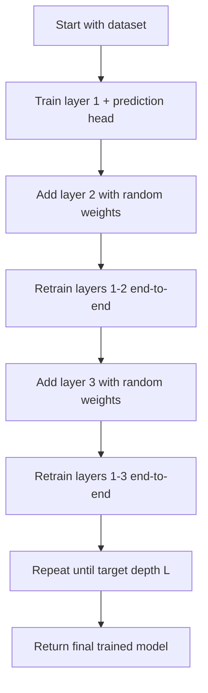

# Progressive Layer-wise Expansion Training

## Overview

**Progressive Layer-wise Expansion Training** is a proposed neural network training mechanism in which a deep model is trained incrementally by adding one layer at a time.

Instead of initializing and training the entire deep neural network from scratch, the model begins as a shallow network. After the shallow network is trained, a new layer is added with random initialization, and the expanded network is retrained end-to-end. This process continues until the desired depth is reached.

The final architecture may be the same as a conventionally trained deep neural network, but the training trajectory is different.

## Core Idea

In standard deep neural network training, all layers are defined and initialized before training begins:

```text
Initialize all layers → Train full model end-to-end
```

In the proposed method, the model grows progressively:

```text
Train shallow model → Add new layer → Retrain expanded model → Repeat
```

For example, consider a neural network with five layers. Training would proceed as follows:

1. Train a one-layer model on the full dataset.
2. Save the learned weights of the first layer.
3. Add a second layer with random initialization.
4. Retrain both the first and second layers end-to-end.
5. Add a third layer with random initialization.
6. Retrain layers one through three end-to-end.
7. Continue this process until all five layers are included.

## Formal Definition

Let the target deep neural network consist of \(L\) layers:

\[
f_L(x) = h_L \circ h_{L-1} \circ \dots \circ h_1(x)
\]

where each \(h_i\) represents a learnable layer.

In conventional training, all layers \(h_1, h_2, \dots, h_L\) are initialized at once, and the full network is optimized from the beginning.

In Progressive Layer-wise Expansion Training, training proceeds in stages. At stage \(k\), the model contains only the first \(k\) layers:

\[
f_k(x) = c_k \circ h_k \circ h_{k-1} \circ \dots \circ h_1(x)
\]

where \(c_k\) is a prediction head used to compute the supervised loss at that stage.

The training objective at stage \(k\) is:

\[
\min_{\theta_1, \dots, \theta_k, \phi_k}
\frac{1}{N}
\sum_{i=1}^{N}
\mathcal{L}(f_k(x_i), y_i)
\]

where:

- \(\theta_j\) are the parameters of layer \(h_j\),
- \(\phi_k\) are the parameters of the prediction head,
- \(\mathcal{L}\) is the task loss,
- \((x_i, y_i)\) are training samples.

After stage \(k\) converges, a new layer \(h_{k+1}\) is added with random initialization. The previously trained layers are reused as initialization, and the expanded model is retrained end-to-end.

## Algorithm

```text
Input:
    Dataset D
    Target depth L
    Loss function L_task

Initialize an empty model.

For k = 1 to L:
    Add layer h_k with random initialization.
    Attach or update prediction head c_k.
    Initialize previous layers using weights learned from stage k - 1.
    Train the current k-layer model end-to-end on D.
    Save the learned parameters.

Return the final L-layer model.
```

## Training Workflow



## Motivation

Deep neural networks can be difficult to optimize because all layers are randomly initialized simultaneously. The optimizer must learn low-level and high-level representations at the same time, which can lead to unstable training, sensitivity to initialization, or inefficient convergence.

Progressive Layer-wise Expansion Training aims to reduce this optimization difficulty by first learning useful shallow representations, then gradually increasing model depth. Each newly added layer is trained in the context of already learned representations, while earlier layers remain trainable and can adapt to the expanded architecture.

This makes the method similar to a curriculum, but instead of changing the difficulty of the data, it changes the complexity of the model.

## Research Hypothesis

The central hypothesis is:

> Incrementally increasing network depth during training improves optimization stability and generalization by allowing early layers to learn useful representations before being adapted to deeper hierarchical transformations.

A more experimental version of the hypothesis is:

> Progressive Layer-wise Expansion Training may improve convergence speed, reduce sensitivity to initialization, and improve final performance compared with training the full-depth model from scratch.

## Relationship to Existing Ideas

This method is related to several existing training strategies, but it has a distinct formulation.

| Related idea | Similarity | Difference |
|---|---|---|
| Greedy layer-wise pretraining | Trains networks layer by layer | Often freezes layers or uses unsupervised objectives such as autoencoders or RBMs |
| Curriculum learning | Introduces training difficulty progressively | Usually changes the data, while this method changes model depth |
| Progressive growing | Gradually increases model capacity | Commonly used in generative models; this idea applies more generally to supervised DNN training |
| Fine-tuning | Reuses learned weights | This method repeatedly expands and retrains the network during initial training |

## Possible Advantages

Potential advantages include:

- More stable optimization.
- Better initialization for deeper models.
- Reduced sensitivity to random initialization.
- Improved feature reuse across training stages.
- A smoother optimization path from shallow to deep architectures.

## Possible Challenges

Potential challenges include:

- Increased total training cost, since the dataset is used repeatedly at each stage.
- Risk of early layers overfitting before deeper layers are introduced.
- Need to define how long each stage should train.
- Need to decide whether prediction heads should be temporary or reused.
- Possible mismatch between features learned by shallow models and features needed by deeper models.

## Experimental Evaluation Plan

A simple experiment could compare three training strategies:

1. Standard full-depth training from random initialization.
2. Progressive Layer-wise Expansion Training.
3. Progressive training with earlier layers frozen after each stage.

Useful evaluation metrics would include:

- Final validation accuracy or loss.
- Training convergence speed.
- Sensitivity to random seeds.
- Generalization gap between training and validation performance.
- Computational cost measured in total training time or number of optimization steps.

## Summary

Progressive Layer-wise Expansion Training is a training mechanism where a deep neural network is constructed and optimized gradually. The model begins shallow, learns an initial representation, then grows deeper by adding randomly initialized layers one at a time. After each new layer is added, the entire current network is retrained end-to-end.

The main idea is to guide optimization through a sequence of simpler models before reaching the final deep architecture. This may help stabilize training and improve the quality of learned representations, although it requires empirical validation against standard end-to-end training.
